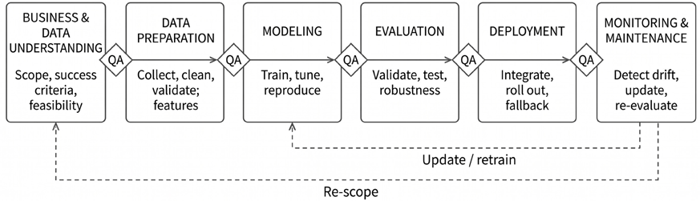
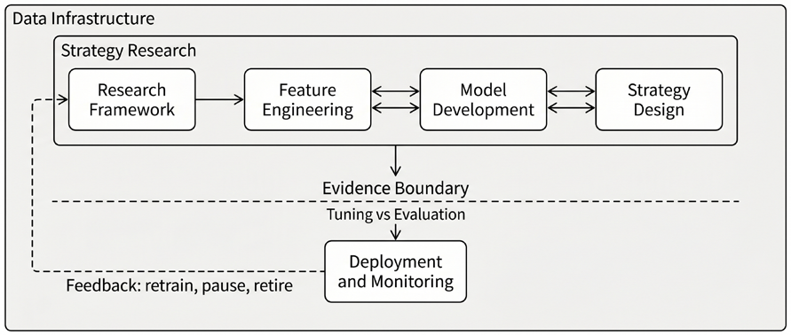
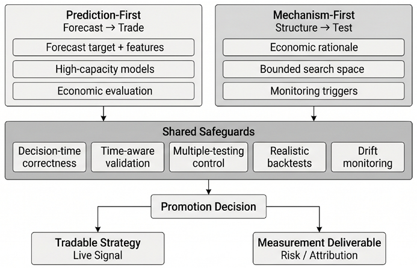
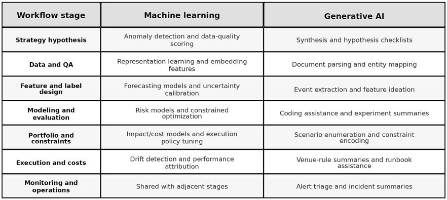
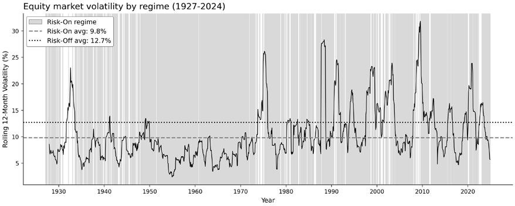
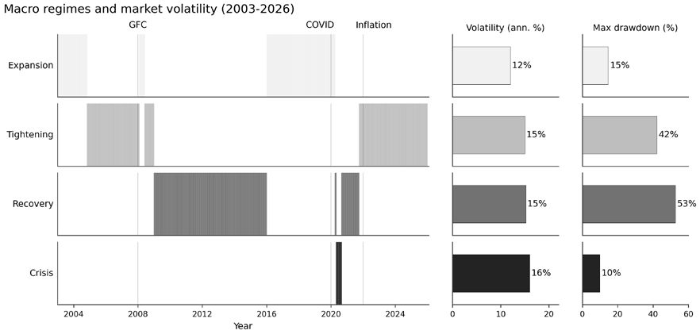

# Chapter 1: The Process Is Your Edge

**Machine learning** (**ML**) now reaches every stage of systematic trading, from feature engineering and portfolio construction to execution and monitoring. However, the fundamental challenge remains unchanged: markets are dynamic, competitive, and unforgiving of undisciplined research.

The ML4T Workflow aims to help you meet that challenge as a systematic process for generating, testing, and deploying strategies that adapt to evolving markets. The workflow draws from quantitative finance practice, industrial ML deployment frameworks, and lessons repeatedly learned through market regime shifts.

By the end of this chapter, you will be able to:

- Distinguish structural breaks, regimes, and drift, and explain why static trading models degrade.
- Understand the ML4T Workflow, with its foundation layer (data infrastructure) and iterative research modules (scoping, features, modeling, strategy, deployment), and how each module’s artifacts flow into the next.
- Explain the evidence boundary that separates exploration from confirmation, and how logging trials and selection-adjusted inference maintain research integrity.
- Recognize where modern tools like *causal inference* and *generative AI* fit within a disciplined workflow.
- Apply *regime thinking* to diagnose strategy vulnerabilities across different market states.

The chapter is grounded in process discipline, followed by a vocabulary for market change, the workflow’s structure, the place of causal inference and generative AI within it, regime change as an engineering constraint, and the contrast between institutional and independent contexts, before closing with takeaways.

## 1.1 Why process discipline matters

Financial markets exact a high price for undisciplined inference. They also expose every weakness in a research workflow: an unquestioning reliance on unstable relationships or small, noisy effects, and insufficient consideration of real-world frictions such as liquidity, trading costs, execution timing, and capacity constraints. These challenges are not new, but three developments have increased the value of process discipline relative to model sophistication:

- **Market behavior changes** - sometimes abruptly and sometimes gradually - so assumptions that are held in one period can fail in the next
- **Modeling capacity has grown**, increasing the degrees of freedom available to the researcher and making overfitting easier to produce and harder to diagnose
- **Tooling has accelerated research**, amplifying both good practices (faster iteration, better monitoring) and bad ones (faster data mining, faster deployment of brittle systems)

Recent disruptions did not create these dynamics; they made their consequences more visible. Our core claim is that **durable performance depends at least as much on a disciplined, adaptive workflow steeped in trading reality** as on choosing an especially sophisticated model.

### Four shockwaves and the fragility of assumptions

Between 2020 and 2025, markets experienced a sequence of disruptions that stressed assumptions calibrated to the 2010s. The catalysts differed, but the shared effect was the same: relationships learned from recent data proved unreliable when the environment changed. The major catalysts include:

- **The 2020 pandemic (liquidity shock):** Treasury intermediation strained (Duffie, 2020), and correlations shifted abruptly, weakening diversification assumptions and revealing that cross-asset relationships are regime-dependent rather than structural.
- **The 2021 meme-stock episode (sentiment shock):** Sentiment- and positioning-driven flows dominated fundamentals long enough to break short-horizon strategies - especially mean-reversion systems whose holding periods and risk limits assumed faster normalization.
- **The 2021–2023 inflation surge (macro regime shift):** The return of high inflation coincided with higher volatility and altered equity–bond co-movement, stressing models calibrated to a low-inflation decade and destabilizing common portfolio hedging heuristics (Marshall, 2023)
- **An equity concentration episode (crowding shock):** Index returns became unusually concentrated in a small set of mega-cap names, degrading strategies sensitive to breadth, diversification, and factor balance - and exposing how “market” exposure can become crowded exposure.

These are recent examples, not special cases. Liquidity crises, sentiment cascades, policy shifts, and crowding recur with different triggers. A workflow built for stable conditions is incomplete unless it includes explicit checks for instability and decay.

### A vocabulary for change

Adaptive systems require precise language about how the data-generating process changes. Four concepts are commonly conflated but play different roles in research and production:

- **Structural break:** An abrupt change point where the process generating the data shifts. This concept is about *when* the system changed (for example, the onset of COVID-19).
- **Regime:** A persistent state in which market properties (for example, volatility or correlations) are relatively stable within the state but materially different across states (for example, a low-inflation regime versus a high-inflation regime).
- **Drift:** A model-centric description of change. Operationally, drift is not a diagnosis; it is a flag that triggers an investigation into data integrity, feature validity, execution conditions, and regime exposure:
- **Data drift** occurs when the distribution of input features shifts.
- **Concept drift** occurs when the relationship between features and the target changes. Concept drift is often a model-side manifestation of the same underlying change captured by a structural break; the distinction is a matter of perspective rather than substance (a statistical process versus model error).
- **Online detection** is the operational task of identifying change in real time, using only information available at decision time. This differs from ex post labeling, which is easier but not actionable for trading.

This vocabulary clarifies what a monitoring system must do. A research backtest may tolerate ex post regime labeling; a live strategy cannot.

### Why process trumps models

The shocks of the 2020s and many earlier episodes point to a practical constraint: **no single model remains optimal across regimes indefinitely**. The differentiator is not the ability to forecast regime transitions (which is often infeasible), but the ability to rigorously validate ideas, systematically monitor performance, and respond to deterioration without improvisation. As Fabozzi and Stenholm (2025) argue in the context of modern asset management, disciplined preparation and adaptation dominate impulse and overconfidence.

This claim is consistent with Andrew Lo’s **Adaptive Markets Hypothesis** (2004), which reframes market efficiency as an evolutionary outcome rather than a permanent condition. In this view, markets consist of heterogeneous participants who learn, compete, and adapt. The degree of efficiency varies with “market ecology,” including the mix of participants, capital, technology, regulation, and available opportunities. Under stable conditions, behavior can resemble a steady state; under changing conditions, temporary anomalies can emerge, persist, and disappear as the environment evolves.

For practitioners, the implication is operational rather than philosophical. **Key relationships are not structurally stable**: risk premia, correlations, and execution costs shift with the participant mix and constraints; profit opportunities decay as they are exploited; and strategies often wax and wane, sometimes reviving when conditions become favorable again. A durable **edge** (a repeatable source of profitable trades), therefore, depends less on selecting a “right model” and more on maintaining a research-to-production loop that detects decay early, distinguishes noise from regime change, and reallocates capital toward what remains robust.

### Process as a research-to-production system

We treat machine learning for trading as a managed lifecycle rather than a sequence of disconnected experiments. López de Prado (2018) describes this industrialization as an “**alpha factory**”: a repeatable pipeline that generates, evaluates, deploys, and monitors strategies under explicit constraints.

The underlying idea is broader than trading. In applied ML and quality engineering, **models are part of a lifecycle** that includes monitoring, diagnosis, and controlled interventions when performance degrades. Industry evidence indicates that **process failures predominate** over algorithmic failures. Gartner (2018) and RAND’s more recent review of AI implementations (Ryseff et al., 2024) warned that many initiatives would deliver erroneous outcomes due to issues across data, modeling, and organizational practices.

Trading increases these risks because non-stationarity and transaction costs can turn small data or modeling errors into large financial losses. Trading also further complicates modeling “success” because the objective is not predictive accuracy but risk-adjusted performance after costs, under changing conditions.

*Figure 1.1: Cross-Industry Standard Process for ML with Quality Assurance CRISP-ML(Q)*

The workflow introduced in the next section aligns with established engineering frameworks for addressing these failure modes. **CRISP-DM** (**Cross-Industry Standard Process for Data Mining**, 2000) provides a structured process from business understanding through deployment. **CRISP-ML(Q)** (Studer et al., 2021) adapts this logic to modern ML systems. It integrates the understanding of business and data realities, emphasizing explicit handoff checks and post-deployment monitoring (*Figure 1.1*).

We adopt this lifecycle discipline and adapt it to trading constraints: limited effective sample size under non-stationarity, pervasive opportunities for leakage and point-in-time errors, and objectives driven by transaction costs, market impact, and risk constraints rather than predictive accuracy. A disciplined workflow functions as a practical guardrail against common failure modes in quant research:

1. **Data mining and narrative overfitting:** Generating hypotheses after observing outcomes rather than pre-committing to what would falsify the idea.
2. **Leakage and non–point-in-time data:** Using information that was not available at decision time (revisions, survivorship effects, corporate actions, timestamp errors).
3. **Multiple testing and selection bias:** Searching across many variants until one “works,” then treating noise as signal (Harvey, Liu, and Zhu, 2016).
4. **Ignoring implementability:** Confusing predictability with tradable edge after costs, constraints, and execution frictions.
5. **Sunk costs and delayed exits :** Maintaining a decaying strategy because it once worked, rather than because it remains supported by current evidence.

Undisciplined research tends to cycle through vague hypotheses, rapid backtests, and premature deployment, followed by post hoc explanations when performance breaks down. Disciplined research makes assumptions explicit, defines checks before optimization, and builds a feedback loop from hypothesis to validation to monitoring. Over time, both approaches require comparable effort. Only one produces a workflow that can compound learning and sustain performance in the face of change. Let’s take a closer look at a workflow that leads to disciplined research.

## 1.2 Introducing the ML4T workflow

The instability described in *Section 1.1* makes any fixed model fragile. The practical response is workflow discipline: a lifecycle that separates data infrastructure from strategy research, and separates exploration from confirmation.

*Figure 1.2* summarizes the ML4T workflow. It adapts standard process frameworks to systematic trading, where dominant constraints include limited effective history, point-in-time data integrity, time-aware evaluation, implementability after costs, risk limits, and monitoring that distinguishes signal decay from execution or risk-control failures.

*Figure 1.2: The ML for Trading workflow separates a foundational data-infrastructure layer from an iterative strategy-research loop, gated by an evidence boundary that reserves a holdout for confirmation*

The workflow has two layers:

1. **Data infrastructure** (*Chapters 2–5*) provides reproducible, auditable, point-in-time-correct data that supports all research and live-trading.
2. **Strategy research** (*Chapters 6–21*) is an iterative loop that refines ideas into tradable systems.

The strategy-research boxes in *Figure 1.2* map to the subsections below: Research Framework, the combined Feature Engineering and Model Development pair, Strategy Design, and Deployment and Monitoring.

The workflow is cyclical and iterative rather than linear: each module produces artifacts used downstream, and live results feed back into revised hypotheses, data checks, and implementation assumptions.

The workflow does not require machine learning. Signals may come from discretionary research, rule-based systems, or learned models; the same structure applies.

### Data infrastructure

**Data infrastructure** is an ongoing investment, not a one-time stage. In trading, the most damaging errors rarely crash code. They inflate backtests by leaking future information, mishandling revisions, or embedding unrealistic assumptions about execution. This layer establishes shared semantics and invariants so results are comparable across projects:

- **Data sourcing and coverage**: Select vendors and feeds, verify identifiers, address missing data, and document sampling and revision policies.
- **Time and availability semantics**: Define event time versus publish time, align features to what was knowable at decision time, and preserve ordering when events share timestamps.
- **Asset-class mechanics**: Apply rules that make data economically meaningful, including corporate actions and fundamental revisions for equities, rolling and stitching conventions for futures, and venue and funding rules for digital assets.
- **Quality invariants and auditability**: Implement checks for survivorship, stale quotes, broken adjustments, and identifier-mapping errors, and ensure pipelines are reproducible so that datasets can be regenerated exactly.

*Chapters 2–5* develop these foundations, including microstructure-aware data (how trades and quotes become bars), point-in-time handling for fundamentals and alternative data, and storage and performance choices that affect research velocity. Synthetic data is introduced as an optional tool, with an emphasis on when it helps (for example, stress testing, privacy, rare-event augmentation) and when it can mislead (for example, distributional mismatch, unrealistic execution conditions).

### Research and evidence framework

ML-driven strategy research rarely tests one clean statement like “momentum is positive.” It evaluates a **research pipeline**: a set of data choices, feature families, model classes, and selection rules that together produce trades. That pipeline can surface relationships we did not anticipate, including interactions, regime dependence, or sign reversals. The practical question is not “did this one coefficient differ from zero?” but “will this pipeline produce tradable value when evaluated the way it would be run live?”

Many finance strategies are motivated by a **mechanism** - a plausible economic reason an effect might exist (for example, underreaction, liquidity provision, risk premia, or institutional flows). Mechanisms provide orientation and, later, help interpret performance and diagnose decay. In ML research, however, a mechanism is not a substitute for an explicit **trading specification**. Credible evidence requires stating, up front, the decision point, the tradable universe, the target horizon, the cost assumptions, and the evaluation protocol that define what would count as success or failure.

Within those constraints, ML can be used as a flexible search tool. **Priors** guide where to look - candidate sources of edge and the measurable proxies that might capture them - while model training discovers the functional form. The core discipline is to fix the choices that determine what evidence means, then iterate downstream without revising the evaluation rules:

- **Decision-time correctness**: Specify the information available at each decision point and align each feature with its availability.
- **Tradability and universe rules**: Specify what can be traded and the constraints under which it can be traded. Fix liquidity and capacity screens and shorting rules up front.
- **Label and horizon definitions**: Define the target and the holding period. Labels define what the model optimizes and what counts as success.
- **Cost-model class**: Specify which frictions apply (such as spreads, slippage, financing, market impact). The class is fixed even if parameters are estimated from data.
- **Evaluation protocol**: Commit to how exploration is separated from confirmation, including the walk-forward structure, holdout design, and trial logging.

Iteration occurs in *feature engineering*, *model development*, and *strategy design*: diagnostics routinely prompt revisions to proxies, targets, model classes, and trading rules. The framework keeps that iteration honest by maintaining measurement conventions and evaluation rules, so improvements reflect stronger signals and better decisions rather than changes in definitions.

### Feature engineering and model development

Signal research converts engineered datasets into decision inputs: forecasts, scores, rankings, or state estimates that can translate into trades. Feature engineering and modeling are best treated as a nested loop because diagnostics in each step should update the other:

- *Feature and label engineering* (*Chapters 7–10*) encodes market structure into measurable inputs and targets (such as forward returns, volatility, drawdown risk, and execution quality). Constraints include low signal-to-noise ratios, misalignment between model objectives and trading objectives, and false discoveries from extensive search. Lightweight evaluation methods such as information coefficients, rolling stability checks, and regime slicing can screen candidates before higher-capacity modeling.
- *Model design and evaluation* (*Chapters 11–15*) begins with strong baselines and transparent diagnostics, then increases capacity as warranted. As flexibility increases, the validation burden increases. Leakage checks, stability across regimes, and sensitivity to perturbations become requirements. Model diagnostics should also be treated as feature diagnostics, as failure modes often reflect data alignment problems, target leakage, unstable measurements, or a mismatch between the target definition and the trading objective. *Chapter 21* extends model development to reinforcement-learning agents that learn execution and allocation policies directly, placing RL alongside the supervised methods of *Chapters 11–15* rather than treating it as a deployment topic.

*Time-aware validation* is the core discipline. Evaluation must preserve temporal order through walk-forward splits and handle overlapping labels using cross-validation that prevents information leakage. Hyperparameter tuning must respect the same constraint. The objective is not only to estimate performance, but to characterize when a signal fails, why it appears to work, and whether it survives trading frictions.

### Strategy design from signals to trades

A prediction is not a trade. Strategy design turns signals into an executable system by specifying how forecasts become positions, how positions become orders, and how the system behaves under constraints. The following must be considered:

- **Signal-to-trade translation**: Define the mapping from model outputs to actions: thresholds, ranks, position scaling, and entry and exit logic, including explicit “no trade” states.
- **Portfolio construction and constraints**: Convert decisions into target exposures while respecting leverage, concentration, liquidity, and risk limits. Portfolio design determines capacity and drawdown behavior and often dominates implementation feasibility.
- **Backtesting as falsification**: Use realistic assumptions about prices, fills, slippage, borrowing, fees, and turnover, and require stress tests across regimes and plausible operational failures.
- **Execution and risk controls**: Incorporate transaction-cost and market-impact models and define risk controls consistent with the scoping constraints position limits, kill switches, hedges, and drawdown-based de-risking.

Backtesting may show that statistically strong signals do not yield a tradable edge, prompting a return to modeling or feature engineering. *Chapters 16–20* expand strategy design across simulation, portfolio construction, transaction costs, risk management, and synthesis.

### Deployment and monitoring

The final module connects research to live execution through deployment, monitoring, and feedback loops that enable adaptation. The transition from simulation to production introduces risks that backtests do not fully represent, including execution delays, queue effects, and liquidity shifts. The module covers:

- **Phased deployment**: Use a graduation process: shadow deployment (log orders but do not execute), canary deployment (trade with minimal capital to test the end-to-end pipeline), and full scale only after stability is demonstrated.
- **Monitoring and diagnosis**: Monitoring is a diagnostic system. It should distinguish data health (pipeline breaks, missing fields, timestamp misalignment), signal health (feature drift, label drift, calibration breakdown), execution health (slippage, fill rates, impact), and risk behavior (constraint breaches, exposure creep, drawdowns).
- **Decay detection and lifecycle rules**: Monitoring must detect systematic degradation and specify what actions follow. This includes both model performance (data drift and concept drift, as defined in *Section 1.1*) and strategy performance (profitability, risk profile, execution quality). Implement explicit retrain, pause, and retire triggers instead of ad hoc reactions, and treat these rules as part of the system specification rather than an afterthought.

These triggers make the workflow adaptive rather than linear. *Chapters 25–26* provide frameworks for live trading operations, market-adapted MLOps, and strategy lifecycle governance.

Beyond the iterative workflow, *Chapters 22–24* introduce research-tooling techniques - RAG, knowledge graphs, and autonomous agents - that augment the entire pipeline rather than fitting any single layer.

### The evidence boundary

The central discipline mechanism in the workflow is the separation of exploration from confirmation. The goal is not to pre-commit to a fixed number of trials. The goal is to preserve the integrity of evidence despite iterative search. There are two modes:

- **Exploration mode** is where ideas develop. Use available data for diagnostics and iteration, and log trials in a research ledger so the search can be counted and characterized.
- **Confirmation mode** is where evidence is generated. Use a sealed holdout set that is not touched during exploration, evaluate a frozen specification, use predefined metrics, and apply selection-adjusted inference that accounts for the number of trials.

The evidence boundary is a transition, not a single event. Credibility comes from being able to count and characterize the search and from reserving untouched data for final evaluation. The workflow responds to a single fact: the environment changes. Later chapters treat change as an engineering constraint expressed through data availability, leakage risk, costs, and governance.

The next section locates two modern tools within the workflow and makes change tangible with a simple regime example used for risk framing and monitoring, not for regime timing.

## 1.3 Causal inference and generative AI in the workflow

The ML4T workflow is deliberately tool-agnostic: it is a lifecycle for turning ideas into tradable systems amid uncertainty, costs, and non-stationarity. What *has* changed is the toolkit. We add two families of methods that matter for modern practice, but for different reasons:

- **Causal inference** makes researchers more explicit about both the hypothesis they are advancing and the empirical evidence that would undermine it. It provides a framework for disciplined hypothesis formation, variable selection, and diagnosis when may be confounded by other variables.
- **Generative AI** broadens the range of data researchers can use, especially unstructured text and documents, and accelerates iteration across feature design, coding, analysis, and documentation. Without guardrails around data provenance, point-in-time availability, leakage, validation, and factual accuracy, it can also amplify errors by producing more unsupported signals, flawed code, and convincing but false explanations at greater speed.

These tools do not replace process discipline. They amplify the consequences of the workflow that employs them: used well, they reduce false discoveries and sharpen diagnosis; used poorly, they accelerate the production of plausible but unsupported results. We also broaden the scope of “ML for trading.” Beyond return prediction, we address forecasting and decision-making under uncertainty, end-to-end trading systems that run in real time, and richer market structures across asset classes. Concretely, we add:

- **Uncertainty quantification** using conformal prediction to turn model outputs into calibrated decisions
- **Stronger statistical hygiene** control for false discoveries in modeling and backtesting due to repeated experiments
- **Regime-aware modeling and monitoring**, including regime detection and HMMs
- **Modern deep learning for time series,** where it is empirically justified
- **Agentic automation** for research and operations

The workflow is the spine that places these additions into specific modules and shared safeguards, rather than treating them as a grab bag.

### Two practical starting points and two deliverable types

*Figure 1.3* describes two entry points into the research loop and two types of deliverables that can emerge. These are not mutually exclusive “modes” - most real projects blend elements of both, and some produce both types of deliverables. The distinction is practical: it clarifies *what artifact you make testable first* and *what “being wrong” would mean*. The two options are:

- **Prediction-first (complexity-tolerant)**: Start with a forecast target and broad feature set; allow high-capacity models when the objective is economic value (risk-adjusted returns, loss limitation, turnover, capacity). Recent work shows that high model complexity (many features) can coexist with strong out-of-sample performance through regularization and ensemble diversification (Kelly and Malamud, 2025; see *Chapter 9*). This entry point legitimizes high-dimensional forecasting, but only when leakage-resistant protocols, walk-forward validation, and statistical budgeting prevent “lucky” models from being promoted.
- **Mechanism-first (structure-imposing)**: Start with an economic rationale that bounds the search space and defines what should break in the presence of drift. This is not anti-ML; it is a response to limited effective sample sizes and winner’s curse dynamics that make even cross-validated backtests vulnerable to false positives (Arnott et al., 2018). The mechanism imposes discipline: it filters nonsensical strategies, raises the evidentiary bar when the rationale is weak, and makes monitoring actionable when conditions change. Crucially, the “economic story” functions as a *search constraint and an aid to interpretability*, not necessarily as a claim of causal identification.

Both entry points can produce a *tradable signal* - a forecast that drives positions. mechanism-first work can also produce a *measurement deliverable*: a premia estimate, risk attribution, or exposure measurement used to constrain portfolios, construct hedges, or allocate risk budgets. When the deliverable is a measurement, specification correctness matters differently: misspecification (for example, missing variables) can produce “factor mirages” - estimates that appear precise but are causally wrong and fail in live markets (López de Prado and Zoonekynd, 2025). A simple litmus test: if being wrong means “it doesn’t make money after costs,” you are in signal territory. If being wrong means “the estimate is biased or misleading,” you are in measurement territory. Use this framing to decide what to freeze first (objective, constraints, and evaluation), not to label projects.

*Figure 1.3: Two entry points into one trading research loop*

*Figure 1.3* shows that both entry points share the same safeguards: decision-time correctness, time-aware validation, multiple-testing control, robust backtests, and drift monitoring. Signal deliverables receive the larger share of treatment in subsequent chapters, which focus on forecasting-driven trading systems. Measurement deliverables - factor premia, risk attribution, hedging - appear primarily in *Chapter 19* and are not a prerequisite for tradable edge.

### Causal inference as a discipline-enforcing tool

Causal inference matters here because it strengthens mechanism-first work - both signal and measurement deliverables - and improves diagnosis even when full identification is not feasible.

In trading, prediction alone is an unstable foundation: regimes shift, correlations invert, and the same feature can change meaning when market microstructure, policy, or participant composition changes. A mechanism-based view does not guarantee profits, but it makes research *testable* and monitoring *actionable*: you can state why the strategy should work, which assumptions must hold, and what evidence would invalidate the mechanism.

Stating *why* a strategy should work has always separated durable approaches from data-mined artifacts. In finance, that “why” is hard to establish because we rarely get clean experiments; we work with observational data shaped by confounding, selection, and market feedback. Modern causal inference provides a framework for reasoning under these constraints - using tools such as graphical models, instrumental variables, and causal machine learning - to move from “what predicts returns?” toward “what mechanism could plausibly generate them?”, subject to explicit identification assumptions that must be defended and stress-tested (see *Chapters 9* and *15*; Pearl, 2019; Schölkopf et al., 2021). Causal methods have become increasingly common in empirical finance and systematic investing - recognized by the 2021 Nobel Prize in Economics - but their conclusions remain conditional on identification assumptions that can fail under regime change (Fabozzi et al., 2024; López de Prado et al., 2025).

In the ML4T workflow, causal inference is a **discipline-enforcing tool**, not a universal requirement. It helps constrain scoping, avoid “bad controls” and spurious predictors in feature engineering and modeling, and sharpen diagnosis in monitoring by linking performance decay to mechanism-relevant conditions. A mechanism-grounded strategy is easier to monitor under regime change than one built on statistical coincidence - but robust out-of-sample evidence and implementability remain the final arbiters.

In many trading problems, causal identification is hard to justify and easy to overstate; when identification is weak, it is often better treated as a diagnostic lens (what to control for, what not to control for, what to monitor) than as a requirement.

### Expanding capability and scaling risk with generative AI

Generative AI matters because it accelerates every entry point, but it also scales leakage, complexity, and confabulation unless the same safeguards are enforced.

**Large language models** (**LLMs**) can parse unstructured data, such as earnings calls, filings, and news sentiment at scale, assist with feature engineering, and accelerate research tasks (Luk, 2023). Within the workflow, generative AI can help with reasoning about trading strategies, improve productivity in data processing and feature generation, and support documentation throughout the process (see *Chapters 23* and *24*).

Automation introduces new failure modes. When models generate text, code, features, or even strategy variants, three risks become acute:

- **Hallucination and confabulation:** Plausible outputs that are wrong, especially in summaries of complex market events or in “explanations” of backtest results.
- **Leakage by construction:** Features, labels, or prompts that inadvertently incorporate future information, not only through subtle timestamp or revision errors but through inclusion in the LLM’s training data.
- **Complexity inflation:** Strategy and pipeline bloat - more moving parts, more degrees of freedom, and more ways to overfit - without commensurate evidence of robustness.

The workflow response is the same: enforce decision-time correctness, pre-commit evaluation protocols, and treat automated outputs as candidates that must pass the same evaluation safeguards as any other research artifact. As automation increases, the practitioner’s role shifts from “manual implementer” to **supervisor** and **validator**, with explicit governance in deployment (see *Chapter 26*).

*Figure 1.4: ML/AI-augmented trading workflow*

*Figure 1.4* maps machine learning and generative AI contributions across the seven workflow stages: strategy hypothesis, data and QA, feature and label design, modeling and evaluation, portfolio and constraints, execution and costs, and monitoring and operations. At each stage, generative AI accelerates synthesis, documentation, and code production, while machine learning handles measurement: anomaly detection, forecasting, calibration, risk modeling, and drift attribution.

ML and generative AI can assist throughout, but automated outputs remain candidates that must pass the same evaluation safeguards as any other research artifact; monitoring closes the loop by triggering retraining or strategy revision when assumptions fail. We next turn to the challenges of constant change that any live strategy will inevitably face.

## 1.4 Keeping up with changing market regimes

The disruptions described earlier share a common feature: they reflect shifts in the market environment. A strategy should not try to predict specific events. It should answer an operational question: which market states are adverse for the strategy, and how can those states be detected in time to reduce exposure?

As defined in *Section 1.1*, a **regime** is a persistent market state in which the joint behavior of returns changes materially relative to other periods. Relevant dimensions include expected returns, volatility, cross-asset correlations, and liquidity. A strategy can be correct about its economic mechanism yet fail when its operating assumptions are violated. For example, a strategy calibrated to low volatility can break down when volatility rises, while correlations increase and liquidity deteriorates. Regime awareness is primarily a risk lens, not a return-timing tool.

### Regime detection with labeling, conditioning, and monitoring

Regime methods support three tasks that share techniques but require different evaluation standards:

- **Ex post labeling (explanation)**: Cluster historical data to build a vocabulary for when a strategy struggled and which market variables changed. This is descriptive and may use the full sample.
- **Backtest conditioning (robustness)**: Evaluate performance conditional on labeled states. This is a stress test and must prevent leakage of regime labels into decision-time features or trading rules.
- **Live monitoring (operations)**: Detect state changes using only information available at decision time, and evaluate performance using a walk-forward approach. The objective is early warning and risk control, not “regime-timing” alpha.

This separation matters because the most common misuse is to treat ex post labels as if they were known in real time. In this chapter, we use regimes to illustrate *diagnostic overlays* (what tends to break, and what risk action follows), not to propose regime-timing strategies. Throughout the book, regimes are used as *context* for stress testing and monitoring, not as signals that reliably forecast returns.

A practitioner literature applies unsupervised learning to construct regime maps of market history. For example, Two Sigma (Botte and Bao, 2021) applies **Gaussian mixture models** (**GMMs**) to investment-style returns. Horváth et al. (2021) use Wasserstein k-means (demonstrated in *Chapter 11*). Uysal and Mulvey (2021) use supervised learning to characterize regime-dependent behavior in risk-parity portfolios. The examples below follow this general approach.

### Style regimes with century-long factor data

The notebook `factor_regimes.ipynb` uses the **Century of Factor Premia** dataset provided by AQR, one of the largest hedge funds managing over USD 100bn, which reports monthly returns for a broad equity market proxy and several factor portfolios (Ilmanen et al., 2021). These series represent **standardized systematic exposures** - that is, returns to broad, rule-based *styles* (such as value, momentum, carry, or defensive) that can be held across many securities and are designed to reflect common risk/ return drivers in markets - rather than returns of individual stocks. The notebook standardizes the series and clusters their joint behavior to identify recurring states in how market and factor returns co-move across decades.

### What the model estimates

The notebook fits GMMs with 2–6 components; a two-state specification is the most stable and interpretable in this dataset. AIC prefers K=6, but the silhouette at that choice is near zero and the partition fragments after 1950 - a useful reminder that AIC alone is a poor model-selection criterion when the goal is an interpretable regime map. The clusters are then labeled ex post as “Risk-On” and “Risk-Off” based on which cluster coincides with worse equity-market outcomes. This labeling is a post hoc interpretation, not a tradable real-time signal.

*Figure 1.5: Equity market volatility by regime, 1927–2024*

*Figure 1.5* overlays regime membership with rolling 12-month equity volatility (annualized) and summarizes volatility by regime:

- Risk-Off volatility is 19.1% versus 8.6% in Risk-On (a 2.2× ratio), and the equity market Sharpe ratio drops from 1.11 to 0.12.
- Risk-Off also concentrates drawdown risk, with a maximum drawdown of −77% versus −23% in Risk-On.
- Factor behavior diverges across regimes as well: value is countercyclical (+5.3% annualized in Risk-Off versus +1.6% in Risk-On), while carry (−0.6%) and defensive (−0.5%) turn negative - precisely when diversification is most needed.

A coarse two-state map can separate risk environments in a way that supports concrete controls. The correct approach is not “buy when Risk-On,” but to adjust the risk posture when the environment shifts. With 267 regime transitions over 98 years (roughly every 4 months on average), the model switches frequently enough to be noisy as a tactical signal - which reinforces the point that regimes are for risk management, not timing.

In workflow terms, this example illustrates what a regime overlay should provide:

- A compact vocabulary for “calm” versus “stressed” conditions
- A measurable link to risk (here, realized volatility, Sharpe ratio, and drawdown)
- Evidence that factor exposures behave differently across states
- A mapping to risk actions (position sizing, exposure caps, and buffers)

### Macro regimes and volatility environments

The factor regime map is a “style” lens: it clusters systematic exposures by how they co-move. A macro regime map clusters *economic conditions* and then evaluates how market risk outcomes vary across those clusters. The notebook `macro_regimes.ipynb` uses four monthly indicators from FRED:

- **UNRATE:** Unemployment rate
- **DFF:** Federal funds rate
- **T10Y2Y:** Term spread (10-year minus 2-year yield)
- **CPIAUCSL:** Consumer price inflation (year-over-year change)

The CPI is converted to a year-over-year rate because the raw price level is non-stationary and would dominate the clustering. The series is resampled to monthly observations, standardized, and clustered using a four-component GMM. The notebook reports a silhouette score as a separation diagnostic and summarizes cluster means. A complementary hierarchical clustering pass on the broader macroeconomic state vector yields a cophenetic correlation of 0.710, indicating that the dendrogram preserves the pairwise distance structure reasonably well - Ward, GMM, and K-Means give comparable regime structure on this panel.

Because unsupervised clusters are unlabeled, the notebook assigns short interpretive names based on cluster means (for example, high unemployment with near-zero rates suggests a “crisis” configuration; rising rates with a flatter curve and elevated inflation suggest “tightening”). These names are interpretations of the macro configuration, not claims about subsequent market performance.

### Market validation – Volatility and drawdowns

To connect macroeconomic regimes to investable outcomes, the notebook uses monthly S&P 500 data evaluates regime-conditional realized volatility and maximum drawdown, with major episodes annotated (for example, the global financial crisis, COVID-19, and the inflation shock). In many applied settings, macro regimes separate *risk conditions* (volatility and drawdown) more cleanly than they separate average returns. Therefore, the notebook treats macro regimes as inputs to **risk management** rather than as return forecasts.

*Figure 1.6: Macro regimes and market volatility, 2003–2026*

*Figure 1.6* shows regime membership over time and summarizes per-regime outcomes (annualized volatility and maximum drawdown), sorted by volatility. The goal is not to claim that macro regimes forecast returns, but to show that macro conditions provide an interpretable overlay for when risk tends to be higher and drawdowns deeper - conditions under which exposure caps, hedging triggers, or de-risking rules are most valuable.

The notebook also includes an extended analysis that expands the feature set to a broader collection of FRED series (for example, breakeven inflation, credit spreads, monetary aggregates, housing indicators, and volatility indices), subject to coverage filters. This yields a richer view of economic conditions at the cost of more noise and more modeling choices.

### Real-time detection and risk management

Detecting regime changes as they occur is harder than labeling them after the fact. Sequential change point tests and regime-switching models (*Chapter 11*) can help, but they must be evaluated strictly in a walk-forward design with decision-time features and out-of-sample monitoring metrics.

For the workflow in this chapter, the practical recommendation is narrower: monitoring should include indicators aligned with a strategy’s known vulnerabilities, such as volatility spikes, correlation breaks, liquidity deterioration, or macro-policy pivots. The objective is not to perfectly classify a regime, but to trigger predefined risk actions when conditions that historically harmed the strategy reappear.

Regime models can create false confidence. Common pitfalls include:

- **Look-ahead bias**: Fitting or labeling on the full history and then using those labels in trading logic.
- **Degrees of freedom**: Results are sensitive to features, preprocessing, window lengths, and the number of states.
- **Over-interpretation**: Regimes summarize recurring patterns; they are not explanations.

Use regimes as a **risk lens**: identify which environments degrade the strategy and specify how risk controls will respond to them. The question is not “what regime is the market in?” but “how does this strategy behave when these conditions arise?” For example:

- **Momentum**: Does performance degrade when correlations spike or reversals cluster?
- **Carry**: What happens during funding stress and policy pivots?
- **Mean reversion**: how do drawdowns change when volatility rises and liquidity thins?

Process discipline requires that this environmental awareness be explicit. Pre-commit to regime-sensitive failure criteria, define the monitoring statistics that detect those conditions, and specify the risk actions that follow. We will discuss how to apply process discipline in different settings.

## 1.5 Independent versus institutional workflows in the real world

The workflow is universal, but the dominant failure modes differ by environment. In large institutions, specialization and independent review create natural friction: execution, risk, and data constraints are enforced by people whose incentives are not aligned with making the backtest look favorable. In a small team or solo practice, that friction is weaker. The primary risk is not insufficient sophistication - it is *unconstrained interpretation*: iterating until a result looks convincing, then treating it as evidence rather than as a candidate that emerged from search.

In the independent setting, we run the same lifecycle (see *Section 1.2*) without external gatekeepers. We must therefore supply our own governance through decision-making discipline: documentation, explicit assumptions, and checkpoints that make it easy to stop, revise, or retire ideas based on the evidence.

### Solo failure modes that institutions partially avoid

Institutional infrastructure does not guarantee success, but it mitigates several predictable self-inflicted errors we must address deliberately:

- **Goalpost drift**: After seeing results, it becomes easy to redefine success - accepting lower Sharpe for smaller drawdown. The failure mode is not bad math; it is changing the question after observing outcomes.
- **Assumption stacking**: Strategies often appear profitable only because multiple small assumptions each lean favorably: optimistic fills, end-of-bar execution, understated costs, ignored capacity, or a favorable sample period. Each may seem harmless in isolation; together, they can manufacture performance.
- **Flexibility without accounting**: Large feature sets, extensive tuning, and flexible models increase the odds of finding a lucky winner unless the result is treated as conditional on the search that produced it. Without a research record, it becomes impossible to distinguish learning from selection effects.
- **Late tradability discovery**: Without a separate execution function, weeks of signal refinement can produce a result that cannot survive realistic spreads, slippage, latency, liquidity limits, or risk constraints.

These are not philosophical problems but workflow problems. We address them by making assumptions explicit early, recording the search, and requiring basic checks for implementability and robustness before investing in refinement.

### Decision discipline through documentation and checkpoints

A practical solo process requires a small set of documented decisions and checks - not to discourage iteration, but to keep evidence interpretable after we iterate.

#### Scoping check (implementability first)

Write down the decision point and information set: what arrives when, why it might be slow to price, and what frictions plausibly prevent immediate arbitrage. Record a small number of “stop criteria” that justify ending the project early - turnover that makes costs dominant, capacity that is incompatible with the intended deployment size, or instability across obvious regime slices (see *Section 1.4*).

#### Data integrity check

Prefer definitions where “what the model knew at time *t*” is unambiguous. Messy point-in-time semantics, corporate actions, revisions, timestamps, or session alignment add uncertainty that can invalidate downstream results.

#### Signal check (robustness before cleverness)

As flexibility increases, the burden of validation increases. The key question is not “does it look significant,” but “does it survive variation”: different walk-forward splits, plausible regime slices, modest changes in preprocessing, and conservative cost assumptions. Signals that only work in a narrow configuration should remain in the exploration phase.

#### Tradability check (fragility audit)

For independent setups, sensitivity tests carry more information than point estimates:

- Does the edge persist if costs are doubled?
- If execution is delayed by seconds or minutes?
- If position sizes or participation are capped?
- If entry and exit timing shifts within the bar?

A strategy that degrades gracefully is more valuable than one that relies on a precise set of optimistic assumptions.

#### Monitoring check (diagnosis maps to action)

The minimum viable monitoring requirement is the ability to separate signal decay from operational failure. When performance drops, the diagnosis must distinguish a weakened signal, a degraded data pipeline, and rising execution costs, because each implies a different response. Without this separation, intervention reacts to noise, and intervention is itself a source of overfitting.

When failure rates are high, fast, well-documented rejection and clean post-mortems accelerate throughput more than any single refinement.

### Constraints and asymmetric advantages

Independent researchers generally should not compete where institutional advantages are structural:

- **Speed and microstructure**: If the strategy depends on being first, it is unlikely to be viable. Favor strategies whose economics tolerate seconds-to-minutes of delay and still survive after costs.
- **High fixed-cost data as prerequisite**: If success requires expensive institutional datasets as a starting point, the capital and tooling gradient is steep. Prefer problems where information is accessible but interpretation and discipline are the differentiators.

Where independents can be advantaged:

- **Capacity-constrained opportunities**: Many effects do not scale. A large fund may ignore them because it cannot deploy size without excessive impact. Independents can operate below the capacity ceiling, provided capacity is modeled honestly and small-size viability is treated as a strategy class rather than a flaw.
- **Tighter iteration loops**: Faster movement from result to diagnosis to revision compounds. The advantage comes not from trying more configurations but from cleaner diagnostics and reusable tooling that lower the marginal cost of the next experiment.

### Compounding returns with reusable infrastructure

For independents, the highest-leverage investment is reusable infrastructure that reduces the marginal cost of running disciplined experiments:

- Dataset versioning and point-in-time pipelines
- Standardized backtest and evaluation harnesses
- Shared cost and slippage models with sensitivity tests
- Monitoring templates that map failure modes to actions

Backtest harnesses (*Chapter 16*), cost models (*Chapter 18*), risk and monitoring (*Chapter 19*), and live-operations machinery (*Chapter 25*) develop these in depth. Every strategy we run correctly makes the next one faster, not through a learned trick but through accumulated machinery that makes discipline cheap and repeatable.

## 1.6 Summary

This chapter’s core claim is that durable trading performance depends less on finding a “right model” and more on maintaining a disciplined research-to-production workflow that withstands non-stationarity, costs, and operational frictions. Market shocks are routine occurrences in which relationships shift, and assumptions fail; without disciplined iteration, backtests document narratives rather than supply evidence.

The ML4T Workflow provides that discipline: a persistent data-infrastructure foundation and an iterative research loop that moves from scoping invariants (decision-time correctness, tradability, labels, cost model, evaluation protocol) to features, models, strategy design, deployment, and monitoring. The evidence boundary formalizes the separation of exploration from confirmation through trial logging, sealed holdouts, and selection-aware inference. Causal inference and generative AI can strengthen this process, but in the absence of guardrails, they also amplify failure modes, especially for independent researchers who lack institutional friction.

*Chapter 2*, *The Financial Data Universe*, lays the foundation by introducing the asset classes, data structures, and storage choices that the workflow operates on.
