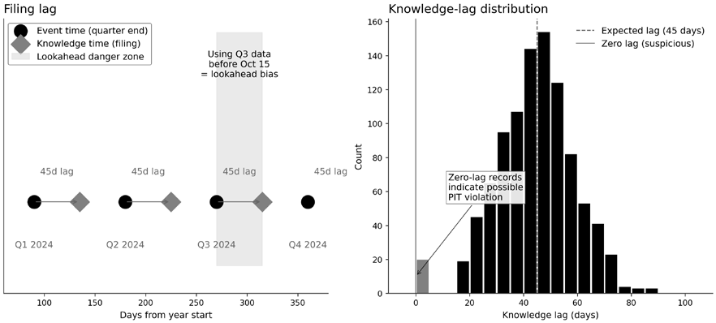
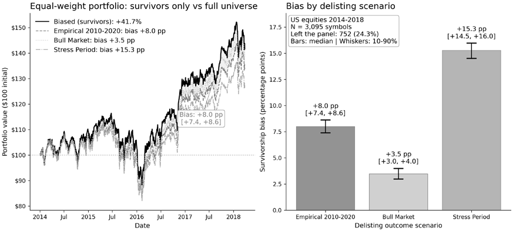
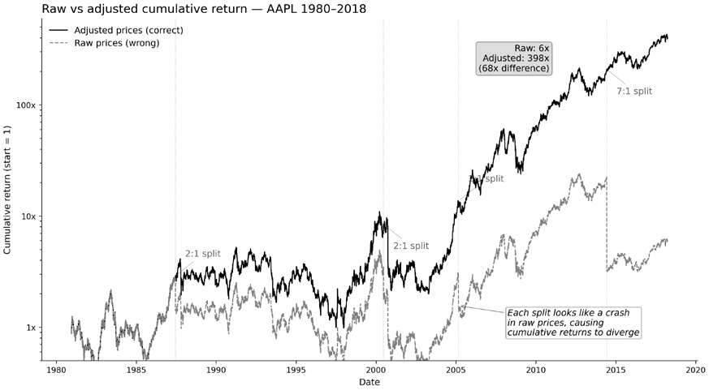
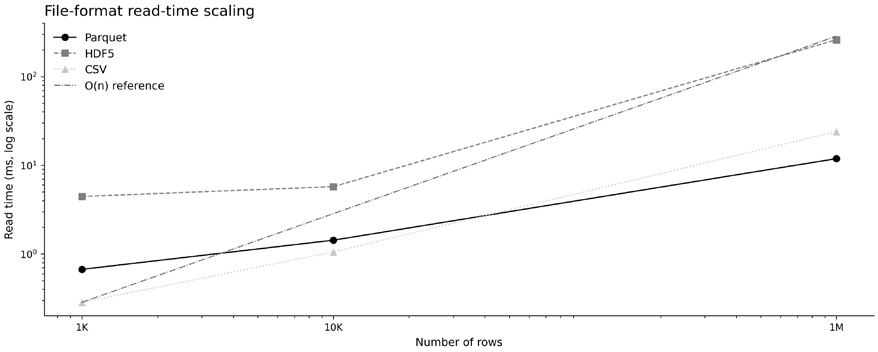
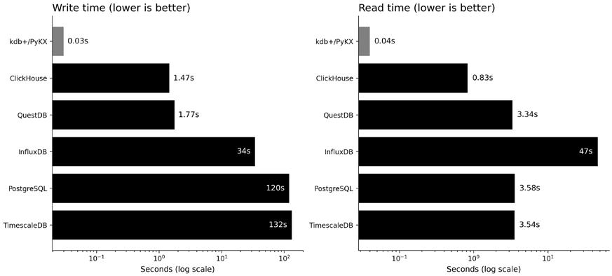

# 第2章：金融数据全景图

金融数据版图在不断扩张，分析出错的面积也随之增大。过去十年，另类数据供应商随着大规模数据基础设施的整体扩张而大量涌现，带来了卫星影像、信用卡消费面板和社交情绪数据流。交易所开始发布曾经专有的微观结构数据。新供应商正在拓宽机构级市场数据的获取渠道。Polymarket 和 Kalshi 这类预测市场则增添了一类新的事件合约数据。这种扩张既带来机遇，也带来复杂性。

严谨的数据管理决定了这份复杂性最终转化为洞察还是噪声。时点（point-in-time）错误、幸存者偏差和公司行为处理不当，历来都会使回测失效；每新增一个数据源，都会扩大潜在的出错面。另类数据带来的价值取决于策略本身，但它增加了流水线出错的途径。供应商评估需要在质量、法律和技术维度上保持纪律。在 Parquet 文件、时序数据库和湖仓格式之间做存储选型，则直接影响研究速度与生产可行性。

*第1章*建立了 ML4T 工作流并强调了过程纪律。在制定策略之前，我们需要先了解数据版图——它的可能性、约束与失效模式。本章将描绘这幅全景，聚焦*三个问题*：存在哪些类型的数据、各资产类别分别面临哪些具体的数据挑战，以及在质量、采购和存储维度上哪些决策至关重要。后续章节将在这一地基上继续深入：市场微观结构（*第3章*）、基本面与另类数据（*第4章*）、合成数据生成（*第5章*）。策略规格说明（*第6章*）也建立在这些数据地基之上。学完本章，你将能够：

- 区分市场数据、基本面数据与另类数据，以及它们各自的数据质量挑战。
- 评估主要资产类别在数据可得性与透明度之间的权衡。
- 运用五维数据质量框架，识别金融数据中的具体失效模式。
- 从技术、法律和商业因素出发，对供应商开展系统性尽职调查。
- 根据访问模式和运维要求选择存储技术。

本章及随后三章聚焦**数据集特征**：存在什么数据、数据如何表现、可能出什么问题。它们涵盖策略研发的原材料——这一过程自*第6章*展开。

## 2.1 金融数据的现代分类体系

数据集是一组测量值，外加使这些测量值跨时间可比的规则。它是对现实世界活动的一种特定度量方式。这种度量自带内建定义：时间戳惯例、交易日历、复权政策、标识符体系，以及修订或重述规则。这些并非可有可无的细节；要理解数据*意味着什么*，就必须理解它们。

由于每个数据集都内嵌定义，第一个问题是：它度量的是哪种现实世界过程——交易、基本面，还是代理变量？金融数据分为三类：

- **市场数据**：记录市场发生了什么——报价、成交及衍生的聚合指标
- **基本面数据**：捕捉价值的经济驱动因素（定义因资产类别而异）
- **另类数据**：标准市场数据流和基本面数据流之外的信号，往往是基本面的代理变量

借助这套分类体系，你可以推断一个数据集代表哪类现实世界活动、遗漏了什么、可能引入哪些误差。当你下载“每日价格”时，实际上是在接受供应商的定义。“收盘价”如何定义：最后一笔成交、集合竞价收盘，还是某个带时间戳的快照（以及处于哪个时区）？拆股和分红是按时点反映，还是经过后复权？这些环节只要弄错一处，未必会出现明显的故障；你得到的更可能是悄无声息的错位和有偏的结果，并沿着特征工程、标签和回测一路传播。

在建模之前，先锁定四件事：时间戳语义、公司行为复权方法、标识符稳定性，以及修订与重述的处理方式。把这些选择明确写进流水线配置，并作为元数据一路传递，使下游代码无法擅自重新解读数据。这些问题是本章及随后两章的重点。

### 市场数据——聚合的层级结构

市场数据反映金融市场中的交易活动，体现了塑造这种活动的制度环境——从集中式交易所到场外交易环境。它以与逐笔订单和成交相关的消息级事件的形式实时产生。供应商通常会按给定时间间隔实时聚合这些数据，得到常见的开盘价、最高价、最低价、收盘价和成交量摘要。沿聚合谱系向上移动，数据更易存储和建模，但会丢弃关于供需动态的微观信息。

最底层是原始事件流，它们反映交易场所的运作机制：订单如何提交和撮合、成交何时上报、适用哪些交易规则。在现代市场中，交易分散在多个场所进行，包括暗池、内部化交易商以及其他另类交易系统等交易所之外的场所。因此，你看到的“最优价格”取决于数据流覆盖了哪些场所，以及如何合并它们。

交易所出售带有强完整性保证和校验字段的高质量数据产品；免费数据流往往有延迟、经过过滤，或缺少验证正确性所需的元数据。无论成本高低，采购与校验纪律同样适用于“基础”价格数据。*第3章*讲解如何处理不同聚合级别的市场数据，包括从 tick 数据重建订单簿，以及在多个频率上构建分析用 bar（K线）。

### 基本面数据——价值的驱动因素与发布滞后

基本面是支撑估值的那些经济变量。什么算“基本面”，取决于资产类别和制度框架：

- **股票**：财务报表、公司行为、业绩指引
- **大宗商品**：库存、产量、运输、天气
- **外汇（FX）**：利率、通胀、增长、政策
- **加密资产**：发行时间表、费用、链上活动、流动性结构

有两点特性是大多数工程错误的根源：

- **按发布时间记录的数据，而非按事件时间记录的数据。** 基本面数据带着滞后、发布日程、禁发期（embargo）和修订到来。相关的问题不是“数值是多少”，而是“决策时能知道什么”。
- **受规则塑造。** 会计准则决定股票披露什么。政府机构规定大宗商品的报告方式。统计机构会修订宏观序列并发布数据版本（vintage）。协议规则决定哪些加密变量可被观测。解读基本面数据需要理解制度约束，而不只是下载一个序列。

*第4章*使用三类主要的基本面数据源：

- 对于**股票**，我们利用监管申报文件提取资产负债表和利润表数据，并使用时点正确的申报日期，支持尊重公告时间的双时态查询。
- 对于**宏观**，我们使用美联储的 FRED 数据服务获取国债收益率、失业金申请人数、通胀指标和波动率指数，并明确处理发布日程和数据版本修正。
- 对于**大宗商品**，我们使用 CFTC 的持仓报告（Commitment of Traders）跟踪期货市场中机构与投机者的头寸。

### 另类数据——高多样性、高验证负担

另类数据把观测范围扩展到标准化价格数据流和结构化公开信息（如监管申报文件）之外。过去十年另类数据的兴起，反映了数字化这一更宏大的趋势（Ekster and Kolm, 2020）。

许多类别的另类数据能提供更及时或更细颗粒度的经济活动视角，因此是基本面数据的有用补充：

- **地理空间/出行**：卫星影像、人流、航运 AIS
- **消费者分析**：信用卡/借记卡消费面板、应用使用、网站流量
- **企业数据尾气（corporate exhaust）**：招聘信息、采购、供应链信号
- **文本/事件**：新闻、业绩电话会、申报文件、社交媒体
- **ESG/披露**：排放、人力指标、治理评级

另类数据或许能提供新颖的测量，但也带来自身的解读难题。对每个类别，验证问题包括：覆盖范围随时间是否稳定？样本中存在哪些选择效应？你能否复现其方法？使用权限是否允许你计划中的部署方式？

*第4章*将另类数据评估框架应用于三个类别：

- **预测市场**——既有受 CFTC 监管的 Kalshi（经济事件：美联储决议、CPI、失业率），也有基于加密资产的 Polymarket——展示如何从事件合约中提取概率时间序列并构建特征。
- 来自 DeFi Llama 的**链上加密数据**提供反映协议活动的总锁仓价值（TVL）指标，并在各大链上作为远期收益预测因子加以评估（面板构建与 IC 分析见*第4章*）。
- 来自 SEC EDGAR 申报文件的**文本数据**展示了为 NLP 特征供数的抽取流水线，*第10章*有更详细的介绍。

下一节综述各资产类别的市场数据，列出全书使用的数据集，并指出探索这些数据的 notebook。

## 2.2 各资产类别的市场数据版图

不同资产类别的数据特征各不相同，原因在于市场结构和价值的经济决定因素不同。交易的组织形式——交易所还是场外交易（OTC）、电子化还是语音报价、统一还是分割——决定了你能获得哪些市场数据、这些数据的信息含量有多高，以及工程选择会在哪些地方影响结果。

*表 2.1*概括了各资产类别的可观测性、主要失效模式和工程重点：

| 资产类别 | 可观测性 | 主要失效模式 | 工程重点 |
| --- | --- | --- | --- |
| 股票 | 高（统一行情） | 公司行为、市场分割、标识符 | 复权方法 |
| 期货 | 高（交易所） | 移仓规则、连续化方法 | 连续序列构建 |
| 期权 | 高（但尾部稀疏） | 流动性不足的噪声、曲面构建 | 曲面表示 |
| 数字资产 | 中（因交易场所而异） | 成交量真实性、24/7 时段切分 | 交易场所筛选 |
| 外汇 | 低（场外交易） | 无统一行情、收盘惯例 | 聚合规则定义 |
| 固定收益 | 低（场外交易、稀疏） | 矩阵定价、参考性报价与可成交报价之别 | 流动性推断 |
| 掉期/场外 | 低（报告制） | 曲线构建、惯例不匹配 | 基于曲线的表示 |
| 大宗商品 | 中（期货较高） | 现货含义模糊、交割规格 | 合约规格纳入元数据 |

*表 2.1：资产类别概览*

以下小节从数据更丰富、更标准化的交易所交易品种（股票、期货、期权、数字资产）讲起，过渡到数据更稀疏、惯例更碎片化的场外市场（外汇、固定收益、掉期、大宗商品）。

### 股票

全球股票市场总市值约为 126.7 万亿美元（WFE，2024）；美国股市市值约为 67.7 万亿美元（SIFMA，2025 年第三季度）。上市股票在多个公开撮合交易所（lit exchange）和交易所外场所（另类交易系统 ATS/暗池，以及面向散户的批发商/内部化交易商）交易。在美国，统一申报机制定义了全市场范围的全国最优买卖报价（NBBO），并发布统一的报价和成交数据；直连场所的数据流可能更快、细节更丰富，但成本更高。

#### 你能观测到什么

股票市场结构沿三个轴变化，它们影响你能观测到什么，以及你该如何定义“价格”：

- **统一与分割。** 一些司法辖区提供统一申报，另一些则历来分散在多个场所。欧盟的股票统一行情将于 2026 年上线。
- **集合竞价强度。** 许多市场高度依赖开盘和收盘集合竞价，它们可能主导日终流动性和基准定价。“收盘”往往指“竞价收盘”，而非“最后一笔成交”。
- **交易约束与惯例。** 最小变动价位（tick）、卖空约束、价格限制/波动性中断以及结算惯例在各个市场不尽相同，可能改变日内流动性度量和交易成本估计的含义。

对流动性好的标的，报价、成交和衍生 bar 都很容易获得，但“最优价格”和“可得流动性”取决于数据流的覆盖范围和聚合规则。应把每个场所的数据流视为市场的局部视图；任何统一视图都是一个人工构建的聚合体，带有自己的时间戳、纳入规则和延迟特征。

#### 失效模式

市场分割造成时间戳与聚合上的歧义（尤其是在拼接多个场所或混用统一数据流与直连数据流时）。公司行为（拆股、分红、分拆）造成价格序列的不连续，需要一致的复权和收益定义。国际数据集还带来额外的陷阱：货币转换及其外汇时间戳、含分红序列的预扣税，以及可能破坏标识符连接的交叉上市/ADR 映射。

#### 工程决策

在研究开始前，先明确并记录以下内容：

- 你对“收盘价”的定义（竞价收盘还是最后一笔成交；当地收盘惯例）
- 报价使用统一数据流还是场所直连数据流
- 你的公司行为与全收益处理方法
- 交叉上市标的的标识符策略

这些是会对结果产生实质影响的数据集设计选择。

#### 数据集

我们使用来自 NASDAQ 的 3,199 只美国股票的免费日线数据（1962–2018），即最初的 Quandl WIKI 价格数据（Quandl 被收购后不再更新）。我们还使用了 Algoseek 慷慨提供的两个商业数据集：标普 500 成分股的日线 OHLCV bar（2017-21）和 NASDAQ 100 成分股的分钟 bar（2020-21），并附有数十个面向机器学习的市场微观结构特征。

**Notebook**：`01_us_equities_eda` 探索美国股票特征；`02_corporate_actions` 校验复权因子，并比较未复权与复权后的收益。我们将在讲市场微观结构的*第3章*中探索 Algoseek 的 NASDAQ 100 数据。

### 交易所交易产品

**交易所交易产品**（**ETP**）是*在交易所上市、打包一个或多个标的市场敞口的 wrapper 结构*。它们的交易方式与股票一样——有报价、成交和订单簿——但差别在于持仓、指数规则和复制机制。ETP 可以包装债券、大宗商品、外汇、波动率或多资产敞口，因此其交易与风险特征同时取决于包装结构和底层资产。ETP 在常见结构上也有差异：

- **交易所交易基金（ETF）**通过**申赎**机制连接授权参与商，把二级市场价格与底层资产价值挂钩。
- **交易所交易票据（ETN）**是无担保债务工具；它们内嵌**发行人信用风险**，可能靠发行人的承诺而非基金结构来跟踪指数。
- **封闭式基金（CEF）**一般没有持续的申赎机制，可能长期以**溢价/折价**相对净资产值（NAV）交易。

#### 你能观测到什么

统一报价与成交、bar，以及（来自直连数据流的）更深的订单簿信息。与单只股票不同，ETP 研究需要第二层数据：

- **NAV**（通常为日终），以及许多 ETF 提供的**盘中参考价值（intraday indicative value）**。
- **持仓与权重**（或指数成分）通常每日更新，但有时以代表性篮子的形式披露，或与之一同披露。
- **基金行为**，如分红派息、拆分，以及（对杠杆/反向产品而言）会随时间改变敞口的定期再平衡。

#### 失效模式

ETP 打包了各种不同的产品，因此失效模式也成倍增加：

- **收益定义。** 分红或票息等分配往往不可忽略。仅价格序列可能低估收益并扭曲波动率；“复权收盘价”内嵌了供应商特定的复权方法（见*2.3 节*与*第4章*）。还应明确：（i）全收益还是价格收益；（ii）分红再投资还是现金分配；（iii）相关情形下的税务与货币处理。
- **溢价/折价。** 成交价可能偏离 NAV，尤其在底层市场休市、流动性差或承压时。不要把 NAV 收益当作可交易的收益。
- **流动性错配。** 一只流动性好的 ETF 可能包装着不流动的底层资产。当资金流通过申赎或交易商对冲传导到成分资产时，二级市场流动性可能高估真实容量，在承压市场状态下尤其如此。
- **穿透式泄露（look-through leakage）。** 持仓和篮子会随再平衡和管理人自主调整而变化，公开的持仓数据未必满足时点正确性。用今天的持仓计算昨天的敞口，会造成隐蔽的前视偏差。
- **复制复杂度。** 许多 ETP 持有复杂产品：商品产品可能**基于期货**，杠杆/反向产品因每日再平衡而是**路径依赖**的，期权叠加产品则内嵌*波动率曲面*动态。

#### 工程决策

把 ETP 当作一类独立的数据集。至少要锁定：

- **收益方法：** 价格收益还是全收益；分配处理；货币转换。
- **估值锚：** 价格、NAV 还是两者都用，以及信号与评估各用哪个。
- **敞口映射：** 用持仓、指数成分还是因子代理；时点正确性与披露滞后政策。
- **流动性模型：** ETF 层面的成本，还是大额订单/承压情形下的穿透容量约束。
- **复制元数据：** 实物还是合成；是否基于期货；杠杆/反向；期权叠加。

**数据集与 Notebook**：我们使用来自 Yahoo Finance 的 100 只 ETF 的日线数据（2006–2025），其中 50 只按资产类别分类，用于轮动案例研究。流动性跨度达 23 倍：从 SPY（日均 1.26 亿股）到商品组（550 万股）；100 只 ETF 中有 41 只在 2006 年之后上市，限制了特征和评估可用的回看窗口。Notebook `03_etfs_eda` 介绍该数据集。

### 期货

2024 年全球交易所期货成交量约 280 亿手（FIA）。期货在交易所交易，合约级数据透明。复杂之处在于跨时间的身份问题：一个期货市场是不断到期、流动性不断迁移的一系列合约。

#### 你能观测到什么

每个合约都有高质量的价格、成交量和持仓量。不存在永续的代码——你必须自己构建一个。

#### 失效模式

移仓规则（按日历、按成交量、按持仓量）和连续化方法（比例复权、差价复权）是决定回测结果的选择。不同策略需要不同的移仓逻辑。

后复权连续序列通常保留期货价格的盈亏（PnL），但不包含抵押品收益（保证金利息）。除非你显式地对抵押品收益建模，否则后复权连续序列往往表现得像**超额收益**代理。与现货资产或全收益指数比较时，要明确你建模的是期货盈亏、抵押品收益，还是两者之和。

#### 工程决策

存储原始合约历史，外加一个或多个连续序列变体，以便测试和重现移仓决策。

#### 数据集

我们使用来自 Databento 的 30 个 CME 期货的小时线数据，涵盖多样化的底层资产，覆盖 2011-25 年。

**Notebook**：`04_cme_futures_eda` 探索期货数据；`05_futures_session_aggregation` 演示如何将数据对齐到 CME 交易时段；`06_futures_continuous` 演示基于成交量的移仓检测和两种主流后复权方法（比例法与差价法），并与供应商预构建的连续序列进行了对照验证。

### 期权

2024 年全球交易所期权成交量约 1770 亿手（FIA）。场内期权以电子方式报价，但合约空间在行权价、到期日和类型上急剧膨胀。流动性高度不均——集中在接近平值、临近到期的合约上。

#### 你能观测到什么

流动性好的行权价有丰富的报价和成交数据；其余部分数据稀疏且噪声大。

#### 失效模式

存储并建模整条期权链成本高昂，而且大部分是不流动的噪声。把整条链当作单一“数据集”处理，会把流动与不流动的合约混为一谈。

#### 工程决策

通过衍生曲面来表示期权市场——隐含波动率曲面、平值（ATM）波动率、偏度、期限结构——而不是原始期权链。这种表示本身就是一个数据集设计决策：曲面就是数据集，而不是数据集的摘要。为流动性好的合约存储成交量和持仓量；忽略或聚合不流动的尾部。

#### 数据集

AlgoSeek 提供的标普 500 期权日度价格与分析数据，覆盖 2017-2021 年。Notebook `07_sp500_options_eda` 探索该数据集；`08_options_greeks_computation` 从第一性原理推导 Black-Scholes 定价和希腊字母——Delta、Gamma、Vega、Theta 和 Rho——并将 Delta、Gamma、Vega、Theta 与供应商计算的值进行对照验证；`09_options_continuous` 演示固定期限期权序列中的移仓污染问题，并构建可用于回测的连续收益。

### 数字资产

截至 2026 年 1 月 18 日，加密资产总市值约 3 万亿美元（CoinMarketCap）。数字资产既包括拥有熟悉订单簿的中心化交易所（CEX），也包括采用自动做市商（AMM）的去中心化交易所（DEX）。链上状态公开可观测，而交易所微观结构因场所而异。

#### 你能观测到什么

CEX 数据与股票相似：价差、深度、订单流——我们将在*第3章*讨论的微观结构概念可以直接套用，订单簿重建也照常有效。DEX 数据则有本质不同：AMM 用基于储备的定价取代订单簿（例如恒定乘积 AMM；集中流动性设计是其推广），价格由储备比例决定，而非买卖撮合产生。没有订单簿可重建；“深度”变成给定交易规模下的滑点，可以直接从流动性池的储备计算出来。

#### 失效模式

24/7 不间断交易使时段切分复杂化。一些场所报告的成交量不可靠。**最大可提取价值**（**MEV**）指验证者或其他参与者通过在区块内重排、插入或审查交易而能攫取的利润；它与无常损失、链上延迟一起，实质性地影响 DEX 执行。场所分割使跨交易所比较变得困难。

#### 工程决策

把某个场所纳入之前，先审查其数据诚信。显式处理 24/7 时间戳。对 DEX，要从储备推导滑点和流动性，而不是把 AMM 报价当作订单簿深度。

#### 数据集

我们使用来自 Binance 的 19 个交易对的永续合约小时级价格和 8 小时间隔的溢价指数（Premium Index），覆盖 2020-25 年。Notebook `10_crypto_perps_eda` 和 `11_crypto_premium_analysis` 探索这些数据；资金费率溢价分析与资金费率套利策略相关。

### 外汇

全球外汇日均成交额约为 7.5 万亿美元（2022 年 4 月，纽约联储）。外汇以场外交易为主，没有单一的统一行情。就连“每日收盘”（例如纽约时间下午 5 点）也只是惯例，而非交易所定义的事件。不同平台展示的流动性和价差各不相同。

#### 你能观测到什么

只有场所特定的报价，没有集中上报的成交量。在外汇市场，“价格”是一种惯例：你需要选择一个场所和一条聚合规则（中间价、最优价、成交量加权中间价 VW-mid）。

#### 失效模式

在并不存在单一权威价格的情况下假设它存在。陈旧报价、买卖价倒挂（crossed markets）和离群值过滤都需要明确的规则。

#### 具体示例

在波动较大的日子，EUR/USD 的“伦敦时间下午 4 点收盘价”与“纽约时间下午 5 点收盘价”往往相差好几个点（pip）。如果你的策略在不同货币之间混用收盘惯例，你可能正在比较不可比的时间戳。

#### 工程决策

明确你实际能交易的是哪个价格：最优价聚合、成交量加权中间价，还是特定场所的价格。把收盘惯例写进数据集元数据。

#### 数据集

我们通过 OANDA 使用 20 个货币对的 4 小时线数据（2011–2025），并在 notebook `12_fx_pairs_eda` 中探索这些数据。

### 固定收益

全球固定收益市场的存量规模约为 145 万亿美元（2024 年，SIFMA）。固定收益以场外交易为主，品种极其庞杂——数以千计的公司债和数以万计的市政债。许多品种成交稀少；报价可能只是参考性（indicative）报价，而非可成交（firm）报价。

#### 你能观测到什么

稀疏的成交记录、参考性报价和模型推导的估值。当最后一笔成交已经陈旧时，研究流水线只能依赖收益率、曲线和推断价格，而不是干净的价格序列。

#### 失效模式

流动性估计是一个推断问题，而不是测量问题。矩阵定价——把不流动的债券映射到相似的流动品种——引入了模型假设。无论如何，任何方法都需要区分观测到的成交与参考性报价，区分模型输出与模型输入。

#### 工程决策

决定如何处理不流动品种：剔除、通过矩阵定价插补价格，还是单独建模。把方法记录下来，因为“价格”对流动性好的国债和交投清淡的市政债意味着不同的东西。

### 掉期与场外衍生品（利率、信用）

场外衍生品的名义本金规模巨大（2025 年年中约 846 万亿美元，BIS），但**名义本金不等于敞口**，它主要反映合约的规模缩放。**利率衍生品**占场外衍生品名义本金的**约 79%**（约 670 万亿美元）。掉期市场位于现代固定收益和宏观交易的“幕后”。利率掉期、隔夜指数掉期（OIS）、交叉货币掉期和信用违约互换（CDS）主要是场外交易（中央清算程度不一），其数据由报告制度和市场惯例塑造，而非来自单一的统一行情。

#### 你能观测到什么

交易后报告（在有的地方）、参考性的交易商报价列表（dealer runs）、可得时的清算价格，以及曲线构建所需的输入，而不是单一权威的“价格序列”。即便交易有报告，时间戳、大宗交易规模遮蔽和场所碎片化也会影响研究颗粒度上可观测的内容。

#### 失效模式

把场外报价当作可成交的执行价格；混用惯例不兼容的不同场所/报告数据流；构建曲线时不使用一致的计息天数惯例、日历、抵押品/贴现惯例或移仓规则。许多下游“收益”其实是曲线构建选择造成的伪影。

#### 工程决策

明确你的数据集是（1）基于成交、（2）基于报价，还是（3）基于曲线/曲面的——并把这一选择当作根本性问题。对利率，存储带明确惯例的曲线快照；对信用，把指数产品与单一标的 CDS 分开；并在观测输入与模型推导估值之间划清界限。

### 大宗商品

2024 年交易所商品衍生品成交量约 80 亿手（期权与期货，FIA）。商品数据集位于金融市场与实物约束的交汇处。“现货”往往不是一个单一的可交易对象（可能是报告的、评估的，或特定地点的），而主要商品的期货曲线则是标准化、流动性好、可在交易所观测的。

#### 你能观测到什么

期货价格和期限结构通常是最可靠的市场数据。实体市场指标（库存、航运、天气、炼厂开工）往往驱动基本面，但受报告滞后和覆盖偏差影响。

#### 失效模式

把评估机构发布的现货序列当作交易所交易价格来对待；忽略决定基差的合约规格（交割地点/等级）；在计算移仓收益或日历价差时混用不同时点的曲线快照。

#### 工程决策

明确你的“商品价格”是（1）某个具体期货合约、（2）连续期货序列（带明确的移仓/复权处理），还是（3）曲线表示（从近到远的完整期限结构）。把合约规格元数据存进数据集本身，而不是当作文档。

#### 微观结构工具的适用性

*第3章*讨论订单簿重建和 bar 采样方法。它们直接适用于交易所交易品种（股票、期货、期权、CEX 加密资产），不适用于报价仅为参考性且分散在各交易商之间的场外市场（大部分固定收益和许多掉期），也不适用于不存在订单簿的 DEX AMM。对这类市场，需要换用其他方法，例如报价聚合、曲线构建、矩阵定价和基于储备的流动性计算。

接下来我们讨论如何评估数据源和供应商。

## 2.3 数据采购的尽职调查框架

数据采购纪律的作用，是在缺陷于回测中变成“alpha”（经风险调整的交易收益）并最终演变为实盘亏损之前，把它们找出来。错误是系统性的，而非随机：微观结构伪影、报告滞后、修订、公司行为和供应商回填会造成特定模式的误差，可能夸大或压低表面业绩。一个未被发现的缺陷就能让数月的研究作废。Luo et al.（2014）编录了会夸大回测收益的系统性错误；López de Prado（2018）强调，许多 ML 策略的失败要追溯到数据问题而非建模。

### 通用数据质量维度

数据质量评估通常涵盖五个维度：

- **及时性**：从发布/事件到可用的滞后/延迟
- **完整性**：品种、日期和字段上的覆盖缺口
- **准确性**：取值与真实值相符
- **一致性**：模式与定义随时间保持稳定
- **有效性**：满足约束（时间戳有序；取值在合理范围内；字段级不变式成立）

**实现**：`13_data_quality_framework` 使用 `ml4t-data` 库实现了一条自动化验证流水线，对 OHLCV 数据检查上述维度。`03_etfs_eda` 的 100 只 ETF 面板可以说明问题的量级：473 处 OHLC 不变性违规（约占行数的 0.1%）源于四个价格字段被各自独立地按拆股和分红复权，这个伪影小到大多数用途可以忽略，但在供应商比较报告中值得标注。应优先检查会产生前视偏差的问题（PIT、回填、修订）和标的池泄露问题（幸存者偏差）。

本节讨论适用于*所有*金融数据的数据质量问题。另类数据特有的评估标准见*4.4 节*。

### 金融领域特有的失效模式

有四种失效模式常会“制造”出人造 alpha：

#### 时点正确性（point-in-time, PIT）

**时点正确性**（**PIT**）是指历史研究中使用的每一个取值，都反映了在当时生效的定义和报告惯例下*决策时可知的内容*。当数据集事后被修订、而你在不知情的情况下用修订后的版本训练或回测时，就发生了 PIT 违规。

常见元凶包括修订与重述（基本面、宏观数据）、公司行为回填、延迟提交或更正的申报文件，以及覆盖历史的供应商数据库更新。

*失效示例。* 某公司在 2020 年初报告 2019 年第四季度收入为 918 亿美元。到 2024 年，经过一次重述，某供应商数据库中同一季度显示为 923 亿美元。如果你今天查询“2019 年第四季度收入”并用于 2020 年的回测，就引入了前视偏差：模型训练所用的信息在决策时并不存在。

要解决 PIT 问题，需要**双时态存储**和 **as-of 查询**。PIT 正确的系统在存储取值的同时，记录该取值所指的期间以及它何时公开可观测，从而能够精确重建时间 *t* 上真实存在的历史信息集。我们用以下术语描述 PIT 正确性：

- **事件时间**：经济事件发生的时点（例如 2019 年第四季度末）
- **知悉时间**：信息公开可得的时点（例如申报文件被接受的时间）
- **As-of 时间**：分析中要重建的历史时刻（即决策时点）
- **参考期间**：取值所指的期间（例如“2019 年第四季度收入”）

*图 2.1*展示了基本面数据的 PIT 正确性。

*图 2.1：基本面数据的时点正确性*

左图展示了事件时间与知悉时间之间的“前视危险区”；右图把零延迟记录标为危险信号。配套 notebook `14_point_in_time_validation` 演示双时态查询模式，并生成*图 2.1*。

对任何基本面或另类指标，都要存储该取值所描述的*有效时间区间*，以及该取值变为可观测时的*可得性*时间戳。每条记录还应包含稳定的 `source_id`（例如 SEC 受理号或机构发布标识符）、目标层级（发行人还是证券）上的 `entity_id`，以及 `version` 标识符。决策时点 *t* 的下游特征，只有在 `available_at <= t` 时才允许使用该记录。

跨数据源的所有连接都必须受 `available_at <= decision_time` 约束。对标识符映射（例如 ticker→CIK、CUSIP→ISIN），还要求 `effective_date <= decision_time < end_date`，保证映射在决策时点有效。违反任何一条约束，都会通过“看似正确”的连接引入前视偏差——这些连接在当时的时点上根本不可能成立——而且往往是悄无声息的。

在把任何含基本面类输入的数据集投入使用之前，从三个维度验证 PIT 正确性：

| 维度 | 问题 | 失效模式 |
| --- | --- | --- |
| 取值 | 每个数据点是否同时具备有效时间和可得（知悉）时间？ | 用重述后的取值支持历史决策 |
| 标的池 | 指数/标的池成分是否有历史记录？ | 按当日成分选取导致的幸存者偏差 |
| 标识符 | 实体映射是否随时间有效（代码变更、并购）？ | 跨公司事件错误地连接数据 |

*表 2.2：PIT 检查清单*

一个在取值层面通过 PIT 检验、却在标的池层面不达标的数据集，仍可能产生有偏的回测，对截面策略和历史指数标的池尤其如此。

#### 幸存者偏差

当历史标的池是用来自未来的信息（例如“今天仍然存在”）过滤时，就产生了幸存者偏差。其影响可正可负，取决于你剔除了什么：剔除*破产*会夸大收益（你错过了亏损），而剔除并购（M&A）标的则可能压低收益（因为你会错过收购溢价）。缺失的名字并非随机：它们包括破产、退市、被收购和价值陷阱——恰恰是许多策略会暴露其中的情形。因此，“幸存”下来的实体系统性地偏向未经历此类情形的个案。

*图 2.2：幸存者夸大全标的池收益（2014–2018 年美国股票面板）*

*美国股票面板*包含 3,199 只股票，其中 777 只（24.3%）在数据集结束日期之前退市——全部发生在 2014 年之后，这是旧版 Quandl WIKI 数据流唯一捕获了退市记录的时间窗口。量化幸存者偏差需要按退出原因模拟退市股票的期末收益：困境退市、并购退出或自愿退出，各有自己的发生概率和期末收益。Eckbo and Lithell（2025）统计了 CRSP 2010–2020 年的退出结果占比；实证情景采用这些占比，假设 26% 为合规失败退市（−60%）、65% 为被收购（+25%）、9% 为其他退出（0%）。期末收益保守地计入退市当日。实践中，收购溢价往往随着交易传闻流传、价格向要约价收敛而逐步兑现，因此到退市日，+25% 中可能已有相当部分反映在价格里；相比之下，破产亏损往往更突然。因此，这一校准在并购占比高的面板上会高估偏差幅度。

*图 2.2*展示了蒙特卡洛模拟的结果，每个情景抽取 1,000 次。2014–2018 年间，幸存者偏差在三个情景中使表面收益夸大了 3.5–15.3 个百分点（实证情景为 +8.0）：剔除退市名字等于去掉了分布中较弱的一半，因为退市者的收益中位数为 +13.5%，而幸存者为 +30.8%。偏差的符号取决于主导性的退市原因：破产主导的时期会夸大幸存者收益，而并购主导的时期则可能压低它。Shumway（1997）与 Beaver, McNichols, and Price（2007）记录了退市收益的底层规律。偏差的符号取决于主导性的退市原因：破产主导的时期夸大幸存者收益，而并购主导的时期（例如 2010–2017 年样本）则会压低它。Shumway（1997）与 Beaver, McNichols, and Price（2007）记录了退市收益的底层规律。

另一个偏差来源，是把今天标普 500 的成分股当作历史回测的“标的池”。即便这些公司都存活至今，这一选择标准也是结果依赖的：当前的成员正是那些已经成长到足够大、足够成功才得以入选的公司。在它们身上回测，等于追溯性地把这道成功过滤器嵌入了实验。

*对策*：按时点正确性构建标的池。2010 年的回测应使用 2010 年的成分名单，并正确处理退市收益和公司行为。CRSP 被广泛用作幸存者偏差感知的美国股票数据基准，因为它长期跟踪退市记录，但许多机构级供应商也提供可比的历史数据。

**实现**：`15_survivorship_bias_detection` 量化退市率，并展示退市名字的构成（并购还是困境）如何影响偏差幅度。

#### 公司行为

公司行为——拆股、分红、分拆、并购——会在价格序列中制造需要复权处理的不连续。失效模式在于混用不同的复权方法，或在历史研究中使用样本末期因子（本章后文详述）。

*图 2.3：受公司行为影响的原始价格与复权价格对比*

一次 7 比 1 的拆股会让原始价格看起来暴跌了约 86%。用未复权价格计算收益，对累计业绩的低估将达到灾难性的程度。*图 2.3*以 AAPL 为例说明了这一点：在其数十年的价格历史中（Wiki/Quandl 面板截至 2018 年，含四次拆股加分红），原始价格的累计收益为 5.9 倍，而复权价格的收益为 398 倍，低估了约 68 倍。

*复权方法*各不相同。一些供应商提供时点复权（当时已知的因子）；另一些提供后复权序列（把样本末期因子追溯应用于全部历史）。混用两者会引入前视偏差。供应商在分红处理（全收益还是价格收益）、分拆和配股上也各有差异。

*对策*：记录并验证你的复权方法。`02_corporate_actions` 用苹果已知的历次拆股校验复权因子。*第3章*将详细讲解其中的机制。

#### 标识符完整性

基于标识符的连接可能对错标的。股票代码会被重复使用（一家老公司退市后，新公司接管这个代码）。CUSIP 会因并购而变化。供应商 ID 也有各自的边界情况。

这会制造虚假 alpha。假设你的信号表里有 2015 年的代码“XYZ”，价格表里有 2020 年的“XYZ”，但它们是两家不同的公司。连接成功了；于是这个信号实际上在预测另一家公司的收益。如果第二家公司恰好表现出色，你就从数据错误中“制造”出了相关性。

*对策*：使用带生效日期区间的永久标识符（供应商永久 ID；通过对照表映射 FIGI/ISIN/CUSIP）。`16_provider_comparison` 演示了谨慎处理标识符的多源数据拼接；`17_complete_pipeline` 展示了能在增量写入中保持标识符完整性的 Hive 分区模式。

### 供应商生态

供应商的成本和能力跨度很大；随成本变化的关键属性包括深度（盘中还是日线）、历史长度、公司行为处理、PIT 支持、延迟、再分发权利以及方法的可审计性。

| 层级 | 典型特征 | PIT 支持 | 幸存者偏差处理 | 最适用场景 |
| --- | --- | --- | --- | --- |
| 免费/公开 | 获取便捷，保障有限 | 少见（宏观数据版本可经 ALFRED 获得） | 少见 | 学习、原型、合理性检验 |
| 准专业级（API 优先） | 对流动性好的市场覆盖良好 | 部分支持 | 有时部分支持 | 个人研究 |
| 机构级 | 历史更长、方法有文档 | 通常提供 | 通常提供 | 生产环境、受监管环境 |

*表 2.3：数据供应商层级*

在决定哪些买、哪些自建时，要把差异化工作（策略专属的变换）与商品化工作（干净的历史数据、标识符对照表）分开：

- *自建*策略专属部分：数据接入流水线、存储与版本管理、验证检查、规范标识符，以及编码了你的假设的那些变换（例如时段切分、复权政策、移仓规则、PIT 感知的特征）。
- 问题不构成差异化、或自行复现的成本高到不合理时，*购买*即可：长周期清洗历史、规模化公司行为复权、幸存者偏差感知的标的池，以及标准标识符对照表（例如 FIGI 映射、Bloomberg 标识符）。

实体与标识符映射往往是以月计的工程：要在代码变更、并购和不同供应商惯例之间追踪同一品种。无论购买供应商的对照表还是自建，都要把标识符完整性当作核心风控。

### 供应商尽职调查清单

选择供应商就是风险管理。实践中，尽职调查归结为三个问题：这些数字可信吗？你被允许按计划使用它们吗？这家供应商能像一个可靠的依赖项那样运作吗？

#### 数据质量

第一项任务是判断数据集能否支持历史上正确的分析，而不只是方便地访问当前取值。这意味着不仅要检查有哪些字段，还要检查供应商如何处理时间、修订、标识符和公司事件。

关键问题包括：

- **PIT 支持**：供应商能否提供快照或 as-of 查询？修订如何处理？
- **幸存者偏差感知**：退市记录是否连同正确的最终价格一并提供？
- **复权方法**：拆股、分红和其他公司行为如何处理？方法是否有文档且保持稳定？
- **覆盖与定义**：真实的起始日期、品种覆盖、更新频率和字段定义是什么？
- **标识符完整性**：使用哪种标识符体系？代码复用、并购和其他实体变更时如何处理映射？

这些问题确立了数据集在分析上是否可信；下一步是确认使用它在法律上也是被允许且可辩护的。

#### 法律与合规

即使数据质量很高，如果权利和来源不清，也会带来麻烦。这项审查应确认：数据来源合法、预期工作流中的使用方式获得许可、且供应商在需要时能为其方法提供文档。重点关注四个问题：

- **重大非公开信息（MNPI）筛查**：供应商是否有成文的来源控制？
- **隐私与同意**：对消费者数据，采集是否符合 GDPR、CCPA 等规定？
- **使用权利**：回测、实盘交易、再分发和模型训练各自允许什么？
- **可审计性**：供应商能否为监管机构、客户或内控部门提供其方法的文档？

法律基础明确之后，实际问题就变成：供应商能否作为你研究和生产技术栈中稳定的一环运转。

#### 技术与商业

供应商还必须是一个可靠的生产依赖项。如果交付模式脆弱、不透明或难以集成到研究和实盘系统，再好的数据内容也不够。尤其要评估以下几点：

- **可靠性**：是否有状态页、正常运行历史或 SLA？
- **变更管理**：模式变更和方法修订是否有版本管理并清晰告知？
- **访问模式**：限流、批量导出和回填机制是否与你的流水线兼容？
- **可迁移性**：能否以可用的格式导出数据？退出条款是否合理？

如果供应商在原则上看起来可靠，下一步就是做一次简短的动手验证，确认数据在实践中符合预期。

#### 最小可行数据验证清单

供应商通过初步尽职调查后，还应做一轮简要验证，确认数据集可用于研究。至少要核实以下各项：

- **PIT**：延迟数据没有零延迟记录
- **幸存者偏差**：历史标的池未按未来信息过滤
- **公司行为**：复权方法有文档
- **标识符**：用永久 ID 加生效日期做连接
- **时间戳**：时区明确、时段归属清晰
- **离群值**：具备陈旧报价与异常检测
- **版本管理**：可重现的 as-of 查询

不过，供应商尽调只是控制框架的一部分；还需要内部流程来让数据问题可见、可追溯、可回退。

### 数据治理

好的供应商不能替代内部治理；内部治理要在五个方面让问题可发现、可回退：

- **血缘**：追踪每个数据集来自哪里、经过怎样的变换。
- **版本管理**：对数据做版本化，而不是覆盖。修复错误时，保留重现先前结果的能力。
- **日志**：记录清洗决策，使结果可复现。
- **验证自动化**：使用 Great Expectations 或 Pandera 之类的工具；出现违规就立刻报错，而不是悄悄丢弃记录。`13_data_quality_framework` 提供 `AnomalyManager` 工具包，为每次验证运行生成 JSON 审计轨迹。
- **并行运行**：更换供应商或方法时，让数据源并行运行足够长时间以量化差异，并保留回退选项。

把数据采购当作风险管理：PIT 和幸存者偏差检查能预防代价最高的错误。下一节转向高效的数据存储。

## 2.4 数据存储

存储是研究速度和生产可靠性的基础。不存在脱离访问模式和运维约束的“最优方案”。正确的选择取决于数据量、访问模式（扫描、点查询、范围查询、连接）、并发要求和运维成熟度。

### 基准测试的对象与目的

这些基准测试回答两个不同的问题：

- **文件格式**：如果你的数据存放在文件中（最常见的研究模式），哪种格式能在大小、读取速度和写入速度之间给出最佳权衡？
- **数据库引擎**：当你需要 SQL 查询、并发访问或 ASOF 连接之类的时序操作（见本章*ASOF 连接性能*一节）时，哪些引擎在金融数据工作流中表现出色？

把两者分开，是因为大多数研究工作流从文件（Parquet）起步，只有在用例需要时才引入数据库。这些基准测试帮助你判断是否需要、以及何时进行这一转变。

### 基准测试的背景与注意事项

本节的表格和图表概括了配套代码在 L 规模（约 100 万行 OHLCV 数据，在 Polars 中占内存 64 MB）下的基准测试结果。代码库附带可在你自己的硬件上以更大规模（XL：1000 万行，XXL：1 亿行）运行的脚本。

解读基准测试结果时，请记住以下几点：

- **操作定义很重要。**“读取时间”可能指打开文件句柄、扫描部分列，或全量扫描所有数据。Arrow IPC 支持内存映射，因此打开文件并不一定会把整个文件加载进内存。
- **热缓存与冷缓存。** 预热运行往往已经填充了操作系统页缓存，使后续读取远快于真正的冷读取。
- **相对排名比绝对时间更有普适性。** 把这些数字当作在你硬件和工作负载上的示意值；用配套脚本在自己的系统上生成基准测试。

### 基于文件的存储

我们在一个 100 万行的 OHLCV 数据集（100 个品种 × 10,000 根 bar）上对文件格式做了基准测试。*图 2.4*描绘了行数增长时各格式读取时间的变化：数据变大时列式格式保持优势，而 CSV 的读取时间线性恶化。

*图 2.4：各文件格式读取时间随数据集规模的扩展*

*表 2.4*概括了适合持久存储的三种格式在 L 规模下的文件大小、写入时间和扫描时间。排名往往比绝对时间更稳定，但写入路径和缓存会显著影响结果。

| 格式 | 文件大小 | 写入时间 | 全量扫描 | 备注 |
| --- | --- | --- | --- | --- |
| CSV | 136 MB | 0.13 秒 | 0.05 秒 | 基线：开销因引擎而异 |
| Parquet | 40 MB | 0.07 秒 | 0.02 秒 | 列式、压缩、支持选择性读取 |
| HDF5 | 71 MB | 0.13 秒 | 0.40 秒 | 性能取决于分块设置 |

*表 2.4：文件存储基准测试结果*

选择格式时：

- **Parquet**：研究和生产环境推荐的默认选择：压缩率高（相对 CSV 达 3.4 倍），列式读取高效，在 Python、R、Spark 和云平台上都有普遍的工具支持。
- **HDF5**：在科学计算和遗留金融系统中仍然常见。对追加写入加分块读取的特定访问模式，它可能表现不错，但读取性能落后于列式格式。
- **CSV**：用于导出和互操作，不要作为主要的分析存储。

**关于 Arrow IPC（Feather）的说明**

**Arrow IPC** 是一种为数据交换优化的快速序列化格式。它擅长在 notebook 和进程之间移动数据（包括内存映射读取），但缺少谓词下推、分区感知布局和多文件治理等关键的“数据湖”特性。短期交换用它；持久、可查询的存储用 Parquet。

**湖仓（Lakehouse）**格式（如 **Delta Lake**、**Iceberg** 和 **Hudi**）以 Parquet 形式存储数据，并附带事务日志，提供 ACID 语义、模式演进和多写者治理。先从朴素的分区 Parquet 起步；当你需要以更新为主的工作流、带强保证的模式演进，或跨团队并发写入时，再采用湖仓格式。

**实现**：`20_storage_benchmark_file` 复现这些基准测试，并将其扩展到更大规模。

### 嵌入式分析数据库

嵌入式数据库无需运行服务器即可提供 SQL 分析：

- **DuckDB**：面向 OLAP 工作负载优化的进程内分析数据库。它能直接查询 Parquet，并在 SQL 中支持 ASOF 连接，是想在 Parquet 数据湖上获得 SQL 语义的研究工作流的可靠默认选择。
- **SQLite**：可靠的内嵌关系数据库，适合元数据、配置和小型关系表。在分析扫描或时序工作负载上无法与 DuckDB 竞争。
- **ArcticDB**：面向 DataFrame 的存储，带版本管理和时间旅行特性。它采用 **BSL 1.1** 许可（每个发布版本按时间自动转为 Apache 2.0）；采用前请核实许可与运维约束。

一个实用的默认架构：

1. 将原始数据和加工后的数据存储为分区 Parquet。
2. 用 DuckDB 对这些文件做 SQL 分析和快速连接。
3. 用 Polars 之类的 DataFrame 引擎做特征工程。pandas 与 Polars 在读取、groupby、连接和惰性求值等操作上的实证比较见 `22_pandas_polars_benchmark`。

### 服务器级时序数据库

当你需要并发访问、集中治理、严格的持久性和生产级服务水平时，服务器数据库很有价值。

*图 2.5：服务器数据库对比（100 万行）*

*图 2.5*比较了六个服务器数据库在 L 规模下的读写性能（kdb+/PyKX、ClickHouse、QuestDB、PostgreSQL、TimescaleDB 和 InfluxDB）。这些结果仅供参考方向；写入时间对写入方式、模式设计和持久性设置都很敏感。做决策前，请用你实际的接入路径重跑基准测试。

服务器级时序数据库包括：

- **kdb+/KDB X**：高度优化的时序与分析引擎，在市场数据领域应用广泛。KX 提供有实质限制（通常限非商用）的免费版本；在决定采用前请核实当前的许可条款。
- **ClickHouse**：通用 OLAP 数据库，为高吞吐列式分析优化，SQL 支持完善，生态庞大。
- **QuestDB**：为写入和时序 SQL（包括 ASOF 式查询）优化的时序数据库。支持用 Parquet 分层存放冷数据的存储模式。
- **PostgreSQL/TimescaleDB**：PostgreSQL 是默认的通用关系数据库；TimescaleDB 为其扩展了超表（hypertable，自动时间分区）和用于按时间分桶汇总的连续聚合。
- **InfluxDB**：为指标和可观测性工作负载设计。Flux 支持等值连接，但 asof 式连接并非原生原语；把它当作监控数据库，而不是市场微观结构引擎。

**实现**：`21_storage_benchmark_database` 提供可复现的服务器基准测试。在生产级编排方面，`18_data_management` 将 DataManager、Universe 和 HiveStorage 原语组合成一条可运行的流水线；`19_incremental_updates` 完整走一遍每日更新生命周期，带有能识别周末的数据缺口检测和健康仪表盘。

### ASOF 连接性能

ASOF 连接用于对齐并非精确同步的事件——例如把每笔成交匹配到当时最新的有效报价。在把 tick 数据流与变化较慢的参考序列混合准备面板数据的场景中，它通常是主要开销。pandas 和 Polars 都要求输入已排序。

在本书使用的规模下，处理 tick 级工作负载时，内存引擎（Polars 的 `join_asof` 和 pandas 的 `merge_asof`）始终优于嵌入式 SQL 引擎（DuckDB 的 `ASOF JOIN`），其中 Polars 通常是三者中最快的。绝对差距取决于硬件、排序状态以及基准测试是否计入文件 I/O，因此我们报告的是相对次序而非绝对耗时。

比较不同实现时，有几点测量注意事项：

- 内存引擎测的是数据已加载后的连接执行；SQL 引擎则可能包含文件扫描和转换开销。
- 要公平比较，需先决定排序是否算作基准测试的一部分。如果流水线本身维护已排序数据，就应在所有引擎上一致地排除排序。
- 成交对报价的 ASOF 性能对左右两侧行数之比很敏感；请在与目标工作负载一致的比例下做基准测试。

### 战略决策框架

下表按目标概括了标准的默认选择。

| 目标 | 首选默认 | 备选方案 |
| --- | --- | --- |
| 研究迭代速度 | Parquet + Polars | Parquet + DuckDB |
| 对文件做 SQL 分析 | DuckDB + Parquet | Polars 惰性扫描 |
| 生产可靠性 | PostgreSQL | TimescaleDB |
| 极致时序吞吐 | kdb+/KDB X | ClickHouse |
| 高吞吐写入 | QuestDB | ClickHouse |
| 内存 ASOF 连接 | Polars | pandas |
| SQL ASOF 连接 | DuckDB | QuestDB |
| 最低运维负担 | Parquet + DuckDB | 托管 Postgres |

*表 2.5：各存储目标下的推荐默认方案与强力备选方案*

从分区 Parquet 加 Polars 或 DuckDB 起步。当并发和治理需求足以抵偿运维开销时，再引入服务器数据库。

## 2.5 小结

本章绘制了金融数据全景图，并梳理了让研究可复现的各项决策。运用市场数据、基本面数据和另类数据这套分类体系，把数据集与策略时间尺度匹配起来，并揭示时间戳、复权、标识符和修订规则中隐含的假设。

生产环境中大多数 alpha 失败都可追溯到一小撮数据缺陷：PIT 违规、幸存者偏差、公司行为处理错误和标识符连接错误。要把它们当作默认风险而非边缘情形，并设计验证检查尽早捕获。

市场结构约束了各资产类别下你能观测到什么：交易所交易的市场提供更丰富的事件数据，但需要仔细的时段切分和复权处理；场外市场往往依赖参考性报价和推断价格；衍生品需要明确的合约身份和移仓逻辑；数字资产则增加了 24/7 交易和场所诚信问题。因此，供应商选择是一个风险管理过程，需要评估质量、法律权利和运维可靠性。

最后，存储选择决定迭代速度。对大多数研究，合理的默认方案是分区 Parquet，用 DuckDB 或 Polars 查询；只有当并发、治理或延迟需求足以抵偿运维成本时，才引入专用数据库。

*第3章*将展开市场数据的细节——它既是建模所用标签与特征的关键输入，也是模拟策略历史表现的基础——并考察交易所的制度环境，正是这种环境决定了市场数据应如何解读。
