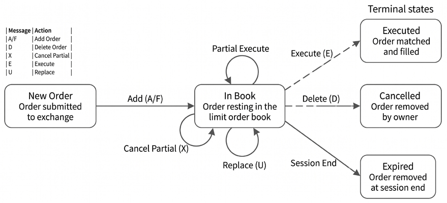
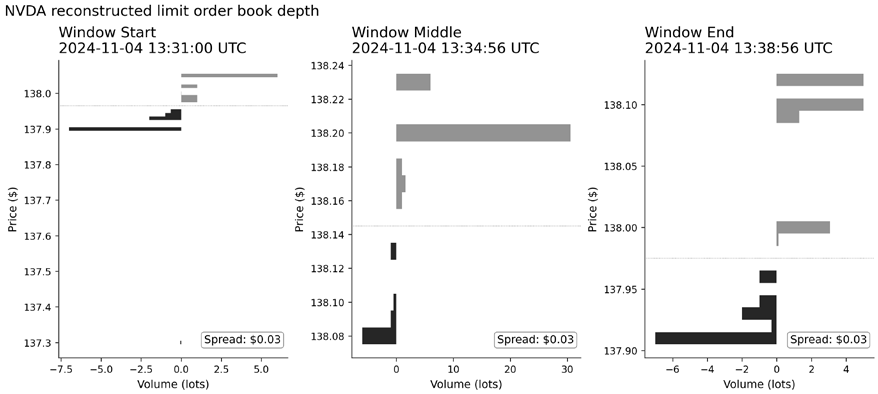
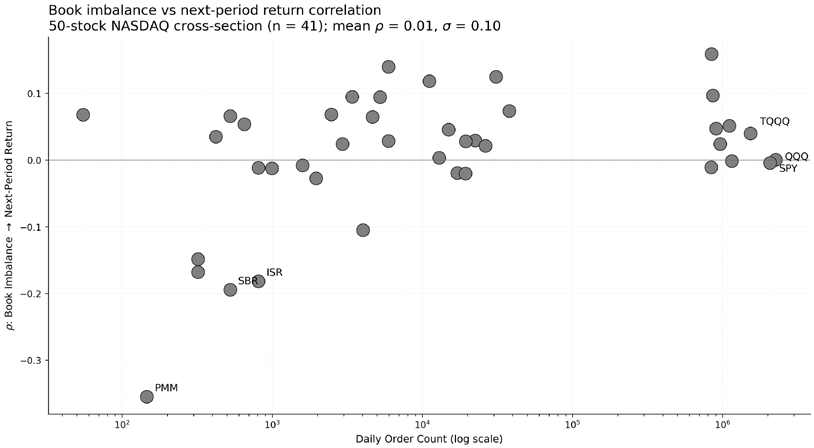
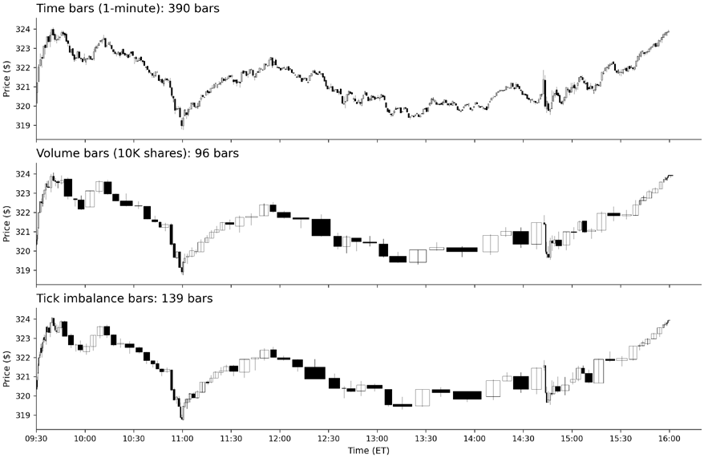

# Chapter 3: Market Microstructure

Market prices result from an engine that matches supply and demand under explicit rules. These matching engine rules determine what the data means (what counts as a trade, a quote, a “close”), and what a strategy can realistically earn once spreads, depth, and execution constraints come into play. We lay the foundation for working with modern market data, from parsing raw exchange messages to reconstructing order books and sampling tick-level data into bars whose statistical properties match how information arrives.

Consider a simple momentum rule: buy when the price rises above its 20-day moving average. A naïve backtest might use daily closes and assume immediate fills at the bar’s end price. In live markets, execution is shaped by the order book:

- A market buy typically executes at the **ask** and a market sell at the **bid**, so traders pay the spread rather than transacting at the last price or a bar reference such as the “close.”
- Execution quality depends on *available depth and queue position*. Larger or poorly timed orders can walk the book, fill partially, and move prices.
- In volatile periods, spreads widen and displayed depth becomes less reliable as cancellations accelerate, making “filled at the close” a fragile assumption even at daily horizons.

When backtests ignore spreads, depth, and queueing, the error is not just a “cost” but a mis-modeled price-formation process. Our goal is to make the price-formation process explicit so readers can (i) interpret market data correctly, (ii) choose sampling methods that respect how information arrives, and (iii) model execution and transaction costs in a way that survives contact with real markets. After completing this chapter, you will be able to:

- Explain how liquidity, order types, and price discovery shape market data (*Section 3.1*).
- Describe the main market data feed types from market-by-order to aggregated bars (*Section 3.2*).
- Parse exchange messages and reconstruct a limit order book (LOB) from an event stream (*Section 3.3*).
- Build time- and information-driven bars to reduce noise and improve statistical properties (*Section 3.4*).
- Detect price jumps in intraday returns and separate continuous from jump variance (*Section 3.5*).
- Apply data-quality and sessionization controls for intraday data (*Section 3.6*).

*Section 3.2* introduces the five tick-level sources used in this chapter, positions each within the data hierarchy, and explains what analyses each enables.

## 3.1 How microstructure impacts price formation

Market data is the observable output of a matching engine: rules plus order flow produce quotes and trades. As O’Hara (1995) emphasizes, market structure choices have first-order effects on trading costs and price discovery. Without these mechanics, the data is easy to misread, strategies are mis-specified, and backtests do not survive contact with real execution.

At the core, trading coordinates latent supply and demand among anonymous counterparties. The **bid** is the highest price a buyer is willing to pay; the **ask** (or offer) is the lowest price a seller is willing to accept. Their difference, the **bid–ask spread**, is both a fundamental transaction cost and a primary measure of liquidity. For trading decisions, liquidity has three separable dimensions:

- **Spread**: The cost of immediate execution. Tighter spreads generally indicate more competitive markets.
- **Depth**: The quantity available at and away from the best prices. Depth determines how much can be traded before prices move.
- **Resiliency**: How quickly liquidity replenishes after trades consume it.

Together, these dimensions determine the feasibility of strategy: small signals cannot overcome wide spreads, and large positions require depth and resilience.

### The frictions faced by liquidity providers

Participants either supply liquidity with resting orders or demand it with marketable orders:

- **Liquidity providers** (including market makers) post limit orders that supply quotes. They earn the spread *in expectation*, but only if they control selection risk and manage inventory.
- **Liquidity takers** demand immediacy by submitting marketable orders (market orders or aggressively priced limits). They incur spread costs and execution costs that depend on depth, volatility, and routing.

Two frictions drive quote formation and realized spreads:

1. **Adverse selection:** Liquidity providers quote under information asymmetry: if counterparties trade on information not yet reflected in prices, passive fills become losses. Providers respond by widening spreads, shading quotes, or reducing displayed depth to compensate for expected losses.

Kyle (1985) formalizes this: price impact is proportional to net order flow, with **Kyle’s lambda** measuring the strength of price responses to trade imbalances - a key input for the execution cost models we develop in *Chapter 18*. Glosten and Milgrom (1985) show that bid-ask spreads arise purely from adverse selection, even in the absence of transaction costs.

1. **Inventory risk:** Providing liquidity requires accumulating positions. A provider that becomes too long into a falling market, or too short into a rising one, can lose more on inventory than it earns from spread capture. Therefore, inventory constraints influence both quote placement and supply depth.

The spread compensates for **order processing** (fees, technology), **inventory holding**, and **adverse selection**. Madhavan (2002) shows that price impact has both temporary and permanent components, and is nonlinear in order size. In fast markets, adverse selection dominates; in calmer conditions, fee schedules and venue incentives matter more.

### How order types express intent in the limit order book

**Orders** encode trading intent. Their details determine how a trade executes, what is paid in spreads and slippage, and what can be inferred from quotes and prints.

A **resting order** adds displayed depth; a **marketable order** removes it by crossing the spread.

- **Marketable orders** (market orders and marketable limit orders) execute immediately against the best available resting liquidity. Trade prints typically appear at the current best bid/ask, alongside a corresponding reduction in displayed size at that level (often followed by a price change if the level is exhausted).
- **Limit orders** specify a worst acceptable price. If priced to rest, they add liquidity at their price level (increasing displayed depth, and sometimes improving the best bid/ask). If priced to cross, they behave like marketable orders but with a price bound.
- **Stop and stop-limit orders** activate when a reference price crosses a threshold. Stops are often broker-managed and therefore absent from exchange-visible book data until triggered. Once triggered, a **stop-market** becomes a marketable order (often visible as a burst of executions and rapid top-of-book depletion near the trigger). In contrast, a **stop-limit** becomes a limit order that may not fill if the market moves past it quickly.

Modern venues also offer order types that reduce information leakage or automate repricing:

- **Hidden and iceberg orders** trade without fully displaying size, disguising intent. A common signature is repeated same-price prints with the displayed quote size refreshing rather than depleting.
- **Pegged orders** automatically reprice to a reference (often the midpoint or best quote). A common signature is prints inside the spread (for example, at the midpoint) without a corresponding displayed quote at that exact price.
- **Post-only orders** are designed to *rest* (maker behavior): they add liquidity and are rejected or repriced rather than executed immediately if they would cross the spread.

These signatures are useful diagnostics but only suggestive: hidden liquidity and routing can generate similar prints. Repeated fills with quote refresh suggest non-displayed supply; inside-the-spread prints suggest reference-priced liquidity that may never appear in the visible book.

### Market design and intraday regimes

Markets match orders through different mechanisms, and microstructure varies predictably over the trading day; both dimensions shape what the data means and when signals are actionable.

Electronic limit order books dominate modern price formation, with orders executing under price–time priority across multiple venues. Quote-driven markets remain important in OTC, FX, and fixed income, where dealer inventory and relationship pricing shape execution. Periodic auctions - especially opening and closing - concentrate liquidity and set benchmark reference prices.

**Intraday seasonality** is a first-order confounder: the same “signal” can mean different things at 9:35 AM and 2:00 PM. Three regimes dominate:

- **Opening** (first 30–60 minutes): High volatility, wide spreads, heavy trading as overnight information is incorporated. Madhavan, Richardson, and Roomans (1997) show that information asymmetry - measured via the MRR model - starts high at the open and declines as prices are discovered, while inventory costs rise toward the close. Schwartz, Ross, and Ozenbas (2022) confirm that variance ratios remain elevated in the opening half-hour, indicating microstructure noise rather than fundamental information.
- **Midday**: Lower activity, thinner liquidity. Spreads may tighten, but depth is shallow - the same order size has greater price impact than during busier periods.
- **Closing** (final hour): Elevated volume as institutions complete programs and index funds rebalance. The closing auction concentrates substantial liquidity and sets reference prices for benchmarks and settlement.

These U-shaped patterns in volume, volatility, and spreads shape execution timing and signal interpretation. Across the 13-day ITCH sample, the first and final 30 minutes each account for roughly 15–17% of daily volume, compared with 2.6% at midday - about a 6× open-to-midday ratio (see `06_itch_intraday_patterns`).

O’Hara (2015) emphasizes that algorithmic trading has altered flow interpretation: institutional parent orders now break into many passive child orders so that a large buy may appear as a stream of sell-side prints (passive fills on the bid). This can confound naive trade-signing heuristics. The next section turns to the content of market data feeds.

## 3.2 The anatomy of modern market data feeds

Market data arrives through a hierarchy of feeds that differ in *latency, cost, coverage, and information content*. Reck (2022) offers a practitioner’s view of how market design choices propagate into data products and, ultimately, what strategies are feasible. In practice, data decisions are part of strategy design: the feed you can afford and process determines what you can observe (and which information is not visible), how quickly you can observe it, and which research and backtesting assumptions are defensible.

### The data hierarchy – From best quote to full order book

Vendor terminology varies; here, we define the distinctions among market data feeds by information content: top-of-book, price-level depth, and order-level events. Examples use U.S. equities, but the hierarchy generalizes across venues and asset classes:

#### Level 1 (L1): Top-of-book quotes

L1 provides the *best displayed prices* currently available.

- **What it is:** The highest bid and lowest ask at the top of the book.
- **BBO** is venue-specific (in other words, the best bid/offer for a given venue).
- **NBBO** is the national best bid/offer across protected exchanges via the SIP (top of book). It reflects protected quotations on exchanges (not dark pools/internalizers), and its construction depends on the prevailing lot/quotation rules.
- **What you can do with it:** Compute spreads and midprice, build basic **Trades and Quotes** (**TAQ**) signals, and define immediately actionable reference prices.
- **What it hides:** Depth beyond the top level and any queue dynamics that determine fill probability and slippage.

#### Level 2 (L2): Market-by-price depth (MBP)

L2 adds *displayed depth (number of resting limit orders) by price level* on each venue (often top N levels).

- **What it is:** Aggregated size at each price level (orders are combined by price).
- **What you can do with it:** Estimate displayed liquidity, depth imbalance, and execution difficulty beyond top-of-book.
- **What it hides:** Order count, queue position, and time priority within a price level.

#### Level 3 (L3): Market-by-order messages (MBO)

L3 provides *order-level events* that allow deterministic replay of the book state.

- **What it is:** Submissions, modifications, cancellations, and executions at the individual order level.
- **What you can do with it:** Reconstruct venue-level book state and measure order flow (cancellations, replenishment, event-by-event dynamics).
- **What it hides:** Nothing about displayed order flow on that venue - but it is more demanding operationally and typically more expensive than L1/L2.

Most commercial “tick” products are TAQ; deeper products add depth or order messages.

### Trades and quotes – The standard data package

Most medium-horizon strategies can be built from TAQ alone (prices, spreads, volume, and basic liquidity proxies).

- **Trades** are completed transactions with price and size.
- **Quotes** summarize the displayed bid/offer (top-of-book); depth is provided separately in L2/ MBP products.

In U.S. equities, consolidated infrastructure produces a market-wide view of top-of-book quotes and trades (including the official NBBO), while exchanges sell proprietary direct feeds with faster delivery and richer fields. Consolidated feeds prioritize coverage; direct feeds prioritize speed and venue-specific detail.

TAQ-style datasets are sufficient for many medium-horizon strategies, but they are limited for microstructure work. Without order-level messages, you cannot reconstruct the evolving book, estimate queue position, or directly measure liquidity replenishment and cancellation dynamics.

**Enriched TAQ products** (for example, minute bars with precomputed microstructure fields) can help bridge part of this gap by incorporating trade-direction buckets, quote-pressure proxies, or off-exchange activity. They are useful, but treat them as *derived features* with embedded assumptions. Understanding what they measure (see `13_algoseek_minute_bars_eda.py` for the 61-column schema) prepares the way for feature engineering in *Chapter 8*.

### Price conventions in this chapter

Different data products expose different “prices,” and they are not interchangeable. We use the following conventions and label them explicitly in figures and captions:

- **Midprice**: (bid + ask) / 2, computed from the relevant L1 quote (venue BBO or consolidated NBBO, depending on the feed). We use midprice changes as a default proxy for price discovery because it reduces bid–ask bounce relative to trade prices.
- **Last trade (print)**: The most recent transaction price. It reflects a completed trade but includes microstructure noise from trade direction and execution venue.
- **Close**: In bar construction, typically the last trade within the bar interval; for daily bars, often the official closing price from the exchange’s closing auction.

Rule of thumb: Use midprice for measuring short-horizon price response (signals); use executable prices (bid for sells, ask for buys) for PnL markouts; use last trade/close for standard OHLC bars unless stated otherwise.

These distinctions shape strategy feasibility. L1 signals are widely available and therefore more crowded. Strategies that depend on depth, queue dynamics, or very short-horizon order flow usually require L2 or L3 - and that shift increases engineering requirements and data costs.

The feeds, books, and bars in this chapter are outputs of market microstructure mechanisms, not neutral measurements. That perspective helps you choose fit-for-purpose data, encode realistic backtest assumptions, and make sampling decisions that reduce bias rather than create it.

### Sample datasets – From MBO to enriched bars

This chapter uses five tick-level sources spanning the data hierarchy:

**Market-by-order (L3):**

- **NASDAQ ITCH** provides order-level events for LOB reconstruction and order-flow analysis (notebooks `01`–`07`, with bar sampling on the same source in notebooks `14`–`16`). Raw binary messages (>10GB/day uncompressed for our sample) require parsing but offer complete visibility into venue-level book dynamics.
- **DataBento MBO** offers similar granularity in a user-friendly format on a commercial basis (notebooks `08`, `09`, and `17`).

**Market-by-price depth (L2):**

- **IEX HIST** provides free, publicly accessible depth data aggregated by price level (L2). You can build a price-level book (aggregate size at each price level), but you can’t track individual orders or queue positions. Simpler than MBO but sufficient for spread analysis and depth-based signals (notebook `10`).

**Trades and quotes:**

- **AlgoSeek TAQ** delivers nanosecond-precision trades and NBBO quotes without depth. Notebooks `11`–`12` analyze tick-level patterns during the March 2020 crash.
- **AlgoSeek minute bars** provide 61 precomputed microstructure columns derived from TAQ data - trade buckets, pressure indicators, and off-exchange volume - serving as input to *Chapter 7* feature engineering (notebook `13`).

These sources illustrate a practical reality: “tick data” is a family of products, not a single standard.

### Message protocols – From human-readable to fast binary

The hierarchy maps directly to distribution protocols: TAQ-style consolidation vs. venue-direct binary feeds; crypto often via APIs:

- The **FIX** protocol remains central to *order entry* and many *post-trade workflow*s, but it is not designed for high-rate public-market data distribution.
- Real-time exchange feeds typically use **binary protocols and multicast** for high throughput. Examples include NASDAQ ITCH (notebook `01_itch_parser`), NYSE XDP, and Cboe PITCH.
- Crypto markets often expose data through API-style access: **REST** for historical downloads and **WebSocket** streams for real-time updates. The barrier to entry is lower, but stability, rate limits, schema drift, and cross-venue timestamp synchronization become first-order data-quality problems.

**Further reading**: Novocin and Weber (2022) examine how blockchain, decentralized autonomous organizations, and generative AI are reshaping exchange platforms and the data products built on them.

### Data integrity challenges

At high frequencies, infrastructure details become data-quality constraints:

- **Latency and co-location:** For sub-second strategies, *where* you ingest data, and *which feed you use* can change what you observe. SEC market structure work and SIP latency analyses (Holden et al., 2023) document that consolidation and distribution introduce delays, and that direct feeds can arrive earlier - differences that can range from hundreds of microseconds to single-digit milliseconds depending on network design and proximity. Aquilina et al. (2021) assert that latency arbitrage races occur roughly once per minute per liquid symbol (FTSE 100), with the modal race lasting just 5–10 microseconds, and impose an aggregate tax of approximately 0.5 basis points on trading - billions of dollars annually across global equity markets.
- **Timestamp semantics:** Vendors may normalize, truncate, or re-stamp timestamps. Verify whether a timestamp reflects the exchange event, SIP publication, vendor processing, or local arrival.
- **Exchange time versus decision time:** Treating exchange time as decision time creates lookahead bias when observation and processing delays are ignored. Use arrival timestamps when available, or apply conservative lags when they are not - especially for event studies and sub-second strategies - depending on the estimated event travel time. Holden et al. (2023) emphasize that latency affects trade–quote alignment and can bias standard microstructure measures if handled incorrectly.
- **Corrections and cancellations:** Real feeds include corrections, cancellations, and late reports. For historical research, prefer vendor-cleaned end-of-day datasets over archived real-time captures, but confirm the provider’s correction policy.
- **Fragmentation and normalization:** Modern equity markets span exchanges and off-exchange venues (ATSs, dark pools, internalizers). Off-exchange volume has grown steadily - from roughly 37% in 2019 (SEC 2020) to over 50% by the early 2020s (SIFMA US Equities Volume Summary) - which shapes data availability and price discovery. The burden is not just “more venues,” but schema normalization, symbol handling, clock alignment, and deterministic replay across heterogeneous feeds.

Subscription, parsing, timestamping, and precision set up everything that follows. The next section turns to the most information-rich case, message-level events. The goal is not parsing for its own sake but making implicit market state explicit - a prerequisite for understanding what microstructure features measure and what backtests assume.

## 3.3 From raw messages to the limit order book

**The limit order book** (**LOB**) contains all active limit orders at any given point in time. Reconstructing the LOB turns message traffic into state: a time-indexed view of best prices, depth by level, and the event history that produced them. This is the core data-engineering step behind microstructure-aware research and execution modeling. Throughout this section, “LOB” refers to the *displayed, venue-local* book implied by the feed (not a consolidated market-wide book). Practically, reconstruction follows a simple pipeline: parse messages, normalize fields, apply updates, enforce invariants, snapshot the state, and validate outputs against independent references (for example, BBO/NBBO time series). Gould et al. (2013) survey LOB modeling and empirical regularities, providing useful conceptual foundations. Zhang, Zohren, and Roberts (2019) apply convolutional neural networks (DeepLOB) and Zhang et al. (2025) apply clustering (ClusterLOB) to generate trading signals from LOB data.

### NASDAQ TotalView-ITCH – A case study

NASDAQ’s TotalView-ITCH data feed exemplifies modern, message-by-order exchange data. It publishes order-level events - adds, cancels, replaces, and executions - that let you reconstruct the visible book throughout the trading day and study how liquidity evolves at the venue.

NASDAQ also provides downloadable historical samples, making ITCH a practical learning resource for readers who want hands-on exposure to real exchange protocols. We use a single day of data (January 30, 2020) for the headline pipeline and detailed empirical work. The raw file contains 423 million messages and expands to roughly 13 GB uncompressed, which demands streaming I/O, memory discipline, and reproducible parsing.

### Binary parsing at scale

Each message follows a precisely defined binary structure with nanosecond timestamps and fixedpoint prices (four implied decimals). A single trading day contains hundreds of millions of messages, requiring streaming processing - parse sequentially and write to disk incrementally.

Processing hundreds of millions of binary messages exposes the performance gap between research and production systems. The companion repo provides two parsers: a **Python implementation** prioritizing readability (about 23 minutes for a full day via `01_itch_parser.py`) and a **Rust implementation** that uses memory-mapped I/O for roughly an order-of-magnitude faster parsing (well under five minutes).

| Metric | Python | Rust | Notes |
| --- | --- | --- | --- |
| Wall-clock time | ~23 min | < 5 min | ~5–8× speedup |
| Memory footprint | ~8 GB peak | < 500 MB | ~16× smaller |

*Table 3.1: 13 GB ITCH file (423M messages). Timings are hardware-dependent and approximate; precise Rust benchmarks are pending a multi-machine benchmark notebook*

Both parsers emit the same schema and are validated via checksum sanity checks, round-trip decoding tests, and consistency checks on downstream outputs (for example, identical BBO time series).

The parsed output - Parquet files partitioned by message type - serves as the stable input to all downstream notebooks. Whether the parse runs in Python, Rust, or a commercial service, the reconstruction logic below is unchanged.

### The LOB state machine

A reconstructed order book is a state machine updated by each event. The implementation must maintain two related views of state:

- An **order registry** keyed by order reference number to track remaining size, price, and side. Later messages ( cancel/execute/delete) refer to the original order ID.
- A **price-level view** for fast queries and snapshot generation.

The ITCH 5.0 specification defines 20+ message types; for LOB reconstruction, the essential ones are:

- **Add Order**: **A** (anonymous) and **F** (with MPID attribution)
- **Cancel/Delete/Replace**:
- X (partial cancel)
- D (delete)
- U (replace: old order terminated, new order ID created)
- **Executions**:
- E (executed at the order price)
- C (executed with an explicit execution price)

System context messages (for example, **S** system events, **R** stock directory, **H** trading action) are required to correctly interpret the trading day. Trade-reporting messages such as **P** (trade) and **Q** (cross trade) are important for activity analysis and auctions, but they are not book-update events in the same way as adds, cancels, replaces, and executions.

The registry answers “what remains of order 123?”, the price view answers “how many shares are bid at $101.23?” The core ITCH mechanics are:

- **Add (A, F)** creates a visible limit order: assert that the reference is new, insert it into the registry, and increase the depth at that price. **F** is “add with attribution” (MPID), not a different economic event.
- **Cancel/Delete/Replace** modifies or terminates liquidity: **X** reduces shares (partial cancel), **D** removes the order, **U** terminates the original and creates a new reference - correct handling of replace chains is essential.
- **Executions** reduce the remaining shares on a resting order: **E** executes at the order price, while **C** supplies the execution price when it differs from the order price. Trade-reporting messages such as **P** (trade) and **Q** (cross-trade) are useful for activity analysis and auctions, but they are not book-update events like adds, cancels, replaces, and executions.
- **Trade and cross messages (P, Q)** contribute to execution analytics but do not substitute for order-level book updates.

*Figure 3.1* maps each ITCH message type to a state transition in the order lifecycle.

*Figure 3.1: Order lifecycle state machine showing how ITCH message types drive transitions*

On our sample day, roughly 96% of submitted orders are ultimately deleted; many never execute, while some execute partially and are later deleted (see `04_itch_order_lifecycle_analysis.py`).

### Maintaining book integrity

LOB reconstruction is an accounting problem: every message updates the state, and small inconsistencies compound quickly. Cont, Kukanov, and Stoikov (2014) analyze how order book events translate into price movements, making accurate reconstruction a prerequisite for meaningful measurement of impact and liquidity. In practice, treat reconstruction as a state machine, as depicted in *Figure 3.1*, with explicit invariants. Our reference implementation fails fast when these invariants are violated; production pipelines often quarantine and count violations instead, then decide whether to drop symbol/ time ranges or apply feed-specific repair rules. At a minimum, validation checks should enforce that:

- Order references exist before any modification, execution, or cancellation
- The remaining quantity is never negative (per order and per price level)
- Prices are valid for the instrument (tick size, auction bands where applicable) and remain within sanity bounds
- Aggregate depth by price level equals the sum of constituent orders at that price (within the reconstructed scope)

In addition, maintain *price-level totals* as a first-class state. Price-level cleanup is then a consequence of the accounting: decrement the size when trades execute, or orders are canceled; remove a level when its aggregate size reaches zero; and flag an error if a level would become negative. When the pipeline persists periodic snapshots, reconcile them against the event-driven state (for example, level totals, best bid/ask) to catch drift early.

### Single-exchange data – A local view

A key limitation of direct feeds, such as Nasdaq TotalView-ITCH, is that they describe the state of a **single venue’s order book** (Nasdaq’s “single book”) rather than a consolidated market-wide book across venues. In fragmented equity markets, the best price and deepest liquidity may reside on other exchanges or off-exchange at the same moment, so a single-venue book is an incomplete view of executable liquidity.

This matters in two ways:

1. *Venue-local best quotes* can differ materially from the NBBO, and the depth that looks “available” on one venue may be irrelevant if an order routes elsewhere (or if routing constraints prevent access).
2. Comparing a venue-local reconstruction with consolidated data can produce *apparent* locks or crosses at the market level (for example, a local best bid exceeding the consolidated best ask) due to timestamp differences, feed latency, and the fact that “market-wide” best quotes are assembled from multiple asynchronous sources.

Treat these as diagnostic signals: they can indicate real fragmentation and timing issues, but they can also surface clock alignment issues or message-handling bugs.

Market-wide best prices require consolidated top-of-book data (SIP/CTA/UTP) and, for depth, a **multi-venue aggregation pipeline** that normalizes timestamps and quote semantics across feeds. Single-venue books remain valuable for venue-level microstructure, queue dynamics, and building intuition about how order events translate into observed prices - provided the analysis is explicit about what the book does and does not represent.

### Snapshots and analysis

Once reconstruction passes invariant checks, capture order-book snapshots either at a fixed clock interval (for example, every 100ms) or in event time (for example, every N book updates). The choice is part of the measurement design: clock-time snapshots align naturally with latency and execution constraints; event-time sampling aligns with information arrival but can over-represent active periods.

From snapshots, compute a small set of metrics that summarize liquidity and state:

- **Bid-ask spread** measures the cost of immediate execution in the displayed book. Track both the absolute spread and a relative measure (for example, spread divided by midprice) to compare instruments.
- **Displayed depth** measures available size by level. Top-of-book depth matters for short-horizon execution; deeper levels for capacity and impact.
- **Top-of-book imbalance** refers to the asymmetry in displayed depth at the best prices. This snapshot descriptor differs from event-based **order flow imbalance** (**OFI**) (Cont, Kukanov, and Stoikov, 2014). Hautsch and Huang (2012) show that limit orders, not just marketable orders, carry meaningful information for price discovery - challenging the view that only market orders drive prices.

*Figure 3.2: A reconstructed LOB showing bid (green, left) and ask (red, right) depth across price levels at three times during the trading day. Data: DataBento MBO for NVDA, regular session*

In *Figure 3.2*, the Nasdaq-visible spread varies from $0.01 at midday (when liquidity is deepest) to $0.06 near close. This intraday pattern - tighter spreads during calm periods, wider at the open and close - reflects the changing cost of providing liquidity. These are venue-local measures from Nasdaq’s single book and may differ from NBBO-based measures in fragmented markets (see `08_databento_` `lob_reconstruction.py`).

### Empirical findings

Modern electronic markets are dominated by order updates and cancellations. Hasbrouck and Saar (2013) document that the vast majority of limit orders are canceled before execution and that median lifetimes are well under a second - “fleeting orders” probing for hidden liquidity. Our single-day NASDAQ ITCH snapshot (January 30, 2020) of 423 million messages includes 186.6 million add-order events and the following lifecycle counts (computed by `04_itch_order_lifecycle_analysis.py`):

| Metric | Count |
| --- | --- |
| Add-order events (A + F) | 186,610,705 |
| Delete events (D) | 180,285,101 |
| Partial-cancel events (X) | 4,990,972 |
| Replace events (u) | 36,777,372 |
| Execute events (E + C) | 8,555,084 |
| Unique orders with a delete event | 172,764,815 |
| Unique orders with at least one execution | 6,258,508 |
| Cancellation rate (delete events/add events) | 96.6% |
| Execution rate (orders with execution/add events) | 3.4% |

*Table 3.2: Order Lifecycle Statistics (NASDAQ, January 30, 2020)*

Rates are not complements: an order can be partially executed and later deleted. Cancellation rate is the fraction of submitted orders that receive at least one delete event in their lifecycle; execution rate is the fraction with at least one `E` or `C` execution. Counts of `D`/`X`/`U` events exceed unique-order counts because the same order can be partially canceled before being deleted, and replace messages create a new order reference whose lifecycle is then tracked separately.

Time to cancellation:

- 41% of cancellations occur within 500 milliseconds
- 50% within one second (median: 0.99 seconds)
- 80% within 10 seconds

Time to execution:

- 10% of executions occur within 1 millisecond
- Median execution time is 6.1 seconds
- 1% of orders wait over 40 minutes for execution

These patterns are consistent with algorithmic market making and automated order management. High cancellation and replacement activity is not, by itself, evidence of misconduct; it is a mechanical consequence of competitive quoting, inventory control, and rapid information incorporation - while still implying that displayed liquidity can be fleeting and must be modeled carefully. See `05_itch_` `trading_activity.py` for market-wide statistics.

**Important caveat**: Reconstruction systems show the *visible* order book. Hidden orders (icebergs) and internalized order flow remain invisible - a reconstructed LOB represents only displayed liquidity, not total available liquidity.

### LOB stylized facts – Predictive patterns

Beyond reconstruction mechanics, LOB data reveals empirical patterns with predictive power. The companion notebooks demonstrate three well-documented regularities:

- **Top-of-book depth imbalance** measures the asymmetry between bid-side and ask-side volume at the best prices: (`bid_size` − `ask_size`) / (`bid_size` + `ask_size`). When bids exceed asks, buying pressure often leads to short-term price increases - but the signal is weaker than often assumed. mean 𝜌01, 𝜎10, range −0.35 to 0.16) with subsequent returns (*Figure 3.3*). Each point Our analysis of Nasdaq-book OFI across 50 stocks shows a *weak, noisy correlation* (cross-stock

in *Figure 3.3* represents one stock; the x-axis shows activity level, and the y-axis shows the imbalance-return correlation; see `03_itch_lob_analysis` for details.

The finding that naive imbalance metrics are not directly tradeable is consistent with the literature: raw microstructure signals require conditioning on context (spread dynamics, time of day, extreme events) to extract actionable edge. *Chapter 6*’s order flow reversal strategy demonstrates how conditional signals can work where unconditional ones fail. **Terminology note**: This is a *state-based* measure from LOB snapshots. *Chapter 8* covers additional imbalance metrics, including *trade imbalance* (from signed trade volume) and *event-based OFI* (Cont, Kukanov, and Stoikov, 2014), which measure queue changes rather than queue levels.

*Figure 3.3: Naive imbalance shows weak predictive power. Data: NASDAQ ITCH, multiple symbols, January 30, 2020*

**Tradability caveat**: A positive association at a one-second horizon is not a trading rule. At this horizon, spread and queue dynamics dominate PnL. The notebook `09_databento_` `mbo_analysis.py` reports both midprice and executable markouts (using bid/ask at decision time) to illustrate this gap.

- **Intraday U-shaped patterns** in volume and volatility are well established: trading activity peaks at the market open and close, with a lull in the middle of the day. This pattern persists across both liquid and illiquid stocks, though the magnitude varies. See `06_itch_intraday_patterns.` `py` for the aggregate cross-section.
- **Bid-ask bounce** manifests as negative first-order autocorrelation in tick-level returns. When trades alternate between hitting the bid and lifting the ask, sequential returns exhibit apparent mechanical mean reversion. Understanding this effect is essential for constructing return targets - naive tick-to-tick returns contain significant microstructure noise. See `07_itch_stylized_` `facts.py` for autocorrelation analysis.

The liquidity spectrum spans orders of magnitude. AAPL trades 50+ million shares daily; obscure ETFs like UGA may trade fewer than 100,000 shares. This dispersion in displayed depth is associated with differences in spread, volatility, and price impact - patterns we exploit when engineering features in *Chapters 8* and *9*, and modeling execution costs in *Chapter 18*. The next section addresses how to sample this high-frequency data into analytical bars.

**Implementation**: For LOB reconstruction across the four data sources surveyed in *Section 3.2*:

- `02_itch_lob_reconstruction.py` (ITCH MBO)
- `08_databento_lob_reconstruction.py` (DataBento MBO)
- `10_iex_lob_reconstruction.py` (IEX MBP)
- `12_algoseek_taq_lob_reconstruction.py` (AlgoSeek TAQ NBBO)

## 3.4 The art of sampling

Raw tick data is voluminous and noisy. The **bid-ask bounce** alone causes price oscillations as trade initiation alternates between buyers and sellers - a buy market order executes near the ask, a sell near the bid, creating apparent volatility that reflects microstructure mechanics rather than information.

Sampling ticks into analytical **bars** reduces noise, compresses data, aligns observations with a chosen notion of ‘time’ (clock time or activity time), and produces time series with statistical properties better suited to machine learning models. The choice of sampling method significantly affects model performance.

### Standard aggregation methods

All bar types compute similar summary statistics over their respective intervals:

- **Open, High, Low, Close (OHLC)**: First, maximum, minimum, and last prices
- **Volume**: Total shares or contracts traded
- **VWAP**: Volume-weighted average price
- **Trade count**: Number of individual transactions

The methods differ in how they define interval boundaries.

#### Time bars

**Time bars** aggregate trades within fixed calendar intervals (1-minute, 5-minute, daily). They are intuitive and ubiquitous, but they suffer from **unequal information content**: a minute during the opening rush can see hundreds of trades; a minute during lunch might see only a handful.

#### Tick, volume, and dollar bars

Several bar types aim to hold some proxy of trading activity, rather than time, constant:

- **Tick (or trade) bars** aggregate a fixed number of transactions regardless of size - equal transaction count, but ignoring trade magnitude.
- **Volume bars** aggregate until the total volume exceeds a threshold, thereby better capturing market activity because large trades carry more weight.
- **Dollar bars** aggregate by traded value (price × volume), providing more robust handling of price level changes than volume bars - the same shares at doubled price represent twice the economic activity.

**Note**: Dollar bars help capture organic price changes but still require attention to corporate actions; a 2-for-1 split doubles the share count while halving the price, so the dollar threshold must be rescaled or prices must be split-adjusted.

Easley, López de Prado, and O’Hara (2012) develop the “**volume clock**” concept, showing that sampling based on volume rather than calendar time yields more stable statistical properties - a key motivation for activity-time sampling methods such as volume and dollar bars. High-frequency trading is defined not by speed per se but by operating in “**event-based time**,” which yields returns that are closer to a normal distribution and exploits traders who think in clock time.

*Figure 3.4: Comparison of bar sampling methods on the same underlying tick data*

As shown in *Figure 3.4*, time bars produce a fixed sequence of intervals. In contrast, volume bars adapt to market activity, concentrating samples during high-activity periods and spacing them out during quiet periods. See `14_itch_bar_sampling.py` for the comparison code.

### Information-driven bars

Standard time and volume bars summarize trading activity but don’t explicitly target when new information arrives. *Information-driven bars* aim to identify when new information enters the market, drawing on concepts from market microstructure theory. Marcos López de Prado introduced these methods in *Advances in Financial Machine Learning* (López de Prado, 2018), building on research showing that sequences of trades consistently initiated by one side - buy or sell streaks - often signal informed trading.

#### Trade classification – Data sources matter

Information-driven bars require knowing the **aggressor side** of each trade - whether the buyer or seller initiated the transaction to identify when a buy or sell streak starts. López de Prado lists “Aggressor side” as standard market data in his taxonomy, and CME provides it directly via FIX tag 5797. The challenge is that not all data feeds include this field:

- **Some institutional MBO feeds** (for example, DataBento) provide the aggressor side directly. Most trades in our DataBento NVDA sample include aggressor-side labels (B=buy, A=sell), with a minority marked as neutral/unknown - enabling direct computation of imbalance bars without estimation. Other vendors (Refinitiv, Bloomberg) vary by product and entitlement.
- **ITCH Trade (P) messages**, while excellent for learning the protocol, do not include aggressor direction - each trade reports the same indicator regardless of which side initiated it. For the ITCH sample data, we must estimate direction.

#### The Lee-Ready algorithm

When the aggressor side is unavailable, the **Lee-Ready algorithm** (Lee and Ready, 1991) estimates it by combining quote and tick information:

1. **Quote (midpoint) test**: Compare trade price to the midpoint of the prevailing bid-ask spread. Trades above the midpoint are classified as buys; trades below as sells.
2. **Tick test fallback**: When trades occur exactly at (or extremely near) the midpoint, use the price change from the previous trade. An uptick (a price increase) indicates a buy; a downtick (a price decrease) indicates a sell. If unchanged, carry forward the last non-zero direction.

**Practical note**: Lee-Ready is only as good as the **quote alignment**. If quotes and trades are not time-synchronized, define an “as-of” rule (or apply a small lag) to avoid using quotes that were not yet visible at the time of the trade.

#### Empirical validation – Classification accuracy

We validated classification methods using DataBento NVDA data, in which direct aggressor labels serve as the ground truth. The results reveal important differences between approaches:
| Method | Coverage | Accuracy | Notes |
| --- | --- | --- | --- |
| Lee-Ready (quote plus tick) | 100% | 94.7% | Requires the best bid/ask quotes aligned with each trade |
| Tick test (continuous) | 100% | 80.0% | Carries forward the last direction |
| Tick test (non-zero) | 19% | 90.0% | Only classifies when the price changes |

*Table 3.3: Trade classification accuracy (NVDA, 742,527 trades across 5 DataBento days)*

*Table 3.3* shows validation results for NVDA trades using DataBento aggressor labels as the ground truth over five trading days (2024-11-04 to 2024-11-08). Accuracy is computed on trades with non-unknown ground-truth side; unknown/neutral trades are excluded, and quotes are aligned using an as-of rule with a small lag. Lee-Ready accuracy was stable across days (94.4–95.0%); the tick test averaged 80%. “Coverage” indicates what percentage of trades receive a classification. See `15_itch_lee_ready.py` for the full multi-day analysis.

The tick test faces a fundamental challenge: **most consecutive trades occur at the same price** (zero-tick) - across the five NVDA days, only about 19% of trades carry a non-zero price change. The continuous tick test handles this by carrying forward the last non-zero direction, reaching 80% accuracy - roughly 15 percentage points below Lee-Ready. When only non-zero ticks are classified, accuracy rises to 90%, but coverage drops to that same 19% of trades.

Lee-Ready achieves 95% accuracy by using the order book state (best bid/ask at trade time) for most classifications, falling back to the tick test only for trades at the midpoint. This exceeds the 70–90% range typically cited in academic literature, likely because modern markets with tighter spreads allow more precise quote-based classification.

The practical implication of the ~16-point improvement from the tick test (78%) to Lee-Ready (95%) matters for information bars. With ITCH data, the order book must be reconstructed to compute quote midpoints for Lee-Ready classification - worthwhile complexity for accurate trade-direction estimation. See `14_itch_bar_sampling.py` for a complete implementation.

With only trade prices and no order book reconstruction, the tick test provides reasonable (78%) but not optimal classification. For information bars where direction accuracy directly impacts signal quality, prefer Lee-Ready.

#### Volume imbalance bars

**Volume imbalance bars** (**VIBs**) close when cumulative signed volume exceeds an expected threshold:

- **Label each trade**: +1 if buyer-initiated, -1 if seller-initiated (via Lee-Ready or similar)
- **Compute signed volume**: Label × trade volume
- **Accumulate imbalance**: Running sum of signed volumes
- **Close bar**: When |accumulated imbalance| exceeds expected value

The expected imbalance is derived from historical bar characteristics, updated using an exponential moving average. The algorithm adapts: periods of balanced trading produce fewer, longer bars; periods of sustained buying or selling pressure produce more frequent bars.

#### Tick imbalance bars

**Tick imbalance bars** (**TIB**) accumulate signed trade direction rather than signed volume: 𝜃்= ෍ܾ ǡ᩷᩷ ܧ[|𝜃்|] ൎܧ[ܶ] ⋅|2ܲݎ(ܾ௧= +1) −1| ௧் ௧ୀଵ where 𝑏௧∈+1, −1 is the trade direction. TIBs count all trades equally regardless of size, while VIBs

(above) weight by volume. This means that when the order flow is close to balanced (𝑃(ܾ௧= +1) ≈0.5), the expected imbalance |2ܲݎ(ܾ௧= +1) −1| becomes small and TIBs produce *many short bars*. When one side dominates,

thresholds grow, and bars become longer. TIBs are therefore most interpretable as a *directional pressure sampler*, not as a fixed “bars-per-day” construction. Choose TIBs when trade count matters (detecting informed trading frequency); choose VIBs when volume flow matters (detecting institutional activity).

#### Run bars

**Run bars** form when one side of the market dominates, measured by cumulative trade counts within a potential bar: 𝜃்= ݔ൫ܰ ௕௨௬,ܰ ௦௘௟௟), ܧ[𝜃்] = ܧ[ܶ] ڄ݉ܽ ݔ൫ܲݎ(ܾ௧= +1), 1 − ݎ(ܾ௧= +1))

Run bars count *cumulative* trades on each side, not consecutive same-direction trades. The statistic is the maximum of cumulative buy versus sell counts within the bar, not the length of the longest consecutive streak. Direction changes within a bar do not reset the counts. This captures sustained directional pressure even when individual trades interleave.

#### Calibration – Avoiding threshold spiral

The adaptive **exponential weighted moving average** (**EWMA**) algorithm places greater weight on recent data points and is sensitive to persistent order-flow imbalances. When stocks show systematic buy/sell bias, the standard 𝛼 causes a **threshold spiral**, a positive feedback loop where bars grow progressively larger:

| Symbol | Buy Fraction | E[T] Drift (𝛼) | E[T] Drift (𝛼001) |
| --- | --- | --- | --- |
| NVDA | 47% | 17.5× | 0.98× ✓ |

*Table 3.4: Threshold behavior for NVDA*

Even at a 47% buy fraction, 𝛼 inflates the expected bar size by 17.5× over the trading day - the runaway feedback loop that collapses the day into a handful of oversized bars - while 𝛼001 holds

it essentially flat (0.98×), avoiding the spiral.

Recommended settings: 𝛼 can be too reactive at the tick level for liquid equities; start with a much smaller 𝛼 (for example, 0.001) and verify stability. Use warmup=100+ bars and monitor the

`expected_imbalance` column for drift detection. For production use, consider fixed-threshold imbalance bars, which avoid adaptive feedback entirely. See `16_itch_information_bars.py` for formula verification and `17_databento_bar_sampling.py` for multi-day calibration analysis.

Information-driven bars pose several practical difficulties:

- **Trade classification**: The tick test (~78%) is roughly 16 points below Lee-Ready (~95%). For optimal quality, reconstruct the order book.
- **Circular initialization**: Expected bar length requires existing bars; initialize with reasonable estimates and update via EMA.
- **Parameter sensitivity**: Single trading days rarely suffice; multi-day data produces more robust thresholds.
- **Flow balance**: When P[buy] ≈ 0.5, the expected imbalance approaches zero, causing rapid bar formation.

### Statistical properties comparison

Before the formal statistics, it helps to compare the bar constructions on three axes: the sampling clock, the quantity each method keeps approximately constant, and whether it depends on trade-direction classification (the first four don’t, the last three do).

| Bar Type | Clock | Target | Typical use |
| --- | --- | --- | --- |
| Time | Calendar | Time interval | Clock-time forecasting |
| Tick | Activity | Trade count | Equal trade frequency |
| Volume | Activity | Shares/contracts | Size-based activity |
| Dollar | Activity | Traded value | General ML default |
| Tick imbalance | Information | Signed trade count | Directional pressure |
| Volume imbalance | Information | Signed volume | Informed flow by size |
| Run | Information | Side dominance | Persistent one-sided flow |

*Table 3.5: Bar characteristics*

Empirical testing reveals meaningful differences between bar types. Using NASDAQ ITCH trade data for AAPL (January 30, 2020), we compare standard bars and information-driven bars (with tick-test trade classification). Bar thresholds are noted in parentheses:

| Bar Type | N Bars | Jarque-Bera Stat | Lag-1 Autocorrelation |
| --- | --- | --- | --- |
| Time (1 min) | 390 | 609.0 | -0.023 |
| Volume (10K shares) | 96 | 1.9 | 0.026 |
| Dollar ($3M) | 102 | 2.2 | -0.027 |
| Tick imbalance | 139 | 22.6 | 0.057 |
| Tick Run | 455 | 12.5 | -0.007 |
| Time (1 min) | 390 | 132.8 | 0.014 |
| Tick (500 ticks) | 390 | 58.8 | -0.061 |
| Volume (50k shares) | 380 | 2.3 | -0.017 |
| Dollar ($5M) | 519 | 33.0 | 0.039 |
| Vol Imbalance | 691 | 51.0 | 0.035 |

*Table 3.6: Bar Type Statistical Comparison (AAPL, 14,184 trades); higher Jarque-Bera values make a normal distribution less likely*

*Table 3.6* shows trade direction, classified using the tick test (~78% accuracy, per *Table 3.3*). Volume and dollar bar thresholds (10K shares, $3M) produce roughly 100 bars per day for AAPL; information-driven bars adapt to flow dynamics, with tick imbalance bars (139) concentrating during directional episodes and tick run bars (455) capturing persistent one-sided flow. The **Jarque-Bera (JB)** statistic measures how far a return distribution departs from normality by combining two features: **skewness** and **kurtosis**. A low JB suggests returns are closer to normal, while a high JB indicates greater asymmetry and/or fatter tails, making normality less plausible.

Using DataBento NVDA data with **direct aggressor labels** (100% accuracy), activity-driven bars achieve modestly better normality than time bars - Tick (500 trades/bar) JB=58.8 and Volume (50K shares/ bar) JB=2.3 versus 132.8 for one-minute bars on the same day. The flow on this day was essentially balanced, marginally buy-tilted (P[buy]=0.426), so volume imbalance bars (calibrated to ~500 bars/ day) produced 691 bars; dollar bars at $5M/bar yielded 519 bars. Autocorrelation remains small for all types - a desirable property for ML.

| Bar Type | N Bars | Jarque-Bera Stat | Lag-1 Autocorrelation |
| --- | --- | --- | --- |
| Time (1 min) | 390 | 609.0 | -0.023 |
| Volume (10K shares) | 96 | 1.9 | 0.026 |
| Dollar ($3M) | 102 | 2.2 | -0.027 |
| Tick imbalance | 139 | 22.6 | 0.057 |
| Tick Run | 455 | 12.5 | -0.007 |
| Time (1 min) | 390 | 132.8 | 0.014 |
| Tick (500 ticks) | 390 | 58.8 | -0.061 |
| Volume (50k shares) | 380 | 2.3 | -0.017 |
| Dollar ($5M) | 519 | 33.0 | 0.039 |
| Vol Imbalance | 691 | 51.0 | 0.035 |

*Table 3.7: Bar type comparison with Direct Aggressor Labels (NVDA, 2024-11-04, 195,420 trades)*

*Table 3.7* shows trade direction from DataBento’s side field. Activity-driven bars (tick and volume) achieve materially lower Jarque-Bera than time bars, while dollar and volume-imbalance bars remain far closer to normal than the one-minute clock.

Easley et al. (2021) revisit these dynamics in light of machine learning, arguing that information-based sampling remains relevant as algorithmic and ML-driven strategies have grown more prevalent.

### Trade-offs and selection

Several trade-offs and selection decisions matter in practice:

- The default choice (most ML workflows) is to **use dollar bars**. They are simple to implement, require only trades, and, in practice, tend to produce more stable return distributions than time bars. They also scale naturally with the price level (define thresholds in notional terms). Adjust consistently for corporate actions (and contract multipliers/roll rules for futures).
- **Use time bars when the decision and label horizon are in clock time** (for example, “next 5 minutes,” intraday seasonality features, session-aligned execution constraints). Time bars are intuitive but have uneven information per sample across the day; expect heteroskedasticity and regime-dependent sample quality.
- **Use volume bars when “activity” is naturally measured in shares/contracts** (and price level is relatively stable), but prefer dollar bars where robustness to price-level changes matters.
- **Use information-driven bars (imbalance/run) when order-flow dynamics are the object of measurement** (toxicity, informed trading, execution risk), not when the primary goal is “more normal” returns. These methods require reliable trade direction: use a direct aggressor field when available; otherwise, use Lee–Ready with aligned quotes. Tick-test-only classification is usable but materially noisier. Expect higher implementation and tuning overhead (for example quote alignment or book reconstruction, initialization, and stability monitoring).
- **With only trades and no quotes, prefer dollar (or volume) bars** and avoid imbalance/run bars unless the limitations of tick-test direction are acceptable and sensitivity has been validated.

For most applications, **dollar bars** are the best starting point: they exhibit good statistical behavior in many settings, handle price-level changes gracefully, and are not dependent on trade classification. Next, we turn to the role of price jumps.

**Implementation**: `14_itch_bar_sampling.py` demonstrates how to construct bar types and compares them.

## 3.5 Detecting price jumps in intraday returns

Intraday returns mix two statistically distinct processes. A continuous component reflects the steady arrival of small order-flow innovations and is well approximated by a diffusion. A discrete component reflects scheduled news, unexpected announcements, and large block trades, and manifests as price moves that are too large to attribute to diffusion. Separating the two matters because realized variance, autocorrelation diagnostics, and label distributions all change shape once jumps are removed.

**Implementation**: `18_algoseek_jump_detection` builds the full pipeline on AlgoSeek minute bars for AMD, AMZN, and FB across 2020. The results below are computed end-to-end in that notebook.

### Continuous and jump variance For a trading day with 𝑛 intraday log returns 𝑟1, … , 𝑟௡, the realized variance:

௡ 𝑅ௗൌ෍ݎ௜ 2 ௜ୀଵ is a consistent estimator of total quadratic variation: continuous plus squared jumps. The bipower variation of Barndorff-Nielsen and Shephard (2004), −2 ∑|ݎ௜| ௡ 𝐵ௗ= ߤ1 |ݎ௜−1|ǡ᩷᩷ ߤ1 = √ʹȀߨ

௜ୀ2 is jump-robust: a single large |ݎ௜| is multiplied by its smaller neighbor and contributes negligibly to

Therefore, the non-negative gap 𝑚( the sum. ௗ−ܤܸௗ, 0) estimates the jump-attributable variance on day 𝑑. In the notebook, the three names show annualized continuous volatility (from √ܤܸ) of 30% for

AMZN, 34% for FB, and 45% for AMD; the jump component contributes roughly 6–10% of the annual realized variance (6.8% for AMD, 10.4% for AMZN, 6.2% for FB). The 2020 sample spans the March dislocation, and the jump share reflects that episode rather than a steady-state value.

### The Lee–Mykland Test

To time individual jumps to the bar, Lee and Mykland (2008) form a standardized statistic 𝐿௜= ݎ௜ 2 = 1 ௜ିଵ ǡ᩷᩷ ߪො௜ ෍ |ݎ௝| Ԝ|ݎ௝ିଵ| ߪො௜ ܭെʹ ௝ୀ௜ି௄ା2 where 𝜎௜ is a local bipower volatility built from a trailing window of 𝐾 prior returns. The window adapts

no-jump-at-𝑖 null and a continuous-diffusion alternative, the maximum of |ܮ௜| over 𝑛 intraday bars to slow-moving volatility regimes and inherits the jump-robustness of bipower variation. Under the

The rejection rule at family-wise level 𝛼 over 𝑛 bars per day is: converges to a Gumbel distribution.

|ܮ௜| ൐ܵ ௡ߚ∗(ߙ) ൅ܥ௡ǡ ߚ∗(ߙ) ൌെ݈݋݃൫െ݈݋݃(ͳ െߙ))

with 𝐶௡= (ʹ݈݋݃݊ )1/2/ߤ1 −(݈݋݃ߨ൅݈݋݈݃ ݋݃݊ )/(ʹߤ1(ʹ݈݋݃݊ )1/2) and 𝑆௡= 1/(ߤ1(ʹ݈݋݃݊ )1/2).

The multiple-testing burden is borne by the 𝑛-dependent constants rather than by an ad hoc *Bonferroni*

*adjustment* (see *Chapter 7* for more detail). In the notebook, the test runs at 𝛼01 with 𝐾12 (about an hour at the five-minute frequency, near Lee–Mykland’s √݊ recommendation for 78 bars per day), yielding a critical value of 5.10 and 0.37 jumps per symbol-day on average. The window is built strictly within session, so the first 𝐾 bars

atility denominator. Longer 𝐾 is slower-adapting and burns more bars on warm-up; shorter 𝐾 tracks of each day are not testable - the trade for removing overnight-gap contamination from the local-vol-

the intraday shape more closely but is noisier.

### What the data show

The daily jump-count distribution is right-skewed. Roughly a quarter to a third of symbol-days contain at least one jump (24% for AMD, 31% for AMZN, 34% for FB); the median day with any jumps has exactly one, and the maximum is three jumps in a single symbol-day. The corresponding Q–Q plot in the notebook makes the diagnostic visible: standardized returns from all bars curve well above the normal-quantile line in the upper tail with a heavier lower-tail outlier, while standardized returns from jump-filtered bars track the normal line much more closely. Jumps are the source of most of the tail heaviness, not diffusion heterogeneity.

The time-of-day distribution shows a clear close-of-day cluster within the testable window: 27% of the close auction produce sharp moves. The first thirty minutes fall within the 𝐾 warm-up window, flagged jumps occur in the last thirty minutes of the session, where end-of-day rebalancing flows and

so the open-time rejection rate is zero by construction rather than an empirical finding; probing it at this frequency would require either finer-grained bars or a complementary estimator that pools The year-2020 variance decomposition in the notebook (illustrated for AMD) stacks 𝐵ௗ and the jump cross-session information without overnight-gap contamination. residual 𝑅ௗ−ܤ𝑅ௗ over time and shows that jump variance is episodic - concentrated around the

March 2020 dislocation, a handful of earnings dates, and several macro-release days - rather than uniformly distributed.

### Why a local volatility adjustment matters A common shortcut flags any bar with |ݎ௜Ȁߪොௗ| > 4, where 𝜎ௗ is a single daily standard deviation. The

notebook compares this rule with Lee–Mykland on the same data. The two disagree on most bars, and the disagreement is directional. The counts are 70 Lee–Mykland versus 55 naive jumps with 2 over-On stressed days, 𝜎ௗ is dragged up by the jumps themselves so genuinely large bars no longer clear lapping for AMD; 103 versus 48 with 6 overlapping for AMZN; 109 versus 49 with 6 overlapping for FB. Ͷߪොௗ - the naive rule under-detects. On calm days, 𝜎ௗ is small, and the same threshold is easy to clear,

so the rule fires on borderline returns - over-detection. The bipower local estimator avoids both failure modes by ignoring its own large neighbors and tracking the intraday volatility shape.

### Jumps as features

The notebook persists a per-symbol, per-day feature panel with the four columns that downstream as a fraction of 𝑅). The panel feeds two specific uses: chapters consume: `jump_count`, `signed_jump_var`, `jump_variance`, and `jump_share` (jump variance

- In *Chapter 7*, jump indicators support *label conditioning* - skipping the first thirty minutes after a flagged jump removes a class of returns whose statistical properties differ sharply from the diffusive labels the model is trained on.
- In *Chapter 8*, the daily continuous and jump variances are features in their own right: separate volatility regimes (continuous-only days, jump-heavy days, blow-up days) are estimable rather than implicit.

The decomposition operates on the same bar grid as *Section 3.4*’s sampling pipeline; it adds an eventaware feature layer on top of it. The next section turns to issues in the quality of microstructure data.

## 3.6 Microstructure data quality and sessionization

Microstructure research depends on two forms of correctness: data-quality checks that keep corrupted records out of analysis, and session logic that prevents time-boundary mistakes from creating artificial returns and invalid state transitions. *Chapter 2* provides the general framework; here we focus on intraday-specific failure modes.

Many microstructure “errors” are not extreme values but inconsistencies: out-of-sequence events, invalid book transitions, stale quotes, or trades that qualifiers mark for exclusion. Prefer invariant checks and cross-field consistency over purely statistical filters.

Start with event sequencing, because everything downstream assumes a correct event order:

- **Enforce ordering per symbol and venue**: Check that timestamps are monotone within each stream, and use feed sequence numbers to break ties. If the provider offers both, treat the sequence as authoritative ordering and the timestamp as event time.
- **Be explicit about time semantics**: Confirm whether a timestamp reflects exchange event time, SIP publication time, vendor processing time, or local arrival time. Holden et al. (2014) show that misaligned trade and quote times can introduce systematic bias into standard microstructure measures.

Once ordering is trustworthy, double-check the two primary observables - trades and quotes:

- Validate basic fields (positive price and size, valid symbols, expected tick size where available), and flag impossible spreads and other violations of instrument constraints.
- Then, honor qualifiers and condition codes: many feeds mark late reports, corrected prints, auctions, and other non-standard trades. Default to excluding records that are explicitly outof-sequence, corrected, or non-eligible for “last sale” style analytics unless your analysis intentionally models them.
- Finally, treat stale quotes and feed drops as first-class issues. Distinguish “no trades occurred” from “data is missing”: long gaps are normal in illiquid names, but for liquid symbols, a long gap in quote updates often indicates a feed interruption.

If you reconstruct a LOB, quality control becomes an accounting problem: treat the book as a stateful system with explicit invariants - no negative depth at the order or price level; best bid ≤ best ask, with locks or crosses either forbidden or allowed only during explicitly modeled auction or transition states (open, close, halts) under documented rules; and order lifecycle consistency.

After aggregation, validate again at the derived data product level:

- Reconcile bars against the underlying events: bar volume matches summed trade size, VWAP equals the size-weighted mean of constituent trades, and OHLC matches first/max/min/last by the bar definition.
- When you have both venue-local and consolidated sources, expect differences in timing and conventions; treat large discrepancies as triggers for investigation rather than automatic errors. They may reflect real fragmentation, but they can also indicate clock misalignment, filtering differences, or a reconstruction bug.

Two AlgoSeek explorations make these failure modes concrete.

1. On AAPL during the March 16, 2020, COVID crash, median spread runs at 2.4 bps against a baseline closer to 1 bps, with a 9.9% intraday range - stress-day numbers that distinguish a real liquidity event from a feed glitch (see `11_algoseek_taq_eda)`.
2. AlgoSeek’s NASDAQ-100 minute panel runs continuously from 04:00 to 20:00 ET, so trade fields are null in 20–23% of bars (extended-hours intervals with no executions) while quote fields are never null; treating those nulls as missing data would silently bias any aggregate (see `13_algoseek_minute_bars_eda)`.

Statistical outlier filters (MAD, rolling z-scores) remain useful mainly as triage to surface candidates for inspection. For ticks and quotes, the default treatment is flagging and exclusion rather than interpolation: interpolation fabricates market activity, blurs discontinuities, and breaks consistency with the event stream. If you winsorize (replace extremes with a fixed value, for example, the 5th/95th percentile), drop, or otherwise modify records, log the rule, and keep an audit trail so results remain reproducible.

Apply the same rigor to sessionization. Misclassifying weekends, holidays, early closes, or daylight-saving transitions creates artificial returns (for example, “overnight” returns inside the regular session) and invalid book states. A robust workflow looks as follows:

1. Build the schedule from the current exchange calendar, including early closes and special sessions.
2. Tag observations as pre-, regular-, or post-session using local exchange time.
3. Validate that closed dates contain no regular-session events, and that early closes end on schedule.
4. Define the session date explicitly (the trading day a timestamp belongs to) and apply it consistently across trades, quotes, and reconstructed book states.
5. Handle halts and auctions deliberately: exclude them from intraday modeling or treat them as distinct states with separate rules.

Run these checks after parsing, after reconstruction, and after bar aggregation, and use the data-quality and lineage framework from *Chapter 2* to keep QA rules and calendars configurable while preserving a consistent audit trail.

## 3.7 Summary

We treated market data as the output of a trading mechanism, not as a neutral time series. We connected market structure and feed design to the observables a researcher models: how quotes and trades encode liquidity provision, how order types and execution rules shape intraday patterns, and why message-level data enables analyses that are impossible with top-of-book snapshots. We also showed how this context matters operationally: reconstructing a limit order book requires enforcing book invariants and lifecycle consistency; sampling ticks into bars changes the statistical and economic meaning of each observation depending on the boundary rule. The next step is to turn these clean, correctly sessionized observables into features. *Chapter 2* provided the general data-quality framework; *Chapters 8* and *9* use the bar- and book-derived outputs from this chapter to engineer predictive signals, including microstructure features that depend on order flow and depth dynamics. Disciplined parsing, validation, and sampling are not preliminaries; they determine what models can learn and what conclusions research can legitimately support.

The next chapter covers fundamental and alternative data across asset classes.
