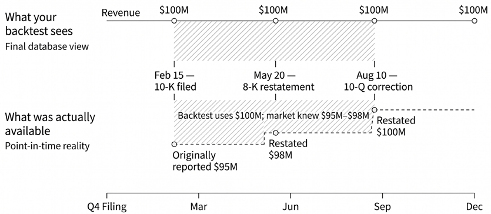
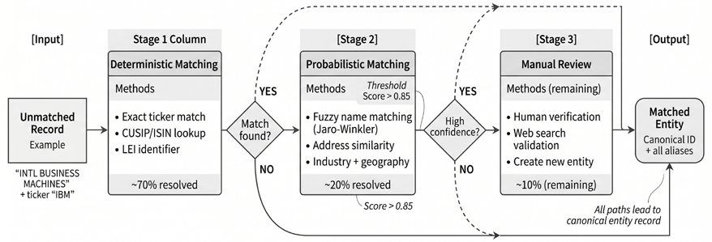

# 第4章：基本面与另类数据

市场数据记录的是市场中*发生了什么*：价格、成交量与交易机制。而基本面数据和另类数据有助于解释*背后的原因*。要把这些数据源转化为可供建模的信号，关键不在精巧的算法，而在纪律严明的流水线：摄取杂乱的输入、追踪数据修订、校验标识符，并生成时间一致、在回测与生产环境中都经得起检验的特征。

**基本面数据**是针对特定资产、反映价值底层经济驱动因素的信息，与交易活动或市场微观结构无关。实践中，基本面刻画的是那些影响预期现金流、折现率或关键约束条件（例如供给与需求）的变量，它们通常经由报告或度量产生，而非来自市场。例子包括：股票的财务报表与公告文件、信用债的发行人与契约条款信息、大宗商品的供需与库存指标，以及加密资产的协议与链上指标。与之并行，**另类数据**的范畴已扩展到数字足迹（digital exhaust），如网站流量、交易记录、地理位置数据、卫星影像和文本，反映出其在主动管理中日益广泛的应用（Green and Zhang, 2024）。

在实践中，基本面与另类数据的真实应用里有两类问题最为突出：时间一致性与实体一致性。

- **时点正确性（point-in-time, PIT）**确保研究只使用决策日当天*可获得*的信息。*第2章*介绍了 PIT 相关词汇与双时态数据模型；本章将把它们应用于 SEC 公告文件、宏观经济数据发布以及其他容易出现修订的数据源。
- **实体解析（entity resolution）**确保来自不同数据源的记录，尽管存在名称变体、标识符变更、公司行为与并购，仍能映射到同一个现实世界中的发行人与可交易证券，并且正确的证券标识符在整个时间轴上保持对应。

本章为这两大挑战提供工程实践指南，读完后你将能够：

- 实现双时态数据模型，区分有效时间与知悉时间（*4.1 节*）。
- 解析 SEC EDGAR 公告文件，构建时点正确的公司基本面数据库（*4.1 节*）。
- 应用多种分层实体解析方法（*4.2 节*）。
- 刻画跨资产类别的基本面数据特征（*4.3 节*）。
- 从信号、数据质量、法律以及商业/工程维度评估另类数据源（*4.4 节*）。
- 从 EDGAR 文本类公告中提取结构化数据，用于 NLP 分析（*4.5 节*）。

我们先从构建时点正确的数据流水线这一实际问题入手。

## 4.1 时点正确的流水线

*第2章*介绍了 PIT 正确性与双时态词汇（有效时间与知悉时间之别）。这里的问题是操作层面的：给定 EDGAR 公告历史，如何构建一个数据集，使其返回决策时点 *t* 当时适用的取值，而不是供应商数据库今天所存的取值？核心难点在于修订版公告、分类标准变更以及公司行为——它们会为同一报告期间制造出多个"版本"。

### 重述为何造成泄露

考虑一个简单的**市盈率（P/E）策略**。某公司可能在 10 月报告第三季度营收 9500 万美元，随后在下一份 10-Q 中将其重述为 9800 万美元，又在下一份 10-K 中改为 1 亿美元。若回测在 10 月的决策中使用了 1 亿美元，就等于把*较晚*的会计口径套用到*较早*的决策上——这就是前视偏差。

Luo et al. (2014) 将其列为量化投资的"七宗罪"之一，并展示了数据处理失误如何彻底逆转一个策略的表现。其余六项分别是：幸存者偏差、叙事偏差、过拟合与数据窥探偏差、换手率与交易成本、离群值，以及做空成本。

### 双时态存储与 as-of 查询

实现遵循*第2章*的 PIT 契约：每条事实必须同时携带它所描述的期间，以及该特定版本变为可观测时的时间戳。因此，同一个报告期间可能随时间推移存在多个版本：原始公告、修订版（amendment）或后续的重述（restatement）。

就财报而言，市场通常先对财报发布做出反应——典型形式是 8-K 表格第 2.02 项——之后才对内容更详尽的 10-Q 或 10-K 表格做出反应。对 PIT 回测而言，用 10-Q 或 10-K 的受理时间作为可用性时间戳是保守做法。如果事件时间精度很重要，则应显式记录这两个时间戳。

**as-of 查询模式**很直接：

1. 选出在历史时点 t 当时适用的最新报告期间。
2. 在该期间内，选出可用性时间戳不晚于 t 的最新版本。

一个实践中的注意点是 **SEC XBRL Frames API**。Frames 返回与请求期间最匹配的"最后申报"值，这使它适合做横截面快照与原型开发，但其本身并不满足 PIT 安全要求。要做 PIT 研究，应基于公告级记录与时间戳重建历史。*第2章*的 PIT 检查清单在这里是前置条件：取值必须时间有效，历史标的池必须可重建，标识符映射必须在决策日有效。本节余下部分将展示如何在大规模基本面数据获取中满足这些要求。

#### 各数据形态的时间戳权威来源

权威的可用性时间戳因数据源而异。以下约定在所有流水线中统一适用：

| 数据形态 | 权威时间戳 | 说明 |
| --- | --- | --- |
| SEC | accepted_at（文件受理时间） | 若事件时间很重要，可选择同时跟踪更早的财报发布 |
| 宏观 | 官方发布时间戳（时区归一化） | 使用 ALFRED vintage 数据以保证历史准确性 |
| 大宗商品 | 机构发布时间戳 + 合约移仓映射 | EIA、USDA 与 CFTC 各有特定的发布时间表 |
| 加密资产 | 区块时间 + 确认/最终性策略 + 供应商摄取时间 | 仅在 N 次确认后才将观测视为可用，以避免区块重组（reorg）导致的前视偏差 |

*表 4.1：各数据源的时间戳权威*

### EDGAR 数据获取流水线

SEC 的**电子化数据收集、分析与检索**（**EDGAR**）系统免费、全面地提供美国公司公告文件。EDGAR 于 1993 年开始分阶段推行，到 1996 年 5 月已成为本土发行人的强制性要求。如今该系统提供多种访问渠道：

**批量下载**：财务报表及附注（Financial Statement and Notes, FSN）数据集以表格形式提供解析后的 XBRL 数据，涵盖 2009 年以来全部 10-K、10-Q 和 8-K 公告，组织为八张相互关联的表：

| 文件 | 说明 |
| --- | --- |
| SUB | 申报元数据——CIK、表格类型、申报日期、受理号（accession number） |
| NUM | 从 XBRL 标签中提取的数值 |
| TAG | 分类标准标签的定义与描述 |
| DIM | 维度拆分（按业务分部、地区等） |

*表 4.2：FSN 数据集中的部分表*

FSN 数据集还包含四个用于文本内容与展示格式的附加文件（TXT、PRE、CAL、REN）。**REST API**：可实时访问公司公告、特定概念及申报历史，无需身份认证——调用方通过 user-agent 请求头表明身份。company-concept API 以 JSON 格式返回特定指标（例如 `EarningsPerShareDiluted`）的全部历史取值。

**Python 库**：`edgartools`、`sec-edgar`、`sec-downloader` 等包用便捷的接口封装了 API 的复杂性。`edgartools` 可直接访问解析后的财务报表和文本章节。对于高吞吐场景，`datamule` 等服务通过托管归档提供批量下载，吞吐量通常高于直连 EDGAR（请查阅当前的速率限制与使用条款）。

对系统化研究而言，批量方式往往效率最高：下载压缩的 FSN 归档，解压转换为列式 Parquet 格式以便快速查询，再基于解析内容构建双时态数据库。

#### XBRL 与分类标准结构

**可扩展商业报告语言**（**XBRL**）对电子化商业报告进行标准化。公告中的每个数值都带有以下标签：

- **概念（Concept）**：数值代表的含义（例如 `us-gaap:RevenueFromContractWithCustomerExcludingAssessedTax`）
- **期间（Period）**：覆盖的时间跨度（资产负债表项目为时点值，利润表为区间值）
- **单位（Unit）**：计量单位（美元、股数、美元/股）
- **维度（Dimensions）**：可选的拆分维度，如业务分部、地区或其他类别

美国 GAAP 分类标准定义了数千个标准化概念，但公司可以用自定义标签对其扩展。这种灵活性支持精确报告，却给跨公司分析带来困难——同一个经济事实可能出现在不同标签之下。

在 PIT 重建中，公告日期（`knowledge_date`）来自申报元数据，而非财务数据本身。对每份公告，有效期间取自 XBRL 内容，并与申报记录中的公告日期配对。正是这种分离使 PIT 重建成为可能。

**实现**：

- `01_academic_characteristics` 介绍学术基本面面板数据与长期横截面数据，说明为何需要严谨的 PIT 构建。
- `02_sec_filing_explorer` 介绍用于交互式探索 EDGAR 的 EdgarTools。
- `03_sec_form4_insider_transactions` 演示如何检索并解析 Form 4 内部人交易公告，作为带事件时间戳的基本面数据示例。
- `04_sec_xbrl_fundamentals` 使用已物化的 XBRL Frames 输出，并演示双时态查询模式。

### 处理数据不一致

即便正确追踪了 PIT，基本面数据仍存在一致性方面的挑战：

- **会计准则演进**：美国 GAAP 随时间变化。`RevenueFromContractWithCustomerExcludingAssessedTax` 这类标签可能在中途取代 `SalesRevenueNet`，需要在分类标准版本之间建立映射。
- **公司层面的自主选择**：在 GAAP 框架内，公司在科目归类上有自由裁量空间。一家公司的"营收成本"可能包含另一家公司单独列报的项目。跨公司比较需要仔细的归一化处理。
- **重述与修订**：当公司提交修订版公告（10-K/A、10-Q/A）或重述前期数据时，同一报告期间的多个版本会并存。双时态模型会为每个版本存储各自的可用性时间戳；分析代码必须明确每个决策日适用哪个版本。
- **公司行为**：拆股要求对每股指标进行追溯调整。3 比 1 拆股意味着历史 EPS 必须除以 3 才具可比性。并购与分拆则会产生简单复权因子无法消除的不连续性。

把同一个简单策略运行两次，泄露就会显形：一次使用 as-of 适用的（"当时已知"）基本面视图，一次使用朴素的"今天能拿到的最新值"视图。第二次回测往往看起来更好——不是因为信号更强，而是因为数据集悄悄混入了后来才到达的信息。

实践中，哪怕少量泄露也足以淹没基于基本面的策略中真实的信噪比。这里的教训是方法论层面的，而非某个固定比例：如果供应商说不清它如何处理修订、修订版公告与标识符历史，就应默认该数据集*不*满足 PIT 正确性，除非有证据证明并非如此。

*图 4.1：基本面数据重述造成的前视偏差*

*图 4.1* 展示了一个朴素的"最新值"基本面数据集：它把重述后的第三季度营收（1 亿美元）安到了公开发布之前的日期上。而时点正确的数据集在重述日之前一直保留原始值（9500 万美元），从而避免在策略决策日发生泄露。下一节讨论如何解决实体解析问题。

## 4.2 实体解析与映射

在合并任何来自不同数据源的数据之前，必须先解决**实体解析**这一普遍问题。不同的数据供应商、监管系统和内部数据库对同一家公司的标识方式各不相同。Ekster and Kolm (2020) 将实体映射列为另类数据整合中的主要技术挑战之一。映射不正确，任何多源分析从一开始就不可靠。

### 为什么解析至关重要

考虑一个把 SEC 基本面数据与政府合同另类数据结合起来的策略。SEC 用中央索引键（Central Index Key, CIK）标识公司。联邦拨款数据通常包含唯一实体标识符（Unique Entity Identifier, UEI）（2022 年 4 月取代 DUNS），以及法定名称和地址字段。信用卡交易数据则可能使用专有的商户编码。若没有交叉映射表，也没有对目标层面（发行人、子公司、证券）的清晰定义，这些标识都无法直接对应到股票代码。

一个误报匹配就足以污染所有下游连接操作；应把精确率放在首位，对拿不准的匹配升级处理。如果把 "ZOOM VIDEO COMMUNICATIONS"（代码 ZM）与 "ZOOM TECHNOLOGIES INC"（曾用代码 ZOOM，现为 ZTNO）混淆，一家公司的基本面数据就会被配上另一家公司的另类信号，由此得到的"alpha"只是噪声。

公司结构越复杂，问题就成倍增加。IBM 的政府合同可能以 "INTERNATIONAL BUSINESS MACHINES CORPORATION"、"IBM CORP"、"IBM GLOBAL SERVICES" 或数十个子公司名义申报。这些名称都必须映射到代码 IBM，但来自 Kyndryl 等已分拆、现已独立的部门的合同则不应如此。

### 分层解析方法

实用的实体解析分阶段推进：从确定性匹配，到概率匹配，再到基于模型的方法。

#### 第一阶段：确定性匹配

当数据源提供**标准标识符**时，先做确定性连接。主要陷阱是解析到错误的*层面*，因为"公司标识符"可能指代不同的对象。具体而言，标识符可以指向：

- **法律实体**（母公司或申报主体）
- **证券**（特定的可交易工具，如某一类别股份、债券或 ADR）
- **衍生品合约**（交易所上市的特定合约/到期月份）

生产系统通常维护三张相互关联的主表——**实体（entities）**、**证券（securities）**以及（在相关时）**合约（contracts）**——并在它们之间维护**时间有效的映射**。例如，"Apple" 在不同问题下可以合理地解析为不同对象：

- 法律实体（通过**法人识别编码（Legal Entity Identifier, LEI）**或**中央索引键（CIK）**）
- 证券（例如，普通股与某一具体债券发行各不相同，且各有自己的标识符）
- 交易所上市合约（期货/期权）

因此，"标识符匹配成功"不等于"解析正确"，除非选对了层面（实体、证券或合约）。

常见的标准化标识符（及其标识对象）：

- **法人识别编码（Legal Entity Identifier, LEI）**：金融交易中用于标识*法律实体*的 20 位字符标识符（ISO 17442）。
- **中央索引键（Central Index Key, CIK）**：SEC 在 EDGAR 中用于标识*申报主体*的标识符；映射到交易工具通常需要额外的参考表（例如区分子公司与控股公司）。
- **金融工具全球标识符（Financial Instrument Global Identifier, FIGI）**：*工具级*标识符（证券级而非实体级）；OpenFIGI 提供查询与映射 API。
- **CUSIP/ISIN/SEDOL**：用于交易与结算的*证券级*标识符（CUSIP：美国；ISIN：全球；SEDOL：英国）。

如果数据源带有其中任何一种标识符，解析通常就是针对相应交叉映射表的直接连接。更棘手的情况来自那些不含机构标识符的数据源——或者虽含标识符，却处于与目标不同的层面。

**错误连接示例**

另类数据往往到达的是*发行人*层面（例如 "Amazon.com Inc" 的网站流量），而收益却是在*证券*层面度量的（AMZN 普通股）。若没有带生效日期的证券主档（security master），这种连接可能悄无声息地出错：(1) 把发行人层面的数据连到错误的股份类别上（A 类与 B 类拥有不同的投票权和价格）；(2) 连到 ADR 而非普通股；(3) 使用了在某次公司行为之前属于另一实体的股票代码。解决办法：维护带生效日期的显式发行人→证券映射，并用 `effective_date <= decision_time < end_date` 约束所有连接。

#### 第二阶段：概率匹配

没有标识符时，就必须进行文本匹配。字符串相似度算法可以处理公司名称的各种变体：

- **Levenshtein 距离**：计算把一个字符串变换为另一个所需的字符编辑次数（插入、删除、替换）。"TESLA INC" 与 "TESLA, INC." 仅相差一次编辑。
- **Jaro-Winkler 相似度**：加权后的相似度对前缀匹配更友好，对缩写处理效果好——"INTERNATIONAL BUSINESS MACHINES" 与 "INTL BUSINESS MACH" 会得到较高的得分。
- **基于词元的方法**：对词元计算 Jaccard 相似度。"APPLE INC" 与 "APPLE INCORPORATED" 虽然后缀不同，却共享关键的词元。

`rapidfuzz` 等库高效实现了这些算法，可以对参考列表做模糊匹配，并配置相似度阈值。典型做法是提取置信度阈值（通常为 85%–90%）以上的最佳匹配，并将置信度较低的匹配标记出来供人工复核。

概率匹配需要在环节中引入人工（human-in-the-loop）质量保障，因为其失败模式是不对称的：漏配损失的是覆盖率，而误配可能破坏所有下游连接与回测。合理的目标通常是先保证高精确率，再通过升级流程和更好的候选生成来提升召回率。

复杂案例往往落入几类可复现的桶中：

- 法定名称与母公司品牌毫无关联的子公司
- 商号（DBA）与商业用名
- 合资企业与财团
- 在互不相关实体间撞名的通用名称

例如，尽管关系明确，"Amazon Web Services" 也可能无法与 "Amazon.com Inc" 模糊匹配上，这就需要子公司查找表或基于嵌入的语义匹配。仅靠名称的模糊匹配很难应对这类情况。

阈值选择通常采用分层方案：只有置信度极高时才自动接受（业界常用阈值约在 95%）；中间区间（通常 85%–95%）转入人工复核；尾部（约低于 85%）则升级到更丰富的特征，如地址、网站或业务描述。这些切分点应根据带标注样本中的经验分数分布来校准，而不是当作普适常数。还要持续跟踪匹配质量——若事后复核发现错误匹配，就调整阈值或增加消歧特征。

#### 第三阶段：人工复核与质量保障

处于中间置信带的记录——高到确定性与概率匹配已能给出可信候选，却又不足以自动接受——会升级到人工复核队列。有效的工作流会按失败模式（模糊匹配有歧义、标识符缺失、候选集并列）拆分队列，让复核人员采用相应的消歧流程，而不是逐案临时判断。每个决策都会连同复核人、时间戳和理由写回主实体表，作为新增别名或拒绝记录。这样，审计轨迹既能支持下游调试，也支持定期重新校准阈值。

当模糊匹配与标识符匹配都无法消歧时（例如 "Amazon Web Services" 与 "Amazon.com Inc"），基于嵌入的语义匹配就派上用场，相关内容见*第10章*（文本嵌入）与*第23章*（知识图谱），其中 Chen et al. (2023) 介绍了 FinKG。该知识图谱整合了 SEC 公告与市场数据，用于美国上市公司之间的实体链接。

### 构建证券主数据库

生产系统会维护一张主实体表作为规范化的参照：
| id | name | ticker | cik | lei | figi |
| --- | --- | --- | --- | --- | --- |
| 1001 | Tesla, Inc. | TSLA | 1318605 | 54930043XZGB27CTOV49 | BBG000N9MNX3 |
| 1002 | Apple Inc. | AAPL | 320193 | HWUPKR0MPOU8FGXBT394 | BBG000B9XRY4 |

*表 4.3：主实体示例*

所有输入数据——无论其来源标识符是什么——都要先解析到这个主 `entity_id`，再与其他数据集连接。主实体表会随时间积累名称变体与标识符映射，处理的数据越多，解析准确率就越高。

#### 时序实体映射

静态映射是前视偏差和幸存者偏差的隐蔽来源。实体关系是动态的：股票代码会被复用（在 Zoom Video 拿到代码 ZM 之前，ZOOM 属于 Zoom Technologies），实体身份也会因更名（FB → META）或并购而演变。生产系统必须具备时间感知能力，记录每个标识符何时有效：

| id | identifier_type | identifier_value | effective_date | end_date |
| --- | --- | --- | --- | --- |
| 1095 | ticker | FB | 2012-05-18 | 2022-06-08 |
| 1095 | ticker | META | 2022-06-09 | NULL |

*表 4.4：时序映射示例*

若没有 `effective_date` 约束，回测可能把 2015 年的另类数据连到 2024 年的股票代码上——造出一个现实中从不可能存在的数据集。每个跨源连接都必须用观测时间戳加以约束，以确保映射在那个历史时刻是有效的。

#### 映射质量保障

生产环境的实体解析需要持续验证：

| 检查项 | 方法 | 频率 |
| --- | --- | --- |
| 置信度分层 | 用校准后的切分点按置信度划分映射（通常约 95% 自动接受，85%–95% 人工复核，低于 85% 采用其他方法） | 每批次 |
| 抽样审计 | 人工核验 1%–5% 的自动接受映射，检查是否存在误报 | 每月 |
| 漂移监控 | 跟踪匹配率与置信度分布随时间的变化；调查突变 | 每周 |

*表 4.5：质量保障示例*

匹配率下降往往意味着数据源发生了变化（例如出现新的命名惯例或新增子公司）。误报率上升则表明阈值漂移或参考数据存在覆盖缺口。

需要跟踪的关键质量指标：

- **分层匹配率**：各阶段（确定性、模糊、嵌入或未解析）解析出的记录占比
- **置信度分数分布**：匹配分数的直方图；留意指示阈值问题的双峰形态
- **误报率估计**：来自抽样审计——自动接受匹配中错误部分所占比例
- **时序漂移**：匹配率与平均置信度的逐周变化；突变值得深入调查

*图 4.2：分层实体解析流水线*

*图 4.2* 展示了实体解析流水线。确定性标识符匹配解决大部分记录；概率记录链接承接置信阈值以上的名称变体；剩余的中间置信带升级为人工复核，所有决策都在时间有效映射的约束下写回主实体表。下一节将纵览跨资产类别的基本面数据版图。

**实现**：`05_entity_resolution` 在一条端到端流水线中演示了确定性连接、模糊字符串匹配（含归一化处理）以及一个简单的主数据库模式。

## 4.3 跨资产类别的基本面数据

*4.1–4.2 节*针对股票确立了 PIT 契约与实体映射。本节将这些概念推广开来：每个资产类别都存在容易被修订的基本面数据，但*时间戳权威*与*工具映射*因资产类别而异。这些细节处理不当，就会引入同样的前视偏差——失败模式是普遍的，只是具体机制不同。"基本面"这一概念远不止于公司股票，其含义随资产类别而变化。每个领域都有各自的经济驱动因素、发布机制和修订行为，因此工程上的难题不是"收集更多数据"，而是构建尊重发布日历、数据版本（vintage）与工具惯例的时序一致输入。

### 宏观与主权数据（外汇/利率）

利率与外汇由增长、通胀、劳动力状况、货币政策与财政可持续性等宏观基本面驱动。工程上的挑战在于，这些序列来自多个机构，按照*发布日程*公布，带有**滞后**与**修订**，因此每个决策时点上"当时已知什么"必须被显式建模。

#### 关键数据源

**美联储经济数据**（**FRED**）汇总了来自众多来源的数十万条时间序列，并提供用于检索以及支持数据版本（vintage）感知工作流的 API。美国以外的宏观数据主要来源包括欧盟统计局（Eurostat）、IMF/世界银行数据集、各国统计机构与中央银行。（完整的数据源清单见*第2章*；本节聚焦时点与修订。）FRED 数据显示，2000 年以来美国 10 年期–2 年期收益率曲线在 15.5% 的天数里处于倒挂状态，2020 年以来这一比例达到 36%——这为宏观经济状态变量提供了一个市场状态（regime）转换的锚点。

#### 对齐挑战

宏观数据带来若干工程挑战：

- **发布节奏不一**：许多关键宏观序列按某个期间（月/季度）度量，却在之后的预定日期发布。GDP 按季度发布，同一季度有多个逐月更新的数据版本（初值/第二次估算/第三次估算，即 advance/second/third estimates）；初请失业金人数按周发布，CPI 按月发布。要把它们对齐到日度决策网格，需要有明确的策略：要么把发布当作**事件数据**（带时间戳），在其可用之后再向前沿用；要么把宏观变量视为缓慢演化的**状态**，在发布时点更新。要避免把未来取值混入过去的插值方法。
- **发布时刻很重要**：对日度或日内模型而言，发布的*时间戳*（日期、时刻和时区）决定了可用性；"同一天"不等于"交易之前"。许多美国数据发布定在美东时间上午 8:30，但日程可能因节假日或异常情况而调整，因此流水线应摄取并存储实际公布的发布时间戳，而不是把假设硬编码进去。
- **时区与日历**：全球宏观数据集必须归一化时间戳（通常转为 UTC），并跟踪当地的发布日历。不同司法辖区的"季度"序列可能在不同的当地日期/时刻发布，并按不同的日程修订，因此 PIT 正确性要求同时存储*所覆盖的期间*与*可用性时间戳*。
- **修订历史**：许多宏观序列在首次发布后还会修订。用今天的"最终"序列做回测，等于把当时尚不可得的信息喂给模型。要让回测贴近现实，正确的输入是数据版本（vintage）数据（"当时已知什么"），而不是最新修订值。

FRED 通过 **ALFRED**（Archival FRED）支持**数据版本感知的检索**：每个观测值都有实时有效窗口（即在两个 vintage 日期之间当时通行的取值），API 暴露了 vintage 日期并支持按 vintage 下载。费城联储的 Real-Time Data Set 是数据版本感知宏观经济研究的权威参考；Croushore (2008) 综述了相关方法与陷阱。实践中有两种生产模式：(i) 查询特定 vintage 日期，重建模型在历史上会看到的数据；(ii) 当下游策略对修订敏感时，显式存储完整的修订阶梯。

PIT 要求包括：存储发布时间戳与发布日历；维护 vintage/修订阶梯；归一化时区；以及区分所覆盖期间与可用时间。

**实现**：`06_fred_macro_eda` 介绍宏观数据；`07_macro_data_alignment` 演示如何加载原生频率的序列、如何对发布滞后建模，以及数据版本感知的输入与"最新序列"输入有何不同。

### 大宗商品——实物市场数据

大宗商品价格锚定于实物的供需约束。但相关数据往往是**领域特定**的（库存、发运量、作物状况、炼厂开工率），而可交易工具又是**合约化**的（按交割月份划分的期货）。这带来一个两部分的工程问题：

1. 用正确的时间戳摄取按计划发布的基本面数据。
2. 把它们映射到你实际能够交易的合约上。

#### 能源与农产品

美国政府机构为能源与农产品基本面数据锚定了发布日历。美国能源信息署（EIA）、美国农业部的世界农产品供需预测（WASDE）报告，以及美国商品期货交易委员会（CFTC）的交易者持仓报告（COT）都是带时间戳的事件；只有过了其公布的发布时刻之后才能进行连接。EIA 的《每周石油状况报告》（Weekly Petroleum Status Report）遵循固定日程（美东时间每周三上午 10:30，节假日除外）；发布时间戳必须成为数据集的一部分。

USDA 的 WASDE 报告在预定日期的美东时间中午 12:00 发布，被广泛视为谷物与油籽的风险事件。要使用发布时间戳；避免任何把发布前预期隐式当作已公布事实的工作流。

气象数据（例如来自 NOAA 的数据）通常作为高频状态变量进入分析，而非按预定时刻发布的数据；对其处理方式应与"保密发布"（lock-up）的经济报告区别开来。

#### 映射到可交易工具

实物市场数据必须映射**到你能够交易的合约**上。当库存数据发布时，相关的价格反应可能集中在交易活跃的近月合约（或曲线上流动性最好的那一点），而不是混合了多个交割月份的抽象"连续序列"。这正是*第3章*的*期货移仓逻辑*成为输入依赖的地方：从日历时间到活跃合约的一致映射。基本面事件时间戳应当在事件时刻连接到当时的活跃合约，然后按与价格相同的移仓规则带入任何连续序列表示。

除实物基本面外，CFTC 的 COT 报告还按类别公开交易者持仓快照。COT 是一个 PIT 数据集：持仓截至周二，一般于周五美东时间下午 3:30 发布（节假日顺延），因此回测必须把该报告视为**发布时刻之后才可用**。持仓的极端水平和快速变化常被用作情绪类特征（反向或趋势确认）；关于其可预测性的任何论断，都应在强制执行发布滞后的条件下做样本外评估。

这里的 PIT 要求包括：跟踪预定的发布时间戳；在事件时刻把基本面事件映射到正确的合约与曲线点位；应用与价格一致的移仓规则；以及强制执行报告滞后。

**实现**：`08_futures_positioning` 演示 COT 数据获取、PIT 可用性时间戳以及持仓 z-score。

### 加密货币与数字资产——链上基本面

加密市场带来一类新的基本面：链上数据公开可观测、可程序化验证，且往往频率很高——工程挑战从"获取"转向"解读"。不同链在交易多快达到最终性、近期区块多容易被重组、采用何种代币标准、协议事件在数据中如何表示等方面各不相同。因此，即便是同一个指标，在不同生态系统中也可能需要不同的定义。Harvey et al. (2022) 提供了一本面向从业者的投资者指南，强调加密资产的范畴远不止现货比特币。

#### 核心链上指标

核心链上指标包括：

- **网络活跃度**：活跃地址数、交易笔数和转账量为协议使用情况提供了初步视角。这些指标可以反映采用度与参与度，但需要谨慎解读，因为机器人、内部转账或地址复用模式都可能夸大活跃度。
- **安全性指标**：在工作量证明（proof-of-work）网络中，算力度量维护链安全的总算力；在权益证明（proof-of-stake）网络中，质押价值度量验证者投入并承担风险的资本。两种情况下，它们都是攻击网络经济成本的粗略代理变量，不过其解读取决于协议设计与市场结构。
- **经济模型**：代币供给计划、通胀机制、发行规则与费用动态塑造着用户、验证者和投资者的激励。这些变量还通过影响稀缺性、稀释程度和经济收益的分配，左右估值叙事。另外，期货持仓数据（包括 COT 式的分类）常被用来研究谁在交易加密期货，以及特定交易者类别是否展现出择时能力（Baur and Smales, 2022）。
- **DeFi 指标**：锁仓量（Total Value Locked, TVL）被广泛用作协议所沉淀资本的代理指标。它有参考价值，但解读须谨慎，因为它可能反映重复计算、杠杆或代币价格波动，而非净增经济活动。协议费用与收入提供了衡量使用量与价值捕获的补充指标，但不同聚合平台的定义各异——务必记录所采用的确切定义。

#### 数据来源

在加密货币数据来源方面，直接访问（运行节点）提供了最大控制权，但运营成本高。索引协议与分析平台（例如 The Graph、Dune）让解码后的区块链数据可以直接查询，无须维护全套基础设施。

**商业聚合平台**通过 API 提供整理好的指标，但应像对待任何供应商数据源一样对待它们：记录其变换、定义与回填（backfill）。Alexander and Dakos (2020) 研究了学者应使用哪些加密货币数据源，发现对于流动性好的资产，主要聚合平台提供的数据在统计上等价，但对流动性差的代币则可能出现分歧。

#### AMM 与 DEX 数据

使用自动做市商（AMM）的去中心化交易所会就流动性提供、兑换和费用生成透明的链上记录。Lehar and Parlour (2021) 针对 Uniswap 的实证研究表明，这种透明度使得一些在传统交易场所难以获得的市场结构度量成为可能。

PIT 要求包括：理解最终性与区块重组（reorg）策略；记录指标定义与供应商变换；跟踪回填与重算；以及考虑链与代币标准的差异。下一节将探讨另类数据，并讨论如何使用这一日益重要的数据来源。

**实现**：`09_onchain_fundamentals` 演示如何查询链上指标并将其与传统市场数据对齐。

## 4.4 理解另类数据

另类数据可能带来真正的交易优势，但它也是一项高方差投资：信号嘈杂、覆盖不稳定、暗藏回填，还有切实的法律与声誉风险。一套纪律严明的评估流程，正是"有趣的数据集"与"可上生产的输入"之间的分界线。*第2章*讨论过 PIT 正确性、幸存者偏差和标识符完整性等数据质量问题，它们适用于*所有*金融数据。本节聚焦另类数据获取决策的评估标准——具体来说，就是是否值得投入一个新的数据集。

### 另类数据版图

另类数据涵盖传统市场数据与基本面数据来源之外的信息。Green and Zhang (2024) 给出了一个实用的分类法：

- **文本与关注度数据**：新闻文章、社交媒体、财报电话会议纪要和搜索行为。经典证据表明，媒体语气可以预测短期市场行为，不过效应的显著性对数据泄露和模型设定很敏感（Tetlock, 2007）。文本数据的*工程化*处理（提取、清洗、PIT 存储）见 *4.5 节*；文本的*特征化*（情感、嵌入、Transformer）见*第10章*。
- **业务流程数据**：信用卡交易、销售点（POS）记录、招聘启事与用工模式。LinkedIn 的流入/流出数据和 Glassdoor 评分可以预测经营健康状况，尽管覆盖并不均匀，而且 10-K 中公司自行披露的数字往往滞后太多、难以与之竞争（Green and Zhang, 2024）。
- **传感器与地理空间数据**：停车场或建筑工地的卫星影像、地理位置追踪、船舶定位以及工业传感器读数。
- **预测市场**：交易二元事件合约的平台，其价格提供了持续更新的概率代理。Ng et al. (2025) 记录了现代预测市场中切实有效的价格发现，发现流动性更高的场所吸收信息的速度更快。其局限包括头部合约之外流动性稀薄，以及监管的碎片化。

在需求侧，有证据表明卖方分析师在研究工作流中越来越多地引用非传统数据集，而这种采用与预测准确度的提升相关（Chi, Hwang, and Zheng, 2024）。

### 评估框架

另类数据集的失败通常源于可预见的原因：在控制现有特征后不再有增量信息；在决策时点无法复原当时的数据；或者带来的法律与运营风险超过了其期望价值。实用的尽职调查聚焦于信号内容、数据质量、法律风险与商业/工程成本，并且明确倾向于在硬性约束上尽早止损，而不是纠结于边际分数的差异。

**信号内容**评估要回答的问题是：该数据集是否有可能提供增量的、可交易的信息：

- **独特性**：先明确基线特征集，检验的是增量价值而非原始相关性（例如基线对基线、数据集对仅含该数据集的对比）。在合理的控制变量下消失的提升，通常是冗余的代理。
- **衰减与持久性**：把半衰期当作设计约束。McLean and Pontiff (2016) 表明，公开发表的股票收益预测因子在发表后会损失约 58% 的表现——这是衡量信号侵蚀速度的一个有用基准。某个具体另类数据集是否会"加速扩散"，是一个需要在真实时间戳与成本条件下检验的实证问题（Hong et al., 2000）。
- **常见失败模式**：(i) 有真实的信号内容，但计入成本/容量后不可交易；(ii) 表面业绩由修订或前视造成。

数据质量检查验证的是：我们能否在生产约束下复现结果，尤其是与时点可用性相关的约束。

- **质量与稳定性**：核实版本管理、修订暴露情况以及方法论变更的可察觉性。回填与供应商流程变更会影响表现；ESG 评级表明方法论差异如何导致分歧，"度量的稳定性"因此成为核心问题（Berg et al., 2022）。
- **覆盖面**：评估数据在可交易标的池（个股、地区、行业）和不同市场状态（regime）下的代表性；诊断系统性偏差或缺失（例如对小盘股或非美国标的的覆盖不足）。
- **延迟**：使发布滞后、发布频率与时间戳约定和决策过程相匹配。如果说不清"首次可观测时间"，时点正确的回测就站不住脚。

法律风险是一道一票否决的门槛：模型表现无法把风险"优化掉"。

- **合规与权利**：查明数据来源、允许的用途、合同限制、审计/删除义务以及下游再分发的限制。
- **危险信号**：(i) 因覆盖面过窄而构成重大非公开信息（MNPI）（小样本面板、受限地区、针对特定实体的"渠道核查"）；(ii) 即使没有显式标识符，通过数据关联也会产生隐私风险（设备/广告 ID、细粒度位置/事件数据），并带来 GDPR/CCPA 合规暴露。

商业与工程门槛确保数据集与可部署的容量相匹配，且不会带来不成比例的运营负担。

- **技术摩擦与经济性**：评估总拥有成本（集成、实体解析、存储、监控、模式变更处理、事故处理负载），并将期望价值与路线图容量进行比较。
- **可运营性测试**：估算一次性工程投入、持续维护负担，以及在真实延迟、成本和容量约束下的保守价值区间。
- **决策规则**：硬性约束（法律、时点完整性）优先于其他方面的边际差异；只有通过了硬性否决门槛的数据集之间才比较"分数"。

### 另类数据的自建与外购

*第2章*讨论过金融数据自建与外购的一般权衡。具体到另类数据，还有一些额外因素：

- **alpha 拥挤**：基于专有内部数据自建的流水线仍能保持差异化；外购数据集则会随着使用者的增多而逐渐失效。
- **法律风险不对称**：网页抓取与数据采集处于法律灰色地带；供应商可能作出承诺，但合规责任以及对"允许何种使用"的解释仍由买方承担。
- **维护负担**：另类数据源经常变化（API 变动、覆盖范围变化、方法论更新）；这些运营成本由供应商消化。

对大多数机构而言，混合方案效果最好：主流另类数据源购买清洗、验证过的数据；只有当内部数据或独特关系能带来独家访问、信号真正专有时，才自建能力。

### 数据来源与实现

这个生态涵盖终端平台（Bloomberg、LSEG Workspace）、专攻不同数据形态的供应商（如支付数据、网页数据或地理空间数据），以及 Nasdaq Data Link、Snowflake Marketplace、AWS Data Exchange 等数据市场。数据市场可以简化采购流程，但并不能免除 PIT 验证和方法论审计。

以下几个数据源可为实验提供有意义的另类数据（本章 `README` 列出了更多来源）：

- **GDELT Project**：面向地缘政治风险与事件检测的大规模全球新闻事件数据；仅 2015 年一年的数据就达 2.5TB；需要 NLP 流水线来提取信号（见下一节与*第10章*）。
- **SEC 13F 公告**：每季度披露的机构持仓；可用于分析"聪明钱"持仓与拥挤交易检测。
- **链上 DeFi 指标**：锁仓量（Total Value Locked, TVL）与协议收入，作为加密原生基本面。
- **预测市场**：Kalshi（受 CFTC 监管）与 Polymarket（基于加密资产）提供事件概率的时间序列。

*文本数据*——包括公司公告、新闻和财报电话会议——是可获得的另类数据中最大的类别，但要变成可供建模的数据，需要大量工程工作。下一节介绍提取与存储流水线，*第10章*介绍特征化（情感词典、嵌入以及 FinBERT 等微调的 Transformer 模型）。**实现**：

- `10_institutional_holdings_13f` 基于 SEC 13F 公告构建 2024 年三季度（2024Q3）的管理人—股票图谱，计算管理人层面的集中度指标与共同持仓边，并找出被持有最广泛的发行人。
- `11_defi_tvl_evaluation` 遍历 DeFi TVL 面板数据（4 条链，2017–2026 年），检验 TVL 增长作为前瞻收益预测因子的效果（峰值 IC = 0.12；弱信号）。
- `12_kalshi_prediction_markets` 从 Kalshi 市场提取事件先验概率，并演示消费预测市场数据的 API 模式。
- `13_polymarket_prediction_markets` 介绍 Polymarket 上的对应做法，并说明流动性与合约设计方面的差异。

## 4.5 用文本数据构建 NLP 特征

SEC 公告从来源上属于*基本面*数据，但其中包含的非结构化文本——如管理层讨论与分析（MD&A）、风险因素以及财报电话会议纪要——在性质上属于*另类*数据：需要 NLP 流水线才能提取无法化归为会计科目行的信号。本节介绍让文本可用的工程工作：数据源选择、章节提取、清洗与时点正确的存储。

### 锁定 MD&A 与风险因素

SEC 10-K 年报包含标准化的叙述性章节，提供关于公司前景的丰富信号：

- **管理层讨论与分析（MD&A，第 7 项）**：叙述性讨论，旨在为评估财务状况、经营成果、流动性与现金流提供重要信息（Regulation S-K 第 303 项）。
- **风险因素（第 1A 项）**：必须披露那些使投资具有投机性或风险性的*重大*因素，按相关标题组织；SEC 不鼓励泛泛的风险因素（Regulation S-K 第 105 项）。这部分内容通常冗长且模板化，但结构、侧重点或新引入主题上的*变化*往往比模板内容本身的水平更有信息量。

这些章节包含无法化归为数字的信息：定性背景、前瞻性表述，以及可能不会体现在科目行中的变化解释。Tetlock (2014) 综述了文本信息如何传导至金融市场，为从公司叙述中提取信号奠定了理论基础。现代 NLP 方法（包括 FinBERT 等面向金融场景适配的 BERT 变体）能够提取比词典方法更依赖上下文的信号，但前提是文本提取与时间戳都正确。

### 工程流水线

构建基于公告的文本数据集需要四个工程步骤：

1. **文档选择**：选取公告的主文档，而非附件（exhibit）。
2. **章节提取**：稳健地识别条目（Item）边界。
3. **清洗与规范化**：去除标记语言和非正文杂质，同时保留段落结构。
4. **时点存储**：存储可用性时间戳和审计键。

#### 第 1 步：公告获取与元数据

EDGAR 提供公告文件包及申报元数据。`edgartools` 等库可以简化检索，但流水线仍须捕获公告的稳定标识符（受理号，accession number）、表格类型（10-K/10-Q 及其修订版）、期末日期以及 **SEC 受理时间戳**（公告公开的时刻）。这些元数据成为下游 NLP 特征的 PIT 契约的一部分。受理号是天然的主键，因为多份公告可能共享同一天，且修订版需要单独追踪。

#### 第 2 步：章节提取

用文档解析器做提取应当分层进行（有结构化入口就用结构化访问，否则以 HTML 锚定边界），并配备可度量的质量检查（缺失章节、边界冲突、长度离群值）。条目编号用来标记章节，但同一份公告中可能出现多处 "Item 7" 字样（例如目录和交叉引用中），格式也随申报主体和时间而变化。修订版（10-K/A）和较老的公告可能让简单的边界逻辑失效——应把提取质量当作可度量的产出，并对失败样本抽样，迭代改进规则。

#### 第 3 步：清洗与规范化

清洗应去除标记与重复申报带来的杂质，同时不破坏语言结构。常见问题包括：

- **HTML 残留**：未闭合的标签、实体编码（`&nbsp;`、`&amp;`）、样式属性。
- **表格结构**：嵌入叙述章节中的财务表格，可能需要单独处理或移除。
- **模板化内容（boilerplate）**：安全港声明、标准化风险表述、重复出现的交叉引用。在许多语料库中，模板内容占提取文本的很大比例。正确的做法是先*度量*它（例如比较逐年文本重合度），再决定是去除它（用于新颖性/变化特征）还是保留它（用于基于水平的情感特征）。

清洗应保留段落边界（这对下游分块和变化检测很重要），同时去除非正文杂质并规范化空白字符。

#### 第 4 步：时点正确的存储

把每个提取出的章节存为一行，以稳定的公告标识符（受理号）为键，并同时包含报告期间和可用性时间戳。最小模式（schema）包括：

- **标识符**：`cik`（公司）、`accession`（公告）和 `section`（Item 7、Item 1A 等）共同构成主键——这个三元组唯一标识每个提取出的章节，包括修订版。
- **时间戳**：`filing_date` 与 `accepted_at`（SEC 受理时间戳，精确到秒）决定*可用性*——即这段文本何时公开。`period_end` 表示所覆盖的财会期间。
- **内容**：`text` 列存储提取出的章节；可选地，同时存储原始版和清洗版。
- **元数据**：表格类型（10-K、10-Q、修订版）、提取方法、规则版本和字符偏移量，便于在规则变更时进行审计和重新提取。

按照上文介绍的双时态数据模型：

- `filing_date`/`accepted_at`（知悉时间）决定*可用性*——这段文本何时公开。要做日内级别的 PIT 正确性，应使用 `accepted_at`。
- `period_end`（有效时间）表示所覆盖的报告期间。

同时存储**原始提取文本**与**清洗后文本**，并附上提取元数据（方法、规则版本、偏移量），以便在规则变更时审计和重跑提取。持久化为 Parquet 格式，便于按章节和时间高效过滤。

### 输出产物

流水线的产出是符合上述模式的**文本语料库**。关键字段：

- `cik + accession + section` 唯一标识一个提取章节的版本（包括修订版）。
- `filing_date`/`accepted_at` 支持时点正确的特征构建。
- `section` 支持针对性建模（区分 MD&A、风险因素与业务章节）。

文本与数值结果对齐时最有用。工程上的要求是：连接操作必须 PIT 安全且可审计。受理号是天然的主键；同时保留 `accepted_at` 与 `period_end`，就能把同一份公告按任意历史日期查询，而不会泄露后续修订。

该语料库是*第10章*的输入。*第10章*涵盖完整的 NLP 特征工程流水线——基于词典的情感分析、静态词嵌入和微调的 Transformer 模型——并演示一个"新闻意外"（news surprise）alpha 因子，它度量今日新闻相对近期报道的语义偏离，直接依赖这里建立的时点正确文本存储。**实现**：`14_text_data_extraction` 展示了从 EDGAR 公告到结构化 Parquet 数据集的完整流水线，并在苹果的 10-K 上演示了逐年变化分析原语：2025 年公告的风险因素章节共 9,792 词，与上一年相比词重合度为 92.9%（Jaccard 0.31），并浮现出 28 个新的风险因素术语。

## 4.6 小结

我们已经为使用基本面与另类数据打下了数据工程基础。核心主题是时点正确性：每个数据源——无论是 SEC 公告、宏观经济发布、期货持仓还是区块链指标——都必须同时标记可用日期与所覆盖期间。本章介绍的双时态模型统一适用于所有资产类别和数据类型，使避免前视偏差、经得起推敲的回测成为可能。

配套的 notebook 在实践中演示了这些原则：以恰当的 vintage 处理提取 XBRL 基本面数据、按发布日程而非参考期间对齐宏观数据、以稳健的章节提取从 SEC 公告构建文本语料库，以及通过系统化框架评估另类数据源。

这些时点正确的产物将成为*第8章*特征工程工作流的输入。*4.5 节*的 EDGAR 文本语料库将喂给*第10章*，在本章建立的存储流水线之上构建基于 NLP 的特征（情感、主题和嵌入）。

*第5章*转向合成金融数据：用生成模型扩充稀缺的历史数据，并在未被观测到的情景下对回测进行压力测试。
