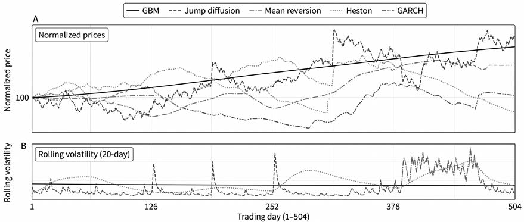
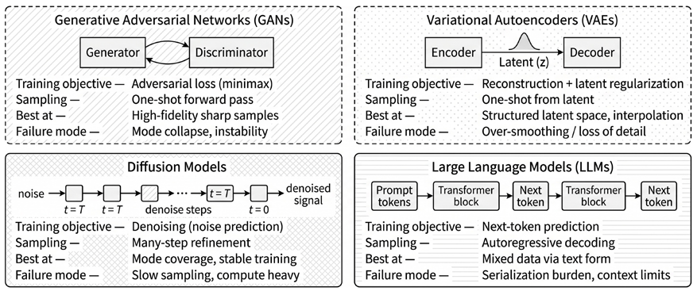
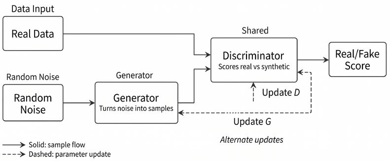
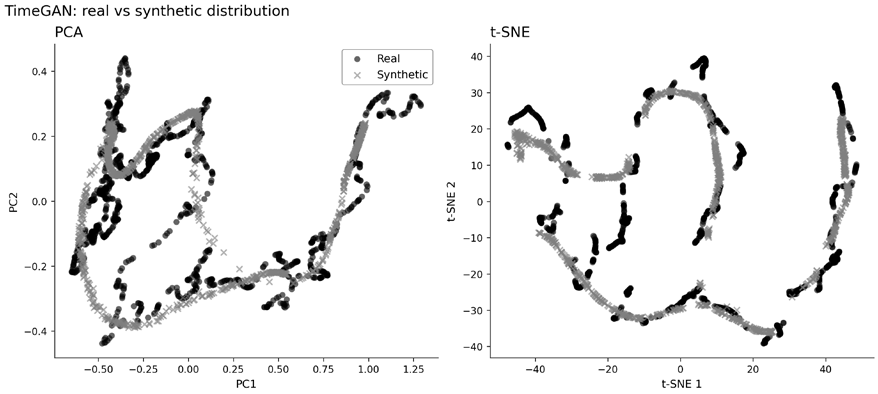
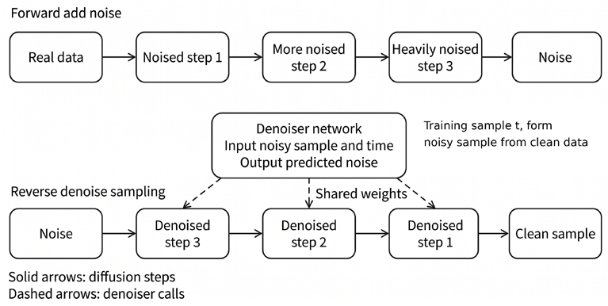
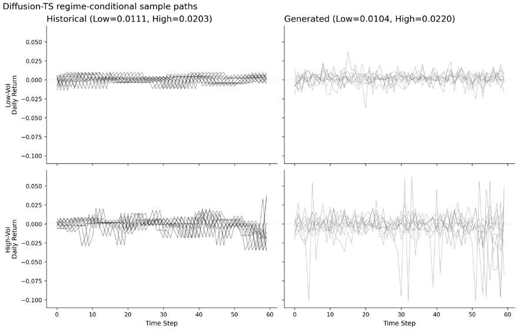

# 第5章：合成金融数据

任何量化策略都依赖历史数据，但历史只是庞大的市场结果空间中走出的一条已实现路径。对 2010–2025 年样本的回测可能确实捕捉到了稳定关系，但也可能仅仅因为这条已实现路径恰好有利于策略的假设与参数选择，才显得表现出色。一种应对办法是：用从一个拟合好的生成模型中采样得到的、统计上自洽的额外市场路径，来补充这条唯一的已实现历史。

这些采样路径就是**合成数据**（synthetic data）：它们来自一个以观测数据经验联合分布拟合而成的模型，旨在跨时间、跨资产、跨市场状态（regime）地保留边际行为与相依结构。相关术语还包括**模拟数据**（simulated data，通常指在假设过程下进行参数化蒙特卡洛）和**生成情景**（generated scenarios，指以特定市场状态为条件得到的样本）。三者殊途同归：都用额外的样本来补充唯一的历史，以评估稳健性。

其目标是*稳健性评估*，而非预测。如果生成的路径能够复现金融时间序列的关键特征，策略表现就可以作为学习到的模型下的一个分布来评估，而不是单点估计。合成数据还能通过扩充真实训练样本来支持*模型开发*。在这些场景中，表现仍必须在真实的样本外数据上评估，生成器则必须被视为潜在的偏差来源。

在本章中，合成数据始终被视为一种*决策支持工具*，而不是历史证据的替代品。它的价值取决于能否改进下游任务。在金融领域，这一标准相当苛刻：如果生成的数据无法保留尾部行为、相依结构、波动率聚集或状态动态，总体分布上的相似毫无意义。学完本章，你将能够：

- 判断历史回测何时统计功效不足，以及何时合成数据生成才是合理的补充。
- 根据数据类型和采样频率选择生成式架构。
- 对生成的收益序列应用典型事实诊断。
- 使用**保真度–效用–隐私（Fidelity–Utility–Privacy）准则**和"合成训练、真实测试"（Train-on-Synthetic-Test-on-Real）验证来评估合成数据。
- 识别生成器特有的风险，包括偏差放大、生成器过拟合以及缺失前所未见的情景。

本章首先阐述使用合成金融数据的动机，说明它需要复现哪些典型事实，并给出一个实用的评估框架；随后介绍经典模拟方法，再进入学习型生成器，包括 GAN、扩散模型以及面向表格金融数据的 LLM 生成器。本章最后用该评估框架对这些方法逐一评估。

## 5.1 量化从业者的困境

量化策略的开发和验证都基于唯一一条已实现的历史。无论是对主观裁量型规则系统，还是对先拟合预测模型、再回测其隐含交易规则的机器学习流水线，皆是如此。历史记录中危机、状态切换和相关性失灵的样本屈指可数，因此推断可能很脆弱——证据是**路径受限的**（path-limited）：表面上的优异表现，可能由未必会重演的特定时段主导。

### 多重检验的挑战

当策略研究随着结果的出现不断调整时，这种路径限制就表现为被夸大的表现：策略开发是在众多相互耦合的选择上进行的迭代搜索，包括标的池与筛选条件、信号与特征定义、标签期限与采样方案、模型类别与正则化、交叉验证设计、超参数、风险控制、执行假设，以及投资组合构建的细节。每多做一个决策，搜索空间就扩大一分，选出样本内优胜者的概率也随之上升——而这个优胜者反映的可能只是噪声、数据的怪癖或有利的市场时段，而非可持续的优势。

自适应式研究带来选择问题。随着测试变体数量的增加，选择膨胀（selection inflation）变得不可忽视：观测到的最优样本内表现会随试验次数机械地上升，即使真实表现为零。Bailey et al. (2015) 将这一风险形式化，并指出回测过拟合的概率可能超过 50%：在独立性与正态误差近似下，测试 10 个配置后，预期最大样本内夏普比率（衡量风险调整后表现的指标）可达 1.57——即便所有配置的真实夏普比率都为 0；试验达到 100 次时，预期最大值超过 2.5。

广义上讲，这是对端到端研究过程的论断：报告的结果只是选择程序在有限数据上运行的输出。这并不意味着回测或预测模型毫无用处，而是说**表现估计应被视为以所走的研究路径为条件**。Bailey 和 Lopez de Prado (2014) 提出了**紧缩夏普比率**（Deflated Sharpe Ratio），针对非正态性和试验次数对表现推断进行调整（见*第17章*）。全书中我们还会遇到更多多重检验校正方法。然而，考虑选择效应的统计校正只能调整推断以反映这一影响，并不能凭空造出更多的市场历史来评估稳健性。

### 作为模拟基础设施的合成数据

合成数据生成通过把唯一一条已实现历史扩展成一个合理历史的分布，来化解证据路径受限的问题。Cetingoz 和 Lehalle (2025) 将其描述为：从估计出的分布中采样额外轨迹，以支持超越单一已实现路径的稳健性检验。实践中，这一工作流会对观测数据拟合生成模型，力求捕捉金融时间序列的关键**典型事实**（stylized facts），例如：

- **厚尾**：极端收益出现的频率高于高斯模型的预期。
- **波动率聚集**：大幅绝对收益在时间上成群出现；平方收益或绝对收益的自相关衰减缓慢。
- **杠杆效应**：负收益之后往往伴随更高的波动率，在股票市场尤为明显。
- **收益自相关性弱**：在日度频率上，收益的线性自相关通常很小。

至少，所得模型生成的数据应能捕捉边际分布、时间相依性和跨资产关系，从而产出与学到的结构相一致的替代轨迹。

然而，合成收益生成器只有在复现出对下游决策真正重要的经验规律时才有用（Takahashi and Mizuno, 2024）。这一限制在金融领域尤为突出，因为驱动决策的特征集中在极端区域。风险管理、杠杆水平和投资组合构建都取决于尾部结果、相关性失灵和状态切换，而这些恰恰稀少且不稳定。一个在分布主体部分"看起来逼真"的方法，如果低估回撤、漏掉波动率聚集，或在压力时期无法复现相依结构，仍然毫无用处。

因此在本章中，我们把生成器视为建模栈的一部分，主要依据它是否支持下游决策来评估，而不是看它的样本在视觉上或边际分布上与历史收益有多相似。

谨慎使用时，合成数据能带来三项实用能力：

- **稳健的参数选择**：在众多采样轨迹上评估候选参数，而不是依赖唯一一条已实现历史。
- **状态压力测试**：生成与观测到的波动率和相依结构一致的类压力轨迹，以探查回撤、相关性失灵和风险控制的稳定性。
- **保护隐私的开发**：当交易级数据无法共享时，合成数据可以支持开发与协作，前提是它接受明确的隐私评估（*5.8 节*）。

合成数据并不能消除选择偏差。如果策略在合成轨迹上调优，就可能过拟合到生成器的归纳偏置和失效模式上。因此，生成器必须被当作建模栈的一部分：尽可能在策略选择之前将其固定，在留出的真实数据上验证它，并且当合成数据影响了模型选择时使用外层验证循环。在介绍具体生成器之前，我们先定义贯穿全章的验证框架。关键问题不是生成的样本单独看上去是否逼真，而是它们是否在控制隐私和泄露风险的同时，保留了目标用例所需的结构。

## 5.2 评估合成金融数据

合成数据可能看起来无懈可击，却仍不适合预期用途。在金融领域，这种风险尤为尖锐，因为与经济相关的结构往往藏在罕见事件、相依结构的变化和条件动态之中，而不是位于分布的中心。一个生成器可以匹配收益的边际分布，却低估回撤、削弱波动率聚集或遗漏压力时期的相关性，从而得出误导性结论。

因此，验证方案往往比生成式架构本身更重要。贯穿本章，我们用三项标准评估合成数据：**保真度**（fidelity）、**效用**（utility）和**隐私**（privacy）。这三者通常相互牵制：提升隐私可能降低保真度；提升分布保真度未必改善下游任务表现；对一个用例表现出色的生成器，换一个用例可能失效。

### 它是否保留了相关的数据结构？

**保真度**关注合成样本是否在应用所需的分辨率上复现了真实数据的经验结构，包括边际行为、相依性和时间序列动态。

对表格数据或截面数据，先看特征层面的分布。用 Kolmogorov–Smirnov 统计量或 Wasserstein 距离等指标比较真实样本与合成样本，再辅以直方图、经验 CDF 和 QQ 图。只看汇总统计量可能掩盖生成痕迹，在尾部尤其如此。

相依性必须单独检验。生成器可能匹配了每个特征的边际分布，却未能保留特征之间的关系。对多元金融数据，应比较相关系数或协方差矩阵、秩相关、行业或状态层面的关系，以及其他适合用例的相依性度量。

对金融时间序列，保真度还要求典型事实诊断。至少应检验生成的序列是否保留了厚尾、原始收益的弱自相关、波动率聚集、杠杆效应（在适用之处），以及跨资产相依性。平方或绝对收益的自相关函数（ACF）是有用的紧凑诊断，因为它概括了波动率的持续性，但还应辅以尾部和相依性检查。

### 它是否支持预期用例？

**效用**评估合成数据能否提升或保住下游任务的表现。保真度通常是必要条件，但并不充分：合成数据可以匹配大面上的分布性质，却缺少预测、分类、风险估计或策略评估所需的特定信号。一个常用的基准是**合成训练、真实测试**（train-on-synthetic, test-on-real，**TSTR**）：

1. 仅用合成数据训练一个模型。
2. 在留出的真实数据上评估该模型。
3. 在模型类别、特征、目标和评估期都相同的前提下，与**真实训练、真实测试**（train-on-real, test-on-real，**TRTR**）的结果进行比较。

对 MSE 或 MAE 这类误差指标，一个有用的汇总量是：

误差比 = Error_TSTR / Error_TRTR

比值接近 1，说明合成数据保留了与任务相关的信息；高于 1，说明效用受损；低于 1 可能在合成数据抑制了特异噪声时出现。但这类结果仍需谨慎解读，因为它们也可能意味着数据泄露、目标被简化，或评估设计过于狭窄。

对 AUC 或准确率这类越高越好的得分指标，应直接报告 TSTR 与 TRTR 的得分，或使用得分比并明确说明方向。不要在未说明约定的情况下混用误差比与得分比。

**效用永远依用例而定**。Tail-GAN 应以风险价值（VaR）和预期损失（Expected Shortfall, ES）等尾部风险指标来评估；Sig-CWGAN 应以路径级准则来评估；扩散模型需要时间与相依性诊断；表格 LLM 生成器则需要 schema 有效性、分布检查和下游预测测试。

### 它是否泄露训练信息？

**隐私**验证检验合成样本是否泄露了用于训练生成器的记录的信息。这对交易级、客户级和机构专有数据尤其重要。

至少应检查合成记录与训练记录之间是否存在完全或近似重复。更有信息量的诊断，是比较合成记录与"参与训练的真实记录"及"留出的真实记录"之间的最近邻距离。成员推断（membership inference）测试提供了更强的对抗性检验：攻击者能否推断出某条特定记录是否在训练集中。

当需要正式的隐私保证时，应以**差分隐私机制**训练生成器。**差分隐私随机梯度下降**（Differentially Private Stochastic Gradient Descent，DP-SGD，Abadi et al., 2016）等方法会在训练中逐样本裁剪梯度并加入经校准的噪声，隐私损失用一个预算 (ε, δ) 来概括。ε 越小，隐私保护越强，但通常会降低保真度与效用。

因此，隐私应当被视为一项设计约束，而不是事后贴在生成数据上的标签。

### 合成数据特有的失效模式

保真度–效用–隐私框架必不可少，但并不完备。合成数据还带来一些生成样本特有的失效模式。

1. 生成器可能**放大训练数据中的偏差**。如果历史样本过度代表某一个状态、某个行业或某种市场环境，生成器可能更强烈地复现这种失衡。
2. 策略可能**对生成器过拟合**。仅因策略在众多合成路径上表现良好就选中它，得到的可能是贴合生成器假设而非市场的方案。入围策略必须始终在未用于训练生成器的留出真实数据上评估。
3. 合成数据的**新颖性有限**。多数生成器更擅长在训练分布的支撑范围内插值，而不擅长生成真正前所未有的情景。

因此，合成数据对稳健性检验、压力测试和模型开发都有用。但除非生成器为此目的经过明确的设计与验证，否则不应把合成数据当作训练状态之外的事件的证据。

### 实用验证清单

至少，金融领域的每一个合成数据实验都应报告：

- 一项**保真度诊断**，如边际分布误差、相关矩阵距离、尾部统计量或波动率持续性误差
- 一项**效用基准**，如 TSTR 与 TRTR 的对比，或特定任务的风险指标
- 一项**隐私检查**，如重复检测、最近邻分析、成员推断，或正式的差分隐私（DP）预算
- 一个**真实数据留出集结果**，尤其是当合成数据用于模型选择或策略开发时

阈值应根据数据频率、样本量、资产类别和下游目标校准。不存在放之四海而皆准的合成数据评分。真正的问题是：生成的数据是否保留了决策所依赖的结构。

## 5.3 经典模拟基线

经典模拟方法是对评估框架的第一道检验。在使用学习型生成器之前，从业者应先将其与更易校准、诊断和治理的透明基线进行比较。

这些基线模型可分为两类：**自助法模型**（bootstrap models），对历史数据重采样；以及**随机过程的参数化模型**，基于模型假设生成新数据。两类都有局限，但局限清晰可见，这使它们成为评估更灵活的学习型生成器时宝贵的参照点。

### 自助法

自助法通过重采样观测收益来生成新路径：

- 其主要优势是对经验边际分布的保真：数据中的厚尾等非高斯特征按构造得以保留。
- 关键局限也同样直接：重采样无法创造历史记录之外的根本性新事件。如果样本中没有出现危机级别的行情或相关性失灵，自助法也变不出来。

主要的自助法技术包括：

- **IID 自助法**（IID 即*独立同分布*）对单个收益有放回地抽取。它保留边际分布，但破坏了时间相依性，包括波动率聚集。因此，它通常不适合需要时变波动率的风险或仓位研究。
- **块自助法**（block bootstrap）重采样固定长度的连续区块，保留区块内的相依性。这能恢复短期自相关结构，但会在区块之间引入人为边界，且区块太短时往往削弱长期持续性。因此，区块长度是一个偏差–方差权衡：区块越长，相依性保留越好，但样本多样性下降。常见起点是一个月（约 22 个交易日），再根据诊断调整。
- **平稳自助法**（stationary bootstrap，Politis 和 Romano, 1994）使用随机（几何分布）的区块长度，在期望意义上保留相依性的同时减少边界痕迹。实践中，当你想要波动率聚集又不想施加参数化波动率模型时，它往往是比固定区块更好的默认选择。

对自助法极具价值的一个诊断是平方（或绝对）收益的**自相关函数**（**ACF**）：IID 自助法会把这一结构压向零，而块自助法和平稳自助法能保留衰减形态，至少在方向上与波动率聚集一致。

### 参数化价格与波动率模型

参数化模型通过为价格或收益指定一个随机过程并从该过程采样路径来模拟市场数据。在连续时间下，这些模型写成**随机微分方程**（**SDE**）的形式：𝑑𝑡 表示小的时间步长，𝑑𝑊 表示布朗（维纳）增量（随 √𝑑𝑡 缩放的随机噪声），𝑑𝑁 表示泊松跳跃计数增量。

参数化模型可以生成"超越历史"的路径，这对压力测试和情景扩展很有用，但结果的好坏完全取决于假设；设定误差往往在尾部和状态切换处现形。

*图 5.1：参数化价格与波动率模型*

*图 5.1* 比较了五个随机时间序列模型在两年内的示意性模拟，所有价格在期初均归一化为 100。上图展示各模型产生的不同价格轨迹；下图刻画了各自不同的波动率形态。**几何布朗运动**（**GBM**）定义了一个基础基线。价格 𝑆 的轨迹由下式描述：

𝑑𝑆 = 𝜇𝑆 𝑑𝑡 + 𝜎𝑆 𝑑𝑊

其中 𝜇 为漂移，𝜎 为波动率。对数价格增量服从高斯分布，且波动率恒定。GBM 在解析上易于处理（Black-Scholes），但违背了核心典型事实：它不产生波动率聚集，尾部也过薄（无超额峰度）。

**跳跃扩散**（**Merton 模型**）通过复合泊松过程加入不连续跳动：

𝑑𝑆 = 𝜇𝑆 𝑑𝑡 + 𝜎𝑆 𝑑𝑊 + 𝑆(𝑒^𝑌 − 1) 𝑑𝑁

其中 𝑑𝑁 是强度为 𝜆 的泊松增量，𝑌 ∼ 𝑁(𝜇_𝐽, 𝜎_𝐽²) 为对数跳跃幅度。实践中，漂移通常要经过调整以计入跳跃的期望贡献，否则无条件均值会被错误表述。跳跃扩散能生成厚尾和明显的类崩盘行情，但在基本形式下，跳跃的到达与波动率状态无关——这与真实市场不同，后者的跳跃往往在市场压力时期聚集。

**均值回归**（**Ornstein-Uhlenbeck**）刻画对数价格（或价差）向均衡水平回归的行为：

𝑑(log 𝑆) = 𝜅(𝜃 − log 𝑆) 𝑑𝑡 + 𝜎 𝑑𝑊

其中 𝜅 是均值回归速度，𝜃 是长期水平。半衰期为 ln(2)/𝜅。这适合价差以及部分利率/大宗商品场景，但不是趋势性资产的一般收益模型。**随机波动率**（**Heston**）引入一个独立的方差过程 𝑣：

𝑑𝑆 = 𝜇𝑆 𝑑𝑡 + √𝑣 𝑆 𝑑𝑊^𝑆
𝑑𝑣 = 𝜅(𝜃 − 𝑣) 𝑑𝑡 + 𝜉√𝑣 𝑑𝑊^𝑣
Corr(𝑑𝑊^𝑆, 𝑑𝑊^𝑣) = 𝜌

𝜌 为负时产生杠杆效应（价格下跌推升波动率），模型可以生成厚尾和波动率聚集。实际使用依赖于细致的离散化（例如完全截断欧拉格式或 Andersen 的 QE 格式）以保持方差非负。**广义自回归条件异方差模型**（GARCH(p,q)）则在离散时间下对收益方差建模，参数 𝑝 与 𝑞 分别表示滞后平方冲击与滞后条件方差的阶数（另见*第9章*）。最常见的设定是 GARCH(1,1)，对两者各取一阶滞后：

𝑟ₜ = 𝜇 + 𝜎ₜ 𝜖ₜ，  𝜖ₜ ∼ 𝑁(0,1)
𝜎ₜ² = 𝜔 + 𝛼(𝑟ₜ₋₁ − 𝜇)² + 𝛽𝜎ₜ₋₁²

其中 𝛼 刻画对近期收益冲击的反应，𝛽 刻画波动率的持续性；常见的平稳性条件是 𝛼 + 𝛽 < 1。GARCH 通常用极大似然校准，是理论与数据之间务实的桥梁。实践中，基本 GARCH 往往能较好地复现波动率聚集。

### 这些基线的局限与使用方式

经典基线把重大的权衡摆在明面上。自助法保留经验分布，但被束缚在历史记录之内：无法生成真正新颖的极端事件或结构性突变。参数化模型可以生成"超越历史"的路径，但只能沿着其动态所蕴含的维度展开；设定误差恰恰容易出现在金融最在意的地方（尾部、压力下的相依性、状态切换）。

在本章中，我们把这些方法当作参照点。它们为学习型生成器提供了合理性检查（深度模型至少应在关键诊断上胜过合适的基线），而且在可解释性、小样本稳健性或治理要求占主导时，它们依然有用。下一节将概览各种生成式模型。

实现：`00_classical_simulation.py` 实现了上述全部方法，并附带校准诊断。

## 5.4 生成式模型分类

本节讨论**学习型生成器**（learned generators）：这类模型通过优化训练目标来近似目标变量（例如多资产金融收益）的联合分布，而不是指定参数化过程或重采样方案。目标不是产出"看起来逼真"的样本，而是保住下游稳健性分析或模型开发所需的时间结构、相依关系和尾部行为。一个有用的区分是：**判别模型**学习 𝑝(𝑦|𝑋)，**生成模型**学习 𝑝(𝑋) 或 𝑝(𝑋, 𝑦)，因此能够生成新样本。在金融领域，学习型生成器的吸引力在于能够表达难以参数化刻画的复杂相依结构；但它们也可能悄然失效——把尾部抹平、让模式坍缩，或学到虚假的状态结构。

*图 5.2：比较各种深度生成模型*

本章使用的学习型生成器分为四类：

- **变分自编码器**（**VAE**）学习一个含隐变量的生成模型，力求既重构输入又满足一定的分布假设。VAE 的训练通常比对抗式模型更稳定，可以作为混合类型结构化数据的强基线。不过，它们可能过度平滑，需要校准或更具表达力的似然，以避免低估稀有类别和尾部行为。
- **生成对抗网络**（**GAN**）通过对抗训练学习。它们能产出锐利的样本并捕捉复杂相依关系，但训练可能不稳定。*5.5 节*聚焦于旨在减少坍缩、改善路径级与尾部保真度的 GAN 变体。
- **扩散模型**通过迭代去噪学习生成。训练通常稳定，且该框架支持条件生成。*5.6 节*介绍一个以市场状态为条件的时间序列生成扩散模型。
- **面向表格数据的 LLM 生成器**把记录序列化为文本并以自回归方式生成行。这对异构的混合类型数据集效果很好，在条件生成很重要的场合尤其如此。*5.7 节*介绍这一方法，以及适当情况下更快的专用替代方案。

接下来的小节聚焦这些类别面向金融的具体实例。这些学习型生成器应被视为建模栈的一部分：它们能扩展合理轨迹的空间，但也会引入自身的归纳偏置。下面每一类模型都应对照 *5.2 节*引入的框架来评估。当 GAN 变体的目标与所需的保真度概念（如时间结构、尾部风险或路径级相似性）一致时，它们很有用。扩散模型通常训练更稳定、条件生成更强，代价是采样更慢。基于 LLM 的表格生成器能处理异构结构化数据，但需要严格的 schema 校验和隐私检查。

因此，实际问题不是哪个生成器全面最优，而是哪个生成器能保住下游决策所需的结构、在与经典基线的对比中表现有竞争力，并满足适用的隐私约束。

## 5.5 面向金融时间序列的 GAN

GAN 通过**生成器**（generator）与**判别器**（discriminator）之间的对抗博弈来生成合成样本（*图 5.3*）。生成器把随机输入映射为候选样本，判别器则对真实样本和生成样本打分，判定真伪。

训练在强化判别器与更新生成器以骗过判别器之间交替进行。即使数据的似然难以显式设定，这一机制也能提供有用的学习信号。

*图 5.3：GAN 训练流程*

*图 5.3* 展示了核心循环，但不限定任何特定的序列模型、损失函数或稳定化技术。然而在金融领域，原生 GAN 往往优先拟合分布的高密度"中心"，而对罕见但经济上重要的尾部事件代表性不足。接下来的模型保留对抗循环，但针对原生 GAN 的短板加以改造：时间相依性（**TimeGAN**）、尾部行为与风险度量（**Tail-GAN**）、路径级相似性（**Sig-CWGAN**），以及不规则采样的连续时间动态（**GT-GAN**）。

### 用 TimeGAN 处理序列数据

**TimeGAN**（Yoon、Jarrett 和 van der Schaar, 2019）把对抗训练适配到时间序列上：引入有监督的时间目标，并在嵌入空间而非原始序列上学习。

#### 架构

TimeGAN 包含五个分阶段训练的网络：

1. **嵌入网络**（e）：把原始序列 𝑥 映射为潜在表示 ℎ。
2. **恢复网络**（r）：从 ℎ 重构 𝑥；(e, r) 合起来构成一个以最小化重构误差为目标训练的自编码器。
3. **监督网络**（s）：从 ℎₜ 预测下一个潜在状态 ℎₜ₊₁，带来一个促进潜在空间时间连贯性的有监督损失。
4. **生成器**（g）：从噪声生成合成的潜在路径。
5. **判别器**（d）：区分真实与合成的潜在轨迹。

#### 训练

训练通常分三个阶段：

1. 以自编码器方式预训练嵌入网络与恢复网络。
2. 在真实嵌入上训练监督网络。
3. 在重构、有监督与对抗三种损失下联合优化整个系统。

#### 数据要求

许多参考实现在恢复网络中使用 sigmoid 激活，把输出限制在 [0,1] 区间。这对归一化的 OHLCV 输入（见*第3章*）很方便，但与无界的收益序列不兼容，除非把收益映射到有界区间，或修改输出层。对收益而言，线性输出层可以保留目标完整的实值支撑。

#### 何时使用 TimeGAN

TimeGAN 是多元序列生成的强基线：文档完善、有参考实现，并为比较更新的架构提供了基准。它没有显式针对尾部保真度，且假设采样网格规则。

实现：notebook `01_timegan.py` 用 24 步窗口在六只股票（BA、CAT、DIS、GE、IBM、KO）上训练 TimeGAN。判别准确率为 68%，ROC AUC 为 0.87，表明真实序列与合成序列之间仍存在可分性。

单步预测的 **TSTR** 比值为 1.76：用 TimeGAN 生成的多股票复权收盘价数据训练，单步预测误差比用真实数据训练高出 76%，说明合成数据包含信息，但用于下游预测并不完美。

按照 *5.2 节*的验证框架，这些结果显示出部分效用但保真度不完备：生成数据包含足够结构，可以支撑一个较弱的下游预测任务；但判别器与相依性诊断都表明，真实序列与合成序列仍存在实质性差异。

*图 5.4：TimeGAN 保真度：PCA 与 t-SNE 的重叠情况*

在我们的分析中，相对于真实数据，合成序列低估了时间相依性和跨资产相依性，这与 TimeGAN 侧重整体分布而非细粒度动态的特点一致。在类似输入上，Diffusion-TS（*5.6 节*）在我们的实验中表现更好（TSTR 比值为 1.00，对比 1.76）。

### 用 Tail-GAN 进行风险约束下的生成

Tail-GAN（Cont et al., 2025）系列变体解决标准 GAN 目标的一个局限：以平均分布保真度为优化目标，可能低估罕见但影响重大的尾部事件。对风险管理而言，匹配**风险价值**（**VaR**）和**预期损失**（**ES**）这类尾部风险度量，往往比匹配分布中心更重要。

Tail-GAN 在生成器损失中加入惩罚项，抑制真实与合成尾部风险度量之间的偏差：

其中 𝛼 是尾部概率（常取 1% 或 5%），(𝜆₁, 𝜆₂) 在尾部匹配与整体拟合之间权衡。

#### 组合层面

尾部约束通常在组合收益而非单个资产上计算。这与风险管理实践一致：回撤由联合相依性驱动，限额也在组合层面设定。

#### 何时使用 Tail-GAN

当下游任务是风险度量、且尾部精度比其他保真度概念更重要时，使用 Tail-GAN。该方法可能牺牲分布中心的拟合，以改善 VaR/ES 的匹配。

实现：`02_tailgan_tail_risk.py` 使用 32 个随机多空组合策略在 5 只 ETF 上训练 Tail-GAN。在给定的 𝛼 下，VaR 相对误差为 13%，ES 误差为 11%，说明显式的尾部惩罚能产生可用的风险估计。在这一 32 策略配置下，合成 VaR 略比真实值更负（合成 ≈ −10.33，真实 ≈ −9.13），说明训练出的 Tail-GAN 略微高估而非低估损失幅度。

Tail-GAN 能改善选定的尾部统计量，但约束通常定义在特定的基准组合和风险水平上。为这些组合匹配好 VaR 与 ES，并不能保证对其他组合、单个资产或路径依赖型风险度量的尾部相依性同样准确。

更一般地说，VaR 与 ES 只刻画了尾部的一部分：两个模型可以在这些量上匹配，却在尾部形状、聚集和时间动态上存在差异。因此，表现实质上取决于尾部概率 𝛼 的选择、训练时使用的基准组合，以及数据中所呈现的市场状态。

### 用 Sig-CWGAN 的路径签名实现时间保真度

Sig-CWGAN（Ni et al., 2020）用基于粗糙路径理论（rough path theory）中**路径签名**（path signatures）的解析判据取代学习型判别器。该目标函数降低了对自适应判别器的依赖，并给出路径分布之间距离的结构化定义。

路径签名是一个**迭代积分序列**，概括路径的形状：不只是起点和终点，还包括路径如何在各坐标上移动、以何种顺序移动、各方向之间如何相互作用。

直观地说，第一层记录路径的净增量，第二层记录坐标之间的两两交互效应以及移动发生的先后顺序，更高层则捕捉逐渐更丰富的几何结构。

一个关键数学性质是：签名取决于路径走出的形状，而非遍历路径的速度，因此它**对时间重参数化不变**。在金融应用中，这通常有用，但并不总是可取，因为流逝时间与观测间隔本身可能携带信息。因此，实现中常把时间作为额外通道加入 𝑋。对路径 𝑋: [0, 𝑇] → 𝑅^𝑑，其 𝑘 阶项形如：

𝑆(𝑋)^(𝑖₁,…,𝑖ₖ) = ∫₀<𝑡₁<⋯<𝑡ₖ<𝑇 𝑑𝑋ₜ₁^(𝑖₁) ⋯ 𝑑𝑋ₜₖ^(𝑖ₖ)

深度为 𝑛 的签名收集所有不超过 𝑛 阶的项。实践中，可以把截断签名看作一个有限特征映射：它把一条序列路径转换为一组统计量，以逐级递增的细节描述其几何形状。实现中常把时间作为额外通道加入 𝑋，并使用中等深度的截断签名。

Sig-CWGAN 最小化真实与合成路径分布之间的签名核**最大均值差异**（**MMD**），无需对抗分类即可获得稳定的训练信号。签名项数随路径维度 𝑑 和截断深度 𝑛 以 𝑂(𝑑^𝑛) 增长。两条资产加上时间通道（𝑑 = 3）、深度取 3 时，截断签名共有 1 + 3 + 9 + 27 = 40 项；相比之下，50 条资产在深度 3 下将需要超过 125,000 项，不做降维就难以直接扩展。

当**路径级保真度**至关重要（例如路径依赖定价或序贯决策问题）且维度小到能可靠计算签名时，使用 Sig-CWGAN。解析目标可以减少由判别器过拟合导致的失效模式，但可扩展性是硬约束。

**实现**：`03_sigcwgan_signatures.py` 复现了论文的精确设置：单一资产（标普 500 指数对数收益，2005–2020 年），签名深度 4，16 天窗口，训练 2,500 步生成器更新。

- Sig-W1 距离（期望签名的 RMSE）在训练集上降至 0.054，在留出窗口上为 0.42；合成训练、真实测试比值达到 0.954，接近与真实数据持平。
- 典型事实只被部分捕捉：合成偏度和超额峰度远低于经验值，平方收益自相关骤降至 0.05（数据中为 0.49），因此波动率聚集未被保留。

Sig-CWGAN 最具吸引力的场景是低维设置。截断签名会丢弃高阶路径信息，而增加深度又会迅速带来高昂的计算成本和更困难的统计估计。实践中，**该方法最好被视为一个结构化的低维生成器**，而不是面向大范围多元市场面板的通用方案。

### 用 GT-GAN 处理不规则时间序列

GT-GAN（Jeon et al., 2022）把对抗式生成扩展到**不规则采样**的时间序列，即观测以非均匀间隔出现的数据（例如 tick 数据、事件驱动 bar、统一行情数据流）。

GT-GAN 用神经**常微分方程**（**ODE**）刻画连续时间动态，对其参数化：

𝑑𝑥/𝑑𝑡 = 𝑓_𝜃(𝑥, 𝑡)

并对该动态积分，从而在任意时间戳处生成取值。

判别器同时评估采样值及其对应的时间戳；一个有监督组件负责促进时间连贯性，类似 TimeGAN 的监督网络。

**GT-GAN 为天然不规则的数据而设计**——观测时间本身携带信息（例如成交到达或信息事件）。把它用在人为制造不规则性的规则采样序列上（随机抽稀），不太可能胜过更简单的离散时间生成器。当观测时间携带信息时使用 GT-GAN；对规则采样的日度或分钟 bar，离散时间生成器通常更简单、更高效。

**实现**：`04_gtgan_irregular.py` 在来自*第3章*的 NVDA 美元 bar 上训练 GT-GAN。重构 MSE 为 0.026，插值/真实平滑度比值为 0.02——由 ODE 驱动的路径比真实 bar 平滑得多。由于实验只用了单个交易日的 446 根 bar，这些结果主要应被读作连续时间训练流程的示例，而不是分布保真度上的竞争性基准。

与离散时间生成器相比，GT-GAN 带来的建模与优化复杂度高得多。数据有限时，连续时间生成器可能产出视觉上平滑的路径，却未能准确匹配真实的事件时间分布、相依结构或状态行为。当不规则的时间点具有经济含义时，该方法最有说服力；如果不规则性主要反映采样选择或微观结构噪声，额外的连续时间机制可能只增加复杂度而无助于保真度。

### GAN 训练的挑战

各种 GAN 变体共有一些反复出现的实现风险：

- **模式坍塌**：生成器只覆盖一部分市场状态，低估了对风险而言重要的罕见状态。
- **训练不稳定**：优化过程可能震荡或发散；稳定化手段包括谱归一化、梯度惩罚（WGAN-GP）和分阶段训练（TimeGAN）。
- **超参数敏感**：学习率、架构和正则化权重往往需要针对具体数据集调优。
- **评估含糊**：没有真值标签可依；评估依赖留出分布检验、下游效用（TSTR），以及针对时间结构和截面相依性的诊断。

Kwon 和 Lee (2024) 的报告显示，GAN 可以近似收益的边际分布，但在更精细的时间结构和多元相依性上常常力不从心；不同架构的报告表现参差，多元生成还可能坍缩到一个低维相依结构。因此，通过边际检验是必要条件而非充分条件；时间动态与截面关系需要单独验证。*5.6 节*转向扩散模型。

## 5.6 面向金融时间序列的扩散模型

从图像到金融时间序列，扩散模型在合成数据上展现了出色的实证表现。

*图 5.5：DDPM 前向/逆向过程示意*

在*图 5.5* 中，前向过程把真实数据逐步破坏成接近纯噪声。训练时，采样一个时间步 *t*，向真实数据加噪，并优化单个去噪网络来预测所加的噪声。生成时，采样从接近纯噪声出发，迭代应用同一个去噪器来产生真实数据；逆向链是随机的，会在中间各步（最后一步除外）注入新的噪声，因此每次运行可能得到不同的样本。

扩散模型的迭代去噪机制能复现更简单的生成器常常遗漏的市场数据非高斯特征，因此在样本保真度是首要目标时非常有用（Takahashi and Mizuno, 2024）。主要代价是计算成本：训练和生成通常都比一次性（one-shot）生成器慢。

### 去噪扩散框架

扩散模型定义一个用噪声逐步破坏观测序列的**前向过程**，以及一个学习去除噪声的**逆向过程**。采样从噪声出发，应用学到的逆向转移来生成合成序列。前向过程是一个马尔可夫链，在扩散步 𝑡 = 1, …, 𝑇 上逐步加入高斯噪声。给定原始数据 𝑥₀，定义：

𝑞(𝑥ₜ | 𝑥ₜ₋₁) = 𝑁(𝑥ₜ; √𝛼ₜ 𝑥ₜ₋₁, (1 − 𝛼ₜ)𝐼)

其中 𝛼ₜ = 1 − 𝛽ₜ，𝛽ₜ 是噪声调度。步数足够多时，𝑥_𝑇 趋近各向同性高斯分布。调度决定了各时间步的信噪比，并塑造去噪的难度。逆向过程学习从 𝑥ₜ 到 𝑥ₜ₋₁ 的条件转移：

𝑝_𝜃(𝑥ₜ₋₁ | 𝑥ₜ) = 𝑁(𝑥ₜ₋₁; 𝜇_𝜃(𝑥ₜ, 𝑡), 𝚺_𝜃(𝑥ₜ, 𝑡))

去噪器以 𝑥ₜ 和 𝑡 的嵌入为输入，输出参数 𝜇_𝜃、𝚺_𝜃，或等价的量（如噪声 𝜀）。训练时随机抽取扩散步，并在各时间步上最小化期望，使模型学会在多个噪声水平上逆转破坏过程。**去噪扩散概率模型**（**DDPM**）（Ho et al., 2020）推广了这样一种均方误差损失：以实际的前向过程噪声 𝜀 与网络预测 𝜀_𝜃(𝑥ₜ, 𝑡) 之间的误差为目标，避免训练时直接重构 𝑥₀。这一目标函数因稳定且可直接对接迭代采样流程而被广泛使用。

### 扩散模型为何适合金融收益

*5.1 节*中的典型事实——厚尾、波动率聚集、杠杆效应和弱收益自相关——约束着面向收益或类收益序列的生成器。有用的生成器必须同时匹配边际分布和条件动态，例如持续的波动率和时变的尾部风险。扩散模型能够捕捉这类结构，因为去噪器是在多个噪声水平上训练的，而不是只针对低阶矩做优化。

三类模型的失效特征各不相同。VAE 在解码时会对不确定性取平均，可能产出过度平滑的样本。GAN 训练可能不稳定，且可能低估尾部或少数模式。扩散模型训练通常更稳定，但采样可能很慢，因为每生成一条序列要执行多次逆向步。

### 面向状态压力测试的条件生成

条件生成产出与指定属性相一致的样本。两种常见方法是：

- **分类器引导**（classifier guidance）：在加噪数据上训练一个单独的分类器，用其梯度引导采样
- **无分类器引导**（classifier-free guidance）：在训练期间就把条件信息嵌入模型

两者都能把生成引向"低波动"或"危机"等状态，实现针对特定状态的情景生成与压力测试。

一个与状态检测方法（*第9章*有更详细的讨论）衔接的工作流是：

1. 拟合一个状态模型（例如 HMM）来标注历史时期。
2. 训练一个分类器，在各扩散时间步上从加噪序列预测状态标签。
3. 生成时，计算 ∇ₓₜ log 𝑝(regime | 𝑥ₜ)——目标状态对数概率对当前加噪样本 𝑥ₜ 的梯度——并用它调整去噪更新。

分类器引导（Dhariwal 和 Nichol, 2021）需要调参。过强的引导会降低多样性、夸大罕见状态，产生不现实的极端样本。温度缩放与随机采样（例如带 𝜂 的去噪扩散隐式模型，DDIM）有助于在定向与多样性之间取得平衡。*图 5.6* 展示了结果：低波动与高波动状态样本产生明显分离的路径，状态波动率之比为 2.1 倍。

*图 5.6：Diffusion-TS 状态条件样本路径*

由于状态来自模型推导，条件生成器会继承状态检测器的误差。被错分的时期会成为被错误标注的训练数据，进而扭曲条件样本。应把状态条件序列当作基于模型的情景，在下游使用前用针对状态的诊断加以验证。

### 应用带可解释分解的 Diffusion-TS

时间序列生成器必须表达跨序列的相依性，而不只是边际分布。Diffusion-TS（Yuan 和 Qiao, 2024）把扩散去噪器适配到序列数据：采用**编码器–解码器 Transformer**，并把重构序列显式分解为低频与中频成分。去噪器接收加噪序列 𝑥ₜ 和时间步嵌入 𝑡；编码器生成 𝑥ₜ 的上下文表示，解码器用交叉注意力预测干净序列 𝑥₀。

Diffusion-TS 不直接预测 𝑥₀，而是把输出约束为两个成分之和：

𝑥₀ = trend + season

**趋势**（trend）成分参数化为低阶多项式拟合，用于捕捉生成时域内缓慢移动的漂移。**季节**（seasonal）成分用截断傅里叶基（前 𝑘 个模态）表示，针对周期或准周期结构。**频域损失**补充时域损失：惩罚频率表示上的失配，鼓励频谱保真度，并有助于保留与自相关相关的模式。

这种分解并不保证经济学意义上的**可解释性**，但提供了可操作的抓手：当样本未通过诊断时，误差往往可以定位到慢变成分（趋势）、周期成分（季节性），或两个成分都未表达好的残余高频波动。

实践中，Diffusion-TS 与其他 DDPM 模型面临共同的训练与评估挑战：

- **方差校准**：趋势加季节的输出可能低估高频波动，降低已实现收益的方差。在参考实现中，未经事后重缩放前，原始无条件样本在归一化空间中低估方差约三分之一。依赖波动率匹配的下游任务可能需要在训练中加入显式的方差校准项。
- **计算与延迟**：DDPM 采样可能很慢，因为每个样本需要多次逆向步。DDIM 与蒸馏式方法可以减少步数，但通常以速度为代价。
- **时间连贯性**：另一些做法通过签名等路径摘要施加序列结构，这类摘要在重参数化下保持稳定。例如 Sig-CWGAN 在训练目标中使用基于签名的差异度量（*5.5 节*）。对扩散模型，除边际分布检验外，还应纳入时间诊断（ACF、波动率持续性、杠杆效应代理指标）。
- **验证**：匹配典型事实是必要条件而非充分条件：生成器可以通过分布诊断，却未能保留与任务相关的结构。*5.8 节*给出与预期应用对齐的验证方法。

**实现**：`05_diffusion_ts.py` 端到端实现了 Diffusion-TS，包含可解释分解、傅里叶损失和分类器引导的状态条件生成。

对 20 条 ETF 日度收益序列（2018–2025 年），该实现报告的 KS 统计量为 0.06，相关性误差为 0.04，ACF 误差为 0.05。状态条件生成产出的低波动样本为历史波动率的 0.93 倍，高波动样本为历史波动率的 1.08 倍。

### 在 GAN 与扩散模型之间选择

扩散模型以生成速度换取训练稳定性。GAN 一次前向传播即可产出样本；扩散模型则需要迭代去噪，尽管 DDIM 能把这一成本降到 50–100 步。*5.5 节*的各 GAN 变体各自解决一个特定局限：Tail-GAN 针对风险度量，Sig-CWGAN 针对路径保真度，GT-GAN 处理不规则时间戳。Diffusion-TS 提供了内置条件生成的更通用选择，但当专用 GAN 的设计目标与评估目标一致时，它们仍然是合适的工具。直接比较这些演示级实现会产生误导——每个生成器都是为不同任务、不同数据要求设计的。TimeGAN 要求数据有界；Tail-GAN 为组合层面的尾部指标优化；Sig-CWGAN 只在低维下可行；GT-GAN 需要天然不规则的时间戳。实际问题不是"哪个生成器最好"，而是"哪个生成器适合我的用例"。对表格数据而言，大语言模型可能是一个好选择，下面就会看到。

## 5.7 面向结构化金融数据的 LLM

当表格被表示为文本时，**大语言模型**（**LLM**）可以从表格数据集中生成逼真的合成样本。虽然 LLM 在自然语言上训练，但它们能够学习并复现结构化数据中复杂的跨列依赖，这对混合了数值、类别和偶发自由文本字段的金融表格很有用。

**序列化**（serialization）把每一行表格转换成显式编码"列–值"对的文本记录。序列化后的表格成为一个由短记录组成的语料，自回归模型可以学习复现它。以一条信贷申请记录为例：

| income | debt_ratio | emp_length | home_status | approved |
| --- | --- | --- | --- | --- |
| 85000 | 0.32 | 7 | MORTGAGE | 1 |

*表 5.1：展示一条信贷申请记录的表格*

一种序列化表示是：

`income is 85000, debt_ratio is 0.32, emp_length is 7, home_status is MORTGAGE,` `approved is 1`

用大量这样的记录训练，能促使模型捕捉跨字段的条件结构（例如，在职业与住房状态给定的条件下，收入和债务比如何影响审批结果）。

### GReaT 框架

**生成真实表格数据**（**Generate Realistic Tabular Data**，**GReaT**）把一个简单的工作流形式化（Borisov et al., 2023）：

1. **序列化训练数据**。把每一行转换为"列–值"对的文本记录。为降低对固定呈现顺序的敏感度，训练时常会随机打乱列顺序。
2. **微调自回归 LLM**。在序列化语料上微调预训练语言模型（例如 GPT-2 规模的模型），使其学会根据前文 token 预测下一个 token，从而隐式地对字段上的联合分布建模。
3. **生成新样本**。采样新的文本记录并解析回表格行，过滤无效输出（格式错误的记录、缺失字段、越界取值）。

在存在一些限制与风险的情况下，该框架对金融应用仍然有用。

### 金融应用

基于 LLM 的表格生成很适合字段类型混杂、条件依赖复杂的数据集：

- **信贷与贷款数据**：包含人口统计变量、财务比率和类别字段的应用记录是天然的候选对象。合成数据集可以支持模型开发，同时减少敏感客户数据的暴露。
- **客户画像**：零售银行与财富管理数据集通常混合了交易聚合、账户属性和偶发的文本字段。序列化为这种异构性提供了统一接口。
- **公司基本面**：财务报表与衍生比率，连同行业代码和会计标记，可以用基于 LLM 的生成器进行扩充或匿名化，但须经过严格的时点正确性和会计惯例检查。

### 局限与风险

基于 LLM 的生成带来一些需要显式缓解的失效模式：

- **无效记录**：自回归生成可能产出内部不一致的组合（例如工作年限与年龄不符）。需要生成后验证。
- **数值保真度**：LLM 优化的是 token 似然，而非分布准确性。高精度数字串难以可靠表示；实践者常在序列化前对数值特征做离散化、分箱、缩放或归一化。即便做了预处理，边际分布和尾部行为仍可能相对训练数据发生漂移。
- **计算成本**：微调与推理带来额外计算开销。在许多表格场景中，中等规模的模型就够用，但成本应与更简单的表格生成器及经典基线放在一起评估。
- **隐私泄露**：合成样本可能记忆并复现罕见的训练样本。在受控环境之外使用生成数据之前，必须先做隐私评估（*5.8 节*）。

序列化生成经常违反领域约束。为管控这一风险，应实现一个**约束层**（constraint layer）来验证每一条解析出的行：

- **类型约束**：年龄是整数；比率为非负
- **范围约束**：工作年限 `< age − 16`
- **逻辑约束**：若 `home_status = "RENT"`，则 `mortgage_balance = 0`

把拒绝率当作一项诊断指标持续监控。持续高于 10–15% 的拒绝率表明序列化格式、预处理或训练协议需要调整。

**实现**：`06_llm_tabular_great.py` 在 ETF 衍生的表格特征（收益、波动率、成交量比率以及类别型状态标签）上微调 `distilgpt2`。在 RTX 3090 上微调 50 个 epoch 约需 13 分钟——相比从零训练一个专用表格生成器算是轻量。

- 在 600 个样本的留出测试集上（极端行情分类任务，|fwd_ret_5d| 位于第 90 百分位以上），TSTR 取得 0.70 的 AUC-ROC，接近 0.74 的 TRTR 基线；TSTR 比值为 92%，表明合成训练数据在很大程度上保住了该任务的下游模型效用。
- 分布保真度弱于效用。在数值列中，只有 `volume_ratio` 匹配良好（KS = 0.10）；`volatility` 与全部四个收益特征（1 日、5 日、20 日及远期 5 日）落在 0.30–0.59 区间，p 值低于 0.001，即合成与真实边际在统计上可区分。类别分布则严重模式坍塌：模型过度生成负收益状态（`direction = down` 合成 94% 对比真实 45%）和无趋势状态（`momentum = flat` 69% 对比 36%），而低估强趋势状态（`momentum = strong` 10% 对比 28%；`vol_regime = high` 1% 对比 7%）。高任务效用与平平的分布保真度之间的这道鸿沟，正是小型表格数据集上短程 LLM 微调的实际极限——更长的微调、更大的基座模型，或对 schema 约束做拒绝采样都能缩小它，但要付出算力代价，这正是 *5.2 节*所形式化的权衡。

这一结果说明了为什么效用与保真度必须分开评估。合成数据保留了足够多的任务相关结构，足以支撑极端行情分类器；但边际与类别诊断揭示了严重的分布失真。下一节给出面向实际用例推荐的完整评估框架。

## 5.8 应用保真度–效用–隐私框架

前面几节表明，合成数据的质量取决于预期用例。没有任何一个生成器能在保真度、效用、隐私、维度和计算成本上全面胜出。*5.2 节*的保真度–效用–隐私框架为方法比较提供了共同语言，而不把它们压缩成一个单一分数。

### 解读 Diffusion-TS 的结果

在 20 条 ETF 日度收益序列上运行的 Diffusion-TS 参考结果，展示了如何在实践中解读该框架。模型报告的边际分布 KS 统计量为 0.06，跨资产相依性的相关性误差为 0.04，波动率持续性的 ACF 误差为 0.05。这些属于**保真度**诊断：它们表明在该配置下，生成样本保留了大面上的分布结构与时间结构。

**效用**单独评估。对极端行情分类任务，TSTR 结果与 TRTR 基准大致持平，说明合成训练数据为这一特定预测问题保留了任务相关信号。

这些结果并不能证明**隐私**。除非生成器以正式的隐私机制训练或经过泄露测试，否则强保真度和高效用并不意味着隐私。模型可以在复现有用结构的同时，仍然记忆罕见记录或泄露专有信息。因此，结论是有条件的：在此实验中，Diffusion-TS 是一个强大、通用的生成器，在大面保真度和任务效用上尤其如此。聚焦尾部的风险应用可能仍需要显式的尾部惩罚（如 Tail-GAN）；低维路径依赖应用可能受益于基于签名的目标（如 Sig-CWGAN）；隐私敏感应用则需要单独的隐私机制与泄露评估。

### DP-GAN 的隐私–效用权衡

当需要正式的隐私保证时，差分隐私为单条训练记录的影响提供了数学上界。

**实现**：notebook `07_dp_gan.py` 用 Opacus 以 DP-SGD 训练 GAN，并在多个隐私预算上扫描，演示了这一权衡。

| 隐私预算 | 平均绝对差 | 相关性距离 | 解读 |
| --- | --- | --- | --- |
| 1.0 | 8.02 | 0.12 | 隐私强，效用差 |
| 5.0 | 2.40 | 0.15 | 平衡较好 |
| 10.0 | 2.67 | 0.06 | 效用好 |
| 50.0 | 1.68 | 0.11 | 效用最佳，隐私弱 |

*表 5.2：隐私–效用权衡示例*

当 𝜀 较小时，为换取更强隐私而注入的噪声会显著损害分布保真度。隐私预算增大时，效用改善，但正式的隐私保证随之减弱。在本例中，𝜀 ∈ [5,10] 附近的中段区间提供了更实际的权衡，而合适的阈值取决于数据敏感度、监管环境和预期用途。

重要的教训是：**不能从逼真程度推断隐私**。合成数据可能与训练数据看起来不同却仍在泄露信息；也可能满足隐私约束却失真到无法用于下游建模。因此，隐私敏感的合成数据工作流，除保真度与效用评估外，还需要显式的泄露测试或正式的 DP 会计核算。

## 5.9 小结

合成数据生成解决了量化金融的一个核心限制：我们只能观察到一条已实现的市场路径，而策略必须在众多合理的替代路径下保持稳健。现代生成式模型可以产出保留关键统计结构的"替代历史"，使稳健性检验、压力测试和参数选择比单一回测轨迹所能支持的更严格。

有效的使用取决于有纪律的基准测试与验证。生成器应复现核心典型事实；当透明度或数据约束很重要时，经典模型仍是强大且可解释的基线。深度生成方法（GAN 变体、扩散模型以及面向序列化表格数据的 LLM）可以针对尾部风险、路径级保真度、不规则时间采样和异构 schema 生成等目标。每一种都必须对照保真度–效用–隐私三元组来评估，并针对偏差放大、新颖性有限、对生成器过拟合等合成数据特有的失效模式做压力测试，最终在留出的真实数据上确认结论。

*第6章*将介绍指导 ML4T 工作流和全书九个案例研究的策略研究框架。
