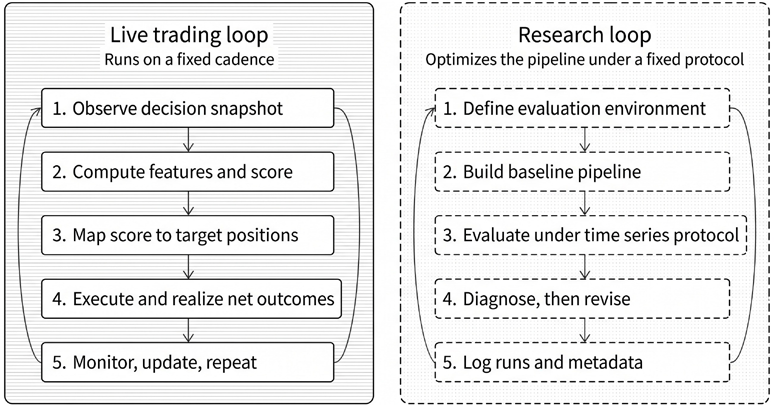
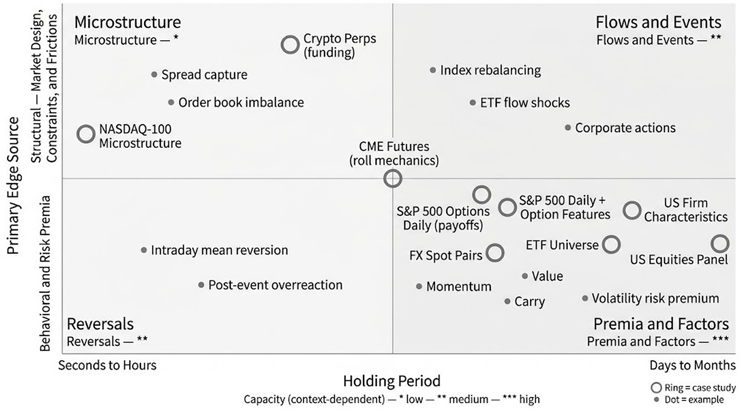
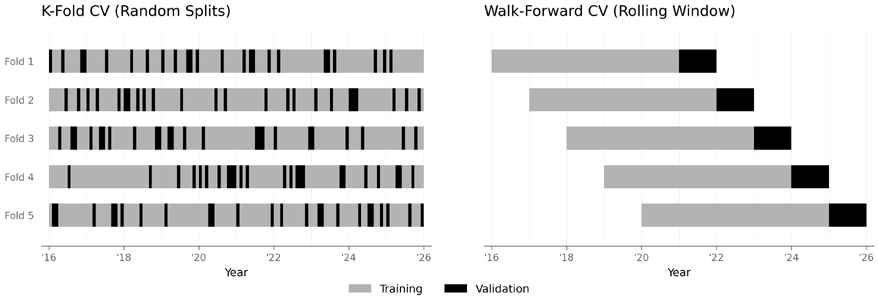
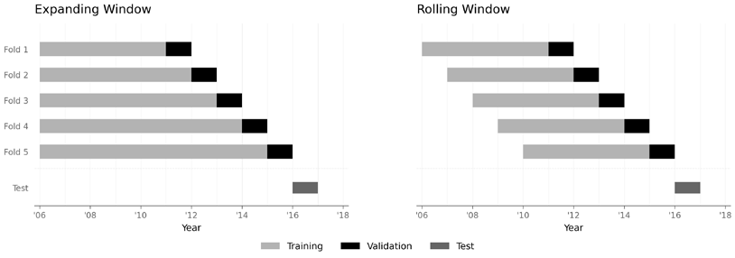
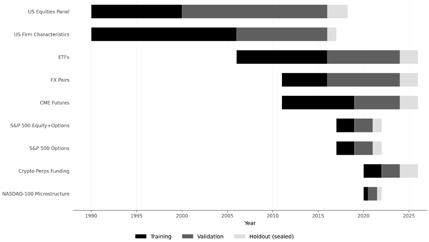

# 第6章：策略研究框架

每个交易策略都始于一个想法。难的是把这个想法变成可信的证据：结果要经得起真实的成本与约束，在反复搜索之后依然可解释，并最终落成一个可重复的流程——它在样本外依然有效，而不是一次性的样本内回测。本章介绍锚定 ML4T 工作流的策略研究框架：这是一个研究闭环，我们将在*第7–20章*中逐步展开——从特征工程与建模到策略回测——最后在*第25章*把策略推向实盘。

这一框架要求我们尽早定义交易设置：交易什么、何时决策、信号如何变成仓位，以及仓位在计入成本、约束与风险控制之后如何产生净结果。有些参数从一开始就已知（例如可投资资产的标的池，或明确的费用）；另一些则需要进一步研究（例如市场冲击或风险管理）。目标是让依赖关系清晰可见，为早期可行性筛查给出保守假设，并把悬而未决的问题记录下来，留给后续章节。

学完本章，你将能够：

- **把想法放到策略地图上**，将其联系到一个策略族、一个说得通的持续盈利来源，以及主导性的可行性约束。
- **用决策时点的术语明确交易设置**：什么可交易、何时决策、哪些信息可用，以及分数如何变成仓位。
- **从经济意义上定义"更好"**，并区分各项指标的角色，让诊断指标指导迭代，而不是取代策略评估。
- **采用时间序列评估协议**，把选择与性能估计分开。
- **定义一个基线检查点**，其设计刻意从窄，以便在广域搜索之前支撑早期可行性筛查。
- **让搜索可计数、可恢复**，依靠自动运行日志和一套简单的试验分类体系。

在实践中，这些选择都体现在代码里：一小批带版本的配置对象，以及消费这些配置的流水线。每次运行都会自动生成一条记录（配置、切分、指标、输出），使结果可复现、迭代可计数。

## 6.1 依托 ML4T 工作流：从想法到证据

交易策略是一个可执行的流程。上线之后，它按日程运行：利用决策时点可用的信息生成模型输入，把模型输出转化为仓位，并在计入成本与约束后实现结果。这一工作流见*图 6.1*。

*图 6.1：实盘交易与研究闭环*

研究阶段，我们用历史数据模拟这一流程，目标是通过迭代改进每个组件来优化流程，同时保证比较有意义、可解释，让历史模拟在决策时点上与实盘系统的行为一致。

### 实盘交易闭环

任何系统化策略——无论使用手工构建的信号还是 ML 模型——都可以描述为一组按固定节奏重复的步骤：

1. **观察决策快照**。在每个决策时点，策略对可用信息做一次快照，这决定了它在承诺交易时"知道"什么。
2. **计算特征并产生分数**。这些数据被转换成一组特征，供模型（或基于规则的信号）预测排名、概率、收益预测值，或其他对交易决策有用的分数。
3. **把分数转化为仓位**。交易策略（trading policy）把这些预测转换为目标仓位，受风险限额与各项约束的限制，并据此下单。
4. **执行并实现净结果**。订单成为成交，伴随滑点、买卖价差、手续费、融资、资金费、移仓成本以及其他市场特有的机制。仓位产生损益（PnL）与暴露，供度量与监控。
5. **监控、更新并重复**。业绩、风险与数据质量被持续跟踪，运维异常得到处理，循环在下个决策时点重新开始。

这个闭环只有在时序定义清晰时才有意义。实盘中不可能使用尚未可得的信息，但在基于历史数据的研究中，人们却极易在不知不觉间这么做。因此，我们必须明确定义交易决策的时序并保持这些约定稳定，使改进可以归因于有意的改动，而不是漂移的假设。

### 研究闭环

研究的任务是为实盘闭环的行为积累证据，同时避免在迭代中随意更改评判标准。我们从实盘闭环的一个基线版本出发，用时间序列协议评估它，诊断弱点，每次只改动一个组件，并把测量噪声考虑在内。一个可操作的研究闭环如下：

1. **定义评估环境**。声明可交易标的池、决策节奏、基本约束，以及被视为重要的成本构成。这一设定让各次迭代的结果可比，也避免部署时出现意外。
2. **搭建基线流水线**。实现与该设定一致的、最简单的端到端版本：最少的特征、一个基线标签、一个基线模型类，以及从分数到仓位的简单映射。
3. **在时间序列协议下评估**。用时间感知的验证比较候选方案；待流水线稳定后，保留一个留出测试集用于确认。正是在这一步，我们防止泄露与选择偏差主导结论。
4. **先诊断，再修改**。用诊断结果决定下一步改什么：数据定义、特征族、模型类、超参数、映射类参数、约束，还是成本假设。改动要有的放矢，其余保持不动。
5. **记录发生了什么**。记录足够的元数据，既能复现每次运行，也能统计尝试过的备选方案。缺了这一步，迭代将无从追溯，选择偏差也将隐而不见。

这个闭环并不假设一开始就有单一而明确的假设。在 ML 驱动的研究中，我们通常探索的是一个**假设类**：一族测量指标，组合起来可能带来更好的交易决策。纪律不在于"绝不探索"，而在于在稳定的设置与稳健的协议之内探索，让结果保持可解释。

### 用案例研究展示研究框架

九个案例研究将在后续章节中贯穿展示策略研究工作流。每一个都是时序安排、可行性检验与评估的脚手架，而不是推荐的交易系统。它们跨越多个资产类别与数据频率，取材自*第2章*和*第3章*的数据集。对每个案例研究，我们都会标明资产类别、数据频率，以及以标的数量和时间区间衡量的覆盖范围。

- `etfs`：*多资产 · 日频 · 约 100 只标的，跨 20 年。* 跨资产轮动策略，突出换手率经济学，以及在股票、固定收益与大宗商品上的市场状态依赖性。
- `us_equities_panel`：*股票 · 日频 · 约 3000 只标的，跨 50 年。* 用于信号构建、标的池过滤与大规模容量分析的主力横截面数据集。
- `us_firm_characteristics`：*股票 · 月频 · 约 2500 只股票 · 1996–2016。* 基于约 57 个公司层面特征构建的因子模型，强调时点正确性纪律，以避免幸存者偏差与前视偏差。
- `fx_pairs`：*外汇 · 4 小时 bar / 每日纽约时间下午 5 点决策 · 20 个货币对 · 2011–2025。* 货币策略：直面收盘定义、bar 聚合选择，以及跨时区的可交易收益构建。
- `cme_futures`：*期货 · 日频 · 30 个合约，跨 15 年。* 趋势与套息策略：需要细致处理时段对齐、移仓机制与期限结构建模。
- `crypto_perps_funding`：*加密资产 · 8 小时 · 约 20 只标的，跨 5 年。* 永续合约：资金费时间表、交易所特有的市场机制与交易成本主导着信号经济学。
- `nasdaq100_microstructure`：*股票 · 分钟级（降采样至 15 分钟）· 约 114 只标的，跨 2 年。* 高频特征：暴露时序约定、执行真实性，以及理论成交与实际成交之间的差距。
- `sp500_equity_option_analytics`：*股票 + 期权 · 日频 · 标普 500，跨 5 年。* 以隐含波动率、偏度、看跌/看涨期权比率等期权衍生特征增强的股票策略。
- `sp500_options`：*期权 · 日频 · 标普 500，跨 5 年。* 期权策略：突出收益核算、对冲换手率，以及净收益背后的融资假设。

下一节介绍策略族与优势来源，并借助这些案例研究把策略地图具体化。

## 6.2 策略与优势来源的映射

大多数策略想法最初都是一段叙事："价格反应不足""套息是对承担风险的补偿"，或者"资金流带来可预测的压力"。策略地图把这些叙事变成可用的设计工具。在构建模型或运行大规模回测之前，地图应当用可操作的术语回答两个问题：

- **策略的结构是什么？**交易什么、多久决策一次、风险持有多久，以及在该节奏下哪些摩擦占主导？
- **它凭什么赚取净收益，又凭什么持续？**哪种经济力量有可能在计入成本与约束后仍产生收益？要让这一效应在竞争与市场状态变化中存活，哪些条件必须持续成立？

地图使用两个互补的视角。**策略族**按节奏、信息来源，以及在该节奏下成为一阶问题的摩擦对想法分类，指出哪些必须尽早定下来。**优势来源**是关于溢价为何存在、持久性取决于什么的经济叙事，用于指导压力测试与失效模式假设。故事可信但实现不可行，不是策略；实现可行但没有可信的故事，只是一个失效模式无从解释的回测。**专栏 6.1：需要区分的时间概念**

交易策略的循环活动蕴含着若干需要明确定义的时段与时点：

- **决策节奏**：策略被允许多久改变一次仓位。这是决策与再平衡的时间表。例如，策略可能每天只入场一次，但盘中监控退出信号。
- **持有期**：仓位建立后，风险通常被持有多久。可以是固定的（例如每 5 天），也可以是可变的（因信号或风险控制而退出）。
- **预测期限**：模型被训练去预测的未来区间。当预测跨越给定区间、仓位持有到退出理由出现时，预测期限不必与持有期一致。策略也可以为入场与退出信号使用多个模型，各有不同期限。
- **回看窗口**：特征在决策时点形成时向前回溯多远。它决定了特征可用的历史跨度。不同模型输入可以使用不同窗口，与持有期和预测期限无关。

*图 6.2：以优势与持有期刻画的各类策略，横跨策略族（节奏轴）与本节其余部分展开的优势来源*

### 策略族：可行性过滤器

各策略族互有重叠。同一个标签（例如"动量"）既可以指月度横截面排序，也可以指日内趋势跟踪。策略族并不唯一决定节奏；它指出的是：一旦选定节奏，什么会最先出问题。应采用其主导约束与目标节奏相匹配的策略族，并把策略族当作一份可行性清单：哪些必须*尽早*固定下来，结果才可解释。

#### 基于价格的策略

这类策略从过去的价格、收益或已实现波动率中生成信号，包括时间序列趋势跟踪、横截面动量与短期均值回归（Moskowitz et al., 2012; Hurst et al., 2017; Jegadeesh and Titman, 1993; Asness, Moskowitz, and Pedersen, 2013）。节奏快时，换手率与执行真实性成为一阶问题；节奏慢时，风险集中在偶发的回撤与市场状态切换上（动量崩溃是已知的压力情形；Daniel and Moskowitz, 2016）。

要让基于价格的想法可检验，需固定持有期限与再平衡节奏、回看窗口，以及分数到仓位的映射。首轮筛查：业绩是否经得起回看/再平衡选择的适度改动？在保守且计入换手成本的前提下是否仍然说得过去？

**案例研究**：`etfs`、`us_equities_panel` 与 `fx_pairs` 展示了日至月级别期限上的换手经济学、敞口控制与市场状态敏感性。

#### 基本面与估值策略

这类策略交易估值、质量、成长或盈利能力上的横截面差异，节奏通常为月度到季度。它们的关键约束不是速度，而是输入的**决策时点含义**。最常见的失效模式是误用了决策时点尚不可得的信息（**时点约定**与**覆盖规则**见*第2章*和*第4章*）。当信号变动缓慢时，**有效样本量**远比行数所暗示的要小。

**案例研究**：`us_firm_characteristics` 是时点正确性纪律、覆盖规则，以及信号定义与标的池构建之间相互作用的主要依托。

#### 资金流与微观结构策略

这类策略利用订单流代理变量、报价动态或源自微观结构的特征，追求每笔交易上的小额优势。随着节奏加快，问题从"预测收益"转向"在真实交易规则下捕捉微观结构效应"。可行性取决于时序纪律、执行假设与市场接入。必须精确界定：决策时点什么可观察、假设何种延迟，以及成交随订单规模相对深度与成交量如何缩放。

**案例研究**：`nasdaq100_microstructure` 把时序约定与执行真实性作为一阶关注点。

#### 市场机制与收益结构策略

这类策略依赖构成经济收益一部分的合约机制：期货移仓与期限结构、永续合约资金费、保证金与融资、期权收益与对冲换手、结算惯例，以及合约准入规则。可检验性要求显式的**收益分解**与显式的**生命周期规则**（合约选择、移仓时间表）。首轮筛查：成分归因、规则稳定性，以及约束收紧（保证金、资金、强制去杠杆）时的压力表现。

**案例研究**：`cme_futures` 与 `crypto_perps_funding` 是机制优先的例子。`sp500_equity_option_analytics` 与 `sp500_options` 支撑期权研究——在这里，收益核算、波动率曲面的时序/覆盖、对冲换手与融资假设主导解读。**关于"机器学习策略"的说明**

机器学习不是一个策略族。它是一个可应用于任何策略族的建模与决策支持层。由于 ML 扩大了有效自由度（更多特征、更多模型类、更多超参数），它提高而非降低了有边界的策略定义与有纪律的评估的价值。

### 定义优势、alpha 与容量

**优势（edge）**是一种可重复的有利条件，它使给定策略下**净**交易结果的分布偏向有利，既反映盈利相对亏损的可能性，也反映计入成本后的幅度。两个相关术语很重要：

- **alpha** 是相对基准（某个指数或因子模型）的业绩，基准代表替代性机会或获得补偿的风险暴露。一个策略若无法在相似的暴露与约束下跑赢被动基线，可能就不值得追求。
- **容量**是指在优势因冲击、费用、融资约束或机会集限制而退化之前，可以投入的资本规模。容量并不决定优势是否存在，但常常决定它在规模化时是否经济可用。

### 优势来源：持久性过滤器

可行性回答的是这个想法能否得到可信的检验；持久性回答的是优势要存续，哪些条件必须始终成立。McLean 和 Pontiff（2016）发现，已发表的预测因子在发表后大约失去一半的预测能力，一部分归因于过拟合，一部分归因于套利。其含义是：仅依赖信息的优势往往衰减；依赖风险承受意愿、约束或容量限制的优势，即使广为人知也可能持续。真实策略常常混合多种优势来源；关键是明确哪些占主导，并检验其对应的失效模式。

一个有用的组织框架根据机会*为何*持续，区分出六种超额收益来源（Paleologo, 2025）：

| 来源 | 机制 | 持久性 | ML4T 示例 |
| --- | --- | --- | --- |
| 风险补偿 | 承担他人回避的暴露（尾部、波动率、流动性风险） | 高——只要投资者厌恶风险就会持续 | `cme_futures` 套息，`sp500_options` 波动率风险溢价 |
| 流动性提供 | 为提供即时性或吸收库存而赚取溢价 | 高——对即时性存在结构性需求 | `nasdaq100_microstructure` 日内反转 |
| 资金约束 | 在资本稀缺或杠杆受限时利用价格错位 | 中等——间歇性出现，压力时期最强 | 强制平仓后的短期均值回归 |
| 资金流可预测性 | 围绕强制性或规则性需求提前布局（指数再平衡、对冲计划） | 中等——随拥挤而衰减，但随每次事件重现 | 指数成分调整交易、ETF 申赎资金流 |
| 信息优势 | 从公开数据中更好地推断：更干净的特征、更快的处理、更优的模型 | 低到中等——随竞争者复制方法而衰减 | 各案例研究中的 ML 特征工程 |
| 纯套利 | 利用同一资产在不同交易场所或结构间的定价偏差 | 极低——转瞬即逝、受容量约束、运营密集 | 案例研究未涉及 |

*表 6.1：六种超额收益来源的比较*

下面几个小节展开其中几种来源及相关机制。大多数真实策略混合了其中两种或更多；这张表有助于识别哪些来源支撑论点、应优先检验哪些失效模式。

**专栏 6.2：为什么大多数已发表的异象在实践中失灵**

学术文献记录了数百个横截面预测因子，却很少有能作为可交易策略存活下来的。大部分折损来自三个缺口：

- **发表后衰减。** McLean 和 Pontiff（2016）表明，异象 alpha 在发表后大约下降 50%，一部分源于过拟合校正，一部分源于套利资金的涌入。
- **实施缺口。** 学术研究通常采用简化的投资组合构建（等权重多空十分位组合、月度再平衡、不计成本），这会高估实盘业绩。换手、买卖价差与借券成本常常吞噬所报告的 alpha。
- **细节敏感性。** 微小的定义选择（标的池过滤、再平衡时点、缩尾阈值）就可能翻转回测结果的符号。回测出来的异象是假设，不是证据；证据来自固定协议下的样本外评估（*6.5 节*与*6.6 节*）。

应对之道不是回避已发表的想法，而是把它们当作起点，要求在研究者自己的交易设置与成本假设内做独立验证。

#### 缓慢调整与行为反应

由于注意力有限、决策委托或组合再平衡缓慢，价格可能逐步吸收信息，这催生了动量与中期趋势效应背后的反应不足叙事（Jegadeesh and Titman, 1993）。**早期失效模式检验**：检视回撤与反弹事件（动量崩溃；Daniel and Moskowitz, 2016），检查业绩是否集中在良性环境中、而在波动率飙升或流动性枯竭时反转——这种模式往往表明 alpha 部分是对状态依赖风险的补偿。

#### 风险补偿

有些收益是对承担他人回避的暴露的补偿：流动性风险、尾部风险、波动率风险，或高资产负债表占用的暴露。这类优势可以在人尽皆知的情况下持续，因为约束在于风险承受意愿与杠杆容量，而不是信息。

**早期失效模式检验**：约束生效（保证金/融资冲击、强制去杠杆）的尾部事件中的业绩，以及以波动率与流动性代理变量为条件的业绩。

#### 市场分割与套利限制

分割的市场与机构性约束造成持久的价差：融资成本差异、资本占用成本、卖空约束、库存限制，以及客户资金流的内部化。这种优势得以持续，是因为套利大量占用资产负债表或受运营约束。

**早期检验**：承压融资与费率环境下的稳定性、市场接入假设的现实性，以及容量/拥挤行为。

**专栏 6.3：为什么仅靠预测并不够**

正确的预测并不保证一笔交易有利可图。2000 年，当 3Com 宣布分拆旗下子公司 Palm 上市时，Palm 的隐含估值迅速超过母公司——教科书式的定价错误，每个市场参与者都看得见。但这笔交易几乎无法执行：可供借入的 Palm 股票稀缺，借券费率飙升至极端水平，分拆时间表的不确定性又使融资风险敞口没有尽头。尽管显而易见，这一错误定价仍持续了数月。对 ML 驱动的研究而言，教训非常具体：在为定价错误假设构造特征之前，先核实空头一侧可以进入、借券与融资成本不会吞噬价差、持有期风险有界。一个只能识别出无法利用的机会的模型，无论预测多么准确，在操作上都毫无用处。

#### 机制性与机构性资金流

来自投资授权、对冲、指数再平衡、移仓时间表或系统化执行程序的可预测需求，会造成暂时性或周期性的价格压力，其驱动因素是规则与约束，而非信念。

**早期检验**：日历依赖与事件对齐、拥挤下的衰减，以及执行敏感性（资金流优势往往就在价差附近）。指数成分调整是标准例子。当指数供应商宣布加入或剔除成分股时，跟踪该指数的被动基金必须在生效日之前完成交易，从而形成方向、大致规模与时点都提前公开可知的需求冲击。优势不在于拥有私人信息，而在于赶在强制性资金流之前布局：预测*哪些*证券将被加入或剔除，以及需求*何时*兑现。风险是真实的：持有期内公司特有损失的暴露、事件可能被取消，以及越来越多参与者利用同一信号带来的拥挤。随着被动投资持续增长（据估计占美国股票市值的 35%–40%），这些资金流事件造成更大的价格错位并吸引更多竞争，凸显了机会规模与拥挤之间的张力——这种张力在各类资金流策略中反复出现。在我们的案例研究中，`cme_futures` 的期货移仓效应与 `etfs` 的 ETF 申赎动态，在不同的节奏上呈现出类似的资金流驱动模式。

#### 信息与度量优势

净收益也可能来自更好的推断：更干净的定义、更好的时序纪律、更可靠的标签，以及从可观测量到行动的更忠实的映射。这很少是"免费的钱"；它往往是把一个脆弱的回测变成稳健实现的因素，而且通常寓于其他类别之中。

早期检验强调：对定义选择与保守时序的稳健性、对覆盖率/缺失的敏感性，以及增量信号质量在真实成本与约束下的存留程度。

### 使用策略地图

当以下问题都能得到回答时，策略的定义才算完整：

- **策略族与节奏**：哪些摩擦占主导？
- **PnL 分解**：哪些收益结构产生回报？哪些成本是一阶的？
- **优势叙事**：主要的经济来源是什么？它凭什么持续？
- **主要失效模式**：策略可能失败的两种或三种方式。

在扩大搜索之前先回答这些问题，有助于聚焦下一个设计决策：在交易设置中固定什么、先运行哪些诊断、哪些压力测试不可妥协。接下来我们讨论交易设置的组成部分。

## 6.3 定义交易设置

当评估环境在无人察觉的情况下漂移时，可比性就崩坏了：标的集合变了、再平衡快照偏移了、执行时点挪动了，或者成本处理方式不同了。**交易设置**就是该环境中固定的部分：代码在一条研究线内视为恒定的不变量，也是每次运行都会自动记录的内容。我们可以在这些不变量之内大胆探索，但改变它们就定义了新设置，必须提升版本号。

### 交易设置必须固定的内容

交易设置固定的是决策时点快照、映射形式与摩擦机制，而不是枚举每一个回看期或阈值。它应涵盖以下主题：

#### 标的池与可交易性规则

定义使定价与执行具有经济意义的准入与成分变更机制。明确过滤条件（流动性、上市场所、合约类型），以及如何处理新上市、退市和过期或缺失的价格。例如，`etfs` 需要明确的可投资性过滤规则，以及处理 ETF 新发与清盘的规则；`crypto_perps_funding` 需要交易所与合约准入规则，以及如何对待惯例变化（如费用、资金费上限、保证金规则）的规则。

### 决策时间表与可用信息

明确交易快照，以及该时点上什么可知道。这是防止泄露的护栏，因此必须显式声明：时间戳约定、bar 频率（如有），以及任何机械性的执行延迟。`etfs` 可以采用周度或月末快照；`crypto_perps_funding` 将决策与资金费时间戳对齐；`nasdaq100_microstructure` 需要固定的 bar 时间表和明确的"观测到执行"延迟，因为错开一个 bar 就可能改变结果。

#### 节奏与期限可行性

节奏的选择与成本紧密相关：在每个期限上，典型价格变动中有多大比例超过往返交易成本？在考虑任何信号之前，这一原则就决定了可行性。

每个案例研究都包含一个设置 notebook，其中有期限可行性分析，展示多个节奏下的收益分布以及一条成本参考线。由此识别出三种区间：

- **硬性下限**：成本明显占主导（例如 `nasdaq100_microstructure` 的 15 分钟 bar）
- **灰色地带**：可行性取决于信号强度与换手率（例如 `etfs` 的日频交易）
- **舒适区**：成本不是约束性因素（例如 `etfs` 的月度再平衡）

节奏决策将在后续章节做出：届时信号诊断会揭示特征——无论是单独使用还是置于模型之中——是否具有足够的预测力，足以支撑按给定频率交易。

#### 分数到交易的映射

定义模型的分数如何转化为订单、仓位与退出。这一映射决定了交易频率、持有期分布，以及成本与约束在何处发力。至少要确定以下设计参数，以保证结果可比：

- **仓位状态空间**：例如仅做多、多空，或多腿（价差/对冲）。
- **入场逻辑**：例如排名选择或阈值门控。
- **退出逻辑**：例如基于时间、信号或风险的退出。
- **仓位规模**：分数如何转化为敞口（例如等权重、波动率目标）。
- **下单时点**：何时下单（开盘时、日内窗口、执行延迟）。

这些细节很可能演进，而一旦演进，用于比较的参照系也随之改变。

#### 纳入范围的约束与风险控制

指明哪些约束按刚性约束处理：暴露与杠杆限额、集中度规则，以及强制执行的任何流动性或容量限制。会改变交易行为的风险控制（例如降风险叠加层或熔断开关）必须显式声明并纳入版本管理，因为它们改变的是实际生效的策略。

#### 成本模型类与成本构成

早期研究不需要完美的模拟器，但需要就"哪些摩擦被视为重要"保持一致。说明所包含的成本构成（手续费、价差、滑点/冲击、融资或资金费、借券、移仓），以及假设有多保守。后续章节会扩展成本模型；早期筛查采用保守、粗略的假设。

*示例（永续合约）*：在 `crypto_perps_funding` 中，资金费是依赖于仓位的现金流，属于总收益流的一部分：支付时是成本，收取时是收益。由于它只在资金费时间点上持有仓位时才计提，并按交易所特定惯例结算，交易设置必须明确：(i) 交易与仓位变动如何与资金费快照对齐；(ii) 假设采用哪种定价与资金费公式（包括任何上限/下限）及费用表；(iii) 惯例变化如何纳入版本管理。否则，同一个回测可能隐含不同的有效暴露，产生实质不同的 PnL。

*示例*：**ETF 跨资产动量设置（v1）**定义了如下不变量：

- **标的池**：100 只跨资产 ETF，基于过去一年日均成交量（ADV）≥ 1000 万美元的时点正确准入。宽松的阈值在样本初期保住了横截面宽度（每年 70–95 只合格 ETF）。注意，标的池构成存在幸存者偏差，没有历史成分数据就无法完全解决；而池内的准入判定则是时点正确的。
- **决策时间表**：每月月末收盘快照，在次日 bar 开盘执行。这与动量文献保持一致，便于基准比较。周度（5 天）节奏作为变体加以测试。
- **映射**：仅做多、按排名选取前 N、等权重、按节奏再平衡。仅做多是因为做空 ETF 成本高昂；等权重是为了把排名信号与仓位优化隔离开——后者会干扰评估。
- **约束**：满仓、仅做多、不加杠杆——一套适合教学基线的最小约束集。
- **成本模型**：重要构成为按股佣金（每股 0.0035 美元，IBKR Pro Tiered），加上分档的半个价差滑点（流动性最好的超大型 ETF 为 0.5 美分，行业 ETF 为 1 美分，主题与区域 ETF 默认 2 美分）。期限可行性分析用每条腿 5–15 个基点（bps）的参考成本线筛查节奏，并确认月度波动在超过 90% 的观测中高于 30 个基点的往返成本；日频交易则处于灰色地带，可行性取决于信号强度与换手率。

设置 notebook 会把这些选择写入带版本的 YAML 产物（`setup.yaml`），供后续章节以编程方式读取。把映射从仅做多改为多空，就需要 `setup_version: v2` 和一个新的基线检查点；而参数调整，比如把 top-N 从 10 改为 20，仍留在 `v1` 之内。

### 何时需要新的设置版本

把交易设置当作带版本的对象。凡改变策略决策时点含义、或改变其主导摩擦与约束的变更，都要提升设置版本。参数调优留在同一设置之内；机制变更则定义新设置。只要改动涉及以下至少一项，就构成新的设置版本：

- **标的池或可交易性规则**，例如准入、成分变更机制、标的范围。
- **决策时间表或可用信息**，例如再平衡快照、节奏、执行延迟，以及输入可得性规则。
- **分数到交易的映射**：在状态空间、入场或退出形式、规模归一化或下单时点层面发生改变。
- **约束机制**，例如刚性的暴露/杠杆限额、集中度规则、容量或流动性约束、改变行为的叠加层。
- **成本模型类或所含构成**，例如新增资金费或移仓机制，或以影响可行性的方式更改滑点模型。

为了让这条边界不产生歧义，要把**机制**与**参数**区分开：

| 同一设置版本（参数调优） | 新设置版本（机制变更） |
| --- | --- |
| 阈值 1.8 → 2.0 | 排名选择 → 阈值门控 |
| 前 10% → 前 20% | 仅做多 → 多空 |
| 20 天 → 60 天标准化窗口 | 在原本没有止损规则时新增止损规则 |
| 不同的回看期 | 更改再平衡节奏或执行延迟 |
| 每条腿成本假设 10 基点 → 15 基点 | 将资金费/移仓加为成本构成 |

*表 6.2：机制变更与参数调整的对比*

跨设置版本的结果仍有参考价值，但它们并非同一研究计划内的直接竞争者。下一节定义在固定设置内什么才算改进，把开发诊断与策略层面的评估区分开。

**实现**：`02_case_study_overview` 盘点了九个案例研究各自的交易设置（标的池、决策时间表、映射、约束、成本模型），也是上述工作示例的来源。

## 6.4 设定目标与评估指标

在运行大规模实验网格之前，研究计划需要对"更好"的明确定义。在这里，"更好"指**固定交易设置下的经济价值**：把模型输出映射为仓位并施加约束与成本后得到的组合收益。本节给出三条重要规则：

- 以**经济指标**评估策略候选，基于一致的 PnL 定义
- 为模型评估与策略评估**区分指标角色**
- 为开发**选定一个主选择指标**，并为策略结果**另设一组报告指标**

具体指标将在后续特征、模型与回测章节出现；这里我们建立这些指标层级如何相互作用的框架。

### 三个指标层级，各有分工

ML 驱动的策略研究中，混乱常常源于用同一个指标回答多个问题。应把指标视为三个不同的层级，每一层对应一个具体决策：

- **模型诊断**回答一个狭窄的问题：模型能否以能跨时间切分泛化的方式学到标签？典型检查包括损失或误差、校准，以及各折之间的稳定性。如果这些检查不达标，就应把下游交易结果视为难以解释，因为预测器本身不稳定。这些检查不需要成本模型、仓位规模或组合模拟；它们是一道早期关卡，防止对噪声过度解读。
- **信号诊断**检验模型输出在所选映射类下是否表现得像可交易的信号。常用的是**信息系数（IC）**，即预测分数与随后实现收益之间的 Spearman 秩相关（见*第7章*）。信号诊断把输出**当作要交易的分数**；模型诊断把它**当作要信任的预测器**。*第7章*将详细讨论两者。
- **策略结果**在成本与约束下、以风险与收益的视角评估端到端流程。典型报告包括风险调整后收益、波动率与回撤、暴露与集中度行为，以及实现的换手率（见*第17章*）。失效模式是：在开发过程中把策略结果当作每个微小设计选择的目标，这会助长对模拟器自由度的过拟合，样本外表现很可能令人失望。

一个互补的诊断工具——**共形预测区间**——能在不做分布假设的情况下提供校准的不确定性估计。*第11章*将介绍用于时间序列预测的共形方法；这里只需注意：校准良好的预测区间可以标记模型置信度与实现结果不一致的情形，作为前述三个层级之外的早期预警。用模型诊断评估可学习性，用信号诊断评估映射下的可交易性，用策略结果判断所声明的设置是否产生经济价值。策略结果要"留到后期"：当它驱动每一个微小决策时，对实现细节过拟合的风险就会上升，掩盖稳健的优势。下面我们转向如何在时间序列情境中评估目标指标。

## 6.5 时间序列评估协议

评估回答一个简单的问题：从历史数据中学到的流程，在未见过的数据上会有什么表现？我们的估计办法是：在那些决策做出时尚不可得的数据上检验决策。notebook `01_cv_foundations` 借助 `ml4t-diagnostic` 库演示这些概念。核心纪律是：把选择与性能估计分开，并固定决策时点，使未来信息无法泄入训练或模拟。

### 数据泄露与估计偏差

当流水线中任何组件使用了交易决策时点不可能获得的信息时，就会出现**前视偏差**。它是数据泄露最危险的形式，因为它会产生无法在实盘交易中复现的漂亮回测结果。在时间序列评估的情境下，前视偏差有几种表现形式（除*第2章*和*第4章*讨论过的幸存者偏差、时点错误等源头数据问题之外）：

- **标签泄露**：把未来收益用进同一条观测的特征（例如计算 5 天远期收益时，不小心把次日收益放进了特征）。
- **标准化泄露**：对衍生特征，在完整数据集上计算输入，而不是只用训练集。例如，用全量数据的均值与标准差计算 z 分数，可能泄露验证期的分布变化。
- **阈值泄露**：用验证集或测试集数据算出的统计量来设定阈值。例如，在观察到 2.0 能使测试期收益最大化之后再选择"当 z 分数超过 2.0 时入场"，就把未来信息嵌入了交易规则。

ML 流水线的每个组件都必须遵守时点正确性约束：标签（*第7章*）、特征（*第8–10章*）、验证切分和信号校准。假设能获取尚未可知的信息的回测，产生的是虚构的业绩。

### 从 k 折交叉验证到时间序列评估

标准 *k 折交叉验证*在随机选出的 80% 观测上训练、在其余 20% 上验证，重复 k 次（Kohavi, 1995）。这在观测为独立同分布（IID）时有效——即它们是来自同一稳定分布的可交换抽样。金融时间序列在两个方面打破了这一假设：

- **实盘流程是有方向性的。** 在生产中，时刻 t 只能使用 *t* 及之前可得的信息。随机切分几乎总是在验证点之后的时间戳上训练，等于在估计一个无法实时执行的流程。邻近观测还因自相关与缓慢变化的市场状态而相互依赖，随机打乱会夸大表面业绩。
- **行与行通过窗口耦合。** 特征与标签都由回看窗口和前向窗口计算（滚动波动率、历史收益、h 天远期收益）。即使按时间顺序切分，跨越切分边界的重叠窗口也可能泄露信息。

时间序列评估要求切分规则保持时间先后、防止窗口重叠，并与一个真正可运行的决策时点流程相匹配。Bergmeir、Hyndman 和 Koo（2018）证明，当残差不相关时，标准 k 折交叉验证可以为自回归模型给出无偏的误差估计；而当模型设定错误使误差中残留可利用的结构时，这一条件常常不成立。

### 以 walk-forward 交叉验证为基线

**walk-forward CV**（滚动前推交叉验证）模拟部署过程：在过去的窗口上拟合，在未来的窗口上预测、打分，然后向前滚动并重复。*图 6.3* 对比了 k 折与 walk-forward CV。一个最小的 CV 设计：

1. 选择一个**训练窗口**。
2. 选择一个**验证窗口**（用于预测的未来数据块）。
3. 在边界处强制**决策时点可用性**：训练数据必须足够早地结束，使每个训练标签在验证开始之前都已确定。
4. 在可用的训练窗口上拟合。
5. 在验证窗口上预测。
6. 用选择指标打分。
7. 按固定步长前进并重复。

*图 6.3：k 折与 walk-forward 交叉验证的比较*

这一协议可以用一个问题来检验：*在决策时点 t，哪些带标签的样本是实际可用的？* 一个以时刻 𝜏 索引的样本，只有满足以下条件才可用于 t 时点的训练：

- **特征**可以用 t 及之前可得的信息计算出来
- **标签**在 t 时已经知晓

*示例（外汇 4 小时 bar）*：对于按 4 小时 bar 决策的外汇策略，"收盘"取决于交易场所与 bar 的构建方式。如果决策快照是 4 小时 bar 收盘，特征必须能从该收盘时点可得的价格计算出来，且执行假设必须说明交易是在同一收盘时点成交、下一根 bar 开盘成交，还是以固定延迟成交。错开一个 bar 就可能把一条合理的规则变成泄露。

第二个条件是常见的失效点。如果标签是 h 天远期收益，那么时刻 𝜏 的标签要到 𝜏 + h 才可知。因此，"截至 t"的训练必须排除最近 h 个时间戳。

这就是**标签缓冲**（López de Prado, 2018 称之为 purging，即清除）。例如，采用 5 个交易日远期收益标签、每周 5 个交易日，假设决策时点是 2 月 10 日星期二，那么最新的合格训练时间戳就是 2 月 3 日星期二。中间的时间戳都不合格，因为截至 2 月 10 日它们的标签尚未确定。

walk-forward 评估要么使用**扩展窗口**（全部可用历史，方差可能更低，但可能引入陈旧数据带来的偏差），要么使用**滚动窗口**（最近的 L 条可用观测，适应更快，但方差可能更高）。

#### 重新训练频率

当新数据至少占训练窗口的 1%–5%，或样本外表现出现系统性退化时，就重新训练。对于 10 年窗口，每月或每季度重训一次即可；对于 20 天窗口，每日重训才能捕捉有意义的变化。这些设计选择会实质影响结果，必须记录在案。

### 时间缓冲：标签缓冲与特征缓冲

walk-forward 验证消除了最粗劣的泄露形式——用未来训练——但留下一个更微妙的问题。训练观测可以通过两条渠道"看到"验证数据：

- **标签向前看**：一个 20 天收益标签期从观测日起算。如果某条训练观测出现在验证期开始前 15 天，它的标签会与 5 个验证日重叠。
- **特征向后看**：一个 20 天动量特征使用过去 20 天的数据。如果训练*晚于*验证（如 k 折或组合式方案；见下文"组合式方法与路径依赖"），紧随验证期之后的训练观测就会用验证期的价格计算特征。

解决办法是**时间缓冲**：用空隙阻止标签和特征跨越切分边界。实践中，缓冲空隙一定要按**交易日**计数，而不是日历日。差别是实质性的。例如，2024 年 1 月的 21 个交易日标签缓冲跨度为 30–32 个日历日；而天真地按 21 个*日历*日清除只覆盖 15 个交易日，留下 6 天的标签泄露（见 `01_cv_foundations`）：

- **标签缓冲**移除其标签与验证集标签重叠的训练观测。其大小等于标签期限：对于 20 天远期收益，剔除距验证边界 20 个（交易）日以内的训练观测。对于日频数据上的次日预测，则无需缓冲。López de Prado（2018）称之为 **purging**（清除）。
- **特征缓冲**移除其特征回看窗口与验证期重叠的训练观测。只有当训练数据出现在验证期之后时才需要这种缓冲——标准 walk-forward CV 不会出现这种情况，但 k 折与组合式方案会出现。López de Prado（2018）称之为 **embargo**（禁运期），并建议以样本长度的 1% 作为经验法则；合适的缓冲大小取决于策略的期限与时间依赖性的强弱。

### 留出测试集与滚动重调

walk-forward 切分揭示了"在过去的数据上拟合、对未来预测"这一模式反复进行时，各种选择的表现。但它们本身并不能回答治理问题：*我们何时停止选择、开始度量？*

为了让这条边界可操作，要预留一个**封存的留出测试集**：一个不在任何开发决策（信号定义、特征选择、超参数调优、模型选择或报告选择）中起作用的最终时间块。留出集只有在流水线冻结之后才能查看。开发期间，我们用在 walk-forward 验证上计算的主开发指标做选择；流水线冻结后再报告策略结果；封存的留出集只使用一次，用于确认。

有了这条规则，两种不同的评估模式各有用处：

- **固定留出集（调一次、测一次）**：在开发期用 walk-forward 验证选出一个配置，冻结完整流水线（包括分数到交易的映射以及成本/约束假设），然后在封存的留出集上评估一次，以估计样本外表现。
- **滚动重调**：要估计一个随新数据到来而定期重调的流程的表现，把整个测试期切成更小的窗口，对每个窗口重复"固定留出集"流程。在每个测试步骤，只用严格早于下一个测试窗口的数据调优，在可用历史上重新拟合，然后在下一个测试窗口上打分。每个测试窗口只用于度量。这一方法称为**嵌套 walk-forward**，因为它有一个外层测试循环和一个内层模型选择循环。Bates et al.（2021）证明，由嵌套 CV 计算出的置信区间具有更优的统计性质。*图 6.4* 用扩展窗口与滚动窗口展示了这一流程。

*图 6.4：采用滚动窗口的嵌套 walk-forward CV*

嵌套 walk-forward 能够捕捉模型配置的变化，因而可能更贴近现实。例如，测试期为两年、回看期为五年时，实盘策略的重调次数很可能不止固定留出集方法所假设的一次。含多个特征集的嵌套 walk-forward 计算量很大；并行评估、增量重训与特征缓存是标准的优化手段。关键不变量始终是：相对于外层测试窗口，调优绝不使用未来数据。

### 组合式方法与路径依赖

标准 walk-forward 产生单一的样本外窗口序列：一条历史路径。**组合式方法**把时间切成块并评估许多训练–测试组合，产生样本外结果的分布而非单一路径。其动机是**路径依赖**：策略表现可能异常好或异常差，取决于单条测试路径上恰好落有哪些市场状态。López de Prado（2018）提出了**组合清除交叉验证**（**Combinatorial Purged Cross-Validation**，**CPCV**）：从总共 n 组中选出 k 组连续观测，产生 C(n, k) 种不同的训练/测试配置。

每种配置都同时应用标签缓冲与特征缓冲——这是必需的，因为验证组相对于训练块可能出现在任何位置。

在比较大量变体、希望更稳定地把握选择风险时，组合评估最为有用。它不能取代决策时点纪律：重叠泄露仍须用上述缓冲来防止，并且每个测试块相对其配对的训练块都必须被当作"未来"。组合评估的计算开销很大——C(n, k) 种配置会迅速膨胀——而且当时间序列较短或大多数块处于同一市场状态时，收益递减。我们将在*第17章*更详细地讨论 CPCV。

### 设计承诺

在运行实验之前，先明确并记录评估设计：

- **窗口长度**：训练、验证（如使用）与测试
- **步长**：每次迭代切分向前滚动多远
- **重训节奏**：模型多久重新拟合一次
- **标签期限**：定义标签所用的前向窗口，决定标签缓冲的大小
- **最长特征回看**：所有特征中的最大回看，决定特征缓冲的大小
- **测试期**：为最终评估保留的日期，不用于任何开发决策

这些是设计承诺，不是调优参数。研究中途更改它们，就定义了另一个评估流程，而不是同一评估下"改进"的结果。全书中，我们把承诺写入每个设置 notebook 生成的 `setup.yaml` 配置；后续章节将其转换为 ml4t-diagnostic 切分器使用的 `WalkForwardConfig` 对象。这使评估设计既显式又可执行。在实验之前记录这些选择，保证了可复现性，也让"同一个策略"在操作上有明确定义。*图 6.5* 展示了各案例研究的预测覆盖范围。覆盖差异很大；这种异质性要求为每个策略定制协议，这张图可作为了解每个案例研究统计深度的参考。

*图 6.5：九个案例研究的训练、验证与留出期*

notebook `02_case_study_overview.py` 展示了所有案例研究的交易设置与时间序列验证配置；相关分析位于每个案例研究目录下的 `01_setup.py` notebook 中。接下来，我们讨论如何从一个聚焦的基线开始研究。

## 6.6 建立基线检查点

在运行大规模实验网格之前，我们需要一个**基线检查点**：一个最小可运行的规格，用来回答一个早期治理问题：在当前交易设置与评估协议下，是否存在足够稳定的结构以支撑更深入的工作？还是应当修改设置本身？

### 三项预检健全性检查

在投入特征工程与模型搜索之前，先运行三项检查，尽早抓住常见失误。它们不是优势存在的证据，而是确认检查点设置是否合理的健全性检查。三项检查如下：

1. **时序健全性**。确认基线度量与标签可以只用所声明决策快照时点可得的信息计算出来，并遵守数据与模型流水线的时间线及执行延迟。
2. **覆盖健全性**。报告在准入规则下，目标标的池在每个决策时点实际可交易的比例有多大，以及该覆盖率在历史中是否发生实质变化。
3. **交易强度健全性**。用一个粗略代理估计映射的交易频率。目的是在构建详细的成本模型之前，发现那些隐含要求不现实换手率的定义。

如果这些检查未通过，正确的做法通常是修改交易设置的约定（快照、准入、映射类），而不是围绕一个脆弱的定义"绕着优化"。

### 首个参考运行在设计上刻意从窄

首个参考运行在所声明的设置与协议下产出可比、可解释的输出。它的输入（标签、特征和一个基线模型）将在随后五章陆续到位。保持从窄：

- **一个标签与一个期限**。选择一个与策略节奏和映射类对齐的单一前向期限。这一期限决定了 *6.5 节*所要求的标签缓冲。
- **紧凑的特征族**。使用少量能以正确节奏体现该叙事的特征族。目标是代表性覆盖，而非穷尽。
- **一个简单的基线模型类**。使用只需最少调优的稳定基线。这一阶段的目标是可比较的参考点，而不是峰值性能。
- **一个 walk-forward 设计**。明确训练与测试窗口长度、步长，以及标签期限所隐含的清除规则。封存的留出集留待之后确认。

参考运行回答一个狭窄的问题：在所声明的设置与评估协议下，一个简单的基线能否表现出稳定、非病态的行为，而不依赖脆弱的时序约定或极端的隐含换手率？

如果答案是"否"，下一步通常是重新审视设置（节奏、映射类、可交易性过滤，或度量/标签对齐）。如果答案是"是"，就可以在后续章节扩展信息集与模型类，同时保持基线可比。下一节讨论让这种比较可信的簿记工作：如何记录每次运行，使搜索广度可计数、选择偏差可见。

## 6.7 搜索记账与运行日志

**运行日志**是自动记录的元数据，外加指向每次执行所产产物的指针。当同一配置可以重跑、同样的输入、切分、指标与输出可以复原时，结果才能可靠比较。否则，关于结果的讨论就是在没有核实其来源的情况下进行的。研究机会成倍增加——LLM 辅助的假设生成（*第22–24章*）又放大了这一点——进一步强化了搜索可计数的必要性。运行日志支持三项实际需求：

- **可比性**：只有当其他一切都保持不变并记录在案——包括交易设置版本、数据快照、切分设计与成本模型类——业绩差异才能归因于流水线的某项变更。
- **选择透明度**：一旦开始比较变体，选择偏差就进来了。我们必须知道测试过多少备选方案、用哪个指标在它们之间取舍，以及是否有结果仅用于确认。Bailey 和 López de Prado（2014）提出了紧缩夏普比率（Deflated Sharpe Ratio），根据试验次数对业绩指标进行调整，以计入过拟合的概率。应用这类校正需要知道试验次数，而这就需要日志。
- **可恢复**：一张图、一个回测或一张表，都可以通过具体的运行标识符复现，无需猜测是哪个 notebook 单元或中间文件产出的。

### 试验分类体系

使用一套小而一致的分类体系，让搜索可计数而不流于繁琐。一个可行的四层结构是：

1. **策略**。一个有名字的交易设置与目标，带有固定不变量（标的池、决策节奏、仓位映射类和成本模型类），例如 `etfs`。
2. **试验族**。一组可比的备选方案，共享相同的设置与评估设计，只沿一个预期维度变化，例如同一期限下的基线信号定义，或同一模型类下的备选特征集。
3. **试验**。一个族内完整指定的流水线配置，包括确切的信号定义、特征规格、模型类、超参数（如有）和仓位规模规则。
4. **运行**。一次试验的具体执行，绑定具体的代码版本、数据快照、随机种子与计算环境，产出指标与产物。

这套分类体系能回答"我们比较了多少个信号定义？""*图 6.3* 是哪次运行产出的？"，而不会把研究变成文书工作流。

### 运行日志的最低内容

运行日志的目标是让结果**可复现、可比，并可通过门禁检验**。组织研究没有唯一正确的方式，但以下五类记录不可妥协，具体形式可以变化：

- **来源（运行了什么）**：策略设置版本、试验 ID、代码修订（git hash）、时间戳、随机种子。
- **数据与评估（测试了什么）**：数据集与时点约定、开发期与留出期范围、切分方案（窗口、步长、标签与特征缓冲）、标签期限，以及可用性约束。
- **配置（如何产出）**：基线定义与时序、特征与预处理规格、模型类与超参数、仓位映射，以及风险与成本模型参数。
- **产物（输出在哪里）**：指向特征与标签、预测，以及回测输出（仓位、交易、PnL、诊断）的引用。
- **决策与门禁（为何保留）**：选择指标与规则、报告的验收指标，以及留出集门禁结果。

这份清单刻意保持精简。如果某个字段不影响可复现性、可比性或留出集规则，默认就不要添加。MLflow 与 Weights & Biases 等工具可以自动完成其中大部分记录工作；*第26章*将详细讨论 MLOps 治理（*26.6 节*）。

降低被测策略有效数量的一种结构性方法是预注册假设：在运行回测之前明确经济论点、信号定义与评估标准。预注册并不排斥探索，而是在确认性检验（计入紧缩校正）与探索性分析（为未来假设提供信息）之间画出清晰界线。*第16章*将通过 Rademacher Anti-Serum 把这一想法形式化，它量化了在多个策略上搜索的惩罚（*16.7 节*）。本章小结把这些承诺汇集为*第7–20章*将贯彻的研究契约。

## 6.8 小结

我们把一个策略想法变成了一个能在迭代搜索下产生可信证据的研究计划。我们区分了实盘交易闭环与研究闭环，然后借助策略地图——由策略族（各节奏下的主导摩擦）与优势来源（持久性条件与失效模式）构成——迫使我们在早期就想清楚策略的结构，以及效应要存续必须满足哪些条件。

纪律建立在四项承诺之上：以带版本的交易设置固定评估环境；以明确的经济目标区分开发指标与报告结果；以时间序列评估协议保证时间先后与决策时点可用性，并配合封存的留出集；以及以紧凑的基线检查点和运行日志让搜索可审计、可复现、可计数。

下一章将专门讨论如何定义我们的学习任务。
