# 第7章：定义学习任务

机器学习模型的好坏，上限由你定义的学习问题决定。在选择算法之前，你需要三样东西：一个能捕捉与策略相关结果的标签；一套让输入在各次试验之间保持可比的预处理惯例；以及一个能把真实信号与时间、重叠或搜索造成的假象区分开来的评估框架。本章就来搭建这套脚手架。

*第8–10章*提供这一框架所要评估的候选特征（金融类、模型类和文本类）。本章建立的定义、诊断与决策闸门，将约束该序列中的每一个候选。

完成本章后，你将能够：

- 构建切分感知的预处理流水线，为标签与特征计算提供稳定、可审计的输入。
- 定义与执行一致的标签，并诊断其重叠程度与隐含交易强度。
- 用折感知诊断评估连续与二值目标下的特征–标签组合。
- 应用可行性筛查，过滤掉经不起实现成本的候选。
- 通过定义搜索集、区分探索与确认、校正折级汇总来处理选择偏差。
- 应用机制合理性检验，区分稳定机制与受混杂的代理变量。

贯穿全章，所有诊断都在每个 walk-forward（滚动前推）折内计算、再跨折汇总，以暴露合并统计量所掩盖的不稳定性。

## 7.1 数据预处理与编码

数据预处理把经过验证的数据集转换为标签与特征计算的稳定输入。前几章已经处理了时点正确性（point-in-time）、公司行为与日历对齐；*第6章*定义了可交易标的池。本节讨论特征工程阶段新出现的步骤：切分感知的拟合、异常值处理、表示选择与缺失数据协议。**专栏 7.1：协议安全的定义与计算**

本章把标签、特征和预处理变换都当作数据产品。为了让结果在各次迭代之间可比、并防止无声的泄露，每次运行都必须满足五条不变量：

- **可观测性**：每个原始输入都必须在交易设置下于决策时点可观测。报告滞后、更新时间、资格规则与日历惯例都是定义的一部分。
- **仅在训练集上拟合**：凡从数据估计参数的变换，只能在每次 walk-forward 切分的训练部分上拟合。
- **重叠感知的评估**：重叠的标签期限会引入依赖。用切分设计（*第6章*）加以处理，并在报告指标的同时报告重叠诊断。
- **版本化元数据**：所谓"特征"或"标签"是一个完整明确的配方。把定义写入运行记录；一旦更改，就产生新的试验族。
- **可审计的掩码**：资格掩码是学习问题的一部分。保存掩码定义（而不只是筛选出的行），并按折和资产组报告有效样本量。

### 切分感知的预处理

任何从数据估计参数的预处理步骤（均值、标准差、分位数、插补值），都只能对训练折拟合。在切分之前对整个数据集拟合，会把未来信息泄露进训练表示，从而夸大表现。

在 walk-forward 评估（*第6章*）中，这意味着在每个折的边界重新拟合预处理器，且只使用截至该时点可用的数据。**无状态**步骤（删除含无效值的行、应用固定的单位换算、计算布尔日历标记）不需要切分感知的拟合；但任何从一批观测计算汇总统计量的步骤都需要。

**拿不准时，就把该步骤当作需要拟合的**。在流水线配置中记录哪些预处理步骤需要拟合、哪些是无状态的。确保同一个流水线对象同时服务训练与推断，这样任何变换都不会被遗漏或重复施加（*专栏 7.1* 不变量 2）。`02_preprocessing_pipeline` 提供了一个强制"仅在训练集上拟合"的 `SplitAwarePreprocessor`，并演示了泄露的后果：仅在训练集上拟合时测试集均值为 0.110，而对全面板拟合时为 0.101。

### 异常值与厚尾

第一个要区分的是**无效**与**稀有**。无效观测违反领域约束（负成交量、不可能的时间戳、交叉的买卖报价），应当剔除。单个区间内随即反转的尖峰往往是数据错误；字段感知的尖峰检查把变化与反转的幅度同该字段的分布对比，有助于区分错误与真实行情。落入尾部的有效观测则需要不同的处理。激进的截断会丢掉真实信息；目标是限制极端值对下游变换的影响，而不是把它们消灭。**缩尾处理**（winsorization）或按固定百分位截断，可以避免缩放与归一化被单个数据点撑爆。当分布偏斜或尖峰时，**稳健缩放**（以中位数居中、除以四分位距）通常比均值–方差标准化更稳定。`02_preprocessing_pipeline` 对美股面板施加缩尾与领域过滤，并给出前后对比诊断。

一个重要例外：当标签本身就以极端行情或障碍事件为目标时，对收益做截断，删掉的恰恰是模型要学习的那些结果。尾部是预测目标时，请保留尾部。

### 缩放与表示选择

表示是学习任务定义的一部分。对水平值型序列（价格、收益率、价差），模型从变化（收益或差分）中学习比从原始水平中学习更可靠。平稳性诊断及相应的变换见*第9章*；标签的收益计算见 7.2 节。

**风险缩放**（除以已实现波动率）能让特征与标签在不同市场状态下保持稳定。把波动率估计（其定义与回看窗口）当作表示的固定组成部分，而不是在试验之间调来调去的参数。

**排名与百分位排名**往往是横截面特征最稳健的编码，因为它们降低了对异常值和供应商特定单位的敏感度。要明确是按时间戳在资产之间排名（横截面），还是在单一资产的历史内排名（时间序列百分位），并保持该选择稳定。

**类别编码**方面：低基数字段用独热编码；顺序有意义的字段用序数编码（例如信用评级档位）；高基数标识符用哈希或学习型嵌入。编码器只在训练折上拟合。

### 缺失数据处理

缺失值不是一个问题，而是三个。应对方式取决于数据*为什么*缺失，以及模型能接受什么：

- **作为噪声的缺失值**。缺失的起因与资产、时间或取值本身无关（随机缺口）。如果模型要求完整输入，就填入稳健的默认值（例如横截面中位数）；如果模型能处理缺失值，通常可以保持缺失。
- **由可观测覆盖规则导致的缺失值**。缺失可以由你确实观测到的字段解释（例如供应商覆盖取决于规模、交易所、区域或上市年限）。要么从这些字段插补并添加"曾缺失"指示变量，要么保留缺失值，依靠能原生处理缺失的模型加上该指示变量。
- **缺失本身含信息的缺失值**。缺失与未观测的取值或某个未观测驱动因素相关（例如指标变差时不再披露；恰恰在流动性低时成交记录稀疏）。此时"缺失"可能是信号，也可能是偏差。要显式保留它（用指示变量或单独的"未披露"类别），并把插补当作建模假设，而不是默认动作。

两个实用的默认做法：

- 如果模型要求完整输入，稳健插补并添加缺失指示变量
- 使用能原生处理缺失的模型（例如树模型，见*第12章*）

避免那些让缺失无声无息消失的插补。*表 7.1* 列出了一些针对具体数据集的注意事项：

| 数据集 | 关键预处理要点 |
| --- | --- |
| ETF 标的池 | 复权伪影、代码变更、覆盖缺口 |
| 加密货币溢价/永续 | 资金费率对齐、强平异常值、面板中途退市 |
| CME 期货 | 移仓调整连续性、假期日历对齐 |
| 外汇货币对 | 周末缺口、移仓时段流动性、时区惯例 |
| 美股 | 幸存者偏差、拆股/分红复权、低价股过滤 |
| 公司特征 | 预清洗面板；缺失模式与结构性突变 |
| NASDAQ-100 Bars | 时段边界、集合竞价成交（AlgoSeek 已预清洗） |
| S&P 500 Bars | 指数再平衡效应、与 ETF 标的池的一致性 |
| S&P 500 期权 | 价内外程度/到期筛选、希腊字母校验、与标的对齐 |

*表 7.1：案例研究的预处理要点*

**实现**：

- `01_data_quality_diagnostics` 汇总所有数据集的分布特征，包括为缩放方法的选择提供依据的尾部统计量。
- `02_preprocessing_pipeline` 按列、资产和时间段报告覆盖率，并展示跨数据集对齐。

下一节转向标签工程。

## 7.2 标签工程

标签定义学习任务：预测什么结果、在什么期限上、结果何时可知。一个哪怕只有轻微错位的标签（起止于不可交易的价格），都可能制造出实盘交易中消失的"可预测性"。标签定义必须**与执行一致**，并在*第6章*的时间序列协议下评估；另见*图 7.1*。

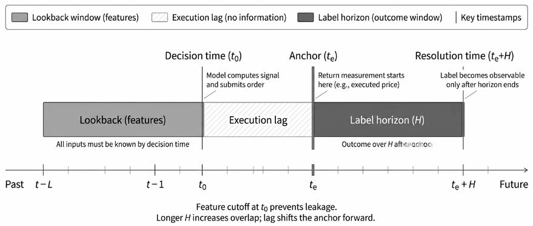
*图 7.1：标签与特征时间窗*

设 𝑡 为决策时点，𝑡ₑ 为建立仓位的锚定时点，𝑎 为资产，𝑝_{𝑡,𝑎} 为 𝑡 时刻的可交易价格；标签公式中的每一个价格，都必须在所选执行假设下可交易。期限 𝐻 从 𝑡ₑ 向前数到结果确定时点 𝑡ₑ + 𝐻，以时间或成交量相关单位计（*第3章*）。`03_label_methods` 演示本节的方法。

### 执行惯例

执行惯例决定标签窗口两端哪些价格可交易。对 bar 数据，两种惯例占主导：

- **收盘价到收盘价（close-to-close）**：信号在 bar 𝑡 收盘时生成；收益从 closeₜ 测至 close_{𝑡+𝐻}。这是最简单的惯例，也是大多数学术工作的默认选择。
- **次日开盘价到开盘价（next-open-to-open）**：信号在 bar 𝑡 收盘时生成，但仓位在 bar 𝑡+1 开盘时建立、在 bar 𝑡+𝐻+1 开盘时了结。这反映出大多数 bar 末尾生成的信号无法按收盘价成交。

两者的差别绝非表面文章。在美股日线数据上，收盘价到收盘价标签与次日开盘价到开盘价标签的每笔差异可达 50–100 个基点，方向可正可负，取决于隔夜走势与开盘跳空。这一效应很大：过去 30 年，美国股市的收益几乎全部来自隔夜而非盘中（Glasserman et al., 2025）。

选择与你的执行假设匹配的惯例，写成文档，并保证标签计算与回测 PnL 一以贯之。`03_label_methods` 在 SPY 上量化了 21 天期限下收盘价到收盘价与次日开盘之间的差距。

**固定期限标签**。默认标签是在固定 bar 数 𝐻 上计算的远期收益。两种常见的收益口径是：

- *简单（算术）收益*：𝑟^{s}_{𝑡,𝑡+𝐻,𝑎} = 𝑝_{𝑡+𝐻,𝑎} / 𝑝_{𝑡,𝑎} − 1
- *对数收益*：𝑟^{log}_{𝑡,𝑡+𝐻,𝑎} = log(𝑝_{𝑡+𝐻,𝑎} / 𝑝_{𝑡,𝑎})

小幅变动下两者几乎相等。对数收益跨期可加；简单收益对应 PnL 算术。选定一种，一贯使用，并记录在案。

固定期限标签最适合以稳定节奏行动、持有期大致固定的策略，无论预测的是连续值还是离散方向。期限不必按日历时间度量：可以在成交量 bar 或信息 bar 上以 bar 数定义 𝐻（*第3章*），让期限跟随市场活跃度而非时钟。结果总在 𝑡+𝐻 时点可知，这简化了重叠分析与折的构建。

关键决策在于以连续指标还是离散类别训练。许多多/平/空策略对连续收益建模，再用阈值把模型得分切成入场信号。

**连续目标**。最常见的连续目标就是原始远期收益 𝑟_{𝑡,𝑡+𝐻,𝑎} 本身。其他表示包括对异常值稳健的**变换**，例如相对横截面或资产自身历史的（百分位）排名；相对同侪组、基准或融资利率序列的**超额收益**；以及已实现波动率之类的风险度量。选择取决于任务：方向预测、排序还是风险估计。

#### 离散目标

离散标签在以下情况有用：相对成本而言小幅收益在经济上无关紧要；你想学习方向性或事件型结果；或者评估与模型选择能从分类指标中受益。

- **二值标签**：最简单的离散化是标记方向性结果：若 𝑟_{𝑡,𝑡+𝐻,𝑎} > 𝜏ₜ，则取 𝑦_{𝑡,𝑎} = 1，否则取 0。常见变体包括标记极端收益（最高十分位，即高于历史收益前 10% 的取值）、波动率骤升或回撤事件。
- **多类标签**：常见的三类构造按上下阈值赋 +1（做多）、0（中性）、−1（做空）：

𝑦_{𝑡,𝑎} = +1，若 𝑟_{𝑡,𝑡+𝐻,𝑎} > 𝜏ₜ；0，若 |𝑟_{𝑡,𝑡+𝐻,𝑎}| ≤ 𝜏ₜ；−1，若 𝑟_{𝑡,𝑡+𝐻,𝑎} < −𝜏ₜ

阈值 𝜏ₜ 同时控制两件事：所标记事件的**幅度**，以及**基础比率**（base rate，正例占比）。阈值过紧会产生接近 50/50 的划分，等于在给噪声贴标签；过宽则造成稀有事件问题，并隐含可能无法实现的交易频率。选择在经济上有意义、且与换手率和成本预算相配的阈值。三条规则覆盖大多数情况：

1. **固定绝对阈值**：将 𝜏 设为常数（例如 1%）。简单直观，但隐含的基础比率会随波动率漂移。
2. **波动率缩放阈值**：设 𝜏ₜ = 𝑘·𝜎̂_{𝑡,𝑎}√𝐻，或 𝜏ₜ = 𝑘·𝐴𝑇𝑅̂_{𝑡,𝑎}，其中波动率估计只用过去的数据。这能使基础比率跨市场状态稳定。
3. **百分位阈值**：时间序列百分位将 𝜏ₜ 设为该资产近期收益分布的滚动百分位（例如过去 252 根 bar 内 |𝑟| 的第 75 百分位），随资产自身波动率自适应。横截面百分位则在每个 𝑡 按远期收益给所有资产排名，按分位归属赋标签（例如前五分位 = +1，后五分位 = −1）。横截面标签有一个有用性质：*类比例在构造上即保持稳定*。时间序列百分位必须在训练折内估计；全局百分位会泄露未来分布的信息。

多数多资产策略使用横截面百分位；单资产策略偏好波动率缩放或时间序列百分位阈值。把阈值选择当作标签定义的一部分。

### 可变期限标签

固定期限简单且性质良好，但许多真实交易问题并没有单一的自然期限。

#### 用趋势扫描实现自适应期限

当合适的期限不确定时，**趋势扫描**（trend scanning）提供自适应的替代方案：对每个观测，它评估一组候选期限（通常 5–60 根 bar），选出线性趋势拟合 t 统计量最高的那个（López de Prado, 2018）。

自适应期限引入**选择偏差**：通过为每个观测挑选"最佳"期限，趋势扫描系统性地选中极端结果，而这些结果未必能在样本外延续。缓解办法包括对选出的 t 统计量施加 **Bonferroni 校正**（除以候选期限数），或将期限范围约束到与策略换手率约束相匹配。7.4 节把这种逐观测校正推广到评估大量候选的搜索层面问题。

由于预测期限因观测而异，你无法计算单一的 IC。要在业绩指标之外报告被选期限的分布，并验证该分布跨折稳定。

**实现**：`03_label_methods` 在 SPY 上用 5–20 根 bar 的窗口演示趋势扫描，并比较原始与 Bonferroni 校正后的 t 统计量。

#### 事件式标签

事件式标签让价格**路径**决定结果何时确定。更宏观的风险管理背景——止损设计、仓位规模、执行——见*第20章*；这里的目标是一个精确、可审计的标签定义。

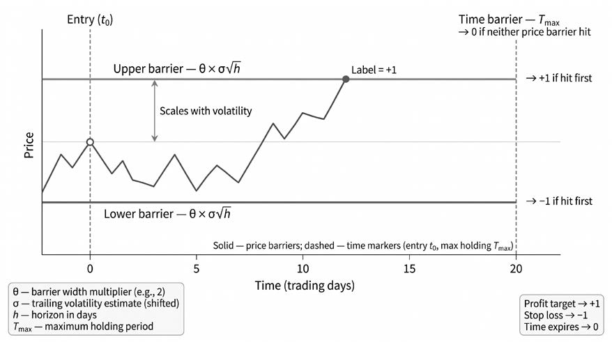

*图 7.2：三栏障碍标签*

标准构造是**三栏障碍标签**（triple-barrier label；López de Prado, 2018）。从 𝑡 时刻的可交易价格出发，定义上障碍 𝜋ₜ > 0、下障碍 ℓₜ > 0，以及位于 𝑡 + 𝐻_{max} 的垂直障碍。从 𝑡 入场到其后任一 bar 𝑢 的累计收益记为 𝑟_{𝑡,𝑢,𝑎}。事件标签按以下规则赋值：

- 若 𝑟_{𝑡,𝑢,𝑎} 首次触及 +𝜋ₜ，取 +1
- 若 𝑟_{𝑡,𝑢,𝑎} 首次触及 −ℓₜ，取 −1
- 若在 𝑡 + 𝐻_{max} 之前两个障碍均未触及，取 0

固定期限标签的结果总在 𝑡+𝐻 可知；事件标签不同，它在一个可变的**结果确定时点**（resolution time）确定：即价格障碍首次被触及的时刻，否则为 𝑡 + 𝐻_{max}。需要明确引用时记作 𝑡_{res}——它是本章稍后重叠分析中的关键量。

使用 bar 数据时，若两个障碍在同一根 bar 内都被穿越，必须指定并记录一条裁决规则：例如将该事件计为亏损（保守做法），或剔除存在歧义的 bar。

障碍宽度可以沿用阈值设计的波动率缩放逻辑；当策略带有方向性判断时，可以采用不对称乘数。

#### 最大有利与不利偏移诊断

障碍宽度并非随意设定。它们决定类别均衡、结果确定时间以及标签重叠量。一个实用的校准方法是考察候选持有期内的**最大有利偏移**与**最大不利偏移**（**MFE/MAE**）：

- MFE 度量事件确定之前达到过的最佳收益
- MAE 度量同一窗口内的最深回撤

两者结合，可以显示在障碍被触发或期限到期之前，价格顺仓、逆仓方向的典型波动幅度。这些诊断帮助把止盈与止损障碍设在经济上合理而非随意的水平：

- 窄障碍往往很快确定结果，但可能被噪声主导
- 宽障碍延长结果确定时间、减少可用观测数量，并造成更多标签间重叠

实践中的目标，是选出能带来可行的类别均衡、合理的上下障碍触碰率与合理结果确定时间分布的宽度。

**实现**：`04_maximum_favorable_adverse_excursion` 演示 MFE/MAE 可视化、障碍校准，以及用触碰比例与结果确定时间分布进行验证。

### 重叠、样本依赖与有效样本量

重叠是结构性的：相邻的 𝐻-bar 标签共享大部分相同的价格增量；事件式标签则因结果确定时间不定而不规则地重叠。任何价格冲击都会波及该时点所有存活的标签，造成机械的依赖。

在时点 𝑡 生成的标签，从 𝑡 起一直"存活"到其结果确定时点 𝑡_{res}——即区间 𝐿_{𝑡,𝑎} = [𝑡, 𝑡_{res}]。bar 𝑢 处的**并发数**（concurrency）记作 𝑐(𝑢)，统计在 𝑢 处存活的标签个数。标签的**平均唯一性**（average uniqueness）概括其重叠程度：

𝑤_{𝑡,𝑎} = (1 / |𝐿_{𝑡,𝑎}|) ∑_{𝑢 ∈ 𝐿_{𝑡,𝑎}} 𝑐(𝑢)

其中 |𝐿_{𝑡,𝑎}| 是标签存活期内的 bar 数。唯一性为 1.0 表示无重叠；接近 1/𝐻 的值表示接近最大重叠。**有效样本量**近似为 𝑁_{eff} = ∑_{𝑡,𝑎} 𝑤_{𝑡,𝑎}。对每根 bar 都采样的固定期限标签，𝑁_{eff} ≈ 𝑁/𝐻（尚未计入会进一步降低有效样本量的横截面与时间序列相关性）。

举个具体的例子：`03_label_methods` 测量了 SPY 在 𝐻 = 21、约 10 年上的唯一性：248,436 个名义观测塌缩为约 11,830 的有效样本量，因此按名义样本数构造的置信区间会窄约 4.6 倍。标准误应当基于 𝑁_{eff}，而不是 𝑁。

重叠带来三个不同的问题：

1. 共享价格增量的训练与测试标签会跨切分泄露信息。
2. 梯度更新与评估指标会过度加权高并发时期。
3. 标签中的序列依赖会夸大表观统计显著性。

**时间序列协议**（*第6章*）通过清除间隙（purge gap）解决问题 1；样本权重解决问题 2；报告 𝑁_{eff}（或块 bootstrap 标准误）解决问题 3。

#### 应对重叠

四种互补策略可用于应对重叠：

- **协议正确的切分**没有商量余地：训练与验证/测试窗口之间至少留出 𝐻_{max} 根 bar（*第6章*）。
- **样本权重**为每个观测赋予唯一性权重 𝑤_{𝑡,𝑎}，使高并发时期不会主导损失或指标。
- **子采样**每隔 𝐻 根 bar 采样，或等上一个标签了结后再开始新标签，以减少重叠。
- 数据效率更高的替代是**顺序 bootstrap**（sequential bootstrap；López de Prado, 2018）。它不以相同概率抽取每个索引，而是在每次抽取后更新选择概率，让期望唯一性更高——即与已选标签重叠更少——的观测更有机会进入样本。直观地说，与当前样本重叠严重的标签贡献的新信息更少、被抽中的概率更低；来自不那么拥挤时期的标签则更容易被选中。结果是一个有效冗余更低的重采样数据集，即使原始标签之间可能重叠严重。

权重法保留全部数据；子采样更简单但丢弃信息。多数场景会从这四种中至少组合两种。

### 建模前的标签诊断

训练之前，先验证标签定义正确且稳定。按时间和资产组检查分布与尾部行为；异常值常常意味着复权出了问题。跟踪基础比率随时间的走势（类别比例应跨市场状态稳定），检查事件标签的结果确定时间分布，并计算隐含交易强度。如果隐含交易强度不可行，先修改标签，再谈建模。

每个标签定义都应以一份简短的审计记录收尾：锚定惯例、期限定义、结果判定规则（含 bar 数据的平局裁决）、重叠摘要与基础比率摘要。这些字段让各次试验在*第6章*的运行日志体系下保持可比（可复用的诊断见 `03_label_methods` 与 `04_maximum_favorable_adverse_excursion`）。

### 用于置信度加权仓位的元标签

组织标签问题的另一种方式，是把**方向与置信度分解为两个阶段**（López de Prado, 2018）。主模型（通常是一条简单规则或既有策略）生成入场信号；次级标签只记录每个信号在计成本后是否盈利。随后由一个独立的**元模型**（meta-model）学习主信号*何时*可信，其校准概率再映射为仓位规模，例如通过一个 sigmoid 函数，把信念强度缩放为最大注码的一个比例。`03_label_methods` 包含一个自成一体的示例：SPY 上的 20 日动量信号按其远期收益结果做元标记（meta-labeling），再由 sigmoid 下注规模映射把置信度得分转换为仓位。本书的案例研究不采用这种两阶段结构：每个案例在单一标签期限上训练单一模型，并通过分配器确定仓位（*第17章*）。这一技术最有用的场景，是方向模型已经就位、目标是过滤弱信号而非重新设计入场规则。

这里的标签诊断关注*定义的质量*；下一节展示如何评估标签与候选特征之间的关系。

## 7.3 单变量特征–标签评估

评估的第一层是单变量特征–标签筛查：每次只将一个候选对照标签评估。预处理输入与执行一致的标签见 7.1–7.2 节；候选特征见*第8–10章*。各项筛查大致按以下顺序进行：

1. **正确性**：在决策时点，你能信任这个定义吗？
2. **关联性**：特征是否携带关于标签的信息？
3. **形状**：这种关系是否与一个从信号到仓位的合理映射相容？
4. **可行性**：任何可实现的方案，能否在交易设置的成本与容量约束下存活？

特征必须逐关通过才能进入下一关。所有诊断都在每折内计算、再跨折汇总：中位数、四分位距和最差折视角，而不是单一的合并统计量。

单变量分诊（triage）必要但不充分。孤立地看有前途的特征，可能与另一个候选重复；边际关联微弱的特征，一旦与合适的伙伴变量条件化，可能变得有价值。多变量模型选择（*第11–12章*）才有决定权。7.4 节处理大量候选通过筛查时产生的多重检验问题。

### 正确性筛查——不容妥协的第一关

在评估预测力之前，先验证特征与标签在既定协议下确实可用。对每个特征–标签组合运行以下检查：

1. **覆盖率**：合格的（资产，决策时点）对中，特征值非空的比例是多少？覆盖稀疏会改变有效样本量，也可能提示输入陈旧或滞后。
2. **时点与滞后一致性**：验证特征只使用决策时点可得的信息。检查基本面数据的报告滞后、第三方信号的发布时间，以及衍生量的更新计划。
3. **掩码对齐**：确认资格掩码在特征计算、标签计算与评估三处的应用完全一致。掩码错位是常见的泄露来源。
4. **陈旧性**：对更新不频繁的特征（例如季度基本面），检查特征值是否按恰当的间隔变化。从不更新的特征，可能由资产特定截距主导，而非时变信号。

这些检查不确立经济价值；它们防止的是最昂贵的研究失败：提拔一个你无法信任的定义。`05_signal_evaluation` 提供了一组可复用的正确性与覆盖率诊断，应用于案例研究的 ETF 标的池。

### 评估连续标签

对连续标签（远期收益、超额收益、已实现风险目标），分诊阶段的主力诊断是**信息系数**（**IC**）：决策时点观测到的特征与之后才确定的标签之间的横截面关联。

#### 信息系数（IC）

默认使用**秩 IC**（Spearman），它等于横截面排名的 Pearson 相关：

𝐼𝐶ₜ ∶= corrₐ(rank(𝑥_{𝑡,𝑎}), rank(𝑦_{𝑡,𝑎}))

其中 𝑥_{𝑡,𝑎} 是资产 𝑎 在时间 𝑡 的特征值，𝑦_{𝑡,𝑎} 是锚定于 𝑡 的标签，corrₐ(·) 表示时间 𝑡 上跨资产的相关。对每个决策时点计算 𝐼𝐶ₜ，即得到 IC 时间序列 {𝐼𝐶ₜ}。

IC 是评估协议下"定义组合"（特征、标签、掩码）的可学习性诊断。它本身并不构成对可交易业绩的论断。

**秩 IC 与 Pearson IC**

秩 IC 是保守的默认选择：它与基于排序的投资组合构建一致，对厚尾与非线性单调关系更不敏感。Pearson IC 适用于关心原始取值上线性关联的场合——例如信号将进入一个对量纲敏感的线性预测。保持表示一致：若特征以排名形式存储，就用秩 IC 评估。

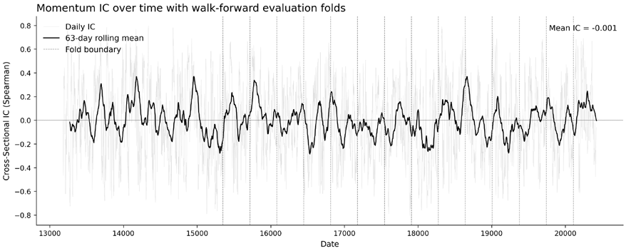

*图 7.3：带折边界的 IC 时间序列*

*图 7.3* 展示整个样本期内的 𝐼𝐶ₜ。垂直虚线标记折边界，居中滚动平均突出趋势。需要警惕两种模式：(i) IC 集中于单一时段——特征可能只是在利用一次性冲击或协议假象；(ii) IC 跨折翻转符号——特征的有用性依赖于尚未建模的状态变量。

**折级汇总——ICIR 与符号一致性**。𝐼𝐶ₜ 观测并非独立同分布：重叠期限带来序列依赖，横截面标的池共享共同冲击——因此应把折作为汇总单元。在每个折 𝑘 内，计算折内均值 𝐼𝐶‾(𝑘) 与离散度估计 𝜎(𝑘)。跨折汇总采用 𝐼𝐶‾(𝑘) 的中位数与四分位距（IQR），外加最差折视角（另见*图 7.3*）。

如果想要一个紧凑的稳定性比值，可计算折级 IC 信息比率：𝐼𝐶𝐼𝑅(𝑘) ∶= 𝐼𝐶‾(𝑘) / 𝜎(𝑘)，并按折报告，而非作为单一合并统计量。**符号一致性**——𝐼𝐶‾(𝑘) 与总体中位数同号的折数占比——是关键的稳定性闸门。一个动量特征可能五个折的平均 IC 为 0.04，但其中两个趋势折达到 0.08、三个均值回归折为 −0.02——合计数字掩盖了会让静态配置损失惨重的状态切换。在 ETF 标的池中，21 日动量的合并 IC 为 0.001（接近零），但折级平均 IC 为 0.064，ICIR 为 0.79，75% 的折为正——合并统计量掩盖了一个在多数状态下真实存在、却被少数不利时段抵消的信号（见 `05_signal_evaluation`）。

#### 跨期限与调仓频率的 IC

在一组远期收益期限网格上计算 IC，可以揭示信号的有效寿命。5 天见顶、10 天减半的信号不该持有一个月；5 到 21 天保持平坦的信号则提供调仓灵活性。在折级统计量之外，同时报告 IC 衰减曲线（ETF 动量信号见 `05_signal_evaluation`）。

**分诊中的推断**。如果要用推断，应施加于折汇总，而非每日 𝐼𝐶ₜ：(1) 折内**块 bootstrap**，块长应反映期限重叠；(2) **时间内置换**，在每个横截面内打乱资产–标签配对，在保留横截面依赖的同时打断特征–标签配对。此阶段把 p 值视为描述性数字；7.4 节讨论多重性校正。

`05_signal_evaluation` 演示 walk-forward 折的构建，并报告每折 IC、价差与单调性。HAC 校正推断与应用于 IC 时间序列的块 bootstrap 置信区间见 `06_ic_inference`。对 21 日 ETF 动量 IC，HAC 将朴素标准误放大约 2.54 倍，有效样本量从 4,989 降至 773——85% 的效率损失，这也是最短业绩记录规划的依据。**专栏 7.3：IC 与组合业绩**

在简化假设下，Grinold 的主动管理基本定律（1989）给出了预测技巧与组合业绩之间的近似关系：IR ≈ IC × √𝐵

其中 IC 度量预测技巧，𝐵 是独立下注的有效数量（"广度"）。这个近似不是业绩预测——下注很少彼此独立，一个由 100 只共享行业暴露的 ETF 组成的标的池，有效广度可能只有 20–30。分诊的启示：当广度确实很大时，小而持续的 IC 也有分量；峰值 IC 的信息量不及跨折稳定的 IC。

#### Kendall 𝜏 与互信息

**Kendall 𝜏** 与**互信息**（**MI**）度量的是不同类型的依赖。Kendall 𝜏 是一种**基于秩的关联度量**：它检验信号与实现结果是否把资产对一致地排序。更正式地说，它比较*一致*对与*不一致*对的数量，因此可理解为**单调关联**的一种度量。与 Spearman 秩相关一样，它对量纲不敏感，而且在极小的横截面（𝑛 < 30）中往往更稳定，因为它直接由成对排序构建，而非秩矩。实践中，同一关系下 𝜏 的数值通常比 Spearman 小，因此两者不应被当作可互换的数字来比较。

**互信息**（**MI**）则不同：它是依赖的**信息论度量**，不是秩相关。MI 问的是：知道信号能在多大程度上降低关于结果的不确定性。因此，它能检测到 Kendall 𝜏、Spearman 或 Pearson 可能遗漏的**非线性**与**非单调**关系。但 MI 在有限样本中更难可靠估计，通常需要离散化或其他密度估计选择，也不如秩 IC 那样直观可解释。它还是非负的，因此与 Kendall 𝜏 不同，不指示方向。

对带有单调先验的大横截面做常规分诊，秩 IC 仍是默认。横截面很小时，若想要基于成对排序的稳健单调依赖检查，使用 **Kendall 𝜏**。只有当分位数图或其他诊断提示存在基于秩的度量会遗漏的明显非线性或非单调模式时，才使用 MI。`05_signal_evaluation` 在多个期限上计算横截面 IC，并将所得时间序列可视化。

### 离散标签——把特征当作分类器评估

对取值于 {0,1} 的二值标签，评估特征能否充当区分正负类的得分。与连续标签一样，所有指标都应逐折计算并遵守掩码。

#### 依赖阈值的评估

给定得分阈值或 top-𝑘 行动集，报告精确率、召回率与特异度。用交易的语言说，**假阳性**是代价高昂的入场（往返成本加上不利变动）；**假阴性**则是错失的收益。

#### 无阈值指标

从 **ROC**（受试者工作特征）曲线下面积（AUC）与 **PR**（精确率–召回率）AUC 开始。ROC AUC 度量特征在各决策阈值下把正类排在负类之上的能力；PR AUC 在正类稀有时往往更有信息量，因为精确率直接反映预测为正的样本中有多少是真阳性。

在严重的**类别不均衡**下，特征可以有很高的 ROC AUC，却在实际相关的阈值上产生大量相对真阳性而言的假阳性，PR 曲线会把这一点暴露得更清楚。两项指标都逐折计算，报告中位数与四分位距（IQR）。

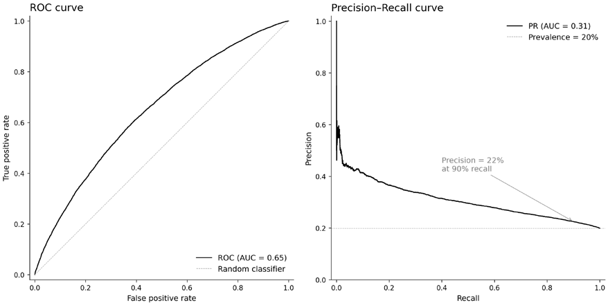

*图 7.4：并排对比的 ROC 与 PR 曲线。左：判别力中等（AUC ≈ 0.65）的特征的 ROC 曲线，含对角参考线。右：同一特征的 PR 曲线，基线为正例占比。*

如*图 7.4* 所示，PR 曲线揭示在高召回工作点上精确率急剧下降——基础比率很低时，这一模式会被 ROC 曲线掩盖。

对多类事件标签（止盈、止损、超时），按类别与折报告基础比率，它们会跨市场状态漂移。如果要把多类标签合并为二值动作，须显式记录合并规则，并验证它与你的目标动作集一致。

**实现**：`05_signal_evaluation` 计算 ROC AUC 与 PR AUC，给出折级分解以及精确率与召回率的 Wilson 置信区间。

### 非参数诊断——分位数与十分位分析

相关系数紧凑，却可能掩盖非单调结构。在每个决策时点 𝑡，在资格掩码内按 𝑥_{𝑡,𝑎} 给资产排序，分成 𝑄 个桶，计算每桶的平均标签 𝜇_{𝑡,𝑞}。跟踪价差 𝑆ₜ ∶= 𝜇_{𝑡,𝑄} − 𝜇_{𝑡,1}，并在折内汇总。

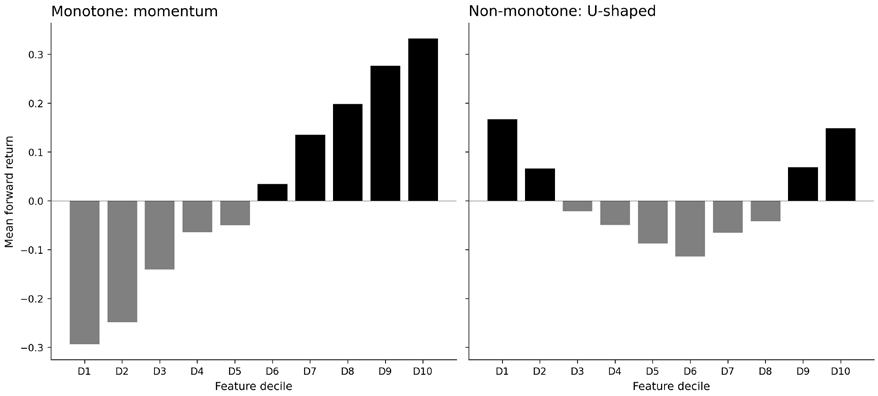

*图 7.5：分位数柱状图：单调与非单调。左：按特征十分位的平均远期收益单调递增，与基于排序的映射一致。右：U 形模式，两个极端十分位都显示出较高收益。*

*图 7.5* 表明，单调映射会错过最低十分位中的信号；这暗示要么需要非线性映射，要么存在混杂因素。

单调递增模式与基于排序的方法（top-𝑘 选择、多空价差）相容。非单调模式可能需要非线性映射，或暗示与市场状态存在交互。此阶段要验证的是形状，而不是设计映射。

### 初步可行性检查

可行性筛查问的是：任何说得通的映射，能否在实现中存活？这些检查以最简单的映射——按得分给资产排序并选取前 𝑘 名——作为压力测试。三项检查覆盖大多数早期失败：

1. **换手率代理指标**：在每个折内的各决策时点上，度量 top-𝑘 集合的进出频率。每次调仓 top-𝑘 集合就完全换血的特征是一个警示；仓位得以延续的特征则具有结构性成本优势。
2. **盈亏平衡成本合理性检查**：将典型折价差与保守的成本估计作比较。如果折内中位价差为 20 个基点（0.2%），往返成本为 15 个基点，净价差就只有 5 个基点——勉强高于噪声。毛价差覆盖不了 2 倍估计成本的信号需要警惕；跨不过成本门槛的信号就是停止。
3. **容量警告**：按流动性分桶重新计算 IC 或价差。局限于最不流动桶的信号，对当前设置就是停止；从流动到不流动平滑衰减，则提示信号具有普遍性。

把分诊决策标准化，后续阶段才能信任其结果：

| 决策 | 条件 | 行动 |
| --- | --- | --- |
| 继续 | 正确性筛查通过；主诊断跨折方向一致；分位数/混淆矩阵支持合理的映射 | 移交建模章节 |
| 修订 | 想法合理，但定义有缺陷（锚点错配、期限错配、基础比率不稳定） | 修改定义、重跑分诊、记录差异 |
| 停止 | 跨折符号不稳定；价差太小无法覆盖成本；信号局限于不可交易的流动性 | 归档并记录失效模式 |

*表 7.2：分诊决策标准*

按顺序解读分诊输出：先正确性，再关联性，然后是形状与可行性，最后是搜索记账。将决策、诊断摘要与搜索集元数据，连同定义组合一起记入运行日志（见*专栏 7.1*）。

特征评估不是模型选择、超参数搜索，也不是回测。它的输出是一个可审计的决策（继续、修订或停止），由折级摘要和可从运行记录重新生成的图表支撑。下一节讨论大规模搜索预测特征所带来的风险。

**实现**：`05_signal_evaluation` 覆盖 ETF 动量信号的正确性筛查、折级 IC 与 ICIR、IC 衰减、换手率与盈亏平衡成本。`06_ic_inference` 覆盖 HAC 推断、平稳块 bootstrap 与最短业绩记录规划。

## 7.4 搜索记账与多重检验

趋势扫描（7.2 节）在从多个候选中选出最佳期限时，对单个观测的 t 统计量施加了 Bonferroni 校正。同样的逻辑——按实际进行的比较次数校正——也适用于搜索层面。当分诊筛查大量候选特征、标签或变体时，观测到的最佳 IC、价差或 AUC 都带有正向偏误：总有一些候选只是碰巧好看。

### 定义搜索集

起点是记录你实际评估过什么。把**搜索集**定义为在同一套决策规则下测试过的全部候选。典型内容包括：

- 标签定义变体（锚点、期限、阈值或障碍规则）
- 特征族变体（回看窗口、变换、参考系）
- 你尝试过的任何条件化模板

记录搜索集大小与生成规则（网格、去重、排除项）。没有这些，"显著性"论断便无从解释。

例如，评估 5 个标签期限 × 3 条阈值规则 × 10 个特征变体，共得到 150 个组合。即使每个组合在零假设下通过朴素显著性检验的概率只有 5%，我们也预期出现大约 7–8 个假阳性。搜索集大小是 150，任何被报告的 p 值都必须附带这个数字。`07_multiple_testing` 中的模拟展示了当所有因子都是噪声时，选择偏差如何抬高最佳 IC。

### 区分探索与确认

评估分两个阶段：

1. **探索轮**：评估大量候选，但晋级主要看折稳定性而非峰值表现（符号一致性、不依赖单一时段、对时点与覆盖检查的稳健性）。
2. **确认轮**：冻结晋级候选，用最小化的比较集重跑分诊，产出你日后要引用的摘要。

探索轮是我们学习的阶段；确认轮是我们作出承诺的阶段。把两者混在一起，是多重检验最常见的失败原因：按峰值表现晋级，然后在同一份数据上"确认"。

### 校正方法

如果要报告 p 值或置信区间，应在折汇总上计算，并在实际评估过的搜索集上校正。两类校正占主导：

**族错误率**（**FWER**）控制所有检验中*至少出现一个*假阳性的概率。从大量候选中晋级少数几个时使用 FWER：单个假阳性的代价（围绕虚假特征建立的策略）很高。标准方法是 **Holm–Bonferroni**：将 𝑚 个 p 值升序排序，𝑝_{(1)} ≤ 𝑝_{(2)} ≤ ⋯ ≤ 𝑝_{(𝑚)}，仅当对所有 𝑗 ≤ 𝑖 都有 𝑝_{(𝑖)} ≤ 𝛼/(𝑚 − 𝑖 + 1) 时才拒绝 𝑝_{(𝑖)}。它一致地优于原始 Bonferroni（𝑝_{(𝑖)} ≤ 𝛼/𝑚），同时控制同样的错误率。

**错误发现率**（**FDR**）控制所有拒绝中假阳性的期望比例。FDR 适合预期真阳性很多、且能容忍少量错误发现的大规模筛查：例如筛查 200 个特征变体并期望推进 20–30 个。

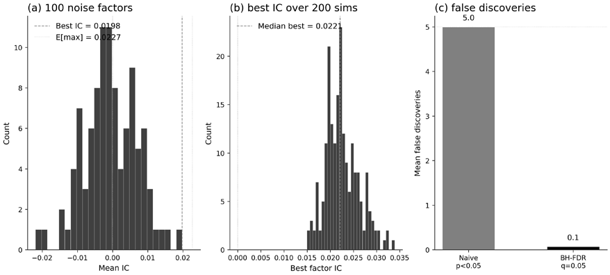

*图 7.6：零假设下的选择偏差*

*图 7.6* 展示三幅图。(a) 在 100 个噪声因子（50 种资产、252 天）中，最佳者的 IC 达到 0.020，接近理论上限 0.023。(b) 在 200 次模拟中，最佳因子 IC 的中位数为 0.022——一个能通过大多数筛查的虚假信号。(c) 朴素检验（𝑝 < 0.05）每次模拟产生 5 个错误发现；BH-FDR 控制将其降至接近零。

标准方法是 **Benjamini–Hochberg**：将 p 值排序，若 𝑝_{(𝑖)} ≤ (𝑖/𝑚)·𝑞 则拒绝 𝑝_{(𝑖)}，其中 𝑞 为目标 FDR（例如 0.05）。笔记本 `07_multiple_testing` 将 BH 与 Holm–Bonferroni 同时应用于一个模拟的因子动物园，比较发现率、假阳性数量与统计功效。应用于 13 个 ETF 特征，在 𝛼 = 0.05 下无一通过 BH-FDR 或 Holm–Bonferroni：RVol 10d 以 HAC 𝑡 = 2.36 领跑，但校正后被拒绝。

选择取决于**下游成本结构**：

- 如果每晋级一个特征都要承担高昂的建模与回测成本，优先 FWER
- 如果你在构建一个特征池，少量假阳性无妨、自会被模型选择淘汰，FDR 更实用

Harvey, Liu, and Zhu（2016）梳理了 300 多个已发表因子，建议将新因子发现的显著性阈值提高到 𝑡 > 3.0（从 2.0）——一个能把文献中累积搜索计入其中的实用捷径。

当候选彼此相关（同一因子的回看变体或参数扫描）时，基于独立性的校正会夸大惩罚。**Rademacher 复杂度**通过度量假设类的有效丰富度提供更紧的界（见*第16章*）。

### 报告效应量，而不只是显著性

校正方法控制错误率，却对经济量级只字未提。对每个带入后续阶段的候选，报告：

- 搜索集大小与生成规则
- 主诊断的折级摘要（中位数与最差折）
- 稳定性指标，如符号一致性与时间集中度
- 数字来自探索轮还是确认轮

**专栏 7.4：自适应选择也是额外的试验**

如果某个阈值、回看网格、缺失规则或交互项是在看过结果之后才选择或修改的，就把它当作新的试验族，纳入搜索集记账。这些都是正当的研究动作，但会加重多重比较的负担。这是最常见的记账失误：偷看结果后优化了参数，却不把它算作一次试验。

#### 策略层面的选择偏差诊断

当结果是夏普比率而非 IC 时，有三个类似的诊断：

- **紧缩夏普比率**（Deflated Sharpe Ratio；Bailey and López de Prado, 2014）估计最佳夏普超出运气的概率
- **回测过拟合概率**（Probability of Backtest Overfitting；Bailey et al., 2015）度量样本内排名最佳的配置在样本外垫底的频率
- **最短业绩记录长度**（Minimum Track Record Length）量化晋升一个策略所需的数据量

**实现**：`07_multiple_testing` 实现了完整流水线：HAC 校正的 p 值、BH-FDR 与 Holm–Bonferroni。它还预览了 Rademacher 调整与紧缩夏普比率（详见*第16章*）。

下一节将对因果性作初步介绍。

## 7.5 从相关到因果

7.3 节的关联诊断确立了特征携带关于标签的信息，但没有解释为什么。一个特征显得有预测力，可能是因为它代理了一个由波动率、流动性或风险偏好刻画、同时也在驱动收益的市场状态，而不是因为它捕捉到了稳定、可利用的关系。

本节将因果思维介绍为一种**证伪过滤器**：陈述一个机制，把它编码为图，然后检验数据是否与机制隐含的假设一致。重点不在于证明因果，而在于在投入更复杂的建模之前，排除那些连自身基本推论都无法满足的故事。

在实践中，这意味着追问：观测到的关联能否经受住机制所提示的简单检验？一旦考虑合理的混杂因素、时点效应或选择效应，它是否会消失？这些是由**机制推理**引导的稳健性诊断；它们一次只检验一个特征，无法检测多变量混杂。*第15章*提供了更完整的工具箱。

### 为什么特征研究需要因果思维

大多数交易数据是观测性的。没有人对资产价格做随机实验。一个与未来收益相关的特征，其相关背后的原因未必会持续。因果思维揭示三个常见陷阱：

- **混杂**：特征与标签共享一个共同驱动因素；当驱动因素切换时，相关消失。例如，动量与远期收益可能都对波动率状态作出反应：观测到的相关反映的是共同暴露，而非直接联系。
- **条件化陷阱**：加入错误的"控制变量"可能制造虚假关系（碰撞偏差），也可能消掉你关心的效应（对中介变量条件化）。一个变量是否应当作为控制，取决于因果结构，而不是它的统计显著性。
- **构造伪影**：流水线无意中编码了关于选择或时点的信息，而非关于市场的信息：例如滚动窗口与标签期限重叠，经由共享数据点制造虚假相关。

### 什么是有向无环图？

**有向无环图**（**DAG**）是编码因果假设的示意图。每个节点代表一个变量（特征、标签或第三个量），每条箭头代表一个假设的影响方向——一个变量影响另一个变量。"无环"是指沿箭头走不会回到起点：不存在反馈回路。*图 7.7* 展示其基本构造。

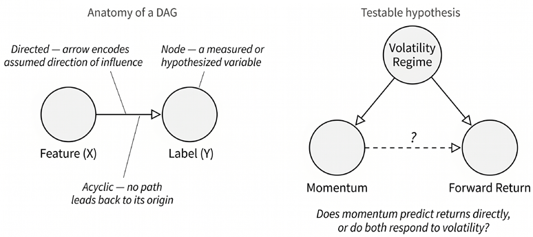

*图 7.7：有向无环图*

为什么要画 DAG？因为它迫使你显式陈述假设。"动量预测收益"是含糊的说法；一个从动量指向收益的箭头——并注明波动率状态同时影响两者的 DAG——才是一个可检验的结构。箭头让你承诺具体的推论：哪些变量应当相关，哪些在以第三个变量条件化后应当变得独立，哪些条件化选择是安全的。如果数据与这些推论矛盾，所假设的机制就是错的，你也就避免了为一个虚假关系建模。

在金融应用中，DAG 通常很小（三到五个节点），编码关于单一特征的一个假设。目标不是为整个经济建模，而是用最小结构识别出一个特定的特征–标签关联可能在哪里出问题。三种反复出现的模式——混杂因素、中介变量与碰撞变量——决定了你应当与不应当对什么条件化。

### 三种结构角色

与特征–标签对相邻的每个变量，都扮演三种结构角色之一。判断正确与否，决定了条件化会澄清还是扭曲你正要评估的关系。*图 7.8* 用最小 DAG 展示每种模式：

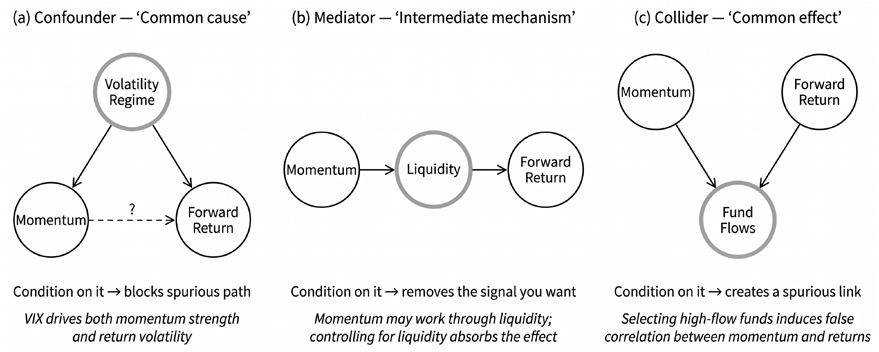

*图 7.8：基本因果关系*

图中所示的三种成分是：

- **混杂因素：共同原因。** 混杂因素同时影响特征与标签。在 DAG 中，它位于两者上方，箭头分别指向两者。例如，波动率状态（用 VIX 度量）同时影响动量信号的强度与收益离散度。若不加以控制，特征–标签相关会被共同暴露抬高。*对混杂因素条件化可以阻断虚假路径*，分离出可能存在的直接关系。在下文的实例中，状态异质性检查正是按 VIX 分区来评估这一点。
- **中介变量：中间机制。** 中介变量位于特征与标签的因果链上：特征影响中介变量，中介变量再影响标签。例如，动量可能部分通过流动性起作用：过去的赢家吸引资金流，改善流动性并支撑价格进一步上行。若对流动性条件化，你就移除了这条间接通道，可能恰好消掉了正在度量的信号。*不要对中介变量条件化*，除非你的目标就是检验该特征在中介路径之外是否还有效应。
- **碰撞变量：共同结果。** 碰撞变量由特征与标签共同导致。在 DAG 中，来自特征与标签的箭头汇聚于它。例如，动量与远期收益都驱动基金资金流：动量强、收益高的基金吸引最多资本。无条件分析时不存在扭曲；但一旦*对碰撞变量条件化*（例如把分析限制在高资金流基金），就会诱导出全样本中并不存在的动量与收益之间的虚假负相关。笔记本 `08_causal_sanity_checks` 包含一个演示该效应的合成模拟：对资金流（碰撞变量）条件化，会在两个相互独立的变量之间制造约 −0.25 的相关。

在控制任何变量之前，先判断它扮演的角色。判断不了，就把该特征标记出来，交给*第15章*的多变量工具箱。

### 从 DAG 词汇到证伪检验

画 DAG 只是第一步；检验其推论才是回报所在。DAG 中的每条箭头都暗示数据中具体可检验的模式：例如，对混杂因素条件化应当削弱某个相关；把特征在时间上平移应当使其预测力衰减。下面的四项检验借助 7.3 节已有的工具，低成本地探查这些推论。

诊断给出三种结果之一，与 7.3 节引入的分诊闸门一一对应：

- **PROCEED**（继续：机制通过全部检验）
- **REVISE**（修订：部分通过——特征有信号，但附带影响下游建模的注意事项）
- **STOP**（停止：机制不成立——把精力转向其他特征）

在有效市场中，横截面 IC 很小，很少有单一特征能干净地通过所有检验。REVISE 是预期之中、也是信息量最大的结果：它告诉你一个特征*在何处、何时*有效，而这正是下游模型设计需要知道的。

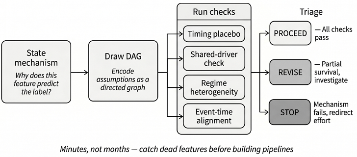

*图 7.9：从假设到分诊决策的机制合理性工作流*

### 机制合理性检验

每项检验都有明确的协议：计算什么、机制为真时应当期待什么、什么构成红旗。笔记本 `08_causal_sanity_checks` 首先运行一次特征 × 期限扫描——在 7.4 节零结果的基础上扩展——然后把前三项检验应用于两个入选特征。

先试**时间安慰剂检验**。把特征向后平移 𝛥 根 bar（例如 5、21、63、126、252 天），在每个滞后重新计算 IC。如果特征包含及时的信息，IC 应在滞后 0 附近最强，并随特征变得陈旧而衰减。对回看窗口为 𝐿 的滚动窗口特征，平移 𝛥 后的版本与原版共享约 (𝐿 − 𝛥)/𝐿 的输入，这为 IC 的持续性设置了机械下限；重点应放在超出回看窗口的滞后上的衰减。红旗：IC 在远处滞后保持平坦甚至*上升*，提示该特征代理的是一个慢变状态变量，而非及时信息。

**共享驱动因素检验**把标签换成一个与特征机制没有合理联系的结果：例如，对微观结构驱动的股票特征使用国债收益，或打乱横截面分配。IC 应与零无法区分。这检验特征的信息是特定于所假设的通道，还是经由共同驱动因素泄露到无关结果。第二重控制使用置换：在每个日期打乱远期收益的横截面数据，得到零分布；观测到的 IC 应远离该分布。

**状态异质性**很重要。按候选状态变量（例如 VIX 三分位）把样本分区，在每个分区内部重新计算 IC。IC 在某些状态可能减弱，但应保持符号与大致量级。如果 IC 跨分区翻转符号——出现显著的反号分区（HAC |𝑡| > 2）且无条件 IC 接近零——那么无条件关联就是纯粹的聚合伪影。这一检验无法区分混杂与真正的效应修饰：IC 随状态变化的特征，可能被混杂，也可能是其机制在不同状态下运作方式不同。对由离散事件（财报、FOMC、再平衡）驱动的特征，在事件时间窗口内计算 IC。IC 应集中在机制预测有效应的地方。事件前后对称的 IC，或峰值出现在事件之前的 IC，通常意味着预期、泄露或混杂。下面的示例省略了这一检验，因为两个特征都不是事件驱动的。

#### 实例演示——12-1 动量对比短期反转

7.4 节的多重检验扫描发现，在 ETF 上 5 天期限没有任何短回看特征通过 BH-FDR。笔记本扩展了搜索：对 10 个特征、3 个期限（5 天、21 天、63 天）的扫描显示，长回看动量特征（126 天以上）在月度期限上携带显著的横截面信息，印证了关于跨资产动量的学术发现（Asness et al., 2013）。从中选出两个特征进行机制检验，标签为 21 天远期收益。

**特征 A：12-1 动量（REVISE）**

| 检验 | 结果 | 解读 |
| --- | --- | --- |
| 时间安慰剂检验 | IC 在滞后 0 达到峰值（0.053）；持续到滞后 252 天（0.034），HAC 𝑡₀ = 3.5 | IC 在滞后 0 最强——对 231 天回看而言部分是机械效应，但信息仍然及时 |
| 共享驱动因素检验 | 国债 HAC 𝑡 = 0.2；置换 𝑝 < 0.001 | 无共享驱动因素；IC 远高于置换零分布 |
| 状态异质性 | 低 VIX IC = +0.086（HAC 𝑡 = 3.9）；高 VIX IC = +0.017（𝑡 = 0.6） | 符号稳定；量级跨 VIX 状态变化 5 倍 |
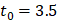
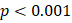
*表 7.3：动量分析*

动量获得 REVISE：只有共享驱动因素检验干净通过。它携带真实的横截面信息（IC = 0.053，HAC 𝑡 = 3.5），且不预测国债收益；但时间安慰剂与状态异质性检验都提示谨慎——IC 持续而无明显衰减，效应集中在低波动市场、在高 VIX 时段减弱，这与文献中记录详尽的"动量崩溃"现象一致（Daniel and Moskowitz, 2016）。这是一个可操作的发现，为后续章节的状态条件化建模提供了动机。

**特征 B：1 日反转（STOP）**

| 检验 | 结果 | 解读 |
| --- | --- | --- |
| 时间安慰剂检验 | 无及时信号（IC₀ = 0.002，HAC 𝑡₀ = 0.4） | 所有滞后上 IC 都接近零——没有可供衰减的信息 |
| 共享驱动因素检验 | 国债 HAC 𝑡 = 0.1；置换 𝑝 = 0.38 | IC 与打乱后的噪声无法区分 |
| 状态异质性 | 低 VIX IC = −0.019（HAC 𝑡 = −2.6）；高 VIX IC = +0.028（𝑡 = 2.5） | 符号翻转（HAC 显著）且无条件 IC 接近零——聚合伪影 |
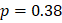
*表 7.4：反转分析*

反转获得 STOP：三项检验全部失败。无条件 IC 接近零（0.002，HAC 𝑡 = 0.4），任何滞后上都没有及时信号；状态异质性检验则揭示了一个教科书式的聚合伪影——该特征在低 VIX 与高 VIX 市场中编码相反的信息，导致无条件 IC 接近零。

### 合理性记分卡

下表汇总每项检验的判定标准：

| 检验 | 通过 | 谨慎 | 停止 |
| --- | --- | --- | --- |
| 时间安慰剂检验 | IC 显著（HAC）且有明显衰减 | IC 持续但无明显衰减 | 无及时信号；IC 在远处滞后上升 |
| 共享驱动因素检验 | 对照结果上 IC ≈ 0（HAC） | IC 较小但不为零 | IC 在对照上显著（HAC） |
| 状态异质性 | IC 跨分区稳定 | IC 有变化；符号翻转不显著（HAC） | 符号翻转显著（HAC）且无条件 IC ≈ 0 |
| 事件时间对齐 | IC 集中在事件之后 | IC 分散在各时间窗 | IC 在事件之前达到峰值 |

*表 7.5：合理性记分卡*

下图将其可视化：

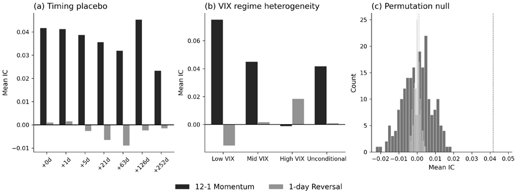

*图 7.10：机制合理性记分卡*

*图 7.10* 展示两个特征的时间安慰剂衰减曲线、状态条件化 IC 与置换零分布。动量 IC 在 252 天内从 0.053 逐渐衰减到 0.034，符合一个慢变、但在信息最新时仍最强的信号。动量 IC 集中在低波动市场（低 VIX 时 IC = 0.086，高 VIX 时为 0.017）。动量 IC 0.042（置换 𝑝 < 0.001）远在置换零分布之外；反转 IC 0.002（置换 𝑝 = 0.535）与噪声无法区分。所有 t 统计量均使用 **Newey–West**（**HAC**）标准误，以计入重叠 IC 序列中的序列依赖。未通过多项检验的特征，应在继续推进之前先作排查；通过全部检验的特征只是闯过了第一道过滤，并未被证明具有因果性：这些是双变量诊断，无法检测多变量混杂。

这些检验能够拒绝所提出的机制，却不能证实机制。自然的下一步，是从单特征诊断转向多变量工具箱：结构模型、双重/去偏机器学习与敏感性分析。那套机制只留给幸存者，位于*第15章*。

**实现**：`08_causal_sanity_checks` 在 ETF 收益上运行碰撞变量模拟、特征 × 期限扫描，以及时间安慰剂、共享驱动因素与状态异质性检验。

## 7.6 小结

把学习任务定义好，是量化工作流中杠杆最高的步骤之一。本章发展了五个相互咬合的纪律，用于把可靠的特征从研究噪声中分离出来。干净、可审计的预处理（7.1 节）确保每个输入跨试验可比、没有编码层面的意外。与执行一致的标签（7.2 节）以明确的时间、滞后与期限惯例把预测锚定在可交易价格上；哪怕只错一根 bar，都可能凭空制造或抹掉一个可能的交易优势。折感知的评估（7.3 节）暴露合并统计量所掩盖的不稳定性：一个 IC 在 walk-forward 折间翻转符号的特征，无论其合并统计量多好看，用处都要大打折扣。搜索记账（7.4 节）记录测试过的候选数量并施加多重检验校正，使观测到的最佳 IC 不至于只是最幸运的那个。最后，机制合理性检验（7.5 节）把因果假设编码为有向无环图，并低成本检验其推论——在受混杂的代理变量与聚合伪影耗掉建模精力之前就把它们抓住。

这些纪律汇入同一个决策框架。分诊闸门（继续、修订或停止）在每一阶段把诊断转换为可审计的决策。一个被推进的候选会携带：定义组合（标签规范、特征配置、预处理选择）、折级诊断（IC、ICIR、符号一致性、分位数价差）、搜索集记录（测试了多少变体、施加了哪种校正），以及机制评估（通过了哪些合理性检验、信号集中在何处）。这套文档也是让结果可复现、失败可诊断的最低限度审计线索。

共享的 `ml4t.*` 生态系统在规范的 `timestamp + symbol` 模式下把这一框架连接起来：`ml4t.data` 负责数据加载，`ml4t.engineer` 提供特征配方，`ml4t.diagnostic` 提供评估工具，`ml4t.backtest` 负责执行；API 导览见 `10_ml4t_library_ecosystem`。

框架就位之后，*第8章*将把策略假设转化为具体的特征规范，并把本章建立的评估与分诊闸门应用到每个特征族。
