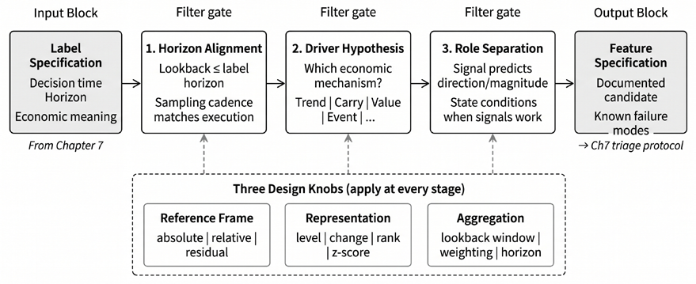
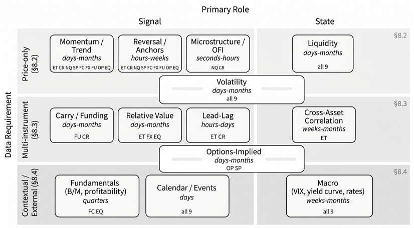
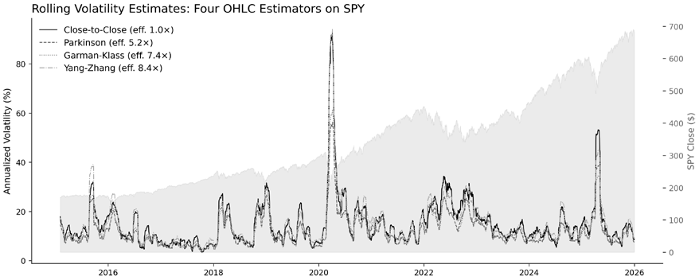
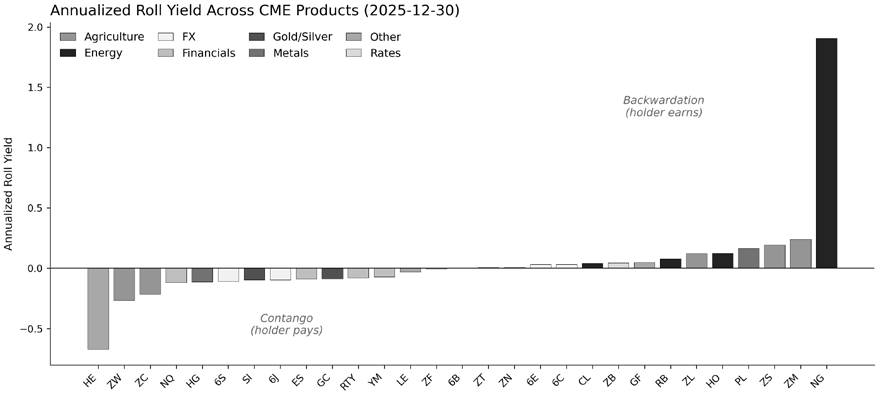

# Chapter 8: Financial Feature Engineering

Feature engineering is where our trading setup becomes learnable. A model can only exploit relationships that the dataset makes visible at decision time, at the relevant horizon, and in a representation consistent with how we trade.

Starting from the *Chapter 7* label, we propose economic drivers and express them as feature families with design choices and failure modes.

After completing this chapter, you will be able to:

- Translate a strategy hypothesis into a feature specification using the three-step filter.
- Select appropriate design choices for each feature family and distinguish meaning-changing from noise-reduction ones.
- Distinguish signal features from state features and understand when each applies.
- Construct interaction features and evaluate whether they add incremental information.
- Apply degrees-of-freedom discipline to prevent spurious discovery from search.
- Connect feature specifications to the triage protocol from *Chapter 7*.

The chapter is organized into four stages:

1. *Section 8.1* introduces the three-step filter (horizon alignment, driver hypothesis, role separation) that turns a strategy narrative into a feature specification, as well as three design choices that configure each family.
2. *Section 8.2* develops price-derived families that apply to all nine case studies, and *Section 8.3* adds families that require multi-instrument data.
3. *Section 8.4* covers slow-moving contextual features (fundamentals, calendars, macro state) where point-in-time correctness is the binding constraint.
4. *Section 8.5* surveys cross-cutting feature types and the limits of direct aggregation, and *Section 8.6* addresses how to combine signals with state variables and control the resulting degrees of freedom.

We begin in *Section 8.1* by formalizing the hypothesis  driver  measurement filter that turns an idea into a tested feature.

## 8.1 Capturing and configuring the economic drivers

A **feature** encodes a claim about why an observable variable should shift the conditional distribution of the predictive target (a return, a volatility measure, or an event). The claim should be consistent with the strategy narrative from *Chapter 6*: the strategy family indicates which information is relevant, and the edge hypothesis explains why. A feature is the *computable expression* of that reasoning: a point-intime transformation of data, aggregated over a lookback window and expressed in a chosen reference frame, intended to add incremental predictive content given the label definition from *Chapter 7*.

Move from labels to features using three filters (depicted in *Figure 8.1*):

1. **Horizon alignment:** Match lookback, sampling cadence, and aggregation to the label horizon and execution lag. Strategy families provide useful defaults: very short horizons motivate microstructure and order-flow features; medium horizons motivate trend, reversal, volatility state, and event drift; slow horizons motivate carry, term structure, and fundamentals. This is not a rigid partition; mismatches between feature and label horizons are a common source of unstable estimates. Document the implied update frequency and turnover so the design remains compatible with the trading setup.
2. **Driver hypothesis**: When predicting returns, most feature hypotheses map to a small set of economic mechanisms:
- **Persistence (trend/momentum):** Information is incorporated gradually due to attention limits or slow institutional flows.
- **Reversion (microstructural or behavioral):** Predictable flows (hedging, rebalancing, inventory management) create transient pressure and subsequent reversal.
- **Risk compensation (carry and state variables)**: Returns compensate for exposures others avoid, such as liquidity, tail, or funding risk.
- **Predictable clocks**: Calendar effects, roll schedules, funding resets, and scheduled events can generate rule-driven patterns tied to market structure. If we cannot name a plausible mechanism, the result is a data pattern rather than a feature hypothesis (*Box 8.1*).
3. **Role separation:** Classify each feature as a **signal** (intended to predict the conditional mean or direction) or a **state variable** (intended to condition when signals work, how aggressively to trade, and how costly or risky trading will be). State variables such as volatility, liquidity, and funding conditions often matter through interactions (gating or scaling signals) rather than strong marginal association.

The workflow is shown in *Figure 8.1*:

*Figure 8.1: The three-step filter*

**Box 8.1: Patterns without a mechanism**

Regularities without an economic explanation require a higher evidentiary standard because they provide no guidance on failure modes or regime dependence. Treat them as provisional:

- Apply stricter multiple-testing discipline and reserve untouched out-of-sample holdouts beyond cross-validation folds.
- Check robustness across related instruments, regimes, and small variants of the definition.
- Monitor decay after deployment and retire the feature when evidence weakens.

Across these steps, most feature designs can be configured using three choices:

- **Reference frame:** Absolute time-series measurements per asset versus relative cross-sectional ranks or peer-set comparisons, depending on whether the hypothesis concerns the time series’ own dynamics or relative positioning.
- **Representation:** Raw values versus transformed values such as ranks, volatility scaling, winsorization, or residualization; choose transforms that match the hypothesis.
- **Aggregation:** How raw inputs are summarized to trade responsiveness against variance reduction. Aggregation sets the feature’s effective bandwidth and should be guided by horizon alignment.

Treat the resulting choices as part of a **feature specification**. At minimum, we record the name, family, signal-versus-state role, driver hypothesis, and edge source; inputs and observability constraints; lookback and aggregation; reference frame; representation; and expected failure modes.

If we cannot fill in these fields, we have an input awaiting a hypothesis. *Table 8.1* provides three examples. In production systems, this specification corresponds to a feature-registry entry that supports versioning, auditability, and consistent reuse across trials.
| Field | 21-Day Momentum | Realized Volatility | Carry (Roll Yield) |
| --- | --- | --- | --- |
| Name | mom 21d _ | rvol 20d _ | carry roll _ |
| Family | Trend/momentum | Volatility | Term structure |
| Role | Signal | State | Signal |
| Driver | Persistence | Risk state | Risk compensation |
| Inputs | Close prices | Close prices | Near/far futures |
| Lookback | 21 days | 20 days | Current contracts |
| Reference frame | Time series | Time series | Cross-section |
| Representation | Volatility-scaled return | Annualized standard deviation | Annualized percent |
| Failure modes | Crowding, regime shift | Stale in low-vol regimes | Roll-date artifacts |

*Table 8.1: Feature specification template*

A feature is well posed when it operationalizes one element of the strategy narrative as a computable, testable input, with explicit timing and failure modes. The remainder of this chapter develops the main feature families, organized by the economic mechanisms they target.

Each feature specification becomes a trial entry in the *Chapter 7* workflow. Evaluate candidates at the label horizon using fold-aware diagnostics (cross-sectional IC, decile spreads). Conditional diagnostics (for example, momentum IC stratified by volatility terciles) test whether conditioning adds information or merely fragments the sample.

*Sections 8.2-8.4* construct features by aggregating observable inputs using rolling windows, cross-sectional ranks, and simple formulas. *Chapter 9* extends the approach to features extracted from fitted objects. We start by looking at price-derived features.

## 8.2 Price-derived features

This section covers families computed from an asset’s own price, volume, and trade data, the minimum dataset available for any traded instrument:

| Family | Economic claim | Primary role | Typical horizons |
| --- | --- | --- | --- |
| Trend/momentum | Recent performance persists | Signal | Hours to months |
| Reversal | Prices revert to an anchor | Signal | Seconds to days |
| Volatility/tail risk | Risk conditions sizing and gating | State | All horizons |
| Liquidity/tradability | Costs and capacity gate signals | State | All horizons |
| Microstructure/order flow | Informed flow moves prices | Signal/state | Seconds to hours |

*Table 8.2: Overview of common features*

Other families (carry/funding, cross-asset relative value, options-implied state, fundamentals, calendar effects, and macro shocks) appear later in this chapter sequence.

*Figure 8.2: Feature families*

For each family, use the same four questions:

1. What is the economic claim, and is the feature used primarily as a **signal** or a **state** variable?
2. At what horizons can the claim plausibly operate under your execution assumptions?
3. Which design choices change the hypothesis (not just the noise level)?
4. How does the feature typically fail in backtests and live trading?

Two constraints apply across families:

- **Horizon alignment**: lookback, sampling cadence, and smoothing must be commensurate with the label horizon and execution lag.
- **Distributional stability**: prefer representations whose distributions drift slowly; use level-based features only with an explicit rationale and diagnostics.

Most price-derived features can be reduced to a few primitives: changes over a window, distances to an anchor, gain–loss asymmetries, and cross-sectional comparisons. The practical discipline is to separate **meaning-changing choices** (reference frame, anchor definition, peer set, estimator choice) from **noise-reduction choices** (smoothing, shrinkage, winsorization). The former create new hypotheses; the latter trade variance for bias. All nine case studies support the families in this section; differences come from cadence, market structure, and whether overnight gaps matter.

**Implementation**:

- `01_price_volume_features` creates trend, reversal, and volatility features.
- `02_microstructure_features` implements trade-based liquidity proxies and order-flow imbalance.

### Trend and momentum

Trend and momentum encode a **persistence** claim: recent performance predicts future returns at related horizons. Two distinctions materially change the hypothesis:

- **Time-series momentum** predicts an asset’s future from its own past
- **Cross-sectional momentum** predicts relative performance within a peer set

Let’s consider measurement type. *Return-based momentum* uses cumulative returns over a window to measure net displacement. *Moving-average momentum* uses the slope or crossover of a smoothed price series to measure path persistence. These are not interchangeable: they respond differently in choppy markets and during trend acceleration or exhaustion.

A standard implementation is cumulative return over a lookback window, scaled by realized volatility to make magnitudes comparable across assets and regimes. The lookback should match the label horizon: making your lookback too short risks capturing noise that decays before the label resolves; making it too long can smooth away the variation the label is meant to capture. Cross-sectional ranking at each date converts the score into a relative signal and reduces non-stationarity from level effects. In time-series use, volatility scaling carries most of the normalization.

Key characteristics for this feature family:

- **Role and horizons:** Primarily signal; hours to months.
- **Meaning-changing choices:** Time-series versus cross-sectional framing; lookback and holding horizon; decay profile; benchmark/sector residualization; volatility scaling and risk targeting.
- **Typical implementations:** Cumulative-return momentum, rank momentum, moving-average slope/crossover, residual momentum (persistence after factor adjustment).
- **Failure modes:** Regime concentration (trend versus mean-reverting regimes), misalignment between the lookback and label horizons, and search inflation from scanning many windows without selection correction.

**Implementation**: The same templates appear with cadence-appropriate windows in `etfs` (cross-sectional and daily), `crypto_perps_funding` (time-series and 8-hour), `cme_futures` (time-series across products), and `fx_pairs` (cross-sectional currency momentum).

### Reversal and mean reversion to an anchor

Reversion features claim that prices return **to an anchor**, and the anchor defines the economic content.

At short horizons, reversal is often microstructure-driven: bid–ask bounce, inventory effects, and short-lived overreaction. The implicit anchor is a “fair” mid-price or a short-run equilibrium of the quote process. Longer-horizon mean reversion relies on more economically grounded anchors, such as **volume-weighted average price** (**VWAP**), moving averages, peer means, or spread equilibria. A standard template is a normalized distance-to-anchor statistic, often a z-score:

- An **anchor** determines **where the price should revert**: a moving average, VWAP, cross-sectional peer mean, or a fundamental parity level encodes different hypotheses.
- **Normalization** determines **what “extreme” means**: z-scoring by the asset’s own recent volatility measures abnormality relative to its history; cross-sectional ranking measures abnormality relative to peers. (Keep the anchor window and deviation window separate: they control different aspects of the hypothesis.)

Key characteristics for this feature family:

- **Role and horizons:** Signal; seconds to days (longer when the anchor is economically grounded).
- **Meaning-changing choices:** Anchor definition (statistical versus economic); extremeness definition (z-score versus percentile); clock-time versus event-time sampling; conditioning **Typical implementations:** Last-𝑘 return reversal, bounded-oscillator templates (for example, on spread and liquidity. • RSI), explicit distance-to-anchor with a stated normalization.
- **Failure modes:** Edges that vanish after costs and execution delays, instability due to poorly estimated anchors, and “reversion” signals that are actually liquidity proxies.

**Implementation**:

- `nasdaq100_microstructure` implements bid–ask bounce at minute frequency.
- `fx_pairs` shows parity or moving-average equilibria.
- `sp500_equity_option_analytics` shows implied–realized spread reversion.

### Volatility and tail-risk state

Volatility features are usually **state** variables: they summarize dispersion, regime, and tail risk that determine whether directional signals should be trusted and how aggressively to trade. If the label is itself a volatility target, the same measurements become **signals**, and you should evaluate them against a volatility label rather than against returns.

A standard volatility measure is **realized volatility**, which is the square root of the sum of squared returns over a time window (often annualized). The lookback controls the responsiveness–stability tradeoff: short windows react quickly but are noisy; long windows are smooth but can miss transitions. Converting volatility levels to percentiles of the asset’s historical distribution (or cross-sectional ranks) often improves stability, as downstream models typically require a relative “high/low volatility” state rather than a drifting level.

Key characteristics for this feature family:

- **Role and horizons:** Primarily state (often via signal interaction); all horizons.
- **Meaning-changing choices:** Estimator; lookback and smoothing; downside emphasis (semivariance, drawdown depth); level versus change versus rank.
- **Typical implementations:** Realized volatility, range-based estimators, volatility percentiles, and drawdown summaries.
- **Failure modes:** Single shocks dominate short windows, smoothing that masks spikes, and estimator–cadence mismatch.

#### Efficient volatility estimation from OHLC data

Close-to-close volatility uses only closing prices. When open, high, and low prices are available, rangebased estimators extract more information per bar and can deliver comparable precision with shorter windows.

| Estimator | Inputs | Efficiency versus close-to-close | Best when |
| --- | --- | --- | --- |
| Close-to-close | Close | 1× | Only closes are available |
| Parkinson | High, Low | ~5× | Daily bars with negligible overnight efefcts |
| Garman-Klass | OHLC | ~7× | Full OHLC with small gaps |
| Yang-Zhang | OHLC | ~8–14× | Overnight gaps are material |

*Table 8.3: Volatility estimators compared to close-to-close standard deviation*

Here, “relative efficiency” refers to the **precision gain** **per observation**, commonly reported as the ratio of the close-to-close variance to the estimator’s variance under the model assumptions. A 5× efficiency factor means that, for the same target variance, you need roughly one-fifth as many observations:

- The **Parkinson** estimator uses only the range: 2 = 𝜎௉ 4௟௡2 ( ܪ௧− ܮ௧)2. 1

2 = 0.5( ܮ௧)2 −(2

- **Garman-Klass** adds open and close for higher efficiency: 𝜎ீ௄ ܪ௧− 2 −1)(݈݊ ܥ௧− ௧)2.
- The **Yang-Zhang** estimator decomposes volatility into overnight (close-to-open) variation, intraday variation, and a Rogers-Satchell term. This is valuable when opening gaps are nontrivial, These formulas produce single-bar variance estimates. In practice, use a rolling mean over 𝑛 bars, since a meaningful share of total variance may occur outside regular trading hours.

for example: 𝜎௉(݊) = √1݊∑𝜎௉ǡ௧ି௜ ௡ିଵ 2 ௜ୀ଴ 

This is visualized in the following chart:

*Figure 8.3: Volatility estimators*

**Implementation**:

- `crypto_perps_funding` uses close-to-close on 8-hourly returns; 24/7 trading makes the overnight decomposition unnecessary.
- `etfs` and `us_equities_panel` use close-to-close as the variance estimator and add NATR as a price-denominated range indicator for gating and sizing rather than for variance measurement.
- `fx_pairs` and `sp500_equity_option_analytics` compute Garman-Klass alongside close-to-close, exploiting the full OHLC bar when overnight gaps are small at the chosen cadence.
- `cme_futures` compute Yang-Zhang alongside close-to-close; overnight session moves around the U.S. open are material for the bulk of the contract set.
- `nasdaq100_microstructure` computes realized volatility at minute frequency from intraday returns rather than applying daily OHLC estimators.

#### Tail-risk and regime indicators

Tail-risk measures extend the volatility state beyond dispersion. **Value-at-Risk** (**VaR**) and **Conditional VaR** (**CVaR**, **expected shortfall**) quantify losses beyond a given percentile (for example, the 95th percentile). Downside deviation (volatility on negative returns only) and tail ratios summarize asymmetry.

Regime indicators summarize path character. The **variance ratio** compares long-horizon variance to the scaled short-horizon variance: values below 1 suggest mean reversion, values above 1 suggest persistence. **Fractal efficiency** (net displacement divided by path length) makes a related “trending versus choppy” distinction. Parametric regime models are discussed in *Section 9.5*. **Average True Range** (**ATR**) measures the typical price range. It is useful for execution rules (stop distances, dollar risk scaling, breakout filters) but is not a statistical estimator of return variance. Use range-based variance estimators to measure volatility and ATR for price-denominated sizing and gating.

**Liquidity features** operationalize expected costs and capacity. They are usually used as masks (excluding wide spreads or thin depth) or as interaction terms (downweighting signals when liquidity is scarce). Proxies include bid-ask spread, order book depth, turnover, and price impact per unit volume.

### Microstructure, volume, and order flow

At short horizons, supply-and-demand mechanics are observable in signed volume, spread, and depth conditions, as well as in event-time behavior around trades and quote updates. Many “price+volume” indicators reduce to two operations: aggregate signed flow over a window and normalize by a liquidity scale. The binding constraint is delay sensitivity: test whether the effect survives a realistic execution latency before optimizing the details.

A standard feature is **order-flow imbalance** (**OFI**; see *Chapter 3*): the signed trade volume accumulated over a window, with the sign indicating whether trades are buyer- or seller-initiated:

- The first meaning-changing choice is the trade-signing rule (tick rule, quote-midpoint comparisons such as Lee–Ready-style methods, venue aggressor flags).
- The second is the aggregation structure. Simple OFI sums signed trades; order-book OFI (Cont, Kukanov, and Stoikov, 2014) uses changes in best-bid/ask quantities and is cleaner when full depth is available, but it requires limit order book reconstruction (*Chapter 3*).

Normalization determines portability across assets and regimes: divide OFI by total volume (fraction), by depth (liquidity-scaled), or by a z-score relative to the asset’s own history (rarity). Volume-normalized and depth-normalized OFI can diverge sharply in thin markets, and the divergence can itself be informative.

Key characteristics for this feature family:

- **Role and horizons:** Signal or state; seconds to hours.
- **Meaning-changing choices:** Clock-time versus event-time sampling; trade-signing rule; tradebased OFI versus order-book OFI; normalization (volume, depth, volatility); conditioning on spread/depth regimes. queue imbalance when available, Kyle’s 𝜆 (price impact per unit of flow).
- **Typical implementations:** Signed volume imbalance, order-book OFI, spread/depth proxies, **Failure modes:** Latency sensitivity (predictive at ݐ൅ߝ but not at ݐ൅ͷ݉݅݊
- ), venue and data artifacts (mis-signed trades, crossed quotes, reporting delays), and execution assumptions that do not hold up in real order routing.

Venue structure constrains implementation. Central limit order books (for example, CME and major crypto venues) expose depth and queue state; RFQ/dealer markets typically expose flow only through transactions; AMMs expose pool state but not a traditional order book. The claim “informed flow moves prices” must be expressed in the venue-provided data structure. **Implementation**: `02_microstructure_features` constructs trade-sign OFI, Kyle’s 𝜆, Amihud il-

• liquidity, and Roll-spread features, and tests delay sensitivity by comparing the contemporaneous and lagged OFI relationship with returns. TSLA shows the highest Kyle lambda (0.003), indicating the greatest price impact per unit of volume. However, contemporaneous OFI-return correlation (+0.053) substantially exceeds lagged OFI-return correlation (-0.011).

- The `nasdaq100_microstructure` pipeline combines quote-based liquidity, signed-volume order flow, price impact, and dark-pool proxies.

## 8.3 Structural and cross-instrument features

The three families in this section require data beyond a single asset’s price series: term structures, cross-instrument relationships, and derivatives-implied quantities. They encode information that is invisible in any individual price history: the cost of carrying a position, an asset’s relative position within its peer group, and the market’s probabilistic assessment of future outcomes.

### Carry, funding, and term structure

Carry features encode **risk compensation**: the return from holding a position in the absence of a price change, measured by roll yield, basis, funding rates, and curve shape.

The standard feature is **roll yield**: the annualized price difference between two futures contracts of different maturities, measuring the return earned or paid to maintain exposure over time. The choice of maturity pair determines what part of the curve the signal represents:

- Comparing the **front-month** with the **second-month** contract captures conditions at the very front of the curve and is most sensitive to short-term supply-and-demand imbalances
- Comparing the **front** contract with a more deferred **back** contract measures the broader slope of the term structure and often reflects more persistent market conditions

Annualizing by the number of days between expirations makes roll yields comparable across contracts with different maturities. Cross-sectional ranking within a commodity sector then converts the raw level into a relative carry signal, separating assets whose curves reward holders from those whose curves impose a cost.

*Figure 8.4: Annualized roll yield across 29 CME products on 2025-12-30, sorted by sector. Negative bars (Contango) indicate carry cost; positive bars (Backwardation) indicate carry earned*

The curve itself contains more than a single slope. Level, slope, and curvature (the butterfly spread between short, mid, and long maturities) capture parallel shifts, tilt, and non-parallel movements, three independent dimensions driven by different economic forces.

**Box 8.2: Crypto perpetuals  -  A distinct carry regime**

Perpetual futures exchange funding at fixed intervals, meaning periodic cash payments between longs and shorts that keep the perpetual price anchored to spot, rather than rolling on monthly or quarterly expiry dates like standard futures. This poses a distinct feature-engineering problem. Most major exchanges (such as Binance, OKX, and Bybit) use 8-hour funding intervals (00:00, 08:00, 16:00 UTC), but some venues use 4-hour or 1-hour funding intervals. The interval should be verified per venue; using 8-hour windows on 4-hour funding data mixes settlements. Three design choices matter:

- **Clock alignment:** Funding rates reset at fixed UTC times (typically 00:00, 08:00, 16:00). Features built on non-aligned windows mix pre- and post-settlement observations. Use 8-hour windows that respect the funding clock, or explicitly model the intra-window dynamics.
- **Basis-funding decomposition:** The perpetual’s deviation from spot has two components: the *basis* (the price difference) and the funding rate (the mechanism that anchors the perpetual to spot). These encode different information. The basis reflects the immediate supply-demand imbalance; the funding rate reflects the cost of maintaining positions. Treat them as separate features with distinct horizons and failure modes.
- **Signal versus state:** The funding rate plays a dual role. As a *signal*, extreme funding predicts mean reversion: high positive funding tends to precede perpetual underperformance as longs pay shorts. As a *state*, funding proxies crowding: when funding is persistently elevated, directional signals become less reliable because one-sided positioning creates fragility. Log both roles explicitly.

A common mistake is treating the funding rate as equivalent to traditional roll yield. Roll yield is a known mechanical cost; funding rate is market-determined and can swing by 100 bps within hours during periods of volatility. Features that assume stable funding regimes fail during the regime transitions that matter most.

Key characteristics for this feature family:

- **Role and horizons:** Signal or state; days to months.
- **Meaning-changing choices:** Roll and funding clock alignment; curve representation; maturity alignment to the label horizon; levels versus changes versus ranks.
- **Typical implementations:** Futures roll yield, spot–future basis, funding-rate level and change (perpetuals), term-structure slopes and butterfly spreads.
- **Failure modes:** Roll discontinuities when contract definitions change, calendar misalignment between roll dates and feature windows, and hidden assumptions about which contract month is “front.”

**Implementation**: The `cme_futures` case study computes carry features across 30 products; `crypto_perps_funding` uses funding rates as the carry analog for perpetual futures.

### Cross-asset structure and relative value

Cross-asset features exploit relationships across instruments rather than relying only on each asset’s own history. They ask three related but distinct questions: what exposure should be treated as common and removed, whether one market leads another, and how the relationship between assets changes over time.

The first class is **relative-value features**. Neutralization is not cleanup; it defines the hypothesis. These features remove what should be common, such as market, sector, or factor exposure, and focus on what remains: spreads, deviations, and residuals. Peer-set stability and refresh cadence are first-order design choices because a shifting peer set changes the hypothesis mid-backtest.

The standard feature is deviation from a peer mean, z-scored by the asset’s own volatility: how far this asset has moved relative to its reference group, measured in units of its own noise. The peer-set definition is the meaning-changing choice. Sector peers, factor-model residuals, and statistical clusters encode different theories of what “common” means, and each produces a different residual. Factor-neutral residual returns deserve particular attention. **Residual momentum**, defined as the persistence of factor-model residuals after neutralizing market and sector exposures, aims to capture stock-specific information that common factors miss. By construction, it is less exposed to broad market direction than raw momentum.

A second cross-asset hypothesis is that some markets lead others. Credit spreads may lead equity drawdowns, FX volatility may anticipate rate volatility, and in crypto markets, BTC moves may lead altcoin positioning at intraday frequencies. Unlike relative-value features, which usually assume contemporaneous relationships, **lead-lag features** model temporal cross-asset structure. They require careful treatment of time zones, trading hours, settlement conventions, and stale prices. Their main failure mode is mistaking delayed price discovery, low liquidity, or nonsynchronous trading for genuine information flow.

A third and often more robust class of cross-instrument features captures **how the relationship between assets changes over time**. These features are usually better interpreted as state variables than as direct trading signals. For example, the 63-day rolling correlation between SPY and TLT returns measures the equity-bond relationship. When this correlation remains negative, diversification is working, and flight-to-safety dynamics are operative. When it moves toward zero or turns positive, the usual stockbond hedge weakens, as in 2022, and other signals may behave differently.

This type of cross-asset state variable can have substantial conditioning power. The `etfs` case study computes the 63-day rolling SPY-TLT correlation as `corr_spy_tlt_63d` and supplies it to the LightGBM momentum model alongside other regime features. Aggregated across the 120-fold × config observations on the 21-day momentum label, the feature has the highest stable (non-NaN-aggregating) fold-normalized importance among the 27 inputs, with a mean of 0.73, ahead of `yield_curve_zscore` and the momentum-slope features. While this does not isolate the feature’s stand-alone predictive content, it confirms that the tree-based model is repeatedly choosing the equity-bond correlation as a node-split criterion, which is consistent with the state-variable interpretation: when the usual stockbond hedge weakens, the relative attractiveness of momentum versus reversal shifts.

Key characteristics for this feature family:

- **Role and horizons:** Signal or state; hours to months.
- **Meaning-changing choices:** Peer-set definition; spreads versus residualization; neutralization strength; reference-set stability and refresh cadence.
- **Typical implementations:** Pair spreads, deviation from peer mean, z-scored peer deviations, factor-neutral residual returns, within-peer momentum, residual momentum.
- **Failure modes:** Universe drift, moving targets due to frequent peer-set redefinitions, and estimation noise introduced by the neutralization step itself. **Implementation**:
- `03_structural_cross_instrument_features` implements rolling beta and relative-value features and tests SPY-to-sector ETF lead-lag relationships. It finds uniformly negative lag-1 correlations, ranging from approximately -0.06 to -0.13, indicating short-term reversal rather than continuation. At daily frequency, highly liquid instruments trading in the same venue show no exploitable lead-lag effect in this test; the negative correlations likely reflect microstructure effects such as bid-ask bounce, ETF rebalancing, or short-horizon flow reversal. This negative result is useful because it illustrates why lead-lag claims require careful validation before they can be promoted to features.
- The `etfs` case study contains the production SPY-TLT correlation computation; `13_model_analysis` reports the feature-importance evidence cited above, while `06_robustness_sensitivity` evaluates regime-conditioning of momentum IC using SPY realized-volatility terciles (see *Section 8.6*).

### Options-implied features

Option prices are useful because they not only reflect what the underlying asset has done in the past but also what the market is willing to pay for protection and upside exposure going forward. Inverting an option price through an option-pricing model yields **implied volatility** (**IV**): the volatility input that makes the model match the observed market price. Repeating this across strikes and maturities produces the **implied volatility surface**, which summarizes how the market prices expected volatility, downside risk, and event uncertainty.

These features are often more forward-looking than realized volatility or return-based measures, but they only make sense if the surface is constructed consistently. In practice, this requires a stable **surface policy**: how moneyness is defined (whether an option’s strike price is equal or very close to the underlying’s price), which quotes are accepted, whether mid or last prices are used, how to interpolate across strikes and maturities, and how to map observed maturities to standardized horizons such as 30 days. If this policy changes over time, the feature may start tracking construction artifacts rather than changes in market beliefs.

Two definitions matter throughout:

- **ATM (at the money)** means an option whose strike is near the current spot or, more precisely, near the current forward price for the maturity in question. ATM options are the standard reference for the overall level of implied volatility because they are usually among the most liquid contracts.
- **OTM (out of the money)** means an option with no intrinsic value at the current price. For equity or index options, an **OTM put** has a strike below the current price, and an **OTM call** has a strike above the current price. OTM options, especially puts, are often used to measure tail-risk pricing because they become valuable only after sufficiently large moves.

Five features capture most of the economically relevant information in the volatility surface:

- **ATM implied volatility** (often mapped to a constant 30-day maturity) measures the market’s baseline expectation of future dispersion. It is the primary state variable for the volatility regime: high ATM IV usually indicates elevated uncertainty, while low ATM IV is characteristic of calmer periods.
- **Implied-realized spread** compares today’s implied volatility to the **subsequent realized volatility** over a matching horizon. This difference is a practical measure of the **variance risk premium**: investors often pay more for option protection than the volatility that is later realized. Historically, for index options such as the S&P 500, implied volatility has, on average, exceeded realized volatility, though the gap varies substantially across regimes. The spread can serve as a direct signal for volatility-selling strategies and as a conditioning variable for other strategies.
- **Risk reversal** is commonly defined as the implied volatility of a 25-delta put minus that of a 25-delta call at the same maturity. It measures the asymmetry of downside versus upside pricing. In equity index markets, puts usually trade at higher implied volatility than calls, so a larger put-minus-call spread indicates stronger demand for downside protection and greater perceived fragility.
- **Volatility term-structure slope** compares implied volatility at a short maturity with implied volatility at a longer maturity, for example, front-month versus 3-month IV. This feature distinguishes near-term stress from more persistent uncertainty. When short-dated IV rises above long-dated IV, the term structure inverts, often signaling an imminent event or market stress.
- **Put-call skew** compares the implied volatility of **OTM puts** with that of **OTM calls**, holding maturity and distance from the money fixed as closely as possible. It isolates how expensively the market prices downside tails relative to upside tails, rather than the overall ATM volatility level.

These features define the economic content. In practice, however, their meaning still depends on several construction choices, so the implementation needs to be specified just as carefully as the feature definition itself.

Key characteristics for this feature family:

- **Role and horizons:** Usually regime or state variables; sometimes direct signals around earnings, macro announcements, or crisis periods; typical holding horizons range from days to months.
- **Meaning-changing choices:** ATM convention (spot-based, forward-based, or delta-based), delta choice for skew measures, quote filter rules, mid versus last prices, interpolation and extrapolation method, constant-maturity mapping, and whether the feature is used in levels, changes, z-scores, or cross-sectional ranks.
- **Typical implementations:** 30-day ATM IV, IV minus matched-horizon future realized volatility, 25-delta risk reversals, front-versus-back term-structure slopes, and OTM put-minus-call skew measures.
- **Failure modes:** Stale or wide quotes on illiquid strikes distorting the surface; inconsistent moneyness conventions across data vendors; survivorship bias when options expire or series overlaps the label horizon; and regime-dependent feature meaning - a risk reversal of −5 vol are delisted; look-ahead bias when the “realized” leg of IV-minus-RV uses future data that

points carries different information in a VIX-15 environment than in a VIX-35 environment. **Implementation**:

- `03_structural_cross_instrument_features` illustrates key calculations.
- `sp500_equity_option_analytics` constructs the full feature set (ATM IV, risk reversals, IV-RV spread at multiple horizons, and cross-sectional ranks) from S&P 500 constituent options.
- `sp500_options` works at the contract level, computing VRP features directly from straddle-level implied and realized volatility.

We turn next to features that capture changing state, which conditions how the signals built so far should be interpreted.

## 8.4 Contextual and slow-moving features

This section covers three feature families that are external to market prices: financial statements, macroeconomic releases, and deterministic calendars. They share a low update frequency (monthly, quarterly, or scheduled), strict *point-in-time correctness* requirements (*Chapter 4*), and a primary role as state variables that condition faster signals.

In practice, these features enter as controls, regime indicators, or conditioning variables in models that also use faster market-derived signals. The limiting factor is data integrity: each observation must reflect only what was available at the time of the trading decision. The `us_firm_characteristics` and `us_equities_panel` case studies are the main testbeds; calendar features apply to both.

### Fundamentals and characteristics

Fundamental features are primarily designed to capture **long-horizon premia**. Because accounting variables such as earnings, book equity, leverage, or profitability update slowly, they are usually informative about return drivers that play out over months or quarters rather than days. They can also condition short-horizon signals: a tactical signal like momentum, reversal, or volatility may have different reliability depending on valuation, profitability, or balance-sheet strength.

The central risk is point-in-time error: using backfilled revisions or treating slowly updated fields as if they were new information every day. Repeating a quarterly value across daily rows also inflates the example, quarterly book equity, repeated over roughly 63 trading days, multiplies the nominal 𝑁 by nominal sample size without adding information and creates strong within-period dependence. For

about 63. When evaluating such features, apply the effective-sample-size and uniqueness-weighting logic from *Section 7.2* so repeated values do not dominate fold-level diagnostics.

Per *Section 8.1*’s measurement filter, the feature definition must specify reporting lags, revision policy, and availability rules. A standard example is the **book-to-market ratio**: book equity from the most recent reported quarter (lagged to account for reporting delays) divided by current market capitalization. The numerator updates quarterly and must use the vintage available at the time of the decision; the denominator updates daily. Cross-sectional ranking (often expressed as percentiles and often sectoror industry-neutral) converts the raw ratio into a relative-value signal comparable across firms. The assumed lag is meaning-changing: a 60-day versus 90-day lag defines a different feature with different lookahead risk. Standard characteristic families map directly to the `us_firm_characteristics` dataset. They fall into four broad categories: value (book-to-market, earnings yield), profitability (operating profitability, gross margins), investment (asset growth, capital expenditure), and quality (accruals, leverage), which match the factor-zoo literature developed in depth in *Chapter 14*.

Key characteristics for this feature family:

- **Role and horizon:** Signal or state; weeks to years.
- **Meaning-changing choices:** Reporting lag; revision and restatement policy; update cadence; cross-sectional ranking/normalization; sector/industry neutralization; “surprise” definitions that depend on what was known when.
- **Typical implementations:** Valuation ratios, profitability and quality proxies, balance-sheet growth, and point-in-time surprises, where supported.
- **Failure modes:** Lookahead via revised fundamentals, inflated nominal sample size due to repeated values, and stale fundamentals treated as fresh daily observations.

### Time, calendar, and event encodings

Calendar features encode **predictable clocks**: sessions, auctions, roll and funding windows, and scheduled events such as earnings or macro releases. Encode **phase and proximity**, not outcomes. Use time-to-event and post-event decay indicators, not realized post-event quantities in pre-event windows.

A standard feature is **time-to-event**: the number of periods until a scheduled event, capped at a maximum horizon. Optional binning (pre, event, post) turns a countdown into a regime indicator. Timeto-event should be computed in the same time zone and trading calendar as the strategy, using the same session boundaries and holiday rules used for bar construction. For earnings, use confirmed announcement dates from a point-in-time calendar; treating estimated dates as confirmed can create lookahead. Post-event decay features represent a separate hypothesis about information absorption For periodic patterns (time-of-day, day-of-week, month-of-year), cyclical encodings using ݏ݅݊ after the event. ݋ݏ terms, or low-order Fourier terms, preserve circular structure. The number of harmonics is a  and

noise-control parameter; the choice of which clocks to encode is meaning-changing.

Key characteristics for this feature family:

- **Role and horizon:** Typically state; sometimes a direct signal for known clocks; minutes to months.
- **Meaning-changing choices:** Event windows (pre/post boundaries); proximity caps and binning; decay shape; release-time alignment; encoding choice and number of harmonics.
- **Typical implementations:** Cyclical time encodings, Fourier seasonality terms, time-to-event proximity features, post-event decay indicators.
- **Failure modes:** Time zone and holiday misalignment, non-vintage calendar data, leakage from post-event realized quantities used in pre-event windows.

Calendar features are central in `crypto_perps_funding` (8-hour funding resets) and `cme_futures` (roll schedules that shift basis, volume, and liquidity).

### Macro and policy state

In most trading setups, macro data is best treated as a **state**: it conditions when trend, carry, and relative-value signals work and how correlations and drawdowns behave. The feature definition must specify vintage series, release timestamping, and how values persist between releases (*Chapter 4*).

A standard feature is the **yield-curve slope,** such as the spread between long-term and short-term government yields (often 10-year minus 2-year), optionally smoothed and standardized against its own recent history. Standardization turns the level into a statement about how unusual the current regime is relative to a recent baseline. The maturity choice is meaning-changing (10Y-2Y versus 10Y-3M, or a principal-component representation) because it selects different aspects of the term structure. Smoothing and standardization horizons are noise-control parameters.

Related state variables include credit spreads, funding-stress proxies (for example, TED spread, cross-currency basis), and volatility regime indicators such as VIX level or percentile. **Macro surprise** features (realized value minus a consensus proxy) capture news flow, but the expectations series is itself a modeling choice and can be unstable across time and vendors.

Key characteristics for this feature family:

- **Role and horizon:** Primarily state; days to years, with discontinuities around releases and policy events.
- **Meaning-changing choices:** Release-time alignment and revision policy; level versus change versus surprise; smoothing and decay; global versus local panels; normalization (z-scores or ranks).
- **Typical implementations:** Yield-curve slope/curvature, policy-rate summaries, credit and funding-stress spreads, volatility regime indicators, nowcasts, macro surprise indices.
- **Failure modes:** Lookahead via revised data (use ALFRED or equivalent vintage series), incorrect release timestamping, stale values treated as daily-fresh observations, unstable expectations proxies.

**Implementation**: `04_fundamentals_macro_calendar` shows representative constructions across these families, including book-to-market with simulated reporting lags, cyclical time encodings, and time-to-event features, and macro-state features such as yield-curve slope and VIX-based regimes.

## 8.5 Cross-cutting feature types and the limits of direct aggregation

Two cross-cutting feature types deserve explicit treatment because they do not fit neatly into a single family:

- **Learned representations:** Latent factors from correlated inputs, such as principal components, autoencoders, and time-series foundation models (TimesFM, Chronos, Moirai). These representations are fitted objects: they are trained inside folds, persist versioned parameters, and log training windows alongside downstream trials. *Chapter 9* covers model-based feature extraction; *Chapter 13* develops the transformer architectures behind foundation-model embeddings.
- **Flows and positioning:** Proxies for crowding and constraints (for example, the Commitment of Traders report; *Chapter 4*), typically used as a **state** that conditions trend, carry, and mean reversion. Positioning proxies can become unstable when definitions, reporting conventions, or sources change; treat them as first-class hypotheses and apply the same discipline to timestamps, reference sets, and failure modes.

For crypto assets, blockchain data provides direct observability of exchange reserve flows, whale wallet movements, stablecoin supply shifts, and protocol-level metrics (TVL, liquidity pool composition). *Chapter 4* covers the data infrastructure and sourcing for these signals. From a feature-engineering perspective, on-chain data represents a positioning family with novel failure modes: addresses can be relabeled, protocols can fork, and definitions (what counts as a “whale”) are researcher-imposed. We log the classification logic and version it alongside the features.

The cross-case diagnostic in `case_study_feature_summary` makes the breadth-versus-skill tension concrete: across the nine case studies, feature counts range from 39 to 66, with deliberate per-assetclass specialization, and past-return windows are the one family universal to every case study. Plotting estimate (𝐼× √ܰ), shows `us_firm_characteristics` as the dominant outlier with an estimated IR universe size against best in-sample |IC|, with bubble area proportional to the Fundamental Law’s IR

near 4 on its 2,483-stock universe - breadth, not a marginally higher IC, is what separates a thin signal from an investable one.

### When direct aggregation is not enough

Every feature in *Section 8.2–8.4* is a deterministic formula applied to a trailing window of observable data. This works when the structure we care about is visible in the raw series: trend direction, deviation from an anchor, relative rank, range. But some structure is hidden:

- **Conditional dynamics.** How quickly does a volatility shock decay? A rolling standard deviation shows the current level; it cannot indicate persistence. A fitted model (GARCH) is required to estimate that.
- **Latent states.** Is the market in a trending or mean-reverting regime? No observable variable answers this directly. A regime model, such as an HMM or Markov-switching model, is required to infer the state probabilities.
- **Cyclical structure.** Is there a weekly pattern in this volume series, or is it noise? A spectral decomposition (for example, an FFT) is required to measure cycle strength.
- **Path geometry.** Two 20-day windows with identical returns but different paths (one smooth, one jagged) may predict different outcomes. A sequential encoding (path signatures) is required to distinguish them.

*Chapter 9* discusses model-based features designed to capture such hidden structure.

## 8.6 Combining features and controlling search

Much of the practical improvement in feature-based strategies does not come from individual features but from combining a signal feature with a state feature. The signal carries the directional view (momentum, carry, mean reversion); the state describes the environment in which the signal operates (volatility regime, liquidity conditions, market breadth).

Three **interaction templates** cover most combinations:

| Template | What it does | Example | Efefct on strategy |
| --- | --- | --- | --- |
| Gating | Trade only when the state is favorable; otherwise, go falt | Trade momentum only when volatility is below its 67th percentile | Changes the active sample—and therefore turnover and capacity |
| Scaling | Adjust signal strength continuously by state | Divide momentum by realized volatility to get a risk-adjusted signal | Changes position size conditionally on state |
| Conditional variant | Log “signal in regime” as a separate, versioned feature | Momentum-in-low-vol and momentum-in-high-vol as distinct candidates | Turns the interaction into separately testable hypotheses |

*Table 8.4: Common interaction patterns*

Start with one signal and one state, and vary one template at a time. Record each combination as an explicit trial (see *Section 7.3*) so every interaction is traceable in searched-set accounting.

Not all combinations deserve testing. Prioritize interactions where:

- **The state is economically relevant:** Volatility can condition trend capture; liquidity conditions effective costs.
- **The interaction is asymmetric:** Conditional IC differs meaningfully across state values, rather than a constant rescaling of the average.
- **The state is observable at decision time:** Avoid definitions that depend on contemporaneous information unavailable at execution, or on revised data.

### Interaction diagnostics

Because interactions multiply the searched set, evaluate each with three diagnostics (computed within each walk-forward fold, summarized using medians and worst-fold views):

- **Structure:** Conditional IC varies systematically with the state; irregular patterns suggest overfitting or unstable binning.
- **Fold stability:** Conditional effects do not repeatedly flip sign across folds.
- **Real-time robustness:** Noisy, delayed, or revised state estimates reduce transfer from backtest to live, especially for hard gates.

#### Common interaction patterns

Dividing a signal by a positive state variable yields risk-adjusted variants:

| Ratio feature | Formula | Interpretation |
| --- | --- | --- |
| Risk-adjusted momentum | momentum/volatility | Risk scaling |
| Carry-to-vol | carry/implied vol _ | Risk-adjusted carry |
| Momentum-to-spread | momentum/bid-ask spread | Cost-adjusted signal |

*Table 8.5: Feature interaction examples*

Ratio definitions implicitly assume the denominator is strictly positive and meaningfully estimated at decision time. Handle edge cases explicitly: clip near-zero volatility, and set the ratio to zero (or missing) when the denominator is undefined.

Discretize the state into bins (for example, terciles), compute the IC within each bin, and compare ICs across bins. This tests whether information content depends on the state and identifies the direction of the dependence.

#### Worked example – Momentum × volatility-regime terciles

The `etfs` case study illustrates conditional IC analysis using 126-day momentum as the signal and At each decision time 𝑡: 42-day realized volatility as the state. Volatility is proxied by SPY to define a market-wide regime.

Compute 42-day realized volatility for SPY and assign 𝑡 to a volatility tercile using expand-

1. Compute cross-sectional 126-day momentum ranks for all ETFs. 2. ing-window percentiles (low: <33rd; medium: 33rd–67th; high: >67th). Expanding-window thresholds avoid look-ahead bias.
2. Compute the IC between momentum rank and 20-day forward return, separately within each volatility tercile.

Results (full sample; HAC-adjusted for serial correlation):

| Volatility tercile | Momentum IC | HAC t-statistic | p-value |
| --- | --- | --- | --- |
| Low | +0.071 | 2.8 | 0.006 |
| Medium | +0.025 | 1.3 | 0.21 |
| High | −0.034 | −1.1 | 0.26 |

*Table 8.6: Feature interaction example*

Momentum is strongest in low volatility and weakens as volatility rises. The monotonic decay across terciles is the relevant pattern. This motivates a **gating** rule: take the momentum signal only when volatility is not in the top tercile. **Implementation**: `06_robustness_sensitivity` partitions SPY’s 42-day realized volatility into terciles (expanding-window thresholds) and reports HAC-adjusted IC by regime. The 10.5pp IC swing between low-vol (+0.071) and high-vol (−0.034) regimes is the empirical evidence for the regime-conditioning hypothesis tested in this section. The notebook also runs parameter sweeps over lookback windows and interaction features to test signal stability.

Each tested interaction increases the search set. For example, 5 signals × 3 states × 3 templates yields 45 interactions. Apply the controls from *Section 7.4*: report the number of interactions searched, use Benjamini–Hochberg false discovery rate (FDR) control, and treat “best-in-search” results as exploratory unless confirmed on held-out folds.

#### Event studies

the direction implied by the signal. Following MacKinlay (1997), define an event date 𝜏, estimate A complementary diagnostic asks whether a feature-defined event is followed by abnormal returns in

normal returns over a pre-event estimation window, compute abnormal returns during the event window, and aggregate them into cumulative abnormal returns. In feature research, the “event” is usually not a corporate announcement but a rule-based signal: for example, an ETF momentum breakout, a transition into the top momentum decile, or a volatility regime change. The event definition must use only information available at the time of the decision; otherwise, the event study inherits look-ahead bias.

Formally, estimate a normal-return model on a window that ends before the event window begins, such as a market-adjusted return, market model, or factor model. The abnormal return is: ܣܴ ௜ǡఛൌܴ ௜ǡఛെܧ̂൫ܴ ௜ǡఛפܺ ఛ)

where 𝑅௜ǡఛ is the realized return for asset 𝑖 at event time 𝜏, and the conditional expectation is the

event window [߬1ǡ߬ 2] is: benchmark return implied by the fitted normal-return model. The cumulative abnormal return over ఛ2 𝐶 ௜(߬1ǡ߬ 2) = ∑𝐴 ௜ǡఛ ఛୀఛ1

and averaging across events gives the average abnormal return (AAR) or cumulative average abnormal return (CAAR). The key diagnostic is whether the abnormal-return path continues after the event rather than merely reflecting the price movement used to define the breakout. Because feature-generated events often overlap, and because assets share common risk exposures, inference should use HAC or clustered standard errors rather than assuming independent event returns. **Implementation**: `07_event_studies` applies this framework to ETF momentum breakouts. The event date is the breakout signal, abnormal returns are measured relative to an explicit benchmark model, and the event window runs from day -3 to day +10. The mean CAR of 1.11% is statistically significant (t=3.28, p=0.001), and CAAR builds from day -3 to day +10 without a pre-event reversal. This pattern supports the hypothesis that the breakout captures continuation rather than a mechanical rebound.

Signal-conditioned analysis reveals an important asymmetry: long momentum signals are validated (CAAR=0.87%, t=3.30), while short signals are not (CAAR=-0.25%, t=-1.31). This asymmetry is consistent with the broader empirical pattern that long and short momentum signals need not be equally reliable after costs, constraints, and market frictions. More importantly, it illustrates the role of event studies as a falsification tool: a candidate feature should not merely produce a significant average effect; it should exhibit the correct event-time shape, withstand reasonable benchmark choices, and behave consistently in the signal direction it claims to capture.

### Degrees of freedom discipline

Dense grids over lookbacks, transforms, and interactions create spurious winners and reduce interpretability. Three controls keep feature search disciplined:

- **Budget by family and by role:** Allocate variants within a hypothesis class (for example, momentum signals) separately from state features (for example, volatility, liquidity).
- **One choice at a time by default:** Fix the driver and representation, vary one choice (often the lookback), keep a small set of survivors, then consider a second.
- **Deduplicate within families first:** Cluster by correlation (or rank correlation) computed within folds to remove near-duplicates before modeling, preserving diversity across families.

When search produces many near-equivalent variants, deduplication reduces redundancy before the model stage. Here, “near-equivalent” means features that move so similarly that they contribute little distinct information, while “stability” refers to how consistently a feature performs across validation folds rather than how well it does in a single split: **Pairwise dependence:** Within each fold, compute rank correlations 𝜌 over the training window,

• **Clustering:** Apply hierarchical clustering using distance 1 −|ߩ|, which groups features that producing a p × p dependence matrix for p features. • the range |ߩ| ≈0.6 to 0.8 are common starting points. are highly similar up to sign. The cut level is a tuning choice rather than a rule; thresholds in

- **Representative selection:** Choose one feature per cluster using a transparent rule, such as the highest median IC with low fold-to-fold IC dispersion, simplest construction, or lowest implementation burden. When these criteria conflict, favor stability across folds over a small gain in a single summary metric.

Deduplication reduces redundancy within a family but does not replace model-stage selection or importance analysis. MDI and permutation feature importance can disagree substantially, so the choice of importance method materially affects feature selection outcomes. **Implementation**: `05_feature_selection` runs the full pipeline for the `etfs` case study: starting from 57 candidate features, correlation filtering (threshold 0.9) removes 14, IC ranking retains 18 above the significance threshold, and final selection produces 10 features, an 82.5% reduction. The strongest single feature is distance-to-52-week-low (IC=0.076). After BH-FDR correction, four of the 34 features significant at the raw 5% level no longer survive the multiple-testing adjustment. MDI and permutation feature importance agree on only 49% of rankings.

### Three implementation choices that change the hypothesis

Three implementation choices change the economic claim, not just the noise level:

- **Residualization:** Removing market or sector components defines a different question and introduces a fitted model that must be handled inside the walk-forward protocol.
- **Winsorization:** Clipping at the 1st/99th versus 5th/95th percentiles changes which observations drive the signal. Fit clipping bounds on training data and apply them to the corresponding **Stationarity–memory trade-off:** First-differencing (𝑑) removes long-range dependence; validation window. fractional differencing with 𝑑(0,1) preserves more memory while improving stationarity. • A feature with 𝑑 encodes a different hypothesis than one with 𝑑 (see *Section 9.1*).

differencing with a data-driven 𝑑 is developed in *Section 9.1*. The stationarity–memory trade-off applies across all families in *Section 8.2–8.4*; fractional

Operationally, fit any transform with learned parameters on walk-forward training splits and apply it to the corresponding validation splits. When a feature depends on a fitted object (for example, a neutralization model, scaling estimator, or learned representation), log the fitted parameters and the training window to support reproducibility.

## 8.7 Summary

We turned trading hypotheses into a disciplined feature design process. The three-step filter (horizon alignment, driver hypothesis, role separation) ensures every feature encodes a testable economic claim. The feature families in *Section 8.2* are reusable hypothesis classes, not ad hoc indicators: many named technical indicators are parameterizations of the same underlying claim, and recognizing this prevents indicator sprawl. Within each family, the distinction between meaning-changing choices (reference frame, anchor definition, peer set) and noise-reduction choices (smoothing, shrinkage) determines whether we are testing a new hypothesis or merely smoothing the same one.

Our second theme is combination and control. Signal × state interactions (gating, scaling, conditional variants) are where much of the practical improvement comes from, but they multiply the search space geometrically. The deduplication workflow and one-choice-at-a-time discipline from *Section 8.6* keep the search disciplined, and every interaction enters the trial taxonomy from *Chapter 7* as a distinct hypothesis with its own multiple-testing burden. The deliverable is a documented, reproducible candidate feature set with clear economic meaning and known failure modes, ready for the triage protocol in *Chapter 7* and the modeling pipeline in *Chapters 11-16*.

Direct aggregation has limits. When the structure we need is hidden (conditional dynamics, latent states, cyclical patterns, path geometry), we must fit a model and extract features from the fitted object. That is the subject of *Chapter 9*, where the point-in-time obligation tightens: a GARCH parameter or HMM state probability depends on an estimation window that must be confined to each walk-forward training fold, versioned, and monitored for drift.
