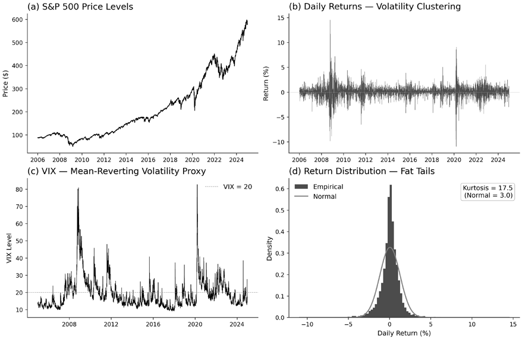
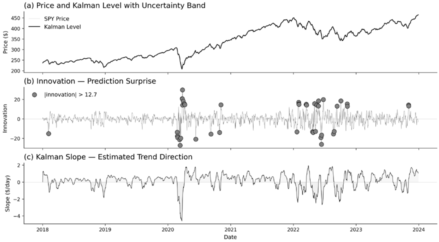
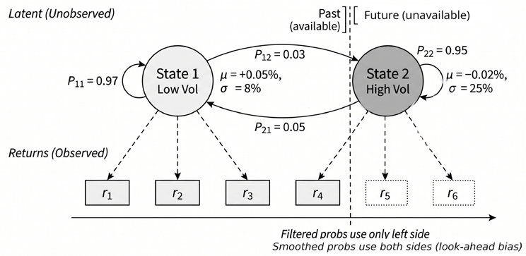

# Chapter 9: Model-Based Feature Extraction

In *Chapter 8*, we built financial features by aggregating and applying deterministic transformations to observed data. This chapter turns to **model-based features**, produced by estimated procedures. Some take the form of structural quantities, such as coefficients, persistence measures, or latent states. Many others are operational outputs, including filtered estimates, innovations, forecasts, conditional variances, regime probabilities, and posterior uncertainty summaries. The common idea is simple: fit a procedure to the training data and use its outputs as features.

These procedures add value in two related ways. Some forecast quantities that matter for downstream prediction, especially volatility and other state variables that condition expected returns. Others do not forecast the target directly, but instead infer hidden structure in the data, such as trend, persistence, break risk, or regime membership. In both cases, the fitted procedure can summarize historical information more effectively with respect to the predictive target than a direct backward-looking formula, yielding features that can be more informative, more stable, or more interpretable than raw transformations alone.

The chapter is organized by extraction method rather than by economic family because a single fitted procedure can generate several distinct feature types. A Kalman filter yields level, trend, innovation, and uncertainty features; a GARCH model yields both conditional-volatility outputs and persistence parameters; a regime model yields probabilities, expected durations, and transition structure. Whatever form the feature takes, the point-in-time requirement remains unchanged. Every estimate, state, forecast, and probability must be generated using only information available at the time of decision, re-estimated within the walk-forward protocol, and versioned alongside the features it produces. After completing this chapter, you will be able to:

- Distinguish direct features from model-based features and judge when a fitted procedure adds useful information.
- Use fitted procedures to extract forecasts, filtered states, residuals, conditional volatility, regime probabilities, and uncertainty summaries as downstream features.
- Design a compact, interpretable set of model-based features from diagnostics, signal transforms, volatility models, uncertainty summaries, and regime models.
- Enforce point-in-time correctness by fitting and selecting models within training windows, using filtered rather than future-informed outputs, and aligning refit cadence and online updates with the walk-forward protocol.
- Transform asset-level temporal outputs into cross-sectional, benchmark-adjusted, pairwise, and universe-level features for multi-asset prediction tasks.
- Distinguish between exploratory time-series methods that are useful for research diagnosis and deployable features that are safe for live, point-in-time use.
- Use uncertainty and regime outputs primarily as conditioning features, and recognize when they should not be treated as stand-alone trading signals.

We begin with diagnostics and stationarity features. *Section 9.2* turns to signal transforms, including Kalman filters, spectral methods, wavelets, and signatures, which expose temporal structure that rolling statistics miss. *Section 9.3* focuses on volatility features, and *Section 9.4* treats uncertainty itself as a feature. *Section 9.5* develops regime features from threshold rules, HMMs, Markov-switching models, and distribution-based clustering. *Section 9.6* shows how to convert these temporal outputs into cross-sectional and panel features.

## 9.1 Diagnostics and stationarity features

Model-based features often begin as diagnostics. Before fitting a forecasting or state-space model, inspect the series to understand what kind of temporal structure it contains, what transformations it may require, and which outputs may themselves be useful downstream features. In this section, diagnostics play both roles. They guide preprocessing decisions and produce quantities that can be used directly as features. A rolling stationarity statistic can serve as a regime indicator; a detected break date can become a conditioning variable; a persistence estimate can summarize how quickly shocks decay.

A practical workflow begins with a small set of **visual diagnostics**. A plot of the series itself shows whether the level drifts over time, whether volatility changes across subsamples, and whether large moves cluster. Autocorrelation plots summarize lag dependence:

- The **autocorrelation function** (**ACF**) shows how strongly current values move with past values at different lag lengths
- The **partial autocorrelation function** (**PACF**) shows the incremental contribution of each lag after controlling for shorter lags
- A **Q-Q plot** compares the empirical distribution with a reference distribution, typically the normal, and quickly reveals skewness, fat tails, and outliers

These plots do not prove stationarity or non-stationarity, but they indicate which questions to ask next and which formal tests are worth running.

*Figure 9.1: A set of four graphs, demonstrating different ways of looking at the data distribution*

*Figure 9.1* illustrates this first pass for S&P 500 data. The level series trends and is therefore an obvious candidate for non-stationarity. Returns fluctuate around a more stable mean but show volatility clustering. VIX behaves more like a persistent, mean-reverting state variable than a drifting price series. The return distribution departs visibly from normality, especially in the tails. Together, these views suggest three follow-up questions. Is the series stationary? Has it changed regime? If it is non-stationary, what is the least destructive transformation that makes it usable?

**Implementation**: See `01_visual_diagnostics` for the full workflow, including visual inspection, stationarity tests, autocorrelation diagnostics, distribution diagnostics, and rolling stationarity features.

### Stationarity tests as features

Many time series methods assume that the object being modeled has reasonably stable statistical properties over time. In the simplest case, this means that the mean, variance, and dependence structure do not drift in ways the model cannot absorb. Prices often violate this requirement because shocks to the level can persist for long periods. Returns, spreads, volatility measures, and some alternative data series are more likely to exhibit approximate stationarity, though this varies across assets, horizons, and regimes. Two complementary tests are especially useful because they begin from opposite null hypotheses:

1. The **Augmented Dickey-Fuller** (**ADF**) test takes a **unit root** as its null hypothesis. In practical terms, a unit root means that shocks to the series have persistent effects rather than fading quickly, which is one common form of non-stationarity. Rejection of the ADF null is therefore evidence against a unit root and, under the chosen deterministic specification, evidence in favor of stationarity or trend-stationarity.
2. The **Kwiatkowski-Phillips-Schmidt-Shin** (**KPSS**) test reverses the null. Depending on the specification, it tests whether the series is stationary around a constant level or around a deterministic trend. Rejecting the KPSS null is therefore evidence against that form of stationarity. Running both tests reduces the asymmetry that arises when inference depends on a single null hypothesis.

The **joint interpretation** is useful but should not be treated mechanically:

- If ADF rejects the unit-root null and KPSS does not reject the stationarity null, the evidence favors stationarity under the chosen specifications
- If ADF does not reject the null and KPSS rejects the null, the evidence favors non-stationarity
- If both reject, the tests are sending conflicting signals: the series may contain a deterministic trend, structural breaks, nonlinear mean reversion, changing volatility, or other forms of instability not captured cleanly by either test
- If neither rejects, the result is best treated as inconclusive, often because the window is short, the process is highly persistent, or the tests have limited power

For feature engineering, the test outputs matter as much as the final label. The ADF and KPSS statistics, along with their p-values, can be tracked over rolling windows:

- An ADF statistic moving upward toward zero, or an ADF p-value rising, suggests weaker evidence against a unit root
- A rising KPSS statistic or a declining p-value suggests weaker evidence for stationarity

These diagnostics are therefore not just gatekeepers for preprocessing. They are model-based summaries of persistence and regime stability that can be used as lagged inputs to downstream models.

In **cross-sectional settings**, these tests are often most informative when applied to spreads, valuation ratios, volatility proxies, residualized returns, and slowly evolving firm characteristics rather than to raw daily equity returns. Returns are usually closer to stationary than prices because differencing removes much of the persistence in levels, but volatility clustering, changing liquidity, and regime shifts can still violate strict stationarity. The feature is therefore not simply “stationary versus non-stationary” but a time-varying measure of how stable the underlying process appears at the time of decision.

**Implementation**: `01_visual_diagnostics` shows rolling ADF and KPSS computation, joint interpretation, and examples of time-varying stationarity features.

### Structural break features

A series can fail a stationarity test for different reasons. It may drift continuously, as prices often do, or it may be mostly stable but interrupted by one or more regime changes. Break diagnostics focus on the second case.

The **Zivot-Andrews** test (Zivot and Andrews, 1992) extends the unit-root framework by allowing one break to be chosen endogenously from the data. It is useful when a single major discontinuity is plausible, and a genuine unit root must be distinguished from a broken but otherwise stable process. For longer samples, multiple breaks are often more realistic. In that setting, **Bai-Perron** (Bai and Perron, 1998) segmentation is more appropriate because it identifies several candidate break dates rather than forcing the sample into a single break or none at all.

For online monitoring, the problem is different. The goal is not to explain the full sample retrospectively, but to detect instability as it develops. **CUSUM** statistics accumulate deviations from a target level and trigger when sustained drift becomes too large to ignore. This makes them useful monitoring features even when the exact break date will only be clear in hindsight.

A complementary approach treats break detection as a supervised classification problem. Instead of relying on a single statistic, combine weak signals from several sources, such as shifts in location, scale, dependence, or distributional shape, and let the classifier aggregate them. This approach is often more effective when labeled break examples are available and when no single classical test is decisive across all regimes.

As with stationarity tests, the outputs become features. Break dates, time since the most recent break, pre- and post-break means, CUSUM statistics, and classifier probabilities can all be used as conditioning information for later models. A break detector is therefore both a diagnostic tool and a feature generator.

**Implementation**: `02_structural_breaks` shows classical break tests, online monitoring, and the classification-based break-detection pipeline.

### Fractional differencing features

encing applies (ͳ െܮ)ݔ௧ൌݔ௧െݔ௧ିଵ, which is effective but blunt because it removes the low-frequency When diagnostics indicate non-stationarity, the standard response is **differencing**. Ordinary first differ-

component in one step. Fractional differencing generalizes this operator by allowing the differencing order to be real: ∞ −݇ ൅1݇= (−1)௞(݀݇) (1 −ܮ)ௗݔ௧= ෍߱ ݔ௧ି௞ǡ᩷᩷߱ 0 = 1ǡ᩷᩷߱ ௞= − ௞ ௞ିଵ ௞ୀ0 For Ͳ ൏݀ ൏ͳ, the filter applies a slowly decaying sequence of lag weights, so persistence is attenuated

more gradually than under ordinary first differencing. The transformed series is therefore not simply “between levels and returns” in an informal sense; it occupies the continuum between no differencing and first differencing defined by the fractional integration order. to be non-integer. For the stationary long-memory case, typically Ͳ ൏݀ ൏ͲǤͷ, autocorrelations de-In the **fractional ARIMA** (**ARFIMA**) literature, this same operator allows the integration parameter

cay hyperbolically rather than at the exponential rate associated with short-memory ARMA models (Granger and Joyeux, 1980; Hosking, 1981).

In practice, fractional differencing is implemented with a finite lookback rather than the full infinite sequence of weights. The transform combines the current observation with past values whose weights decay with lag; weights beyond a truncation threshold or fixed maximum lookback are dropped. Two boundary conventions then differ on what to do at the start of the sample:

- A **full-window** implementation treats the first observations as unavailable until the required lookback period has accumulated, resulting in a warmup period and a corresponding validity mask. This is the convention used by fixed-width fractional differencing implementations inspired by López de Prado.
- A **boundary-partial** implementation, such as the truncated-weights approach used in `ml4t.` `engineer.features.fdiff.ffdiff`, applies whatever weights are available near the start of the sample. This preserves the row count but means that early observations are produced by a shorter effective filter than later observations.

Either convention is defensible, but the choice is part of the feature definition. Downstream models should know which observations rely on a partial filter and how many observations would be lost That mask, and the associated loss of observations, are part of the feature definition. Changing 𝑑 under the corresponding full-window convention.

changes how slowly the weights decay, and changing the truncation rule changes how much history must be retained. Both, therefore, affect two things at once: how much persistence remains in the This also clarifies what it means to choose or estimate 𝑑. The question is not whether fractional dif- transformed series, and how many observations are usable for modeling.

ferencing is mathematically elegant, but how much persistence must be removed to obtain a usable representation of the series.

A **practical workflow**: Evaluates a bounded grid of 𝑑 values over the training window.

1.

1. Computes a stationarity diagnostic, such as the ADF statistic, for each transformed series. The target is usually the smallest 𝑑 that yields an acceptable stationarity diagnostic while preserving 3. Assesses how much correlation with the original series is retained.

as much memory as possible, rather than a globally “optimal” value computed on the full sample.

ferencing, bounded 𝑑-grids, walk-forward-safe 𝑑-selection, ADF-based diagnostics, and **Implementation**: `03_fractional_differencing` illustrates fixed-width fractional dif-

validity-mask handling. When it works well, fractional differencing yields a more stable representation than raw levels without paying the full information cost of ordinary first differencing. The next section moves from preprocessing transforms to a richer class of signal decompositions - Kalman filters, spectral methods, wavelets, and path signatures - that expose latent structure rolling statistics cannot reach.

## 9.2 Transforming signals to uncover hidden structure

Signal transforms can be grouped by the kind of **hidden structure** they recover: latent state, recurring frequency, time scale, and path shape. Rolling statistics summarize what happened over a window, but they compress away much of the structure that may matter for prediction. A moving average captures the average level, and rolling volatility captures dispersion, but neither tells us whether the path was smooth or jagged, whether fluctuations occurred early or late in the window, or whether a regular cycle was present beneath the noise. Signal transforms address this limitation by mapping the raw series into a new representation and then extracting features from it.

The methods in this section serve different purposes, but they share the same logic:

- **Kalman filters** summarize the hidden state that may underlie noisy observations
- **Spectral methods** summarize how variation is distributed across frequencies
- **Wavelets separate** the series into components at different scales
- **Path signatures** summarize the ordered geometry of a path rather than just its endpoints or moments

In each case, the goal is to convert raw sequential data into summaries that may be more informative than simple rolling statistics.

### Kalman filter features

A simple moving average uses a fixed window and fixed weights. That makes it easy to interpret, but also rigid. In a strong trend, it may react too slowly, while in a noisy sideways market, it may react too quickly. A Kalman filter takes a different approach. Instead of mechanically averaging past observations, it maintains a running estimate of an underlying latent state and updates it each time a new observation arrives. Unlike an exponential moving average or a rolling linear trend regression, a Kalman filter does not commit to a fixed lookback period; its gain **adapts to the estimated signal-to-noise ratio**.

The key idea is to distinguish between what we observe and what we are trying to infer. The observed series may be a price, return, spread, or other market variable. The latent state is the smoother or more persistent object we believe generated those observations, such as an underlying level and trend. In a **state-space model**, the hidden state evolves over time, and the observed series is treated as a noisy measurement of that state.

In a local linear trend model, the state contains both a level and a slope. The filter alternates between two steps:

1. In the **predict** step, it projects the state forward using the model’s transition rule.
2. In the **update** step, it revises that projection using the new observation.

The result is a feature extraction procedure that balances persistence against surprise. When the series behaves smoothly relative to the assumed noise level, the estimated state moves steadily. When observations become erratic, the filter becomes more cautious.

Originally developed for navigation and control (Kalman, 1960), the model can be written as: 𝑥௧ൌܨ𝑥௧ିଵ൅ݓ௧ǡ᩷᩷ ݕ௧ൌܪ𝑥௧൅ݒ௧

where 𝑥௧ is the hidden state, 𝑦௧ is the observed value, 𝐹 governs how the state evolves, and 𝑤௧ and 𝑣௧

represent process and observation noise.

This representation yields several useful features:

- The **Kalman level** is the filtered estimate of the underlying level and serves as an adaptive trend anchor
- The **Kalman trend** is the slope component of the state and serves as a momentum feature without requiring a fixed lookback
- The **innovation** is the prediction error, that is, the gap between what the filter expected and what it observed; it is a natural surprise variable
- The **state uncertainty** is the estimated variance of the state and measures how confident the filter currently is in its own estimate

These outputs often carry more information than a conventional moving-average crossover because they distinguish direction, surprise, and confidence rather than collapsing everything into a single to dynamic hedge-ratio estimation, where coefficients such as 𝛽௧ are allowed to evolve over time rather smoothed line. The same state-space logic also extends naturally from single-series trend extraction

than being treated as fixed constants.

For the `etfs` case study, applying a local-linear-trend Kalman filter to daily returns produces a trend feature that is more stable than 20-day momentum during choppy markets (fewer whipsaws) and On SPY, the Kalman slope achieves an information coefficient of −0.16 with 5-day forward returns, comparably responsive during sustained trends. roughly nine times stronger than a 20-day rolling OLS slope (−0.02); both are negative, consistent with

short-term mean reversion, but the adaptive filter separates signal from noise far more effectively. The innovation feature shows elevated values around earnings seasons and macro releases - periods when the filter’s smooth model is repeatedly surprised, which can condition the triage of other signals.

*Figure 9.2: Kalman filter smoothing*

**Implementation**: `04_kalman_filter` shows Kalman filter feature extraction, including MLE-based noise covariance estimation, walk-forward refitting, and a dynamic hedge-ratio application for pairs trading.

### Spectral features

Kalman filters work in the time domain: they update estimates one observation at a time. Spectral methods answer a different question. Instead of asking how the series evolved day by day, they ask whether part of the variation is organized around **recurring cycles**. A weekly trading rhythm, a monthly rebalance effect, or a quarterly earnings pattern may be difficult to see directly in the raw series but may become more visible when the series is decomposed by frequency.

A **frequency** is simply a rate of repetition, measured in cycles per unit time. Its reciprocal is the **period**. A weekly cycle in daily data has a period of 5 and a frequency of 1/5; a monthly cycle has a period of about 21 and a frequency of 1/21. The **discrete Fourier transform** converts a finite time series into a set of sinusoidal components at different frequencies. The **fast Fourier transform** (**FFT**) is the standard algorithm used to compute that transform efficiently. The resulting **power spectrum** shows how much of the series’ variance is associated with each frequency band. The basic transform is: ேିଵ 𝑋௞ൌ෍ݔ௧ ଶగ௜௞௧Ȁே ௧ୀ଴݁

but for feature engineering, the interpretation matters more than the formula. A large value of | ௞|2

at a weekly frequency means that the series contains a strong weekly component; a diffuse spectrum means that no single frequency dominates. The spectrum, therefore, summarizes how structured or noisy the series appears when viewed through the lens of periodic repetition.

Several features follow directly from this representation:

- **Spectral energy** measures total power, or power in a target band, and captures the strength of cyclical structure.
- The **dominant period** is the period associated with the largest peak in the rolling spectrum.
- **Spectral entropy** measures how concentrated or diffuse the normalized power spectrum is: low entropy implies a small number of strong periodic components, while high entropy implies a flatter, more noise-like distribution of energy.
- The **low-frequency ratio** measures the fraction of energy below a chosen cutoff, such as (1/21), and provides a compact indicator of whether variation is concentrated in slower trend-like These features must be computed causally. At time 𝑡, the transform should use only a trailing window components or faster noisy ones. such as [ݐെܹ ǡ ݐ], not the full sample. Window length matters because frequency resolution depends

on it: a quarterly cycle cannot be resolved well in a very short window. In practice, these features are often built on returns or other approximately stationary inputs, and several window lengths are useful; for example, 21-, 63-, and 126-day windows capture different cycles in daily data.

Spectral features complement the deterministic calendar features from *Chapter 8*. Calendar encodings impose known cycles through sine and cosine pairs. Spectral features ask whether a cycle is actually present in the data and whether its strength is rising, stable, or fading. That distinction matters whenever cyclical structure is itself time-varying.

**Implementation**: See `05_spectral_features` for rolling FFT feature extraction, Welch PSD estimation, and a time-frequency heatmap that tracks spectral regime shifts.

### Wavelet features

Fourier methods identify which frequencies are present, but they are much less effective at telling us when those frequencies were active. Wavelets address that limitation by providing a **multi-resolution** representation of the series. A wavelet decomposition separates the series into coarse components that capture slower variation and finer components that capture short-lived detail, while retaining temporal localization. The detail bands provide a rough horizon map, from very short 2- to 4-day fluctuations through 32- to 64-day components, while the approximation term captures the slower trend. This makes wavelets useful for structures that are localized in time, such as a volatility burst that lasts only a few days or a cycle that appears only during a particular regime. In contrast to the Fourier transform, which is naturally global, the wavelet transform can preserve both scale and timing.

In feature engineering, wavelets are especially helpful for **horizon discovery**. They can show whether the informative structure in a series lives mainly at very short horizons, intermediate horizons, or slower trend-like scales. That information can then guide the design of simpler causal features built on trailing windows, fitted filters, or band-limited transforms. usual offline form because coefficients at time 𝑡 may depend on observations on both sides of 𝑡. That A **practical caution** is important here. Standard wavelet decompositions are often not causal in their

makes them well-suited to exploratory analysis and offline diagnostics, but not automatically safe for live production pipelines. When wavelets reveal that a particular scale is informative, the usual next step is to build a causal proxy at that horizon rather than to deploy the raw offline coefficients directly.

Wavelets are therefore best viewed as a bridge between raw data and deployable features. They help answer the question, “At what horizons does the relevant structure live?”

**Implementation**: See `05_spectral_features` for wavelet multi-resolution decomposition as a research diagnostic, including scale-variance analysis and the translation of wavelet insights into causal rolling-window proxies.

### Path signature features

Spectral methods summarize cycles, and wavelets summarize variation by scale. Path signatures address a different problem: they summarize **path shape**. Two windows can have the same start, end, and realized volatility, yet differ materially in how the path got there. A steady rise followed by a sharp reversal is not the same pattern as an early selloff followed by a gradual recovery. Traditional lag features often treat those two paths as more similar than they really are because they compress the window into endpoint and dispersion summaries. Signatures are designed to preserve more of the ordered geometry.

A path signature, rooted in **rough path theory** (see Chevyrev et al., 2016, for an accessible introduction), is a collection of ordered integrals that summarize how a path evolves through time:

- At *depth-1*, the signature records total displacement, which is essentially net change
- At *depth-2*, it begins to capture interactions between coordinates, including lead-lag structure
- Higher depths capture increasingly fine geometry, but the number of terms grows rapidly

For feature engineering, the main intuition is that signatures preserve sequence information that ordinary lag stacks often discard.

For financial series, **time augmentation** is especially important. Without an explicit time coordinate, two paths with the same geometric trace but different ordering may look too similar at low depth. By adding a monotone time coordinate, the signature can distinguish “rose early, then faded” from “fell early, then recovered.” This is one reason signatures can be useful when the order itself contains a signal. A second practical distinction is between full signatures and **log-signatures**. The full signature contains algebraic redundancy. The log-signature is a more compact representation that removes much of that redundancy while preserving the expressive information needed for prediction tasks. In practice, lowdepth log-signatures are often the most sensible starting point because they balance expressiveness against dimensionality.

Path signatures are **not a general replacement for simpler features**. They are most useful when path shape genuinely matters, when ordering contains signal beyond endpoint summaries, or when we want a compact representation of a multi-dimensional path. In those settings, they complement standard return, volatility, and momentum features rather than displacing them. For most daily applications, depth-2 log-signatures are the sensible starting point; higher depths quickly increase dimensionality and are most defensible when path shape is central to the problem.

The same general principle will reappear in later chapters in learned form. Temporal convolutional networks, recurrent models, and transformer encoders also transform raw sequences into richer internal representations and then expose hidden states, embeddings, or forecasts as features.

**Implementation**: See `06_path_signatures` for the mathematical formulation (iterated integrals, log-signatures, time augmentation), computation using the `esig` library, and a head-to-head comparison against traditional lag features.

With latent state, frequency, scale, and path structure now available as features, the next section turns to volatility - the single most predictable property of financial time series - and shows how fitted models such as GARCH, EGARCH, HAR, and rough-volatility estimators convert that predictability into production features.

## 9.3 Volatility Features

*Chapter 8* introduced direct volatility measures built from observed prices, including close-to-close realized volatility and range-based estimators such as Parkinson (1980), Garman and Klass (1980), and Yang and Zhang (2000). Those measures efficiently summarize price variation, but they remain backward-looking summaries. This section turns to fitted volatility models and treats their outputs as features. The aim is not to replace the direct measures from *Chapter 8*, but to model how volatility evolves through time and to extract point-in-time safe summaries from that fitted dynamics.

Fitted volatility models provide three kinds of information that direct aggregation does not:

- They produce **conditional volatility** estimates that update as new shocks arrive
- Some models separate short-, medium-, and long-horizon contributions to current volatility
- They expose parameters that describe persistence and asymmetry, which are often informative in their own right

Throughout this section, the model is the feature extractor. Conditional variance paths, persistence measures, leverage parameters, and horizon-specific components are incorporated into later machine learning pipelines alongside the direct features from *Chapter 8*.

### Autoregressive integrated moving average features

**Autoregressive integrated moving average** (**ARIMA**) plays a supporting role in this section. Its main use is to remove simple linear structure from a series before volatility modeling or to generate fitted features for ancillary series that are more predictable than daily returns. In practice, residuals are often the most useful output because they provide a de-meaned or de-trended input for later volatility models. For series such as realized volatility, bid-ask spreads, funding rates, or futures basis, the onestep forecast can also be used directly as a feature. For liquid daily returns, however, low-order ARIMA models usually add little as standalone predictors, so ARIMA belongs here mainly as a preprocessing and auxiliary-feature tool.

This distinction matters. For many liquid return series, the direct predictive value of a low-order ARIMA mean equation is modest at best. In those cases, the residual is usually more useful than the forecast because it removes whatever linear dependence is present before the conditional variance model is fit. For series with a clearer autoregressive structure, the fitted ARIMA model can generate two practical features:

- The residual, which measures deviation from the model’s expected path
- The one-step forecast, which provides a model-based estimate of the next period’s level

Order selection should remain conservative. For stationary inputs, low-order models such as ARI-MA(1,0,1) or ARIMA(2,0,1) are usually sufficient; for trending inputs, differencing may be required. Automated selection by information criteria can be useful, but any search over orders must be repeated inside each walk-forward training window. Otherwise, the lag structure itself is chosen with knowledge of later data. In this section, the key outputs are therefore `arima_residual` and, where the series supports it, `arima_forecast`.

**Implementation**: See `07_arima_features` for ARIMA order selection, residual extraction, and walk-forward evaluation.

### Generalized autoregressive conditional heteroskedasticity features

The standard workhorse is the **generalized autoregressive conditional heteroskedasticity** (**GARCH**) model, introduced by Engle (1982) for the ARCH case and generalized by Bollerslev (1986). In a GARCH(1,1) specification, today’s conditional variance depends on a constant term, yesterday’s squared 2 ൌ߱ innovation, and yesterday’s conditional variance: 𝜎௧ ൅ߙ߳௧ିଵ ൅ߚ𝜎௧ିଵ 2 2 

For feature engineering, the model matters less as a forecasting object than as a structured decompocentral output. It is a model-based estimate of the volatility state at time 𝑡 and is often more responsive sition of volatility dynamics. The fitted conditional standard deviation, often stored as `cond_vol`, is the

than a fixed-window realized-volatility estimate because it updates recursively as new shocks arrive. The coefficient 𝛼 summarizes how strongly volatility reacts to recent shocks; this is the natural

• The coefficient 𝛽 summarizes persistence in the volatility process and becomes a `vol_shock_impact` feature • Their sum, ߙ൅ߚ, is especially useful because it captures how slowly a volatility shock decays. When `persistence` feature ߙ൅ߚ is close to one, volatility is highly persistent.

approximate half-life of a volatility shock is 𝑙(0.5)/𝑙(ߙ൅ߚ). For SPY, a GARCH(1,1) fit yields That persistence can be translated into a more intuitive quantity. In a stationary GARCH model, the 𝛼17 and 𝛽80, giving ߙ൅ߚൌͲǤ97 and an implied half-life of about 23 trading days. This helps

explain why volatility models often contribute useful features even when mean-return models do not: volatility clusters, and that clustering can be summarized parsimoniously. 𝜔 The model also implies a long-run variance level: ͳ െߙെߚ

matters. If ߙ൅ߚ൒ͳ, the model behaves like an **integrated GARCH** (**IGARCH**) process and does not which can be used as a `long_run_vol` feature when the fit is covariance-stationary. That restriction

imply a finite unconditional variance. In that case, the long-run variance should not be interpreted as a valid feature. In practice, it is safer either to constrain estimation to stationary fits or to explicitly flag nonstationary estimates.

**Implementation**: See `08_garch_volatility` for GARCH estimation, ARCH-effect testing, and conditional volatility extraction.

### Asymmetric volatility – Exponential GARCH features

Standard GARCH treats positive and negative shocks symmetrically because it depends on squared innovations. Financial markets often do not behave that way. In many equity markets, negative returns are followed by larger increases in volatility than positive returns of the same magnitude.

The **exponential GARCH** (**EGARCH**) model captures this asymmetry by modeling log variance: |߳௧ିଵ| 2 ) 𝑙(ߪ௧ 2) ൌ߱ ൅ߙ ൅ߛ߳ ൅ߚ𝑙(ߪ௧ିଵ ߪ௧ିଵ ߪ௧ିଵ ௧ିଵ

The asymmetry enters through 𝛾. When 𝛾 is negative, negative shocks raise future volatility more than

positive shocks do (Nelson, 1991). That parameter is the natural `leverage_effect` feature. Its sign and magnitude summarize whether the asset exhibits the familiar equity-style leverage pattern and how strong that pattern is in the current estimation window. This is often more useful as a conditioning variable than as a forecast on its own. A strongly negative leverage parameter indicates that downside shocks have disproportionate consequences for the volatility state. That can matter for risk controls, for feature interactions with momentum or carry signals, and for interpreting whether a recent increase in volatility reflects generic turbulence or specifically downside stress.

An alternative is the **Glosten-Jagannathan-Runkle GARCH** (**GJR-GARCH**) model (Glosten et al., 1993), which introduces asymmetry through an indicator for negative shocks rather than through the EGARCH log-variance form. For feature extraction, the two models serve a similar purpose: they add a parameter that distinguishes symmetric persistence from downside-sensitive persistence. The choice between them is usually empirical.

**Implementation**: See `08_garch_volatility` for GARCH, EGARCH, and GJR-GARCH estimation and comparison.

### Heterogeneous autoregressive volatility features

The **Heterogeneous Autoregressive (HAR) model** (Corsi, 2009) captures daily volatility persistence (ௗ) ൌܿ (ௗ) ൅ߚ௪ (௪) ൅ߚ௠ (௠) ൅߳ across different horizons. A standard specification is: ൅ߚௗ ௧ାଵ ௧ ௧ ௧ ௧ାଵ

(ௗ), (௪), and (௠) denote daily, weekly, and monthly averages of **realized volatility** (**RV**). ௧ ௧ ௧ where adds is a fitted layer on top of them. The coefficients 𝛽ௗ, 𝛽௪, and 𝛽௠ measure how strongly short-, me-The horizon-specific volatility measures are inputs of the kind introduced in *Chapter 8*. What HAR

dium-, and longer-horizon volatility contribute to the next day’s volatility forecast. A larger monthly coefficient indicates more persistent volatility conditions, whereas a larger daily coefficient indicates greater sensitivity to recent shocks.

HAR is naturally specified on a daily realized-volatility series, ideally constructed from intraday returns. When only daily open-high-low-close-volume data are available, range-based estimators such as Garman-Klass or Yang-Zhang can serve as practical proxies. The model remains the same; only On SPY, the weekly component dominates (𝛽௪≈0.43), consistent with institutional-frequency dynam- the volatility input changes.

ics driving index volatility. In an out-of-sample comparison, HAR achieves roughly half the RMSE of GARCH (0.061 compared to 0.111), confirming that the multi-horizon decomposition captures persistence structure that a single-lag recursion misses.

**Implementation**: See `09_har_rough_volatility` for HAR estimation, rolling coefficient tracking, and comparison with GARCH.

### Re-estimation cadence and online updates

Volatility features are only useful if they reflect the current volatility environment. That requires two separate decisions: how often to re-estimate model parameters, and how to update features between refits.

The **refit cadence** should match the stability of the parameters and the model’s cost:

- GARCH parameters often move slowly enough that weekly or monthly re-estimation is sufficient.
- EGARCH asymmetry parameters usually do not need to be refitted daily either.
- HAR coefficients can be somewhat more regime-sensitive because they summarize changing horizon contributions, but they are still typically re-estimated on a rolling schedule rather than every day.

By contrast, **stochastic volatility** (**SV**) (see *Chapter 5*) models estimated via **Markov chain Monte Carlo** (**MCMC**) are usually computationally expensive enough that monthly, or even less frequent, full re-estimation is more realistic.

Between refits, however, many features can still be updated online. In GARCH, the conditional variance recursion updates daily using fixed parameter estimates. In HAR, the daily, weekly, and monthly realized-volatility inputs update as new realized-volatility observations arrive. In stochastic-volatility settings, filtering updates can refresh latent-state estimates without rerunning the full posterior.

For large panels, the practical workflow matters as much as the choice of model. A common approach is to re-estimate parameters overnight across the universe and update the recursive features during the next trading day. Where even that is too expensive, an exponential-smoothing approximation can be a reasonable operational substitute, though at the cost of a less interpretable parameterization. Marra (2023) compares these estimators in practice, and Moreira and Muir (2017) show that even simple volatility-managed strategies improve Sharpe ratios across asset classes.

### Rough volatility and the Hurst exponent

GARCH and HAR describe persistence well, but they impose relatively smooth volatility dynamics. Rough-volatility methods start from a different empirical observation: volatility is persistent in level, yet the changes in volatility can be much more irregular than standard diffusion models imply. In that A compact way to summarize this behavior is the **Hurst exponent**, 𝐻. In broad terms: sense, volatility can be persistent and rough at the same time.

𝐻 corresponds to Brownian scaling 𝐻 indicates persistence in increments • 𝐻 indicates anti-persistence in increments • For log-volatility, Gatheral et al. (2014) documented Hurst exponents around 𝐻 for equity indi- •

ces - well below 0.5 - suggesting that volatility shocks are bursty and mean-revert in their increments returns show 𝐻 (consistent with a random walk), while log-volatility increments give 𝐻 between more quickly than a smooth Brownian specification would imply. The SPY data confirm this pattern:

0.12 and 0.23 depending on the estimator - squarely in the rough regime. For feature engineering, the Hurst exponent is best treated as a **slow-regime descriptor** rather than as a high-frequency signal. A rolling estimate based on log-volatility can indicate whether the current environment is smoother or rougher than usual. When the estimate falls well below 0.5, standard volatility recursions may understate how abruptly volatility can spike and then decay. This does not invalidate GARCH-style features, but it does change how they should be interpreted.

These estimates are noisy, so they should be updated over relatively long windows and interpreted with caution. A 252-day rolling window, refreshed weekly, is often more useful than daily re-estimation. Large one-day moves in the estimate usually reflect estimation noise rather than a genuine structural break. If the Hurst exponent is used on return series rather than on log-volatility, it should be interpreted even more cautiously.

**Implementation**: See `09_har_rough_volatility` for rescaled-range and detrended-fluctuation-analysis implementations, rolling Hurst estimation, and cross-asset roughness analysis.

This section treated volatility models as feature generators: ARIMA residuals for prewhitening, GARCH/ EGARCH estimates for conditional variance and asymmetry, HAR components for horizon-specific structure, and Hurst-based measures for roughness. The next section turns from volatility itself to uncertainty about fitted states and forecasts.

## 9.4 Uncertainty features

Model-based features need not stop at point estimates. A fitted procedure also tells us how certain it is about the current state or the next forecast. That uncertainty can be informative in its own right. A narrow posterior or prediction interval indicates a stable estimate; a wide one indicates that the model sees several plausible outcomes. In trading applications, these uncertainty summaries can help condition signal strength, exposure, risk buffers, and the interpretation of other features.

Two distinctions matter:

- First, **uncertainty about a latent state is not the same as uncertainty about a forecast**. A stochastic-volatility model can be uncertain about the current volatility state even before we ask it to predict the next period. An ARIMA model can be relatively certain about the current level of a series while remaining uncertain about its next-step forecast.
- Second, **uncertainty can come from different estimation traditions**. **Bayesian methods** produce posterior distributions directly, whereas **frequentist models** often provide forecast standard errors and prediction intervals.

For feature engineering, both can be useful.

### The uncertainty-as-feature principle

Once a fitted model produces a distribution rather than a single value, several additional features become available. Common examples include:

- Posterior standard deviations
- Credible interval widths (the Bayesian version of the frequentist confidence interval)
- Tail probabilities
- Forecast standard errors
- Prediction interval widths

These quantities do not replace the underlying point estimate. They complement it by describing how reliable that estimate appears at decision time.

This perspective is especially useful when two observations share the same point forecast but differ in uncertainty. A volatility forecast of 20 % with a narrow interval carries a different operational meaning from the same 20% forecast with a wide interval. The first suggests a relatively well-identified state; the second suggests that the model sees materially more ambiguity. The uncertainty summary can therefore serve as a conditioning feature even when the central estimate itself is already included elsewhere in the model.

**Implementation**: See `10_uncertainty_features` for posterior uncertainty from a stochastic-volatility model and forecast uncertainty from ARIMA applied to log realized volatility.

### Stochastic volatility features

GARCH models treat conditional volatility as a deterministic recursion once the parameters and past data are given. Stochastic-volatility (SV) models (Taylor, 1982) take a different view. They treat volatility itself as a latent process that evolves with its own shock term, so the current **volatility state is not observed directly** but inferred from the data. Estimation, therefore, yields a distribution over the latent state rather than only a single filtered path.

That distribution produces several useful features:

- The posterior mean of current volatility is the central state estimate
- The posterior standard deviation and the credible interval width quantify the uncertainty of the estimate
- A parameter governing the innovation variance of the log-volatility process summarizes volatility of volatility, and the persistence parameter summarizes how slowly volatility states decay

Together, these quantities distinguish three cases that a single volatility estimate would conflate: volatility is low and well identified; volatility is high and well identified; or volatility is high but poorly identified.

For downstream models, uncertainty about volatility often matters most when it rises independently of the volatility level itself. A large posterior standard deviation means the model is not only detecting elevated risk but is also less certain about where that risk state actually sits. That can be a stronger warning signal than high volatility alone. Point-in-time handling is critical. For feature extraction, use filtered posteriors rather than smoothed full-sample state estimates that borrow information from the future. In practice, stochastic-volatility models are usually re-estimated less frequently than simpler volatility models because posterior sampling is expensive.

**Implementation**: `10_uncertainty_features` fits a Student-t stochastic-volatility model in a walk-forward setting, extracts the filtered final-state posterior at each refit, and carries those features forward between refits.

### ARIMA forecast uncertainty features

ARIMA models produce more than fitted values and residuals. They also produce forecast distributions that can be used as features to capture the model’s confidence in the next step. For volatility-like series, this is often more useful than applying ARIMA directly to returns, because realized volatility, spreads, funding rates, and similar ancillary series tend to have clearer serial structure.

When the target is strictly positive, such as realized volatility, it is often preferable to model log volatility rather than the raw level. The log transform stabilizes scale and avoids negative back-transformed forecasts. It also yields prediction intervals on the original scale that are asymmetric, which is often more realistic for volatility because the downside is bounded near zero, while upside spikes can be large.

Three uncertainty features are especially practical:

- The forecast standard error summarizes uncertainty on the modeled scale
- The prediction-interval width summarizes uncertainty on the original scale
- Their ratio, such as the interval width divided by the forecast level, provides a relative measure of how uncertain the forecast is relative to its central value

High relative uncertainty indicates that the model’s forecast is weakly identified even if the point forecast itself looks large.

These features are often better used as conditioning variables than as stand-alone signals. A directional or allocation model may respond differently when its volatility input is estimated precisely than when the same input is surrounded by a wide interval.

**Implementation**: `10_uncertainty_features` notebook fits rolling ARIMA models to log Garman-Klass realized volatility, back-transforms the interval to the original scale, and tracks forecast-standard-error and interval-width features over time.

As in earlier sections, the fitted-object discipline remains unchanged. Any order selection, interval estimation, and refitting must remain inside the walk-forward protocol. Uncertainty features are only useful when the uncertainty itself is measured without look-ahead bias.

Regime models generate analogous summaries, including uncertainty about the current state assignment and the persistence of transitions. We turn to these next.

## 9.5 Regime features

Many financial series are better described as moving among recurring market environments than as fluctuating around one stable distribution. Volatility can remain low for extended periods and then shift abruptly into a stressed state. Trend-following signals can work well in persistent markets and fail in choppy ones. Correlations that appear stable in one macro environment can reverse in another (Ang and Bekaert, 2002; see Ang and Timmermann, 2011, for a comprehensive survey of regime-change models in finance). A regime feature attempts to summarize the changing environment.

This differs from a structural break in one important respect:

- A **structural break** marks a discrete change in the data-generating process
- A **regime model** instead assumes that the series can revisit earlier states

A calm market can give way to stress and later return to calm; a trend regime can alternate with a range-bound regime several times within the same sample.

### Observable regime rules

The simplest regime features are **deterministic rules** applied to observed data. These remain useful because they are transparent, require no latent-state estimation, and are easy to audit in production. For equities, a volatility threshold, such as the VIX above a fixed level, can indicate a stressed market. A trend rule, such as price above or below a long moving average, can separate upward-trending from downward-trending or range-bound conditions. Other deterministic indicators, such as the choppiness index or a trend-efficiency measure, further refine this classification.

These rules are often dismissed as crude, but they **solve a real problem**. A threshold feature fails transparently. If VIX ceases to be informative for a particular universe or horizon, the failure is easy to diagnose. A more flexible latent-state model can represent richer dynamics, but it also introduces more assumptions and more failure modes. For this reason, deterministic regime indicators are often good **baseline features** even when more elaborate models are added later.

A useful way to think about these features is that they **encode a market context** rather than a forecast. A volatility threshold does not predict returns by itself. It tells the downstream model whether other features should be interpreted in a calm or stressed environment. In practice, this **conditioning role** is often the most important function of regime features more broadly.

### Hidden Markov model features

The standard latent-state approach is the **Hidden Markov Model** (**HMM**; Rabiner, 1989, provides a standard tutorial). An HMM assumes that an unobserved state variable follows a **Markov chain**, so the probability of tomorrow’s state depends only on today’s state. Conditional on that hidden state, the observed data are generated from a state-specific distribution. In finance, the observations are often returns, realized volatility, or a small vector of market variables, and the hidden states are interpreted as regimes such as calm and stressed volatility or low- and high-dispersion return environments (Uysal and Mulvey, 2021). The most important output is the **filtered state probability**, 𝑃(ܵ௧ൌ݇ פ ݕଵǣ௧), which measures the probability that the system is in state 𝑘 given only information available through time 𝑡. This is the central object for feature engineering. By contrast, the smoothed probability, 𝑃(ܵ௧ൌ݇ פ ݕଵǣ்), uses future

observations and is therefore suitable only for retrospective analysis. *Figure 9.3* illustrates the HMM architecture: hidden states generate observed returns through regime-specific emissions.

*Figure 9.3: Hidden Markov Model architecture*

Several other features follow naturally from the fitted model:

- The filtered probability of each state preserves uncertainty and is usually more useful than a hard state label.
- The **transition matrix** provides quantities such as the probability of moving from a low-vola-The **expected duration** of state 𝑘, 1ି௣ೖ, summarizes regime persistence, where 𝑝௞ is the probtility state to a high-volatility state in the next step. 1 • ability of remaining in that state.
- The **entropy** of the filtered probability vector quantifies classification uncertainty: it is low when a single state dominates and high when the model is uncertain among states.

Two implementation issues deserve explicit attention:

- The states are unlabeled. What one estimation window calls “state 0” may correspond to “state 1” in the next window. To keep features comparable over time, relabel the fitted states using a stable characteristic, such as variance, if the states primarily differ in volatility.
- The number of states should remain modest unless there is a strong reason to do otherwise. Two-state specifications are often easier to interpret and more stable out-of-sample than richer models that fit historical noise.

**Implementation**: `11_hmm_regimes` walks through the forward-filtering logic, contrasts filtered and smoothed probabilities, and extracts transition, duration, and entropy features from HMM fits.

### Markov-switching autoregressive features

An HMM with simple state-specific emissions is useful when the main difference across regimes lies in the unconditional distribution of the observations. Sometimes the dynamics themselves also change across states. Hamilton’s (1989) **Markov-switching autoregressive** (**MS-AR**) model addresses this by allowing the autoregressive process to vary by regime.

This produces a different class of features. In addition to regime probabilities and regime-specific variances, the fitted model yields **regime-specific autoregressive coefficients**. These coefficients summarize whether persistence, mean reversion, or short-horizon momentum differs across states. A market can, for example, display stronger continuation in one regime and weaker or negative serial dependence in another. In that case, the regime-specific autoregressive coefficient becomes a natural conditioning feature for downstream return models.

MS-AR models are most useful when the question is not only which regime the market is in but also how the series’ behavior changes across regimes. If the regimes primarily differ in volatility, a simpler HMM may be sufficient. If they also differ in persistence or directional dynamics, the autoregressive extension can add useful structure.

**Implementation**: `11_hmm_regimes` includes a Markov-switching autoregression alongside the HMM, so the differences in the extracted features are visible within the same workflow.

### Distribution-based regime features

Moment-based regime models, including many HMM specifications, distinguish states through quantities such as the mean and variance. That is often appropriate, but it can miss cases where the main difference lies in distributional shape, especially in skewness and tail behavior. Two return windows can have similar means and volatilities while differing materially in downside concentration or upside convexity.

A distribution-based approach addresses this by treating each rolling window as an empirical distribution and clustering those windows directly. The **Wasserstein distance** is a natural metric for this task because it measures the cost of reshaping one distribution into another. In one dimension, it can be interpreted as the distance between quantile functions, making it sensitive to differences across the entire distribution rather than only at a few summary moments.

This changes both the regime definition and the resulting features. The basic output is the **cluster assignment**, which acts as a regime label. The distance from the current window to its assigned cluster center measures how typical or atypical the current regime instance is. A window that lies far from every centroid may indicate an unusual environment, even if it is still assigned to the nearest cluster.

A further feature can be obtained by comparing distribution-based and moment-based classifications. When a Wasserstein-based assignment differs from a moment-based regime label, the disagreement itself is informative, suggesting that tails or skewness matter more than the mean and variance alone. This type of feature is especially relevant when the trading problem is sensitive to downside asymmetry, jump risk, or changing tail exposure rather than just to volatility level.

**Implementation**: On a synthetic two-regime benchmark, Wasserstein K-means achieves an adjusted Rand index of 0.87, compared with 0.31 for moment-based K-means - a large gap that confirms the distributional metric captures regime structure that summary statistics miss. `12_wasserstein_regimes` applies this to S&P 500 returns using the stream-lift methodology of Horvath et al. (2021).

### Using regime features downstream

Regime features are usually more effective as **conditioning variables** than as hard switches between separate predictive models. The central reason is that regime inference is uncertain precisely when regime information matters most. Near transitions, the model may assign meaningful probabilities to several states simultaneously. A hard-switching system must still commit to one regime-specific model, which creates instability when small changes in regime probability lead to large changes in the active predictor.

A single predictive model that receives regime features as inputs handles this more gracefully. Filtered state probabilities, regime entropy, duration measures, and regime-conditioned interaction terms enable the model to learn that a signal behaves differently in calm and stressed environments without forcing an abrupt change in the model. As regime certainty falls, the regime inputs naturally become less decisive. The system degrades smoothly instead of switching discontinuously at the boundary between two estimated states. Shu and Mulvey (2025) show a similar approach to factor allocation, confirming that regime probabilities, treated as continuous features, outperform hard regime-switching rules.

This does not make separate regime-specific models useless. They can still be informative when there is a strong economic reason to believe that distinct mechanisms operate in different states and when each regime contains enough data to support separate estimation. But they impose a cost in sample size, increase operational complexity, and are often fragile near the boundary cases that matter most in live trading.

**Implementation**: `13_regime_as_feature` constructs both unified and regime-conditioned designs and shows how regime probabilities and entropy can be incorporated directly into a downstream gradient-boosting workflow.

All features developed so far - diagnostics, signal transforms, volatility models, uncertainty measures, and regime indicators - are computed asset-by-asset from each series’ own history. The next section shows how to convert these temporal outputs into cross-sectional and panel features that place each asset in the context of its peers and the broader universe, completing the bridge to the multi-asset modeling workflow used in later chapters.

## 9.6 Cross-sectional and panel features

A conditional volatility estimate of 25 % annualized means something different for a utility stock than for a biotech. The same is true for a Kalman trend, a regime probability, or a spectral-energy measure. Temporal features are first computed asset by asset from each series’ own history. They become more useful in multi-asset settings when placed in a cross-sectional context or combined across related assets. The result is a second layer of feature engineering: transform temporal outputs into **relative, pairwise, and universe-level signals**.

### Cross-sectional transforms of temporal features

Cross-sectional ranking is the simplest and often the most useful transform. At each date, take a temporal feature already finalized for each asset and replace its raw value with a rank, percentile, or z-score relative to the eligible universe. A raw Kalman trend then becomes a universe-relative momentum signal, a conditional-volatility estimate becomes a volatility percentile, and a regime probability becomes a measure of whether the asset looks more stressed or calmer than its peers.

These transforms solve two problems. They reduce the importance of absolute scale and align the feature with cross-sectional prediction tasks, where the objective is to sort assets rather than forecast their standalone levels. Ranking is often the most robust choice because it is less sensitive to outliers than z-scores and remains comparable across heterogeneous assets. Z-scores retain more information about cross-sectional distance and are often preferable when dispersion itself matters. Percentiles provide a bounded compromise that is easy to interpret.

The temporal model still does the primary extraction. The cross-sectional transform does not create the signal from scratch; it re-expresses an already meaningful temporal quantity in a form suited to multi-asset decisions.

**Implementation**: See `14_panel_features` for cross-sectional ranking of 60-day momentum and volatility across an ETF universe and how those relative positions evolve over time.

### Relative and benchmark-adjusted features

Some temporal features become more informative when expressed relative to a benchmark rather than the full cross-section. Subtracting market or sector momentum from an asset’s momentum isolates the idiosyncratic component. Dividing an asset’s conditional volatility by market volatility distinguishes asset-specific risk from market-wide stress. Subtracting an asset’s stress probability from the universe average shows whether it is unusually defensive or unusually exposed relative to the current environment.

This distinction matters because many temporal features mix systematic and idiosyncratic variation. An oil-sector ETF can show strong absolute momentum simply because the entire equity market is rising. Once broad-market momentum is removed, the residual measures whether the asset is outperforming or lagging that common trend. The same logic applies to volatility, drawdown risk, and regime indicators. Benchmark choice should follow the economic question. For broad equity universes, a market index is often the natural first benchmark. Sector, country, duration-bucket, or commodity-sleeve benchmarks can be more appropriate when the goal is to separate local structure from a narrower common factor.

**Implementation**: `14_panel_features` constructs market-relative momentum and relative volatility for ETFs by subtracting or scaling with SPY-based benchmarks.

### Pairwise temporal features

Multi-asset feature engineering also includes relationships between assets. Some of the most useful features are defined in terms of spreads, hedge ratios, or rolling dependence measures rather than in terms of a single series. Cointegration diagnostics summarize whether two prices share a stable longrun relationship. A time-varying hedge ratio from a Kalman filter summarizes how that relationship changes through time. The spread built from that hedge ratio can then produce standardized deviation measures, such as z-scores, and mean-reversion summaries, such as an estimated half-life.

These pairwise features are most natural in relative-value and statistical-arbitrage settings, but their usefulness is broader. A rolling beta to a benchmark, a rolling correlation regime indicator, or a cointegration score can all serve as conditioning features in a larger predictive model. They describe whether an asset is moving with, away from, or back toward a related instrument or common factor.

Interpret these quantities as state summaries, not trading rules. A short half-life does not by itself justify a trade, and a cointegration test does not guarantee a robust spread after costs. The important point is that the pairwise model produces temporally structured features that are unavailable from single-asset transformations alone.

**Implementation**: `14_panel_features` screens ETF pairs with Engle-Granger and Johansen tests, compares static and Kalman-filtered hedge ratios, and derives spread z-scores and half-life estimates from the resulting spreads.

### Universe-level aggregation

Once asset-level temporal features are available, they can be aggregated across the universe to summarize market-wide conditions. The cross-sectional mean of conditional volatility measures the overall volatility state. Cross-sectional dispersion shows whether assets are behaving similarly or differentiating sharply. The fraction of assets with elevated stress probability becomes a breadth measure of instability. An asset’s deviation from the universe average then measures whether it is moving with the market-wide regime or against it.

These aggregates are especially useful for regime features. A high average stress probability suggests that pressure is broad rather than idiosyncratic. High breadth indicates that many assets are simultaneously under stress. High dispersion, by contrast, indicates disagreement across the universe and often accompanies rotation, segmentation, or selective risk-taking. The combination is often more informative than any single asset-level regime label. The same aggregation logic applies beyond regime models. Cross-sectional averages of Kalman trends, volatility forecasts, or forecast-interval widths can summarize the market’s prevailing direction, risk state, or level of uncertainty.

**Implementation**: `14_panel_features` constructs `universe_crisis_prob`, `crisis_breadth`, and `regime_dispersion` to show how such aggregates behave through time.

### Point-in-time handling in panels

The **order of operations** is non-negotiable. First, compute each asset’s temporal feature from its own trailing history. Then align those asset-level outputs at the decision date. Only after that step should the cross-sectional rank, benchmark adjustment, pairwise transform, or universe aggregation be applied. Reversing the order leaks information across assets or across time.

The **universe definition** matters as well. When assets enter or leave the tradable set, cross-sectional ranks shift even if no underlying signal changes. Fixed-composition checks, eligibility filters defined in advance, and explicit handling of missing values help separate genuine signal movement from composition effects. Benchmark mappings require the same discipline: sector, country, or market assignments should be those known at the time of decision, not later classifications.

Cross-sectional and panel transforms add a final layer of structure to model-based features. They turn asset-level temporal estimates into relative signals, pairwise states, and market-wide summaries that can be consumed directly by downstream models.

## 9.7 Summary

This chapter expanded feature engineering from direct transformations to features produced by fitted procedures. Diagnostics contribute rolling measures of stability and break risk. Signal transforms recover latent state, frequency structure, scale, and path geometry. Volatility models add conditional variance, persistence, asymmetry, and horizon-specific components. Uncertainty models turn interval width and posterior dispersion into usable conditioning variables. Regime models summarize market state through thresholds, filtered probabilities, durations, and distribution-based clusters. In multi-asset settings, these temporal outputs become more useful once ranked, benchmarked, paired, or aggregated across the universe.

The practical challenge is not to include every feature a method can generate, but to keep the set interpretable and nonredundant. Many families overlap, so a compact baseline often works better than a maximal catalog: one or two volatility features, one regime feature, one signal-transform feature, and a limited set of cross-sectional transforms are usually enough to establish what the fitted methods add. From there, feature selection can decide whether additional structure improves the model or only increases complexity.

*Chapter 10* applies the same fitted-object discipline to text features, in which timing, decay, and embedding-model dependencies serve as the binding constraints.
