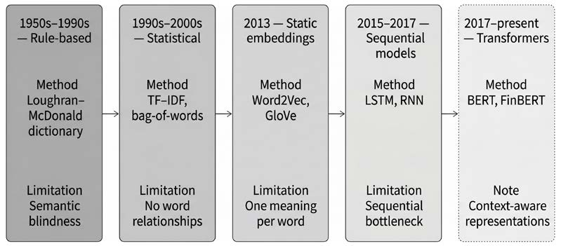
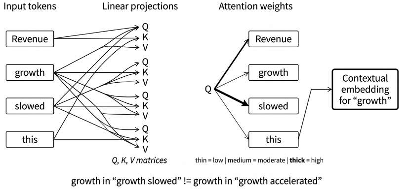
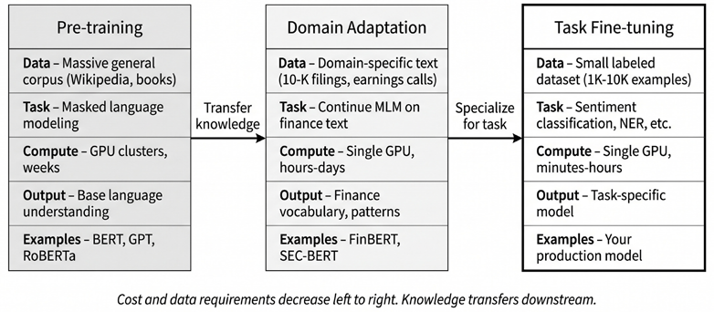

# Chapter 10: Text Feature Engineering

Quantitative investors have always sought informational edges. Yet the richest source of financial insight - text - has historically resisted systematic analysis. Earnings calls, analyst reports, regulatory filings, news articles, and social media posts contain forward-looking statements, management sentiment, and market-moving revelations that no price chart can capture.

The challenge is scale and structure. Most enterprise information is not stored in clean relational tables; it appears in text, audio, images, presentations, logs, filings, transcripts, and messages. Common industry estimates put the unstructured share of enterprise data around 80-90%, but the exact number matters less than the practical implication: much of the information relevant to investors arrives in forms that require representation, extraction, and timestamp discipline before it can become a tradable feature.

An earnings call transcript arrives at 4:30 PM. We extract a “guidance confidence” feature by comparing current language to the prior quarter. The feature becomes tradable only after we verify (a) when we received it, (b) that our embedding model was trained before the call date, and (c) that no revisions contaminate the historical series. These constraints - not the NLP model - often determine whether a text signal survives backtesting.

Investor attention to corporate filings is now measurable at internet scale, and the volume of text long ago outgrew manual analysis.

By the end of this chapter, you will be able to:

- Distinguish lexical features, static embeddings, sequential models, and transformers in terms of the information each representation preserves and loses.
- Explain how transformer self-attention produces contextual embeddings and why this mitigates key limitations of earlier NLP methods, including polysemy, weak context handling, and long-range dependence.
- Apply a practical financial NLP workflow that combines pre-trained checkpoints, domain adaptation when needed, and task fine-tuning for classification or extraction tasks.
- Design text-derived features such as sentiment, narrative surprise, or structured event signals using point-in-time-safe timestamps, model cutoffs, and aggregation rules.
- Evaluate text-derived signals using horizon-aware diagnostics, coverage-aware analysis, and event-time alignment rather than benchmark accuracy alone.
- Use token-level attribution and related diagnostics to audit, debug, and stress-test NLP features before deployment.

We begin by covering lexical and statistical baselines to establish what simple methods can and cannot capture. *Section 10.2* introduces static embeddings that learn semantic relationships from co-occurrence patterns. *Section 10.3* traces the development of sequential models to motivate the transformer revolution. *Section 10.4* covers the transformer architecture, self-attention, and domain-specific variants like FinBERT, with empirical comparisons across paradigms. *Section 10.5* assembles the production workflow: pipeline contracts, fine-tuning, embedding-based factor construction, structured extraction, and signal evaluation.

*Figure 10.1* previews this progression from lexical methods to contextual transformers. The structure traces an increasingly sophisticated search for *context*: lexical methods treat documents as unordered collections of terms; static embeddings capture semantic similarity but assign a single vector per word; sequential models introduce memory but process words one at a time; and transformers enable parallel processing with contextual embeddings that dynamically adjust to surrounding text.

*Figure 10.1: From rule-based to data-driven text understanding*

The first step in this progression - lexical and statistical models - provides the baselines against which all subsequent methods are measured.

## 10.1 Lexical and statistical models

The earliest text analysis methods treat documents as collections of terms, extracting features by counting and weighting them. These approaches remain useful baselines, but their semantic blindness motivates the embedding methods that follow. Financial text analysis progressed through several iterations. Tetlock (2007) established that the tone of news predicts market outcomes under event-time framing. Loughran and McDonald (2011) showed that general sentiment dictionaries misclassify financial language, motivating the development of domain-specific lexicons. More recent work uses unsupervised representations (topics, embeddings) to build “narrative” signals; reported performance varies with corpus choice, coverage bias, and evaluation protocol. This chapter focuses on representations and leakage-safe pipelines for turning text into features that can be evaluated like any alpha factor.

### Lexicon-based sentiment

Sentiment measures have a long history in markets, but large-scale systematic extraction became practical only with digitized corpora and modern NLP (Loughran and McDonald, 2020). The intuition is straightforward: count positive and negative words and compute a polarity score. But whose word lists?

General-purpose dictionaries designed for psychology or product reviews fail in finance. Loughran and McDonald (2011) found that nearly three-quarters of “negative” words in the Harvard General Inquirer are *not* negative in financial contexts. “Liability” - unambiguously negative in everyday language - is a neutral accounting term on a balance sheet. Similarly, “tax,” “vice,” and “capital” carry negative connotations in general dictionaries yet appear neutrally in corporate filings.

The Loughran-McDonald Master Dictionary addresses this mismatch. Built for 10-Ks and related filings, it provides six curated word lists:

| Category | Example Terms | Financial Interpretation |
| --- | --- | --- |
| Negative | loss, impairment, termination | Adverse events |
| Positive | gain, favorable, improved | Favorable developments |
| Uncertainty | may, possible, approximate | Hedging, risk disclosure |
| Litigious | litigation, court, lawsuit | Legal exposure |
| Strong modal | will, must, always | Commitment |
| Weak modal | could, might, may | Hedging intent |

*Table 10.1: Loughran-McDonald word list examples*

The Strong/weak modal distinction is particularly valuable: executives who consistently use “will” versus “might” reveal different levels of confidence in forward-looking statements.

### Statistical representations using bag-of-words

Beyond sentiment dictionaries, machine learning requires general-purpose document representations. The **bag-of-words** (**BoW**) model represents each document as a vector of term counts, ignoring word order entirely.

The process involves several steps: **tokenization** splits text into terms; **normalization** converts text to lowercase and removes punctuation; stop-word removal filters out uninformative terms (“the,” “is,” “and”); and a **vocabulary** of unique terms maps each document to a count vector. Raw counts have an obvious problem: common words dominate regardless of informativeness. **Term Frequency–Inverse Document Frequency** (**TF-IDF**) weights each term’s frequency by its rarity across documents: 𝑇െܫܦ𝑇(ݐǡ݀) = 𝑇(ݐǡ݀) ൈ݈݋݃ܰܦ𝑇(ݐ)

where 𝑇(ݐǡ݀) is term frequency in document 𝑑, 𝑁 is total documents, and 𝐷(ݐ) is documents containing term 𝑡. Implementations typically use smoothed IDF variants and L2-normalize vectors. BM25

(Robertson and Zaragoza, 2009), a probabilistic extension used in search engines, incorporates document-length normalization and term saturation.

### Critical limitations

These lexical methods establish useful baselines - simple, interpretable, and computationally cheap. But their limitations are severe:

- **Semantic blindness**: Bag-of-words cannot distinguish “assets exceed liabilities” from “liabilities exceed assets.” Word order carries meaning that counting destroys.
- **No synonym awareness**: “Buyout,” “acquisition,” and “takeover” are synonyms, but TF-IDF treats them as distinct features.
- **Polysemy ignored**: “Interest” means something different in “interest rate” versus “interest in the company.” Context determines meaning; lexical models lack it.
- **Negation handling**: “Not profitable” contains a positive word but conveys negative sentiment. Simple counting fails.
- **Sparsity**: With 50,000+ term vocabularies, most documents contain tiny fractions of all words. The resulting high-dimensional, sparse vectors pose challenges for many algorithms - the curse of dimensionality.
- **Boilerplate dilution** (finance-specific): 10-K risk factor sections contain boilerplate that dominates term frequencies, drowning out incremental disclosure.
- **Amendment leakage** (finance-specific): Document revisions (amended filings, updated articles) contaminate historical features without careful timestamp handling.

These limitations do not make lexical baselines obsolete. In small samples, narrow domains, and highly formulaic document types, well-regularized lexical models often remain difficult to beat. They are also valuable diagnostics: if a complex encoder fails to outperform a strong TF-IDF baseline, the problem may lie in label quality, temporal alignment, or task definition rather than model capacity.

But lexical models memorize fixed vocabulary and scoring rules. They cannot *learn* that semantically related words should produce similar features, *generalize* to new terminology, or resolve context-dependent meanings. This problem has motivated a shift from counting words to learning **representations** - dense, low-dimensional vectors that capture semantic relationships through distributional patterns.

Lexical models with the right dictionary (Loughran-McDonald) are interpretable, fast, and domain-specific, but they remain semantically blind: no synonym awareness, no context, no negation handling. A lexical model cannot learn that “shortfall” and “miss” mean the same thing. The next section takes the first step beyond counting: learning dense vectors that encode semantic similarity from distributional patterns in text.

**Implementation**: `03_sentiment_evolution.py` compares TF-IDF baselines against embedding approaches.

## 10.2 Static embeddings

Bag-of-words reached its limits: treating words as atomic symbols with no relationships. The **distributional hypothesis** offered a path forward: words that appear in similar contexts tend to have similar meanings. “You shall know a word by the company it keeps” (Firth, 1957). This principle enabled models that *learn* semantic representations directly from text.

Instead of sparse, high-dimensional count vectors, embedding models produce dense, low-dimensional representations - typically 100-300 real values per word. These vectors occupy a semantic space where geometry captures meaning: “earnings” near “profit,” “equity” near “stock,” “volatility” near “risk.”

Embeddings encode analogical relationships through vector arithmetic:

This reflects consistent directional patterns in the appearance of gendered and royal terms in context. In finance, embeddings place “equity” near “stock” and “volatility” near “risk,” reflecting co-occurrence structure, though analogies are less stable than the standard “king/queen” example.

### Learning from local context with Word2Vec

**Word2Vec** (Mikolov et al., 2013) trains a shallow neural network on a simple task: predicting a word from its context or predicting context from a word. Two architectures accomplish this:

- **Skip-Gram**: Given a target word, predict surrounding context words within a window (typically 5-10 words). Better for rare words and smaller datasets.
- **CBOW (Continuous Bag-of-Words)**: Given the surrounding words, predict the central target word. Faster to train, works well for frequent terms.

Words that can substitute for each other in similar contexts develop similar vectors. Training on billions of words from news, Wikipedia, or corporate filings produces vectors capturing subtle semantic relationships.

For financial applications, domain-specific training matters. Word2Vec trained on 10-K filings captures relationships invisible to general-purpose embeddings - for example, “risk factors” associate differently when trained on SEC filings versus Wikipedia.

### Global co-occurrence statistics with GloVe

**Global Vectors for Word Representation** (**GloVe**) (Pennington et al., 2014) takes a different approach: rather than predicting context word by word, GloVe factorizes a global co-occurrence matrix that counts how often each word pair appears together across the corpus. The model learns word and context vectors whose inner products, together with bias terms, fit the logarithm of global co-occurrence counts. The resulting geometry captures ratios of co-occurrence probabilities, which helps distinguish terms that appear in systematically different contexts. These ratios are embedded in the vector space.

Both methods produce high-quality embeddings with similar downstream performance. The choice often depends on implementation convenience and the availability of pre-trained models.

### Asset embeddings from portfolio data

Embedding techniques generalize to any domain with meaningful co-occurrence patterns - including financial data. Word2Vec’s core assumption - items in similar contexts share similar properties - applies wherever meaningful co-occurrence exists. Portfolio holdings offer a compelling application: stocks that institutions consistently hold together are likely to share characteristics relevant to asset pricing.

We train Word2Vec on data from SEC Form 13F filings, which disclose the long U.S. equity positions of large institutional investment managers each quarter. We treat each portfolio as a “sentence” and each stock as a “word.” When funds repeatedly hold NVIDIA alongside other semiconductor stocks, the model learns that these stocks occupy similar positions in the institutional investment space. Portfolios encode implicit views about stock relationships that no fundamental database captures directly.

Gabaix et al. (2025) show practical value on 500 institutional portfolios (6,343 stocks): on the **masked asset prediction** benchmark - predicting which stocks belong in a portfolio given its other holdings - Word2Vec embeddings substantially outperform random baselines. The resulting embeddings complement traditional factor exposures. Two stocks may have similar market betas yet occupy different positions in institutional portfolio space - information useful for portfolio construction, risk decomposition, or similarity-based analysis.

**Implementation**: `02_asset_embeddings.py` replicates this approach on the largest 500 institutions in the 2024 Q3 13F bulk filing (1.32 million holdings, 9,167 stocks after a mincount filter of 5):

- Trained Word2Vec embeddings place Apple nearest to Microsoft (0.914), Amazon (0.913), and NVIDIA (0.906)  -  the institutional-ownership analog of “you shall know a stock by the company it keeps.”
- On the masked-asset benchmark, embeddings reach 30.6 % Hits@5 on top-decile portfolio positions versus a 0.055 % analytical random baseline (a 229× lift, 95 % CI 217–241×, bootstrap over 1,000 iterations); the lift attenuates to ~6 % on positions 11–50 and below 1 % on positions 51–200, where individual fund preference dominates the co-occurrence signal.

### The polysemy problem

Static embeddings advance beyond bag-of-words - they capture similarity, analogy, and semantic relationships. But they share a critical limitation: **each word gets exactly one vector, regardless of context**. Consider the word “bear” in the following sentences:

- “Bear market conditions persist.”
- “The bear wandered into the campsite.”

In each case, the word “bear” has a different meaning, but Word2Vec assigns identical vectors to both. For financial NLP, this polysemy problem - words with multiple context-dependent meanings - pervades investor communication:

- **“Prime”**: prime broker versus subprime mortgage (opposite connotations)
- **“Interest”**: interest rate versus interest in acquiring (different concepts)
- **“Guidance”**: earnings guidance versus regulatory guidance (different domains)
- **“Margin”**: operating margin versus margin loan (different financial concepts)

Static embeddings conflate these usages into a single representation, typically dominated by the most frequent sense. They cannot dynamically adjust to surrounding words.

This is not merely academic. A sentiment model that cannot distinguish “growth slowed” (negative) from “tumor growth” (irrelevant) produces unreliable signals. Context determines meaning; static embeddings ignore it at inference time.

Resolving polysemy requires models that read the surrounding words before committing to a representation, which motivates contextual embeddings and transformers.

Static embeddings deliver semantic similarity, dense representations, and vector arithmetic; synonyms cluster together and generalize to new vocabulary. They remain weak on polysemy, however, because a single vector per word ignores context: “margin” in “operating margin expanded” and “margin call triggered” is represented identically. The next section traces the brief era of sequential models and the limitations that led directly to the transformer architecture.

**Implementation**: For Word2Vec training, see `01_word2vec_training.py`, and `03_` `sentiment_evolution.py` for GloVe, TF-IDF, and transformers.

## 10.3 Sequential models

Static embeddings ignore the surrounding context. **Recurrent Neural Networks** (**RNNs**) addressed this by processing text word by word, maintaining a hidden state that acts as a compressed memory of the sequence so far. In principle, an RNN’s representation of “growth” differs depending on whether it follows “revenue” or “tumor” - a step towards resolving the polysemy problem.

In practice, RNNs suffer from vanishing gradients: error signals can shrink rapidly over long sequences, making it difficult for vanilla RNNs to learn dependencies that span many tokens. **Long Short-Term Memory** (**LSTM**) networks (Hochreiter and Schmidhuber, 1997) mitigate this by using gated cell states that selectively preserve and discard information, enabling the modeling of longer-range dependencies. Three learned gates - forget, input, and output - regulate what the cell state retains, incorporates, and exposes at each step. LSTMs were the dominant sequence models in NLP through approximately 2018 and were used for sentiment analysis, named entity recognition, and time-series state extraction. Three limitations drove the transition to transformers:

- The **sequential bottleneck**: processing the 100th word requires completing words 1–99, preventing parallelization on GPU hardware designed for massively parallel computation.
- **Imperfect long-range memory**: despite gating, information still decays over hundreds of words, making full 10-K processing (50,000+ words) impractical.
- **Unidirectional bias**: standard LSTMs read left-to-right only; bidirectional variants double computation without enabling parallelism.

The transformer architecture removes the recurrent bottleneck and gives tokens direct access to other eligible tokens through self-attention. This substantially improves contextual modeling, although sequence length remains constrained by the quadratic cost of standard attention.

## 10.4 Transformers

In 2017, Vaswani et al. introduced the **transformer**, a sequence model built around self-attention rather than recurrence or convolution. This design enabled processing all positions in sequence in parallel during training, while allowing each token representation to depend directly on other relevant tokens in the same sequence. The result was a simpler and more scalable architecture that quickly became the foundation for modern language models.

For feature engineering, the key idea is not that the model reads text “word by word,” but that it learns a contextual representation for each token. In the phrase “revenue growth slowed,” the representation of “growth” can incorporate information from “revenue” and “slowed” in the same layer. In “operating margin expanded” versus “margin call triggered,” the token “margin” receives different contextual representations because the surrounding tokens change the representation the model computes.

*Figure 10.2: The self-attention mechanism*

Attention, therefore, helps with lexical ambiguity, but it does not by itself solve meaning or provide an explanation of the model’s decision. Attention weights are internal routing weights; they can be informative, but they should not be treated as faithful explanations without additional validation.

### Query, key, value, and the attention mechanism

Self-attention begins by projecting each token representation into three learned vectors:

- **Query (Q):** the representation used to search for relevant context
- **Key (K):** the representation used by other tokens to decide whether this token is relevant
- **Value (V):** the information this token contributes when it is attended to

For each token, the model compares its query with the keys of all eligible tokens in the sequence. The resulting similarity scores are normalized to attention weights, which determine the weighted average of the value vectors. The output is a new contextual representation for the token.

For example, when processing “growth” in “Revenue growth slowed,” the query for “growth” may assign higher weights to “revenue” and “slowed” than to less informative tokens. The resulting representation combines what the token is, what it modifies, and what happened to it. In deeper layers, repeated attention and feed-forward transformations allow the model to build more abstract syntactic, semantic, and discourse-level representations.

### Multi-head attention and positional information

A single attention operation gives each token one learned way to aggregate context. **Multi-head attention** runs several attention operations in parallel, each with its own learned projections. Different heads can learn different relationship patterns, such as local syntax, longer-range dependencies, or repeated references, although head specialization is an empirical tendency rather than a design guarantee. The head outputs are concatenated and projected back into the model dimension.

Self-attention alone is permutation-invariant: without positional information, the model would not know whether “assets exceed liabilities” or “liabilities exceed assets” came first. Transformers, therefore, add positional information to token representations or to the attention computation itself. Original transformers used sinusoidal positional encodings, BERT used learned absolute position embeddings, and many modern architectures use relative position methods or rotary position embeddings to improve length generalization. **Box 10.1 Scaled dot-product attention**

The query-key-value description above can be written compactly as: ݔቆܳܭ⊤ ܣݐݐ݁݊ ݐ݅݋݊(ܳǡ ܭǡܸ ) ൌݏ݋݂ݐ݉ܽ ቇܸ √ ௞ Here, , 𝐾, and 𝑉 are the query, key, and value matrices for a sequence of length 𝑇. Each 𝑄

against all eligible key tokens, divides by √ row corresponds to one token. For each query token, the model computes dot products ௞ to stabilize the scale of the scores, and ap-

plies a row-wise softmax to obtain attention weights that sum to one. These weights are In encoder self-attention, , 𝐾, and 𝑉 are derived from the same input sequence, so each then used to average the value vectors. 𝑄

token can attend to the rest of the sequence, subject to padding masks. In decoder-only language models, a causal mask prevents each token from attending to future tokens. In cross-attention, the queries come from one sequence while the keys and values come The attention matrix has size 𝑇, so standard self-attention scales quadratically with from another, as in an encoder-decoder model.

sequence length. This is acceptable for short sequences but becomes the main bottleneck for long financial documents, such as earnings call transcripts, 10-K filings, and research reports. Modern implementations reduce this cost through better kernels, sparse or local attention patterns, longer-context positional schemes, and document chunking strategies. These engineering choices do not change the basic attention equation, but they determine which documents can be processed efficiently in practice.

### Transformer architectures

Transformer models appear in three common configurations:

- **Encoder-only models** such as BERT, FinBERT, DeBERTa, and ModernBERT use bidirectional self-attention. They are well-suited for embeddings, classification, retrieval, entity extraction, and regression features built from text.
- **Decoder-only models** such as GPT-style and LLaMA-style models use causal self-attention, so each position attends only to earlier positions. They are the dominant architecture for open-ended generation and increasingly also support extraction, classification, and reasoning workflows through prompting or fine-tuning.
- **Encoder-decoder models** such as T5 and BART combine a bidirectional encoder with an autoregressive decoder. They remain natural choices for translation, conditional generation, and some summarization tasks.

For financial feature engineering in this chapter, encoder-only models remain the most direct choice because they produce stable document-, sentence-, or token-level representations that can feed downstream models. *Chapters 22-24* return to decoder-only LLMs for retrieval-augmented generation, knowledge-graph workflows, and agentic research systems.

#### Bidirectional transformers

**Bidirectional Encoder Representations from Transformers** (**BERT**) stacks transformer encoder layers with a powerful pre-training objective: **Masked Language Modeling** (**MLM**). Random words are masked; the model predicts them from *both* directions (Devlin et al., 2019).

Bidirectional training produces representations that capture richer meaning than unidirectional approaches. Pre-training on massive corpora (Wikipedia, BooksCorpus) gives BERT a general understanding of language that transfers to specific tasks through fine-tuning.

#### Domain-Specific Variants for Finance

General-purpose encoders learn broad linguistic patterns, but financial text has domain-specific vocabulary, genres, and label conventions. Words such as “liability,” “guidance,” “impairment,” “beat,” “miss,” and “margin” can carry meanings that differ from everyday usage. **Domain adaptation** addresses this gap by continuing pre-training on financial corpora before task-specific fine-tuning.

Model families, pre-training corpora, and task heads are distinct. **FinBERT** refers to several checkpoints, not a single model:

- `ProsusAI/finbert`, based on Araci (2019), adapts BERT to Reuters TRC2 financial text and fine-tunes it for Financial PhraseBank sentiment.
- `yiyanghkust/finbert-tone`, associated with Huang, Wang, and Yang (2023), targets analyst-report tone using different training data and labels.

These models should not be treated as interchangeable: the correct checkpoint depends on the document genre and label definition.

More recent general-purpose encoders can also be strong starting points when finance-specific labels are available:

- **DeBERTa-v3** improves on the BERT family with stronger pre-training and disentangled attention mechanisms, making it a competitive supervised baseline.
- **ModernBERT** (Warner et al., 2024) updates the encoder architecture for contemporary training and inference, including an 8,192-token native context window. This makes it better suited than classic BERT for longer financial passages, although full 10-K filings and many complete earnings-call transcripts still require chunking or hierarchical aggregation.

The practical rule is simple: use domain-specific checkpoints when their corpus and labels match the target task; otherwise, start from a strong modern encoder and fine-tune on task-specific financial labels. For long documents, context length and aggregation strategy are part of the modeling design, not implementation details.

#### Beyond BERT in the LLM Era

Encoder-only transformers remain the default for high-throughput text feature extraction, but **de****coder-only LLMs** have changed how financial NLP systems are designed. Their advantage is not only generation. They can perform tasks as diverse as:

- Extraction-by-prompt
- Document question answering
- Table-to-text reasoning
- Multi-document synthesis
- Workflow orchestration

These capabilities matter when the task is ambiguous, rare, or schema-rich enough that building a separate supervised model is uneconomical.

**The trade-off is reliability**. LLM outputs can be sensitive to prompts, retrieval context, decoding parameters, and model version. They are also more expensive to run than compact encoders and harder to audit at scale. For systematic strategies, this means LLMs are often best used as controlled components in a larger pipeline: generating labels for supervised distillation, extracting rare events under schema constraints, summarizing evidence for human review, or supporting research workflows. High-volume daily features should still prefer encoders or distilled models unless the LLM adds measurable incremental value after realistic latency, cost, and validation constraints.

**BloombergGPT** (Wu et al., 2023) was an early finance-specific LLM milestone: a 50-billion-parameter decoder-only model trained on a large mixed corpus that combined Bloomberg financial data with general-purpose text. BloombergGPT no longer defines the default for financial NLP; its importance is that it showed the value of combining domain-specific financial corpora with general language modeling at LLM scale.

Benchmarks should match the use case:

- **FinBen** evaluates LLMs across a broad range of financial tasks, including information extraction, textual analysis, question answering, generation, risk management, forecasting, and decision-making.
- **FinMTEB** is more relevant when the problem is embedding quality, retrieval, or semantic similarity in financial corpora.
- General retrieval benchmarks such as MTEB and RTEB are useful reference points, but they should not substitute for domain-specific evaluation on the documents, labels, and retrieval tasks that define the investment use case.

To measure the progression concretely, we classify sentences from **Financial PhraseBank** into three sentiment categories - positive, neutral, and negative. The full Financial PhraseBank contains 4,846 English-language sentences drawn from financial news on LexisNexis, each labeled by 5–8 finance professionals. We evaluate on the `sentences_allagree` subset (2,264 sentences; 3-class label distribution: 1,391 neutral, 570 positive, 303 negative; majority-class baseline: 61.4%), which retains only sentences in which all annotators agreed. This is a common high-precision benchmark for financial sentiment models.
| Method | Accuracy | F1 (macro) | Key Characteristic |
| --- | --- | --- | --- |
| TF-IDF + Logistic Regression | 83.2% | 0.742 | Lexical features only |
| GloVe + Logistic Regression | 80.6% | 0.709 | Static document averages |
| FinBERT-tone (zero-shot, no PhraseBank training) | 93.2% | 0.917 | Pre-trained classification head |
| FinBERT (fine-tuned on PhraseBank) | 97.1% | 0.955 | Domain-specific fine-tuning |
| DeBERTa-v3 (fine-tuned on PhraseBank) | 94.4% | 0.932 | Disentangled attention |
| ModernBERT (fine-tuned on PhraseBank) | 96.5% | 0.962 | General-purpose, long context |

*Table 10.2: Financial Phrasebank sentiment classification results*

Three patterns emerge:

- On the high-precision `all_agree` subset, GloVe averages give up about 2.6% points to TF-IDF (80.6 % versus 83.2 %) - averaging GloVe vectors discards order and negation, which the bigram TF-IDF representation partially recovers, so the gain from semantic similarity is more than offset by the loss of word order.
- Zero-shot FinBERT-tone leads both lexical baselines by roughly 10% (93.2% compared to 83.2%) - the analyst-report  financial-news distribution shift is mild enough on `all_agree` that the pre-trained classification head transfers cleanly.
- Task-specific fine-tuning further lifts accuracy to 94–97%: FinBERT 97.1%, ModernBERT 96.5%, DeBERTa-v3 94.4%, all on roughly 1,600 fine-tuning examples.

The order is informative - domain-adapted FinBERT and long-context ModernBERT are within a percentage point, suggesting that on a clean, short-sentence sentiment benchmark, the gain from domain pre-training is small once a strong base encoder has been fine-tuned.

Transformers deliver context-dependent representations that address polysemy, pre-trained checkpoints that transfer to specific tasks, and strong accuracy with modest fine-tuning data. The costs are higher compute per document, attention patterns that are harder to audit than dictionaries, and sequence limits of 512 to 8,192 tokens that remain inadequate for full 10-Ks.

**Implementation**:

- See `04_bert_finetuning.py` for fine-tuned results on a 70/15/15 train/val/test split. “FinBERT-tone (zero-shot)” applies `yiyanghkust/finbert-tone`, already fine-tuned on analyst-report sentiment, to PhraseBank without further training; the 93.2 % accuracy shows that the distribution shift from analyst-report to news is small enough on this dataset that the zero-shot head transfers cleanly.
- See `06_finbert_cross_dataset.py` for cross-dataset evaluation on FinMarBa market-labeled headlines: FinBERT, fine-tuned on Financial PhraseBank in its release form (ProsusAI’s published in-domain accuracy 87.0%), scores only 49.4% on FinMarBa - a 37.6% drop confirming that the same labels across different text distributions produce near-random performance.

With representation methods established, the next section turns to the harder problem: converting these models into reliable, backtestable trading signals without introducing look-ahead bias.

## 10.5 The modern feature extraction workflow

The preceding sections traced a progression in how models represent text - from term counts to contextual embeddings. Representation quality, however, is only half the problem. A FinBERT embedding of an earnings call is not yet a tradable signal. It becomes one only after you define when the embedding was available, how it maps to a tradable entity, and what temporal constraints prevent leakage. This section covers the conversion from a pre-trained model to a backtestable alpha factor.

### Text-to-signal pipeline contract

Before selecting a model or writing any extraction code, define the data contract that determines whether a text feature is tradable. In *Chapter 6* terms, this means specifying the observation timestamp, the entity mapping, and the admissible information set for each text-derived feature.

The following items form a text-feature checklist:

- **Timestamp definition**: Publication time, scrape time, and vendor timestamp are three different quantities - only one defines when you could have acted. Choose it explicitly and use it to index backtests.
- **Publication lag**: SEC filings depend on the form type and the filer’s status (large accelerated filers have shorter deadlines). News arrives in seconds to hours; transcripts are same-day to next-day. Measure the lag empirically for your data source.
- **Entity resolution**: Map every mention to a tradable identifier - ticker, CIK, FIGI. Handle ambiguous names (“Apple” the company rather than the word), subsidiaries, and M&A transitions where identifiers change mid-series (see *Chapter 4*).
- **Deduplication**: Syndicated news, wire updates, and editorial revisions count information multiple times. TF-IDF similarity within (ticker, date) groups removes near-duplicates; see `07_news_return_signals.py`.
- **Sampling unit**: Sentence, paragraph, or full document? Define per-firm-day aggregation rules before modeling, not after.
- **Universe construction**: News coverage is endogenous - heavily covered firms differ systematically from lightly covered ones. Coverage itself may predict returns.
- **Pre-training horizon**: Verify that every model’s training cutoff predates your backtest period. A model trained on 2024 web crawls has “seen” news you are using to predict 2023 returns.

A text feature is valid only if every upstream step respects an availability timestamp. That timestamp - not the document’s date label - indexes backtests.

Walk-forward testing for text signals requires four additional safeguards beyond the standard cross-validation protocol defined in *Chapter 6*: **Purged cross-validation**: Exclude documents within 𝑘 days of the prediction boundary to prevent information leaking across folds. The gap 𝑘 depends on the signal’s decay horizon - a • 1-day sentiment signal needs 𝑘; a topic-drift signal operating at monthly frequency may need 𝑘20.

- **Rolling fine-tuning windows**: When fine-tuning on recent labeled data, ensure no test-period documents appear in any training window. Track both document dates and model training dates - a model retrained on January data cannot score December documents in a backtest.
- **Revision leakage**: Amended filings, corrected transcripts, and updated articles can silently alter historical features. Snapshot documents at first availability; flag and exclude revisions. The `amendment_leakage` field in your data contract should default to “reject” unless you explicitly **Event-study alignment**: A document arriving at time 𝑡 predicts returns over [ݐ൅߂ǡ ݐ൅ܪ]. Verify verify the revision timeline. that 𝛥 accounts for actual availability, not publication date. For earnings calls, 𝛥 may be minutes; •

for 10-K filings, hours to days depending on the vendor’s processing pipeline.

### The pre-train, adapt, fine-tune cascade

Training a transformer from scratch requires thousands of GPU-hours and billions of tokens. The three-stage cascade lets practitioners build powerful text features without that cost. *Figure 10.3* visualizes the workflow.

*Figure 10.3: From pre-training to fine-tuning*

#### Stage 1: General pre-training

Models like BERT train on massive corpora - Wikipedia, web crawls, books - learning syntax, semantics, and world knowledge through masked language modeling. You never run this stage yourself. You download a checkpoint.

#### Stage 2: Domain adaptation

Resume masked language modeling on domain-specific text: 10-K filings, earnings call transcripts, analyst reports, and financial news. The model learns vocabulary (“EBITDA,” “covenant”), phrasing patterns (“guidance raised to”), and domain-specific co-occurrence relationships (“margin expansion” near “operating leverage”). This stage requires hours of GPU time, not days, and produces checkpoints like FinBERT.

#### Stage 3: Task fine-tuning

Add a task-specific output head - classification layer, regression head, token-level tagger - and train on labeled examples. For sentiment: sentences labeled positive, neutral, or negative. Fine-tuning requires thousands of examples, not millions, because the model already understands both language (*Stage 1*) and financial vocabulary (*Stage 2*).

This cascade explains why FinBERT outperforms general BERT on financial sentiment: broad language understanding, plus domain knowledge, plus task specialization.

The complementary failure mode is **distribution shift**. A model fine-tuned on one text source may fail when applied to another source with a different language, label conventions, or market context.

**Implementation**: `06_finbert_cross_dataset.py` illustrates this failure mode. Fin-BERT - with ProsusAI’s published in-domain accuracy of 87.0% on PhraseBank - scores only 49.4% on the FinMarBa market-labeled headline benchmark, a 37.6% drop with the same model, the same label names, and a different text distribution. Domain adaptation does not rescue a model when the fine-tuning and inference corpora disagree on what counts as positive or negative.

### Fine-tuning in practice

The Hugging Face Trainer API handles the mechanical boilerplate. The workflow: load a pre-trained (learning rate around 2 × 10−5, 3–5 epochs, batch size 16–32), call `trainer.train()`, and evaluate model and its tokenizer, prepare a dataset mapping text to integer labels, configure training arguments

on held-out data. For BERT-style classifiers, the final hidden state of the ([CLS]) token is commonly passed to the classification head. During fine-tuning, this representation is adapted to summarize the information needed for the supervised task. For retrieval and similarity tasks, mean pooling over token embeddings often performs better than raw ([CLS]) pooling unless the model has been trained specifically for sentence embeddings.

For limited GPU memory, LoRA (Low-Rank Adaptation; Hu et al., 2022) updates only a small fraction of model weights while freezing the rest. This reduces memory by 60–80% with modest quality loss - often acceptable for production pipelines where hundreds of task-specific models must coexist.

The following table offers some example scenarios of when to fine-tune:
| Scenario | Recommendation | Rationale |
| --- | --- | --- |
| A few hundred labeled examples | Start with frozen embeddings, prompt-based labels, or parameter-efficient tuning | Full fine-tuning may overfit without careful validation |
| 1,000–10,000 labeled examples | Fine-tune with early stopping | Sweet spot for adaptation |
| Domain-specific vocabulary | Prefer domain adaptation or supervised fine-tuning | Depends on whether the gap is vocabulary, document genre, or label definition |
| Real-time latency-critical | Fine-tune a smaller model | FinBERT-base over LLMs |
| Nuanced reasoning required | Consider LLM + prompting | Fine-tuning may not capture complex logic |

*Table 10.3: Fine-tuning scenarios*

The “few hundred examples” limitation has a practical workaround: use an LLM (GPT-4, Claude) to synthetically label thousands of examples, then fine-tune a smaller encoder on the resulting labels. This converts the first row into the second - see *Chapter 5* for synthetic data generation pipelines and quality validation.

**Practitioner warning: Look-ahead bias in pre-trained models**

A model trained on 2024 web crawls may have “seen” the news you are using to predict 2023 returns. Topic models like batch LDA pose the same risk: they estimate topics over the entire corpus, incorporating future documents. Online LDA (Bybee et al., 2023) processes documents sequentially using only past data. Verify every pipeline component - not just the final model - uses only information available at prediction time.

#### Tokenization pitfalls

Financial text contains terms unseen during pre-training: tickers (NVDA, TSLA), acronyms (EBITDA, YoY), and composite expressions ($94.8B). Subword tokenizers (WordPiece, BPE) break unknown words into known pieces, increasing sequence length and potentially reducing numeric precision. “Non-GAAP” becomes three tokens; “$94.8B” may split into five or more, fragmenting the number across subwords.

There are two consequences for pipeline design. First, documents that approach the 512-token limit after tokenization may lose content at truncation - switch to ModernBERT’s 8,192-token context or explicitly chunk the document. Second, numeric expressions that span multiple tokens are poorly represented; consider extracting numbers separately before embedding the text.

#### From tokens to document embeddings

Transformers produce one embedding per token. Many applications - such as factor construction, similarity search, and clustering - require a single vector per document. Four pooling strategies:

- **[CLS] pooling** uses the classification token’s embedding. Standard for classification tasks where the [CLS] token is trained to aggregate sequence information.
- **Mean pooling** averages all token embeddings (weighted by the attention mask to exclude padding). Typically stronger for retrieval and similarity because it incorporates information from every token.
- **Max pooling** takes the element-wise maximum across tokens. Captures the most activated feature per dimension.
- **Attention pooling** learns a weighted combination of token embeddings. More expressive but requires task-specific training.

For classification, [CLS] is the default. For similarity and retrieval, Sentence-BERT (Reimers and Gurevych, 2019) with mean pooling consistently outperforms [CLS].

### Embedding selection and long documents

Three trade-offs dominate the selection of embedding models in practice.

One trade-off involves **retrieval architecture.** Bi-encoders (Sentence-BERT, E5, BGE, GTE) embed 𝑛 documents, then compare any pair in constant time. Cross-encoders (reranking models) jointly prodocuments independently - encode once, compare via cosine similarity. This scales linearly: encode cess document pairs, yielding higher accuracy for pairwise judgments but at 𝑂( 2) cost. Production

systems use bi-encoders for candidate retrieval and cross-encoders for reranking small candidate sets (typically the top 50–100).

Another key issue is *context length*. Standard encoders handle 512 tokens - sufficient for headlines, abstracts, and short paragraphs. Earnings call transcripts (8,000–12,000 words) and 10-K sections require either chunking or long-context models: ModernBERT, GTE-large, and BGE-M3 support 8,192 tokens. Longer context increases compute cost per document; justify the cost with a measurable improvement in quality on your evaluation set.

For high-volume pipelines processing millions of documents daily, *distilled models* (MiniLM, all-MiniLM-L6-v2) offer 5× faster inference with modest quality loss. Reserve larger encoders (E5-large, BGE-large) for high-value extraction tasks where accuracy is more important than latency. The MTEB benchmark provides standardized quality comparisons across model families, while retrieval- and finance-specific benchmarks, such as RTEB and FinMTEB, offer more targeted evaluation for financial retrieval use cases.

Modern embedding families such as E5, BGE, and GTE often use instruction-tuning, meaning they are trained to produce embeddings that depend on the task prompt, such as “represent this query for retrieval” or “represent this passage for search.” This helps the model place queries and documents in a vector space that better reflects their intended use, especially for retrieval. Many of these families also support multiple languages. For English financial text, appropriately sized models from these families will generally outperform older Sentence-BERT checkpoints. Pin model versions: when an embedding model changes, the meaning of its vectors can shift, potentially silently invalidating cached embeddings and downstream models trained on them.

#### Handling long documents

Financial documents routinely exceed model limits. A 10-K filing spans 50,000+ words; even an earnings call runs 8,000–12,000. Three strategies handle this:

- **Chunking and pooling**: Split documents into overlapping chunks (typically 256–512 tokens with 64-token overlap), encode each chunk independently, and aggregate via mean or attention-weighted pooling. Simple, robust, and easy to parallelize. The overlap prevents information loss at chunk boundaries (see *Chapter 22* for more detail).
- **Hierarchical encoding:** Encode sentences or paragraphs individually, then feed the resulting sequence of embeddings to a lightweight document-level model (an LSTM, a small transformer, or learned attention pooling). This preserves intra-document structure that flat pooling discards.
- **Long-context models:** ModernBERT handles 8,192 tokens, a major improvement over classic 512-token encoders, enabling it to cover longer passages or shorter transcripts. Full 10-K filings and many complete earnings calls still require chunking, section selection, or hierarchical aggregation. For longer documents, retrieval-augmented approaches identify relevant passages before encoding; *Chapter 22* covers RAG pipelines in detail.

Verify that chunking does not introduce look-ahead bias by mixing sentences from different time periods within a single chunk. When processing a sequence of quarterly filings, chunk within each filing, not across them.

### Text signal families and factor construction

Production text pipelines generate multiple signal families, each capturing different information from the same documents:

- **Sentiment** measures positive, negative, or neutral tone. Valuable but increasingly commoditized - most edge comes from speed and coverage breadth rather than model sophistication (baseline signal in `07_news_return_signals.py`).
- **Novelty and surprise** measure semantic distance from a recent baseline. A firm whose news embedding suddenly diverges from its 20-day average is experiencing a narrative shift - a topic change invisible to sentiment. This narrative-surprise factor is developed in the next subsection.
- **Attention** captures coverage intensity, source diversity, and headline prominence. Attention predicts volatility even when tone is neutral: a stock mentioned in 50 articles generates different risk dynamics than one mentioned in 2, regardless of whether coverage is positive.
- **Events** are structured extractions: guidance changes, buyback announcements, litigation disclosures, and executive departures. Schema-based extraction enables reliable aggregation (see *Extract-to-Schema Feature Engineering* below).
- **Entity relations** map who is mentioned with whom: supply chain links, competitive mentions, and regulatory exposure. These relational features feed *Chapter 23*’s knowledge graph pipelines.
- **Topic exposure** categorizes documents by subject (earnings, M&A, regulatory, litigation, macro). Topic attention series - how much coverage each topic receives over time - aggregate into tradable factors. Bybee et al. (2023) construct narrative factors from 180 news topics that explain approximately 25% of aggregate return variance.

#### Embedding-based factor construction

Embeddings are now the default substrate for systematic text features. An embedding becomes a tradable factor after you define two things:

- **Aggregation unit**: Compute one embedding per document. For a given firm on a given day, aggregate all document embeddings - mean pooling weighted by recency or source reliability. This produces a firm-day embedding vector.
- **Baseline**: The rolling-average embedding over the prior 20 news days serves as the firm’s expected narrative. Any distance measure between the current firm-day embedding and this baseline produces a signal.

Three factor patterns cover most production use cases:

- **Semantic novelty (the news surprise metric)**: The cosine distance between a firm’s daily embedding and its 20-day rolling baseline captures topic shifts that are invisible to sentiment. The signal: ݏݑݎ݌ݎ݅ݏ݁௧ൌͳ െܿ݋ݏ̴݅݊݁ ݏ݈݅݉݅ܽ ݎ݅ݐݕ൫݁௧ǡ Ǣ݉݁ܽ݊ (݁௧ି20ǣ௧ିଵ))

When a company’s news coverage shifts abruptly - sudden regulatory mentions after months of growth discussion - the surprise signal spikes regardless of whether the new coverage is positive or negative. Bhargava et al. (2023) find that unexpected narrative shifts predict returns at short horizons.

- **Peer-relative positioning**: Measure the distance between a firm’s embedding and the centroid of its peer group (industry, supply chain, or similarity-based neighbors). A firm whose narrative differs from peers may be experiencing idiosyncratic developments that the market has not yet priced in. Cross-sectional dispersion in this distance serves as a second factor.
- **Narrative drift**: Treat the embedding series as a time series and compute standard features: period-over-period changes, rolling volatility of the embedding trajectory, and decay rate of similarity to older embeddings. Drift in narrative framing often matters more than levels - markets adapt to stable narratives but respond when the framing changes.

Take these two safeguards for research integrity. First, do not fit global transforms (PCA, clustering) on the full corpus without walk-forward implementation - this leaks future distributional information into past features. Second, version the embedding model and preprocessing pipeline. Embeddings change meaning when models change. Pin versions and cache embeddings indexed by document hash and model identifier.

**Practitioner warning: Coverage bias**

The 20-day lookback counts news-days, not trading days. Tickers with fewer than 21 days of coverage in the lookback window are dropped, biasing the resulting factor toward high-attention stocks. Handle sparse coverage explicitly: impute with sector-level baselines, flag as missing, or model coverage itself as a separate signal. **Implementation**:

- `07_news_return_signals.py` builds the deduplication pipeline, FinBERT scoring, and surprise factor at daily granularity - suitable for daily or longer holding periods.
- `09_filing_text_signals.py` applies sentiment and narrative-change signals to quarterly SEC 10-Q filings, showing how the same factor patterns work at lower frequency with point-in-time availability anchored to filing dates.

Intraday news-to-return alignment requires second-level timestamp precision, latency modeling, and venue-specific microstructure considerations, all of which are beyond the scope of this chapter.

#### Evaluating text-derived signals Standard diagnostics apply—IC, ICIR, 𝑡-statistics, quintile spreads—following the framework in *Chapter*

*7*. Text signals introduce three additional evaluation dimensions:

- **Decay analysis**: Compute IC at multiple horizons (1-day, 5-day, 20-day). Text signals typically decay faster than fundamental signals. Strong 1-day IC with negligible 5-day IC suggests the signal captures short-term attention rather than fundamental information - useful for short-horizon strategies but misleading for monthly rebalancing.
- **Coverage-conditional performance**: Evaluate IC separately for high-coverage and low-coverage stocks. If the signal works only for stocks with dense news flow, it is capturing attention dynamics rather than fundamental information - a distinction that affects portfolio construction.
- **Event-time alignment**: Verify that performance persists when you shift the availability timestamp by realistic amounts (for example, 30 minutes, 1 hour, or next-day open). A signal whose IC collapses with a 1-hour delay is pricing speed, not information.

**Implementation**: `08_text_feature_evaluation.py` provides IC/ICIR computation, decay curves across horizons, and coverage-conditional diagnostics. The notebook `09_` sample (cluster bootstrap by symbol, 𝐵 = 1,000 iterations): `filing_text_signals.py` illustrates decay analysis concretely on a 50-symbol 10-Q

IC = −0.151 (95% CI [−0.226, −0.074], 𝑝 < 0.001 cluster bootstrap, 𝑛 = 671 across 47

- Narrative change (embedding cosine distance between consecutive filings) shows

𝑝 = 0.154, 𝑛 = 670) at 20 days  -  the significant short-horizon negative signal does symbols) at the 5-day horizon, attenuating to IC = +0.059 (95% CI [−0.021, +0.138],

not reverse into a significant medium-term positive on this universe. horizon (IC = +0.055, 95% CI [−0.036, +0.160], 𝑝 = 0.264, 𝑛 = 720) and a directionally

- FinBERT sentiment on 10-Q MD&A sections shows no predictive power at the 5-day contrarian signal at 20 days (IC = −0.082, 95% CI [−0.195, +0.034], 𝑝 = 0.172, 𝑛 = 719)

that does not clear conventional significance under cluster bootstrap by symbol. **These profiles illustrate why horizon selection matters**: the same document source produces a statistically significant short-horizon negative signal on narrative change and a directional but inconclusive medium-horizon signal on sentiment  -  suited to different research questions and trading directions, but only the narrative-change signal clears conventional significance on this 50-symbol universe.

### Extract-to-schema feature engineering

Embeddings measure similarity and change. Many questions require explicit structure - not how similar today’s language is to yesterday’s, but whether the company announced a buyback and, if so, for how much.

Start with the output. A press release states: “Board authorizes $10B share repurchase program through 2027.” A well-designed extraction pipeline produces:

`{event: "buyback", magnitude: 10e9, currency: "USD", horizon: "2027",` `confidence: 0.95}`

The factor pipeline aggregates these records by firm: buyback intensity equals announced buyback divided by market capitalization over the trailing 90 days. This structured signal is testable with standard IC analysis, combinable with other factors, and fully auditable - properties that raw sentiment scores lack.

The schema that makes this possible contains four field groups:

- **Entity fields**: Issuer and counterparties mapped to stable identifiers (CIK, FIGI, ticker). Entity resolution must handle subsidiaries, M&A transitions, and ambiguous mentions.
- **Event fields**: Controlled vocabulary, such as guidance, buyback, issuance, litigation, regulatory action, executive change. Fixed vocabularies enable reliable aggregation across documents and time.
- **Attribute fields**: Direction, magnitude, units, and time horizon. These transform qualitative events into quantitative features.
- **Uncertainty fields**: Modality (hedging language), confidence score, and an abstention flag. When the model’s confidence falls below the threshold, emit no record rather than a noisy one.

Implement extraction with fine-tuned encoder models for high-throughput tasks, prompt-constrained LLMs with JSON-mode decoding for complex or rare event types, or a cascade that uses cheap encoders for broad coverage and reserves LLM extraction for high-novelty or low-confidence regions. For LLM-based extraction, prefer constrained or schema-guided decoding when available. Modern inference stacks can restrict generation to JSON schemas, enumerated choices, regular expressions, or grammars, reducing the need for brittle post-processing. Schema guidance improves format reliability, but it does not guarantee factual correctness: extracted entities, dates, magnitudes, and units still require validation against the source text and downstream sanity checks.

Two **safeguards** for systematic use:

- Enforce **schema validation** at the pipeline boundary - reject records with missing required fields, out-of-vocabulary event types, or magnitudes that fail sanity checks. Invalid extractions that slip through corrupt aggregated features silently.
- **Separate extraction from aggregation**. Extraction operates at the document level with a deterministic model version and an availability timestamp. Aggregation operates at the firm-day level using only records available at that point in time. This separation simplifies backtesting, failure auditing, and model upgrades - you can re-extract documents with a new model without rebuilding the entire feature history.

**Implementation**: See `05_financial_ner_finetuning.py` for token-level entity extraction from financial text using fine-tuned encoders, including downstream feature engineering from extracted entities. *Chapters 22–24* extend these extraction patterns to agentic workflows with LLM-based structured extraction and schema validation.

### Model interpretability

For risk-managed strategies, opacity is a liability. Regulators may require explainability, and production failures are harder to diagnose without inspecting the factors that drove a prediction.

SHAP (Lundberg and Lee, 2017) computes the marginal contribution of each input token to a model’s output. Positive SHAP values push toward one class; negative values push toward another. The resulting attribution map shows which words mattered and in which direction.

Consider the sentence: “Net loss narrowed significantly from the prior year.” A dictionary-based model flags “loss” as negative. Fine-tuned FinBERT correctly classifies the sentence as positive with 69.7% confidence. SHAP reveals why: “ narrowed” carries the highest positive attribution (+0.373), dominating the negative contribution of “loss.” The model learned that *improving* losses signals positive sentiment - a contextual judgment that no word list can replicate.

Token attributions serve three functions in a systematic workflow:

- **Risk management**: Before deploying a text signal, inspect SHAP attributions on a sample of high-confidence and low-confidence predictions. If the model relies on boilerplate phrases, ticker symbols, or formatting artifacts rather than substantive language, the signal is fragile.
- **Debugging**: When a text signal’s IC degrades, SHAP attributions during the degraded period often reveal the cause - a new phrasing pattern the model misinterprets, a shift in boilerplate that the model overweights, or a data quality issue that introduces spurious tokens.
- **Alpha discovery**: Systematic analysis of high-attribution tokens across thousands of documents reveals which linguistic patterns consistently predict returns. Modal verbs (“will” versus “might”), hedging phrases, and specific financial terms may retain predictive power that is worth engineering into dedicated features.

A caveat: token-level attributions can be noisy, particularly for long documents where many tokens contribute small amounts. Treat SHAP as an audit and diagnostic tool, not as a source of causal explanations. For full implementation details, including batched attribution computation and visualization, see *Chapter 12*. This workflow delivers production pipelines with proper temporal alignment, fine-tuning recipes that adapt pre-trained models, embedding factors that capture semantic information beyond sentiment, structured extraction for reliable downstream aggregation, and interpretability diagnostics that make transformer-based signals auditable.

The cost is operational complexity. Text pipelines demand careful attention to deduplication, coverage bias, look-ahead leakage, and model versioning. Every shortcut in the pipeline contract - an approximate timestamp, an unversioned embedding model, a schema without validation - introduces a failure mode that may not surface until live trading.

**Implementation**: Notebooks `04_bert_finetuning.py` through `09_filing_text_` `signals.py` cover every major workflow step discussed in this section. Start with the pipeline contract checklist above; no notebook output is trustworthy until you can answer all seven questions for your specific data source.

The following summary consolidates the trade-offs across all four representation families to guide model selection in practice.

## 10.6 Summary

Text feature engineering has progressed primarily through improvements in how models represent *context*. Lexical methods (dictionaries, bag-of-words, TF-IDF) are simple and interpretable, but they discard word order and cannot resolve polysemy or negation. Static embeddings (Word2Vec, GloVe) move from sparse counts to dense vectors that capture semantic similarity, yet still assign one representation per word regardless of usage. Sequential models (RNNs/LSTMs) incorporate preceding context, but their sequential computation and difficulty with long-range dependencies make them impractical for long financial documents.

Transformers address these limits with self-attention: each token can condition on all others, producing contextual embeddings that adapt to surrounding text. In practice, performance depends on matching the model to the domain and task: continue pre-training on financial corpora when needed, and fine-tune on labeled data to achieve measurable gains over lexical baselines. Because text arrives in real time, pipelines must also guard against look-ahead bias by respecting data availability and model training cutoffs.

For systematic trading, representation quality is only half the problem. The resulting embeddings must be turned into time-aligned, backtestable features (including factors based on narrative surprise or topic drift), and models must be auditable: interpretability tools such as SHAP help verify that predictions rely on sensible language cues rather than spurious artifacts. The next chapter shifts from representation to evaluation, situating these text features inside the broader ML pipeline that turns features into validated predictions; LLM-based generative workflows return in *Chapters 22–24*.
