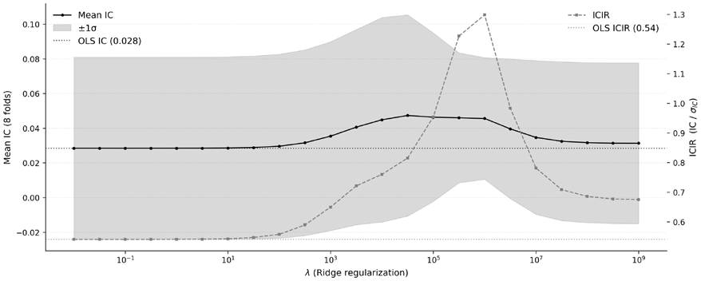
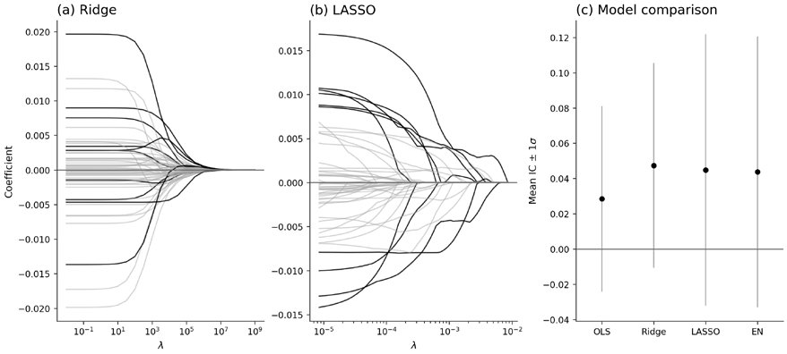
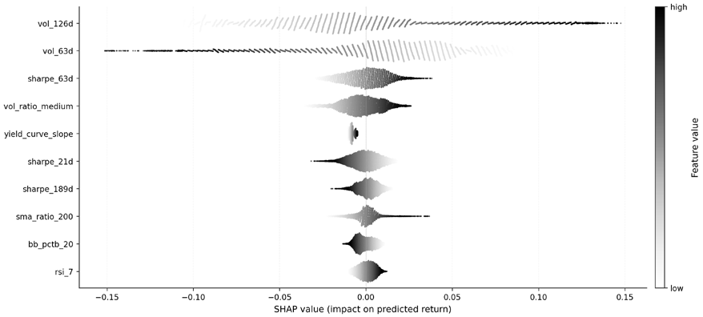
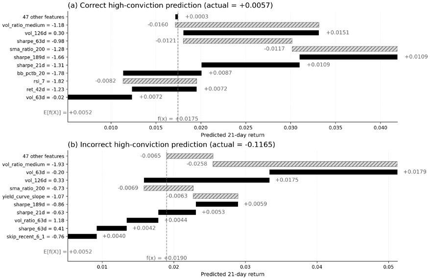
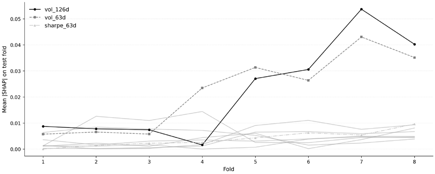
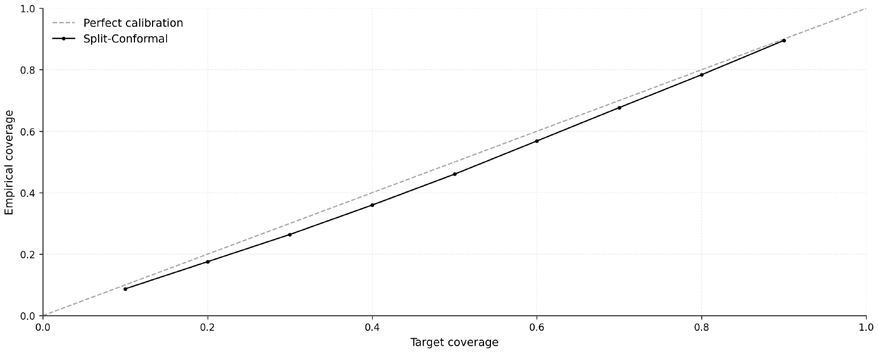
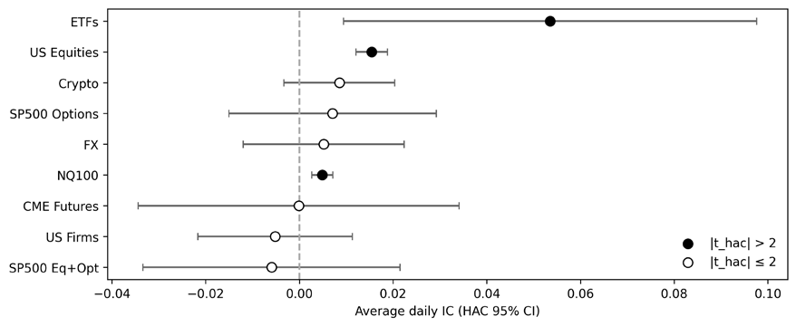
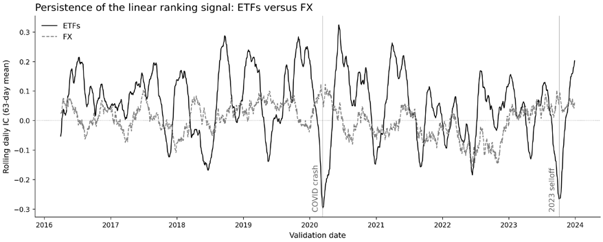
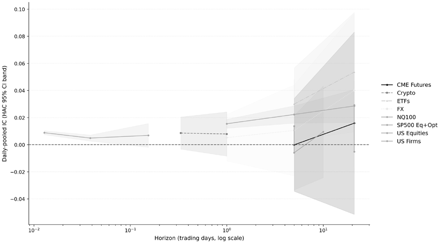

# 第11章：机器学习流水线

前几章在各案例研究中构建了特征，并通过信息系数、因子价差与 *第7章* 的分诊框架评估了它们的预测能力。现在我们迈出下一步：用机器学习把这些特征转化为交易信号。

本章介绍正则化线性模型（Ridge、LASSO 与弹性网络）作为可解释的基线，在 *第6章* 定义的交易框架内引入 ML 信号生成工作流。我们将搭建防止前视偏差的 walk-forward（滚动前推）验证流水线、验证经济学合理性的可解释性工具，以及量化不确定性的共形预测框架——这些基础将贯穿 *第12–15章* 的每一个模型，并在 *第16–19章* 中转化为持仓。

学完本章，你将能够：

- 根据预测结果如何转化为交易决策，在*回归与分类*两种形式之间做出选择。
- 使用时点正确（point-in-time）的预处理与标准化，拟合包括 Ridge、LASSO、弹性网络和逻辑回归在内的正则化线性模型。
- 使用 walk-forward 验证、时间缓冲，必要时辅以嵌套交叉验证来调参与评估线性模型，以降低选择偏差。
- 使用基于 SHAP 的诊断解读模型行为，评估特征重要性、经济学合理性以及跨重拟合的稳定性。
- 构建并评估共形预测区间或预测集，并监控非平稳市场条件下覆盖率在何处退化。
- 利用跨案例研究的证据判断线性模型何时能提供强基线，以及线性信号较弱时何时应转向更灵活的模型。

本章首先说明为什么预测需要正则化，然后介绍线性回归与分类，展示如何用 SHAP 值进行解释，并引入共形预测来量化不确定性，最后给出案例研究的洞见。*第12–14章* 将扩展本章介绍的模型。每一个模型都必须胜过本章的正则化线性基线：一个跑不赢 Ridge 的梯度提升模型只是增加了复杂度，却没有提升预测能力。每个建模章节都会自动加载线性基线，并在候选模型旁报告其改进（或没有改进）。

## 11.1 从推断到预测

经典**计量经济学**（将统计学应用于经济数据）与机器学习以不同目标处理同一份数据。计量经济学问："这些变量之间是什么关系？这种关系在统计上是否可靠？"机器学习问："给定输入，对结果的最佳预测是什么？"本章正是围绕这一预测任务构建线性模型。从推断到预测的转变，改变了估计量的哪些性质更重要，也引出了后文的正则化方法。

### 两种建模文化

Leo Breiman 2001 年的论文《Statistical Modeling: The Two Cultures》将一个长期隐含的区分形式化：

- *数据建模文化*在计量经济学中占主导，它为数据生成过程（DGP）设定一个随机模型并估计其参数
- *算法建模文化*在机器学习中占主导，它把 DGP 视为未知，仅凭模型在未参与建模的数据上的预测精度来评估模型

这一区分与复杂度无关。线性回归可以服务于任何一种文化：用于推断时，它给出系数估计并对其做假设检验；用于预测时，它生成预测，并以样本外误差评估。两者的差别在于*成功标准*。在数据建模文化中，模型成功意味着在设定正确的模型下恢复出可解释且统计显著的参数；在算法建模文化中，模型成功意味着预测得好。正如 Breiman 所言，预测精度应当是检验模型是否捕捉到数据中有意义结构的首要标准。

对算法交易而言，更相关的标准是预测精度——产生稳定、盈利的预测——而不是无偏的参数恢复（Simonian, 2024）。

### 推断需要什么条件

推断框架强大但要求苛刻。**普通最小二乘**（**OLS**）回归（从 CAPM 到 Fama-French-Carhart 等模型背后的估计量）给出的系数估计 β̂ⱼ 在一定条件下是每个特征 xⱼ 对结果真实*其他条件不变*（ceteris paribus）效应的无偏估计。这些条件就是**高斯-马尔可夫假设**，它要求：

- 参数向量 β 具有**线性性**，即函数形式为 y = Xβ + ε
- **严格外生性**：E[ε|X] = 0，即解释变量不包含任何关于误差项的信息（无遗漏变量，也无被解释变量的滞后项）
- **不存在完全多重共线性**，即任何解释变量都不是其他解释变量的精确线性组合，从而 β 可识别
- **球形扰动**：Var(ε|X) = σ²I，即误差具有恒定方差，且在观测之间互不相关

当四条全部成立时，高斯-马尔可夫定理保证 OLS 是**最优线性无偏估计量**（**BLUE**）：在所有无偏线性估计量中，OLS 的方差最小。

线性性与外生性假设要求模型以正确的函数形式纳入正确的变量。当真实 DGP 未知时，这是很强的要求。在金融市场中，DGP 几乎必然包含非线性、市场状态（regime）变化和时变参数。一旦模型设定错误，无偏性保证随之失效，系数估计也难以解释为因果或结构性参数。

在模型设定正确的前提下，假设检验评估的是某个系数是否与零可区分。p 值衡量的是：在原假设（βⱼ = 0）成立时，观察到与实际计算结果同样极端的检验统计量的概率。这对推断有用（判断一个变量与结果之间是否存在统计上可靠的关系），但它并不度量预测能力。一个系数可能高度显著却在经济上微不足道（例如大样本下的微小效应），也可能不显著却在与其他特征结合时具有真实预测力。

OLS 的高斯-马尔可夫最优性定义在无偏估计量类之内。但对预测而言，无偏性本身并非天然可取。真正重要的是总预测误差，它分解为：MSE = Bias² + Variance + σ_ε²

一个引入若干偏差、却大幅降低方差的估计量，可以获得比无偏估计量更低的 MSE，尤其是当特征数量相对于观测数量偏大时。高斯-马尔可夫定理并没有说 OLS 使 MSE 最小；它说的是 OLS **在无偏性约束之下**使方差最小。放松这一约束，便打开了通往更低总误差的路径。

### 为什么预测需要不同的方法

考虑一个策略研究问题：用来自动量、估值和情绪特征族的 100 个特征，基于 240 个月度观测预测下月收益。OLS 可以拟合这个模型；在高斯-马尔可夫假设下，得到的系数估计是无偏的。但**仅凭无偏性并不能保证预测良好**。用 240 个观测估计 100 个参数，估计方差会很大：训练样本的微小变动就会引起 β̂ 的大幅波动，进而引起预测的大幅波动。模型对训练数据拟合得很好（它有足够的自由参数去吸收特异模式），但这些模式无法泛化。

这并不是 OLS 作为推断工具的失败，而是在预测稳定性更重要的场景中，使用了为无偏参数恢复而优化的估计量的必然结果。**OLS 没有以偏差换方差的机制**，因为那样做会损害其在计量经济学中立足的推断保证。以下三点使该问题在金融领域尤为突出：

- **维度相对观测数过高**。随着 p/n 增大，OLS 估计变得不稳定；当 p > n 时，估计甚至没有唯一解。
- **多重共线性**。金融特征普遍相关：动量与趋势重叠，估值比率共享会计科目。OLS 会给相关特征分配随意的权重，产生相互抵消的系数并放大噪声。
- **信噪比低**。横截面收益回归的样本内 R² 通常只有 1%–3%，样本外更低。方差主导 MSE：无约束的模型拟合噪声，而有约束的模型牺牲少量信号来抑制远多于它的伪模式。

**正则化**直接应对这一权衡。它在 OLS 损失函数中加入一个随系数量幅增长的惩罚项，把估计值向零收缩。这会引入偏差（惩罚后的估计不再以真实 β 为中心），但能防止模型给任何特征分配极端权重、或在相关特征之间任意分摊权重，从而降低方差。

惩罚项的形式编码了*关于信号结构的先验*：

- **Ridge**（L2）按比例收缩所有系数，适合信号分散、多重共线性普遍存在的场景
- **LASSO**（L1）把系数压缩为零，在信号集中于稀疏子集时执行自动选择
- **弹性网络**（Elastic Net）兼顾两者，在保留相关特征组的同时仍向稀疏收缩——当动量、趋势和均值回归指标相互重叠时，这是常见需求

这些都是对**偏差-方差权衡**的系统性回应，而非临时修正。调节参数 λ 控制这一权衡，交叉验证则选出使样本外误差最小的收缩程度。*11.2 节*将正式展开每种方法。

*第7章* 定义的标签族（连续收益、阈值化方向、分位数归属）分别对应回归（预测幅度）与分类（预测类别）。具体选择取决于与交易框架及数据的匹配程度。我们先讨论正则化回归，再更实际地讨论分类。

**实现**：`01_ols_inference` 在 ETFs 案例研究上展示了 OLS 汇总表、高斯-马尔可夫诊断全套检验、方差膨胀因子与稳健标准误。

## 11.2 正则化回归

Ridge、LASSO 与弹性网络各自编码了关于信号如何在特征间分布的不同假设。本节给出它们的形式化目标函数、赋予每种方法独特行为的几何直观，以及要在 *第6章* 的 walk-forward 流程中部署它们所需的实操环节（标准化、超参数优化与损失函数选择）。

### 面向分布式信号的 Ridge 回归

**Ridge 回归**在 OLS 目标上加入系数向量的 L2 惩罚：

min_β ∑ᵢ₌₁ⁿ (yᵢ − Xᵢβ)² + λ‖β‖₂²

其中 λ 控制正则化强度，‖β‖₂² = ∑ⱼ βⱼ²。惩罚随系数平方和增大，抑制过大的取值，但从不把任何系数精确压缩为零。闭式解揭示了其中的机制：OLS 的解为 β̂_OLS = (XᵀX)⁻¹Xᵀy；Ridge 的解为 β̂_Ridge = (XᵀX + λI)⁻¹Xᵀy。给 XᵀX 加上 λ 使求逆更稳定，收缩了系数估计，并约束了其方差。λ 为零时，解退化为 OLS；随着 λ 增大，所有系数向零收缩。

几何视角很有启发。对特征矩阵做**奇异值分解**（**SVD**）后，每个奇异值对应特征空间中的一个方向，衡量数据沿该方向展现的方差大小：

- OLS 估计在低方差方向上最不稳定：求逆时的小分母会产生大而嘈杂的系数
- Ridge 在求逆前给每个奇异值加上 λ，从而不成比例地收缩低方差方向上的系数，同时基本保留识别良好的方向（Hastie, Tibshirani, and Friedman, 2009）

实际含义是：由数据中充分变化支撑的强信号只需承受温和收缩即可存活；而识别不佳方向上的弱信号（恰恰最可能是噪声）会被大幅削弱。

这使得 Ridge 非常适合许多特征对信号贡献有限、且多重共线性普遍存在的场景。如果动量、趋势跟踪和相对强弱指标捕捉的是重叠信息，OLS 给出的权重会杂乱无章；Ridge 则保留全部特征，但权重更小、更稳定。`02_regularization_paths` 追踪了不同正则化强度下的 Ridge 系数路径，并与 OLS 基线比较 IC。

*图 11.1：随正则化强度增大，Ridge 在 etfs 上的表现*

*图 11.1* 以 `etfs` 案例研究（21 日收益标签，n≈394,000）为例，追踪惩罚强度 α 跨十个数量级变化时 Ridge 的预测质量：

- 在 α≈100 以下，惩罚可忽略不计，Ridge 与 OLS 无法区分（IC≈0.028、ICIR≈0.54，右侧坐标轴）。
- 在 10³ 到 10⁶ 之间，随着收缩抑制嘈杂的系数方向，IC 与 ICIR 同步改善；α≈10⁶ 处 1.30 的 ICIR 峰值较 OLS 基线提升 2.4 倍，其来源是平均 IC 上升 60%（0.046 对 0.028），同时跨折 IC 标准差下降 33%。
- 平均 IC 更早在 α≈3×10⁴ 处见顶（IC=0.047），此后略有回落，但 IC 方差收缩得更快，因此 ICIR 持续改善，直至 α≈10⁶ 处进入平台期。

### 面向稀疏信号的 LASSO 回归

**LASSO** 将 L2 惩罚替换为 L1 惩罚：

min_β ∑ᵢ₌₁ⁿ (yᵢ − Xᵢβ)² + λ‖β‖₁

其中 ‖β‖₁ = ∑ⱼ|βⱼ|。与 Ridge 不同，L1 惩罚会产生*稀疏*解：部分系数被精确压缩为零，等于自动执行特征选择。这编码了一个先验：信号集中在少数特征上——候选指标中只有少数真正能预测收益，其余都是噪声。

**稀疏性**源于 L1 约束集的几何形状。绝对值惩罚生成一个在坐标轴上带尖角的菱形可行域，OLS 目标函数的等高线通常会与这些尖角相交，使部分系数恰好为零（Tibshirani 1996）。L2 惩罚的圆形约束集没有尖角，这正是 Ridge 只收缩、不归零的原因。

稀疏性有实际吸引力：活跃特征更少，意味着需要维护的数据流水线更少，PnL 归因也更清晰。然而，LASSO **在特征相关时不稳定**。在一组相似的指标中，LASSO 会随机选择其一而把其余置零。哪个指标存活下来会随训练数据的微小扰动而变化，使活跃特征集在 walk-forward 窗口之间不稳定。这种不稳定未必损害预测精度，因为被选中的特征可以作为该组的合理代理；但它会让解释变得复杂，而且如果交易信号依赖于具体哪些特征活跃，还可能推高换手率。

`02_regularization_paths` 中的 LASSO 系数路径展示了随 λ 减小哪些特征最先进入模型，以及活跃集如何在 walk-forward 折间移动（见 *图 11.2*）。

*图 11.2：随着 λ 增大，Ridge（a）将全部 57 个系数平滑地收缩至零，保留所有特征；LASSO（b）依次剔除特征，在不同 λ 阈值处将系数直接压缩为零。图中突出显示了幅值最大的 10 个特征，其余 47 个以灰色显示。面板 (c) 比较 OLS、Ridge、LASSO 与弹性网络的样本外平均 IC（±1σ）。所有面板均使用 etfs 案例研究（21 日收益，单一训练折）的标准化特征。*

对 `etfs` 案例研究而言，LASSO 讲述了与 Ridge 不同的故事：轻微的稀疏化（α≈0.0001）就会把大约四分之一的特征置零，更强的惩罚反而使 IC *低于* OLS；而 α≥0.01 几乎消灭所有系数。

在 57 个相关的动量与波动率特征之下，ETF 信号是弥散分布的：Ridge 的均匀收缩保住了它，而 LASSO 的变量选择在剔除噪声的同时也丢掉了有信息量的特征。

### 用弹性网络结合两种先验

**弹性网络**（Elastic Net）混合 L1 与 L2 惩罚：

min_β ∑ᵢ₌₁ⁿ (yᵢ − Xᵢβ)² + λ[α‖β‖₁ + (1 − α)‖β‖₂²/2]

其中 λ 控制整体正则化强度，α ∈ [0,1] 控制混合比例：α = 1 退化为 LASSO，α = 0 退化为 Ridge。

这一组合产生了独特的分组行为（Zou and Hastie, 2005）。L2 成分促使相关特征获得相近的系数；L1 成分随后进行组级选择，整簇保留或整簇舍弃。对包含大量相关指标的金融特征集（动量变体、重叠的情绪指标、相关的估值比率），这种分组比 LASSO 在簇内的随意选择更稳定，也比 Ridge 全盘保留更有选择性。

Scikit-learn 的 `ElasticNet` 将目标函数参数化为 1/(2n)·‖y − Xβ‖₂² + α[ℓ1_ratio·‖β‖₁ + (1 − ℓ1_ratio)/2·‖β‖₂²]，其中 `alpha` 控制整体惩罚强度，`l1_ratio` 控制 L1/L2 配比（`1.0` 为纯 LASSO，`0.0` 为纯 Ridge）。注意 1/(2n) 的归一化：`ElasticNet` 对损失取平均，而 `Ridge` 使用未归一化的**平方和误差**（**SSE**），因此两者的 `alpha` 数值不可直接比较。入手方式是对一组 `l1_ratio`（例如 0.1、0.3、0.5、0.7、0.9）和一组按对数等距、范围与 n 相称的 `alpha` 做交叉验证（参见下文 Optuna 一节中的量级启发式，注意按 1/(2n) 归一化调整）。若最优 `l1_ratio` 在各 walk-forward 窗口中稳定落在 1.0 附近，说明数据偏好稀疏；落在 0 附近，则说明信号弥散于各特征之间。`l1_ratio` 跨窗口不稳定，反映的则是主导性特征关系的真实变化。此时可以考虑对若干混合比例的预测取平均，而不是选定单一估计值。案例研究流水线执行了这一网格搜索（见各案例研究目录下的 `06_linear`）。

### 标准化

正则化惩罚对所有系数一视同仁，而原始系数的大小取决于特征的计量单位。以百分点计的动量信号与以百万股计的成交量指标，量级天差地别。不做标准化时，惩罚会对大尺度特征收缩得更狠，这一结果由单位选择而非预测重要性驱动。将每个特征标准化为零均值、单位方差：

x_j^(std) = (x_j − μ_j) / σ_j

标准化之后，系数量幅可以直接比较：标准化动量上的系数 0.3 与标准化成交量上的系数 0.1，意味着模型给动量的权重是成交量的三倍，与原始量纲无关。

两个实现细节至关重要：

- **只用训练数据拟合。** 从训练折计算 μⱼ 与 σⱼ，再用这组参数去变换验证集和测试集。使用全样本矩会引入前视偏差。在 walk-forward 流程中，每次重新拟合都要重算标准化参数。
- **先缩尾（winsorize），再标准化。** 单个极端观测会推高 σⱼ，把其他所有观测压缩到零附近。标准化前，先按训练数据计算的第 1 和第 99 百分位做截断。

这两类错误（矩信息泄露与跳过缩尾）都是无声的：不会报错，但模型因此利用了预测时点尚不可得的信息。

`02_regularization_paths` 中的 walk-forward 流水线在每一折上都使用只以训练数据拟合的 `StandardScaler`，落实了这里描述的无泄露工作流。

### 用 Optuna 进行超参数优化

Ridge、LASSO 与弹性网络各自引入了控制偏差-方差权衡的超参数（正则化强度；弹性网络还有混合比例）。对预先设定的网格做搜索适用于一两个参数，但难以扩展到联合优化，也无法适应损失面的形状。

Optuna（Akiba et al. 2019）通过 define-by-run API 提供**基于模型的序贯超参数优化**：目标函数从指定分布中采样参数、评估 walk-forward 交叉验证表现，Optuna 的**树结构 Parzen 估计器**（TPE）采样器则引导后续试验走向搜索空间中有希望的区域。

关键风险是**验证过拟合**：在同一组验证折上运行大量试验，可能选出的超参数利用的是验证期的特异之处，而非可持续的信号。嵌套交叉验证（内层做超参数优化、外层做评估）是最干净的纠正手段，代价是计算量上升。对时间序列而言，同样的原则要求嵌套 walk-forward 验证：每一层外层 walk-forward 分割都要等到在对应训练窗口内完成调参之后再评估（见 *第6章*）。

一个有用的诊断是查看验证 IC 的完整分布、试验排名在各折之间的稳定性，以及所选试验 IC 周边的不确定性。若某个最优试验大幅领先于其余搜索结果，但其优势来自单一折、单一市场状态或某个随机种子中的离群值，这就是警示信号。应报告试验次数、搜索空间、选定的超参数，以及所选配置在折层面的离散度。*第12章* 将针对梯度提升更大的超参数空间，介绍 Optuna 的高级特性（剪枝、多目标优化与时间序列感知调参）。

在启动自适应搜索之前，搜索空间必须经过校准，覆盖实质性不同的模型状态。

这一点对正则化强度尤其重要，因为惩罚项的数值尺度取决于估计量的损失约定与特征缩放。在特征已标准化的情况下，`sklearn.Ridge` 使用未归一化的平方和目标函数，因此对解有实质影响的 alpha 值往往通过 XᵀX 的特征值随样本量而变化；相比之下，`sklearn.ElasticNet` 对损失按观测取平均，吸收了一个 n 因子。两种约定之间换算时，可比的惩罚值大致相差这一因子。

在 ETF 案例研究中，约有 400,000 个观测，若 Ridge 搜索止步于 λ = 10²，就基本只探索了接近 OLS 的区域，可能错误地暗示正则化没什么作用。因此 notebook 将搜索范围放宽到 10⁻² 至 10⁹，同时覆盖正则化不足的平台区和强正则化状态。

**实现**：`04_nested_cv_hpo` 在各 walk-forward 折上将 λ 从 10⁻² 扫到 10⁹。平均 IC 在大部分区间内轻微为负，在 λ = 10³ 附近触底于 −0.039，随正则化收紧单调回升，直到 λ = 10⁷ 才转正，并在搜索区间顶部达到 ≈+0.007 的含噪峰值。折层面的标准差在整个网格上大致在 0.04 到 0.10 之间，远大于跨 λ 的均值变化，说明整个曲面由噪声主导。notebook 随后用 Optuna 实现了单层与嵌套两种交叉验证，量化了选择偏差造成的虚增（Cawley and Talbot, 2010）。

当底层信号很弱时，两种流程的差异恰恰在偏差最要命的地方显现。此处它大到足以翻转报告的符号：单层 CV 报出 +0.028 的正平均 IC，而嵌套 CV 在完全相同的分割上返回 −0.032。我们首先以单个超参数（Ridge λ）为例演示这些原则；*第12章* 将扩展到多个超参数的联合调优。

**专栏 11.1：增量更新**

上述 walk-forward 流程在每次重新拟合时都从头训练。对 Crypto（8 小时）和 NASDAQ-100（分钟 bar）这类高频案例研究，完整重训的计算代价高昂。

Scikit-learn 的 `SGDRegressor` 和 `SGDClassifier` 支持用 `partial_fit` 做增量更新：喂入一小批新观测，通过一步梯度更新系数，而不必重新求解完整的优化问题。这是在线部署最快的方式，但对学习率调度敏感，且若不做周期性的完整重训，系数可能漂移。*第25章* 将为实盘交易系统展开完整的在线学习框架。

### 损失函数的选择

上述正则化项默认通常与**均方误差**（**MSE**）搭配，标准 Ridge 与 Lasso 回归尤其如此。但惩罚项并不要求 MSE：当别的目标（如中位数、稳健的中心趋势或尾部分位数）更契合交易目标时，可以把同样的正则化思想与其他损失函数结合。

若目标是估计收益分布的条件均值，MSE 是自然选择，但条件均值未必是正确的目标：

- **MSE** 对误差二次惩罚，迫使模型迁就那些可能反映特异事件而非系统性模式的极端观测。
- **平均绝对误差**（MAE）线性惩罚，估计的是条件*中位数*而非均值。由于离群值对中位数的影响远小于对均值的影响，当少数大幅波动主导数据时，MAE 给出更稳定的系数。
- **Huber 损失**在阈值 δ 处从小误差的二次形式（似 MSE）过渡到大误差的线性形式（似 MAE）；δ 可作为调参参数，也可按残差离散度的稳健估计来缩放。它在典型观测上保留 MSE 的效率，同时限制离群值的影响（Huber, 1964）。

三种损失估计的都是条件收益分布的位置参数。Scikit-learn 的 `SGDRegressor` 提供统一接口：`loss='squared_error'`、`loss='epsilon_insensitive'`（MAE 的替代）与 `loss='huber'` 接受相同的正则化惩罚和 `sample_weight` 参数。`02_regularization_paths` 在最优 Ridge alpha 下比较三者，从而隔离损失函数对 IC 的影响。

**分位数回归**则完全改变了估计对象——预测指定的分位数而非中心趋势。如果多空策略只交易最高和最低十分位，条件均值就是错误的目标：模型的大部分能力会耗在区分那些永远不会被交易的资产上。*11.5 节*将以分位数回归为基础发展共形化预测区间。

### 评估回归模型

训练损失决定模型优化什么；评估指标决定我们如何评判结果。合适的指标取决于预测如何映射到交易：

- **信息系数（IC）。** 预测收益与实际收益之间的 Spearman 秩相关，是生成排序信号的横截面模型的首要指标。IC 刻画单调关联，不依赖线性假设。一般地，变异系数是某一指标的均值与标准差之比；对 IC 而言，这一度量也称 **IC 信息比率**（**ICIR**；见 *第7章*）。
- **RMSE 与 MAE。** RMSE（MSE 的平方根）衡量预测误差的标准差；MAE 衡量平均绝对误差，对离群值不那么敏感。两者都适合在同一数据集和标签定义下做模型间的相对比较，但都没有判断"表现好"的绝对阈值：相关基准永远是一个朴素模型，例如预测横截面均值的模型。
- **换手率。** 没有哪个统计指标能度量可交易性：一个 IC 提升 20% 但换手率增至三倍的模型，在计入交易成本后净表现可能变差。每项指标都应连同换手率一起报告。*11.6 节*在全部九个案例研究上实证考察了这一权衡；*第17章* 将形式化经换手率调整的评估框架。

由于 IC 度量的是全局排序质量，只交易极端部分的策略还应跟踪五分位或十分位价差，以确认排序精度确实转化为交易尾部的区分度。

**实现**：`02_regularization_paths` 在 `etfs` 案例研究上报告全部四类模型的 IC、RMSE 与 R²。同一测试数据上预测排序的稳定性——以相邻窗口训练的模型所得横截面排序之间的相关性衡量——可诊断信号对重训的稳健性；`02_regularization_paths` 对 Ridge 计算了所有折对的这一指标。

### 样本加权

大多数 scikit-learn 估计器都接受 `sample_weight` 参数，允许各观测对损失函数的贡献不同。*7.2 节*的两种加权方案可直接套用：

- **唯一性加权**（`w_{t,A}`＝平均逆并发度）：在使用 *第7章* 定义的 H̄ 标签时修正标签重叠。重叠标签违背了平方和误差目标中隐含的独立性假设；下调高并发度观测的权重可部分缓解这一问题。
- **近期性加权**（`w_t` = e^(−λ(T−t))）：赋予近期观测更大影响力，使模型适应市场状态演化。衰减率 λ 控制有效回看窗口。

两者可相乘组合：`w_{t,A}^combined` = `w_{t,A}^uniqueness` · `w_t^recency`。有效样本量 `N_eff` = ∑`w_{t,A}^combined` 应与性能指标一同报告。`N_eff` 相对名义样本量偏小，说明少数观测主导了拟合，过拟合这些观测的风险上升。

**实现**：`02_regularization_paths` 在最后一个 walk-forward 折上展示了带指数衰减的近期性加权，并报告有效样本量。

### 训练损失与交易目标

如果 MSE 的改善来自拟合横截面的中段（永远不会被交易的资产）或来自换手率上升，模型完全可能在降低 MSE 的同时损害 PnL。因此我们严格区分*模型选择*（无泄露 walk-forward 流程内的验证损失与排序指标）与*策略评估*（经换手率和成本调整的收益，*第18章*）。没有这条边界，样本内的统计改进就会冒充交易价值。下面转向另一类侧重方向或极端行情的预测任务。

## 11.3 用逻辑回归预测方向

上一节把标签当作连续收益处理。但许多交易场景基于离散决策（做多、做空或持平），而 *第7章* 定义的标签族也包括二元涨跌标记、三类方向标签和分位数归属。对这类场景，直接预测离散结果的分类模型是自然选择，逻辑回归则是其中的正则化基线。

分类并非在一切情形下都优于回归。当收益不对称时，方向预测可能与 PnL 脱节：一个方向正确率 55%、却系统性地错过大幅行情的模型，可能跑输一个能捕捉尾部幅度的回归模型。

选择应遵循 *第7章* 定义的*信号-交易映射*。如果映射通过阈值或分位数规则把预测转化为仓位，分类便顺理成章，因为模型直接优化了真正重要的决策。如果映射按预测收益等比缩放仓位规模，回归则保留了被分类丢弃的幅度信息。不过归根结底，哪种方法在具体案例中更有效是实证问题。

### 二分类逻辑回归

逻辑回归对结果属于正类的概率建模：

P(y = 1 | X) = 1 / (1 + e^(−Xβ)) = σ(Xβ)

其中 σ(⋅) 是 sigmoid 函数，把任意实值线性组合映射到 (0,1) 区间。模型通过最大化观测标签的**对数似然**来学习 β，等价于最小化预测概率与观测结果之间的**交叉熵**（对数损失）。

与线性回归的关键区别在于，逻辑回归给出的是*概率估计*而非收益的点预测。预测值 0.65 意味着在拟合出的逻辑回归设定下，模型认为上涨的概率是 65%。这一解释由对数损失目标保证：在总体层面，使交叉熵最小的正是真实条件概率 P(y = 1 | X)，前提是模型类足够丰富且数据生成过程稳定。

然而在实践中，由于设定偏差、有限样本、正则化、类别加权、重采样、标签噪声或分布漂移，拟合出的概率*未必校准良好*。因此输出应视为概率估计，而不能自动当作经校准的经验频率。在把这些概率用于风险调整的仓位规模（本节后文讨论）之前，可能需要校准诊断或事后校准。

每个系数 βⱼ 表示 xⱼ 每变动一个单位时对数几率（log-odds）的变化。标准化之后，动量上的系数 0.5 意味着动量每上升一个标准差，上涨的对数几率提高 0.5。基准概率为 50% 时，预测概率变为 σ(0.5) ≈ 62%；基准概率为 90% 时，同样的对数几率提升使预测概率变为约 94%。可见以概率点计的效应并非常数：**系数是对数几率尺度上的线性量**，而非概率尺度上的线性量。

分类标签把收益幅度压缩成类别：50% 的收益和 2% 的收益都算"涨"。这既是优势也是局限。它防止极端观测主导损失函数（回归中的 MSE 正会如此），从而在厚尾存在时给出更稳定的系数估计；但它丢弃了有价值的幅度信息。当交易决策是二元的（做多或做空）时，权衡可能偏向分类；当仓位规模随预测幅度变化时，则偏向回归。

**实现**：`03_logistic_classification` 在 ETF 数据上完整追踪了 walk-forward 二分类逻辑回归流水线，包括标签构造和下文的 L2/L1 正则化扫描。

**多分类扩展。** 二分类模型可通过**多项逻辑回归**（**softmax**）扩展到 K 个类别。对做多 (+1)、中性 (0)、做空 (−1) 的三类标签，模型估计：

P(y = k | X) = e^(Xβₖ) / ∑ⱼ₌₁ᴷ e^(Xβⱼ)

每个类别拥有自己的系数向量 βₖ，各类概率之和为一（scikit-learn 中为 `multi_class='multinomial'`）。中性区过滤掉零收益边界附近的观测，降低标签噪声；但每增加一个类别都要新增一整套系数向量，参数量大约增至 K 倍。

对只交易极端部分的分位数策略，二元框架（最高十分位对最低十分位，舍弃中间）通常比还要学习中间类别的多分类模型更高效。

**正则化。** *11.2 节*的 L1、L2 与弹性网络惩罚在形式上原样适用，只是加在负对数似然而非残差平方和上：

min_β −∑ᵢ₌₁ⁿ [yᵢ log σ(Xᵢβ) + (1 − yᵢ) log(1 − σ(Xᵢβ))] + λ‖β‖₂²

Scikit-learn 的 `LogisticRegression` 使用 C = 1/λ（C 越大正则化越弱），由 `penalty` 和 `l1_ratio` 控制惩罚类型。*11.2 节*的全部建议在此照搬适用。正则化在这里比在回归中更关键：当类别完全可分或接近可分时，最大似然目标会发散。在 p 逼近 n 的高维特征空间中，几乎总能找到一个分离超平面，把系数推向 ±∞，产生任意自信却在样本外失效的预测。正则化约束系数有界、保证解有限——这是 OLS 不必担心的问题，因为只要 XᵀX 可逆，OLS 就有闭式解。

### 概率校准

在设定正确时，逻辑回归在构造上就是校准的：若模型对一组观测给出 P(y = 1 | X) = 0.7，其中约 70% 的观测会有 y = 1。实践中，两种力量会扭曲这种对应关系：

- **正则化**系统性地把预测概率向基础概率（base rate）压缩。系数向零收缩会拉平 sigmoid 曲线，把极端预测拉向 0.5。这是一种可预期的方向性扭曲：模型的预测变得系统性信心不足。
- **设定偏差**带来的扭曲则较难预料。若真实决策边界是非线性的而模型是线性的，校准会以取决于具体设定偏差形式的方式失效。

当仓位规模依赖于预测概率水平时，校准至关重要：如果概率 0.7 触发的仓位大于 0.6，概率校准失准就会直接转化为资金错配：

- **Platt 缩放**（在留出数据上对模型原始输出拟合一个逻辑函数）可修正正则化造成的系统性压缩。
- **保序回归**（拟合非参数单调函数）能处理更复杂的校准失准模式，但需要更多数据才能可靠估计（Niculescu-Mizil and Caruana, 2005）。

两者都必须使用未参与训练的数据：walk-forward 流程中的验证折正可胜任。Scikit-learn 的 `CalibratedClassifierCV` 将这一流程自动化。

把预测按预测概率分桶（例如 [0.5, 0.55)、[0.55, 0.6)、…），计算每桶内的准确率。若命中率随预测概率偏离 0.5 而单调上升，说明置信度校准良好；非单调模式（高置信预测反而不如中等置信预测）则提示过拟合或设定偏差。

对基于阈值和基于排序的信号生成而言，校准不那么关键，因为起作用的只是预测的*排序*。在为校准投入精力之前，先判断信号-交易映射依赖的是概率水平还是仅依赖排序。

**实现**：`03_logistic_classification` 为 walk-forward 预测绘制校准曲线，并与完美校准对比。

### 从概率到交易信号

从预测概率到仓位的转换应当与 *第7章* 定义的交易框架匹配。常见做法包括：

- **基于阈值**：P(y = 1 | X) > τ_upper 时做多，P(y = 1 | X) < τ_lower 时做空，否则持平。阈值控制选择性：τ_upper = 0.6、τ_lower = 0.4 是常见起点，但最优值取决于交易成本与基础概率。非对称阈值可容纳多空头寸成本不对称的情形。
- **概率加权**：仓位规模与预测概率到 0.5 的距离成比例，表达分级的信心。这要求概率经过校准：若模型系统性低估信心（正则化往往如此），仓位将系统性低于真实信号所对应的水平。
- **基于排序**：在横截面上按预测概率给资产排序，做多最高十分位、做空最低十分位。这保证持仓数量固定、与概率分布无关，只依赖排序，因而对校准失准稳健。

阈值与分位数切点只能使用决策时点可得的信息：walk-forward 流程（*第6章*）通过在每个训练窗口内重新计算它们来强制这一点。**实现**：`03_logistic_classification` 在同一折上比较三种转换方法，结果显示相同的预测会产生差别显著的组合。*第16章* 将在完整回测中扩展这一比较。

### 处理类别不平衡

预测稀有事件（超过两个标准差的 5% 股票，或非对称阈值标签中的少数类）时，少数类对对数似然的贡献微乎其微。模型会给所有观测都预测多数类，以此最小化损失——准确率很高，却不产生任何交易信号。

**类别加权**按各类频率的倒数缩放其损失贡献，确保少数类错误按比例承担更大权重。Scikit-learn 的 `class_weight='balanced'` 自动计算这些权重。它并不改变决策边界在特征空间中的位置，只是调整优化器对两侧错误惩罚的力度。`03_logistic_classification` 在最后一折比较了默认加权与平衡加权，确认当两类大致均衡时影响有限。把类别权重与 *11.2 节*的唯一性权重和近期性权重结合使用时，要监控 `N_eff`：若骤降至名义样本量以下，说明少数观测主导了拟合。当少数类观测集中在危机时期时，这种风险尤其突出。应确认重新加权后的训练集覆盖多种市场条件，而非集中于单一市场状态。

### 评估分类模型

分类评估需要与输出的概率性、离散性相匹配的指标。与回归（*11.2 节*）一样，合适的指标取决于预测如何映射到交易：

- **AUC（ROC 曲线下面积）** 衡量在所有可能分类阈值下排序的质量。AUC 为 0.5 表示随机排序；在信噪比很低的金融应用中，0.55–0.60 即代表有意义的预测能力。样本外金融数据上高于 0.65 的值则值得警惕：可能意味着数据泄露，或评估窗口恰好与一段强趋势重合。
- **精确率与召回率。** 精确率（预测为正中真正为正的比例）防止无效交易；召回率（真正为正中被预测出的比例）防止错失机会。二者的权衡取决于成本：交易成本高时偏重精确率（更少但更准的交易）；受容量约束的策略偏重召回率（抓住所有可得机会）。F1 分数兼顾两者，但对二者等权，未必反映经济上的权衡。
- **对数损失。** 如果信号-交易映射使用概率水平而非排序，对数损失直接评估概率估计的质量。它对自信满满的错误预测惩罚极重，因此在对校准敏感的场景中是 AUC 的有益补充。Brier 分数（预测概率与二元结果之间差值的均方）提供了另一个对校准敏感的互补指标。
- **换手率。** 与回归一样，每项分类指标都应连同换手率一起报告。通过移动决策边界（改变每期交易哪些资产）来提升 AUC 的模型，可能把换手率推高到策略无法承受的水平。

至此我们已熟悉最流行线性模型的内部机制，接下来细看模型可解释性。

**实现**：`03_logistic_classification` 在 ETF 案例研究上展示了完整工作流。各案例研究的 notebook 在全部九个数据集上同时应用回归与分类流水线。

## 11.4 用 SHAP 解释模型

一个能预测收益却解释不了原因的模型，价值有限。弄清哪些特征在驱动预测（以及这些关系是否符合经济逻辑），才能区分稳健信号与虚假的曲线拟合。**SHapley Additive exPlanations**（SHAP）是主要的可解释性框架，作为持续性诊断嵌入 walk-forward 流水线。

可解释性的理由立于三根支柱：

- **诊断**：模型在生产环境中失效时，你需要知道原因。一个突然跑输的 Ridge 模型，可能是在应对某次改变了动量计算方式的供应商数据迁移，也可能是动量溢价真实衰减。对近期预测与历史预测做 SHAP 对比即可区分这两种情形。
- **经济学合理性检验**：动量特征理应对高动量股票正向贡献；波动率特征理应反映预期的风险-收益关系。当归因与既有理论相悖时，模型更可能是在拟合噪声而非捕捉信号。
- **治理**：SR 11-7（美联储）与 SS1/23（英格兰银行）等模型风险框架要求机构理解并论证算法输出。即便没有监管义务，"模型就是这么说的"也解释不了一次回撤。

对标准化的线性模型而言，系数量幅看似捷径，实则不然：收缩使重要性与惩罚强度纠缠在一起，相关特征之间的贡献会随惩罚类型而拆分或互相抢功，而且系数解释无法推广到线性模型之外。

SHAP 提供了一套统一的归因语言：它能剥离正则化带来的扭曲，在相关特征之间公平分摊贡献，并可原封不动地延伸到树模型（*第12章*）与深度学习（*第13章*）。

### SHAP 的博弈论归因

SHAP 建立在合作博弈论的 **Shapley 值**之上，后者衡量每个参与者对结果的贡献。在这里，"参与者"是特征，"收益"是单个预测与模型平均预测（基线）之间的差距，要回答的问题是：每个特征各贡献了多少，把这个预测从基线上拉开？

特征 j 的 *Shapley 值* 是其在特征所有可能进入模型的顺序上的边际贡献平均：

φⱼ = ∑_{S⊆F∖{j}} [|S|!(|F|−|S|−1)! / |F|!]·[f(S ∪ {j}) − f(S)]

其中 F 是完整特征集，S 遍历不含 j 的子集，f(S) 表示在只知道 S 中特征时的期望预测。

Shapley (1953) 证明了这是**唯一满足四条公理的分配方案**：

- 效率性：各归因之和恰好等于预测值减基线
- 对称性：贡献相同的特征获得相同的贡献
- 零参与者：无关特征的贡献为零
- 线性性：模型之和的归因等于各模型归因之和

Lundberg and Lee (2017) 在此框架下统一了 **LIME**、**DeepLIFT** 与经典 Shapley 回归，证明 SHAP 是唯一同时满足全部四条公理的可加归因方法。

**高效计算。** 精确计算需要评估 2^|F| 个子集，对现实规模的特征集并不可行。模型特定的算法使计算变得可行：

- **LinearSHAP** 利用线性模型的闭式解：φⱼ = βⱼ·(xⱼ − E[xⱼ])（在训练集上计算）。它精确且对每次观测的复杂度为 O(|F|)，是本章的正确选择。
- **TreeSHAP**（*第12章*）与 **KernelSHAP**（*第13章*）将该框架扩展到非线性模型。

**实现**：`05_shap_analysis` 在 ETF 案例研究上端到端演示 LinearSHAP，包括验证 SHAP 值与闭式系数归因一致。

### 全局与局部分析中的实际应用

SHAP 同时支持全局视角（跨所有预测汇总的特征重要性）与局部视角（把单个模型得分分解到各特征的贡献）。

#### 全局特征重要性

SHAP 摘要图按所有测试观测上的平均 |φⱼ| 对特征排序。每个点代表一个观测的 SHAP 值，颜色对应其特征取值。该图揭示哪些特征最重要、影响方向如何，以及重要性是一致的还是条件性的。

在 `etfs` 案例研究中，波动率期限占据了排名前列：六个月波动率（`vol_126d`）贡献最大，特征值与 SHAP 值呈正相关；三个月波动率（`vol_63d`）重要性居次，方向却相反。风险调整收益紧随其后（`sharpe_63d`，正向），然后是 `vol_ratio_medium` 与 `yield_curve_slope`。SHAP 重要性可能与系数排序不同：一个系数中等、但在有信息量的观测处取值波动很大的特征，其平均 |φⱼ| 可以高于系数更大、取值更稳定的特征。*图 11.3* 展示了 ETF 案例研究的蜂群摘要图。

*图 11.3：etfs 最重要的 20 个特征的重要性*

#### 局部解释

**瀑布图**把单个预测从基线到最终值逐特征分解。对一只高确信度的股票：基线 0.5% → 动量加 +0.8% → 均值回归减 −0.3% → 波动率加 +0.2% → 最终预测 1.4%。由此可以进行两项检查：

1. *归因审计*：超额表现是由可信特征还是可疑特征驱动（例如反映数据陈旧的流动性不足代理变量）？
2. *集中度风险标记*：被单一特征主导的预测是脆弱的。实践中，对单一特征占总 |φⱼ| 超过某一阈值的预测做标记，可作为触发人工复核或降低仓位规模的自动警报。*图 11.4* 对比了一次正确的高确信度预测（归因分散在十个特征上）与一次错误的预测（单一流动性代理特征承载了模型的大部分确信度）；右图面板的模式正是集中度风险标记要捕捉的对象。

*图 11.4：`etfs` 案例研究（Ridge，21 日前瞻收益）中两个高确信度预测的 SHAP 瀑布分解。两个预测的预测幅度均位于前 5%。面板 (a)：一次正确的判断，十个特征的贡献大致均匀，预测反映了分散的证据。面板 (b)：一次错误的判断，仅 `vol_63d`（成交量比率）就贡献了 +0.018，而实际收益为 −11.7%*

**实现**：`05_shap_analysis` 包含正确与错误高确信度预测的瀑布分解。

#### 特征依赖关系

SHAP 依赖图展示一个特征的 SHAP 值如何随其自身取值变化，并按某个交互特征着色。对线性模型而言，这一关系在构造上是线性的，但该图仍可用于检验符号一致性与离群行为。

对基于树的模型与神经网络（*第12章* 与 *第13章*），依赖图能揭示系数表里看不见的阈值效应、饱和现象与交互结构。

### 构建经济学叙事

SHAP 对系统化投资的首要价值在于认知层面：它提供了一套区分真实信号与过拟合的结构化规程，分为四层：

- **符号一致性**：每个特征的贡献是否符合预期符号？一个与所有已记载因子关系都背道而驰的模型，几乎可以肯定是在拟合噪声。
- **量幅合理性**：在月度收益中位数为 0.8% 的标的池中，单一特征暗示 5% 的月度收益贡献？若然，模型就是在做外推。
- **跨 walk-forward 窗口的稳定性**：逐折计算 SHAP 值，跟踪同样的特征是否稳居前五、符号一致、量幅稳定。把平均 |φⱼ| 按时间绘制出来就是"SHAP 稳定性图"，是最有信息量的验证诊断之一（*图 11.5*）。
- **状态条件分析**：按波动率三分位或市场状态标签（*第7章*）划分测试数据，并在每个分区内部计算 SHAP 汇总。一个在不同状态下从动量切换到均值回归的模型可能在经济上说得通，但前提是状态识别本身足够稳健。

一点细化：SHAP 排名的折间波动把时间上的状态切换（有意义）与有限样本估计噪声（无意义）混在了一起。在单一折内对 SHAP 值做自助法（bootstrap），可以为特征重要性给出置信区间，把两种来源分开。

*图 11.5：跨折的 SHAP 稳定性*

一项补充诊断比较方向判断正确与错误的高确信度预测的 SHAP **画像**。模型在错误预测上高度依赖的特征（以错误案例与正确案例的平均 |φⱼ| 之比衡量，或以平均带符号 SHAP 的大幅方向差异衡量），是特征重构或非线性建模的候选对象。这种对错对比分解直指对 PnL 最要紧的预测。

### 局限性与失效模式

*因果误读*是主要风险。特征 j 的 SHAP 值高，只说明它对*该模型的预测*有贡献，并不意味着它导致了收益。像 `obv_zscore_63d` 这样 SHAP 重要性很高的特征，可能反映真实的预测力，也可能反映与某个遗漏预测变量的相关，或流水线中的混杂。Kumar et al. (2020) 形式化了基于 Shapley 的解释在特征相关或被因果解读时如何误导。SHAP 应当用于描述性归因（"模型在回应什么？"），而不是因果论断。

*特征依赖*与*不可能联盟*也是重要问题。标准 SHAP 独立地对缺席特征做边际化，当特征相关时会产生不可能的特征组合。对线性模型这尚可控制；对非线性模型，Aas et al. (2021) 提出的**条件 SHAP** 要求估计条件分布。

**置换重要性**与 LIME 缺少 SHAP 的公理化保证：置换重要性会夸大相关特征的得分；LIME 的归因之和未必等于预测值。

### 与 walk-forward 流水线的集成

跨折的 SHAP 稳定性图与 IC、覆盖率指标并列，充当模型选择工具，为模型学到了稳定且经济上合理的关系提供定性证据。`05_shap_analysis` 中的 SHAP 稳定性图跟踪最重要特征在所有 walk-forward 折上的平均 |φⱼ|。定量门槛全过、SHAP 模式却不稳定或不符合经济逻辑的模型，无论报告业绩如何，都值得怀疑。

**实现**：`05_shap_analysis` 在 walk-forward 框架内实现 SHAP 计算，包括摘要图、瀑布分解以及高确信度预测的对错诊断对比。*11.5 节*将从解释单个预测转向为预测划定边界：如何给每个预测附加经校准的不确定性。

## 11.5 量化预测的不确定性

点预测是不完整的，因为它抹去了估计可靠性方面的信息。在交易中这一点直接相关：同一个预测收益，随着不确定性不同，可能意味着完全不同的决策。

设想一个为两只 ETF 都预测出 2% 收益的 Ridge 回归模型。对第一只 ETF，当前特征值位于训练分布的中心附近；对第二只，波动率已飙升、流动性已恶化，若干特征处于历史极端水平。点预测相同，第二个预测却不可靠得多。把两个预测当作同等可信的输入送入投资组合构建，会夸大第二个信号的精度。

经典**预测区间**依赖的假设在金融数据中相当脆弱。形如 ŷ ± z_{α/2}·σ̂ 的高斯区间，前提是能估计出有效的残差尺度，并显式或隐式地依赖近似正态、同方差的误差。资产收益却呈现厚尾、波动率聚集、非线性残差离散和状态依赖。预测周围的不确定性很少在资产、期限或市场状态之间保持恒定。

**共形预测**提供了一种与模型无关的替代方案。它相当于叠加在现有预测模型之上的一层校准。拟合基模型之后，我们在留出的校准集上评估其预测误差，并利用这些误差的经验分布为未来观测构造预测区间或预测集。由于该流程使用的是实际观测到的预测误差而非参数化误差模型，它不要求残差正态、同方差，也不要求似然设定正确。

形式化保证背后的关键假设是**可交换性**。若一个观测序列的联合分布不因重新排序而改变，则它是可交换的。独立同分布的观测是可交换的，但可交换性弱于独立性。这一假设之所以重要，是因为共形预测依赖于下一个观测的校准得分在已有得分中的排名。若校准得分与下一个测试得分可交换，未来得分占据任何排名的可能性都相同，由此得到有限样本的边际覆盖率。

在可交换性之下，共形预测给出有限样本的**边际覆盖率保证**。例如，90% 的共形区间在重复抽样下至少有 90% 的次数包含实际结果。该保证与分布无关：不依赖基模型是否正确、收益分布的形状或样本量。但它只是边际保证，并不意味着每个资产、每一折、每种波动率状态或每个预测收益分桶内的覆盖率都恰好是 90%。

金融时间序列并不严格可交换，因为顺序本身携带信息。自相关、波动率聚集、流动性变化与结构性突变，都意味着一个时期的校准残差未必能代表下一个时期。共形预测在这种环境下依然有用，但定理不再机械地保证覆盖率。因此，在金融应用中，共形区间应被视为经实证校准的不确定性估计，其覆盖率必须持续监控、压力测试并随时调整。

### 分割共形预测

最简单的实用变体是分割共形预测（split-conformal prediction；Papadopoulos et al., 2002; Lei et al., 2018）。它把模型拟合与不确定性校准分开：

1. **划分数据。** 把可用的训练观测分为合适的训练集（proper training set）与校准集。合适的训练集用于拟合模型和选择超参数；校准集必须保持不动，直到用拟合好的模型评估不确定性校准时才动用。
2. **计算校准得分。** 对每个校准观测 i 计算一个非一致性得分（nonconformity score）。对对称的回归区间，常用得分是绝对残差：sᵢ = |yᵢ − f̂(xᵢ)|。这些得分估计模型样本外预测误差的经验分布。
3. **计算共形分位数。** 设 n_cal 为校准观测数，并设 s(1) ≤ s(2) ≤ ⋯ ≤ s(n_cal) 为排序后的校准得分。对目标失误覆盖率 α，定义：

   k = ⌈(n_cal + 1)(1 − α)⌉

   共形校正就是保守次序统计量 q̂ = s(k)。这相当于取较高的经验分位数而非插值分位数。若 k > n_cal，说明校准集太小，无法在目标覆盖率下给出有限的共形分位数。
4. **构造预测区间。** 对新观测 x，分割共形区间为：

   

该区间对每个观测都有固定宽度 2q̂。这种简单性很有用：分割共形易于实现、易于审计，且对基模型的设定偏差稳健。它的局限同样清楚：区间宽度无法随市场状态、资产或特征配置而变化。波动率飙升时做出的预测与平静状态下做出的预测，得到同样的残差校正。

在校准观测与下一个测试观测可交换的条件下，分割共形预测提供**有限样本边际覆盖率**：

只要校准集未用于拟合或调优被校准得分的模型，该保证对任意拟合的基模型、任意结果分布都成立。它是边际保证：在未来观测的联合分布上取平均，不保证在特定日期、资产、波动率状态、行业或信号强度分桶等条件下的覆盖率正确。

**实现**：`06_conformal_prediction` 在 ETF 案例研究上用 Ridge 回归实现分割共形预测。

#### 可交换性问题

可交换性假设在金融时间序列中很脆弱。观测的顺序携带信息：波动率聚集、相关性变化、流动性波动、市场状态切换。随机置换日度收益或横截面残差会破坏数据生成结构的一部分。因此，共形保证背后的排名论证不再严格适用。昨天的校准残差未必能代表明天的预测误差。

这并不意味着共形预测不可用，而是改变了应当如何解读它。在金融领域，最好把共形预测视为一套严谨的实证校准程序：其形式化保证在可交换性下精确成立，在足够稳定的不可交换条件下近似成立。因此，覆盖率应当样本外度量、按市场状态监控，并在校准分布陈旧时更新。

实践中有几种有用的改进：

- **滚动校准窗口。** 不使用全部历史校准得分，而是从近期窗口（如最近 250 个交易日）计算 q。这使得分分布对当前波动率和流动性状况更敏感，代价是校准观测变少、估计噪声升高。
- **加权共形校准。** 给更新近或更相关的校准观测更大权重。指数时间衰减是非平稳时间序列的实用启发式。更正式的加权共形方法在特定分布漂移假设（如协变量偏移）下有理论依据，前提是能够估计校准协变量与测试协变量的相对似然。
- **状态条件校准。** 按预先指定的市场状态（如已实现波动率分位数、VIX 三分位、流动性分桶或宏观状态）划分校准得分，在每个状态内分别计算共形校正。当残差离散度在不同状态间差异显著时，这能改善条件覆盖率。划分必须事先定义，且每个状态都要有足够的校准观测来估计稳定的分位数。
- **在线覆盖率反馈。** 自适应共形方法在结果到达时监控实际覆盖率，并调整有效失误覆盖率或校准阈值。近期失手会拓宽后续区间；持续的过度覆盖则使其收窄。当历史校准分布不再匹配当前状况时，这提供了实用的反馈机制。

这些改进并不能完全恢复原有的可交换性定理，但能让校准层对金融预测中真正重要的漂移与依赖形式反应更灵敏。

### 自适应共形推断

**自适应共形推断**（ACI）（Gibbs and Candès, 2021, 2023）为在线、非平稳环境改造了共形校准。ACI 不再把失误覆盖水平 α 固定下来，而是在每个结果实现后更新有效失误覆盖参数 αₜ。

在时刻 t，模型用当前值 αₜ 构造共形集 Cₜ(αₜ)。观测到 Yₜ 后，更新规则为：

其中 α 是目标失误覆盖率，γ 是学习率。

更新的符号很直观。若区间失手，则 1{Yₜ ∉ Cₜ(αₜ)} = 1，于是 αₜ₊₁ 减小；更低的失误覆盖水平会带来更宽的下一个区间。若区间覆盖，则示性函数为零，αₜ₊₁ 增大，下一个区间变窄。覆盖不足触发扩张；持续的过度覆盖触发收缩。

**ACI 为非平稳序列提供了长期覆盖率控制机制**。它的保证弱于可交换性下分割共形的有限样本边际保证：它追求的是随时间的平均经验覆盖率，而非每个时点、子群或状态的精确覆盖率。这一区别在交易中很重要。ACI 能帮助区间序列在漂移后恢复，但不能免除按折、波动率状态、资产组和信号分桶检查覆盖率的必要。

*学习率* γ 控制速度与稳定性的权衡。取值较大时，失手后适应更快，但区间宽度可能振荡；取值较小时，区间更平滑，却可能对波动率的突变反应过慢。notebook 在 walk-forward 框架内调优 γ ∈ [0.005, 0.05] 这类取值。实现时，自适应失误覆盖水平 αₜ 应裁剪到有界区间（如 [0.001, 0.999]）内，避免退化区间。

**实现**：`06_conformal_prediction` 展示了 ACI 在线更新、由此得到的 αₜ 轨迹，以及自适应反馈对覆盖率和区间宽度的影响。

### 共形化分位数回归

分割共形区间宽度恒定，这在金融数据中往往不现实。**共形化分位数回归**（CQR；Romano et al., 2019）把条件分位数模型与共形校准结合，弥补了这一局限。在目标覆盖率 1 − α 下，CQR 步骤如下：

1. **训练下、上分位数模型。** 在合适的训练集上估计条件分位数：

   

   对 90% 的覆盖率，它们对应第 5 和第 95 条件分位数。
2. **计算 CQR 校准得分。** 在校准集上计算：

   

   得分为正表示实际结果落在估计分位数带之外；为负表示落在带内且留有余量。
3. **计算共形校正。** 对校准得分排序，计算与分割共形相同的保守共形次序统计量 q̂_CQR。
4. **构造校准区间。** 对新观测 x，定义：

   

CQR 保留了分位数模型的自适应形状：模型预测条件离散度较大的地方区间变宽，预测不确定性较低的地方区间变窄。共形校正随后校准这些区间的经验覆盖率。与分割共形不同，区间宽度可以随资产、日期、状态和特征配置而变化。

**当残差离散度明显异质且校准数据充足时，CQR 往往更可取。** 对资产众多、不确定性随状态变化的横截面金融模型，它通常比固定宽度的分割共形更有信息量。但 CQR 依赖底层分位数模型的质量。若分位数估计不稳定、校准样本太小或状态剧烈切换，滚动分割共形或 ACI 可能更稳健。

这一不确定性估计还有直接的**配置含义**。一个简单的预览是让仓位规模与区间宽度成反比：wᵢ ∝ 1/width(C(xᵢ))

如此一来，其他条件相同，校准区间更紧的预测获得更大配置。在施加波动率、相关性、换手率和组合层面约束之前，区间宽度 50 个基点的股票，其不确定性调整后权重是 100 个基点股票的两倍。*第17章* 将在完整的配置框架内展开这一思路。

**实现**：`06_conformal_prediction` 用原生分位数模型实现 CQR，并比较其区间宽度分布与分割共形。基于 Ridge 的结果应视为基线对比，除非模型显式估计下、上条件分位数。

### 面向分类的共形预测集

共形预测同样适用于分类。它不再为连续收益生成预测区间，而是生成预测集：在可交换性下以至少 1 − α 的概率包含真实类别的一个标签子集。对输出类别概率 p(y | x) 的分类器，一个简单的非一致性得分是：

sᵢ = 1 − p̂(yᵢ | xᵢ)

其中 yᵢ 是校准观测 i 的真实类别。得分大表示模型给实际出现的类别分配了较低的概率。从校准得分算出共形分位数 q̂ 后，新观测的预测集为：

C(x) = {y : 1 − p̂(y | x) ≤ q̂} = {y : p̂(y | x) ≥ 1 − q̂}

得到的是一组可信标签，而非被迫给出的单一分类。对做多、中性、做空这类三类方向标签，{long} 这样的单元素集传递的方向信心强于 {long, neutral} 这样的更宽集合；包含全部类别的完整集合则说明分类器在目标覆盖水平下无法区分备选类别。

这自然映射到交易决策。一个保守规则是只在单元素预测集上交易，共形集包含多个标签时放弃交易。这能在模型对方向不确定时降低暴露。但要注意，共形保证针对的是全部被评估观测的预测集，不会自动延伸到被选中交易的观测子集。因此，覆盖率、命中率、放弃交易比率、换手率和实际表现应分别按单元素集与非单元素集报告。

共形分类校准的是集合覆盖率，而不是概率估计本身。在所需假设下，校准不佳的概率仍能产生有效的共形集，但低效的概率估计可能导致集合无谓地偏大。概率校准与共形集校准是相关联的诊断，却不是同一个对象。

### 评估校准质量

评估一个共形方法，要看它实际达到的覆盖率是否与声称的覆盖率相符，以及所得区间是否有助于决策。标称 90% 的区间只覆盖了 70% 的实际结果，就是过度自信：它声称 10% 的失败率，实际却是 30%。反过来，目标 90% 却覆盖了 99% 的方法可能过于保守，区间宽到无法支撑有意义的配置决策。

校准图概括了这层关系。对目标覆盖率 1 − α ∈ {0.10, 0.20, …, 0.90}，把标称覆盖率对经验覆盖率作图。位于对角线下方的点表示过度自信；上方的点表示保守。

*图 11.6：共形预测校准*

边际覆盖率可能掩盖对交易至关重要的失效。因此，条件覆盖率应按以下维度对观测分层评估：

- **Walk-forward 折**：检验覆盖率是否随时间稳定
- **预测收益量幅**：检验区间是否在信号尾部失效
- **市场状态**：检验高波动或低流动性时覆盖率是否退化
- **资产特征**：检验覆盖率是否随行业、流动性、波动率或工具类型系统性变化

覆盖率估计应连同不确定性一起报告。89.9% 的实际覆盖率在统计上可能与 90% 的目标无异；88.4% 是否实质性偏离，则取决于有效样本量、序列相关与横截面聚集。折层面的离散度、块自助法置信区间或聚类稳健标准误，都比单一的汇总数字更有信息量。在 `etfs` 案例研究上，共形预测的评估使用 2006–2025 年 99 只 ETF 的日度数据，样本外评估覆盖 2015–2023 年间的八个 walk-forward 折。每一折内，模型按 80/20 划分合适的训练集与校准集。基模型为 Ridge 回归。

| 方法 | 目标 | 边际覆盖率 | 平均宽度 (%) | 宽度 σ (%) |
| --- | --- | --- | --- | --- |
| 分割共形 | 90% | 88.4% | 16.9% | 3.3 |
| CQR | 90% | 89.9% | 15.7% | 7.5 |
| 基于 SC 的 ACI（γ=0.1） | 90% | 89.5% | 16.3% | 6.8 |

*表 11.1：共形预测评估结果*

结果体现了三种方法之间的权衡：

- 分割共形简单、可审计，但区间宽度固定，覆盖率也低于 90% 的目标
- CQR 最接近目标，平均区间最窄，同时允许区间宽度在观测之间大幅变化
- ACI 通过让区间宽度随时间自适应，改进了静态的分割共形基线，不过在这一次运行中实际覆盖率仍略低于目标

宽度离散度同样有信息量。分割共形的宽度变化较小，因为同一折内所有观测得到相同的共形校正。CQR 的宽度离散度更高，因为其分位数模型会适应每个观测的条件不确定性。ACI 的宽度也更易变，因为近期的覆盖误差会反馈到有效失误覆盖水平。

这些结果与非交换性金融数据带来的挑战一致，但不应机械地全部归因于可交换性被破坏。覆盖不足还可能源于校准泄露、校准窗口过小、分位数估计不稳定、得分定义不当，或插值分位数之类的实现选择。正确的诊断做法是先按折、状态和资产组检查覆盖率，再考虑更换方法。

有几种警示信号值得注意。以 90% 为目标，波动率飙升期间覆盖率低于 80%，说明校准分布陈旧或分层不当。回测中覆盖率单调恶化，提示校准方案的跟踪出现漂移。非对称偏离（区间上方或下方的溢出明显更多）指示方向性偏差或残差偏度。对称分割共形可以加宽区间，却无法为有偏预测重新定心。若分位数模型学到了非对称的条件尾部，CQR 能表现它们，但共形校正本身校准的是覆盖率，不会修正预测中心。

**实现**：`06_conformal_prediction` 展示完整的校准比较，包括边际覆盖率、分折覆盖率、区间宽度分布、条件覆盖率诊断以及 ACI 的自适应动态。

## 11.6 案例研究洞见

同一套正则化线性流水线，不做任何改动地跑遍所有案例研究，让我们得以把同一个问题问上九遍：线性模型何时能把现成特征转化为有用的前瞻收益排序，何时不能？多数时候不能。线性模型是 *第12章* 至 *第14章* 更灵活的模型家族必须打败的基线，因此它在何处失手与在何处成功同样重要。全文中，成功与否以预测得分与实际收益之间的平均日度信息系数（IC）来度量，并结合其 95% 置信区间（CI）一起解读；所有 *t* 统计量均采用 Newey–West（HAC）校正。完整证据见 `07_case_study_insights`。

九个案例研究中，信号在三个中真实存在，在其余六个中不存在。*表 11.4* 按 IC 置信区间是否与零分离对案例研究排序：三个区间不含零，三个为正但宽到足以包含零，三个整体位于零之下。因此，线性模型在工程化特征上给出可靠的横截面排序是例外而非常态——这还没算上任何交易摩擦。

| 类别 | 数量 | 案例研究 |
| --- | --- | --- |
| 置信区间不含零 | 3 | ETF、美股、NASDAQ-100 |
| 置信区间含零（正值） | 3 | Crypto、标普 500 期权、FX |
| 置信区间含零（负值） | 3 | CME 期货、标普 500 股票+期权、美国公司 |

*表 11.4：按回归 IC 置信区间是否不含零划分的案例研究*

九个案例研究都按这种方式在回归标签上打分。其中四个还带有方向标签——那是计分方式不同的分类问题；相关结果留到本节末尾的专项对比中，以便先把回归的画面看干净。

### 信号在哪里

ETF、美股与盘中 NASDAQ-100 是三个线性模型能以可靠为正的 IC 对收益排序的案例研究。*表 11.5* 列出各案例研究在主标签下的最优配置及其 IC，*图 11.7* 绘出同样的估计，使不含零的区间一目了然。下文解读模式，数字则存于表中。

| 案例研究 | 期限 | IC | t | 95% CI | n |
| --- | --- | --- | --- | --- | --- |
| ETF | 21 天 | +0.054 | 2.4 | [+0.009, +0.098] | 2,016 |
| 美股 | 1 天 | +0.016 | 9.1 | [+0.012, +0.019] | 4,018 |
| NASDAQ-100 | 15 分钟 | +0.005 | 4.3 | [+0.003, +0.007] | 64,580 |
| Crypto | 8 小时 | +0.009 | 1.4 | [−0.003, +0.020] | 1,956 |
| 标普 500 期权 | 约 30 天 | +0.007 | 0.6 | [−0.015, +0.029] | 502 |
| FX | 1 天 | +0.005 | 0.6 | [−0.012, +0.022] | 2,064 |
| CME 期货 | 5 天 | −0.000 | −0.0 | [−0.034, +0.034] | 1,290 |
| 标普 500 股票+期权 | 5 天 | −0.006 | −0.4 | [−0.033, +0.022] | 502 |
| 美国公司 | 1 个月 | −0.005 | −0.6 | [−0.022, +0.011] | 120 |

*表 11.5：验证集上主回归标签对应的最优线性配置*

区间为 HAC 95% 置信区间；n 是日度 IC 取平均所跨的交易期数。标签对应给定期间内的总前瞻收益，标普 500 期权除外——其标签是平值卖空跨式组合自建立至到期（25–35 天）的每仓位盈亏，遵循 O'Donovan and Yu (2024) 的持有至到期构造。更多细节见案例研究 `README`。

*图 11.7：各案例研究在主回归标签下的最优日度 IC 及其 HAC 95% 置信区间。实心标记表示区间不含零；空心标记表示与零重叠*

把这三个案例与其他案例区分开的是两点。第一，它们的特征确实与收益横截面吻合：动量与价值在股票和 ETF 中携带排序信息，而工程化特征在外汇或期货中做不到这一点。第二是统计层面而非经济层面的：IC 能否脱离零，既取决于其大小和方差，也取决于支撑它的独立观测有多少。NASDAQ-100 能以三者中最小的 IC 达到显著，是因为它的盘中历史足够长。起决定作用的往往是样本量而非效应量——在把一个小而显著的 IC 读作强信号之前，值得记住这一点；统计显著与经济显著都重要。

### 正则化的选择

每个线性模型都在一组正则化强度网格上拟合，强度由交叉验证选出，共三种惩罚：Ridge 把所有系数向零收缩；LASSO 把部分系数精确压缩为零；弹性网络则混合两者。三者都在九个案例研究中的七个上拟合。在线性模型有可测信号的每个案例研究上，Ridge 都给出最高 IC。LASSO 与弹性网络在其余案例上与之相当，并在 CME 期货上略胜一筹，但那里的 IC 在任何惩罚下都与零无异，因此这一差距是噪声而非发现。Ridge 之所以稳，源于特征的构建方式：多个期限的动量、多个尺度的波动率以及横截面排名在构造上彼此相关，因而一个保留全部特征并将其一同收缩的惩罚，比把部分特征归零的惩罚丢弃的信息更少。相对无惩罚拟合，正则化本身带来的增益不大，且恰恰在无惩罚拟合偏离最优强度最远之处最大。这里的正则化买到的是数值稳定性，并不能凭空造出特征本不携带的信号。

Ridge、LASSO 与弹性网络都在九个案例研究中的七个上拟合。NASDAQ-100 与美股在 *表 11.5* 中以其最优 Ridge 拟合为代表；LASSO 与弹性网络在这两者上对比较没有增量，故不报告。

### 信号是否持续

整个验证期平均出来的正 IC，仍可能只来自几段好时光，因此更严格的问题是信号能否持续。最清晰的观察方式是日度 IC 的三个月滚动平均，它描绘排序质量的演变轨迹，而不是把它压缩成一个数字。由于各案例研究覆盖的验证窗口不同，这一视角对期限重叠的案例最有信息量。*图 11.8* 展示了相同 2016–2023 区间内的 ETF 与 FX：ETF 信号大部分时间位于零上方，回撤剧烈但短暂；FX 信号则几乎均分于零的两侧，没有持续的符号。ETF 优势是整个时段的属性；*表 11.5* 中的 FX 条目平均的是一个正负大致各半的序列，这正是其区间包含零的原因。

*图 11.8：ETF 与 FX 案例研究在其共同的 2016–2023 验证窗口内日度 IC 的三个月滚动平均值。ETF 序列保持正值水平；FX 序列反复穿越零轴*

第二个更简单的检查防的是相反的错误：把接近零的 IC 读作拟合不稳定的症状，而非信号的真实缺失。在所有案例研究中，即使 IC 与零重叠，模型在绝大多数折里都保持系数符号不变。拟合本身是稳定的；平坦案例所缺的是特征中的排序信息，而不是一个定不下来的模型。

### 期限效应

标签定义所用的期限会影响线性模型能提取多少信号，且影响因案例而异（*图 11.9*）。对 ETF、美股与标普 500 股票+期权，IC 随期限上升：日常噪声被平均掉，较慢的横截面信号得以显现。NASDAQ-100 在其各个盘中期限上持平：对微观结构特征的线性解读，在 5 分钟、15 分钟和 60 分钟上携带相同的排序信息。Crypto 在 8 小时与 24 小时标签上的表现如出一辙，与一个不会在一天内衰减的资金费率信号相符。

*图 11.9：各案例研究与各回归标签的最优日度 IC 及其 HAC 95% 置信区间带，横轴为对数期限。仅显示拥有两个及以上回归标签的案例研究*

操作上的启示是让期限与信号匹配：信息积累缓慢之处，更长的持有期带来更高的 IC；信息存在于窗口之内之处，更短的期限即可捕捉到位。把多个期限联合训练一个模型可以汇聚这种结构，*第14章* 将以潜在因子形式发展这一想法。

### 方向与幅度

预测收益的符号与为收益的大小排序是两个不同的问题，模型可能擅长其一而对另一个无感。三个案例研究（Crypto、标普 500 股票+期权与美国公司）在相同期限上同时训练了基于连续收益的回归模型和基于二元方向的分类器，使我们能在两个目标上分别为二者打分。分类器以相对方向的 AUC 衡量；回归模型以相对收益的 IC 衡量；二者还会在对方的目标上交叉评估（*表 11.6*）。

| 案例研究 | 期限 | 原生 AUC | 交叉 IC (t) | 交叉 AUC（回归） |
| --- | --- | --- | --- | --- |
| Crypto | 8 小时 | 0.509 [0.498, 0.521] | +0.033 (5.3) | 0.498 |
| 美国公司 | 1 个月 | 0.539 [0.528, 0.550] | +0.074 (6.8) | 0.494 |
| 标普 500 股票+期权 | 5 天 | 0.510 | 与零重叠 | 0.496 |
| 标普 500 股票+期权 | 10 天 | 0.507 | 与零重叠 | 0.523 |

*表 11.6：相同期限下分类器与回归模型的得分。原生 AUC 衡量分类器对方向的预测；交叉 IC 衡量分类器对连续收益的排序；交叉 AUC 衡量回归模型对方向的判别*

两个目标并不互相跟随。在 Crypto 与美国公司上，分类器的得分对连续收益排序良好，但只有在美国公司上，其 AUC 才能以一定置信度把方向与随机区分开。反过来看，即便回归得分能为收益排序，它对 AUC 的提升也几乎离不开二分之一。结论不是哪个目标更好，而是方向与幅度编码了不同的信息，选择预测哪一个本身就是建模决策，而非走过场。

### 从 IC 到盈利能力

更高的 IC 并不必然带来更赚钱的策略，因为实际收益还取决于换手率、交易成本和仓位规模。`08_ml_backtest_intro` 在 ETF 案例研究上把这一落差具体化：一个简单的 126 日动量信号 IC 低于 Ridge，净夏普比率却与其持平甚至更高，因为 Ridge 组合为了执行其得分而交易的频率高得多。如何把排序变成收益，是 *第16章* 至 *第19章* 的主题：策略模拟、换手率约束下的投资组合构建、交易成本建模与风险管理。

## 11.7 小结

本章建立了把 alpha 因子转化为交易信号的端到端 ML 流水线。正则化回归（Ridge、LASSO 与弹性网络）是基线阶梯的第一级：这类模型可解释，系数能揭示模型依赖哪些特征、依赖多深。逻辑回归把框架扩展到方向预测，在连续收益信号疲弱时提供另一种选择。SHAP 归因验证模型的推理与经济直觉一致，并在 walk-forward 各折间保持稳定。共形预测为任意基模型包上经校准的不确定性区间，使仓位规模反映预测置信度，而不是把所有预测当作同等可靠。*11.6 节*的跨数据集评估揭示了线性模型何处有效、何处无效。这些结果为 *第12章*（梯度提升）、*第13章*（深度学习）与 *第14章*（潜在因子）划定了基线：检验非线性模型能否在线性基线枯竭的数据集上继续提取信号。
