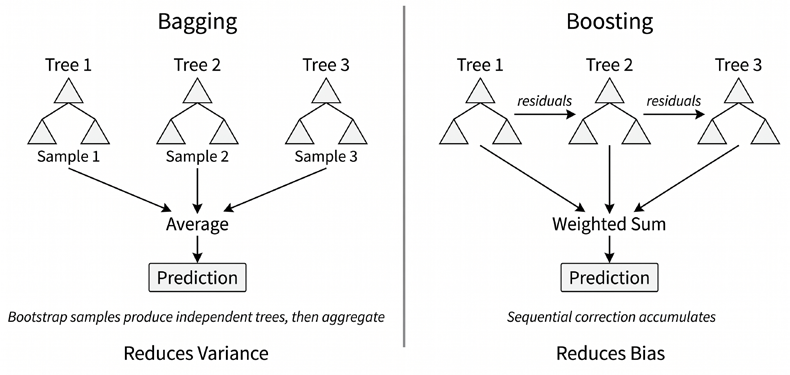
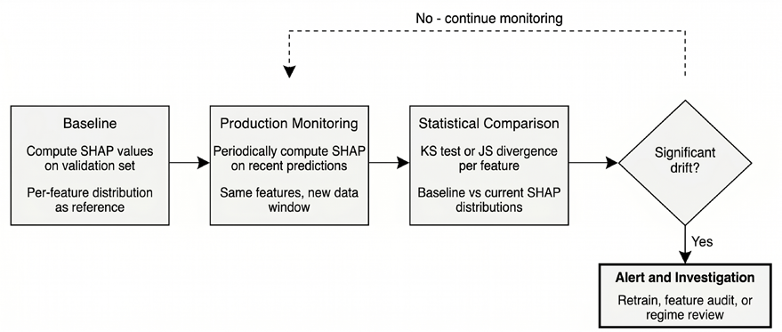
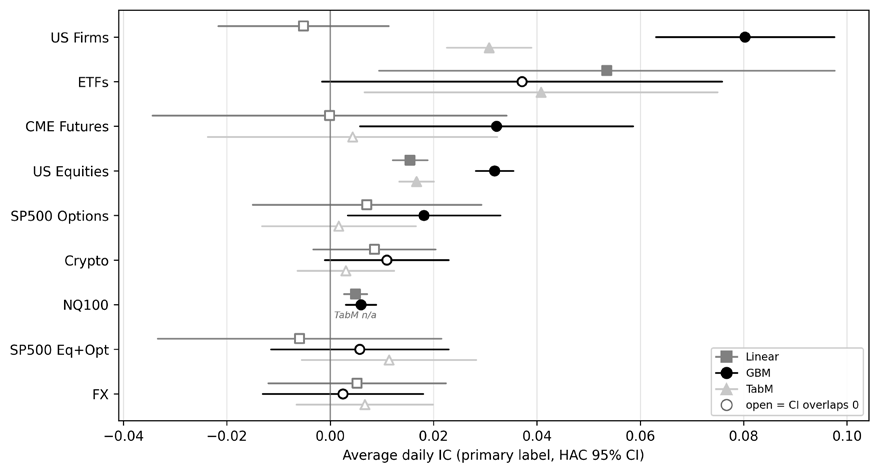
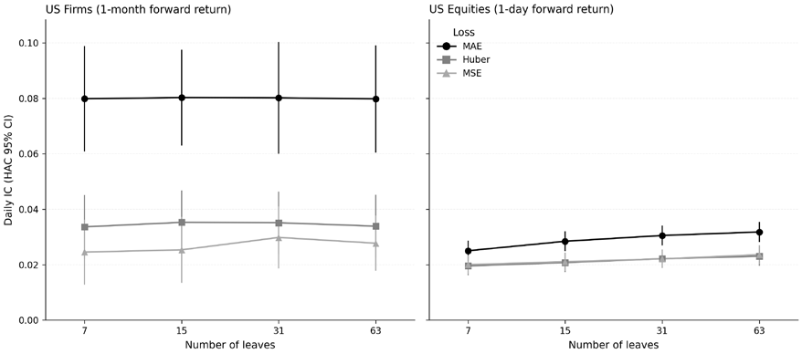
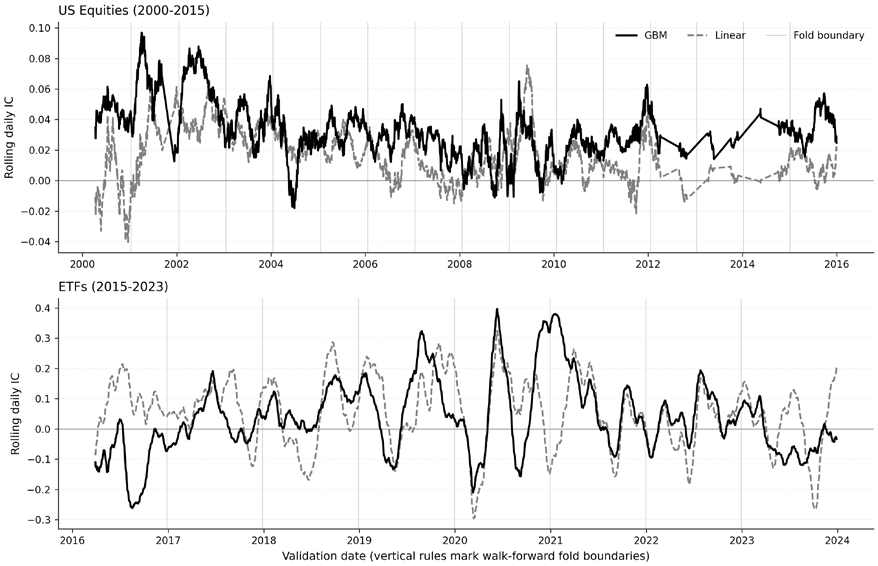
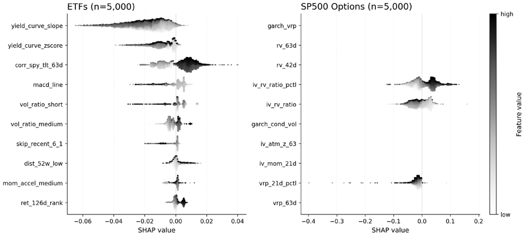

# 第12章：表格数据的高级模型

**梯度提升机**（**GBM**）在学术研究与生产交易系统中都主导着表格预测，将预测能力与计算效率集于一身。*第11章*的线性模型假设特征关系是可加的，而 GBM 无需人工特征工程，就能捕捉金融数据呈现的交互效应与阈值动态。

本章涵盖三个业界标准的 GBM 库（XGBoost、LightGBM 和 CatBoost），以及让它们达到生产可用的各项技术。读完本章，你将能够：

- 解释 boosting 与 bagging 的区别，以及为什么序贯误差修正让 GBM 对金融表格预测如此有效。
- 依据类别特征结构、计算环境、延迟需求和泄露风险，在 XGBoost、LightGBM 和 CatBoost 之间做出选择。
- 为金融任务选择合适的 GBM 目标函数与约束，包括逐点回归、学习排序和单调约束。
- 使用 Optuna 高效调优 GBM：剪枝、多目标搜索和时序感知验证。
- 使用 TreeSHAP 分析已部署树模型的特征效应、交互、不稳定性与漂移。
- 评估 TabPFN、TabM、TabR 等表格深度学习替代方案相对 GBM 何时值得考虑。
- 解读跨案例研究的证据，判断非线性树模型相对线性基线的额外复杂度是否物有所值。

我们从共享的提升框架出发，依次讲解基于 Optuna 的贝叶斯超参数优化、基于 TreeSHAP 的解释与漂移监控，以及面向分位数策略的学习排序目标。随后评估深度学习替代方案（TabPFN 与 TabM），给出判断额外复杂度何时物有所值的决策准则；最后以跨案例研究对比收尾，将 GBM 与*第11章*的线性基线进行基准对比。

## 12.1 从决策树到集成

梯度提升建立在三块基石之上：决策树如何划分特征空间，随机森林如何通过对相互独立的树取平均来降低方差，以及为什么仅靠平均无法修正系统性偏差。

**决策树**通过递归划分特征空间来做出预测。在每个节点上，算法选择能最好地区分数据的特征与阈值，分类通常用信息增益，回归通常用方差削减。

决策树无需编码即可处理混合特征类型（连续收益、类别行业），通过层级分裂捕捉非线性关系，也不需要特征缩放。它的关键弱点是高方差：训练数据的微小变化就可能产生截然不同的树结构，使单次预测不稳定。不过，单棵树能学到"动量只有在波动率低于某个阈值时才有预测力"这样的交互关系，而线性模型需要显式的特征工程才能捕捉。问题在于，如何在获得这种灵活性的同时摆脱不稳定性。

### 随机森林：用 bagging 降低方差

**随机森林**（Breiman, 2001）把 bagging 原则应用于决策树，并附加了一个变化：每次分裂只考虑一个随机的特征子集。这种特征随机化让树之间去相关，使平均带来的方差削减更加有效。

对回归任务，随机森林的预测就是所有单棵树预测的平均：ŷ = (1/𝑀) Σₘ₌₁ᴹ 𝑇ₘ(𝑥)，其中 𝑀 是树的数量，𝑇ₘ(𝑥) 是第 𝑚 棵树的预测。

随机森林几乎不需要超参数调优，即使树很多也很少过拟合。在本章的模型对比 notebook 中，随机森林充当基线，GBM 必须在精度上实质性超越它，才配得上额外的复杂度。*图 12.1* 展示了 bagging（对相互独立的树取平均）与 boosting（序贯误差修正）的对比。

*图 12.1：bagging 与提升的对比*

然而，由于各棵树独立训练，它们无法互相修正系统性误差。如果所有树共享同一偏差（例如系统性低估极端收益），平均无济于事。这一局限引出了下面要讲的提升范式。

### 通往提升之路

提升按序贯方式构建模型，每个新模型都以当前集成的误差为目标。如果当前预测是 2% 而真实收益是 5%，下一棵树就学着预测 3% 的残差。把这一修正累加到集成上，就能逐步消除系统性低估——这正是平均相互独立的树所无法处理的偏差。

这种序贯误差修正，与收缩（shrinkage）和正则化相结合，构成了梯度提升机的基础，下一节将详细展开。notebook `01_ensemble_foundations` 在 Chen–Pelger–Zhu 公司特征数据集（1967–2016 年间 41.4 万训练/30.7 万验证/49.7 万测试观测）上，将随机森林与 XGBoost、LightGBM、CatBoost 进行基准对比，并在该基准上得到一致的排序：每个 GBM 的样本外测试 IC 都高于随机森林基线（0.058–0.060 对 0.056），而库与库之间的差异（约 0.002 IC）小于 boosting 与 bagging 之间的差距。

## 12.2 梯度提升机

三个主流 GBM 库（XGBoost、LightGBM 和 CatBoost）共享核心的提升算法，但在树的构建方式、类别特征处理和正则化上各有不同。本节先介绍共享框架，再逐一考察各库的独到创新。

### 用提升实现高性能

梯度提升由 Friedman（2001）形式化，它把模型训练框定为函数空间中的迭代优化。我们不是拟合单个复杂模型，而是构造一个可加集成，其中每个新成员都明确针对当前预测的误差。

算法流程如下：

1. 以常数预测初始化（通常是目标均值）。
2. 对每次提升迭代 𝑚 = 1, 2, …, 𝑀：
   a. 计算损失函数关于当前预测的负梯度。
   b. 用一个弱学习器（通常是浅层树）拟合这些"伪残差"。
   c. 将新树的预测乘以学习率 𝜂 后加入集成。

每次迭代的更新为：𝐹ₘ(𝑥) = 𝐹ₘ₋₁(𝑥) + 𝜂 ℎₘ(𝑥)

其中 ℎₘ 是第 𝑚 轮迭代拟合的树。经过 𝑀 轮提升后，GBM 的最终预测可写为：ŷ = 𝐹_𝑀(𝑥) = 𝐹₀(𝑥) + 𝜂 Σₘ₌₁ᴹ ℎₘ(𝑥)

其中 𝐹₀(𝑥) 是初始常数预测，在平方误差回归中通常取训练集均值，而每个 ℎₘ(𝑥) 都是针对当前集成所隐含的损失梯度拟合的浅层树。

这一表达式凸显了它与前文随机森林预测的关键区别：随机森林是对相互独立的树取平均，而 GBM 从一个基线预测出发，迭代地叠加有针对性的修正。因此每棵树都不是对 𝑦 的独立预测，而是对当前预测的一次增量调整。对分类任务，同样的可加结构作用于模型的原始分数尺度（例如二分类的对数几率），之后再施加相应的链接函数得到概率。

**学习率** 𝜂（通常为 0.01–0.3）控制每棵树的贡献以多激进的方式累加。较小的取值需要更多树，但往往泛化更好：一棵有 100 棵树的 GBM 不是在平均 100 个预测，而是在累积 100 次增量修正。

**损失函数的选择**决定了算法瞄准什么样的"误差"。*第11章*讨论过均方误差、平均绝对误差和 Huber 损失，此外还包括：

- **分位数损失**预测特定的分位数而非条件均值，可直接估计预测区间。
- 三个 GBM 库都支持**自定义目标函数**，允许使用非对称损失（例如对低估的惩罚高于高估），只要你能提供关于模型预测的稳定一阶和二阶导数（损失不光滑时可使用光滑近似）。

下一节解释为什么这种灵活性与正则化的结合让 GBM 在表格数据上战绩如此出色。

### GBM 为何擅长表格数据

梯度提升决策树的**归纳偏置**与金融表格数据高度匹配：

- 金融数据集混合了连续变量（收益、波动率）、类别特征（行业、交易所）和衍生指标。树方法能很好地容纳**异构表格输入**：连续变量按阈值分裂，类别变量则通过各库特定的编码或原生类别分裂机制处理。具体细节在各库之间差异很大。
- 金融关系常常表现出**不连续性**（市盈率高于某一阈值时，投资者行为可能与略低于阈值时截然不同），而树可以直接捕捉这类非光滑边界。神经网络通过连续激活函数强加光滑性，树则把特征空间划分成离散区域。树还能通过层级分裂发现特征交互：足够深的树能学到"动量只有在波动率适中时才有预测力"，无需人工构造交互特征。

若干实用优势进一步放大了这种表达能力：

- 提升树依赖**阈值分裂**，因此对极端特征值通常比直接依赖数值大小或距离的模型更稳健。
- 现代 GBM 实现**能处理缺失值**，为缺失特征学习最优分裂方向，而不要求插补。
- 树还可以直接使用原始特征值而无需归一化，消除了一类预处理 bug。

下一节考察实现这些思想的最常用库：XGBoost、LightGBM 和 CatBoost。

### 引擎内幕：XGBoost、LightGBM 与 CatBoost

XGBoost、LightGBM 和 CatBoost 共享梯度提升框架，但在影响各自性能特征的关键算法创新上有所不同。

#### XGBoost：正则化与稀疏性

XGBoost（eXtreme Gradient Boosting）由 Chen 和 Guestrin（2016）提出，带来了若干塑造当前梯度提升实践的创新。

**正则化目标函数**：与主要依赖早期停止和收缩的早期实现不同，XGBoost 在目标函数中显式加入正则化项：Σᵢ ℓ(𝑦ᵢ, ŷᵢ) + Σₖ Ω(𝑓ₖ)

其中 Ω(𝑓ₖ) = 𝛾𝑇 + (1/2)𝜆 Σⱼ₌₁ᵀ 𝑤ⱼ²

同时惩罚树的复杂度和模型叶子分数的量级。这里 𝑇 是第 𝑘 棵树的叶子数，𝑤ⱼ 是赋给叶子 𝑗 的预测值，𝛾 控制对新增叶子的惩罚，𝜆 控制叶子权重的 L2 惩罚。𝛾 越大越倾向更简单的树，𝜆 越大则叶子预测越向零收缩。这种正则化直接限制过拟合，而不是只依赖启发式的停止规则：

- **稀疏感知的分裂查找**：真实世界的数据常含大量缺失值或零值。XGBoost 为每个树节点学习一个默认方向：当样本在分裂特征上缺失时，沿学习到的默认路径走。这免除了插补的必要，还常常提升预测性能。
- **二阶近似**：XGBoost 对损失函数做二阶泰勒展开，同时利用梯度与包含二阶导数的 Hessian 矩阵。这比一阶方法给出更精确的更新，对曲率显著的损失函数尤其如此。
- **缓存友好的访问模式**：XGBoost 优化数据在内存中的布局与访问方式，让重复计算更好地利用 CPU 缓存。这提升了训练速度，在低效内存访问可能成为瓶颈的大型表格数据集上尤为明显。

#### LightGBM：靠采样与捆绑提速

LightGBM（Ke et al., 2017）由微软开发，专注于大幅提升训练速度，同时保持甚至提高精度。在大型稀疏数据集上，LightGBM 曾比直方图化之前的 XGBoost 快 5–10 倍，但随着 XGBoost 采用了 LightGBM 率先引入的直方图模式，这一 CPU 速度优势已经缩小。LightGBM 引入了多项创新：

- **基于直方图的学习**：LightGBM 不再对特征值排序做精确分裂查找，而是把连续特征离散化成直方图，分裂查找只需考察直方图的分箱边界。构建直方图仍需扫描数据，但直方图一旦建好，分裂增益只需在各分箱边界上评估，而无需遍历所有不同的特征取值。因此分裂评估这一步的计算量与分箱数成正比，通常远小于观测数。
- **按叶生长（leaf-wise）**：LightGBM 最出名的就是按叶、best-first 的树生长方式：每一步都分裂损失削减最大的叶子。在叶子数固定的情况下，这比按深度生长更快地降低训练损失，但也增加了在小数据集或高噪声数据集上过拟合的风险，除非用 `num_leaves`、`max_depth`、`min_data_in_leaf` 等相关正则化参数加以约束。
- **基于梯度的单边采样（GOSS）**：关键洞察是，大梯度样本（模型当前预测错误的样本）对信息增益的贡献大于小梯度样本（已被很好预测的样本）。GOSS 保留所有大梯度样本，只随机采样一小部分小梯度样本（并重新加权以保持对分裂质量的良好估计），在不牺牲分裂质量的前提下显著降低计算成本。
- **互斥特征捆绑（EFB）**：在高维稀疏数据中（对类别变量做独热编码后很常见），许多特征互斥：它们从不同时取非零值。EFB 识别并捆绑这类特征，减少分裂查找时需要评估的有效特征数量。

#### CatBoost：最先进的类别特征处理

CatBoost（Prokhorenkova et al., 2018）由 Yandex 开发，解决一个关键难题：**如何在不引入目标泄露的前提下处理类别特征**。

标准目标编码（把类别替换为该类别样本的目标均值）会造成一种隐蔽的数据泄露：计算某个训练样本的编码值时，该样本自身的目标值影响了它的特征值，从而夸大模型的表面性能。

CatBoost 的解法是"**有序目标统计**"（ordered target statistics）：对每个训练样本，目标统计量只用数据随机排列中出现在它之前的样本计算。这确保任何样本的目标值都不会影响它自己的特征。使用多个随机排列并取平均，以降低方差。

与 XGBoost 和 LightGBM 每个节点可在不同特征上分裂不同，CatBoost 默认使用对称的"**无感知**"（oblivious）决策树：同一深度的所有节点使用相同的分裂条件。这种简洁性使预测极快（往往是三个库中推理最快的），因为预测路径可以按位运算计算，而无需逐棵遍历树。这使 CatBoost 特别适合推理速度至关重要的延迟敏感型应用。

独热编码在具有数千个唯一值的高基数类别特征上变得不切实际，而 CatBoost 的有序编码可以自然处理任意基数。个股标识、分析师 ID、细分行业代码等特征可以直接使用。

### 实战对比：该选哪个 GBM？

Scikit-learn 的 `HistGradientBoostingRegressor` 提供了一个零依赖的基线。它使用与专门库相同的基于直方图的分裂方法，在中小规模数据集上往往是 CPU 上最快的选择。但它缺少 GPU 支持，也没有专门库提供的调优生态（Optuna 回调与灵活的早期停止）。我们在 `02_gbm_comparison` 基准中把它与三个专门库一起纳入。*表 12.1* 总结了库选择的决策要点。这些专门库各自的优化目标仍然不同。XGBoost 是三者中最通用的：同时支持 CPU 和基于 CUDA 的 GPU 训练，内置原生类别特征支持，当你想要一个覆盖广泛生产与研究场景的库时，它仍是可靠的默认选择。在 XGBoost、LightGBM 和 CatBoost 之间做选择，取决于你的具体约束与数据特征：

| 评价维度 | XGBoost | LightGBM | CatBoost |
| --- | --- | --- | --- |
| CPU 训练（490 万行，8 线程） | 约 100 秒 | 约 50 秒，最快（约为 XGBoost 的 2 倍） | 约 135 秒，最慢 |
| GPU 训练（490 万行，CUDA） | 约 14 秒（约为其 CPU 的 7 倍） | 约 14 秒（约 3.5 倍；仅支持 FP64，见下文） | 约 10 秒（14 倍），最快 |
| 预测速度（heavy 预设，2.4 万测试行） | CPU 50 万行/秒；GPU 170 万行/秒 | CPU 7 万行/秒（最慢） | CPU 650 万行/秒；对称树 → 按位路径，CPU 上比 XGBoost 快约 12 倍 |
| 高基数类别特征 | 原生支持 | 原生支持 | 有序目标统计避免泄露 |
| 默认性能 | 良好 | 良好 | 往往很强，类别变量很多时尤其如此 |
| 调参敏感度 | 中等 | 中到高（按叶生长需要深度/叶子约束） | 往往较低，但取决于数据 |
| 内存效率 | 中等 | 往往最佳（直方图分箱降低内存占用） | 中等 |

*表 12.1：GBM 库的特性*

`02_gbm_comparison` notebook 在 CPU 和 GPU 上以 light、medium、heavy 三档预设对全部四个库进行基准测试，测量精度、训练时间和内存占用。

在 CPU 优先的表格工作流中，LightGBM 仍然特别有吸引力。它的按叶生长能快速降低训练损失，但也让该库对 `num_leaves`、`min_data_in_leaf` 有时还有 `max_depth` 等参数更敏感一些。

三个库都支持 **GPU 加速训练**，但加速比取决于数据集规模和数值精度：

- 在**美股面板**（492 万训练行、72 个特征、8 线程）上，CatBoost 以 `task_type='GPU'` 取得最大的 GPU 加速比，约 14 倍（CPU 约 135 秒 → GPU 约 10 秒），XGBoost 用 `device='cuda'` 约 7 倍（约 100 秒 → 约 14 秒）。LightGBM 在 CPU 上约 50 秒（该规模基准中最快的 CPU 配置），GPU 上用 `device='cuda'` 约 14 秒，加速比约 3.5 倍，较为温和；其 GPU 墙钟时间与 XGBoost 相当但不及 CatBoost，原因在于下文讨论的 FP64 问题。
- 在较小的 **ETF 数据集**（22.7 万行）上，启动开销压缩了加速比：XGBoost 和 CatBoost 的收益从约 2.4 倍（XGBoost light）到约 5.2 倍（CatBoost heavy）不等。LightGBM 是例外：其 FP64 CUDA 路径在这个规模上适得其反，GPU 训练反而比 CPU 慢（heavy 预设下 CPU 约 9.5 秒，GPU 约 48 秒），因此这个规模的数据集应让 LightGBM 留在 CPU 上。对 XGBoost 和 CatBoost，GPU 仍有帮助，但相对优势比 490 万行规模时小了约一个数量级。

即使 LightGBM 的 GPU 墙钟时间（490 万行规模下约 14 秒）与 XGBoost 相当，它的 CUDA 加速比仍然温和：其 **CUDA 后端只使用双精度（FP64）**。启用单精度训练的 `gpu_use_dp` 开关"只能在 OpenCL 实现（`device_type='gpu'`）中使用；CUDA 实现目前仅支持双精度"。注意：

- **消费级 GPU** 的 FP32:FP64 吞吐比约为 64:1（RTX 3090 的 FP32 算力为 35.6 TFLOPS，FP64 仅约 0.6 TFLOPS），因此 LightGBM 的 GPU 直方图计算只能用到可用吞吐量的一小部分。
- FP64 比例更好的**数据中心 GPU**（A100 为 2:1）会呈现不同的结果。

LightGBM 还提供一个独立的 OpenCL 后端（`device='gpu'`），默认单精度，但需要 OpenCL SDK，且由于精度差异会产生略有不同的结果。CUDA 版本需要用 `USE_CUDA=ON` 从源码编译，本文报告的 GPU 时间即来自该构建；在受支持的系统上，现已提供启用 CUDA 的 conda 包。

因此，大规模场景下的实际格局是：

- **CatBoost GPU 带来最大的训练加速**（490 万行规模下约 14 倍），当 GPU 加速的训练时间很重要时，它是明确的选择。在该规模下，CatBoost 约 10 秒完成 GPU 训练，XGBoost 与 LightGBM 均约 14 秒。CPU 上 LightGBM 以约 50 秒最快，是该规模基准中最快的 CPU 配置。
- 490 万行规模（8 线程）的 CPU 耗时依次为：LightGBM（约 50 秒）、XGBoost（约 100 秒）、CatBoost（约 135 秒）；LightGBM 的直方图加按叶生长在这一线程数和数据规模下并行效率最高。

实践中，库与库之间的精度差距，小于任何一个库内部好坏超参数配置之间的差距。调优后四个库落在很窄的 IC 区间内，且它们的折内排名随时间波动。

因此，真正的选择标准是运营层面的：CatBoost 的 GPU 后端在大规模训练中最快；CatBoost 的有序编码在处理行业代码或分析师标识时消除了隐蔽的泄露 bug；XGBoost 的成熟生态与 SHAP、Optuna 回调和部署工具集成最好。在 490 万行规模的 CPU 上，LightGBM 是三者中最快的（8 线程下约为 XGBoost 的 2 倍、CatBoost 的 2.7 倍）。对拥有 CUDA GPU 和大型数据集的读者，CatBoost 的 GPU 加速带来的训练时间节省最为可观。

本书的九条**案例研究流水线默认使用 LightGBM**，因为在多组超参数配置上运行 walk-forward（滚动前推）交叉验证时，它的 CPU 速度优势尤为明显。拥有 **CUDA GPU** 的读者可以考虑在较大的案例研究（美股、标普 500 股票期权分析）中改用 **XGBoost**，GPU 加速能带来可观的时间节省。

### 原生特征重要性及其局限

每个 GBM 库在训练后都会报告特征重要性：通常是每个特征分裂带来的总增益，或每个特征被用于分裂的次数。这些指标计算快，可以快速浏览模型依赖哪些特征。但它们的失效模式有据可查：

- **基于增益的重要性**偏向高基数特征，因为唯一值越多，候选分裂就越多。
- **分裂次数重要性**出于同样的原因偏向连续特征而非类别特征。

这两类指标都*不稳定*：换一个随机种子重新训练，重要性排名可能大幅改变，对相关特征尤其如此——模型可以用一个特征替代另一个。

这些局限引出了 *12.5 节*基于 SHAP 的分析，它提供一致且有理论依据的归因。开发阶段可用原生重要性做快速筛选；凡是为决策提供依据的分析——特征选择、模型监控或风险委员会汇报——都应使用 SHAP。

### 学习排序

标准 GBM 训练最小化逐点损失（MSE 或 log-loss），把每个预测当作独立对象。但多空组合靠的是正确的*排序*而非精确的幅度：买入前十分位、卖出后十分位的组合从排序质量中获利。当 MSE 被分布中段的大绝对误差主导时，模型会牺牲尾部——真正发生交易的地方——的排序精度。

**学习排序**（**Learning-to-Rank**，**LTR**）目标直接优化排序质量。LightGBM 支持 `lambdarank` 目标，它实现了 LambdaMART——一种梯度提升算法，其损失函数通过能够改善成对排序的梯度（即"lambda"）隐式定义。每个梯度计入两个样本交换位置时排序指标的变化，并按指标在该位置的敏感度加权。其结果是训练出一个产生有序良好预测、而非精确点估计的模型。

标准的目标指标是**归一化折损累积增益（NDCG）**，它对列表顶部附近的正确排序赋予指数级更高的价值。这与分位数策略天然契合：正确识别最好和最差的股票，远比区分第 40 与第 50 百分位重要。

#### LTR 何时优于逐点回归

LTR 在只交易尾部的宽截面（high-breadth）中收益最大。设想一个每月排序的 500 只股票标的池：多空十分位策略只交易最强和最弱的 50 只。MSE 训练的模型对全部 500 只股票的预测精度一视同仁地优化，包括中间不产生任何交易信号的 400 只。LambdaMART 则把拟合能力集中在正确区分两端上。对于交易整个截面的策略（例如排名加权组合），或多数资产都会建仓的低广度标的池，这一优势会减弱。当信噪比低到排序目标与逐点目标收敛到同一解时，优势同样会消失。

一个实务考虑：LTR 模型产生的分数有序，但与收益幅度并不校准。如果下游投资组合构建需要收益预测（例如*第17章*的均值-方差优化），要么事后校准 LTR 分数，要么改用逐点预测。对只需做多前五分位、做空后五分位的策略，未校准的排序分数就够用了。

#### 示例：LambdaMART 对比逐点 MSE

在 notebook `02_gbm_comparison` 中，我们在 ETF 数据集上用同一特征集和同一训练/测试折比较 LambdaMART 与标准 MSE 回归。两者的关键配置差异很小：

- **逐点**：`objective='regression'`，优化 MSE
- **LTR**：`objective='lambdarank'`，用 `label_gain` 把日内收益五分位映射为相关性等级，`ndcg_eval_at=[10]` 瞄准头部排序质量

两个模型都产生有序预测，但拟合能力的投放位置不同。notebook 同时评估按组平均 NDCG@10（按日期衡量的排序质量）与对原始收益的 IC。这让目标函数与指标的对应关系一目了然：LambdaMART 为排序优化，逐点回归为幅度拟合优化。对尾部交易策略，排序质量通常是更相关的诊断指标。

LightGBM 的 `lambdarank` 目标要求按截面（日期）对样本分组，通过 `group` 参数指定。每个组定义了相互排序的资产集合。XGBoost 通过 `rank:ndcg` 目标提供等价功能。CatBoost 通过 `YetiRank` 和 `YetiRankPairwise` 目标支持排序，它们使用为 CatBoost 对称树架构优化的自有梯度形式。

该示例在 `02_gbm_comparison` 中实现，包括日期分组构建、相关性标注、LambdaMART 训练，以及与回归基线的 NDCG@10 对比。

### 用单调约束落实经济逻辑

GBM 擅长发现非线性，却对经济理论视而不见。纯数据驱动的模型可能学到市盈率越高收益越低，但由于特定训练区域的噪声，它可能对极高的市盈率预测出收益飙升——这几乎肯定是伪象而非结构性信号。

**单调约束**强制方向性关系：正约束（+1）要求预测不随特征增大而减小；负约束（−1）要求相反。单调约束是理论驱动的正则化：在低信噪比环境中，强制一个符号方向（例如价值得分越高预测收益越高）能防止模型在噪声区域拟合非单调伪象。约束还提升可部署性（风险委员会接受方向逻辑可审计的策略）和对市场状态切换的稳健性，因为模型无法学到不太可能重现的复杂非单调模式。

三个库都通过参数-映射机制支持单调约束，把特征名映射到期望的方向。

**SHAP 依赖图**（*11.4 节*）让约束的效果立竿见影。无约束模型的价值因子依赖图可能整体向下倾斜却带局部反转——价值得分越高反而预测收益越低的区域。施加负单调约束后，同一模型给出严格单调的依赖曲线，在保留总体关系的同时消除这些伪象。当受约束模型的 IC 与无约束版本相当（对有经济依据的约束通常如此）时，约束是在发挥正则化作用，而非损失信息。这是 *11.4 节*经济合理性检验框架的一个具体实现。

ETF 案例研究中受约束与无约束模型的 SHAP 依赖图对比见 `02_gbm_comparison`。

下面转向较新的进展：面向表格数据的深度学习模型。

## 12.3 表格数据的深度学习替代方案

GBM 仍是表格金融数据站得住脚的默认选择，但 2024 到 2026 年间，格局发生了实质变化。以 TabPFN 的 Nature 论文（Hollmann et al., 2025）为首的表格基础模型，从研究趣闻跃升为前沿基线，在中小规模数据集上无需任务特定训练即可比肩或超越调优后的 GBM。TabM 等参数高效的神经集成表明，精心调校的 MLP——而非奇特的架构——在同等调优预算下可以与 GBM 竞争。TabR 等检索增强模型则表明，当局部相似性重要时，把深度学习与最近邻查找相结合能改进预测。

**TabArena** 持续更新的基准（Erickson et al., 2025）在 51 个精选数据集上评估 16 个模型族，把一个关键发现形式化：只要有足够的调优和集成，深度学习可以比肩甚至超越 GBM，但实际胜者取决于数据集规模、特征构成和算力预算。

对金融而言，有一个关键警示：主流表格基准大多假设 IID 划分，不考虑时间依赖。*TabReD* 基准（Rubachev et al., 2024）在时序分布偏移下测试模型，发现重注意力的架构比 GBM 和简单 MLP 退化更快——这一点与非平稳的金融数据直接相关。不经 walk-forward 验证，基准上的胜利并不意味着交易盈利。

### 表格基础模型

概念上最引人注目的进展，是使用**上下文学习**（**ICL**）的**表格基础模型**（**TFM**）的崛起。传统模型通过梯度下降在特定数据集上训练，TFM 则只在数百万个由结构因果模型生成的合成数据集上预训练一次。推理时，它把训练数据当作上下文，在单次前向传播中为测试样本产生预测：没有梯度更新，没有在目标数据集上的超参数调优。模型在预训练阶段已经学会了*如何*从表格结构中*学习*。

接口看似简单：给定 `(X_train, y_train, X_test)`，模型立即返回预测。训练被上下文内的计算取代，Transformer 的注意力机制在给定上下文中识别能泛化到查询样本的模式。

**TabPFN** 开创了表格数据的这一范式。最初版本（Hollmann et al., *Nature*, 2025）在精选基准上验证了该方法：在最多 1 万样本、500 特征的数据集上，默认配置的 TabPFN 无需任何任务特定优化即超越了调优过的基线。**TabPFN v2.5**（Grinsztajn et al., 2025）通过草图（sketching）与特征选择，大幅扩展了实用边界（约 5 万行、2000 特征）。另有单独发布的蒸馏工具链，可把 TFM 的预测转化为紧凑的 MLP 或树集成用于生产部署，解决了此前版本只能用于纯批处理工作流的推理延迟瓶颈。

对金融应用有几项已知**局限**。TabPFN 在纯数值数据上表现最好，在纯类别数据上会退化（Ye et al., 2024）。在合成数据上的 IID 预训练无法捕捉时间依赖或市场状态切换。高吞吐场景下，其逐样本推理延迟超过优化的树库，不过 TabPFN 2.5 的蒸馏路径在批处理工作流中缓解了这一点。校准质量取决于目标数据结构与合成预训练分布的相似程度；合成先验中不存在的结构性突变可能使零样本预测退化。

TabPFN 也有其用武之地。对金融 ML，TabPFN 最强的用例是**快速原型验证**：在投入 GBM 调优之前，先检验一个特征集是否含有预测信号。如果 TabPFN 在子样本上取得不可忽视的 IC，这些特征就值得用生产级模型深入研究。蒸馏引擎让部署成为可能：把 TFM 的预测转化为继承基础模型精度的树集成，同时达到 GBM 级的推理速度。TabPFN 2.5 权重默认以非商业许可发布；在生产交易系统工作的读者应将其视为研究原型工具，除非取得商业许可。

notebook `03_dl_vs_gbm` 把 TabPFN 作为可选模型纳入 walk-forward 对比；若已安装，它会在 ETF 案例研究中与 GBM 和 TabM 并行运行，并报告逐折 IC。

### 现代神经网络基线：TabM 与强力默认配置

比基础模型更安静、但可以说影响更大的进展，是通过更好的训练配方和工程实现，让简单的神经架构重获重视。Holzmüller et al. (2024) 表明，**元调优的 MLP 默认配置**（在数百个数据集上优化出的训练配方）可以让神经网络与 GBM 竞争，无需任何架构创新。他们的 **RealMLP** 靠改进默认配置而非发明新层，在中等偏大到大型数据集上取得了出色的时间-精度权衡。这意味着，许多早年"深度学习不敌树模型"的结论，反映的是弱神经基线而非根本性的架构极限。**TabM**（Gorishniy et al., 2025）以参数高效的集成更进一步：它不去训练 𝑀 个独立的 MLP（这对大型金融数据集在计算上不可行），而是维护一个共享权重主干，并施加秩 1 适配器（缩放参数）来创建 𝑀 个多样的集成成员，全部在单次前向传播中同时训练。每个成员的预测都带噪声：秩 1 扰动引入了足够的多样性，使各成员朝不同方向过拟合。平均操作在保留共享信号的同时抵消这些互不相关的误差，以单个网络的计算成本获得深度集成的泛化收益。

在 46 个基准的评估中，TabM 在深度学习模型中取得最强表现，包括在对神经网络历来困难的领域感知时序划分上。这种时序稳健性与金融应用直接相关——在 walk-forward 的各折之间，训练分布是移动的。

TabM 代表了"实践者真正能在表格金融数据上使用的深度学习"的最切实案例。它架构简单、文档完善，无需 Transformer 级别的复杂度就有竞争力。可解释性采用标准的模型无关方法（置换重要性和 KernelSHAP），计算成本适中。训练比 GBM 慢，但不需要大型 Transformer 模型的多 GPU 基础设施。

notebook `03_dl_vs_gbm` 在 ETF 案例研究的 walk-forward 各折上比较 LightGBM、原生 MLP 和 TabM 秩 1 适配器集成，报告逐折 IC 和训练时间。

### 检索增强模型：TabR

**TabR**（Gorishniy et al., 2024）将深度编码器与 𝑘 近邻检索混合。预测时，模型从学习到的嵌入空间中检索相似的训练实例，并用类注意力的机制从它们的特征与标签中提取信号。检索到的近邻有效提供了基础模型可利用的局部上下文——这是帮助神经网络完成局部模式识别的一种有原则的途径，而树通过层级分裂天然擅长此类识别。

对金融的概念吸引力是直接的："这些近邻驱动了预测"，与关于市场状态相似性和同类相对估值的直觉吻合。如果当前市场环境类似某个历史时期，检索把这种类比显式呈现出来，而不要求模型把它隐式编码进固定权重。

**基准评估**显示，TabR 稳定优于非检索的深度基线，并作为一等方法进入现代表格工具箱（Ye et al., 2024）。代价是运营复杂度：检索为近邻索引增加内存开销，并使推理延迟随数据库规模成比例增长。

**专栏 12.1：检索增强模型中的前视偏差**

标准 TabR 实现在整个训练集上构建检索索引，不加时间约束。在 walk-forward 设定下，模型可能检索到与预测目标同期或更晚时段的近邻——这是标准实现不防范的一种前视偏差。任何部署都必须强制时间隔离：近邻必须严格来自预测日期之前的时段，并对 walk-forward 划分应用同样的 purge 与 embargo 逻辑。实现这一点仍是开放的工程难题；没有时间隔离的 TabR 结果应视为上界，而非生产估计。

### 何时跳出 GBM：一个决策框架

对表格（截面）预测，在 GBM 与神经替代方案之间的选择取决于具体情形。*表 12.2* 总结了这一类问题的决策框架，把基准证据与生产金融 ML 中真正要紧的运营约束综合在一起。序贯模型（LSTM、Transformer、时序卷积网络）为这一决策增加了时间维度；*第13章*讨论这一扩展。

| 数据情形 | 推荐模型 | 理由 |
| --- | --- | --- |
| 有效样本少于 1 万、快速信号检验 | TabPFN（v2.5；蒸馏版） | 小数据上强大的"免调参"基线；迭代快。蒸馏引擎支持部署。 |
| 1 万–10 万样本、生产表格任务 | LightGBM（或 XGBoost） | 精度与稳健性俱佳的默认之选；训练高效；TreeSHAP 解释对树集成切实可用。 |
| 1 万–10 万样本、复杂度足以启用 DL | TabM（秩 1 适配器集成） | 近期评估中最强的表格 DL 基线；需在 walk-forward 时序划分下验证。 |
| 超过 10 万样本、重类别特征 | CatBoost（或 LightGBM） | CatBoost 的有序方案防止类别特征泄露；LightGBM 通过整数编码支持类别特征。 |
| 超过 100 万样本、有 GPU | LightGBM 与 TabM（或 TabR） | 无可靠的分界点。树模型往往仍有竞争力；请在自身约束下验证两族模型。 |
| 多模态输入（文本与表格） | 端到端深度学习（Transformer） | 跨模态联合表示学习需要深度学习；GBM 无法原生融合不同模态。 |
| 局部相似性/状态匹配重要 | TabR | 近邻检索在部分基准上有效；须强制时间隔离以避免泄露。 |

*表 12.2：模型选择的经验法则*

对想要性能上限而非单一生产模型的读者，**AutoGluon Tabular**（Erickson et al., 2020）是有用的参照。它的"best quality"预设把 GBM、神经网络和 TabPFN 融合成带自动超参数选择的多层堆叠集成。这些堆叠常靠利用互补的模型优势取得最佳基准结果。其代价（多小时级的训练预算与运维开销）使直接部署颇为沉重。

在我们的工作流中，AutoGluon 充当"上限合理性检验"：如果你的调优 LightGBM 或 TabM 已经逼近它，说明你可用的信号已基本被提取。如果 AutoGluon 大幅跑赢你的单模型基线，就去检查堆叠中哪个模型族贡献了提升。这能诊断出是否存在某种其他架构可以捕捉、而你正在错失的信号。

对金融 ML 典型的中等规模数据集（walk-forward 划分压缩了有效训练规模、信噪比低、特征呈重尾），调优良好的 GBM 仍是可靠的默认选择。差距正在缩小，上面的情形地图指出了神经替代方案最可能带来回报之处。

notebook `03_dl_vs_gbm` 在 ETF 案例研究的 walk-forward 划分下，对 LightGBM、TabM、TabPFN 和原生 MLP 做了系统比较。LightGBM 以神经网络训练时间的一小部分取得有竞争力的 IC；TabM 的秩 1 适配器集成则提供了最强的神经基线，这与它在 *12.6 节*更广的案例研究对比中的表现一致——在有 TabM 覆盖的 8 个案例研究中，TabM 在 3 个上击败 GBM。

**专栏 12.2：批判性地阅读表格基准**

表格 ML 文献如今包含多个大规模基准。把它们的结论迁移到金融应用之前，有四个方法论问题值得审视：

- *IID 假设。*TabArena（Erickson et al., 2025）和 TALENT（Ye et al., 2024）聚焦 IID 分类与回归，都明确把时间依赖排除在当前范围之外。IID 划分下的模型排名结论，在 walk-forward 评估下未必成立。
- *调优预算不平等。*结果严重依赖各模型是否获得同等的超参数优化时间。调优过的 GBM 对默认配置的神经网络（或反之），证明不了任何关于模型族的事。公平比较必须明确并拉平算力预算。
- *事后集成。*TabArena 报告，跨模型集成（GBM 与神经方法堆叠）常产生最佳结果。这改变了"基线"的定义，并使单模型比较复杂化。如果你的生产约束是单一模型族，集成结果只是愿景而非可操作的方案。
- *数据集泄露。*多项基准研究在流行的表格数据集中发现泄露：编码了目标的特征、标注错误的任务，或使前视成为可能的时间戳列。精选子集的存在自有其道理：TabArena 从最初的 1053 个数据集中保留了 51 个。

无论哪个模型族，性能都严重依赖超参数配置。下一节介绍 Optuna 的贝叶斯方法，以高效遍历这一搜索空间。

## 12.4 用 Optuna 进行高级超参数调优

GBM 把树深度、学习率、正则化强度、采样比例和叶子数量引入超参数搜索空间，使贝叶斯优化不只是方便，而是高性价比参数优化的必需品。

### 树结构 Parzen 估计器

Optuna 通过采样方法实现超参数优化（HPO），学习参数配置与目标值之间的关系。默认的**树结构 Parzen 估计器**（**Tree-structured Parzen Estimator**，**TPE**，Bergstra et al., 2011）维护两个密度估计器：𝑙(𝑥) 对应产生良好目标值的超参数，𝑔(𝑥) 对应产生糟糕目标值的超参数。采集函数最大化 𝑙(𝑥)/𝑔(𝑥)，把评估集中到有希望的区域。随着试验不断累积，密度估计器逐渐锐化，把提议集中到历史上产生过强验证指标的区域。

TPE 对 GBM 调优中常见的离散和条件参数空间尤其有效。它自然地处理整数参数、类别选择和条件依赖，例如只在按叶生长时采样 `num_leaves`。notebook `04_optuna_tuning` 在 ETF 案例研究中展示基于 TPE 的优化，重点是搜索空间设计与早期停止的集成。

### define-by-run API

Optuna 的 define-by-run API 在目标函数内部动态定义搜索空间。每次试验中，对 `trial.suggest_int()` 或 `trial.suggest_float()` 的调用，会基于 Optuna 当前对目标函数地形的建模来请求参数值。这使得条件参数（只对某些模型类型采样正则化强度）、层级搜索（先选库、再调其专属参数）和基于剪枝的动态停止成为可能。

对 GBM 这类迭代模型，可以在每次提升迭代之后评估中间性能。Optuna 的**剪枝器自动终止**看起来没有前景的试验：

- **MedianPruner** 剪掉每一步差于中位数的试验
- **HyperbandPruner** 用自适应资源分配实现更激进的早期剪枝

剪枝能在不牺牲优化质量的前提下，把总计算量减少 50% 以上。

生产规模的调优中，study 可以由共享数据库（PostgreSQL、MySQL）支撑，让多个 worker 跨机器并行评估试验。

### 针对 GBM 的调优策略

GBM 超参数分为三族，各有不同作用：

- **树结构**参数（最大深度、叶子数、每叶最小样本数）控制模型复杂度：更深的树捕捉更多交互，但过拟合风险更高。
- **提升**参数（学习率、迭代轮数、子采样比例）控制训练动态：较低的学习率配合更多轮数通常效果更好，但会增加训练时间。
- **正则化**参数（L1/L2 惩罚、最小子节点权重）直接惩罚复杂度。

常见误区是大动干戈地调树结构，却忽视正则化。正则化参数（`reg_alpha`、`reg_lambda`）往往对样本外性能影响最大，因为它们直接应对低信噪比环境中的过拟合。把学习率设在较低值（0.01–0.05），让 Optuna 通过早期停止确定最优轮数，这通常比联合调两者更高效。从 100–200 次试验起步；超过这个范围，边际改进趋于递减，而验证过拟合的风险上升（*专栏 12.3*）。

**专栏 12.3：超参数搜索中的验证过拟合**

验证过拟合是自动调优的首要风险。在日收益预测这类低信噪比环境中，500 次 TPE 试验找到的将是利用验证集噪声的超参数，而非真正更优的配置：0.02 的 IC 改进在真正留出的数据上会消失。

防御手段：把试验限制在 50–100 次，使用更粗的参数网格，并且始终在优化过程中未触碰的数据上评估最终候选。这不是理论上的担忧；它是回测到实盘性能衰减最常见的根源。

### 多目标优化

金融模型常面对无法压缩成单一指标的竞争目标。Optuna 通过 `NSGAIISampler`（Deb et al., 2002）支持多目标优化，它寻找非支配解的**帕累托前沿**——那些改善一个目标必然损害另一个目标的配置。

#### 实践中的 IC 与换手率权衡

notebook `06_optuna_multi_asset` 在 ETF 案例研究中以两个目标调优 LightGBM 模型：最大化排名 IC、最小化组合换手率。激进的超参数（更深的树、更低的正则化、更多提升轮数）往往同时推高 IC 和换手率，因为模型拟合了更细粒度、跨再平衡期变化更频繁的模式。

该数据集上的**帕累托前沿**很紧凑。NSGA-II 找到两个非支配解：一个 IC≈0.029、归一化换手率≈0.004，另一个 IC≈0.030、换手率≈0.005，两者都处于同样保守的参数区间，深度适中、样本权重温和。在同一搜索空间上用 TPE 只对 IC 做单目标优化，收敛到 IC≈0.010，明显低于任一帕累托解；多目标的 NSGA-II 搜索到达了单目标搜索未曾企及的参数空间区域。多目标方法还能揭示目标之间的冲突小于假设的情形。如果帕累托前沿在某个区域几乎平坦——例如高 IC 只伴随略高的换手率——你可以同时拿下两个目标而几乎不用妥协。相反，急剧弯曲的前沿意味着边际 IC 改进要以快速上升的换手率成本为代价，需要仔细分析交易成本敏感性。

其他常见的多目标组合包括收益与回撤（激进模型收益更高，但从峰到谷的跌幅也更大）和夏普比率与容量（夏普更高的策略往往交易更小、流动性更差的标的）。

**实现**：

- `04_optuna_tuning` 在 ETF 案例研究上演示 HPO。
- `05_cross_library_hpo` 在公司特征数据集上比较 XGBoost、LightGBM 和 CatBoost 三个 GBM 库，损失类型作为一个可调超参数。
- `06_optuna_multi_asset` 跨资产类别比较单目标与多目标方法。
- `07_hpo_comparison` 在同一调优问题上比较网格搜索与 Optuna 的效率，包括试验预算增大时验证过拟合的实证证据。

调优好的模型在部署前需要解释。下一节介绍 TreeSHAP——解释 GBM 预测和检测特征漂移的主要工具。

## 12.5 用 SHAP 解释模型

*第11章*把 SHAP 值（Lundberg and Lee, 2017）作为经济模型的合理性检验引入。TreeSHAP（Lundberg et al., 2020）让这一框架对 GBM 成为常规操作：它以每次预测 𝑂(𝑇𝐿𝐷²) 的复杂度计算精确的 Shapley 值，其中 𝑇、𝐿、𝐷 分别是树的数量、每棵树的叶子数和平均树深。对 10 万样本上的 500 棵树 LightGBM 模型，计算只需几秒——足够快到可以在每个 walk-forward 折上运行，成为标准诊断基础设施。相比之下，神经网络需要近似方法（例如 KernelSHAP、采样），慢上几个数量级，还会引入近似误差。

### 依赖图与交互效应

*11.4 节*介绍了 SHAP 依赖图及其识别特征交互的用法。对 GBM，TreeSHAP 还提供精确的*交互值*，把每个预测分解为主效应和成对交互：

𝑓(𝑥) = 𝐸[𝑓(𝑋)] + Σⱼ φⱼ^main + Σⱼ<ₖ φⱼₖ^interaction

这一分解量化了每个预测有多少来自特征的独立作用、多少来自组合作用——这是树模型 SHAP 独有的能力，近似方法无法高效提供。在我们的 ETF 案例研究中，最强的交互（𝐻43）出现在收益率曲线 𝑧 分数与短期波动率比率之间，是 H 统计量识别出的 29 个统计上显著的交互中的头号组合。SHAP 交互矩阵显示，收益率曲线信号的大部分预测内容，要在短期波动率明显偏离其长期基线时才释放出来；交互贡献的符号会随波动率状态切换。这种条件结构在标准特征重要性排名中不可见——后者无论市场状态如何都把收益率曲线 z 分数排在前列。这正是同一模型可以在平均意义上显得稳定、而其机制已在表面之下发生转移的原因之一。`08_shap_analysis` 在 ETF 案例研究中演示 TreeSHAP 计算、依赖图和完整的交互分解。

### 基于 SHAP 的漂移监控

*11.4 节*的 SHAP 稳定性图（跨 walk-forward 折跟踪特征重要性）可以自然延伸到生产漂移监控，如*图 12.2* 所示，只是比较对象从训练折换成了滚动预测窗口。

*图 12.2：基于 SHAP 的漂移检测*

比较基线期与近期预测的 SHAP 分布，能在机制变化显现于绩效指标之前发现它们。当原本有预测力的特征失去 SHAP 重要性（或原本无关的特征变得突出）时，应在性能恶化之前展开调查。这比基于结果的监控（滚动 IC、夏普比率）提供更早的预警，因为它探测的是模型*推理方式*的变化：等到收益退化，损害已经造成。`08_shap_analysis` 通过跟踪跨 walk-forward 折的平均 |SHAP|、并标记重要性变化超过 50% 的特征来实现这一比较。关键在于，SHAP 漂移是值得调查的*诊断信号*，而非概念漂移的证明。如果模型并不重度依赖某些特征，这些特征的分布可以在不影响预测的情况下偏移。行动之前，请用下游指标（滚动 IC、残差形态）加以验证。*第19章*讨论风险监控基础设施；*第26章*讨论生产告警阈值与自动响应协议。

### 罗生门效应：当同样优秀的模型彼此分歧

预测性能相近的模型可能给出截然不同的解释，这一现象被称为罗生门效应，得名于黑泽明（Akira Kurosawa）1950 年的电影《罗生门》——目击者对同一事件给出相互矛盾的叙述。如果一个随机森林和一个梯度提升集成都达到 0.05 IC，却把预测归因于不同特征，那么每种解释揭示的都是特定模型的逻辑，而非关于数据生成过程的事实。这种多元性是内在的，应当削弱我们对任何单一模型解释的信心。当 SHAP 归因影响特征剪枝、风险分配或监管报告等下游决策时，应在多个模型设定下验证结论。

实践中，当 GBM 与 TabM 在哪些特征驱动预测上不一致时，这种分歧是去调查数据中底层关系的信号，而不是宣布谁对谁错。两个模型族都列为重要的特征，更可能反映真实结构；只有单一模型族突出的特征，可能反映特定架构的拟合模式。`09_xai_limitations` 展示了解释的不稳定性：相差约 1.3% 的预测，可以产生完全不同的前三大 SHAP 贡献者。

SHAP 也适用于 NLP 模型的词元级归因。notebook `10_shap_nlp_sentiment` 以 FinBERT 情绪预测为例展示了这一点；*第10章*详细讨论文本特征工程流水线。

#### 用 SHAP 进行特征选择与剪枝

TreeSHAP 的高效率使基于 SHAP 的特征选择成为可行的工作流步骤。在整个训练集上计算平均绝对 SHAP 值，按重要性对特征排序，然后在前 𝑘 个特征上重新训练。当被移除的特征主要贡献噪声时，这一方法可以产生样本外性能相当甚至更好的模型，不过改进程度取决于原特征集的冗余度和信噪比。与需要对每个特征子集重新训练的包装法不同，来自单个已训练模型的 SHAP 重要性为特征选择搜索提供了强初始化。

对拥有数十个特征的金融模型，基于 SHAP 的剪枝提升可解释性，并降低伪相关风险。跨 walk-forward 折 SHAP 值始终接近零的特征，是移除的有力候选。跨折 SHAP 方差高的特征（某些时期重要、另一些不重要）可能指示值得研究而非丢弃的状态依赖信号。

如 `08_shap_analysis` 所示，把 SHAP 排名与置换重要性（PFI）和不纯度平均下降（MDI）对比，可以识别在多种方法下都稳健重要的特征，并帮助过滤任何单一技术的伪象。

### 从解释到不确定性与稳健性

共形预测（*第11章*）可直接应用于 GBM 残差工作流。notebook `11_conformal_gbm` 并排实现四种变体：split conformal、分位数回归、**共形化分位数回归**（**CQR**）和**自适应共形**（**ACI** 风格）在线更新循环。Split conformal 在可交换性下提供有限样本覆盖保证；CQR 在恢复校准的同时保留非对称区间；ACI 通过在线 alpha 更新，瞄准非平稳残差动态下的稳定覆盖。当漂移监控标记出状态切换时，这些区间诊断通常会变宽，在可解释性与不确定性量化之间形成反馈回路。*第19章*讨论仓位规模的含义。

模型构建与解释工具齐备之后，我们现在把 GBM 与*第11章*的线性基线在全部九个案例研究上做基准对比，评估非线性模型在何处配得上额外的复杂度。

## 12.6 案例研究洞见

*第11章*为九个案例研究拟合线性基线，并向每个案例提出同一个问题：模型能否把工程化特征转化为经受住样本外检验的截面排序？问题与案例保持不变，本章引入的两个更灵活的模型族（梯度提升树和 TabM 表格网络）现在与该基线并排。notebook `12_case_study_insights` 把三个模型族拟合到每个案例研究的主回归标签上，并从锁定的注册表读取结果。每个模型用其日均信息系数（IC）概括，即预测与实现收益之间日度截面秩相关的均值。其不确定度是用 HAC 校正（修正该日度序列的自相关）计算的 95% 置信区间。区间不含零，是截面信号可分辨的门槛。

增加的灵活性并不天然获胜。梯度提升的区间在九个案例研究中的五个上不含零，线性基线是三个；TabM 在其覆盖的八个中的三个上不含零。灵活模型族扩大了存在可测信号的案例研究集合，但幅度有限；而且没有任何案例研究是线性模型找不到排序、而它们凭空造出排序的。

### 灵活性在何处增加了排序信息

*图 12.3* 把三个模型族并排呈现：对每个案例研究，取每个族在主标签下 IC 最高的配置及其 HAC 区间。*表 12.3* 给出底层数字。结合来看，它们区分出三种情形——先从表中的数字说起。

| 案例研究 | 期限 | 目标 | 线性 | GBM | TabM |
| --- | --- | --- | --- | --- | --- |
| 美国公司 | 1 个月 | 前向收益 | −0.005 | +0.080 | +0.031 |
| ETF | 21 天 | 前向收益 | +0.054 | +0.037 | +0.041 |
| CME 期货 | 5 天 | 前向收益 | −0.000 | +0.032 | +0.004 |
| 美股 | 1 天 | 前向收益 | +0.016 | +0.032 | +0.017 |
| 标普 500 期权 | 至到期 | 跨式组合收益 | +0.007 | +0.018 | +0.002 |
| 加密货币 | 8 小时 | 前向收益 | +0.009 | +0.011 | +0.003 |
| NASDAQ-100 | 15 分钟 | 前向收益 | +0.005 | +0.006 | — |
| 标普 500 股票+期权 | 5 天 | 前向收益 | −0.006 | +0.006 | +0.011 |
| 外汇 | 1 天 | 前向收益 | +0.005 | +0.003 | +0.007 |

*表 12.3：每个案例研究在主回归标签下、各模型族最高 IC 配置的日均 IC。粗体表示 HAC 95% 置信区间不含零。TabM 无 NASDAQ-100 覆盖。标普 500 期权的目标是持有至到期的平值跨式组合收益；更短期限与 Delta 对冲的替代方案样本内 IC 更高，但正如 O'Donovan and Yu (2024) 所记录的，它们无法在现实的期权交易成本下存活，因此每个案例研究都固定在其主标签上*

*图 12.3* 随后把同一对比可视化：

*图 12.3：各模型族在每个案例研究主回归标签下 IC 最高的配置，附 HAC 95% 置信区间。实心标记表示区间不含零；空心标记表示区间覆盖零*

在线性模型已找到信号的案例研究上，灵活模型族与之相当或有所拓展。美股和 NASDAQ-100 微观结构在三个族下都携带信号；在美股上，梯度提升把日均 IC 从 +0.016 提高到 +0.032 且区间很窄；在 NASDAQ-100 上，三个族在 +0.005 附近一致给出小而分辨率良好的数值。梯度提升随后在三个线性区间覆盖零的案例研究上跨过显著性线：美国公司（+0.080）、CME 期货（+0.032）和标普 500 期权跨式组合（+0.018）。这是非线性结构携带线性投影够不到的排序内容的最清晰证据。反向情形也会发生。在 ETF 上，线性模型给出三者中最高的 IC（+0.054），并且是唯一区间不含零的族；梯度提升（+0.037）和 TabM（+0.041）对截面的排序略差、置信度也更低。在这些特征上，跨资产动量接近线性，树分裂把容量花在了样本外不保值的交互上。在线性基线平坦之处（外汇和标普 500 股票+期权合并案例研究），三个族都停留在零附近的噪声区内。增加的容量移动了点估计，却没能把区间推离零。

TabM 在符号上追随梯度提升多过在幅度上：当提升增加了内容，TabM 通常也会，但两者在哪个案例研究各自最擅长上并不一致。TabM 在 ETF 和外汇上略胜提升；提升在美国公司和标普 500 期权跨式组合上遥遥领先。两者通过不同的归纳偏置编码非线性（轴对齐的树分裂对学习到的稠密嵌入），没有谁能在所有案例研究上占优。

### 提升来自何处

*图 12.3* 的区间对比已经标出了提升真正改进的地方：在美股上，它的区间直接胜过线性；在美国公司、CME 期货和标普 500 期权跨式组合上，它跨过零，而线性基线自身的区间此前覆盖零。两族区间重叠之处（NASDAQ-100，两者都位于 +0.005 附近），没有可区分的东西。提升确实增加内容之处，机制是非线性条件化：分裂编码了市场状态指标、波动率排名穿越和跨资产相关性，它们的预测价值依赖于线性模型无法表达的条件结构。在同时保存了线性系数和已存储 booster 的案例研究上，最重要的特征在线性系数排名与提升增益排名之间大幅重排；而且尽管美股的 IC 区间更窄，逐折特征排名在美国公司上远比在美股上稳定。可信的截面信号并不要求一个稳定的前列特征集合。

### 选择配置

注册表网格把三种损失函数（平方误差、绝对误差和 Huber）与从 7 到 127 的叶子数预算交叉组合。这只是超参数空间中刻意选取的一小片：它变动损失和叶子预算，却把通常伴随树复杂度的那些正则化控制留在默认值，即最大深度、L1 和 L2 叶子惩罚，以及特征与行子采样（LightGBM 文档，*Parameters Tuning*）。生产模型会联合搜索这些；这里的目标是在同等条件下比较模型族，而不是榨干最后一个基点，本书结尾还会回到这些演示相对部署工作流调得多么轻这一话题。在多数案例研究上，损失对 IC 的改变不足一个区间半宽：绝对误差（MAE）在九个主标签中的八个上给出最高 IC，平方误差（MSE）在剩下的一处——ETF——最高，Huber 有竞争力但从不最高。美国公司是说明默认设置为何重要的例外。*图 12.4* 在共享坐标轴上把它与美股对比。在美国公司上，MAE 曲线在所有叶子预算下都位于 +0.080 附近，而 Huber 和 MSE 聚集在 +0.030 到 +0.035 之间——这一两到三个区间半宽的差距，来自绝对误差拒绝像平方误差那样把容量花在追逐重尾极端收益上。在美股上，三种损失在每个深度都落在同一半宽之内；配置几乎分辨不出差异，关键选择在别处。

*图 12.4：GBM 网格在美国公司与美股上按损失函数和叶子预算划分的日度 IC，附 HAC 95% 置信区间，坐标轴共享。各配置在美国公司上散布很宽，在美股上则落在同一区间半宽之内*

这些超参数中，树深度最不重要。IC 最高的叶子预算散布在网格内部（三个案例研究是 7 叶，另外三个是 63 叶），且在任一案例研究内不同深度的曲线差异不足一个区间半宽，因此深度很少改变区间是否跨过零。运营上真正有回报的超参数是早期停止。提升轨迹的峰值分布在很宽的范围内：标普 500 期权和 ETF 在 50 棵树以内，CME 期货和加密货币在 100 以内，外汇在 150 以内，而美国公司的峰值在 350 附近，美股、NASDAQ-100 和标普 500 股票+期权案例研究在 500 棵树的预算上限处仍在爬升。早期停止应当是调优的产物，而非固定先验：粗粒度的检查点网格能在峰值出现早的案例研究上淘汰大部分树，而在 IC 持续上升的案例研究上则完全不起作用。用 HAC 校正显著性（𝑡_HAC）而非 IC 对每个案例研究的网格排名，在九个案例研究中的七个上选出相同配置；在两个例外（美股和 NASDAQ-100）上，两种选择都远处于区间不含零的区域之内（𝑡_HAC ≈ 17 和 ≈ 4），因此这种替换从不改变某案例研究的区间是否跨过零。两个排名几乎重合，是因为在同一案例研究和模型族内，HAC 标准误在不同配置间变化很小；按 IC 打分和按显著性打分，只会重排那些 IC 本就在统计上无法区分的配置。

### 提升是否持续

单一时期的 IC 可能掩盖只存活于少数窗口的信号。*图 12.5* 跟踪梯度提升相对线性基线的滚动三个月日度 IC，覆盖两个对比鲜明的案例研究，并标出 walk-forward 折边界。在美股上，2000–2015 年间，提升曲线在十五年跨度的大部分时间位于线性曲线之上，包括 2008–2009 年的动荡。这一改进是长期特征，不是单一窗口的偶然。在 ETF 上，2015–2023 年间，两条曲线反复交叉，谁也没有持久的优势，这与线性模型是该处分辨更好的选择相一致。区分可部署优势与幸运窗口的，是持续性，而非点估计。

*图 12.5：梯度提升与线性基线在美股（2000–2015）和 ETF（2015–2023）上的滚动三个月日度 IC。竖线标记 walk-forward 折边界*

### 回归与分类的对比

三个案例研究（加密货币、标普 500 股票+期权案例研究和美国公司）在同一期限上分别用连续收益和二元方向训练梯度提升，使两个目标可以直接比较。每个模型输出连续分数，但训练与评估所对的目标不同：回归分数用 IC 对照连续收益读取，分类器分数用 AUC 对照实现方向评估（*第7章*）。*表 12.4* 对它们做交叉评估，追问这些分数是否可以互换：分类器是否也能排序幅度，回归分数是否也能区分正负。

| 案例研究 | 期限 | 分类器分数 → IC | 分类器 → AUC | 回归分数 → AUC |
| --- | --- | --- | --- | --- |
| 加密货币 | 8 小时 | +0.020 | 0.513 | 0.502 |
| 美国公司 | 1 个月 | +0.084 | 0.543 | 0.540 |
| 标普 500 股票+期权 | 5 天 | +0.004 | 0.507 | 0.489 |
| 标普 500 股票+期权 | 10 天 | −0.010 | 0.505 | 0.498 |

*表 12.4：GBM 回归与分类的交叉评估。"分类器分数 → IC"指用 IC 把二分类方向模型的分数对照连续收益读取；"分类器 → AUC"指该模型对其自身的方向标签打分；"回归分数 → AUC"指用连续收益模型的分数对照方向读取。粗体表示区间不含零假设值（IC 为零，AUC 为 0.5）*

它们不可互换。在加密货币上，分类器的 8 小时分数对连续收益达到 +0.020 的 IC，区间不含零，其方向 AUC 0.513 跨过 0.5：梯度提升分类器在加密货币上恢复了*第11章*线性分类器未能恢复的方向性内容。在美国公司上，分类器分数达到 IC +0.084，方向 AUC 为 0.543。在标普 500 股票+期权案例研究上，两个目标在两个期限上都无法分辨：分类器 IC 覆盖零，其 AUC 停在 0.5。反过来看，回归分数对方向的 AUC 在每组配对上都保持在 0.5±0.04 之内，因此为排序幅度调优的模型对符号几乎不提供信息。*第11章*有过同样的教训：损失函数——logistic 还是平方——决定分数携带哪一种判别内容。两种视角都通往下游：*第16章*的信号阶段按 IC 视角排序，方向感知的分类器则继续驱动各案例研究章节中的多空构建。

### 解读模型

原生增益重要性与分裂次数重要性对特征的排序不同（增益奖励大的条件效应，分裂次数奖励用于细划分的特征），因此单凭任何一个都解释不了 booster。TreeSHAP 通过把每个预测分解为精确的逐特征贡献，化解了这一分歧。*图 12.6* 展示 ETF 与标普 500 期权 booster 的 SHAP 蜂群图：在 ETF 上，收益率曲线斜率及其 z 分数主导贡献的散布；在标普 500 跨式组合上，GARCH 方差风险溢价和已实现波动率比率领先。notebook 中的逐折视图显示，一些特征持续贡献，另一些只在特定状态起作用；如 *12.5 节*所展开的，对状态依赖特征做漂移监控，是运营层面的启示。

*图 12.6：ETF 与标普 500 期权 GBM booster 的逐特征贡献 SHAP 蜂群图。每个点是一次预测；颜色深浅编码特征取值；横轴位置是 SHAP 值*

### 从 IC 到盈利能力

跨过零的区间认证的是一个排序，不是一份收益。在五个案例研究（美国公司、美股、CME 期货、标普 500 期权跨式组合和 NASDAQ-100）上，梯度提升提供了投资组合构建与模拟各章赖以转化为持仓的截面排序。在提升未跨过零之处，别的模型族可能仍携带排序（线性模型在 ETF 上正是如此），因此提升的零结果不是案例研究的零结果。*第16章*至*第19章*把这些排序预测带入执行、成本与风险，追问哪些统计上可分辨的信号能作为经济利润存活下来。

## 12.7 本章小结

梯度提升机是表格金融预测站得住脚的默认选择。XGBoost、LightGBM 和 CatBoost 在调优后精度相近，真正的选择标准是运营层面的：训练速度（LightGBM）、类别特征完整性（CatBoost）或生态成熟度（XGBoost）。跨案例研究评估证实，MAE 损失加早期停止的浅层树构成强大的起步配置，而单调约束把经济逻辑编码为正则化，且不牺牲预测力。TreeSHAP 提供了生产部署所需的可解释性基础设施（依赖分析、交互分解和漂移监控）。

深度学习替代方案正在缩小差距。TabPFN 让无需调优的快速信号检验成为可能；TabM 提供了在中等规模数据集上可与 GBM 竞争的实用神经基线。TabPFN 在时序分布偏移下比 GBM 退化更快，所有基准结论都必须先经带 purge 与 embargo 的 walk-forward 协议验证，才能转化为交易决策。*12.3 节*的视情形决策框架指出了神经替代方案最可能带来回报之处。

*第13章*扩展到序贯数据，讨论面向时间序列预测的深度学习架构（Transformer、状态空间模型和时序卷积网络）——在那些模型中，GBM 当作特征处理的时间结构，成为模型的天然输入格式。
