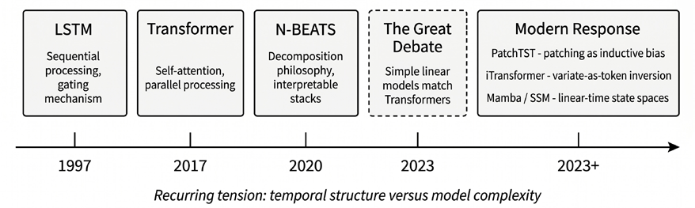
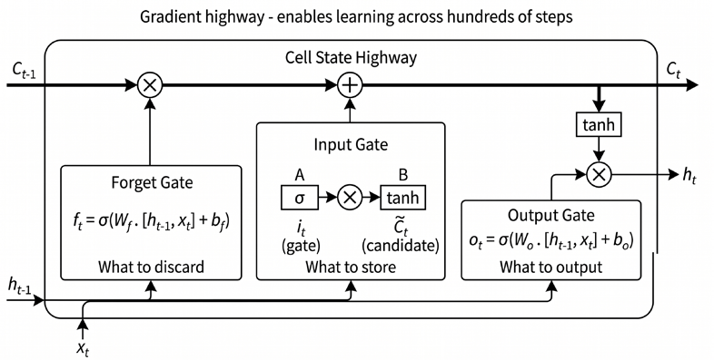
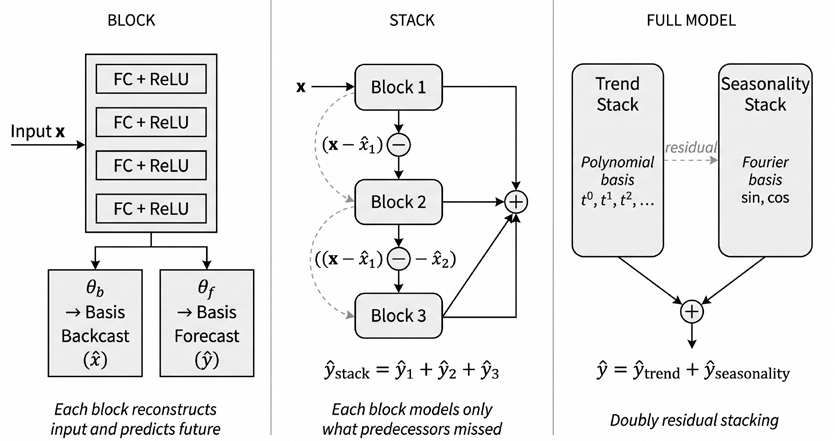
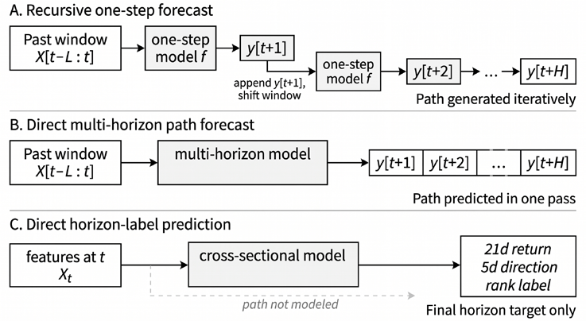
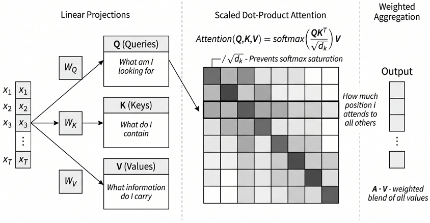
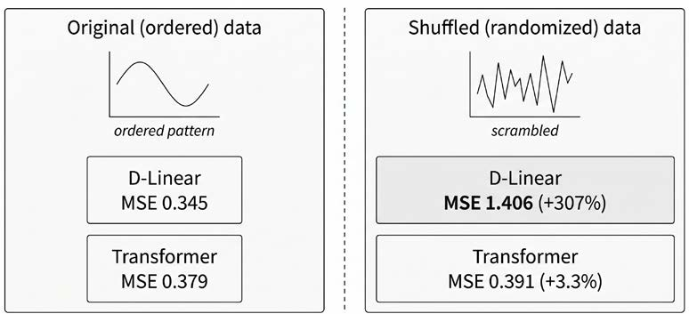
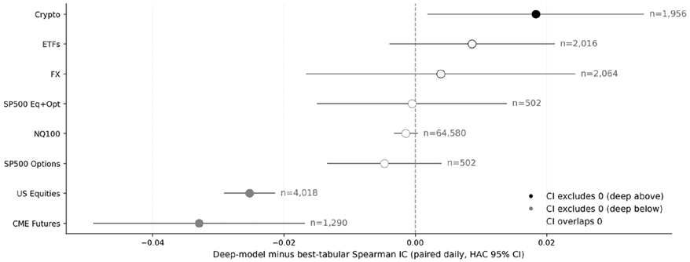
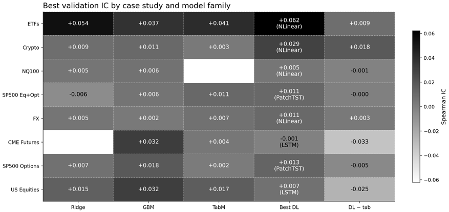

# 第13章：深度学习时间序列

当观测的先后顺序可能携带最新数据点之外的信息时，深度学习便进入时间序列预测的领域。*第11章*和*第12章*主要把预测当作截面问题：给定今天的特征，预测未来的标签。本章要讨论的是：序列历史本身何时能带来增量信号、哪些架构能够提取它，以及预测目标的设定方式如何改变答案。

这一设定的选择至关重要。有些模型一步步生成未来路径；有些模型在一次前向传播中预测整条未来路径；而许多金融机器学习流水线则跳过路径，只预测一个 horizon 标签（horizon label，某一预测期上的标签），例如 5 日收益、21 日收益、方向或截面排名。本章聚焦于架构，并与其他建模章节一致，按预测性能来评估它们。*第17章*将回到交易目标本身，展示深度学习如何在配置层面的损失函数（如夏普比率、回撤和成本感知目标）下直接学习仓位或组合权重。

架构选择问题的答案并不是"用 Transformer 就对了"。更恰当的理解是，现代时间序列建模是各种归纳偏置之间的竞争：循环结构、显式分解、注意力、卷积、状态空间模型，以及强线性基线。它们对时间结构、协变量和预测期各有不同假设。实践中的任务是判断：何时序列模型的复杂度是值得的，何时直接预测 horizon 标签是更简洁的设定，何时应把问题下沉到下游的配置目标中。

学完本章，你将能够：

- 解释循环网络为何成为长上下文预测任务的瓶颈。
- 比较主要的时间建模思想，并说明各自最适用的场景。
- 利用强基线和诊断手段判断序列模型的复杂度是否有必要。
- 区分现代时间序列 Transformer 变体的设计逻辑，并将其选择与多变量结构、协变量和预测期联系起来。
- 区分递归单步预测、直接多期路径预测与直接 horizon 标签预测，并解释这一区分为何重要。
- 评估时间序列基础模型在金融应用中的适配模式，包括迁移失配与预训练污染的影响。
- 应用 MC Dropout 和深度集成等实用的不确定性估计方法，为风险感知的交易决策提供支持。

*图 13.1* 展示了架构演进的时间线。我们从长短期记忆（LSTM）网络出发，看它的局限如何为 N-BEATS 和基于 Transformer 的架构创造了空间。Zeng 等人在 2022 年的一篇关键性批判表明，简单的线性模型往往优于复杂的 Transformer，挑战了"必须依赖精巧架构"的假设。PatchTST 和 iTransformer 等现代架构则以更强的时间归纳偏置作出回应。本章最后给出一个面向实践者的架构选择框架——依据问题特征而非研究热度来选型。

*图 13.1：时间序列架构演进时间线*

一切从循环网络说起；它的局限催生了其后的每一种架构。

## 13.1 循环网络及其局限

**循环神经网络**（RNN）维护一个**隐藏状态**，它随网络逐个处理序列元素而不断演化。这一设计使 RNN 直到 2010 年代中期都是时间序列预测的默认架构。

**长短期记忆网络**（**LSTM**）（Hochreiter and Schmidhuber, 1997）解决了限制朴素 RNN 的难题：**梯度消失**使模型无法学习长程依赖（Hochreiter et al., 2001）。LSTM 引入了细胞状态，它像一条传送带，让信息跨越许多时间步流动而几乎不衰减。

### LSTM 门控机制

LSTM 的威力来自三个门（遗忘门、输入门和输出门），它们调节信息流动（*图 13.2*）。细胞状态的更新综合了三者的决策：C_t = f_t ⊙ C_{t−1} + i_t ⊙ tanh(W_C · [h_{t−1}, x_t] + b_C)，其中 f_t 和 i_t 是前一刻隐藏状态与当前输入经 sigmoid 门控的函数。这种门控机制使 LSTM 能够有选择地记住或遗忘信息，理论上可以捕捉跨越数百个时间步的依赖。在金融应用中，LSTM 已被用于波动率预测、收益预测和限价订单簿建模（Zhang, Zohren, and Roberts, 2019）。

*图 13.2：包含遗忘门、输入门和输出门的 LSTM 单元*

### 两大局限

LSTM 有两个局限，推动了对替代方案的探索。**顺序计算瓶颈。** t 时刻的隐藏状态依赖于前一时刻的隐藏状态，使计算在本质上依赖于序列的长度。

LSTM 仍能受益于 GPU 加速，但与 *13.3 节*讨论的基于注意力的模型相比，其循环结构限制了时间维度上的并行。对于拥有数以万计观测的高频数据，这一瓶颈可能变得难以承受。Transformer 通过矩阵运算同时处理所有时间步，在相近序列长度下训练速度往往快得多。

- **梯度流动的挑战。** LSTM 虽为解决梯度消失而设计，但并未彻底消除该问题。对于非常长的序列，梯度在随时间反向传播（Werbos, 1990）过程中仍需穿过大量门控操作。实践中，名义上很长的回看窗口并不保证模型真正利用了远处的信息；它往往只会增加噪声、训练不稳定性以及对超参数的敏感性。对信号微弱且非平稳的金融序列而言，这一区别比架构的理论容量更重要。

`01_core_architectures` 在一个刻意简化的 ETF 任务上演示了**计算与信号之间的权衡**：用合并（pooled）的单变量 60 日收益窗口预测同一只 ETF 的次日收益。在这个噪声极大的目标上，LSTM 的训练速度约为同等 MLP 的一半（32 秒对 17 秒），而次日收益排序能力并无优势：两个模型的截面 Spearman IC（信息系数）都接近零。**门控循环单元**（**GRU**）对 LSTM 作了简化：把遗忘门与输入门合并为单一的更新门，并取消独立的细胞状态，在 `01_core_architectures` 实现中参数量约减少四分之一。这种精简可以缩小模型规模，有时还能在较小数据集上改善泛化。然而，GRU 继承了两项根本局限：顺序计算复杂度仍是 O(T)，且经过合并门控机制的梯度流动在长序列上仍会衰减。GRU 训练略快，IC 同样接近零：更轻量的循环单元解决不了收益预测问题。

这组比较展示的是架构而非策略：循环结构增加了顺序计算，却没有改善次日收益排序，这反映出收益序列中的信号本就微弱。

一些金融过程表现出**长记忆**特性，例如波动率聚集（*第9章*）、持续的订单流和日历效应，其依赖关系可跨越多个交易日甚至更长。这些长程依赖可能超出 LSTM 通过基于梯度的学习所能可靠捕捉的范围，尤其是在有效信号微弱且非平稳时。

这些局限推动了两条并行的架构路线：把经典分解嵌入神经网络（*13.2 节*），以及从自然语言处理引入注意力机制（*13.3 节*）。

## 13.2 N-BEATS 与显式分解

**N-BEATS**（Oreshkin et al., 2019）编码了一种特定的归纳偏置：时间序列由可解释的成分（趋势与季节性）复合而成，神经网络应当显式地分解它们，而不是隐式地自行发现。

### 块、堆栈与双重残差学习

N-BEATS 架构通过层级结构从简单组件构建复杂度。

- **基本块**。基本单元是一个全连接块，以历史数据的回看窗口作为输入。输入经过若干带 ReLU 激活的密集层。该块产生两个输出：面向未来预测期的 *forecast*（预测），以及重建历史输入的 *backcast*（回溯）。backcast 代表该块对输入信号"理解"了什么。
- **残差堆叠**。多个块在堆栈内顺序连接。第一个块接收原始输入；后续每个块接收前一个块的*残差*，即原始输入减去前一块的 backcast。这迫使每个块专注于前面的块未能捕捉的部分，从信号中逐步提取更精细的模式。
- **双重残差架构**。完整模型把多个堆栈链在一起，在更高层级上应用同样的残差原则。第二个堆栈接收整个第一个堆栈的残差。这样就形成了一种深层的分层分解：较早的堆栈捕捉主导模式，较晚的堆栈精修细节。最终预测是所有堆栈中所有块级预测之和。这种渐进式精修起到了强正则化的作用，与树方法的提升（boosting）类似（*第12章*），因为每个块只需解释前序块遗漏的部分。

*图 13.3* 展示了完整的"块—堆栈—双重残差"结构。

*图 13.3：N-BEATS 的块—堆栈双重残差架构*

### 基展开

N-BEATS 生成输出的机制使它有别于一般的神经网络。每个块的末层并不直接输出预测值，而是产生*展开系数*，为*基函数*加权。对于预测，块输出系数 θ_f，与基向量 g_f 组合：ŷ = Σ_{i=1}^{|θ_f|} θ_{f,i} · g_{f,i}

这一方法将经典分解加以推广。拟合趋势等价于为多项式基寻找系数；建模季节性等价于为傅里叶基寻找系数。在通用（generic）N-BEATS 配置中，模型从数据中学习合适的基函数；在可解释配置中，这些基被显式约束。

### 让 N-BEATS 可解释

可解释配置 **N-BEATS-I** 将每个堆栈约束为建模特定成分。*趋势堆栈*使用多项式基。对于 p 次多项式，趋势预测变为：y_trend(t) = Σ_{i=0}^{p} θ_{trend,i} · t^i

神经网络学习刻画潜在趋势成分的最优多项式系数。*季节性堆栈*使用由正弦和余弦项构成的傅里叶基，由网络学习最能表示周期模式的系数。

最终预测按加法分解：预测 = 趋势 + 季节性。你可以分别绘制每个成分，直接洞察是什么在驱动预测。这种透明度在深度学习模型中十分罕见，对建立生产系统的信任很有价值。

### 扩展：N-BEATSx 与 N-HiTS

N-BEATS 之所以声名鹊起，是因为它用纯深度学习方法达到了 M4 竞赛冠军的精度，表明恰当的归纳偏置能够在多样的预测领域弥合神经网络与传统方法之间的差距。

该架构启发了两个著名的扩展：

- **N-BEATSx** 引入外生变量。当天气或宏观经济指标等外部因素驱动预测时，它们至关重要。在金融应用中，这使得模型能够以宏观经济数据发布、日历效应或跨资产信号为条件。
- **N-HiTS**（Challu et al., 2022）引入分层插值与多速率信号处理，通过同时捕捉多个时间分辨率上的模式来提升长预测期的精度。其 MaxPool 下采样在为长程堆栈降低输入维度的同时，保留了短程堆栈的细节。

两个扩展都保留了结构化分解的核心理念，同时扩大了模型的适用范围。

### 实践注意事项

N-BEATS 对**回看窗口与预测期之比**很敏感：回看窗口太短会让分解缺乏上下文，而预测期过长则可能使训练不稳定。当真实的生成过程无法干净地分解为多项式趋势与傅里叶季节性时——在市场状态变化打破这两项假设的金融数据中，这是常态——可解释配置可能逊于通用变体。因此，在确定采用可解释变体之前，应先在目标数据上将 N-BEATS-I 与 N-BEATS-G 进行基准比较。

分解是摆脱顺序处理的一条出路；从语言模型引入注意力机制是另一条，它改变了模型关联远距时间步的方式。

**实现**：`02_nbeats_interpretable` 用 PyTorch 从零实现该架构，逐步搭建块、堆栈和双重残差连接，并在 SPY 数据上训练和评估两种配置。

## 13.3 用于时间序列的注意力机制

N-BEATS 沿用并发展了经典分解原则，而一种更激进的思路来自自然语言处理。Transformer 架构（Vaswani et al., 2017）完全弃用循环结构，转而采用自注意力——一种同时建模所有序列元素对之间关系的机制。把它适配到时间序列，等于押注：一个足够通用的机制能够仅凭数据学出所有时间结构，无需分解先验。

### 将 Transformer 适配到时序数据

把 Transformer 应用于时间序列，需要处理该架构源自离散 token 序列这一事实。三项关键适配弥合了这一鸿沟：

- **通过 patch 切分实现 token 化**。词是自然的离散单元，时间序列取值则不同：连续且采样密集。朴素做法是把每个时间步当作一个 token，但这会产生注意力机制难以承受的超长序列。现代方案是 *patch 切分*（patching）：把输入窗口切分为定长子序列，作为输入 token。512 个时间步的回看窗口可以切出 32 个 patch，每个长 16。patch 切分在保留每个 patch 内局部时间模式的同时降低了计算成本。

**注意：patch 切分中的数据泄露**

如果归一化统计量是在整个窗口上而非按因果方式计算的，patch 切分可能引入数据泄露。实践者必须确保所有预处理都尊重时间边界：要么对每个 patch 独立归一化，要么只使用后向看的统计量。

- **位置编码**。自注意力具有*置换不变性*：缺少额外信息时，它无法区分序列 (x₁, x₂, x₃) 与 (x₃, x₁, x₂)。对时间顺序至关重要的时间序列而言，这是关键缺陷。位置编码通过向每个 token 的嵌入加上依赖位置的向量来注入顺序信息。最初的 Transformer 使用固定的正弦位置编码；许多时间序列变体则在训练中学习这些编码。

- **编码器—解码器结构**。标准 Transformer 由编码器和解码器组成：编码器处理历史回看窗口以构建上下文表示，解码器生成预测。时间序列适配使用了该模板的多种变体，包括仅编码器（encoder-only）结构和直接多期预测头。

预测目标的设定是与架构无关的另一个设计选择。模型可以是循环、注意力、分解或线性结构，但仍需要定义预测目标。本章涉及三种设定（见*图 13.4*）：

1. 递归单步预测学习一个超前一期模型并向前滚动。模型从过去的窗口预测 y_{t+1}，把该预测拼接到输入中，再预测 y_{t+2}，如此重复直到 y_{t+H}。这是单步统计预测（包括 *第9章* 用于构造模型化特征的 ARIMA 类模型）的自然延伸，但预测误差可能在预测期内不断复合。
1. 直接多期路径预测在一次前向传播中预测整条未来路径（y_{t+1}, y_{t+2}, …, y_{t+H}）。许多深度预测架构——包括序列到序列模型和多期预测头——都是为此任务设计的。它们避免了递归式误差传播，但仍要建模未来路径，必须学习所有中间步骤的联合结构。
1. 直接 horizon 标签预测跳过路径，只预测投资问题最终使用的标签：5 日收益、21 日收益、方向、波动率溢价或截面排名。这是*第11章*、*第12章*、*第13章*和*第14章*的主要设定。模型可以使用序列输入，但其目标是有监督的 horizon 标签问题，而非时间序列路径预测。

*图 13.4：金融时间序列的三种预测设定*

递归预测一步步生成路径，直接多期预测一次预测出整条路径，而直接 horizon 标签预测跳过路径，只预测最终目标。

三种设定都会在本章反复出现，但案例研究评估聚焦于序列架构在直接 horizon 标签预测下的表现。

### 自注意力机制

**自注意力机制**在*第10章*面向语言应用时已有介绍，应用于时间序列 token 时运作方式完全相同。每个位置通过查询（Query）、键（Key）和值（Value）投影关注所有其他位置（见*图 13.5*）：Attention(Q, K, V) = softmax(QK^⊤ / √d_k) V

RNN 必须通过隐藏状态按顺序传递信息，自注意力则不同，它能在任意两个位置之间建立直接连接，与距离无关。多个**注意力头**并行学习不同类型的关系（局部趋势、季节性、市场状态切换），其输出通过一个可学习的投影合并。

*图 13.5：通过查询、键和值投影实现的自注意力*

朴素 Transformer 的 O(L²)（二次方）注意力复杂度催生了一批*聚焦效率的变体*，包括 **Informer**、**Autoformer**、**FEDformer** 和 **Pyraformer**，它们各自通过稀疏注意力或频域注意力降低成本。它们共享一个*共同假设*：时间序列应当像语言一样被 token 化，由注意力计算时间位置之间的关系。注意力究竟是真的提取到了时间结构，还是仅仅过拟合了更简单模型也能匹配的模式，在下一节的实证挑战出现之前始终悬而未决。

## 13.4 线性基线与 Transformer 之争

Zeng 等人（2022）证明，简单的线性模型在标准长期预测基准上可以胜过多种基于 Transformer 的架构。这一结果改变了该领域对基线的预期：新架构若不能超越强线性基线，就不应被认真对待。

同时，这些结果并不能证明注意力对时间序列建模普遍无效。它们表明的只是：在广泛使用的基准任务上，额外的架构精巧往往未能提升预测精度。

实践含义很明确：从简单而强的基线开始，只有当复杂度能带来稳健的样本外增益时才引入它。

### 置换不变性与时间顺序

反对把 Transformer 用于时间序列的核心论点，指向自注意力的数学性质。该机制是**置换不变的**：没有位置编码时，注意力把输入序列当作无序集合处理。位置 i 上的查询与所有其他位置上的键做点积，无论这些位置如何排列，结果都相同。**位置编码**注入顺序信息，但 Zeng 等人认为，这不过是对一个可能未充分利用时间结构的机制打的补丁。问题不在于 Transformer *不能*表示顺序（它可以），而在于顺序必须显式注入，并且视架构与训练动态而定，它在实践中可能被低估。

更深一层的要点是：Transformer 擅长自然语言处理，是因为语义关系常常超越位置——"king"和"queen"无论出现在句中何处，概念上都相关。时间序列预测却是关于位置关系的：t 时刻的取值在因果上依赖于 t−1、t−2 等时刻的取值，因此时间排序本身就可能携带预测信号。把置换不变架构用于顺序至上的任务，是工具与问题的错配。

### LTSF-Linear 基准

为了实证检验其批判，Zeng 等人（2022）提出了一族"简单得令人尴尬"的单层线性模型，作为**长期时间序列预测**（LTSF）的新基线。LTSF 指预测未来许多步而非仅下一时刻取值的任务：

- **Linear** 通过一次矩阵乘法把回看窗口直接映射到预测期，没有隐藏层、非线性或注意力。
- **D-Linear** 先用简单移动平均把序列分解为趋势和季节性成分，再对每个成分分别施加线性层，最后求和。它在纳入 N-BEATS 验证过的分解洞见的同时，几乎不增加复杂度。
- **N-Linear** 针对分布漂移做归一化：在线性层之前减去最后一个输入值，在输出中再加回来。当测试期统计量与训练期不同，这个简单技巧能稳定预测。`03_great_debate` 实现了全部三个 LTSF-Linear 变体，外加一个朴素 Transformer 编码器，以便直接比较。

这些模型在普通硬件上几秒即可训完，总参数量比 Transformer 变体小若干个数量级。

### 结果与诊断证据

在 Zeng 等人（2022）的实验中，这些线性模型在全部九个 LTSF 基准数据集上都胜过 Transformer 架构，比 Informer、Autoformer 和 FEDformer 提升了 20%–50%。表面的进步是虚幻的，它来自与弱基线的比较，而非真正的架构进步。

诊断实验揭示了具体的失败模式。随着回看窗口变长，大多数 Transformer 的预测误差*不降反升*：它们被额外的噪声干扰，而不是提取出有用信号。当输入序列被随机打乱（摧毁全部时间结构）时，D-Linear 的 MSE 增至四倍以上（0.345 到 1.406），而 Transformer 几乎不变（0.379 到 0.391；*图 13.6*）。D-Linear 依赖时间结构，失去它便崩溃；Transformer 主要依赖通道间相关性，因此移除时间轴几乎没有代价。注意力并没有学到时间模式。**实现**：`03_great_debate` 在 ETF 收益数据上复现了这些诊断。

*图 13.6：打乱实验：输入打乱后的 D-Linear 与 Transformer 对比*

### 反方观点与注意事项

Zeng 等人（2022）的论文并非定论。原始研究聚焦单变量预测；在协变量丰富的*多变量场景*中，跨序列注意力可能提取出有意义的关系，Transformer 或许表现更好（见下一节）。这项比较也可能低估了 Transformer 的潜力：经过仔细的*超参数调优*，基于注意力的模型在同一批数据集的部分上面可以追平甚至超过线性基线，说明结果对训练预算敏感。最后，按语言模型的标准，**这些基准规模很小**。在数百万条多样序列上训练的时间序列基础模型或许能释放规模化的收益。不过，*13.6 节*将表明，金融数据方面的证据喜忧参半。

后续的大规模评估强化并推广了这一信息。实验条件的微小变化（超参数预算、训练/测试划分、指标选择）就能让标准 LTSF 套件上的模型排名反转；在多个跨领域预测基准上，统计和线性基线频繁追平或击败在单个数据集上被视为最先进的深度模型。问题已经超出"Transformer 对 Linear"，延伸到**基准结论本身的脆弱性**。

深入考察部分 Transformer 为何成功，会发现 **token 化与归一化的选择比注意力机制本身更重要**。这些基准上的性能主要由变量内依赖和数据集平稳性驱动，这可以部分解释：为什么"打乱"式批判在标准套件上成立，而在更难的任务上预测力有限。实践中的比较不是"Transformer 对 Linear"，而是"强线性基线对经仔细调优的时间序列感知 token 化"，后者的优势取决于问题特征。这篇论文起到的是重置作用，而非控诉。如今，任何新架构都必须展示出对 LTSF-Linear 的明确改进，而不只是超越以往的 Transformer。目标从"把 Transformer 做大"转向"把 Transformer 做得更*聪明*"，新一代架构——从 **PatchTST** 的时间维度 patch 切分到 **iTransformer** 的变量反转——正是对这一挑战的直接回应。

## 13.5 现代 Transformer 变体

Zeng 等人（2022）的批判催生了新一波创新，而不是终结了基于 Transformer 的预测。现代架构通过引入更强的时间归纳偏置来弥补已发现的弱点，同时保留注意力机制建模复杂依赖的能力。三个模型体现了这一演进路线：PatchTST、iTransformer 和时间融合 Transformer（TFT）。

### PatchTST：把 patch 切分作为归纳偏置

Nie 等人（2023）提出的 **PatchTST** 给出了对批判的简单而有效的回应：不与 Transformer 的置换不变性对抗，而是设计与之配合的输入表示。**PatchTST 把 patch 切分确立为核心归纳偏置**。输入时间序列被切分为固定长度 P 的不重叠 patch。L 个时间步的回看窗口大约变成 L/P 个 patch，每个 patch 视作单个 token。这一设计有多重含义：

- **计算效率**：注意力复杂度是 O(N²) 而非 O(L²)（N 为 patch 数量），大幅削减使得长得多的回看窗口成为可能
- **局部模式保留**：每个 patch 封装了局部时间结构，而逐点 token 化会让这些信息分散到整个注意力机制中
- **语义连贯性**：patch 代表时间演化中有意义的单元，更接近语言中的词而非单个字符

对*多变量时间序列*，PatchTST 在训练期间忽略跨通道依赖。每个通道（多变量集合中的每条时间序列）通过共享的 Transformer 权重独立处理。预测按通道生成，不尝试建模变量之间的相关性。

这看似反直觉，因为多变量数据理应包含值得利用的跨序列信息。但通道独立性起到了正则化的作用。在许多基准上，跨通道注意力会过拟合训练数据中无法泛化的虚假相关。通过强制模型仅凭每条序列自身的历史来预测它，PatchTST 避开了这一陷阱，同时仍能受益于跨通道学到的共享表示。

PatchTST 常配合**可逆实例归一化**（RevIN）来处理分布漂移，在注意力机制处理数据之前先中和局部分布偏移。这一归一化技巧（减去实例均值、除以实例标准差，再在输出上逆转该变换）对那些随时间在不同统计状态间游走的时间序列至关重要。

patch 切分、通道独立性与 RevIN 的组合，让 PatchTST 在 LTSF 基准上取得了最先进的结果，既超越更早的 Transformer 变体，也胜过了此前与之打平的线性模型。

### iTransformer：反转维度

PatchTST 在保留标准 Transformer 结构的同时改变其输入；iTransformer（Liu et al., 2024）则更为激进：它**反转了注意力作用的维度**。

在标准多变量 Transformer 中，每个 token 代表一个时间步，包含所有变量的取值；注意力在时间维度上运作，把不同时刻相互关联。iTransformer 反其道而行：**每个 token 代表一整条单变量序列**（或其相当大的部分），注意力在变量之间运作。具体而言，给定含 N 个变量的多变量序列，iTransformer 创建 N 个 token，每个 token 嵌入一条变量的完整时间历史。注意力随之学习变量之间的关系：一种资产的表现如何关联另一种资产，领先指标如何连接滞后指标。

反转为何有效？这一设计完全绕开了时间顺序批判。模型不对时间步施加置换不变的注意力；每条变量内部的时间模式由初始嵌入过程捕捉，而该过程可以采用任何时间感知架构（例如沿时间轴应用的 MLP 或卷积）。注意力转而**建模跨变量依赖**——在变量之间通常不存在内在排序的领域，置换不变性不成问题。

对涉及相关资产组合的*金融应用*，iTransformer 天然契合。模型可以学到科技股联动、黄金与美元负相关、一个市场的波动率飙升预示其他市场飙升。这些跨资产动态正是注意力机制擅长捕捉的复杂、非局域关系。

### 用时间融合 Transformer 处理协变量丰富的预测

PatchTST 和 iTransformer 面向纯时间序列预测优化，而**时间融合 Transformer**（TFT）应对的是另一类挑战：在元数据丰富且已知未来输入可用时进行预测（Lim et al., 2021）。金融应用中常见：

- 静态协变量（行业、交易所、资产类别）
- 时变观测输入（成交量、波动率、宏观指标）
- 已知未来输入（日历特征、计划事件、期权到期日）

TFT 提供了一个整合三者的规范化架构：其特色是*可学习的变量选择*（一种门控机制，为输入分配时变重要性权重，提供了 PatchTST 和 iTransformer 所缺乏的可解释性）和多期分位数输出——产生*校准过的预测区间*而非点预测。对风险管理和仓位规模而言，这种原生的不确定性量化比对点预测架构做事后处理更有依据。

什么时候该选 TFT？它在输入类型异质的协变量丰富场景中最强，例如融合行业元数据、宏观指标和日历效应的组合预测。对没有协变量的纯时间序列，PatchTST 更简单的设计通常能追平或超过 TFT。协变量感知预测是一条设计轴线，TFT 的协变量处理已不再是独家。近期的基准把协变量类别（静态、仅过去、动态、已知未来）形式化为评估的主要维度。一个新出现的结论是：把预测重构为带时间特征的表格回归，无需专门的时间序列架构也能取得有竞争力的协变量感知性能——这直接呼应*第11–12章*的表格方法。

*表 13.1* 汇总了这一比较。

| 模型 | 关键创新 | 注意力作用域 | 最适用场景 |
| --- | --- | --- | --- |
| 朴素 Transformer | 自注意力 | 时间步 | 短序列、简单基线 |
| TFT | 变量选择 + 协变量 | 时间步 | 协变量丰富、带不确定性的多期预测 |
| PatchTST | patch 切分 + 通道独立 | 时间 patch | 长期单变量/多变量 LTSF |
| iTransformer | 变量即 token 的维度反转 | 变量 | 跨资产动态、组合预测 |

*表 13.1：Transformer 小结*

任何基准都无法替代在目标数据上的验证：ETTh1 电力需求与加密货币收益几乎没有共同之处。

Transformer 远非对循环瓶颈的唯一回应：时间卷积、状态空间模型和预训练基础模型各有不同的权衡，下一节将逐一考察。

**实现**：`04_transformers` 在 ETF 收益预测上对 PatchTST、iTransformer 和 Ridge 进行基准测试。在 60/20/20 时间划分与截面 IC 下，Ridge 为 +0.010，在相同随机种子的多次重跑中是稳定的锚点。两个 Transformer 都小幅超过该锚点，但两者的相对排序（PatchTST 对 iTransformer）在相同代码、相同数据的多次重跑间漂移。在这样的信噪比下，单次划分的点估计不足以稳定地为架构排序；注意力路径中 cuDNN 的非确定性相对于 ETF 面板 IC 的量级不可忽略。*13.9 节*的 walk-forward（滚动前推）案例研究才是权威排名。在那里，时间建模的边际收益取决于特征流水线已经提取了多少信号。

## 13.6 其他架构与基础模型

除分解与注意力之外，**还有若干架构针对特定的预测需求**：

- **时间卷积网络**（**TCN**；Bai, Kolter, and Koltun, 2018）通过膨胀因果卷积保证因果性，在 RNN 与 Transformer 之间提供了兼顾高效并行与显式时间排序的中间道路。
- **TSMixer**（Chen et al., 2023）表明，交替使用时间混合层与特征混合层的精心设计的 MLP，在标准基准上可以与注意力一较高下。
- **基于 CNN 的方法**（Jiang et al., 2020）用格拉姆角场（GAF）把价格历史转换为图像——GAF 将时间序列变换为捕捉两两时间关系的矩阵。这样，CNN 便可把价格动态当作视觉纹理，检测反复出现的市场形态。

**统计—神经混合模型**代表一种设计理念而非单一架构：让经典模型处理已知结构（水平、季节性、趋势），由神经网络学习残差或时变参数。M4 预测竞赛冠军 ES-RNN（Smyl, 2020）将 Holt-Winters 指数平滑与 RNN 结合。Holt-Winters 是一种递归更新水平、趋势和季节性估计的经典预测方法；ES-RNN 先用这一分解剥离非平稳结构，再让 RNN 学习乘法修正。

**深度状态空间模型**（Rangapuram et al., 2018）采用概率路线：神经网络为线性状态空间模型生成时变参数，推断通过卡尔曼滤波完成（详见*第9章*），既保留了对理解透彻的贝叶斯滤波结构的沿用，又允许非平稳参数化。

这种混合理念延续在 N-BEATS 的分解先验（*13.2 节*）、TFT 的结构化协变量处理（*13.5 节*）以及下文的现代 SSM 之中；但在数据稀缺、纯神经网络容易过拟合的场景，显式的混合方法依然有价值，经典结构提供了关键的正则化（Lim and Zohren, 2021）。

有三项进展值得深入讨论：状态空间模型——它以不同的方式处理序列；基础模型——它对金融中的迁移学习有重要启示；以及新兴的评估基础设施——它决定任何宣称的进步是否可信。

### 状态空间模型

**状态空间模型**（SSM）已成为序列建模中 Transformer 的主要替代。SSM 受**连续时间动力系统**启发，经离散化后用于序列处理。潜在状态按学到的动力学演化：

h_t = A h_{t−1} + B x_t

y_t = C h_t + D x_t

在常规 SSM 中，矩阵 A、B、C、D 在训练中学得，然后在所有序列位置上统一使用。

Gu 和 Dao（2023）提出的 **Mamba** 架构在保持长程依赖建模能力的同时实现了线性 O(L) 复杂度。Mamba 的创新是**选择性状态空间**：模型学习的是一些函数，为每个时间步生成依赖输入的 SSM 系数。具体来说，B_t、C_t 和离散化步长 Δ_t 依赖于当前输入 x_t；基础转移矩阵 A 仍是学习得到且共享的，而有效的离散化转移通过 Δ_t 变化。这使循环变得内容感知，模型得以保留相关信息、过滤掉上下文噪声输入。因此，Mamba 把循环模型的时间结构化记忆与硬件感知并行化结合在一起，在极长序列上保持高效——即便打了 patch 的 Transformer 在那种场景下也会变得昂贵。

基础 SSM 的一个局限是依赖单一时间分辨率。金融数据包含跨多个时间尺度的信号：分钟内的微观结构动态、数日间的动量、数月间的市场状态切换。**多尺度 Mamba** 架构（**ms-Mamba**）为此部署以不同采样率运行的并行 Mamba 块，同时捕捉高频与低频模式，而无需付出多尺度注意力的二次方代价（Karadag et al., 2025）。这直接针对 *13.1 节*讨论的长记忆特性：波动率聚集和持续订单流在多个时间粒度上产生跨越数十个甚至更多交易日的依赖，恰恰是单一分辨率模型丢失信息的场景。

最好把 SSM 理解为**序列混合原语工具箱**的一部分，而非注意力的全面替代。实际问题就是：我的上下文长度、延迟预算和维护负担是多少？对超过 10000 个时间步的序列——例如跨越几分钟到几周的 tick 级或分钟 bar 数据——SSM 有明显的效率优势，因为线性复杂度避免了二次方注意力方法遇到的内存耗尽。对较短但跨变量结构丰富的序列，基于注意力的模型仍占上风，因为跨变量注意力能捕捉 SSM 原生不建模的组合动态。

交替排列注意力层与 SSM 层的混合架构是活跃的研究方向，但缺乏广泛的独立验证。最有前景的金融专用工作 **FinMamba**（Hu et al., 2025）将市场感知的图构建与多级 Mamba 块结合用于股票涨跌预测，但仍只是单篇论文的结果，有待复现。

我们在 ETF 收益预测上以 Ridge 基线评估各架构。在单次 60/20/20 划分上，Ridge 以截面 Spearman IC +0.016（MSE 0.0035）锚定比较，且在相同种子的多次重跑中保持稳定。TCN 与 TSMixer 的点估计落在 Ridge 的重跑噪声范围内：相同代码多次重跑中，TCN 从 +0.051 反转到 -0.013，TSMixer 从 +0.013 变到 +0.001，其 MSE（TCN 0.0043、TSMixer 0.0039）接近 Ridge。在这样的信噪比下，单次划分 IC 只是架构层面的健全性检查，而非排序信号；*13.9 节*的案例研究提供了更彻底的 walk-forward 比较，而 TSMixer 在 ETF 面板上经 Darts 多步重训后在 21 天预测期达到 IC +0.029。

**实现**：

- `05_tcn` 实现膨胀因果卷积，感受野覆盖整个回看窗口
- `06_tsmixer` 交替使用时间混合与特征混合 MLP 层
- `07_mamba_ssm` 是 ETF 数据上的 Mamba/SSM 实现
- `08_cnn_image_encoding` 将价格历史转换为格拉姆角场图像并应用卷积特征提取

### 时间序列基础模型

时间序列**基础模型**（**FM**）遵循大语言模型的剧本：在海量语料上预训练以学习通用时间表示，再适配到下游任务。

第一代包括 **Chronos**（Amazon）、**TimesFM**（Google）、**Lag-Llama** 和 **MOMENT**，它们有一个共同局限：只支持单变量推断，原生不支持外生协变量或多变量结构，因而难以胜任资产共同演化、外部信号居于核心的量化金融。

时间序列基础模型把大语言模型*先预训练后适配*的逻辑引入预测。早期系统表明，大型预训练模型可以产生有用的零样本预测。然而，许多模型主要在单变量场景下评估，并非为真实应用中常见的多变量、协变量丰富结构而设计。

第二代直接解决这一问题。**Chronos-2**（Ansari et al., 2025）引入组注意力（group attention）机制，通过统一流水线处理多变量序列和外生协变量，借助上下文学习实现协变量感知的零样本预测。通过为目标及其关联协变量分配组标识，模型无需任务特定微调即可在相关序列间共享动态信息。**Moirai-MoE**（Liu et al., 2024）用稀疏**混合专家**（Mixture-of-Experts）路由取代基于频率的静态输入投影，其中 token 级门控自动适配数据的异质特征。

其结果是**用稠密模型一小部分的激活参数达到有竞争力的性能**：1100 万激活参数便能取得此前需要十亿级参数架构才能达到的精度。这些进展并不推翻本章讨论的第一代负面结果，但确实大大改变了适配的权衡算式。

#### 适配模式

基础模型如何部署，与选择哪个模型同样重要。文献已收敛于四种适配模式，各自有不同的算力、数据和维护要求：

- **零样本推断**：直接部署预训练模型，不更新权重。当目标领域接近预训练语料时可行：能源需求、零售销售、天气。实证证据表明，TSFM（时间序列基础模型）在数据稀缺时帮助最大；当训练数据充足时，并不能稳定胜过专门模型；而且缩放律并非严格单调。对金融收益而言，零样本表现不可靠（见下文）。
- **上下文学习（ICL）**：把历史参考序列和协变量与目标一起放入上下文窗口；模型在不更新权重的情况下推断当前分布。Chronos-2 的组注意力原生支持这一点。近期工作表明，训练 TSFM 在推断时于上下文中使用多条相关序列，有时能比肩在目标领域上的显式微调。ICL 最有价值之处是冷启动场景与快速原型开发，那里基于梯度的适配并不现实。
- **参数高效微调（PEFT）**：在领域数据上适配一部分模型权重（LoRA 适配器、低秩投影）。标准 PEFT 可能把适配器锁死在初始化附近的次优极小值，在噪声大的金融数据上尤其如此。两个方向显示出前景：一是渐进训练，随机停用适配器以鼓励更广的探索；二是先剪枝后微调，在适配前剪掉最多 90% 的参数反而获得更高精度。两者利用同一个洞见：基础模型对任何单一任务都是过参数化的，约束适配面能改善泛化。
- **测试时模型选择**与**集成**：与其微调一个大模型，不如构建一组较小的预训练模型，在推断时通过选择或集成加以合并。近期工作表明，该方法能在降低推断成本的同时达到单模型精度，且比测试时微调更节省算力。这条路径适合延迟、维护负担和可复现性比精度边际增益更重要的生产环境。

实践启示是把基础模型当作*初始化*而非现成方案。适配模式应匹配算力预算、数据可得性和部署约束，而不是模型的营销材料。

#### 规模化的极限

从 NLP 移植来的"性能随参数单调提升"假设在时间序列上并不成立。**GIFT-Eval 基准**（Aksu et al., 2024）的证据证实了这一点：该基准在 28 个数据集、1.77 亿数据点上强制执行严格的预训练/测试分离；将基于快速傅里叶变换（FFT）的长卷积与线性 RNN 交替组合的混合架构，用不到 300 万参数即取得有竞争力的零样本性能，与 15 亿参数的稠密模型精度相当。

独立评估证实，严格的缩放律在预测任务上并不总是成立，较小的模型可以在精度—效率帕累托前沿上占据有利位置。实践中，这意味着高性能零样本预测在普通硬件上即可实现，而不会带来难以忍受的推断延迟。正确的评估指标是**精度—效率前沿**，而非裸参数量。比较 TSFM 时，应在预测指标之外报告激活参数量、实际推断耗时和内存占用。

#### 金融领域的迁移鸿沟

尽管有这些进展，基础模型在金融应用中仍面临持续挑战。标准预测任务的基准表现与交易信号的实际效用之间的鸿沟，仍是 TSFM 落地金融的核心矛盾。

Rahimikia 等人（2025）对 TSFM 在金融预测中的表现做了*大规模评估*，覆盖 94 个国家、34 年的日度超额收益。现成的 TSFM 在统计和经济指标上均逊于树模型集成：

- 在美国零样本设定、512 天输入窗口下，Chronos Large 的样本外 R² 为 -1.37%，TimesFM 500M 为 -2.80%；相比之下，CatBoost 在相同窗口尺寸下为 -0.03%，对所有窗口尺寸取平均为 -0.10%。
- **方向准确率接近随机**。在 512 天设定下，Chronos Large 略高于 51%，TimesFM 略低于 50%，CatBoost 为 51.16%。因此，连树模型集成也在噪声底线附近运行，印证了贯穿全书的"弱信号叠加非平稳"前提。
- 在金融数据上预训练 TSFM 能显著改善经济表现：论文报告，在 512 天窗口下，Chronos small 的年化收益与夏普比率分别为 36.84% 和 5.42，TimesFM 20M 为 30.36% 和 3.66，支持**领域适配必不可少**而非可选的观点。

迁移不良源于*分布失配*：通用时间序列语料强调季节性、趋势和清晰模式，而这些在金融收益中基本不存在。资产价格的重尾、低信噪比和非平稳，与主导预训练语料的电力需求、天气和交通数据截然不同。

TSFM 在风险预测上展现出前景。收益预测的结果并不能推广到所有金融任务。对波动率与在险价值（VaR）预测——其目标具有更强、更可迁移的结构（波动率聚集、持续性和均值回归）——TSFM 有可信的证据支持。将 TimesFM 与 GARCH 等计量基线比较的研究报告，微调后的基础模型在多个 VaR 分位数上位居表现最好之列。统计预测比较检验支持这些增益：

- **Diebold-Mariano** 检验评估两个模型在给定损失函数下的平均预测精度是否相同
- **Giacomini-White** 检验评估条件预测能力，即在预测时点可得信息给定的情况下，性能差异是否仍然显著

即便对这些更有结构的目标，零样本预测也不够；必须进行增量微调，才能学到特定资产类别和评估期的波动率动态。

预训练模型特有的泄露风险值得警惕。在金融数据上评估 TSFM 时，标准的时间训练/测试划分必要但不充分。预训练语料成为新的泄露通道：如果 TSFM 的预训练数据与评估期重叠或相关，零样本的说法就站不住脚。

**TIME** 基准（Zou et al., 2025）用"全新数据集"和旨在保证严格零样本完整性的人机协同构建流程把这一点形式化。TSFM 的训练语料不断增大，使测试集完整性愈发难以保证，类似 LLM 评估面临的污染难题。实践者必须核实评估数据晚于预训练语料或被排除在语料之外，且没有经由相关序列产生的代理泄露。

对收益预测，带人工特征的树模型集成（*第12章*）仍是难以撼动的基线；对风险预测（波动率、VaR），微调后的 TSFM 是工具箱中可信的补充。面对金融数据，应优先选择输出分布为 Student-t 或混合分布的模型。

架构如此之多，问题便从"哪个模型最好"转向"哪个模型适合该问题"。下一节给出一个决策框架，用于把架构与数据特征、算力预算和部署约束匹配起来。**实现**：`09_foundation_models` 在 ETF 收益预测上比较零样本 Chronos、TTM 与训练后的基线。Chronos 的 IC 为 −0.015，TTM 为 −0.017，都比随机还差；而任务专用的 LSTM（5 万参数）IC 达 +0.025，连 Ridge 回归（60 个参数）也有 +0.022。Chronos 有约 2000 万参数，TTM 为 100–500 万，两者却都产生负的零样本信号，印证了通用预训练语料与金融收益之间的分布失配。

## 13.7 实用框架

本章的证据与权衡可以落实为一套实用的模型选择流程。

### 第 1 步：建立强基线

在评估任何深度学习模型之前，先建立一条任何复杂架构都必须超越的基线性能。下列模型构成一个基线阶梯：每一级都是更强的比较对象，必须超越之后，增加复杂度才有依据：

1. **季节性朴素**：对有季节模式的数据（收益序列等不属此类），用上一周期同一点的取值作预测。
1. **LTSF-linear**：D-Linear 变体先分解再施加线性层；N-Linear 用最后一个输入值做归一化以应对分布漂移。如果精巧模型不能胜过 D-Linear，其复杂度就没有依据。
1. **统计模型**：对趋势和季节性清晰的单变量序列，ARIMA 与 ETS 仍是强基线（*第9章*）。多变量场景下，VAR 提供了可比的基线。
1. **梯度提升模型**：带滞后特征的 LightGBM 或 XGBoost 常能比肩神经方法，在数据有限时尤其如此。将 GBM（梯度提升模型）用于时间序列，需要把序列问题转化为包含滞后特征（t−1, t−2, …, t−k）、滚动统计和日历特征的表格回归问题。GBM 擅长学习这些人工特征中的复杂非线性关系，但无法外推到训练范围之外。

*深度学习何时胜过 GBM？* *第11章*和*第12章*表明，梯度提升在许多表格截面问题上居首。在案例研究比较中，深度学习（DL）与最佳表格模型之间的配对日度 IC 差值（在共同日期差值上构建 HAC 区间）在八个覆盖深度学习的案例研究中有三个排除零：加密货币永续合约资金费率，NLinear 的 IC +0.029 稳健高于 GBM 的 +0.011；美股，LSTM 的 +0.007 稳健低于 GBM 的 +0.032；CME 期货，LSTM 接近零、稳健低于 GBM 的 +0.032。在 ETF 和外汇上，深度学习的点估计也超过最佳表格基线，但两者的配对区间都与零重叠。其余三个面板上，基线相当或更强。各案例研究的证据见 *13.9 节*的表 13.4。实用决策规则不变：检验时间排序是否在滞后特征工程之外带来增量信号；除非收益在样本外稳健，否则保留更简单的模型。**TabM**（*第12章*）通过批级特征交互扩展了表格深度学习，在 GBM 与序列架构之间提供了中间选择。对没有强序列结构的截面面板，它是 LightGBM 和 Ridge 之外有用的补充基线。

样本量阈值是按本书日频、中等信噪比（SNR）的案例研究校准的，应根据目标数据的信号强度和特征维度调整：

- **样本少于 5000**：Ridge 回归或 LightGBM。数据不足时深度学习有过拟合风险。
- **样本在 5000–20000**：LightGBM 通常提供最佳的精度—算力比。深度学习可能追平，但很少超越。
- **样本超过 20000**：LSTM 和其他深度架构可以*大规模测试*，但优势并无保证。大样本量应触发模型比较，而非直接换用深度模型。

一旦既定基线被超越，**基础模型提供了渐进式适配阶梯**：

1. 零样本推断（不花成本，但对金融收益不可靠）。
1. 用领域样本做上下文学习。
1. 在目标数据上做 PEFT/LoRA 适配。
1. 完整的领域专用训练。

每一步都增加算力和数据要求，同时改善领域匹配（*13.6 节*）。对协变量丰富的问题，应核实所选模型能原生处理相关协变量类型：TFT 和 Chronos-2 支持静态、仅过去和已知未来协变量，而纯序列模型（PatchTST、Mamba）需要通过特征工程引入外部信号。

### 第 2 步：诊断问题

问题多半属于以下类别之一：

- **单变量与多变量**。单变量预测时，N-BEATS 和 TCN 是自然选择。多变量预测时，选择取决于跨序列依赖是已知的还是需要学习的。
- **关系已知与未知**。如果关系结构已知（例如物理网络或供应链），图神经网络（GNN）（*第23章*）可直接利用；如果关系需要学习，iTransformer 的跨变量注意力或 PatchTST 的通道独立性更合适。
- **预测期**。长预测期（数周到数月）适合 PatchTST 和现代 Transformer。短预测期（数分钟到数天）性能差距缩小，更简单的做法更可取。
- **可解释性**。N-BEATS-I 提供趋势/季节分解；TFT 提供可学习的变量重要性；GBM 提供特征重要性。标准 Transformer 是黑箱。注意，SHAP 和 LIME（*第11章*）等事后方法通常忽略输入间的序列依赖，用于循环或注意力架构的重要性归因并不可靠（Lim and Zohren, 2021）。
- **协变量丰富度**。如果问题包含静态元数据、已知未来输入或异质特征类型，TFT 的变量选择架构正是为此场景设计。
- **序列长度**。极长序列（超过 1 万步）需要 Mamba 的线性复杂度。中等长度序列可由 PatchTST 用 patch 切分处理。

### 第 3 步：应用选择矩阵

诊断问题后，将特征与推荐架构匹配（*表 13.2*）：

| 场景 | 首选 | 备选 | 基线 |
| --- | --- | --- | --- |
| 单变量、需要可解释性 | N-BEATS-I | Autoformer | 季节性 ARIMA |
| 单变量、可接受黑箱 | PatchTST | N-BEATS（通用型） | D-Linear |
| 多变量、图结构已知 | GNN（第23章） | - | VAR |
| 多变量、相关性未知 | PatchTST | iTransformer | D-Linear |
| 高维（超过 50 条序列） | iTransformer | PatchTST | Linear |
| 长预测期 LTSF 任务 | PatchTST | D-Linear | 朴素重复 |
| 协变量丰富、多预测期 | TFT | PatchTST | LightGBM |
| 超长序列（超过 1 万步） | Mamba | TCN | 滚动统计与 GBM |
| 数据有限、需要稳健性 | ARIMA/LightGBM | N-Linear | 季节性朴素 |
| 零适配预算 | D-Linear | 零样本 TSFM | 季节性朴素 |
| 中等适配预算（PEFT） | PatchTST 与 LoRA | TSFM 集成 | LightGBM |

*表 13.2：架构选择矩阵。将问题特征与推荐架构相匹配*

验证与评估采用 walk-forward（滚动前推）协议（*第6章*）。务必包含非深度基线：省略它们会夸大表面收益。评估 TSFM 时，核实预训练/测试数据分离，以排除经由预训练语料的泄露（*13.6 节*）。在经济指标（IC、夏普比率、最大回撤）之外，报告 bootstrap 置信区间。

### 预测路径与预测 horizon 标签

本章的架构源于时间序列预测，即从序列的历史预测其未来取值。我们的案例研究流水线解决的是一个相关但不同的问题：给定每个资产的时间序列取值与特征的回看窗口，把未来收益预测为一个标量。这是带序列输入的直接面板回归，不是经典预测。换言之，模型看到的是序列，但有监督目标是预测期 H（往往在多个时间步之后）的标量标签，而不是从 t 到 t+H 的完整路径。

这一区分在实践中很重要：

- 真正的预测先预测路径（多日预测期内的日度收益），再把路径映射为标签
- 直接回归跳过路径，直接预测标签本身

对本书核心的截面排序任务，直接回归有两个优势：它与评估指标（预测标签上的 Spearman IC）一致，且避免了预测误差在预测期内复合。

这不同于递归预测和直接多期预测（见*图 13.4*）：

- 递归预测一步步生成路径
- 直接多期预测一次预测出整条路径
- 直接 horizon 标签预测完全跳过中间路径

对截面排序，最后一种设定往往是正确选择，因为评估指标定义在最终标签上，而非中间的日度路径上。如果我们关心路径本身——例如出于风险角度——选择可能改变。

我们直接检验了预测式设定。对 N-BEATS 和 TSMixer，我们运行了忠实的库实现（经 Darts）：它们预测日度收益路径并复合到 horizon 标签——这正是这些架构的设计任务。在 ETF（21 天预测期）和 CME 期货（5 天预测期）上，预测式设定产生的信号明显弱于同一数据上的直接回归模型（LSTM、NLinear）。长预测期放大了每步误差，且预测目标与排序指标不对齐。

这一发现带来一个实践教训：架构选择必要但不充分。预测问题本身的设定（直接回归对多步预测、截面排序对逐序列预测）决定时间建模能否带来价值。N-BEATS 和 TSMixer 是面向未来路径预测的忠实预测模型；LSTM 和 NLinear 与本书的直接 horizon 标签预测任务更匹配，因为它们直接学习标量排序目标。当路径重要时，N-BEATS、TSMixer 和 PatchTST 精巧的预测组件很有价值；当只评估 horizon 标签时，它们可能引入不必要的复杂度。

还有第四种设定，我们将在*第17章*讨论：*直接学习组合配置*。模型不再预测路径或 horizon 标签，而是输出仓位或组合权重，并在经济目标（如夏普比率、回撤、换手率或经交易成本调整的收益）上训练。

### 预测库

本章为演示目的直接用 PyTorch 实现各架构。对标准预测任务，几个成熟库能大幅减少实现工作量：

- **Darts**（Unit8）模型覆盖面最广，统一的 `fit()`/`predict()` API 横跨经典方法与深度学习方法。在标准预测任务上快速对多种方法做基准测试时，Darts 是合适的选择。
- **NeuralForecast**（Nixtla）提供原生面板数据支持和优化的训练循环。当需要跨多条相关时间序列训练共享模型时，NeuralForecast 是首要之选。
- **PyTorch Forecasting**（在 sktime 体系下维护）围绕时间融合 Transformer 构建。当问题涉及丰富协变量——静态元数据、已知未来输入和多个目标变量——时，它是合适的选择。
- **GluonTS**（Amazon）以 Chronos 和 Chronos-2 为核心支撑基础模型生态，原生支持概率输出。当部署目标是零样本或微调后的基础模型时，选择 GluonTS。
- **sktime** 提供兼容 scikit-learn 的元框架，把 Darts、NeuralForecast、HuggingFace 和经典方法统一在 `fit`/`predict`/`score` API 之下。需要更换后端而不重写数据流水线时，sktime 是合适的选择。

对标准的逐序列预测，Darts 或 NeuralForecast 能节省大量实现时间。对截面面板预测——按预测收益对 N 个资产排序并以 Spearman IC 评估（如我们的案例研究所要求的）——带自定义训练循环的原生 PyTorch 仍是最自然的匹配。我们的案例研究实验直接说明了这一点：用 Darts 的预测式设定运行 N-BEATS 和 TSMixer，产生的信号明显弱于直接回归式改造（见上文*预测路径与预测 horizon 标签*一节），证实了"选库即选建模方式"。

| 库 | 优势 | 面板支持 | 基础模型 |
| --- | --- | --- | --- |
| 原生 PyTorch | 完全控制、自定义损失、截面支持 | 手动 | 手动 |
| Darts | 模型覆盖广、统一 API | 有限 | TimesFM |
| NeuralForecast | 速度快、原生多序列 | 原生（unique id） | 否 |
| PyTorch Forecasting | TFT、丰富协变量 | 经 TimeSeriesDataSet | 否 |
| GluonTS / AutoGluon | Chronos-2、概率预测 | 经 DeepAR / Chronos-2 | 是 |
| sktime | 可组合流水线、封装后端 | 经 reduction | 经封装器 |

*表 13.3：时间序列深度学习库概览*

选对架构和库只是第一步：没有置信度度量的点预测，无法指导该以多大力度交易这个信号。下一节讨论不确定性量化——预测与仓位规模之间的桥梁。

**实现**：`11_library_landscape` 在同一预测任务上对原生 PyTorch、sktime 和 Darts 做了动手比较，包含各库的 API 细节与代码工作量指标。

## 13.8 量化预测的不确定性

点预测只是信号的一部分（见*第11章*）。对风险管理、投资组合构建和仓位规模而言，预测周围的不确定性往往与预测本身同等重要。同样是 +2% 的预测，伴随窄的预测区间与被宽不确定性带包围，理应得到不同的应对。实践中，通常无需转向全贝叶斯神经网络或其他专门的概率架构，就能从标准深度学习模型得到有用的不确定性估计。

### 用 MC dropout 与深度集成估计不确定性

深度学习模型无需全贝叶斯神经网络也能提供有用的不确定性估计。两种实用方法是**蒙特卡洛 dropout（MC dropout）**（Gal and Ghahramani, 2016）和**深度集成**（Lakshminarayanan et al., 2017）。二者出发点相同：不依赖单一确定性预测，而是从相近的模型生成多个合理预测，同时利用其均值和离散程度。

平均预测常能改善精度，因为特异的误差会部分抵消。预测间的离散程度则充当不确定性信号。当模型的许多合理版本给出相近预测时，可信度更高；当它们分歧很大时，预测就不够可靠。对交易应用而言，不确定性估计的主要实践价值在于：帮助区分哪些预测可以支撑更大仓位，哪些应当缩小仓位、收紧风险限额或干脆不交易。

**MC dropout** 从单个训练好的模型得到这种分布。推断时 dropout 保持开启，模型被反复求值，通常 50–100 次前向传播。每次前向采样不同的子网络，产生一个预测分布而非单一输出。样本均值成为点预测，样本标准差提供预测不确定性的简单度量。这种不确定性通常被解读为反映拟合模型本身的不确定性：不同合理子网络给出不同答案，模型预测随之变化。

**深度集成**以另一种方式生成同类分布。它不是从一个训练好的模型采样多个子网络，而是训练若干独立模型（通常 3 到 10 个），采用不同的随机初始化，有时还改变数据顺序或使用 bootstrap 样本。每个模型收敛到略有不同的解，集成由此覆盖一族合理的预测函数。对集成成员取平均常能改善预测表现，成员之间的分歧则自然地给出不确定性估计。

实践中，**深度集成往往比 MC dropout 更稳健**，但代价也更高，因为训练和推断成本都近似随集成成员数量线性增长。权衡很直接：

- MC dropout 更便宜、更容易加到现有模型上，因为几乎不需要改动架构
- 深度集成通常需要更多算力，但往往带来更强的预测表现和校准更好的不确定性估计

在许多应用场景中，约 5 个模型的集成在性能与计算成本之间是合理折中。

一个更精细的变体通过**异方差输出头**扩展深度集成：每个模型不仅预测均值，还预测方差。这意在刻画"有些观测本质上噪声更大"的事实：即便设定良好的模型，对某些资产、预测期或市场状态也可能不如对其他更有把握。这一扩展能产生更丰富的预测区间，但也增加了建模复杂度，并非获得集成主要实践收益所必需。核心道理更简单：模型平均可以改善预测，模型分歧可以识别不太可信的预测。

无论用哪种方法，不确定性估计都应经过实证检验，而不是照单全收。有用的诊断包括经验覆盖率、区间宽度、锐度以及预测区间的可靠性图。在交易应用中，最重要的检验是：被标记为更不确定的预测是否真的产生更大的样本外误差，所选的区间目标是否达到预期覆盖率（见 *11.5 节*）。名义覆盖不佳时，在留出窗口上做共形校准可以改善区间有效性。

**实现**：`10_uncertainty` 在 ETF 数据上演示 MC dropout 和五成员 LSTM 集成，并在留出窗口上做**切分共形校准（split-conformal calibration）**。未经校准时，在 95% 名义水平下，两种方法的高斯区间覆盖不足约一个数量级。经切分共形后处理后，两种方法在 50%、80% 和 95% 档位的经验覆盖率都落在名义水平约 3 个百分点以内。在 95% 目标下，MC dropout 达到 0.97，集成也达到 0.97。校准步骤无需重训基础模型即可恢复区间有效性。在相同随机种子的多次重跑中，集成的不确定度—误差秩相关高于 MC dropout，但具体数值会漂移；能够经受重跑检验的是*定性排序*（在这个 LSTM 上，集成分歧对误差的追踪优于 dropout 子网络方差）。

### 基础模型校准

对基础模型而言，不确定性估计更具挑战，尤其是在刻画金融数据的市场状态切换、重尾和波动率聚集之下。在广泛的时间序列或文本语料上预训练的模型，也许能在金融领域给出有用的点预测，但在尾部或市场压力时期校准仍然很差。在这些场景中，名义预测区间恰恰可能在风险控制最要紧的时候过窄。

**共形校准**（见*第11章*）提供了实用的事后修正。通过在留出窗口上校准，共形方法无需重训基础模型即可改善经验覆盖。当预训练分布与目标金融环境差异显著时，这一点尤其宝贵。

对**在险价值**（VaR）或**预期损失**（Expected Shortfall）等风险敏感任务，校准并非点精度的附属。时间序列基础模型也许能较好地预测条件均值，却仍低估尾部风险。此时，*领域专用微调*和*事后校准*往往缺一不可——不仅为了改善精度，也为了得到可用的不确定性估计。

架构选定、不确定性估计经过评估之后，问题变成实证问题：哪些方法真正能在不同资产类别、预测期和数据状态下提供有用信号？下一节综合案例研究的证据来回答这个问题。

## 13.9 案例研究启示

*第11章*和*第12章*衡量了正则化线性模型、梯度提升和 TabM 表格网络能把人工特征转化为多大程度的截面排序。本章的深度序列模型加入这场持续进行的比较，接受同样的检验：直接读取收益序列，它们能否比表格模型家族更好地为资产排序？深度架构覆盖九个案例研究中的八个（US Firms 除外），在各案例研究的主回归标签上评估：NLinear 在全部八个上拟合，LSTM 在除 SP500 期权跨式组合外的全部案例上拟合，TCN、TSMixer 和 PatchTST 在更小的子集上参与。每个模型用其平均日度 Spearman 信息系数（IC）及围绕它的 95% 置信区间来概括，区间采用 HAC（自相关稳健）校正以处理日度序列的自相关。区间排除零是"信号可分辨"的门槛。

### 序列模型在何处增加排序信息量

这里要区分两个问题：一是深度模型能否越过零；二是更尖锐的问题——能否越过表格基线。*表 13.4* 逐案例报告主标签上 IC 最高的深度架构，以及 *第11章*和*第12章*中最强的表格模型。深度模型家族的区间在四个案例研究上排除零（ETF、加密货币、美股与 NASDAQ-100）；在 SP500 期权跨式组合、CME 期货、SP500 股票+期权案例研究和外汇上与零重叠。

| 案例研究 | 预测期 | 最佳深度模型 | 深度模型 IC（t 值） | 最佳表格模型 | 表格模型 IC | Δ IC |
| --- | --- | --- | --- | --- | --- | --- |
| ETF | 21 天 | NLinear | +0.062 (3.0) | Ridge | +0.054 | +0.009 |
| 加密货币 | 8 小时 | NLinear | +0.029 (4.6) | GBM | +0.011 | +0.018 |
| SP500 期权 | 至到期 | PatchTST | +0.013 (1.8) | GBM | +0.018 | −0.005 |
| 外汇 | 1 天 | NLinear | +0.011 (1.3) | TabM | +0.007 | +0.004 |
| SP500 股票+期权 | 5 天 | PatchTST | +0.011 (1.1) | TabM | +0.011 | ≈ 0 |
| 美股 | 1 天 | LSTM | +0.007 (5.4) | GBM | +0.032 | −0.025 |
| NASDAQ-100 | 15 分钟 | NLinear | +0.005 (2.3) | GBM | +0.006 | −0.001 |
| CME 期货 | 5 天 | LSTM | −0.001 (−0.1) | GBM | +0.032 | −0.033 |

*表 13.4：各案例研究在主回归标签上 IC 最高的深度架构及其 HAC t 统计量，并列出第11章和第12章中最强的表格基线（Ridge、GBM 或 TabM）。Δ IC 为深度模型点估计减去最佳表格模型点估计*

越过零不等于优于基线，两者在这里截然分离。在美股上，LSTM 的 IC 稳健高于零，但 +0.007 远低于同一数据上梯度提升的 +0.032。为了比较两个家族，我们逐日配对两个模型，计算两个日度 IC 序列的平均差值，并围绕该均值差构建 HAC 区间。按这一度量，深度减表格的差值在三个案例研究上排除零（*图 13.7*）：加密货币，深度模型在近零基线上增加了 +0.018 的日度 IC；美股，落后梯度提升 0.025；CME 期货，落后 0.033。其余五个案例研究的配对区间与零重叠，深度模型与最强表格替代在统计上无法区分。

*图 13.7：各案例研究中深度模型减最佳表格模型的日度 IC 差值，共同日期差值上的配对 HAC 95% 置信区间。排除零的三个区间是加密货币（深度模型更高）以及 CME 期货和美股（深度模型更低）*

直白地说，结果是：在八个案例研究中，直接序列建模在一个上稳健改善排序（加密货币），在两个上稳健落后（美股和 CME 期货），在其余五个上与表格家族持平，而训练成本高出许多。

### 哪些架构承载了信号

NLinear 在四个案例研究上取得深度模型最高 IC（ETF、加密货币、NASDAQ-100 和外汇），LSTM 在两个上（CME 期货和美股），PatchTST 在两个上（SP500 期权跨式组合和 SP500 股票+期权案例研究）；时间卷积网络一个都没有领先。这一排序源于这些架构在此处的使用方式：案例研究把每个模型设定为 horizon 标签收益的直接预测器（见 *13.7 节*），而非经典的多步路径预测器。在这种角色下，NLinear 的"归一化—投影"结构和 LSTM 的门控保留了足够的时间信息来为截面排序，又不必承担多步目标的误差累积成本。N-BEATS、TSMixer、PatchTST 和 iTransformer 携带的归纳偏置是为路径预测或跨变量建模设计的，与截面排名标签并不对齐。

训练预算轨迹分为两种形态。在高频案例研究（NASDAQ-100、SP500 期权和加密货币）上，日度 IC 早期见顶后衰减。在日度及更长预测期的案例研究（外汇、CME 期货和美股）上，IC 随训练推进缓慢上行。覆盖面最广之处，轨迹后段的离散度也最小，因此早停最好作为逐案例的调优结果对待，而不是固定规则。

### 预测不确定性是否可靠

可信的排序与可靠的不确定性估计是两种独立的属性，深度模型在两者上的表现并不均衡。在一折的残差上校准单层切分共形，再对照 90% 名义水平读取经验覆盖率，八个案例研究分成三类。CME 期货、ETF 和美股的覆盖接近名义，接近 0.90。两个 SP500 案例研究覆盖过度，给出的区间比数据应有的更宽。其余的覆盖不足程度不一：加密货币的区间远低于名义，外汇略低于名义，NASDAQ-100 的经验覆盖率跌至近零。这种离散反映了有限样本中单次校准划分的脆弱性——其有效性依赖校准残差与评估残差保持可交换，而标签平稳并不能保证这一点。

覆盖率细化了 IC 的解读，而非简单重复。IC 稳健非零且覆盖接近名义的案例研究（如 ETF 或美股），与 IC 稳健非零但覆盖不可靠的案例研究（如加密货币或 NASDAQ-100）处于不同的操作位置：后者模型或许仍能为资产排序，但其不确定性层尚不可信。当划分噪声占主导时，多折共形校准是自然的应对；当覆盖率沿已知分组（资产类别、预测期或波动率状态）失效时，则可用 Mondrian 这类按组条件的校准，代价是每组的校准点更少。

### 直接预测与路径预测

案例研究把序列模型当作直接 horizon 标签预测器，一项受控比较说明了原因。若改用 Darts 训练为多步预测器，TSMixer 在 ETF 的 21 天预测期上 IC 为 +0.029——是真实信号，但低于同一数据上的直接回归模型 NLinear 和 Ridge（*表 13.4*），因为误差沿预测路径累积，损害最终排序。为了从比较中剔除误差累积，美股案例研究被重采样为周度不重叠收益，此时预测 5 天后的收益成为单步任务。

| 模型 | 方法 | 平均 IC（4 折） |
| --- | --- | --- |
| NLinear | 直接回归 | +0.018 |
| LSTM | 直接回归 | +0.006 |
| N-BEATS（Darts） | 单步预测 | −0.013 |

*表 13.5：周频美股实验，采用不重叠的周五至周五收益，此时 5 天预测期化为单步预测*

让数据频率与预测期匹配消除了一处误差来源，但仍救不了预测目标本身：直接回归的排序仍优于单步预测（*表 13.5*），且两者都落后于日度表格基线——梯度提升在主一日期标签上达到 +0.032。这一发现重申了 *13.7 节*：截面排序是直接预测问题，不是路径预测问题。它也只针对这一目标。Saly-Kaufmann 等人（2026）转而评估深度模型在风险调整仓位规模上的表现，按夏普比率、下行风险和成本稳健性打分，发现循环与特征选择相结合的混合架构更具竞争力——这提醒我们，决定被检验对象的是目标与指标，而不只是架构。*第17章*将回到这种风险感知的视角。

**实现**：`case_studies/us_equities_panel/12_dl_weekly` 生成这一节的结果。

### 从 IC 到盈利能力

深度与表格模型分道扬镳的案例研究，将把这一结果带入投资组合构建与模拟章节：加密货币——深度模型补充了表格家族遗漏的信息；美股和 CME 期货——梯度提升保持优势。其余场景下，在深度与表格模型之间做选择，就是在大致相同的 IC 与差别巨大的训练和推断成本之间权衡。*第16章*至*第19章*将把这一权衡与换手率、容量和交易成本放在一起，判断哪种排序能产生经济利润。

*图 13.8：各案例研究按模型族（Ridge、GBM、TabM 及最佳深度模型）的最佳验证 IC，最后一列为深度模型减最佳表格模型的差值。色深表示 IC 大小*

## 13.10 本章小结

时间序列深度学习从顺序处理的 RNN 出发，经历两种相互竞争的思想——分解（N-BEATS）与注意力（Transformer）——发展为成熟的工具箱，架构选择取决于数据特征而非基准排名。Zeng 等人的批判仍是核心教训：任何架构都必须对照单层线性基线证明其复杂度的合理性。PatchTST 和 iTransformer 等现代回应之所以成功，恰恰因为它们嵌入了更强的归纳偏置，而不是依赖裸模型容量。

基础模型以预训练表示扩展了这一工具箱。但在金融领域，它们通常需要领域适配：收益上的零样本推断作用有限，而参数高效微调在波动率和风险预测等任务上看起来更有前景。评估依然脆弱，因为泄露、调参预算和基准设计很容易扭曲排名。因此，滚动起点验证、强非深度基线和经济表现指标仍然不可或缺。跨数据集的案例研究实验强化了一个务实结论：在本书以 horizon 标签、预测为先的设定下，深度学习仅在八个案例研究中的一个上明显胜过最佳表格基线，其余若干案例在统计上难分高下。这并不说明深度学习在金融中失败，而是说明性能高度依赖问题的设定方式。

由此得出本章的中心结论：**只有先正确定义目标，架构才有意义**。递归单步预测、直接多期预测、horizon 标签预测和直接配置学习解决的是不同的问题。

实践中，先从 Ridge 和 LightGBM 开始，检验时间结构是否真正含有信息量，然后再选择与数据和目标匹配的更复杂架构。MC Dropout 和深度集成等不确定性方法可以改善用于仓位规模和风险控制的校准。与此同时，生成式模型和基于图的模型把这一框架扩展到情景生成与关系型数据。*第14章*将转向潜在因子模型，用降维提取收益的深层驱动因素。
