# 第14章：潜在因子模型

实证资产定价文献已经提出了数百种收益预测因子。问题不在于有多少个，而在于：哪些反映了稳定的共同结构，哪些真正被定价，哪些只是设定搜索或组合构建的产物。

本章从潜在因子估计的视角切入这一问题：先从主成分分析（PCA）讲起，继而讨论工具变量 PCA（Instrumented PCA，IPCA）与风险溢价 PCA（Risk-Premium PCA，RP-PCA），最后是条件自编码器（conditional autoencoder，CAE）及相关的随机贴现因子（stochastic discount factor，SDF）方法。贯穿全章的主题是：用数据以更少的因子概括高维收益变动，同时明确每种方法能识别什么、不能识别什么。

这些方法之所以不同，是因为它们优化的对象不同。PCA 最大化可解释的协方差变动；IPCA 允许因子荷载随可观测特征变化；RP-PCA 在方差拟合与横截面定价表现之间做权衡；条件自编码器把荷载函数推广为非线性形式；对抗式 SDF 方法则更直接地针对定价约束。分清这些目标至关重要：能解释共变性的因子未必是被定价的因子，而有助于为资产定价的因子也未必是解释方差最多的那个。

学完本章，你将能够：

- 区分解释协方差的归因因子（attribution factors）与被定价的因子（priced factors），并说明这一区分对预测、风险分解和交易应用的意义。
- 在资产收益上实现 PCA，把主成分解读为潜在风险维度或特征组合（eigenportfolio），并诊断关键实践问题，包括协方差噪声、成分选择与荷载不稳定。
- 解释 IPCA 与 RP-PCA 如何分别通过时变的特征贝塔和定价误差惩罚扩展 PCA，并评估这些扩展何时优于单纯的方差最大化。
- 使用 walk-forward（滚动前推）验证、集成平均以及 SHAP 等可解释性诊断来实现并评估条件自编码器，同时认识其主要失效模式。
- 解释对抗式 SDF 估计如何施加无套利约束、其目标与 CAE 重构有何不同，以及直接最小化定价误差何时能带来增量价值。
- 跨数据集与建模目标比较各类潜在因子方法，并根据维度、经济目标和评估设计，在 PCA、IPCA、RP-PCA、CAE 与 SDF 方法之间做出选择。
- 由教学用的从零实现过渡到 `ml4t-models` 库的 `LatentFactorForecastPipeline` 生产级用法，并识别哪些模型（SDF、SAE）不适合接入该流水线。

**随机贴现因子**（**SDF**），也称**定价核**（pricing kernel），是把未来支付与当前资产价格联系起来的对象。资产价格等于其未来支付以 SDF 加权后的期望值，因此财富格外宝贵的世界状态会被赋予更高的权重。正式地，对总收益 𝑟௜ǡ௧ାଵ 而言，无套利条件为 𝐸௧ൣܯ௧ାଵݎ௜ǡ௧ାଵ] = 1；对超额收益则等价于 𝐸௧ൣܯ௧ାଵݎ௜ǡ௧ାଵ] = 0。

本章的方法追求三种不同目标，预测工作流也随之不同。PCA 是协方差分解工具；特征组合与收益率曲线 PCA 继承了这一角色。IPCA 与 CAE 是条件潜在因子模型，同时估计因子收益与特征条件化的荷载。RP-PCA 同样估计潜在因子，但通过定价误差惩罚使准则偏向被定价的变动。对抗式 SDF 直接从无套利矩条件估计定价核；监督自编码器则在没有任何中间因子表示的情况下端到端学习收益预测。

其中若干模型共享一套预测工作流，*14.5 节*将其形式化为**三阶段潜在因子预测适配器**：

1. 从已实现收益以及（如适用）条件信息中**估计因子表示**。
2. 从估计出的因子收益历史**预测因子溢价**。
3. 利用当前敞口**把因子溢价预测映射为资产层面的预期收益**。

若把阶段 2 与阶段 3 合并为一个预测层，同一工作流也可描述为两块结构：先因子估计，后预测与映射。IPCA、RP-PCA 和 CAE 例行地通过该适配器；当目标是因子择时时，PCA 也可以包入其中，但本章对 PCA 的主要用法是风险分解。对抗式 SDF 与监督自编码器则完全位于适配器之外：SDF 直接学习一个贴现对象，SAE 端到端预测收益。`ml4t-models` 库把适配器封装为单个可组合对象；教学 notebook 则从零推导每个阶段。

*14.1 节*把潜在因子模型置于因子动物园之争的背景下。*14.2–14.4 节*奠定线性基础（股票 PCA、特征组合、收益率曲线）。*14.5 节*引入 IPCA 与 RP-PCA，并使三阶段适配器可操作。*14.6 节*将其扩展到非线性的 CAE，并澄清 SDF 为何需要不同的设计。*14.7 节*完整走查从零实现的 CAE，并与监督自编码器对比。*14.8 节*比较五个案例研究的结果，*14.9 节*提炼经验教训。

## 14.1 论证潜在因子的必要性

实证资产定价起步于单一"市场"因子（CAPM），随后扩展为三因子（Fama and French, 1993）、五因子（Fama and French, 2015），并最终演变成 John Cochrane 在其 2011 年 AFA 主席演讲中所称的"因子动物园"（factor zoo）：数百个已发表因子，每一个都声称能解释预期收益的横截面（Cochrane, 2011）。到 2010 年代中期，因子数量已超过 400 个（Harvey and Liu, 2019）。每个从业者面临的问题是：这种繁衍有多少反映了真实的经济内涵，又有多少只是统计假象（*图 14.1*）。

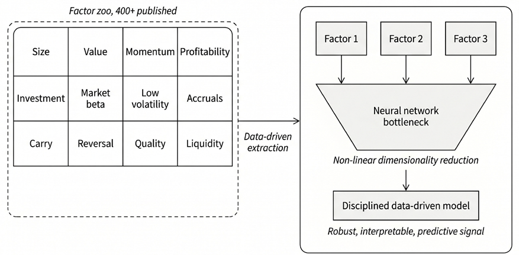

*图 14.1：从因子动物园到潜在因子模型*

学术研究对因子动物园并未形成单一的定论。一派强调多重检验、发表偏倚与已发表因子的泛滥；另一派则强调，只要在一致的框架内、跨更广的数据集评估因子，复现率仍可保持高位。

较为持平的总结是：该领域确实存在真实的假阳性与设定风险问题，但最有力的结论并不是整个因子动物园皆为幻象。证据指向的是：在一大批脆弱或对实现方式敏感的结果之中，嵌入着一组更小、更稳健且反复出现的因子主题。

### 因子动物园之争的三条轴线

这场争论沿三条轴线展开（统计有效性、识别与经济解释），涉及的研究包括 Harvey (2017)、Hou, Xue, and Zhang (2020) 以及 Cochrane (2011)。

#### 轴线 1：统计有效性

罪魁祸首是**数据挖掘**。Harvey, Liu, and Zhu (2016) 量化了其危害：当文献中检验的因子数以百计时，传统的 t 统计量阈值（t > 2）就显得过于宽松。这一阈值意味着估计效应至少偏离零两个标准误，在大样本下对应低于 0.05 的（双侧）p 值；等价地说，若真实效应为零，观察到如此或更极端效应的概率不足 5%。相反，作者建议对新提出的因子施加约 t > 3 的多重检验调整（见*第7章*）——这条经验法则若追溯应用，将淘汰相当大比例的已发表结果。Harvey 后来强调，当效应稀少时，即便这一阈值也可能不够，并把问题归结为研究文化，而非简单的阈值修正。

**发表偏倚**（publication bias）使问题雪上加霜：发表机制强烈激励显著结果与选择性报告。由此形成的已发表 t 统计量分布在 2.0 以下被截断，并在略高于 2.0 的区间出现异常聚集——与边际显著结果的选择性报告相一致。

然而，越来越多的证据表明，数据挖掘问题可能没有这些头条数字暗示的那么严重：

- McLean and Pontiff (2016) 发现，预测因子的收益在原样本期之外下降约 26%（与轻度过拟合一致），而发表之后再下降 58% 则表明套利会在因子被发现后侵蚀其收益——这是与统计偏差不同的另一机制。
- Jensen et al. (2022) 发起了最全面的挑战，构建了一个覆盖 93 个国家 153 个因子的分层贝叶斯复现框架。在检验 CAPM alpha 而非原始收益（理论上更正确的基准）时，他们发现复现率高达 82%，并证明这些因子聚成约 13 个在全球样本外依然成立的主题；大量被观测到的因子反而*加强*而非削弱了这一证据。
- Chen (2024) 从另一个方向得出一致结论：其推导的错误发现界显示，至少 75–91% 的已发表预测因子在统计上有效，并证明 Harvey, Liu, and Zhu 的高错误发现估计源于把统计不显著误读为不成立。

逐渐浮现的图景是：大多数已发表因子反映了真实的统计规律，但它们能否经受交易成本与市场学习的考验，是另一个独立且往往更苛刻的问题。

#### 轴线 2：识别与度量

Hou, Xue, and Zhang (2020) 说明了构建选择为何如此重要。他们以 NYSE 市值的第 20 百分位定义**微盘股**（microcaps）；当该断点应用于全股票标的池时，这些公司占上市股票数量的大多数，却只占总市值的极小份额。因此，等权异象组合会让微盘股获得不成比例的影响力。在 NYSE 断点与市值加权收益下，他们报告 452 个异象中有 65% 连传统的 |t| > 1.96 门槛都过不了，交易摩擦类变量的衰减尤为严重。异象证据因而对标的公司池定义与组合构建方式高度敏感——所以，在命名因子与潜在因子之间做任何比较时，都必须固定这些选择。

#### 轴线 3：风险还是错误定价

即便在通过统计与方法论筛选的因子中，学术界对其*为何*有效仍有分歧：收益溢价是对系统性风险的补偿，还是套利限制所维系的持续性行为错误定价？Cochrane (2011) 将此称为现代金融的"暗物质"问题：我们观察到风险溢价的引力，却无法直接识别造成它们的特定宏观冲击。这一风险对错误定价之分直接关系到模型设计与评估，是贯穿*14.5–14.6 节*的反复出现的主题。

### 反复出现的核心

近年的复现与模型选择工作反复回到一个紧凑的因子核心（Hou, Xue, and Zhang, 2020; Fama and French, 2015; Barillas and Shanken, 2018）：

- **市场**：股票风险溢价
- **价值**：买入便宜的资产，可能代理困境风险或久期风险
- **动量**：趋势跟踪，反映行为性反应不足或流动性级联
- **盈利能力**：买入高产的资产，是 Fama-French 五因子模型与 q 因子模型的共同核心
- **投资**：买入保守的资产，与生产模型中的低贴现率一致

这组紧凑的集合并非定论，但不同研究路线独立地汇聚于此，令人瞩目。Fama 与 French 的五因子模型从股利贴现模型推导因子；Hou, Xue, and Zhang (2015) 的 q 因子模型从企业投资优化（投资 CAPM）推导因子，后来又加入预期增长因子（Hou et al., 2021）。两者得到的核心实证预测相互重叠，都集中于盈利能力、投资与估值。

Barillas and Shanken (2018) 的模型比较工作发现，两个因子家族都被包含动量的设定所支配，进一步印证了这一核心的反复出现。Jensen et al. (2022) 发现其 153 因子全集聚成约 13 个主题；Swade et al. (2023) 证明约 15 个因子就足以张成全集的 alpha——这表明真实维度远小于因子动物园，但略大于上述五个因子。

机器学习强化了这一图景。Gu, Kelly, and Xiu (2020) 发现神经网络的主导预测输入并不陌生（价格趋势、流动性、会计质量），收益来自核心因子之间的非线性交互，而非某种深奥的新信号。Feng et al. (2020) 用双重选择 LASSO（*第15章*）证明，大多数新提出的因子相对既有清单是冗余的，其中盈利能力与投资保留了最清晰的增量内容——这是关于纪律化检验的结论，而非把因子简化为少数几个标签的定论。

### 从因子动物园到潜在因子

一个关键的概念区分可以澄清潜在因子模型能解决什么、不能解决什么。依照 Idzorek, Kaplan, and Ibbotson (2024)：

- **归因因子**（attribution factors）解释资产间的共变性，但预期收益可以为零
- **被定价因子**（priced factors）源自资产定价模型，承担真实的风险溢价

PCA 的设计目标是提取收益的共同变动，这些变动未必与被定价的预期收益因子对齐。前文引入的三种目标把各类方法按"逐步收紧这一联系"组织起来：方差最大化（*14.2–14.4 节*）、方差加定价误差（*14.5 节*）、直接最小化定价误差（*14.6 节*）。

潜在因子模型不会让因子动物园之争消失，它们改变的是选择的对象：不必再逐一提出并检验一长串命名的特征，而是直接从收益中推断低维结构，有时再辅以定价约束或可观测特征。这减少了研究者自由裁量的一处来源，但本身并不能保证提取出的因子被定价、在经济上可解释，或在样本外稳定。

下文的方法是对因子繁衍的互补式回应：它们是发现结构的强大工具，而不是绕开数据挖掘问题的干净出口。

## 14.2 用主成分分析提取潜在因子

PCA 解决的是 *14.1 节*引入的三种潜在因子目标中的第一种：最大化可解释方差。它把一组相关的资产收益变换为捕捉最大方差的不相关成分（Goyal, 2012）。

该变换依赖于收益协方差矩阵的特征分解——一种具有直接金融解释的标准线性代数运算。作为纯方差最大化方法，PCA 找到共变性的主导方向，但对这些维度是否携带风险溢价不置可否；*14.5 节*将着手解决这一局限。

### 特征分解的机制

PCA 流程从资产收益矩阵开始（行为时间、列为资产）。收益先去均值；是否标准化到单位方差是可选的，但在横截面工作中是标准做法（见下一小节"假设与设计选择"）。

由标准化后的收益矩阵，我们计算 N×N 协方差矩阵 Σ。当输入标准化到单位方差时，得到的便是相关系数矩阵——这一区别关系到解读，将在下一小节讨论。PCA 随后求解特征值问题：寻找所有满足 Σv = λv 的数对 (λ, v)。

求解给出两个关键输出。**特征值**（λi）是标量，表示每个对应主成分所解释方差的大小，按降序排列：λ₁ ≥ λ₂ ≥ … ≥ λn。第 i 个成分解释的方差占比等于 λi / Σλ。"碎石图"（scree plot）按降序显示特征值；解释方差趋平的"肘部"提示应保留多少成分（*图 14.2*）。`01_pca_equity_sectors` 为行业 ETF 构建了这一碎石图，并在荷载上添加 bootstrap 置信区间，以判断哪些行业敞口在统计上可靠。

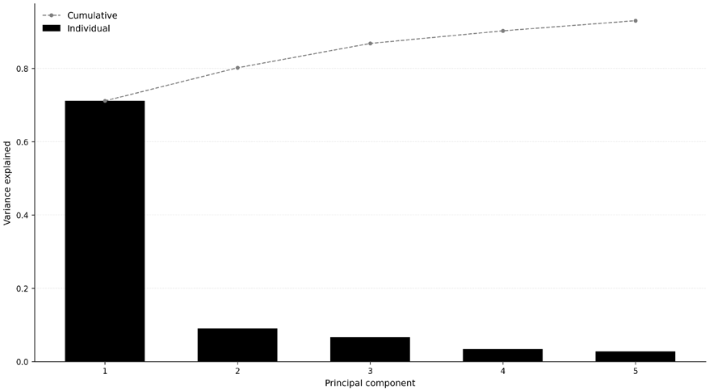

*图 14.2：前 5 个主成分解释的方差*

**特征向量**（vi）是"荷载"向量，把每个主成分定义为原始资产收益的线性组合。这些向量相互正交，因此得到的主成分彼此不相关。在金融中，每个特征向量都可解读为组合权重，下一节讨论特征组合时将充分展开这一概念。`02_eigenportfolios` 在一个宽基美股标的池上演示了这一解读。

### 假设与设计选择

PCA 是有用的工具，但它在金融中的解读依赖若干重要假设。

- **线性。** PCA 只能捕捉线性的共变模式。但金融市场中的关系往往随市场状态（regime）改变，在压力时期尤其如此，且特征之间的许多交互是非线性的——例如动量的效应可能取决于波动率或流动性。滚动窗口 PCA 可以部分适应时变，却无法触及线性约束这一根本限制。*14.6 节*介绍自编码器时会回到这一局限。notebook `01_pca_equity_sectors` 演示了行业 ETF 的滚动 PCA。
- **方差不等于定价相关性。** PCA 的设计目标是尽可能解释收益变动，而非识别高预期收益的因子。一个因子可以解释很大份额的协方差，却几乎赚不到风险溢价；反之，方差不起眼的因子若能索取高溢价，经济上也可能很重要。协方差结构与定价相关性之间的这一鸿沟，正是 *14.5 节* RP-PCA 的出发点。
- **只关注二阶矩。** PCA 完全通过中心化收益的协方差矩阵运作，只使用二阶矩信息。在高斯假设下，这与线性因子模型的极大似然估计一致。但金融收益很少服从高斯分布：它们常有偏、厚尾且易发生跳跃。在这类情形下，PCA 仍能找到方差最大的方向，却可能错过体现在高阶矩中、经济上依然重要的结构。

有两个关键设计选择值得细看。

#### 协方差还是相关系数？

一个基本的实现选择是：把 PCA 应用于协方差矩阵还是相关系数矩阵。

- 使用**协方差矩阵**保留收益的自然尺度，波动更大的资产在分解中获得更大权重
- 使用**相关系数矩阵**先把每种资产标准化到单位方差，防止高波动资产主导结果

对横截面股票分析，通常首选基于相关系数的 PCA，因为它强调共同结构而非原始波动率的差异。对波动率差异显著的跨资产组合，这一选择应当有意为之，而非默认。notebook `01_pca_equity_sectors` 在行业 ETF 示例中使用相关系数 PCA。

#### 特质波动率归一化

第三种有用的选择超出了协方差与相关系数的简单二选一：在运行 PCA 之前，用各资产滞后的特质波动率对其收益归一化。

这一调整针对一个具体问题。在原始协方差 PCA 中，高波动资产会主导分解。相关系数 PCA 通过强制所有资产的总方差相等解决了这个问题，但往往矫枉过正：它不仅抹去了特质波动率的差异，也抹去了共同因子敞口上有意义的差异。特质波动率归一化更有选择性：只用波动率中可分散的成分对收益缩放，更多地保留共同变动。

实践中，这通常带来更干净的信号噪声分离、更稳定的特征向量和更简约的因子结构——即更少的成分解释同样的方差份额。要正确实现，特质波动率必须在上一个估计窗口的残差中估计，且当期收益只能用这一滞后信息归一化。这保持了时点正确性（point-in-time, PIT）结构，避免前视偏差。

### 协方差估计质量

一个务实的警告：PCA 的可靠性取决于它所分解的协方差矩阵。当资产数 N 接近甚至超过时间期数 T 时，样本协方差矩阵会变得难以估计。在这种情形下，样本特征值被向上扭曲，弱因子难以与噪声区分，估计出的特征向量也会跨样本不稳定。**随机矩阵理论**（random matrix theory）为在大协方差矩阵中分离信号与噪声提供了有用的基准。特别是，**Marchenko-Pastur 分布**刻画了给定 N/T 比率下仅由噪声就能产生的特征值范围。落在该范围内的特征值应谨慎对待，因为它们未必反映真实的共同结构。

常见的补救是使用**收缩估计量**（shrinkage estimators），最著名的是 **Ledoit-Wolf** 家族。这类方法把极端的样本特征值拉向更有结构的目标，降低估计误差、提升稳定性。对大型股票横截面，先收缩再做 PCA 往往是明智的；否则，前几个特征组合可能反映的是抽样噪声而非持续的市场结构。关于 Marchenko-Pastur 基准与基于收缩的协方差估计的更完整讨论，见 Primer。

**有多少 PCA 因子是真实的？** 当资产数 N 相对时间期数 T 很大时，PCA 会把噪声连同信号一起拾取。在这种高维设定下，样本特征值向上偏，弱因子可能变得与随机波动（噪声）无法区分。**Baik-Ben Arous-Péché（BBP）相变**（Baik et al., 2005；见 Paleologo, 2025, Ch. 7）对此给出量化：只有当总体特征值超过 1 + √γ（其中 γ = N/T，且特征值已按单位特质方差归一化）时，一个因子才是可恢复的。低于该阈值，任何估计技术都无法把信号与噪声分开。实践的启示很简单：N/T 越大，除最强因子外就越难恢复任何东西。在我们的案例研究中，这一点在不同数据集上表现迥异。对 ETF，γ 较小，阈值相对较低，可以保留若干成分；对只有一年日度数据的 500 只股票面板，γ 较大，可能只有市场因子加上少数主导性行业因子能够幸存；对 CME 期货（γ 约为 0.06），大多数因子仍可识别。

因此，一条好的经验法则是：只要可能，就让 N 相对 T 保持较小。如果做不到，就预期 PCA 只能恢复因子结构中的主导部分。当 γ 变得较大时，用特征值收缩来决定保留多少成分，通常比目测碎石图更可靠。BBP 阈值、Marchenko-Pastur 基准以及基于收缩的替代方案的细节见 Primer。

**实现**：滚动 PCA 与 bootstrap 稳定性分析见 `01_pca_equity_sectors`。

接下来，我们讨论如何用特征分解技术构建股票组合。

## 14.3 面向股票策略的特征组合

把特征向量读作组合权重，就得到互不相关的"特征组合"（eigenportfolio）——风险管理与系统化交易的构件（Avellaneda and Lee, 2010）。完整的 PCA 流水线（包括标的池选择、方差分解与市场因子验证）见 `02_eigenportfolios`。

### 构建与解读特征组合

对应最大特征值的第一个特征组合捕捉方差的主导来源。经验上，其权重几乎全为正：它充当宽基市场组合的数据驱动代理。

在我们对美股面板数据集中按成交额排名前 500 的最具流动性股票的分析中，第一主成分（PC1）与等权市场收益的相关性达 0.99，证实它可作为数据驱动的市场代理。每只股票在 PC1 上的荷载度量其对这一统计提取的市场模式的敞口。这与 **CAPM 贝塔**类似——两者都量化对共同因子的敏感度。但与 CAPM 贝塔不同，PC1 荷载不是相对某个预先指定的市场组合估计的，也不携带资产定价含义；它机械地来自样本协方差矩阵和 PCA 的归一化。

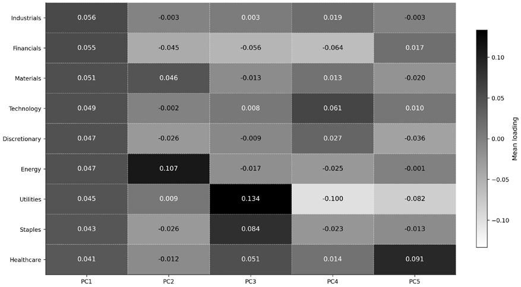

*图 14.3：特征组合在各行业上的荷载*

第一个特征组合 𝑃1 在所有行业上均为正荷载，PC2 则呈现成长对价值的轮动：在科技与通信服务上为正荷载，在金融与能源上为负载荷；PC3 捕捉防御对周期的动态（见*图 14.3*）。这些**可解释的模式**完全来自收益协方差结构，没有施加任何经济标签。

由数学构造，高阶特征组合彼此正交。**正交性**保证提取出的成分收益在样本中互不相关。实践中，高阶特征组合通常近似市场中性，但并不自动做到美元中性或贝塔中性。这类组合一般为多空性质（部分股票权重为正、部分为负），常常捕捉直观的经济敞口，如行业轮动或风格偏移。例如，第二个特征组合可能代表做多成长股、做空价值股，或做多科技、做空公用事业。平稳性是一个需要注意的告警点：特征组合荷载会随估计窗口显著旋转。第二个成分可能在一个十年捕捉成长对价值，在下一个十年捕捉防御对周期——行业相关性随宏观市场状态而变。这种不稳定限制了特征组合在实盘交易中的使用，除非定期重新估计；这也意味着对高阶成分的经济解读应视为描述性而非结构性。

统计因子也可以通过回归来解读。统计 PCA 因子天生抽象：它们最大化解释方差，却不带经济标签。一种实用的解读方法是：把每个特征向量的荷载在横截面上对可观测的公司特征做回归，如行业指示变量、市值、动量与账面市值比（Connor and Korajczyk, 2009）。回归 R² 表明每个统计因子的变动中有多少由已知基本面解释。若 PC1 荷载与行业哑变量强相关，它实际上是换了名字的行业因子；若 PC4 对所有可得特征的 R² 都很低，它可能捕捉的是一个真正新颖的潜在风险维度——恰恰是数据驱动因子发现优于预先指定模型的理由所在。

### 在量化金融中的应用

每个特征组合的年化收益、波动率与夏普比率统计量刻画了各潜在因子的风险收益特征：第一成分通常波动最高，高阶成分可能提供温和的风险调整后收益。

任意组合的风险都可分解为对这些正交因子的敞口，从而暴露出预先指定因子模型遗漏的集中度：管理者可能发现，表面上的行业分散掩盖了对单一统计因子的敞口。这一分解直接服务于*第17章*的投资组合构建：特征组合贝塔正是仓位规模优化所依据的风险维度。

把股票收益对前 K 个特征组合回归，得到的残差被假设为均值回复；特征组合收益序列也可作为因子择时模型的输入。但两类应用都面临现实阻力：均值回复参数在样本外不稳定，可靠短周期因子择时的证据也仍然混杂。

### 用分层 PCA 提升可解释性

对标准 PCA 的一个常见批评是：高阶因子缺乏清晰的经济解释，且在不同时期可能统计上不稳定。Marco Avellaneda 提出的**分层 PCA**（**HPCA**，hierarchical PCA）通过向分析中注入已知的经济结构来解决这一问题（Avellaneda, 2019）。

HPCA 分两步进行。第一步，在每个已知经济分组*内部*独立做 PCA，例如 GICS 行业：为科技股识别主导因子，为金融股识别另一个，依此类推。第二步，对这些行业级因子的相关系数矩阵再做一次 PCA，以捕捉跨行业动态。所得因子远易于解读：它们对应清晰的跨行业押注（做多金融、做空工业）或行业内动量效应，化解了标准 PCA 的大部分歧义。notebook `02_eigenportfolios` 在 GICS 行业上同时演示了标准特征组合构建与 HPCA 两步法。

### 修复特征向量不稳定性

滚动 PCA 的一个持久实践难题是：因子荷载可能在相邻估计窗口之间突变，原因并非底层因子结构改变，而是一个数学病理。在把 PCA 荷载用于组合配置或业绩归因之前，理解并纠正这种不稳定至关重要。

考虑近退化特征值问题。当两个特征值量级接近时，相应的特征向量变得难以识别。微小扰动（增删一天收益、更换标的池中的一只股票）就可能使特征向量在共享子空间内旋转或完全互换。在股票收益的滚动 PCA 中，这表现为荷载在相邻窗口间"翻转符号"：行业敞口突然反转，在下游组合权重中制造虚假换手。第一主成分通常免疫（其特征值分离良好），但第 3 个及以后的成分频繁出现这种不稳定（Paleologo, 2025）。

度量不稳定至关重要。相邻特征向量之间的余弦相似度提供了一个简单的诊断：对特征向量 𝑣(ݐ) 与 𝑣(ݐ൅ͳ)，余弦相似度等于 |ݒ(ݐ)்ݒ(ݐ൅ͳ)|（取绝对值是因为特征向量只在符号意义上可识别）。数值为 1 表示荷载稳定；接近 0 表示旋转进了另一个子空间。应在各估计窗口之间对每个主成分跟踪这一指标：频繁跌破 0.8 的成分，未经修正就不可用于归因或配置。

一个实用的修复方法是用**正交 Procrustes 旋转**对齐相邻窗口的荷载矩阵。设 𝐵௧ 与 𝐵௧ାଵ 为两次相邻估计的 N×K 荷载矩阵，计算 𝐵௧⊤𝐵௧ାଵ = 𝑈Σ𝑉⊤ 的奇异值分解；最优对齐两个荷载空间的正交矩阵为 𝑅∗ ൌ 𝑈𝑉⊤，对齐后的下一窗口荷载为 𝐵̃௧ାଵ ൌ 𝐵௧ାଵ𝑅∗。该变换保持正交性与因子张成，但消除了近退化特征空间内的任意旋转。其结果并不是一个不同的协方差模型，而是同一个模型被写进了时间上更平滑的坐标系。

在把 PCA 荷载用于配置或归因之前，务必先检查特征向量的稳定性：

- 若前 3–5 个主成分的特征值分离良好（相邻特征值之比超过 2:1），则无需 Procrustes 旋转：荷载天然稳定
- 若特征值聚集——股票收益在第 3 个成分之后很常见——则务必使用 Procrustes

这一稳定性诊断与*第17章*的投资组合构建直接相连：不稳定的荷载产生不稳定的协方差矩阵，进而制造不必要的换手，而换手带来真实的交易成本。

### 两阶段生产级 PCA 的实务配方

本章的 notebook 在单一估计窗口上用统一的时间权重演示 PCA。机构投资者使用的风险模型采用更精细的流程，以分离金融市场的两个经验事实：波动率变化快（天到周），相关结构变化慢（月到季）。把两种动态混在同一估计窗口，要么对波动率飙升过度反应，要么对相关结构变化反应不足。

由 Paleologo (2025) 形式化的以下两阶段流程解决了这一分离问题：

1. **捕捉波动率动态。** 施加指数加权的时间权重（半衰期约 20 天）以强调近期波动率；运行一次初步 PCA（𝑝 个成分），计算残差，并估计每项资产的特质波动率。
2. **估计相关结构的因子结构。** 用阶段 1 的特质波动率对收益归一化，施加慢速指数加权（半衰期约 120 天），执行生产级 PCA。施加基于 BBP 的特征值收缩（*14.2 节*）与 Procrustes 旋转以稳定荷载。重构完整协方差矩阵：𝛺ൌܦఙ൫ܤ𝛺௙ܤ்+ 𝛺ఌ൯ܦఙ，其中 𝐷ఙ 恢复原始波动率尺度。

这一流程对 ML4T 流水线意义重大：它产出的协方差矩阵直接流入*第17章*的组合构建方法。均值-方差优化、分层风险平价与风险预算都以协方差估计为主要输入。波动率与相关估计的分离还与*第18章*面向交易成本模型的短期波动率更新相呼应。两阶段结构确保波动率骤升（例如 VIX 事件）能立即更新风险估计，而不动摇决定分散化收益的较慢因子结构。接下来，我们把主成分分析应用于收益率曲线，以识别固定收益因子。

**实现**：特征组合构建（包括行业荷载热力图、HPCA 与累计收益可视化）见 `02_eigenportfolios`。

## 14.4 解码收益率曲线

PCA 最耀眼的成功在固定收益。Litterman and Scheinkman (1991) 证明三个因子可以解释国债收益率曲线变动的 95–99%，这一结果在此后数十年、多个市场中反复得到复现。

### 水平、斜率与曲率

把 PCA 应用于跨期限（从 1 个月国库券到 30 年期国债）国债收益率的日度或月度变动时，研究一致发现 95–99% 的变动可归因于三个正交主成分，每个都有广为接受的经济解释（*图 14.4*）：

- **水平**：解释总方差的 90% 以上。荷载在各期限上几乎一致，因此水平冲击对应平行移动——所有利率同涨同跌。经济上，它反映通胀预期与实际增长前景的广泛变化。
- **斜率**：解释 5–8% 的方差。荷载在短期与长期期限上符号相反，因此斜率冲击使曲线变陡或变平。该因子与货币政策紧密相关：加息压缩短-长利差，使曲线趋平。
- **曲率**：捕捉 1–2% 的方差。曲线中段期限与两端反向变动，形成"蝶式"扭转。该因子与利率波动率和路径不确定性相关。要清晰观察到它，至少需要覆盖曲线的 5–7 个期限；期限更少时，第三成分捕捉的是残差变动而非干净的蝶式。

*图 14.4* 展示了这三个主成分：

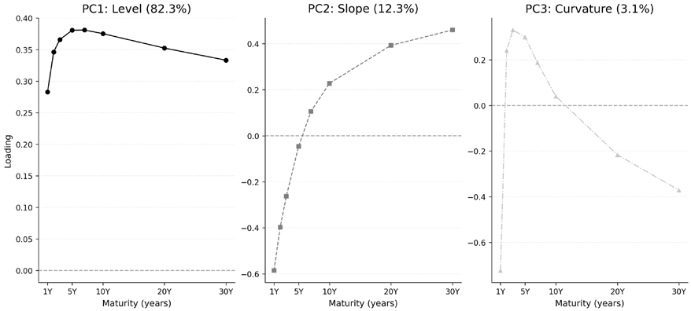

*图 14.4：收益率曲线成分的主成分分析*

**实现**：`03_yield_curve_decomposition` 对八个国债固定期限收益率（1Y、2Y、3Y、5Y、7Y、10Y、20Y、30Y）的日度变动应用 PCA，恢复了经典的水平/斜率/曲率分解，方差占比分别为 82.3%、12.3% 和 3.1%（累计 97.8%）。每个期限都由这三个因子重构，并在所得敞口上演示广义久期对冲框架。

### PCA 为何适用于收益率曲线

收益率曲线是方差目标与定价目标大体重合的罕见情形：固定收益中的无套利约束旨在确保解释方差的因子同时也是被定价的。与股票的对比凸显了这一结构性差异：

- 利率驱动因素低维且持续：通胀预期、实际增长与货币政策同时影响所有债券，敏感度随期限而异。同时应当注意，对收益率变动的 PCA 是对曲线运动的描述性分解，并不能证明这些成分就是唯一被定价的期限溢价因子。无套利期限结构模型与收益可预测的期限溢价模型会附加 PCA 本身不具备的进一步结构。
- 股票正相反：成千上万只股票受特质新闻、行业效应、宏观冲击与行为因子驱动，产生复杂、时变且依赖市场状态的协方差结构——这解释了为什么股票上的 PCA 得到的因子可解释性与稳定性都更差。

### 高效对冲的实际应用

这种低维结构使高效对冲成为可能。管理者无需管理数十只单一债券的敞口，而是用流动性工具（国债期货、利率互换）中和三个因子敞口——水平、斜率与曲率。这种**广义久期**方法更精确、交易成本更低，并植根于收益率曲线的实证低秩结构。

| 因子 | 解释方差 | 变动形态 | 标准解读 |
| --- | --- | --- | --- |
| 水平（PC1） | >90% | 平行移动 | 通胀与增长预期 |
| 斜率（PC2） | ~5-8% | 变陡/变平 | 货币政策立场 |
| 曲率（PC3） | ~1-2% | 蝶式扭转 | 利率波动率与不确定性 |

*表 14.1：收益率曲线的主成分*

如*表 14.1* 所示，这些经济解读是广泛使用的启发式，而非确定的因果映射。确切百分比取决于期限集合、样本期，以及 PCA 应用于收益率变动的相关系数矩阵还是协方差矩阵。

接下来，我们探索如何用经济数据充实前文介绍的统计技术，使其在实践中更加有用。

## 14.5 用进阶模型衔接经济学与统计学

收益率曲线的低维成功反衬出 PCA 在股票上的局限：高维度、弱结构约束与时变关系产生的因子能解释方差，却未必能解释收益。两项创新致力于解决这一问题：

- **IPCA**（Kelly, Pruitt, and Su, 2019）通过可观测特征使因子荷载动态化
- **RP-PCA**（Lettau and Pelger, 2020）明确瞄准与定价相关的因子

在推导任一模型之前，先解释它们共享的预测结构。

### 三阶段潜在因子预测适配器

本章的若干因子表示模型只需加上一个预测层即可用于预测。PCA、RP-PCA、IPCA 与 CAE 都估计潜在因子，但目的各异：PCA 解释协方差，RP-PCA 使因子提取偏向被定价的变动，IPCA 估计线性的特征条件化荷载，CAE 则把荷载映射非线性化。要把这些表示转化为事前的资产层面预测，**三阶段潜在因子预测适配器**把每个估计器包进同一工作流（*图 14.5*）：

1. **阶段 1：因子估计。** 把 𝑁×𝑇 的超额收益面板 𝑅௘ 压缩为 𝑇×𝐾 的因子历史 𝐹 与逐资产荷载映射。PCA 通过对 𝑅௘ 做 SVD 求解；RP-PCA 在准则中加入定价误差惩罚；IPCA 与 CAE 把荷载映射 𝛽௜ǡ௧ 参数化为滞后特征的函数。阶段 1 的训练目标（方差、方差加定价误差或横截面重构）使用同期收益——结构模型的用途正在于此。
2. **阶段 2：因子溢价预测器。** 从训练窗口的因子历史 𝐹ଵǣ௧ 预测 𝜆̂௧ାଵ∈ℝ௄。最简单的选择是训练样本均值——KPS（2019）与 GKX（2020）隐式使用，并被 Engel et al. (2025) 标记为"IID-BS"。库中的 `ExpandingMeanFactorForecaster` 实现了这一基线。AR(1)、EWMA、梯度提升回归（LightGBM，即 Engel et al. 的 Q-Boost 的类似物）以及预训练基础模型（即其 ZS-Chronos）都是即插即用的替代品，以逐渐丰富的表示瞄准同一对象、刻画因子动态。*图 14.6* 编目了本章使用的预测器。
3. **阶段 3：资产映射。** 将今天的敞口与预测溢价结合：𝜇௜ǡ௧ାଵൌ𝛽௜ǡ௧ ڄ ߣ̂௧ାଵ。

若把阶段 2 与阶段 3 合并为单一预测层，同一工作流也可读作两块结构：先因子估计，后预测与映射。本章一致采用编号的三阶段表述。

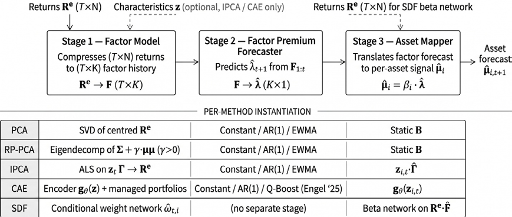

*图 14.5：三阶段潜在因子预测适配器。阶段 1 把超额收益面板压缩为因子历史与逐资产荷载映射；阶段 2 从该历史预测下期因子溢价；阶段 3 将当前荷载与预测溢价结合，得到资产层面预期收益。RP-PCA、IPCA 与 CAE 只在阶段 1 有所不同*

由此可得两条设计性质。第一，阶段 1 与阶段 2 *可分离*：同一结构模型可以搭配任意预测器，同一预测器也适用于所有结构模型。本章各 notebook 正是利用这一点，在 IPCA、RP-PCA 与 CAE 之间共享阶段 2 清单。第二，预测质量在阶段 2 进入：对因子溢价更准的预测经阶段 3 直接转化为更好的资产层面信号。对抗式 SDF 与监督自编码器不经过该适配器：SDF 直接从无套利矩条件估计定价核，产出的是定价误差诊断而非因子收益历史，*14.7 节*说明为何单独的阶段 2 预测不是其自然输出；监督自编码器端到端预测收益，没有可供预测的因子收益中间体，*14.7 节*将其作为直接预测的对照呈现。

Engel et al. (2025) 扩展了该适配器：按预测*不确定性*为因子排序，只把最可预测的因子用于切点组合。该扩展位于阶段 2，也是接入现代概率预测器的自然位置。

`ml4t-models` 库把适配器封装为单个可组合对象 `LatentFactorForecastPipeline(model, forecaster, mapper)`。教学 notebook 在每个阶段都从零构建；该库则是案例研究运行器使用的生产格式。

### 用工具变量 PCA 实现动态贝塔

标准 PCA 为每项资产估计单一静态贝塔——当风险特征不断演化时，这是一个不现实的假设。工具变量 PCA（IPCA；Kelly, Pruitt, and Su, 2019）把贝塔建模为可观测特征的函数——规模、账面市值比、动量等——从而使其随时间变化。

IPCA 模型将超额收益表示为：𝑟௜ǡ௧ାଵ ൌ ݖ௜ǡ௧ ⊤߁݂௧ାଵ൅𝜖௜ǡ௧ାଵ，其中 ݖ௜ǡ௧ 是在时刻 t 观测的 𝑃 维特征向量，߁ 是 𝑃×𝐾 矩阵，݂௧ାଵ 是 𝐾 维潜在因子收益向量。等价地，𝛽௜ǡ௧ൌ߁⊤ݖ௜ǡ௧：特征决定的是时变荷载，而非直接决定预期收益。这一时序关系很重要：特征必须相对收益滞后，且解读应是条件风险敞口，而非简化式的异象回归。

核心洞见是*特征即协方差*：公司特征之所以能预测收益，不是因为它们各自是独立的异象，而是因为它们代理了对潜在风险因子的时变敞口。小盘价值股与大盘成长股加载在不同的因子上，且荷载随特征变化而更新。

这一解读使风险对错误定价的实证检验成为可能：

- 若特征主要通过塑造风险敞口来解释收益，IPCA 会识别出强潜在因子与不显著的定价误差（alpha）
- 若特征代表独立于风险的纯错误定价，模型会把其效应归入显著的 alpha 项

Kelly, Pruitt, and Su (2019) 报告，五因子 IPCA 模型解释横截面收益的准确度远超既有模型，特征效应几乎完全被其作为风险敞口工具的角色所吸收。

原始 KPS 研究使用 94 个特征；我们的 `us_firm_characteristics` 数据集经筛选后提供 57 个。缺失特征应当插补（横截面中位数是标准做法）而非丢弃观测，因为缺失本身携带信息：较小的公司可用的特征往往更少。IPCA 估计使用**交替最小二乘法**（**ALS**，alternating least squares），在更新 ߁（特征到荷载的映射）与更新 ݂௧（潜在因子）之间迭代。特征数 𝑃 很关键：太少会限制模型捕捉时变荷载的能力，太多则引入估计噪声。

2019 年之后的复现研究反复出现三个关于识别的敏感点：

- 结果取决于潜在因子数 𝐾：应报告一个区间（通常为 3–8）而非挑选单一最优值，因为标准的样本外定价误差规则对检验资产集合很敏感（Didisheim et al., 2023 证明更复杂的因子模型可以取得更好的样本外表现）。
- 缺失特征被吸收进残差而非系统性风险。我们 `us_firm_characteristics` 实现中的 57 个特征（较原始 KPS 研究的 94 个有所减少）是下限而非上限。
- 线性映射 𝛽ൌ߁⊤ݖ 无法捕捉交互项（动量在高低波动率下的不同行为、规模效应随流动性的变化）；*14.6 节*的非线性扩展以牺牲识别清晰度换取表达能力。

**实现**：`04_ipca` 包含一个合成数据上的参数恢复练习，在把模型用于真实数据之前直接验证 ALS 能恢复真实的 ߁，并直观演示对 𝐾 的敏感性。

### 用风险溢价 PCA 寻找被定价因子

PCA 的第二个缺陷（关注方差而非预期收益）由 RP-PCA（Lettau and Pelger, 2020）解决。RP-PCA 的定义性特征不是不同的荷载映射，而是不同的目标：在标准 PCA 上加入定价误差惩罚，使那些解释方差虽小、却携带可观风险溢价的因子不被忽视。

RP-PCA 最小化未解释方差与横截面定价误差的加权组合：

min (1/𝑁𝑇) ∑௜ǡ௧ (ܺ̃௜ǡ௧ െ 𝐹̃௧ ⊤ ߉௜)² ൅ 𝜅 (1/𝑁) ∑௜ (ܺ‾௜ െ 𝐹‾ ⊤ ߉௜)²

第一项是通常的对去均值收益的重构损失，第二项惩罚均值收益中的定价误差。参数 𝜅 控制权衡：当 𝜅 = 0 时，RP-PCA 退化为标准 PCA，只最大化方差而全然不顾定价；随 𝜅 增大，目标转向解释横截面收益差异的因子，即使它们解释的总方差很小。在极限 𝜅 → ∞ 下，方法完全聚焦于定价而完全忽略方差。

该目标可以通过对修改后的矩阵 ൫(1/𝑇) ܺ⊤ܺ െ ܺ‾ܺ‾⊤൯ ൅ 𝜅 ܺ‾ܺ‾⊤ 施加标准 PCA 求解——即样本协方差加上一项对均值收益信息加权的惩罚（𝜅 = 0 时即恢复普通的协方差 PCA）。得到的因子既统计显著（解释共变性），又经济显著（携带高夏普比率）。一个捕捉信用风险的因子可能只解释收益方差的 2%、夏普比率却有 0.8，标准 PCA 会把它排在第 15 位之后、视而不见；而 RP-PCA 会凭 𝜅 将其提升至第 3 位。Lettau and Pelger (2020) 报告，1963–2017 年美股上 RP-PCA 的样本外夏普比率超过标准 PCA 的两倍；结果依赖样本，需要样本外验证。

注意，**双重选择 LASSO**（Feng, Giglio, and Xiu, 2020）——针对既有因子动物园检验新候选因子的现代标准——是*第15章*去偏机器学习框架的特例，应用于本章案例研究的因子收益。

**实现**：`05_rp_pca` 在同一框架下比较标准 PCA 与跨多个惩罚取值的 RP-PCA。notebook 的 `gamma` 参数即这里的 𝜅，`gamma=0` 复现标准 PCA。Lettau 与 Pelger 把惩罚权重写作 1 + γ，在 γ = −1 时退化为普通 PCA；本章改记 𝜅 = 1 + γ，使 𝜅 = 0 对应无惩罚情形。

### 作为设计选择的检验资产

检验资产是一种设计选择，而非中性背景。近期研究表明，因子强度取决于估计与评估所用检验资产的张成：

- Giglio, Xiu, and Zhang (2021) 强调这一点，并提出**有监督 PCA**（supervised PCA），在存在弱因子时挑选信息量大的资产
- Bryzgalova, Pelger, and Zhu (2025) 走了互补路线：用树模型内生地构建检验资产，使所得基础资产更好地张成随机贴现因子

实践含义很直接：在共同的检验资产基准集上比较各方法，同时报告当检验资产张成被扩充或重新设计时结果如何变化。

本节所有方法共享一个局限：因子荷载是特征的线性函数。动量在高波动与低波动下表现不同，规模效应随流动性变化，线性模型无法不经手工特征工程就捕捉这些交互。*14.6 节*用深度学习模型解决这一问题——学习非线性映射的同时保留这里建立的经济结构。

| 模型 | 估计目标 | 荷载结构 | 预测适配器 | 最佳用途 |
| --- | --- | --- | --- | --- |
| PCA | 最大化解释协方差 | 静态荷载 | 可选 | 风险分解 |
| RP-PCA | 方差加定价误差惩罚 | 静态潜在荷载 | 有，作为因子提取器 | 发现被定价的因子 |
| IPCA | 条件潜在因子模型 | 线性特征条件化贝塔 | 有 | 可解释的条件贝塔 |
| CAE | 非线性条件潜在因子模型 | 神经网络特征条件化贝塔 | 有 | 非线性的条件贝塔 |
| 对抗式 SDF | 无套利矩条件 | 定价核权重 | 无 | 直接最小化定价误差 |
| SAE | 有监督收益预测加重构正则项 | 瓶颈表示 | 无 | 预测基准 |

*表 14.2：潜在因子及相关模型：估计目标、荷载结构，以及与三阶段预测适配器的关系*

RP-PCA、IPCA 与 CAE 例行通过适配器；PCA 可为因子择时包入其中，但这里用于风险分解。对抗式 SDF 与 SAE 位于适配器之外。CAE 在*14.6 节*引入；SDF 与 SAE 在*14.7 节*。

因此，共享适配器覆盖 PCA（可选）、RP-PCA、IPCA 与 CAE，四者的差异都在阶段 1。*图 14.6* 编目了教学 notebook 可替换的三级阶段 2 预测器阶梯（第 1 级：常数、AR(1)、EWMA；第 2 级：Ridge、LightGBM；第 3 级：LSTM、TCN）；*14.8 节*报告这一选择与结构估计器如何交互。下一节介绍用于降维的非线性技术。

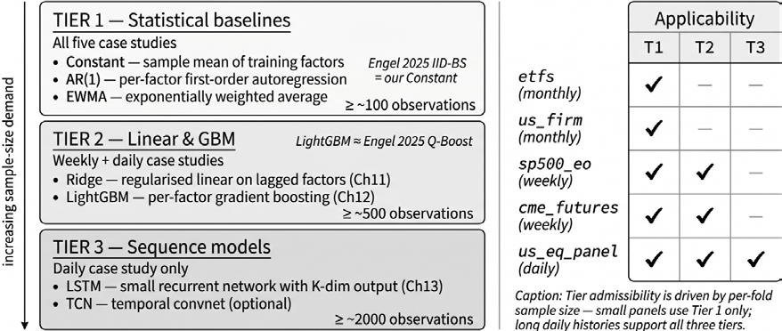

*图 14.6：阶段 2 因子溢价预测器清单。第 1 级为常数、AR(1)、EWMA 基线；第 2 级加入 Ridge 与梯度提升回归；第 3 级加入 LSTM 与 TCN 序列模型。任意预测器可与任意阶段 1 估计器搭配，无需重训因子模型*

**实现**：`04_ipca` 演示 ALS 估计（含合成数据上的恢复检验）与可替换的阶段 2 预测器清单；`05_rp_pca` 在同一框架内跨 𝜅 取值比较标准 PCA 与 RP-PCA。带 walk-forward 验证的真实数据应用见相应的案例研究 notebook。

## 14.6 条件自编码器

*14.5 节*用线性荷载映射把三阶段预测适配器落了地：IPCA 用单个矩阵把条件贝塔系到特征上，RP-PCA 把因子提取准则偏向被定价的变动。两者都保持特征与荷载之间的映射为线性。**条件自编码器**（CAE；Gu, Kelly, and Xiu, 2019）是同一家族中的非线性成员：保留条件因子结构，只把线性荷载映射换成神经网络。

CAE 是 IPCA 的严格非线性推广。两者从同一条件因子表示出发：𝑟௜ǡ௧ାଵ ൌ 𝛽௜ǡ௧ ⊤ ݂௧ାଵ ൅ 𝜖௜ǡ௧ାଵ，且只在荷载映射上有别。IPCA 把条件贝塔限制为滞后特征的线性函数，𝛽௜ǡ௧ൌ߁⊤ݖ௜ǡ௧；CAE 则换成神经网络，𝛽௜ǡ௧ ൌ ݃൫ݖ௜ǡ௧Ǣܹ൯。只用单个线性层、不加非线性激活时，CAE 就坍缩为 IPCA——因此最好把它理解为同一条件因子思想配上了更具表现力的荷载映射，而不是另一种直接预测架构。

正是这一定位使 CAE 留在适配器之内。其训练目标是从条件贝塔与潜在因子收益重构已实现收益，并不直接优化下期预期收益。拟合出的模型仍是一个条件资产定价表示：协变量引导降维，特征间的非线性交互塑造因子敞口。估计完成后，CAE 提供与 IPCA 相同的两个对象——当前条件贝塔与潜在因子收益历史——因此*14.5 节*的阶段 2 预测器清单原封不动地沿用：因子收益的训练样本均值给出基线预测，AR(1)、EWMA、Q-Boost 与 ZS-Chronos 无需重训 CAE 即可替换它。因此，CAE 只改变阶段 1：贝塔网络学习非线性的特征到荷载关系，因子侧从特征管理组合中提取潜在因子收益。

这也给 CAE 相对*第13章*的时序模型定了位：那些模型捕捉已实现收益历史中的时间模式，CAE 捕捉每个时点上的横截面结构。*第13章*模型导出的时序特征可以作为附加特征进入 CAE，但 CAE 本身主要不是序列模型。

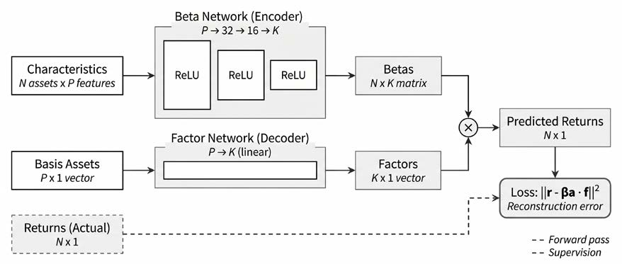

*图 14.7：条件自编码器。贝塔网络把每项资产的滞后特征映射为条件因子荷载；因子侧从特征管理组合中提取潜在因子收益；二者的内积重构同期横截面*

### 准备特征面板

`us_firm_characteristics` 案例研究（*14.1 节*）提供主数据集。自定义面板应遵循*第4章*确立的无幸存者偏差与时点正确性要求：特征必须在其所解释或预测的收益之前可观测，标的池成员资格的确定不得使用未来信息。可投资标的池应在估计之前固定，因为微盘股与流动性过滤决定了哪些公司参与估计出的因子结构、模型能学到哪些溢价。由于基于特征的可预测性往往集中于较小、流动性较差的公司，应同时报告包含与剔除市值最小 20% 公司两种口径的结果，以区分可交易信号与微盘股及流动性假象。

本数据集包含 63 个预计算特征：*14.5 节*的 57 个基本面特征，外加六个时序特征。原始 CAE 研究使用的集合更大，但实现逻辑不变。神经网络对输入尺度敏感，而公司特征常带有极端离群值，因此我们每月按各特征对股票排名，并把排名重新缩放到 [−1,1]。这一横截面变换削弱离群值的影响，使不同单位的特征可比，并保留每个时点上可得的相对信息。

### 设定双网络架构

CAE 包含两个相连的组件：贝塔网络与因子侧。**贝塔网络**把每只股票的 𝑃 个滞后特征映射为条件因子荷载。在 PyTorch 实现中，它是一个带 ReLU 激活与批归一化的前馈网络，通常呈金字塔形（例如 64 → 32 → 16 → 8）。对每个日期 t，它产出一个 𝑁௧ൈܭ 的条件敞口矩阵：𝐵௧ ൌ ݃(ܼ௧ିଵǢܹ)，其中 𝑍௧ିଵ∈ℝே೟ൈ௉ 保存日期 t 观测的 𝑁௧ 家公司的滞后特征。

**因子侧**估计用于重构横截面的潜在因子收益。令 𝑟௧∈ℝே೟ 收集同期超额收益。第一步把已实现收益投影到滞后特征矩阵上，形成特征管理组合收益：𝑥௧ ൌ (ܼ௧ିଵ⊤ܼ௧ିଵ)ିଵܼ௧ିଵ⊤ݎ௧，其中 𝑥௧∈ℝ௉ 概括日期 t 的收益横截面在每个特征上的加载。当 ܼ௧ିଵ⊤ܼ௧ିଵ 病态时，用伪逆或正则化逆替代普通逆。所得向量可读作特征管理基础组合的收益。这是横截面投影而非单变量排序：排序解读是有用的直觉，但正式对象是投影系数向量 𝑥௧。一个简单的因子网络（通常为单个线性层）把这些管理组合收益映射为 𝐾 个潜在因子收益：

𝑓௧= ℎ(ݔ௧Ǣ ߆)

贝塔网络与因子侧联合估计，使模型重构已实现收益：𝑟௜ǡ௧ ൌ 𝛽௜൫ݖ௜ǡ௧ିଵǢܹ൯ ⊤ ݂௧。

这是 CAE 与直接预测网络的核心区别：CAE 不把特征映射为下期收益，而是估计一个条件因子表示，再把它作为独立预测步骤的输入。

### 估计 CAE

在每个训练窗口，CAE 最小化横截面重构损失：

∑௧ǡ௜ (ݎ௜ǡ௧ െ 𝛽௜൫ݖ௜ǡ௧ିଵǢܹ൯ ⊤ ݂௧)²

并配合正则化与早停。该目标估计的是潜在因子结构，不应与最终预测目标混淆。实现使用 L1 正则化鼓励稀疏权重，并用早停限制过拟合。深度网络对随机初始化敏感，因此 notebook 跨多个种子训练集成并平均预测；集成平均降低了拟合荷载映射的方差，带来比单次初始化更稳定的下游预测。

来自 `us_firm_characteristics` 案例研究的有效贝塔网络配置范围是：两到三个隐藏层，宽度按金字塔结构从 32 到 128，学习率从 10⁻⁴ 到 10⁻²，L1 正则化从 10⁻⁵ 到 10⁻³，批量大小 1,000–5,000 个观测（通常接近整月横截面）。Dropout 高于 0.3 倾向欠拟合，低于 0.05 则更容易过拟合。因子网络更简单，通常是单个线性层。*14.5 节*的识别注意事项在此同样适用：潜在因子数 𝐾 应大到足以捕捉持续的横截面结构，又小到避免冗余或不稳定的因子。对股票模型可从 𝐾 = 5–10 起步；在应用模型的归一化约定之后，学习到的因子高度相关即表明 𝐾 过大或正则化过弱。

### 将潜在因子转化为预测

阶段 1 估计完成后，CAE 提供当前条件贝塔与潜在因子收益的历史序列。向前预测需要阶段 2 的因子溢价预测。最简单的规则是每个潜在因子收益的训练样本均值，恢复基线的 GKX 式设定；AR(1)、EWMA、Q-Boost 或 ZS-Chronos 只替换这一因子溢价预测器。给定预测 ߣ̂௧ାଵ，资产层面预期收益为：

𝑟௜ǡ௧ାଵ ൌ 𝛽௜൫ݖ௜ǡ௧Ǣܹ൯ ⊤ ߣ̂௧ାଵ

这一分解很有用：CAE 负责估计横截面结构，预测规则则规定每个潜在因子下期预期获得多少补偿。CAE 可以很好地重构已实现收益，但若提取的因子几乎不携带持续溢价，预测仍可能疲弱——这正是模型选择应以下游预测质量为准、而非只看重构损失的原因。

### 调参、验证与失效模式

重构损失只是优化诊断：它显示模型能否拟合训练横截面，不表明学到的因子能赚取稳定的样本外溢价。因此，验证协议评估的是完整预测工作流：在每个 walk-forward 起点，只在训练窗口上拟合特征变换、CAE 参数、正则化选择与因子溢价预测器；然后冻结这些组件，为下一验证期生成预测，并评估资产层面的预测。在验证 IC、IC 信息比率、五分位价差、换手率与组合层面表现上比较配置；重构损失只用于诊断优化失败或欠拟合。Optuna 的贝叶斯优化（*12.4 节*）可探索架构与正则化空间，以下游验证 IC 或 IC 信息比率为目标，至少 50 次试验以保证搜索稳定。

常见失效模式可以从估计出的因子、贝塔与验证行为中看出：重构损失发散通常意味着学习率过高或梯度控制不足；跨资产近乎相同的贝塔表明贝塔网络坍缩，可用横截面贝塔离散度诊断；潜在因子高度相关指向 𝐾 过大的模型或过弱的正则化；对种子强烈敏感则说明需要更大的集成。统计表现还必须经受经济检验：高 IC 高换手的信号在扣除成本后可能不可交易。五分位价差、换手率与因子在各期限上的衰减指示可预测性是否有经济意义，且应同时报告毛收益与净收益表现。一个简单的近似是：净收益 ≈ 毛收益 − 2 × 换手率 × 单边成本，成本假设应与标的池匹配：大盘股单边 5–10 个基点（bps），微盘股 50 个基点或更高。

### 实证证据与复现注意事项

在 GKX 的原始美股研究中，基于 CAE 预测的多空组合优于线性 IPCA 基准，增益来自公司特征之间的非线性交互。其经济直觉自然：动量、价值、规模、波动率或流动性的效应在横截面上未必可加或恒定，神经荷载映射可以表示"动量在高波动与低波动股票间表现不同"这类交互，而无需研究者预先设定。但增益并非唾手可得：我们的 `us_firm_characteristics` 实现正说明了复现的困难。在主一个月标签上，CAE 的 IC 翻负至 −0.030，远低于*14.7 节*讨论的监督自编码器，也与 GKX 报告的预测 R² 不可直接比较。它仍指向与文献相同的结论：潜在因子信号的绝对量级温和，且对样本期、标的池定义、特征覆盖与验证设计敏感。案例研究使用的样本更短更近、标的池更小、特征更少，这很可能解释了差距的大部分。

神经因子荷载不具备 PCA 特征向量那样的解释。SHAP（*11.4 节*）提供了部分诊断：把每项资产学到的荷载归因于其输入特征——例如某学习因子上的高荷载可能伴随动量与低波动，而规模贡献为负；跨资产汇总 SHAP 值可得到因子级别的重要性排序。有两点告警必不可少：SHAP 解释的是拟合出的贝塔网络*如何使用*特征，并不证明这些特征在因果上驱动收益；且当输入相关时，归因可能跨样本不稳定。它是可解释性诊断，不是对经济机制的独立验证。

近期扩展在保留适配器整体结构的同时修改阶段 1。自注意力让贝塔网络以更广的横截面为条件确定每项资产的荷载，捕捉逐资产前馈网络错过的行业、同业与供应链关系（Kelly et al., 2025）；业绩电话会、申报文件与新闻的文本嵌入（*第10章*）可作为附加特征进入。在每种情形下，阶段 2 预测器与阶段 3 资产映射在概念上保持不变。Engel et al. (2025) 把这一思路推得更远：先用 CAE 提取潜在因子组合，再对每个因子训练独立的时序模型，用预测不确定性挑选最可预测的因子构建切点组合。

**实现**：`06_conditional_autoencoder` 在 PyTorch 中构建完整工作流：特征预处理、双网络估计、集成训练、三个阶段 2 预测器（常数、AR(1)、EWMA）、阶段 3 资产映射、SHAP 可解释性与贝塔离散度诊断。

## 14.7 随机贴现因子与监督自编码器模型

*14.5 节*的适配器把因子估计与因子溢价预测分离，PCA、RP-PCA、IPCA 与 CAE 都契合它：各自估计一个因子表示，再交由阶段 2 模型预测。两个深度模型因相反的原因打破了这一模式。**随机贴现因子**（SDF；Chen, Pelger, and Zhu, 2021）直接从无套利条件学习定价对象，把各阶段压缩为一，没有因子收益历史可以交给独立的预测器。**监督自编码器**（SAE）则完全跳过这一结构，端到端地把特征映射为远期收益，没有任何因子中间体。把它们放在一起，正是因为这一共同特质：都绕开三阶段适配器——一个因为直接定价，一个因为直接预测。该架构如*图 14.8* 所示：

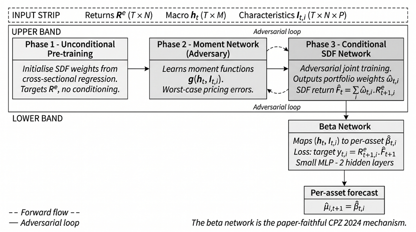

*图 14.8：SDF 与监督自编码器相对三阶段适配器的位置*

SDF 直接从无套利矩条件学习定价核，输出定价误差诊断而非因子收益历史；监督自编码器端到端地把特征映射为远期收益。两者都不暴露可供独立阶段 2 预测器使用的因子溢价。

### 随机贴现因子

Chen-Pelger-Zhu（CPZ, 2021）框架把 *14.1 节*引入的第三个目标付诸实施：通过条件矩约束直接最小化定价误差。无套利天然地写成向前一步的形式：对总收益 𝑟௜ǡ௧ାଵ，随机贴现因子 𝑀௧ାଵ 满足 𝐸௧ൣܯ௧ାଵݎ௜ǡ௧ାଵ] = 1；对超额收益则等价于 𝐸௧ൣܯ௧ାଵݎ௜ǡ௧ାଵ] = 0。CPZ 用公司特征与宏观状态变量的灵活网络参数化 𝑀௧ାଵ，并通过最小化这些条件矩约束的违反来估计它。输出是学到的定价核 𝑀̂௧ 与相应的定价误差诊断，而不是为下游溢价预测器设计的因子收益历史——这正是该模型没有天然阶段 2 挂钩的原因。

### 用对抗式深度学习构建 SDF

条件矩集合实际上是无限的，逐条评估不可行；对抗机制正是 CPZ 使问题可处理的方法。第二个网络学习构造最坏情形检验组合——当前 SDF 估计会定价错误最严重的资产线性组合。训练在两个目标之间交替：SDF 网络更新以最小化对手组合上的定价误差，对手则更新以寻找改进后的 SDF 仍会错定的新组合。这一极小极大结构使 SDF 面对最难而非平均的情形受到约束，是与 CAE 平均重构损失的关键区别。`07_stochastic_discount_factor` notebook 以带可配置对抗轮次的三阶段训练循环实现之。状态变量经由一个循环宏观编码器进入：MacroLSTM 从 FRED 指标（收益率利差、通胀、波动率）学习低维状态，使定价核适应市场状态，而无需研究者预先指定哪些宏观变量重要——这正是 CAE 中让贝塔网络自行发现特征交互的时序版。

评估与 CAE 不同，因为估计的对象不同。应报告 SDF 意义下的最大夏普比率（Hansen-Jagannathan 界把它与定价误差的量级联系起来）、相对基准因子模型的定价误差，以及每一步的最坏情形对抗组合。一个值得密切注意的告警：当模型设定错误时，横截面 GMM 可能因加权矩阵的选择而产生虚高的拟合（Gospodinov, Kan, and Robotti, 2014），因此应在替代加权下、并在固定与自适应检验资产集上重跑。教学与案例研究 notebook 默认运行这些诊断。为与其他模型家族可比，案例研究在验证 IC 上选择要报告的 SDF 检查点，而非原始 CPZ 协议使用的验证夏普标准。

### 监督自编码器

监督自编码器是适配器之外的另一个模型，但它在其中是作为务实基准、而非结构性资产定价对象存在的。当目标是强大的表格信号而非因子分解时，它是有用的直接预测替代方案。编码器把特征压缩到瓶颈层，解码器重构输入作为正则项，有监督预测头把瓶颈层映射为远期收益。这一架构最广为人知的身份，是 Jane Street 赞助的 Kaggle 市场预测竞赛（2020–2021）的冠军方案——这也是它作为强基线被收录的原因；本章 README 链接了原始 write-up。

这里没有阶段 1/阶段 2/阶段 3 之分。监督损失塑造瓶颈层，预测头本身就是资产映射器，因此评估遵循直接预测惯例——横截面 IC，以及方向性标签上的 AUC——而非适合 SDF 的定价误差或因子溢价诊断。值得带入后续章节的正是它与 CAE 的对比：两者都用网络压缩特征，但 CAE 的瓶颈是由重构约束的条件因子结构，SAE 的瓶颈则是对标签预测最好的任何表示。前者可解读为风险；后者不能，也无意于此。

**实现**：

- `07_stochastic_discount_factor` 在前 200 只美股标的池、八个特征上，构建带 MacroLSTM 与三阶段极小极大训练的对抗式 SDF
- `08_supervised_autoencoder` 实现监督版本，采用净化交叉验证，执行方向分类（AUC 评分）并带特征重构正则化；`ml4t.models.SAEModel` 是其生产形态

## 14.8 案例研究启示

*第11–13章*直接在远期收益标签上训练模型——从正则化线性回归到梯度提升再到深度序列网络。潜在因子估计器则从另一侧到达同一横截面排序：它们在几乎或完全没有收益监督的情况下，从收益与特征的联合行为中恢复结构，再据此为资产打分。这里的问题是：这种结构为资产排序的能力，能否比肩已有的有监督模型家族。

九个案例研究中有五个的横截面足够均衡，可以拟合完整的潜在因子清单：ETF、标普 500 股票与期权研究、美股、美国公司特征与 CME 期货。五个估计器优化目标各异：PCA 取最大的方差方向，IPCA 从特征拟合条件线性贝塔，条件自编码器（CAE）最小化重构误差，随机贴现因子（SDF）瞄准无套利定价误差，监督自编码器（SAE）在重构之外加上收益预测任务。

覆盖并不均匀：ETF 与股票+期权研究运行全部五个估计器；美国公司特征剔除 PCA，因为匿名化的公司标识逐月不稳定，破坏了 PCA 所需的均衡面板；CME 期货运行 PCA 与 SDF；美股运行 PCA 与 IPCA。每个估计器用其日均信息系数（IC）及按日度序列自相关做 HAC 校正计算的 95% 置信区间来概括；区间不包含零即为显著信号的门槛。

### 潜在因子在何处增加排序信息

最强的潜在估计器在五个案例研究中的四个（ETF、美国公司特征、CME 期货与美股）越过零，仅在股票+期权研究上与零重叠。*表 14.3* 把每个估计器与*第11–13章*的最强模型并列。神经目标几乎在所有地方都扛起了潜在因子的结果：SDF 在 ETF 与 CME 期货上领先，SAE 在美国公司特征上领先；IPCA——条件线性估计器——以一个虽小但可信为正的数值扛起美股。PCA 这一无条件基线，在五个案例研究中没有一次取得最高的潜在 IC。

| 案例研究 | 期限 | 最优潜在模型 | 潜在 IC（t） | 最强既有模型 | 既有 IC | Δ IC |
| --- | --- | --- | --- | --- | --- | --- |
| ETF | 21 天 | SDF | +0.085 (4.9) | NLinear | +0.062 | +0.023 |
| 美国公司特征 | 1 个月 | SAE | +0.062 (5.5) | GBM | +0.080 | −0.018 |
| CME 期货 | 5 天 | SDF | +0.037 (2.8) | GBM | +0.032 | +0.005 |
| 标普 500 股票+期权 | 5 天 | SDF | +0.012 (0.7) | TabM | +0.011 | +0.001 |
| 美股 | 1 天 | IPCA | +0.005 (2.2) | GBM | +0.032 | −0.027 |

*表 14.3：各案例研究在主远期收益标签下 IC 最高的潜在因子估计器及其 HAC t 统计量，与第11–13章中最强的有监督模型（正则化线性模型、梯度提升、TabM 或深度序列网络）并列。Δ IC 为潜在点估计减去最强既有模型的点估计*

越过零不等于胜过手头已有的最佳模型，Δ 列把两者区分开来。为了把每个潜在估计器与最强既有模型直接对比，我们计算两者共享日期上的日度 IC 序列之差，并对均值差构造 HAC 区间——即*表 14.3* 中单模型区间的配对版本。

按这一度量，潜在估计器在 ETF 上可信地领先最强既有模型——SDF 高出 NLinear 0.023——并在两个案例研究上可信地落后：美股上 IPCA 低于梯度提升 0.027，美国公司特征上 SAE 低于其 0.019。在 CME 期货与股票+期权研究上，潜在点估计的期望领先，但区间跨越零。因此，潜在因子在五个案例研究中的三个上追平或胜过最强的有监督家族，在两个上可信地落后——对于依靠结构而非直接收益监督的估计器而言，这是可观的表现。

股票+期权研究是唯一一个主标签隐藏而非缺乏信号的案例：在 5 天收益上所有估计器都与零重叠，但 IPCA 在风险调整后的 5 天标签上达到 +0.041 且区间不含零，是该研究中唯一可信非零的潜在点估计。

### 哪种目标函数能提取信号

表现最好的估计器，是其目标与横截面所奖励的东西相匹配的估计器，而案例研究对哪一种匹配并无共识。*图 14.9* 把五个估计器放到五个案例研究上：条件化与监督在无条件方差无能为力之处发挥作用。PCA 恢复收益方差最大的方向，这些方向未必为横截面定价，它在任何案例研究中都不是最佳。在因子结构之上增加定价约束或预测任务的 SDF 与 SAE，在五分之四的案例研究中取得最高潜在 IC；剩下的一个由 IPCA 的特征条件化贝塔扛下。

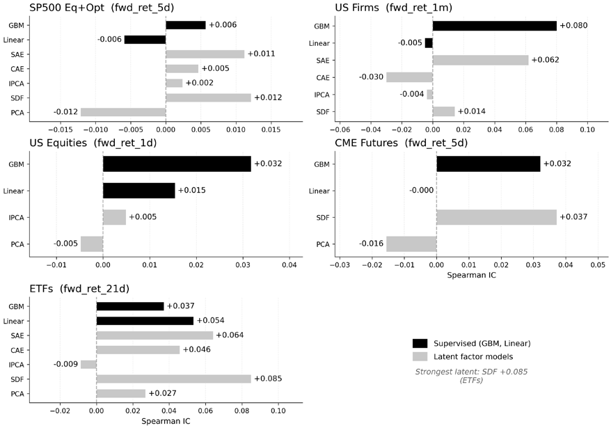

*图 14.9：五个案例研究在主标签下各潜在估计器的 IC。色深表示 IC 大小*

美国公司特征最清晰地展示了这种离散度，因为它在单一的月度横截面上运行四种目标。在一个月标签上，SAE 达到 +0.062，CAE 落在 −0.030，SDF 与 IPCA 挤在两者之间的近零处（*图 14.10*）。两个极端都越过了各自的区间且符号相反：使用收益标签的多任务目标给出正向排序，而拟合同期因子、没有前瞻目标的纯重构目标则指向错误方向。这正是 *14.5 节*的预测协议告警：对月度特征而言，同期因子重构是向前一步预测的糟糕代理。

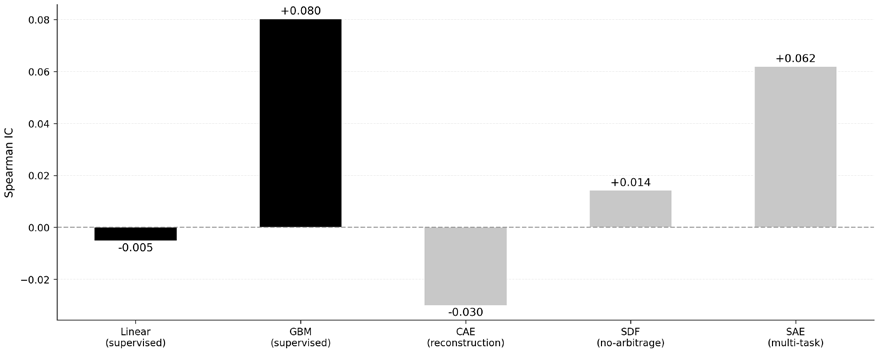

*图 14.10：美国公司特征上的目标阶梯：SAE 最高，CAE 为负，SDF 与 IPCA 在其间接近零*

因为各目标捕捉的结构不同，它们的预测并不一致。在美国公司特征的三个神经估计器之间，两两秩相关系数符号不一，说明这些模型并非同一个潜在信号的近似复制品。这种分歧正是*第20章*多目标集成赖以建立的实证切入点。

### 维度与稳定性

五个案例研究中，潜在估计器面临的估计问题差别显著，面板维度解释了其中大部分离散。CME 期货与 ETF 处于有利情形：时间期数远多于资产数，信号特征值与随机矩阵理论预测的噪声底清晰分离。美股与美国公司特征则是严重的高维情形（美国公司特征的资产数约为期数的九倍），样本收益协方差噪声太大，无法直接求逆。在这些数据上仍能得到可信 IC 的估计器——美股上的 IPCA 与美国公司特征上的 SAE——都绕开了该协方差：把特征映射为因子荷载，而不是从收益中估计荷载。

walk-forward 各折上的稳定性跟踪着标签的分辨率。*图 14.11* 绘出各折 IC 与其均值的对比；即便是区间明显不含零的案例研究，折间波动也很大——这正是全章以 HAC 区间而非点估计作为门槛的原因。月度的美国公司特征结果建立在结构性横截面优势之上，每一折都为正；日度的美股结果建立在单日薄利之上，约五分之三的折为正。前者是被干净度量的小效应；后者是面对更多噪声度量的更小效应。

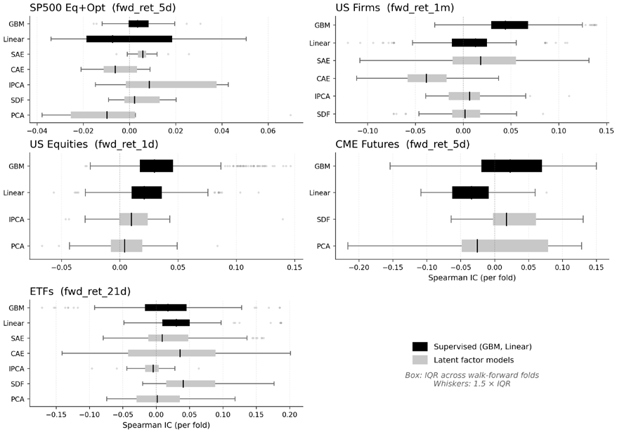

*图 14.11：五个案例研究中各折 IC 分布与折均值的对比*

### 回归还是分类

只有美国公司特征把分类标签带入了潜在因子栈——一个月方向标签。按 *11.6 节*引入的对称度量（回归分数对连续收益用 IC，分类器对二元方向用 AUC），IPCA 的连续分数对已实现收益达到 +0.010 的 IC——一个区间跨越零的低利润结果。它既不确认也不推翻回归标签建立的排序，而后者对这个月度横截面仍是更有信息量的读法。

### 方法选择

这些估计器是互补而非互替。PCA 专注风险分解，其特征组合支撑*第17章*的仓位规模与*第19章*的风险管理；IPCA、CAE、SDF 与 SAE 分别加入条件化、非线性、无套利纪律与有监督任务。在同一 walk-forward 协议下估计多个模型，把一致读作可能的信号、把分歧读作模型风险——这是要带入后续章节的方法。

潜在估计器越过零的案例研究（ETF、美国公司特征，以及最明显的 CME 期货）把这一排序带入*第16–19章*，与换手和成本相权衡；这里度量的分歧，则是*第20章*构建多目标集成的原料。

## 14.9 小结

本章的四种潜在因子方法共享同一预测工作流——三阶段预测适配器。阶段 1 估计因子表示，阶段 2 预测因子溢价，阶段 3 将今天的敞口与该预测结合。RP-PCA、IPCA 与 CAE 例行通过适配器，PCA 为因子择时也可包入其中。四者只在阶段 1 不同：PCA 最大化解释协方差，RP-PCA 加入定价误差惩罚，IPCA 估计线性的特征条件化贝塔，CAE 则把该映射非线性化。

对抗式 SDF 与监督自编码器位于适配器之外。SDF 在无套利矩约束下直接估计定价核；SAE 端到端预测收益，它作为神经网络基准而非结构因子模型赢得一席之地。`ml4t-models` 库把适配器封装为可组合的流水线，而本章 notebook 从零推导每个阶段。

在五个案例研究中，与横截面所奖励者相匹配的目标取得最高信息系数，而案例研究对哪种目标相匹配并无共识。SDF 在其中三个上取得最高潜在 IC，监督自编码器在美国公司特征上领先，IPCA 在美股上领先；无条件 PCA 在任何地方都不是第一。最清晰的是 ETF：SDF 以 +0.085 的 IC 越过 HAC 门槛。最强的潜在估计器在五个案例研究中的四个达到该门槛，只在股票+期权研究上与零重叠。

越过零并不等于胜过*第11–13章*的有监督家族。与共享日期上最强的既有模型相比，潜在估计器在三个案例研究中追平或胜出（在 ETF 上可信领先，在 CME 期货与股票+期权研究上统计上无法区分），在两个上可信落后——美股与美国公司特征，梯度提升在两者上都排名明显更高。对于依靠结构而非直接收益监督的估计器，这是可观的表现，但并非对直接学习标签的模型的全面超越。

实践教训是：当面板的时间期数多于资产数且存在真实的横截面结构时，潜在因子模型具有竞争力；在特征丰富的有监督模型占优之处落后；而无论预测排名如何，它们始终是有用的风险分解工具（*第17章*与*第19章*）。*第15章*从预测转向因果估计；*第16章*把*第11–14章*的预测转化为交易信号。
