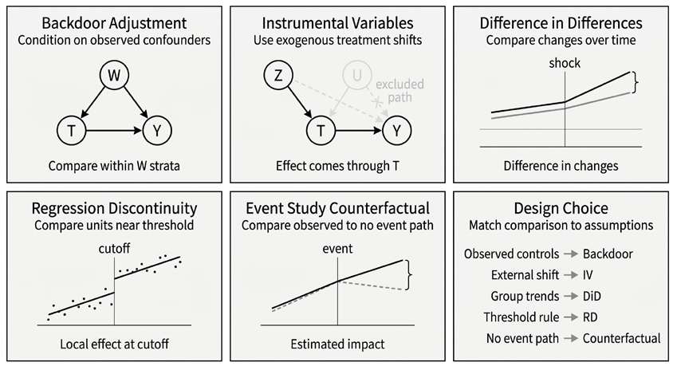
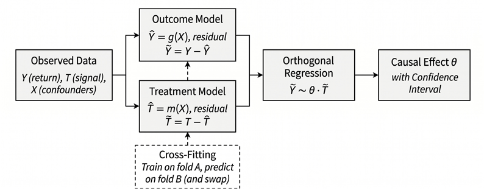
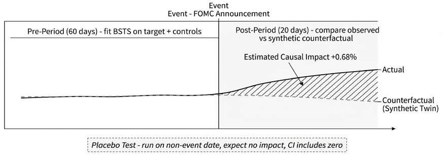
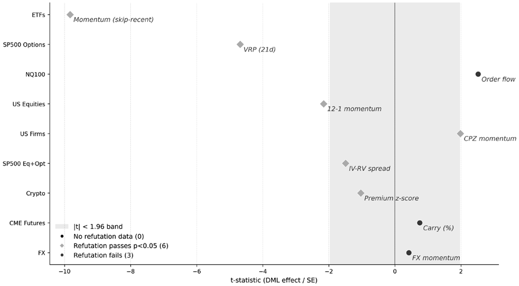

# 第15章：因果机器学习

我们在*第7章*将因果思维作为一种证伪过滤器引入：用有向无环图（DAG）编码机制假设，用混杂因素、中介变量与对撞因子这三种结构角色指导条件化决策，并在投入更重的建模之前，用四项合理性检查对特征做分诊。那些诊断都是双变量的——每次只检验一个特征，无法察觉多变量混杂。本章为通过筛选的幸存特征提供所需的多变量估计机制。

特征层面的分诊问的是：单个特征与标签之间的关联是否符合某个拟议的机制。本章的方法则提出更难的问题：

- 在对高维混杂因素做正交化之后，处理效应的幅度有多大？
- 某个离散事件是否真的使价格偏离了数据驱动的反事实？
- 在一个多变量系统中，哪些变量导致哪些变量？滞后多长？

每个问题都需要不同的估计器，而每个估计器都建立在必须被明确陈述并加以检验的假设之上。完成本章后，你将能够：

- 用处理、结果、估计目标（estimand）与反事实来定义**因果研究问题**，并用 DAG 论证一个容许的调整集。
- 运用验证与反驳工具——包括安慰剂检验、敏感性分析与子集稳定性检查——评估一个因果论断是否稳健到足以为交易研究提供依据。
- 使用双重机器学习（DML），在高维混杂因素存在的情况下**估计连续处理的因果效应**，同时遵守时间序列交叉拟合与处理前时点纪律。
- 使用贝叶斯结构时间序列（BSTS），通过构造数据驱动的反事实并评估控制序列中的溢出风险，来**估计离散事件的影响**。
- **使用因果发现方法**（如 PCMCI、NOTEARS、VAR-LiNGAM）生成候选结构，并将其解读为需要进一步验证的假设，而不是确定的因果真相。
- 区分预测信号与因果效应，在解读跨数据集证据时关注混杂偏差、多重检验，以及统计显著性与经受住反驳之间的差距。

本章先搭建从预测特征到因果估计目标的概念桥梁，然后在 *15.2 节*展开识别框架，并在 *15.3 节*给出每个因果论断都必须经受的验证与反驳工具箱。*15.4 节*将双重机器学习应用于各案例研究中连续处理效应的估计，*15.5 节*转向用 BSTS 度量离散事件的影响。*15.6 节*反转探究方向，用因果发现算法从数据中推断结构，而不是把结构强加给数据。*15.7 节*综合跨数据集的证据，*15.8 节*提炼实践指南。

## 15.1 从理论到估计

*7.5 节*的概念工具箱（DAG、结构角色、机制合理性检查）回答的是一个因果故事*是否*值得追求。本节从这种定性评估过渡到定量估计：给定一个 DAG 和一种识别策略，如何在有效的不确定性量化下度量因果效应？

### 因果估计的挑战

经典的因果设计从研究设计出发，而不是从算法出发。它们追问**什么样的变异来源能够识别所关心的效应**：

- 基于观测控制变量的后门调整
- 一个推动处理但不直接影响结果的工具变量
- 带可信对照组的前后对比
- 一个近似随机分配的阈值
- 由未受处理序列构造的反事实路径

在每种情形下，核心问题都相同：*为什么观测数据应当分离出因果效应，而不是反映混杂、选择、预期或溢出*？

在金融领域，这些设计依然不可或缺，但往往难以干净地落地：混杂因素众多，冗余关系非线性，效应随市场状态（regime）变化，事件在资产间传导，受处理的单元常常很少。机器学习有助于更灵活地估计这些**冗余成分（nuisance）**，却不能在识别不存在的地方创造识别。因此，本章的方法把因果设计与现代预测工具结合起来：

- **双重机器学习**（DML）：在后门式调整下处理连续处理变量
- **贝叶斯结构时间序列**（BSTS）：构造事件级别的反事实
- **因果发现**方法：在图结构未知时生成结构性假设

在把这三类设计具体化之前，我们需要区分识别与估计，并厘清本章三种主要方法各自的定位。

### 三类估计问题

本章围绕这一更宏大设计版图中**三个彼此不同的因果问题**组织，每个问题都需要不同的估计器：

1. 在控制波动率与市场状态之后，动量是否*导致*前向收益？**DML** 用灵活的机器学习模型将处理对混杂因素正交化，给出去偏的效应估计和有效的置信区间。
2. 美联储利率决议使债券 ETF 价格相对"没有决议时的情形"移动了多少？**BSTS** 从控制序列构造合成反事实并度量二者之差。
3. 哪些跨资产收益序列真正驱动其他序列，哪些只是共同波动？**PCMCI** 在多个滞后阶上检验条件独立性，恢复一张时间滞后的因果图；神经方法（NOTEARS、VAR-LiNGAM）把发现扩展到更高维度。

*表 15.1* 将研究问题映射到相应的估计器与 Python 库。

| DAG 已知？ | 处理类型 | 方法 | 库 |
| --- | --- | --- | --- |
| 是 | 二元/连续 | 后门调整 | DoWhy |
| 是 | 连续 | DML | EconML |
| 是 | 二元（事件） | BSTS | tfp-causalimpact |
| 否 | 不适用（发现） | PCMCI | Tigramite |
| 否 | 不适用（发现） | NOTEARS | causal-learn |
| 否 | 不适用（发现） | VAR-LiNGAM | causal-learn |

*表 15.1：方法选择指南——从研究问题到 Python 库*

再精巧的估计器也救不了识别上的失败。整条流水线依次为：DAG 设定 → 调整集识别 → 估计目标推导 → 基于机器学习的估计 → 反驳检验。*15.2 节*介绍三种估计策略共同依赖的识别与验证框架；随后针对具体方法的小节都假定有效识别已经就位。

目标不是从观测数据中证明因果，而是把稳健的论断与经不起推敲的论断区分开来。其中的关键一步是识别因果机制——这正是我们接下来要讨论的。

**实现**：`01_library_overview` 对*表 15.1* 中的各个库进行比较。

## 15.2 识别与验证

因果估计的可信度取决于支撑它的设计。估计要回答的是：因果问题定义清楚之后，如何计算效应。识别要回答的则是更前置的问题：在明确的假设下，效应能否从可得数据中学出来。这一区分在金融市场中尤为重要，因为预测、相关与因果常常指向不同方向。一个变量可能因为刻画了风险而预测收益，可能是某种隐藏市场状态的代理变量，可能位于结果的下游，也可能反映真正的因果机制。因果分析的第一步，就是在拟合模型之前把这些可能性区分开。

### 从结果与干预到估计目标

每个因果问题都需要明确：被改变的是什么，被度量的是什么，以及用什么样的比较来定义效应。这些选择应当在拟合模型之前做出。

**干预**（即处理）是我们想估计其效应的暴露。在市场中，处理很少是研究者能够直接指派的干预，通常是近似干预的事件、规则或冲击：指数成分调整、监管变化、盈利意外，或组合配置规则的修订。*处理定义*应当指明受处理单元、处理时点以及相关的处理期限。

**结果**是其反应定义了问题的变量。它应当同时契合拟议的机制与决策问题。视应用而定，结果可以是前向收益、波动率、回撤、流动性指标或风险暴露。结果的选择是研究设计的一部分，因为它定义了估计目标，并影响识别假设的可信度。与结果密切相关的机制，可能比受众多其他力量影响的宽泛交易结果更能支撑可信的因果论断。这并不意味着宽泛的结果不重要，而是说这样的因果论断多半更难辩护。

**估计目标（estimand）**是要估计的因果量。常见的例子包括：

- **平均处理效应**（**ATE**）：目标总体上的平均效应
- **受处理者的平均处理效应**（**ATT**）：实际接受处理的单元的平均效应，通常是事件研究中最相关的估计目标
- **条件平均处理效应**（**CATE**）：以可观测状态变量（如波动率状态、流动性或估值状况）为条件的效应

估计目标还固定了目标总体、处理时点、结果期限以及所做比较。例如，资金费率冲击对下一期溢价回归的影响，与同一冲击对多日前向收益的影响，并不是同一个估计目标。前者问的是资金费率溢价在冲击之后自身是否均值回归；后者问的是在其他收益驱动因素也发生作用之后，该冲击是否转化为更宽泛的交易结果。

几个含义相近的术语在全章反复出现，容易混淆。后续小节与 notebook 一致采用如下定义。

| 术语 | 定义 |
| --- | --- |
| ATE | 在指定控制变量下，目标总体上的平均边际处理效应 |
| 分组 ATE | 在某个层内（如某个波动率状态）重新估计的 ATE |
| CATE | 由单一异质性模型（因果森林、X-learner）给出的协变量条件效应 |
| 效应修饰变量 | 允许处理效应随其变化的变量 |
| 混杂因素（控制变量） | 用于调整以阻断后门路径的处理前变量 |
| 反驳检验 | 能削弱但不能证明因果论断的诊断 |

*表 15.2：关键术语的定义*

分组 ATE 与 CATE 的区别在实践中很重要。按状态切分样本并在每层内重新估计 ATE，得到的是分组 ATE；这并没有拟合一个刻画效应如何随协变量变化的模型。CATE 需要一个直接学习效应曲面的异质性估计器。同样，混杂因素与效应修饰变量的角色也不同：对混杂因素做调整是为了消除偏差，而效应修饰变量刻画的是效应如何变化。许多估计器——包括本章稍后使用的双重机器学习接口——通过不同的参数暴露这两种角色，用错了就会改变所估计的量。

在一个估计目标能够被解读为因果之前，需要若干假设：

- **一致性**：在观测到的处理下观测到的结果，对应相关的潜在结果
- **重叠**：数据支持比较，即在相关协变量的取值上，受处理与未处理的观测都存在
- **无干扰**，即**稳定单元处理值假设（SUTVA）**：一个单元的处理不会改变另一个单元的结果
- **条件可交换性**：在以一组容许的处理前变量为条件之后，处理分配相对于潜在结果近乎随机

这些假设在金融市场中**非常苛刻**。价格迅速聚合信息，资产通过共同因子与组合资金流相互作用，处理时点往往含糊不清。关键不是假装这些假设自动成立，而是把因果问题表述得足够精确，使假设能够被审查。

在拟合任何模型之前，先定义处理、结果、估计目标、目标总体与时点。离开这种纪律，因果分析就会退化为事后合理化——那本身就是它试图消除的选择偏差的另一种形式。后文用 𝑇 表示处理，𝑌 表示结果，𝑊 表示一组处理前协变量。

### 有向无环图与调整集

有向无环图（DAG）把识别假设显式化。*7.5 节*把混杂因素、中介变量与对撞因子介绍为因果图中的结构角色；在这里，这些角色变成决定哪些变量应进入调整集的规则——调整集是为了估计干预的因果效应而进行条件化的一组特定协变量。核心问题是混杂。**混杂因素**是处理与结果的共同原因。如果市场压力同时影响资金费率与未来收益，那么资金费率与收益之间的原始关联可能部分来自共同驱动因素，而非资金费率的因果效应。**调整**的目标，是在这些共同原因上相似的前提下比较受处理与未处理的观测。**后门准则**将这种比较在何种条件下有效形式化：一组变量 𝑊 是 𝑇 对 𝑌 效应的容许调整集，当且仅当它阻断了所有从 𝑇 指向 𝑌、以箭头进入 𝑇 开始的非因果路径，且不包含 𝑇 的任何后代。在一致性、重叠、无干扰以及给定 𝑊 的条件可交换性下，离散处理的干预分布可以写为：

𝑃(𝑌 = 𝑦 | do(𝑇 = 𝑡)) = ∑_𝑤 𝑃(𝑌 = 𝑦 | 𝑇 = 𝑡, 𝑊 = 𝑤) 𝑃(𝑊 = 𝑤)

对连续结果，同样的思想用期望形式往往更有用：

𝔼[𝑌 | do(𝑇 = 𝑡)] = ∑_𝑤 𝔼[𝑌 | 𝑇 = 𝑡, 𝑊 = 𝑤] 𝑃(𝑊 = 𝑤)

当 𝑊 连续时，相应的表达式为：

𝔼[𝑌 | do(𝑇 = 𝑡)] = ∫ 𝔼[𝑌 | 𝑇 = 𝑡, 𝑊 = 𝑤] d𝐹_𝑊(𝑤)

调整就是在容许协变量 𝑊 的各层内、在相关后门路径已被阻断的前提下，比较受处理与未处理的观测，再把这些条件比较按 𝑊 的总体分布加权平均。用文字来说，它问的是：如果所有人都被设定到处理水平 𝑡，而处理前协变量的分布保持不变，结果会是什么样。

这个表达式定义了由 DAG 假设推出的估计目标。各种估计方法的差别在于如何逼近条件期望 𝔼[𝑌 | 𝑇 = 𝑡, 𝑊 = 𝑤]：线性回归施加参数形式；匹配与加权更直接地逼近这种比较；双重机器学习用灵活的模型估计冗余函数。但在所有情形下，识别问题都排在第一位：𝑊 是不是容许调整集？

答案取决于**因果结构**，而不是预测能力。真正的混杂因素是好的控制变量，因为对它们做条件化可以阻断虚假关联。𝑌 的强处理前预测变量也可以提高精度，前提是它们不是对撞因子、中介变量、处理的后代或选择变量。反过来，糟糕的控制变量会让因果估计变差。对中介变量做条件化，会移除处理影响结果的部分通路，从而改变估计目标；对对撞因子做条件化，会打开原本关闭的非因果路径；对处理的后代做条件化，会引入处理后偏差。

这就是**大杂烩式回归（kitchen-sink regression）在因果工作中危险**的原因。多加变量并不会自动让估计更安全；如果某些变量位于处理的下游，或者同时是处理与结果的共同结果，反而可能适得其反。决定哪些变量属于调整集的是 DAG，而不是统计显著性、特征重要性或预测精度。在交易应用中，时点纪律是最实用的筛查：𝑊 中的每个控制变量都必须在处理实现之前已知。事件研究应避免可能对事件作出同期反应的变量，尤其是宏观公告会立即撬动整个市场的时候；因子研究应避免已实现的业绩、组合结果或由未来收益机械构造的变量。这条时点规则落实了"调整集不得包含处理的后代"这一要求。

时点纪律必要但不充分。一个在处理之前观测到的变量，仍可能是对撞因子、选择变量，或某个会改变所分析总体的条件化事件的代理变量。例如，按流动性、分析师覆盖或资金流做过滤看似无害，因为这些变量在结果期限之前就能观测到；但如果它们同时是此前业绩、投资者关注与处理暴露的共同结果，就仍可能制造偏差。DAG 始终是最终的裁决者。

这也厘清了它与 *7.5 节*那些更简单检查的关系。此前的时点安慰剂与共同驱动因素检查，是同一逻辑的非正式、单特征版本。通过这些检查的特征，只是迈过了第一道合理性筛查。调整集问题提出的是更难的多变量问题：表面上的效应能否在以因果上容许的处理前混杂因素集合为条件后依然存在。

实践中，DAG 应当在选择估计器之前写下来。像 `DoWhy` 这样的库让这种纪律可操作：要求研究者指定图、声明处理与结果，并识别假设所蕴含的估计目标。软件并不能免除判断，它只是暴露判断介入的位置。如果识别失败，问题不在于估计器太弱，而在于研究设计没有为因果解释提供依据。

一旦 DAG 被转化为容许调整集和明确的估计目标，下一个问题就是：对观测控制变量做调整是否可信。当重要的混杂因素可能未被观测、测量不佳，或者对其做条件化会引入新偏差时，识别就必须来自另一种变异来源。

### 其他识别设计

后门调整通过以观测到的混杂因素为条件来识别因果效应。当这一策略不可信时，设计问题随之改变：问题不再只是该纳入哪些控制变量，而是哪种变异来源能够合理地把处理与那些会污染比较的因素分开。

每种替代设计使用不同的比较。工具变量使用由外部工具引起的处理变异；双重差分使用处理组与对照组随时间变化的差异；断点回归使用阈值附近的分配规则；事件研究反事实方法使用事前动态与控制序列来估计"无事件"路径。这些设计在实现上各异，但目的相同：把宽泛的无混杂假设，替换为关于识别变异来源的更窄假设。

*图 15.1：其他识别设计借助不同的比较来分离因果效应*

#### 工具变量

工具变量方法使用一个变量 𝑍，它移动处理 𝑇，但只通过处理影响结果 𝑌。工具变量必须满足三个条件：

1. **相关性**要求 𝑍 能实质性移动 𝑇。
2. **独立性**要求 𝑍 与 𝑌 的不可观测原因无关。
3. **排他性**要求 𝑍 除了通过 𝑇 之外，没有通往 𝑌 的直接路径。

排他性约束通常最难辩护。一项政策公告、一条指数纳入规则或一次市场结构变化，可能推动所关心的处理，但同时也可能影响关注度、流动性、风险偏好、融资条件或其他直接影响结果的渠道。如果这些渠道无法排除，IV 估计就不应被解读为 𝑇 单独的因果效应。

IV 估计也需要谨慎解读。当处理效应在单元间存在异质性时，这类设计识别的往往是处理状态被工具移动的那些单元的局部效应，而非全总体的平均效应。这仍可能正是相关的估计目标，但应当明确说明。本章不实现 IV 估计；在实际应用中，`linearmodels` 库提供了标准估计器。

#### 双重差分

**双重差分**（**DiD**）从随时间的差异化变动中识别效应。它比较事件前后受处理单元与对照组单元，问的是受处理单元的变动是否超过可比的未处理单元。识别假设是：若无处理，处理组与对照组本会遵循平行的趋势。一个典型的金融例子是只适用于一部分股票的卖空禁令。相关的比较不是简单地看受处理股票在禁令后是否变动，而是问它们的收益、价差或波动率，是否不同于暴露在同样大盘环境下的可比对照组。

主要威胁在于处理资产与对照资产可能并不共享同一个反事实趋势。行业冲击、时变 beta、流动性状态或宏观新闻都可能产生与处理无关的差异化变动。事前趋势检查、狭窄的事件窗口和有经济依据的控制变量可以让设计更可信，但不能证明趋势平行。在处理时点交错的面板设定中，简单的固定效应实现也需要小心，因为异质性处理效应会扭曲最终估计。

#### 断点回归

断点回归利用带尖锐阈值的处理分配规则。如果阈值上下两侧的单元在其他方面可比，那么处理在阈值处的非连续变化就可以近似局部随机化。

金融中的阈值出现在指数纳入规则、信用评级、准入约束、监管类别与组合授权中。识别性比较是局部的：靠近阈值的单元与另一侧附近的单元进行比较。所得估计适用于阈值附近的边际，不一定适用于全总体。

关键假设是连续性：没有处理时，潜在结果应在阈值处平滑演化。如果单元可以操纵自己在阈值附近的位置、其他规则在同一断点处同时变化，或者边界附近的观测太少，可信度就会被削弱。当分配规则透明且难以操纵时，断点回归可能非常有说服力，但其力量来自局部性。

#### 事件研究反事实

事件研究反事实方法通过比较事件后的观测路径与估计出的无事件路径来识别效应。被识别变异的来源是事件时点，再加上一个假设：事前动态与未受影响的控制序列能够预测没有事件时会发生什么。

*15.5 节*讨论的 BSTS 用贝叶斯时间序列模型实现这一逻辑：从事前行为与同期控制变量估计反事实路径，再把观测路径与反事实路径之间的差距归因于事件。这一设计类似合成控制，因为它用控制序列为未处理轨迹建模，但它仍是基于模型的反事实，而非随机实验。

主要威胁是污染。控制序列既要帮助预测目标序列，又不能受事件影响。对宏观事件来说这很困难，因为同一次公告可能撬动几乎所有候选控制资产。例如，一次意外的美联储决议可能同时影响债券 ETF、相关利率工具、信用利差、股指与风险情绪。在这种情形下，估计应被解读为依赖模型的，并用安慰剂日期、替代控制集与敏感性检查加以支撑。

#### 设计之间的选择

正确的设计，是其识别变异对问题而言最可信的设计。后门调整适用于主要混杂因素可观测、且对其做条件化不会引入处理后偏差或选择偏差的情形；IV 适用于存在推动处理但不以其他方式影响结果的外部来源的情形；双重差分适用于处理组与对照组合理共享反事实趋势的情形；断点回归在阈值制造出局部可比的处理与未处理单元时最有说服力；事件研究反事实则在无事件路径可以由稳定的事前关系与未受污染的控制序列建模时有用。

没有哪种设计天然更优。每一种都是用一组假设交换另一组假设。研究任务是选择假设最站得住的比较，明确相应的估计目标，然后检验结论在合理的扰动下是否脆弱。

## 15.3 验证与反驳

识别来自假设。验证要问的是：由此得到的论断是否脆弱，是否与安慰剂证据相矛盾，是否依赖于与遗漏混杂因素之间不合理过强的关系。这些检查不能证明因果，它们检验的是：如果识别假设可信，设计是否表现得像它应该的那样。

一个有用的验证流程区分三个问题：

- 第一，该方法是否会在本不存在效应的地方检出效应？这是安慰剂检验与阴性对照的职责。
- 第二，需要多强的遗漏混杂才能推翻结果？这是敏感性分析的职责。
- 第三，估计出的效应是否在合理的样本、设定与结果定义下持续存在？这是稳定性检查的职责。

### 安慰剂与阴性对照检验

安慰剂检验问的是：当处理、时点或结果本不应产生效应时，流水线是否仍会产出效应。可信的设计在这些情形下应给出接近零的估计。如果安慰剂效应很大或频繁出现，模型多半在捕捉混杂、泄露、过拟合或被污染的控制。

**安慰剂处理**用一个随机化、平移或以其他方式无关的处理分配替换真实处理。例如，可以把事件研究流水线的事件日期移到没有事件发生的时期再重跑；后门调整设计则可以用一个在施加相同控制变量后不应影响结果的处理变量来测试。目标不是在有限样本中得到恰好为零，而是确认方法不会系统性地在设计认定不存在效应的地方发现效应。

**安慰剂日期**对事件研究尤其有用：把同一个反事实模型应用于没有事件的日期。如果模型反复在非事件日期上发现大效应，那么估计的事件效应可能反映模型不稳定或控制被污染，而不是事件本身。**阴性对照**是一种不应响应处理的结果。如果处理似乎影响了这样的结果，就说明存在残余混杂、时点泄露或设定错误的调整。当拟议机制较为具体时，阴性对照结果尤其有用：它们检验估计出的效应是否只出现在机制预测它应当出现的地方。

### 对遗漏混杂的敏感性

调整只能对付那些被测量并以容许方式纳入的混杂因素。即便 DAG 设计得再仔细，未被观测的混杂仍可能存在。敏感性分析要问的是：一个遗漏混杂因素需要多强，才能实质性改变结论。

一种实用做法是扰动设计：加入合成混杂、改变假定的混杂强度，或度量估计在关于隐藏共同原因的不同假设下如何变化。`DoWhy` 支持探测这类稳健性的反驳检验与敏感性检查。这些诊断并不能证明遗漏混杂不存在，它们量化的是结论对"剩余混杂有限"这一假设的依赖程度。

解读应当保守。如果对遗漏混杂因素的小幅扰动就会改变估计的符号、幅度或显著性，那么在所检验的强度下，该结果与假定的混杂结构不可分离，应当被当作假设而不是因果效应的证据。如果估计在大幅且经济上合理的扰动下保持稳定，论断会更可信，但仍以设计假设为条件。

### 跨样本、设定与结果的稳定性

稳定性检查评估估计出的效应是否只属于单一样本、单一模型或单一结果定义。它们不能替代识别，但能揭示论断是否依赖于狭窄的建模选择：

- **子样本稳定性**检查效应是否跨时期、状态、资产或市场条件持续存在。例如，一个只在某个短暂波动率状态里出现的资金费率效应仍可能是真的，但此时估计目标应被描述为状态特定的，而非一般性的。
- **设定稳定性**检查效应是否能在合理的替代调整集、冗余函数模型或估计器选择下存续。在 DML 中，这包括更换用于处理与结果冗余函数的模型；在事件研究反事实中，这包括使用替代控制序列与不同的模型窗口。依赖单一狭窄设定的论断，弱于能在一系列可辩护设定下存续的论断。
- **结果三角验证**评估效应模式是否与拟议机制一致。同一处理不必对每个结果产生同方向、同强度的效应。机制邻近的结果，可能比受众多其他力量影响的宽泛交易结果显示出更清晰的效应。相关的问题是：估计出的效应是否出现在机制预测它应当出现的地方，在机制间接的地方减弱，并在不应响应的结果上消失。

综合起来，安慰剂检验、敏感性分析与稳定性检查界定了结果的证据地位。通过这些检查的论断并没有被证明为因果，只是在既定假设和受检扰动下可信；未通过的论断也不应被自动抛弃，而是应从因果结论降级为需要更强设计的研究假设。

**实现**：`02_dowhy_causal_graph` 以加密货币资金费率的双结果对比（溢价回归与前向收益）为例，完整走一遍验证流程（DAG 设定、识别、带时间切分的估计、安慰剂与反驳检查）。下一节展开定量诊断。

## 15.4 用 DML 分离因子效应

**双重/去偏机器学习**（**DML**）架起了现代机器学习与因果推断之间的桥梁（Chernozhukov et al., 2018）。它在控制众多潜在混杂因素的同时估计因子的因果效应：用灵活的机器学习模型估计冗余成分，用去偏得分估计目标参数。

基于 *15.2 节*，DML 的*识别清单*如下：

- 处理 𝑇 的时点固定；协变量 𝑋 严格先于处理
- 论证无混杂性：𝑋 阻断从 𝑇 到 𝑌 的所有后门路径
- 声明估计目标（ATE、ATT 或 CATE）
- 交叉拟合尊重时间顺序（扩展窗或滚动窗，而非随机折）
- 敏感性分析探测对遗漏混杂因素的稳健性

### 双重机器学习背后的直觉

DML 估计*一组低维因果参数*，同时用灵活的机器学习模型捕捉协变量、处理与结果之间高维的冗余关系（Chernozhukov et al., 2018）。本章相关的是*后门式设计*：在指定处理 𝑇、结果 𝑌 和容许的处理前调整集 𝑋（即 *15.2 节*的协变量集 𝑊）之后，DML 估计 𝑇 对 𝑌 的效应，同时允许涉及 𝑋 的关系是非线性且高维的。

在其最直观的形式中，DML 分三步进行（见*图 15.2*）：

1. **用控制变量预测结果。**估计冗余函数 𝑔(𝑋) = 𝔼[𝑌 | 𝑋]。它捕捉结果中可由控制变量预测的部分；残差 𝑌̃ = 𝑌 − 𝑔̂(𝑋) 是结果中不能被 𝑋 解释的部分。
2. **用控制变量预测处理。**估计冗余函数 𝑚(𝑋) = 𝔼[𝑇 | 𝑋]。残差 𝑇̃ = 𝑇 − 𝑚̂(𝑋) 是处理中不能被 𝑋 解释的部分。
3. **从残差化后的变量估计因果效应。**把 𝑌̃ 对 𝑇̃ 做回归。在部分线性情形下，这一末阶段回归的斜率就是 𝑇 对 𝑌 因果效应的 DML 估计。

这三步流程是计量经济学中 **Frisch-Waugh-Lovell** 逻辑的机器学习版本：先剥离容许控制变量所解释的变异，再在剩余变异中估计关系。它也推广了 *7.5 节*的偏 IC 思想——先剔除已知驱动因素，再考察残余信号。

*图 15.2：Double ML 工作流：将处理与结果分别对混杂因素正交化，再对残差做回归*

不过，让 DML 在统计上真正有用的并不只是残差化。关键在于 DML 使用**正交得分（orthogonal score）**：构造出的估计方程使得冗余模型中的小误差对目标因果参数只有二阶影响。这样，冗余函数就可以用灵活的机器学习模型来估计，而不至于让正则化偏差主导对处理效应的推断（Chernozhukov et al., 2018）。

DML 还使用**交叉拟合**：冗余模型在一个折上训练、在另一个折上评估，同一批观测不会既用于学习冗余结构、又用于为因果效应打分。这降低了最终估计中的过拟合偏差。对时间序列数据，交叉拟合必须尊重时间顺序：使用扩展窗或滚动窗而非随机折，并在必要时加入时间间隔，以避免重叠前向收益带来的泄露。

这一点对解读很重要。三步残差化图景是本节所用*部分线性 ATE 式设定*最清晰的直觉。更一般的 DML 式估计器把同样的逻辑扩展到受处理者效应和异质性处理效应，但它们使用不同的正交得分和专门的学习器，而不是单一的通用回归配方。

因此，DML 依赖两个要素：

1. **可信的识别**：协变量（𝑋）必须在 *15.2 节*所述的因果设计下构成容许调整集。
2. **充分的冗余估计**：如果冗余模型（第 1、2 步使用的机器学习模型）太弱、不稳定或调参不当，即便设计本身无懈可击，得到的因果估计也可能充满噪声或十分脆弱。

因此，冗余模型的敏感性是经验诊断的一部分：设定不佳的冗余模型会产生有偏的因果估计。缓解对冗余模型依赖的办法是：使用灵活的学习器（梯度提升、随机森林）、通过交叉验证调参，并至少在两个不同的模型类之间比较估计结果。

在不同但合理的冗余学习器之间，估计效应的大幅变化应被视为因果结论不稳定的证据（Chernozhukov et al., 2018）。`03_econml_dml` 中的 ETF 动量分析正说明了这一点：DML ATE 从 −0.055（线性冗余模型）到 −0.060（浅层梯度提升）再到 −0.088（深层梯度提升），约 1.6 倍的离散幅度反映的是真实的估计不确定性。

除了平均效应，`EconML` 等框架还支持**异质性处理效应**：估计因果影响如何随条件变化（例如动量在高波动与低波动状态下的表现是否不同）。`EconML` 为此提供元学习器（metalearner）与因果森林。

一个密切相关的应用是用于因子动物园验证的*后双重选择 LASSO*。沿着 Belloni, Chernozhukov, and Hansen (2014) 并依照 Feng, Giglio, and Xiu (2020) 加以改造，可以检验候选因子在控制现有因子动物园之后是否仍保有边际定价能力。在 `11_factor_zoo_validation` 考察的四个管理型组合因子中，只有 MeanRev 越过了以 𝑡 衡量的朴素显著性门槛；而一旦把资产宇宙的前十个主成分作为控制变量纳入，该信号便坍缩为不显著：BCH/FGX 校正实质性地改变了推断结论。

**实现**：

- `03_econml_dml`：ETF 动量的 DML，含手动实现与 EconML 实现；跨线性与梯度提升设定的冗余模型敏感性扫描；块置换反驳。
- `11_factor_zoo_validation`：把后双重选择 LASSO 应用于四个管理型组合因子，带主成分控制。

### 度量动量的因果影响

我们把 DML 应用于 ETF 轮动动量策略，在控制波动率与市场状态——两个同时影响处理与结果的混杂因素——的前提下，估计动量对前向收益的因果效应。

因果框架是：

- **处理（T）**：动量得分（风险调整后的 6 个月收益）
- **结果（Y）**：21 天前向收益
- **混杂因素（X）**：已实现波动率、收益率曲线状态

朴素方法（把收益对动量做回归）之所以产生有偏估计，是因为波动率与状态同时影响处理和结果。在 `03_econml_dml` 中对 ETF 动量数据施加严格的时间训练/测试切分后，朴素 OLS 斜率为 −0.0385，HAC 校正的 95% 置信区间为 [−0.0484, −0.0285]，是 21 天期限上的负向关系，与反转一致。HAC 带宽与 21 天前向结果相匹配，因为重叠收益会诱导自相关，而更短的带宽会低估它。正交化之后，EconML 的 DML 估计为 −0.0537，95% 置信区间 [−0.0613, −0.0462]，不含零；采用 walk-forward（滚动前推）交叉拟合的手动 DML 实现给出一致的 −0.0494。控制波动率与状态混杂因素后，动量对前向收益的因果效应变得*更*负。朴素斜率比 DML 幅度低估了约 28%，所以朴素的因子研究遗漏了部分效应，而不是夸大它。这些混杂因素作为用于残差化的控制变量进入估计器，而非效应修饰变量——正是这一区分，把单一的平均效应与"效应如何变化"的模型区分开来。

在加密货币永续合约资金费率上，图景正好相反：在 `04_dml_crypto_regime` 中，朴素估计与 DML 估计保持同号，但混杂因素压制了约 90% 的效应幅度，因此朴素估计只捕捉到 DML 估计信号的一小部分。不过，两个估计都不具备统计显著性（朴素 𝑡=0.44，DML 𝑡=0.23）：当底层信号微弱时，即便是 DML 也无法保证稳健。按七天分块对处理做重排的块置换检验通过（以 𝑧 统计量衡量），确认该效应可与安慰剂区分；而把分块缩短到一天则会推高 𝑧 统计量，这说明过短的分块会低估自相关对应的零分布。

混杂因素通过两条渠道扭曲朴素估计：高波动削弱动量信号并放大收益离散度，而状态切换同时影响处理与结果。在加密货币的配置中，按状态分层的估计在方向上保持相似，且单一模型的交互检验显示高波动与低波动之差并不显著（𝑡=0.63，𝑝=0.53），因此主要的教训是：效应幅度被混杂了，而不是状态异质性很强。

评估任何因子时，工作流如下：

1. 依据领域知识识别潜在混杂因素。
2. 应用 DML，在控制混杂因素后估计因果效应。
3. 与朴素估计比较，量化混杂偏差。
4. 检查置信区间以评估统计确定性。
5. 用反驳检验（安慰剂处理、随机共同原因、数据子集）和块置换检验测试稳健性。

一个不含零的窄置信区间，加上敏感性分析中的稳定估计，所提供的因子稳健性证据强于基于相关性的方法。稳健的估计在加入合成混杂因素或在数据子集上重跑时变化很小；脆弱的估计在微小扰动下就会变号。这种定性差别决定了哪些因果论断可以支撑交易决策。

### 结果选择决定因果可信度

加密货币资金费率分析的一个关键教训是：因果可信度不仅取决于处理和估计器，还取决于所分析的结果。同一个处理，其因果解释是更可信还是更牵强，取决于结果与拟议机制的联系是紧密，还是暴露于众多更宽泛的市场力量。

我们把处理定义为资金费率溢价极高的时期：资金费率 z 分数超过 2 的观测。然后比较两个结果：随后的前向收益，以及随后的溢价回归。这是两个相关但不同的因果问题。前向收益是宽泛的市场结果。极端资金费率可能包含关于未来收益的信息，但这一关系暴露于投机需求、杠杆、波动率、流动性状况和全市场风险偏好等共同驱动因素。这些力量可能同时影响处理与结果，使因果解释变得脆弱。

溢价回归则与永续合约的制度机制联系更紧。资金费的设计初衷是帮助永续合约价格锚定现货价格。当永续合约相对现货出现大幅溢价时，正的资金费使多头成本更高、空头更具吸引力。这在交易成本、流动性与套利限制的约束下，形成卖出永续合约、买入现货的激励。因此，拟议的处理—结果联系更窄，也更容易与明确的市场机制挂钩。

这并不意味着溢价回归自动就是因果的。由于处理由同一资金费率过程的极端值定义，随后的回归可能部分反映极端观测之后的普通均值回归。因此，更强的主张不是"溢价回归证明了套利效应"，而是"相较于宽泛的前向收益，它是一个更符合机制的结果"。

`DoWhy` 的*反驳检查*有助于概括这一区分。这里我们报告由反驳结果导出的两个诊断：

1. **样本外漂移**（OOS）：当模型在不同样本切分下重新拟合或评估时，估计效应变化多少；漂移越大，稳定性越低。
2. **安慰剂比率**：安慰剂反驳中，安慰剂估计大到足以挑战原效应的比例；比率越高，说明在伪造条件下越容易复现出可比的效应。

这些诊断既不能确立识别，也不能排除遗漏混杂。它们提供的是更窄的证据：估计是否在重采样之间保持稳定，以及在安慰剂处理或结果下是否出现类似效应。

| 结果 | 机制 | 样本外漂移 | 安慰剂比率 |
| --- | --- | --- | --- |
| 前向收益 | 暴露于情绪、持仓与风险偏好的宽泛市场结果 | 85% | 12.7% |
| 溢价回归 | 与资金费激励和套利压力相联系的机制邻近结果 | 51% | 5.7% |

*表 15.3：两种结果选择的反驳诊断*

结果与这一解读一致。前向收益的估计明显更脆弱：其估计效应在样本外配置之间变化更大，安慰剂检验也更频繁地产生与原估计相仿的效应。对宽泛的市场结果而言，这并不意外。极端资金费率也许能预测收益，但产生极端资金费率的那些潜在力量同样可能驱动后续收益。除非把这些力量充分测量并加以调整，估计出的效应始终容易受混杂影响。

溢价回归的估计不那么脆弱，但也不成定论。其更低的样本外漂移与安慰剂比率表明，结果更稳定、更难在伪造条件下复现。这与拟议机制一致：高资金费率溢价改变了永续市场中多头与空头的相对吸引力，并可能产生压缩溢价的力量。与此同时，剩余的 51% 漂移并不小，而且这一结果在构造上与处理定义非常接近。因此，证据支持一个*谨慎的结论*：对这个因果问题而言，溢价回归是比前向收益更可信的结果，但反驳检查本身并不能证明因果套利效应。

更广的方法论教训是：因果估计应当从处理—结果对出发，而不是从估计器出发。在应用 DML 或任何其他因果方法之前，先问结果是否与一个合理、可检验的机制相连。窄的、机制一致的结果不一定自动有效，宽泛的市场结果也不一定自动无效；但宽泛的结果通常需要更强的假设、更丰富的控制和更细致的敏感性分析。把简单估计器用在精心挑选的结果上，可以比把精巧估计器用在与处理只有微弱联系的结果上，支撑更可信的论断。

**实现**：`02_dowhy_causal_graph` 展示了完整的双结果比较，包括敏感性与安慰剂反驳检验。

### 按市场状态调整仓位规模——案例研究

前面几节确立了 DML 方法。本案例研究检验估计出的因果效应能否转化为样本外数据上更好的仓位规模；实现细节见 `05_momentum_causal_trading`。

ETF 轮动动量（买入近期赢家、卖出输家）历史上产生正收益。标准实现对所有状态采用统一的仓位规模。DML 给出的 CATE 估计提供了一个候选替代方案：按信号在各状态下的因果强度缩放暴露。

为避免样本内过拟合，我们实施严格的*时间切分*：

- 训练期（2007-01 至 2022-11）：估计所有因果效应，学习状态缩放
- 测试期（2022-12 至 2025-12）：把学到的缩放应用于留出数据
- 无泄露：状态阈值、CATE 估计与仓位规则都在测试期开始之前固定

用 `EconML` 的 `CausalForestDML` 在训练数据上拟合，把市场波动率与状态指标作为效应修饰变量（EconML 的 `X` 参数），把波动率—期限面板加收益率曲线斜率作为控制变量（EconML 的 `W` 参数，与效应修饰变量共同构成调整集），并使用与 LinearDML 阶段相同的 walk-forward 折。CATE 跨状态在*符号*上变化：低波动 +0.019，中波动 +0.043，高波动 −0.066。ATE 为 −0.0097，95% 置信区间 [−0.0138, −0.0055]；作为对照，朴素 OLS 系数为 −0.0037——控制变量被吸收后，偏差达 61%。

仓位规则把状态乘子应用于按总敞口归一化的组合权重。记 𝑤ᵢ,ₜ^base 为资产 𝑖 在日期 𝑡 的多空五分位权重，经重新缩放使得 ∑|𝑤ᵢ,ₜ^base| = 1。经状态缩放的权重为：

𝑤ᵢ,ₜ = 𝑤ᵢ,ₜ^base · 𝑠(𝑟ₜ)

其中 𝑠(𝑟ₜ) 使用每个状态内的信噪比 CATE/std，并截断到 [0.5, 1.5]，使不精确的估计向中性暴露收缩。得到的乘子在高波动下为 0.50，低波动下为 1.09，中波动下为 1.28：效应变号之处暴露减半，信号既强又被精确估计之处暴露上升。

随附的 notebook 在测试期比较三种策略：

1. **朴素**：统一动量，不做状态调整。
2. **因果驱动**：按训练期 CATE 估计缩放，并按其估计不确定性收缩。
3. **简单启发式**：在高波动时降低暴露（不使用任何因果机制）。

结果包含交易成本（10 个基点，bps），并对 5–20 个基点区间做了扫描。夏普比率在训练期为正（朴素 +0.12，因果 +0.23，启发式 +0.20），在留出期为负（朴素 −0.18，因果 −0.05，启发式 −0.11）。因果策略是留出期三者中最好的，但仍未带来正的风险调整收益：

- 因果缩放在高波动下降低暴露（训练期 CATE 在那里为负），在中波动下提高暴露（效应在那里最大且被估计得最精确）。这种异质性部分延续了下来，这正是因果策略退化最少的原因。
- 动量 IC 从训练期的 +0.023 降到留出期的 −0.053：基础信号在 2022 年后反转。没有任何仓位规则能挽救一个与前向收益的关系发生变号的处理；留出期为负的夏普比率反映的是信号失效，而不是因果机制的失效。

当训练期的异质性携带信息时，因果分析能减少样本外退化；当底层信号失效时，它不保证 alpha。

所有估计只使用训练数据；测试期保持不动。交叉拟合在训练期内使用 walk-forward 折（不用随机折）。状态分类使用处理前波动率。交易成本已计入。结果依赖于样本，未必能推广。

这一工作流与基于相关性的分析有两点不同。第一，CATE 估计度量的是动量在控制波动率与状态混杂因素之后的因果强度，而不是无条件的统计相关。第二，测试期在任何估计选择做出之前就被留出，因此报告的夏普比率反映的是决策后的行为，而非样本内拟合。DML 处理的是连续处理效应：因子暴露的一个*剂量*如何因果地影响收益。许多金融问题涉及的却是离散事件：一次具体的美联储公告、一项监管变化、一位 CEO 离任。这些需要显式构造反事实，而不是在处理强度上取平均。接下来我们讨论这一点。

## 15.5 用贝叶斯结构时间序列度量事件影响

DML 处理连续处理效应，而许多金融问题涉及离散事件：美联储的意外加息是否影响了债券价格？一位 CEO 的离任对股价影响几何？贝叶斯结构时间序列（BSTS）模型通过构造数据驱动的反事实，为回答这类问题提供了严格的框架（Brodersen et al., 2015）。

套用 *15.2 节*，BSTS 的识别清单是：

- 估计目标是事后期的反事实差距（受处理序列上的 ATT）
- 控制序列的选择规则已定义；溢出风险已评估
- 事前期关系的稳定性已通过拟合诊断验证
- 已测试安慰剂日期以验证模型设定
- 已在替代控制集下检查稳健性

### BSTS 背后的直觉

BSTS 构造一个反事实：一个刻画目标序列在没有事件的情形下本会走出何种路径的模型。观测序列与这个"合成孪生"之差，就是估计的因果影响，如*图 15.3* 所示。

*图 15.3：BSTS 从事前的控制关系构造反事实，然后把观测序列与预测序列之间的差距作为因果影响来度量*

流程分三步：

1. 在事前期学习目标与控制之间的关系。
2. 用事后控制变量的走势投射"一切照旧"的反事实路径。
3. 取实际值与反事实之差作为因果影响。

贝叶斯方法提供带可信区间的后验分布。与传统事件研究假设期望收益恒定不同，BSTS 通过控制序列适应变化的市场条件。

BSTS 事件研究建立在两个假设之上：

- **关系稳定**：事前期学到的目标—控制关系，在没有事件的后期必须继续成立。
- **无溢出**：事件不得影响控制序列。如果联邦公开市场委员会（FOMC）的货币政策公告同时移动 IEF 和 SPY，那么用 SPY 作控制就会污染反事实。

溢出是金融事件研究中最常见的失败模式。缓解之道是选择与事件基本面联系薄弱的资产类别作控制（例如银行监管事件选农产品大宗商品）。一个有用的诊断是把 BSTS 跑在分析师认为不受影响的资产上：如果它显示"显著"效应，说明控制组被污染了。

`06_fed_announcement_bsts` 自动化了这一步：把每个控制序列轮流作为目标运行 BSTS；任何显示显著影响的控制都会被标记并剔除。对于可能不存在真正不受影响的控制的宏观事件，应依靠安慰剂日期验证和跨替代控制集的稳健性，而不是把问题假装不存在。

这些假设无法被直接检验：它们必须由领域知识来论证，并通过安慰剂检验间接验证。

Google 的原始 R 包（Brodersen et al., 2015）使用贝叶斯结构时间序列。我们使用 `tfcausalimpact`——一个持续维护的 TensorFlow Probability 移植版，它为事件的累积效应计算后验可信区间。

### 美联储公告对债券 ETF 的影响

我们用 BSTS 度量 FOMC 公告对 IEF 国债 ETF 的影响。

事件研究设定如下：

- **目标**：IEF（7-10 年期国债 ETF）
- **控制**：VEA（发达市场）、EFA（EAFE）、DBC（大宗商品）
- **事件**：2023 年 3 月 FOMC 公告（银行业压力下的 25 个基点加息）
- **事前期**：公告前 60 个交易日
- **事后段**：公告后 20 个交易日

控制序列通过宏观因子与债券价格相关，但不应直接受 FOMC 决议影响。

#### 示例结果

`06_fed_announcement_bsts` 对四次 FOMC 公告（2023 年 3 月、2023 年 7 月、2023 年 11 月、2024 年 3 月）的 BSTS 分析，运行在锚定于各窗口起点的对数价格指数上。因此，累积效应应读作累积异常对数收益，而不是依赖 ETF 价格水平的美元数额。IEF 上的估计效应带有与宏观环境一致的符号：

- 2023 年 3 月公告（银行业压力下的 25 个基点加息）产生了事后窗口内 +0.59 的正累积效应，与资金涌向国债的避险需求一致。
- 2023 年 7 月公告（较为平静环境下的 25 个基点加息）产生了 −0.28 的累积效应：同样的政策行动，相反的市场反应。
- 2023 年 11 月的按兵不动与 2024 年 3 月伴随修订预测的按兵不动，都产生了负的累积效应（−0.09 和 −0.29）。

全部四个事件的累积效应 95% 可信区间都不含零。照字面理解，这意味着每次公告都对 IEF 产生了显著影响。下面的验证测试将说明，为什么当前形态的模型不支持这种读法。

#### 安慰剂检验验证

我们把同一 BSTS 设定重新运行在十二个没有美联储公告的交易日上。设定良好的模型应当只把极少数标记为"显著"。在随附的 notebook 中，十二个安慰剂日期里有七个的可信区间不含零，对应 *58% 的安慰剂假阳性率*。只有十二个安慰剂日期，这只是个粗略估计；这些日期也没有对照 CPI、非农就业或国债再融资公告等其他宏观发布进行筛查，因此该比率只是示意性的，并不精确。即便如此，其量级已足以说明：模型在任意非事件日期上发现"显著"效应的频率，超过其在 FOMC 日期上的一半。在这种条件下，四次 FOMC 事件的表面显著性不能归因于公告本身。

"以控制为目标"的溢出检查用 BSTS 检验每个控制序列在每个 FOMC 日期上是否显示显著反应。逐事件运行这一检查，而不是假设单日结论可以移植，可以看出污染是普遍的：三个控制 ETF（VEA、EFA、DBC）在 2023 年 3 月、2023 年 11 月和 2024 年 3 月的日期上都有反应，2023 年 7 月则只有 DBC 有反应。一个控制序列仅当其自身事后段累积效应的可信区间不含零时才被标记。对 FOMC 公告这类宏观事件来说，这并不意外（同一次政策冲击通过美元与全球风险偏好渠道传导到全球股票、发达市场债券与大宗商品）。但这意味着，由这些控制构造的反事实吸收而非分离了公告效应。这个控制集是合理的选择，而非不受影响的选择；更保守的设计会使用久期匹配的非美国主权债券，或不带跨资产控制的局部水平模型。

综合来看，验证测试表明：用全球跨资产控制、基于对数价格指数的 BSTS，并不是研究 FOMC 公告的可信事件研究设计。不应把四个报告的事件影响读成"每次美联储公告使 IEF 移动了某个已知的累积量"；在任何单项发现被认真对待之前，安慰剂与溢出检查已经否决了这一设计。

#### 后验概率与可信区间

一个常见的混淆来源是不同库报告不确定性的方式。真正的**因果效应后验概率**是后验分布在零之上或之下的积分，是关于参数而非关于时间的贝叶斯尾概率。逐时点效应行中均值为正的比例并不是这种概率；它是事后段上的样本频率，其高低可以与效应是否真实毫无关系。可靠的诊断是**累积效应的可信区间**是否不含零，并以低假阳性率的安慰剂检验为支撑。当安慰剂比率很高时，可信区间和任何派生的符号频率都不可信。

DML 和 BSTS 都要求指定因果结构。当结构未知时，我们转向*因果发现*：从数据中学习 DAG。

**实现**：`06_fed_announcement_bsts` 覆盖溢出诊断、四次 FOMC 主分析和十二个安慰剂日期。

## 15.6 从观测数据中发现因果结构

到目前为止讨论的方法（DML 与 BSTS）都从一个明确的因果问题出发：处理、结果与识别策略事先声明。**因果发现**处理的是另一个问题：当结构未知时，观测数据能否提示一个合理的因果图？在金融领域，答案只能是暂时性的。发现方法可以生成关于领先—滞后结构、间接路径和候选控制的假设，但它们不会把观测到的市场数据变成因果真相。

所有因果发现方法都依赖强假设，视方法不同而包括以下某些组合：

- **因果充分性**：不存在未被观测的共同原因
- **忠实性**：观测到的独立性反映图结构，而非效应的精确抵消
- **平稳性**：结构随时间稳定

这些假设在金融市场中非常苛刻：遗漏的宏观驱动、状态变化、同时性反馈与不断演化的市场结构都很常见。因此，发现出的边应被当作**待验证的假设**，而不是可直接部署的交易信号（Spirtes, Glymour, and Scheines, 2000; Runge et al., 2019b）。

### 用格兰杰因果、PCMCI 与 VAR-LiNGAM 做时间序列发现

一个自然的基线是**格兰杰因果**。格兰杰检验问的是：一个序列的过去值能否在该序列自身历史之外，改进对另一序列的预测。这使它直观且适合初步筛查，但它仍有局限：标准实现通常是成对的、典型为线性的，而且本身无法把直接效应与共同驱动或间接路径区分开（Shojaie and Fox, 2022）。

一个更有雄心的方法是在 **Tigramite** 库中实现的 **PCMCI**。PCMCI 为存在自相关和潜在非线性依赖的多变量时间序列设计，分两个阶段进行，这也解释了缩写的含义：

1. **PC（Peter and Clark）阶段**：这一步使用 PC 算法的一个改进版本，为每个变量识别潜在因果父节点的"超集"。它充当快速的条件选择步骤，通过滤除无关变量来降低高维性。
2. **MCI（Momentary Conditional Independence）阶段**：第二步执行更严格的条件独立检验来剪除剩余连接。它专门应对自相关与时滞影响带来的挑战——这些挑战常使标准方法产生假阳性。

这比成对的格兰杰检验信息更丰富，因为它把自相关、间接连接和共同驱动纳入考量，而不是孤立地检验每一对（Runge et al., 2019b）。这一区分很重要：PCMCI 并不是简单地以所有其他变量为条件。它的优势在于把条件化问题压缩到相关的父节点集上，从而在稀疏系统中改善统计功效与可处理性。输出是一张**候选依赖的时间滞后图**，只有在方法的假设成立时才能作因果解读。

第二种时间序列因果发现方法是 **VAR-LiNGAM**（Hyvärinen et al., 2010）。VAR-LiNGAM 把向量自回归（VAR）与线性非高斯无环模型（LiNGAM）框架结合，在线性、非高斯模型中估计滞后与同期的因果结构。其识别建立在如下*假设*之上：

- 结构误差为非高斯
- 同期结构无环
- 不存在隐藏的共同原因

这些是很强的假设，但在金融领域，非高斯要求往往比高斯更合理，因为收益、资金流和波动率度量常呈现偏度和厚尾。

因此，VAR-LiNGAM 最好被理解为 PCMCI 的**结构化替代方案**，而不是普遍更强的方法。PCMCI 围绕多变量时间序列的条件独立检验构建；VAR-LiNGAM 更偏模型驱动，从分布结构中获得识别。当二者不一致时，这种不一致通常反映假设不同，而不是"某张图就是正确"的证据。

### 用 NOTEARS 学习横截面 DAG

NOTEARS 处理的问题与 PCMCI、VAR-LiNGAM 不同。它的原创贡献是把横截面 DAG 学习重构为带精确可微无环约束的连续优化问题（Zheng et al., 2018）。原始形态的 NOTEARS 是线性结构学习方法，后来被不断扩展。这一区分很重要，因为 NOTEARS 的吸引力在概念层面丝毫不亚于实用层面。经典 DAG 学习常常要在图结构上做组合搜索；NOTEARS 用光滑的约束优化取代那种离散搜索。对邻接矩阵 𝑊，图无环当且仅当：

ℎ(𝑊) = tr(𝑒^{𝑊∘𝑊}) − 𝑑 = 0

其中 𝑑 是变量个数，∘ 表示逐元素乘积。这一约束使 DAG 学习可以被表述为优化问题而非图搜索问题。

NOTEARS 最自然的适用对象是*横截面或同期*结构，而不是滞后的时间序列发现——这正是它应当与 PCMCI 和 VAR-LiNGAM 区分开的原因。后续工作把基本思想扩展到*非线性与时间序列设定*，但那些扩展是独立的发展。因此，NOTEARS 的核心表述应当呈现为线性、同期设定下的稀疏 DAG 学习方法（Zheng et al., 2018）。

### 实证方法比较

这些方法回答相关但不同的问题：

- **格兰杰因果**最好被视为预测性筛查工具
- **PCMCI** 是多变量时间序列发现方法，试图控制间接路径与共同驱动
- **VAR-LiNGAM** 是利用线性结构与非高斯误差进行识别的时间序列方法
- **NOTEARS** 是基于可微优化的横截面或同期 DAG 学习方法

这一区分有助于解释，为什么在同一个金融标的上，它们的输出可能大相径庭。

四种方法都应用于覆盖 2015–2024 年的日度 ETF 面板。七个资产覆盖不同的市场板块：

- **SPY**（标普500）、**QQQ**（NASDAQ-100）、**IWM**（罗素2000）：美国大盘、科技权重偏高与小盘股票
- **TLT**：美国长期国债
- **GLD**：黄金
- **EEM**：新兴市场股票
- **XLF**：美国金融板块

这一组合既包括可能存在领先—滞后关系的资产（金融股与大盘股票），也包括宏观上分散、时序结构不那么预期的组合（债券与黄金）。*表 15.4* 比较了发现的结构：

| 方法 | 结果 | 关键特征 |
| --- | --- | --- |
| 格兰杰 | 26 条 FDR 显著的边 | 仅成对，忽略多变量混杂 |
| PCMCI | 42 条滞后连接（𝑝<0.05） | 多变量；对其他变量做条件化 |
| NOTEARS | 5 条同期边（5 条全部在 bootstrap 下稳定） | 连续优化，横截面稀疏性 |
| VAR-LiNGAM | 1 条滞后边（causal-learn）；11 条（从零实现） | 时间序列原生方法，要求非高斯残差 |

*表 15.4：日度 ETF 收益上的因果发现方法比较（7 个资产，2015–2024）*

从 1 条边到 42 条边——同样的数据却有这么大的差异，是这组比较的中心教训。在日度金融收益上，各方法的输出差异巨大，因为每种方法把不同的假设操作化，且对噪声、维度和弱依赖的响应不同。四种方法回答不同的问题、产生不同的图；候选因果结构是**对假设敏感的**。在七资产面板上，PCMCI 发现了可观的时间结构：在 147 条可能的连接（7 个变量 × 7 个目标 × 3 个滞后）中，识别出 42 条 𝑝<0.05 的显著滞后连接。XLF（金融）成为主导的因果驱动者，其对 SPY、QQQ 和 EEM 的一天滞后位列最强连接（偏相关绝对值大于 0.10）。但 42 条连接中的多数效应量很小（绝对值中位数约 0.06）——在统计上可区别于零，却未必有经济意义。

这种**统计显著性与效应量之间的反差**本身就是有益的一课：在决定哪些边值得进一步研究时，实践者应当考察效应幅度，而不仅仅是 p 值。

这一结果与 `07_tigramite_time_series` 的四资产分析形成对照：后者在 SPY、IEF（美国中期国债）、GLD 和 VIX 之间没有发现任何显著的滞后连接。块自举稳定性确认了这一零结果：最稳定的边（IEF→VIX）也只出现在 37% 的重采样中，低于 50% 的稳健性阈值。这与七资产 VAR-LiNGAM 结果的差异并不矛盾：四资产宇宙主要由在日频上缺少领先—滞后结构的宏观分散资产构成，而加入行业 ETF（尤其是 XLF）引入了真实的时间依赖。对标的构成的这种敏感性进一步说明，解读发现结果必须以所用的资产、频率和样本期为条件。

VAR-LiNGAM 那一行展示了实现敏感性。VAR-LiNGAM 在该面板上被实现了两次：第一次从零开始实现（先用岭回归做 VAR，再对残差做原始 ICA），第二次使用 `causal-learn` 库（采用 DirectLiNGAM——一种更有原则的排序算法——加统计剪枝）。从零实现的版本找到 11 条滞后边；库版本只保留 1 条（XLF→SPY）。同一算法在不同估计与剪枝策略下，可能产生截然不同的图。共享的那条边（金融领先大盘一天）之所以是最稳健的信号，恰恰因为它在两种实现下都存续，而且也是 PCMCI 图中的主导驱动者。NOTEARS 应用于同期标准化收益而非滞后连接，恢复出一个稀疏的当日结构：五条边全部在至少一半的块自举重采样中存续。最强的是 SPY→QQQ（出现在每一次重采样中），其次是 IWM→SPY 和 IWM→XLF（高于 80%）。XLF→SPY 边在 69% 的重采样中稳定，与 PCMCI 和 VAR-LiNGAM 都揭示的"金融领先大盘"信号相互印证，只是在这里表现为日内关系而非滞后关系。由于 NOTEARS 以横截面稀疏为目标，它的图最好被解读为关于哪些资产共享同期结构依赖的假设，而不是时间领先—滞后的证据。

格兰杰因果在 42 个有向对中找到 26 条 FDR 显著的边；尽管只做成对检验，密度却与 PCMCI 相当。虽然格兰杰无法区分直接与间接效应，但它与 PCMCI 在最密集连接（尤其是 XLF→股票）上的一致，为最强信号提供了额外证据。实践含义是：被多种方法共同确认的边，比依赖某一特定设定的边更有分量。

*表 15.5* 概括了每种方法的典型用途与核心局限。

| 方法 | 典型用途 | 主要优势 | 关键局限 |
| --- | --- | --- | --- |
| 格兰杰因果 | 初步的时间序列筛查 | 简单直观 | 成对且偏预测性，并非完全因果 |
| PCMCI | 多变量滞后结构发现 | 控制自相关与间接连接 | 假设很强；可能偏保守 |
| VAR-LiNGAM | 带结构假设的时间序列发现 | 利用非高斯性进行识别 | 线性模型；假设无隐藏共同原因 |
| NOTEARS | 横截面或同期 DAG 学习 | 把 DAG 搜索转化为连续优化 | 原始表述是线性的，且非时间序列专用 |

*表 15.5：因果发现方法及其典型用例*

**专栏 15.1：ADIA Lab 挑战赛说明了什么、又没有说明什么**

ADIA Lab 因果发现挑战赛最好被读作**一个特殊监督设定的基准**，而不是"从观测数据做因果发现已被解决"的证据。参赛者拿到许多合成数据集及其真实 DAG，组织方明确允许使用无监督发现方法或监督预测模型。评分规则把每张预测图约简为每个节点相对指定处理 X 与结果 Y 的局部因果角色，并评估多分类平衡准确率（Olivetti et al., 2026）。

在这个任务上，**监督与混合方法大幅超越了**经典发现基线。这一结果是真实的，但它的解释范围很窄。该基准表明：当能从同一个稳定的模拟器族得到大量带标注的"数据集—图"配对时，监督模型能比独立的发现算法更好地学习从统计模式到因果角色标签的映射。这是关于已知合成机制下摊销推断（amortized inference）的正当结论，而不是关于现实金融环境中因果发现的一般性结论。这一区分在金融领域很重要。实践中，**研究者很少拥有真实因果图的标注训练集**，而市场数据受潜在混杂、结构性突变、同时性、均衡反馈与内生采样塑造。因此，不应把 ADIA 的结果读成"监督式因果发现是新默认"。它真正的价值是警示性的：基准上的成功所反映的，可能更多是基准本身的结构，而不是可迁移的因果能力。合成基准仍然有用，尤其是作为实验的沙盒，但它们的输出仍是有待验证的提案，而不是可以部署的真理（Reisach, Seiler, and Weichwald, 2021）。

**实现**：

- `07_tigramite_time_series`：四资产宏观面板（SPY、IEF、GLD、VIX）上的 PCMCI；产生上文讨论的零结果。
- `08_neural_causal_discovery`：七资产日度 ETF 面板上并排运行 PCMCI、NOTEARS、VAR-LiNGAM 与格兰杰因果；产生*表 15.4* 中的数值。
- `09_adia_causal_benchmark`：在简化设定中复现 ADIA Lab 监督对无监督的对比，并展示监督分类器如何利用合成图生成数据中的规律。

## 15.7 案例研究的因果证据

用双重机器学习为每个案例研究估计一个因果处理效应，等于把统一的识别标准施加于横截面的因子论断。控制可观测混杂因素后，多数主标签效应都很小；朴素系数与正交化系数之间的差距很大，且只有少数估计通过了这里施加的两道可信度检查。每个案例研究估计一个主处理（ETF、美股与外汇上的动量；加密货币上的资金费率溢价 z 分数；NASDAQ-100 上的订单流微观结构效应；标普500 股票+期权上的 IV–RV 价差；美股公司上的月度动量因子；CME 期货上的套息；标普500 期权上的方差风险溢价），并报告正交化系数及异方差与自相关一致（HAC）推断，同时附上块置换反驳 𝑝 值。两道门槛概括每个估计在其主标签上的表现：HAC 显著性要求 |𝑡| > 1.96，反驳通过要求 𝑝ref < 0.05。*表 15.6* 列出结果：

| 案例 | 处理 | DML 效应 | HAC 𝑡 | HAC 𝑝 | 偏差 | 𝑝ref | 两道门槛 |
| --- | --- | --- | --- | --- | --- | --- | --- |
| ETF（21 天） | 动量 | -0.058 | -9.84 | <0.001 | +33.2% | 0.00 | 是 |
| 美股公司（1 个月） | 因子 | +0.007 | +1.98 | 0.048 | +42.8% | 0.03 | 是 |
| 标普500 期权 | VRP、HTM | -0.123 | -4.69 | <0.001 | +49.8% | 0.03 | 是 |
| 美股（1 天） | 动量 | -0.001 | -2.16 | 0.031 | +68.8% | 0.00 | 是 |
| NASDAQ-100（15 分钟） | 微观结构 | 0.00 | +2.52 | 0.012 | -9.9% | 0.11 | 仅 HAC |
| 加密货币（8 小时） | 溢价 z | -0.001 | -1.03 | 0.303 | +68.3% | 0.00 | 仅反驳 |
| 标普500 股票+期权（5 天） | IV–RV 价差 | -0.002 | -1.50 | 0.135 | +86.5% | 0.00 | 仅反驳 |
| 外汇货币对（1 天） | 动量 | +0.0004 | +0.42 | 0.675 | -213.5% | 0.30 | 均未通过 |
| CME 期货（5 天） | 套息 | +0.0003 | +0.75 | 0.454 | -59.7% | 0.19 | 均未通过 |

*表 15.6：主标签 DML 估计及 HAC 显著性（|𝑡| > 1.96）与块置换反驳门槛（𝑝ref < 0.05）。偏差定义为 (naive − DML)/|DML|，带符号：当朴素系数在带符号意义上高于 DML 估计时为正，低于时为负。当效应为负时，这与按幅度的解读相反：带符号偏差为正意味着 DML 估计比朴素估计更负，即朴素系数低估了幅度*

这些是在既定因果模型下的条件估计，不是因果性的证明：DML 要求所有混杂因素都被观测，且冗余模型设定良好。反驳通过能加强证据，但不能弥合无混杂性上的缺口。

### 两道门槛

两道门槛很少一致。四个案例研究双双通过（ETF、美股公司、标普500 期权与美股），一个只过 HAC 显著性——NASDAQ-100；两个只过反驳——加密货币与标普500 股票+期权；两个都未通过——外汇与 CME 期货。*图 15.4* 把每个案例研究放到这两个坐标轴上。

不一致本身就是信息，因为两道门槛探测的是不同的性质。反驳检验问的是：在所选零假设下，点估计能否与安慰剂生成的伪影区分开；HAC 显著性问的是：在对异方差与序列相关稳健的推断下，点估计能否与零区分开。一个处理可能过其一而不过其二。NASDAQ-100 的微观结构效应在 HAC 推断下显著，却无法与安慰剂置换的处理区分——这正是当自相关或设定结构承载了部分表面信号时所预期的模式。加密货币与标普500 股票+期权则相反：二者都在安慰剂背景之上复现，但 HAC 标准误宽到估计无法与零区分。单独任何一道门槛都不够。

*图 15.4：因果可信度仪表盘：九个案例研究的反驳 𝑝 值对 HAC |𝑡|，并标出两道门槛（𝑝ref < 0.05 与 |𝑡_HAC| > 1.96）*

### 混杂偏差

正交化会实质性移动估计。朴素 OLS 系数与 DML 估计之间绝对差距的中位数为 59.7%，九个案例研究中有五个超过 50%。外汇是唯一朴素与 DML 符号相反的案例研究，不过鉴于 𝑡_HAC = +0.42、𝑝ref = 0.30，这个反号的估计本身与噪声无异。其含义超出了这些案例研究：跳过正交化的因子评估，其结论建立在系统性失真的系数上——回测文献报告因子溢价的方式大多正是如此。

### 跨期限的变化

期限与标签设定对因果估计的影响，不亚于它们对同一处理的预测 IC 的影响。ETF 动量是最清楚的例子：五天期限上，正交化后的效应为正且 HAC 显著；21 天期限上，它为负且幅度更大（−0.058 对 +0.025），只有更长的期限通过两道门槛。标普500 期权报告了五个期限，全部为负，但只有持有到期收益（期权持有至到期，*表 15.6* 中缩写为 HTM）通过两道门槛；原始十天期限 HAC 显著但未通过反驳，更短期限与德尔塔对冲变体的区间都包含零。同样的敏感性也出现在美股公司中：对月度标签做缩尾处理会提高 HAC 𝑡 统计量，但估计随后无法通过反驳。预测章节的教训在这里延续：标签工程是因果估计的一阶决策，不是预处理细节。

### 因果证据与预测信号

正交化的因果估计与横截面预测信号是不同的对象，一个特征可以只具备其中之一。标普500 股票+期权是最清楚的例子：预测案例研究从 IV–RV 价差中提取出小的横截面 IC，而因果估计虽在安慰剂背景之上复现，其 HAC 区间却包含零。加密货币落在同一格：*第12章*的预测案例研究得到小而可信为正的 IC，而因果的溢价 z 估计的 HAC 区间包含零。这些案例支持继续将该特征用于预测，但不支持朴素系数所暗示量级的因果论断。

反过来也成立。通过两道因果门槛的处理，本身并不是可交易信号：alpha 生成需要*第11章*到*第14章*发展出的横截面排序机制，而*第16章*的策略栈消费的是预测，不是因果系数。跨案例研究的 DML 分析（各处理的 𝑡_HAC 与反驳分布，以及偏差分解）汇总在 `10_case_study_insights` 中。这些发现最终提炼为把因果分析纳入系统化交易研究工作流的实践指南。

## 15.8 总结

本章的方法（连续处理的 DML、离散事件的 BSTS、结构发现的 PCMCI 与神经方法）共享同一纪律：把假设写明，在可能的地方检验它们，并且知道结论何时是脆弱的。方法选择遵循"假设—脆弱性"排序：在 DAG 与有效调整集可以辩护的地方，DML 以最强的有限样本保证估计连续处理效应；当处理是离散事件时，BSTS 把负担转移到控制序列的稳定性与溢出检验上；当两个条件都不成立时，时间序列用 PCMCI、横截面用 PC/NOTEARS/FCI 生成候选结构，其可信度随平稳性与混杂假设的强度而定。

正确的方法是假设最匹配数据与问题的方法，而不是手头最精巧的方法。在一个干净的面板上、以设定良好的 DAG 运行 DML，会比把 PCMCI 用于短而嘈杂的时间序列产生更可信的结果——即便 PCMCI 在技术上更有野心。

因果效应估计直接进入后续章节：投资组合构建（*第17章*）可以按因果置信度给因子加权，风险管理（*第19章*）可以在确定仓位规模时考虑效应的不确定性。从 *7.5 节*的单特征合理性检查到本章的多变量估计，构成一条完整的流水线：先用低成本筛选特征，再为幸存者投入正式的因果分析。

下一章，我们将从机器学习转向策略开发，介绍交易策略的历史模拟，以评估模型输出如何转化为进出场信号。
