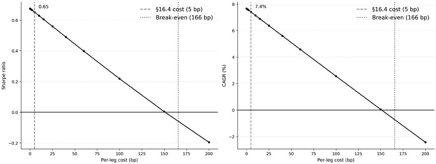
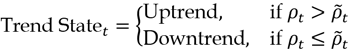
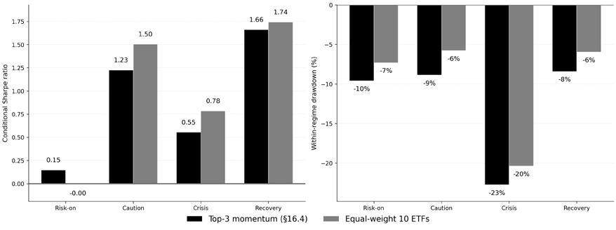

# Chapter 16: Strategy Simulation

The predictive models developed in earlier chapters produce forecasts: expected returns, scores, rankings, or directional signals. Those outputs acquire economic meaning only when they are translated into trades governed by explicit rules for timing, position sizing, cost, and accounting. Backtesting is the discipline that bridges this gap, turning a predictive claim into a falsifiable statement about realized portfolio behavior under a trading protocol.

That translation is consequential. A strong signal can disappear once fills are delayed, turnover is penalized, cash is tracked correctly, or a benchmark is included for comparison. Conversely, a modest signal can remain useful when the protocol is carefully specified and evaluated without optimistic shortcuts. This chapter, therefore, treats strategy simulation as a falsification exercise rather than as a search for the smoothest equity curve.

After completing this chapter, you will be able to:

- Formalize a backtest as an explicit trading protocol covering timing, execution, costs, sizing, data availability, and benchmark choice.
- Distinguish vectorized and event-driven engines in terms of assumptions, use cases, and parity requirements rather than caricaturing them as realistic or unrealistic by default.
- Build and interpret a simple non-ML ETF baseline to provide a concrete reference point for the methods in later chapters.
- Evaluate a strategy using the core reporting stack: gross and net performance, drawdowns, regime behavior, baseline comparisons, and cost survival.
- Apply strategy-level inference tools, including search-aware significance checks, before treating a selected Sharpe ratio as evidence of genuine skill.

We will begin with the falsification mindset and then specify the trading protocol that a credible backtest must declare. Next, we will distinguish between vectorized and event-driven backtesting in terms of representation and simulation semantics, including the practical execution choices that cause ostensibly similar backtests to diverge. We will develop an ETF baseline strategy, cover performance reporting and regime diagnostics, and close with strategy-level overfitting and multiple-testing controls. The summary then positions allocation, transaction costs, and risk overlays as the next layers of realism.

## 16.1 Backtesting as falsification

A common error in quantitative trading is overestimating the ability of a backtest to predict future strategy performance. A backtest is evidence to be considered, not a verdict. It is a historical simulation used to test whether a strategy survives realistic assumptions about data timing, execution, and costs. Bailey et al. (2015) show how easily selection effects can produce strong in-sample results that fail out of sample.

This framing changes the default interpretation of every equity curve. A good curve is not confirmation; it is a claim that now needs deliberate attempts to break it. López de Prado (2018) argues that the purpose of backtesting is to reject fragile ideas early, not to certify strategies that look good under one historical path.

The verification mindset asks whether performance looks attractive. The **falsification mindset** asks what would disprove the result. That shift forces three questions:

1. Is the signal genuine, or is it an artifact of leakage, data errors, or selection?
2. Is the execution model feasible at the assumed timing, liquidity, and market impact?
3. Is performance stable across regimes and small specification changes?

A strategy that cannot survive these questions is not ready for capital.

This perspective also changes how negative outcomes are treated. Failed tests are the main product of disciplined research. The faster a weak idea is falsified, the more resources remain for hypotheses that can survive scrutiny.

### Failure modes and diagnostic design

Bailey et al. (2014a) describe recurrent sources of backtest failure, and each has a direct diagnostic implication.

| Failure Mode | Description | Diagnostic Test |
| --- | --- | --- |
| Lookahead bias | Using information unavailable at decision time | Walk-forward validation; point-in-time data audit |
| Survivorship bias | Testing only on assets that survived | Include delisted securities; verify universe construction |
| Data snooping | Selecting strategies that worked ex post | Defalted Sharpe Ratio; hold-out validation |
| Unrealistic execution | Assuming perfect fills at unrealistic prices | Slippage modeling; capacity analysis |
| Cost underestimation | Ignoring or minimizing trading frictions | Cost sensitivity analysis across realistic ranges |
| Regime fragility | Strategy works only under specific conditions | Regime-sliced performance diagnostics |
*Table 16.1: Backtest failure modes*

ML workflows add **leakage channels** of their own. Common examples include fitting transformations to full samples, leaking future information through target construction, or using cross-validation splits that allow information to flow across folds. These are easy to miss because they often appear to be normal preprocessing.

White (2000) formalized data snooping as a **multiple-comparison problem**: when the same sample is used to evaluate many rules, models, or parameterizations, the selected winner can appear significant purely because it is the maximum of many noisy estimates. In trading applications, this means that the best reported Sharpe ratio is upward-biased when many effectively independent trials are searched.

**Backtest frameworks and what they answer**

Joubert et al. (2024a) distinguish **three simulation frameworks** with different inferential roles:

- **Walk-forward testing** preserves temporal ordering by training on a past window and testing on the next window as time advances. It is the most direct way to test implementable forecasting and execution logic, but its estimates can still be sample-specific.
- **Resampling methods** reuse historical data, often through block-bootstrap variants, to quantify uncertainty around performance statistics. They are useful for confidence intervals and robustness checks, but conclusions depend on the resampling assumptions used to preserve dependence structure.
- **Monte Carlo simulation** generates synthetic paths from an explicit data-generating model. This is valuable for stress analysis and edge-case exploration that may not be captured within finite historical windows. Its limitation is equally clear: results are only as credible as the structural assumptions behind the simulation engine.

A strong research process uses these frameworks as complements. Walk-forward establishes temporal plausibility, resampling characterizes uncertainty around observed outcomes, and Monte Carlo probes model-conditional stress behavior.

### Practical workflow and decision standard

A practical **falsification workflow** starts by pre-specifying the claim and expected failure conditions, then mapping diagnostics to failure modes in signal quality, execution realism, cost assumptions, and capacity. Results are then interpreted with skepticism proportional to search breadth, and negative outcomes are recorded rather than discarded. Pre-specification is the anchor: without it, nearly any historical pattern can be rationalized post hoc.

**Even with rigorous tests, the base-rate problem remains**. If only a small fraction of candidate strategies has a true edge, false positives can rival or exceed true positives. In competitive markets, the prior belief regarding edge is plausibly low, so rejection standards should be stricter than most exploratory research practice would suggest. The implication is simple: the default posture is disbelief until evidence survives multiple, explicitly documented attempts at rejection.

## 16.2 Specifying your backtest protocol

A backtest is interpretable only after its trading protocol is fixed. The protocol states what information is available, when orders are generated, how fills are simulated, how positions are sized, which constraints bind, and how costs enter NAV. Two backtests of the same signal can reach different conclusions because they answer different protocol questions.

The protocol should be recorded before results are interpreted. At minimum, it must specify six components: signal timing, rebalance and holding rules, position sizing, fill assumptions, constraints, and costs. *Chapter 6* defines the setup-level configuration and validation split; here those choices become executable simulation semantics.

### Signal generation timing

When does the signal become available relative to when trades execute? Common options include: **Close-to-next-open**: Signal computed on day 𝑡 close prices; trades execute at day 𝑡 open.

• **Close-to-close**: Signal computed on day 𝑡 close; trades execute at day 𝑡 close. This is only valid This is conservative and realistic for most signals. • if the signal is computed before market close (for example, from intraday data).

Same-bar execution, where signal and execution occur at the same timestamp, is generally unrealistic. The rule is simple: the decision to trade, order placement, and fill are sequential events; assuming they occur simultaneously fuses past and future and, thus, introduces **lookahead bias**. and acting on this decision at the next (𝑡) open implies that the holding period return for a sin-Strategy returns need to reflect order executions, not trade decisions. Deciding to enter at the close,

open െܲ gle-day position is: 𝑟௧ାଵ= ௧ାଶ ௧ାଵ open ௧ାଵ  open This assumes entry at day 𝑡 open and exit at day 𝑡 open. For multi-day holds, adjust the exit price accordingly. The key point: signal computation (day 𝑡 close) must be strictly separated from execution (day 𝑡). Misspecifying this lag can dramatically inflate returns.

### Score to signal conversion

Quantitative strategies often use continuous scores, whether based on custom metrics or ML predictions, and require an explicit conversion to an entry signal. Three common approaches trade off adaptiveness against complexity:

- **Fixed threshold**: Enter when the predicted score exceeds a static cutoff (for example, predicted return > 0). Simple and interpretable, but does not adapt to changing score distributions.
- **Rolling percentile**: Enter when the score exceeds its own recent distribution (for example, above the 90th percentile of the trailing 63-day window). Adapts to regime shifts, but higher turnover as the threshold moves.
- **Cross-sectional percentile**: At each rebalance, rank all assets and select the top N%. Controls position count exactly and ensures the portfolio is always invested, but ignores absolute signal strength.

The nature and calibration of the rules applied at this step significantly impact performance.

### Rebalancing frequency and holding period

A rebalancing schedule needs to define the following items:

- **Frequency**: Daily, weekly, monthly, or event-driven rebalancing
- **Holding period**: Minimum time between entering and exiting a position
- **Calendar versus business days**: Whether schedules account for market holidays

A strategy designed for monthly rebalancing cannot be validated with daily returns unless the backtest enforces monthly position changes. Mixing frequencies - computing signals daily but rebalancing monthly - must be explicitly modeled.

The **rebalancing schedule** determines when the portfolio *can* change, but **exit rules** determine when individual positions *must* change before the next rebalance:

- **Strategic exits** include rules such as dropping a position when the signal weakens or a rank threshold is lost before the next rebalancing timestamp.
- **Protective exits** include stop-loss, trailing, and maximum-holding-period rules; see *Chapter 19* for risk overlays.

### Position sizing

We will discuss common approaches to position sizing in the next chapter. The key categories for this section include: **Equal weight**: Each position receives ͳȀܰ of capital

•

- **Inverse volatility**: Position sizes inversely proportional to asset volatility

Here, the goal is to isolate the effects of signal quality from those of portfolio construction.

**Futures** require additional protocol detail. Position size is not shares times price, but contracts times notional value, where notional equals price times the contract multiplier. That multiplier also converts price moves into realized PnL, so omitting it can misstate profits and losses by orders of magnitude.

### Order types and fill assumptions

We introduced different order types and motivations for using them in *Chapter 3*, and we will discuss strategies to manage execution cost in more detail in *Chapter 18*. For now, we consider these options:

- **Market orders at open/close**: Assume execution at the official price
- **Limit orders**: Require a fill model (partial fills, queue position)
- **VWAP/TWAP**: Assume execution at time-weighted or volume-weighted average price

Market order fills at the open or close are the simplest assumption, but can be optimistic for large positions. Conservative implementation assumptions and explicit documentation of fill logic are therefore part of the protocol, not an optional detail.

### Constraints

Constraints determine not only which portfolio is desired but also which trades are actually admissible. Key constraints include:

- **Leverage limit**: Maximum gross exposure (for example, 100% = no leverage)
- **Short selling**: Whether shorting is permitted, the borrowing costs, and the availability
- **Minimum position size**: Regulatory or practical minimums
- **Sector/country limits**: Limits on the portfolio share in certain categories
- **Cash buffer**: Minimum cash held for redemptions or margin
- **Corporate actions**: How splits, dividends, delistings, and symbol changes are handled; use adjusted prices and include delisting returns

A constraint that is checked after returns are computed was not simulated. In practice, constraints interact with sizing, fill assumptions, and cost modeling. *Chapter 17* discusses constraints from a portfolio allocation perspective, and *Chapter 19* discusses them through a risk lens.

### Cost model

Transaction costs are the largest source of backtest-to-live performance decay; *Chapter 18* discusses estimating costs in detail. The cost model must include:

- **Commissions and fees**: Broker commissions, exchange fees, and regulatory fees; vary by broker and order type and may be measured in monetary units or percentage terms.
- **Bid-ask spread**: The spread represents an immediate cost for market orders.
- **Market impact**: Large orders move prices against the trader. *Chapter 18* covers detailed market impact models.
- **Slippage**: The difference between expected and realized price due to delays, partial fills, or market impact.

In this chapter, we focus on testing performance robustness to cost assumptions; *Chapter 18* addresses estimating and refining the cost model itself.

### Testing sensitivity to cost assumptions

Cost parameters beyond fees and commissions are estimates. **Sensitivity analysis** varies spread, slippage, commissions, and impact across plausible ranges, then reports break-even levels for Sharpe and net return. The question is whether profitability survives realistic costs. In practice, the procedure is straightforward:

1. Define a conservative grid for the main frictions.
2. Then, run the strategy across that grid, and identify the break-even region where net Sharpe or net return turns negative.
3. Finally, compare that break-even region with the realistic execution costs for the market and trading style under study.

If the strategy only works in the optimistic corner of the grid, the signal has not survived validation.

The thinner the edge of your strategy, the more important sensitivity becomes. If unsure about costs, use conservative estimates. It is better to reject a profitable strategy than to implement an unprofitable one. Document the cost assumptions that would make the strategy unprofitable because it defines the operational requirements for live trading.

**Implementation**:

- `01_backtest_first_principles.py` builds a complete ETF momentum backtest from scratch, making every protocol decision explicit.
- `02_futures_backtesting.py` illustrates how contract multipliers, per-contract fees, and session conventions affect the simulation contract.
- `08_signal_method_comparison.py` compares turnover, signal frequency, and risk-adjusted returns across all three score-to-signal methods.

The next section shows how backtesting engines differ in how they encode this trading flow and these constraints, and how this can affect measured performance.

## 16.3 Vectorized and event-driven backtesting

Backtesting engines differ less by programming style than by the **simulation semantics** they encode. A strategy can often be represented as timestamp-aligned arrays of signals, target weights, and returns. It can also be represented as a sequential process in which the engine observes market data, updates portfolio state, generates orders, processes fills, applies costs, and advances to the next bar.

Both representations can be correct. Both can also be misleading. The distinction that matters is not whether the implementation uses NumPy arrays or a loop internally. The distinction is whether the trading protocol is naturally a static array transformation or a state-transition system:

- In a **vectorized** **backtest**, you specify the inputs needed to compute the portfolio path in array form: signals, tradable universe, rebalance dates, and cost formulas. The backtest then evaluates the implied portfolio returns under a timing convention.
- In an **event-driven backtest**, you specify how the strategy behaves as the simulation unfolds. The engine maintains portfolio state: cash, positions, open orders, realized and unrealized PnL, margin usage, borrow constraints, risk flags, and possibly order history. Each bar updates that state, and the next action depends on the state produced by earlier actions.

The practical questions are therefore: Can the full trading protocol be expressed as timestamped signals, target exposures, and cost formulas without changing the strategy’s meaning? Or does the strategy require an explicit simulation of orders, fills, cash, positions, and risk state?

That question is more useful than a generic preference for “fast vectorized research” or “realistic event-driven research.” Vectorized backtests are not inherently naive, and event-driven backtests are not inherently realistic. Each is only as credible as the protocol it implements.

### How vectorized backtesting works

A vectorized backtest treats the portfolio path as a transformation of aligned data arrays. The core inputs are usually:

- A price or return matrix
- A tradable-universe mask
- A signal or score matrix
- A rebalance schedule
- A target-weight or target-position matrix
- A transaction-cost model applied to changes in exposure

For example, a monthly long-short equity strategy can often be described in this form. At each rebalance date, rank stocks by a lagged signal, select the top and bottom quantiles, assign equal or volatility-scaled weights, apply turnover costs, and compound the resulting portfolio returns. The simulation does not need to know about individual order objects if the intended protocol is genuinely “rebalance to these weights at this price using this cost assumption.”

The advantage is **computational efficiency**. Array-based research scales well across large universes, long histories, and many variants of the same idea, since NumPy arrays are usually much faster than Python loops. It is often the right tool for answering early research questions:

- Does the signal have any economically meaningful effect after plausible costs?
- Is performance robust across parameter values?
- Is the result concentrated in a small subset of assets or dates?
- Does the strategy survive different ranking, weighting, or rebalance rules?

The limitation is that many execution details must be compressed array transformations. A turnover penalty may approximate transaction costs, but it does not by itself model order rejection, partial fills, cash release, integer shares, short-sale constraints, borrow availability, or intrabar stop behavior. That compression is acceptable when those details are immaterial to the claim. It is dangerous when they determine the result.

The main failure mode of vectorized research is **semantic drift**: the arrays no longer correspond to a feasible trading protocol. Common examples include same-bar execution from close-to-close signals, implicit trading in assets with missing bars, forward-filled prices that create artificial tradability, target weights that ignore cash constraints, or cost formulas that penalize turnover without checking whether the trade could have been financed.

### How event-driven backtesting works

An event-driven backtest models trading as a sequence of state updates. At each timestep, the engine performs some version of the following loop:

1. Ingest the next market event.
2. Update prices, valuations, and portfolio state.
3. Process open orders according to the fill model.
4. Apply commissions, slippage, and other cost components.
5. Call the strategy logic and create, modify, cancel, or defer orders.
6. Advance the simulation clock. comes. The **relevant state** is not merely the signal value at time 𝑡, but the entire simulated trading This is the natural representation when the strategy’s next action depends on earlier simulated out-

context: current holdings, cash, unsettled orders, realized PnL, drawdown, margin, short exposure, and any risk flags triggered earlier in the run. Examples include:

- A drawdown circuit breaker that reduces exposure after the realized equity curve breaches a threshold
- A Kelly-style sizing rule that updates capital-at-risk based on realized gains and losses
- A stop-loss or trailing-stop rule that adjusts based on the path after entry
- A multi-leg strategy where the second leg depends on whether the first leg filled
- A futures strategy whose contract roll, margin usage, and available capital interact

The benefit is not that event-driven simulation automatically matches live trading. Bar data still hides the order book, queue position, intrabar path, and market impact unless these are modeled separately. The benefit is that event-driven simulation exposes the state variables and transition rules that the strategy actually uses. This makes the protocol inspectable.

**The cost is complexity.** Event-driven systems require more assumptions, more bookkeeping, and more validation. Defaults matter: when orders are evaluated, the price they are filled at, whether exits are processed before entries, whether cash is released immediately, how fractional shares are handled, how shorts are financed, and how missing data is treated. A poorly specified event-driven backtest can be less reliable than a disciplined vectorized one.

### How to select a backtest methodology

Use a vectorized backtest when the portfolio path can be computed from timestamped signals, target exposures, rebalance dates, and explicit cost formulas without changing the strategy’s meaning. Use an event-driven backtest when strategy behavior depends on simulated state that only materializes during the course of the simulations: fills, cash, margin, rejected orders, inventory, stops, drawdowns, or pending orders.

The distinction is semantic, not aesthetic. A vectorized backtest can be valid when the protocol is weight-based and path independent. An event-driven backtest can be invalid if its fill timing, cash accounting, or missing-data policy is wrong. The simulator is credible only when its state variables match the trading protocol.

### How simulation semantics control results

Even when the same strategy can be implemented in both styles, different engines may produce different results because they encode different execution semantics. This is why comparisons among tools such as vectorBT, Zipline, backtrader, Lean, and `ml4t-backtest` are useful, but they should not be framed as a brand ranking. They reveal which assumptions control the result.
| Simulation choice | Why it matters |
| --- | --- |
| Signal-to-fill timing | Same-bar close, next-bar open, and next-bar close imply difefrent information sets and difefrent look-ahead risks. |
| Fill price basis | Open, close, midpoint, stop, limit, and slippage-adjusted prices change both PnLn and trade feasibility. |
| Order sequencing | Processing sells before buys can release cash; processing buys first can cause rejection or resizing. |
| Target-weight translation | Target weights must be converted into orders using a portfolio value convention, which may be frozen or updated during the rebalance. |
| Cash accounting | Engines difefr in how they handle cash release, unsettled proceeds, commissions, short sale proceeds, and margin requirements. |
| Fractional versus integer shares | Rounding creates residual cash, allocation drift, and sometimes small unintended trades. |
| Insufficient-cash behavior | Orders may be rejected, resized, partially filled, or allowed through margin. Each choice changes the path. |
| Short-sale rules | Short positions may generate cash, consume margin, require borrow availability, or incur financing costs. |
| Stop and limit semantics | Trigger timing and fill price assumptions can dominate results for path- dependent exits. |
| Missing bars and calendars | Sparse prices, late asset entry, delistings, holidays, and forward-filled data determine what is tradable. |
| Cost and slippage models | Costs afefct not only net returns but also afofrdability, order size, and whether trades are executed. |

*Table 16.2: Simulation semantics that can change backtest results*

Order sequencing is a useful example because it is easy to miss in weight-based research. Suppose a rebalance involves selling one asset and buying another. If the engine processes the sell first, the proceeds may finance the buy. If it processes the buy first, the buy may be rejected or resized because the cash has not yet been released. The difference is not philosophical. It is a concrete statement about the simulated trading process.

Timing conventions are even more consequential. A strategy that forms a signal using the close and also executes at the same close is usually using information that was not available before the trade. Shifting execution to the next bar may convert an attractive result into an unprofitable one. This is not an implementation detail. It is the difference between a valid and invalid information set.

### Where the major libraries fit

The major Python and open-source backtesting libraries occupy different points in this design space:

- Array-first tools such as vectorBT and vectorBT PRO are especially strong for large-scale research and parameter sweeps (with due attention to multiple testing adjustments, see *Section 16.7*). They can be highly sophisticated and may include compiled order simulation, but their natural research interface is array-oriented.
- Zipline, backtrader, Lean, and `ml4t-backtest` expose the trading process more directly as a sequence of strategy decisions, orders, fills, and portfolio updates. They are therefore better suited when the strategy claim depends on explicit execution state, path-dependent risk management, cash constraints, or order-level behavior.

This distinction should not be overstated. A research workflow can use both. The right question is not which library is more realistic in general. The right question is which simulation contract matches the strategy being tested.

### A practical workflow

A disciplined workflow begins with the protocol, not the engine:

- For **exploratory research**, use the cheapest representation that preserves the strategy’s meaning. Many ranking, allocation, and factor-portfolio ideas can be tested efficiently with vectorized calculations, provided the timing convention, tradable universe, rebalance rule, weight construction, and cost model are explicit.
- For **strategies with a recursive state**, begin with sequential simulation. Do not force an array approximation when the strategy depends on fills, cash, margin, inventory, drawdown, or contingent orders. In these cases, the event loop is not incidental machinery. It is part of the strategy definition.
- For **validation**, make the simulation semantics explicit. Record the signal timestamp, execution timestamp, fill price, order sequencing rule, cash and margin treatment, share granularity, short-sale assumptions, missing-data behavior, and cost model. Then, verify that the backtester implements these choices as intended. Defaults should be treated as assumptions, not conveniences.

The broader lesson is that backtest credibility comes from aligning three objects:

- The economic claim
- The trading protocol
- The simulator’s state and timing semantics **Implementation**:
- `03_single_asset_vectorbt.py` shows a compact vectorized representation.
- `04_single_asset_ml4t_backtest.py` introduces sequential simulation.
- `05_stateful_strategies.py` shows when explicit state becomes the natural formulation of the strategy itself.
- `06_framework_parity.py` then shows how mismatched semantics create different results.
- `07_engine_divergence_anatomy.py` decomposes those differences in detail.

For comparison of `ml4t-backtest` with popular libraries, see:

- `15_lean_engine_parity.py`
- `16_case_study_lean_parity.py`
- `17_backtrader_zipline_engine_parity.py`
- `18_vectorbt_engine_parity.py`

We now turn to a key step in the backtest workflow: a trustworthy baseline.

## 16.4 An auditable non-ML baseline

Before evaluating machine learning models, we need a credible baseline – a non-ML strategy that is simple, interpretable, and difficult to “cheat” accidentally. This baseline serves two purposes:

- It establishes a performance yardstick for later chapters
- It forces us to build the full backtesting infrastructure before adding model complexity

McLean and Pontiff (2016) found that published anomalies lose approximately 26% of their magnitude out-of-sample after discovery, with another 32% decaying after publication. This pattern is consistent with in-sample overfitting and post-publication arbitrage. A robust baseline helps distinguish genuine signal from noise by providing:

- **A benchmark for improvement**. ML strategies must beat the baseline by a significant margin. Otherwise, the added complexity is not justified.
- **A sanity check on infrastructure**. Bugs in data pipelines, execution assumptions, or cost models affect all strategies equally. A baseline with known properties helps identify infrastructure problems before they contaminate model evaluations.
- **A template for the trading protocol**. Building the baseline forces us to make every protocol decision explicit. These decisions then apply consistently to all subsequent strategies.

### A simple baseline – Momentum with risk filter

We can construct a baseline using two well-documented signals:

- **Cross-sectional momentum**: Rank assets by risk-adjusted trailing return over a lookback window. The academic standard is 12-minus-1-month momentum - ranking by trailing 12-month return, excluding the most recent month to avoid short-term reversal. Jegadeesh and Titman (1993) established this anomaly, which has been replicated across markets and time periods. For the ETF universe (see case study `README` for details), we adapt that idea to 6-month risk-adjusted momentum (cumulative return divided by realized volatility), which fits a smaller, cross-asset universe with widely differing volatility more naturally than a stock-level 12-minus-1 formulation.
- **Regime filter**: A yield-curve-based risk indicator determines whether to hold momentum positions or rotate to a defensive allocation. When the 10-year minus 2-year Treasury spread exceeds 0.5%, the strategy goes risk-on by holding the top 3 momentum ETFs equally weighted; otherwise, it shifts to a defensive sleeve of 60% AGG and 40% TLT.

The baseline is intentionally unsophisticated. We use no optimization, no machine learning, and only widely-known signals. `01_backtest_first_principles.py` implements this baseline from scratch - no frameworks, just NumPy and Pandas – so every protocol decision is visible. If this baseline underperforms expectations, the problem lies in our infrastructure, not our signals.

### Step-by-step baseline construction

Let’s build the baseline, step-by-step:

1. **Define the universe:** Our baseline uses ten liquid asset-class ETFs: SPY, QQQ, IWM, EFA, EEM, AGG, TLT, GLD, VNQ, and DBC. The universe is intentionally small, covering US and international equities, bonds, gold, real estate, and commodities, so the strategy can express cross-sectional momentum and regime rotation without introducing stock-level survivorship and delisting mechanics.
2. **Compute signals:** The teaching notebook computes a 6-month cumulative return and scales it by 6-month realized volatility.
3. **Apply filters and rank**: Rank the ten ETFs by the risk-adjusted momentum score. In risk-on regimes, select the top three ETFs and weight them equally. In risk-off regimes, ignore the cross-sectional ranking and move to the defensive AGG/TLT sleeve. set 𝑤AGG = 0.60 and 𝑤TLT = 0.40.
4. **Assign positions:** Equal-weight the selected momentum ETFs in risk-on states; in risk-off states,
5. **Apply the trading protocol:** Using the trading protocol defined in *Chapter 6*’s `setup.yaml` and detailed in *Section 16.2*:
- Signal computed at the month-end close
- Rebalance on the first trading day of next month
- Monthly rebalancing frequency
- 5 basis points per trade (10 bp round-trip)
- No leverage
6. **Generate reports:** Produce a standardized tear sheet with:
- Equity curve and drawdowns
- Monthly return heatmap
- Performance metrics (*Section 16.5*)
- Regime-sliced diagnostics (*Section 16.6*)

The equity path, drawdown profile, monthly heatmap, and rolling diagnostics together make it harder to conflate a single favorable metric with a robust trading process.

### Documenting baseline specification and performance

Running the ETF momentum baseline from January 4, 2010, through December 29, 2023, produces:

| Metric | ETF Momentum | 60/40 Benchmark |
| --- | --- | --- |
| Total Return | 171.4% | 282.8% |
| CAGR | 7.4% | 10.1% |
| Volatility | 11.4% | 12.7% |
| Sharpe Ratio | 0.65 | 0.80 |
| Sortino Ratio | 0.86 | 0.96 |
| Max Drawdown | −31.9% | −26.9% |

*Table 16.3: ETF Momentum baseline backtest*

Here, **the benchmark is a static 60/40 mix of 60% SPY and 40% AGG.** That is distinct from the strategy’s risk-off sleeve, which rotates to 60% AGG and 40% TLT when the yield-curve filter turns defensive. The Sharpe ratios in this teaching notebook are computed against a zero cash rate, so they should be read as simple risk-adjusted summaries rather than as fully risk-free-adjusted institutional performance measures.

The baseline is still useful precisely because it is not flattering. It fails to beat the static 60/40 benchmark on total return and experiences a deeper maximum drawdown in this sample. That is a healthy outcome for a reference strategy: the baseline is transparent, easy to audit, and hard to romanticize. Any later ML strategy that claims progress must improve on an explicit, somewhat disappointing benchmark rather than on an unrealistically weak straw man.

If your baseline significantly exceeds these figures, investigate for bugs (lookahead, survivorship, cost omission). If it significantly underperforms, verify data quality and protocol implementation.

The baseline specification becomes a permanent reference:

| Component | Specification |
| --- | --- |
| Universe | 10 ETFs (SPY, QQQ, IWM, EFA, EEM, AGG, TLT, GLD, VNQ, DBC) |
| Signal | 6-month risk-adjusted momentum (return/volatility) |
| Positioning | Top 3 momentum ETFs (risk-on) or 60% AGG / 40% TLT (risk-off) |
| Regime | 10Y−2Y Treasury spread greater than 0.5% = risk-on |
| Weighting | Equal weight among the selected assets |
| Rebalancing | Monthly, first trading day |
| Costs | 5 bp per trade (10 bp round trip) |
| Benchmark | Static 60% SPY/40% AGG |
| Period | 2010-01-04 to 2023-12-29 |

*Table 16.4: Baseline backtest specification*

The next section introduces key performance metrics.

**Implementation**: `01_backtest_first_principles.py` builds this baseline from scratch with full position accounting and a 60/40 benchmark comparison.

## 16.5 Understanding performance metrics

A backtest turns a trading rule into a history of portfolio values, returns, positions, trades, and costs. A tear sheet summarizes this history into a small set of metrics that describe the strategy’s economic profile: how much capital it earned, how volatile and path-dependent those gains were, how much trading was required, and how sensitive the result is to implementation frictions.

This section defines the core metric set used throughout the book. The goal is not to prove that a strategy has skill, nor to compare every possible model variant. Those questions require uncertainty estimates, baseline comparisons, regime diagnostics, and multiple-testing controls. Here, we first define the reporting standards for a given backtest configuration; the next section uses these metrics for economic diagnostics across costs, baselines, and regimes. Finally, *Section 16.7* addresses statistical inference and strategy-level overfitting.

### Design principles for backtest reporting

No single metric is sufficient. A strategy with high cumulative return may have unacceptable drawdowns. A strategy with a strong Sharpe ratio may require turnover that cannot survive realistic costs. A strategy with attractive average performance may earn all its profits in one favorable regime. A useful tear sheet, therefore, reports a compact but complete set of measures.

The core metric set follows three principles:

- **Completeness**: Report returns, risk, risk-adjusted performance, trading behavior, and implementation costs. Omitting any one category can make a fragile strategy appear robust.
- **Parsimony**: Include the metrics needed for the decision at hand. This chapter focuses on the credibility of strategy backtests. Later chapters add metrics specific to allocation, execution, capacity, and tail-risk overlays.
- **Comparability**: Use standardized definitions across strategies, datasets, and time periods. A metric whose definition changes across notebooks loses most of its diagnostic value.

The tear sheet should be read as an evidence summary, not as a verdict. It describes what the simulation produced under a specified protocol. Whether the result is statistically reliable, economically robust, and implementable requires the additional diagnostics developed in the following sections.

### Return and compounding metrics

Return metrics describe the scale and path of capital growth. They answer the first question every Let 𝑟௧ denote the portfolio return in period 𝑡, and let 𝑊௧ denote portfolio wealth or net asset value after backtest raises: what happened to invested capital over the evaluation period? period 𝑡. The **cumulative return** 𝑅 over 𝑇 periods is:

𝑅(1 ൅ݎ௧) −1

௧ୀଵ

Cumulative return is easy to interpret but depends heavily on sample length. A strategy tested over 20 years will, by definition, have more time to compound than one tested over 5 years. For cross-sample comparison, the **compound annual growth rate** (CAGR) reports the constant annual rate that would produce the same ending wealth: CAGR = (்ܹ ) ஺Ȁ் −1

0 where 𝐴 is the number of return periods per year. For daily returns, 𝐴252, for monthly returns, 𝐴12; for 15-minute bars, 𝐴 should reflect the number of tradable bars per year under the backtest

The **equity curve** plots 𝑊௧ through time: calendar.

௧ 𝑊௧= 𝑊0 ∏(ͳ ൅ݎ௦)

௦ୀଵ

The equity curve is not a scalar metric, but it is often the most informative object in the tear sheet. It reveals whether performance was smooth or concentrated, whether losses clustered, and whether the strategy spent long periods below its prior peak.

A simple supplementary metric is the **hit rate**, the fraction of periods with positive returns. This metric is useful only with context. A strategy can have a high hit rate and still lose money if occasional losses are large. Conversely, trend-following and option-like strategies may have low hit rates but positive **expectancy** (expected net profit per trade) because gains are much larger than losses. Hit rate also varies with the measurement interval, so it should not be compared across daily, weekly, and monthly strategies without careful consideration.

### Risk and drawdown metrics

Risk metrics describe the variability and path dependence of returns. Volatility measures dispersion around the mean. Drawdown metrics measure losses from prior peaks, which often matter more to investors than unconditional return variance.

The **annualized volatility** of periodic returns is: 𝜎ann = √ܣ⋅std(ݎ௧)

where 𝐴 is the number of return periods per year. This square-root annualization assumes weak de-

pendence across periods. When returns exhibit material serial correlation, volatility and Sharpe-ratio annualization require the adjustments discussed in *Section 16.7*.

**Maximum drawdown** is the largest percentage loss from a previous wealth peak. Define the running peak as: 𝑊௧= max ଴ஸ௦ஸ௧𝑊௦

and the drawdown at time 𝑡 as:

௧െܹ 𝐷௧= ௧ ௧ 

The maximum drawdown is then: MDD = min ଴ஸ௧ஸ்ܦ௧

Some reports present maximum drawdown as a positive loss magnitude |MDD|, while others report

it as a negative return. The convention should be explicit and consistent.

Maximum drawdown is highly sample-dependent because it is an extreme statistic. Longer samples have more opportunities to produce severe drawdowns, even for the same underlying strategy. This makes MDD useful for stress interpretation but unreliable as a stand-alone measure of strategy quality.

**Drawdown duration** measures how long capital remains below its prior high. A long drawdown duration is economically important because investors may redeem, reduce risk, or abandon a strategy before the eventual recovery. A strategy with moderate maximum drawdown but repeated multi-year underwater periods may be harder to hold than a strategy with a sharper but shorter loss.

The **Calmar ratio** divides compounded return by maximum drawdown: Calmar = CAGR |MDD|

The Calmar ratio is useful when drawdown risk is central, especially for directional or trend-following strategies. It should not be interpreted mechanically. A high Calmar ratio over a short sample can reflect a favorable period with no major stress event, while a low Calmar ratio may still be acceptable for a diversifying strategy that improves portfolio-level risk.

### Risk-adjusted performance metrics

Risk-adjusted metrics relate returns to a measure of risk. They are useful because raw returns are not comparable across strategies with different volatility, leverage, or downside exposure.

The **Sharpe ratio** measures excess return per unit of return volatility: SR = ܧൣܴ െܴ ௙] ߪோ  where 𝑅 is the strategy return, 𝑅௙ is the risk-free rate over the same period, and 𝜎ோ is the standard

deviation of strategy returns. In implementation, the numerator and denominator must use the same return frequency before any annualization is applied.

The Sharpe ratio is the most common performance statistic because it is simple, comparable, and closely related to mean-variance portfolio theory. Its simplicity is also its weakness:

- It treats upside and downside volatility symmetrically
- It summarizes the full return distribution using only the mean and variance
- It is sensitive to serial dependence, non-normality, and sample size

A reported Sharpe ratio is therefore an estimate, not a property known with certainty. *Section 16.7* discusses confidence intervals, serial-correlation adjustments, Deflated Sharpe Ratios, and search-adjusted interpretation.

The **Sortino ratio** aims to address the Sharpe ratio’s first weakness by replacing total volatility with downside deviation: Sortino = ܧൣܴ െܴ ௙] ߪdownside 

where downside deviation is computed from returns below a target threshold. Using the risk-free rate as the threshold: 𝜎downside = √ܧ[‹൫ܴ െܴ ௙, 0) 2]

The Sortino ratio is useful when upside volatility should not be penalized. However, it is not automatically more reliable than the Sharpe ratio. It depends on the target threshold, can be unstable when the number of downside observations is small, and still does not fully characterize tail risk. It should be reported alongside drawdown and tail diagnostics rather than replacing them.

### Trading and exposure metrics

Trading metrics describe how the return stream was produced. This matters because two strategies with similar returns and volatility can have very different implementation profiles. One may rebalance monthly with low cost and high capacity; another may require rapid turnover, leverage, and fragile execution assumptions. **Turnover** measures the fraction of the portfolio traded during a period. Let 𝑤௜ǡ௧ denote the target weight of asset 𝑖 after rebalancing at time 𝑡, and let 𝑤௜ǡ௧ିଵ

drift denote the previous portfolio weights after price movement but before the new rebalance. One-way portfolio turnover is: Turnover𝑡= 1 drift | 2 ෍|ݓ௜ǡ𝑡െݓ௜ǡ𝑡ିଵ

௜

The factor ½ avoids double-counting buys and sells when the portfolio is self-financing. For a long-only, fully invested strategy, a turnover of 0.10 means that roughly 10% of the portfolio’s value was traded during the period. For long-short portfolios, turnover should be interpreted alongside gross exposure, as the capital base and traded notional may differ.

**Average turnover** is: Turnover = 1ܶ∑Turnover௧்

௧ୀଵ

**Annualized turnover** is approximately: Turnoverann ൌܣڄ Turnover

where 𝐴 is the number of rebalance periods per year. This approximation is most meaningful when

turnover is measured at the strategy’s native rebalance frequency.

**Gross exposure** measures total absolute portfolio exposure: Gross Exposure𝑡ൌ෍|ݓ௜ǡ𝑡|

௜

A long-only fully invested portfolio has gross exposure near 1.0. A dollar-neutral long-short portfolio with 100% long and 100%short exposure has gross exposure near 2.0. Gross exposure above 1.0 indicates leverage or short exposure and increases sensitivity to financing costs, margin requirements, and position-level risk limits.

**Net exposure** measures directional market exposure: Net Exposure𝑡ൌ෍ݓ௜ǡ𝑡

௜ 

A dollar-neutral long-short strategy should have net exposure near zero. Persistent positive or negative net exposure indicates directional bias, which may explain performance that appears to come from security selection. Net exposure should therefore be interpreted alongside benchmark returns and factor exposures.

**Average holding period** provides another view of trading intensity. A rough portfolio-level approximation is: Average Holding Period ≈Gross Exposure

 Turnoverann expressed in years when turnover is annualized. This approximation is imperfect because positions enter and exit at different times, but it is useful for detecting mismatches between signal horizon and trading behavior. A strategy based on monthly features but turning over most of the book every few days requires explanation.

### Cost and implementation metrics

Cost metrics connect simulated returns to implementability. They measure how much performance depends on assumptions about commissions, bid-ask spreads, market impact, financing, and slippage. A strategy that is attractive before costs but unattractive after realistic costs is not a trading strategy; it is an artifact of an incomplete simulation. trading costs, 𝑟௧ **The first distinction is gross versus net return**. Gross return measures portfolio performance before gross, and net return subtracts implementation costs incurred during the period: net = 𝑟௧ gross െܿ 𝑟௧ ௧ where 𝑐௧ includes the modeled cost of trading, financing, borrowing, and other implementation fric-

tions included in the backtest protocol. Both gross and net returns should be reported. The difference between them is often as informative as the net result itself because it reveals whether performance is generated by forecast quality or consumed by trading intensity.

**Cost capacity** measures how much turnover-scaled implementation cost the strategy can absorb before its expected excess return is exhausted. It is not an estimate of realized cost. It is a diagnostic threshold that converts portfolio-level gross excess return into an implied maximum cost per dollar traded. Let 𝜏௧ denote traded notional as a share of portfolio value, using a stated one-way or round-trip convention. Suppose trading costs are linear in traded notional, so that a cost of 𝑐 per dollar traded reduces

1. Then expected net excess return is: net െݎ௧ gross െݎ௧ period return by ܧൣݎ௧ ௙൧ൌܧൣݎ௧ ௙൧െܿԜܧ[߬௧]

gross െݎ௧ The turnover-scaled break-even threshold is therefore: 𝑐∗= ܧൣݎ௧ ௙] ܧ[߬௧] 

gross െݎ௧ In a finite sample, the corresponding estimate is: ∑൫ݎ௧ ௙) 𝑐∗= ௧ ∑ ௧ ௧  The units are cost per dollar traded. If expected gross excess return is 1 per period and turnover is 10 of NAV, then 𝑐∗= 10 per dollar traded: a cost of ten cents on each dollar traded would consume the

full 1% portfolio-level excess return. This is not a forecast of implementation cost; it is the maximum average linear trading cost consistent with non-negative expected excess return. The convention for 𝜏௧ must be stated. If turnover is one-way traded notional, 𝑐∗ is a one-way cost per

dollar traded. If turnover is round-trip turnover, leverage-adjusted turnover, or half-turnover, the cost interpretation changes accordingly. diagnostic. If plausible spread, commission, slippage, and market-impact costs exceed 𝑐∗, the strate-This threshold should not replace a realistic cost model. It is useful as an implementation-margin gy is unlikely to survive implementation. If realistic trading costs are well below 𝑐∗, the strategy has

more cost capacity, although capacity, nonlinear impact, financing, borrow costs, and execution risk still require separate analysis.

**Cost sensitivity** reports key performance metrics over a range of cost assumptions. This is especially important for high-turnover strategies, intraday signals, less liquid assets, and strategies with short holding periods. A robust backtest should not depend on a single optimistic cost assumption.

*Section 16.6* uses cost sensitivity, baseline comparison, and regime slicing to turn these metrics into economic diagnostics, where an acceptable aggregate report can still mask state dependence.

**Implementation**: `09_performance_reporting.py` computes core metrics using `ml4t-` `backtest` and `ml4t-diagnostic` and displays standard visual diagnostics, including equity curves, drawdown plots, rolling performance, and monthly return heatmaps.

## 16.6 Diagnosing the economic value

A tear sheet summarizes what the backtest produced. Economic diagnostics ask a different question: **Why did it produce these results, and under what conditions would they survive?**

The metrics in *Section 16.5* describe return, risk, trading activity, and implementation cost for a fixed backtest. Those metrics are necessary, but they are not sufficient. A strategy can have an attractive net Sharpe ratio while depending on optimistic cost assumptions. This section turns the tear sheet into a diagnostic framework. It focuses on three questions:

1. Does performance survive realistic costs and turnover?
2. Does the ML strategy add value relative to a simple baseline?
3. Is performance robust across economically meaningful regimes?

Statistical inference, Sharpe-ratio uncertainty, and search adjustments are deferred to *Section 16.7*. Here, the focus is on economic credibility.

### From aggregate metrics to diagnostic decomposition

Aggregate metrics compress the backtest into a small number of statistics. This compression is useful, but it can obscure the underlying performance mechanism. A CAGR of 12%does not reveal whether returns came from broad market exposure, a few crisis months, or a small number of high-turnover trades. A Sharpe ratio of 1.0 does not reveal whether the strategy survives a slightly wider bid-ask spread. A maximum drawdown does not reveal whether losses occurred in expected failure modes or in supposedly favorable states. Diagnostic decomposition separates **three layers of evidence**:

1. **Implementation robustness**. A strategy must survive plausible assumptions about commissions, spreads, slippage, financing, borrowing, and market impact. This is especially important when signals are short-lived, turnover is high, or the traded universe contains less liquid instruments.
2. **Incremental model value**. ML forecasts should be compared with simple, transparent baselines. A strategy that fails to beat equal-weight, inverse-volatility, buy-and-hold, or a naïve factor rule may still be useful as a component of a larger portfolio, but it has not been established that model complexity adds economic value.
3. **State dependence**. Performance should be sliced by regimes that correspond to economically meaningful states: high versus low volatility, uptrend versus downtrend, expansion versus contraction, or normal versus stressed liquidity. A strategy whose edge appears only in benign states may be fragile even if its full-sample performance looks acceptable.

These diagnostics change the role of the tear sheet. Rather than a conclusion, it serves as the starting point for assessing whether the backtest result is implementable, benchmark-relevant, and robust across states.

### Cost sensitivity and turnover fragility

The first diagnostic is cost sensitivity. A strategy’s gross return is the return before implementation frictions. Its net return is the return after costs. The gap between the two measures how much simulated performance is consumed by trading.

High-turnover strategies are especially vulnerable because small cost errors compound across many trades. A 5-basis-point mistake in the estimated round-trip cost may be tolerable for a monthly strategy. The same error can destroy an intraday strategy that rebalances thousands of times per year.

The *Section 16.4* ETF momentum baseline illustrates the cost-sensitivity diagnostic on a strategy whose protocol is already explicit. With monthly rebalancing and a 5 bp per-leg fee assumption, the baseline produces an annualized two-way turnover near 460%of portfolio value - the rotation between top-3 momentum ETFs and the defensive sleeve generates substantial trading on every rebalance. *Figure 16.1* sweeps the per-leg fee from 0 to 200 basis points, which moves net Sharpe from 0.68 to slightly negative and crosses zero net CAGR near a per-leg cost of about 166 basis points. That break-even is a fragility *ceiling*, not a target: the *Section 16.4* protocol’s 5 bp assumption sits roughly thirty times below the ceiling, so realistic commission errors are unlikely to change the qualitative conclusion. A higher-frequency strategy with the same gross CAGR but ten times the turnover would have one tenth of the headroom.

*Figure 16.1: Net Sharpe and net CAGR for the Section 16.4 ETF momentum baseline as the per-leg fee sweeps from 0 to 200 basis points. Dashed line marks the Section 16.4 protocol’s 5 bp assumption; dotted line marks the break-even cost where gross CAGR crosses zero. The slope of either curve is the strategy’s marginal cost elasticity*

This example clarifies the diagnostic role of cost sensitivity. Signal validity alone is not enough. Implementation assumptions can dominate model quality, and the cost-sensitivity sweep is what reveals it. The relevant quantities are the **gross-to-net Sharpe gap** at the protocol’s cost assumption, the **breakeven cost** at which gross return equals zero, and the **annualized turnover** that translates per-leg cost into annual return drag. A strategy whose break-even cost sits close to its assumed cost is fragile regardless of the headline net Sharpe that simulation produced.

A credible backtest should therefore report:

- Gross and net performance
- Average and annualized turnover
- Break-even cost per dollar traded
- Performance under conservative, baseline, and optimistic cost assumptions
- Sensitivity of Sharpe, CAGR, and drawdown to the cost model

For high-turnover strategies, the cost-sensitivity table is not supplementary. It is part of the core evidence. If a strategy survives only under the most favorable cost assumption, the correct conclusion is fragility, not success.

### Baseline comparison and incremental model value

A backtest should not ask only whether the ML strategy made money. It should ask whether the ML strategy improved on a simple alternative available at the same time and under the same trading protocol. The appropriate baseline depends on the strategy:

- For a long-only cross-sectional equity strategy, equal-weight, value-weight, or inverse-volatility weighting may be natural.
- For a long-short strategy, a dollar-neutral factor baseline may be more appropriate.
- For an asset-allocation strategy, risk parity or a static diversified portfolio may be the relevant comparator.

The important point is that the baseline should be simple, transparent, and implementable.

A baseline comparison protects against three common mistakes:

- It separates **model value** from **market exposure**. A strategy may look strong because the traded universe performed well, not because the model selected better assets.
- It separates **forecasting skill** from **portfolio construction effects**. A simple rank rule or equalweight allocation may capture most of the available edge.
- It imposes an economic **opportunity cost**. Complexity is not free. ML pipelines require data engineering, feature maintenance, model monitoring, retraining, and governance. A complex strategy should justify this burden by improving net performance, risk, turnover, capacity, or diversification relative to a simpler alternative.

*Section 16.4* already supplied the simplest version of this diagnostic. *Table 16.3* reports the*Section 16.4* top-3 momentum rule alongside a static 60% SPY/40% AGG benchmark on the same calendar, the same per-leg cost, and a matched monthly rebalance schedule. The static benchmark earns a meaningfully higher Sharpe (0.80 compared to 0.65) with a shallower max drawdown (−-26.9% compared to –31.9%) at a small fraction of the momentum strategy’s turnover. The momentum rule has therefore not yet established that complexity earns incremental economic value on this sample. *Chapter 17* returns to the broader question of how to construct and compare allocators systematically; the *Section 16.6* diagnostic need only verify that the strategy clears one transparent benchmark before allocators are compared in detail.

A backtest report that omits the baseline comparison makes it too easy to confuse model sophistication with economic improvement. The relevant question is not whether the model is more advanced. The relevant question is whether the complete strategy earns a better net result than a lower-complexity alternative.

### Regime-sliced performance

Aggregate performance metrics can mask state dependence. A strategy with a respectable full-sample Sharpe ratio may profit mostly during calm bull markets while losing heavily during crises. Regime diagnostics reveal whether performance is robust across economically meaningful states or concentrated in favorable environments.

Ang and Bekaert (2002) show that asset returns differ across regimes such as expansion and contraction, high and low volatility, and changing interest-rate environments. For backtesting, this implies that the same trading rule can exhibit different expected returns, volatility, turnover, and drawdown behavior across states. Consider a momentum strategy that earns almost all of its lifetime profits during extended bull markets but loses during sharp reversals and liquidity stress. Its aggregate Sharpe ratio may be acceptable, but the strategy may fail precisely when investors most value diversification. Regime analysis turns this hidden dependence into explicit evidence.

*Chapter 9* introduced several regime features. Here, we use simple threshold-based regimes because they are transparent, reproducible, and sufficient for diagnostic reporting. cal threshold. Let 𝜎௧ denote the trailing 60-day realized volatility of a market index, computed using A volatility regime classifies periods by trailing realized volatility relative to a point-in-time historiinformation available by time 𝑡. Let 𝑚௧ denote the expanding historical median of 𝜎௦ for ݏ൏ݐ, or the

median estimated on the training sample. Then: Vol State𝑡= {Low, if ߪ𝑡൏݉ 𝑡, High, if ߪ𝑡൒݉ 𝑡.

The key point is that the threshold must not be computed using the full test sample. A full-sample median would use future information to classify earlier periods, thereby contaminating the diagnostic. 𝜌௧ൌܲ ௧Ȁܲ௧ି126 −1 denote the trailing 6-month total return of the market index, and let 𝜌௧ denote the A trend regime classifies periods by recent return relative to a point-in-time average of itself. Let expanding median of ሼߩ௦ǣ ݏ൏ݐሽ. Then:

Comparing 𝜌௧ to its expanding median enforces a 50/50 split by construction, so each combination

of volatility and trend states carries enough observations to make conditional metrics meaningful.

When the regime label is aligned with the next-period strategy return, use the lagged label implied by information known before that return is realized.

Crossing volatility and trend produces a four-state diagnostic:

| State | Volatility | Trend |
| --- | --- | --- |
| Risk-on | Low | Up |
| Caution | High | Up |
| Crisis | High | Down |
| Recovery | Low | Down |

*Table 16.5: Combined volatility and trend regimes*

More sophisticated models, such as Hidden Markov Models or regime-switching VARs, can be useful, but they introduce estimation risk, parameter instability, and additional researcher discretion. For diagnostic reporting, simple regimes are often preferable because they are easy to audit and harder to overfit. For each regime state 𝑠, compute the same metric family used in the tear sheet:

Sharpe𝑠= ܧ[ݎ௧∣State௧= ݏ] െݎ௙ǡ𝑠 std(ݎ௧∣State௧= ݏ) 

The regime table should include both performance and sample coverage. Applied to the *Section 16.4* ETF baseline over the 2010-01-04 to 2023-12-29 sample (3,395 active days after the 126-day trend warmup), the four-state diagnostic produces the following picture:

| Regime | Time % | Observations | CAGR | Vol | Sharpe | MDD |
| --- | --- | --- | --- | --- | --- | --- |
| Risk-on | 36.0% | 1,223 | 1.6% | 10.7% | 0.15 | -18.3% |
| Caution | 13.4% | 454 | 17.1% | 14.0% | 1.23 | -13.9% |
| Crisis | 33.8% | 1,146 | 6.6% | 11.9% | 0.55 | -24.0% |
| Recovery | 16.8% | 572 | 16.4% | 9.9% | 1.66 | -10.9% |
| Overall | 100% | 3,395 | 7.7% | 11.5% | 0.67 | -31.9% |

*Table 16.6: Regime-sliced performance for the Section 16.4 ETF momentum baseline. Computed by 10_regime_backtest_analysis.py from the same backtest used in Table 16.3. The Overall Sharpe of 0.67 differs from Table 16.3’s 0.65 because this row covers active days only (3,395) after the 126-day trend warm-up, whereas Table 16.3 reports the full-sample 2010-01-04 to 2023-12-29 backtest including warm-up*

The observation count matters. Regime slices are smaller than the full sample and often non-contiguous. Their Sharpe ratios are therefore noisier than the aggregate Sharpe ratio. The smallest slice (**Caution**, with 454 observations) is roughly an eighth of the full sample, so its conditional metrics carry more sampling variability than the aggregate.

Three observations follow. First, the two highest conditional Sharpes are in **Recovery** (1.66) and **Caution** (1.23): low-volatility post-decline mean reversion and the defensive AGG/TLT sleeve in high-vol uptrends together carry the strategy’s risk-adjusted return. Second, **Risk-on** is the weakest slice (Sharpe 0.15, CAGR 1.6%) - when SPY is in a low-volatility uptrend, the top-3 momentum rotation captures only a fraction of the buy-and-hold return that an unfiltered allocator would earn. The aggregate Sharpe most of the sample sits. Third, **Crisis** is where the deepest within-regime drawdown lives (−24.0): of 0.67 is therefore carried by Recovery and Caution, not by the high-frequency Risk-on state where

the binary yield-curve filter rotates to bonds only once the signal flips, leaving the strategy exposed when volatility spikes alongside a steep curve. The aggregate –31.9 drawdown is the path combination of those Crisis losses with the Risk-on shortfall; the regime table separates the two channels that aggregate metrics flatten.

### Regime-sliced drawdowns and failure modes

Regime diagnostics should not stop at average returns or Sharpe ratios. Drawdowns are path-dependent and often reveal risks that conditional averages miss.

A useful regime-drawdown analysis reports three related measures:

- First, **regime-conditional drawdown** measures the maximum drawdown experienced during periods assigned to each regime. This shows whether losses are concentrated in specific states.
- Second, **drawdown attribution** decomposes the largest full-sample drawdowns into regime-specific components. A crisis may begin in a high-volatility downtrend but continue into a recovery or a state of caution. Attribution helps explain which states contributed most to the total loss.
- Third, **recovery time by regime** measures how long it takes to recover from drawdowns that began in each state. A strategy may suffer moderate losses in recessions but take years to recover, which can be more damaging than the initial drawdown magnitude suggests.

A direct way to surface this information is to compare the strategy’s conditional metrics with those of a simpler allocator that lacks its risk filters. *Figure 16.2* applies that test against an unfiltered equalweight allocation across the same 10-ETF universe. The comparison is unflattering. Equal-weight pulls ahead in Caution (1.50 versus 1.23), Recovery is essentially tied (1.74 versus 1.66), and **Crisis** a –20 within-regime drawdown versus −23. The binary yield-curve filter rotates to bonds late and turns against the strategy on both axes: equal-weight earns 0.78 conditional Sharpe versus 0.55 with

incompletely; equal-weight’s structural diversification across ten ETFs delivers a smoother defensive profile by construction. **Risk-on** is the one cell where the momentum rule outscores the benchmark (0.15 versus roughly zero), but the gap reflects how poorly both allocators capture buy-and-hold in the low-volatility uptrend rather than any genuine edge. The state-contingent risk profile is intentional, but on this sample the *Section 16.4* filter trails continuous diversification wherever the trail matters.

*Figure 16.2: Conditional Sharpe and within-regime maximum drawdown for the Section 16.4 ETF momentum baseline versus equal-weight 10 ETFs, sliced by the four-state vol × trend regime. Equalweight matches or beats the Section 16.4 baseline on Sharpe in Caution, Crisis, and Recovery, and its Crisis drawdown is shallower; the Section 16.4 rule outscores equal-weight only in Risk-on, where both allocators underperform buy-and-hold. Sample sizes per state are reported in the figure header*

This distinction matters because not all regime dependence invalidates a strategy. Some strategies are designed to earn returns by bearing specific **state-contingent risks**. The diagnostic question is whether those risks are intentional, measured, and compensated. Unexpected regime losses require investigation before the strategy advances to allocation or live trading.

This is the economic mismatch that aggregate statistics can obscure. A strategy may be statistically attractive on average and still be economically unattractive if losses occur when capital is most valuable, when investors face liquidity needs, or when the strategy increases rather than reduces portfolio-level stress. Regime diagnostics bridge the gap between statistical performance and investor utility.

### Regime snooping and diagnostic discipline

Regime analysis introduces its own risk of overfitting. Testing many regime definitions and reporting only the one that tells the most favorable story is another form of data snooping. The fact that the analysis is framed in economic language does not exempt it from multiple-testing logic. Regime snooping can enter through several choices, including, for example:

- Volatility lookback window
- Percentile threshold
- Macro variable selection and crisis definition
- Sample split and number of states
- Decision to combine or omit regimes

A researcher who tries enough combinations can usually find a regime definition under which the strategy looks robust. That is not evidence of robustness. It is another search path.

**To reduce regime snooping**, use four rules:

1. Pre-specify the main regime definitions before inspecting the strategy’s conditional performance. The standard volatility and trend regimes should be part of the reporting protocol, not selected after seeing the result.
2. Prefer transparent definitions. A trailing-volatility split and a trailing-return split are easier to audit than a complex latent-state model with many tuning choices.
3. Report all standard regimes, including unfavorable ones. The purpose is to find where the strategy fails, not to find a flattering partition of the sample.
4. Treat exploratory regime searches as part of the strategy research record. If regime definitions influence strategy selection, risk overlays, or capital allocation, they belong in the trial accounting discussed in *Section 16.7*.

Bailey et al. (2015) emphasize that backtest overfitting arises whenever researchers search across many alternatives and report only selected successes. Regime definitions are alternatives in exactly this sense. They must be handled with the same discipline as signal parameters, cost assumptions, and model configurations.

### Reporting economic diagnostics

Every backtest report should include the aggregate tear sheet from *Section 16.5* and the diagnostic evidence from this section, with at least four components:

- **Cost sensitivity**: gross performance, net performance, turnover, break-even cost, and performance under conservative, baseline, and optimistic cost assumptions.
- **Baseline comparison**: the ML strategy against a simple implementable benchmark under the same calendar, universe, constraints, costs, and rebalance schedule.
- **Regime-sliced performance**: time spent in each regime, observation count, CAGR, volatility, Sharpe ratio, maximum drawdown, and preferably confidence intervals or standard errors for the main conditional estimates.
- **Failure-mode reconciliation**: whether losses occur where the strategy design predicts they should occur. Expected weaknesses may be acceptable if compensated and controlled. Unexpected weaknesses require diagnosis before the strategy moves forward.

This diagnostic package sets a new standard for backtest credibility. A strong aggregate tear sheet is not enough. A credible strategy should survive plausible costs, improve on simple baselines, and disclose where its performance depends on market state. *Section 16.7* adds the final layer: whether the apparent performance remains statistically credible after accounting for estimation error, serial dependence, non-normality, and the full strategy search path.

**Implementation**: Each diagnostic has its own teaching notebook on the *Section 16.4* ETF baseline:

- `10_regime_backtest_analysis.py` builds point-in-time vol × trend regime labels, the regime-sliced tear sheet (*Table 16.6*), the within-regime drawdown attribution, and *Figure 16.2*.
- `14_cost_sensitivity.py` runs the per-leg cost sweep, reports turnover and break-even cost, and produces *Figure 16.1*.

The baseline-comparison diagnostic does not need a dedicated notebook: *Section 16.4*’s NB01 already simulates the *Section 16.4* top-3 momentum rule alongside the static 60/40 benchmark on the same calendar and the same per-leg cost (*Table 16.3*). *Chapter 17* picks up the broader allocator-comparison question.

## 16.7 Statistical inference and backtest overfitting

A backtest converts one historical path into a small set of estimates. The statistical question is whether these estimates provide evidence of an effect that is likely to persist, rather than a favorable realization of noise. Two issues matter. First, even a fixed strategy has sampling error. Second, most reported strategies are selected after many design choices, so fixed-strategy inference understates uncertainty unless it accounts for the search that produced the result.

*Chapter 7* introduced this problem for feature and label evaluation: screening many horizons, thresholds, transforms, or conditioning templates inflates the best observed information coefficient (IC) or area under the curve (AUC). At the strategy level, the searched object expands to the full trading rule: signal definition, model class, hyperparameters, training window, portfolio construction rule, rebalance schedule, cost assumption, constraint set, risk overlay, and regime filter.

### A backtest statistic is an estimate A Sharpe ratio is a sample estimate of a population quantity. Let 𝑟௧, ݐൌͳǡ ǥ ǡܶ, denote excess strategy

returns measured at a fixed frequency, and define: 𝑆̂ = ݎƸ ߪො௥  Under independent, identically distributed normal returns, the approximate standard error of the per-period Sharpe ratio is: ) ≈√1 + 1 SE( 2ܴܵ̂ 2

 For small per-period Sharpe ratios, this is close to 1/√ܶ. If the Sharpe ratio is annualized, its standard

A strategy with an annualized Sharpe ratio 1.0 over five years of daily data has about 𝑇260 obser- error must be annualized on the same scale. vations. With 𝐴252 trading days per year:

𝑆̂ௗ= 1.0 √252 

and the annualized standard error is approximately: ௔௡௡) ≈√252√1 + 1 2 2 SE( ௗ ≈0.45 1,260

A rough two-sided 95%confidence interval is therefore: 1.0 ± 1.96 × 0.45 ≈[0.12,1.88]

Even under favorable independent and identically distributed assumptions, five years of daily returns do not precisely pin down the annualized Sharpe ratio. ௔௡௡, one-sided significance level 𝛼, and power ͳ െߚ, a simple approximation is: The same logic determines how much history is needed to detect a given effect. For annualized Sharpe ratio 𝑌min ≈(ݖଵିఈ൅ݖଵିఉ ) 2

௔௡௡ For 𝛼05, ͳ െߚൌ0Ǥ80, and ௔௡௡= 0.5:

𝑌min ≈(1.645 + 0.842 ) 2 ≈24.7 0.5

This minimum-track-record-length calculation is implemented in `11_sharpe_ratio_inference.py`. Its practical message is that modest Sharpe ratios can be economically useful, especially as diversifiers, yet still require long sample sizes to establish statistical reliability.

### Sharpe inference under serial dependence

Trading returns are rarely independent. Overlapping positions, persistent signals, stale prices, gradual rebalancing, and portfolio smoothing can all induce serial dependence. This matters because the usual square-root-of-time annualization is valid only when returns are uncorrelated. Lo (2002) shows that if 𝑆̂(1) is the one-period Sharpe ratio and 𝜌௞ is the return autocorrelation at lag 𝑘, then the implied 𝑞-period Sharpe ratio is:

௤−1 −1/2 𝑆̂(ݍ) = 𝑆̂(1)√ݍ[1 + 2 ∑(1 −݇ݍ) ߩො௞]

௞ୀ1

When all autocorrelations are zero, the bracketed term equals one, and the standard square-root rule is recovered. Positive autocorrelation typically overstates the naive annualized Sharpe ratio; negative autocorrelation can understate it.

The same dependence affects standard errors. Positive autocorrelation reduces the effective number of independent observations, while negative autocorrelation can increase it. Sharpe-ratio inference should therefore adjust standard errors for **heteroskedasticity and autocorrelation** (HAC), or use a dependence-aware bootstrap when serial dependence is material.

### From strategy inference to search adjustment

Fixed-strategy inference assumes that the trading rule was specified before the evaluation. Research rarely works that way. A reported strategy is often the survivor of many variants. Once the best result is selected, the relevant null is no longer about one strategy in isolation. For a fixed strategy, a simple null is: 𝐻0ǣ ܧ[ݎ௧] ≤0

After a search over 𝑁 candidate strategies, the null becomes:

𝐻0: max ௝ୀଵǡǥǡேܧൣ݀ ௧ǡ௝] ≤0

where 𝑑௧ǡ௝ is the benchmark-relative performance differential for candidate 𝑗. The selected strategy is

the winner of the search, not a randomly chosen member of the family. Even if every candidate has zero true edge, the best observed candidate will usually look positive.

The *Chapter 7* accounting principle carries over directly: adaptive choices are trials. A threshold, universe filter, cost assumption, regime rule, or selection metric changed after observing performance belongs to the same search record.

### Selection bias and White’s reality check If 𝑁 independent strategy estimates have no true edge and standard deviation 𝜎ௌோ̂ under the null, the

expected maximum scales approximately as: 𝐸 ௝൨ൎߪௌோ̂√ʹŽ‘‰ܰ ଵஸ௝ஸே

This is only a scale argument, but it shows why the best Sharpe ratio rises mechanically with search breadth. The `12_dsr_validation.py` simulation makes this concrete: among 100 zero-skill candidate strategies, the best observed annualized Sharpe reaches 2.54 – an artifact of selection alone. The **Reality Check** of White (2000) formalizes this data-snooping problem. Let ݆ൌͳǡ ǥ ǡܰ didate strategies and let strategy 0 denote the benchmark. Define the performance differential: index can𝑑௧ǡ௝ൌ݃ ൫ݎ௧ǡ௝) െ݃ ൫ݎ௧ǡ଴)

where 𝑔(⋅) is the tested performance object. For return differences, 𝑔(ݎ) ൌݎ. The sample mean dif-

ferential is: 𝑑‾௝= 1ܶ∑𝑑௧ǡ௝்

௧ୀଵ

The Reality Check tests: 𝐻0: max ଵஸ௝ஸேܧൣ݀ ௧ǡ௝] ≤0

using a statistic such as: 𝑉√ܶmax ‾௝ ଵஸ௝ஸே

The reference distribution is obtained by resampling the joint differential process under the null. The bootstrap must preserve cross-strategy dependence; if the differential series are serially dependent, it should also preserve time dependence, for example, through a stationary or block bootstrap.

The result is not a p-value for the winning strategy as if it had been chosen in advance. It tests whether the best result in the searched family exceeds what the search itself could plausibly produce under the null. The **Superior Predictive Ability** test of Hansen (2005) refines the centering step to reduce the conservatism of White’s test when the candidate set contains many poor models, but the searched family remains part of the evidence.

### Deflated Sharpe ratio and search haircuts

The Deflated Sharpe Ratio (DSR), introduced by Bailey and López de Prado (2014b), asks whether an observed Sharpe ratio remains significant after accounting for non-normality, sample length, and Let 𝑆̂ be the observed Sharpe ratio, ∗ a benchmark Sharpe threshold, 𝑇 the number of observations, multiple testing. It builds on the Probabilistic Sharpe Ratio (PSR) of Bailey and López de Prado (2012). 𝛾3 sample skewness, and 𝛾4 sample kurtosis. Then:

(𝑆̂ −𝑆∗)√ −1 𝑃(𝑆∗) ൌߔ √1 −ߛ3𝑆̂ + ߛ4 −1 𝑆̂2) ( 4

where 𝛷(⋅) is the standard normal cumulative distribution function. The denominator adjusts for skewness and kurtosis. When returns are serially dependent, 𝑇 should be interpreted as an effective

sample size or adjusted through a dependence-aware procedure. ∗ that reflects the expected best Sharpe ratio The DSR evaluates the same probability at a threshold generated by the search. Under a simplified independent-trial null, the selection hurdle scales like: ∗∝√ʹŽ‘‰ܰܶ

The implementation requires an effective number of independent trials, not just a raw count of configurations. One hundred adjacent lookback windows are not one hundred independent ideas, but they are not one idea either. The DSR is therefore a search-adjusted Sharpe diagnostic: it combines observed performance, sample length, non-normality, and the breadth of the research process that produced the selected strategy.

### False discovery control and effective search complexity

Search adjustment can also be framed as a multiple testing problem. Family-wise error-rate control limits the probability of at least one false positive across a test family. Holm-Bonferroni (Holm, 1979) is appropriate when a single false discovery could promote a spurious strategy. False-discovery-rate control limits the expected fraction of false positives among declared discoveries. Benjamini-Hochberg (1995) is more natural for large signal libraries where later validation stages impose additional filters. the hurdle for declaring a new anomaly. A naive 𝑡-statistic near 2.0 is not enough when the literature, Harvey, Liu, and Zhu (2016) make the same point for published factors: accumulated testing raises

or an internal research program, has searched across many related hypotheses.

The hard part is dependence. Strategy candidates are usually correlated because they share signals, universes, horizons, cost models, and training samples. Counting every configuration as independent overstates the penalty; ignoring the search understates it.

Rademacher complexity provides a data-dependent measure of effective search richness. The **Rademacher Anti-Serum** of Paleologo (2025) starts from the performance matrix: 𝑋்ൈே

where each column is a candidate strategy, and each row is an evaluation period. For strategy 𝑛:

𝜃̂௡= 1ܶ෍ݔ௧ǡ௡்

௧ୀଵ  For Sharpe-like strategy evaluation, 𝑥௧ǡ௡ can be the volatility-scaled return:

ݓ௧ǡ௡ৢݎ௧ 𝑥௧ǡ௡= ටݓ௧ǡ௡ৢߗ௧ݓ௧ǡ௡ 

so that 𝜃̂௡ is a non-annualized Sharpe-like estimate. For signal testing, 𝑥௧ǡ௡ can instead be a period-𝑡

information coefficient: ߙ௧ǡ௡ৢ߳௧ 𝑥௧ǡ௡= ∥ߙ௧ǡ௡∥∥ ௧∥ where 𝛼௧ǡ௡ is the signal vector and 𝜖௧ is the realized idiosyncratic return vector.

The empirical Rademacher complexity is estimated by drawing random sign vectors 𝜀௧∈{−1, +1} and

recording the largest signed average across strategies: 1ܶߝৢݔ௡] 𝑅̂ ൌܧఌ[sup ௡

𝑅̂ remains low. If the family spans many independent return patterns, some strategy will often align If many strategies are nearly identical, random signs have few independent patterns to exploit, and with random noise and 𝑅̂ rises. The Rademacher Anti-Serum bound subtracts this data-snooping term, together with finite-sample uncertainty terms, from each 𝜃̂௡ to produce simultaneous lower confidence bounds. Its validity depends on how 𝑋 is constructed; material serial dependence requires

a dependence-aware design, such as non-overlapping blocks.

The methods answer different questions. The DSR tests whether the selected Sharpe ratio clears a search-adjusted hurdle. Multiple-testing procedures control error rates across p-values. Rademacher Anti-Serum produces lower bounds for a correlated strategy family. They are complementary diagnostics, not substitutes for a disciplined search protocol.

### Search budget, sample length, and trial accounting

Search breadth and sample length must be considered together. A short sample can support only a narrow search; a broad search requires stronger performance, longer history, or both. Under the same simplified independent-trial logic, the null hurdle for a per-period Sharpe ratio scales as: √ʹŽ‘‰ܰܶ

Rearranging gives the rough requirement: 𝑇min ≳ʹŽ‘‰ܴܰܵ̂

2 ௣௘௥௜௢ௗ  For annualized Sharpe ratios, with 𝐴 periods per year and 𝑇ܣܻ:

𝑌min ≳ʹŽ‘‰ܴܰܵ̂

2 ௔௡௡ 

This is not a decision rule. It ignores non-normality, serial dependence, correlated trials, power, cost uncertainty, and benchmark choice. Its value is diagnostic: search consumes evidence. Two years of daily data cannot support as many adaptive modeling choices as twenty years of monthly data, unless the observed edge is unusually large and stable.

Trial accounting should include every adaptive choice that could have changed the selected strategy: features, labels, horizons, lookbacks, model class, hyperparameters, training window, rebalance rule, universe filter, cost model, risk overlay, constraint set, regime definition, and selection metric. The boundary is conceptual. Replacing invalid outputs caused by a bug is not a new hypothesis; changing the specification after observing performance is. Exploration and confirmation should remain separate. Exploration identifies candidates. Confirmation evaluates a frozen candidate against a reduced and disclosed set of comparisons, preferably on data that did not guide the specification.

### Reporting and decision standards

A credible backtest report should disclose the fixed-strategy estimate and the search path that produced it. The essential items are the selected specification, benchmark, searched-set size, and generation rule; selection rule; gross and net performance; confidence intervals; dependence adjustment; search-adjusted significance measure; sample-adequacy check; cost sensitivity; turnover; capacity; and regime stability.

Unadjusted Sharpe ratios remain useful descriptive statistics, but they are not standalone evidence. *Table 16.7* presents screening priors for diversified, multi-year, daily-to-monthly strategies after accounting for realistic costs.

| Unadjusted Sharpe | Diagnostic Interpretation |
| --- | --- |
| Less than 0.5 | Weak standalone evidence; potentially useful only with strong diversification, low costs, or high capacity. |
| 0.5–1.0 | Economically interesting if costs, drawdowns, and portfolio-level diversification are favorable. |
| 1.0–1.5 | Promising if net of costs, stable across regimes, superior to simple baselines, and supported by confidence intervals. |
| 1.5–2.0 | Strong for many medium-frequency strategies but requires careful checks for leakage, costs, sample selection, and search bias. |
| Greater than 2.0 | Unusual for diversified, scalable strategies; requires aggressive scrutiny of implementation, capacity, leakage, and multiple testing. |

*Table 16.7: Diagnostic interpretation of unadjusted Sharpe ratios. These ranges are screening priors, not decision rules*

Across the case-study sweeps, search adjustment changes the interpretation of several candidates. Some high raw Sharpe ratios do not survive correction. Others pass a DSR screen but fail minimum-track-record adequacy, HAC-adjusted IC significance, cost sensitivity, or regime stability. The pattern matters more than any single gate: IC, Sharpe ratio, baseline comparison, cost sensitivity, regime stability, and search-adjusted significance answer different questions. *Chapter 20* discusses these results in detail.

A strategy should advance only when four layers of evidence are coherent: measurement, economic diagnostics, fixed-strategy inference, and search-adjusted inference. DSR, Reality Check inference, false-discovery control, and Rademacher Anti-Serum reduce the risk of strategy-level overfitting, but they work best when paired with explicit hypotheses, constrained search budgets, complete trial logs, and inference that reflects the full selection path. **Implementation**:

- `11_sharpe_ratio_inference.py` implements Probabilistic Sharpe Ratio calculations, minimum track-record length, confidence intervals, and Lo-style autocorrelation adjustments.
- `12_dsr_validation.py` implements Deflated Sharpe Ratio diagnostics and search-adjusted Sharpe hurdles.
- `13_ras_protocol.py` implements the Rademacher Anti-Serum workflow for correlated strategy families.

## 16.8 Summary

Backtesting converts forecasts into falsifiable trading claims. A credible simulation begins with a protocol that fixes signal timing, execution, sizing, costs, constraints, benchmark choice, and accounting before results are interpreted. Vectorized and event-driven engines are both useful when their simulation semantics match the strategy being tested.

Evaluation then proceeds in layers. First, compare the strategy with a transparent non-ML baseline. Next, report gross and net performance, drawdowns, turnover, and exposure. Then diagnose cost survival, benchmark-relative value, and regime dependence. Finally, treat the reported Sharpe ratio as an estimate selected from a research process, not as a known property of the strategy. Fixed-strategy inference, dependence-aware standard errors, and search-adjusted tools such as DSR, White’s Reality Check, and Rademacher-style bounds reduce the risk of mistaking noise for skill.

The next chapters keep this simulation contract fixed while adding portfolio construction, transaction-cost modeling, risk overlays, and cross-case strategy synthesis.
