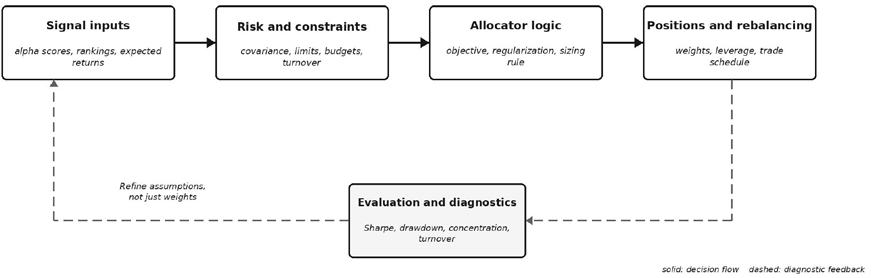
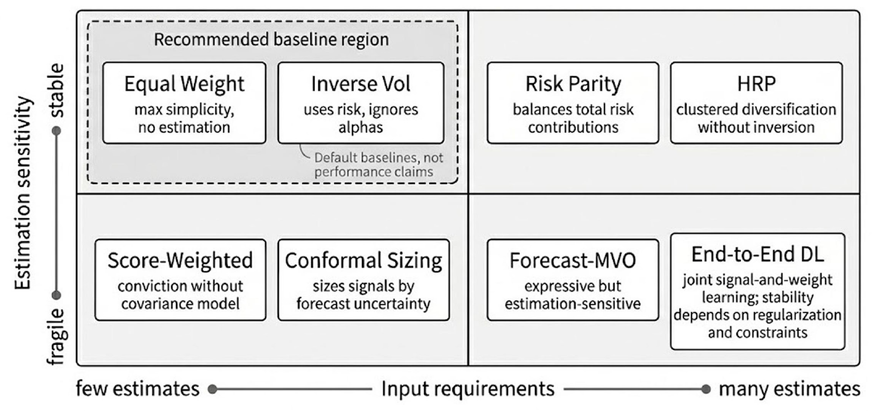
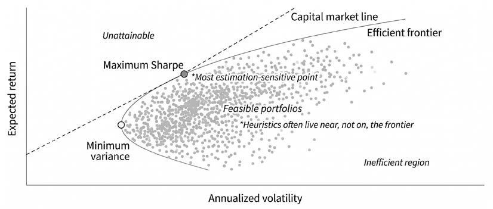
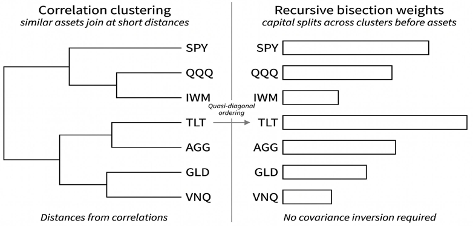
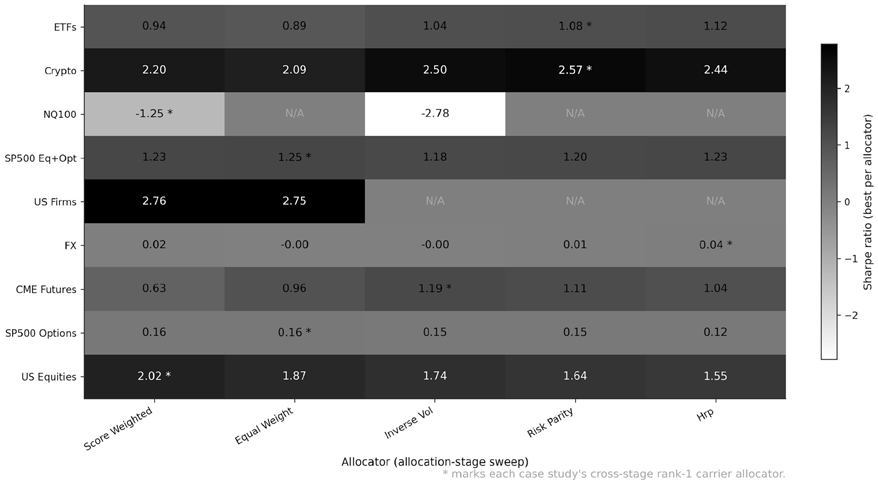
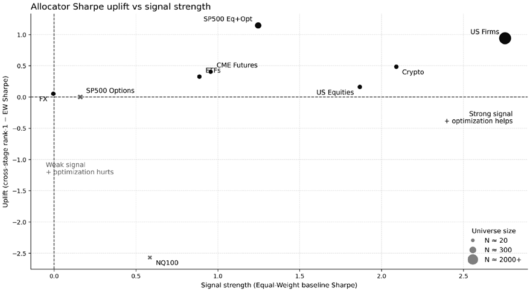
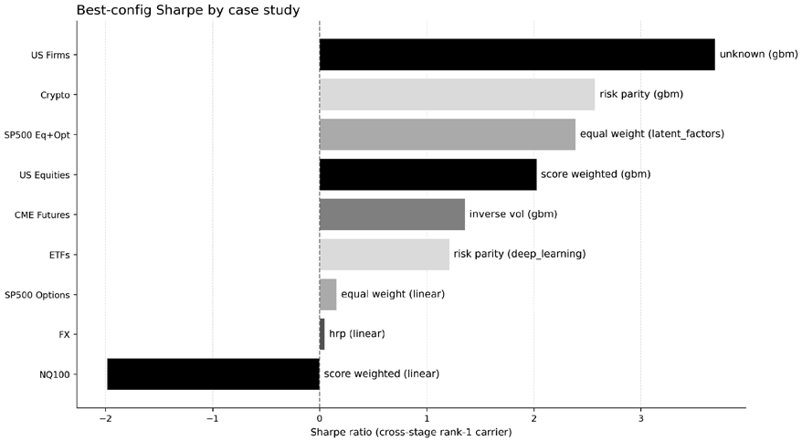
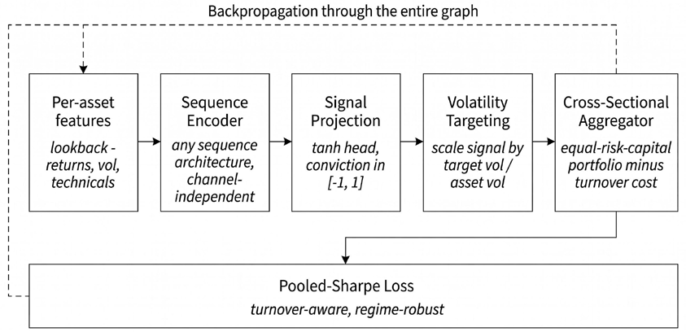
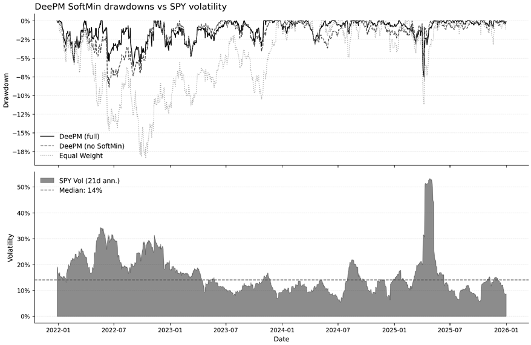

# 第17章：投资组合构建

投资组合构建把预测转化为持仓。*第11–14章*开发的预测模型产出期望收益、类别概率、排名或 alpha 分数；只有当分配器决定了给每个资产配置多少资本、集中多少风险、以什么频率再平衡，以及在持仓期间哪些约束必须始终生效之后，这些输出才真正可投资。

这一转化本身就是一个模型。它有输入、假设、超参数与失效模式。一个强劲的预测信号，可能因为朴素的仓位设定集中了风险、推高了换手率或放大了估计误差而表现不佳；反过来，一个纪律严明的分配器也能通过控制杠杆、协方差敞口与实施成本，保住微弱但分散的信号的价值。

学完本章，你将能够：

- 用输入、约束与决策变量的语言把配置问题形式化。
- 从多个维度评估分配器，而不是只依赖夏普比率。
- 实现基线启发式方法，并理解它们为何出奇地难以击败。
- 应用带稳健性修正的均值-方差优化，并诊断马科维茨诅咒。
- 构建层次风险平价组合：避开矩阵求逆，跨市场状态给出稳定的配置。
- 在统一协议下比较分配器，且不引入新的过拟合来源。
- 解释深度学习如何实现端到端的组合权重预测。

本章首先定义配置问题及其输入，然后引入一个结构化的工作流。*17.3 节*建立多维评估框架。*17.4–17.6 节*按复杂度递增的顺序介绍经典分配器：基线启发式、带稳健性修正的均值-方差优化，以及层次风险平价。*17.7 节*在统一协议下对它们进行比较。*17.8 节*转向端到端深度学习：用单一网络在组合层面的目标下把特征直接映射为持仓。

## 17.1 定义配置问题

分配器把预测、风险估计与约束组合起来，将信号转换为持仓权重。第一个输入是对**期望收益**的观点，在本书中由*第11–14章*的模型分数、资产排名或收益预测来表示。分配器很少直接使用原始模型输出：信号通常要经过标准化、缩尾、排名或跨期衰减处理，以防极端预测主导组合。排名变换往往产生更均匀的仓位规模；z 分数则允许信念强度影响仓位，却可能把风险集中到预测最极端的标的上。相对期望收益即使只有轻微失真，也会实质性地改变配置（López de Prado, 2016）。

第二个输入是对**期望风险**的刻画。即使是简单的分散化规则也需要波动率估计，而均值-方差与风险预算方法则明确依赖协方差矩阵 Σ_{𝑡}：其对角线记录单个资产的风险，非对角元素刻画持仓之间是相互放大还是相互抵消。

第三个输入是投资者对**可接受风险**的定义。波动率目标、杠杆上限、持仓限额、集中度规则、回撤容忍度与流动性要求从一开始就划定了可行域。同一个预测，对一个只做多的养老金与一个加杠杆的市场中性委托，可能意味着截然不同的组合。因此，约束是配置模型的组成部分，而不是实施阶段的事后补丁。

### 决策问题——权重、敞口与时点

分配器的输出看似简单：一个组合权重向量 𝑤_{𝑡} = (𝑤_{𝑡1}, 𝑤_{𝑡2}, …, 𝑤_{𝑡𝑁})，取自可行集 𝑊_{𝑡}，其中每个 𝑤_{𝑡𝑖} 表示 𝑡 时刻分配给资产 𝑖 的资本比例。形式上，分配器追求最大化投资者效用 𝑈：

𝑤_{𝑡} ∈ argmax_{𝑤∈𝑊_{𝑡}} 𝑈(𝑤; 𝑠_{𝑡}, 𝜃_{𝑡}, 𝑤_{𝑡−1})

但这个权重向量 𝑤_{𝑡} 内嵌了若干相互独立的决策：

- **只做多与多空对冲**。只做多约束（𝑤_{𝑖} ≥ 0）会大幅收缩可行域，往往使分配器无法充分表达相对观点。多空授权可以通过对冲消掉市场敞口、更锐利地表达横截面信号，但同时也引入杠杆、融券成本与空头端的现实约束。甚至连多空两腿的配比都很关键。French (2024) 指出，名义本金相等的美元中性通常不是多空因子组合的最佳定仓方式：在他的样本中，空头腿通常比多头腿波动更大、分散度更低，因此按波动率匹配来缩放空头侧，能同时改善绝对绩效与风险调整后绩效，并使市场敞口比标准的等名义本金构造更接近零。
- **总敞口与净敞口**。总敞口 Σ_{𝑖}|𝑤_{𝑖}| 度量所承担风险的总量，不论方向；净敞口 Σ_{𝑖}𝑤_{𝑖} 度量方向性偏倚。市场中性组合可以在瞄准零净敞口的同时，通过互相抵消的多头与空头持仓维持可观的总敞口。一旦引入杠杆、保证金要求或衍生品，这一区分就尤为重要。
- **杠杆**。只要总敞口超过 100%，组合就是加杠杆的——无论借助借贷、衍生品还是内嵌融资。杠杆可以改善微弱但分散信号的使用效率，但也会放大估计误差、回撤与实施风险。因此，仓位规模与杠杆无法分开讨论。
- **再平衡频率**。更频繁的再平衡让组合紧贴当前信号，但增加换手与交易成本；更低频的再平衡降低实施成本，却允许实际持仓漂离目标权重。不存在普适的最优频率，合适的节奏取决于信号衰减、市场摩擦、流动性以及协方差结构自身的变化速度。

### 约束是一等建模选择

约束是具有直接经济后果的建模选择：

- **持仓限额**防止单个标的过度集中。若校准得当，最大权重约束（如 𝑤_{𝑖} ≤ 𝑤_{max}）不仅防范估计误差，也防范流动性风险：一只看似诱人的小盘股，可能难以大规模进出。
- **行业与因子上限**限制对相关资产组的总敞口。没有这类上限，优化器可能把一个高度集中的宏观或风格押注包装成看似分散的选股。
- **换手率限制**把"昨天的持仓如何走到今天的目标"显式化：Σ_{𝑖}|𝑤_{𝑖}^{new} − 𝑤_{𝑖}^{old}| ≤ 𝑇。一旦换手受到约束，组合选择就变成路径依赖的：今天的最优配置不仅取决于今天的信号，还取决于继承下来的组合以及离开它的成本。
- **现金与杠杆要求**同理。为应对赎回、追加保证金或内部流动性政策，可能需要最低现金余额；反过来，杠杆上限限制了分配器放大信号的激进程度，哪怕该信号单独看起来很有吸引力。

约束的数学形式同样会改变行为：

- 5% 的**硬上限**在可行域中画出一条字面意义上的边界。
- 软性的**集中度惩罚**只是让大仓位的代价逐步上升。

当某项限制反映真实的运营、监管或合规要求时，硬约束是合适的；软惩罚更适合解读为关于分散化、换手或稳定性的偏好。

### 信号质量如何转化为组合绩效

**主动管理基本定律**（Fundamental Law of Active Management, FLAM）（Grinold and Kahn, 2000）把*第11–14章*产出的 ML 信号质量与本章实现的组合绩效联系起来：

IR ≈ IC × √BR

其中：

- IC 是信息系数（见*第7章*）。
- BR 是广度，按独立下注的数量度量。
- IR 是信息比率：每单位基准相对风险所获得的基准相对收益。

当基准是现金或被动配置时，IR 与夏普比率高度接近；当基准是主动参照组合时，二者的区别变得更加重要。

ETF 案例研究中验证集 IC 最高的线性设定，日度 IC 约为 0.054。单看这个数字似乎很低。但标的池约有 100 只 ETF、每月再平衡到 20 个持仓，**名义广度**为 𝐵 = 20 × 12 = 240，这意味着 IR ≈ 0.054 × √240 ≈ 0.84（尚未计成本）。广度弥补了单个预测的疲弱：一个小小的优势，只要在许多资产与许多时期上重复，仍足以支撑一个有吸引力的分配器。

不过，真正相关的概念是**有效广度**，而不是"资产数 × 再平衡期数"的朴素计数。相关的资产并不提供独立机会。如果这 20 个 ETF 持仓主要由大约五个共同风险因子驱动，有效广度更接近 5 × 12 = 60，对应 IR ≈ 0.054 × √60 ≈ 0.42。名义广度与有效广度之间的这一差距，正是实际绩效常常达不到朴素 FLAM 预测的主要原因之一。

在带截距的单变量横截面加权回归中，加权 Pearson IC 的平方等于回归的 𝑅²。因此，0.03 的 IC 只能解释横截面收益变异的约 0.09%：以方差解释力衡量，原始信号极其微弱。它的潜在经济价值不在于对单一标的的预测力，而在于跨资产、跨时期的反复应用：只要信号足够稳定、足够分散、交易成本足够低，投资组合构建就能把微小的预测优势聚合成可投资的策略。

因此，FLAM 应被当作一个**思维模型**和**量级校准工具**。它假设预测无偏、协方差模型正确、下注相互独立、交易摩擦可忽略；实践中这些条件没有一个严格成立。尽管如此，这个近似给出了正确的直觉：IC 翻倍的效果等同于广度翻两番，而这两者的收益都可能轻易被下注间的高相关性、糟糕的风险估计或实施成本吞噬。配置质量可以放大一个微弱的信号，也可以把它毁掉。

**实现**：`02_mean_variance_optimization` 在 30 只 ETF 的标的池上描绘有效前沿，并对比五个目标函数（最大夏普、最小波动、ERC、逆波动率、等权重），展示每个目标如何把含噪的期望收益向量与协方差矩阵映射为截然不同的配置。

## 17.2 投资组合构建工作流

投资组合构建在启用优化器之前，需要先有一份规格说明。分配器条款表记录目标、输入、约束、再平衡规则、成本处理与评估计划，防止配置沦为模型选定之后无人留痕的搜索层。结构化的工作流让这些配置选择显式、可检验。*图 17.1* 概括了它：信号进入风险与约束层，分配器将其转换为持仓，诊断结果再反馈到下一轮规格说明。

*图 17.1：投资组合构建工作流。配置位于信号生成与实施之间，诊断结果反馈回下一轮规格说明*

### 分配器条款表

在实现任何配置方法之前，应把规格写成一份紧凑的条款表，记录目标、输入、约束、交易协议与评估设计。

**目标函数**必须明确到"两位从业者根据同一描述会得到同一个优化器"的程度。均值-方差效用、最大夏普、最小方差与风险平价各自隐含不同的权衡，这些权衡不应继续隐没在 notebook 代码里。

同样的纪律也适用于**输入**：

- **期望收益**可以来自*第11–14章*开发的预测模型、历史均值，或均衡风格的先验。
- **协方差**可以用样本矩阵、收缩方法或因子模型来估计。
- 每个输入还带有**期限（horizon）选择**，这些选择对行为的影响丝毫不亚于优化例程本身。
- **约束**应连同数值与执行规则一起写入条款表：只做多限制、最大持仓规模、行业上限、换手惩罚、杠杆限额，以及硬可行约束与软目标惩罚之间的区分。

文档还应包含**再平衡协议**与**评估计划**。再平衡频率、漂移阈值与交易成本的处理方式，决定了被检验的是一个现实的实施方案，还是一个理想化的练习。

评估规则决定报告哪些指标、哪些子区间与哪些状态切片。这些选择一旦事先写下，糟糕的绩效就能被追溯到某个预测、某个协方差估计、某组约束或某个执行假设。

### 估计窗口与泄露防范

配置环节和信号生成一样容易泄露未来信息。一份在 𝑡 日用截至 𝑡+𝑘 日数据估计的协方差矩阵，就足以毁掉一个回测。三种方法可以防范泄露：

- **严格的时间先后顺序**：期望收益、协方差估计、风险预算与执行假设，都只能由组合形成时可得的信息构造。
- **匹配的估计窗口**。一个分配器若同时使用下周预测和 10 年期协方差矩阵，就是把短期的收益观点与长期的风险结构观点拼在一起。这种错配可以辩护，但应当是有意识的建模选择，而不是默认设置造成的意外。短期信号通常需要更短、更自适应的风险估计，即便这会增加估计噪声。
- **对分配器本身做样本外验证**。收缩强度、风险厌恶参数、换手惩罚与约束取值，与预测流水线中的模型选择一样，都是超参数。如果这些旋钮是靠反复查看最终测试样本来调的，那么即使预测模型保持不变，分配器也已经对着答案拟合了。

## 17.3 组合评估指标

*第16章*确立了回测核心报告：收益、波动率、夏普、回撤、换手率，以及毛绩效与净绩效。分配器比较还需要一层额外指标。当预测流与回测协议固定之后，主要问题就变成基准相对绩效、集中度、分散度与交易稳定性。

### 基准相对绩效

最重要的补充是绝对绩效与主动绩效之分。新分配器通常要对照一个基准分配器来评判，而不是对照现金。等权重、逆波动率或战略性政策组合都可以充当有依据的参照。在这一设定下，关键量是**主动收益**、**跟踪误差**（TE）与**信息比率**（IR）：

𝑟_{𝑡}^{active} = 𝑟_{𝑡}^{portfolio} − 𝑟_{𝑡}^{benchmark}

TE = √(Var(𝑟_{𝑡}^{active}))

IR = 𝐸[𝑟_{𝑡}^{active}] / TE

夏普比率依然有用，但已无法回答全部问题。一个分配器可以仅靠压低总风险来提高夏普，却仍未能跑赢一个简单基准。信息比率提出的是更切题的问题：给定手头已有的基准，新分配器赚到的主动收益是否足以证明其偏离是值得的？跟踪误差则让分配器风险的来源可见：高跟踪误差可能反映深思熟虑且回报丰厚的主动押注，也可能只是无谓的调仓与不稳定的持仓。正因如此，基准相对指标应当与集中度及交易类指标放在一起解读，而不是孤立使用。

对于有基准的组合，**主动份额**（Active Share）也常常有信息量：

Active Share = 1 − (1/2) Σ_{𝑖} |𝑤_{𝑖}^{portfolio} − 𝑤_{𝑖}^{benchmark}|

主动份额度量持仓在权重空间中与基准的差异程度。它不能取代跟踪误差，因为它忽略协方差；但两者结合，可以区分"真正不同"的组合与"只在表面活跃"的组合。

### 集中度与分散化

分配器之间的差异还体现在如何把资本与风险分布到可投标的上。**赫芬达尔—赫希曼指数**（HHI）：

HHI = Σ_{𝑖=1}^{𝑁} 𝑤_{𝑖}^{2}

是**资本集中度**的紧凑概括。它的倒数常被解读为**有效下注数**，直观地给出组合真正持有的"有意义的持仓"数量。两个分配器可以持有相同数量的标的，在这一指标上却大相径庭：一个把风险铺得很开，另一个把资本集中在少数主导仓位上。

资本集中度只是故事的一半。**风险贡献**问的是每个持仓对组合总波动率的贡献有多大：

𝐶_{𝑖} = 𝑤_{𝑖} · (Σ𝑤)_{𝑖} / 𝜎_{𝑝}

对那些以"均衡"或"分散"为卖点的分配器，这个量尤其重要。等资本权重不等于等风险贡献；一旦存在相关性，逆波动率权重也不等于等组合风险贡献。一个在资本空间看起来分散的组合，在风险空间仍可能危险地集中。

### 稳定性与实施指标

分配器比较还需要把组合设计与实施联系起来的指标。*第16章*把**换手率**作为交易成本诊断引入；在这里它多了一层含义。高换手可能说明分配器不稳定——对预测或协方差估计的微小变化反应过激。即便在细致建模成本之前，这种不稳定就值得警惕，因为它暗示组合拟合的可能是噪声而非持久结构。**已实现总敞口与杠杆**的稳定性起类似作用。一个平均杠杆目标温和的策略，若总敞口随市场环境剧烈摆动，仍然可能很脆弱。监控杠杆、行业权重或因子敞口的时间路径，往往能暴露单一汇总统计量掩盖的行为。**分散化**有上限：当资产共享同一风险驱动因素时。在风格化的情形下，设 𝑛 个资产具有相同的单资产夏普比率 𝑠、相同波动率与恒定的两两相关性 𝜌，等权重组合的夏普为：

𝑠_{𝑛} = 𝑠 · √(𝑛 / (1 + (𝑛 − 1)𝜌))

随 𝑛 增大，它收敛到 𝑠/√𝜌。这个计算不是交易规则，而是一个诊断：当相关性很高时，从同一机会集里继续加资产几乎不贡献独立风险。分配器要么去找相关性更低的下注，要么降低在共同因子上的集中度，要么接受分散化救不了这个策略。

*第16章*的**状态切片**在这里依然重要，但只作为次要视角。上述分配器专属指标应先在整体上确立；如果分配器整体可接受，可以复用*第16章*的状态框架，追问集中度、杠杆或基准相对亏损是否在压力时期恶化。

### 通过组合评估风险模型

协方差估计驱动着许多分配器，因此应当用组合结果来评判它们，而不是只看抽象的矩阵拟合优度。一个实用的检验是：用互相竞争的协方差估计构造可比的最小方差或风险预算组合，再比较已实现的样本外风险。如果一个协方差模型对配置确实更好，它应当在相同目标敞口下带来更低的已实现方差或更稳定的风险贡献。

基于组合的准则可能比一般性的矩阵范数更有用，因为**分配器从不直接交易协方差矩阵**——它交易的是由该矩阵推出的组合。*第19章*会在尾部风险与压力约束显式化时回到这个问题；原则在此处同样成立：分配器的输入应当由它生成的组合来评判。

**实现**：`01_portfolio_metrics` 在 ETF 案例研究的配置回测上运行完整的 `ml4t.diagnostic` 评估套件，回测在运行时通过 `resolve_best_backtest_runs(...)` 解析，使指标始终反映验证期内夏普比率最高的分配器。策略序列对照 SPY 计算 alpha、beta、跟踪误差、信息比率、上行/下行捕获、回撤、VaR/CVaR、滚动指标与压力期对比。

## 17.4 定义基线分配器

在动用复杂的优化之前，先看看简单的配置规则能走多远。等权重、逆波动率与分数加权所需的估计极少、对输入错误稳健，并且经常在样本外跑赢复杂方法。这些启发式方法是严格的基线：任何候选分配器都必须先打败它们，才有资格谈复杂度。

*图 17.2* 把上述方法画成信息使用量与估计敏感性之间的权衡：依赖输入较少的方法通常更稳健，利用更丰富信息的方法则以更高的噪声为代价换取表达力。风险平价与层次风险平价居于中间：两者都消费完整的协方差矩阵，但都施加结构约束来抑制对估计值的敏感性。

*图 17.2：配置方法以估计敏感性换取信息使用量*

**等权重——零模型**

等权重组合对 𝑁 个资产赋予相同的权重：

𝑤_{𝑖} = 1/𝑁

这个看似天真的方法有惊人的优点。它不需要估计期望收益或协方差，消除了优化误差的首要来源；它在可用资产间保持最大分散。经验上，等权重组合出了名地难以在样本外击败，因为**估计误差往往压倒优化带来的理论收益**（DeMiguel, Garlappi, and Uppal, 2009）。

优化是用分散去换取基于估计输入的集中。当这些估计含有噪声时（它们总是如此），集中所增加的风险可能超过"最优"倾斜所增加的收益。在一个没有任何资产提供明显免费午餐的竞争市场中，等权重的"不可知论"恰恰是智慧。

### 逆波动率加权

逆波动率加权按每个资产事前波动率估计的倒数缩放仓位：

𝑤_{𝑖} = (1/𝜎_{𝑖}) / Σ_{𝑗=1}^{𝑁} (1/𝜎_{𝑗})

其中 𝜎_{𝑖} 是资产 𝑖 的波动率估计。简单实现用近期已实现收益计算 𝜎_{𝑖}；更一般地，它可以是任何前瞻估计，例如指数加权估计或 GARCH 风格的条件波动率预测。波动大的资产获得更小的权重，因此组合在各资产间拉平了单资产波动率敞口 𝑤_{𝑖}𝜎_{𝑖}。这一方法介于等权重与完全优化之间：它使用波动率估计，但忽略期望收益，且在朴素形式下忽略相关性。

**注意它与风险平价的区别**：逆波动率拉平的是单资产波动率敞口，而不是对组合总风险的边际贡献。当资产间相关性不同时，某些持仓对组合波动率的贡献仍可能不成比例。它的吸引力在于估计可靠性：波动率的持久性足够强，近期或基于模型的波动率估计往往含有有用信息，而短窗口的期望收益估计通常被噪声主导。

### 分数加权组合

当*第11–14章*的预测模型产出 alpha 分数或收益预测 𝑠_{𝑖} 时，一个自然的配置是按比例加权：

𝑤_{𝑖} = 𝑠_{𝑖} / Σ_{𝑗=1}^{𝑁} |𝑠_{𝑗}|

其中 𝑠_{𝑖} 是资产 𝑖 的分数。正分数对应多头，负分数对应空头。这个公式归一化了总敞口，但没有归一化净敞口：除非分数按构造之和为零，组合会带有方向性偏倚。要构建美元中性组合，应分别归一化多头腿与空头腿。

当预测模型已经把风险考虑在内、且相关性结构较为均匀时，分数加权效果最好；当极端分数把敞口集中到相关资产上时，它就会失灵。把分数加权与持仓限额或波动率目标结合，可以缓解这一弱点。

### 共形仓位规模

分数加权组合用点预测的*幅值*来定仓。共形仓位规模改用该预测的*不确定性*。共形预测（*第11章*）把任意预测器包进一个校准步骤，产生预测区间 [ŷ_{𝑖} − 𝑞_{𝑖}, ŷ_{𝑖} + 𝑞_{𝑖}]，其宽度 Δ_{𝑖} = 2𝑞_{𝑖} 经过校准，使已实现收益以选定的覆盖率（在我们的实现中为 80%）落入区间。区间越窄，表示模型在该时点对该资产越有信心。逆宽度权重把这种信心直接转成仓位规模：

𝑤_{𝑖,𝑡} = (1/Δ_{𝑖,𝑡}) / Σ_{𝑗=1}^{𝐾} (1/Δ_{𝑗,𝑡})

要让逆宽度权重不同于等权重，宽度 Δ_{𝑖} 必须在资产之间存在差异。池化 split-conformal 校准每折只产生单一分位数，会把该规则退化为等权重。因此 `07_conformal_position_sizing` notebook 采用严格 walk-forward 顺序下的**逐标的 Mondrian split-conformal 校准**：折 𝑘 的宽度只使用在折 𝑘 开始之前结束的验证折；时间上最早的折则退回到对该标的池化所有*其他*折的残差。在留出窗口上，每个标的的宽度取全部验证历史上 |𝑦_{true} − 𝑦_{score}| 的 (1 − 𝛼) 分位数，并对末尾 ℎ 个时间戳做隔离（embargo）（ℎ 是以数据步为单位的远期收益期限），使校准无法窥探留出边界之外的信息。

*表 17.1* 在九个引擎案例研究中的七个上，将共形分配器与跨阶段验证基线（同一标签上夏普最高的非共形配置，汇集信号、配置与风险覆盖层各阶段）进行比较。两个案例研究因结构性原因被排除。S&P 500 期权案例被排除，因为其 cohort 引擎在重叠的 30 天期权持仓上实现盈亏，逐预测的 Mondrian 残差定义无法推广到那里。NASDAQ-100 微观结构被排除，因为其入选配置是信号阶段的 slot 策略，slot 机制本身就是仓位规模规则，不存在可供共形逆宽度覆盖层替换的横截面配置步骤；出于同样的结构性原因，其配置阶段在*第20章*中被记为不适用。验证集上，共形定仓在全部七个案例中落后于基线，差距从可忽略到约 1.2 个夏普不等——因为基线是在样本内按最大化挑选出来的。留出集上，在六个存在非共形对照（同一预测集）的案例中，共形定仓在四个上改善了比较结果，但只有一处变化是实质性的：它显著抬升了 `sp500_equity_option_analytics` 的夏普（−0.73 → +0.08），而在 `etfs`（+1.00 → +1.02）、`crypto_perps_funding`（−0.13 → −0.13）与 `us_firm_characteristics`（+1.77 → +1.79）上基本持平。它落后 `cme_futures` 与 `us_equities_panel` 0.24 至 0.41 个夏普比率。

| 案例研究 | 标签 | 验证集 基线 → 共形 | 留出集 基线 → 共形 | Δ 留出集 |
| --- | --- | --- | --- | --- |
| etfs | fwd_ret_21d | +1.36 → +1.04 | +1.00 → +1.02 | +0.02 |
| crypto_perps_funding | fwd_ret_24h | +2.57 → +2.41 | −0.13 → −0.13 | +0.00 |
| sp500_equity_option_analytics | fwd_ret_risk_adj_5d | +2.39 → +1.23 | −0.73 → +0.08 | +0.81 |
| us_firm_characteristics | fwd_ret_1m_win | +2.75 → +2.73 | +1.77 → +1.79 | +0.02 |
| cme_futures | fwd_ret_5d | +1.36 → +1.07 | +1.11 → +0.70 | −0.41 |
| us_equities_panel | fwd_ret_5d | +2.03 → +1.56 | −0.49 → −0.73 | −0.24 |
| fx_pairs | fwd_ret_21d | +0.05 → −0.11 | +0.19 → - | n/a |

*表 17.1：共形定仓（上文定义的由不确定性驱动的逆宽度覆盖层）与跨阶段基线在七个引擎案例研究上的对比。夏普比率从各案例研究的 registry.db 查询。fx_pairs 的留出集没有共形对照，因为只有基线 HRP 策略被推进到留出集*

`fx_pairs` 一行展示了平坦信号的情形。跨阶段基线（在线性 ridge 预测上做 HRP top-5）在验证集上勉强高于零（+0.05），同样稀薄信号上的共形定仓更差（−0.11）：预测置信度没有真实的离散程度可供利用，逆宽度权重只会添噪。只有该基线策略被推进到留出集，在那里获得 +0.19，但与同样货币的等权重组合在统计上仍无法区分。共形定仓不内嵌任何效果方向（它放大底层模型报告出的每标的置信度），因此对一个本就没有可辨认优势的信号，它既救不了，也不会扭曲。

这一模式与共形分配器的机制一致：由校准后的不确定性驱动的定仓规则，用一部分样本内夏普换取定仓与模型置信度之间更紧密的对齐。它不能替代正确调校的风险覆盖层，也救不了一个预测内容在样本外衰减的选股信号。

### 风险平价——等风险贡献

**风险平价通过配置权重使每个资产对组合风险的贡献相等**（Maillard, Roncalli, and Teiletche, 2008；通俗入门见 Hurst, 2010）。传统配置把风险集中在波动最大的资产上：一个 50/50 的股债组合，其风险通常大部分来自股票而非债券。资产 𝑖 的风险贡献为：

𝐶_{𝑖} = 𝑤_{𝑖} · (Σ𝑤)_{𝑖} / 𝜎_{𝑝}

风险平价寻求使各资产风险贡献（ERC）相等的权重。风险平价位于最小方差与等权重之间，组合波动率满足 𝜎_{MV} ≤ 𝜎_{ERC} ≤ 𝜎_{1/𝑁}。

风险平价的支持者把 ERC 定位为一种务实折中：比最小方差的风险集中度更低，比等权重的风险更均衡，而且在分散度-换手率的权衡上常常具有竞争力。

风险平价需要杠杆才能获得有竞争力的收益；加杠杆的风险平价能否胜出，取决于融资成本与相关性的稳定性。

### 波动率目标法

波动率目标是一个*覆盖层*（overlay），可以包住任何基础分配器，而不是一种独立方法。先用任意方法构造基础组合，再缩放其敞口以达到目标波动率：

𝑤^{scaled} = (𝜎^{target} / 𝜎^{portfolio}) · 𝑤^{base}

如果基础组合的年化波动率是 15%、目标是 10%，则所有仓位乘以 0.67。已实现波动率超过目标时降低敞口，波动率回落时提高敞口。波动率目标让风险画像随时间更稳定，在高波动期自然降低敞口，并优先显式控制组合风险——当然以估计的准确性为前提。主要的设计选择在于如何估计波动率：滚动窗口简单但适应慢；EWMA 或 GARCH 模型响应更快，但引入额外参数。

上述配置规则都刻意简单。等权重既忽略预测也忽略协方差；分数加权使用预测，却没有定义显式的增长或效用目标；波动率缩放与风险平价纳入了风险，但基本回避期望收益估计。这些启发式方法之所以常常稳健，恰恰因为它们对数据的要求很少。凯利准则补上了缺失的优化原则：当一个信号意味着正的优势时，应该投入多少资本？

### 凯利准则——从信号质量得出的最优仓位

凯利准则从一个重复下注问题出发。假设每轮押上当前财富的固定比例 𝑓。凯利的关键洞见是：相关的目标不是一次下注后的期望财富，而是多次重复下注下财富的期望增长率。由于财富按复利滚动，这一目标就是对数财富的期望变化。对一个赢了赚 𝑏、输了赔掉 𝑓 的二元下注（𝑏 是赔率，𝑝 是获胜概率），期望对数增长率为：

𝑔(𝑓) = 𝑝·log(1 + 𝑏𝑓) + (1 − 𝑝)·log(1 − 𝑓)

最大化该表达式，得到熟悉的**"优势对赔率"的凯利分数**：

𝑓^{*} = (𝑝𝑏 − (1 − 𝑝)) / 𝑏

分子是下注的期望优势，分母把这个优势换算成应押上的财富比例。下注太少，会把长期增长留在桌上；下注太多，则会把大幅亏损的概率抬高到降低期望对数增长的地步——即使下注本身具有正的期望价值。如果优势为负且不允许做空该下注，受约束的凯利仓位为零。

**同样的逻辑可以扩展到金融收益**。对单一风险资产，设超额收益为 𝑟、期望超额收益为 𝜇、方差为 𝜎²，期望对数增长目标为：

𝔼[log(1 + 𝑓𝑟)]

对小收益做二阶近似：

𝔼[log(1 + 𝑓𝑟)] ≈ 𝑓𝜇 − (1/2)𝑓^{2}𝜎^{2}

于是增长最大化的敞口为：

𝑓^{*} = 𝜇/𝜎^{2}

这个表达式之所以有用，是因为它把信号质量直接与仓位规模挂钩。期望超额收益越大，最优敞口越大；方差越大，最优敞口越小。因此，该准则不只是问信号是否为正，而是问优势相对于获取该优势的风险有多大。

在多资产情形下，同样的二次近似给出：

𝔼[log(1 + 𝑤^{⊤}𝑟)] ≈ 𝑤^{⊤}𝜇 − (1/2)𝑤^{⊤}Σ𝑤

其中 𝑤 是风险资产权重向量，𝜇 是期望超额收益向量，Σ 是协方差矩阵。无约束的凯利配置为：

𝑤^{*} = Σ^{−1}𝜇

同一结果将在下一节的均值-方差优化中再次出现。在标准近似下，凯利组合与切点组合指向同一方向：二者都奖励更高的期望超额收益，都惩罚协方差风险。区别在于，归一化的切点组合通常固定了风险敞口的规模，而凯利解还确定了由估计机会集隐含的杠杆。从这个意义上说，凯利是一个一体化的配置准则，而不只是一条预测规则。

当收益分布已知时（许多博弈确是如此），凯利为定仓问题提供了有原则的答案；但在交易应用中，输入是估计出来的。由于 full Kelly 随估计优势而激进放大，对 𝜇 的哪怕适度高估都可能造成过高杠杆和严重回撤。因此，该准则对估计误差高度敏感——正是这些估计误差使基于预测的（经典）均值-方差优化不稳定。

实务中通常把 full Kelly 当作上界，而不是字面上的操作规则。**分数凯利**（Fractional Kelly）把理论配置乘以一个常数（如二分之一或四分之一），以降低杠杆、回撤与对估计误差的敏感性。这在假设模型下牺牲了一部分期望对数增长，但当模型误设或估计优势不确定时，却能提升稳健性。

这一联系使凯利成为从启发式定仓规则通往正式组合优化的桥梁。使凯利配置有原则的同一批矩估计，也让它变得脆弱：期望收益与协方差必须估计，而这些输入的误差在转换为组合权重时会被放大。下一节把这一观察纳入经典的马科维茨框架，并说明正则化为何在实践中不可或缺。**实现**：

- `04_kelly_criterion` 用 SymPy 推导二元、连续与多资产的凯利分数，并在真实 ETF 收益上展示 full 与分数凯利的权衡，包括原始凯利在收缩之前的杠杆（通常 30 倍以上）。
- `05_factor_allocation_evidence` 使用 Fama-French 与 AQR Century-of-Premia 数据记录跨因子来源分散化的实证证据：Harvey-Liu-Zhu 的 𝑡 值阈值、跨资产类别的价值-动量负相关、TSMOM 危机 alpha 以及危机时期的因子表现。
- `07_conformal_position_sizing` 在 ETF 与 CME 期货案例研究的 GBM 预测上实现 Mondrian split-conformal 校准，并计算本节比较所用的逆宽度权重。
- `09_allocator_comparison` 提供本章其他部分使用的逆波动率、等权重与分数加权参考实现。
## 17.5 均值-方差优化与马科维茨诅咒

**均值-方差优化**（**MVO**）仍是组合构建的标准框架。Markowitz (1952) 证明，理性投资者应当选择**有效前沿**上的组合：在每个风险水平上提供最高期望收益的配置集合。该框架很优雅，但朴素的实现常常产生不稳定、高度集中的组合，样本外表现糟糕。

标准形式为：

max 𝜇^{⊤}𝑤 − (𝜆/2) 𝑤^{⊤}Σ𝑤

约束为 𝟏^{⊤}𝑤 = 1，其中 𝜇 是期望收益，Σ 是协方差矩阵，𝑤 是组合权重，𝜆 是风险厌恶系数。𝜆 越小，解越偏向追逐收益；𝜆 越大，风险控制的权重越高，解越靠近前沿的最小方差端。等价形式还包括最大化夏普比率，或在目标收益下最小化方差，但它们依赖的都是同一批估计矩。

*图 17.3* 把最小方差组合与最大夏普组合放在同一条前沿上。该图说明了为什么**切点组合**尤其容易受估计误差影响：切点由资本配置线的斜率决定，因此期望收益或协方差的微小估计变化就可能实质性地移动最优点，造成组合权重的大幅变动。最小方差区域附近的组合通常不那么脆弱，因为它们对期望收益的精确估计依赖较少。

*图 17.3：有效前沿与配置区域*

这个二次目标在**常绝对风险厌恶**（CARA）效用与正态分布收益下是精确的。CARA 假设投资者对给定金额风险的厌恶不随财富变化。这一假设之所以重要，是因为在正态收益下它意味着期望效用只依赖均值与方差，从而直接导出 MVO 目标。更一般地，同一表达式也可解读为适度期限上期望效用的二阶近似。在带超额收益、对数效用取二阶近似的无约束风险资产形式中，𝜆 复现 full Kelly 的规模；更大的 𝜆 值对应分数凯利式的缩放。

核心的实施困难出现在无约束解中：

𝑤^{*} = (1/𝜆) Σ^{−1}𝜇

𝜇 与 Σ 都必须估计，而两者都含噪声。MVO 通过协方差的逆矩阵把这些含噪输入组合在一起，小小的误差可能被放大成巨大的配置变化。这种敏感性正是经典框架在实践中的核心弱点。

### 为什么 MVO 样本外失效

Antonov, Lipton, and López de Prado (2024) 认为，MVO 样本外表现不佳源于三个相互关联的原因：

1. **期望收益难以估计**，优化器输入带有大量噪声。
2. **协方差求逆变得不稳定**——当样本量相对标的池规模不够大时。
3. 优化器倾向于**集中在 alpha 恰好被高估的资产上**，形成误差最大化效应（López de Prado, 2016）。

实践中的症状很熟悉：样本内夏普强劲，样本外稳定性差。`02_mean_variance_optimization` notebook 在 ETF 标的池上复现了这一差距。一个有用的细节是：配置质量更多取决于 alpha 的排序，而非 alpha 的校准。如果预测的尺度整体失准，组合构成几乎不变，杠杆会吸收大部分误差；真正造成损害的是排序错误，而不是纯粹的尺度误差。

### 用协方差收缩增强 MVO 的稳健性

实践中，问题不是 MVO 在理论上是否正确，而是应该以多大力度对它正则化。脆弱性的一个来源是协方差估计。**Ledoit-Wolf 收缩**（Ledoit and Wolf, 2003）用样本估计与一个结构化目标的加权平均替换样本协方差矩阵：

Σ̂ = (1 − 𝛼)𝑆 + 𝛼𝐹

其中 𝑆 是样本协方差，𝐹 是结构化目标，𝛼 是数据驱动的收缩强度。

这用少量偏差换取估计方差与数值不稳定性的大幅下降。另一条相关思路用**因子结构**建模协方差：

Σ = 𝐵Σ_{𝐹}𝐵^{⊤} + Σ_{𝜀}

通过把共同因子风险与特质残差风险分开来降维。收缩与因子结构最好视为互补工具，而非相互竞争的替代品。

**约束同样扮演重要角色**。持仓上限限制集中度；只做多约束压制那些仅由含噪收益估计支撑的脆弱空头；换手惩罚降低把预测误差转化为交易成本的倾向。从这个意义上说，约束不是次要的实施细节，而是估计器本身的组成部分：它们正则化从含噪输入到组合权重的映射。

正如 Paleologo (2025) 所论，许多常见约束都可以从稳健性的角度解读。二次惩罚反映对 alpha 幅度的不确定性；稀疏配置反映对简约性的偏好；保守的协方差处理相当于更高的有效风险厌恶；换手惩罚反映对费后净 alpha 的不确定性。这样理解，MVO 就不是关于"精确最优"的宣言，而是一套纪律化的程序：在显式护栏之下，把不确定的信念转换为可交易的权重。

因此，当可投标的池规模适中、协方差估计可以处理、信号质量足以让收益倾斜在实施成本后仍然存活时，MVO 最站得住脚。在这些条件下，收缩、现实的约束与换手控制，往往比优化器的具体形式更重要。

### 作为稳健优化的收缩对冲

同样的稳健性逻辑也适用于用优化器消除风险（而非向期望收益配置）的场合。**对冲比率就是一个配置决策**：它决定向既有组合加入多少对冲工具，以削减某一不想要的敞口。如果敞口估计含噪，完全对冲可能与无约束的最大夏普组合一样脆弱。**贝塔对冲提供了最简单的例子**。贝塔已知时，方差最小化的对冲恰好抵消组合对对冲工具的敞口。但实践中，贝塔是从有限数据估计的。Paleologo (2025, *第12章*) 证明，当贝塔估计含噪时，完全贝塔中性对冲可能增大而非降低已实现方差：对冲对估计误差过度反应，把噪声当作真实敞口去交易。

**补救办法是收缩**。当贝塔的估计误差相对于组合总敞口较大时，应按比例缩小对冲比率。在 Paleologo 的表述中，收缩因子随贝塔估计误差的组合加权协方差增大而下降，随估计的总贝塔的平方增大而上升。直觉与稳健 MVO 相同：信噪比弱时，优化器应当少动。

**这一点对集中的组合尤其重要**：在集中持仓上，贝塔估计误差无法被众多持仓分散掉。集中的组合通常应更保守地对冲；而高度分散的组合，若总敞口估计得更精确，可以更接近完全贝塔中性。因此，实操规则不是"永远对冲到零"，而是"按敞口估计的可靠程度成比例地对冲"。

这样看，对冲与组合优化并非两个话题。它正是同一问题的防御版本：把不确定的估计转换为可交易权重，而不让估计误差主导配置。下一小节把这个想法从单一对冲工具扩展到因子模仿组合。

### 因子模仿组合

**因子模仿组合**（**FMP**）以最小的残差风险隔离单一因子敞口。Grinold and Kahn (2000) 给出了主动管理视角的表述，Paleologo (2025) 则在 *第9章* 提供了因子模型推导。给定因子荷载 𝑏 与特质协方差 Ω_{𝜀}，最小残差风险的因子模仿组合为：

𝑤_{FMP} = Ω_{𝜀}^{−1}𝑏 / (𝑏^{⊤}Ω_{𝜀}^{−1}𝑏)

FMP 的价值在于把特征层面的假设转换成可交易组合，为因子的增量价值提供直接的组合层面检验。实践中，因子通过正交化 FMP 的样本外边际夏普来评估，这让因子准入与本章其他部分使用的模型核算纪律保持一致。**实现**：

- `02_mean_variance_optimization` 在 30 只 ETF 标的池上描绘有效前沿，并复现马科维茨诅咒——无约束最大夏普解坍缩到两个资产（XLK 78.9%/GLD 21.1%），无约束最小方差解坍缩到一个资产（SHY 约 98%）。
- `03_robust_optimization` 借助 Riskfolio-Lib，在 11 只 ETF 的多资产标的池上、Ledoit-Wolf 协方差收缩之下并排运行六个分配器（最大夏普、最小方差、风险平价、HRP、最小 CDaR、等权重），并用风险贡献诊断量化等资本与等风险之间的差距。

## 17.6 用层次风险平价优化稳定性

**层次风险平价**（**HRP**）用基于层次结构的方法处理同一个由协方差驱动的配置问题——正是这个问题让朴素 MVO 脆弱。HRP 不估计期望收益、也不对完整协方差矩阵求逆，而是用层次聚类按经验相关结构给资产排序，再通过递归的逆方差分割配置资本（López de Prado, 2016）。HRP 避开了协方差矩阵求逆，倾向于产生更不集中、更稳定的组合。

其直觉是：**并非每个资产都要与其他所有资产争夺组合权重**。在 MVO 中，期望收益或协方差的微小变化可能改变整个配置。HRP 则在标的池上施加嵌套结构：在所选距离度量下相似的资产先被归为一组，然后再分配资本。这并不能消除估计误差，但把误差的大部分影响局部化，降低了微小协方差扰动引发全局重新配置的概率。

设想一个同时包含科技股与公用事业股的组合。MVO 同时比较所有标的；HRP 用相关结构把相似的标的放在一起，再在所得分支之间与分支之内配置。估计苹果与微软之间关系时的误差，主要影响科技分支及其估计的簇方差，而不太可能经由全局协方差逆传导到整个组合。

层次结构还遵循一条简单规则：先在不相似的组之间分散，再在相似的组内分散。这样产生的组合捕捉的是真实分散，而不是 MVO 常常制造出的虚假分散。

### 从相关系数到权重——HRP 算法

HRP 有三个计算步骤。第一步，**把相关系数转换为距离**，常用：

𝑑_{𝑖𝑗} = √((1 − 𝜌_{𝑖𝑗})/2)

第二步，对该距离矩阵**做层次聚类**，并沿树状图遍历得到资产排序。这一"准对角化"把相似资产排在一起，使协方差矩阵更接近块状。

*图 17.4：从聚类到递归配置的 HRP 工作流。层次结构通过先分组相似资产再赋权，稳定了分散化*

第三步，用递归二分配置资本。从整个标的池出发，反复把每个簇拆成两个子簇，并按与各分支方差成反比的比例在两者之间分配资本，直到落到单个资产。低方差的簇获得更大的份额，同样的逻辑随后在该簇内部继续应用。若 𝐿 与 𝑅 表示两个子簇，分割为：

𝑤_{𝐿} = 𝑉_{𝑅}/(𝑉_{𝐿} + 𝑉_{𝑅}),  𝑤_{𝑅} = 𝑉_{𝐿}/(𝑉_{𝐿} + 𝑉_{𝑅})

其中 𝑉_{𝐿} 与 𝑉_{𝑅} 是簇方差。关键不只在代数本身，更在于它在层次结构内的局部应用方式：分散化分阶段施加，先在粗组之间、再在细组之内进行，估计误差因此更不容易传导至整个组合。

### 为什么 HRP 可能比朴素 MVO 更稳定

Marti et al. (2021) 综述的调研证据以及后续的 HRP 文献，指出了四个实践中的稳定性来源。第一，HRP 完全避开矩阵求逆，消除了拖垮 MVO 的数值不稳定性。第二，把相似资产分组提供了层次化正则化：簇内的估计误差部分相互抵消，单个资产的误估对最终组合的影响更小。第三，层次结构本身相对稳定，使各再平衡日期之间的权重分配更一致。第四，由于忽略期望收益，HRP 消除了误差最大化，代价是无法表达方向性观点。

### 局限与扩展

HRP 不是万能解。它的基本形式不使用收益预测，信号中任何真实的预测内容都被有意忽略。当预测误差占主导时，这常是可接受的取舍；但当模型携带稳定的方向性信息时，这就成了实实在在的机会成本。朴素 HRP 按构造只做多，因为递归二分在每一层都分配正的资本份额。研究多空策略的读者应把 HRP 当作稳定性模板，而非即插即用的分配器。一种变通办法是对多头与空头候选池分别做层次配置再合并；不过嵌套聚类优化（nested clustered optimization）提供了在同一总体框架内表达观点的更干净方式。

**该方法对聚类配方也敏感**。Raffinot (2016) 用基于自助法的模型置信集比较了若干层次聚类变体，发现这一类方法整体样本外表现强劲，但不存在单一普遍占优的规格。这一发现比一个单独的排名更有用，因为它指出了方法在哪里稳健、哪些设计选择仍然要紧。标准 HRP 还把层次结构当作一系列时点聚类，而不是一个对换手率有显式控制的动态结构，因此簇成员的变化可能制造另一种不稳定。

**嵌套聚类优化**（**NCO**）把同样的聚类直觉推向另一个方向。HRP 用层次结构回避全局优化、以递归风险分割配置资本；NCO 则用聚类分解优化问题：先在簇内优化，再对得到的簇组合之间优化。这保留了表达期望收益观点、约束与替代目标的能力，同时降低了协方差驱动优化问题的维度与不稳定性。因此，NCO 更接近"聚类化、正则化的 MVO"，而不是朴素 HRP。

**代价是复杂度**。HRP 透明且难以过拟合，因为它忽略期望收益、避免矩阵求逆。NCO 更灵活，但重新引入了优化器假设；如果内外层优化器未受到仔细的约束或验证，仍可能过拟合含噪的期望收益估计。

一条相关的研究线是 **Schur 补配置**（Schur Complementary Allocation）（Cotton, 2024），它用 Schur 补调整保留选定的块间协方差信息，把层次配置与最小方差组合联系起来。这把"HRP 还是最小方差"的选择重构为一个连续谱，而非二选一：实践者可以根据估计的可靠程度，决定纳入多少协方差信息。

### ETF walk-forward 结果

在 GBM 选出的同一 ETF 标的池上运行四个分配器（每次月度再平衡取 top-5、252 天协方差窗口、2010–2023），得到一个虽窄但一致偏向协方差感知方法的排序。Ledoit-Wolf 收缩最小方差以 0.8437 的已实现夏普居首，HRP 以 0.8293 紧随其后，逆波动率为 0.8074，等权重以 0.7763 垫底。差距为 0.067，且四个分配器的最大回撤同为 -28%，因为 GBM 排名的 top-5 选择主导了整体路径。横截面足够窄，分配器的差异空间有限：每次再平衡只有五个名字，相关结构难以充分表达；标的池很小时，等权重已接近逆方差解。月度再平衡也限制了层次结构随状态变化重新聚类的速度，而 GBM 选择把资本集中在信号本就高排名的名字上，分配器的差异于是归结为如何为一个已被过滤的集合赋权。尽管如此，协方差感知方法仍榨取出一丝优势：Min Variance (LW) 使用的重归一化只做多投影把收缩信号保留在已实现权重中，而 HRP 的递归二分在不用矩阵求逆的情况下捕捉了大部分相同的结构。Marti et al. (2021) 记录了层次与非层次方法之间的样本外差距通常多么微薄，与五资产标的池上 0.067 的夏普差距一致。HRP 的结构性优势（层次化正则化、无矩阵求逆、不依赖收益预测）要在比这里检验的更大、更异质的标的池上才最能发挥。

| 方法 | 年化收益 | 夏普 | 最大回撤 | Calmar |
| --- | --- | --- | --- | --- |
| 最小方差（LW） | 11.83% | 0.8437 | -28% | 0.4215 |
| HRP | 11.41% | 0.8293 | -28% | 0.4063 |
| 逆波动率 | 10.92% | 0.8074 | -28% | 0.3893 |
| 等权重 | 10.38% | 0.7763 | -28% | 0.3698 |

*表 17.2：GBM 选出的 top-5 ETF 标的池上的 walk-forward 回测（2010–2023）*

**实现**：`06_hierarchical_risk_parity` 展示端到端的 HRP 流水线（聚类、准对角化与递归二分），包括树状图、准对角协方差热力图与权重演变时间序列。walk-forward 回测在运行时从 ETF 案例研究注册表中解析选定的 GBM 预测集，并对该选择应用 HRP、逆波动率、最小方差与等权重定仓。一份 `ml4t-diagnostic` tear sheet 为 HRP 分配器打包累计收益、回撤、滚动夏普比率、月度热力图与收益分布面板。

接下来我们在*第13章*材料的基础上，转向用深度学习做端到端的组合学习。

## 17.7 比较分配器绩效

要公平比较迄今介绍的配置方法（启发式、稳健 MVO 与层次方法），需要完全相同的输入、完全相同的回测协议，并仔细核算每种方法消耗的自由度，同时防范"挑选分配器"（allocator shopping）带来的微妙过拟合。

### 实验设计

**受控的分配器比较除配置方法外保持一切不变**。所有分配器应收到相同的期望收益预测；这里的公共输入是一个基于 ridge 的横截面 ETF 模型，这样绩效差异就可以归因于定仓与分散化，而不是预测本身的变化。同一原则适用于回测协议：再平衡频率、交易成本假设、分红与公司行为的处理都应保持固定。

约束与估计窗口需要同样的纪律。在需要正面比较的场合，只做多规则、最大持仓规模、行业上限、杠杆限额与换手惩罚应在各方法之间对齐。协方差估计也应匹配。如果稳健 MVO 使用特定回看窗口内的 Ledoit-Wolf 协方差估计，参与比较的其他基于风险的分配器就应使用同一份底层风险信息——除非实验本身就是在检验协方差模型。

notebook `09_allocator_comparison` **比较四种方法**，它们代表递增的建模结构：

- **等权重**是零模型：不论预测强弱或风险如何，资本在资产间均分。任何复杂分配器都应先跨过这道门槛，才值得认真对待。
- **逆波动率**加权加入了风险估计，但仍忽略方向性观点与跨资产相关性。
- **稳健 MVO** 引入预测、协方差结构、持仓限额与换手感知的正则化。
- **HRP** 保持风险焦点，同时用聚类而非矩阵求逆来实现分散化。

### ETF 动量策略的实证结果

受控比较在 ETF 标的池上使用完全相同的 ML 信号，区间为 2018 年 1 月至 2023 年 12 月。回测在相同的日期上运行每个分配器，再平衡日程与成本假设一致。

下表比较关键绩效指标：

| 方法 | 年化收益 | 年化波动率 | 夏普 | 最大回撤 | 平均换手率 |
| --- | --- | --- | --- | --- | --- |
| MVO（Ledoit-Wolf） | 6.7% | 18.0% | 0.450 | -21.7% | 10.5% |
| 逆波动率 | 6.8% | 19.2% | 0.439 | -23.3% | 8.3% |
| HRP | 6.1% | 19.3% | 0.404 | -25.6% | 10.1% |
| 等权重 | 4.6% | 19.5% | 0.327 | -19.7% | 6.8% |

*表 17.3：分配器绩效指标*

稳健 MVO 与逆波动率取得接近的夏普比率，差距仅 0.011（见*表 17.3*）；等权重的夏普更低，回撤却最浅。分配器的选择会改变风险形态与换手率，但幅度常常比预期的窄。

比较 notebook 还对逆波动率方法模拟了现实交易成本下的表现。在该模拟中，基于权重的收益（+46.6%）在计入佣金、滑点与成交时点之后降至 +1.5%。*第18章*将详述这一交易成本渠道。

跨案例的汇总（每个案例研究的最佳分配器、最佳减最差的夏普差距，以及分配器选择何时起决定作用的结构性解读）集中在 *20.5 节*，在那里分配器结果与成本存活性（*20.6 节*）及风险覆盖层（*20.7 节*）放在一起解读。从上面 ETF 比较延续下来的结论没有变：分配器的增益救不了疲弱的"信号-成本"组合。

*图 17.5* 至 *图 17.7* 是 *20.5 节*分析的跨案例预览。*图 17.5* 是"分配器 × 案例研究"的夏普热力图，逐行的变化显示哪些案例研究对分配器敏感、哪些不敏感。*图 17.6* 把相对等权重的分配器增益对信号强度作图：斜率回答"优化何时有用"。增益与信号质量正相关，在底层信号本就具有可测量预测力的案例研究上证据最强。*图 17.7* 对每个案例研究的最佳分配器夏普排序，显示分配器选择在何处对报告结果起决定作用。

*图 17.5：分配器绩效热力图。每个单元格显示某一分配器在某案例研究上的夏普比率；颜色越深表示该分配器在该案例研究上越强*

*图 17.6* 把相对等权重的分配器增益对信号强度作图：斜率回答"优化何时有用"。增益与信号质量正相关，在底层信号本就具有可测量预测力的案例研究上证据最强。

*图 17.6：配置优化何时有用？横轴为信号强度（案例研究 IC），纵轴为相对等权重的分配器增益。底层信号越强的案例研究，分配器选择越重要*

*图 17.7* 对每个案例研究的最佳分配器夏普排序，显示分配器选择在何处对报告结果起决定作用。

*图 17.7：各案例研究的最佳分配器夏普。水平条形展示每个案例研究上表现最佳分配器所取得的夏普，并标注分配器名称*

### 更广义的教训

"最好"的分配器取决于信号质量、交易成本与投资者目标。强劲而稳定的预测可以支撑分数加权倾斜或受约束的优化，因为有值得表达的东西。疲弱或嘈杂的预测通常更适合稳健的启发式方法，避免对估计误差反应过度。HRP 居于中间：比逆波动率加权更有结构，比预测驱动的优化更少方向表达力；当优先级是分散化的稳定性而非最大进攻性时，它往往有吸引力。

更广义的教训是谦逊。配置方法的绩效区间常常比喂养它们的预测模型更窄。在上面的 ETF 比较中，最佳与最差夏普的差距只有 0.123，前两名之间只差 0.011。这些差异并非没有意义，但比许多研究者在跑测试之前隐含假设的要小。实践中，改进信号质量与执行现实性所带来的价值，往往超过反复重新参数化分配器几何结构。*第20章*会在九个案例研究上比较分配器。

**实现**：

- `08_library_comparison` 展示 `skfolio` 的 `WalkForward` 交叉验证，并在同一 11-ETF 标的池上比较 `PyPortfolioOpt`、`Riskfolio-Lib` 与 `skfolio`——当你想把分配器本身当作一个带正规样本外折的估计器时，这很有用。
- `09_allocator_comparison` 实现本节报告的受控分配器比较：基于 Ridge 的 ETF 信号、各分配器完全相同的输入与再平衡，以及经由 `ml4t-backtest` 引擎的生产重放。选定分配器（运行时解析，而非硬编码）的 `ml4t-diagnostic` tear sheet 保存至 `output/allocator_comparison/allocator_comparison_<method>_tear_sheet.html`，把累计收益、回撤、滚动夏普、月度热力图与收益分布面板打包进单个自包含文件。
## 17.8 用于组合构建的深度学习

经典分配器把预测与定仓分开：模型估计收益或给资产排名，风险模型估计协方差，分配器把两者转成权重。这种分离便于诊断，但损失并未对齐——模型可以在降低预测误差的同时，产出交易起来很昂贵、分散不足或在杠杆下脆弱的信号。

端到端组合学习用一条直接把特征映射为持仓、并在组合层面目标上训练的策略，取代这条模块化流水线。好处是对齐：梯度奖励模型去改善经风险缩放与成本之后的组合收益。代价是诊断上的不透明：预测误差、定仓、换手与敞口控制纠缠在同一张损失面上。因此，学习型分配器应在单独的证据轨道上评估。它们不像等权重、逆波动率、MVO 或 HRP 那样消费同一条预测流，直接的正面对比会把预测架构与配置逻辑混为一谈。恰当的问题不是神经分配器在隔离状态下能否胜过 MVO，而是它在通过泄露检查、随机种子变化、换手成本与分状态诊断之后，能否跨过简单启发式这道坎。

### 端到端流水线

本节的端到端分配器共享一个五阶段结构，梯度反向流经每一阶段：

1. **输入**：对每个资产 𝑖 和决策时点 𝑡，网络接收固定长度的回看窗口 𝐗_{𝑖,𝑡} = [𝑥_{𝑖,𝑡−𝐿+1}, …, 𝑥_{𝑖,𝑡}]，其中 𝑥_{𝑖,𝑡} ∈ ℝ^{𝐹} 是逐日特征向量。标准选择包括多期限的波动率缩放收益、EWMA 已实现波动率估计（典型半衰期 63 天），以及少量技术指标，如多尺度 MACD 或归一化动量。DeePM 刻意只用收盘价，以隔离其架构先验的贡献；Saly-Kaufmann 基准则使用以平稳化收益与 ticker 嵌入为中心的更丰富特征集。

2. **序列编码器**：序列模型 𝑔_{𝜙} 处理回看窗口，产出固定维度的隐状态 ℎ_{𝑖,𝑡} ∈ ℝ^{𝐻}。编码器是流水线中可替换的部件。*第13章*的任何架构（LSTM、xLSTM、PatchTST、iTransformer、TFT、Mamba、Mamba2 或混合结构）都可以占据这一位置。编码器按资产施加、权重共享（通道独立）：同一个 𝑔_{𝜙} 运行在每个资产的回看窗口上。

这是一种刻意的正则化，防止模型通过时序权重记住资产身份；身份信息另行重新引入，典型做法是把可学习的 ticker 嵌入拼接（concatenate）到隐状态上。

3. **信号投影**：一个小头部（线性层加双曲正切）把隐状态投影为标量信号：

𝑠_{𝑖,𝑡} = tanh(𝑤_{lin}^{⊤}ℎ_{𝑖,𝑡} + 𝑏_{lin}) ∈ [−1, 1]

把 𝑠_{𝑖,𝑡} 解读为方向性信念是刻意的设计选择：区间 [−1, 1] 允许多空持仓，tanh 压缩则为投影设界，使持仓层无法要求无界敞口。Notebook 11（Zhang, Zohren, and Roberts, 2020）是本节唯一的例外：它以资产上的 softmax 结束，产生只做多的权重向量。我们把它当基线，恰恰因为它与后续 notebook 采用的多空模板只隔着一个架构选择。

4. **持仓层**：波动率目标变换把信号转成仓位规模：

𝑤_{𝑖,𝑡} = 𝑠_{𝑖,𝑡} · 𝜎^{*}/𝜎̂_{𝑖,𝑡}

其中 𝜎^{*} 是组合波动率目标（典型为年化 5–15%，视标的池而定；本章的 VLSTM 与 DeePM 消融遵循 Saly-Kaufmann 基准取 15%，而闭式规则最常被表述为 10%），𝜎̂_{𝑖,𝑡} 是事前的资产波动率估计。持仓层一举完成两件事：在各资产间拉平风险贡献，使学习不被波动率最高的市场主导；同时让总敞口自我缩放——已实现波动率上升时，仓位规模机械收缩，无需显式的状态标签就能限制回撤。

5. **组合聚合与损失**：已实现组合收益在同一张计算图内，由持仓与已实现资产收益组合、再减去与绝对权重变化成正比的成本项得到。按 Saly-Kaufmann 基准的等风险资本约定，横截面聚合为：

𝑅_{𝑡}^{port} = (1/𝐾_{𝑡}) [ Σ_{𝑖=1}^{𝐾_{𝑡}} 𝑤_{𝑖,𝑡−1}𝑟_{𝑖,𝑡} − 𝑐 Σ_{𝑖=1}^{𝐾_{𝑡}} |𝑤_{𝑖,𝑡−1} − 𝑤_{𝑖,𝑡−2}| ]

其中 𝐾_{𝑡} 是活跃资产数，𝑐 是单位成本系数。训练损失随后是 𝑅_{𝑡}^{port} 的可微函数，通常取负的年化夏普比率，下文介绍。

*图 17.8* 展示这五个阶段如何组合成单张端到端计算图。

*图 17.8：端到端组合学习流水线*

逐资产特征经过共享序列编码器（*第13章*的任意架构）进入 tanh 信号头部；波动率缩放把信号转为持仓；横截面聚合器产出已实现组合收益；损失在该收益上计算，并反向传播穿过整张图。

### 直接训练组合目标

标准训练损失是在训练期限上计算的负年化夏普比率：

ℒ_{SR}(𝜃) = −√𝐴 · 𝐸̂[𝑅_{𝑡}^{port}(𝜃)] / √(Var̂[𝑅_{𝑡}^{port}(𝜃)] + 𝜀)

其中 𝐴 是年化因子（日收益取 252），𝜀 是小的数值稳定项。最小化 ℒ_{SR} 优化的是分配器被评判的经济量本身，而不是一个未必与之对齐的代理量。

两项改进是标准做法：

- **池化夏普**（Pooled Sharpe）把所有训练收益拼接成单一序列来计算统计量，而不是按资产或按训练窗口计算。逐资产夏普会鼓励模型在少数容易的标的上专精，而池化夏普迫使策略在整个标的池上都有表现，是样本外夏普更好的代理（DeePM 与 Saly-Kaufmann 都在实证上确认了这一点）。
- **成本感知损失**在分子中减去换手惩罚，让网络在训练期就把实施摩擦内生化，而不是产出一个只靠毛收益存活的策略。

损失在 mini-batch 之间如何计算也藏着一个微妙之处。**夏普是不可分目标**：它的梯度依赖全局统计量，即被优化收益的样本均值与标准差。因此，朴素的微批量梯度累积会得到错误的梯度：它优化的是各 mini-batch 夏普的平均值，与整批上的池化夏普并不是同一个目标。DeePM 用一个精确的两遍过程来处理：

- 第一遍累积充分统计量（收益之和与平方之和），不保存激活；
- 第二遍用这些统计量计算正确的解析梯度。

当有效批量需要跨越数年才能稳定夏普估计时，这些细节就变得要紧。

长样本上的平均夏普也会掩盖分配器脆弱的时期，即便长期统计量看起来不错。下文的 DeePM 小节引入滚动子窗口上的 SoftMin 惩罚，作为朴素池化夏普的状态稳健对应物。

### 组合目标下的架构

流水线对编码器是不可知的，这就引出一个实证问题：当损失是组合夏普而非预测误差时，哪些编码器表现最好？Saly-Kaufmann et al. (2026) 用一个统一基准回答了这个问题：线性基线、LSTM 与 xLSTM 变体、PatchTST、iTransformer、TFT、Mamba 与 Mamba2，以及若干混合结构（VLSTM、VxLSTM、LPatchTST、VSN-Mamba2），全部穿过同一波动率目标的多空层与池化夏普损失，在约十五年的期货、外汇、债券、股指与能源产品数据上训练。所有模型面对同一目标、同一评估标的池、同一交易成本压力测试，因此夏普差异隔离的是时间归纳偏置的效应，而非数据的效应。基准的中心结论是：**归纳偏置比原始容量更重要**。线性基线跨状态不可靠；通用 Transformer 表现参差（iTransformer 尤其交易得太少，换手率低但经济绩效弱）；朴素状态空间模型并不稳定地胜过循环网络一类。领先的是循环与混合架构。表现最佳的 VLSTM 把 TFT 风格的变量选择网络接到共享权重的 LSTM 编码器上；LPatchTST 与 TFT 紧随其后，xLSTM 变体则在收益与换手之间提供了有利的平衡。

第二个同样重要的发现是：**稳健性会重排架构座次**。VLSTM 在平均夏普上领先，但并非在所有维度都占优：LPatchTST 与 VxLSTM 在回撤与尾部风险指标上相对更有吸引力，而 xLSTM 常常达到最高的盈亏平衡交易成本，因为它交易得不那么激进。因此，"最佳"架构取决于目标是最高的平均收益、下行的保护，还是实施的稳健性。

### 变量选择——以 VLSTM 为案例

基准中的最佳表现者 VLSTM 是本章自然的架构案例，因为它区别于朴素 LSTM 的机制——变量选择网络——正是"归纳偏置在组合损失下物有所值"的最简单例证。

金融特征的信号强度在市场之间和时间之上都极不均匀。21 日动量特征可能在一种状态下携带强信号、在另一种状态下纯属噪声；波动率的波动率特征可能对外汇重要、对股票无关紧要；缓慢的套息特征可能在平静时期占主导、在危机中消失。朴素 LSTM 把所有特征堆进输入向量，需要耗费一部分容量在每个时间步学习忽略噪声通道。TFT 风格的变量选择网络为模型提供了显式的门控机制：每个特征经过自己的门控残差网络嵌入（带可学习跳连的逐特征非线性投影），特征上的 softmax 门计算逐时点、逐资产的加权组合。送入 LSTM 的混合权重随每个资产的当前状态自适应，而不是在整个标的池上固定不变。

Notebook `12_vlstm_portfolio` 在 ETF 标的池上实现 Saly-Kaufmann VLSTM，采用同样的波动率目标多空层、同样的池化夏普训练损失，并在损失内内化 5 bps 的换手成本。在测试窗口上，VLSTM 取得 0.66 的毛夏普与 17.6% 的最大回撤；在训练所用的 5 bps 成本水平上降至 0.55，10 bps 降至 0.44，20 bps 降至 0.22。等权重实际上对成本不敏感（0–50 bps 区间夏普 0.65 → 0.64），因为再平衡到等权重几乎不产生换手；逆波动率在同一 0/5/10/20/50 bps 网格上温和衰减（0.62 → 0.60 → 0.59 → 0.55 → 0.45），因此 VLSTM 的相对差距随成本单调扩大。

因此，变量选择在毛口径上收复了 softmax 只做多 LSTM 与基准启发式之间的大部分差距，但在现实成本下尚未跨过它们。训练诊断显示出典型的失效模式：训练窗口上的池化夏普攀升超过 12，而验证夏普在几十个 epoch 内崩塌。早停保住了样本外指标，但底层的脆弱性（对无法泛化的训练窗口统计量过拟合）恰恰是下一个架构要对付的问题。

### DeePM——结构先验与状态稳健损失

DeePM（Wood, Roberts, and Zohren, 2026）在同一端到端流水线上扩展了四个结构组件，每一个都针对上文较简单架构的特定失效模式。

**异步收盘破坏朴素的横截面注意力 → 有向延迟（Directed Delay，因果筛）**。横截面注意力层让每个资产的表示看到其他所有资产的同期收盘价，在市场同步收盘时没有问题，但全球期货与外汇市场并不同步。当日经在 UTC 06:00 收盘、S&P 在 UTC 21:00 收盘时，让日经的表示访问同日 S&P 收盘价的注意力层，用到了日经未来信息集（filtration）中的信息。DeePM 的有向延迟按每一对市场的收盘日历平移允许的信息流，使每个资产的表示只能看到在自身收盘之前已实现的其他资产收益。这是贯穿全书的前视偏差纪律在横截面上的对应物；正是它让跨资产注意力机制在多区域标的池上具备可部署性。

**超出朴素 VSN 处理能力的通道强度异质性 → V-VSN 时序主干**。DeePM 对每个资产使用混合的 VSN-LSTM-Attention 编码器。变量选择块是"向量化"的：它在 LSTM 接收门控特征向量之前，对每个回看时间步独立运作；LSTM 之上的注意力块让逐资产表示以可变的期限关注自己的过去。这一组合是比上一小节 VLSTM 更丰富的逐资产时序编码器——相当于从"加权特征混合送入 LSTM"升级为"加权特征混合送入 LSTM 并叠加自注意力"。

**低信号状态下的横截面注意力过拟合 → 以 GAT 实现的宏观图先验**。自由的横截面注意力是置换等变的（把组合视为集合时，这是正确的归纳偏置），但它允许注意力权重在经济上不合情理的资产对之间形成，并在相关性估计不稳定时放大噪声。

DeePM 把注意力约束在固定的经济邻接结构上：每个宏观组（股指、利率、能源、金属、农产品、外汇等）内部的组内团，加上少量捕捉避险资金流、供应链关系等经济动机联系的跨组边。在这个固定邻接之内，图注意力网络（GAT）学习动态边权，可以在 risk-off 状态上调高债券-股指联系的权重，在增长状态下调低。结构先验固定*哪些*边可被允许，而把*每条边传递信息有多强*留给数据决定：这是变量选择网络在特征上推理方式的横截面对应物。

**长池化夏普窗口上的幸运窗口过拟合 → SoftMin 增强损失**。长训练期限上的朴素池化夏普可能被几个有利时期抬高，让策略在其经历过的最差窗口中表现脆弱。DeePM 用滚动子窗口上的 SoftMin 惩罚来增强池化夏普：

ℒ(𝜃) = −SR_{pool}(𝜃) − 𝜆 · SoftMin_{𝜏}({SR_{𝑏}(𝜃)}_{𝑏=1}^{𝐵})

其中 SR_{𝑏} 是在 𝐵 个不重叠训练子窗口（论文中为季度块）上计算的夏普比率，且：

SoftMin_{𝜏}({SR_{𝑏}}) = −𝜏 · log((1/𝐵) Σ_{𝑏=1}^{𝐵} exp(−SR_{𝑏}/𝜏))

当 𝜏 → 0 时，SoftMin 趋近最差子窗口的夏普，损失退化为纯最差情况目标；在适度的 𝜏 下，它对弱势子窗口加权，而不会坍缩到单一时段上。因此，这一目标要求网络既在平均意义上表现良好，*又*在训练中见过的最差状态里表现可容忍。该机制有一个分布稳健优化的解释：SoftMin 项在数学上等价于在训练子窗口的对抗性重加权下取负夏普的期望，约束在均匀分布附近的 Kullback-Leibler 球内。无论偏好哪种解读，对策略的作用都相同：梯度要求网络把一部分容量投入到那些按平均夏普衡量本会让它松懈的状态里。

`13_deepm_regime_robust` 在 ETF 测试窗口上把四个组件拼在一起：

- 完整的 DeePM 模型取得 0.98 的夏普与 -7.5% 的最大回撤。
- 两个启发式基线的夏普均为 0.69：等权重的最大回撤为 -18.4%，逆波动率为 -14.7%。
- 保留结构先验、去掉状态稳健损失的无 SoftMin 消融取得夏普 0.74，回撤 -8.9%。
- 分状态比较显示，完整模型的平静-危机夏普差距为 +0.21（平静 1.21，危机 1.00），而无 SoftMin 消融为 +0.69（平静 1.26，危机 0.57）。SoftMin 大幅缩小了状态差距，主要靠抬升危机窗口的表现。

在这个测试窗口上，完整的 DeePM 在所有要紧的维度上领先：夏普 0.98，对两个启发式的 0.69 与无 SoftMin 消融的 0.74；最大回撤 -7.5%，对等权重与逆波动率的 -18.4% 与 -14.7%；平静-危机夏普差距 0.21，对无 SoftMin 变体的 0.69。SoftMin 的贡献高度局部化：平静窗口的夏普几乎不动（1.26 到 1.21），危机窗口的夏普却从 0.57 升到 1.00——+0.43 的增益几乎解释了状态差距缩小的全部。这一结果强化了本章反复出现的教训：**状态稳健的训练可以同时带来夏普提升与回撤改善**，两个效应需要放在一起解读，而不是相互取舍。

*图 17.9* 展示由此得到的组合在波动时期的回撤行为。

*图 17.9：DeePM 回撤对比。状态稳健的分配器应当改善亏损路径，而不只是平均收益*

三个 notebook 一起把端到端范式分解为可分离的贡献：

- `11_dl_portfolio_allocation`（Zhang et al.）取得 0.48 的夏普比率：一个忠实的 softmax 只做多 LSTM 基线，尽管在三者中已实现最大回撤最低（-10.9%）、波动率不到启发式的一半，在该标的池上仍落后于启发式。
- `12_vlstm_portfolio` 取得 0.66 的毛夏普（毛口径上与启发式基本打平），但在训练所用的 5 bps 成本水平上降至 0.55、20 bps 降至 0.22；同期等权重基本持平（0.65 → 0.65），逆波动率在同一区间损失 0.07（0.62 → 0.55）。
- `13_deepm_regime_robust` 取得夏普 0.98 与 -7.5% 的最大回撤，在夏普上超出启发式约 0.29，同时把回撤削减一半以上。

0.48 → 0.66 的提升度量的是变量选择的架构贡献；0.66 → 0.98 的跃升（连同大幅改善的回撤形态）度量的是结构先验（有向延迟、宏观图）与 SoftMin 状态稳健损失的联合贡献，增益同时体现在这个特定测试窗口的夏普与风险形态上。

### 评估学习型分配器

由于端到端训练直接优化组合目标，学习型分配器应当用分配器指标而非预测精度来评估。*17.3 节*的多维框架——夏普、回撤、换手率、集中度、分状态绩效与交易成本盈亏平衡——无需修改即可适用。

有三点考虑是学习型设定特有的：

- **种子敏感性成为一等指标**：损失面非凸，梯度依赖全局批量统计量，随机初始化之间的方差可能盖过绩效上的微小差异。Saly-Kaufmann 明确报告了这一点；忽视它的架构排名，可能因改变随机种子预算而重排。
- **换手率不再只是事后诊断**：毛夏普相近的架构，盈亏平衡成本可能相差一倍，因此成本压力曲线与头条数字同等重要。
- **与启发式的比较不容妥协**：一个在自己的测试窗口上都跨不过等权重与逆波动率的端到端分配器，无论编码器多么精巧，都谈不上有竞争力。

深度学习以一类方法而非单一模型的身份进入组合构建。当信号稳定、协方差结构是约束的瓶颈时，经典分配器仍是正确的默认选择；当目标难以干净地分解为"预测+优化"——状态稳健性、成本感知定仓，或具有已知结构的跨资产交互——端到端分配器才是正确的默认。DeePM 是第二种情形在本章最清晰的例证。

这三个 notebook 全部在 ETF 案例研究的子标的池上、用原始 ETF 价格端到端训练；只有 `13_deepm_regime_robust` 为其宏观图使用资产类别分组标签。与 `06_hierarchical_risk_parity` 和 `07_conformal_position_sizing` 不同，它们*不*消费 ETF 案例研究的 GBM walk-forward 预测。这里的目标是隔离端到端组合学习的架构与损失设计贡献，而不是复用某个固定信号作输入。在这些编码器之上叠加案例研究预测是自然的扩展，但会把信号质量与分配器架构混在一起。

**实现**：

- `11_dl_portfolio_allocation` 实现 Zhang, Zohren, Roberts 的 softmax 只做多 LSTM 基线。
- `12_vlstm_portfolio` 展示 Saly-Kaufmann VLSTM（TFT 风格的变量选择块 + LSTM 编码器），配波动率目标多空层、5 bps 成本感知夏普损失，以及 0/5/10/20/50 bps 的成本压力扫描。
- `13_deepm_regime_robust` 展示完整的 DeePM 实现，含有向延迟、宏观图先验、SoftMin 增强损失与分状态（平静对比危机）评估。

## 17.9 小结

投资组合构建把预测转成可交易持仓：信号就此变成盈亏的节点。本章建立了一个严谨的框架，使配置决策显式化、可检验、可比较。它把配置问题形式化为对权重、杠杆与再平衡频率的约束优化，随后引入分配器条款表，确保每个设计选择都可审计。包括夏普、回撤、换手率、集中度与分状态诊断在内的多维评估，取代了单一指标的比较。

实证结果强化了一个令人清醒的信息：简单启发式设下了很高的门槛。等权重与逆波动率所需估计极少，经常在样本外追平乃至击败复杂的优化。均值-方差优化离开稳健修正就会失效；Ledoit-Wolf 收缩、持仓约束与换手惩罚能部分缓解，却无法完全克服对含噪协方差矩阵求逆所固有的不稳定性。层次风险平价完全避开矩阵求逆，产生回撤特征更好的组合，代价是忽略收益预测。对输入与约束做状态感知的调整，则在静态配置与脆弱的状态切换之间提供了中间道路。

端到端深度学习分配器完全绕开"先预测、再优化"的流水线，直接在组合目标上训练，但牺牲了模块化与可解释性——正是它们让经典方法可调试。本章内部的比较显示，分配器绩效的差距往往小于模型绩效的差距；而跨案例的结果已经表明，领先的分配器随数据集而变，并未收敛到某个普适方法。*第20章*提供完整的跨案例分配器综合。

*第18章*展开配置决策最终必须面对的交易成本维度；*第19章*加入决定分配器差异能否经受压力、尾部事件与杠杆约束考验的风险覆盖层。不同分配器产生的换手有真实的美元成本，毛夏普上看起来相近的组合，一旦施加成本与风险控制就可能急剧分化。
