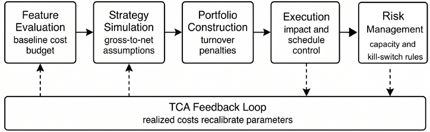
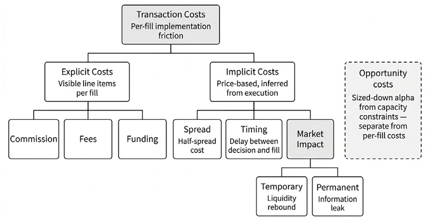
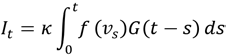
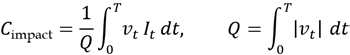
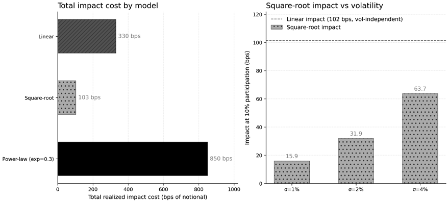
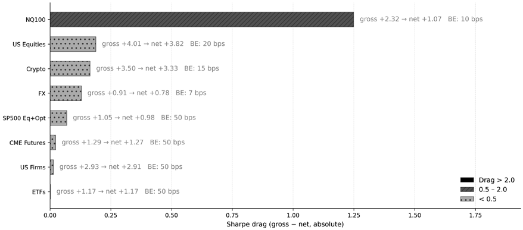
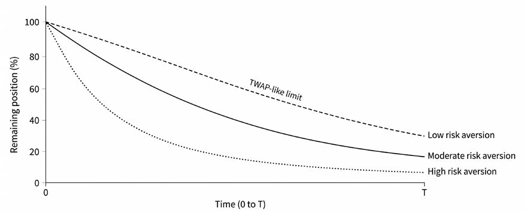
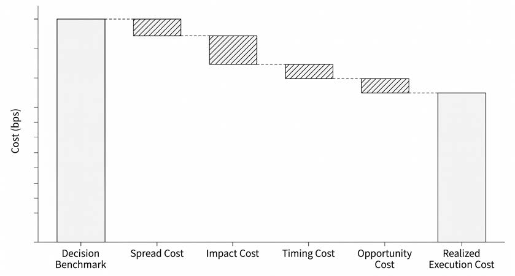
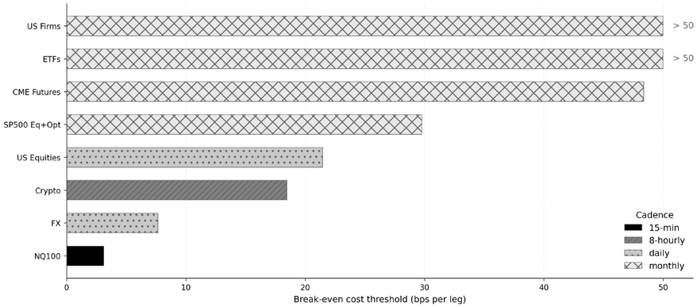
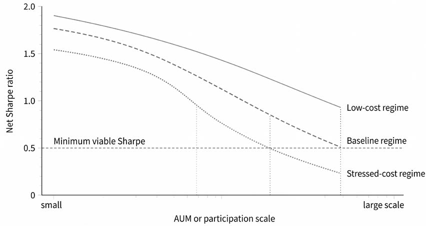

# Chapter 18: Transaction Costs

A strategy that looks brilliant on paper can lose money the moment it trades. Every trade carries a cost: the spread you cross, the market you move, the opportunity you miss. These costs accumulate during a backtest and turn paper profits into real losses. Transaction costs account for most of the gap between theoretical alpha and realized returns.

Cost modeling is a first-class concern in the ML4T workflow. Rather than treating costs as an afterthought (a percentage shaved off at the end), we integrate them from signal evaluation through to live execution. The goal is not to *eliminate* costs, which is impossible, but to understand them well enough to make informed trade-offs: Is this factor’s IC worth its turnover? Can this strategy scale to meaningful AUM? When does execution quality matter more than signal quality?

After completing this chapter, you will be able to:

- Map where transaction costs enter each stage of the ML4T pipeline, from factor evaluation through risk management.
- Classify costs into explicit, implicit, and capacity components and identify which dominate for a given strategy type.
- Parameterize three baseline backtest cost models (spread, linear slippage, and square-root impact), with guidance on when each applies.
- Evaluate execution algorithms (TWAP, VWAP, Almgren-Chriss) as controls that shape the impact-timing trade-off rather than solutions that eliminate costs.
- Design a transaction cost analysis (TCA) framework that decomposes realized costs, validates ex-ante models, and closes the feedback loop.
- Apply cost-based guardrails (break-even turnover, minimum required edge, capacity analysis, and kill-switch criteria) to assess the strategy’s feasibility before deployment.

We will begin by mapping cost integration points across the workflow (*Section 18.1*), then develop a practitioner cost taxonomy (*Section 18.2*) and connect it to microstructure regimes (*Section 18.3*). Three baseline cost models for backtesting follow (*Section 18.4*). *Sections 18.5* and *18.6* cover execution algorithms and the Almgren-Chriss optimal execution framework. *Section 18.7* introduces TCA as the feedback mechanism that keeps cost models calibrated. We close with practical guardrails that determine when costs should kill a strategy (*Section 18.8*).

## 18.1 Where costs enter the ML4T workflow

A factor that clears the gross-return hurdle can still fail once it trades in size. This section identifies where transaction costs enter the ML4T workflow so that each stage evaluates net returns. The following list introduces each stage in turn:

1. Costs first bite in **feature evaluation**. A feature with a slightly higher IC is not better if it requires ten times the turnover. The strategies covered in *Chapters 7* and*8*, therefore, need cost-aware signal thresholds because forecast quality and trading intensity must be judged together.
2. Costs become explicit in **strategy simulation**. *Chapter 16* converts signals into orders, holdings, and realized PnL. If that stage assumes frictionless execution, the backtest approves strategies whose gross alpha was never large enough to survive spread, slippage, and impact.
3. **Portfolio construction** is also a cost decision. *Chapter 17*’s turnover constraints, position limits, and rebalance rules are not cosmetic. They regularize the optimizer to mitigate costly portfolio churn and keep desired weights within the market’s liquidity budget.
4. The downstream chapters inherit the same constraint. *Chapter 19* treats capacity and execution stress as risk limits, while *Chapter 20* folds net-of-cost monitoring into the production loop.

*Figure 18.1* maps those links across the full research-to-production pipeline:

*Figure 18.1: Cost integration across the ML4T pipeline. Transaction costs constrain every stage, from factor evaluation to risk management, with TCA feedback recalibrating ex ante parameters*

Cost analysis operates through two lenses. Ex ante models forecast the cost of hypothetical trades for backtests and portfolio design. Ex post transaction cost analysis (TCA) measures the actual costs incurred by the desk. The first lens prevents naive simulations. The second prevents stale parameters. The workflow is circular: estimate, trade, measure, recalibrate.

### The false positive problem

Ignoring costs produces false positives. The sign of the bias is easy to understand: every turnover-heavy strategy looks better before spread, slippage, and impact are accounted for. The bias is large enough to erase many published gross-return effects:

- Frazzini et al. (2018) show why the calibration source matters. Using $1.7 trillion of live institutional executions across 21 developed equity markets, they find that patient execution costs are far below the estimates often inferred from TAQ data. TAQ describes the average trade; it does not isolate a patient allocator using schedule control, passive liquidity, and venue selection.
- Retail execution shows the same point from the other side. Schwarz et al. (2022) document large execution-price differences across retail brokers even when commissions are zero and orders are matched on observable characteristics. The implication is not that one universal cost number exists. It is the routing, urgency, and execution style that decide whether an edge survives.

These findings create two symmetric errors. TAQ-based costs can reject viable strategies that would survive patient execution. Zero-cost assumptions approve strategies that fail the moment they trade. The fix is conservative calibration when execution data is absent and continuous TCA-based recalibration when execution data is available.

The remaining sections provide tools to avoid both failure modes: a cost taxonomy (*Section 18.2*), regime-aware baseline models (*Section 18.4*), and TCA-based validation frameworks (*Section 18.7*). The goal is to make cost-aware research the default, beginning with the cost components themselves.

**Implementation**: See `01_cost_taxonomy` for cross-asset fee schedules and breakeven analysis, and `03_market_impact_calibration` for impact model calibration.

## 18.2 A cost taxonomy for practitioners

Transaction costs have structure. That structure determines which terms belong in the model and which components dominate for a given strategy. *Figure 18.2* organizes the taxonomy into three branches (explicit, implicit, and capacity), each requiring distinct modeling approaches.

*Figure 18.2: Transaction cost taxonomy*

**Convention note**: Throughout this section, costs are expressed in basis points (bps) of noof trade value. Impact model outputs (𝐶௜௠௣௔௖௧) represent expected price movement as a tional value, one-way unless explicitly stated as round-trip. One basis point equals 0.01%

fraction of price, which converts directly to bps when multiplied by 10,000.

### Explicit costs

Explicit costs are contractually defined and accounted for exactly. Commissions, exchange fees, and clearing charges belong in this bucket. They are often small for liquid cash equities but still meaningful for futures, options, and high-turnover strategies, where a few basis points, repeated thousands of times, become material.

**Regulatory fees** also belong here. They scale mechanically with notional or share count and should be modeled as fixed-schedule inputs rather than left in an undifferentiated slippage term. For a strategy that sells large notional amounts every day, individually tiny fees add up to a visible annual drag.

**Financing costs** are explicit as well, even though they are easy to overlook. Margin interest, borrow fees on shorts, and futures roll all convert gross alpha into carry decisions. An instrument with sub-basispoint trading friction can still be expensive to hold if financing terms deteriorate. Borrow deserves special attention because it is broker-specific, time-varying, and often the dominant cost on the short side. A conservative backtest, therefore, needs either historical borrowing data or a defensible proxy based on market cap, float, and short-interest pressure.

**Transaction taxes** are the clearest example of a mechanical first-order wedge. In markets that impose stamp duties or securities transaction taxes, those levies can exceed the spread for the most liquid names. Any cross-market comparison that omits them is wrong before the first trade is simulated.

Explicit costs should be inserted exactly where the schedule is known. The modeling error is usually not in this bucket; it is in treating the exact, visible costs as if they were the whole problem.

### Implicit costs

Implicit costs arise from the interaction between the order and the market. The bid-ask spread is the lower bound on implicit cost. A round-trip trade that buys at the ask and sells at the bid pays the full spread, even if the market never moves. For liquid large-cap equities, that may be only a few basis points. For small-caps, options, or stressed markets, it can be an order of magnitude larger.

**Slippage** is the gap between the intended execution benchmark and the actual fill. That gap reflects quote drift during transmission, queue position, partial fills, and adverse selection. Spread is paid immediately. Slippage accumulates while the order is being executed.

**Market impact** is the price movement caused by trading itself. Kyle (1985) provides the canonical linear-impact framework: the market maker learns from order flow, so larger and more informative trades move the price more.

For attribution, it is useful to distinguish between temporary and permanent impacts:

- **Temporary impact** is the price pressure created during execution that partially reverts once the order is complete; it reflects liquidity consumption and dealer inventory effects
- **Permanent impact** is the information footprint of the trade: if the order reveals information, the market revises its value estimate, and the price move does not fully revert

Amihud (2002) showed that illiquidity, measured as the ratio of absolute return to dollar volume, helps explain cross-sectional differences in returns and serves as a practical proxy for this broader impact channel. The distinction matters because temporary impact is the part the trader should seek to reduce through scheduling and venue choice, while permanent impact reflects how visible and informative the order has become. Hasbrouck (1991) provides the basic empirical framework for measuring that informational component.

### Capacity costs

Capacity costs appear when the strategy scales into the market’s liquidity budget. Participation is the first term. Trading 0.25% of ADV and trading 5% of ADV are different businesses. Frazzini et al. (2018) show that impact increases in a concave fashion with trade size, which is why the square-root rule is the default practical model.

Crowding is the second term. Chordia, Roll, and Subrahmanyam (2000) show that liquidity co-moves across names and sectors. Capacity is therefore not a static property of the signal. It depends on who else is trying to trade the same idea and when they arrive.

Opportunity cost closes the stack. Slower execution reduces impact but increases the chance that the market moves before the order is complete. Capacity is therefore a joint property of signal decay, order size, and execution urgency.

### The cost stack

For practical modeling, costs combine into a stack: 𝐶௧௢௧௔௟= 𝐶௘௫௣௟௜௖௜௧+ 𝐶௦௣௥௘௔ௗ+ 𝐶௦௟௜௣௣௔௚௘+ 𝐶௜௠௣௔௖௧

The relative importance varies by strategy:

| Strategy Type | Dominant Costs |
| --- | --- |
| High-frequency | Spread, exchange fees |
| Daily rebalancing | Spread, slippage |
| Weekly/monthly | Market impact |
| Low-turnover | Explicit fees, opportunity cost |

*Table 18.1: Dominant costs by strategy*

To anchor the taxonomy in concrete magnitudes, the following table shows typical one-way all-in costs across the asset classes covered by this book’s case studies. The two-orders-of-magnitude range, from under 1 basis point for liquid ETFs to over 100 basis points for illiquid options, is driven primarily by market structure rather than asset fundamentals.
| Asset Class | Retail (bps, one-way) | Institutional (bps) | Dominant Component |
| --- | --- | --- | --- |
| US large-cap equities | 1–5 | 5–15 | Spread + execution quality |
| US small-cap equities | 10–30 | 20–50 | Spread + impact |
| Liquid ETFs (SPY, QQQ) | 0.5–3 | 1–5 | Spread |
| Equity options | 10–100+ (of premium) | 3–20 | Spread (no Rule 605 transparency) |
| Index futures (ES, NQ) | 0.7–1.5 | 0.5–1.0 | Tick-constrained spread |
| FX spot (major pairs) | 5–30 | 0.5–3 | Venue segmentation |
| Crypto perps (CEX) | 5–50 | 2–10 | Fee tier + volatility regime |
| IG corporate bonds | 30–80 | 5–20 | Embedded markup |

*Table 18.2: Trading cost rules of thumb; depend on market/venue and broker*

Dominant costs determine modeling effort. A daily signal needs spread and slippage estimates that move with the regime. A slower, larger allocator needs impact and financing terms that scale with position size and holding period.

**Implementation**: See `01_cost_taxonomy` for cost component breakdowns across strategy types, `02_spread_estimation` for empirical spread estimation, and `12_commission_slippage_comparison` for side-by-side commission and slippage model comparisons across asset classes.

## 18.3 The microstructure regime link

Transaction costs are not stationary. Spread, slippage, and impact move with market state, so constant parameters are wrong by construction. This section links the microstructure ideas from *Chapter 3* to the conditioning variables that belong in cost models.

### Intraday liquidity patterns

Liquidity follows predictable intraday patterns that directly affect execution costs (see *Chapter 3*):

- **Market open (9:30-10:00 ET for US equities)**: High volatility, wide spreads, and thin depth as the market processes overnight information. Impact costs peak as participants compete to establish positions. Executing during this window is materially more expensive than executing at midday.
- **Midday (11:00-14:00 ET)**: Lowest volatility and tightest spreads. Market makers provide maximum depth. This window offers the lowest execution costs for patient traders but may introduce timing risk for urgent orders.
- **Market close (15:30-16:00 ET)**: Volume tends to concentrate as index funds rebalance and traders close intraday positions. Spreads tighten, but depth can be consumed quickly. Auction mechanisms (closing auctions) offer execution certainty at the cost of price impact.

Karnaukh et al. (2015) documented similar patterns in FX markets, where liquidity concentrates during overlapping trading sessions (London/New York) and deteriorates during Asia-only hours.

### Volatility and spread dynamics

Spreads widen predictably with volatility. Market makers face adverse selection: informed traders are more likely to trade when they have private information, which tends to coincide with periods of volatility. To compensate for this risk, market makers widen spreads.

This proportionality follows from inventory-based market-making models (for example, Ho and Stoll 1981): the market maker sets spreads to compensate for price risk over the expected time between trades. The relationship is approximately: ݌ݎ݁ܽ݀ ן ߪڄ √߂ݐ

where 𝜎 is return volatility and 𝛥 is the time between quote updates. During high-volatility events such

as earnings releases and macro announcements, spreads widen materially relative to normal levels.

Impact costs also scale with volatility. The standard square-root impact model includes volatility explicitly: ܫ݉ ݌ܽܿ ݐൌߪڄ ߟڄ √ܸܳ

where 𝜂 is the impact coefficient, 𝑄 is order size, and 𝑉 is average daily volume. Higher volatility means

higher impact for the same participation rate.

### Regime transitions

Markets also shift between regimes abruptly. Stress episodes compress depth, widen spreads, and increase impact fast enough to invalidate parameters estimated from quiet periods. March 2020 is the template: across rates, credit, and equities, execution costs moved by multiples rather than percentages. Any systematic strategy forced to rebalance during stress will pay those stressed costs, not the trailing average.

One mechanism is information asymmetry. Faster participants detect regime shifts sooner and widen the gap between patient and urgent execution. A second mechanism is market inelasticity. Bouchaud (2022) argues that aggregate demand is less price-elastic than standard models assume, so the same flow causes larger price moves when liquidity withdraws.

The practical question is not which single indicator defines the regime. It is the indicators that jointly describe execution conditions. Implied volatility, relative volume, quote-depth imbalance, and spread-normalized-to-history should be read together. A high VIX print without spread widening does not imply the same execution response as a high VIX print with depth collapse and one-sided order-book imbalance.

### Implications for cost modeling

Regime dependence changes four modeling decisions. Parameters should be estimated separately by volatility bucket and trading window, rather than pooled into a single average. When the regime is ambiguous, stressed parameters are the safer default because cost underestimation can lead to false positives. Production systems should monitor the same indicators in real time and adjust participation when spreads or depth move outside normal bounds. Historical backtests should also use contemporaneous regimes, so that crisis periods incur crisis-level costs rather than a diluted full-sample average.

The regime lens prevents the assumption that today’s costs predict tomorrow’s. Cost models are only as good as their conditioning on market state.

**Implementation**: See `02_spread_estimation` for regime-conditioned spread analysis and `03_market_impact_calibration` for impact coefficient estimation by VIX regime.

## 18.4 Baseline backtesting cost models

Every researcher needs implementable cost models for backtesting. This section presents three baseline models of increasing realism and shows when each one is adequate.

### A unified view of impact models A trade schedule specifies how a parent order is divided over time. Let 𝑥௧ denote the remaining inven-

tory to be executed at time 𝑡, and let:

𝑣௧ൌെݔሶ௧

denote the signed trading rate. For a buy order, 𝑣௧> 0; for a sell order, 𝑣௧< 0. A faster schedule con-

centrates volume into a shorter interval, while a slower schedule spreads the same parent order over a longer horizon.

Market impact models differ in how they map this schedule into price pressure and execution cost. A useful way to organize many transient-impact models is to separate three ingredients: An instantaneous impact function 𝑓(⋅), which maps trading intensity into immediate price

1. A decay kernel 𝐺(⋅), often called the propagator, which determines how past impact persists pressure. 2. A market-specific scale parameter 𝜅, which captures liquidity, volatility, spread, depth, and or fades. 3. Under this representation, the transient price impact at time 𝑡, measured as a fraction of price, can other market conditions.

be written as:

The expected impact cost of executing the schedule over the horizon 𝑇, normalized by total traded

notional, is then obtained by integrating the current trading rate against the impact already present while the trade is being executed:

This distinction matters. The single integral of 𝐼௧ represents the price pressure remaining at a given

point in time. The cost of execution depends on the impact incurred throughout the schedule, which is why the cost expression involves the trading rate and the evolving impact process.

For backtesting, however, researchers usually do not estimate a full propagator model. They use reduced-form approximations that map observable trade size, volatility, volume, and spread into expected cost. Different assumptions about the impact function, decay behavior, and execution horizon produce the canonical models summarized in *Table 18.3*.

| Model | Core Assumption | Typical Reduced-Form Unit Cost | When to Use |
| --- | --- | --- | --- |
| Spread | The main cost is crossing the bid-ask spread. | Half-spread, plus commissions or fees where relevant | Small orders in liquid markets |
| Linear participation | Impact rises approximately linearly with participation or order size relative to volume. | 𝐶i𝐶mpact ןܳ Ȁܸ  | Medium-sized orders, conservative baseline, theoretical benchmark |
| Square-root metaorder | Impact increases in a concave manner with order size and scales with volatility. | 𝐶i𝐶mpact ן ߪ√ܳ Ȁܸ  | Large orders, institutional-style execution, empirical baseline |
| Transient linear impact | Impact is linear in trading rate but decays over time as liquidity replenishes. | Depends on the execution horizon relative to market resilience | Multi-period execution where schedule timing matters |
| Propagator models | Impact from past trades decays slowly and may interact with concave impact functions. | Model-dependent; often calibrated to reproduce concave metaorder impact | High-frequency, multi- period, or execution- focused research |
*Table 18.3: Market impact model overview*

This framing is useful because the models are not competing philosophical categories; they are progressively richer approximations to the same execution problem. Let’s think more about the different types of model:

- A spread model is a lower bound. It assumes that the main cost is simply crossing the bid-ask spread and ignores the effect of the order on subsequent prices.
- A linear model is a simple participation-based extension. It penalizes larger trades relative to available volume and is easy to implement, but it can overstate the cost of large orders when impact is empirically concave.
- A square-root model is the empirical workhorse for meaningful order sizes. It captures the robust finding that impact tends to increase less than proportionally with order size, often scaling with volatility and the square root of the order’s share of market volume.
- Transient-impact and propagator models become relevant when execution timing matters. They distinguish between the immediate price pressure caused by trading and the persistence of that pressure as liquidity replenishes. These models are more realistic for multi-period execution, but they also require stronger assumptions and more calibration data.

The remainder of this section implements the first three models: spread costs, linear participation costs, and square-root impact costs. These are the most useful baselines for strategy backtests because they require limited data, are transparent to audit, and cover the main regimes encountered in practical research. More detailed transient-impact models are better treated as execution models than as default backtest cost models.

### The spread model

The simplest cost model charges half the bid-ask spread per trade: 𝐶௦௣௥௘௔ௗ= 1 2 ⋅Spread௧

For a round-trip, the full spread is paid. This model captures the minimum cost of crossing the spread to execute.

**Parameterization approaches**:

- Historical quotes: Calculate time-weighted average spreads from TAQ or similar data, conditioned on volatility regime
- Volume-weighted spread: Weight spread observations by trading volume to reflect when trades actually occur
- Conservative default: For US large-cap equities, 5-10 basis points; for small-caps, 20-50 basis points; for emerging markets or illiquid names, 50-100+ basis points

The spread model underestimates costs for large orders (which face impact beyond the spread) but provides a useful lower bound.

### The linear slippage model

The linear slippage model adds execution friction that scales with participation: 𝐶௦௟௜௣௣௔௚௘= 𝐶௦௣௥௘௔ௗ൅ߙڄܸܳ

 where 𝛼 is the slippage coefficient in basis points per unit participation (order size 𝑄 relative to daily volume 𝑉). This captures costs from market moves during execution, partial fills, and queue position.

**Bear the following in mind during calibration**:

- Compare execution prices to mid-quotes at order submission across historical trades
- Condition on volatility regime: slippage is typically 2–3x higher during volatile periods
- Conservative defaults: 5 basis points for liquid large-caps; 15-25 basis points for mid- and smallcaps; but these figures are only starting points, vary with the market, and require research

The linear model works well for moderate order sizes, where impact scales roughly linearly with value. It fails for large orders where the impact is concave.

### The square-root impact model

For meaningful order sizes, market impact dominates, and scales sublinearly with participation. The square-root model, grounded in theoretical, and empirical work, captures this relationship: 𝐶௜௠௣௔௖௧ൌߪڄ ߟڄ √ܸܳ

where: 𝜎 = daily return volatility 𝜂 = impact coefficient (typically 0.1–0.5) • 𝑄 = order quantity in shares • 𝑉 = average daily volume in shares • •

The square-root law has strong empirical support. Sato and Kanazawa (2024) find exponents near 0.5 across multiple asset classes. Toth et al. (2011) connect that regularity to order-book dynamics, and Cont et al. (2014) show that the realized coefficient still depends on current depth, imbalance, and recent flow.

The key practical point is concavity. Doubling order size does not double the impact, but it still increases the total cost enough that schedule design matters. *Figure 18.3* compares linear, square-root, and power-law assumptions on a 100,000-share order: linear charges 330 bps, square-root 103 bps, power-law 850 bps. The square-root model is a better default because it captures both cross-asset heterogeneity and the concave increase in cost with size. Once a cost model is selected, the relevant question for a strategy is whether realized gross alpha survives the resulting drag.

*Figure 18.3: Left: total realized impact cost on a 100,000-share parent order at $100 under linear, square-root, and concave power-law (exp=0.3) impact models, in bps of notional. Right: square-root impact at 10% participation across volatility regimes (sigma = 1%, 2%, 4%), with the vol-independent linear reference (102 bps) overlaid. Impact cost rises with model convexity and with volatility*

*Figure 18.4* maps that drag across eight of the chapter’s case studies: gross-to-net Sharpe degradation at the headline cost configuration of each case study, with the breakeven cost level annotated alongside.

*Figure 18.4: Gross-to-net Sharpe degradation by case study at headline cost configurations. The annotated breakeven column shows how much further the model could absorb before realized Sharpe crosses zero*

To use the square-root model in a backtest, it helps to distinguish three related tasks: assembling a full one-way cost estimate, calibrating the impact coefficient, and deciding when the model is an appropriate baseline. A practical one-way specification combines explicit fees, half the bid-ask spread, and temporary market impact: 𝐶௧௢௧௔௟= 𝐶௘௫௣௟௜௖௜௧+ 1 2 Spread + ߪڄ ߟڄ √ܸܳ

This decomposition is useful because the three terms capture different mechanisms. 𝐶௘௫௣௟௜௖௜௧ covers

commissions, exchange fees, and taxes. The half-spread term captures the immediate cost of demanding liquidity. The square-root term captures temporary impact that rises with participation but does so in concave rather than linear form. For small trades, spread and explicit fees may dominate. As order size increases, the impact term usually becomes the larger component.

The impact coefficient 𝜂 is not a universal constant. It varies with asset class, liquidity, volatility, market regime, and execution style. *Table 18.4* therefore provides starting ranges rather than fixed values.

| Asset Type | Typical 𝜂 Range |
| --- | --- |
| Large-cap equities | 0.1–0.3 |
| Mid-cap equities | 0.2–0.4 |
| Small-cap equities | 0.3-0.6 |
| Liquid futures | 0.1–0.2 |
| FX majors | 0.05–0.15 |

*Table 18.4: Impact coefficients by asset class*

In practice, 𝜂 should be estimated from transaction-cost analysis, broker execution data, or comparable

historical trades whenever possible. Taranto et al. (2018) show that realized impact also depends on recent order flow and market state, so even a well-estimated coefficient is only an average summary. For backtesting, it is usually better to err on the conservative side and use values from the upper half, or upper quartile, of the range that fits the relevant asset class and liquidity bucket.

### Choosing and stress testing a baseline cost model

Model choice should follow expected participation. For very small orders, a spread model often provides an adequate lower bound. For moderate participation, a linear slippage model is a reasonable simplification. For larger trades, the square-root specification is the better default because it reflects the concave empirical relationship between size and impact.

| Participation Rate | Recommended Model |
| --- | --- |
| < 0.5% of ADV | Spread model |
| 0.5% - 2% of ADV | Linear slippage |
| >2% of ADV | Square-root impact |
*Table 18.5: Impact model by participation rate*

These thresholds are rules of thumb, not hard boundaries. Their purpose is to keep the backtest from using a model that is structurally too optimistic. A spread-only model may be acceptable for a low-turnover strategy trading small fractions of daily volume, but it will materially understate costs for a strategy that repeatedly trades several percent of dollar volume.

When historical execution data is unavailable, initialize the model conservatively: at least the quoted spread, a slippage allowance that widens in volatile periods, and an impact coefficient chosen from the more expensive end of the plausible range. These inputs are initial assumptions to be challenged later, not final estimates.

The limits of these baseline models should also be explicit. The square-root model can break down in stressed markets, where impact may steepen sharply; for very small trades, where fixed costs dominate; and in fragmented or queue-driven microstructure, where execution priority matters. The model should therefore be treated as a robust baseline for backtesting, not as a precise forecast of realized execution cost. Validation through transaction-cost analysis, discussed in *Section 18.7*, remains essential.

A second limitation is the choice of cost base. The baseline models in this section express costs in basis points of notional value, which works well for cash equities, FX, and futures. It does not work well for instruments whose traded price is only a small fraction of the notional exposure. As the S&P500 Options case study shows, for a short at-the-money straddle on an index constituent, for example, the option premium may be only 3 to 5% of the underlying notional, while the bid-ask spread on that premium may be another 5 to 15% of the premium itself. That translates to roughly 15 to 75 basis points of underlying notional per side, far above the single-digit basis-point assumptions that may be reasonable for equities. *Section 18.8* shows how this mismatch can drive the same strategy from strongly negative to modestly positive Sharpe depending on how spread crossing and universe filtering are modeled. The broader lesson is that when traded price and notional exposure are not proportional, the baseline notional-bps framework should be replaced by a price-scaled model calibrated to the instrument.

### Costs as portfolio regularizer

Mean-variance optimization is unstable, in part, because the frictionless version assumes that rebalancing is free. Add realistic trading costs, and the optimizer becomes less willing to chase small forecast changes with large weight changes. In that sense, transaction costs regularize portfolio weights. That is why *Chapter 17*’s practical MVO belongs in the same conversation as *Chapter 18*’s execution models.

**Implementation**: See `03_market_impact_calibration` for parameter calibration and model comparison, and `06_ml4t_execution_demo` for the API of the `ml4t.backtest.` `execution` module.

## 18.5 Execution algorithms as controls

Execution algorithms control the trade-off between impact and timing risk. They do not eliminate transaction costs. The important question is therefore which benchmark an algorithm optimizes and which risks it leaves behind, not whether it is “optimal” in the abstract.

### Time-weighted average price

**Time-weighted average price** (**TWAP**) divides an order into equal slices executed at regular intervals: Slice𝑖= executed at time ݐ𝑖

TWAP optimizes simplicity and schedule certainty. It is easy to implement, easy to audit, and useful as a baseline benchmark. Its weakness is equally clear: equal time slices ignore intraday volume patterns, do not respond to spread blowouts, and expose the full order to timing risk during the execution window. TWAP is acceptable when urgency is low and liquidity is roughly stable. It should not be the default for orders whose cost depends materially on the timing of their execution.

### Volume-weighted average price (VWAP)

**Volume-weighted average price** (**VWAP**) shapes execution to match historical volume patterns: Slice𝑖∝ExpectedVolume𝑖

More shares execute during high-volume periods, which usually reduces per-slice impact. VWAP therefore optimizes benchmark tracking rather than pure cost minimization. It works well when historical volume profiles are stable, and the trader cares about matching the market’s average execution level. It fails when the realized session departs from the expected profile, when spreads widen suddenly, or when the benchmark itself is a poor proxy for execution quality.

Obizhaeva and Wang (2013) showed that optimal trading strategies must account for order book resilience (how quickly depth replenishes after a trade) beyond simple volume matching.

Both TWAP and VWAP are static schedules. They commit to a path before the market reveals whether the session will be calm, stressed, or information-heavy. That is the real limitation. A static schedule continues through regime changes, unexpected news, and liquidity vacuums unless a separate rule interrupts it.

### Regime-aware participation

A practical improvement over static schedules incorporates real-time regime signals: ParticipationRate = BaseRate ڄ݂ ൫Spread,Volatility,Depth)

where 𝑓 is a dampening function that reduces participation when spreads widen, volatility spikes, or

visible depth disappears. This is the simplest practical upgrade to static execution: trade less when liquidity is expensive, accept slower completion, and make the impact-versus-timing trade explicit.

Nevmyvaka, Feng, and Kearns (2006) show that adaptive execution policies can outperform static VWAP-style schedules once the policy conditions on real-time market state. The conceptual lesson matters more than the exact algorithm: regime awareness belongs inside execution, not outside it.

The trade-off is explicit: aggressive execution minimizes timing risk but maximizes impact; passive execution minimizes impact but accepts timing risk. The optimal balance depends on the strategy’s alpha decay rate: fast-decaying signals require aggressive execution despite costs. Sophisticated execution systems use a receding-horizon approach: optimize a multi-period execution plan, execute only the first period, then re-optimize with updated market state. This is identical to model predictive control (MPC) in control engineering. The market state (order book depth, recent volume, price trajectory) is the system state; the execution schedule is the control input; the objective trades off expected shortfall, risk, and impact costs. It explains why institutional desks do not simply follow textbook Almgren-Chriss trajectories but continuously replan as conditions evolve.

### Execution as strategy design input

Execution, therefore, feeds back into strategy design. A high-turnover signal needs cheap execution just to survive. Capacity limits are execution limits stated in portfolio language. Holding period determines urgency: slow alpha can wait for liquidity, while fast alpha must pay for immediacy.

Avellaneda and Stoikov (2008) make the complementary point from the market-maker side: inventory risk and spread capture are the mirror image of the trader’s urgency-versus-impact trade-off. Strategy design must therefore assume the execution problem it will actually face, not a frictionless benchmark.

**Implementation**:

- `04_vwap_twap_execution` compares TWAP and VWAP execution.
- `07_ml4t_volume_participation` shows participation-gated execution mechanics.
- `08_ml_dynamic_execution` demonstrates ML-based adaptive execution.

## 18.6 Optimizing execution with Almgren–Chriss as a unifying framework

The **Almgren-Chriss** framework turns execution into a quantitative risk-cost trade-off. Even when a desk does not implement the full model, the framework remains useful because it makes the risks of urgency, impact, and timing explicit.

Every execution faces the same trade-off. Trading quickly reduces exposure to adverse price moves but increases immediate impact. Trading slowly reduces immediate impact but leaves the order exposed to price drift. Optimal execution chooses a schedule on that frontier rather than pretending the trade-off does not exist.

Almgren and Chriss (2001) formalized optimal execution as minimizing expected cost plus a risk penalty: min ௫ܧ[ܥ(ݔ)] ൅ߣڄ Var[ܥ(ݔ)]

where 𝑥 is the execution trajectory, 𝐸[ܥ(ݔ)] is expected impact cost, Var[ܥ(ݔ)] captures timing risk, and 𝜆 is the urgency parameter. Larger 𝜆 corresponds to a stronger preference for completion certainty

and a more front-loaded schedule. The framework requires a small set of inputs with clear economic interpretation. Volatility 𝜎 determines Model components timing risk: the more volatile the asset, the larger the penalty for waiting. Temporary impact 𝜂 captures

TempImpact ൌߟڄ ݒܸ the price pressure created during execution that then partially reverts. A common specification is:

where 𝑣 is the trading rate and 𝑉 is the market volume.

Permanent impact 𝛾 captures the price change that persists after the trade because the market learns

from order flow: PermImpact ൌߛڄܸܳ

 where 𝑄 is the total order size. Eisler et al. (2010) reinforce the same practical point at the order-book

level: the price effect of trading depends on market state, so the parameters in the objective are not constants.

### The optimal trajectory

Under the standard linear-impact, Brownian-price assumptions, the optimal inventory path is: 0 sinh൫ߢ(ܶ െݐ)) 𝑥(ݐ) ൌܺ sinh(ߢܶ) 

with: 𝜅√ߣߪ2 ߟ

or stronger urgency raises 𝜅 directly; a shorter horizon enters only through 𝜅. All three front-load for the simplified case without permanent-impact feedback. The shape is not TWAP. Higher volatility

execution.

### Regime-dependent parameters

The framework is only as good as its inputs. Volatility should reflect the execution horizon, not a stale annual estimate, so recent realized volatility, implied volatility, and known event risk all matter. Impact coefficients also move with time of day, stress, and crowding. Chan (2022) shows that impact decay and capacity interact over days, meaning an execution schedule can look feasible under a same-day model but still be too aggressive once lingering impact is included.

Given parameter uncertainty, practitioners should not rely on single-point estimates. Instead, generate schedules under multiple scenarios:
| Scenario | Volatility | Impact | Risk Aversion |
| --- | --- | --- | --- |
| Base case | Historical avg | Calibrated | Medium |
| High vol | +50% | +30% | Higher |
| Low liquidity | +20% | +50% | Higher |
| Benign | -20% | -20% | Lower |

*Table 18.6: Scenario examples*

Donnelly (2022) emphasizes that robust execution accounts for model uncertainty rather than optimizing under assumed-known parameters. If optimal trajectories vary dramatically across scenarios, the trade is fragile to miscalibration. In that case, a blended or conservative approach is preferable to false precision. The scenarios above use stylized stress multipliers; in practice, they should be tied to the asset class’s observed regime distribution.

### What Almgren-Chriss means for research

For research, the framework delivers four durable lessons. Execution cost depends on how the order is traded, not only on what is traded. The execution problem has its own frontier: impact buys immediacy, while patience buys a lower market footprint. Capacity is endogenous to the execution style, so the same signal may be viable under patient trading and infeasible under urgent liquidation. Urgency should also be tied to alpha decay. A signal with a half-life measured in minutes should not be paired with a schedule designed for daily rebalancing.

The principal contribution of Almgren-Chriss is therefore organizational: it converts execution from ad hoc judgment into a model with named inputs and observable trade-offs.

*Figure 18.5* visualizes this directly: as risk aversion rises, optimal trajectories front-load execution, reducing timing variance while increasing immediate impact.

*Figure 18.5: Almgren-Chriss optimal trajectories by risk aversion*

The original framework assumes a linear, permanent impact, and an instantaneous, temporary impact. Later transient-impact and limit-order extensions relax those assumptions and are most relevant to live execution systems with tighter microstructure control. For research backtests, Almgren-Chriss remains the right baseline because it captures the main urgency-versus-impact trade-off without requiring a full execution stack. That makes it the natural bridge from transaction-cost estimation to the viability checks in the next section.

**Implementation**: See `05_almgren_chriss_optimal_execution` for scenario-based execution planning.

## 18.7 Transaction cost analysis and model validation

**Transaction cost analysis** (**TCA**) turns fills into model feedback. TCA measures realized execution cost, attributes that cost to identifiable sources, and shows whether a bad outcome came from the market or from the execution policy. That feedback loop is what keeps ex-ante models calibrated.

### Implementation shortfall

**Implementation shortfall** (**IS**) is the standard TCA metric, measuring the difference between the ௘௫௘௖௨௧௜௢௡െܲ decision price and the execution price: 𝐼= ௗ௘௖௜௦௜௢௡ ௗ௘௖௜௦௜௢௡ 

gate the numerator: 𝐼= (ܲௗ௘௖௜௦௜௢௡െܲ ௘௫௘௖௨௧௜௢௡)Ȁܲௗ௘௖௜௦௜௢௡. For multi-leg trades, compute IS per leg and For a buy order, a positive IS indicates execution cost (paid more than intended). For sell orders, ne-

aggregate by notional weight.

The implementation shortfall captures spread, slippage, impact, and timing in a single metric. Madhavan (2002) made it the institutional default because it measures the quantity that matters operationally: the difference between the paper portfolio and the executed portfolio.

### Cost decomposition

TCA becomes diagnostic only after the shortfall is decomposed. Spread cost measures the immediate ௙௜௥௦௧೑௜௟௟െܲ payment for liquidity: 𝐶௦௣௥௘௔ௗ= ௔௥௥௜௩௔௟೘௜ௗ

ௗ௘௖௜௦௜௢௡ 

Impact cost measures the price movement created by the order itself: ௔௩௚೑௜௟௟− 𝐶௜௠௣௔௖௧= ௔௥௥௜௩௔௟೘௜ௗ −𝐶௦௣௥௘௔ௗ

ௗ௘௖௜௦௜௢௡

Timing cost measures the market move during the execution window: ௘௡ௗ೘௜ௗെܲ 𝐶௧௜௠௜௡௚= ௔௥௥௜௩௔௟೘௜ௗ ௗ௘௖௜௦௜௢௡  Timing can help or hurt. That sign matters because it separates bad luck from bad scheduling. Opportunity cost captures the unfilled remainder: ௖௟௢௦௘− 𝐶௢௣௣௢௥௧௨௡௜௧௬= (1 −FillRate) ⋅ ௗ௘௖௜௦௜௢௡ ௗ௘௖௜௦௜௢௡ 

Said (2022) emphasizes exactly this distinction between market-driven and execution-driven price moves. Without that separation, TCA becomes descriptive accounting rather than a calibration tool.

| Component | Value (bps) | Share |
| --- | --- | --- |
| Total IS | 2.83 | 100% |
| Spread cost | 1.00 | 35% |
| Impact cost | 0.63 | 22% |
| Timing/slippage cost | 0.50 | 18% |
| Explicit fees | 0.70 | 25% |

*Table 18.7: Example TCA decomposition*

In this illustrative decomposition (Perold, 1988; Wagner and Edwards, 1993), spread and explicit fees are the largest contributors, while impact remains material. This pattern implies that execution quality (for example, venue selection and schedule design) and fee minimization can both improve net performance before changing strategy logic.

*Figure 18.6* presents this decomposition as a waterfall from decision benchmark to realized execution, with spread, impact, timing/slippage, and explicit-fee terms, to isolate market-driven effects from execution-driven ones, making attribution additive and operational for daily monitoring.

*Figure 18.6: TCA decomposition waterfall*

A useful TCA report, therefore, asks one question before anything else: was the cost market-driven or execution-driven? Market-driven costs arise when volatility spikes, news arrives, or market-wide liquidity deteriorates during the order window. Execution-driven costs arise when participation is overly aggressive relative to available depth, parameters are stale, or the schedule is poorly timed. The distinction decides the remedy. Market-driven losses call for better regime conditioning. Execution-driven losses call for policy changes.

### Regime context in TCA

TCA should be conditioned on the market regime. “Bad fills” during a high-volatility period may represent good execution given the conditions, whereas the same fills during a calm period indicate execution failure.

Regime tags make the comparison set fair. A useful report groups orders by volatility bucket, liquidity state, event calendar, and intraday window. Comparing stressed open-auction fills with calm midday fills produces noise, not evidence.

### Closing the loop

TCA’s highest-value use is parameter updating. Estimate the model, trade, measure realized cost, compare the prediction to the outcome, then update the model. Systematic underestimation means the coefficients are too low. Regime-specific residuals mean conditioning is missing. Size-specific residuals mean the impact function is misspecified.

The strongest calibration test compares backtested net PnL with realized live PnL over the same strategy logic. If the two diverge persistently, the cost model is wrong. Vendor coefficients are starting values, not authority.

Hautsch and Huang (2012) studied limit order flow and market impact, demonstrating that execution data can inform optimal order sizing and timing decisions.

### The hidden costs of risk-model-driven turnover

TCA should also expose turnover created by the risk model rather than the signal. If the covariance estimate shifts between windows, the optimizer can trigger rebalancing even when expected returns remain unchanged. Paleologo (2025) treats this as a hidden implementation cost of unstable portfolio construction.

A simple diagnostic is to hold the alpha signal fixed and recompute weights as only the covariance matrix changes. Large turnover under that null experiment indicates that the risk model is creating ∥۾௧െ۾௧ିଵ∥ி, is one compact summary statistic. This links directly to *Chapter 14*’s eigenvector-stability trades with no informational content. The Frobenius norm of the change in factor-mimicking portfolios,

problem: unstable loadings become unnecessary turnover unless the estimation method is stabilized. The notebook `10_gross_vs_net_performance` plots the null-turnover decay.

### TCA report elements

A practical TCA report should support decisions, not just record history. It needs summary statistics such as average implementation shortfall, fill rate, and completion time; attribution that separates spread, impact, timing, and missed fills; regime slices by volatility, time of day, and size bucket; and a validation page comparing predicted with realized costs. If the report cannot tell the desk which parameters to change, it is incomplete.

For implementation, several starting points exist: `pyfolio` includes a transaction cost analysis module, and open-source libraries such as `tca-tools` provide basic IS decomposition. At the institutional level, Bloomberg TCA and Virtu Analytics (formerly ITG) produce standardized FIX-protocol (see *Chapter 3*) reports that integrate with order management systems. The notebook accompanying this section demonstrates a lightweight TCA implementation suitable for research backtests.

**Implementation**: See `01_cost_taxonomy` for decomposition primitives and baseline attribution, and `10_gross_vs_net_performance` for turnover-linked cost diagnostics.

## 18.8 Designing practical cost guardrails

Not every strategy that looks profitable in research survives the impact of trading costs. This section provides the diagnostics that decide whether a strategy is deployable, scalable, or unprofitable once friction is accounted for.

### Break-even turnover

This heuristic provides a quick sanity check, not a precise cutoff, for the turnover a strategy can sustain before trading costs absorb expected gross return: ܧൣܴ gross] Turnovermax =

Cost per unit turnover

For a strategy with a 5% expected annual gross return and 25 basis points of round-trip cost per unit of turnover: 0.05 Turnovermax = 0.0025 = 20

This implies that the strategy can sustain an annual turnover of about 20 times capital before estimated trading costs consume its expected gross return. The exact mapping from this number to trading frequency depends on the turnover convention used, so the formula is best read as an order-of-magnitude diagnostic rather than a literal rebalancing schedule.

A more conservative formulation incorporates the Sharpe ratio: ڄ ߪ Turnover௠௔௫=

Cost per trade where 𝑆 is the Sharpe ratio and 𝜎 is strategy volatility. This accounts for risk-adjusted returns, rec-

ognizing that higher-volatility strategies can sustain higher turnover given the same Sharpe ratio.

*Figure 18.7* shows the same break-even logic as a surface over turnover and one-way trading cost. The message is immediate: once turnover moves into the high single digits, even modest execution costs demand implausibly large pre-cost alpha.

*Figure 18.7: Break-even alpha rises quickly with turnover and one-way cost*

Strategies with fast rebalancing need much larger gross edges to survive realistic frictions.

### Minimum required edge

The same constraint can be written from the other direction: given estimated costs, what return per trade is required? Edge௠௜௡= Total cost Avg holding period

For a strategy paying 20 basis points per round-trip with a 5-day average holding period: Edge௠௜௡= 0.0020 = 4 bps/day 5

The strategy must therefore generate at least 4 basis points per day just to cover trading costs. If the signal is only worth 2 basis points per day, it is not viable at that cadence. Break-even turnover and minimum required edge are the same constraint expressed in different algebraic forms. Use both. If they disagree, either the turnover estimate or the cost estimate is wrong.

Gabaix and Koijen (2021) strengthen the same intuition at the market level. If markets are more inelastic than standard models assume, order flow moves prices more than expected, and the required edge rises accordingly.

### Alpha-to-go – What a signal is worth after costs

The break-even and minimum-edge heuristics above treat expected return as a static input. But if rebalancing is costly, the relevant quantity is not today’s expected return but the *cumulative cost-discounted expected return over the holding period*: **the signal’s value after accounting for the cost of building the** Consider a signal that follows an AR(1) process with persistence 𝜙 (close to 1 for slowly decaying **position and eventually unwinding it** (Paleologo, 2025).

speed-of-trading parameter 𝛤 that depends on volatility, risk aversion, and the cost coefficient, the momentum; close to 0 for fast mean-reverting signals). When trading costs are proportional to a alpha-to-go discounts the raw signal by a factor that depends on both 𝜙 and 𝛤. A fast-decaying signal (small 𝜙) with high impact costs (large 𝛤) has very low alpha-to-go: by the time the position is built,

the signal has disappeared.

This lens changes how signals should be ranked. Slow signals with long half-lives can amortize entry costs and retain most of their raw alpha. Fast mean-reversion signals can lose most of their apparent value before the position is fully established. The useful ranking metric is therefore cost-adjusted signal quality, not raw IC in isolation.

In the ML4T workflow, alpha-to-go sits between model output (*Chapters 11–14*) and allocation (*Chapter 17*). It is the cost-aware filter that determines how much of the predicted alpha is actually capturable. Strategy evaluation (*Chapter 16*) should use cost-discounted returns, not raw returns, when assessing profitability, particularly for strategies where signal decay and cost magnitude are of the same order.

### Capacity analysis

Capacity is not a fixed number: it depends on execution approach and acceptable cost degradation. More precisely, a strategy’s Sharpe ratio is a decreasing function of assets under management (AUM): ௠௜௡= 0.5 or the hurdle rate). as AUM grows, market impact increases and net-of-cost performance degrades. Capacity is the AUM The shape of this 𝑆(AUM) curve depends on the cost model: linear costs produce linear SR degrada- at which the Sharpe ratio drops below a minimum threshold (typically

tion, while square-root costs produce concave degradation; capacity increases less-than-linearly with AUM. For ML4T case studies, an order-of-magnitude capacity estimate follows from computing the AUM at which daily trading volume would exceed 1% of the average daily volume across the traded universe.

**Participation-based capacity**: A simple first-pass capacity estimate limits the strategy’s daily traded dollars to a fixed fraction of average daily dollar volume (ADDV): Daily trading capacity = MaxParticipation × ADDV

If the strategy turns over a fraction 𝜏 of portfolio capital per day, the corresponding AUM capacity is

approximately: AUM Capacity ≈MaxParticipation × ADDV߬ average daily dollar volume, then a fully rebalanced daily strategy (𝜏) has an approximate capacity For example, if the maximum acceptable participation rate is 5% and the traded universe has $1B of of $50M. If average daily turnover is only 20% of capital (𝜏), capacity rises to about $250M. The

key point is that participation caps constrain daily trading flow first; portfolio capacity follows only after turnover is specified. a daily notional 𝑄 generates expected impact: **Impact-adjusted capacity**: A more refined estimate starts from a square-root impact model. If trading

𝐼(ܳ) = ߟߪ√ܸܳ,

where 𝑉 is daily dollar volume, 𝜎 is daily volatility, and 𝜂 is an empirical impact coefficient, then imposing a maximum acceptable impact 𝐼max implies:

൬ܫmax 𝑄max ൌܸ ߟߪ) 2

This quantity is the maximum daily traded notional, not yet the maximum portfolio AUM. Converting it into strategy capacity again requires a turnover assumption: max߬ AUM Capacity ≈

This formulation makes the economics explicit: impact models determine how much can be traded per day within a cost budget, and turnover determines how that daily trading budget translates into deployable capital.

Capacity studies across major anomalies find dramatic variation. Low-turnover strategies like size and profitability can absorb much larger capital bases before becoming unprofitable, while momentum capacity decays at substantially lower AUM; high-frequency strategies that remain profitable after spreads typically have capacities an order of magnitude smaller.

Across the case studies, the same pattern appears. High-turnover intraday designs often fail net of cost even when gross backtests look attractive, while slower strategies preserve more of their edge. *Chapter 20* consolidates the cross-case survival tables; the guardrail logic developed here explains those outcomes.

*Figure 18.8* summarizes capacity as a frontier: net Sharpe decays with scale, and the viable region is bounded by the minimum acceptable post-cost Sharpe threshold.

*Figure 18.8: Capacity frontier under transaction costs: net Sharpe degrades with scale; feasible capacity depends on cost model and turnover*

Net Sharpe declines as the AUM/participation scale rises, and feasible capacity is the point at which it intersects with a minimum viability threshold.

### Kill switch criteria

Define kill criteria before deployment, not during stress. Absolute triggers capture slow bleed, such as sustained negative net returns, repeated implementation shortfall far above budget, or chronic underfilling. Relative triggers compare realized costs to the model; for example, a rolling overshoot relative to the forecast or a cost-adjusted Sharpe ratio that falls below the minimum acceptable threshold. The common feature is precommitment: the strategy is stopped because it violates a published operating rule, not because we later lost confidence.

Cost guardrails connect back to the rest of the workflow. *Chapter 8* should score factors against breakeven turnover, not raw IC alone. *Chapter 17* should embed cost-aware turnover constraints in the optimizer. *Chapter 19* should treat capacity limits as risk limits, because exceeding capacity is not only costly but also destabilizing in adverse market conditions.

### When to abandon rather than modify

A failed cost test does not always mean immediate abandonment. The first repairs are obvious: reduce turnover, improve execution, narrow the universe to more liquid names, or accept lower capacity. Those changes are worth attempting because they target the implementation channel directly rather than pretending the research signal changed. If they still cannot produce acceptable net performance, the strategy should be dropped regardless of gross backtest quality. A strategy that cannot clear its own friction is not deployable.

### A practical example – Cost mitigation for options

The S&P 500 options case study (*Chapter 20*) illustrates how much of a strategy’s apparent success or failure is driven by execution discipline rather than by the signal itself. The illustrative strategy is a systematic short-straddle sell on S&P 500 constituents with daily delta hedging of the underlying, a textbook volatility-risk-premium harvest. Single-name options carry wide round-trip bid-ask spreads, so small differences in how the strategy transacts translate directly into large differences in net Sharpe. The same signal, evaluated under three increasingly disciplined execution regimes, yields three qualitatively distinct conclusions (see `case_studies/sp500_options/14_costs.ipynb` for the worked cascade):

1. **Rung 1: Naive round-trip.** Enter each cohort on Friday, hold ten trading days, and close at the market. Both entry and exit legs cross the bid-ask spread on call and put contracts, with commission paid on each leg. This is the default a reader would implement with no thought given to option microstructure. Under that discipline, the strategy is decisively unprofitable as specified: cumulative entry-leg cost is comparable in magnitude to the position notional itself, so the option bid-ask consumes the volatility-risk premium before any signal is realized, leaving validation and holdout net Sharpes well into negative territory.
2. **Rung 2: Hold to expiry.** O’Donovan and Yu (2024) observe that holding each short-option position to its natural expiration eliminates the second leg of the round trip: the contract settles at intrinsic value, no market exit is required, and the exit bid-ask is never paid. The same strategy under that single change (same model, same delta hedge, same universe) moves from decisively unprofitable to negative net Sharpe within a wide bootstrap confidence interval. Cumulative cost falls materially because half of the round-trip spread is no longer crossed, but cumulative entry-leg cost on the full ~612-symbol universe remains large enough that the strategy is indistinguishable from flat at best.
3. **Rung 3: Hold to expiry plus liquid-universe filter.** Restricting the execution set at each rebalance date to the bottom quintile of relative half-spread (the tightest-quoted 20% of that day’s candidate straddles, roughly 120 of the ~600 names) is the second of the two mitigations in the O’Donovan-Yu cascade, applied here more strictly than the paper’s own bottom-four-deciles (~40%) screen. Within sp500_options the selected configuration under this discipline (signal-stage, equal-weighted top-5, linear/ridge, label `ret_to_expiry`, `universe_filter=liquid`) lifts validation Sharpe to +0.160 with a 95% bootstrap interval [−0.975, +1.778] and holdout Sharpe to +0.974 with interval [−0.836, +3.135]. Both intervals straddle zero, and the paired-bootstrap difference against the equal-weight holdout benchmark is −1.574 [−3.801, +0.730]. The selected strategy sits below the +2.714 EW universe Sharpe on the 2021 holdout. The same signal, the same model, and the same cost accounting produce a different qualitative conclusion simply because the execution set is cleaner.

These net Sharpes assume best-case algorithmic execution: the cost model charges only 20.3% of the quoted option half-spread, the at-the-money ratio Muravyev and Pearson (2020) estimate (roughly 2.6 ¢ effective against a 12.8 ¢ quoted half-spread), and that O’Donovan and Yu (2024) adopt via Heston et al. (2023). That fraction is the lenient, strategy-favorable end of the execution-cost range rather than a neutral average (newer auction-based evidence puts the realized fraction materially higher), so the rung-3 holdout survival is conditional on that assumption. This is why *Section 20.6* sweeps the spread fraction (0.203, 0.5, 0.75, 1.0) rather than fixing a single point: the lesson is the strategy’s survival *across* the cost grid, not a claim that it earns a specific Sharpe at the most favorable execution assumption.

Three features of this cascade deserve attention. First, the cascade is monotonic: each additional discipline rung makes a real improvement, and the holdout point estimate crosses zero only once both are applied. Second, the improvement is not subtle - it is large enough to flip the strategy’s qualitative deployability conclusion, even though the holdout bootstrap interval still straddles zero. Third, the mitigation does not compose without limit: tightening the universe past the bottom quintile leaves an execution set too thin to diversify across, and the top-5 portfolio concentrates onto too few names. The mitigations are a short staircase, not a parameter that can be pushed without limit.

The holdout improvement requires a caveat. Annualized Sharpe on a twelve-month window carries a standard error of roughly ±1, so the rung-3 holdout point estimate is not a precise number; the meaningful shift is from “indistinguishable from a sizable loser” to “indistinguishable from flat,” a change in the qualitative conclusion about deployability, not a claim that the strategy earns a specific positive Sharpe in production. The deflated-Sharpe logic of *Section 20.5* still applies. But the direction matters: the difference between rung 1 and rung 3 is not a small effect that disappears under multiple-testing adjustment. It is the difference between an execution discipline that fits the instrument’s microstructure and one that does not. When transaction costs scale with the traded price rather than with the notional amount, the practical lesson is the same: modify the execution before abandoning the signal.

### Comparing fixed and relative cost regimes

The options cascade above is about whether the strategy survives a *real* friction stack. The complementary lesson, visible in the broad US equities case study (~3,200 names, 2000–2015 validation, 2016–2018 holdout), is that the *cost model itself* can dominate the conclusion when it is poorly matched to the universe. The risk is worth making explicit: when diagnosing a strategy’s apparent survival, ask whether the cost model fits the data before debating the signal.

The case study sweeps two cost regimes: relative and fixed costs. The first applies an 11-point basis-point grid from 0 to 50 bps total per leg, a size-invariant fraction of the share price. The second walks a six-point-per-share grid from 0¢ to 10¢, a fixed-dollar charge per share that scales inversely with price. The validation Sharpe is similar across regimes at low cost (bps mean 1.93 at 10 bps, pershare mean 1.90 at 1¢ half-spread) because the median post-2001 adjusted price (~$18.44) makes a 1¢ half-spread roughly half a basis point of notional. However, the two regimes diverge as the cost rises. The bps grid keeps the strategy in positive territory through 20 bps (mean: 0.86) and remains barely positive through 30 bps (mean: 0.01). The per-share grid decays sharply through 2.5¢ (mean 0.66) and is modestly negative at 5¢ (mean −0.29).

The disagreement results from applying a constant per-share charge to adjusted historical prices that span a wide nominal range. The same position that costs 5 bps at a price of $200 costs 50 bps when the same name’s adjusted history prints at $20, and 200 bps if a 1990s split sequence pushed the adjusted print to $5. The 5¢ breakeven point in the case study’s adjusted price distribution implies a round-trip cost of near 55 bps for the median name. As a practical rule for a global cost regime, use bps-of-notional when the universe spans a wide adjusted-price range. Use fixed per-share-plus-spread only when (a) prices are relatively stable in nominal terms or (b) measure per-asset spreads from quote data. Use both for sensitivity analysis. When the two regimes disagree about whether the strategy survives, the disagreement is a diagnostic about the cost model, not a finding about the signal.

See `case_studies/us_equities_panel/18_costs.ipynb` and `case_studies/sp500_equity_option_` `analytics/16_costs.ipynb` for the dual-regime sweeps, and `case_studies/etfs/16_costs.ipynb` for the per-share example with tiered commissions.

**Implementation**: See `03_market_impact_calibration` for the empirical η coefficient feeding the square-root impact capacity formula, `09_frequency_tradeoff` for cadence-versus-cost trade-offs, `10_gross_vs_net_performance` for break-even and capacity diagnostics, and `11_cost_cliff` for high-frequency viability stress tests.

## 18.9 Summary

Transaction costs are binding constraints throughout the ML4T workflow. They separate into explicit fees, implicit frictions, and capacity effects; they move with the market regime; and they admit a ladder of backtest models from spread to square-root impact. Execution algorithms control the impact-versus-timing trade-off rather than removing it, and TCA is the mechanism that validates and updates those ex-ante assumptions.

The practical message is asymmetric. Overestimating costs can reject viable ideas; underestimating them destroys real capital. Break-even turnover, minimum required edge, and capacity analysis are therefore feasibility tests, not optional diagnostics. Cost-based kill criteria make that discipline operational, forcing the strategy to justify its friction continuously rather than only in research.

*Chapter 19* develops the risk management framework, incorporating cost-based capacity limits and execution risk alongside the traditional dimensions of market, credit, and operational risk.
