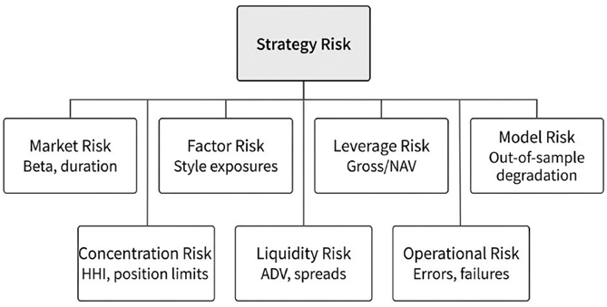
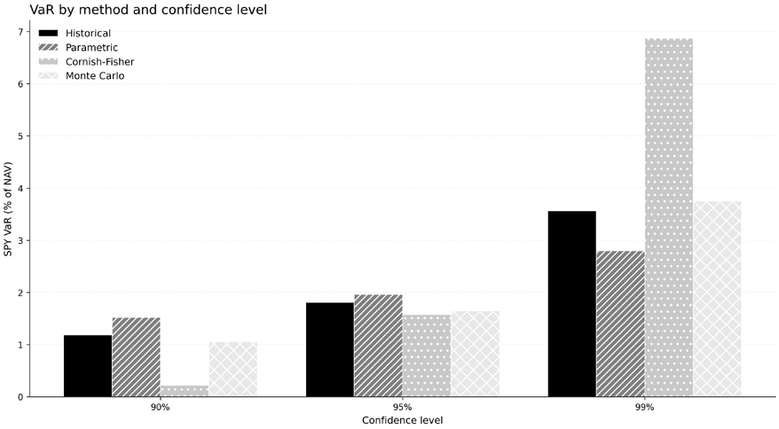
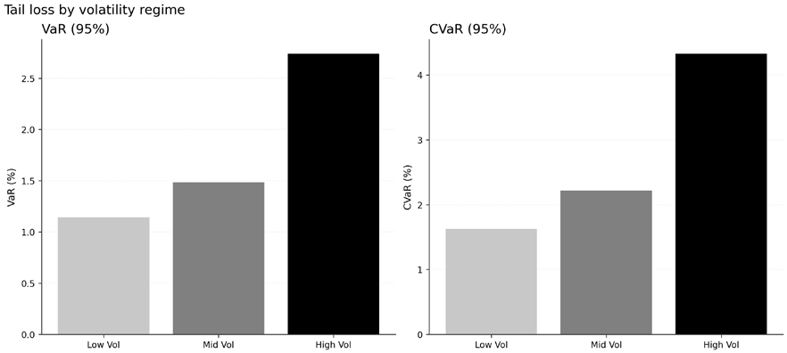
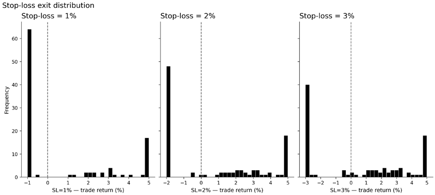
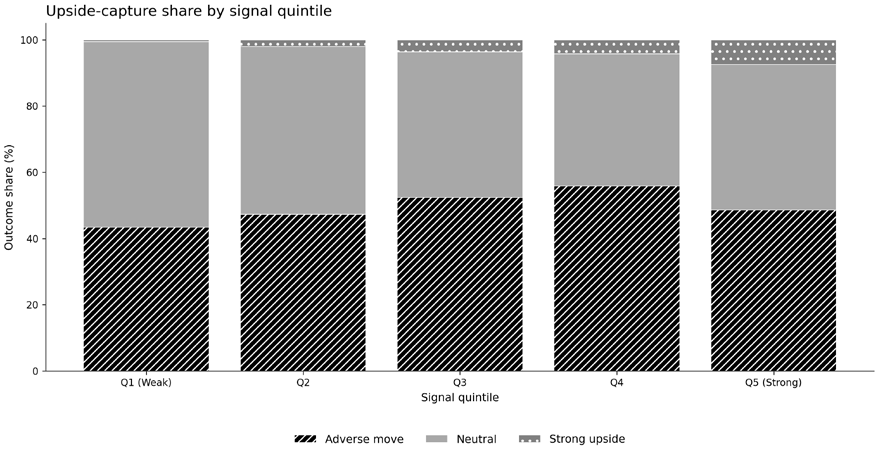
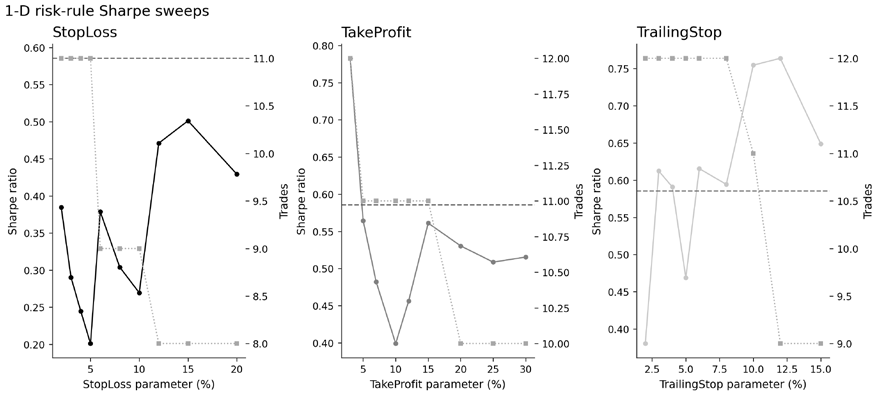
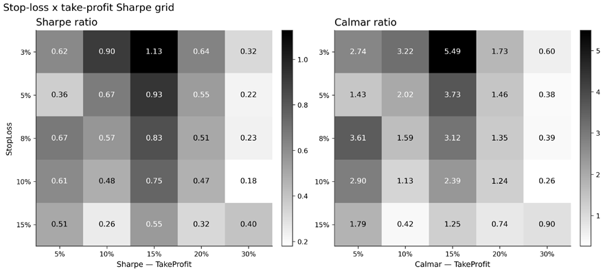
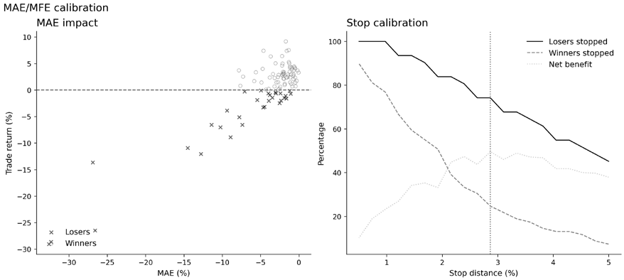

# Chapter 19: Risk Management

A strategy that survives rigorous cross-validation (*Chapter 7*), proves stable across regimes (*Chapter 8*), and avoids the pitfalls of time-series leakage (*Chapters 7* and *11*) has earned a seat at the table. Portfolio construction (*Chapter 17*) gave it position sizes; realistic cost modeling (*Chapter 18*) told us what we actually keep. Yet none of this answers a deceptively simple question: *what happens when things go wrong?*

Risk management is not a reporting layer bolted on after research. It is system design: a set of constraints, controls, and governance artifacts that define what the strategy is *allowed* to do when conditions deteriorate. A strategy without explicit risk controls is not a tradable system; it is a hypothesis awaiting its first stress test.

After completing this chapter, you will be able to:

- Measure tail risk with VaR and CVaR, including regime-conditional estimates and liquidity-aware interpretation.
- Evaluate path risk using drawdown depth, drawdown duration, recovery time, and related path-dependent metrics.
- Decompose portfolio risk into market, factor, sector, geographic, and macro exposures to distinguish intended from unintended bets.
- Design and interpret historical, hypothetical, and reverse stress tests that challenge return, cost, volatility, and correlation assumptions together.
- Build adaptive risk controls, including volatility targeting, exposure caps, and position-level exits, using only information available at decision time.
- Specify kill switches, drift monitoring, and governance artifacts that turn a backtested strategy into a deployable trading system.

*Section 19.1* establishes the risk management mandate within the ML4T workflow. *Section 19.2* provides a practical taxonomy mapping each risk type to observable proxies and controls. *Sections 19.3–19.4* cover tail risk measurement (VaR, CVaR) and path risk (drawdowns, recovery). *Section 19.5* decomposes risk into factor, sector, and macro sources. *Section 19.6* introduces stress testing and scenario analysis. *Section 19.7* builds adaptive controls that adjust to conditions without lookahead. *Section 19.8* defines kill switches and risk governance.

## 19.1 Turning your backtest winner into a tradable system

López de Prado (2018) emphasizes that strategy risk extends beyond market exposure to encompass model risk, overfitting risk, and operational failures that no backtest can fully anticipate. Federal Reserve (2011) guidance on model risk management applies as much to quantitative trading as to bank credit models: every model requires documented assumptions, identified limitations, ongoing monitoring, and a clear owner responsible for its behavior.

Three principles guide this chapter:

1. **Constraints must be implementable without lookahead.** Every adaptive control (volatility scaling, exposure caps, pause rules) must use only information available at decision time. A risk limit that implicitly conditions on future volatility introduces the same leakage we spent *Chapters 7* and *11* eliminating.
2. **Controls must be auditable.** When a drawdown occurs, the post-mortem must trace exactly which signals triggered which actions. “The model decided” is not an acceptable answer. This requires logging, versioning, and clear escalation paths.
3. **Governance artifacts must exist before deployment.** The strategy definition introduced in *Chapter 6* is augmented with explicit thresholds for acceptable drawdown, leverage limits, concentration bounds, and the conditions under which trading pauses or stops entirely.

A risk-managed strategy differs from a backtested model in several concrete ways:

| Aspect | Backtested Model | Risk-Managed System |
| --- | --- | --- |
| Position limits | Implicit (data-driven) | Explicit caps by name, sector, factor |
| Leverage | Whatever optimizer is chosen | Hard ceiling with regime-conditional tightening |
| Drawdown response | None | Predefined de-risking triggers |
| Failure mode | Undefined | Kill switches with escalation rules |
| Documentation | Research notebook | Risk term sheet, monitoring dashboard |

*Table 19.1: Active risk management versus simple backtests*

Risk management sits at the interface between research and execution:

- The feature and label validation discipline from *Chapters 7–9* ensures we are not fooling ourselves about expected returns
- Portfolio construction (*Chapter 17*) translates signals into positions
- Cost modeling (*Chapter 18*) reveals the friction between gross and net performance

Risk management asks: *given all of this, what can still kill us?* The answer spans multiple dimensions (market moves, factor exposures, liquidity evaporation, model breakdowns, operational failures), each requiring its own measurement and control. **Implementation**: See `01_var_cvar` and `06_stress_testing` for the risk metrics underlying this framework.

## 19.2 A practical risk taxonomy for quant strategies

A practical taxonomy maps each risk type to an observable proxy and a control mechanism. Abstract categories become actionable only when translated into specific metrics and thresholds.

Four stylized facts of asset returns, documented across markets and decades, constrain which risk metrics are estimable and which modeling choices are appropriate (Cont, 2001):

1. Daily returns show little serial correlation, which is why point return prediction is difficult, and *Chapter 11-14*’s IC values remain modest.
2. Squared and absolute returns, however, are strongly autocorrelated, so volatility is often more predictable than direction.
3. Return distributions also exhibit heavy tails, with tail indices that make Gaussian assumptions especially unreliable in the extremes. Parametric VaR based on normality is therefore not just imprecise; it is structurally biased in the part of the distribution that matters most for risk control. Volatility clustering adds a second constraint and a second opportunity. High-volatility periods tend to follow high-volatility periods, while calm tends to follow calm. That persistence is what makes GARCH, EWMA, and related models operationally useful in *Section 19.7*.
4. At the same time, return distributions become more nearly Gaussian as the horizon lengthens from daily to weekly or monthly frequencies. Risk models are therefore generally more reliable at lower frequencies than at intraday or daily horizons.

The practical consequence is narrow but important: variance is the highest moment of returns that can usually be estimated with confidence from ordinary historical samples. Anything beyond it, including skewness, kurtosis, and deep quantiles, requires either much more data or stronger assumptions.

### Market risk

Market risk is the most familiar category. For long-short equity, net market exposure or beta to a broad index captures directional risk; for rates strategies, duration and convexity matter. Market risk is not inherently good or bad. It is either intended or unintended. A long-biased equity strategy wants market beta because the equity risk premium is part of the thesis. A market-neutral strategy treats residual beta as a hedging failure. The same 0.1 beta that is irrelevant to the first strategy is a meaningful unintended exposure for the second. The relevant proxies are portfolio beta, net exposure as a share of NAV, and duration-style sensitivities, while the corresponding controls are exposure limits, hedging overlays, and explicit neutrality constraints in the optimizer.

### Factor risk

Strategies also carry exposure to style factors such as value, momentum, size, quality, and volatility. Daniel and Moskowitz (2016) document how severe momentum crashes can be when the factor reverses. Unintended factor tilts therefore inherit risks that the research process may never have stress-tested directly. The usual proxies are factor loadings from regressions on standard factor portfolios, whether Fama-French, Barra, or a custom internal system. The usual controls are exposure limits, explicit hedges, or multi-factor constraints embedded in portfolio construction.

### Leverage risk

Leverage amplifies both returns and losses. A 2x leveraged strategy changes path dependency, increases margin-call probability, and interacts with financing costs that can spike during stress. Because volatility is time-varying (Schwert, 1989), leverage multiplies a moving target rather than a fixed one. The main proxies are gross exposure as a multiple of NAV, margin utilization, and sensitivity to financing costs. The corresponding controls are hard leverage caps and dynamic deleveraging triggers tied to volatility or liquidity regimes.

### Concentration risk

Diversification protects only to the extent positions are actually spread. A portfolio of 100 names dominated by five positions is not diversified; it is five concentrated bets wearing a diversified costume. Concentration risk applies not only to single names, but also to sectors, countries, and shared factor exposures. Practical proxies include the Herfindahl-Hirschman Index of position weights, maximum single-name weight, and sector or country concentration. The matching controls are position limits, sector caps, and minimum effective-number-of-position thresholds.

### Liquidity and capacity risks

A strategy that works at $10 million may fail at $100 million if it trades illiquid names or requires excessive turnover. *Chapter 18* quantifies the cost channel; here the point is that liquidity is also a risk category in its own right. Liquidity risk has two faces. Exogenous liquidity reflects market-wide conditions that affect everyone, while endogenous liquidity reflects the strategy’s own impact on prices. The proxies include position size relative to ADV, estimated market impact, bid-ask spreads, and stress indicators such as VIX or credit spreads. The controls differ accordingly: exogenous liquidity calls for regime-aware trading pauses, while endogenous liquidity calls for ADV limits, capacity estimates, and turnover ceilings.

### Model risk

Model risk arises from incorrect assumptions, incorrect data, incorrect implementation, or overfitting to historical patterns. Federal Reserve (2011) defines it as errors in model development, implementation, or use. A strategy that passed backtesting may still fail because the model was validated on patterns that do not recur, or because the implementation no longer aligns with the research objective. The relevant proxies are out-of-sample degradation, regime-slice instability, and excessive sensitivity to hyperparameters. The controls are holdout validation, ongoing benchmark monitoring, documented model limitations, and explicit re-research triggers.

### Operational risk

Operational risk encompasses everything outside the model: data feed failures, execution errors, reconciliation breaks, and human errors. A strategy can be analytically sound and still lose money because a sign was flipped in production or a corporate action was mishandled. A short book accidentally converted into a long book or a stock split misread as a price collapse can create large unintended exposures without any change in the underlying signal. The main proxies are execution-error rates, reconciliation breaks, system uptime, and manual override frequency. The controls are automated reconciliation, dual entry for critical parameters, pre-trade compliance checks, and formal incident review.

### The risk control matrix

The following table synthesizes these categories into a single point of reference:

| Risk Type | Proxy | Control | Monitoring Frequency |
| --- | --- | --- | --- |
| Market | Net beta, duration | Exposure limits, hedges | Daily |
| Factor | Factor loadings | Factor constraints | Weekly |
| Leverage | Gross/NAV ratio | Hard caps, vol triggers | Intraday |
| Concentration | HHI, max weight | Position limits | Daily |
| Liquidity | ADV coverage, spreads | Capacity limits | Weekly |
| Model | OOS degradation | Re-research triggers | Monthly |
| Operational | Error rates | Automated checks | Continuous |

*Table 19.2: Risk category overview*

Other categories (counterparty risk, regulatory risk, and technology/infrastructure risk) may apply depending on the strategy’s execution venue and institutional context. This taxonomy covers those most relevant to systematic strategies. *Figure 19.1* organizes the risk types and their key proxies; *Table 19.2* pairs each proxy with its control mechanism and monitoring cadence.

*Figure 19.1: Risk taxonomy for systematic strategies*

Each major risk class is useful only when linked to an observable proxy and a control that can be enforced in production.

**Implementation**: See `04_factor_exposure` for factor decomposition and `06_stress_testing` for liquidity stress scenarios.

## 19.3 Measuring the tail – VaR and CVaR

Standard deviation tells us about typical fluctuations. But strategies do not fail during typical periods. They fail during extremes. Tail risk metrics attempt to quantify what happens in the worst cases, and how bad “worst” actually gets.

### Value at risk

horizon at a given confidence level? Formally, VaR at confidence level 𝛼 is the 𝛼-quantile of the loss Value-at-Risk (VaR) answers a specific question: what is the maximum loss we expect over a given

distribution: VaRఈൌ‹ˆሼ݈ǣܲ (ܮ൐݈) ൑ͳ െߙሽ

For example, a daily 95% VaR of 2% means: “We expect to lose more than 2% on only 5% of trading days.” This is a threshold, not a prediction of what happens beyond it.

The main estimation approaches differ in how much structure they impose. Historical simulation uses the empirical distribution of past returns. It is simple and largely assumption-free, but its answer depends heavily on the sample period. Parametric VaR assumes a distribution, often normal, and estimates the required parameters. It is fast and convenient, but it becomes misleading when returns are non-normal. Extreme Value Theory focuses directly on the tail and is usually better suited to deep-loss estimation, though it requires careful threshold selection and more modeling judgment. VaR’s popularity stems from its intuitive interpretation, but it has a critical flaw: it tells us nothing about losses beyond the threshold. A strategy with 95% VaR of 2% might lose 3% when the threshold is breached or 20%; VaR treats those cases as equivalent.

### Conditional value-at-risk

Conditional VaR (CVaR), also called Expected Shortfall, addresses this limitation. CVaR asks: given that we exceed the VaR threshold, what is the expected loss? CVaRఈൌॱ[ܮפ ܮ൐VaRఈ]

Rockafellar and Uryasev (2000) showed that CVaR has a crucial property VaR lacks: subadditivity. A risk measure is subadditive if the risk of a portfolio is at most the sum of the risks of its components. Subadditivity means portfolio CVaR cannot exceed the sum of component CVaRs, a property consistent with diversification benefits, unlike VaR, which can pathologically increase when combining positions (Artzner et al., 1999). In the companion analysis (`01_var_cvar`), an equal-weighted basket of SPY, AGG, GLD, EFA, and EEM (US equities, US aggregate bonds, gold, developed international, emerging markets) shows that diversification reduces portfolio VaR by about 24% relative to the weighted sum of individual asset VaRs over 2006–2024. *Figure 19.2* compares the tail estimates from historical, parametric, and Cornish-Fisher methods on the same portfolio.

*Figure 19.2: VaR-method comparison on the same portfolio*

Historical, parametric, and Cornish-Fisher estimates differ most where distributional assumptions are least reliable.

The practical interpretation: if your daily 95% CVaR is 3%, then on the 5% of worst days, you expect to lose 3% on average. This captures the severity of tail events, not just their frequency.

**A distribution-free loss bound** al assumptions, only finite variance. For any portfolio, the probability of a shortfall exceeding 𝑘 The Cantelli inequality provides a model-free complement to VaR that requires no distributionstandard deviations below the mean is bounded by 𝑃(shortfall > ߪ) ≤1/(1 ൅݇ 2) . Because the mean return equals 𝑆ڄ ߪ, a losing period (a return below zero) is a shortfall of 𝑆 standard deviations, so a portfolio with Sharpe ratio 𝑆 has at most a 1/(1 ൅ܴܵ 2) probability of a losing period: 50% at 𝑆= 1.0 and 20% at 𝑆= 2.0. Compare this to Gaussian VaR, which

gives 16% and 2.3% respectively. The Cantelli bound is far more conservative, but it holds for any return distribution with finite variance. When fat tails or regime shifts make parametric VaR unreliable, this inequality provides a hard floor on loss probability from nothing more than the strategy’s risk-adjusted return; Cont (2001) documents that fat tails are the rule rather than the exception in asset returns.

### Why VaR understates real risk

Both VaR and CVaR are typically computed on historical returns that assume normal trading conditions. Tail events rarely occur in isolation. During stress, liquidity evaporates, so spreads widen, market impact spikes, and the cost of exiting positions rises precisely when exit is most urgent. Correlations also break in the wrong direction. Ang and Timmermann (2011) show that exceedance correlations, conditional on both assets experiencing extreme returns, are materially higher in downside tails than in upside tails. Diversification benefits therefore shrink when they are most needed. At the same time, *Chapter 18*’s cost parameters, often estimated from ordinary periods, can become several times larger in crisis. Bianchi et al. (2023) document how fat-tailed return behavior makes parametric VaR especially unreliable in these environments, with stressed losses often materially underestimated.

### Regime-conditional risk metrics

A single unconditional VaR or CVaR masks the variation across market regimes. Khang (2022) shows that regime-aware risk forecasts substantially outperform unconditional estimates. The insight is that volatility clusters: calm periods predict calm periods, and periods of stress predict periods of stress.

Regime-conditional risk computes separate VaR and CVaR estimates for each identified regime, for example, low-volatility, normal, and high-volatility states based on realized volatility or VIX levels (Shu and Mulvey, 2025). Empirical work on U.S. equities documents that high- and low-volatility regimes differ substantially in realized variance and that regimes persist on the order of months once they begin (Ang and Timmermann, 2011), so a single unconditional estimate averages over very different states of the world. *Figure 19.3* shows this amplification: stressed regimes widen both VaR and CVaR, but the gap is larger for CVaR, the quantity a risk manager cares about when deciding how to de-risk.

*Figure 19.3: Regime-conditional tail risk*

The conditional estimates show several patterns. Tail risk is amplified in stressed states: in `01_var_cvar`, the SPY high-volatility regime CVaR (95%) of 4.33% is about 2.7x the low-volatility regime value of 1.63%. Some strategies also show strongly asymmetric exposure, with stable risk in calm markets but explosive tails in stress, so the worst regime combines higher risk with worse compensation. The most dangerous moments are often regime transitions rather than established crisis periods, because controls calibrated to the old state fail before the new one is fully recognized.

### Incorporating liquidity haircuts

To make tail risk estimates realistic, the cost parameters from *Chapter 18* should be stressed alongside the return distribution. That usually means doubling or tripling spread assumptions in the stress scenario, increasing market impact in line with the historical ratio of crisis-to-normal impact, and reducing assumed ADV to reflect lower participation in stressed markets. The resulting liquidity-adjusted VaR captures not just the price move but the cost of responding to it. For strategies with meaningful turnover or position sizes, that adjustment can increase effective VaR by 50-100%.

### Evaluating risk model quality

The preceding metrics (VaR, CVaR, regime-conditional estimates) all depend on a volatility forecast. But how do you know whether your volatility model is any good? The fundamental difficulty is that “true” volatility is never observed. We observe proxies: squared daily returns, realized variance from intraday data, or range-based estimators. Each proxy introduces its own noise, and a naive comparison (computing mean squared error against a chosen proxy) can reverse model rankings when a different proxy is used. The model that looks best against squared returns may look worst against 5-minute realized variance.

Hansen and Lunde (2006) resolved this problem by identifying loss functions that preserve model rankings regardless of which volatility proxy is used. Two functions have that rank-robustness property. The first is MSE of variance: ܮൌ൫ߪො2 െߪproxy ) 2 2

which operates on variance rather than volatility; that distinction matters because variance MSE is proxy-robust while volatility MSE is not. The second is QLIKE: 𝐿(ߪො2) ൅ߪproxy Ȁߪො2 2

whose asymmetry penalizes under-prediction of variance more heavily than over-prediction. For risk management, where underestimating risk is more dangerous than overestimating it, that asymmetry is a feature rather than a defect.

Patton (2011) extended these results to broader families of loss functions, establishing that QLIKE and MSE are effectively the only practical choices that guarantee consistent model ranking across arbitrary volatility proxies. In application, compare competing volatility models, including GARCH, EWMA, realized variance, and ML-based forecasts, by computing average QLIKE and MSE against either squared daily returns or 5-minute realized variance. The model with the lowest average loss is preferred, and the ranking holds whichever proxy is chosen. For risk management, where under-prediction carries asymmetric consequences, QLIKE is the natural choice. For alpha research, where unbiased forecasts matter more than conservatism, MSE is preferred. Both should be computed when evaluating the volatility inputs that feed *Chapter 17*’s allocation models and *Chapter 18*’s cost models. A risk model that systematically underestimates volatility produces over-leveraged portfolios and optimistic cost projections; the pipeline compounds the error downstream. Paleologo (2025) gives a practitioner-oriented discussion of these robust loss functions in production risk systems.

### Practical guidance

Report both VaR and CVaR: VaR is familiar to stakeholders; CVaR captures tail severity. Use historical simulation for robustness, supplemented by parametric estimates for sensitivity analysis. On real SPY returns the Kupiec backtest in `01_var_cvar` favors historical VaR (exception ratio 1.11x, Kupiec p=0.10) over both parametric (1.17x, p=0.012) and Cornish-Fisher (1.45x, p<0.001) at 95% coverage; the Cornish-Fisher polynomial becomes unstable at this confidence level when realized excess kurtosis is in the double digits, which is typical for daily equity index returns.

Compute regime-conditional metrics and present the worst-regime CVaR prominently. Apply liquidity haircuts to avoid false comfort from frictionless backtests. Risk metrics describe the past, not the future.

**Implementation**: See `01_var_cvar` for VaR/CVaR computation and regime-conditional analysis.

## 19.4 Drawdowns, path risk, and time to recovery

VaR and CVaR measure point-in-time tail risk. But strategies do not exist at points in time - they travel paths. A strategy that loses 2% per day for 30 consecutive days may never breach a daily 5% VaR threshold, yet its investors experience a 45% drawdown. Path risk captures what point-in-time metrics miss: the cumulative damage and the time required to recover.

### Maximum drawdown

**Maximum drawdown** (**MDD**) measures the largest peak-to-trough decline over a period: ௦א[଴ǡ௧]ܲ௦െܲ max 𝑀 ௧א[଴ǡ்] ( ௧ ) max ௦א[଴ǡ௧]ܲ௦

where 𝑃௧ is the portfolio value at time 𝑡. Unlike volatility, which averages over all observations, MDD

captures the single worst experience an investor would have endured.

MDD has operational significance: it determines the point of maximum regret, the moment when allocation decisions are most tested. A strategy with a 30% drawdown requires a 43% gain to recover. A 50% drawdown requires 100%. The asymmetry is punishing. Institutional allocators operate under constraints that make path risk decisive. Many face hard drawdown limits (10% or 15% is common), where breaching triggers mandated redemption regardless of expected recovery. Investment professionals often cannot survive drawdowns that exceed peer norms, even if subsequent performance is excellent; career risk makes path risk personal.

Capital withdrawn during a drawdown misses the recovery. The realized return for an investor who redeems mid-drawdown is worse than the strategy’s theoretical return, a gap that widens with drawdown severity. Leveraged strategies compound the problem: margin calls during drawdowns force deleveraging at the worst possible moment, converting temporary losses into permanent impairment.

Maximum drawdown tells us the depth but not the duration. Two drawdowns of equal magnitude differ dramatically if one lasts two months and the other two years. Drawdown duration measures the time from peak to trough; recovery time measures the additional time from trough back to the prior peak.

**Ulcer Index** incorporates both depth and duration by computing the quadratic mean of drawdowns over a period: 𝑈= √1݊෍ܦ௜ ௡ 2 ௜ୀଵ 

where 𝐷௜ is the drawdown at time 𝑖. Unlike MDD, the Ulcer Index reflects the cumulative burden of

being underwater, giving higher weight to prolonged drawdowns.

### The historical record – 150 years of drawdowns

Alankar et al. (2023) provide a sobering catalog of downside tail events. Examining U.S. equity returns from 1871 to 2022, they identify 23 peak-to-trough declines exceeding 15%. These events cluster into two distinct types: gamma events that are fast and sharp and delta events that are slower and deeper. The distinction matters for hedging: gamma events, such as the 1987 crash or March 2020, respond well to option protection, while delta events, such as the 2008 financial crisis or the dot-com bust, require duration-based defenses.

### Conditional drawdown analysis

Just as VaR varies by regime, drawdowns cluster. A strategy that shows modest drawdowns in backtesting may experience its worst losses during conditions the backtest undersampled. The 2008 financial crisis, the 2020 COVID crash, and the 2022 rate shock each stress different exposures.

Conditional drawdown analysis partitions the equity curve by regime and computes:

- Maximum drawdown within each regime
- Average drawdown duration by regime
- Recovery time conditional on the regime in which the drawdown began

Daniel and Moskowitz (2016) illustrate the pattern with momentum crashes: momentum strategies showed modest drawdowns for decades, then experienced 50%+ crashes during market reversals. Unconditional drawdown statistics understate the tail risk embedded in factor timing. Two companion notebooks connect these path-risk ideas to trade construction. The fixed-stop comparison in `02_exit_strategies` produces *Figure 19.4*, which shows how different stop widths redistribute exit outcomes: tighter rules cut losses sooner, but they also increase the share of trades closed before the thesis has time to recover. The MAE/MFE excursion analysis in `03_position_sizing_mae_mfe` produces *Figure 19.8*, which calibrates stop and take-profit distances against the realized adverse and favorable excursions of historical trades, turning generic rules into strategy-specific sizing and exit policies. Both views express the same general lesson: controls should be calibrated to the strategy’s realized behavior rather than chosen from generic preference, and they should be judged by how they change realized exit behavior, not only by the headline maximum drawdown they target.

*Figure 19.4: Stop-loss exit distribution under alternative rules*

### Linking drawdowns to kill switches

Drawdown thresholds serve as natural kill switch triggers. A strategy that breaches its ex-ante maximum acceptable drawdown has entered territory where continued operation requires explicit review. A graduated escalation framework (five levels at 5%, 10%, 15%, 20%, and 30% drawdown, each with predefined action and approver) is developed in *Section19.8* (*Table 19.7*), and is preferable to a single binary cutoff. The thresholds should be set before deployment, documented in the risk term sheet, and enforced automatically where possible.

| Metric | Measures | Use Case |
| --- | --- | --- |
| Maximum Drawdown | Worst peak-to-trough loss | Mandate limits, allocator communication |
| Drawdown Duration | Time in drawdown | Investor patience, career risk |
| Recovery Time | Time to regain peak | Capital planning, reinvestment timing |
| Ulcer Index | Integrated drawdown pain | Holistic path risk comparison |
| Calmar Ratio | Return / MDD | Risk-adjusted return focusing on path |

*Table 19.3: Common risk metrics*

**Implementation**: See `01_var_cvar` for SPY drawdown depth and time-to-recovery (the 2007–2012 GFC drawdown reaches −55.2% over 355 trading days with an 869-day recovery), `02_exit_strategies` for the stop-distance comparison that anchors *Figure 19.4*, `03_position_sizing_mae_mfe` for the MAE/MFE excursion calibration that anchors *Figure 19.8*, and `10_ml4t_backtest_risk_demo` for the `ml4t.backtest.risk` module, which provides production-ready implementations of `StopLoss`, `TrailingStop`, `TighteningTrailingStop`, and `ScaledExit` rules that compose via `RuleChain`, `AllOf`, and `AnyOf` patterns.

## 19.5 Decomposing factor, sector, and macro exposures

A strategy’s total risk is an aggregate that obscures its sources. A portfolio with 15% annual volatility might derive that risk from market beta, factor tilts, sector concentration, or idiosyncratic name bets, each with different implications for diversification, hedging, and regime sensitivity. Risk decomposition reveals the structure beneath the aggregate. In production, this decomposition serves as a diagnostic tool: monitoring factor exposures over time detects drift before it causes losses, and comparing current exposures to historical norms flags emerging risks.

### The factor model framework

The foundation of risk decomposition is a factor model that expresses portfolio returns as a linear combination of systematic factors plus a residual: ௄ 𝑟௣ൌߙ൅෍ߚ௞ ܨ௞൅߳

௞ୀଵ where 𝑟௣ is portfolio return, 𝛽௞ is the exposure to factor 𝑘, 𝐹௞ is the factor return, and 𝜖 is the idiosyncratic residual. The 𝛽௞ coefficients tell us how much of the portfolio’s movement is explained by each

systematic source.

Common factor frameworks include:

- **Fama-French**: Market, size, value (3-factor); adds momentum and profitability (5-factor)
- **Barra/MSCI**: Comprehensive models with 10-20 style and industry factors
- **Macro factors**: Rates, credit spreads, VIX, dollar, oil, particularly relevant for multi-asset strategies

The choice of factor model depends on the asset class and strategy type. An equity long-short strategy naturally maps to equity style factors; a macro strategy requires explicit macro factor exposures.

### Intended and unintended exposures

Factor decomposition distinguishes between the exposures the strategy intends to take and those it acquires incidentally. A momentum strategy *intends* momentum exposure. But if the current momentum portfolio happens to be overweight technology stocks, it carries unintended sector exposure. If those tech stocks are also high-beta, it carries unintended market exposure. Unintended exposures are dangerous because:

- They are not compensated in the strategy’s investment thesis
- They may reverse unexpectedly
- They complicate attribution and risk management

Paleologo (2025) emphasizes that effective risk management requires separating signal-driven exposures from mechanical exposures that arise from portfolio construction. A momentum strategy with unintended value exposure should either hedge the value tilt or document it as an accepted risk.

### Exposure stability across regimes

Factor exposures are not static. A strategy’s beta to the market or to momentum drifts over time, and the variation often correlates with regime. Brixton et al. (2022) document that the stock-bond correlation, long assumed to be negative, turned positive during the 2022 inflation shock. Strategies built on diversification assumptions that had held for decades experienced unexpected, correlated drawdowns.

Rolling factor regressions surface these drifts directly. In `04_factor_exposure`, IWM’s rolling one-year HML loading climbs from roughly 0.1 to 0.3 over 2015–2024, a structural shift in small-cap value tilt that an unconditional regression would average away. The implication for risk management is operational: factor exposures must be monitored on a rolling basis, and any hedge or risk budget built on a static loading silently becomes mis-sized as the underlying tilt drifts. Exposures that appear hedged in normal times may also become directional in stress, so the rolling window should be short enough to catch regime transitions but long enough to suppress estimation noise.

### Sector and geographic decomposition

Beyond style factors, sector and geographic concentration carry their own risks. A U.S. equity strategy with 40% in technology is not just about stock selection: it is a technology sector bet. A global strategy with 70% in U.S. equities is making a bet on the U.S. dollar and the U.S. economy.

Useful concentration metrics:

- **Sector weights** versus benchmark
- **Active sector bets** (portfolio weight - benchmark weight)
- **Geographic exposure** for global strategies
- **Single-name concentration** (top 10 weights, HHI)

These exposures should be explicit in the risk term sheet. If the strategy intends to overweight technology, document it. If the overweight is incidental, consider rebalancing or hedging.

### Macro factor sensitivities

For strategies with cross-asset exposure, macro factors provide additional insight:

- **Rate sensitivity**: Duration, convexity
- **Credit sensitivity**: Spread duration, default risk
- **Volatility sensitivity**: Vega, variance swap exposure
- **Currency sensitivity**: FX exposure by currency pair
- **Commodity sensitivity**: Energy, metals, agricultural products

Harvey et al. (2022) show that crypto assets carry hidden exposures to risk-on/risk-off dynamics and liquidity conditions that standard equity factors miss. Any strategy spanning multiple asset classes requires a factor model that covers all of them: an equity factor model applied to a portfolio holding crypto and commodities will attribute those exposures to alpha, inflating the apparent skill.

### Attribution and decomposition in practice

Risk decomposition enables:

- **Performance attribution**: How much return came from each factor versus alpha?
- **Risk budgeting**: How much risk is allocated to each factor?
- **Hedging decisions**: Which exposures should be neutralized?
- **Crowding risk detection**: If the strategy’s factor exposures are highly correlated with popular smart-beta ETFs or widely-held factor portfolios, liquidation risk increases: when crowded trades unwind, correlated positions sell simultaneously.

A strategy that generates an 8% annual return, with factor exposures accounting for 6%, is not an alpha strategy: it is a factor portfolio with modest alpha. This distinction matters for fees, benchmarking, and realistic expectations.

In `04_factor_exposure`, a Fama-French three-factor regression on a representative SPY/QQQ/IWM/ VTV/VUG ETF portfolio (40/20/15/15/10 weights) yields R² of 0.995: systematic factors explain 99.5% of variance, leaving only 0.47% annualized alpha unexplained. The result is typical for diversified portfolios: apparent “alpha” is factor exposure in disguise. Concentrated strategies, or strategies driven by alternative data, may show lower R² and more genuine idiosyncratic returns.

### Attribution uncertainty and why point estimates are not enough

Standard factor attribution reports deterministic decompositions: “40% of PnL came from momentum, 30% from value, 30% idiosyncratic.” But factor returns are estimated from cross-sectional regressions, and that estimation error propagates into the attribution. A factor that explains 40% plus or minus 25% of PnL is very different from one that explains 40% plus or minus 5%, yet the standard tear sheet treats both as equally informative (Paleologo, 2025).

The remedy is to compute HAC (Newey-West) standard errors for each attributed PnL component, which with covariance approximately (ܤ்ߗఢ −1ܤ)−1, where 𝐵 is the factor loadings matrix and 𝛺ఢ is the idiosynabsorb the serial correlation typical of daily factor returns. Factor return estimation produces errors cratic covariance. The standard error of a factor’s PnL contribution is SE(factor PnL) = |ݓڄܾ ௞| × SE(݂௞) , where 𝑤 is the portfolio weight vector, 𝑏௞ is the vector of loadings on factor 𝑘, and SE(݂௞) is the factor

return standard error. Reports should read “Momentum contributed +2.3% ± 0.8%” rather than a bare “+2.3%.” On the SPY/QQQ/IWM/VTV/VUG portfolio in 04_factor_exposure, the FF5 attribution under HAC inference shows market dominates the +13.02% annualized return contribution, while SMB, HML, RMW, and CMA contributions are statistically indistinguishable from zero, a result that a point estimate alone would have hidden. When attribution standard errors are large relative to the attributed PnL, the decomposition is uninformative: you cannot distinguish factor from idiosyncratic contribution with any confidence. This is especially common in portfolios with few assets, weak factor structure, or short evaluation windows. If the confidence interval on a factor’s PnL contribution spans zero, claiming that factor “drove” performance is not supported by the data. Always present attribution with confidence bands and interpret them with the same rigor applied to any statistical estimate.

### Detecting hidden dependencies in residuals

After removing factor exposures, idiosyncratic residuals should, in principle, be uncorrelated, but in practice they often are not. Significant pairwise correlations among residuals indicate latent sub-factors not captured by the model: industry sub-sectors, supply-chain linkages, or shared exposures to unmeasured variables. iosyncratic residuals and flag pairs that exceed a threshold (for example, |ߩ| > 0.15). Grouping these Correlation thresholding provides a simple diagnostic: compute pairwise correlations among the id-

pairs reveals clusters of assets that move together for reasons the factor model cannot explain, such as payment processors, semiconductor suppliers, or regional bank groups. Even on a tightly-modresidual correlation between VTV and VUG is −0.73 and between QQQ and VUG is +0.54, both well eled ETF basket, residual correlations can be striking: in `04_factor_exposure`, the FF5 idiosyncratic above the |ߩ| > 0.15 threshold and signaling latent style or sector factors that FF5 does not span.

The technique bridges factor modeling and unsupervised ML: it effectively clusters using the factor model’s residual correlation matrix, identifying structure the model misses and that contributes to an underestimation of portfolio risk.

### Precision matrix quality – The Mahalanobis-distance variance diagnostic

Factor decomposition and portfolio optimization both depend on the covariance matrix and its inverse (the precision matrix). But a covariance matrix that predicts portfolio variance well may still yield an unstable inverse, and the inverse drives mean-variance optimization weights. 2 ൌݎ௧்ߗ̂−1ݎ௧, the squared Mahalanobis distance of the return vector under the estimated 𝑡, compute 𝑑௧ The variance of the Mahalanobis distance provides a portfolio-independent diagnostic: for each day precision matrix. If the model is well calibrated, 𝑑௧ 2 should have an approximately constant expected

ral variance of 𝑑௧ value (equal to the dimensionality of the return vector, here 5). The diagnostic measures the tempo- 2: low values indicate a stable, reliable precision matrix, while high values signal

returns a mean 𝑑2 of 6.88 against an expectation of 5 with Var( 2) = 1457, tripping a HIGH flag, a instability that will propagate into erratic optimizer weights. The ETF basket in `04_factor_exposure`

clear warning that the raw precision matrix needs shrinkage before being fed into a mean-variance optimizer. Monitoring this variance over time flags periods of covariance model degradation before they corrupt portfolio construction.

### Resolving attribution ambiguity via factor rotation

When factors are correlated, naive attribution spreads PnL across factors in a way that depends on the factor representation rather than economic reality. Rotating the factor basis changes the decomposition without altering the portfolio or its risk, a sign that the attribution reflects a mathematical convention rather than economic substance.

Maximal attribution resolves this ambiguity by finding the rotation that maximizes PnL for a prioritized set of factor groups. A practitioner might first attribute to market exposure, then to sectors, then to styles. The procedure sequentially orthogonalizes each group against those already attributed, yielding a unique hierarchical decomposition in which each factor group’s contribution reflects the PnL it would generate if the remaining factors were at their conditional expectations. This technique is most valuable in multi-factor settings where naive regression-based attribution produces implausible sign flips depending on which factors are included.

### Trade-level SHAP as a diagnostic tool

Factor decomposition operates at the portfolio level; trade-level SHAP diagnostics operate at the individual position level. When a trade fails unexpectedly (the model predicted positive returns but realized losses), SHAP values identify which features drove the incorrect prediction.

Analyzing the SHAP profiles of the worst trades reveals recurring error patterns: momentum reversals, volatility regime mismatches, or liquidity-driven artifacts. This diagnostic loop (backtest → identify failures → explain with SHAP → cluster patterns → generate improvement hypotheses) systematically converts post-hoc trade analysis into actionable model improvements. See `05_trade_shap_diagnostics` for the full workflow using `TradeShapAnalyzer`.

**Implementation**: See `04_factor_exposure` for factor decomposition and regime-conditional analysis, and `05_trade_shap_diagnostics` for trade-level SHAP forensics.

## 19.6 Stress testing and scenario analysis

Historical risk metrics assume the future resembles the past, a reasonable baseline that fails precisely when it matters most. Stress testing asks a different question: how does the strategy behave under conditions that may be rare, unprecedented, or explicitly constructed to challenge our assumptions?

### Historical crises as regime examples

The simplest stress test replays historical crisis periods:

| Crisis | Period | Key Characteristics |
| --- | --- | --- |
| 2008 financial crisis | Sep 2008–Mar 2009 | Credit freeze, correlation spike, liquidity collapse |
| 2010 Flash Crash | May 6, 2010 | Intraday liquidity vacuum, microstructure failure |
| 2015 CNY devaluation | Aug 2015 | EM contagion, volatility spike |
| 2020 COVID crash | Feb–Mar 2020 | Fastest 30% decline in history, V-shaped recovery |
| 2022 Rate Shock | Jan–Oct 2022 | Stock-bond correlation flip, duration pain |

*Table 19.5: Historical crises timeline*

Each crisis stresses different exposures. A strategy that survived 2008 may fail in 2022 if its risk profile depends on negative stock-bond correlation. Zumbach and Zumbach (2025) advocate using these historical episodes not as predictions but as regime exemplars, samples of the parameter space that reveal vulnerabilities.

Replaying these crises in `06_stress_testing` on a balanced 60/40 portfolio shows substantial losses in both episodes: the 2008 GFC is -29.2% and the 2020 COVID crash is -21.5%, with the COVID decline concentrated in a shorter window.

### Stressing cost parameters

Historical replay captures price moves but may understate execution damage. *Chapter 18*’s cost models use parameters estimated from normal markets. During stress:

- **Spreads widen**: 3-10x normal in severe crises
- **Market impact increases**: Order flow imbalance reduces effective liquidity
- **Participation drops**: Fewer counterparties, smaller ADV

A complete stress test applies these stressed cost parameters to the portfolio’s holdings during the crisis period. A strategy that shows -15% return in historical simulation may show -25% when forced to trade at crisis spreads.

### Scenario matrix construction

Beyond historical replay, scenario analysis constructs hypothetical but plausible combinations of shocks.

Some base scenarios include:

- Volatility doubles (VIX from 15 to 30)
- Spreads widen 3x
- Market impact increases 2x
- Correlations converge to 0.7

**Combined scenarios** stress multiple parameters simultaneously:

| Scenario | Vol | Spreads | Impact | Correlations |
| --- | --- | --- | --- | --- |
| Moderate Stress | 1.5x | 2x | 1.5x | +0.2 |
| Severe Stress | 2x | 3x | 2x | +0.3 |
| Crisis | 3x | 5x | 3x | 0.7 universal |
| Liquidity Crisis | 1.5x | 10x | 5x | +0.2 |

*Table 19.6: Combined stress scenarios*

The scenario matrix need not be exhaustive: its purpose is to reveal how the strategy degrades as conditions worsen. A strategy that fails only under extreme scenarios is robust. One that fails under moderate stress requires rethinking.

A univariate Monte Carlo that resamples portfolio returns from a heavy-tailed Student-t distribution yields complementary insights: for the defensive diversified allocation in `06_stress_testing`, the 20day 95% VaR is -4.5% and 95% CVaR is -5.9%; for the 60/40 portfolio, the same metrics are materially worse at -7.1% and -9.3%.

### Factor-specific stress tests

Factor-exposed strategies require factor-specific scenarios:

- **Momentum reversal**: Historical episodes in which momentum crashed, including 2009 Q1 and 2020 Q1, illustrate what happens when the factor reverses. Daniel and Moskowitz (2016) document that momentum crashes cluster after market declines and volatility spikes.
- **Value compression**: Periods where cheap stocks got cheaper (2019-2020 growth dominance) stress value strategies.
- **Rate shock**: 2022’s rate rise stressed anything with duration: not just bonds, but long-duration equities. The historical replay in `06_stress_testing` quantifies the cross-allocation impact: the 60/40 portfolio lost 20% in 2022, the defensive allocation 20%, the aggressive allocation 25%, and an All Weather allocation 26%, measured portfolio damage, not just the ~230 bps headline rate move.
- **Credit stress**: 2008 and March 2020 show what happens when credit spreads blow out.

Implementing factor-specific stress tests requires mapping historical factor shocks to current holdings. For momentum reversal, identify the worst momentum-factor drawdown period (2009 Q1 saw a -40% momentum factor return), extract the daily factor returns during that window, and apply them to the portfolio’s current momentum loading. For rate shocks, use the historical yield curve shifts from 2022 (the 10-year yield rose ~230bps in nine months) and compute duration-weighted losses on current holdings. The key is that factor stress tests are *conditional* on the portfolio’s current exposures: the same crisis affects different portfolios in different ways.

### Reverse stress testing

Standard stress testing asks, “What happens if X?” Reverse stress testing asks, “What would cause the strategy to breach a critical threshold?”

Starting from a defined failure point (for example, 30% drawdown), work backward:

1. What combination of factor moves would cause this loss?
2. How plausible is that combination?
3. What would we observe before it happened?

This approach often reveals hidden vulnerabilities. A market-neutral strategy might appear safe until reverse stress testing reveals that a simultaneous value crash and momentum crash (both factors it holds long) would breach the drawdown limit.

### Connecting stress results to controls

Stress testing is diagnostic, not cosmetic. Each stress test that reveals a vulnerability should map to either:

- **Accepted risk**: Documented in the risk term sheet, communicated to allocators
- **Hedged exposure**: Explicit overlay to neutralize the risk
- **Reduced exposure**: Smaller position sizes or tighter limits
- **Kill switch trigger**: Automatic de-risking if early warning indicators fire

A stress test that reveals problems but triggers no action is wasted effort; the value of stress testing lies in the decisions it informs.

A practical discipline: after each quarterly stress test, require a one-page memo documenting (a) the scenarios run, (b) the vulnerabilities identified, and (c) the specific changes made to limits, hedges, or monitoring as a result. If the memo’s third section is empty, the stress test failed its purpose.

**Implementation**: See `06_stress_testing` for historical replay and scenario analysis.

## 19.7 Adaptive risk controls without leakage

Static risk limits assume risk is constant. In live markets, it is not. A conservative position size in calm regimes can become reckless after a volatility shock. Adaptive controls are, therefore, necessary but The governing rule is simple and strict: a control signal at time 𝑡 may use only information available also a common source of lookahead bias. at 𝑡 or earlier. That rule applies to volatility estimates, regime labels, liquidity proxies, and any

downstream transformation of those inputs.

Temporal discipline is easiest to enforce when controls are built from observable series and fixed protocols. Lagged realized volatility is valid; same-day realized volatility is not. Thresholds on published indicators, such as the VIX or credit spreads, are auditable; ex-post regime labels are not. Historical depth and quote-based proxies are valid; same-day execution outcomes are not.

The subtle failure mode is model-inferred regimes. Hidden-state models can leak future information if they are fit on the full sample or if smoothed probabilities are used in backtests. Even online im-The result is a regime label at time 𝑡 that depends partly on data from 𝑡 and beyond. plementations can leak when the full historical state path is re-estimated after each new observation.

### GARCH and EWMA as operational volatility engines

Most adaptive overlays rely on conditional volatility estimates. The two workhorses are GARCH(1,1) 2 ൌ߱ and EWMA. GARCH (see *Chapter 9* for more detail) can be written as: 𝜎௧ ൅ߙݎ௧ିଵ ൅ߚ𝜎௧ିଵ 2 2 EWMA is the anchor-free special case that reacts quickly to new shocks. GARCH’s mean-reverting anchor can stabilize longer-horizon baseline risk estimates, while EWMA is often preferred for short-horizon reactivity (Bollerslev, 1986). In production, the two are often combined rather than treated as substitutes.

### Volatility targeting

ߪtarget Volatility targeting scales exposure inversely with estimated volatility: 𝑤௧= 𝑤∗⋅ ߪො௧ିଵ  Here 𝑤∗ is baseline exposure, 𝜎target is target volatility, and 𝜎௧ିଵ is a lagged estimate. Evidence in Morei-

ra and Muir (2017), Browne et al. (2023), and Paleologo (2025) shows that this overlay can improve risk-adjusted outcomes when implemented with realistic lags and leverage caps.

Operationally, the method is straightforward: choose a trailing window, enforce a one-step lag, cap the scaling factor in low-volatility states, and keep the rule fixed during evaluation. Risk parity extends the same idea across assets by equalizing risk contributions (Hurst, 2010).

### Short-term volatility updates for crisis response

Slow covariance half-lives provide stable estimates in normal markets but adapt too late in stress. **Short-Term Volatility Updating** (**STVU**) addresses this by preserving slow correlation structure while scaling volatility with a fast multiplier: 𝑚௧= short-horizon realized vol

 baseline predicted vol

The multiplier is typically smoothed with short-horizon EWMA and applied to both factor and idiosyncratic volatility components (Paleologo, 2025). Conceptually, STVU creates a fast lane for volatility level updates without forcing full covariance re-estimation at crisis frequencies.

This matters most for leveraged or volatility-targeted books, where stale risk estimates mechanically produce oversized positions. During shock periods, STVU can trigger deleveraging materially earlier than slow-only models while preserving the baseline model in calm regimes.

### Regime-triggered exposure caps

Regime caps are a stronger intervention than continuous volatility scaling. Exposure limits can step down as stress signals move from normal to elevated to severe conditions. A typical pattern is gross exposure near 200% in calm states, around 150% in elevated stress, and near 100% in severe stress, with state transitions tied to published indicators such as VIX, credit spreads, and spread-widening proxies.

The key requirement is pre-definition. Thresholds and transition rules must be specified before performance evaluation; otherwise, the cap logic itself becomes an overfitted strategy parameter.

### Concentration and turnover limits

Adaptive control should also tighten concentration and turnover as market quality deteriorates. Name caps can be compressed across stress states, turnover ceilings reduced as spreads widen, and sector limits tightened when cross-sectional correlations rise. These controls reduce the chance that a volatility shock and a liquidity shock are taken simultaneously through the same crowded exposures.

### Position-level controls

Portfolio overlays are not sufficient without position-level exits. Fixed stops are transparent but can be brittle when volatility changes. Trailing stops protect accrued gains but can still trigger whipsaw exits in noisy markets. The design variable is stop width: tighter stops reduce loss per trade but increase the probability of premature exit.

ATR-scaled stops and MAE/MFE-calibrated thresholds are often superior to fixed percentages because they adapt to the strategy’s realized excursion profile. In `02_exit_strategies`, tighter fixed stops generate more frequent stop-outs, while calibrated and volatility-aware rules better balance loss control against avoidable churn.

*Figure 19.5* extends the same calibration logic to learned exits in `08_ml_exit_signals`, where signal-strength-conditioned barriers change the mix of barrier outcomes across entry-quality buckets.

*Figure 19.5: Barrier outcomes by signal strength*

Exit rules change both realized loss control and the fraction of trades closed before the original thesis can recover. The signal-strength buckets in *Figure 19.5* also reveal that the lift comes from upside selection rather than downside protection: the top-quintile trades earn meaningfully more on the upside than bottom-quintile trades lose on the downside, so the discriminant power is asymmetric. Treat learned exit signals as a tool for sizing winners, not as a substitute for explicit stops on losers.

The learned-exit notebook needs careful interpretation. It is best read as evidence that exit behavior can be conditioned on signal quality, not as evidence that a learned exit model will always outperform a simpler baseline on a prediction metric such as AUC. The practical point is that position-level controls belong to the same calibration workflow as portfolio overlays: they should be judged by their effect on realized trade paths, not by generic classification scores in isolation.

Notebook `11_systematic_risk_sweep` pushes the same calibration problem further by sweeping stoploss and take-profit rules over a broad grid. *Figure 19.6* shows that the one-dimensional performance surfaces are uneven rather than monotone, and *Figure 19.7* adds the joint stop-loss/take-profit surface. *Figure 19.8*, from the MAE/MFE excursion analysis in `03_position_sizing_mae_mfe`, then turns those excursion profiles into an operational sizing rule. The point is not that one grid point is universally optimal. The point is that stop logic should be chosen as part of a calibration workflow that weighs drawdown control against avoidable churn.

*Figure 19.6: One-dimensional risk-rule sweeps shown in three line graphs*

Performance is uneven rather than monotone, which is why stop design must be calibrated rather than chosen from a generic preference for tighter exits.

*Figure 19.7: Joint stop-loss and take-profit surface, shown in two heatmaps*

The interaction between the two controls matters more than any single threshold chosen in isolation.

*Figure 19.8: MAE/MFE calibration for position-level controls*

Excursion analysis turns generic stop rules into strategy-specific sizing and exit policies. *Section 17.4* sizes positions by ͳȀ߂௜ from per-asset calibrated prediction-interval widths), the controls When the underlying allocator is itself uncertainty-aware (the conformal inverse-width allocator of

in this section compose with it orthogonally. The allocator decides how much capital each name receives; the rules calibrated here decide when an open position should exit. The *Section 17.4* validation evidence shows that conformal sizing on its own does not displace the baseline with the highest cross-stage validation Sharpe; the gap reflects the value the overlays in this section add on top of any sizing rule, conformal or otherwise.

### From rule-based controls to learned hedging policies

Buehler et al. (2019) formulate hedging as direct optimization of a risk objective, learning position updates from market state and current holdings. With transaction costs as the objective, learned policies can produce no-transaction regions, consistent with classical asymptotic results (Whalley and Wilmott, 1997).

For CVaR-trained policies, the Rockafellar-Uryasev (2000) representation provides a differentiable objective: 1 CVaR𝛼(ܮ) = min ௪൤ݓ൅ 1 െߙॱ(ܮെݓ)+]

The potential benefit is tighter objective-level hedging under realistic frictions. The governance cost is lower transparency and a higher model-risk management burden. In practice, the safest deployment pattern is hybrid: a learned policy within hard, deterministic envelopes defined by traditional controls.

The notebook `09_deep_hedging` illustrates this pattern. The evidence is most useful as a demonstration of how tail-risk objectives and transaction costs can be optimized jointly, not as a blanket claim that learned hedging always dominates simpler policies on every operational dimension.

### Anti-patterns to avoid

The recurring failure modes are consistent across implementations: thresholds mined from in-sample performance, control parameters tuned on evaluation windows, kill switches calibrated with hindsight, and the use of same-day signals that violate tradable timing. Each one can make a weak control look strong in a backtest and fragile in production. The common defect is not mathematical sophistication but broken governance. A control that cannot be specified ex ante and reconstructed after the fact is not a valid control.

### Walk-forward validation and auditability

Adaptive controls require the same walk-forward discipline used elsewhere in the book. Define the rule first, tune only inside nested training loops, and evaluate on untouched forward windows with strict timestamp integrity.

A production-ready control stack is auditable end-to-end. Rule logic should be frozen and documented before deployment; historical signal values should be reproducible; each position change should be traceable to a specific control input; and overrides should be recorded with explicit rationale. If a control cannot be reconstructed, it cannot be trusted. **Implementation**: `02_exit_strategies` (stop-rule comparison and MAE/MFE), `06_stress_testing` (regime-conditional volatility for the volatility-targeting overlay), `07_drift_detection` (drift signals that anchor adaptive thresholds), `08_ml_exit_signals` (signal-strength-conditioned exits in *Figure 19.5*), `09_deep_hedging` (deep-hedging as a learned policy under transaction costs), `10_ml4t_backtest_risk_demo` (composable rule structures from `ml4t.backtest.risk`), `11_systematic_risk_sweep` (the stop-loss/ take-profit grids that anchor *Figures 19.6* and *19.7*), and `03_position_sizing_mae_mfe` (the MAE/MFE excursion calibration behind *Figure 19.8*).

## 19.8 Applying kill switches and risk governance

Kill switches define the conditions under which a strategy must reduce risk, pause trading, or trigger formal review. A strategy without explicit failure conditions is forced to improvise under stress, which is exactly when discretion is least reliable.

Kill switches must be defined before deployment, documented in the risk term sheet, and tested in the same way as any other strategy rule. In practice, the triggers usually fall into three groups. Performance-based triggers respond to drawdown, rolling underperformance, or abnormal loss streaks. Behavior-based triggers respond to turnover explosions, execution slippage, or a widening gap between live and expected tracking behavior. Market-state triggers respond to conditions such as severe spread widening, liquidity withdrawal, or stress indicators moving beyond predefined bands.

The important point is not the specific threshold but the structure around it. Every trigger needs a metric, a threshold, an action, an escalation path, and a reinstatement condition. Without that surrounding logic, a kill switch is not a governance rule; it is only a number on a dashboard.

### Escalation and review cadence

Well-designed kill switches are rarely binary. A graduated framework is usually more robust because it separates early warning from full shutdown:

| Level | Trigger | Action | Decision Authority |
| --- | --- | --- | --- |
| 1 - Watch | 5% drawdown | Increased monitoring | PM |
| 2 - Caution | 10% drawdown | 50% position reduction | PM + Risk |
| 3 - Review | 15% drawdown | New positions halted | CIO |
| 4 - Pause | 20% drawdown | Full position unwind | CIO + Board |
| 5 - Terminate | 30% drawdown | Strategy shuttered | Board |

*Table 19.7: Illustrative kill switch specifications*

The thresholds and actions are illustrative: each strategy requires calibration to its expected volatility and investor tolerance. A high-volatility strategy might have wider bands; a low-vol strategy, tighter.

### The drawdown rule paradox

Varma (2025) documents a troubling pattern: mechanical drawdown rules often lock in losses that a subsequent recovery would have erased. Across ETF and portfolio data from 1993 to 2022, traditional drawdown triggers frequently amplified losses.

The asymmetry is straightforward. Drawdown rules often trigger when prices are already depressed, and expected returns are higher than usual. A sequence of smaller drawdowns followed by repeated forced exits can therefore do more damage than a single managed drawdown that is allowed to recover. That evidence argues against a single universal cutoff and in favor of context-aware escalation, cross-asset confirmation, and review of the broader market state before capital is removed.

Context matters: a 10% drawdown during elevated VIX carries different implications than the same drawdown in calm conditions. Simultaneous drawdowns across assets signal systematic risk; isolated drawdowns in single positions may be worth riding out.

Some failures indicate that the model is broken rather than temporarily unlucky. Persistent underperformance, a clear change in factor behavior, repeated cost overruns, or a structural change in data or market design should trigger formal re-research. That process is corrective rather than punitive: models have shelf lives, and the same validation discipline used earlier in the workflow must be applied again once the environment changes materially.

### Drift detection as early warning

For production ML models, drift detection provides early warning that the trading environment has shifted. The Population Stability Index (PSI) offers interpretable thresholds: PSI < 0.10 indicates minimal drift, 0.10-0.25 suggests moderate drift that warrants investigation, and PSI greater than 0.25 signals significant drift that requires model retraining. These are rules of thumb, not universal constants; appropriate thresholds depend on feature distributions, sample sizes, and the model’s sensitivity to distributional shifts. Calibrate thresholds on historical regime transitions before deployment.

In `07_drift_detection`, the monitoring demo is best read as a workflow illustration; on the real crypto perpetuals panel, the domain-classifier AUC saturates near 1.0 because funding and volatility regimes drift continuously, so per-feature PSI is the more reliable trigger until the AUC threshold is calibrated on the strategy’s own data.

### Model risk management documentation

Federal Reserve (2011) treats this documentation burden as part of model risk management rather than as auxiliary paperwork. A deployable risk addendum, therefore, needs to record the model’s assumptions, its known limitations, the metrics used for ongoing monitoring, and clear ownership of the strategy and its controls. That document should also summarize the actual kill-switch thresholds, the authorities responsible for each escalation level, and the conditions under which trading may resume after a pause. The exact contents vary by strategy. A high-frequency execution model may require latency and inventory limits that are irrelevant to a monthly allocator, while a leveraged multi-asset portfolio may require much more detail on financing, counterparty concentration, and crisis deleveraging. The value lies less in a universal template than in the discipline of writing down the assumptions and responses before the strategy is exposed to stress.

### Governance as a competitive advantage

Good governance is a competitive advantage, though the mechanism is indirect. Allocators conducting due diligence routinely reject strategies that lack documented risk frameworks: the absence signals operational immaturity regardless of return quality. Internally, explicit rules replace discretionary judgments, enabling the strategy to scale without requiring a proportional increase in human oversight. The discipline of documenting failure modes before deployment forces clarity about what the strategy actually does, often revealing risks that the research process missed.

**Implementation**: See `07_drift_detection` for monitoring dashboards and `10_ml4t_backtest_risk_demo` for portfolio-level limits. The `ml4t.backtest.risk` module provides `MaxDrawdownLimit`, `DailyLossLimit`, `MaxPositionsLimit`, and `GrossExposureLimit` classes that implement these kill switches programmatically, each with configurable thresholds and actions (warn, reduce, halt).

## 19.9 Summary

Risk management is system design, not a reporting layer. We transformed the validated strategy from earlier chapters into a tradable system with explicit constraints, adaptive controls, and governance artifacts. Every control must be implementable without lookahead, auditable after the fact, and documented before deployment. Tail risk is regime-dependent: unconditional VaR and CVaR mask materially higher exposure in stressed states, and path risk (drawdown depth, duration, and recovery time) determines whether a strategy survives long enough for its edge to compound.

The deliverables of a risk-managed system are concrete: a risk term sheet addendum with calibrated thresholds and escalation paths; regime-conditional VaR and CVaR estimates that reveal the true tail exposure; stress test results that map vulnerabilities to specific controls; and a monitoring dashboard with drift detection that provides early warning before losses materialize. Together, these artifacts transform a validated backtest into a system that an allocator can underwrite and a portfolio manager can operate.

*Chapter 20* synthesizes the full pipeline (from signal definition through risk management) into a single assessment of each case study’s viability, comparing the incremental contribution of every stage.
