# Chapter 20: Strategy Synthesis

*Chapters 6* through *19* applied the ML4T research workflow to nine case studies, from defining the trading objective, engineering labels and features, and training several model families to generating predictions, constructing portfolios, imposing transaction costs, and testing under risk controls. Each chapter asked how a specific technique performs inside that pipeline.

This chapter inverts the question. Across nine case studies spanning seven asset classes (from 15-minute NASDAQ-100 microstructure to monthly firm-characteristic strategies, FX majors, crypto derivatives, and large-scale US equities), what do the first-pass results, taken together, say about translating ML predictions into trading strategies?

After completing this chapter, you will be able to:

- Read a feature triage ledger as a screen for downstream strategy work, and recognize where feature-level survival predicts strategy-level survival and where it does not.
- Distinguish signal quality, portfolio translation, cost survival, and temporal stability as separate evaluation stages.
- Compare how model families behave after the full pipeline, and identify when several configurations cluster within measurement error of one another.
- Diagnose differences between validation and holdout through prediction quality, portfolio translation, and structural break as distinct mechanisms.
- Evaluate strategies under realistic constraints, including instrument-appropriate cost models, capacity limits, and multiple testing adjustments.
- Identify next-iteration priorities (label redesign, ensembling, feature engineering, allocator research) inside the ML4T iterative workflow.
- Identify the binding constraint in each case study and the specific next research step the evidence suggests.

*Section 20.1* reviews each case study’s performance from signal to portfolio to holdout. *Section 20.2* revisits upstream feature triage across the nine studies and asks whether feature-level survival forecasts translate into strategy-level survival. *Section 20.3* and *Section 20.4* examine why prediction quality alone does not determine strategy performance and which model families translate consistently across the pipeline. *Section 20.5* isolates the allocator layer. *Section 20.6* imposes cost-survival realism and *Section 20.7* the risk-overlay layer. *Section 20.8* adds a causal lens. *Section 20.9* reads the case studies for what worked, what constrained performance, and the specific next research step each case suggests.

**Box 20.1: What these results measure, and what they do not**

The nine case studies share a deliberately middle-of-the-road design. Each draws on standard model configurations, standard backtest assumptions, and a feature set tailored to the instrument but not further tuned; none represents an attempt to extract the maximum achievable Sharpe ratio. The design is also static over time: each strategy’s model is chosen by walk-forward validation, then applied across its one- to two-year holdout period as a single fit, with no retraining within that window and no response to a drawdown or a stretch of poor performance.

That schedule keeps nine parallel case studies tractable; a live research program would refit more often and step in when a strategy stopped working, so the holdout figures understate what a more adaptive process could reach. The single largest constraint is data. Almost every case study runs on price and returns alone: no fundamentals for most equity universes, no order-book depth for the intraday strategies, no macro or rate-differential series for FX, no on-chain activity for crypto. The two case studies built on richer-than-price inputs are the exception: US firm characteristics and the S&P 500 equity-plus-options analytics, and the largest validation Sharpe in the test bed, US firm characteristics, is one of them.

A thorough research program would iterate where this pass does not, adding alternative data, engineering features across several cycles, and widening each universe; *Section 20.9* names the highest-value next move for each strategy. The outcomes that follow reflect an application of the workflow under tight constraints, not a measure of what the methods can ultimately deliver.

## 20.1 First-pass results across nine case studies

The nine case studies share the same research workflow but differ in data, horizon, market logic, and execution constraints. This section walks each case study’s arc from prediction to portfolio to holdout. *Table 20.1* summarizes the design facts; *Chapter 6* and the accompanying code repository carry the full setup.

| Case Study | Asset Class | Period | Frequency | Universe | Horizon |
| --- | --- | --- | --- | --- | --- |
| US Firm Characteristics | Equity | 1990–2016 | Monthly | ~2,500 | 1 month |
| US Equities Panel | Equity | 1990–2018 | Daily | ~3,200 | 5 days |
| ETFs | Cross-asset | 2007–2025 | Daily | 100 | 21 days |
| CME Futures | Futures | 2011–2025 | Daily | 30 | 5 days |
| S&P 500 Eq+Options | Equity | 2017–2021 | Daily | 633 | 5 days |
| FX Pairs | FX | 2011–2025 | Daily | 20 | 21 days |
| Crypto Perpetuals | Crypto | 2020–2025 | 8-hourly | 19 | 24 hours |
| S&P 500 Options | Options | 2017–2021 | Weekly | ~500 | To expire |
| NASDAQ-100 Microstructure | Equity | 2020–2021 | 15 min | 114 | 60 min |

*Table 20.1: Case-study setup. Period covers training, validation, and holdout windows combined*

The universe is the average count of tradable assets. Horizon is the forecasting target carried to the holdout.

### Evaluation metrics

Every case study reports the same set of metrics. The daily cross-sectional information coefficient (IC) is the Spearman rank correlation between model scores and realized returns across traded assets, averaged across sessions in the window, with a 95% HAC-robust confidence interval (Newey–West, *Chapter 7*). ICIR is the ratio of the mean daily IC to its standard error across walk-forward folds. Sharpe ratio is the daily geometric mean return divided by daily volatility, annualized by the square root of the number of annual trading periods, reported with its probabilistic Sharpe ratio (Bailey and López de Prado, 2014) and a 95% confidence interval. Annualized return, maximum drawdown, turnover, and trade count come from the same backtest as the Sharpe ratio. Throughout, ∗∗ marks values significantly different from zero at the 1%-level and ∗ at the 5%-level, two-sided.

### Headline outcomes

Three numbers carry the most weight: the strongest predictive signal each case study produced, the strongest validation-period strategy performance that signal supported, and how the selected configuration behaved during the holdout period. *Table 20.2* collects these for the nine cases.

| Case Study | Rebalance | Daily IC | Val. Sharpe | Holdout Sharpe |
| --- | --- | --- | --- | --- |
| US Firm Characteristics | Monthly | +0.037** | +2.75** | +1.77 |
| US Equities Panel | Weekly | +0.036** | +2.03** | −0.49 |
| S&P 500 Eq+Options | Weekly | +0.041** | +2.39** | −0.73 |
| CME Futures | Weekly | +0.032* | +1.36** | +1.11 |
| ETFs | Monthly | +0.085** | +1.36** | +1.00 |
| Crypto Perpetuals | 24-hour | +0.026** | +2.57** | −0.13 |
| S&P 500 options | Weekly | −0.002 | +0.16 | +0.97 |
| FX Pairs | Daily | +0.012 | +0.05 | +0.19 |
| NASDAQ-100 Microstructure | 15-min | +0.004 | +1.13 | +0.53 |

*Table 20.2: First-pass modeling and strategy outcomes for the selected configuration in each case study*

Daily IC is the mean daily cross-sectional IC; significance is HAC-robust against zero. Validation and Holdout Sharpe are for the same configuration, the one with the highest validation Sharpe across the signal, allocation, and risk-overlay stages.

The six case studies that produced positive validation performance are shown below with a performance figure; the three that resolved flat keep their *Table 20.2* line and a sentence. *Section 20.9* compiles the per-case readings into specific next steps for further research.

### Cases that hold or decay

**US Firm Characteristics** is the only case whose validation edge continues to the holdout with both its Sharpe point estimate and its drawdown profile intact (*Figure 20.1*). The best-performing configuration (a gradient-boosted model that assigns equal weight to 50 names) posts a validation Sharpe ratio of +2.75 [+2.33, +3.37] and stays at +1.77 on the 2016 holdout, where the holdout daily IC of +0.048 [+0.031, +0.065] still excludes zero. A concentrated 10-name alternative on a higher-IC model achieves a nearly identical validation Sharpe ratio but a −34% holdout drawdown, compared with this configuration’s −8.6%, so diversification, not signal strength, is what survives out of sample. The binding question is realized capacity: the long leg tilts toward smaller names whose bottom-quartile spreads commonly run 100 to 500 basis points, so universe-mean spreads understate friction.

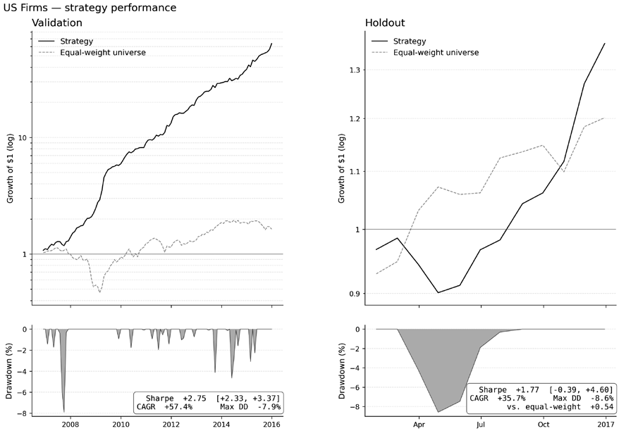

*Figure 20.1: US Firms, validation (left) and holdout (right). Top: cumulative return of the highest-validation-Sharpe strategy versus the equal-weight universe benchmark, log scale; bottom: the strategy’s drawdown, shaded*

The metrics panel reports annualized Sharpe (95% CI), CAGR, maximum drawdown, and the strategy-minus-benchmark paired-bootstrap Sharpe difference. The validation edge continues into the holdout with the Sharpe point estimate and the drawdown profile intact.

**The US Equities Panel** has the longest validation period among all case studies (16 walk-forward folds over 4,000 trading days) yet still fails out of sample (*Figure 20.2*). The 2016–2018Q1 holdout sign-flips: daily IC turns slightly negative, validation Sharpe of +2.03 [+1.46, +2.55] lands at −0.49 with a 48% drawdown, and the strategy underperforms an equal-weight US-equities benchmark that produces a Sharpe ratio of +1.82 over the same window. Both prediction quality and portfolio translation degrade, making this the chapter’s anchor for the takeaway that a strong validation Sharpe does not guarantee a holdout Sharpe.

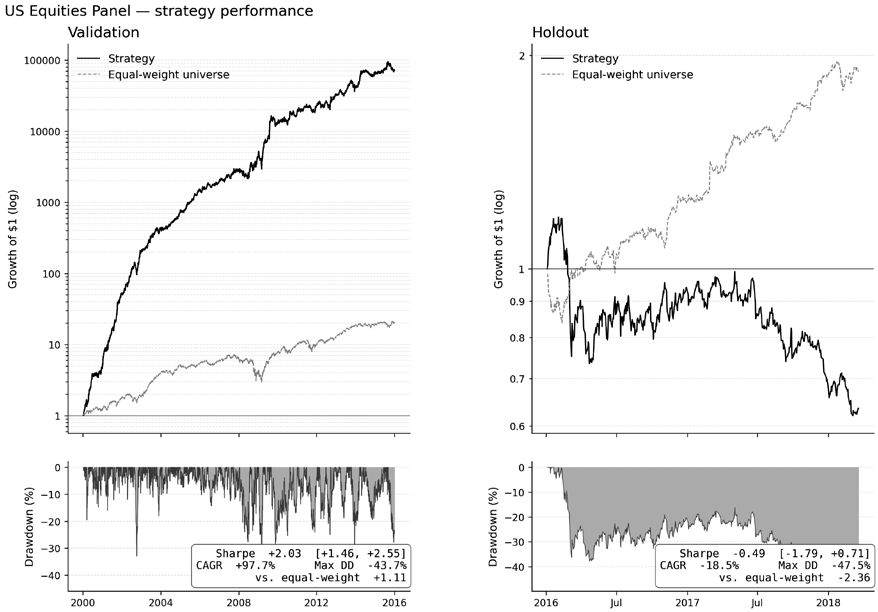

*Figure 20.2: US Equities Panel: the validation (left) cumulative return climbs steeply while the holdout curve (right) gives the gains back and the drawdown deepens to nearly half of capital: a credible validation edge that sign-flips out of sample*

**S&P 500 Equity-plus-Options** combines 633 stocks with option-implied analytics under an IPCA latent-factor model, the only credible cross-sectional signal at the risk-adjusted 5-day label (*Figure 20.3*). Validation Sharpe of +2.39 [+1.21, +3.51] carries the tightest selection-bias adjustment, but the 2021 holdout decays to −0.73 against an equal-weight benchmark Sharpe of +1.82. Confounding diagnostics (*Section 20.8*) flag the option-implied features as entangled with momentum and volatility, so the failure suggests regime sensitivity at least as much as overfitting.

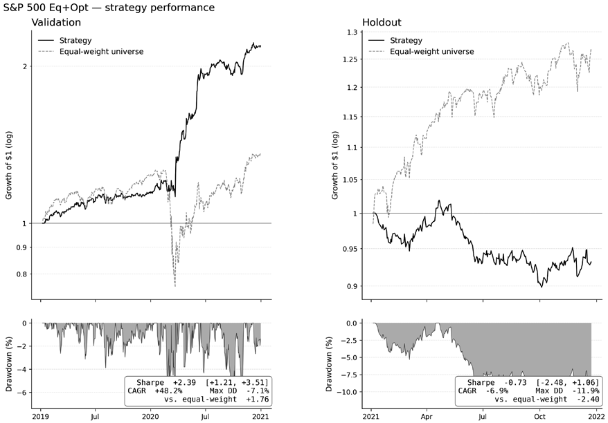

*Figure 20.3: S&P 500 Eq+Options, validation (left) and holdout (right), same layout as Figure 20.1. The 2021 holdout reverses a strong validation curve; the equal-weight benchmark outperforms the selected book over the same window*

**CME Futures** is the case where data construction shapes the result just as much as the model family (*Figure 20.4*). The 5-day label is built on a ratio-adjusted continuous series. Daily IC clears the 5% threshold on both windows, and validation Sharpe of +1.36 [+0.50, +2.14] holds at +1.11 [−0.43, +2.77] on the 2024–2025 holdout, close to validation, though the window is too short to resolve the gap.

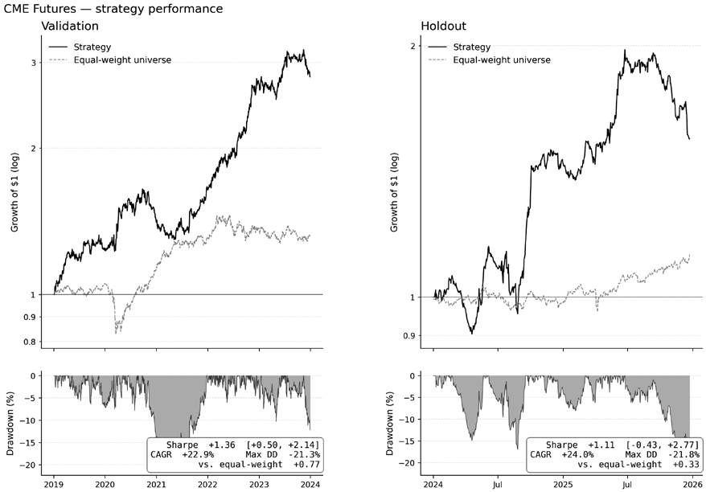

*Figure 20.4: CME Futures, validation (left) and holdout (right). The holdout cumulative return and drawdown track the validation profile; because the holdout window is short, its Sharpe ratio is wide*

**ETFs** produced the strongest per-name signal among case studies, with a validation daily IC of +0.085 [+0.051, +0.119] and a validation Sharpe of +1.36, which holds at +1.00 on the holdout and is statistically indistinguishable under a paired bootstrap (*Figure 20.5*). The strategy nonetheless trails an equalfive-factor-plus-momentum attribution returns a 6.7% annualized alpha (HAC 𝑡77) with market weight cross-asset benchmark that ran +1.33 during the 2024–2025 mega-cap rally; a Fama-French

and CMA loadings dominating, so the relative shortfall traces to residual market exposure in a regime that favored mega-cap beta.

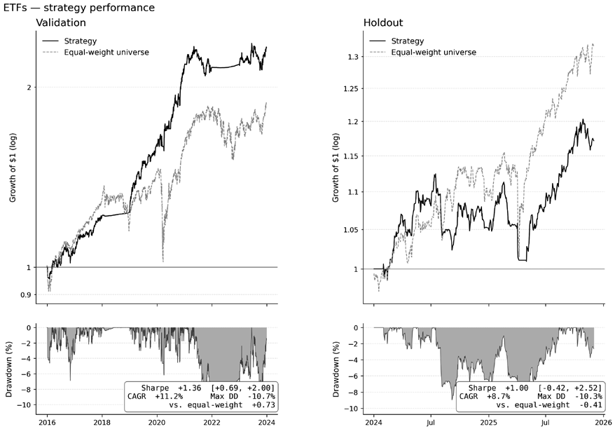

*Figure 20.5: ETFs, validation (left) and holdout (right). The validation Sharpe carries to the holdout Sharpe even as the holdout daily IC weakens; the cap-weighted benchmark still outpaces the strategy in a mega-cap regime*

**Crypto Perpetuals** ran a long-short funding-rate signal whose validation edge was real and selection-adjusted but did not transfer (*Figure 20.6*). Validation Sharpe of +2.57 [+1.06, +4.32] reverses to −0.13 with a −65% drawdown, and the holdout daily IC turns negatively significant at −0.029. The equal-weight perpetual universe also ran near zero on the 2024–2025 tape, so the strategy is not underperforming a passive baseline so much as the cross-sectional funding pattern itself decayed; regime persistence, not cost, is the binding constraint.

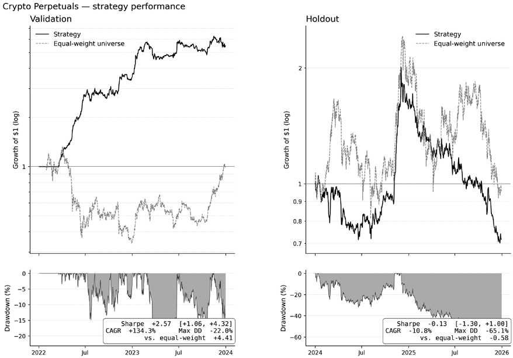

*Figure 20.6: Crypto Perpetuals, validation (left) and holdout (right). The holdout yields a steep validation gain and reaches a −65% drawdown as the funding pattern decays amid the macro regime shift*

### Case studies that show little to no edge

Three cases produced no cross-sectional edge using the first-iteration setup:

- **S&P 500 Options** runs a systematic short straddle whose daily validation IC straddles zero and whose validation Sharpe of +0.16 comes with a wide confidence interval; the 2021 holdout yields a Sharpe ratio of +0.97, but an equal-weight short-straddle benchmark ran +2.55 over the same window, so the positive holdout reflects the structural short-volatility premium surviving execution rather than model selection.
- **FX Pairs** selected a linear ridge model on the 21-day forward return, long-short on cross-sectional rank: validation daily IC is +0.012 [−0.036, +0.061] and validation Sharpe is +0.05 [−0.56, +0.73], an interval spanning zero that fails the validation gate, and no model family at any horizon clears the IC threshold (*Section 20.3*). The holdout Sharpe point estimate is +0.19 [−0.92, +1.31], but it performs worse than an equal-weighted FX benchmark, which achieves a higher Sharpe ratio in both windows.
- **NASDAQ-100 Microstructure** turns positive after a cost-feasibility screen: restricting the 114name universe to names whose measured half-spread leaves room for an intraday edge moves validation Sharpe from a full-universe collapse to +1.13 and holdout to +0.53, but both intervals cross zero, and the screened strategy trails a passive benchmark on the same screened universe across both windows.

### From validation to holdout

The cases split into five patterns:

- US Firm Characteristics, CME Futures, and ETFs hold close to validation through the holdout period: the validation Sharpe interval excludes zero, the holdout Sharpe interval stays within sampling error of the validation interval, and the selection-bias adjustment is robust at every cohort granularity.
- US Equities Panel, S&P 500 Eq+Options, Crypto Perpetuals: decay or sign-flip from a credible validation edge. Both validation Sharpe and IC exclude zero, but the holdout flips Sharpe negative, and the strategy underperforms a passive benchmark.
- S&P 500 Options strengthens on point estimate under a structural premium.
- FX Pairs never produced a resolvable validation edge and lands near zero on the holdout.
- NASDAQ-100 Microstructure reaches a marginal positive only behind a cost-feasibility screen.

*Figure 20.7* sorts the nine cases by the signed change in the Sharpe ratio from validation to holdout.

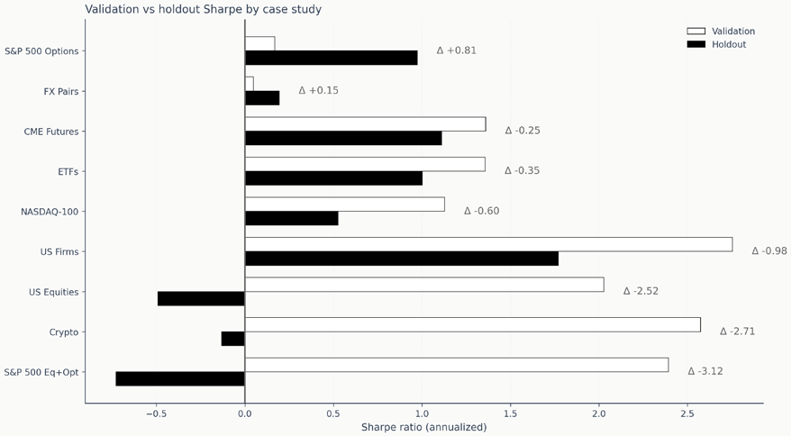

*Figure 20.7: Validation versus holdout Sharpe across the nine case studies, sorted by signed change (Δ is holdout minus validation); the validation bar is the selected configuration’s cross-stage best, matching Table 20.2. Three cases hold close to validation, three decay sharply or sign-flip, one strengthens on the holdout, one resolves near zero, and one reaches a marginal positive only after a cost-feasibility screen*

Where in the workflow a strategy loses value carries more diagnostic weight than the headline number. When a holdout drifts below validation, the change tends to take one of three forms, and most cases show a mix of them:

- Prediction-quality drift describes a signal that weakens out-of-sample, as in US Equities Panel and Crypto Perpetuals, where daily IC sign-flips alongside Sharpe; the response is to revisit features, labels, horizons, or model selection.
- Portfolio-translation drift describes prediction quality that holds while portfolio construction loses value disproportionately, as in ETFs, where holdout Sharpe holds within sampling error against a benchmark that still outpaces it; a different allocator or regime-conditional weighting recovers more value than retraining.
- Regime change describes a shift that renders the fitted relationships less informative, as in S&P 500 Equity-plus-Options on the 2021 cap-weighted tape and Crypto Perpetuals on the 2024–2025 macro tape; regime detection, shorter retraining windows, or explicitly regime-conditional models are candidate responses the standardized pipeline does not apply.

A first diagnostic pass after a disappointing holdout should determine which mechanism best fits the case rather than rerunning the same pipeline with different hyperparameters. The next sections examine why prediction quality alone does not determine strategy performance (*Section 20.3*, *Section 20.4*), how allocator and cost choices interact with the signal (*Section 20.5*, *Section 20.6*), how realistic risk overlays change the out-of-sample picture (*Section 20.7*), and what causal diagnostics add (*Section 20.8*). *Section 20.9* compiles the per-case readings into specific next steps for research.

## 20.2 Setup and feature evaluation

Before any model trains, every case study runs a false-discovery rate (FDR) controlled triage pass on its candidate feature menu following the procedure of *Chapter 8*: hypothesis-driven candidates are scored individually, the cross-section is corrected for multiplicity, and each feature is classified as PROCEED, REVISE, or STOP based on FDR significance, fold-sign stability, and monotonicity in forward returns.

Under that common triage protocol, the PROCEED rate spans roughly two orders of magnitude across the test bed. Two case studies (Crypto and US Firms) clear the FDR hurdle for roughly two-thirds of their candidate features. Six (ETFs, CME Futures, FX Pairs, S&P 500 Options, S&P 500 Eq+Opt, and NASDAQ-100) sit between 4 and 25%; one of those six produces zero FDR-significant features but still earns a handful of PROCEED decisions through fold-sign stability and monotonicity. US Equities Panel produces no FDR-significant features and no PROCEED decisions on its 73-feature menu.

| Case Study | Candidates | FDR-significant | PROCEED | % PROCEED |
| --- | --- | --- | --- | --- |
| Crypto | 45 | 32 | 32 | 71.1 |
| US Firms | 57 | 38 | 40 | 70.2 |
| ETFs | 71 | 1 | 17 | 23.9 |
| CME Futures | 69 | 6 | 13 | 18.8 |
| FX Pairs | 61 | 4 | 10 | 16.4 |
| S&P 500 options | 51 | 4 | 6 | 11.8 |
| S&P 500 Eq+Opt | 49 | 0 | 4 | 8.2 |
| NASDAQ-100 | 88 | 4 | 4 | 4.5 |
| US Equities | 73 | 0 | 0 | 0.0 |

*Table 20.3: Triage funnel by case study*

The candidate column counts hypothesis-driven features authored from domain reasoning; FDR-significant counts those that clear the Benjamini-Hochberg threshold at 5% on daily IC; PROCEED additionally requires fold-sign stability and a monotone IC profile across rank deciles.

The procedure is identical across all nine; what varies is the asset class and the underlying signal-tonoise ratio of the feature menu relative to the chosen target.

### Feature survival and strategy survival

The triage ledger is upstream of every model and backtest. To test its forecast value, we pair each case study’s PROCEED rate with the holdout Sharpe ratio of the configuration that yields the highest validation Sharpe, which emerges from the full pipeline.

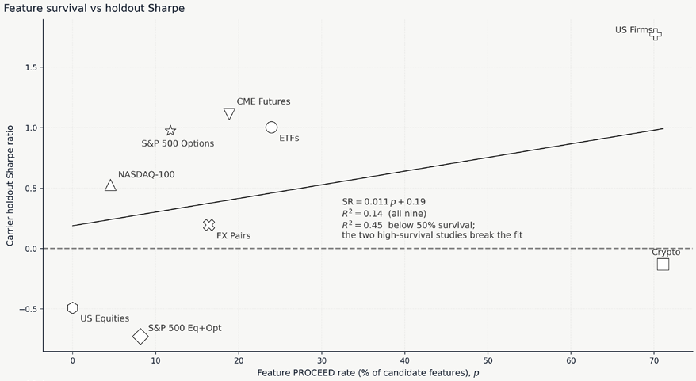

*Figure 20.8: Feature-level survival rate against the highest-validation-Sharpe configuration’s holdout Sharpe. A least-squares fit across all nine case studies is weakly positive (R-squared 0.14), tightening to 0.45 among the seven with below-50 % survival; the two high-survival case studies bracket the holdout-Sharpe range and break the fit. The case study at zero PROCEED lands in the negative-Sharpe band*

The two case studies with high PROCEED rates (above 70%) span most of the holdout-Sharpe range: US Firms at +1.77 and Crypto at −0.13. Two near-identical feature funnels produce strategy outcomes that differ by nearly two units of Sharpe. The moderate-PROCEED band (4–25%) is similarly split: CME Futures, ETFs, S&P 500 Options, and NASDAQ-100 produce positive holdout Sharpes (+1.11, +1.00, +0.97, and +0.53 on the cost-feasible universe); FX Pairs resolves flat at +0.19, below its passive benchmark; and S&P 500 Eq+Opt produces a negative −0.73. US Equities yields zero PROCEED with a holdout Sharpe of −0.49, consistent with its sign-flip diagnosis in *Section 20.1*.

Two interpretations follow. Feature-level FDR survival is a screen, not a predictor of strategy-level survival. The screen filters out features whose IC is not statistically distinguishable from zero on a given horizon and label definition, but it does not capture feature interactions, economic effect size, persistence at the rebalancing cadence, or interaction with the allocator and cost model. What matters more than the count of surviving features is the collective economic value of those features relative to per-period frictions and to how they are turned into positions. The analysis of global feature importance in the model context and of local importance for outlier trade results can yield insights for further development beyond the initial setups evaluated during this first pass. *Sections 20.3* and *20.4* take that comparison into the model evidence and the IC-to-Sharpe translation.

## 20.3 Signal quality and prediction uncertainty

The information coefficient is standard for evaluating the predictive performance of ML models, but the nine case studies show it is incomplete as a single measure of signal quality. The more complete picture comes from a small diagnostic bundle (level, stability, and selection sensitivity) that describes the signal’s shape across folds, horizons, and checkpoints.

*Table 20.4* maps the signal landscape across the test bed. No model class is uniformly best. GBM produces the highest best-in-family IC on four case studies, latent factors lead three, and deep-learning sequence models lead the remaining two. What matters more than the ranking is the dispersion across families: a family that looks like the natural default in one trading context can be mediocre in another.

| Case Study | Linear | GBM | Tabular DL | Deep Learning | Latent Factors |
| --- | --- | --- | --- | --- | --- |
| US firms | -0.004 | 0.080 | 0.031 | — | 0.062 |
| ETFs | 0.054 | 0.037 | 0.041 | 0.062 | 0.085 |
| CME Futures | 0.017 | 0.032 | 0.004 | -0.001 | 0.037 |
| US equities | 0.015 | 0.032 | 0.017 | 0.007 | 0.005 |
| Crypto | 0.009 | 0.011 | 0.003 | 0.029 | — |
| S&P 500 Options | 0.007 | 0.018 | 0.002 | 0.013 | — |
| S&P 500 Eq+Opt | -0.006 | 0.006 | 0.011 | 0.011 | 0.012 |
| FX Pairs | 0.005 | 0.002 | 0.007 | 0.011 | — |
| NASDAQ-100 | 0.005 | 0.006 | — | 0.005 | — |

*Table 20.4: Best-in-family validation daily IC by case study and model family on each case study’s primary label (max across configurations within each family; some combinations did not run)*

The row maximum refers to the case study’s primary label. It does not always coincide with the “Best Daily IC” column of *Table 20.2*, which scans across all labels and configurations: where the highest-validation-Sharpe configuration trains on a secondary label or a directional formulation (US Equities, S&P 500 Eq+Opt), the *Table 20.2* figure exceeds the primary-label maximum here. US Firms peaks at GBM +0.080, ETFs at latent factors +0.085 with deep learning +0.062 and linear +0.053 trailing, CME Futures at latent factors +0.037 with GBM +0.032 close behind, and the primary-label ceiling sits near +0.085.

### The noisy link from model to strategy performance

Across the test bed, IC and realized Sharpe are weakly but positively related: the per-variant correlation is 0.34, so IC explains only about an eighth of the cross-variant variation in Sharpe and predicts it noisily. In ETFs, the latent-factor SDF specifications lead the daily IC field at +0.085, while the highest-signal-stage Sharpe lies with an LSTM configuration at +0.89, whose daily IC is only +0.052; IC leader and signal-Sharpe leader are distinct configurations within the same case study’s top cluster. S&P 500 Eq+Opt shows the disconnect from the other direction: small per-family daily ICs (none above +0.014) combine with a validation Sharpe of +2.39 that decays sharply to a holdout Sharpe of −0.73 whose strategy-versus-EW confidence interval [−4.17, −0.75] excludes zero on the negative side. NASDAQ-100 has the weakest daily IC in the test bed (around +0.005); on the full 114-name universe, its signal-stage Sharpe is deeply negative, and only after screening to the cost-feasible names does the configuration reach a marginal +1.13, which says that breadth alone cannot compensate for a per-bar edge smaller than execution friction unless the tail is screened out first.

With nine heterogeneous observations, these are small-sample patterns, but they are consistent enough to carry a practical lesson: IC measures average prediction quality across the cross-section, while Sharpe measures risk-adjusted portfolio return after construction, costs, and signal timing interact. The gap between the two is mediated by cadence, breadth, allocator choice, and cost structure, taken up in *Section 20.4*.

Best-family daily IC tops out near +0.085 across the entire test bed. No model, label, or feature set in the nine studies pushes past that ceiling. The pattern is consistent with the academic consensus that predicting financial returns is a low-signal-to-noise problem (Gu, Kelly, and Xiu, 2020). Trying to tune a single model past this level is unlikely to yield meaningful gains; the path to better strategies runs through breadth, ensembles, and portfolio construction.

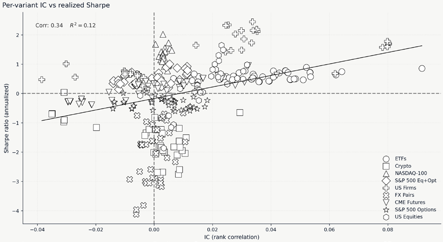

*Figure 20.9: Per-variant IC versus validation-stage Sharpe across all case studies, with the leastsquares trend*

The positive association is weak (correlation of 0.34): the conversion from signal to strategy is noisy and pipeline-dependent, as shown in *Figure 20.9*.

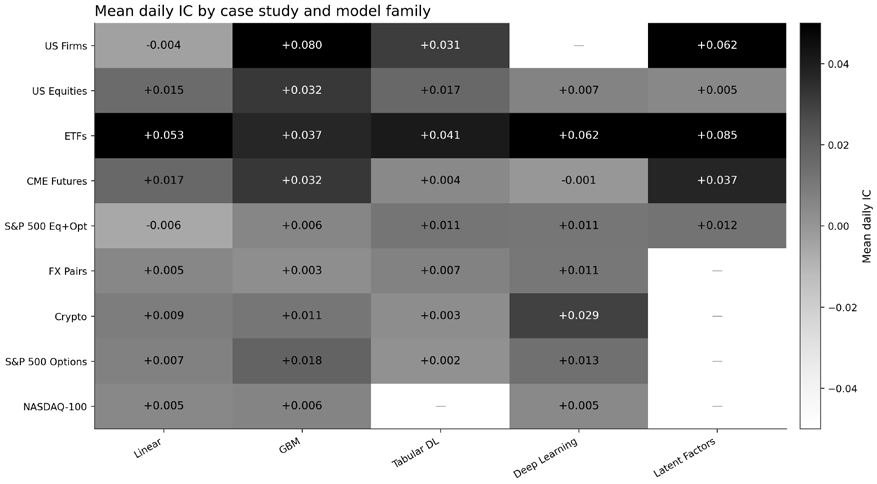

*Figure 20.10: Mean daily cross-sectional information coefficient by case study and model family*

GBM and latent factors carry positive IC across the broadest subset of case studies; linear models are competitive only where the cross-sectional signal is approximately linear, and deep learning performs best on Crypto and FX. Empty cells mark family-case combinations not run.

### Stability metrics – A diagnostic bundle

No single stability metric works across all settings because fold counts range from 2 (NASDAQ-100, S&P 500 Eq+Opt, Crypto, S&P 500 Options) to 16 (US Equities). Three complementary measures read best together.

The information ratio across folds (ICIR, mean IC over its cross-fold standard deviation) captures consistency: the highest-validation-Sharpe US firm characteristics configuration reports an ICIR near 2.1 across 10 folds, while a heavily regularized ETFs ridge achieves around 1.3 across 8. Positive-fold share is more intuitive: a configuration negative on a meaningful fraction of folds raises regime-dependence questions even when its daily IC is respectable. Checkpoint sensitivity captures a risk specific to iteratively trained models: the same architecture trained on the same data can yield substantially different Sharpe depending on which training epoch (deep-learning and latent-factor families) or boosting iteration (GBM) is selected. The bundle of level (IC), stability (ICIR or positive-fold share), and selection sensitivity (per-iteration Sharpe trajectory) is the unit of signal quality; no single number captures all three.

Stability also has a time dimension that fold summaries flatten. *Figure 20.11* traces the CME Futures strategy’s rolling 12-month Sharpe ratio and daily IC together across the validation and holdout windows, with both lookbacks set to a year so that each tracks its annualized full-period average on the same footing. The two series move in step, and the edge is distributed across the window rather than concentrated in a few months, painting a picture behind a validation Sharpe that holds into the holdout rather than a strong average resting on one regime. The rolling edge is weakest in the year after the March 2020 COVID dislocation, where it dips below zero, and runs strongest through the March 2022 rate-hike cycle, both marked on the axis, but it sits above its annual average for most of the window.

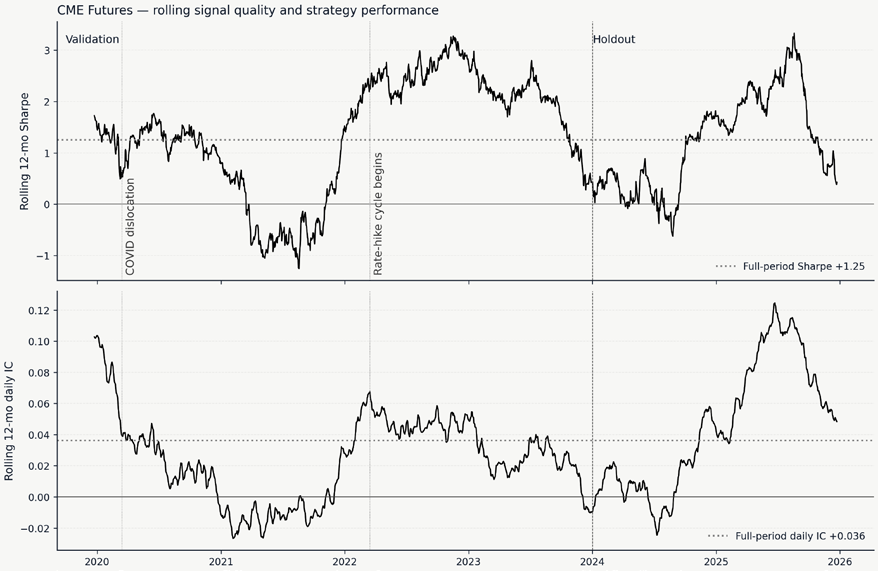

*Figure 20.11: Rolling twelve-month annualized Sharpe (top) and rolling twelve-month daily cross-sectional IC (bottom) for the CME Futures strategy*

Finally, the empirical finding from per-iteration trajectories is that no single iteration count is optimal across case studies. Some GBM trajectories peak early and plateau (well before the default cap), while others continue improving even after the budget runs out, and a third group degrades after an early peak as training continues. This dispersion is structural rather than noise: cost regime, signal cadence, and label horizon each shape where the validation Sharpe ratio peaks. Checkpoint selection is therefore a per-case-study research decision, not a hyperparameter that generalizes across asset classes. Two production-grade alternatives are available: an ensemble across the top-three checkpoints, with validation Sharpe damping the per-iteration noise that several trajectories show even within their best region; a nested cross-validation over the iteration grid is methodologically cleaner but computationally costly. Either step belongs in the next iteration under the *Chapter 6* workflow.

### Uncertainty around the best-performing configuration

The validation Sharpe ratio is a single number computed from the validation return series. Its uncertainty arises from a **stationary block bootstrap** on daily returns and from the analytic **probabilistic Sharpe ratio** (PSR); the ranking among configurations is therefore best interpreted against the bootstrap confidence interval for the difference between any two configurations rather than against the point estimates alone. For case studies where the top cluster lies inside that uncertainty band, the highest-validation-Sharpe configuration and its closest competitor are statistically indistinguishable; elsewhere, the highest-validation-Sharpe configuration is genuinely separated from the rest of the field.

The pattern across the case studies reflects this:

- US Firms places its highest- and tenth-validation-Sharpe configurations only 0.04 Sharpe apart, well inside the bootstrap envelope. Hence, the best-validation configuration is a member of a small top cluster rather than statistically separated from the field.
- ETFs are similarly tight: ten configurations spanning all five model families fit within a 0.08 Sharpe band.
- CME Futures shows a wider top-to-tenth spread of 0.39, but that is roughly its fold-Sharpe standard error, so its highest-validation-Sharpe GBM specification is not cleanly separated from its field either.
- NASDAQ-100’s cost-feasible cohort is wide for a different reason: its slot configurations span roughly +0.2 to +1.4 validation Sharpe, and the field maximum is a linear five-slot configuration at +2.11 sitting far above that band. That maximum does not survive the holdout. Out-of-sample, the same configuration drops to a holdout Sharpe ratio of −0.21. The demonstrated collapse, not its distance from the rest of the cohort, is what disqualifies it: its high validation Sharpe reflects a single configuration that fit the validation window rather than a separated leader. The gradient-boosted ensemble at +1.13 is deployed instead because it yields positive out-ofsample (holdout) Sharpe +0.53, whereas the individual configurations do not.

The cluster diagnostic is descriptive, not a basis for selection: where the top cluster contains numerous candidates, the highest-validation-Sharpe configuration is one realization of a near-tied set, and the ensembling discussion of *Section 20.4* trades a small amount of peak Sharpe for a measurable reduction in dispersion under exactly those conditions.

### Label choice as a first-order decision

Label engineering often yields a higher return on research effort than model architecture work. Three patterns recur across the test bed:

- On classification versus regression, the continuous return label is the more dependable choice. Every case study that reached a deployable signal ran on it, and where both label types were tried, it produced the higher portfolio Sharpe ratio. US firm characteristics is the instructive exception: its direction label produces a markedly higher daily IC across the sweep, but that edge reverses under portfolio construction, where the continuous label still posts the higher Sharpe. The choice interacts with the allocator because classification signals translate into portfolio weights differently than continuous scores do.
- On horizon scaling, FX GBM daily IC improves materially from the 1-day to the 21-day horizon, and ETFs improves modestly at the longer horizon; longer horizons also reduce turnover, which reduces cost drag, making horizon a first-order design decision rather than a preprocessing detail.
- On winsorization, heavy-tailed return distributions distort the rank-return relationship IC measures: in US firm characteristics, winsorizing the monthly return label at the 1st and 99th percentiles produces substantially larger daily IC than the unwinsorized label across a hyperparameter sweep.

The general point holds across case studies: label preprocessing is consequential, and within-family IC differences driven by label choice can match or exceed the differences between model architectures on the same label.

*Section 20.9* returns to these levers as part of the deliberate-constraints inventory. The narrower point here is that optimizing model architecture while treating the label as fixed misallocates research effort. A GBM on a well-engineered label can produce stronger daily IC and stronger fold consistency than a more complex model on raw forward returns.

## 20.4 From signals to strategies

With IC treated as one diagnostic among several, the practical question becomes how to convert whatever predictive content remains into portfolio-level performance, and which model families the organizing framework: 𝐼≈𝐼ܥ× √ܤ𝐼, where 𝐵 is the number of independent bets per period translate consistently across the full pipeline. The Fundamental Law of Active Management gives

(Grinold and Kahn, 2000). The nine case studies ground that formula empirically and show where the translation gains or loses value.

### The fundamental law, empirically

Breadth is proxied by the product of rebalancing frequency, universe size, and portfolio concentration (top-K), recognizing that correlation within the universe reduces effective breadth below the nominal count, particularly for the NASDAQ-100, where 114 stocks move largely as a single market. The proxy is directional rather than calibrated, and the figure reads as a heuristic lens rather than a formal validation of the law.

With only nine heterogeneous observations, IC alone already tracks holdout Sharpe moderately (correlation 0.61), while scaling by the crude breadth proxy degrades that link toward zero rather than tightening it: the case studies differ too much in cost structure, regime exposure, and portfolio design for the simple proxy to add value.

The Fundamental Law nonetheless helps interpret individual case studies:

- US firm characteristics pair a high best-in-family daily IC (+0.080, GBM) with moderate breadth at a monthly cadence, and the retrained highest-validation-Sharpe configuration performs robustly at a holdout Sharpe of +1.77.
- NASDAQ-100 has the weakest best-in-family IC (around +0.006) paired with very high nominal breadth at a 15-minute cadence; on the full universe, breadth fails to compensate for execution friction, and the signal-stage Sharpe is deeply negative, and only after screening to the cost-feasible names does the selected configuration reach a marginal validation Sharpe of +1.13 that stays at +0.53 on the holdout.
- FX Pairs has a modest deep-learning best-in-family IC (+0.011) and a 20-pair universe that sharply caps breadth; its highest-validation-Sharpe configuration is a linear ridge model whose validation Sharpe of +0.05 carries a CI that crosses zero and whose holdout Sharpe of +0.19 sits below its equal-weight benchmark. Breadth contributes only when execution friction does not offset it first.

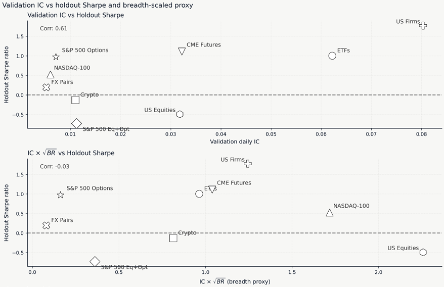

*Figure 20.12: Fundamental Law diagnostic. Left: IC alone versus holdout Sharpe. Right: IC adjusted for breadth (rebalance frequency × top-K). All nine case studies are shown; NASDAQ-100’s raw breadth is the largest, but its small IC places it mid-cluster on the breadth-scaled axis, so it does not distort the scale*

### Cadence and effective breadth

Aggregating across the test bed by rebalancing cadence shows the same pattern at scale. The monthly strategy (US firm characteristics) has the largest signal-stage Sharpe at +2.75. Daily-cadence strategies span a wide range: US Equities +1.87, S&P 500 Eq+Opt +1.25, CME Futures +0.96, ETFs +0.89, S&P 500 Options +0.16, and FX Pairs slightly negative at −0.09. The 8-hourly Crypto signal is +2.09 at the signal stage but decays to −0.13 on holdout; the 15-minute NASDAQ-100 configuration reaches +1.13, but only in the cost-feasible universe; the same signal on the full 114-name universe is deeply negative. The NASDAQ-100 result makes the breadth mechanism explicit: nominal breadth is the highest in the test bed, yet per-bar friction overwhelms the edge until the universe is screened down to the most-liquid names with the lowest spread. Whether the screened configuration extends to coarser cadences is an open question for a second iteration. Cadence interacts with costs in both directions: higher frequency multiplies breadth but also multiplies turnover. The optimal cadence is the point at which the marginal Sharpe contribution from an number of top-ranked names the portfolio retains, adds a further dimension. Sweeping the top-𝐾 additional rebalancing period equals the marginal cost of the trade that realizes it. Selectivity, the

substantive positive signal tend to produce higher median Sharpe at broader 𝐾, while studies with parameter from tight (top-5) to broad (top-50) shows a case-study-specific response: studies with weak or negative underlying signal show no systematic Sharpe response to 𝐾. The appropriate 𝐾 is

a function of signal strength and universe breadth, not a hyperparameter with a universal optimum.

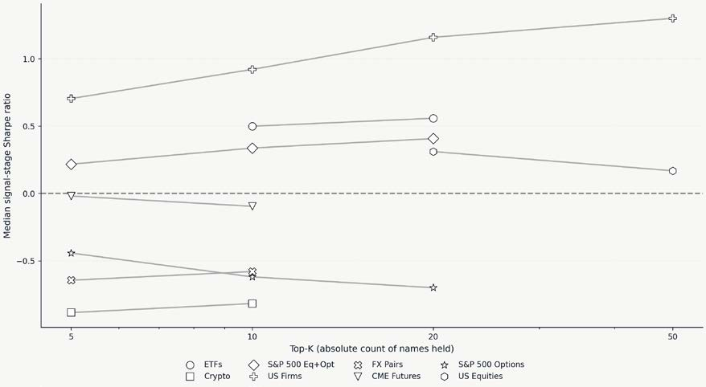

*Figure 20.13: Median signal-stage Sharpe as top-K grows, per case study. The NASDAQ-100 is omitted: equal-weight top-K is not its selected method (a slot-persistence rule is), and those alternative configurations score roughly −10 to −22, far below this scale*

### Win rate and payoff asymmetry

Win rates (the fraction of rebalancing periods in which the strategy produces a positive return) cluster near half for the intraday and daily strategies, from just under half in FX Pairs and Crypto Perpetuals through the low-to-mid fifties for most case studies, and rise to roughly 81 for US firm characteristics. The gap is largely mechanical: a monthly cadence produces many fewer evaluation periods than an intraday one, and the monthly aggregate averages over the individual losing days that would otherwise lower a higher-frequency win rate. It is also partly a function of payoff shape: the high-frequency strategies (FX Pairs and Crypto Perpetuals near 48, NASDAQ-100 near 52) sit close to half their periods and depend on the size of winning periods relative to losing ones, while US firm characteristics produce positive returns in most months with moderate per-period gains. The distinction matters for risk management. A strategy with a low win rate requires appropriate position sizing and a long evaluation horizon to weather the arithmetically inevitable losing streaks, while a high-win-rate monthly strategy faces a different risk: a single bad month can erase several good ones if position sizing ignores tail risk.

### Family rankings shift across the pipeline

At the IC stage, the family producing the highest mean daily IC varies across case studies: GBM in four (US firms, US equities, S&P 500 options, NASDAQ-100); deep-learning specifications in three (Crypto, FX pairs, ETFs); and tabular DL and latent factors taking the highest mean IC in one apiece (S&P 500 Eq+Opt and CME futures, respectively). After predictions pass through portfolio construction, cost filtering, and risk overlays, GBM produces the highest allocation-stage Sharpe in four of the nine case studies, including two in which a different family had the highest IC. The mechanism is consistent with lower prediction variance and fewer selection risks. GBM has no training checkpoints to select, no architecture decisions that yield a wide IC range within the same configuration, and lower regime-specific sensitivity. These properties matter little on a single validation fold but compound across a multi-stage pipeline.

| Case Study | Linear | GBM | Tabular DL | Deep Learning | Latent Factors |
| --- | --- | --- | --- | --- | --- |
| US firms | -0.004 | 0.080 | 0.031 | — | 0.062 |
| ETFs | 0.054 | 0.037 | 0.041 | 0.062 | 0.085 |
| CME Futures | 0.017 | 0.032 | 0.004 | -0.001 | 0.037 |
| US equities | 0.015 | 0.032 | 0.017 | 0.007 | 0.005 |
| Crypto | 0.009 | 0.011 | 0.003 | 0.029 | — |
| S&P 500 Options | 0.007 | 0.018 | 0.002 | 0.013 | — |
| S&P 500 Eq+Opt | -0.006 | 0.006 | 0.011 | 0.011 | 0.012 |
| FX Pairs | 0.005 | 0.002 | 0.007 | 0.011 | — |
| NASDAQ-100 | 0.005 | 0.006 | — | 0.005 | — |

*Table 20.5: Model family cascade*

The highest-IC family differs from the highest-Sharpe downstream family in seven of nine case studies: the choices that maximize signal quality and those that maximize post-construction Sharpe diverge in most of the tested settings. The “Best IC” column is the family’s primary-label daily IC averaged across all in-family configurations, which sits 0.002–0.033 below the per-family maximum of *Table 20.4*; the broader scope shifts the family ranking for ETFs and S&P 500 Eq+Opt.

### Ensembling the top clusters

When several configurations are statistically indistinguishable (their validation Sharpe confidence intervals overlap, and the paired bootstrap on the daily return difference straddles zero), averaging their predictions is the natural response. For each case study, the three highest-validation-Sharpe training runs are z-scored cross-sectionally at each timestamp and averaged into an ensemble score, which then feeds the highest-Sharpe configuration’s strategy specification at the same top-K, cadence, and cost regime. Two patterns emerge:

1. Ensembling does not raise peak Sharpe; it trades a small amount of it for a measurable reduction in dispersion when configurations are genuinely close.
2. The benefit concentrates where the top cluster is tight relative to Sharpe standard error.

CME Futures and S&P 500 Options, with top-to-tenth Sharpe spreads roughly equal to the fold-Sharpe standard error, see little benefit from ensembling; the case studies whose top cluster falls within the bootstrap noise band (US Firms, ETFs, US Equities, FX pairs) stabilize without sacrificing much of their peak performance.

NASDAQ-100 is the case where the stability trade performs best: the highest-validation configuration, a linear five-slot at +2.11, collapses to a holdout Sharpe of −0.21, and a broad holdout sweep across the model panel finds individual configurations mostly negative out of sample (linear median −0.31, gradient-boosted median −0.42), so no single model generalizes. The 12-model gradient-boosted ensemble at +1.13 validation is deployed because it outperforms the holdout by +0.53, whereas the individual configurations do not.

Ensembling is a stability tool, not a universal Sharpe booster, and the cluster diagnostic of *Section 20.3* identifies the case studies where it pays off.

### When deep learning helps

Deep learning is not uniformly superior: it plays a distinctive role when the signal lies in temporal structure or nonlinear interactions that trees cannot capture. CME futures provides a partial nonlinearity diagnostic. On the primary 5-day forward return, linear models top out at a best-in-family daily IC of +0.017, tabular deep learning reaches +0.004, GBM reaches +0.032, deep learning is essentially zero (−0.001), and latent factors take the highest case-study IC at +0.037 (SDF). The flat-to-negative deep-learning result on the primary horizon undercuts a clean nonlinearity gradient: the signal that exists is captured by GBM and latent factors, not by sequence models. GBM nonetheless produces the highest signal-stage Sharpe through stable portfolio translation, which fits the chapter’s broader pattern. When a linear IC is compared with a GBM IC in the same case study, the signal is approximately linear, and additional model complexity is unlikely to help.

Crypto perpetuals cautions against reading family rankings too confidently on thin evidence. Best-in-family deep-learning IC of +0.029 exceeds GBM’s +0.011, but both are small in absolute terms, and the training set spans only two cross-validation folds. Minor perturbations to the feature set or the training window can reshape the family ranking under that kind of evidence base. Family rankings are sensitive to upstream data and feature choices and should not be locked in after a single iteration.

A coverage caveat on the family-ranking claim is warranted: deep learning was not trained for US firm characteristics (the case study with the tightest fold-level dispersion), and coverage was reduced for some other studies due to computational cost. GBM’s downstream-ranking advantage is real, but partly because GBM was tested more than deep learning. The practical default is to start with GBM across all settings and invest in deep learning only when there is positive evidence of structural nonlinearity, either from the linear-versus-GBM IC gap or from the temporal structure of the trading problem.

### Complementary Roles

SDF achieves the highest daily IC at the primary horizon (+0.085, 𝑡ு஺஼= 4.89) and carries through to the Latent-factor models and linear models play complementary diagnostic roles. On ETFs, the latent-factor

selected cross-stage strategy after allocation and risk overlay (validation Sharpe +1.36); the deep-learning LSTM has the highest signal-stage Sharpe (+0.89) but ranks below the latent factors on daily IC. For US equities, GBM at the 21-day horizon has the highest daily IC, and IPCA contributes a complementary latent-factor signal at the same horizon that a second iteration could test in a label-compatible ensemble. Whether latent factors are better read as signal generators or as portfolio-construction inputs is a question these experiments leave open: the ETFs result places SDF in the signal-generator role at the primary horizon, while the residual ensemble value of SAE and ridge configurations in the same top cluster on daily IC keeps the portfolio-construction reading on the table.

Linear models play a different role: a positive linear daily IC confirms a first-order linear structure in the feature space, and their smoother predictions generate lower median validation-stage turnover than GBM in five of eight measurable case studies (Crypto, S&P 500 Eq+Opt, FX pairs, CME futures, and US equities, by 28 to 55), with ETFs and US Firms tied within a few percent and NASDAQ-100 the lone counter-example. Where the linear IC is competitive with the tree-based ranking, linear is a cost-efficient alternative.

Even the model families most consistent across the pipeline still face hard market constraints: spreads, turnover, allocator-signal interplay, and capacity limits. *Section 20.5* covers the allocator layer in detail; *Section 20.6* covers costs.

## 20.5 Portfolio allocation across the case studies

| Case Study | Signal | Best Allocator | Best SR | Worst Allocator | Worst SR | Spread |
| --- | --- | --- | --- | --- | --- | --- |
| US firms | GBM | equal weight | +2.75 | score weight | +2.51 | 0.25 |
| Crypto | GBM | RP | +2.57 | SW | +1.88 | 0.69 |
| US Equities | GBM | SW | +2.02 | HRP | +1.49 | 0.53 |
| S&P 500 Eq+Opt | Latent factors | equal weight | +1.25 | MVO | +0.73 | 0.52 |
| CME Futures | GBM | inverse vol | +1.19 | SW | +0.63 | 0.56 |
| ETFs | Latent factors | HRP | +1.12 | SW | +0.68 | 0.44 |
*Table 20.6: Per-case-study best and worst allocator with the highest-validation-Sharpe signal held fixed, on validation*

Spread is the within-signal envelope, taken as the maximum across rebalance and top-K variants. NASDAQ-100 carries no allocation-stage entry: its strategy is a signal-stage slot rule on the cost-feasible universe (the slot mechanism is the sizing rule), and the allocation sweep ran on the full universe, not on the selected configuration.

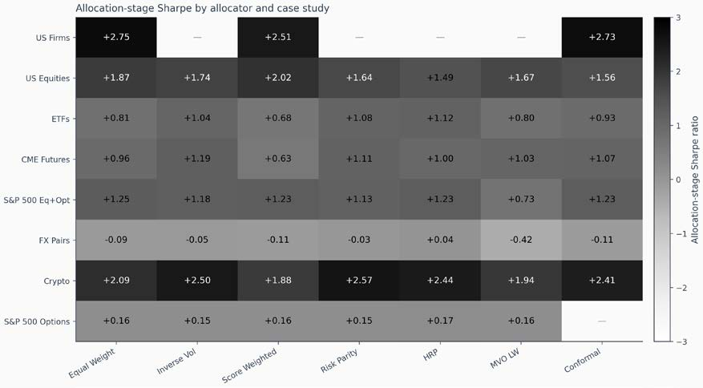

*Figure 20.14: Allocation-stage Sharpe across case studies (rows) and allocators (columns), all on the highest-validation-Sharpe signal configuration*

*Figure 20.14* shows risk-parity and inverse-volatility methods achieve the highest Sharpe on vol-heterogeneous universes (Crypto, ETFs, CME Futures); score weighting achieves the highest Sharpe where prediction magnitudes carry information (US Equities); equal weight achieves the highest Sharpe on S&P 500 Eq+Opt where the signal broadcasts thinly across the universe, and on US Firms, whose returns-only monthly panel has no per-symbol price series: the four moment allocators are undefined there and appear as blank cells; hierarchical risk parity achieves the highest Sharpe on FX Pairs, on a signal that barely clears the noise floor. FX is bounded just above zero. No allocator rescues a failing signal. NASDAQ-100 carries no allocation-stage entry: its strategy is a signal-stage slot rule and the allocation sweep ran on the full universe, not on the selected configuration.

### How much the allocator moves the result

The within-signal spreads vary substantially. The median is 0.49 Sharpe, roughly an order of magnitude smaller than the cross-signal range of *Section 20.4*. The widest are Crypto (0.69) and CME Futures (0.56), vol-heterogeneous universes where a covariance- or volatility-aware allocator has the most room to differentiate names. The tightest is S&P 500 Options at 0.02, where the leading allocators cluster near +0.16 because the liquid-universe filter leaves few names to differentiate. FX Pairs shows a moderate 0.46 spread on a structurally weak signal (signal-stage Sharpe −0.09): the allocator controls how fast a flat signal bleeds (best HRP +0.04 against worst MVO −0.42), not whether it has an edge.

The results confirm *Section 17.7* on a smaller within-chapter comparison: allocator choice changes risk shape, turnover, and the marginal Sharpe contribution, but rarely by margins that approach the variation produced by signal choice or by the cost-aware accounting of *Section 20.6*. The allocator is a second-order lever once the signal is fixed.

### Which allocator leads, and why

The allocator that achieves the highest Sharpe is not constant across the test bed, but the pattern is structural:

- Risk parity achieves the highest Sharpe ratio on Crypto, and its hierarchical variant achieves the highest Sharpe ratio on ETFs: vol-heterogeneous universes with sufficient cross-sectional correlation appear to favor equal risk contribution over a full covariance inversion. US Firms is a special case: its returns-only monthly panel provides no per-symbol price series, so the four moment-based allocators are undefined and excluded, and among the lookback-free allocators, equal-weight edges score-based weights by 0.25 Sharpe.
- Inverse-volatility achieves the highest Sharpe ratio on CME Futures, where cross-sectional volatility heterogeneity across sectors (bonds, energy, grains) rewards a per-symbol volatility scaler that captures the relevant differences without inverting a noisy covariance matrix.
- Score-weighted achieves the highest Sharpe on US Equities, whose prediction distribution is heavy-tailed enough that magnitude carries information beyond rank. Equal weight achieves the highest Sharpe ratio on S&P 500 Eq+Opt, where the signal is broadcast thinly across the universe and signal noise dominates the weighting decision, so the lowest-assumption allocator does best.
- Hierarchical risk parity achieves the highest Sharpe on FX Pairs by clustering correlated pairs in the 20-name universe before allocating; on a configuration whose signal-stage Sharpe is −0.09, this lifts the allocation stage to roughly +0.04, and the *Section 20.7* time-exit overlay nudges the managed Sharpe to +0.05. The allocator de-risks a flat signal rather than amplifying an edge.
- Mean-variance optimization with Ledoit-Wolf shrinkage never strictly exceeds the highest-Sharpe allocator on any case study (it comes within a rounding margin of the lead only at S&P 500 Options’ +0.16 noise floor) and posts the lowest Sharpe on S&P 500 Eq+Opt and FX Pairs.

The best-allocator pattern, therefore, tracks a structural property of the universe (size, correlation density, signal heaviness) more than a property of the allocator family, consistent with the portfolio-construction literature and with *Section 17.6*: matrix-inversion methods suffer when covariance estimates are noisy; risk-parity-flavored methods achieve the highest Sharpe when the relevant signal is risk; score weighting achieves the highest Sharpe when magnitudes carry information.

Allocator selection is a defensible second-order optimization once the signal and the cost regime are fixed. The within-signal spread on positive signals suggests roughly 0.02 to 0.69 Sharpe of available headroom: real but bounded, and wider on the vol-heterogeneous universes (CME Futures, Crypto) than on the more uniform ones. No allocator rescues a failing signal: on FX Pairs (signal-stage Sharpe −0.09), the best within-signal allocator reaches only +0.04 and the worst falls to −0.42; the allocator controls the rate of loss, not the sign of the edge. The *Section 20.6* cost-survival analysis carries the allocator-signal pairs into dollar accounting, where the picture sometimes reverses again.

## 20.6 Trading realism – Costs, capacity, and execution

Costs are a design input that shapes universe selection, rebalancing cadence, and position sizing long before a backtest is run. Frazzini, Israel, and Moskowitz (2018) and Novy-Marx and Velikov (2016) document how quickly an apparent edge erodes once realistic frictions are applied, particularly as turnover and participation rise.

The breakeven costs implied by the backtests span a wide range:

- ETFs, US firms, and US equities retain positive Sharpe at the 50-basis-point sweep ceiling, so their breakeven lies above the grid rather than at any specific value within it.
- CME futures and S&P 500 Eq+Opt break even near 30 basis points per leg and crypto perpetuals near 15, all above their assumed schedules.
- FX pairs have a thin breakeven of roughly 7 basis points per leg, only a few basis points above the assumed spread on cross-currency pairs.
- NASDAQ-100 microstructure illustrates a cost decision made by universe selection rather than a basis-point breakeven: on the full 114-name universe, the signal trades at a negative gross Sharpe (−0.78 before any cost is applied), while screening to the cost-feasible names (those whose measured half-spread leaves room for the intraday edge) produces the positive result of *Section 20.1*.
- S&P 500 options require a cost model that scales with the premium rather than the notional, as addressed below.

| Case Study | Assumed Per-Leg Cost | Breakeven (bps) | Interpretation |
| --- | --- | --- | --- |
| ETFs | per-share + half-spread | 50+ | Wide margin |
| Crypto Perpetuals | 3–4 bps (taker/maker) | 15 | Positive margin |
| NASDAQ-100 | per-share + measured spread | ~10 | On cost-feasible names; breakeven on bps companion grid |
| S&P 500 Eq+Opt | 6.5 bps | 30 | Positive margin |
| US firms | 12.5 bps | 50+ | Wide margin |
| FX Pairs | 1–8 bps (pair-tier) | 7 | Thin margin |
| CME Futures | ≈10 bps (tick implied) | 30 | Positive margin |
| S&P 500 options | premium-scaled | n/a | See HTM analysis below |
| US equities | 12.5 bps | 50+ | Wide margin |

*Table 20.7: Breakeven-cost scorecard*

Breakeven is the highest per-leg basis-point cost at which the highest-validation-Sharpe configuration retains positive Sharpe; the sweep grid runs from 0 to 50 basis points, so “50+” denotes a strategy whose breakeven exceeds the sweep ceiling. NASDAQ-100’s strategy lives on the cost-feasible names (the universe screen sets which names are tradable) and on the bps companion grid that configuration breaks even near 10 basis points per leg, a thin but real cushion (on the full universe the signal is already negative at zero cost). ETFs and NASDAQ-100 use per-share commission plus a half-spread instead of a flat basis-point assumption; the table reports their breakeven against the bps companion grid run alongside the primary cost regime.

### The cost survival landscape

Each breakeven number, which indicates the cost level at which the strategy stops making money, must be interpreted in light of the strategy’s structural cost exposure. The stricter bar is the benchmark Sharpe ratios of *Section 20.1*, which several configurations fail to clear on the holdout even when they survive the cost grid on validation. Furthermore, constructing a clean benchmark is itself difficult outside the index-linked case studies, where an equal-weight buy-and-hold is the natural comparison.

Among the monthly and daily equity strategies, ETFs (monthly), S&P 500 Eq+Opt (monthly), and US equities panel (daily) all retain positive Sharpe ratios well into the basis-point grid: ETFs and US equities to the 50 bps ceiling, and S&P 500 Eq+Opt to roughly 30 bps. The cushion at the 6.5 to 12.5 basis-point per-leg assumption used in the signal stage is generous on average, but the cost reality varies substantially across symbols: daily and monthly equity universes mix liquid large-caps with illiquid small-caps, and the mean bps understates the friction the illiquid tail of the portfolio actually faces. US firm characteristics carry the largest validation Sharpe in the test bed (signal-stage validation +2.75, retrained holdout +1.77) and survive the basis-point sweep to its 50 bps ceiling with net Sharpe still above +2.2, but the binding constraint is universe liquidity rather than per-leg cost: the long leg concentrates in bottom-quartile market-capitalization names where spreads commonly run 100 to 500 basis points, well outside the grid. Among derivatives strategies, CME futures retains positive Sharpe to roughly 30 basis points per leg, three times the tick-implied cost; the highest-validation-Sharpe inverse-volatility configuration holds a net Sharpe near +0.5 at 30 bps but turns slightly negative by 50. The strategy passes the cost gate with room to spare on a flat-bps reading, though product-level liquidity and roll costs are second-iteration questions the bps grid does not resolve. Crypto perpetuals break even near 15 basis points per leg with gross Sharpe above +3.5, well above the 3-to-4-basis-point taker/maker schedule on Binance; net Sharpe falls from +3.3 at 1 bp to +0.66 at 15 bps and turns negative by 20, so any deterioration in fee tier or rebate access reverses the conclusion quickly. The 8-hourly cadence raises a critical question about capacity and potential market impact.

The remaining three case studies fail or require an instrument-specific cost model:

- FX pairs break even at roughly 7 basis points per leg, within the 1-to-8-basis-point per-leg spread implied by the major-versus-cross pair tiers. The 20-pair universe with daily rebalancing and the configuration with the highest validation Sharpe produce a tight margin in which execution quality, not model choice, governs viability.
- For the full universe, the NASDAQ-100 microstructure starts with a negative gross Sharpe ratio, so a full-universe basis-point breakeven does not exist. Arguably, the cost-sensitive 15-minute cadence makes the blunt bps framing the wrong instrument in the first place: a per-share fixed commission of a fixed fraction of a cent (modeled on Interactive Brokers fees) is a more precise model for intraday execution (for a second iteration). Regardless, the cost-feasibility screen in *Section 20.1* leads to a positive result for the strategy. The liquidity-screened universe comes with a measurable cushion: on the bps grid, it stays positive by roughly 10 basis points per leg, with a net Sharpe ratio of +0.29, and then turns negative by 15.
- S&P 500 options highlights that the cost model must fit the instrument. Option transaction costs scale with the premium, not with the notional, so a basis-point sweep against the notional measures the wrong quantity. Under daily mark-to-market hold-to-expiry accounting on the full universe, the strategy fails the cost gate; *Section 18.8* presents the three-rung cost-mitigation cascade that restricts execution to the bottom-quintile half-spread cohort and lifts the retrained holdout Sharpe to +0.97.

Cost fragility tracks two observable inputs: rebalancing cadence and universe liquidity. High turnover produces the steepest cost gradient in the test bed: crypto perpetuals (8-hourly) lose roughly two-tenths of a Sharpe point per basis-point increment and NASDAQ-100 (15-minute) close to one-tenth on its cost-feasible configuration, both far faster than the monthly-rebalance strategies. Moving to a longer cadence is usually a higher-return implementation change than tuning the model. Blanket basis-point assumptions fit poorly for options, micro-cap equities, and high-frequency strategies, where per-share or per-trade models better reflect execution economics. Evaluation must match the instrument.

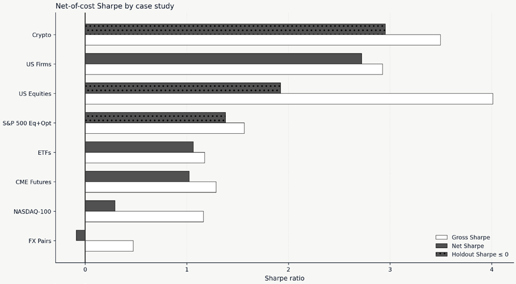

*Figure 20.15: Gross Sharpe at zero cost versus net Sharpe at each case study’s actual cost regime, both read from the same cost-sensitivity sweep so net never exceeds gross; bars whose holdout Sharpe is non-positive are hatched*

### Capacity and concentration

Among case studies, apparent edges concentrate where capacity is most constrained. The US firm characteristics case study concentrates its long leg heavily in bottom-quartile market-capitalization names; a conservative capacity estimate computes the minimum average daily volume across portfolio constituents and applies a 1-to-5 participation rate, at which point the participation constraint becomes binding at moderate asset levels. Avramov, Cheng, and Metzker (2020) find the same pattern across the broader ML-for-asset-pricing literature: reported profitability erodes once economic restrictions (short-sale constraints, liquidity filters, transaction costs) are imposed. ETFs and FX operate in highly liquid markets where capacity is not the binding constraint; their signal-stage edges are correspondingly thinner.

Cost survival is one of several filters. *Section 20.7* examines temporal stability and risk overlays: whether the signal-plus-cost picture holds across different market regimes and time periods, and whether path-risk overlays add or subtract value relative to the underlying signal.

## 20.7 Risk overlays

Risk overlays refine strategies that already have signal and a cost buffer; they cannot redeem a strategy that lacks predictive edge. The cross-case sweep covers position-level overlays: trailing stops on adverse price excursions and time-based exits on stale positions. Three case studies achieve their highest-validation-Sharpe with a position-level overlay. S&P 500 equity-plus-options stands apart: a 3% trailing stop lifts the Sharpe ratio from +1.25 at the signal stage to +2.39 and cuts maximum drawdown from −43% to −7%. ETFs and CME futures post modest Sharpe lifts of +0.24 and +0.17 over their allocator baselines. ETFs use a 4.3% trailing stop tuned to the 25th percentile of the 20-bar maximum-adverse-excursion distribution, which reduces drawdown from −28% to −11%; CME futures use a 5% trailing stop that lifts Sharpe but leaves drawdown slightly deeper at −21% versus −18%, because the avoided-loss against missed-recovery balance is sensitive around the threshold.

Four case studies see no Sharpe improvement from any overlay. Crypto perpetuals (20-bar time exit at an 8-hourly cadence) and US equities (40-bar time exit at a daily cadence) show risk-overlay Sharpe ratios within ±0.02 of their allocator baselines, with drawdowns unchanged; the overlay window matches the natural holding period of the highest-validation-Sharpe configuration in each case. FX pairs use a 20-bar time exit on the linear-ridge long-short configuration that lifts Sharpe by +0.01 (from +0.04 at the allocation stage to +0.05). Neither the price path nor the position duration exposes an asymmetry the overlay can profitably intercept, so the overlay is a near-neutral pass-through. NAS-DAQ-100’s cost-feasible configuration was swept across the same overlay grid: its best variant, a 20% trailing stop, holds managed Sharpe at +1.06 against a +1.13 no-overlay baseline, and every tighter stop or shorter time exit reduces Sharpe further: no overlay improves it, confirming that cost, not overlay choice, is its binding constraint.

Two case studies do not use risk overlays due to data limitations: S&P 500 options’ highest-validation-Sharpe configuration is held to expiry, and the data does not contain daily highs and lows; and the US firm characteristics case study does not have price data at all.

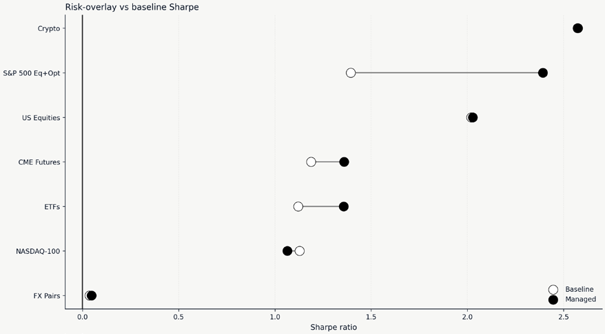

*Figure 20.16: Allocation-stage versus risk-stage Sharpe across the seven case studies with overlay rows on their highest-validation-Sharpe lineage*

Trailing stops on path-asymmetric return distributions produce the largest gains; time-exit overlays matched to the natural holding period are near-neutral.

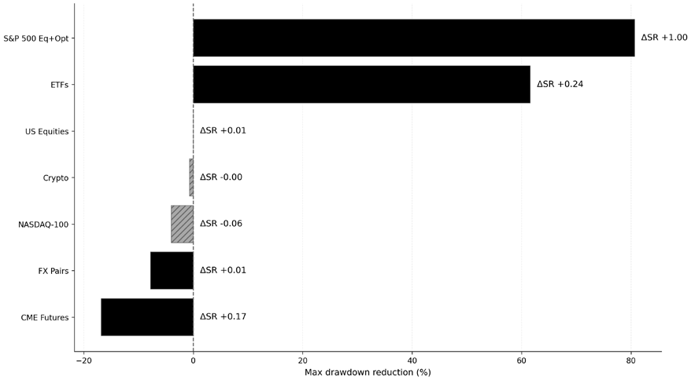

*Figure 20.17: Maximum-drawdown reduction (in percentage points) per overlay row on the highest-validation-Sharpe lineage, with the Sharpe delta versus the allocator baseline annotated on each bar*

The S&P 500 Eq+Opt trailing-3% overlay is the configuration that most decisively improves both Sharpe and drawdown; most overlays trade one for the other or worsen both. Overlay effectiveness scales with the baseline drawdown depth and the path asymmetry of the return distribution.

Overlays produce the largest gains where the return distribution carries sharp path asymmetry a stop can intercept, are roughly neutral when matched to the natural holding period, and cannot redeem a structurally negative signal. Whether the underlying signals are economically rooted or proxies for unstable correlations is the question of *Section 20.8*.

## 20.8 Causal credibility and confounding bias

Predictive power and causal understanding are different claims, and the distinction matters for how durable a signal is likely to be. A model can exploit a statistical regularity that is predictive today but causally ungrounded, and therefore fragile to the regime shifts documented in *Section 20.1*. *Chapter 15*’s dual machine-learning analysis provides a partial window into this question across the case studies. The dual ML estimates are diagnostic; they inform how much weight to place on each signal, but no causal step enters the backtest pipeline.

Across the nine case studies, the dual ML estimator and the block-permutation refutation are applied as specified in *Sections 15.4*–*15.6*; standard risk-factor controls (market, momentum, volatility) and the engineered confounders from each case study’s feature pipeline form the nuisance set. The credibility summary reported below combines four quantities: The HAC 𝑝-value on the second-stage coefficient

- The DML effect direction and magnitude The refutation 𝑝-value from the time-shuffled re-fit • •
- The percentage gap between the naive regression coefficient and the DML coefficient speaks to the signal as traded rather than to a separate reporting horizon. Significance at 𝑝05 and Each estimate is computed on the forward-return label the case study actually deploys, so the screen refutation stability at refutation 𝑝05 define the two reporting thresholds.

𝑝
| (HAC) | Refutation |
| --- | --- |
| ETFs momentum (skip-recent 6, 1) −0.058 0.000 | 0.00 +33 |
| S&P 500 Options variance risk premium 21d −0.123 0.000 | 0.03 +50 |
| US firms momentum 12–2 +0.009 0.003 | 1.00 +103 |
| US Equities momentum 12-1 −0.001 0.454 | 0.35 +354 |
| SP500 Eq+Opt IV–RV spread −0.003 0.168 | 0.12 +133 |
| Crypto Perps premium z-score 14d −0.001 0.530 | 1.00 +53 |
| NASDAQ-100 signed volume share ≈ 0 0.966 | 0.99 −142 |
| CME Futures carry percent ≈ 0 0.454 | 0.19 −60 |
| FX Pairs momentum (skip-recent) −0.004 0.468 | 0.06 −82 |

*Table 20.8: Dual ML estimates on each case study’s deployed forward-return label, the horizon the strategy actually trades*

The candidate treatment is the strongest model feature for that case study after the controls (factor returns, volatility, the chapter’s engineered confounders) are held constant. Large absolute bias percentages on rows where the DML effect is near zero (NASDAQ-100, CME Futures, FX Pairs) reflect tiny denominators rather than strong confounding effects.

Two case studies clear both thresholds on the label they deploy: ETFs and S&P 500 Options. These are also the two signals with the clearest economic rationale (the cross-sectional momentum premium in ETFs and the variance-risk premium in S&P 500 options), and the causal screen is consistent with Firms reaches significance (𝑝003), but its refutation companion fails to reject the time-shuffled that rationale, since each survives the HAC significance test and the block-permutation refutation. US null (refutation 𝑝00), so the estimate cannot be separated from a spurious fit. The remaining

six signals do not clear the significance threshold at the horizon they trade. Each of these earned its place in the deployed strategy on validation Sharpe, so each is predictive; what the dual ML screen adds is that their edge is empirical rather than causally identified at the traded label. That separation, two economically grounded signals from a larger set whose edge is statistical, is an input to position sizing and monitoring, not a determination of whether a signal should be traded. Confounding bias should be reported alongside Sharpe as a complementary fragility metric. Bias quantifies the extent to which the naive effect is explained by observable confounders such as momentum, volatility, and market factors. High absolute bias means the signal is sensitive to shifts in those confounders: if the relationship between momentum and returns changes, a high-bias signal is more likely to break. That risk dimension differs from holdout decay, which captures all sources of deterioration including data snooping and regime change. Whether confounding bias predicts holdout decay is an open empirical question (nine observations are too few to establish a pattern), but even without that link, bias is informative as a fragility indicator. Predictive signals without causal identification can still be deployed for trading provided that appropriate risk management is in place. For inference about *why* a strategy works or how durable it is likely to be, causal evidence matters more, and that distinction informs both position sizing and monitoring intensity: high-bias strategies warrant tighter risk budgets and more frequent re-evaluation.

Because most of these signals are only partially understood, the next research step on each case study is concrete. *Section 20.9* collects those per-case next steps.

## 20.9 Next steps after the first research iteration

Every result in this book comes from a single pass through a standardized pipeline, and the chapter frames each case study as the *first* iteration of the *Chapter 6* strategy research workflow. This closing section names, for each of the nine cases, the concrete next research step. The diagnostic readings of *Section 20.3* through *Section 20.8* each pointed to a specific upstream or downstream lever; those are collected in the following list as per-case next iterations:

- **US firm characteristics:** Filter the universe to the top three quartiles by market capitalization and re-run to see how Sharpe behaves under realistic capacity. The signal-stage edge is the largest in the test bed, but the long leg concentrates in bottom-quartile names whose spreads commonly run 100 to 500 basis points; liquidity, not signal, is the binding constraint.
- **US equities panel:** Decompose the validation-to-holdout sign flip (+2.03 to −0.49 on the highest-validation-Sharpe GBM) by sector and calendar period to determine whether the decay is gradual or concentrated in a specific regime. If the sign flip concentrates in small-cap technology names during a particular rate regime, engineer sector-specific features, extend the horizon to 21 days to reduce turnover, and ensemble with the IPCA signal.
- **ETFs:** Ensemble the latent-factor SDF, deep-learning NLinear, and linear ridge configurations from the validation top cluster and evaluate whether the combined signal stabilizes the +0.046 holdout daily IC. The daily validation IC ceiling of +0.085 on the standard feature set suggests broader feature inputs (sentiment, fundamentals, cross-asset signals) are a higher-impact lever than deeper architectures.
- **CME futures:** Verify the interaction-based signal on a second data source or an alternative back-adjustment method. The continuous-series construction shapes the family rankings more than the model choice does, so robustness against that construction is the highest-value next test.
- **S&P 500 equity-plus-options:** Test checkpoint ensembling on the latent-factor highest-validation-Sharpe configuration to characterize the per-configuration IC range and whether averaging across configurations stabilizes the holdout result, which decayed from validation Sharpe +2.39 to holdout −0.73 with strategy-versus-EW confidence interval [−4.17, −0.75] excluding zero on the negative side.
- **FX pairs:** No model family clears the IC threshold at any horizon, so the open question is whether a cross-sectional signal exists in this 20-pair universe at all, not how to execute one: the linear-ridge configuration resolves flat (validation +0.05, holdout +0.19, both below the equal-weight benchmark). The higher-value next steps are richer inputs (rate differentials, macro releases, positioning data) and a slower cadence to widen the thin 7-basis-point cost margin, before any further pipeline tuning.
- **Crypto perpetuals:** Add explicit regime detection or shorter retraining windows before any second-iteration backtest. The cross-sectional funding pattern is genuine but unstable over the observed holdout: the highest-validation-Sharpe GBM clears +2.57 validation Sharpe but decays to −0.13 on holdout, a validation-to-holdout Sharpe difference whose 95% bootstrap interval excludes zero on the negative side. Deepening the cross-section beyond 19 contracts is a parallel line of research.
- **S&P 500 options:** Retain the bottom-quintile half-spread execution discipline (*Section 20.6*, *Section 18.8*) as the candidate path forward, with the understanding that the resulting +0.97 retrained holdout Sharpe sits within a wide one-year confidence interval and has not been confirmed at the bottom-decile spread restriction. The next iteration’s question is whether the same model produces a positive net Sharpe at institutional spreads and size.
- **NASDAQ-100 microstructure:** The cost-feasibility screen converts a full-universe failure into a marginal positive result (validation +1.13, holdout +0.53), though the edge is not statistically resolved and trails a passive benchmark on the same screened universe. Test the screen’s sensitivity by widening and tightening the cost-feasible cutoff, and search the rebalancing-cadence axis (30-minute, hourly, daily) under the per-share cost model to see whether a coarser cadence lifts the screened strategy clear of per-bar friction.

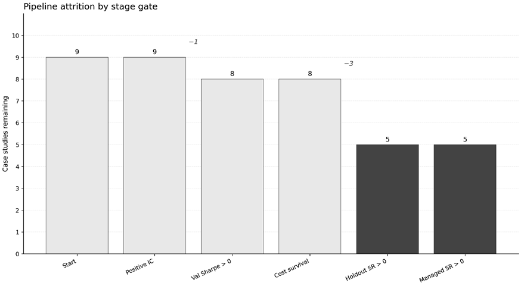

*Figure 20.18: Pipeline attrition across the evaluation gates*

All nine case studies show positive validation IC; eight clear the validation-Sharpe gate (FX pairs drop, its validation Sharpe spanning zero); eight survive the cost gate; five retain a positive holdout Sharpe; and all five hold through risk-overlay management. The attrition concentrates at the holdout gate (eight strategies enter it and five emerge) rather than at validation, and motivates the per-case next-iteration agenda above.

## 20.10 Summary

The nine case studies taken together show that a standardized ML-for-trading pipeline (applied once, with off-the-shelf features, simple allocators, static cost assumptions, and no retraining inside the holdout) leaves five of the nine strategies with a resolved positive holdout Sharpe, gradated from the stronger results of ETFs, CME futures, and US firm characteristics, through the marginal NASDAQ-100 (+0.53), to the execution-cost-conditional S&P 500 options (+0.97). Three decay to a negative holdout, and FX pairs resolves flat: its +0.19 holdout point estimate spans zero and sits below the passive benchmark. The holdout intervals are wide in every case, and one strategy is structurally below the cost line under realistic accounting. The best-family daily IC across the test bed tops out near +0.08; measurement-error analysis finds the highest-validation-Sharpe and near-top configurations statistically indistinguishable in most cases, and the ensemble demonstration of *Section 20.4* shows that averaging across those top configurations trades peak Sharpe for fold-to-fold stability. None of the nine studies produces a strategy that should be carried directly to capital; each is one iteration through the *Chapter 6* workflow.

The workflow is the book’s contribution. The nine case studies are one application of it; a reader’s own iteration (on a different universe, with richer features, on a longer horizon, through multiple cycles) is where the evidence becomes useful. *Chapter 6* is the reference for how that iteration proceeds. *Chapter 21* turns to reinforcement learning, where a one-shot prediction-then-allocate pipeline gives way to policies that act, observe, and adapt: execution scheduling, inventory-aware hedging, and position sizing as learned behaviors rather than static rules. The remaining chapters in Part V extend the toolkit further (retrieval-augmented research, knowledge graphs, autonomous agents, and live-trading infrastructure in *Chapters 22* through *27*), but the workflow of diagnostic rigor, implementation realism, and frozen holdout validation does not change. The methods expand; the discipline holds.
