# Chapter 21: Reinforcement Learning

Prediction alone does not generate returns. Traders must translate forecasts into actions that navigate market impact, transaction costs, inventory risk, and model uncertainty. Reinforcement learning (RL) addresses this gap by learning policies for sequential decisions under feedback and delay. Supervised learning predicts what is likely to happen next; RL chooses the action that is justified now, given a longer-horizon objective.

This chapter focuses on the financial settings where that framing applies most cleanly: execution, market making, and derivatives hedging. In each case, the action itself is the optimization target, and the reward is tied directly to implementation shortfall, inventory-aware spread capture, or hedging error under costs. The chapter also covers inverse reinforcement learning for inferring objectives from observed behavior, while emphasizing practical limits rather than algorithmic breadth.

After working through the chapter and its notebooks, you will be able to:

- Formulate execution, market-making, and derivatives hedging problems as partially observed Markov Decision Processes with economically coherent state, action, reward, and constraint designs.
- Match value-based and actor-critic RL methods to financial tasks based on action-space structure, sample-efficiency needs, and stability requirements.
- Benchmark RL execution policies against TWAP and Almgren-Chriss-style schedules in controlled simulated and crypto-data settings, and interpret apparent gains with appropriate caution.
- Compare deep hedging results with delta hedging and Whalley-Wilmott-style benchmarks under transaction costs using PnL distributions and tail-risk metrics.
- Distinguish inverse reinforcement learning from behavior cloning and explain what reward inference can and cannot recover from observed trading behavior.
- Diagnose the simulation-to-reality risks that govern deployability, including non-stationarity, reward hacking, market impact, partial observability, latency, and benchmark mismatch.

*Sections 21.1–21.3* establish the decision-theoretic framing, the MDP formulation, and the core algorithm families. *Sections 21.4–21.7* apply that machinery to execution, market making, deep hedging, and inverse RL. *Section 21.8* closes on the simulation-to-reality gap, which separates a promising simulator result from a deployable policy.

## 21.1 The sequential decision-making paradigm in finance

Reinforcement learning reframes the central question from prediction to sequential action under uncertainty, with direct consequences for trading system design (Sun et al., 2023). Supervised models treat prediction and action as separate problems, ignoring the feedback loop in which actions alter the environment being modeled (Hambly et al., 2023). A strategy built on price forecasts will, through its execution, move prices, a dynamic that static prediction models cannot capture.

RL is goal-directed: an agent interacts with a dynamic environment over time, learning a *policy* that maps situations to actions that maximize cumulative reward (Kolm and Ritter, 2019). The framework handles sequential decisions in which actions influence future states, and feedback is delayed, sparse, or indirect.

### The temporal credit assignment problem

RL must attribute a final outcome to the sequence of actions that produced it. In trading, a profitable exit may follow a dozen decisions made over the preceding days or weeks. Supervised models get immediate feedback for each prediction; an RL agent learns from delayed, aggregated rewards.

This is the temporal credit assignment problem, and RL’s value function is the machinery that solves it. The value function *V(s)* is the total expected future reward starting from state *s* and following the current policy thereafter. That long-horizon objective aligns with the targets of portfolio managers and institutional traders, who optimize multi-period PnL rather than one-step accuracy.

### End-to-end optimization

RL collapses the “predict then act” pipeline into a single optimization: the agent learns a policy that maps market states directly to trading actions, targeting the financial objective rather than an intermediate proxy (Hambly et al., 2023). The policy requires fewer explicit assumptions about return distributions, volatility dynamics, or impact functions, so it can fit dynamics that classical parametric models miss. “Model-free” means only that the algorithm does not require a transition model. State design, reward shaping, and simulator construction still embed substantial modeling choices.

RL introduces a trade-off absent from supervised learning: exploit actions known to be profitable, or explore untried actions that might do better. In non-stationary markets, pure exploitation is brittle: a strategy that only repeats past patterns fails when regimes shift. Disciplined exploration matters, but in finance it has to run through simulators, offline data, or strict risk controls rather than unconstrained live trading (Hambly et al., 2023; Halperin, Kolm, and Ritter, 2025).

### Why this chapter focuses on execution rather than alpha

RL is often expected to learn directional trading strategies that discover alpha from price movements. In practice, alpha-seeking RL faces severe obstacles: non-stationarity erodes learned patterns across regimes, exploration-driven market impact is costly and irreversible, and reward functions based on short-window Sharpe ratios invite overfitting and reward hacking. Surveys and simplified trading demonstrations reach the same conclusion: these setups serve as proofs of concept but remain far from the decision problems institutions must deploy (Millea, 2021). The predict-then-act pipeline in *Chapters 11–14*, combined with the portfolio construction and risk management in *Chapters 16–19*, handles alpha generation on firmer ground.

RL’s comparative advantage lies in domains where the *action itself* is the optimization target (minimizing execution cost, managing inventory, hedging derivatives) and where the reward is well-defined and directly measurable: implementation shortfall, inventory-penalized spread capture, hedging PnL.

The next section introduces the Markov Decision Process, the formal structure that underpins every algorithm and application in this chapter.

## 21.2 Financial markets as Markov decision processes

Applying RL to finance requires translating trading problems into **Markov Decision Processes** (**MDPs**), the formal framework for sequential decision-making in stochastic environments (Hambly et al., 2023). State design, reward shape, and action granularity determine what the agent can learn more than the algorithm itself does. In finance, these choices embed hypotheses about market dynamics, about which features carry signal, and about which horizons matter.

### The MDP framework

*Figure 21.1* illustrates the MDP loop: the agent observes market state, selects an action (trade size, spread, hedge ratio), receives a reward (PnL, risk-adjusted return), and transitions to a new state as the market evolves. Repeating this loop thousands of times during training is how the agent learns a policy.

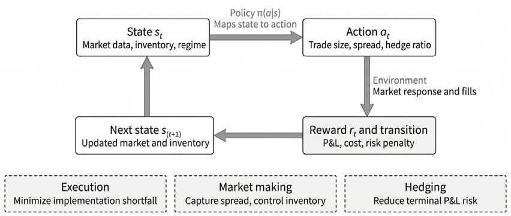

*Figure 21.1: Conceptual MDP loop for financial reinforcement learning across execution, market making, and hedging tasks*

An MDP is formally defined by a five-element tuple ۦܵǡ ܣǡܲ ǡܴ ǡ ߛۧ : a state space, an action space, tran-

sition dynamics, a reward function, and a discount factor. *Figure 21.1* shows the corresponding state, action, and reward at each step. The central tenet is the **Markov property**: the future is conditionally state 𝑠௧ାଵ depends only on the current state 𝑠௧ and action 𝑎௧, not on the entire history of preceding independent of the past given the present. In other words, the probability of transitioning to the next

states and actions (Kolm and Ritter, 2019).

In practice, financial states are rarely Markovian: current price and volume alone do not capture regime, momentum, or microstructure dynamics. Practitioners address this by stacking recent observations into the state vector and adding rolling statistics (volatility, spread averages, order flow momentum) that summarize recent history. The feature categories below reflect this principle: each one encodes information that makes the current state a better summary of the relevant past.

### Partial observability in financial markets

Financial environments are partially observable: a trader executing a large order cannot see other observations 𝑜௧ that provide incomplete information about the true state 𝑠௧ (Halperin et al., 2025). participants’ intentions, hidden liquidity in dark pools, or pending news releases. The agent receives

Partial observability is why state engineering carries so much weight in financial RL. Each additional feature (order book depth, volatility regime indicators, time-of-day effects) supplies information about latent market conditions. Richer state representations do more than improve performance; they bring the problem closer to the fully observable MDP that algorithms assume. Recurrent architectures (LSTMs or GRUs; see *Chapter 13*) offer an alternative: an internal memory that implicitly constructs a belief state from the observation sequence.

### State representation

The state space, *S*, defines the agent’s view of the world. Early approaches used low-dimensional states consisting of a lookback window of historical prices and portfolio values. Production systems now use richer representations (Hambly et al., 2023):

- **Public market data** forms the foundation: bid-ask spread, depth at multiple price levels, order flow imbalance, and other features derived from the limit order book (LOB). For execution and market making, these microstructure features are the most informative predictors of short-term price dynamics.
- **Private agent information** captures the agent’s internal state: current inventory or portfolio holdings, unrealized PnL, and time remaining until a terminal horizon. These path-dependent features are essential for risk-aware decision-making. ratios, and time-of-day effects. Including these features means the optimal policy 𝜋∗ is inher-
- **Regime indicators** capture the current market regime: rolling volatility, spread levels, depth

ently regime-conditioned. The agent learns to trade passively in fragile conditions (low liquidity, high impact) and aggressively in deep conditions (high liquidity, low impact) without explicit regime-switching logic.

### Action space design

The action space, *A*, defines the agent’s choice set, and its structure determines which algorithms apply:

- **Discrete actions** give the simplest formulation: {Buy, Sell, Hold} for a directional trader, or a discrete set of spread levels for a market maker. Value-based algorithms such as DQN handle these by estimating action values.
- **Continuous actions** are more realistic for many financial decisions: the quantity of shares in an execution slice, the limit-order price, or portfolio allocation weights. These require actor-critic algorithms such as PPO or SAC that produce continuous action vectors directly (Hambly et al., 2023).
- **Action constraints** are ubiquitous in finance: position limits, maximum order sizes, participation rate caps, and inventory bounds. These can be enforced through action clipping, penalty terms in the reward, or constrained MDP formulations. Hard constraints (kill switches, regulatory limits) should never rely solely on learned behavior.

### Reward engineering

The reward function R is the load-bearing piece of an MDP: the scalar signal that drives learning. The agent will optimize whatever this signal rewards, so reward engineering, not algorithm choice, is what aligns the learned policy with the financial objective (Kolm and Ritter, 2019). Consider the following factors:

- **Naive PnL rewards** (the per-step change in portfolio value) are intuitive but noisy, and can encourage high-variance strategies that chase expected return without regard for risk.
- **Risk-adjusted returns** shape more conservative policies by optimizing a performance metric directly: Sharpe, Sortino (penalizing downside only), or Calmar (return relative to maximum drawdown). This aligns the agent’s objective with the risk-return trade-off that institutions optimize.
- **Task-specific rewards** match each application’s objective:

𝑅௧= −(݌arrival −݌exec) ൈݒ
| Task | Objective | Reward Function |
| --- | --- | --- |
| Optimal execution | Minimize implementation shortfall | 𝑅 ௧𝑅 = −(݌arrival −݌exec) ൈݒ |
| Market making | Balance spread capture and inventory risk | 𝑅 = PnL െߣڄ ܫ2 ௧ ௧ ௧ |
| Deep hedging | Minimize terminal risk | 𝑅 = −CVaR ఈ(PnL ் ) |
| Portfolio allocation | Maximize risk-adjusted returns | 𝑅 ൌ߂SR or 𝑟 െߣߪ ௧ ௧ ௧ |

*Table 21.1: Objectives and rewards by task*

These reward designs connect to economic theory. Kolm and Ritter (2019) showed that a quadratic parameter 𝜆) produces agents that approximately maximize mean-variance utility. This equivalence per-step reward (penalizing deviations of the wealth increment from its mean, scaled by a risk-aversion

holds beyond Gaussian returns, covering all elliptical distributions and certain asymmetric families (Halperin et al., 2025). The quadratic reward form also makes the Q-function analytically tractable, enabling solutions without neural network approximation, the insight underlying the QLBS framework in *Section 21.6*. Kolm and Ritter (2019) give the full derivation. The risk-aversion parameter 𝜆 controls the return-versus-risk trade-off. For market making, asymmet-

rically dampened rewards (penalizing speculative gains more than spread-capture gains) discourage trend-following and improve learning stability.

### Transition dynamics and discount factors The transition model 𝑃(ݏԢ פ ݏǡܽ) is unknown in finance: the market response emerges from a multi-

agent system. Financial RL therefore relies on model-free algorithms that learn policies directly from engineering produces (Mnih et al., 2015). The discount factor 𝛾 sets the planning horizon: values near experience, with neural networks generalizing across the high-dimensional state spaces that feature

1.0 (0.99–0.999) encourage the far-sighted optimization that execution and hedging require.

The next section surveys the families of algorithms that solve such MDPs, from value-based methods like DQN to actor-critic architectures that handle continuous action spaces.

**Implementation**: See `02_optimal_execution_ppo` and `03_market_making_ppo` for complete MDP formulations.

## 21.3 Core algorithms – From DQN to actor-critic

Actor-critic architectures have become the practical default in financial RL: they handle continuous actions natively and trade off stability against flexibility well (Hambly et al., 2023). The progression from value-based to actor-critic methods exposes the choices that drive algorithm selection. The best textbook reference for RL algorithms remains Sutton and Barto (2018).

### The Bellman equation

The optimal action-value function 𝑄∗(ݏǡܽ) that expresses the maximum expected cumulative reward All value-based RL methods rest on a recursive relationship known as the **Bellman optimality equation**. from taking action 𝑎 in state 𝑠 and acting optimally thereafter satisfies:

𝑄∗(ݏǡܽ) ൌॱ[ܴ ௧ାଵ൅ߛƒš ௔ᇱ𝑄∗(ݏ௧ାଵǡܽԢ) פܵ ௧ൌݏǡ ܣ௧ൌܽ ]

This equation states that the value of a state-action pair equals the expected immediate reward plus the discounted value of the best action in the next state. The recursive structure enables **temporal difference (TD) learning**: rather than waiting for a complete episode to evaluate an action, the agent updates its Q-estimate after each step using the observed reward and its current estimate of the next state’s value. **Q-learning**, the classical algorithm, performs these updates using a simple tabular representation. The transition to deep RL replaces the table with a neural network, enabling generalization across the high-dimensional, continuous state spaces that characterize financial markets.

Value-based algorithms focus on learning the optimal action-value function 𝑄∗(ݏǡܽ). The policy is Deep Q-networks derived implicitly by selecting the action that maximizes the Q-function: 𝜋(ݏ) = argmax௔ ∗(ݏǡܽ). **Deep Q-Networks** (**DQN**) approximate the Q-function with a neural network (Mnih et al., 2015). Two innovations stabilize training: experience replay breaks temporal correlations by randomly sampling past transitions, and target networks provide stable regression targets via slowly updated Q-network copies. DQN is restricted to discrete actions: buy/sell/hold or quoting at fixed price levels. van Hasselt et al. (2015) showed that **Double DQN** reduces Q-value overestimation by decoupling action selection from value estimation; **Dueling DQN** separately estimates state value and action advantage (Wang et al., 2016).

### Actor-critic – On-policy Policy-based methods directly parameterize and optimize the policy 𝜋ఏ( פ ݏ). The policy parameters

𝜃 are updated using policy gradient methods, adjusting in the direction that increases expected return

(Sutton et al., 2000). In practice, **Proximal Policy Optimization** (**PPO**) uses a learned value-function baseline to reduce variance, making it an actor-critic method, though it originated in the policy-gradient tradition.

PPO constrains policy updates via a clipped surrogate objective, preventing the performance collapse common in unconstrained policy-gradient methods (Schulman et al., 2017). That stability makes PPO the default starting point for financial applications, including portfolio management and general trading. The drawback is on-policy learning: past experience must be discarded after each update, making PPO less sample-efficient than off-policy alternatives, a real cost when high-quality financial data is scarce.

### Actor-critic – Off-policy

𝜋ఏ( פ ݏ); a *critic* network learns a value function that evaluates the actor’s actions. The critic provides a Actor-critic algorithms combine value-based and policy-based ideas. An *actor* network learns the policy

low-variance learning signal that guides actor updates, stabilizing training (Konda and Tsitsiklis, 1999).

**Deep Deterministic Policy Gradient** (**DDPG**) extends DQN to continuous action spaces via a deterministic actor policy while retaining experience replay and target networks. DDPG is sensitive to hyperparameters; **TD3** mitigates this sensitivity through clipped double Q-learning, delayed policy updates, and target policy smoothing.

**Soft Actor-Critic** (**SAC**) adds entropy maximization to the actor-critic objective: the agent maximizes expected return while keeping its policy as stochastic as possible (Haarnoja et al., 2018). The entropy term encourages exploration, prevents premature convergence, and produces policies resilient to perturbation, properties that suit market making and dynamic hedging. The cost is tuning complexity: the entropy coefficient and learning rates require careful calibration, especially in non-stationary financial environments where PPO’s simpler update rule is more forgiving.
| Algorithm | Type | Policy | Action Space | Sample Efficiency | Best Financial Use Cases |
| --- | --- | --- | --- | --- | --- |
| DQN | Value- based | Off- policy | Discrete | Moderate | Simple trading, discretized execution |
| PPO | Actor- Critic | On- policy | Both | Lower | Portfolio allocation, execution, general trading |
| DDPG/TD3 | Actor- Critic | Off- policy | Continuous | Higher | Execution, hedging, continuous allocation |
| SAC | Actor- Critic | Off- policy | Continuous | Highest | Market making, dynamic hedging, microstructure |

*Table 21.2: Algorithm selection for finance*

### Risk-aware RL

Standard RL maximizes expected cumulative reward, the mean of the return distribution. This *risk-neutral* formulation ignores variance, tail risk, and higher moments, and is therefore insufficient for financial applications where risk management matters as much as return generation (Halperin et al., 2025). Three extensions address this gap. Reward ൌॱ[Return] െߣڄ Var[Return]. Because this remains an expectation (of a risk-adjusted quantity), **Mean-variance RL** incorporates both expected return and variance into the objective:

the standard RL machinery still applies: the variance penalty is absorbed into the reward definition. When the reward takes the quadratic form discussed in *Section 21.2*, the Q-function becomes analytically tractable and can be solved without neural networks (Kolm and Ritter, 2019). The limitation is that variance penalizes upside and downside deviations equally. the worst 𝛼% of outcomes) as the risk penalty. This focuses the agent on downside protection, which **CVaR-based RL** directly optimizes tail risk by using Conditional Value at Risk (the expected loss in

aligns with how institutions evaluate risk. Unlike mean-variance RL, CVaR-based methods generally require deep neural networks for function approximation.

**Distributional RL** changes the target: rather than learning the expected return, algorithms like Quantile Regression DQN (QR-DQN) and Implicit Quantile Networks (IQN) learn the **full probability distribution** of cumulative future rewards. With the distribution in hand, any risk measure (VaR, CVaR, skewness) can be computed at decision time, making risk preferences configurable without retraining. For tailrisk-driven applications, distributional methods give the richest representation of uncertainty.

### Model-based and model-free approaches

The algorithms above are *model-free*: they learn policies directly from experience without modeling the environment’s transition dynamics. *Model-based RL* takes the other route: first learn a model of how the environment responds to actions, then plan against that model. Model-based methods are more sample-efficient, but only as good as the learned model. In practice, financial RL spans both paradigms. Execution and market-making agents are typically model-free, learning from simulated or historical interactions without modeling price dynamics explicitly. Deep hedging, by contrast, is model-based: it learns optimal hedging policies **for a given stochastic process** (for example, Heston, SABR) used to simulate the underlying asset. Changing the simulation model requires retraining the hedging network, a dependency that model-free approaches avoid.

### Practical algorithm selection

Actor-critic methods dominate financial RL because execution sizes, portfolio weights, and hedge ratios are continuous. The choice between on-policy (PPO) and off-policy (SAC/TD3) turns on the stability-versus-efficiency trade-off: SAC’s sample efficiency dominates when a high-fidelity simulator makes data generation cheap; PPO’s robustness is preferable with limited historical data. Hybrid workflows (off-policy pre-training in simulation, on-policy fine-tuning for deployment) combine the advantages of both.

*Figures 21.2* and *21.3* compare the three algorithms implemented in the teaching notebook on a standardized discrete-action trading environment: DQN, PPO, and A2C. In a compact simulator, raw wealth paths can become unstable and are highly seed-sensitive, so *Figure 21.2* is best read as a diagnostic of differing learning dynamics rather than a fixed performance ranking.

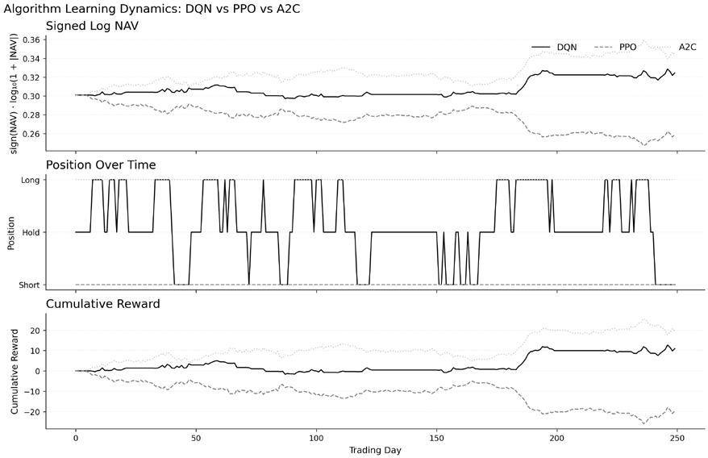

*Figure 21.2: DQN, PPO, and A2C learning dynamics in the standardized teaching environment*

*Figure 21.3* shows that the three methods induce visibly different position-occupancy patterns: algorithm choice shapes policy style even before moving to richer market environments.

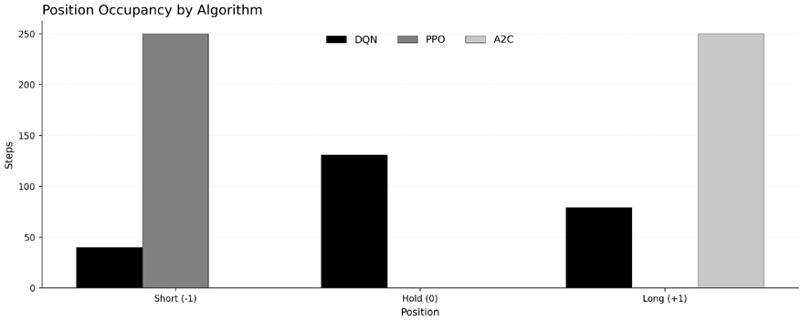

*Figure 21.3: Position-occupancy patterns induced by the three algorithms*

The remaining sections apply these algorithms to the financial tasks motivated in *Section 21.1*, beginning with optimal trade execution, the application with the clearest evidence of institutional deployment.

**Implementation**: See `algorithms_comparison` for the side-by-side implementation.

## 21.4 Application I – Optimal trade execution

Optimal execution (liquidating or acquiring a large position over a specified time horizon) is among the most commercially mature RL use cases in finance. Public disclosures are limited, but execution is the application area with the clearest evidence of live institutional deployment (Hafsi and Vittori, 2025).

A large parent order (for example, selling one million shares of a liquid equity) is broken down into smaller child orders over time. The trader faces a trade-off between two costs:

- **Market impact** arises from executing too quickly. Large orders consume liquidity and move the price against the trader. Executing the full position at once pushes the order through the book and results in significant slippage.
- **Timing risk** arises from executing too slowly. Spreading the trade over time reduces instantaneous impact but exposes the trader to adverse price drift. If the market moves against the position during execution, the average fill price can be worse than immediate execution would have achieved.

The standard metric for evaluating execution quality is **implementation shortfall** (**IS**): the difference between the asset’s price at the time of the decision (the arrival price) and the final average execution price. Minimizing IS requires dynamically balancing impact against timing risk as market conditions evolve.

### Classical benchmarking with Almgren-Chriss

The foundational analytical solution to this problem is the Almgren-Chriss model (Almgren and Chriss, 2001), covered in depth in *Chapter 18*, which derives optimal execution schedules by balancing expected impact cost against execution-risk variance. The result is an efficient frontier of trading trajectories, ranging from more uniform schedules to more front-loaded liquidation as risk aversion rises.

The model’s limitations stem from its assumptions: constant market impact parameters, constant volatility, and a predetermined schedule that cannot adapt to real-time changes in liquidity or order flow. In reality, these conditions shift throughout the day, particularly around news events, market open, and close.

### The RL approach to execution

Reinforcement learning reformulates optimal execution as a sequential decision problem. Instead of computing a fixed schedule upfront, the agent learns a policy that maps market state, remaining inventory, and time-to-deadline to the next trade decision. This can outperform a static schedule when liquidity, volatility, and impact vary in ways the analytical model does not capture.

**State representation** is high-dimensional, typically combining remaining inventory and time-to-deadline, recent volatility and return patterns, limit-order-book features (spread, depth at multiple levels, order flow imbalance), and private execution metrics such as average price achieved and cost incurred.

**Actions** specify what the agent does each step. The agent may set the size of the next child order (continuous) or select from a menu of order types and aggressiveness levels (discrete). Continuous order sizes are often discretized into bins (0%, 10%, 20%, … of remaining inventory) to enable DQN-based approaches. Actions can also include the choice between market orders (guaranteed execution, higher impact) and limit orders (possible price improvement, execution uncertainty).

**Rewards** are designed to minimize implementation shortfall while discouraging pathological behavior. A common formulation combines realized execution cost with penalties for residual inventory, impact, or delayed completion. Reward design is the central difficulty: misaligned penalties produce policies that satisfy the coded reward but make no economic sense. **Industry evidence – J.P. Morgan LOXM**

A prominent real-world example is J.P. Morgan’s **LOXM** system, which has optimized equity order execution since 2017. J.P. Morgan built LOXM with deep reinforcement learning, training it on billions of historical and simulated trades to fill client orders quickly at the best available price and to exit large positions without moving the market (Financial Times, 2017). The system’s mandate is deliberately narrow: it decides how to execute an order, not what to buy or sell, and it runs within the bank’s existing electronic trading risk controls. The bank first deployed it in European equities in 2017, then extended it to Asia and the United States, and reported pricing better than its internal benchmark.

These accounts leave the training details and independent performance evidence proprietary. That makes it useful as a signal of institutional interest, but not as a source of reproducible benchmark numbers.

The academic evidence is clearer than the industry evidence. Kearns and Nevmyvaka (2013) survey the broader landscape of ML for microstructure and execution, while Nevmyvaka, Feng, and Kearns (2006) remains an early empirical demonstration that RL can improve execution policies on historical data, even though production implementations today are disclosed only selectively.

### High-fidelity simulation requirements

Training an execution agent on simple price replay is insufficient; the agent must experience realistic market impact and queue dynamics.

**Multi-agent simulators** like Agent-Based Interactive Discrete Event Simulation (**ABIDES**; Byrd, Hybinette, and Balch, 2020) populate the market with algorithmic and noise traders. Training in these environments enables the agent to learn under realistic market impact and reflexive participant behavior, in which other traders react to the agent’s orders (Hafsi and Vittori, 2025). Other environment families use historical replay or benchmark suites built from real-market data. The right choice depends on whether the priority is endogenous agent interaction, close historical reconstruction, or reproducible benchmarking.

The simulator must model:

- **Order book mechanics**: how limit orders queue and fill
- **Market impact**: how trades move prices
- **Queue priority**: time and price priority for limit order execution
- **Partial fills**: orders that execute only partially
- **Latency**: delays between decision and execution

Without these elements, the agent may learn policies that exploit unrealistic assumptions (such as instantaneous fills at the bid or ask) and fail in live markets.

*Figure 21.4* compares the PPO execution policy with TWAP and an Almgren-Chriss-style schedule in the teaching environment, averaged across evaluation episodes rather than a single rollout. The PPO policy combines a constrained action space with a soft penalty for deviations from a reference schedule, which keeps the agent on a paced trajectory rather than allowing it to liquidate instantaneously. PPO achieves the lowest mean implementation shortfall of the three (about 44 bps versus 53 for TWAP and 52 for Almgren-Chriss) and follows a schedule that sits between the uniform TWAP profile and the more back-loaded Almgren-Chriss path. Read the figure as modest positive evidence that state-dependent pacing can improve on simple schedules in a compact simulator, and as a reminder that the result is sensitive to simulator design.

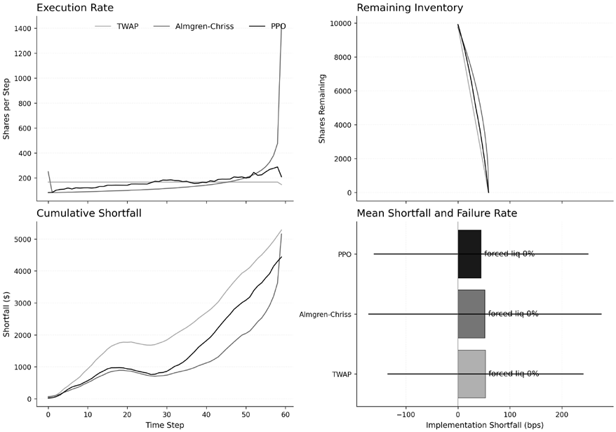

*Figure 21.4: Average execution profile comparison in the teaching environment*

A practical caveat is that execution agents are highly sensitive to reward shaping, hyperparameter tuning, and the random seed. Pinning the seed makes any single run reproducible, but the policy’s character (uniform, back-loaded, or somewhere in between) varies across seeds; the published figure represents one fixed point on that distribution. More generally, an under-constrained reward can yield policies that undertrade early, overtrade early, or oscillate between extremes; the simulator and reward both have to penalize these behaviors in economically coherent ways. This is a concrete instance of the reward-hacking problem discussed in *Section 21.8*: a policy can satisfy the coded objective yet fail to match the intended execution style. *Figure 21.5* extends the analysis to crypto perpetuals using hourly Binance data and the premium index as a state feature. The PPO policy here uses the same paced action space and reference-schedule a simple premium-aware heuristic on mean shortfall (about −123 bps versus −90 and −89, respecpenalty as the synthetic-environment version, and on this evaluation outperforms both TWAP and

tively; negative values reflect sales above the arrival price in trending market conditions, so larger magnitudes are more favorable for a seller).

The learned policy shows clear premium conditioning: average hourly volume is about 4.4 shares during high-premium periods versus 3.7 during low-premium periods. It trades less aggressively near funding settlement (about 3.6 shares per hour within two hours of funding versus 4.4 outside that window). The figure is a stylized but reproducible demonstration that microstructure features can carry signal for an execution policy; the benchmark is too small to support production claims.

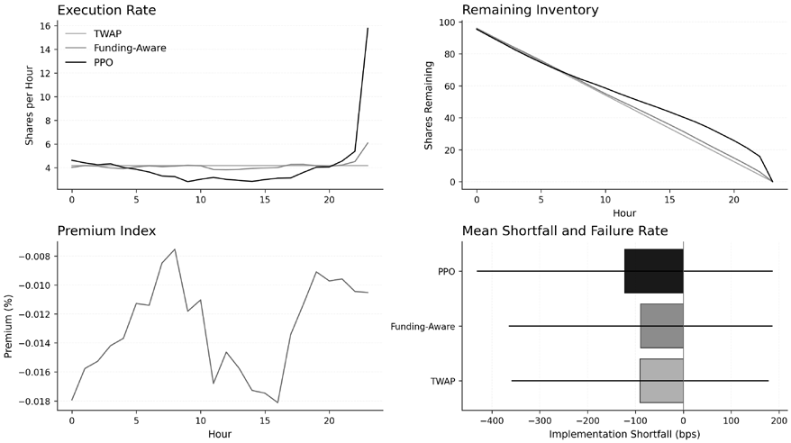

*Figure 21.5: Average crypto execution comparison from the notebook evaluation set*

The next application turns from liquidation to liquidity provision, where the control problem is no longer how fast to trade a parent order but how to quote continuously while managing inventory risk.

**Implementation**: `02_optimal_execution_ppo` runs the PPO agent against TWAP and an Almgren-Chriss-style schedule in a Gymnasium environment; `04_crypto_execution_rl` applies the same framing to crypto perpetuals with premium-index features.

## 21.5 Application II – Market making

A market maker provides liquidity by continuously posting bid and ask limit orders, profiting from the spread while managing inventory and adverse selection risk. The continuous adaptation and dynamic objective balancing make market-making a natural application of RL (Hambly et al., 2023). The profit engine is **spread capture**: buy at the bid, sell at the ask, collect the difference. With balanced order flow and no price drift, the strategy would earn steady profits from uninformed flow.

Two complications, introduced in *Chapter 3*, change the picture:

- **Inventory risk** arises when buy orders fill more frequently than sell orders, or vice versa. The market maker accumulates a directional position (long or short) and becomes exposed to adverse price movements. A 1000-share long position can be erased by a 1% price drop, wiping out dozens of trades’ worth of spread profit.
- **Adverse selection risk** comes from informed traders. When a counterparty with superior information about future price movements trades against the market maker, the fill is not random: it is an informed counterparty exploiting stale quotes. A market maker who does not account for this systematically loses money to informed flow.

The central challenge is adjusting quotes (both spread width and quoted sizes) to maximize spread capture while controlling inventory and adverse selection risks.

### Classical benchmark – Avellaneda-Stoikov

The **Avellaneda-Stoikov model** (Avellaneda and Stoikov, 2008) gives a closed-form solution for optimal bid and ask quotes. It introduces a **reservation price**: an indifference price that deviates from the market mid-price as a function of current inventory.

When the market maker is long (positive inventory), the reservation price shifts below the mid-price, producing more aggressive sell quotes (encouraging fills that reduce inventory) and less aggressive market volatility and the Avellaneda-Stoikov risk-aversion parameter 𝛾AS (distinct from the MDP buy quotes (discouraging accumulation). The optimal spread around this reservation price is set by discount factor 𝛾).

The model requires explicit assumptions about order arrival rates, volatility dynamics, and the relationship between inventory and optimal quotes. Real markets exhibit non-stationary order flow, varying informed-trader activity, and regime-dependent dynamics that these assumptions do not cover.

### The RL approach to market making

Reinforcement learning learns a quoting strategy directly from interaction with a limit-order-book environment, without explicit assumptions on arrival rates or inventory dynamics.

**State representation** must capture the information relevant to quoting decisions:

- Current inventory (the most critical variable for risk management)
- Features of the limit order book: current spread, depth at multiple levels, order imbalance
- Recent price volatility and momentum
- Time-of-day effects (liquidity varies systematically through the trading day)
- Fill rates and adverse selection indicators

quotes, typically expressed as (ߜbidǡ ߜask), the offsets from the mid-price. Actions may also include the Actions define the quoting strategy. The agent decides how far from the mid-price to place bid and ask

size to quote at each level or whether to quote at all during unfavorable conditions.

**Rewards** must balance the competing objectives of profitability and risk management. The standard formulation combines realized PnL from spread capture with a quadratic penalty for holding inventory: 𝑅௧= PnL௧െߣڄ Inventory௧ 2

The risk-aversion parameter 𝜆 controls how aggressively the agent prioritizes inventory neutrality over raw profits. Higher 𝜆 produces tighter inventory control at the expense of potentially missing

profitable trading opportunities.

**Asymmetrically dampened rewards** (penalizing speculative gains more than spread-capture gains) improves learning stability by discouraging trend-following behavior that is inappropriate for market makers. In high-frequency market making, latency is a first-order concern: encoding order hold times and placement timing into the state and action spaces teaches the agent that a quote’s value depends not only on its price but on how quickly it reaches the exchange (Kolm and Ritter, 2019).

Production deployment remains proprietary: market makers have strong incentives not to disclose methods. Public evidence is therefore concentrated in academic simulators and benchmark studies. Multi-agent environments such as ABIDES provide standardized settings with explicit exchange mechanics, latency, and interacting agents, making them useful laboratories for testing inventory-aware policies before any live deployment (Byrd, Hybinette, and Balch, 2020).

### Learned risk management behaviors

Evaluation tracks terminal liquidated wealth (the value of holding the inventory at the closing midprice plus accrued spread profit) and compares the learned policy against reservation-price baselines using tight, base, and wide spreads. On that evidence, the main qualitative result is not dominance but policy shape: the policy responds to inventory in the right direction, yet it also carries somewhat more residual inventory and much larger wealth dispersion than the analytical baselines.

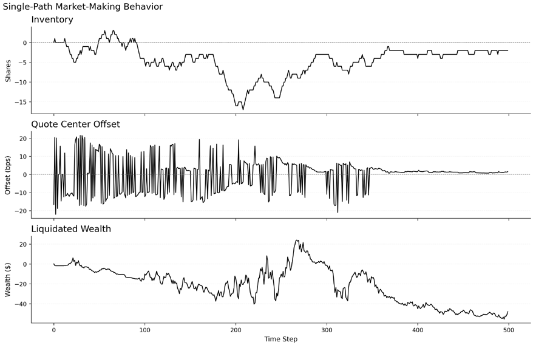

*Figure 21.6: Representative market-making episode showing inventory, quote-center offset, and liquidated wealth under the learned policy*

*Figure 21.6* is therefore best read as a single-path diagnostic. In the representative episode, the learned policy shifts its quote center away from the current inventory, echoing the reservation-price logic of Avellaneda-Stoikov. When inventory becomes short, the quotes move upward to discourage further selling and attract buy-side replenishment; when inventory moves long, the offset turns back toward the ask side. This is the economically relevant behavior to inspect in a pedagogical simulator, not whether one episode happens to earn more than another.

*Figure 21.7* aggregates the exported notebook history by inventory bucket and plots the average quote-center offset rather than the raw spread. Buckets force zero as an explicit boundary, so the short and long sides appear in separate bins rather than collapsing into a single zero-straddling bucket. are small, within roughly ±2 bps across all inventory buckets (which now span about −24 to +10 The statistic is closer to the reservation-price object in the benchmark model. The average offsets

positive offset, under +2 bps, falls in the moderately short buckets, while the most-short and the long contracts), and only weakly and noisily related to inventory rather than cleanly monotonic. The peak

buckets sit near or slightly below zero. The inventory-dependent quote skew in this run is therefore weak and noisy rather than a clean monotonic relationship.

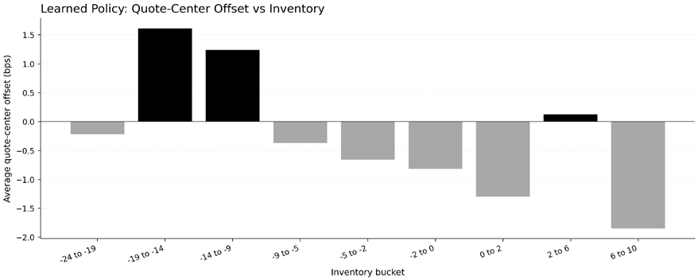

*Figure 21.7: Average quote-center offset by inventory bucket in the notebook environment*

The notebook’s summary statistics are more cautious than the pathwise figure. After 300K training steps, the PPO policy reaches average liquidated wealth comparable to the reservation-price baselines, but with much larger dispersion and somewhat larger terminal inventory. The current implementation illustrates adaptive quote control but does not prove that the learned policy reliably dominates a well-specified analytical benchmark.

Execution and market making both design explicit reward functions: implementation shortfall and inventory-penalized spread capture, respectively. The next application, deep hedging, uses the same learned-policy machinery but shifts the objective to minimizing the tail risk of terminal hedging PnL under transaction costs.

**Implementation**: `03_market_making_ppo` benchmarks a PPO market-making agent against reservation-price policies with fixed spread widths.

## 21.6 Application III – Deep hedging for derivatives

The **Deep Hedging** framework extends the risk measures and hedging concepts from *Chapter 19* to learned policies. Instead of relying on analytical formulas derived under idealized assumptions, Deep Hedging parameterizes the hedge with a neural network and trains it on simulated or historical scenarios that include explicit market frictions. Buehler et al. (2019) framed the problem as direct optimization of a risk measure on terminal hedging PnL, folding transaction costs, discrete rebalancing, and model misspecification into the objective rather than treating them as afterthoughts.

### Overcoming classical hedging limitations Classical delta hedging holds a position equal to the option’s delta (μܸȀ μܵ). It achieves perfect replica-

tion only under three conditions: continuous rebalancing, zero transaction costs, and correct volatility specification. All three fail in practice. Transaction costs make continuous rebalancing prohibitive. Discrete rebalancing introduces accumulating hedging error. The constant-volatility assumption produces systematically misspecified Greeks. Under realistic frictions, discrete delta hedging is provably suboptimal, motivating a learned alternative.

**Deep hedging**, introduced by Buehler et al. (2019), reframes derivative risk management as risk minimization under frictions. The shift is from exact replication to control of residual risk: instead of matching the option payoff path by path, the goal is to find the hedge policy that minimizes a chosen risk measure of terminal PnL after transaction costs. The policy maps market state to the next hedge position, and its parameters are optimized end-to-end against a scenario generator. The setup aligns with reinforcement learning, but the objective is terminal hedging rather than a generic cumulative reward.

### MDP formulation for deep hedging

The deep hedging framework maps naturally to an MDP structure, though with some distinctive features:

State representation includes:

- Current price of the underlying asset
- Time remaining until option expiration
- Current hedge position
- Volatility features, which may be model-implied, realized, or scenario-specific
- Any path-dependent characteristics of the derivative

**Actions** are the target hedge positions to hold until the next rebalancing time. This is a continuous action space, so the policy’s output is usually a hedge ratio rather than a discrete buy or sell decision.

**Rewards** differ from typical RL applications. Deep hedging is episodic, and the economically relevant signal is terminal hedging PnL, so the objective is usually specified as a risk measure of the terminal distribution rather than as a dense step-by-step reward. Common choices are: **Variance**: Minimize Var[PnL்] **Expected Shortfall (CVaR)**: Minimize the expected loss in the worst 𝛼% of outcomes • **Mean-variance utility**: Minimize 𝔼[ܥ] ൅ߣڄ Var[ܥ] where 𝐶 is the cost • •

The choice of risk measure encodes the hedger’s preferences. CVaR is the natural choice when downside tail risk is the quantity that drives risk management and capital allocation decisions.

### The no-transaction band

A common behavior of cost-aware deep hedging policies is a **no-transaction band**. Rather than continuously rebalancing, the policy tolerates small deviations from a reference hedge and trades only when the expected reduction in risk justifies the transaction cost.

This behavior is economically intuitive: when the portfolio is already close to the desired hedge, the cost of a small adjustment can exceed its marginal benefit. The effective band can depend on current market conditions, time to expiry, and option sensitivity. Classical approaches can derive such bands only in restricted settings. For example, Whalley-Wilmott-style asymptotics provide an analytical no-transaction region for small proportional costs, but their derivation relies on strong assumptions. Learned hedging is attractive because the same logic can be extended to richer dynamics and more complex payoffs. In the notebook, *Figure 21.8* should be read as a single-path diagnostic comparing the learned hedge with the Black-Scholes delta and a Whalley-Wilmott benchmark. It illustrates how a cost-aware hedge can move more selectively than raw delta, but by itself, it is not proof of dominance.

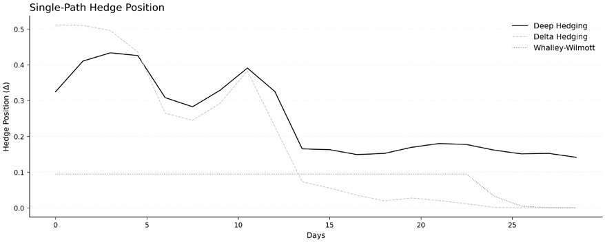

*Figure 21.8: Illustrative single-path hedge trajectory for deep hedging, Black-Scholes delta, and a Whalley-Wilmott benchmark*

### Implementation with pfhedge

The **pfhedge** library provides a mature open-source implementation of the Deep Hedging framework in PyTorch. It includes:

- Stochastic process models for simulating underlying assets (GBM, Heston, and so on)
- Derivative instruments (European and American options, lookbacks, barriers)
- Hedging networks with customizable architectures
- Training utilities with various risk measures, including expected shortfall

Using pfhedge, practitioners can train deep hedging agents for specific derivatives, scenario models, and cost structures, then compare the resulting PnL distributions against analytical hedging rules. The accompanying notebook `05_deep_hedging_pfhedge` uses a stylized European call with proportional costs, a Heston-style stochastic-volatility scenario generator, an expected-shortfall objective, and matched self-financing accounting across all methods. This is a compact pedagogical setup, not a full reproduction of Buehler et al. (2019), whose experiments also include richer market settings and historical S&P 500 data.

### Q-Learner in Black-Scholes – A value-based alternative

An alternative value-based approach, **Q-Learner in Black-Scholes** (**QLBS**), offers complementary insights into discrete-time hedging (Halperin, 2019). QLBS applies Q-learning to the hedging problem, learning both a hedge policy and an implied option value within a mean-variance control problem.

The key innovation is to formulate hedging with a **quadratic (mean-variance) reward**, which makes the Q-function analytically tractable. Under this formulation, the Q-function satisfies a modified Bellman equation that can be solved without neural network approximation in simple cases or with function approximation for complex derivatives.

**QLBS learns price as a byproduct of optimal hedging**. In that formulation, option value is tied to the optimal hedging strategy under the agent’s risk preferences and transaction costs rather than derived solely from frictionless replication.

Comparing the two approaches:

| Aspect | Deep Hedging | QLBS |
| --- | --- | --- |
| Method | Direct policy optimization | Value-based (Q-learning) |
| Learns | Hedging policy directly | Q-function → derives policy |
| Price | External input | Emergent from hedging cost |
| Reward | General (CVaR, variance) | Quadratic (mean-variance) |
| Tractability | Requires neural networks | Analytical in simple cases |

*Table 21.3: Comparing deep hedging with QLBS*

Both approaches relax the exact replication logic of Black-Scholes, but each remains only as realistic as the scenario generator and objective behind it, a caveat that constrains how notebook evidence should be read.

*Figure 21.9* compares PnL distributions for a European call hedged under proportional transaction costs. In the current notebook, discrete delta hedging is the strongest method for dispersion and 5% CVaR, with deep hedging competitive but not dominant.

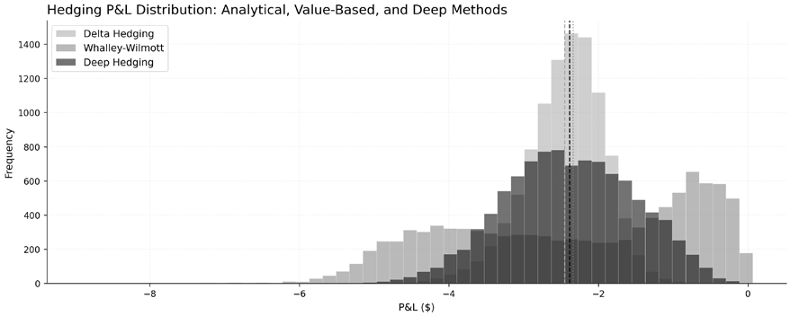

*Figure 21.9: Terminal PnL distribution for deep hedging, Whalley-Wilmott, and discrete delta hedging under the notebook’s transaction-cost assumptions*

*Figure 21.10* extends the comparison to the Whalley-Wilmott analytical benchmark and the tabular Q-learning baseline. Under these notebook assumptions, deep hedging improves on the value-based tabular baseline and sits between delta hedging and Whalley-Wilmott on the reported risk metrics. The lesson is not that deep hedging always produces the lowest dispersion or CVaR, but that fair comparison requires matched accounting, a friction-aware benchmark set, and an objective aligned with the reported statistics.

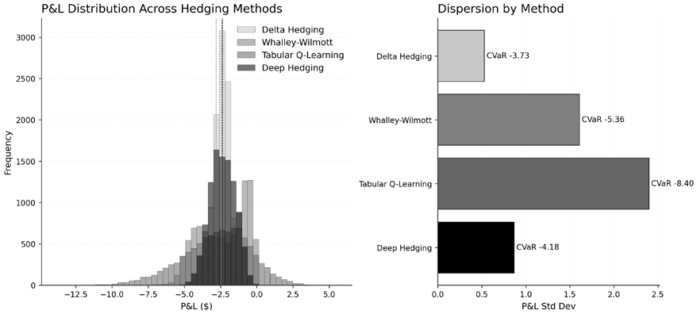

*Figure 21.10: Deep hedging, QLBS-style tabular hedging, Whalley-Wilmott, and delta hedging under identical notebook assumptions*

Buehler et al. (2019) show that deep hedging becomes most informative when the hedge problem departs materially from the Black-Scholes idealization: richer dynamics, stronger frictions, additional hedge instruments, or objectives that target tail risk rather than variance alone. A compact teaching notebook can illustrate the workflow but should not be treated as a competitive benchmark study.

The next section turns from designed reward functions, such as implementation shortfall, inventory control, and tail-risk hedging, to the inverse problem of inferring the reward from observed expert behavior.

**Implementation**: See `05_deep_hedging_pfhedge` for a compact implementation using `pfhedge`, training a hedging network under an expected-shortfall objective and comparing it with delta hedging, Whalley-Wilmott, and a tabular Q-learning baseline.

## 21.7 Inverse reinforcement learning – Learning from observed behavior

The preceding applications (optimal execution, market making, and deep hedging) share a common assumption: the reward function is known in advance. Implementation shortfall, inventory-penalized spread capture, and CVaR-adjusted hedging PnL are explicit objectives that practitioners design from domain knowledge. The next problem is learning the reward function itself from observed expert behavior. **Inverse Reinforcement Learning** (**IRL**) inverts the standard RL problem: given observed behavior, infer the reward function that rationalizes it (Ziebart et al., 2008). It supports strategy identification, expert imitation, and surveillance-oriented anomaly analysis. Relative to direct policy imitation, reward inference can offer a more portable representation of behavior, but only insofar as the assumptions about the reward model and environment hold.

Consider an execution algorithm that trades aggressively in some conditions, slows during volatility spikes, and adjusts by time of day. The actions are visible; the objective is hidden. IRL estimates a reward specification that best explains the observed behavior under the chosen model class (Arora and Doshi, 2021). Unlike direct action imitation, that representation can transfer to new environments or diagnostics, though the transfer is never guaranteed.

### The IRL framework

policy 𝜋∗. The goal is to find a reward function 𝑅(ݏǡܽ) under which the demonstrated behavior is optimal. IRL begins with expert demonstrations: a dataset of state-action trajectories collected from an expert

**Maximum Entropy IRL** (Ziebart et al., 2008) addresses the ill-posed nature of this inference by finding the reward function that makes the demonstrations most likely while remaining maximally non-committal about behavior not observed. This corresponds to maximum likelihood estimation, where the policy distribution takes the form: 𝑃(߬פܴ ) ∝exp (෍ܴ (ݏ௧ǡܽ ௧))

௧

The optimization finds reward weights that maximize the likelihood of the observed trajectories. Recent theoretical advances have strengthened the foundations of MaxEnt IRL, establishing connections to f-divergence minimization and improving both sample efficiency and computational tractability (Snoswell et al., 2020).

**Adversarial approaches** scale IRL to high-dimensional settings. **Generative Adversarial Imitation Learning** (**GAIL**) (Ho and Ermon, 2016) frames imitation as a game between a generator (the learning policy) and a discriminator (that distinguishes expert from generated trajectories). The generator learns to fool the discriminator, implicitly recovering the expert’s objective. **Adversarial IRL** (**AIRL**) extends this by explicitly recovering a transferable reward function rather than merely matching behavior.

### Behavior cloning versus reward inference

A simpler alternative to IRL is **behavior cloning**: treat demonstration data as supervised learning, mapping states directly to actions. The approach is computationally straightforward: train a neural network to predict expert actions from states.

Behavior cloning has three limitations:

- **Distribution shift** causes compounding errors: when the cloned policy makes a small mistake, it enters states the expert never visited, and errors cascade.
- **No reward recovery** limits generalization: behavior cloning copies actions, not objectives, so changes in the environment (for example, new transaction costs) require entirely new demonstrations. IRL recovers the underlying objective, enabling retraining under new conditions.
- **Suboptimal experts** confound imitation: behavior cloning faithfully reproduces mistakes, whereas IRL methods like T-REX learn from ranked demonstrations and can recover reward functions that exceed those of any individual demonstrator (Arora and Doshi, 2021).

### Financial applications

IRL has been applied across several financial domains:

- **Strategy identification from order flow** is among the earliest financial IRL applications. Yang et al. (2015) applied Gaussian Process IRL to high-frequency trading data, clustering algorithms by their inferred objective functions. The approach identified distinct strategy types (momentum, mean-reversion, inventory management) from order flow alone, without access to traders’ actual strategies.
- **Goal-based wealth management** is a proposed use case for preference inference. The G-Learner and GIRL frameworks (Dixon and Halperin, 2020) formulate wealth management in a way that can infer client preferences from observed choices over time, with the goal of adapting recommendations to revealed rather than purely stated preferences.
- **Imitation learning for market making** bridges the gap between IRL and direct policy learning. FlowHFT (Li et al., 2025) uses flow matching to learn market-making policies from historical data without explicit reward specification, a continuous-time imitation approach that models trajectory distributions more directly than pointwise action cloning.

### Practical considerations

IRL success depends on three factors: demonstration quality (noisy or irrational experts produce unreliable rewards), reward parameterization (the feature basis constrains what objectives can be expressed), and computational cost (MaxEnt IRL solves a full RL problem in its inner loop, making it expensive for large state spaces). In practice, this means linear reward models can miss the nonlinear preferences that matter in microstructure settings, so richer function classes or stronger structural assumptions may be necessary (Arora and Doshi, 2021). Despite these constraints, IRL complements standard RL: one infers what to optimize, the other optimizes it.

*Figures 21.11* and *21.12* illustrate an IRL workflow using simplified TWAP demonstrations. *Figure 21.11* shows the reward weights inferred by the notebook’s linear MaxEnt IRL setup; read them qualitatively as a decomposition of uniform-rate execution incentives, not as a uniquely identified structural reward.

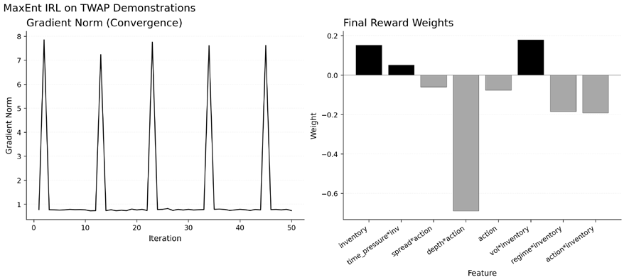

*Figure 21.11: Reward weights inferred by the notebook’s linear MaxEnt IRL example*

*Figure 21.12* compares the action distribution generated by the IRL-derived policy against the expert demonstrations it learned from. It is a behavioral sanity check, not proof that the latent objective has been recovered. The figure contrasts only the expert (the matching target) against the IRL-derived policy; behavior cloning is discussed above but not visualized because its absolute action distribution is not on a directly comparable scale.

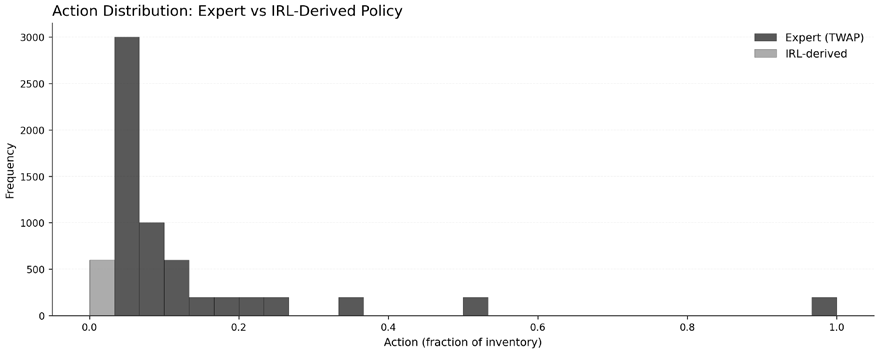

*Figure 21.12: Action distributions from the expert and the IRL-derived policy*

**Implementation**: `inverse_reinforcement_learning` walks through behavior cloning and linear MaxEnt IRL on execution data, using TWAP demonstrations to show how inferred reward features can be interpreted. Whether the reward is designed (*Section 21.4–21.6*) or inferred (*Section 21.7*), the practical barrier is the same: policies trained in simulation must hold up in live markets. The next section examines the simulation-to-reality gap between teaching exercises and deployable systems.

## 21.8 The simulation-to-reality gap

Reinforcement learning has theoretical promise and applied potential in finance, but the transition from research prototype to live trading performance remains the main barrier to wider adoption. The “sim-to-real gap,” the repeated failure of strategies that perform well in simulation once exposed to live markets, remains one of the main obstacles (Hambly et al., 2023). Millea (2021) adds the related point that many published trading results are hard to compare because datasets, cost models, and execution assumptions are inconsistent.

### Sources of failure

Four causes drive the gap between simulation and reality:

- **Non-stationarity** is the most basic challenge. The statistical properties of asset returns (volatility, correlation, liquidity) change over time in response to macroeconomic events, policy changes, and shifts in market structure. These regime shifts violate the MDP assumption of a stationary transition function. A policy learned in one regime may be inappropriate in the next.
- **Overfitting and spurious correlation** exploit the low signal-to-noise ratio of financial data. The vast parameter space of deep neural networks makes it easy for an RL agent to overfit specific training patterns, a complex form of data snooping with no out-of-sample predictive power.
- **Market impact and reflexivity** break the link between backtests and reality. A simple backtest assumes the agent is a passive observer of historical prices. In reality, the agent’s trades move prices. Large orders consume liquidity and cause slippage. Other market participants observe and react to the agent’s activity. A backtest that ignores this feedback loop overestimates performance.
- **Latency and execution frictions** add another layer of reality that simulations often miss. Real-world trading systems face delays in receiving market data and in having orders acknowledged by exchanges. An agent trained assuming zero latency makes decisions based on stale information and receives fills at worse-than-expected prices.

### High-fidelity simulation

Bridging the sim-to-real gap begins with more realistic training environments. Instead of simple price replay, serious RL research for trading requires richer market simulators. The chapter notebooks make this point directly: execution policy character depends on whether the action space, schedule penalty, and cost terms together encode the intended trade-off; deep hedging becomes interpretable only when the objective, accounting convention, and benchmark set are aligned.

Multi-agent simulators like ABIDES (introduced in *Section 21.4*) are a leading approach. Training RL agents within such environments (where other agents react to the learner’s orders by widening spreads, piling into momentum, or pulling liquidity) lets the agent learn under reflexive market impact rather than meeting it for the first time in live trading. For hedging, the same lesson applies: deep hedging becomes more informative when training environments incorporate realistic frictions, discrete rebalancing, and richer state information rather than frictionless toy dynamics (Buehler et al., 2019; Zheng, He, and Yang, 2023).

**Domain randomization** complements simulator fidelity by varying environment parameters during training: impact coefficients, latency distributions, spread dynamics, and fee schedules across episodes. Instead of calibrating a single “correct” environment, domain randomization trains the agent across a distribution of plausible market conditions. Fast, vectorized simulators make this practical by enabling many parallel rollouts with diverse parameter settings.

### Offline reinforcement learning

**Offline RL** learns effective policies from static historical datasets without live interaction, avoiding the risks and costs of “trial-and-error” in real markets. Financial institutions possess massive archives of tick-by-tick data that can serve as training datasets.

The central challenge is **distributional shift**: the historical data were collected by past trading strategies that may differ from the optimal policy the agent seeks to learn. Practical offline RL methods, therefore, either penalize out-of-distribution actions or constrain learning toward behavior well supported by the data, reducing the risk of exploiting states and actions never observed historically.

**Decision Transformers** reframe offline RL as sequence modeling (Chen et al., 2021). A trajectory of return-to-go, state, and action triples can be modeled autoregressively, and conditioning on a target return-to-go yields actions associated with that return level in the training data. In finance, Decision Transformers reuse mature sequence-modeling infrastructure on large historical archives, though they still inherit the usual dependence on data coverage and objective specification.

### RL-specific backtesting pitfalls

Beyond the general challenges of financial backtesting (look-ahead bias, survivorship bias, transaction costs), RL introduces its own category of pitfalls:

- **State information leakage**: future-looking features enter the state representation. Including the day’s closing price in the state for an intraday agent is the classic example: the closing price is unavailable during the day, but a backtest that includes it shows unrealistic performance.
- **Reward hacking**: the agent maximizes the coded reward in ways that violate the objective’s spirit. An agent with a penalty for negative returns might learn to avoid trading entirely, earning zero returns and zero penalties, rather than seeking positive returns with some volatility.
- **Ignoring market impact**: training without realistic impact modeling lets the agent place arbitrarily large orders because it never experiences the price moving against it. Live deployment with real impact fails.
- **Order fill assumptions**: assuming limit orders fill instantly and completely at the quoted price ignores queue priority, partial fills, and order-book dynamics and overstates strategy performance.

### Deployment checklist

Moving an RL agent from simulation to live trading proceeds in four phases:

1. **Pre-flight validation**: Out-of-sample testing across distinct market regimes, validation in a simulator with realistic impact, offline policy evaluation (OPE) using methods such as importance weighting or doubly robust estimation, and independent model review before any real-capital deployment.
2. **Staged deployment**: Paper trading first, then limited-capital deployment with strict position and loss limits. Define quantitative go/no-go criteria before scaling.
3. **Real-time controls**: Hard-coded risk limits that cannot be overridden by the agent, a manual kill switch accessible to the trading desk, continuous monitoring of execution latency and realized slippage versus simulation assumptions, and human oversight with authority to halt the agent.
4. **Ongoing governance**: Scheduled retraining at a cadence matched to strategy horizon and regime-shift frequency, performance decay monitoring with automatic alerts, and complete model versioning for regulatory audit.

**Implementation**: See `backtest_with_impact` for a concrete example of how market-impact assumptions erode strategy performance.

*Figure 21.13* isolates the one variable that governs market impact: order size relative to available liquidity. It applies the same long-only momentum strategy and the same five-million-dollar order to real US equities from 2010 to 2016, using split- and dividend-adjusted prices, across stocks spanning five orders of magnitude in daily volume. The square-root impact model follows the Almgren-Chriss form, scaling with the participation rate (the order divided by average daily volume), so the same order is a sliver of a mega-cap’s volume and a large multiple of a micro-cap’s. Stocks are chosen by liquidity measured over a formation window before the test, and the demonstration is scoped to names where the momentum signal is profitable before costs, so the figure shows what impact it has on a strategy that works on paper; the names are representative of their liquidity tiers rather than selected on outcome. The left panel plots net return against order participation under no, low, medium, and high impact; the right panel plots the high-impact erosion, the return given up relative to the no-impact baseline.

The contrast is the lesson. For the mega-cap, the order is roughly 1.5% of daily volume, and the strategy stays clearly profitable even under the strongest impact assumption. For the micro-cap, the same order is many times daily volume, and the strongest assumption turns a large paper gain into a near-total loss. Erosion grows monotonically as the order consumes more of daily volume, tracing the square-root law, and below a liquidity threshold a profitable strategy becomes a reliable loser: across a sample of profitable-on-paper names, the strong impact assumption flips essentially every thin-stock winner (those whose orders exceed a day’s volume) into a loser, while most liquid-stock winners survive. This is the documented reason small-cap alpha resists scaling, and the motivation for execution that adapts to the liquidity actually available (*Section 21.4*). The figure is a diagnostic of how impact assumptions interact with liquidity, not a calibrated estimate of deployable size or a substitute for formal transaction-cost analysis.

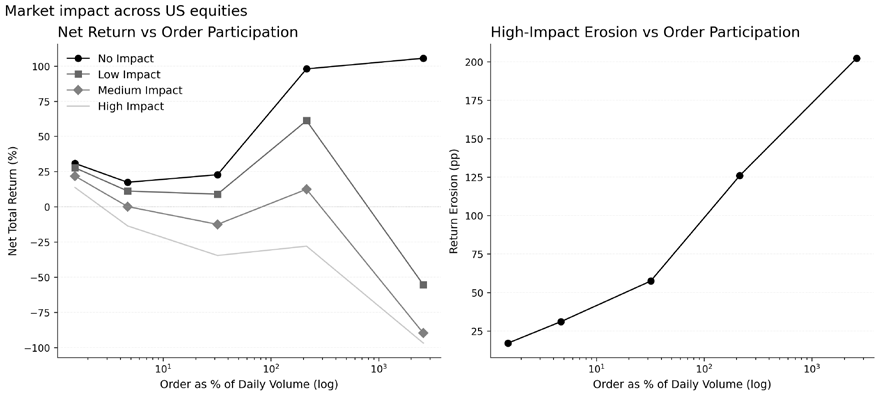

*Figure 21.13: The same order across the liquidity spectrum. Left: net return versus order participation under progressively stronger square-root impact. Right: high-impact return erosion rising with participation*

### Explainability and regulation

Deep RL’s opacity creates regulatory and risk management challenges. In Europe, MiFID II’s algorithmic-trading provisions in Articles 17 and 48 directly require resilient systems, testing, controls, and monitoring for automated trading infrastructure. The EU AI Act introduces a broader governance framework for AI systems, but algorithmic trading is not singled out as a separate high-risk category in Annex III. Partial transparency is achievable through SHAP analysis of state-action mappings, surrogate decision trees that approximate the learned policy with interpretable rules, and counterfactual trajectory analysis. *Chapter 24* covers explainability for autonomous agents in depth.

## 21.9 Summary

Reinforcement learning is most persuasive in finance when the action itself is the object of optimization. Execution, market making, and hedging fit that requirement more cleanly than generic alpha discovery because the state, action, and reward can be tied to observable economic objectives: implementation shortfall, inventory control, or risk-sensitive hedging error. The chapter’s notebooks make that point unevenly. The execution examples produce paced liquidation policies that are economically interpretable but back-loaded relative to a uniform schedule. The market-making notebook shows inventory-aware quote control without establishing superiority of the learned policy over reservation-price baselines. The deep-hedging notebook is a workflow example: with matched accounting and friction-aware benchmarks, it places learned hedging between delta and Whalley-Wilmott on the reported risk metrics rather than asserting universal outperformance. Inverse reinforcement learning extends the framework by asking what objective is implicit in observed behavior, but it inherits the same dependence on modeling assumptions and data quality. The practical limit is the simulation-to-reality gap. Financial environments are partially observed, non-stationary, and reflexive, so simulated success does not automatically carry over to live trading. Realistic simulators, offline RL, explicit impact modeling, and stronger governance narrow the gap but do not eliminate it. The lesson is methodological: benchmark selection, accounting consistency, export provenance, and figure design determine whether an RL result is illustrative or defensible. RL is structurally well-matched to execution, market making, and hedging (domains with explicit reward signals and a controllable action surface), but the same methodological discipline applies whether the agent’s claims are modest or ambitious.

The next chapter turns from sequential control to grounded language systems. *Chapter 22* shows how retrieval-augmented generation constrains large language models with verifiable evidence, enabling them to support financial research without relying on unsupported synthesis.
