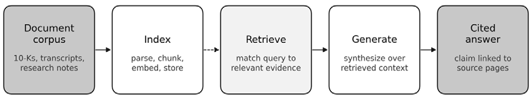
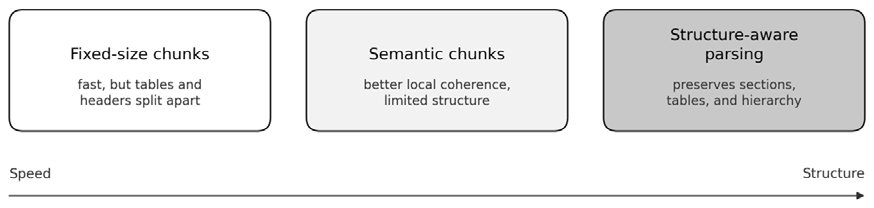
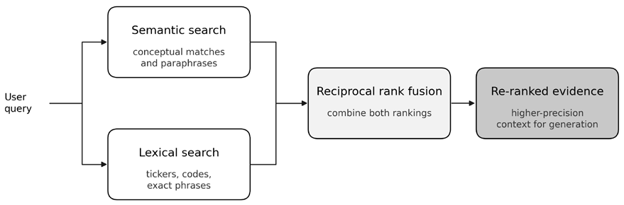
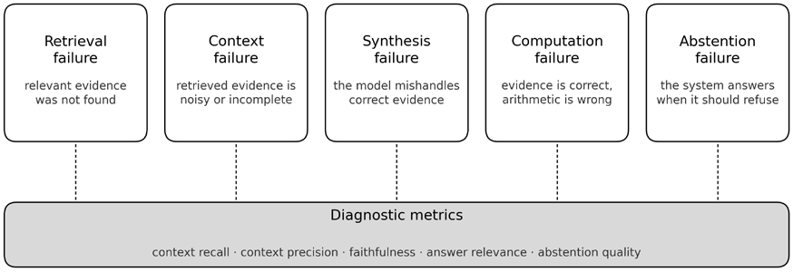
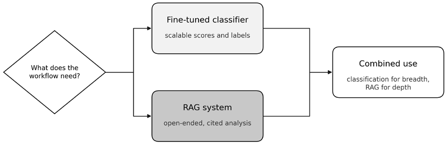

# Chapter 22: RAG for Financial Research

Large language models (LLMs) can synthesize complex financial documents, but they can also fabricate details with persuasive fluency. In finance, that failure mode is not a nuisance; it is a deployment blocker. **Retrieval-augmented generation** (**RAG**) addresses the problem by grounding each answer in a controlled evidence base whose contents, timestamps, and citations can be inspected directly.

This chapter develops a financial RAG system as an engineering stack rather than a prompt trick. After completing this chapter, you will be able to:

- Explain why hallucination makes ungrounded LLM use unacceptable in finance and why retrieval-augmented generation is the core architectural response.
- Design a financial RAG pipeline from document ingestion through retrieval and grounded generation, including structure-aware parsing, chunking, metadata, embeddings, and citation support.
- Compare generic and domain-specific embedding models and evaluate retrieval quality on a target corpus using practical retrieval metrics and latency trade-offs.
- Build a retrieval stack that combines semantic search, lexical search, metadata filtering, and re-ranking to improve precision and recall on financial documents.
- Use constraint-based prompting, citation checks, and tool-verified computation to make generated answers more faithful, auditable, and numerically reliable.
- Diagnose RAG failures by separating retrieval, context, synthesis, computation, and abstention errors, and apply targeted evaluation methods to improve each component.
- Distinguish when to use RAG versus fine-tuning for financial applications, and explain how RAG functions as one tool within broader agentic workflows.

*Sections 22.1-22.2* frame the problem and the core architectural solution. *Sections 22.3-22.6* build the stack from document ingestion through prompting and tool-verified computation. *Section 22.7* introduces the evaluation framework for systematically debugging RAG. *Section 22.8* compares practical applications and the strategic boundary between RAG and fine-tuning, while *Section 22.9* shows how RAG becomes one tool inside broader agent workflows.

## 22.1 From feature extraction to generation

*Chapter 10* built a toolkit for extracting structured features from financial text - sentiment scores, risk categories, feature vectors - using domain-adapted transformers such as FinBERT (Huang, Wang, and Yang, 2020) and earlier lexicon-based approaches, such as the Loughran-McDonald dictionary (Loughran and McDonald, 2011). These outputs feed directly into trading signals and risk models, but classification has a ceiling.

A fine-tuned FinBERT model can tell you *if* a sentence in a 10-K filing is negative, but it cannot explain *why*. It cannot synthesize information from disparate sections, answer multi-hop questions, or generate a narrative summary. The practitioner’s interaction is limited to a fixed taxonomy. But a human analyst’s job is to ask questions like: *“What drove the revenue increase in the European segment, and what risks were cited for those operations?”* A discriminative classifier cannot answer this.

Modern Large Language Models shift the practitioner’s goal from “extract a feature” to “ask a complex question” (Saha et al., 2025). Built on the Transformer architecture (Vaswani et al., 2017) and refined through instruction tuning, LLMs are designed for *generation*: their primary output is human-readable content - summaries, analyses, answers - not numeric features.

These capabilities - multi-step synthesis, in-context learning, and instruction following - improve sharply with scale and instruction tuning (Wei et al., 2023). In finance, LLMs can generalize from a few prompt examples to perform complex sentiment analysis without domain-specific fine-tuning (Xie et al., 2024; Lopez-Lira and Tang, 2025). The model effectively learns a new task from context, enabling analytical work previously exclusive to human experts: summarizing Management’s Discussion and Analysis (MD&A) sections, drafting investment theses, or identifying risk factors in dense regulatory filings.

This power comes with an inherent flaw: **hallucination**. LLMs produce outputs that are plausible, confident, and grammatically correct but factually wrong or entirely fabricated (Lopez-Lira, Tang, and Zhu, 2025). Hallucination is an intrinsic property of a probabilistic model trained to predict the next most likely token, not a bug to be patched.

In finance, this risk is unacceptable. A single hallucinated fact, such as an invented revenue figure, a fabricated regulatory requirement, or a misattributed CEO quote, can lead to flawed investment decisions, compliance breaches, or legal liability. Recent finance-specific research has documented adjacent failure modes that reinforce the same operational lesson: LLMs can exhibit systematic bias in investment analysis and can appear more reliable than they are when memorization contaminates forecasting tasks (Lee et al., 2025; Lopez-Lira, Tang, and Zhu, 2025). The exact failure pattern depends on the task and evaluation protocol, but the implication is stable. Fluent output is not self-verifying, and even occasional unsupported claims are unacceptable in high-stakes settings.

Post-hoc fact-checking does not scale and fails to address the root cause: the model’s generation process is opaque, so correcting one output leaves the underlying flawed logic intact. The solution must be *architectural* - a framework that constrains the LLM to generate only over trusted, verifiable information. This is the core principle behind Retrieval-Augmented Generation.

## 22.2 Grounding LLMs with retrieval-augmented generation

**Retrieval-Augmented Generation** (RAG), first formalized by Lewis et al. (2020), addresses hallucination at the architectural level. Instead of trusting the model’s parametric knowledge (information encoded in its weights during pre-training), RAG constrains the LLM to rely on *non-parametric* knowledge - an external, curated knowledge base that the system controls and can verify. Because generation draws on retrieved context, every claim can, in principle, be linked back to a specific source document, page, or passage. Achieving reliable provenance in practice requires the citation-verification techniques discussed in *Section 22.6*.

### The index-retrieve-generate pipeline

A RAG system combines an information retrieval system with a large language model in three stages:

1. **Index (Offline)**: This is the preparatory stage where the knowledge base is created. The system ingests and processes a corpus of trusted documents, for example, SEC filings, earnings call transcripts, research reports, or regulatory guidelines, and converts it into a searchable format. Each document is parsed and split into smaller, manageable chunks of text. Each chunk is then passed through an **embedding model**, which converts the text into a dense numerical vector representation. These vectors, along with their corresponding text chunks and metadata (source file, page number, section header), are stored in a **vector database** optimized for similarity search.
2. **Retrieve (Online)**: When a user submits a query, the retrieval stage is initiated. The user’s natural-language question is converted into a vector embedding using the same model used during indexing. The vector database is then queried to find the *k* text chunks whose vectors are most semantically similar to the query vector, typically measured by cosine similarity. These top-*k* chunks constitute the retrieved context - the set of source documents that the system believes are most relevant to answering the question.
3. **Generate (Online)**: In the final stage, the retrieved text chunks are combined with the original query into a single, comprehensive prompt. This augmented prompt is sent to an LLM with a crucial instruction: **synthesize an answer based only on the provided context**. This constraint is the architectural mechanism that enforces grounding. The LLM is explicitly told not to rely on its internal knowledge but to act as a synthesis engine over the supplied evidence. The output is a generated answer, ideally accompanied by citations pointing back to the source chunks that support each claim.

*Figure 22.1* illustrates this three-stage architecture, showing how documents flow through parsing, embedding, and storage during the offline phase, and how queries trigger retrieval and LLM-powered synthesis during the online phase.

*Figure 22.1: RAG indexes documents offline, retrieves evidence online, and generates only over retrieved context*

### The orchestration layer

Frameworks such as **LlamaIndex** (optimized for RAG pipelines: ingestion, indexing, retrieval) and **LangChain** (a general-purpose LLM application framework with modular chain and agent patterns) abstract the plumbing that connects parsers, embedding models, vector databases, and LLMs. Both are open-source and evolving rapidly; the choice depends on whether the workflow is RAG-centric (LlamaIndex) or part of a broader agent architecture (LangChain). Newer entrants like **Haystack** offer alternatives.

The simplicity of this paradigm is both its strength and its limitation. A naive implementation that uses fixed-size chunks, a generic embedding model, and simple vector search fails on the complex, jargon-filled documents common in finance. Production systems require advanced techniques at every stage: structure-aware parsing, domain-specific embeddings, hybrid retrieval, re-ranking, and constraint-based prompting. The remaining sections build this stack from the bottom up.

## 22.3 Intelligent document ingestion

The performance of any RAG system is capped by the quality of its knowledge base, and that quality begins with document ingestion. Financial documents - SEC 10-K and 10-Q filings (whose structure is introduced in *Chapter 4*), earnings call transcripts, prospectuses, and regulatory guidelines - are long and dense, containing a heterogeneous mix of prose, tables, embedded images, and hierarchical structures. Naive ingestion destroys this structure and degrades retrieval.

### The failure of naïve chunking

The simplest ingestion method is fixed-size chunking: splitting a document into blocks of 500 or 1,000 characters with some overlap. This approach is computationally cheap but semantically destructive. Financial tables - a critical source of quantitative data - are arbitrarily fragmented, with column headers separated from their values. Section headers like “Item 7. Management’s Discussion and Analysis” are divorced from the paragraphs they introduce. Risk factor bullet points are split across chunks, losing their logical grouping.

The result is what practitioners call “context confusion.” When the retrieval system fetches these fragmented chunks and passes them to the LLM, the model may conflate information from different fiscal years, misattribute statements to the wrong sections, or fail to synthesize a coherent answer because the necessary context is scattered across unrelated chunks. Naive chunking violates the very premise of RAG: that retrieved context provides a reliable grounding for generation.

### Chunk size – The fundamental trade-off

Chunk size is among the most consequential hyperparameters in RAG system design, yet it receives comparatively little attention.

*Small chunks* of about 200–300 tokens have higher retrieval precision - the system can pinpoint the exact relevant sentence or paragraph. But small chunks lack context. A sentence stating “Revenue grew 15%” is meaningless without knowing which segment, which period, and whether this was organic or acquisition-driven. Small chunks force the retrieval system to fetch many pieces and hope the LLM can reassemble them correctly.

*Large chunks* of 1,000–2,000 tokens, however, have more self-contained context per chunk, reducing the need for cross-chunk synthesis. But larger chunks dilute relevance - if only one paragraph in a 1,500-token chunk is relevant, the embedding represents an average of relevant and irrelevant content, potentially harming retrieval accuracy. Large chunks also consume more of the LLM’s context window.

A common starting point is 400–600 tokens for financial documents, with 50–100-token overlap, but these are defaults, not universal answers. The optimal size depends on the document types, query patterns, and the LLM’s context budget. Treat chunk size as a hyperparameter: evaluate retrieval recall across a grid of sizes (256, 512, 768, 1024) on an evaluation set before committing. *Figure 22.2* compares fixed-size, semantic, and structure-aware chunking strategies, illustrating the trade-off between speed and quality.

*Figure 22.2: Fixed-size chunks are cheapest, while structure-aware parsing preserves the most usable context*

A practical resolution is **Parent Document Retrieval** (“small-to-big”): retrieve using small, precise chunks but pass the larger parent section to the LLM. Each paragraph gets its own embedding for retrieval precision, but when a paragraph matches, the system returns the full subsection. This captures precise matching with rich context at the cost of maintaining a chunk-to-parent mapping during ingestion.

### Structure-aware parsing

The solution to naive chunking is **structure-aware parsing**: tools that understand a document’s semantic layout. Rather than treating a PDF as a character stream, these tools identify and preserve section boundaries, paragraph groupings, table layouts, and list hierarchies. **LlamaParse**, developed by the creators of LlamaIndex, is a representative example. It uses a combination of vision models and LLMs to intelligently reconstruct a document’s logical structure from its visual rendering. Tables are extracted not as fragmented text but as structured Markdown or JSON, preserving rows, columns, and headers. Charts can be processed by a vision model to generate textual summaries of their content. Hierarchical relationships between sections and subsections are preserved, enabling retrieval systems to recognize that a paragraph discussing “European revenue” belongs within the broader context of “Geographic Segment Analysis.”

**Docling** (created by IBM) provides an open-source alternative with a hybrid parser that combines layout detection, table recognition, and text extraction. **Marker** focuses on high-fidelity PDF-to-Markdown conversion. The tooling landscape evolves rapidly; by the time of publication, newer options may have emerged. The stable principle is structure preservation - evaluate tools on that criterion rather than brand loyalty.

These tools are not infallible. Scanned PDFs require **optical character recognition** (**OCR**) as a preprocessing step, which can introduce transcription errors. Filings with non-standard layouts - nested tables, multi-column sections, footnotes spanning page breaks - can confuse even vision-based parsers. Tables rendered as images rather than HTML are particularly problematic: the parser must detect (via OCR) and reconstruct the table structure, a pipeline in which errors compound. Validate parser output on representative documents before trusting it at scale. In financial RAG, ingestion errors are effectively irreversible downstream: once tables, headings, or temporal markers are lost, later retrieval and generation stages cannot reliably reconstruct them.

### Multimodal content – Tables, charts, and images

Financial documents are inherently multi-modal. A 10-K filing contains not just prose but tables of financial metrics, organizational charts, flow diagrams, and occasionally embedded images. Ignoring this content sacrifices significant information density.

Tables are particularly critical - they often contain the quantitative facts analysts most frequently query. Structure-aware parsers convert tables into Markdown or JSON while preserving row-column relationships. The challenge is that tables in PDFs are often visually rendered without an underlying structure, requiring vision models to reconstruct the logical layout.

Charts and figures may contain information absent from the surrounding text - for example, a revenue-by-segment bar chart may be the only place where segment growth rates appear. Vision-language models, both closed and open-weight, generate textual descriptions that are indexed alongside prose. The cost is non-trivial: each image requires a vision-model API call during ingestion, adding latency and expense. A practical heuristic: always process tables (high information density, structured output); process figures selectively when they contain quantitative data not duplicated in the text.

An emerging alternative bypasses text extraction entirely: **vision-first retrieval** models like ColPali (Faysse et al., 2025) index document pages as images and retrieve them using vision-language embeddings. This sidesteps parsing errors but sacrifices structured metadata such as section hierarchy, statement type, or fiscal periods that financial RAG depends on for filtered retrieval and verifiable citations. Text-extraction pipelines remain the production default; vision-first approaches are worth monitoring as models mature.

### Metadata – The key to verifiable citations

Beyond content parsing, the ingestion stage must tag each chunk with rich **metadata**. At minimum: source document name, page number, and section header (for example, “Item 1A. Risk Factors”). For financial documents, **temporal metadata is critical**: fiscal year, fiscal quarter, filing date, and period end date. A query about “Apple’s 2023 risk factors” must not retrieve 2022 disclosures, and a question about “most recent guidance” must prefer the latest filing.

Without explicit temporal tagging, the retrieval system cannot distinguish between current and stale information - a particularly dangerous failure mode in finance where outdated data can be worse than no data at all. Beyond fiscal year and quarter, ingestion should enforce **point-in-time integrity** by tracking the filing publication date, the fiscal period referenced, and the ingestion timestamp. These fields are not interchangeable: a 2024 fiscal-period disclosure may only become public in 2025. Historical queries and backtests must filter by publication availability, not period labels alone, to prevent information leakage.

Each indexed unit should also include sufficient provenance to support later citation checks, namely its structural role (prose, table cell, footnote, figure caption) and extraction method. Without this modality-aware metadata, citation formatting may appear precise yet still fail to achieve claim-evidence alignment.

This metadata serves two purposes:

1. It enables filtered retrieval: a user asking about “Apple’s 2023 risk factors” can have the system automatically restrict search to chunks tagged with the correct company and fiscal year, improving precision.
2. It enables verifiable citations: when the LLM generates an answer, it can include page and section references that let analysts navigate directly to the source and verify the information - closing the trust loop essential for any high-stakes financial application.

Metadata tagging is not optional for production-grade financial RAG. The quality of ingestion determines the semantic units available for embedding, and embeddings, which we discuss next, determine what retrieval can find.

**Implementation**: `01_sec_filing_pipeline.py` walks the end-to-end ingestion pipeline for five SP100 issuers: it resolves tickers via `edgartools`, lists the ten target 10-K filings in roughly 2.6 seconds, with filing date and accession number on every record, and then runs a side-by-side parser comparison that quantifies the structure-aware lift. Table preservation roughly doubles (0.45 → 0.85), layout fidelity nearly doubles (0.40 → 0.88), and parse latency increases by about 70% - the cost-versus-fidelity envelope this section frames qualitatively.

The notebook also reports a metadata-integrity audit: filing date and ingestion timestamp populate at 100% on the `edgartools` listing object, while `fiscal_year_end` is absent and must be enriched from the document body downstream, illustrating the point-in-time-integrity discipline emphasized above.

## 22.4 Domain-specific embeddings

The retrieval stage hinges on embedding models - neural networks that convert text into dense vector representations where semantic similarity corresponds to geometric proximity. A query about “interest rate sensitivity” should map to a vector near passages discussing “duration risk” or “yield curve exposure,” even if those exact words don’t appear. But this understanding is learned from training data, and for finance, that creates a gap.

General-purpose embedding models like OpenAI’s `text-embedding-3-small` (as of early 2026) or open-source sentence-transformer alternatives (Reimers and Gurevych, 2019) perform well on broad retrieval tasks but are not fluent in the specialized vocabulary, acronyms, and semantic relationships of finance. The term “alpha” means something entirely different in a portfolio context than in general language. Ticker symbols like “AAPL” or “NVDA” may have weak or noisy representations. Nuanced concepts - ”forward P/E,” “covenant compliance,” “buyback yield” - are unlikely to be well captured by models trained predominantly on Wikipedia and Reddit.

The problem runs deeper than vocabulary. A passage stating “the Fed raised rates by 75 basis points” is semantically connected to “mortgage affordability pressure” and “duration losses in bond portfolios” - but only if the model has learned these causal chains from financial data.

### The FinMTEB benchmark

The **Finance Massive Text Embedding Benchmark** (**FinMTEB**) provides quantitative evidence of this gap (Tang and Yang, 2025). Modeled on the general-purpose **Massive Text Embedding Benchmark** (**MTEB**) that has become the standard for embedding evaluation, FinMTEB evaluates models across retrieval from SEC filings and earnings calls, semantic similarity of financial sentence pairs, downstream classification tasks like sentiment detection, and document clustering by theme or sector.

The benchmark reveals consistent gaps: on retrieval tasks involving financial jargon, cross-document reasoning, or temporal references, generalist models lag domain-adapted alternatives by a substantial margin. The difference is particularly acute for queries involving quantitative concepts (“compare gross margin trends”) or regulatory specifics such as describing fair-value disclosure requirements under SFAS 157 (the Statement of Financial Accounting Standards on fair-value measurement).

### Domain-adapted embedding models

For production financial RAG, the embedding model should be selected using finance-specific evaluation rather than relying solely on a general leaderboard. While FinMTEB shows that domain-adapted models can outperform general-purpose embeddings on financial text, the ranking is not stable across tasks: retrieval over filings, classification of financial news, semantic similarity, reranking, and summarization can favor different models.

The current shortlist (mid-2026) spans both managed APIs and open/self-hosted models:

- Among commercial options, Voyage remains a leading candidate for financial retrieval, with voyage-finance-2 still positioned as a finance-specific model and the newer Voyage 4 family relevant for high-quality general retrieval. Other managed options worth benchmarking include Gemini Embedding, Cohere Embed 4, and OpenAI text-embedding-3-large, especially where enterprise reliability, latency, deployment controls, or multimodal document handling matter.
- Among open or locally deployable models, Fin-E5 remains the finance-adapted reference model from the FinMTEB paper, while Qwen3-Embedding, Qwen3 rerankers, BGE-M3, BGE-en-ICL, and E5/Mistral-derived models are current practical candidates depending on hardware, licensing, language coverage, and latency constraints.

Treat any published ranking as a shortlist. The embedding and reranking landscape changes quickly, and leaderboard averages can hide the task that matters most for the financial RAG system you are aiming to build. For production use, benchmark several candidates on a representative local corpus of filings, earnings call transcripts, research notes, news, and the actual query types the application will serve, then evaluate retrieval recall, citation precision, latency, vector size, cost, and reindexing burden before standardizing on a model.

### Embedding dimensions and quantization

One practical consideration is often overlooked: embedding dimensionality directly impacts storage, memory, and latency. High-dimensional embeddings (1536 or 3072 dimensions) capture more nuance but require proportionally more resources from the vector database. For large corpora - millions of chunks from thousands of filings - the choice matters.

Modern practice increasingly adopts **Matryoshka embeddings** (Kusupati et al., 2022), in which the training objective explicitly packs useful information into the leading dimensions of each vector, so that truncating to the first 256 (or 512, or 1024) dimensions still yields a usable representation. Naive truncation of a conventionally trained embedding does not behave this way; the property has to be trained in. When it is, practitioners can serve shorter vectors to meet latency and storage budgets without retraining. Similarly, **binary quantization** compresses 32-bit float vectors to 1-bit representations - a 32× memory reduction - though the accuracy trade-off depends on corpus and query distribution and should be validated empirically.

### Evaluating embedding models on the target corpus

Public leaderboards like FinMTEB generate a shortlist, but they do not guarantee rank ordering on a specific filing corpus, query mix, or latency budget. “Best on public benchmark” is a hypothesis, not a deployment conclusion. Evaluate empirically on the target corpus using the following checklist:

1. **Sample 50–100 representative queries** that the RAG system will face in production.
2. **Create ground-truth relevance labels** for the top-10 passages each query should retrieve.
3. **Compare candidate models** using Recall@k, Mean Reciprocal Rank (MRR), and latency.
4. **Select by measured trade-offs** between domain-specific and generic models on the deployed document types.
5. **Rerun after shifts** in corpus composition or query distribution.

The incremental cost of this evaluation is modest relative to the payoff. A retrieval system that misses the most relevant passages propagates errors downstream to generation. No amount of prompt engineering compensates for poor retrieval. With strong embeddings in place, the next question is how to search them - and why a single retrieval method is rarely enough. **Implementation**: `02_domain_embeddings_comparison.py` runs the protocol above on a 191-passage 10-K corpus with a 15-query workload spanning risk, technical, and general questions. `BAAI/bge-large-en-v1.5` (1024-d) edges `all-MiniLM-L6-v2` (384-d) by 14.0% on mean reciprocal rank (0.675 versus 0.592) and by 11.1% on Precision@3 (44.4 versus 40.0%). The per-query-type breakdown reveals the more important asymmetry: bge-large leads on technical queries (MRR 0.90 versus 0.73) and on risk queries (0.61 versus 0.48), while MiniLM edges ahead only on the general-business slice (0.56 versus 0.51).

The 14% aggregate MRR spread between the two models is comparable to the variance across query types within a single model, which is exactly why “best on public benchmark” is a hypothesis that has to be validated on your own corpus and query mix.

## 22.5 Hybrid retrieval and vector databases

Pure semantic search has a blind spot, even with domain-specific embeddings. Vector similarity excels at finding conceptually related passages - for example, “profitability concerns” surfaces “margin compression” or “cost overruns.” But it struggles with exact matches: specific tickers, regulatory codes, or quoted figures. A query for “Form 4 filings for TSLA” may retrieve passages about insider trading in general while missing documents containing Tesla’s ticker. In finance, where analysts routinely search for specific companies, dates, and terms, this failure mode is acute.

**Hybrid search** combines two complementary retrieval paradigms (Weller et al., 2025):

- **Semantic (Vector) Search**: Finds passages *conceptually* similar to the query, even if they use different words. Handles synonyms and intent well.
- **Keyword (Lexical) Search**: Finds passages containing *exact terms* in the query. The classic algorithm is **BM25** (Best Match 25), a refined variant of term-frequency–inverse-document-frequency (TF-IDF) scoring that has been the workhorse of information retrieval for decades (Robertson and Zaragoza, 2009). BM25 excels at matching tickers, entity names, and regulatory codes.

By running both in parallel and fusing results, hybrid search balances conceptual relevance with keyword precision. The analyst asking about “AAPL’s capital return program” benefits from semantic search understanding “capital return” as related to “buybacks and dividends,” while BM25 ensures passages containing “AAPL” are appropriately boosted.

### Reciprocal rank fusion

The fusion step typically uses **Reciprocal Rank Fusion** (**RRF**) (Cormack, Clarke, and Buettcher, 2009). A document that ranks highly in *both* methods is more likely to be relevant than one that ranks highly in only one. RRF assigns each document a score inversely proportional to its rank in each list, then sums across methods: 1݇ RRF(݀) = ∑ ൅rank௥(݀) ௥אோ  where 𝑅 is the set of ranking methods, rank𝑟(݀) is the document’s rank in method 𝑟, and 𝑘 is a smooth-

ing constant (typically 60). Documents absent from a ranking contribute zero to that sum.

As a worked example, suppose three documents are retrieved for the query “AAPL supply chain,” with ranks:

| Document | BM25 rank | Semantic rank |
| --- | --- | --- |
| A (exact ticker match) | 1 | 15 |
| B (supply-chain discussion) | 10 | 2 |
| C (loose AAPL mention) | 50 | 8 |

*Table 22.1: Rank fusion example*

With 𝑘 = 60, the RRF scores are:

- RRF(A) = 1/61 + 1/75 ≈ 0.0297
- RRF(B) = 1/70 + 1/62 ≈ 0.0304
- RRF(C) = 1/110 + 1/68 ≈ 0.0238

Document B ranks first. Its consistent presence in both lists beats A’s top-1 BM25 rank, undermined by a weak semantic rank. This is RRF’s characteristic bias: it favors documents well-ranked by *multiple* signals over documents that dominate one signal and fade in another.

RRF is simple and robust, requiring no training and adapting automatically to different query types. Learned fusion - training a model to optimally weight retrieval scores - typically offers only marginal improvement while adding complexity. On a 200-passage 10-K corpus with a 15-query workload mixing entity-heavy and conceptual queries, `03_hybrid_retrieval.py` measures Hybrid (RRF) at MRR 0.443 against BM25’s 0.349, a 27% advantage that holds on precision and recall as well. A generic webtrained cross-encoder rerank stage, by contrast, degrades MRR by 36% relative to Hybrid alone - a useful warning that off-the-shelf rerankers can be miscalibrated on financial passages. *Figure 22.3* visualizes the parallel vector and keyword search merging through RRF.

*Figure 22.3: Hybrid retrieval merges semantic and lexical rankings before generation*

### Beyond bi-encoders – The retrieval architecture spectrum

Dense retrieval in production typically uses a **bi-encoder** - a model that embeds the query and every document independently into a single vector each, so similarity scoring reduces to a fast dot product over precomputed vectors. Bi-encoders are efficient but lose fine-grained token-level alignment; a **cross-encoder** (introduced in *Section 22.6*) recovers that signal at much higher cost.

Between these two extremes lies **late-interaction retrieval**, exemplified by **Contextualized Late Interaction over BERT** (**ColBERT**) and its descendants. These models store per-token embeddings for every document and compute similarity at query time as a sum of per-query-token maxima over document tokens (the “MaxSim” operation). Late-interaction models capture token-level matching that single-vector bi-encoders miss at a fraction of cross-encoder cost, making them practical for first-stage retrieval over large corpora. The trade-off is index size: storing per-token vectors requires substantially more storage than single-vector approaches.

For most financial RAG deployments, bi-encoder retrieval followed by cross-encoder re-ranking (*Section 22.6*) remains the pragmatic choice; late-interaction is worth evaluating when single-vector embeddings consistently miss relevant passages despite tuning.

### Query enhancement techniques

Raw user queries are often suboptimal for retrieval. An analyst might ask: “What happened with their China business?” The retrieval system must resolve “their” to a company, match “China business” to “Asia-Pacific segment” or “People’s Republic of China (PRC) revenue,” and handle temporal vagueness. Several techniques address this:

- **Query Expansion**: Automatically add synonyms or related terms. “China business” expands to “PRC,” “Asia-Pacific,” “Greater China.” Domain-specific expansion dictionaries (mapping “buyback” to “share repurchase” and “capital return”) are particularly valuable.
- **Hypothetical Document Embeddings (HyDE)**: Instead of embedding the query directly, use an LLM to generate a hypothetical answer, then embed that answer (Gao et al. 2023). The hypothesis “The company’s China business experienced a 15% decline due to regulatory headwinds” may retrieve more relevant passages than the sparse original query. HyDE adds latency (an LLM call before retrieval) and introduces a risk: if the hypothetical answer is wrong, retrieval is biased toward incorrect passages. Use HyDE selectively for complex, conversational queries where sparse keyword matching is clearly insufficient, and empirically validate retrieval quality.
- **Query Decomposition**: For multi-hop questions, break the query into sub-questions. “Compare Apple’s and Microsoft’s R&D spending trends” is split into two separate retrieval queries, with results merged before generation. This prevents the retrieval system from having to find passages that simultaneously discuss both companies - such passages may not exist, even if the information is available in separate sections.

### Vector database selection

The indexed embeddings and metadata must be stored in a system optimized for similarity search. In practice, teams choose among managed services, self-hosted vector databases, lightweight local options, and database extensions such as `pgvector`. Product names change more slowly than feature matrices, so durable selection criteria matter more than any point-in-time comparison table. For financial RAG, ask three questions first: does the system support metadata filtering before **approximate nearest neighbor** (**ANN**) search, can it participate cleanly in a hybrid retrieval stack, and does it fit the organization’s existing operational footprint?

For production-ready financial RAG, databases with native hybrid search (Weaviate, Pinecone, Milvus, Qdrant) simplify the architecture. For prototyping, ChromaDB with a separate BM25 index provides a cost-effective alternative. Organizations already invested in PostgreSQL can use pgvector to avoid new infrastructure; similarly, enterprises running OpenSearch or Elasticsearch can leverage their native hybrid search with first-class RRF support rather than introducing a separate vector database.

### Filtered retrieval

Financial queries often include implicit or explicit filters: “Apple’s 2023 10-K,” “risk factors from the most recent filing.” Rather than relying solely on similarity, **pre-filtering** by metadata improves precision.

Modern vector databases natively support filtered search: apply metadata constraints (`company =` `“AAPL”`, `fiscal_year = 2023`, `document_type = “10-K”`) *before* computing similarity scores. The implementation matters: pre-filtering (applying metadata constraints before ANN search) preserves recall because the search operates only over the relevant subset.

**Post-filtering** (searching the full index, then discarding non-matching results) can severely reduce recall if the relevant subset is small relative to the corpus. Most production vector databases now natively support pre-filtering. At minimum, tag each chunk with: company identifier, fiscal year, fiscal quarter, document type (10-K, 10-Q, earnings call), filing date, section header, and page number. This metadata schema enables the most common financial filters and supports the citation formatting discussed in *Section 22.6*.

A concrete example illustrates the risk: an analyst asking “What guidance did management provide for 2024?” without a fiscal-year constraint might retrieve 2022 forward-looking statements that happen to mention 2024 - plausible, well-cited, and dangerously stale.

Retrieval is the foundation of RAG quality. No amount of prompt engineering compensates for passages that the retrieval stage failed to find. But retrieval returns a ranked set of candidates, not a verified answer. The next section addresses the final two stages - re-ranking the candidate set for precision and constraining the LLM’s generation to produce only grounded, citable responses.

## 22.6 Re-ranking and constraint-based prompting

Retrieval optimizes for recall - casting a wide net to ensure relevant documents are captured. The initial retrieval may return 20–50 candidate chunks, some highly relevant, others noise. Two techniques close this gap: re-ranking to sharpen precision and constraint-based prompting to enforce grounding.

### Cross-encoder reranking

A **reranking** step acts as a refinement filter between retrieval and generation. While initial retrieval uses fast but approximate methods (such as vector similarity or BM25), re-ranking employs a more powerful model to re-score each candidate for precise relevance.

The typical architecture uses a **cross-encoder** - a model that takes the query-document pair as a single input and outputs a relevance score (Nogueira and Cho, 2020). Unlike bi-encoders (which embed query and document independently), cross-encoders attend to fine-grained token-level interactions, yielding more accurate relevance judgments at the cost of pairwise computation:

1. **Initial retrieval**: Fast search returns the top 50 candidate chunks.
2. **Re-ranking**: Cross-encoder scores each chunk against the query.
3. **Selection**: Top-5 highest-scoring chunks pass to the LLM.

The latency cost of re-ranking 50 chunks is typically 100–200ms - acceptable for analytical applications but potentially prohibitive for real-time use cases. Options include Cohere’s Rerank API, open-source cross-encoders from the Sentence-Transformers library, and domain-specific re-rankers fine-tuned on financial Q&A datasets.

### Context window management

Modern LLMs offer context windows of 128K to 1M+ tokens, raising a tempting question: why not pass an entire 10-K filing and let the model find what it needs?

This “long-context” approach has three significant drawbacks. First, LLMs struggle to attend to information in the middle of very long contexts - Liu et al. (2024) document strong primacy and recency effects rather than uniform use of the full window. Second, inference cost scales with input tokens: passing 200K tokens when 5K would suffice increases cost substantially with no guaranteed accuracy improvement. Third, time-to-first-token increases substantially. The “lost in the middle” effect is model- and version-dependent; newer architectures may partially mitigate it. Benchmark on the target model before assuming a specific failure pattern.

The pragmatic recommendation: use long context windows as a fallback for complex multi-hop queries, but maintain focused retrieval as the default. A 5–10K-token context of precisely relevant chunks typically outperforms a 100K+-token context of loosely relevant material.

### Constraint-based prompting

The final defense against hallucination is the generation prompt itself. A production-grade RAG prompt imposes explicit constraints that enforce grounding and verifiability:

- **Role** **assignment**: “You are an expert financial analyst conducting due diligence on SEC filings.”
- **Context** **constraint**: “Answer based ONLY on the provided context. Do not use outside knowledge.”
- **Uncertainty** **handling**: “If the context lacks sufficient information, state clearly that the information is not available.”
- **Citation** **instruction**: “For each factual claim, include an inline citation in the format [Page X, Section Y].”
- **Structured** **output**: “Structure your response as: (1) Direct answer, (2) Supporting evidence with citations, (3) Caveats or limitations.”

A critical caveat: **citations are not automatically faithful**. LLMs can cite passages that do not support the claim, blend information across chunks, or generate plausible page numbers that do not exist. Production systems should verify citation fidelity - for example, by requiring the model to quote a supporting phrase alongside each citation, or by implementing automated claim-evidence alignment that validates each citation against the retrieved context. A lightweight verification step: extract each cited passage by its page/section reference, compute semantic similarity between the claim and the cited text, and flag pairs below a threshold for human review. This catches the most common failure - plausible but unsupported citations - without requiring a second LLM call. *Section 22.7* covers how to systematically measure citation fidelity.

The companion notebook `05_10k_rag_assistant.py` demonstrates the narrower but more relevant production pattern used in this chapter: citation-constrained answering, explicit abstention when context is insufficient, and lightweight checks for retrieval coverage and citation presence.

### Numeric reliability and tool-verified computation

Financial queries frequently require not just text retrieval but arithmetic: “What was the year-overyear change in operating margin?” or “How does the current ratio compare to the industry median?” LLMs retrieve the right evidence but routinely make calculation errors - a failure mode distinct from hallucination because the source passages are correct, but the derived answer is wrong.

The reliable pattern for numeric questions is a four-stage pipeline:

1. Retrieve evidence, including table slices.
2. Extract numbers into a structured schema (cells, units, period, segment).
3. Compute via code or tooling rather than the LLM.
4. Generate a narrative explanation with citations and a reproducible calculation trace.

This “retrieve-extract-compute-narrate” pattern delegates arithmetic to deterministic tools and constrains the LLM to what it does well: synthesis and explanation. Agentic frameworks (*Section 22.9*) formalize this by giving the LLM access to a code interpreter as an explicit tool. Even without a full agent architecture, requiring structured numeric output (JSON with extracted values and computed results) and programmatically validating the arithmetic catches most common quantitative errors.

### Programmatic output validation

Prompt-level constraints are necessary but insufficient for production financial systems. Programmatic validation adds a second layer: structured output parsing (JSON mode, function calling) ensures the LLM’s response conforms to a schema; claim-level verification pipelines check each assertion against retrieved context; and guardrail frameworks (such as NeMo Guardrails, Guardrails AI) enforce output constraints - topic adherence, toxicity filtering, format compliance - through code rather than prompt instructions alone. The combination of prompt constraints and programmatic validation is increasingly common in production deployments.

### The prompt as contract

This constraint-based approach transforms the LLM from a generative oracle into a synthesis engine. The model’s task is not to “know” the answer but to articulate what the provided evidence supports. When combined with properly parsed, metadata-tagged, and precisely retrieved context, this architecture produces answers *designed* to be verifiable - the analyst can trace cited claims back to their sources and independently confirm them. The gap between “designed to be verifiable” and “automatically verified” is where production engineering effort concentrates.

The prompt is a contract between the system and the LLM. A vague prompt invites hallucination; a precise, constraining prompt enforces grounding. With the full RAG stack in place, the next challenge is to treat it like any ML system: define metrics, build evaluation sets, and iterate on data.

## 22.7 Diagnosing RAG pipeline bottlenecks

Without systematic evaluation, a RAG system is an opaque pipeline that resists debugging. It might retrieve irrelevant documents, miss key information, or hallucinate despite having the correct context. Anecdotal success on a handful of test queries provides false confidence. Diagnosing *where* the pipeline fails - retrieval, context, synthesis, computation, or abstention - determines *what* to fix.

### Failure modes

RAG failures fall into distinct categories, each requiring different remediation:

- **Retrieval failure** (low-context recall): The correct information exists in the knowledge base, but the retrieval stage fails to retrieve it. The answer is wrong, and manual corpus search reveals relevant passages that were not retrieved.

*Fix*: Improve embeddings, tune hybrid search weighting, or refine chunking.

- **Context failure** (low context precision): Retrieval finds some relevant documents but includes too much noise, diluting the signal. The retrieved context contains tangentially related material but omits key details.

*Fix*: Tune re-ranker thresholds, improve metadata filtering, or adjust chunk granularity.

- **Synthesis failure** (low faithfulness): Retrieval succeeds, and context is accurate, but the LLM generates an incorrect or hallucinated answer - misinterpreting context, failing to synthesize, or ignoring the grounding constraint.

*Fix*: Refine prompts, switch to a more capable LLM, or implement answer verification.

- **Computation failure** (correct evidence, wrong arithmetic): A variant of synthesis failure specific to quantitative queries. The system retrieves the right table or passage, but the LLM miscalculates a derived value - reporting an incorrect year-over-year change or misapplying a formula. This failure is invisible to standard faithfulness metrics because the cited evidence is correct; only the computation is wrong.

*Fix*: Delegate arithmetic to code (*Section 22.6*) and validate numeric outputs programmatically.

- **Abstention failure**: Some questions have no answer in the indexed documents - the user is asking about a company not in the knowledge base, a time period not covered, or information that simply wasn’t disclosed. A well-calibrated system should abstain rather than fabricate. Evaluate refusal quality alongside the other metrics: does the system correctly identify when it lacks sufficient information, and does it communicate uncertainty appropriately?

*Figure 22.4* summarizes the five failure classes and the diagnostics that separate them.

*Figure 22.4: Retrieval, context, synthesis, computation, and abstention failures each call for different diagnostics and fixes*

### RAGAs and claim-level evaluation

**Retrieval-Augmented Generation Assessment** (**RAGA**) provides automated metrics for each failure mode (Es et al., 2024). Datasets like FinDER (Choi et al., 2025) supply ground-truth question-answer pairs specifically designed for financial RAG evaluation:

| Metric | What It Measures | Failure Mode |
| --- | --- | --- |
| Context precision | Are retrieved chunks relevant to the query? | Context failure |
| Context recall | Did retrieval return all necessary information? | Retrieval failure |
| Faithfulness | Is the answer grounded in context (no hallucination)? | Synthesis failure |
| Answer relevance | Does the answer address the user’s question? | Synthesis failure |
| Abstention quality | Does the system refuse when evidence is insufficient? | Unanswerable query |

*Table 22.2: RAGA metrics*

These metrics are computed by using an LLM (often GPT-4) as a judge to evaluate the quality of retrieved context and generated answers against ground-truth annotations or through automated reasoning. While not perfect, they provide a scalable way to benchmark pipeline performance and track improvements over time.

RAGAs measure answer-level quality, but high-stakes financial applications benefit from finer-grained diagnosis. **RAGChecker** (Ru et al. 2024) decomposes generated answers into atomic claims and checks each claim’s entailment against retrieved evidence, yielding an **unsupported claim rate** - the fraction of claims not supported by any retrieved passage. This complements RAGAs: a response may score high on overall faithfulness while containing one unsupported numeric claim that matters most. For production deployments, track unsupported claim rate alongside RAGA metrics, and calibrate LLM-as-judge scores against a human-labeled subset to prevent false confidence. `04_ragas_evaluation.py` instantiates this four-axis harness on a small fixture set and shows the failure-mode separation in action: retrieval scores 0.33 (the weakest stage), grounded-answer quality 0.65, abstention F1 0.50, and security robustness 0.67, with an unsupported-claim rate of 0.50 versus an unsafe-action rate of 0.17 - a useful reminder that ungrounded text generation is typically the more frequent failure and the place to invest guardrail effort first.

The diagnostic workflow has five steps:

1. **Build an evaluation set**: 50–100 representative queries with ground-truth answers and source passages. Stratify by difficulty (single-hop factual, multi-hop reasoning, comparative) and document type. Include 10–20% unanswerable queries. Have domain experts validate ground truth - automated generation introduces the same biases the harness is meant to detect.
2. **Compute baseline metrics**: Run RAGAs on the evaluation set to establish context recall, context precision, and faithfulness.
3. **Isolate the failure mode**: Low context recall → retrieval problem. Low context precision → ranking problem. Low faithfulness → synthesis problem.
4. **Apply targeted fixes**: Address the weakest component - improve embeddings, tune re-ranker, or refine prompts - rather than making untargeted changes.
5. **Monitor continuously**: Use observability tools such as TruLens to track RAG performance in production and detect degradation over time (for example, due to corpus drift or new query patterns).

This diagnostic capability transforms RAG from an opaque pipeline into an engineering system that can be systematically debugged and improved. Without measurement, tuning is guesswork; with measurement, changes can be evaluated against observable trade-offs. Financial workflows add one requirement to the workflow above: **citation traceability**, the ability to tie every factual claim back to a specific source passage. Score it alongside the RAGA metrics in every evaluation cycle.

### Extending the harness to adversarial inputs

The failure modes discussed so far assume benign inputs. A qualitatively different threat arises when the corpus itself contains malicious instructions (such as might come from prompt injection via poisoned documents) or when users craft adversarial queries designed to bypass grounding constraints. If the system includes tool-use capabilities (*Section 22.9*), the attack surface expands further. Security belongs in the same evaluation harness as accuracy rather than in a separate audit: reuse the diagnostic metrics - unsupported-claim rate, citation-failure rate, and abstention behavior - under adversarial prompts so that a regression in robustness looks the same as a regression in accuracy. The notebook `08_rag_security.py` implements a stress-test suite covering prompt injection, retrieval poisoning, and action injection scenarios. On a four-fixture attack set, simple defenses (input sanitization plus retrieval-aware refusal) drive the unsafe-action rate from 0.50 to 0.00 and reduce the unsupported-claim rate from 1.00 to 0.25 (a 75% relative reduction) - a useful demonstration that meaningful robustness gains do not require a model swap, while the residual 0.25 unsupported-claim rate diagnoses what the defense stack still misses.

### Iterative correction loops

The workflow above assumes a human reviews metrics and decides what to fix. An emerging pattern closes this loop automatically: **corrective RAG** (**CRAG**) and **self-RAG** architectures use the LLM itself to evaluate retrieval quality and re-query when initial results are insufficient. If retrieved context scores are below a confidence threshold, the system reformulates the query, broadens the search, or invokes a different retrieval strategy before generating an answer. This turns the static retrieve-then-generate pipeline into an iterative loop - a natural bridge to the agentic frameworks in *Section 22.9*. The trade-off is latency: each correction cycle adds an LLM call. Limit correction rounds for interactive applications; for batch analytical tasks, the additional latency is typically acceptable.

With the evaluation framework established, the next section turns to deployment: applying the full RAG stack to real financial workflows and making the strategic choice between RAG and fine-tuning for different use cases.

## 22.8 Applications and strategic choices

This section applies the RAG architecture from *Sections 22.2–22.7* to three financial use cases, then draws a strategic comparison with fine-tuning.

### The 10-K due diligence assistant

The primary use case for financial RAG is a due diligence assistant for long, dense regulatory filings. An SEC 10-K annual report for a large corporation can span 200–300 pages of financial statements, management discussion, risk factors, legal proceedings, and segment analyses (Lopez-Lira, 2023). Manually searching for specific information - comparing revenue drivers across years, tracing risk disclosures to performance, extracting quantitative commitments - takes hours.

A well-designed RAG system transforms this process. The analyst poses complex, multi-hop questions and receives synthesized answers with page-number citations.

**Example query**:

`Based on the MD&A and Risk Factors sections, what were the primary drivers of` `the 10% revenue increase, and what risks were cited that could threaten this` `growth?`

This question forces the system to connect two different filing regions: the MD&A discussion of what drove growth and the Risk Factors discussion of what could undermine it. A naive pipeline struggles because fragmented chunks obscure the cross-section relationship and a loose retrieval pass may surface only one side of the story. In production, the remedy is the full stack developed earlier in the chapter: structure-aware ingestion, precise retrieval, and citation-constrained generation. The defining feature is **verifiability**: every factual claim in the generated answer should point back to a page or section the analyst can inspect directly. **Implementation**: See `05_10k_rag_assistant.py` for a compact chapter-scale assistant that demonstrates local filing ingestion, top-*k* retrieval, citation-constrained prompting, and lightweight retrieval/citation diagnostics. The notebook notes LlamaParse and richer retrieval backends as production upgrades, rather than as already implemented. The companion `01_sec_filing_pipeline.py` covers EDGAR access and the metadata needed for point-in-time filtering and citation traceability.

Production deployment requires governance controls beyond the technical pipeline: access controls, audit logging of prompts and retrieved context, retention policies, and human-inthe-loop review for externally shared outputs (*Chapter 26*). Security considerations - prompt injection, retrieval poisoning, citation misuse - are evaluated using the diagnostic framework in *Section 22.7*; `08_rag_security.py` implements a dedicated stress-test harness.

### Comparative case study – ESG analysis

ESG analysis illustrates the contrast between the classification paradigm of *Chapter 10* and the reasoning paradigm of RAG.

First, recap the **Fine-Tuned Classification** approach (as seen in *Chapter 10*): a discriminative transformer fine-tuned on labeled ESG text (Baltussen et al. 2025; Zhao, Li, and Zheng, 2020) classifies news articles or disclosure snippets into predefined taxonomies, such as “Environmental-Risk”, “Social-Opportunity”, or “Governance Concern.”

The workflow: collect a labeled dataset, fine-tune a transformer with a classification head, run on incoming documents, and output category labels and confidence scores. This approach is scalable because it turns open-ended text into compact signals that can feed screening, factor construction, and portfolio constraints. The limitation is structural: the model operates within a fixed taxonomy and cannot explain *why* it classified a document or why it answered follow-up questions. The output is a score, not an evidence trail.

**RAG-based due diligence** builds a RAG system over a company’s full-text sustainability reports - the 100+ page documents detailing carbon emissions, supply chain practices, diversity metrics, and governance structures. The workflow: parse and index the sustainability report with structure-aware chunking, build a RAG query engine with domain-specific embeddings, enable the analyst to ask open-ended questions in natural language, and output narrative answers with citations to specific pages and sections.

**Example query**:

`Summarize the company’s Scope 2 emissions reduction strategy, list their key` `performance indicators (KPIs), and identify stated five-year targets - with page` `references.` This approach enables deep qualitative analysis: the analyst can explore nuances, ask follow-up questions, and receive cited answers that can be verified. It augments the human analyst’s judgment rather than replacing it with a score. The limitation is operational rather than conceptual: it requires a maintained document corpus, retrieval infrastructure, and stronger controls around citations, abstention, and governance, and it does not naturally emit the scalable numeric time series that systematic strategies demand. The trade-offs are shown in the following table:

| Dimension | Fine-Tuned Classifier | RAG-Based Q&A |
| --- | --- | --- |
| Primary output | Numeric scores, labels | Narrative answers with citations |
| Scalability | High (batch processing) | Medium (per-query) |
| Flexibility | Low (fixed taxonomy) | High (open-ended questions) |
| Verifiability | Indirect (model confidence) | Direct (source citations) |
| Knowledge updates | Requires retraining | Update corpus, no retraining |
| Best use case | Systematic factor construction | Fundamental due diligence |

*Table 22.3: The strategic trade-off*

A quantitative fund building a systematic ESG strategy - screening thousands of stocks daily based on ESG risk signals - would choose the classifier. The output is a number that feeds directly into portfolio optimization. A fundamental analyst at a long/short equity fund investigating a specific company’s sustainability commitments - preparing for a management meeting or building an investment thesis - would choose the RAG system. The output is insight, not a score.

Sophisticated firms employ both classification for breadth and RAG for depth. The classifier identifies *which* companies warrant attention; the RAG system enables *understanding* what those companies are actually doing. *Figure 22.5* presents this decision framework visually.

*Figure 22.5: Fine-tuning serves scalable scoring, while RAG serves cited, open-ended analysis*

**Implementation**: See `06_esg_rag_vs_finetune.py` for a stylized side-by-side comparison. The notebook is designed to clarify the architectural trade-off between label-producing classifiers and cited narrative workflows, not to serve as a production latency benchmark.

### Generation model selection

The strategic choice extends beyond RAG versus fine-tuning to the generation model itself. **Commercial APIs** (such as GPT, Claude, Gemini) offer the highest capability but require sending documents to external servers - a non-starter for many financial institutions with strict data residency requirements. Open-weight models (such as Llama 3, Mistral, DeepSeek, Qwen) can run on-premise or in private cloud environments, preserving data sovereignty at the cost of lower capability on complex tasks.

The gap is narrowing: **open-weight models** increasingly approach commercial API quality for well-constrained RAG tasks where context provides most of the required information. Choose based on four criteria: capability (does the model follow grounding constraints reliably?), cost (per-query economics at expected volume), latency (acceptable for the use case?), and data residency (can proprietary documents leave the infrastructure?).

Many production deployments use a tiered approach: open-weight for high-volume, routine queries; commercial APIs for complex analytical tasks that require stronger synthesis.

### Production lifecycle

After the demo works, teams spend most of their time on operational concerns that the pipeline architecture does not address:

- **Incremental indexing**: Detect new filings, restatements, and revisions; update embeddings only for changed spans rather than reindexing the full corpus.
- **Corpus versioning and reproducibility**: Version the corpus snapshot, embedding model, re-ranker, prompt templates, and generation model together. Store a compact “retrieval bundle” (query, retrieved chunks, evidence spans, model versions, answer) per response to support audit and reproducibility.
- **Deletions and retention**: Implement tombstoning, legal holds, and retention rules with audit logs - requirements in regulated environments where data cannot simply be deleted.
- **Caching**: Cache query embeddings, re-ranker results, and frequently asked answers with staleness policies tied to filing update cycles.

These concerns are prerequisites for production deployment, not afterthoughts.

### Deployment in regulated environments

Financial RAG systems operate under regulatory expectations that generic AI deployments do not face. Broker-dealer supervisors and the EU AI Act now treat generative AI as in scope for documentation, oversight, and transparency obligations, and large-bank model risk supervision is separately evolving as regulators work out how to distinguish conventional models from generative and agentic systems.

The specifics vary by jurisdiction and entity type, but the design-time implication is stable: build for auditability and provenance from the start - access logs, versioned retrieval bundles, retention and tombstoning - because retrofitting these controls into a live system is far more expensive than designing them in. A full treatment of governance and MLOps appears in *Chapter 26*; the principle here is to involve compliance and model-risk teams early, not after deployment.

### Structured data extraction – Institutional holdings

RAG techniques extend naturally beyond free-text Q&A to structured data extraction from regulatory filings. SEC 13F filings - quarterly disclosures of institutional equity holdings - provide a rich source of signals for quantitative strategies. Parsing these filings programmatically and constructing co-ownership graphs reveals crowding patterns, institutional momentum, and network-based features that complement traditional price-volume signals. Co-ownership features capture slow-moving institutional positioning that price-volume data cannot: when multiple large funds hold concentrated positions in the same stocks, the resulting crowding risk creates co-liquidation vulnerability invisible to standard momentum or value factors. The bipartite graph of institutions and stocks also provides a natural input to the graph neural network methods in *Chapter 23*, where message passing over the ownership network can propagate information about institutional behavior across connected securities.

Each application discussed in this section treats the RAG pipeline as a static retrieve-then-generate sequence. The next section introduces agentic frameworks, in which the LLM can decide *when* to retrieve, *which* tools to invoke, and *how* to decompose multi-step research questions - transforming RAG from a fixed pipeline into a component of an autonomous reasoning loop.

**Implementation**: `07_institutional_holdings_graph.py` shows a pipeline that fetches 13F filings via EDGAR, constructs co-ownership networks, and engineers cross-sectional features.

## 22.9 Introducing agentic frameworks

The RAG systems in this chapter are passive: they wait for a question, retrieve context, and generate an answer. The next evolution moves from question-answering to **autonomous action** - AI agents that plan, use tools, and achieve goals.

An **AI agent** is a system where an LLM serves as the controller for an autonomous process that can plan, use tools, and take actions. The core components are:

- **LLM Controller**: The reasoning engine that interprets goals, plans steps, and decides on actions
- **Tools**: External capabilities the agent can invoke - a RAG system for document retrieval, a web search API, a code interpreter for numerical calculations and statistical analysis, a database query interface, or financial APIs for real-time market data and fundamentals
- **Memory**: Context that persists across interactions, allowing the agent to maintain state, learn from past actions, and build up knowledge over a session

This architecture enables multi-step problem solving that goes well beyond what a static RAG pipeline can achieve. Rather than answering a single question, the agent can decompose a complex goal into subgoals, execute them sequentially or in parallel, handle failures, and synthesize results.

### The ReAct paradigm

The foundational framework for LLM agents is **ReAct** (derived from *Reason* and *Act*) (Yao et al., 2023), which structures behavior as an iterative loop:

1. **Thought**: The agent reasons about what it knows and what it needs to do next.
2. **Action**: Based on this reasoning, the agent invokes a tool or takes an action.
3. **Observation**: The agent observes the result of its action.
4. **Repeat**: The loop continues until the agent determines it has achieved the goal or needs to ask for clarification.

This cycle of reasoning, tool invocation, and observation becomes the starting point for the fuller agent architectures in *Chapter 24*.

The pattern scales to complex analytical workflows: decomposing a research question into sub-queries, invoking the appropriate tool for each (such as document retrieval, API calls, calculations), observing the results, and iterating until a comprehensive answer emerges.

### RAG as an agent tool

A sophisticated agent does not replace RAG; it *uses* RAG as one tool among many. The RAG system built in this chapter - with its parsed knowledge base, hybrid retrieval, and citation-generating prompts - becomes part of the “Document Analysis” tool in the agent’s toolkit alongside web search, code interpreter, database query, and financial APIs.

The agent’s LLM controller orchestrates these tools, deciding which to invoke based on the user’s goal and the results of previous actions. The value of multi-tool orchestration emerges when a question cannot be answered from documents alone. “What is Company X’s current EV/EBITDA (enterprise value to earnings before interest, taxes, depreciation, and amortization) relative to its five-year average?” requires document retrieval for qualitative context, a database query for historical fundamentals, and a calculation for the ratio and comparison. No single RAG pipeline handles all three; an agent routes each sub-task to the appropriate tool.

Not every problem requires an agent - well-designed LLM workflows often outperform agents for structured, predictable tasks, reserving agentic architectures for truly open-ended exploration (Bowne-Anderson, 2025).

### Industry adoption

Financial institutions are moving from experimentation to early deployment, but the frontier is narrower than public claims suggest. Internal research assistants, document-triage tools, and analyst-facing retrieval systems are now in limited production at a growing number of firms.

**Multi-agent architectures** - specialized agents for documents, databases, and calculations coordinated by a supervisor - are well-described in the research literature (Saha et al., 2025; Yu et al., 2024; Kong et al., 2024), but most deployed agentic systems in regulated finance still hold a **human-in-the-loop** at every action that touches external state: order placement, client communications, or account changes.

**Man Group** has publicly discussed using agentic AI to generate quantitative trading signals (Fang and Moore, 2025) - notable because it is one of the few cases where a firm has publicly tied an agentic system to a live signal-generation workflow rather than to a pure research-assistant use case. The trajectory is clear - from features to synthesis to action - but the gap between benchmark demos and audited, production-grade agentic pipelines remains substantial. RAG provides the foundation - grounded knowledge retrieval - upon which agentic systems are built. *Chapter 24* will deliver the full implementation.

## 22.10 Summary

Retrieval-augmented generation is the core architecture for using large language models in financial research without treating model output as self-authenticating. The central design principle is simple: the model should synthesize over retrieved evidence, not over whatever it happens to remember. But making that principle work in practice requires more than a vector store and a prompt. Financial documents demand structure-aware ingestion, domain-sensitive embeddings, hybrid retrieval, re-ranking, constraint-based prompting, and deterministic handling of numeric computation. The result is not an opaque oracle but an auditable research tool whose claims can be traced to specific sources.

A strategic boundary separates RAG from fine-tuning. Fine-tuning is appropriate when the goal is a repeatable skill, such as classification or extraction over stable labels. RAG is appropriate when the goal is evidence-grounded analysis over changing documents and questions. Once that distinction is clear, evaluation becomes equally clear: diagnose failures in retrieval, context, synthesis, computation, and abstention separately, and judge systems by grounded usefulness rather than surface fluency.

The next chapter introduces knowledge graphs, which make entities and relationships explicit when questions depend on paths, networks, and temporal structure rather than on narrative evidence alone.
