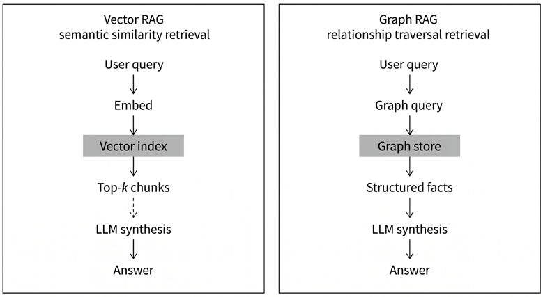
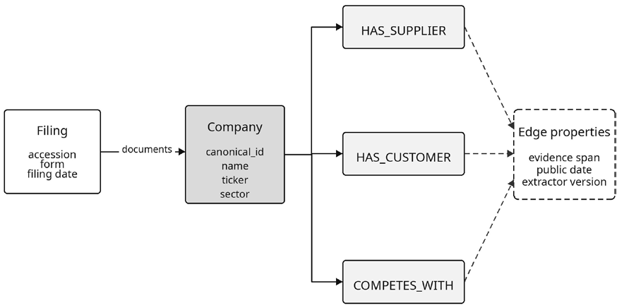
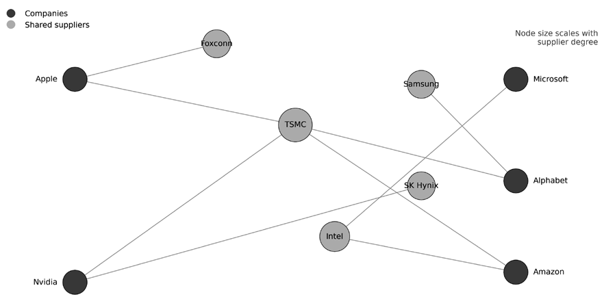

# 第23章：知识图谱

检索增强生成（retrieval-augmented generation；Lewis et al., 2020）让有证据支撑的金融问答变得可行，但向量检索仍在彼此孤立的文本块上运行。当问题取决于持股链条、供应商网络、传染路径或关系变化的时间点时，仅靠相似度搜索并不够。这类问题需要显式的关系结构（见*图 23.1*）。

知识图谱恰好提供了这种结构：实体表示为节点，关系表示为带类型的边，标识符、时间戳与来源信息（provenance）则作为属性附加在节点和边上。本章聚焦为确定性遍历和可审计答案而构建的显式金融知识图谱，而非以主题综合为主要价值的宽泛社区摘要式 GraphRAG 系统。学完本章，你将能够：

- 区分真正需要图结构的金融问题与更适合用表格数据库或向量检索解决的问题。
- 设计紧凑、带类型且可审计的金融知识图谱：实体身份稳定、关系词表有限、边级来源可追溯。
- 构建并验证 LLM 辅助的抽取流水线，把申报文件转换为可回放的图对象，同时控制模式（schema）、重复与时间一致性。
- 阐述 Graph RAG 与向量检索的差异，并通过受限的文本转查询生成与确定性的数据库执行，实现安全的关系查询工作流。
- 将图结构转化为具备泄露意识的机器学习特征，包括拓扑、拥挤度、集中度以及跨图交互特征。
- 以务实的方式评估显式知识图谱、统计金融网络与习得的图表示在预测、投资组合构建和风险分析中的作用。
- 应用三时间戳框架与披露时间截止规则，防止图查询、特征生成和回测中的时间泄露。
- 在图数据库、本体范围、查询安全和模式演进方面，为面向生产的金融系统做出合理的工程决策。

*23.1 节*说明图在何种情况下才值得付出额外开销。*23.2–23.3 节*介绍图的构建与关系检索。*23.4–23.5 节*把图结构转化为特征和基于网络的组合构建输入。*23.6 节*讨论时间完整性，*23.7 节*最后给出保持系统可审计且稳定所需的工程决策。

## 23.1 何时值得为关系结构引入图

并非每个金融问题都能从图中获益。模式设计、抽取和图维护都有开销，只有当分析任务真正是关系型的时候，这些开销才划算：即答案取决于实体之间的路径，而不是孤立实体的属性。

### 图何时带来价值

有三类条件可以稳定地证明图基础设施的必要性：关系横跨多个实体、链接结构复杂，且随时间演化。

#### 多跳依赖查询

需要跨多个实体关联事实的问题是最明确的应用场景。"哪些公司与英伟达（Nvidia）共享关键供应商，这些供应商中哪些位于地缘政治高度集中的地区？"要回答它，需要遍历供应商边、与竞争对手的供应商边求交集，并按地理属性过滤。图数据库把它当作模式匹配来执行；关系数据库需要递归自连接，超过两跳就会变得难以驾驭；向量检索系统则必须从彼此割裂的文本片段中推断路径——而这恰恰是重大错误容易混入的地方。

一个金融动机是**传染分析**。Haldane 和 May（2011）指出，金融系统的稳定性取决于互联结构的架构，即无标度网络"稳健却脆弱"（robust-yet-fragile）的特性。单个节点失效会沿轮辐式结构传播，其方式是个体风险指标无法刻画的。供应链图、银行间借贷网络和交叉持股结构都呈现这种拓扑。

*图 23.1：向量 RAG 检索相似文本块；Graph RAG 遍历显式关系*

#### 结构性拥挤与共同持股

SEC 13F 申报中的机构持仓数据构成一个二部网络：机构持有证券，证券被机构持有。把该网络投影到证券维度，可以揭示共同持股模式，它对收益相关性的预测能力超出基本面因素所能解释的范围。

Antón 和 Polk（2014）表明，通过共同机构持仓相连的股票表现出超额收益联动：收益之所以相关，不是因为公司基本面相似，而是因为同一批投资者同时交易它们。Greenwood 和 Thesmar（2011）将其扩展到价格脆弱性：机构持仓集中的证券面临被迫抛售（fire sale）风险，因为单一持有人的强制平仓会引发持有相似组合的其他投资者同步抛售。

计算共同持股 Jaccard 相似度、拥挤度得分和持仓集中度，都需要遍历机构—证券二部图。刻画脆弱性和拥挤度的特征本质上是关系型的：它们度量的是一只股票在持股网络中的位置，而非其自身特征。Konstantinov 和 Fabozzi（2025）提供了新近证据：跨资产网络的因果溢出效应所传递的风险信息，超出了标准相关性模型的刻画范围。

#### 关系的时间演化

关系会变化。纵向一体化之后，供应商会变成竞争对手。机构建仓往往持续多个季度，之后才显露踪迹。高管在公司之间流动会形成隐秘的信息通道。这些动态先出现在边的模式中，然后才反映到价格数据里。

Li 和 Passino（2024）从新闻语料构建动态金融知识图谱，发现时间性边模式（关系的形成、解除与类型转换）携带对趋势检测有用的主题信号。不断演化的图结构编码了市场状态切换、战略重新定位以及新兴竞争动态，而这些是静态截面特征捕捉不到的。要让这些信号可用于交易，边的时间戳必须区分事件何时发生、何时公开披露、抽取流水线何时观察到它——即 *23.6 节*详述的三时间戳模型。

时序图信号与传统时间序列特征的区别在于，它编码的是**拓扑变化**：不是实体属性的变动，而是关系结构的变动。一条新的供应商连接、一段解除的合作关系或机构持仓的变化，都会改变网络的信息传播特性。这类结构性事件很难用表格特征捕捉，因为它们涉及的是实体之间的关系，而非实体本身。

### 图何时不适用

有三类情况始终无法证明图基础设施的必要性。

#### 单实体属性查询

如果问题是"苹果上季度的营收是多少？"，答案就在单条记录里。图只会增加存储和查询开销，没有分析上的收益。早期知识图谱项目的一个常见错误是把实体属性编码为图关系（例如 `Company -HAS_REVENUE-> $500B`），这让查询更复杂，却不带来任何关系层面的洞察。

#### 大语料上的叙事综合

当任务是"总结 500 份分析师报告的主要主题"时，瓶颈在于文本理解，而非关系遍历。GraphRAG（edge et al., 2024）等社区摘要方法通过构建实体社区的统计摘要来应对这类任务，但其核心价值在摘要而非图结构。带聚类和重排的向量检索往往能以更低的基础设施开销达到相当的质量。

#### 关系稀疏的图

图分析以合理的密度为前提。如果知识图谱有 10,000 个实体却只有 500 条边，中心性指标会不稳定，社区发现会产生退化簇，网络特征只会增加噪声而非信号。一个粗略的经验法则：平均节点度低于 2–3 时，大多数拓扑指标都不可靠。

稀疏往往是抽取失败的征兆，而非领域本身的属性：如果标普 100 公司的供应链图只有不到 200 条边，应先改进抽取流水线，图基础设施才有用武之地。

### 实用决策框架

一个有用的检验：把问题改写成路径模式。如果它能自然分解为"找出经由关系链条连接的实体"，图表示多半是合理的。如果问题只涉及单个实体的属性，或需要对大量文本做摘要，更简单的工具更合适。

本章余下部分假设走图路线是合理的，并着手解决实践中的难题：从金融申报文件构建可靠的图对象（*23.2 节*），查询图对象进行关系推理（*23.3 节*），抽取机器学习特征（*23.4–23.5 节*），维护时间完整性（*23.6 节*），以及搭建配套基础设施（*23.7 节*）。

**实现**：`09_knowledge_graph_features.py` 演示基于紧凑供应链图与持仓图导出的 notebook 规模关系特征；`10_network_portfolio_construction.py` 演示从真实收益数据导出的市场网络结构。

## 23.2 构建金融知识图谱

知识图谱实践的核心变化，不在于 LLM 能抽取三元组——老系统也能做到——而在于现代模型能把冗长、嘈杂的申报文件映射为结构化输出，其灵活性足以取代大部分手工编写的解析逻辑。这一转变改变了项目的成本结构，让团队能在真实语料上快速迭代。

在金融领域，仅快是不够的。无法回放、审计和修正的图是一种负债。实践要求有两点：用 LLM 提供抽取吞吐量，同时以数据契约约束输出，使其在模型版本更替和数据更新之间保持稳定。

### 从旧式流水线到目标导向的抽取

在 LLM 出现之前，多数团队采用两种路线之一。基于规则的系统使用正则表达式和关键词文法：在狭窄模板上精准，模板之外则脆弱。监督式关系抽取模型对语言变化更稳健，但需要昂贵的标注数据，且文档风格变化后要反复重新训练。Elhammadi et al.（2020）用结合 NER、依存句法分析和模式匹配的前 LLM 流水线处理金融新闻，在前 100 条抽取结果上达到 78% 的精确率——这在当时是很好的成绩，但需要针对每个语料做大量工程。

两种路线有共同的结构性缺陷：抽取与模式设计松散耦合。工程师往往先规范化文本，再设法把它塞进图对象。这种顺序导致反复出现的失败模式：实体重复、关系名称漂移、来源字段缺失。

基于 LLM 的抽取颠倒了这一顺序：先定义模式。提示词和结构化输出约束迫使模型直接产出可直接入图的对象，工程精力从解析清洗转向验证和监控。

### 先治理，后提示词

一次稳健的抽取运行始于三份契约：身份、模式和来源。

#### 身份契约

提法不等于身份。"Apple""Apple Inc."和"AAPL"可能指同一家公司，因此绝不应作为独立的规范节点各自持久化。抽取层应保留提法，而在单独的规范化步骤中解析规范标识符（CIK、股票代码、LEI，以及相关情况下的 CUSIP/ISIN）。

金融数据中的身份消解比简单去重难得多。股票代码会变（Facebook → Meta），并购会从旧实体中产生新实体（Dow/DuPont → Corteva + DowDuPont），同一名称在不同司法辖区可能指不同实体。一种实用的规范化策略是：以稳定标识符（如 CIK 或 LEI）作主键，把股票代码作为带有效期区间的时变属性存储。公司行为（并购、分拆、更名）应被当作更新身份属性的一等事件，而不是临时应对的例外。

#### 模式契约

关系词表应当有限且带类型。实践中，这意味着一份带显式"源—目标"约束的关系类型白名单。生成的边一旦违反约束，就会被拒绝或转入人工审核。

#### 来源契约

每个被接受的节点和边都必须携带足够的元数据，能回答两个问题："这一论断来自哪里？"以及"它何时公开？"至少要存储来源文档 ID、申报/公开日期、来源位置（章节/页码/文本跨度）、抽取时间戳和抽取器版本。这些契约让高覆盖率的抽取可维护，并让下游分析可解释。

### 五阶段抽取工作流

面向生产的工作流通常包含五个阶段：

1. **定向文档切片。** 把抽取集中在关系密集的申报段落。对 10-K 流水线而言，Item 1、Item 1A 和 Item 7 是常见起点。这样可以排除几乎不含关系级证据的样板章节。
2. **模式约束生成。** 使用 JSON Schema 或类型化函数输出方式，让产出的对象无需脆弱的文本解析即可验证。
3. **规范化与去重。** 解析别名、合并重复项，并保留提法级别的证据。
4. **规则校验。** 强制执行关系白名单、类型约束、日期合理性检查和来源完整性检查。
5. **人工审核队列。** 把低置信度或违反规则的对象转给分析师裁定。

每个阶段都应输出诊断信息和失败计数，以支持迭代式质量改进。流水线应当幂等：用同一版本的抽取器重新处理同一份申报文件，应产生完全相同的图对象。

如 FinReflectKG（Arun et al., 2025a）所示，反思驱动的修正让模型在验证之前先批评并修订自己的抽取结果，从而提高合规率。反思循环分三步：抽取候选三元组，对照模式规则评估，为违规项提出修正。这种迭代至收敛的模式对实体规范化（例如把"John Ternus, CEO of Apple"拆分为独立的 Person 和 Role 实体）和关系类型约束的执行尤其有效。

### 错误分类与监控

团队通常只监控抽取精确率就止步了。对图工作负载而言，还有四个指标很重要：

- **模式合法率**：满足类型约束的产出对象比例
- **来源覆盖率**：携带完整证据元数据的已接受边比例
- **重复节点率**：未解析别名被映射为不同规范节点的情况
- **时间一致率**：事件/公开/抽取时间戳相互一致的边比例

这些指标对应不同的失败类别。模型的文本质量可以很高，但一旦身份或来源质量崩塌，图的可用性仍会下降。跨抽取运行追踪这些指标还能发现模型退化：一次提示词改动可能改善了实体抽取却损害了时间一致性，标准 NLP 评估对此不可见，图质量指标却能暴露它。一个实用的监控目标：进入生产图的边，模式合法率高于 90%、来源覆盖率高于 95%。除自动化指标外，还应定期抽样已抽取的边，由分析师为正确性和来源充分性打分。维护一个冻结的"金标准子集"（gold subset）申报文件，验证抽取输出在提示词和模型更新后保持稳定。这种回归测试能抓住总量指标掩盖的质量退化。

### 供应链模式示例

考虑从 10-K 申报文件构建供应链图。目标是为标普 100 成份股抽取三族关系：供应商依赖、客户集中度关联和竞争关系。

模式应当小巧、带类型且带版本：

| 对象 | 核心字段 | 用途 |
| --- | --- | --- |
| 公司节点 | 规范 ID、名称、股票代码、行业 | 跨申报文件的身份稳定性 |
| 申报文件节点 | 受理号、表格类型、申报日期 | 来源可追溯 |
| `HAS_SUPPLIER` 边 | 证据文本跨度、公开日期、抽取器版本 | 依赖关系分析与可审计性 |
| `HAS_CUSTOMER` 边 | 证据文本跨度、公开日期 | 集中度分析 |
| `COMPETES_WITH` 边 | 证据文本跨度、公开日期 | 市场结构查询 |

*表 23.1：模式示例*

流程如下图所示：

*图 23.2：连接公司、申报文件与带类型关系边的最小供应链模式*

设计原则是把证据随边存储。没有来源上下文的关系，在下游模型中难以验证、修正和信任。这个模式刻意保持精简：五类对象覆盖了核心分析用例。随着抽取流水线成熟，可以逐步扩充出更大的模式；但从小模式起步能降低验证复杂度，让错误诊断有章可循。

一个重要提醒：**10-K 申报中披露的供应链关系是部分的、有选择性的，有时还是刻意含糊的**。公司只披露被要求报告或愿意强调的关系，并不提供完整的供应商清单。这使 10-K 抽取成为一个高精确率、低召回率的来源。另一处噪声来自 LLM 抽取环节："leaf merchants""vendors""third parties"之类的泛化占位实体会以候选供应商的面目出现，需要在规范化阶段维护一份精选的停用列表来保持图的干净。当用例需要更广的覆盖面时，可以叠加结构化数据集或供应商数据集，并通过身份契约加以对账。KG 模式为此留有余地：来自不同来源的边携带不同的来源元数据，下游使用者可以按来源置信度过滤。

流水线从 EDGAR 获取 10-K 申报文件，按股票代码分片存为 Parquet 文件，并在抽取前从本地缓存重建合并的参考产物。文本从携带关系信号的章节切片，尤其是 Item 1（业务）、Item 1A（风险因素）和 Item 7（管理层讨论与分析，MD&A）。定向切片降低了抽取噪声和单份文件的处理成本。抽取阶段执行上述工作流：实体规范化合并常见别名、丢弃泛化占位实体，并为每条被接受的边关联来源申报元数据。

把抽取出的图可视化后，结构性集中度比只看原始三元组更容易检视。在当前的 notebook 规模运行中，台积电（TSMC）、富士康（Foxconn）和三星（Samsung）等共享供应商凸显为连接多家下游公司的桥接节点。这正是图表示想要暴露的那种关系型集中。

*图 23.3：notebook 规模的抽取凸显共享供应商是连接多家下游公司的集中度节点*

幂等写入让重跑保持稳定，并支持带版本的刷新。实践中，这意味着采用以规范节点身份和关系类型为键的合并式加载逻辑，然后更新边级来源字段，如来源文档、来源章节、来源文本跨度、公开日期、抽取时间和抽取器版本。关键属性是行为层面的而非语法层面的：重新处理同一份申报文件应更新同一条关系记录，而不是制造一份平行副本、推高下游的路径计数。

Graph RAG、图导出的机器学习特征和时序图分析都依赖这一基础。如果抽取不能保留身份与证据，下游系统就会继承隐藏的错误；如果保留了，同一批申报语料就能成为可复用的关系基底，支撑多种分析。LLM 并没有取代数据纪律，而是让有纪律的图构建得以规模化。图对象就绪后，下一个问题是如何查询它们。*23.3 节*将展示 Graph RAG 如何把关系逻辑交给数据库，而把语言生成留在模型中。

**实现**：`01_sp100_sec_download.py` 负责从 SEC EDGAR 获取申报文件，`02_supply_chain_kg_construction.py` 是抽取与加载流水线。该 notebook 基于暂存的 EDGAR 缓存、一个运行中的 Neo4j 实例和一条本地 LLM 抽取路径工作。

这次暂存运行处理了 601 份 10-K 申报文件，覆盖 101 家标普 100 公司，去重后抽取出 1,057 条唯一的带类型关系（供应商边 276 条、竞争对手边 472 条、客户边 309 条），涉及 127 家不同的主体公司；台积电、富士康和三星作为连通度最高的三大供应商浮出水面，分别服务 61、33 和 28 家下游公司。缓存的 Parquet 附带一个 `extracted_triples.meta.json` 文件，固定记录内容哈希、模式、行数和抽取器身份。

## 23.3 用 Graph RAG 做确定性关系推理

**Graph RAG** 用 LLM 做语言理解，用图数据库做关系检索。多跳连接由数据库引擎执行，分析师因此可以围绕问题反复迭代，而不必每次重新设计提示词链。

对答案取决于显式关系路径的问题，Graph RAG 最为擅长：

- "哪些竞争对手与 X 公司共享供应商？"
- "哪些机构同时持有某家公司及其关键供应商？"
- "哪些敞口在日期 T 之前已经可见？"

对叙事性和开放式问题，向量检索仍然更合适。"半导体公司面临哪些主要风险？"这样的问题，用向量检索在风险因素披露上检索，比图遍历效果更好。实践中，多数生产系统是混合式的：关系结构走图检索，叙事证据走文档检索。查询路由阶段负责判断每个进来的问题适合哪条路径。

### 端到端架构

一条稳健的 Graph RAG 路径包含五个阶段：

1. **查询路由。** 把进来的问题分为图、文档或混合三类。这减少了不必要的文本转 Cypher 生成，并提高非关系型问题的回答质量。
2. **文本转 Cypher 生成。** 从紧凑的模式表示和明确的查询策略生成 Cypher。模式中只应包含查询接口被允许使用的标签、关系和属性。并非所有问题都适合自由形式的查询生成；许多生产团队使用参数化模板库，由 LLM 路由器选择并填充合适的模板，而不是生成任意的 Cypher。这缩小了攻击面，也简化了验证。
3. **查询安全校验。** 在执行前校验生成的查询。这对金融部署是结构性要求，不是可选的加固。校验层应强制执行：只读数据库角色、白名单内的标签和关系、参数化取值（绝不使用字符串拼接）、超时和行数上限保护，以及写入/管理类关键字拦截。
4. **确定性检索。** 执行校验通过的 Cypher，返回带来源元数据的结构化行。关系连接由数据库处理，LLM 无需从文本片段中推断连接路径。
5. **有据综合。** 用检索到的行组成最终答案，并引用来源证据。综合提示词应原样包含检索到的行，并指示模型在陈述时引用具体行。由于边携带证据指针（如文档 ID、章节、跨度偏移），系统可以取回支撑每条关系的原文片段，与图结果一并呈现。这种双层引用（图行加底层申报文本）可以防止一种常见失败模式——"知识图谱说 X"，却拿不出原始证据。

这种分工把检索逻辑留在数据库、语言生成留在模型，调试时更容易定位错误。

### 查询流程示例

考虑这样一个问题："哪些公司与苹果竞争并共享其供应商？"在 Graph RAG 系统中，模型不会靠复述松散相关的文段来作答，而是把请求路由到受限的文本转 Cypher 路径，生成一条针对 `COMPETES_WITH` 和 `HAS_SUPPLIER` 关系的只读查询，并施加截止日期过滤，使只有查询时点已公开的关系入选。数据库返回结构化的行，如竞争对手名称和共享供应商；模型再把行转写成文字，同时保留底层证据链接。截止日期过滤不是实现细节。在金融领域，它是防止历史分析泄露截止后信息的机制。

在本书的教学工作流中，同样的模式被用于真实的机构持仓图。"哪些机构同时持有苹果和微软？""伯克希尔·哈撒韦最大的持仓有哪些？"这类问题被路由到一组紧凑且经过验证的 Cypher 模板，而非无约束的查询生成。这个接口比完全通用的 Graph RAG 智能体窄，但更接近经过审计的生产系统通常的部署方式。

### 显式 KG 的 Graph RAG 与社区摘要式 GraphRAG 的比较

如 Peng et al. (2024) 的综述所述，实践中常见两类图检索。**显式领域 KG 的 Graph RAG** 使用带类型的实体和确定性遍历，适合需要来源与回放的受监管金融工作流。**社区摘要式 GraphRAG**（Edge et al., 2024）从语料主题构建图抽象，以支持宽泛的摘要。它擅长主题综合，但对模式受控、需要审计线索的关系型查询并不直接。两类方法互补。本章侧重显式领域 KG，因为它直接对应可审计的金融推理和下游特征工作流。

### 评估与失败模式

一套实用的 Graph RAG 评估框架检查三项性质：查询有效性（生成 Cypher 的语法与模式合规性）、来源覆盖率（返回论断中关联到来源证据的比例）和时间正确性（历史截止约束下的准确性）。

两个新近基准用真实金融数据提供了标准化评估。FinDER（Choi et al., 2025）提供 5,703 组由专家标注的"查询—证据—答案"三元组，来自标普 500 公司的 10-K 申报。它的查询反映了分析师真实的搜索行为：简写、含糊且领域专属。FinDER 评估的是广义检索（稀疏和稠密方法都涵盖），并非专门针对 Graph RAG，但它的发现——生成质量强烈受制于检索质量——为在关系型问题上采用结构化图检索提供了有力佐证。

FinReflectKG-MultiHop（Arun et al., 2025b）检验一个具体论断：对多跳金融推理，KG 引导的证据优于文本窗口检索。它构建于从标普 100 申报文件（2022–2024）导出的 FinReflectKG 知识图谱之上，生成需要跨公司、跨年度、跨申报章节进行 2–3 跳推理的分析师式问题。与页面窗口检索相比，KG 引导的检索把正确率提高了约 24%，同时把 token 消耗降低了约 85%。这一效率收益说明结构化检索不仅更准确，而且更经济：模型把 token 花在对预先筛出的事实做推理上，而不是在嘈杂的上下文中穿行。

**常见失败模式**包括：生成的 Cypher 中出现凭空捏造的标签或属性、遍历范围过宽导致返回嘈杂的行、历史查询缺少截止过滤，以及综合漂移——生成的文本超出已返回的证据。这些都是工程问题：严格的校验闸门、保守的查询模板和回归测试套件能解决其中大部分。多数生产部署把关系型问题路由到图路径，把叙事型问题路由给向量检索。当图结果与向量结果冲突时，时间元数据通常能消解分歧：只要时间戳可靠，以更新的证据为准。

Graph RAG 与向量 RAG 是不同的检索契约：数据库执行关系逻辑，模型解释结果。这一契约得到执行时，多跳金融问题就从启发式综合走向可重复的分析。Graph RAG 回答关于既有结构的问题；下一节将把同一结构转化为表格特征，供梯度提升模型和因子回归使用。同样的模式也体现在 notebook 对运行中的 13F 持仓图所做的正面对比基准上。在涵盖持有人查询、共同持股连接和组合构成的七个分析师式问题上，结构化图检索的支持集召回率达到满分（1.00），而嵌入基线平均只有 0.13。向量检索在持仓查询上完全失效（召回率 0.00），对相关的共同持股行（0.17）和直接持有人行（0.30）也只能返回一小部分。图检索每次查询消耗的 token 也只有大约三分之一（82 对 267），因为遍历只返回符合模式的行，而不是一大堆候选文本块。差距的幅度取决于语料和问题类型，但方向与 FinReflectKG-MultiHop 的发现一致：在关系型问题上，结构化检索更准确，单次回答也更便宜。

**实现**：`03_graph_rag_qa.py` 是 13F 持仓图上的文本转 Cypher 流水线；`04_rag_comparison_benchmark.py` 在覆盖 10 家机构和 250 只股票的 10,624 行持仓数据上做图检索与嵌入检索的对比。

## 23.4 从图到机器学习特征

前几节构建的知识图谱（来自 10-K 申报的供应链关系、来自 13F 的机构持仓）编码了传统价格类特征捕捉不到的结构信息。图分析把这种结构转化为表格特征，供梯度提升（*第12章*）和因子模型（*第14章*）使用。

这些算法从网络结构中提取标量特征。已有研究报告了文本衍生网络特征的预测价值（Kertkeidkachorn et al., 2023），但效应大小取决于数据集设计和评估方案。

### 网络拓扑特征

核心特征来自量化每个节点结构重要性的中心性度量：

| 特征 | 计算方式 | 金融含义 |
| --- | --- | --- |
| PageRank | 迭代式影响力传播 | 供应链重要性——被众多公司依赖 |
| 介数中心性 | 经过该节点的最短路径占比 | 瓶颈位置——扰动由此广泛传播 |
| 聚类系数 | 局部连接密度 | 冗余度——高聚类意味着存在替代路径 |
| 度 | 直接连接数 | 即时网络暴露——连接越多，传导渠道越多 |

*表 23.2：网络拓扑特征*

不同的中心性度量携带不同的信息。**PageRank** 识别系统性重要公司，并按依赖方的重要性加权。**介数**识别瓶颈公司——它们一旦失效，网络就会部分断连。把多种中心性度量作为独立特征，可以让下游模型自己学习哪种结构角色对给定预测任务更重要。

### 供应链风险特征

除拓扑之外，供应链 KG 还能支撑领域特定的风险指标。在 notebook 工作流中，这些指标从抽取出的图本身导出，而非来自人工标注的供应商主数据。例子包括供应商数量、共享供应商数量、单一来源数量、供应商重叠率和供应商依赖得分。合起来，这些特征把供应关系多元化的公司与风险集中于少数已披露交易对手的公司区分开来。

一家公司若依赖少数几家共享的上游供应商，它在结构上就是脆弱的，哪怕没有任何一份申报直接写明这种风险。图使这种集中度可度量，而且是以能与其他特征族连接的形式。

### 机构拥挤特征

13F 持仓知识图谱揭示了携带价格动态预测信息的持股模式。从机构—证券二部网络可以导出**四个特征族**：

1. **拥挤度得分。** 机构持有人数相对截面中位数的比值，衡量一个持仓有多拥挤。拥挤度高的股票在市场承压时面临相关联的抛售压力：一家持有人的强制平仓会引发其他持有人连环抛售（Greenwood and Thesmar, 2011）。
2. **聪明钱集中度。** 业绩居前的机构按市值加权持有的份额传递知情信念的信号，反映的是分析判断而非指数跟踪。
3. **持股赫芬达尔指数**（见*第17章*）。持仓在机构间的集中度预测被迫抛售风险。同样总量的机构持股下，由三只大基金持有的股票比由三十只小基金持有的股票更脆弱。
4. **共同持股 Jaccard。** 两只股票机构持有人集合之间的 Jaccard 相似度，对收益相关性的预测超出仅凭基本面因素所能解释的范围。Antón 和 Polk（2014）表明这种共同持股效应在经济上是显著的：由共同机构持仓相连的股票表现出超额联动，其驱动因素是关联交易行为，而非共同基本面。

Konstantinov 和 Fabozzi（2025）提供了新近证据：基于网络的因果溢出指标携带简单相关性模型之外的风险信息。除非在你自己的语料和切分定义上复现，否则应把具体数值视为研究所特有。

三个时间因素会影响这些特征在回测中的计算方式。第一，13F 按季度申报且有 45 天的申报延迟：持仓只有在公开申报日之后才是可交易信息，而非季度结束日。第二，大型机构有时会为其正在建立的持仓申请保密处理；被遮蔽的持仓在后续修订中才出现，给实时分析留下空窗。第三，衍生关系（如组合相似度）应随持仓变化按季度重新计算；它们是计算产物，不是披露的关系。

### 跨图整合与时序动态

知识图谱特征的独特价值来自跨图层的信息组合。一只股票若同时存在集中的供应商依赖（供应链 KG）和高拥挤度（持仓 KG），就面临复合风险：运营中断将与机构关联抛售同时发生。`supply_chain_crowding` 交互特征把供应商重叠度量与机构拥挤度相乘，正是为了捕捉这一点。

传统因子模型假设因子相互独立，KG 特征则可以直接编码结构性依赖。其他跨图特征还包括集中依赖风险（供应商依赖得分乘以持仓集中度）和系统性暴露（介数乘以持有人数量）。

图结构还编码*动态*的信息传播。Cheng et al.（2020）表明，影响供应链 KG 上游实体的事件会以不同速度向下游传导，速度取决于产业链：原材料冲击先抵达零部件制造商，后抵达最终组装商。他们基于 KG 的事件嵌入框架利用这些领先—滞后关系，说明图拓扑决定的是信息传导的时点，而不只是传导是否发生。带时序事件数据的供应链图可以生成领先—滞后特征：上游事件严重度的加权平均，按估计的传导延迟做滞后处理，就成了下游公司的预测特征。

供应链图是单一快照，而暂存的 13F 持仓面板横跨四个季度数据版本（vintage），覆盖 2025 年 Q1 至 Q4。配套 notebook 利用这段历史计算三个版本感知的持仓特征：相邻版本机构持有人集合的平均 Jaccard 距离（持股更替率）、申报持仓总额跨版本的变异系数，以及最近两个版本之间新进入该持仓的机构持有人数量。这些特征对 127 个实体中 78 个能匹配 13F CUSIP 的实体有值；供应链更替列在多个供应图版本落地之前保持零基线。

追踪网络随时间变化的特征，能捕捉静态快照遗漏的演化结构：

- 关系更替（边的换手率）
- 中心性动量（PageRank 随时间的变化）
- 供应商变化（供应商数量的净变化）

一家公司供应商数量下降而竞争对手连接增加，说明它正在进行战略重新定位——这类信息要过一段时间才会反映在季度财务数据中。配套 notebook 以宽格式（每家公司一行，可直接用于梯度提升或因子回归）和长格式（特征名与取值堆叠，便于信息系数计算）两种形式输出特征。到目前为止导出的特征都依赖显式陈述的关系；*23.5 节*将补充一个来自统计金融网络的互补视角——它建立在收益相关性之上——并评估图神经网络在实践中的位置。**实现**：`09_knowledge_graph_features.py` 是完整的特征工程流水线，`05_institutional_holdings_kg.py` 负责持仓图构建。两个 notebook 都在暂存的真实数据上运行。`09_knowledge_graph_features.py` 把 Neo4j 中的供应链图（127 家源公司、1,057 条带类型关系）与暂存的 13F 持仓产物（201,145 行原始数据）连接，将 127 家供应链公司中的 80 家匹配到持仓标的池，产出一个 31 列的特征矩阵，涵盖五个特征族：拓扑（5 列）、供应（7 列）、持仓（9 列）、时序（6 列）和跨图（4 列），可与前几章基于价格的特征直接连接。

## 23.5 金融网络中的相关性与投资组合

知识图谱编码的是显式陈述的关系：10-K 申报中的供应商链接、13F 中的持仓。但金融网络也会从统计关系中产生。基于相关性的网络、最小生成树和收益序列的层次聚类已被研究超过 25 年，为市场结构提供了互补视角。本节把成熟的金融网络文献与前面构建的知识图谱特征衔接起来，再评估图神经网络在实践中的适用位置。

### 已成体系的传统

Mantegna（1999）提出用股票收益相关性构建**最小生成树**（MST），作为揭示金融市场层级结构的工具。该方法把相关系数矩阵转换为距离度量，构建 MST，并把得到的树解读为市场组织地图：相关股票的簇、连接各板块的中心证券，以及动态特征迥异的外围资产。

这条研究路线在二十年间走向成熟。Marti et al.（2021）回顾了完整轨迹：从基于相关性的网络和层次聚类，到随机矩阵理论过滤，再到投资组合构建和风险管理中的现代应用。他们的综述指出了什么有效（MST 能可靠地恢复板块结构并检测市场状态变化），以及什么仍然不稳定：社区发现算法对估计窗口和过滤方法敏感，层级结构在相邻时间段之间可能大幅变动。

基于相关性的网络对可视化、簇识别和分散化分析很有用，但其结构特征在预测模型中需要谨慎处理。从相关性图算出的网络拓扑指标，比从显式关系算出的同类指标噪声更大，因为前者的边是估计出来的，不是观察到的。过滤方法的选择（MST、平面最大过滤图或随机矩阵理论）决定了哪些关系得以保留，进而决定了浮现出怎样的社区结构和中心性排序。实践者应让过滤方法匹配分析目标，而不是把它当作预处理细节。

### 从最小生成树到投资组合构建

配套 notebook 用 `us_equities` 收益数据构建 MST，展示网络结构如何指导投资组合构建，其思路遵循 Konstantinov、Aldridge 和 Kazemi（2023）——他们证明基于网络的配置相对于朴素的等权重组合和最小方差组合能改善分散化。

在相关性网络中占据中心位置的股票与大盘的连接更紧密，边际分散化贡献更小。外围股票——MST 边缘的那些——往往提供更独立的收益流。网络感知配置正是利用这一点，给外围资产更高的权重。

这在扣除交易成本后能否转化为更优的风险调整收益，取决于再平衡频率、估计窗口以及网络结构跨市场状态的稳定性。MST 结构在相邻估计窗口之间可能大幅变动，由此产生的换手会侵蚀理论上的分散化收益。

notebook `10_network_portfolio_construction.py` 在 2015–2018 年的 100 只股票标的池上做了实证评估（相关性回看 504 天，平均两两相关系数 0.24）。等权重、逆波动率和网络分散化组合的夏普比率分别为 1.58、1.51 和 1.54，最大回撤分别为 −10.3%、−10.6% 和 −10.1%，在这个标的池规模下接近到汇总指标分不出高下。网络分散化构建的结构性论据来自传染模拟：从最高中心性节点（BRK.B）传播的冲击对组合的影响，比同样的冲击起自外围节点（AAL，−23.0%）严重约 3.8 倍（−87.3%），说明决定传染波及范围的主要是拓扑，而非冲击幅度。

### GNN 成熟度评估

**图神经网络**（**GNN**）通过消息传递把深度学习扩展到图结构数据：节点的表示通过聚合邻居信息迭代更新。常见架构包括图卷积网络（Kipf and Welling, 2017）、图注意力网络（Velickovic et al., 2018）和 GraphSAGE（Hamilton, Ying, and Leskovec, 2017）。

GNN 在金融中的应用分布在一个成熟度光谱上。最接近生产环境的成功案例仍是**交易图欺诈检测**。Weber et al.（2019）表明，图神经方法能在 Elliptic 数据集上把可疑的比特币资金流与正常活动区分开。这正是欺诈检测与 alpha 生成分属不同成熟度档位的原因。

| 领域 | 成熟度 | 证据 |
| --- | --- | --- |
| 欺诈检测 | 可用于生产 | Elliptic 比特币数据集（Weber et al., 2019）；已大规模部署 |
| 系统性风险 | 新兴 | 学术研究、监管试点项目 |
| alpha 生成 | 实验性 | 扣除成本后可复现的证据有限 |

*表 23.3：图神经网络应用*

欺诈检测成功，是因为交易网络信噪比高（欺诈拓扑特征鲜明）、标签清晰，而且其实时要求 GNN 推理能够满足。

从价格相关性生成 alpha 仍然困难，原因在于市场有效性、市场状态的非平稳性，以及学术论断的可复现性缺口。

### 务实的建议

对本书的金融用例，手工图特征是首选基线。它们更易审计、更易调试，在治理约束下也更稳定。以 13F 持仓数据为例：直接从图结构计算的拥挤度得分、持股 HHI 和共同持股 Jaccard 是透明的，能向监管者解释，且跨市场状态稳健。对这些结构化关系，GNN 增加的复杂度没有带来相称的收益。

配套 GNN notebook 在一个 200 只股票标的池的相关性网络上演示了这一点，图在目标 21 天窗口之前严格事前估计：相关系数阈值 0.5 下得到 480 条边，图密度 2.41%，两两相关系数介于 −0.32 到 0.99，均值 0.21。四个 GAT 嵌入维度与八个表格因子拼接后输入岭回归。在该样本上，混合模型的截面信息系数（0.215）比纯表格基线（0.233）低约 7.7%。这一比较是样本内的且规模有限，但方向与更广文献对 GNN alpha 生成的担忧一致：在这个规模上，增加架构复杂度并不能转化为结构化股票预测问题的可靠改进。

对想要习得图表示、又不想引入完整 GNN 复杂度的团队，更简单的图嵌入方法（如 node2vec 或 metapath2vec）提供了中间选择：它们从图上的随机游走生成向量表示，训练比消息传递架构快，可以与手工指标一起作为特征使用。

**推荐路径**是：

1. 从图分析和手工特征起步（*23.4 节*）。
2. 使用有显式结构的基于网络的投资组合方法（如 MST 或社区发现）。
3. 只有当 GNN 或图嵌入特征在计入交易成本和时间泄露后仍能改善样本外指标时才引入。
4. 把习得的图特征作为补充，而不是默认架构。

**动态知识图谱**（如 FinDKG，Li and Passino, 2024）代表一个新兴方向：时间性边模式携带主题信号。这一框架前景可观，但在采用完整的 GNN 装置之前，应先与更简单的时序特征做对比评估，下一节将展开讨论。

**实现**：`10_network_portfolio_construction.py` 涵盖 MST 构建、基于中心性的组合权重和传染模拟；`06_gnn_feature_engineering.py` 是相关性网络上的 GAT 与表格岭回归的对比。

## 23.6 时间完整性与防泄露评估

静态知识图谱回答"存在哪些关系？"时序图回答"这些关系何时变得可观察？"第二个问题在金融中是核心，因为信息可得的时点决定了信号是否可交易。

### 三时间戳模型

金融知识图谱中的每条关系都应携带三个时间戳：

- **事件时间**：底层事件发生的时刻（例如某位高管离职）
- **披露时间**：信息公开可得的时刻（例如 8-K 申报提交）
- **抽取时间**：流水线处理源文档的时刻

关键的区分在事件时间与披露时间之间。一项收购可能在 3 月达成协议、4 月才申报；一段供应商关系可能存在多年之后才出现在 10-K 中。特征生成和历史查询必须以披露时间作为可见性闸门：经济上属实但尚未披露的信息不得进入模型。

### 作为时间案例的 8-K 申报

SEC 8-K 表格具体诠释了三时间戳模型。公司必须在 4 个工作日内披露重大事件，包括收购、领导层变动、业绩公告和战略转向。事件与披露之间的间隔因事件类型而异：

| 条目 | 事件类型 | 典型披露延迟 |
| --- | --- | --- |
| 1.01 | 重大协议 | 1–4 个工作日 |
| 2.01 | 收购/处置 | 1–4 个工作日 |
| 5.02 | 高管变动 | 1–4 个工作日 |
| 7.01 | Regulation FD | 当日（按定义） |
| 8.01 | 其他事件 | 不定 |

*表 23.4：不同事件类型的披露延迟*

披露延迟对回测很重要：3 月 1 日发生、3 月 5 日申报的高管离职，不应被 3 月 3 日评估的模型利用。当前的 notebook 实现把事件日期、公开申报日期和抽取日期直接持久化在事件图上，于是防泄露过滤变成图查询条件，而不是手工簿记步骤。

**高管更替的聚集是一种时序信号**，它从 8-K 事件图中浮现。当一个板块的多家公司同时换帅，可能预示全行业动荡或竞争压力。只有把事件时间戳在图上聚合之后，这种模式才可见；单份申报只揭示单个变动，聚集是一种结构性观察。抽取方法应遵循反思驱动的路线（Arun et al., 2025a）以提高合规率，在事件密集的申报期尤其要重视实体规范化。

### 13F 的时间因素

来自 13F 申报的机构持仓数据通过三种机制引入额外的时间复杂性：

- **季度滞后。** 13F 按季度申报，延迟 45 天。持仓只有在公开申报日之后才成为可交易信息，而非季度末日。12 月 31 日的快照若在 2 月 14 日申报，就应在申报日当天才加入图。
- **持仓遮蔽。** 大型机构有时会为正在建立的持仓申请保密处理。被遮蔽的持仓在后续修订中才出现，给实时分析留下空窗。在遮蔽期内计算的任何拥挤度或共同持股特征都会被系统性低估。
- **保密处理的空窗。** 当机构的完整 13F 被扣留并在数月后才发布时，延迟披露造成时间上的不一致：要么在空窗期内排除该机构，要么以修订日期作为有效披露时间。

### 快照构建与动态特征

一种常见的工作流使用滚动窗口，把每个窗口当作一个带日期的分析视图：

1. 过滤出截止时点可见的边（使用披露时间）。
2. 构建窗口子图。
3. 相对上一窗口计算新增与移除。
4. 计算窗口级诊断指标，如更替率、中心性漂移和集中度。

季度窗口与基本面披露对齐。更短的窗口能捕捉事件驱动的结构，但增加噪声和计算成本。重要约束是一致性：窗口策略一经选定，就应在整个评估期间保持稳定。

可见性安全的查询模式强制执行时间纪律：在任何聚合发生之前，先按披露时间过滤每条边。具体地说，供应商查询只应返回公开时间戳早于或等于截止日期的关系，无论底层关系在经济上从何时开始。正是这一区分阻止了截止后的信息进入分析。

时序图为预测建模提供了若干候选特征：

- **关系更替**：边的换手率（新增与移除的边数占总边数的比例），衡量网络稳定性并识别重组期
- **中心性动量**：PageRank 或介数随时间的变化，识别结构重要性上升或下降的实体
- **集中度漂移**：供应商或持股集中度的偏移，刻画不断演变的风险暴露
- **主题加速**：带标签关系频次随时间的变化，在新兴趋势固化之前识别它们

动态金融知识图谱（如 FinDKG，Li and Passino, 2024）和时序关系构建方法（Miao et al., 2019）系统地探索了这些动态。两者都表明时间性边模式携带主题和结构信号，但要把模式检测转化为可交易的 alpha，仍需与其他候选特征一样经过 walk-forward（滚动前推）验证和成本控制。

### 防泄露评估协议

时序实验失败最常源于评估卫生问题。最低限度的协议包含五条规则：

- **按披露时间而非事件时间切分**：避免用到当时属实但尚未公开的信息
- 在切分边界附近对观测值设置**隔离期（embargo）**：防止信息经由事件与披露之间的时滞泄露
- **在每条查询路径上强制截止过滤**：无一例外
- **记录快照哈希和抽取器版本**：支持历史特征值的回放与审计
- **与更简单的基线比较**：包括非图变体（仅表格）和静态图变体（无时序特征）

没有这些控制，性能估计就不可靠。时序 KG 特征比静态特征需要更多评估基础设施，但这些基础设施可以在不同特征族和策略间复用。强制时间纪律需要配套基础设施。*23.7 节*讨论数据库选型、本体策略、查询安全和模式演进。

**实现**：`07_dynamic_kg_temporal.py` 演示时序快照构建和防泄露查询模式，`08_8k_event_extraction.py` 是事件抽取流水线。两个 notebook 都在暂存的 8-K 事件图上运行。在当前的 notebook 规模运行中，时序 notebook 从 207 家公司加载约 2,400 个带时间戳的事件，应用 2025-11-01 的披露时间截止，隐藏了约 200 个事件，可见快照中保留约 2,200 个；测得的平均披露延迟接近一周，而平均抽取延迟约三年；并验证没有截止后的披露进入可见图。除 Parquet 输出外，notebook 还写出一个 `snapshot_manifest.json`，记录截止日期、窗口、上游抽取器身份和每个 Parquet 文件的 SHA-256——这就是上文"**记录快照哈希与抽取器版本**"协议条目的审计锚点。

抽取 notebook 用 Qwen2.5-7B 模型在 FinReflectKG 反思机制下处理 50 份 8-K 申报；"批评—修正"循环通过对已抽取事件的数十处修正，把验证率提高了若干个百分点，产出的带类型关系幂等地加载到 Neo4j。在 temperature=0.1 的设定下，计数逐次运行会有波动；方法论主张的是方向性变化，而非精确数目。

## 23.7 搭建 KG 就绪的流水线

可靠的知识图谱工作流依赖配套的工程基础设施：数据库选型、本体策略、查询安全和模式演进。

### 引擎与查询语言选型

对本书的工作流，Neo4j 配 Cypher 是默认选择：工具链成熟，从原型到中等规模部署的路径顺畅。其他场景下的决策框架如下：

| 引擎类型 | 适用场景 | 关键权衡 |
| --- | --- | --- |
| Neo4j（自托管或 Aura） | 教学、研究、中等规模生产 | 开发者工具强大；大规模下需要运维调优 |
| 托管云图数据库（如 Neptune） | 以运维省心为优化目标的团队 | 托管扩缩容与 IAM；与云的耦合更紧 |
| 分布式图引擎（如 TigerGraph） | 超大规模图分析 | 海量工作负载下吞吐高；复杂度门槛更陡 |

*表 23.5：图数据库选型决策框架*

已有关系型基础设施的团队，可以用 PostgreSQL 的递归**公用表表达式**（CTE）承担中等规模的图工作负载，尤其当图较窄（关系类型少）且查询很少超过 3–4 跳时。这避免了在技术栈中新增数据库，只是复杂路径模式的查询语法会变得笨拙。

实用的选型规则：选择能支持严格访问边界、查询防护和稳定模式元数据的引擎，以配合文本转 Cypher 的控制。满足这些要求后，具体是哪个引擎，远不如其上的治理层重要。Cypher 是教学默认，因为路径模式简洁易读；Gremlin 在 AWS/Azure 生态中提供命令式遍历控制；SPARQL 是 RDF 和关联数据场景的标准。结构性思维（节点身份、带类型的关系、考虑约束的查询设计）可以跨语言迁移。

### 本体策略

金融团队很少一步到位地采用大规模本体。**金融行业业务本体**（Financial Industry Business Ontology, FIBO）定义了超过 1,200 个类，是一套全面的标准，但对多数实现来说并不适合作为起点。试图完整采用 FIBO 的团队常常在早期迭代中停滞，因为本体的广度遮蔽了分析目标。

一条务实的中间路线既能获得互操作收益，又不陷入工程瘫痪：在自然之处把核心实体类与既有标识符（CIK、CUSIP、LEI）对齐；把任务相关的关系词表保持紧凑（多数金融 KG 实现使用约 8–15 种关系类型）；把类型约束和校验规则写在代码里，而非本体管理工具中。一个供应链 KG 可能只用 `Company`、`Filing` 和三种关系类型（供应商、竞争对手、客户），小到可以推理，大到足以支撑多跳分析。当与外部系统集成需要 FIBO 对齐时，映射可以增量添加，无需重构核心图。

### 查询安全控制

文本转 Cypher 接口需要的运行时控制超出数据库访问管理的范畴。生产级安全层应强制执行：

- **所有自然语言查询路径使用只读凭证**：写入权限永远不应能从文本转 Cypher 接口触及
- **标签、关系与属性白名单**：LLM 只针对已声明的模式生成查询，而不是整个数据库目录
- **查询参数化而非字符串插值**：防止注入攻击并改善缓存
- **超时、行数上限和遍历深度的执行限制**：防止失控查询拖垮数据库
- **用于回放和审计的查询日志**：每条生成和执行的查询都应可追溯

这些控制是架构要求，不是可选的加固。关于金融知识图谱查询接口的研究（Zehra et al., 2021）证实，查询安全与可解释性是受监管部署的一等关切。

### 模式版本管理

知识图谱会随着抽取流水线改进和分析需求扩张而演化。不破坏既有查询的模式演进需要纪律：增量式变更（如新增节点标签、关系类型、属性）是安全的，应作为默认方式；重命名或删除需要迁移脚本和下游查询审计；边上的版本元数据（如抽取器版本、模式版本）使新旧抽取格式能在过渡期共存。

一个实用模式是给每次抽取运行打上模式版本标签，并在需要可复现性时在查询中加入版本过滤。最小生产架构包括：接入层、模式约束抽取层、规范化服务、读写分离的图数据库、用于安全执行文本转 Cypher 的检索层，以及检查查询有效性、来源覆盖率和时间正确性的评估框架。

**实现**：模式与加载方式见 `02_supply_chain_kg_construction.py`。

## 23.8 小结

只有当问题真正是关系型的时候，知识图谱的复杂度才物有所值。这是本章的核心纪律。当答案取决于跨实体的路径、关系类型和披露时点时，图提供了向量检索给不了的东西：可遍历、可审计、可复用的显式结构。因此，图构建既是抽取问题，也是治理问题。身份消解、模式约束、来源追踪和时间元数据，是把嘈杂的申报文件转变为能支撑确定性检索和下游建模的图对象的关键。这一基础就位后，图工作流服务两个不同目的：Graph RAG 把关系逻辑交给数据库、语言生成交给模型，以此支持多跳推理；图分析则把网络结构转化为特征，捕捉单一实体属性看不到的集中度、拥挤度和传染路径。配套 notebook 为每条工作流提供了实证支撑：供应链抽取流水线从标普 100 申报中产出上千条带类型关系；RAG 基准在真实的机构持仓问题上比较图检索与向量检索；跨图特征流水线把供应链拓扑与 13F 持仓信号合成为统一的特征矩阵。

贯穿始终的是，三时间戳模型始终具有决定性：没有披露时间纪律，图衍生信号与其他被前视偏差污染的特征一样不可信。

下一章将以不同的角色使用其中一些素材。*第24章*把结构化检索、记忆和证据跟踪转化为面向金融研究与预测的自主智能体工作流。
