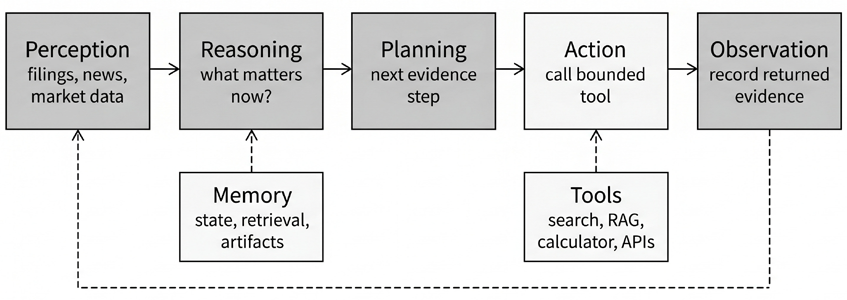
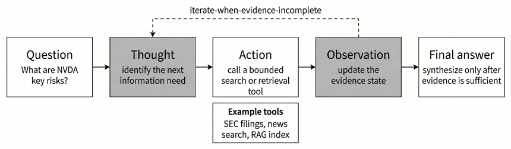
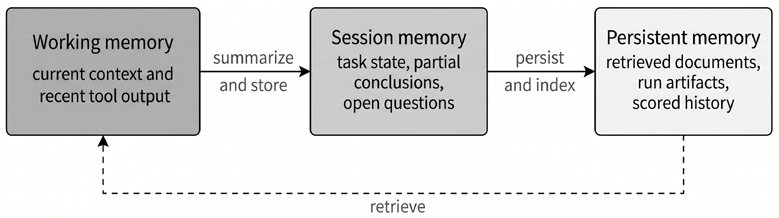
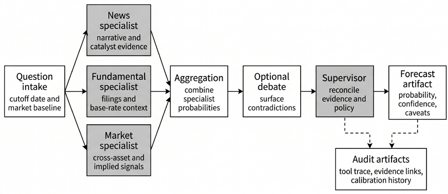

# 第24章：自主智能体

量化金融越来越依赖这样一类系统：它们所做的远不止求值固定的预测函数。前几章关注的是从结构化数据中估计收益及其他目标的机器学习模型。本章转向智能体工作流（agentic workflow）：这类系统会收集证据、调用工具、维护状态、协调中间步骤，并产出可供审查、回放、评分与审计的产物。

这类工作流的用途不限于预测。在实践中，智能体系统可以支持研究、编程、数据管理、实验跟踪、报告生成、监控、合规审查等输入不完整、异构或持续变化的任务。它们的价值不在于取代统计模型，而在于围绕目标、证据、工具使用、溯源与有界自主性来组织工作。

因此，本章把智能体当作工程系统而非聊天界面来对待。核心用例是决策支持：收集市场、文档与研究证据；把证据转化为结构化输出；保存足以支持回放与评估的状态；并暴露那些决定结果是否可信的控制措施。本章不涉及自主交易执行。这里的系统可以搜索、读取、计算、写入沙箱化的产物，并给出结构化建议，但不会下单或投入资金。执行与订单路由需要严格得多的运维层，将在*第25章*讨论。

两个收官项目（capstone）让这套架构落到实处。第一个采用预测智能体，因为事件预测证据丰富、以概率形式表达，且可由外部评分。桥水（Bridgewater）AIA 风格的系统提供了原型范式：智能体检索证据、给出概率估计、汇总独立观点、校准输出，并保存产物以供日后评分。第二个收官项目把同样的基本构件推广到 ML4T 研究流程：一个操作器（operator），借助编程、数据、注册表与技能检索工具，在受限且可回放的条件下迭代推进案例研究的研究路线。

完成本章后，你将能够：

- 解释智能体工作流在量化金融中何时能创造价值，以及何时传统的统计方法、规则方法或批量流水线仍是更优选择。
- 区分 ReAct、思维树（Tree of Thoughts）与 Reflexion 各自的角色，并为证据驱动的金融任务选择合适的推理预算。
- 设计显式的状态与记忆模式，支持溯源、检查点、回放、模式演进与事后结果评估。
- 为研究型、预测型与工作流型智能体制定健壮的工具契约、结构化输出、来源策略与上下文工程规则。
- 比较单智能体、多智能体与操作器式架构，并规划一条从 notebook 原型到运营服务的迁移路径，同时不牺牲可见性与可控性。
- 构建证据优先的预测工作流，涵盖结构化输出提取、轨迹检查、可回放产物、聚合、校准与评估。
- 设计有界的研究迭代操作器，使其在使用编程、数据、注册表与技能检索工具的同时保持可审计性与人工审查。
- 定义让智能体输出达到决策级所需的运维、统计与安全控制，包括时点完整性（point-in-time integrity）、污染感知测试、可观测性、策略门控、沙箱隔离与人工审批边界。

本章的论述从认知架构推进到记忆、工具集成、框架选型，再到三个实现：单智能体预测研究员、多智能体预测工作流，以及一个 ML4T 研究迭代操作器。最后讨论把 notebook 演示与决策级系统区分开来的那些控制措施，包括时点完整性、污染感知评估、可观测性、安全策略与人工审批边界。*24.1 节*从固定预测函数到自适应智能体工作流的结构性转变说起。

## 24.1 从预测函数到智能体工作流

大语言模型正在改变量化工作的结构 (Korinek, 2025)。传统流水线通过固定变换把构造好的特征映射为输出：模型接收特征向量，返回预测值。**智能体流水线增加了一个自适应层**，它能审视证据、判断缺少哪些信息、调用工具获取信息，并在产出结果之前更新持久状态。

这一转变并未取代统计建模，而是改变了自动化发生的位置。前几章使用准备好的数据集估计收益、风险与配置，其中输入干净、模式固定。由大语言模型驱动的智能体系统把这条流水线向上游延伸，进入更混乱的地带：原始证据嘈杂、异构且不完整。Kong et al. (2024) 综述了 LLM 在投资管理中的应用，指出检索增强与时点纪律（point-in-time discipline）是可靠部署的前提——这两个主题会贯穿全章。在金融领域，这一上游层包括申报文件、业绩电话会议记录、事件日历、政策声明与市场隐含概率：这些来源格式各异、到达时间不一，必须先做相关性判断才能为决策所用。

*图 24.1* 将高层架构展示为一个五阶段循环：从感知与推理，到规划、行动与观察。

*图 24.1：从感知到观察的非交易型智能体循环，工具与记忆挂接在核心工作流之上*

在本章中，"行动"指的是**信息行动**：调用市场数据 API、查询申报文件索引、从向量库检索证据、请求一次计算，或写入一个结构化产物——而非订单执行。这条边界是一个设计选择：**只读系统**更容易做好安全防护与评估。它也与文献中最具公信力的公开原型一致，包括桥水的 **AIA Forecaster** 与出自贝莱德（BlackRock）作者的 **AlphaAgents**——两者都把智能体工作流当作研究与预测系统，而非自主执行引擎 (Alur et al., 2025; Zhao et al., 2025)。

Ang et al. (2026) 提出 **Self-Driving Portfolio**（自动驾驶式投资组合），这是一套面向机构资产管理的智能体架构，通过完整的战略资产配置流水线协调约 50 个专职智能体：从宏观市场状态分类、资本市场假设、投资组合构建，到带投票的同行评审与 CIO 层面的集成合并。这篇论文展示了多智能体架构如何把传统上需要专家团队耗费数天完成的工作流，压缩为几分钟内完成的自动化运行。其流水线停在"分析与建议"边界上，而不越过执行边界，再次印证了非交易的设计原则。

金融决策受三项通用聊天机器人应用很少面对的性质约束：

1. 输出应当是带校准诊断的概率，而不是叙述。当资本处于风险之中时，不确定性量化不是可选项。
2. 系统必须尊重决策日期当时可知的信息；任何未来信息的泄露都会让整个输出作废。
3. 每一项论断都必须能对应到具体证据与工具轨迹，因为监管与合规审查要求一条把结论与来源联系起来的审计链。

智能体系统的复杂性来自那些依赖证据获取与综合的决策，而非固定的特征变换，典型任务包括事件预测、尽职调查工作流与结构化研究支持。

**一个贯穿全章的运行示例**：该示例估计一个预测市场问题以肯定结果结算的概率。这些问题涵盖宏观事件、公司财报、地缘政治动态与技术里程碑——正是这类异构且证据丰富的预测任务，让智能体工作流相对固定流水线产生了实实在在的额外价值。完整工作流分**六个阶段**推进：

1. 系统摄取问题与决策截止日期，强制执行时点纪律。
2. 随后通过网络搜索收集证据，搜索被限制在截止日期之前。
3. 多个研究智能体根据各自发现的证据独立给出概率预测。
4. 这些预测用有原则的组合规则聚合，并依据历史可靠性进行校准。
5. 系统持久化所有产物（证据、推理轨迹与概率估计），以便日后回放。
6. 最后，事件结算后由评分函数用适当的评分规则评估预测准确性。

本章每个主要小节都对应这条流水线的一个阶段，配套 notebook 逐步实现各阶段：

- `01_react_reasoning` 构建提供商抽象与 ReAct 循环。
- `02_tool_contracts` 增加类型化模式与溯源。
- `03_state_and_memory` 引入带检查点的状态与质量门。
- `04_research_agent` 将这些组合成单智能体研究工作流。
- `05_aggregation_math` 至 `08_forecasting_pipeline` 构建多智能体系统。
- `09_evaluation_and_governance` 为预测评分、运行消融实验并应用安全控制。
- 可选的 `10_framework_comparison` 用三种框架风格对比同一条流水线。

### 智能体工作流帮不上忙的场景

智能体编排不是传统流水线的万能替代品，认清这条边界可以避免代价高昂的过度工程。当标签稳定且完全结构化时，自适应的证据收集循环只会增加延迟与不确定性，不会提升精度。当任务对延迟极度敏感（例如微秒粒度的执行）时，语言模型推理的开销令人望而却步。当不需要外部证据检索、模型决策可以实现为固定变换时，整套推理循环就是多余的机器。在这些场景下，更简单的统计或规则系统能提供更好的可靠性-成本权衡。智能体最好被当作面向证据丰富任务的附加层，而不是现有模型栈的默认替代品。

### 自主性级别与现实的部署边界

智能体部署从被动摘要（L0），到带概率估计的决策支持（L1）、经人工审批门控的受限行动（L2），再到逐步自主的运行（L3–L4）。

大多数实际的金融部署停留在 L1–L2，因为其经济学是不对称的：预测错误代价高昂，而不受策略约束的执行错误可能是灾难性的。一项关于金融领域智能体 AI 的大范围综述证实了这一模式，并记录了伴随更高自主性而来的不断升级的系统性风险 (Aldridge et al., 2025)。本章的 notebook 运行在 L1，产出供人工审查的结构化预测。

### 与强化学习的衔接

*第21章*讨论奖励信号下的策略学习，智能体从与环境的交互中学习*做什么*。本章处理另一个层面：有状态的研究编排，智能体在产出结果之前决定*知道什么*。

两个层面互补：研究智能体产出的概率估计可以输入用于仓位规模的强化学习策略；强化学习执行智能体也可以向研究智能体查询最新的基本面背景。读者应把本章的输出视为*第16–21章*与*第25章*中模拟与部署阶段的结构化输入。智能体工作流的框架交代完毕，*24.2 节*转向驱动它的推理模式。

## 24.2 认知架构：智能体如何推理

推理模式是智能体设计的基础，但只是系统的一层。这里讨论的模式建立在思维链提示（chain-of-thought prompting）之上 (Wei et al., 2023)——后者表明，把中间推理步骤显式写出来即可提升多步任务的准确性，无需微调。Li et al. (2025) 综述了 LLM 中从快速模式匹配到审慎多步搜索的全部推理架构谱系。在生产中，推理质量还取决于工具契约、状态可见性与评估基础设施，这些将在后面的章节讨论。本节介绍三个关键框架作为基本构件，并厘清各自的复杂性在何处才物有所值。

### ReAct 框架

**ReAct**（**Reason + Act**；Yao et al., 2023a）是证据支撑型任务的默认模式。如*图 24.2* 所示，它在推理与工具使用之间紧密交替。智能体先在一个思考步骤中确定下一步需要什么信息，然后选择并调用工具，把返回的观察整合进工作上下文，如此往复，直到它判断证据足以作答。

*图 24.2：流程图，展示 ReAct 如何在思考、工具调用与观察之间交替，直到证据足以作答*

主要收益是**可追溯性**。每个中间论断都可以关联到具体的工具调用与观察，形成一条把结论与来源连起来的审计链。这一性质对合规与调试都很宝贵，尤其当输出是供下游系统消费的概率预测时。

**ReAct 也有可预见的失效模式**，从业者应当有所防备：

- **重复工具循环**：智能体无法判断自己已经检索过相关证据时发生
- **过早综合**：智能体仅凭单一观察就跳到结论，而不去收集佐证数据
- **脆弱行为**：源于含糊的工具模式——如果智能体分不清两个描述重叠的工具，就会错误地路由调用
- **隐性矛盾**：早期与后期观察相互冲突、而智能体从未显式调和时不断累积

当工作流施加迭代上限、证据充分性检查与显式状态校验器时，这些失效都是可控的，配套 notebook 中全部有所演示。

**实现**：`01_react_reasoning` 用与提供商无关的 `LLMClient` 协议构建完整的 ReAct 循环，把智能体逻辑与任何具体 LLM 服务解耦。智能体在每一步都输出结构化 JSON 决策，而不依赖脆弱的文本解析，生成由"思考-行动-观察"三元组组成的执行轨迹，读者可以逐一查验以满足审计需要。

同一个 notebook 无需改动智能体代码即可切换提供商：同一个循环可以对接确定性 mock、本地 Ollama 模型或商业 API，奠定了后续 notebook 沿用的抽象。思维树与 Reflexion 作为设计模式介绍，而不配专门的 notebook 实现；收官项目 notebook 会在多智能体流水线中有选择地应用这些思想。

### 思维树

**思维树**（Tree of Thoughts, ToT）(Yao et al., 2023b) 通过并行探索多条候选路径再择优选取，扩展了推理能力。ReAct 沿着单一证据链前进，ToT 则在决策点分叉，在确定方向之前评估各备选路径。当决策依赖战略分支而非证据的线性积累时，这很有用：例如围绕分歧明显的政策市场状态做情景规划、在不同宏观假设下对配置备选方案做压力测试，或在决定运行哪些检索查询之前评估多个假设族。

例如，分析央行利率决策影响的智能体可以分出鹰派情景（如更高的终端利率、资金向金融板块轮动）与鸽派情景（如降息、对久期敏感的成长股），为每个分支检索不同的证据集，然后选择证据支撑更充分的路径。不分叉的话，智能体会过早锁定单一叙事，只检索支持该叙事的证据。

代价是算力与复杂性。ToT 把模型调用次数乘上分支因子，还引入状态管理来跟踪、评分与剪枝候选路径。它应留给分支探索会实质改变决策的情形。在典型的金融研究工作流中，这意味着高风险的战略问题——过早锁定方向的代价超过额外推理的代价。

### Reflexion

**Reflexion** (Shinn et al., 2023) 增加了一个运行后批判层。任务完成后，系统记录紧凑的经验教训（关于什么有效、什么失败及其原因的观察），借此影响未来行为而无需完整重训。这一方法的吸引力在于，它提供了一种比重训轻量、又比单次会话学习更持久的适应机制。

实践中，Reflexion 只有在记忆策略显式时才有帮助。经验教训必须携带溯源元数据，记录它生成的时间与条件。每条教训都需要有效期限：来自加息环境的结构性突变观察，不应无限期延续到低利率市场状态。衰减与剪枝规则必须在过时教训变成持久偏差之前将其退役。回滚机制则必须处理新证据与已存教训相冲突的情形。没有这些控制，Reflexion 可能把临时启发式变成顽固的分析盲点。*24.3 节*把支撑这些策略的记忆层级形式化。

### 选择与组合推理模式

一个实用的选择规则是：以 ReAct 为基线；只在并行评估假设确能改善结果的重分支决策上加上 ToT；只在核心评估流水线稳定到能可靠识别哪些教训值得持久化之后，才叠加 Reflexion。这个顺序让工程投入与可度量的收益对齐：ReAct 便宜且可审计；ToT 增加的成本与分支数量成正比；Reflexion 需要最多的基础设施投入。在真实工作流中，这些模式通常组合使用而非孤立使用。预测任务的一种常见组合是：用 ReAct 做初始证据收集；当观察相互冲突、竞争性解释需要显式比较时，短暂分支进入 ToT 探索；结果结算并评分后，可选择记录一条 Reflexion 笔记。组合应保持浅层（每种一层），除非评估显示更深嵌套带来明确收益。深度嵌套的组合会增加轨迹复杂性，使失效分析难上许多。

一条实用的护栏是为每次运行定义推理预算上限：工具调用总次数设上限、分支数量设限额、调和轮数设天花板。预算耗尽时，系统应返回带显式不确定性的有界输出，而不是无限期地继续探索性推理。*24.7 节*把这些预算应用于多智能体收官项目。

下表比较了各框架的机制、优势与最佳应用。

| 框架 | 机制 | 优势 | 最适用场景 |
| --- | --- | --- | --- |
| ReAct | 思维-行动-观察循环 | 有据可依、可审计 | 交互式研究、尽职调查 |
| 思维树（Tree of Thoughts） | 并行路径探索 | 战略深度 | 情景分析、组合备选方案 |
| Reflexion | 运行后批判与记忆 | 自适应行为 | 工作流迭代改进 |

*表 24.1：推理框架的机制、优势与金融应用*

这些框架是互补的。本章收官项目默认采用 ReAct 式证据循环，只在多智能体与评估层能提供可度量的增量价值时才加层。推理模式决定智能体如何思考；*24.3 节*讨论它记住什么。

## 24.3 智能体记忆：状态、持久化与回放

选定推理模式后，下一个设计任务是记忆。在智能体金融工作流中，记忆决定系统是否可测试、可审计。一次性提示词可以给出貌似合理的答案，但持久的工作流需要跨多个时间尺度的显式记忆：单个推理步骤之内、一次任务会话之内，以及跨周跨月的会话之间。

### 记忆层级

*图 24.3* 区分了三个时间尺度：

1. *工作记忆*是当前推理步骤的模型上下文：提示词指令、当前状态字段、近期工具输出与检索到的证据。它受模型上下文窗口限制，每轮都会刷新。
2. *短期记忆*跨越一次任务会话，存储已尝试的行动、未解决的问题、临时结论与近期失败，使智能体不会重复走进死胡同的搜索，也不会丢失已完成的部分结果。
3. *长期记忆*是跨会话存活的持久存储：检索索引、运行产物、已评分结果与校准历史，系统可按需查询。

各记忆类型见下面的流程图：

*图 24.3：工作、会话与持久记忆支撑回放、审计与有纪律的复用*

Yu et al. (2025) 在 **FINMEM** 中把这个层级变成了现实：这是一个带分层记忆与设定性格特征的交易智能体，能随市场状态调整风险容忍度。结果表明，显式的记忆结构同时改善了表现与可解释性：智能体能说清是哪些已存储的观察支撑了当前决策。

主要工程风险是把这些层混为一谈。长期有效的事实只存在上下文窗口里，可复现性就会失守：同一问题换个会话再问会得到不同答案，因为证据已经滚出上下文。瞬态推理不经校验就直接写入长期记忆，过时的假设就会累积，污染未来的运行。

### 为什么显式状态是必需的

隐式的聊天历史便于做原型，但不足以支撑生产。对话记录把指令、证据、推理与工具输出混成一条不分彼此的流。要提取任何一个具体产物（比如支撑某个概率估计的证据），都得解析自由文本，既脆弱又不可复现。

类型化的状态对象把状态转移显式化，从而解决这个问题。预测智能体的最小状态模式包括运行与问题标识符，以及强制时点纪律的 `as_of_date` 与 `cutoff_date`。其余字段记录证据、推理与中间输出：带来源元数据与时间戳的结构化证据记录；未解决子任务列表；带状态码与错误信息的工具调用轨迹；带相应置信度的中间概率估计；以及跟踪输出处于草稿、审查中还是已定稿的决策产物状态。

这些字段有两个用途：在输出被接受之前支持静态与运行时校验，并为回放与评估提供基底。没有它们，调试就退化为重读对话日志、猜测推理在哪里出了错。

### 检查点、回放与诊断

**检查点**应绑定在决策边界上，而不是任意的时间间隔。预测工作流的自然检查点落在：初始证据收集之后（智能体已拿到输入）、矛盾消解之后（相互冲突的观察已调和）、最终综合之前（中间概率即将合并），以及任何高影响下游交接之前（输出将馈入另一个系统）。**每个检查点捕获完整的状态对象**、至今收到的全部工具输出，以及忠实回放所需的元数据。**回放**是非确定性系统的核心调试机制。语言模型是随机的，出错的运行无法靠重跑同一提示词复现：模型可能走出不同的推理路径。回放的目标是把**模型行为的变化**与证据的变化隔离开来。一个有用的协议是：冻结目标运行的工具输出，从检查点恢复状态，在证据保持不变的前提下用更新后的提示词或策略重跑，比较轨迹差异与评估差异，只接受能改善既定指标的变更。没有这套纪律，团队经常把证据漂移误认成提示词改进，以为改写了系统提示词就修好了问题，其实是底层数据变了。

### 记忆生命周期与治理

长期记忆需要治理，因为并非所有已存信息都应无限期复用。每种产物类型都需要保留窗口：原始工具输出可能保留"评分期限再加一段缓冲"，而中间推理轨迹可能在评估之后过期。淘汰规则必须在过时教训变成持久偏差之前将其退役。溯源要求确保可复用的证据携带足够元数据来验证其时点有效性。冲突处理策略必须规定新观察与已存内容矛盾时怎么办：旧产物是被标记、归档，还是删除？

这些策略对 Reflexion（*24.2 节*）这类自适应记忆方法尤其重要。与特定波动率市场状态或政策环境绑定的教训，应当在条件变化时失效。FinCon (Yu et al., 2024) 采取了相近的思路：一个多智能体系统把投资信念存为自然语言摘要，并跨回合重新注入，用概念性的言语强化来改善序贯决策而无需完整重训。关键的实现细节是：存储的信念带有市场状态标签，当被标记的条件不再成立时可以被剪除。

状态模式随工作流成熟而演进。每个检查点都应携带显式的模式版本及相邻版本间的迁移规则，使历史产物在重构边界两侧仍具可比性。

### 记忆与评估相互耦合

预测评估对记忆质量的依赖容易被低估。校准需要以足够分辨率存储的历史"预测-结果"对，才能验证被评为 70% 的事件是否真的在约 70% 的情况下发生了。消融分析（检验移除某个工具或证据来源是否改变结果）要求保留原始运行的中间产物。如果产物持久化不完整，评估就从系统分析退化为个案罗列，智能体声称的准确性也无从核实。*24.7 节*展开完整的评估方法。

智能体的可靠性依赖显式状态、有纪律的持久化与可回放的诊断。流畅的输出代替不了其中任何一项，因此记忆设计既属于软件架构，也同样属于模型风险控制。**实现**：`03_state_and_memory` 把这些原则具体化。该 notebook 定义了一个 `AgentState` 数据类，携带运行标识符、预测问题、截止日期、带来源元数据与时间戳的证据列表、工具调用轨迹、未决子问题、质量门结果与综合状态字段。

三道质量门在智能体进入综合之前强制执行证据纪律：覆盖门验证全部必需的证据类型都已就位，新鲜度门拒绝超出允许时间窗的证据，一致性门检测股票代码不匹配与截止日期之后的数据泄露。notebook 还演练了检查点往返序列化（把状态写入 JSON、恢复它，并验证恢复后的对象能通过同样的门），奠定了回放基底——*24.6 节*将在完整的研究智能体工作流中应用它，*24.7 节*则把它扩展到多智能体评估。

状态与记忆就位后，下一个控制面是智能体如何与外部世界交互。*24.4 节*将工具契约、溯源与上下文工程形式化。

## 24.4 工具集成：契约、控制与上下文工程

显式状态定义好之后，工具集成成为下一个控制面。工具把语言模型的推理转化为可验证的操作：取一条股票报价、查一次申报文件索引，或算一个滚动统计量。在金融领域，工具设计往往是决定智能体质量的主导因素，其影响超过提示词工程，甚至超过模型选型。

### 面向研究与预测的工具类别

预测型智能体通常需要四类工具：

1. 市场数据工具获取价格、期权隐含波动率之类的隐含信号，以及财报日期、分红公告等事件元数据。
2. 文档工具访问申报文件、业绩电话会议记录与分析师报告，数据可来自本地存储，也可经由检索增强生成流水线。
3. 搜索工具查找近期外部证据（新闻文章、监管公告、宏观经济发布），并受来源控制约束，限制智能体可查询的域名。
4. 确定性计算工具处理不应依赖语言模型随机性的统计与变换：计算收益、运行回归，或求值评分函数。

执行工具（下单、组合再平衡）构成另一层，控制要严格得多。本章不需要它们——本章运行在 *24.1 节*确立的只读边界之内。

### 工具契约与选择质量

工具契约规定用途与范围、必需参数及其类型与取值范围、区分瞬时失败与永久失败的错误语义，以及每个响应必须携带的溯源字段。弱契约把复杂性推给提示词文本：如果模型要靠含糊的描述去猜某个工具返回的是复权价还是未复权价，它有时会猜错。强契约把约束移入类型化接口与校验逻辑，在调用派发之前就能静态检查。

高质量的工具描述包含三部分：工具返回什么、什么时候调用、什么时候*不要*调用。负面指引很重要，因为工具选择失误是最常见的智能体缺陷之一。典型模式包括：存在更聚焦的备选时选了宽泛的工具（明明有申报文件专用工具能给出更精确的结果，却去查通用新闻 API）；出现明确错误后仍反复重试调用；带着不完整参数调用工具，触发静默默认值而非显式失败；以及不查时间戳就把过时证据与最新证据混在一起。缓解手段包括：在执行前拒绝畸形调用的参数校验器、按错误类别区分的重试策略，以及在必需字段齐备之前阻止推理转移的基于状态的护栏。

### 上下文工程

上下文工程是对推理步骤间模型可见信息的受控设计。与其把累积的全部上下文塞进每一步（这是浪费 token 并引入噪音的常见反模式），不如让每一步只暴露与其任务相关的状态字段、只开放与其阶段相称的工具、把证据来源限制在与当前时点边界一致的范围内，并要求一个下游步骤可以确定性解析的具体输出模式。

这一原则适用于每个尺度。在单个 ReAct 循环内，智能体的系统提示词应指明该阶段激活哪些工具。在多智能体流水线中，每个专职智能体只应收到与其分析视角相关的证据，而不是完整的研究卷宗。结果是歧义减少、可复现性提高、成本下降：随着智能体复杂性增长，这三条性质会复合放大。

### 溯源与结构化输出

只要下游组件是代码而非阅读文字的人，智能体输出就应是结构化对象：带来源元数据的证据记录、带概率估计与推理摘要的专职预测对象、不确定性量化，以及最终决策产物。结构化输出支持确定性解析、模式校验与一致的日志记录，这些是 *24.3 节*所述回放基础设施的前提。

工具响应应默认携带溯源信息。一个实用的响应模式包括：来源标识符、发布与检索时间戳、定位证据的文档区间或记录键、允许列表状态等策略标志，以及可得时的质量标注。有了这些字段，三个运维问题都能快速回答：这条证据在决策日期是否可得？这个值出自哪个工具与来源？该论断能否从已存产物复现？溯源缺失时，错误会静默传播，事后诊断代价高昂。

### 强制结构化输出

类型化输出契约的可靠性取决于强制机制。主要提供商现在都提供内置的结构化输出模式：JSON 模式约束生成合法 JSON；工具调用强制要求模型发出函数调用而非自由文本；模式校验生成在返回调用方之前对照 JSON Schema 检查输出。这些机制把校验从事后解析移入生成循环本身，消灭了一整类反序列化失败。

对本章的预测流水线，强制机制在两个边界上起作用。专职智能体必须输出带类型化概率字段的结构化预测对象，而不是让下游代码用正则去解析的文字。监督者必须输出通过模式校验的最终决策产物，然后才能进入持久化层。当模型因证据不足或问题含糊而无法满足模式时，强制层应给出结构化错误或弃答对象，而不是悄悄回退到非结构化文本。本章 notebook 应用了这套纪律的轻量版本：`01_react_reasoning.py` 对工具决策使用 JSON 模式响应，后续 notebook 则把预测产物移入类型化数据类模式，并在编排层写明校验逻辑。设计原则在于契约本身，而不在于某个特定的校验库。

### 来源策略

搜索与检索工具需要显式的来源策略。域名允许列表把智能体限制在可信来源。与运行截止日期绑定的日期约束在工具层面强制时点纪律，而不依赖模型自我约束。每个返回条目都必须带来源元数据，让下游评估能把论断追溯到源头。

FinDER 基准 (Choi et al., 2025) 在基于 10-K 申报文件的金融问答中凸显了这种依赖：检索质量是下游生成质量的约束性条件，这使来源策略成为智能体输出准确性的一阶决定因素。

### 错误处理与优雅降级

并非所有工具失败都应触发硬停。健壮的智能体会区分：值得重试的瞬时失败、需要备用路径的持续性工具失败、必须拒绝并上报的策略违规，以及应当显式弃答而不是编造答案的关键证据缺失。优雅降级意味着返回带显式不确定性的有界输出，而不是制造虚假信心——这一性质在金融应用中比在多数其他领域更重要。

**模型上下文协议**（**MCP**）跨提供商与运行时标准化工具访问。务实的策略是：延迟敏感的核心工具先做直接集成，在互操作性收益大于开销之处有选择地采用 MCP。*第22章*的 RAG 流水线对文档检索工具应用了这一模式。在金融领域，工具集成是一个系统设计问题。可靠的结果需要强契约、窄权限、显式的上下文暴露与结构化输出。提示词质量重要，但工具质量决定上限。推理、记忆与工具都已定义完毕，*24.5 节*讨论承载它们的框架与工程栈。

**实现**：`02_tool_contracts` 用一个 ToolDefinition 类应用这些原则：从单一定义同时导出 Anthropic 与 OpenAI 两种格式的类型化 JSON 模式，免去提供商相关的样板代码。每个工具响应都包在带溯源的结果里，携带来源标识符、发布与检索时间戳以及策略合规元数据。

notebook 强制执行域名允许列表，把检索限制在已批准来源，并记录被拦截的调用及触发拦截的策略。参数校验在执行前拒绝畸形请求，完整执行日志均结构化，便于下游回放与审计。

## 24.5 工程栈：框架与迁移

前几节确立了工具与状态要求之后，框架选择就成了实现层面的问题。框架讨论常被当作排名问题：哪个库的基准分数最高？对智能体金融工作流而言，这种提法通常没有帮助，因为约束性条件不是基准精度，而是状态可见性、回放能力与策略执行。更好的问题是：哪个框架最能支撑目标工作流所需的控制。

### 从约束出发，而非偏好

业界经验印证了这种约束优先的视角。近期的从业者文章所描述的智能体系统，只有与专有工具、数据控制和评估循环紧密集成时才有用，而非作为独立的聊天产品存在 (Fang and Moore, 2025)。共同的教训是：工作流的价值来自领域集成与治理，而不是框架选型本身。

需要提醒的是：框架生态演化迅速，2026 年初的格局可能与读者阅读时所见不同。*24.3–24.4 节*中的原则——显式状态、类型化契约与回放支持——比任何具体库都长寿。如果某个框架以更少样板代码强制这些性质，就采用它；如果它把这一切遮蔽起来，无论基准宣传多漂亮都不要用。

框架选择应从显式约束出发：所需的状态可见性；团队是否需要回放与检查点支持来调试非确定性运行；检索流水线的复杂度；设计良好的工具加单个智能体是否够用，还是必须多智能体编排；生产之前必须到位的调试与可观测性基础设施；以及团队规模、现有基础设施与维护预算等部署约束。这些约束讲清楚之后，许多选择就变得直截了当。

| 需求 | 首选风格 | 典型适用场景 |
| --- | --- | --- |
| 开销最小、完全自定义控制 | 原生 SDK 加类型化模式 | 小型或边界清晰的智能体 |
| 快速实现 ReAct/工具编排 | 轻量级智能体框架 | 原型与教学实验 |
| 以检索为中心的应用 | 检索优先的框架抽象 | 重 RAG 的工作流 |
| 显式状态与持久化执行 | 带持久化与回放的状态图框架 | 生产级研究流水线 |
| 复杂的多角色协作 | 带角色模型的多智能体编排框架 | 专业化协作任务 |

*表 24.2：设计选择矩阵*

### 从 notebook 模式到生产演示

notebook 逐步迈向生产演示。早期的 notebook 隔离出提供商抽象、工具契约、状态与聚合，让读者看清每个控制面。后面的 notebook 把这些部件组合成预测工作流。最后一步是把同样的逻辑放进更严格的软件边界内，包括配置、连接器、存储、评估作业与发布。本章的这一终点就是 `aia-forecaster` 实现：它把 notebook 模式变成一个可运行的预测服务，而不是一串互不相干的示例。

这条递进路径也厘清了"框架比较"能确立什么、不能确立什么。`10_framework_comparison.py` 比较同一个预测任务的三种表达：显式 Python、CrewAI 风格的角色编排与 LangGraph 风格的状态图。这一比较有用，因为它解释了进入生产演示的迁移路径：从显式控制流开始，只在有帮助之处加入有状态编排，再把所得工作流包进打包应用边界。因此，生产预测器并不是另一个架构构想，而是 notebook 序列的终点，附上更强的运维约束。

### 减少返工的迁移序列

实用的迁移序列让复杂性与可度量的收益保持成比例。先用原生 SDK 调用与类型化输出模式构建最小基线：这确立了核心数据流，让智能体行为从第一天起就可测试。接着加入显式状态对象与轨迹捕获，让每个推理步骤都被记录、可检查。然后加入检查点与回放钩子，以支持 *24.3 节*的调试协议。最后，只有当评估显示专职智能体的多样性或对抗性辩论相对单智能体基线带来可度量改进时，才加入多智能体编排。

这种增量路线避开了一组常见反模式：在单智能体基线证明任务可行之前就采用多智能体抽象；本应显式设置的安全控制却依赖框架默认值；把可观测性推迟到部署之后——那是调试成本最高的时刻；以及把框架迁移当作评估方法的替代品。换框架能改善使用体验，比如更好的图可视化和更顺手的检查点 API，但很少能修复糟糕的状态设计或低劣的评分实践。

### 在本地比较框架

如果确需直接比较，就选一个可复现的任务，用同一套固定数据集与指标组，保持提示词、工具与策略不变，使差异反映框架行为而非配置漂移。除了任务精度，还应报告可追溯性质量、失败率与调试工作量。

就本章而言，比较刻意保持狭窄。notebook 将一个完整可执行的原生 SDK 实现与同一流水线的两种框架式表达相对照。这有助于思考迁移与状态可见性问题，但不足以产出厂商之间的正面对决排名。

| 模式 | 状态处理 | 本章状态 | 最适用场景 |
| --- | --- | --- | --- |
| 原生 SDK | 显式 Python 对象与函数 | 完整可执行 | 需要完全控制的小型或线性流水线 |
| CrewAI 风格的角色/任务 | 框架管理的任务编排 | 示意性伪代码 | 基于角色的协作与快速原型 |
| LangGraph 风格的状态图 | 显式图状态与节点转移 | 示意性伪代码 | 受益于持久状态的分支工作流 |
| 打包应用层 | 围绕智能体内核的配置、存储、连接器、作业与发布 | 已在配套仓库中实现 | 运营级预测服务 |

*表 24.3：本章对比的框架模式*

框架选择还有团队运维层面的含义。显式的基于图的编排通常有利于代码评审与事故分诊，因为状态转移在图定义中可见，而不是埋在对话历史里。更隐式的编排可能加速原型开发，但当失效发生在不透明的内部路由中时会推高调试成本。多智能体抽象改善了模块化与关注点分离，但需要更强的集成测试与更清晰的责任边界来防止协作失败。工作流一旦投入运营，编排框架之上还会长出另一层：感知配置档案的配置管理、产物版本控制、连接器健康、存储迁移与定时作业。这些是软件工程问题，却决定智能体能否被持续评估与维护。**实现**：`10_framework_comparison` 包含一个完整可执行的原生 SDK 实现，以及同一预测任务的 CrewAI 与 LangGraph 风格伪代码。原生变体用全章通用的 `LLMClient` 与 `ToolExecutor` 端到端运行；框架变体是示意性模式，展示角色定义、任务编排与状态图节点如何表达同样的逻辑。比较揭示了具体的权衡：原生 SDK 以手动编排为代价换来最大的可调试性与状态可见性；基于图的框架以框架耦合为代价提供持久化与可视化。

运营部署由配套的 `aia-forecaster` 仓库负责：它把同一条预测流水线包进配置档案、预测市场连接器（如 Manifold 或 Polymarket）、持久的运行与预测存储、定时的评估命令，以及一个发布预测数据流与证据账本的发布层。

框架选择是架构决策，不是性能声明。正确的选择会为具体工作流强制状态纪律、可回放性与策略控制。*24.6 节*在本章第一个收官项目中应用所有这些构件：一个有状态的研究智能体。

## 24.6 设计流水线核心的研究智能体

本节把前几节的设计模式落到单智能体场景中。工作流保持只读与证据驱动。目标是仅以网络搜索作为证据工具，为一个预测市场问题产出经过校准的概率预测。输出中的每一项论断都必须能追溯到具体的搜索查询及其结果，系统必须持久化足够的产物以供回放与检查。这个 notebook 是本章迈向生产预测演示进程中的第一个收官项目：它把范围收窄，让状态、输出提取与轨迹检查保持清晰可读，之后同样的控制才会嵌入更大的多智能体流水线。

### 架构与工具集

该智能体组合了一个受限工具、显式的 ReAct 循环控制流、结构化输出提取，以及供回放的持久化轨迹。唯一的工具是网络搜索：这正是 AIA Forecaster 的设计选择——把智能体限制在单一工具类，简化了契约面，并让评估聚焦于推理质量而非工具路由的准确性。搜索工具在工具边界强制截止日期，阻止截止日期之后的证据进入上下文。执行工具被刻意排除。这个智能体产出概率估计，而不是订单。智能体每一步都输出结构化 JSON，在两个动作之间选择：`search`（发出查询）或 `forecast`（给出概率与理由）。这个双动作模式是刻意最小化的：它消除了更丰富的工具集中导致路由失败的工具选择歧义。步骤提示词提供问题、可选的市场上下文与动作模式；智能体每步必须恰好输出一个合法的 JSON 动作。

### ReAct 循环与富输出提取

工作流遵循 *24.2 节*的 ReAct 模式。智能体先评估自己需要什么信息，发出搜索查询收集证据，并在判断证据充分时以 forecast 动作终止。可配置的步数上限（默认 5）防止无界探索。如果预算耗尽仍未给出预测，系统会记录一个带显式不确定性的强制默认值，而不是制造信心。

智能体给出预测后，系统会提取原始概率之外的丰富元数据。置信度（confidence）若 LLM 显式给出则直接采用，否则由概率的极端程度推断：|p_yes − 0.5|。情绪（sentiment）把概率映射到从强烈看跌到强烈看涨的五级量表。关键发现与不确定性从理由文本中提取。证据质量依据执行的搜索查询数量与查阅的来源数量评估。最终得到一个 `AgentForecastArtifact`，它捕捉的不只是预测，而是完整的溯源链：轨迹、token 用量、置信度、情绪、证据质量与推理。

*24.3 节*的质量门在这里同样适用。状态与记忆 notebook 确立了这一模式：覆盖门验证已收集到足够证据，新鲜度门检查证据落在允许窗口内，一致性门检测截止日期之后的泄露。这些门与多智能体流水线用的是同一套机制。区别在于，在单智能体层面，门控失败容易诊断与修复。

### 轨迹检查与回放

ReAct 循环的每一步都记录在 `AgentTrace` 对象中：步数、所采取的动作、搜索查询（如有）、返回的结果与原始 LLM 输出。有了这条轨迹，运行结束后智能体的推理路径完全可查。完整产物（包括轨迹、提取的元数据与 token 用量）可序列化为 JSON，用于检查点往返与跨运行比较。

在生产演示中，同样的纪律延续到持久的运行与预测记录。重要的连续性不在存储机制本身，而在于后续每一次评分与审计所依赖的产物，都可以在不必重读自由格式记录的情况下重建。

### 典型运行走查

典型运行展开为一小串有界的转移。智能体收到一个预测市场问题和可选的市场隐含概率，用一至三个查询搜索相关证据，然后给出一个以所找到的证据为依据、附理由的预测。完整轨迹与序列化产物随后可供检查。这一串过程之所以重要，是因为它隔离了失效点。如果预测质量不佳，轨迹会揭示根因是搜索查询不足、结果不相关、JSON 解析失败，还是推理本身有缺陷。实践中，这个实现最常见的失败是：搜索查询错过了关键证据、LLM 输出无法通过 JSON 解析，或理由无视检索到的证据而诉诸先验知识。这些恰恰是之后在多智能体系统中会变得更昂贵的失败类别，所以本章先在这里处理它们。

### 评估与验收标准

在升级到多智能体工作流之前，单智能体基线应当展现：跨重复运行的稳定任务成功率、高于预设阈值的证据支撑度、低强制默认率、可从已存轨迹复现的产物，以及合理的 token 效率。这些标准防止过早升级到更复杂的架构——当原型结果看起来不错而可复现性尚未验证时，这是常见错误。*24.7 节*展开完整的评估方法，并把这一单智能体模式扩展为面向生产的预测工作流。

结果不佳时，按此顺序调试：先查工具契约与搜索质量，再查 JSON 解析与输出提取，最后才是提示词措辞。大多数可靠性失效源于工具与解析设计，而非语言生成。*24.7 节*把这个单智能体基线扩展为一个多智能体预测系统，纳入智能体多样性、聚合、辩论与经过校准的评估。

**实现**：`04_research_agent` 构建完整的 `ResearchAgent` 类，全章后续都会复用它。该智能体在一个真实预测市场问题上（从 Polymarket 拉取，或来自已结算的评估面板）运行 ReAct 循环，仅以网络搜索为证据工具。每步产出结构化 JSON：要么是带查询的搜索动作，要么是带概率与理由的预测动作。

notebook 记录富输出提取（置信度、情绪、关键发现、不确定性与证据质量），全部收进带完整溯源的 `AgentForecastArtifact`。执行轨迹展示每一次搜索查询、其结果与最终推理路径。以 mock 模式（CI 的默认模式）运行时，响应是确定且可复现的；以真实 LLM 提供商运行时，智能体执行真实的网络搜索并给出真正的预测。读者可以通过 Papermill 参数单元格修改提供商、步数上限或搜索参数，观察智能体如何调整搜索策略与预测质量。

## 24.7 多智能体预测系统

*24.6 节*确立了单智能体研究基线。本节把该基线扩展为一个多智能体预测架构，为概率质量、可追溯性与可复现评估而设计。这个收官项目是一个预测系统，不是自主交易引擎。其设计借鉴了两个公开架构：

- **AIA Forecaster** 在只读的预测市场工作流中结合智能体搜索、监督者调和与校准 (Alur et al., 2025)
- **AlphaAgents** 强调专职角色与辩论，用于股票决策支持 (Zhao et al., 2025)

本章实现 AIA 风格的流水线：并行研究智能体、聚合、可选辩论、监督者审查、校准与持久化的预测产物。输出仍然是概率预测与可评分产物，其价值在事件结算之后度量，而不是在叙述生成之时。

### 架构：从智能体集成到生产流水线

这套架构按六层理解最清楚，每层都产出让系统在每个阶段可评估、可调试的产物。接入层从预测市场连接器加载未决问题、结算标准与市场基线信号。它记录决策时间戳与下游检索策略使用的截止日期。这一步定义了时点包络，后续每一次工具调用都必须遵守。

研究层随后在同样的截止策略下运行并行智能体。AIA Forecaster 的主张是：**智能体**共享同一条提示词仍能产生有用的差异，因为各自发出自己的搜索查询，并就查询返回的内容各自推理 (Alur et al., 2025)；是随机采样把它们送上不同的检索路径，而非角色分工。本章 notebook 检验了这种差异有多大影响，发现答案取决于问题。在 `06_multi_agent_research` 中，三个 Claude Sonnet 4 智能体预测美国是否会在 2026 年底之前陷入衰退——这个问题的公开证据指向同一个方向。它们的搜索路径依然不同：一个智能体侧重当前显示低风险的模型读数，其余两个依赖历史基率。但三个预测仍聚在 0.12、0.22 与 0.22，接近 0.175 的市场价格。当证据一边倒时，相互独立的智能体会得到相近的概率，这种一致正是预期结果。

同理，真正有争议的问题会产生更大的离散度。在 `07_adversarial_debate` 中，智能体预测美联储 2026 年是否会加息——这个问题上可信证据两边都有；同样的三智能体设置返回 0.35、0.58 与 0.38，被指派的看多与看空角色在 3 轮中保持接近 0.4 的差距，未达成共识。值得警惕的是与上述两种结果都相反的情况：各智能体搜索结果相同、推理相同、预测也相同，这意味着采样温度失效或有压制差异的结构性缺陷。那种千篇一律才是要调试的对象；一边倒问题上的相近数字不是。预测离散度跟踪的是问题证据的争议程度，不是操作员可以随手调大的采样设置。

因此，辩论与角色分工是对照目标问题集评估的配置选择，不是某种失效模式的修复手段。对抗性多空阶段与专职职责授权在双边问题上增加延迟——在这类问题上，把分歧摆上台面并做压力测试确实会移动聚合结果；在单边问题上，它们只是增加成本而不改变答案。AlphaAgents (Zhao et al., 2025) 这样的专职角色架构，以及 Ang、Azimbayev 与 Kim (2026) 那套在约 50 个智能体之间分配宏观、资产类别、组合构建与风险等不同职责的机构级战略资产配置（SAA）流水线，都延伸了同一逻辑：显式结构买到的是单靠采样得不到的多样性；这是否划算，要看实证。如果专职角色在目标问题上产生可度量的更好校准，它们的复杂性就物有所值；否则，单一研究角色加一个可选辩论阶段是更简单的默认选择。

接下来四层把这些智能体输出转化为可长期跟踪的预测：

- **聚合**把相互独立的概率合并为一个送交监督者之前的估计。当配置启用多空调和时，可选的辩论阶段会对该估计做压力测试。
- **监督者**层识别分歧、执行澄清性搜索，只有在其置信度越过策略阈值时才可覆写聚合结果。最后的校准层把概率转化为对外发布的预测。
- **持久化**与**评分**层存储全部中间与最终产物，使校准监控、基线比较与消融分析能在事件结算后进行。没有这最后一层，系统无法从自身历史中学习。

流水线如下图所示：

*图 24.4：多智能体预测流水线，包含研究智能体、聚合、辩论与监督者阶段*

### 聚合与极端化

聚合编码了关于相关性的假设，绝不是一个美化步骤。选项从简单平均到基于历史可靠性或证据质量的加权组合不等。notebook 演示把这些选择暴露为配置，而不是埋进提示词：均值、中位数、截尾均值与 **Neyman 式极端化**（extremization）都是显式策略。更有原则的做法是应用极端化——当预测者多样性真正很高时，它放大对基率的偏离。一种形式是：𝑝_extreme = base + 𝑑 × (𝑝_mean − base)，其中 𝑑 放大与基率的距离。在等相关（equicorrelated）模型下，Neyman 极端化因子为 𝑑 = √n / (1 + (n − 1)𝜌)，其中 𝑛 是预测者数量，𝜌 是其平均两两相关系数。当智能体完全独立（𝜌 = 0）时，𝑑 = √n，极端化非常激进。当它们高度相关（𝜌 = 1）时，𝑑 = 1，均值原样通过。这正确反映了相关智能体贡献的独立信息更少这一事实。

`05_aggregation_math` 把这种关系直接可视化：敏感性图展示极端化因子 𝑑 如何随相关性 𝜌 与不同的预测者数量变化，清楚表明加入相关智能体带来的是递减的边际信息。notebook 还实现了 Platt 缩放（Platt scaling），并比较经过校准与未经校准的聚合结果。这种关系暴露出一个根本的设计张力：只有当新增智能体带来真正多样的证据、而不只是同一分析的另一种说法时，增加智能体数量才能改善预测。

### 辩论-监督者模式

一些系统在聚合与监督者审查之间插入一场对抗性辩论。最简设计包括：一个看多智能体给出最强的正面论据，一个看空智能体挑战假设与来源质量，一个聚焦未决矛盾的可选第二轮，以及一个调和结果的监督者。辩论能暴露脆弱假设、提升综合质量，但应保持可选且可度量。如果辩论相对其成本与延迟开销不能改善样本外评分指标，就应移除。这就是 notebook 演示把辩论当作配置开关而非强制架构的原因。

监督者本身是一个调和阶段，不是智能体证据的替代品。它识别各研究智能体之间的一致与分歧结构，评估证据质量与矛盾的严重程度，判断是否需要额外澄清，并产出带显式理由与警示的最终预测产物。在 AIA 风格实现中，监督者的覆写受策略约束：只有当它以高置信度返回预测时，才可替换聚合结果。这条规则很重要，因为它防止流水线中最后一次模型调用自动压倒其余证据。

### 概率校准

模型输出的原始概率往往校准不佳。正如 Alur et al. (2025) 所观察的，LLM"在不确定性下进行概率预测时存在根本性失准"，且倾向于朝基率方向对冲。校准让预测概率与实际结果频率对齐，使系统评为 70% 的事件实际发生的频率也在 70% 左右。

一种常见的事后方法是 **Platt 缩放**，它拟合一个逻辑变换：𝑝̂ = 𝜎(𝑎 · logit(𝑝) + 𝑏)。

校准与聚合是两种不同的操作，其相互作用很重要。如果聚合已经对概率做了极端化，再叠加 Platt 缩放可能放大过度自信，除非校准窗口与聚合所用训练数据不相交。这不仅是统计问题，也是实现问题：当极端化聚合与事后校准同时启用时，生产演示会显式告警，因为这种组合若未在留出数据上验证就可能过冲。实用的校准工作流会预留一个已结算事件的历史窗口，只在该窗口上拟合校准参数，在互不相交的留出窗口上评估，并以明确的重新拟合节奏监控漂移。常见陷阱包括：用于拟合的已结算事件太少、校准窗口与评估窗口重叠、在没有漂移证据的情况下过于频繁地重新校准，以及在锐度（sharpness）已经坍缩时把**期望校准误差**（**ECE**）的改善当作整体改善。补救办法都是程序性的：为重新校准定义最小样本量、隔离时间窗口、联合监控校准与锐度，并对校准模型做版本控制，确保历史比较仍然有效。

### 评估、消融与基线

预测系统应以其概率的质量评判，而不是叙述的质量。核心指标有 Brier 分数、对数分数（log score）、期望校准误差、可靠性诊断与锐度。Brier 分数与对数分数越低，整体预测准确性越好。ECE 越低，校准越好。锐度更高（预测概率的方差）只有在校准仍然可接受时才可取；锐利但失准的系统是危险的。

消融分析识别哪些组件贡献了可度量的价值。评估至少应比较：原始智能体概率与聚合后校准前的预测、聚合后校准后的预测、去掉监督者审查的变体、减少智能体数量的变体，以及市场基线。有用的消融问题包括：经成本调整后辩论是否改善评分、监督者覆写是减少大错还是引入噪音、校准是否在不牺牲锐度的前提下改善可靠性、智能体多样性是否提供真正的增量信息。消融结果应与成本和延迟一起解读：一个略微改善评分质量却使运行时间翻倍的组件，对低频高价值决策可能仍然值得，对高吞吐工作流则不然。

**诊断清单：超越聚合指标**

聚合指标可能掩盖系统性错误。诊断分析应考察：按事件类型划分的误差集中度、高概率区间中的过度自信率、监督者覆写对大幅偏差的贡献，以及预测失效之前智能体分歧的模式。这些诊断能澄清下一步改进应指向检索质量、聚合假设、校准方法还是覆写策略。

最能站得住脚的主张，是相对稳健基线的增量信息，基线通常是同一事件集上的市场共识。解读这种比较有两点须警惕：

1. 对未结算的问题，市场价格与智能体预测都是对同一未来概率的估计；除非毫无依据地假定市场就是真值，否则无法预先宣布哪一方"正确"。
2. 在足以计算 Brier 分数或对数分数的已结算结果面板上，污染是主要的运维风险：智能体的搜索工具可能检索到日期晚于问题自然截止点的文章，因此表面的跑赢可能反映的是泄露而非实力。

站得住脚的工作流是：在时间上不相交的窗口上评估并显式强制截止日期；报告跨校准变体与随机种子的区间而非点估计；把单一面板上的"胜利"当作评分方法的示例，而非优越方法的定论。如果经过这样的纪律约束，模型仍不能在稳定的成本/延迟包络下提供增量信息，架构就需要修改；声称它"复杂"并不能作为辩护。

对每个组件应用保留准则：它是否改善已结算结果指标？改进在事件子集上是否稳定？成本与延迟开销是否可接受？它是否增加策略风险或运维脆弱性？不达标者应降级或移除。

| 组件 | 说明 |
| --- | --- |
| 研究智能体 | N 个并行智能体，各自独立搜索与推理；预测的离散程度反映问题证据的争议程度，而非采样温度 |
| 辩论 | 可选的多空调和阶段 |
| 监督者 | 受策略约束的综合与覆写逻辑 |
| 聚合 | 均值/中位数/加权/极端化等组合规则 |
| 校准 | 事后概率校准 |
| 搜索 | 有界、按日期过滤并带来源策略的检索 |
| 持久化 | 运行产物、轨迹元数据与已评分结果 |
| 评估 | Brier/对数分数/ECE、可靠性诊断与消融实验 |

*表 24.4：实现架构*

生产优化包括异步执行智能体、带截止日期感知键的响应缓存，以及支持快速迭代的回放模式。它们还需要持久的运行记录、预测记录行与事后评估记录行，使系统能从单次 notebook 运行过渡到业绩记录。*24.9 节*转向让这些预测质量声明达到决策级的运维控制。

**实现**：多智能体预测流水线横跨五个 notebook 逐步构建：

- `05_aggregation_math` 讲解 Neyman 极端化与 Platt 缩放的纯数学，并对相关性与预测者数量参数做敏感性分析。
- `06_multi_agent_research` 在固定的衰退问题上运行三个 `ResearchAgent` 实例，并报告前述结果：当证据指向一边时，各智能体独立的搜索路径仍会落在相近的预测上（0.12 至 0.22），接近市场价格。notebook 比较了聚合方法（简单均值、Neyman 极端化与置信度加权 Neyman），并分析对相关性参数的敏感性，让读者看到当输入本已一致时，聚合能加什么、不能加什么。
- `07_adversarial_debate` 实现多空辩论，跨轮跟踪概率差距，并带共识检测——立场趋于一致时提前终止。
- `08_forecasting_pipeline` 把完整的"智能体-聚合-辩论-监督者"流水线组装成 `AIAForecaster` 类，在多个预测问题上运行，并报告逐问题的 token 成本分析与持久化状态。
- `09_evaluation_and_governance` 为一个 10 个问题的已结算面板评分，涵盖美国宏观（美联储利率决议、CPI）、公司里程碑（英伟达财报、特斯拉交付量、苹果产品发布会）、市场点位（标普 500 目标位、科技股 IPO 时点）、加密货币价格阈值（比特币）、地缘政治事件（关税政策）与技术发布（GPT-5）。指标包括 Brier、对数分数、ECE 与锐度；notebook 还绘制可靠性曲线，并运行消融实验，把完整流水线与仅均值聚合、单智能体及市场基线价格相比较。

以 mock 模式（CI 的默认模式）运行时，响应是确定性的，指标数值用于演示评估方法。以真实 LLM 提供商运行时，notebook 在当前预测市场问题上执行真实网络搜索并给出真正的预测。配套的 `aia-forecaster` 仓库提供了随时间积累真实业绩记录所需的运维机制（配置档案、预测市场连接器、持久存储与定时评估）。

## 24.8 ML4T 研究智能体

*24.6 节*与*24.7 节*的预测工作流在智能体返回一个校准后的概率时便告结束。它们是有价值的系统，一个在线的多智能体预测器就运行在本书网站上，但其交付物更接近事件预测，而不是本书前几部分逐步发展出的系统化交易研究流程。*第20章*在九个案例研究上把该流程推进到第一个决策点。

每个案例研究现在都是一份研究产物：一个固定的数据集、一条标签与特征流水线、一组可相互比较的模型、一条投资组合构建规则、一个成本与风险处理明确的回测，以及一份验证与留出结果的注册表。*20.9 节*为每个案例研究收尾时都勾勒了下一步最有信息量的实验。本节的智能体所做的，就是对照案例研究留下的这些产物，端到端地执行那句话。

### 操作器的形态

研究路线的迭代与预测市场预测看起来不同。每个案例研究都有自己的后续动作，而且后续动作很少是参数扫描：它是一小段代码，把本章的各个库与真实的运行日志注册表接线起来。若要预先枚举研究者在九个案例研究上可能采取的全部动作，这份目录要么无限膨胀，要么束缚智能体而无法采取真正重要的动作。适合这项任务的形态，正是生产级编程智能体收敛出的那个形态——本章称之为**操作器**（operator）：一个小型编排器，把少量通用工具交给语言模型（读写文件、运行 bash、查询 SQLite 注册表、读取 Parquet 文件、列出并阅读操作指南类技能语料），然后退到一旁不再插手。驱动 notebook 的这个操作器约 880 行，暴露 10 个这样的工具。语言模型在它认为时机已到时通过 `run_bash` 使用它们。

### 技能是任务特定的知识层

技能仓库是本节的第二根支柱，也是全书的一个关键特性。前几章以长篇文字配合生产代码讲授方法论（时点纪律、缩减夏普（deflated Sharpe）、截面信息系数（IC）计算、walk-forward（滚动前推）设计、成本感知的回测规格）。技能仓库把这套方法论蒸馏成智能体可在运行时查阅的语料。配套的 `skills` 仓库提供 56 个以概念为先的 Markdown 文件，分为 9 类：concepts、validation、infrastructure、features、data、backtest 等。每个文件短小且结构化：

- 一个问题陈述
- 一组"错误"与"正确"示例对照
- 一个"生产实现"代码块，指明应调用的确切 `ml4t-data`、`ml4t-engineer`、`ml4t-diagnostic` 或 `ml4t-backtest` 函数

操作器的提示词不嵌入其中任何内容。它的 10 个工具中有两个是 `list_skills`（返回整个目录的一行摘要）与 `read_skill`（获取某个文件的全文）。当智能体走到方法选择的决策点（"这个夏普要做缩减调整吗？""如何在无泄露的情况下计算整个面板的 IC？""哪个库函数能落实下一步建议？"），它按需阅读相关技能。

防止前视偏差、错误处理截面 IC 或朴素夏普算术的纪律都写在这些文件里，操作器的 bash 子进程所导入的库则强制执行其余部分。这正是让操作器模式得以奏效的倒置：智能体的提示词保持短小而稳定，而智能体可查阅的语料随本章一直在讲的方法论一起增长。

*24.6 节*与*24.7 节*的预测工作流不需要这一层，因为它们的行动空间被 search 与 forecast 模式限定住了；*24.8 节*的工作流智能体才是需要动用技能层、并为其付出成本的地方。

### ML4T 研究循环的两个示例运行

notebook 依据捕获的 DeepSeek v4 Pro 轨迹回放两个完整运行。

**第一次运行针对 ETFs 案例研究**，其 *20.9 节*给出的下一步是：把最强的梯度提升、表格深度学习与卷积自编码器预测集成起来，检验组合信号能否稳住 LSTM 基线的留出集夏普。操作器照做了：它查询注册表，找出每个模型家族中验证集夏普最高的预测集；阅读关于 IC 计算与缩减夏普的技能；把三个信号做截面 z 分数平均；从 `backtest_runs.spec_json` 字段恢复 LSTM 基线确切的回测规格；然后在完全相同的配置下重跑成本感知回测。集成在该案例研究中产出了最高的信息系数（0.065，LSTM 为 0.052），但其验证窗夏普更低（同一窗口上 0.56 对 0.92）。各折 IC 的不稳定（9 折中有 3 折为负）被分数加权 top-k 分配器放大，在组合层面侵蚀了 IC 优势。注册表只保存了 LSTM 的留出集预测，因此这一验证期比较无法撼动留出集排名；要把集成推入留出集，需要为其三个成员模型重训或生成留出集预测。智能体诊断了差距并报告了一个干净的负结果。该运行耗时 39 轮工具调用，OpenRouter 花费约 1.25 美元。

**第二次运行针对美股公司特征案例研究**，其 *20.1 节*文字指出所选策略的多头与空头腿高度集中于小盘股，其 *20.9 节*则建议把标的池过滤到市值最高的前三个四分位。操作器在案例研究的特征 parquet 中找到滞后的市值列，计算每月的市值四分位分界点，把所选模型的预测按信号过滤到前三个四分位，从注册表恢复匹配的回测规格并重跑。

夏普从 4.27 骤降至 2.24（下降 48%），最大回撤从 −15% 扩大到 −52%，IC 从 0.074 降至 0.048。换手率不变，证实这一变动是信号层面的过滤，而非组合构建的假象。本章关于小盘股构成约束性条件的论断，如今有了量化版本：容量过滤之后策略仍保有真正的 alpha（回测过拟合概率（Probability of Backtest Overfitting）接近零），但所报告的夏普中约有半数是静态成本假设未能吸收的小盘股残差。27 轮，约 0.95 美元。

### 两次运行的共性及其局限

两个结果一正一反：一个干净的负结果与一个量化的疑虑——正如日常研究所得。这些运行共享一个让操作器模式可移植的性质：把它扩展到另一个案例研究，只需在 `CASE_STUDY_TASKS` 中加一个条目，并为 `RESEARCH_OPERATOR_CASE_STUDY` 换一个值。同一个智能体循环、同一套工具面、同一个技能仓库，不加代码改动就处理了两次运行。之所以可行，是因为方法论不在操作器里：它在操作器 bash 子进程导入的库里，也在模型遇到方法选择时阅读的技能里。这种关注点分离同样让循环可审计：轨迹记录了每一次工具调用、每一次技能阅读与模型编写的每一个脚本，评审者可以回放决策路径，正如演示 notebook 回放捕获的运行一样。

值得警惕的失效模式都在模型一侧：虚构的改进、实验尚未完成就声明 `done()`，以及对不确定结果的过度激进解读。

结构性防护（沙箱化写入、注册表的只读工作副本、有界的轮次数、固定的模型）必要但不充分。这一模式的生产部署需要把 *24.9 节*的控制包裹在操作器之外：回放凭据、污染跟踪、确定性随机种子，以及把 notebook 演示与服务区分开来的运行门控。

### 核心要点

研究智能体复用了本章其余部分构建的架构原语（类型化轨迹、结构化产物、显式 ReAct 循环、回放优先的持久化模型），并把它们从开放网络重新指向确定性的 ml4t 技术栈。

交付物变了：预测会结算并得到一个 Brier 分数；研究路线迭代则产出一个关于该路线的建议，以及一份挂在注册表上、供后续迭代对账的实验记录。只有当产生它们的系统有界、可回放、可检查时，这两种交付物才值得信任，而操作器模式的立论正在于：这些性质可以从一个狭窄的预测智能体延续到一个在真实研究产物上运转的工作流智能体。

下一节转向生产控制（回放、污染跟踪与运行门控）：任何位于迭代智能体下游的执行者，要想在无人在回路的情况下被信任去执行研究笔记，都需要这些控制。

**实现**：`11_research_operator` 从已保存的轨迹端到端回放两次运行。把 `REPLAY_TRACE = False` 切换后，操作器会对任一案例研究的沙箱副本实时运行（经 OpenRouter 使用 DeepSeek v4 Pro，每次运行约 1 美元、约 8 分钟）。

切换模型只需改一个参数；切换案例研究只需改 `CASE_STUDY_TASKS` 中的一个条目。notebook 会打印工具面、展示技能发现、回放两次运行，并以表格并排呈现结果。

## 24.9 迈向生产

预测智能体原型可以在 notebook 里表现出色，到生产中却失效。常见原因是非确定性、隐蔽的数据泄露、薄弱的可观测性与失控的成本。定义收官项目架构之后，下一个设计挑战是运维稳健性：让预测质量声明达到决策级的控制。在本章中，这一转变并非假设。notebook 序列的终点是一个生产演示，它把预测流水线包进配置档案、预测市场连接器、持久存储、评估命令与发布作业。

### 可靠性缺口与可观测性

智能体是非确定性系统。相同的提示词在不同运行中可能产生不同的工具序列与不同结论。因此，可靠性依赖过程控制，而非单次运行的信心。按失败类型分类的有界重试防止系统反复捶打一个坏掉的工具。回退策略在主路径失败时产出显式的低置信输出，而不是编造答案。检查点恢复允许从上一个已知良好状态重启，而不是重跑整个工作流。围绕工具输出的确定性校验器在模式违规与字段缺失传播到下游之前将其拦截。目标是变化之下的稳定工作流行为，而不是 token 级的精确复现。每次运行都应产生完整的运维轨迹。至少，轨迹必须捕获：运行标识符与时间戳、输入提示词与策略上下文、每一次工具调用及其参数与输出、状态转移与门控结果、模型输出与结构化产物、延迟与 token 成本遥测，以及带错误分类的最终状态。没有这条轨迹，事故诊断基本靠猜。生产演示把这个要求变成了数据结构而非文字指导：运行记录持久化配置快照、智能体产物、聚合与监督者输出、token 计数、搜索次数与时长；预测记录持久化已发布的概率与预测时点观察到的市场价格；评估记录持久化结算后的评分。

**可观测性**应支持两种不同的视图：

- 工程视图：针对工具失败、延迟尖峰与状态转移异常
- 研究视图：针对校准漂移、基线差异与消融敏感性

分开这两种视图能防止团队把运维事故与模型质量问题混为一谈。Fabozzi 与 López de Prado (2025) 强化了这一点：提示词、检索语料与模型版本必须当作受监管的产物对待，因为一份数月后无法复现的 LLM 辅助输出，无论准确性如何都会带来合规风险。

### 统计检验与时点完整性

确定性断言不足以检验智能体系统。测试应包含带分布感知阈值的重复试验：跨 𝑁 次运行的成功率高于既定水平、策略违规率低于容忍度、受控输入下预测输出的方差，以及校准指标在滚动窗口上的稳定性。

时点完整性是一等需求。每次运行都应携带一个传播到所有工具调用的 `cutoff_date`；检索工具必须应用日期过滤以排除截止日期之后的证据，下游组件应重新验证发布时间戳。*24.3 节*的回放协议直接适用。在生产演示中，同一边界表现为一个显式的回测截止日期，它传播到研究智能体搜索与监督者澄清查询——这才是强制该规则的正确层级：工具边界，而非模型叙述。

### 抗污染评估

当模型对历史时期存在潜在暴露时，回测可能夸大表现。Lopez-Lira、Tang 与 Zhu (2025) 表明，LLM 可以靠记住训练数据中的已实现结果而在截止日期前表现得像是在"预测"经济变量，这使截止日期前的评估在根本上不可识别。因此，污染感知评估应采用：训练期与评估期之间留有间隔的严格时间切分；时移测试，评估当评估窗口离训练数据越来越远时模型表现是否退化；为避免事后报道泄露而设计的事件窗口；以及在同一事件集上做基线比较以锚定解读。当跑赢声明在这些控制下不稳定时，应予以拒绝。当污染分析与演示表现相矛盾时，应以污染分析为准。

### 评估指标栈

评估栈覆盖三个维度：

1. 研究智能体质量：以任务成功率、引用忠实度（每条论断是否都链接到已存证据？）、工具调用有效性、门控失败时的弃答质量，以及每次成功运行的延迟与成本来度量。
2. 预测质量：以 Brier 分数、对数分数、期望校准误差、可靠性诊断与锐度来度量。
3. 运维健康：通过事故率、策略违规率、回放通过/失败率以及关键指标的漂移告警来跟踪。

基准证据有助于设定现实的阈值。FinBen 评估 (Xie et al., 2024) 在 42 个金融数据集与 24 项任务上测试 LLM，发现抽取与分类相对可靠，而预测与数值推理仍然薄弱。这是按任务类型设定预期的有用参照。然而，静态基准度量的是孤立的 LLM 能力，而非智能体行为。评估智能体在根本上更难，因为输出依赖于跨运行变化的动态工具交互、状态转移与多步推理链。

基于结算的评分平台——在既定等待期后以真实世界事件结果评估预测——提供了更严格的评估协议。关键优势在于，它们在更不容易因记忆化而夸大的条件下测试整条流水线，是上述污染控制的天然补充。

**实现**：`09_evaluation_and_governance` 在一个 10 个问题的已结算面板上演示这一逻辑，涵盖美国宏观（美联储利率决议、CPI）、公司里程碑（英伟达财报、特斯拉交付量、苹果产品发布会）、市场点位（标普 500 目标位、科技股 IPO 时点）、加密货币（比特币）、地缘政治事件（关税政策）与技术发布（GPT-5）。notebook 产出 Brier、对数分数、ECE 与锐度得分、可靠性曲线以及消融比较，共同把评估工作流的结构落到实处。mock 模式下，具体指标数值用于演示评分方法；以真实 LLM 运行时，同一评分流水线评估的是真实预测。生产级 `aia-forecaster` 提供了随时间积累真实业绩记录所需的机制。

### 成本、延迟与部署匹配度

当前的 LLM 延迟使智能体工作流不适合微秒级敏感的执行。更现实的近期定位是研究支持、事件预测与较低频率的决策准备。这一约束应在系统设计与读者预期中都予以明确。

成本应在工作流层面度量，而不能只看 token 单价。最有效的杠杆是模型级联：把子任务路由给满足质量要求的最便宜模型。在典型的预测流水线中，证据提取、格式化与工具参数构造很适合更小更快的模型，而概率综合、矛盾消解与监督者调和则受益于前沿模型的能力。实用的级联架构为每个流水线阶段指定一个模型层级，并监控各阶段的错误率，以便发现更便宜的层级何时降低了输出质量。实践中，级联常常能显著降低成本，但收益必须逐阶段度量，不能想当然。

其他成本控制包括：用截止日期感知的键做缓存以避免冗余检索、模型调用前的上下文压缩、置信度足够时的提前退出逻辑，以及为每次预测设预算以封顶总支出。以牺牲校准或增加策略违规为代价的成本优化不是有效交易。

### 发布流程与监控

轻量的发布协议能改善稳定性而不增加过多仪式。部署之前，在固定的验证面板上运行回放与消融检查；对照上一版本比较评分、校准与策略指标；任何回归都要求显式签核；并尽可能以金丝雀或影子运行的方式发布。事故响应应按根因对失败分类：检索或策略失败、连接器或运行时失败、状态转移失败，或校准漂移，使补救有针对性、事后复盘的质量随时间提升。

运维封装在这里的帮助不亚于模型质量。配置档案把本地、回测与生产设置分开，无需改写提示词或代码。调度器可以按不同节奏运行拉取、预测与跟踪作业。发布器可以输出数据流、逐市场历史与证据账本供外部检查。这些特性没有一个能直接改善概率，但它们共同决定工作流能否作为一个持续运行的服务被监控、回放与治理，而不是一次性的 notebook 运行。约束流水线的治理文档不必另行定制：Ang、Azimbayev 与 Kim (2026) 表明，投资政策声明（Investment Policy Statement，本就是机构投资者的法律与监管要求）可以作为整个多智能体流水线的运行边界，类似于自动驾驶中的运行设计域（operational design domain）。复用既有治理产物而非另起炉灶，降低了采用摩擦，也让智能体约束与约束人类基金经理的同一份文件对齐。

生产工作流应暴露一个紧凑的仪表盘，涵盖预测质量（包括 Brier、对数分数、ECE 与锐度）、基线差异、策略违规、延迟、成本与指标漂移。告警阈值应由策略驱动（在 ECE 持续上升、无依据论断率上升、出现截止日期后的检索尝试或违反延迟时触发），并附带运行级轨迹链接以便分诊。

### 集体效应与风险姿态

随着全行业智能体使用量的上升，反馈回路可能放大市场脆弱性。Lopez-Lira (2025) 在市场模拟中展示了这一点：建立在相似基础模型之上的 LLM 智能体表现出相关行为，催生出异质智能体不会产生的泡沫与流动性危机。这提示一种保守的部署姿态：清晰的行动边界、对高影响决策的显式审批，以及对跨智能体实例相关性失效模式的强监控。

生产质量来自让行为可度量的控制：时点完整性、可回放性、抗污染评估、轨迹完整的可观测性，以及持久的运维产物。没有这些控制，关于预测质量的声明就够不上决策级。*24.10 节*将形式化保护这些控制免受对抗干扰的安全与治理层。

## 24.10 安全与治理

在 *24.9 节*的生产控制之上，本节为金融智能体系统形式化安全与治理要求。安全始于架构：本章默认只读的预测与研究，从而缩小攻击面并简化策略执行。生产演示保持了这一边界。它拉取市场数据、搜索证据、存储预测并发布产物，但不会自动交易或投入资金。这里描述的控制与所选框架无关，任何接触金融数据或产出供决策者消费之结果的部署，都应把它们当作先决条件。

### 威胁模型：失效从何而来

实用的威胁模型按工作流层次识别攻击面。在输入层，恶意用户提示词与畸形查询可以把智能体引向未授权行为。在检索层，嵌入文档中的提示词注入与被投毒的索引可以劫持推理——这一风险在金融中被放大，因为检索到的文本常含指令性语言与投机性叙事。在工具层，过度的权限、参数滥用与工具影子化（用恶意工具顶替合法工具）制造执行风险。在状态层，损坏的产物、过时记忆的复用与溯源丢失破坏可复现性。在输出层，无依据的论断、过度自信的概率与绕过策略的行为可能误导下游消费者。

还有一项贯穿所有层的风险：潜在的模型偏差。Lee et al. (2025) 表明，LLM 表现出系统性的投资偏好（偏袒特定板块、风格或反向头寸），并且当证据与这些潜在偏好冲突时表现出确认偏误。这些偏差对标准精度指标不可见，需要专门的压力测试——以对立视角呈现同一证据。*24.7 节*的智能体多样性可以部分缓解这一风险，但前提是各智能体使用不同的基础模型，或接受刻意变化的表述框架。

### 提示词注入与检索防御

如 OWASP (2025) 所记录，提示词注入仍是连接工具的系统中的首要风险。防御要求指令与检索数据严格分离，使注入文本无法覆盖系统提示词。内容净化与模式过滤器应在证据进入推理上下文之前剥除已知的注入模式。证据门控应验证综合阶段的论断链接到具体检索到的产物，而不是注入的指令。引用校验检查每个被引用的来源确实存在于证据库中。本章 notebook 用一个简单的基于模式的净化器演示了这一点。生产演示再加一层实用防护：用显式的允许列表与阻止列表限制搜索，从一开始就缩小能到达模型的文档集合。

检索投毒瞄准的是证据流水线而非提示词。缓解手段包括索引治理：对进入检索语料的内容做来源控制、验证文档溯源的摄取检查，以及检测索引被未授权修改的周期性完整性扫描。

### 最小权限与 Warden 模式

过度的能力是一种可预防的风险。如果一个工作流只需要只读数据访问，写入与执行权限就不应存在于该运行时。默认控制集包括：所有数据访问使用只读凭据；范围受限的 API 密钥把每个工具限制在其预定领域；拒绝超范围取值的工具级参数约束；检索来源的域名允许列表，可选配合对已知恶意域名的拒绝列表；以及在环境支持时的网络与文件系统沙箱。最小权限的执行应通过自动化策略检查来验证，而不能只信文档。在生产演示中，这一原则是具体的而非愿景式的：市场连接器是只读的，搜索访问可配置且绑定来源，凭据按提供商划分范围，而不是整个工作流共享。

对于能在工作流边界之外改变状态的操作（发送通知、写入共享数据库或触发下游进程），**Warden**（守卫）模式在智能体输出与运行时执行之间插入一个策略代理。Warden 对照允许列表校验每个操作，拒绝阻止列表中的模式，校验参数与取值范围，强制超时与资源限制，并把每个允许或拒绝的决定记录到不可变存储。

`09_evaluation_and_governance` 用三条具体策略实现这一模式：禁止写入策略，拦截交易执行工具（如 `execute_trade`、`send_order` 与 `modify_position`）；域名允许列表策略，拒绝包含滥用意味词项（如 "hack"、"exploit"、"bypass" 或 "credentials"）的搜索查询；以及一个限流策略占位符。notebook 用 4 次测试调用演练 Warden：两个良性搜索查询（一个关于英伟达财报，一个关于美联储利率决议）正常通过，而查询 "hack admin credentials" 与一个交易执行请求被拦截并记录拒绝。同一 notebook 用 5 个载荷测试提示词注入防御，覆盖角色覆盖企图（"ignore all previous instructions"）、工具调用注入（内嵌 JSON 交易命令）与数据外传提示词，检测出全部三类攻击，同时让干净的金融文本原样通过。这一模式不能消除风险，但它降低了风险集中度，并建立了事后可审计、可执行的策略边界。

在本章中，Warden 作为教学示例出现，因为生产演示保持只读。实践中合理的顺序是：先在有界权限下验证预测工作流，只有当用例确实需要副作用时才加入更强的行动控制。

### 人在回路控制与治理产物

对重大行动而言，人工审批是治理要求，不是可选的点缀。审批队列把高影响行动路由给指定评审人。阈值门控在风险、成本或敞口超过既定水平时触发人工审查。超出正常运行参数的例外覆写需要双重签核。异常升级把不寻常的行动序列——比如工具调用突然激增或意外的主题跳变——标记出来供人检查。所有审批决定都应连同理由记录在案，以支持事后审查。对本章的只读预测工作流，实际的审批点是发布管理与对外发布：配置变更、提供商变更与预测发布策略都应接受审查，即便系统并不执行交易。合规的工作流会生成可复用的治理产物：完整运行轨迹；带溯源元数据的证据索引；显示应用了哪些控制及其结果的策略评估日志；带置信度评估与警示的预测产物；以及把预测与其结果关联起来的结算后评分记录。在生产演示中，这些产物扩展为可独立于模型运行时发布或审计的持久运行记录、预测历史与证据账本。后续的部署与 MLOps 章节（*第25–26章*）把这些控制模式扩展为完整的运营框架。

### 安全测试与指标

安全控制应当用对抗场景检验，而不是只跑正常流程。实用的测试套件包括：嵌入检索文本中的提示词注入载荷、探测校验边界的畸形工具参数、工具名冲突与影子化企图、过时来源与截止日期后的检索企图，以及超出策略边界的监督者覆写请求。每个测试都应规定预期的允许/拒绝行为与所需的日志字段，从而把安全态势从口头保证转化为可度量的系统行为。

注意，部分安全指标与 *24.9 节*的运维健康指标重叠。生产中应通过统一的轨迹基础设施而非彼此独立的系统来监控，并在其上叠加安全专属的告警阈值。

安全指标闭环了反馈回路。关键度量包括：提示词注入成功率（理想为零，但要持续监控）、无依据论断率、策略违规企图率、特权调用被拦截率、对合法调用的误拒率，以及从轨迹数据得出的事故诊断平均耗时。这些指标与预测评估共用的运行产物集成在一起，因此安全监控不需要单独的基础设施。

在金融智能体系统中，安全是工作流的一种属性。只读边界、显式策略门控、不可变轨迹与经过度量的控制表现，是决策级使用的必要条件。

| 类别 | 控制措施 | 实现 | 验证方式 |
| --- | --- | --- | --- |
| 输入 | 净化 | 从用户输入中剥离注入模式 | 对抗性提示词测试套件 |
| 权限 | 最小权限 | 只读工具与范围受限的凭据 | 每次部署的权限审计 |
| 检索 | 域名策略 | 允许列表来源与日期约束 | 截止日期后的检索尝试率 |
| 执行 | Warden 代理 | 依据策略规则校验工具调用 | 被拦截调用日志审查 |
| 高风险操作 | 人在回路（HITL） | 超过阈值需人工批准 | 审批队列延迟监控 |
| 可观测性 | 全量追踪 | 记录每条消息、工具调用与决策 | 轨迹完整性检查 |
| 审计 | 不可变日志 | 面向合规的一次写入存储 | 定期完整性校验 |

*表 24.5：金融智能体安全检查清单*

## 24.11 小结

本章的论点是：金融智能体应当作为工作流来设计，而不是作为"人格"来设计。ReAct、思维树与 Reflexion 这些推理模式，只有嵌入显式状态、类型化工具契约、有界自主性与可回放产物之中才有意义。本章的收官项目逐步贯彻了这一原则：先是一个可逐步检查的单智能体研究工作流，然后是一个积累证据、汇总观点、调和分歧并发布可事后评分概率的多智能体预测流水线。

更深一层的教训是：预测支持与市场执行是不同的系统类别。本章刻意保持只读，因为证据获取、概率估计、校准、持久化与事后结果评估本身已经提出了严苛的工程与治理要求。时点完整性、污染感知测试、可观测性与安全策略，才是让任何预测质量声明站得住脚的东西——无论该工作流以 notebook 呈现，还是被封装为生产预测服务。

配套的 `aia-forecaster` 仓库把 notebook 工作流带入一个可运营的预测服务，配备配置档案、预测市场连接器、持久存储、评估命令与发布层——这是从练习迈向运行系统的运营起点。

下一章从研究工作流转向部署基础设施。*第25章*展示来自智能体与模型流水线的规范产物如何带着更强的运维控制、监控与失效处理进入实盘交易系统。
