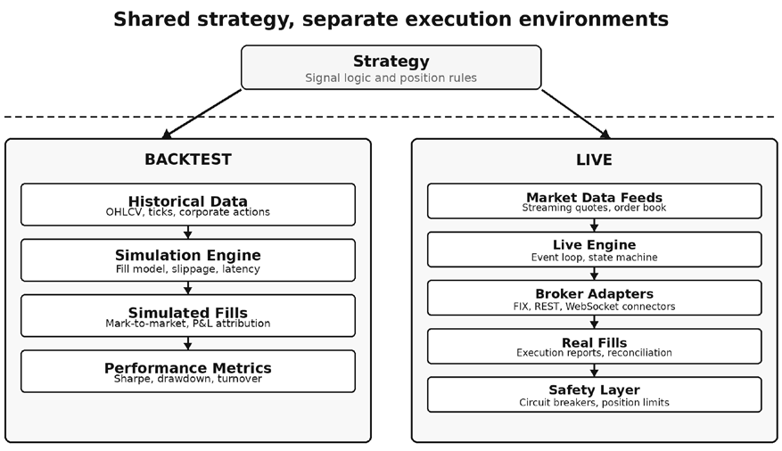
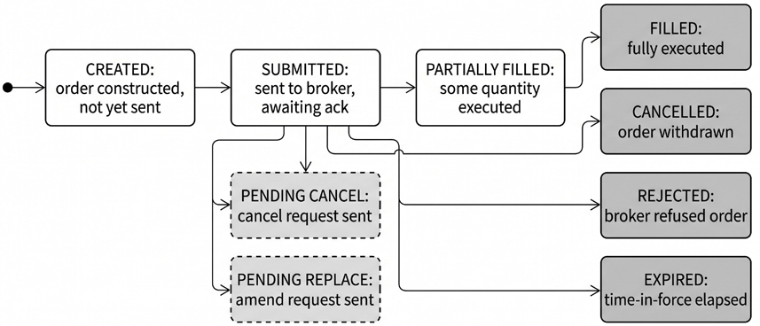
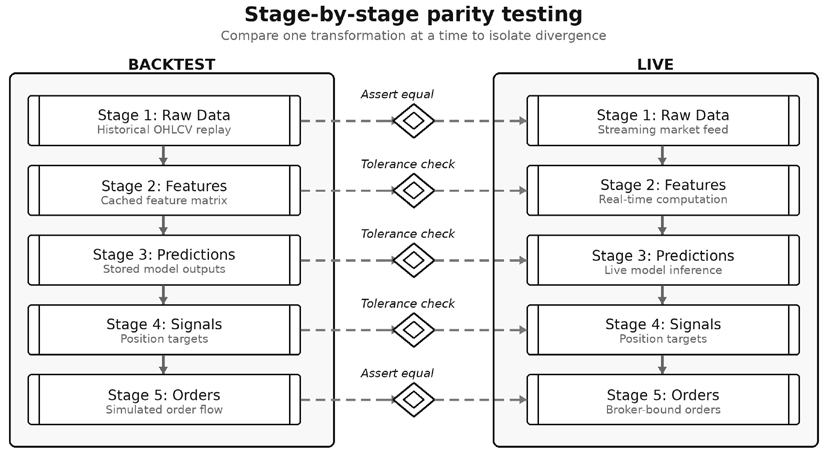

# Chapter 25: Live Trading Systems

The transition from profitable backtest to live execution is where most algorithmic trading projects fail. Not because the strategy lacks edge, but because the production system diverges from the research environment in subtle ways that erode returns - a feature is calculated slightly differently, a fill assumption that doesn’t match reality, a timing mismatch between signals and execution. Research on **backtest overfitting** shows that even correctly implemented strategies suffer significant performance degradation when moving to live trading (Bailey et al., 2015) - and this assumes the live implementation matches the backtest exactly.

The solution is a unified framework that runs **identical code in both backtest and live modes**, eliminating technical divergence by construction. The strategy classes, allocation logic, cost parameters, and risk controls built in *Chapters 16–19* are not prototypes to be rewritten - they port directly to live execution through the same `ml4t-backtest` library, with only the data source and execution destination changing. This chapter builds the remaining production infrastructure - broker integration, order management, pipeline verification, and operational procedures - needed to deploy these strategies with confidence.

After completing this chapter, you will be able to:

- Explain why technical divergence between research and production is a primary failure mode in live trading, and how a unified framework reduces that risk.
- Design a dual-mode, event-driven trading architecture in which deterministic strategy logic runs unchanged in backtest, paper, and live execution.
- Compare broker, exchange, and managed-platform deployment paths and evaluate them based on asset coverage, execution quality, operational burden, and control.
- Model order handling as an explicit state machine that supports partial fills, cancellations, rejections, reconciliation, and idempotent crash recovery.
- Verify technical parity across the full pipeline, from raw data and features to predictions, sizing decisions, and generated orders.
- Plan a staged live rollout using pre-flight checks, shadow or paper trading, kill switches, reconciliation procedures, and awareness of venue and jurisdictional constraints.

*Section 25.1* introduces the unified framework that lets identical strategy code run in both backtest and live modes. *Sections 25.2–25.3* integrate two broker APIs - Interactive Brokers for global multi-asset access and Alpaca for developer-friendly US equity and crypto trading - while *Section 25.4* evaluates managed platforms as an alternative path. *Section 25.5* models the order lifecycle as an explicit state machine, and *Section 25.6* establishes pipeline verification methods that ensure technical parity before deployment. *Section 25.7* covers operational readiness - kill switches, graduated paper-to-live transitions, and the regulatory landscape that constrains what can be deployed where.

## 25.1 The unified research-to-production framework

Quantitative strategy development often follows a convenient but error-prone path. Research happens in Jupyter notebooks using historical data. The promising strategy then gets rewritten for production in a different language or framework, possibly by a different team. This creates two parallel implementations of the same logic - and two opportunities for implementation bugs to hide.

The problems compound over time. A researcher improves the feature engineering; the production team must replicate the change. The production system hits an edge case; the fix doesn’t propagate back to research. Six months later, the backtest shows a 15% annual return, while live trading delivers only a 3% return. The discrepancy is real, but its sources can be difficult and time-consuming to diagnose.

### Technical divergence

Technical divergence occurs when the same inputs produce different outputs in backtest versus live execution. Unlike statistical decay - where the market genuinely changes - technical divergence is entirely self-inflicted.

The most common source is **differences in feature calculation**: a moving average computed on adjusted closing prices in research but on unadjusted prices in production, or a volatility estimate using a slightly different lookback window. These differences often go undetected until cumulative divergence becomes material.

**Timing assumptions** create a second class of divergence. Research code calculates signals at market close and assumes execution at the next open. Production code receives data with varying delays and executes asynchronously. The backtest assumes perfect synchronization that never exists in practice.

**Data handling edge cases** - missing prices, corporate actions, ticker changes - compound the problem. Research code often ignores these complications; production must handle them gracefully. Even **order translation** introduces divergence: converting a signal (“+0.05 target weight for AAPL”) into actual orders involves rounding to valid lot sizes and respecting available liquidity, and different implementations make different choices.

### The unified framework solution

A unified framework eliminates technical divergence by construction. The same code - literally the same source files - runs in both modes:

- In **backtest mode**, the framework feeds historical data through the strategy, simulates order execution with configurable assumptions, and records positions and returns - traditional backtesting, but using production code.
- In **live mode**, the framework connects to broker APIs, feeds real-time data through the identical strategy logic, and routes orders to execution. No translation layer, no second implementation of the strategy itself.

In the ML4T stack, this pattern is split across two companion libraries. `ml4t-backtest` provides the event-driven research and validation engine introduced in *Chapters 16–19*. `ml4t-live` provides the same `Strategy` interface for both paper and live trading, via broker adapters, live data feeds, and safety controls. The key continuity is at the strategy layer: the decision logic stays the same even though live deployment adds broker, feed, and risk-management infrastructure around it.

### Architecture for dual-mode operation

The architecture rests on four design principles:

1. **Abstract interfaces for data and execution** hide the source: the strategy receives market data through an interface that is indifferent to whether the source is a historical database or a live WebSocket feed, and orders pass through an execution interface that routes them to a simulator for backtesting or to a broker for production.
2. **Signal generation must be deterministic** - given the same market state, the strategy produces identical signals. This means avoiding system time dependencies, random seeds that differ between runs, or external state that varies between environments.
3. **Both modes share an event-driven core**. In backtest, events replay from history; in live trading, events arrive from market data feeds. The same event handlers process both.
4. **Position state, order state, and strategy state** are maintained identically in both modes. The framework handles persistence and recovery, ensuring a restarted live system can resume from a saved state.

*Figure 25.1* shows the dual-mode architecture: the same `Strategy` component connects to either the backtest engine (historical data and simulated execution) or the live engine (market data feeds and broker APIs), with the strategy code unchanged across both modes.

*Figure 25.1: Unified framework architecture. The same strategy logic applies to both historical replay and live feeds, while execution, broker, and safety infrastructure differ by mode*

### From simulation to live

The strategies simulated in *Chapters 16–19* are production code waiting for a live data source. In those chapters, each case study defines a `Strategy` subclass with an `on_data()` method that receives market data, computes signals, and submits orders through the framework’s execution interface. The `Engine` runs this strategy against historical data in backtest mode: the ETF momentum strategy in *Chapter 16* uses the same `MLSignalStrategy` class through allocation (*Chapter 17*), transaction cost modeling (*Chapter 18*), and risk management (*Chapter 19*), accumulating layers of portfolio construction logic, cost-aware constraints, and adaptive risk controls.

Going live means keeping the same strategy class while replacing the historical runtime with `ml4t-` `live`'s `LiveEngine`, broker adapters, and live data feeds. The `on_data()` logic, allocation rules, and portfolio intent carry over unchanged. Around that strategy, the live stack adds the operational pieces that a backtest does not need: asynchronous broker connectivity, startup checks, shadow mode, persistent risk state, and guarded order submission. *Chapter 17*’s `WeightFollowerStrategy` - which translates model-generated target weights into rebalancing orders - becomes the live execution strategy. *Chapter 18*’s cost model parameters (spread estimates, impact coefficients, turnover constraints) become the live cost budget against which realized execution is measured. *Chapter 19*’s kill-switch levels and drawdown thresholds become live safety controls enforced by the broker wrapper, rather than assumptions within a simulator. This continuity is the payoff of the unified framework. The nine case studies - ETFs, crypto perpetuals, futures, FX, equities, and options - each define a complete pipeline from features through risk-managed execution. Any of these pipelines can move from backtest into a live runtime without rewriting the strategy logic, provided the pipeline verification tests introduced in *Section 25.6* confirm technical parity.

The framework provides the strategy interface; what remains is to connect it to specific brokers. The next two sections integrate Interactive Brokers and Alpaca, the two broker APIs most relevant to practitioners deploying the strategies from this book, especially in the US.

**Implementation**: `01_unified_framework_demo` demonstrates signal parity on a shared historical replay: the same `DualMAStrategy` produces matching signals in both backtest and live-style execution with zero strategy-code changes - the unified framework’s central claim, reduced to a side-by-side comparison.

`02_etfs_deployment_loop` is the chapter’s anchor demonstration of the full retrain-and-deploy cycle on real ETF data: it refreshes the ETF panel via `ml4t-data`, retrains the Ridge regressor identified in the ETF case study, and replays the live window via `ml4t.` `backtest.Engine` to produce an offline reference signal tape, and submits the latest top-K basket through Alpaca paper equities - reconciling the live broker submission against the offline tape symbol by symbol. It is referenced again in *Section 25.7* as the deployment-loop reference implementation.

## 25.2 Integrating with Interactive Brokers

**Interactive Brokers** (**IBKR**) provides global multi-asset access via the **Trader Workstation** (TWS) app or the IB Gateway socket API, the Client Portal API, and institutional interfaces such as FIX/CTCI. IBKR Pro’s tiered US equity and ETFs commissions start at around $0.0035/share, and eligible US securities accounts can apply for portfolio margin once the account’s equity reaches $100,000 (per regulation), or more (per broker risk limit). For systematic traders who need broad instrument coverage, IBKR remains one of the most flexible retail-accessible broker stacks.

### TWS versus IB Gateway

For retail accounts, IBKR provides two connection options, each suited to different use cases:

- **TWS** is the full desktop application. It provides a graphical interface for manual trading, as well as API access. TWS requires a physical (or virtual) display to run, which complicates headless server deployments. However, its visual feedback proves valuable during development and debugging.
- **IB Gateway** provides access to the same API without the graphical overhead. It runs headlessly on servers, consuming fewer resources than TWS. For production deployments, IB Gateway is typically the better choice.

Both require authentication that must be refreshed periodically. Automated login solutions exist but require careful security consideration - the credentials provide full account access.

### Connection patterns

The main retail and developer workflow uses IBKR’s event-driven, long-lived socket connection. The `ib_async` library makes the low-level, callback-driven socket API easier to use by providing a higher-level Python interface that feels closer to normal synchronous or `asyncio` programming. Each connection is identified by a client ID unique to each process on the account - using the same ID from multiple processes causes disconnection conflicts. By default, TWS listens on port 7496 (live) or 7497 (paper); IB Gateway uses 4001 (live) or 4002 (paper).

The TWS/Gateway API uses a long-lived socket connection, so the trading system must actively detect broken or stale connectivity. Use a lightweight heartbeat, such as periodic `reqCurrentTime()` calls, and treat missed or delayed responses as a failure that can affect order management. When connectivity drops, or IBKR reports a reset, reconnect with exponential backoff, re-subscribe to market data as needed, and reconcile broker state by reloading open orders, completed orders, executions, positions, and account values before resuming trading.

### Order types and execution

IBKR supports extensive order types. For algorithmic trading, the essential ones are (see also *Chapter 3*):

- Market orders execute immediately at the best available price but should be used sparingly - Harris (2003) documents how they incur both spread costs and market impact, with the latter increasing in order size relative to available liquidity (see also *Chapter 18*)
- Limit orders specify a maximum buy or minimum sell price, providing price certainty at the cost of execution certainty
- Stop orders become market orders when the trigger price is reached, which is useful for stoploss logic but can lead to significant slippage in fast markets

IBKR Pro’s SmartRouting scans multiple venues for best execution, functionally replicating institutional smart order routing - and critically, it does not sell order flow to wholesalers. Schwarz et al. (2022) measured round-trip execution costs across five US brokers using 85,000 simultaneous market orders and found dispersion ranging from 0.07% to 0.46%, with payment for order flow explaining only 3.4% of the variation. The takeaway: broker routing choices can matter more than the direct commissions.

IBKR’s adaptive orders extend this by balancing urgency against price based on market conditions, reflecting the execution trade-off formalized by Almgren and Chriss (2001): executing quickly minimizes timing risk but increases market impact, while executing slowly reduces impact but exposes the position to adverse price movements.

Order attributes further modify behavior - **Good-Till-Cancelled** (**GTC**) orders persist across sessions, **Immediate-or-Cancel** (**IOC**) orders fill immediately or cancel, and **All-or-None** (**AON**) orders require complete fills. Review IBRK’s documentation to get an overview of the diverse order tools available across asset classes.

### Position and account management

Accurate position tracking requires attention to several data flows:

- Position updates arrive through the `position()` callback (requested via `reqPositions()`) and reflect the broker’s authoritative view - reconcile internal tracking against these at session start and periodically throughout the day
- Account values (equity, margin, buying power, PnL) flow through `updateAccountValue()`, requested via `reqAccountUpdates()`; monitor margin utilization to avoid forced liquidations
- Execution reports are delivered via `execDetails()` for each fill, including price, quantity, commission, and timing - essential for trade analysis and reconciliation

### Error handling

IBKR’s error messages are delivered via the `error()` callback as numeric error codes. Implement a centralized error handler that logs all errors and escalates critical ones to alerting systems - errors often indicate problems that worsen over time.

IBKR error codes include**:**

| Code | Meaning | Action |
| --- | --- | --- |
| 502 | Cannot connect | Gateway/TWS not running or not accepting connections |
| 504 | Not connected | Connection dropped; reconnect and reconcile state |
| 201 | Order rejected | Parse message for reason (margin, symbol, market hours) |
| 202 | Order cancelled | Client- or broker-initiated (for example, end-of-day GTC) |
| 162 | Historical data pacing | Rate limit hit; implement request queuing with delays |

*Table 25.1: Important IBKR error codes*

### Historical data access

IBKR provides historical bar data via `reqHistoricalData()`, and access may require a subscription. There are several limitations:

- **Pacing restrictions**: Historical data requests are rate-limited and the exact limits depend on your request pattern. Implement request queuing with appropriate delays rather than assuming an unlimited pull rate.
- **Data availability**: Historical data availability varies by instrument and exchange. Verify data exists before depending on it.
- **Bar sizes**: Available intervals range from 1 second to 1 month. Not all sizes are available for all instruments.

For strategies that require extensive historical data, consider supplementing IBKR data with data from dedicated vendors. Use IBKR primarily for recent data and verification against your primary source.

IBKR’s depth comes with complexity; the next section covers Alpaca, which trades a narrower universe through a simpler API and serves as the faster on-ramp for readers running their first live experiments. **Implementation**: See `03_ib_paper_trading_demo`, which shows IB connectivity, warmup data requests, and shadow-mode order flow when a paper-trading session is available.

## 25.3 Integrating with Alpaca

Alpaca provides commission-free US stock, options, and ETF trading, plus API access to crypto markets, through a clean REST and streaming interface with generous paper-trading access. For many readers, it is the easiest broker path for early live-trading experiments. “**Commission-free**” does not mean cost-free: routing quality, spread capture, and venue selection still determine realized execution cost.

Alpaca also offers a paid plan geared more toward execution quality and infrastructure than toward zero-fee simplicity. The paid plan also lifts rate limits and expands data coverage.

### REST and WebSocket APIs

The REST API handles synchronous operations - submitting orders, querying positions, and fetching account information. The streaming interfaces deliver asynchronous updates, such as fills, position changes, and market data events, after subscribing to the relevant channels. In production, use request-response calls for commands and persistent streams for status updates.

### Paper trading mode

Alpaca’s paper trading requires no account funding - create an account, generate paper trading API keys, and begin immediately. The paper environment uses the same general account and order workflow but simulates fills rather than negotiating against real liquidity. That makes paper trading useful for integration testing, not for measuring live slippage, market impact, or partial-fill behavior.

**Use paper trading extensively before risking real capital.** Run the complete system in paper mode for several trading sessions, observing that orders execute correctly, positions track accurately, and reconciliation works as expected.

### Key differences from IBKR

Traders migrating from IBKR should note several differences:

| Broker | Alpaca | IBKR |
| --- | --- | --- |
| Asset classes | US equities and ETFs, listed options, crypto | 170 markets, all asset classes |
| Order types | Market, limit, stop, stop-limit (more on paid plan) | Adaptive, pegged, conditional, and many more |
| Rate limits | 200 requests/min (unlimited on paid plan) | 50 messages/second on TWS API |
| Authentication | API key/secret (no expiry) | Session-based; periodic renewal required |
| Data costs | Basic data included; consolidated and real- time requires a subscription | Separate charges per exchange and data type |
| Execution routing | PFOF to wholesalers (standard); smart routing (paid tier) | SmartRouting across venues; no PFOF (Pro) |

*Table 25.2: IBKR and Alpaca, compared (as of June 2026)*

For multi-asset strategies, IBKR remains necessary. For most systematic strategies trading US equities or crypto, Alpaca’s simpler order types suffice.

**Both Alpaca and IBKR provide cryptocurrency trading** through the same API, with 24/7 trading hours that require an always-on system design. Alpaca’s USD-quoted spot subset covers eleven of the nineteen Binance USDT perpetual contracts the crypto case study trades; ADA, APT, ATOM, BNB, COMP, INJ, NEAR, and SUI are not Alpaca-tradeable, so a strategy ported from the Binance perp universe must either route the missing names to another venue or log them signal-only. Crypto orders accept fractional quantities (for example, 0.005 BTC); Alpaca also supports **fractional equity** shares. For strategies spanning both asset classes, the unified API simplifies integration compared to maintaining separate exchange connections. **Broker offerings continue to evolve**; always check the latest information on the broker’s website.

### Direct crypto exchange APIs

For crypto derivatives - perpetual futures, options, and leveraged positions - broker-mediated access through Alpaca or IBKR is insufficient. Major crypto exchanges (such as Binance, Bybit, OKX, and Deribit) operate as both venues and counterparties, exposing REST and WebSocket APIs that provide direct order book access. This is the closest analog to direct market access available to retail traders, though the exchange itself serves as both a matching engine and a custodian - a structural counterparty risk absent in traditional finance, where the broker, exchange, and clearinghouse are distinct entities.

The **crypto funding-rate case study** in *Section 25.6* deploys to OKX, which provides an instructive example of a direct exchange API. OKX’s v5 API covers spot, perpetual swaps, futures, and options through one interface and offers separate live and demo workflows. The exact authentication requirements, fee schedule, and rate limits can change, so production deployments should read the venue’s current documentation rather than hard-code operational assumptions from a notebook.

Geographic restrictions are the binding constraint. Exchange availability, derivatives access, and leverage terms vary by jurisdiction and change frequently. Treat venue eligibility as a legal and operational prerequisite, not as a detail to verify after the strategy is finished. The CCXT library provides a unified Python interface that abstracts away exchange-specific authentication and rate limiting, reducing the integration cost of multi-exchange strategies. **Implementation**: See `04_alpaca_paper_trading_demo` for paper-trading connectivity and shadow-mode execution, `05_alpaca_crypto_live_demo` for the crypto path through Alpaca’s API, and `09_crypto_funding_deployment_loop` for the split-venue deployment of the *Chapter 12* funding-rate workflow - OKX for live data (bars and 8-hour funding rates), Alpaca paper crypto for execution on the USD-quoted spot subset.

### Error handling

Alpaca errors arrive as HTTP status codes with JSON error bodies:

- **403 Forbidden**: Authentication failed. Verify the API keys and check that both paper and live keys match the endpoint.
- **422 Unprocessable Entity**: Order validation failed. The response body explains why - insufficient buying power, an invalid symbol, or the market is closed.
- **429 Too Many Requests**: Rate limit exceeded. Implement exponential backoff and request queuing.
- **500/503 Server Errors**: Alpaca infrastructure issues. Retry with backoff; if persistent, check Alpaca’s status page.

Parse error responses carefully. The `message` field typically explains the problem clearly enough to determine the appropriate action.

### Idempotency keys

Alpaca supports client-provided order IDs (`client_order_id`) for idempotent order submission. Use this feature:

- **Generate unique IDs**: Use UUIDs or deterministic IDs based on strategy, symbol, and signal timestamp. Store the mapping between your internal order references and `client_order_ids`.
- **Retry safely**: If an order submission times out, retry with the same `client_order_id`. If the original succeeded, Alpaca returns the existing order. If it failed, Alpaca creates the new order.
- **Prevent duplicates**: The system should never create duplicate orders due to network issues or crash recovery. Client order IDs make this guarantee possible.

This idempotency pattern is essential for production reliability and applies equally to IBKR integration.

Building and maintaining broker connectivity is not the only path; the next section evaluates managed platforms that bundle infrastructure, data, and execution into a hosted service - a trade-off between convenience and control that practitioners should assess before committing to either model.

## 25.4 QuantConnect and managed platforms

Building and maintaining trading infrastructure demands substantial engineering effort. Managed platforms offer an alternative: let someone else handle the infrastructure while you focus on strategy development. QuantConnect, built on the open-source LEAN engine, exemplifies this approach.

### The platform approach versus self-hosted

Managed platforms bundle infrastructure (servers, networking, and monitoring), pre-built broker integrations that update when APIs change, historical and real-time data feeds, and optimized backtest engines. The trade-off is between convenience and speed-to-market and flexibility and control - platforms constrain data sources, supported brokers, and available order types, but dramatically reduce implementation effort.

This chapter’s earlier sections describe a different path: self-hosting with `ml4t-backtest` for research and validation, then `ml4t-live` for paper or live execution using the same strategy interface. That stack preserves direct control over code, data pipelines, and broker connectivity, but it also leaves operational responsibility with the practitioner. QuantConnect and LEAN offer integrated infrastructure and managed convenience, with less control over the surrounding environment.

### LEAN engine overview

LEAN, the engine powering QuantConnect, is open source (Apache 2.0 license). This creates a hybrid option:

- **Cloud deployment**: Deploy strategies on QuantConnect’s infrastructure. Pay based on usage; benefit from managed operations.
- **Local development**: Run LEAN locally during research. Full control over the environment; no cloud costs during development.
- **Self-hosted production**: Deploy LEAN on your own infrastructure. Same engine as QuantConnect, but on servers you control (and pay for).

LEAN supports multiple asset classes (such as equities, options, futures, forex, crypto) and brokers (including Alpaca, IBKR, and others). Strategies written in C# or Python can backtest on years of data and deploy to production with minimal code changes. Its main attraction is integration rather than raw speed: it combines backtesting, vendor-managed data, broker connectivity, and deployment infrastructure into a single platform.

The LEAN architecture follows event-driven principles similar to those discussed in *Chapter 16*. Data handlers feed the algorithm; the algorithm generates orders; an execution handler routes to brokers. The framework manages state persistence, position tracking, and reconciliation.

### Trade-offs – Convenience versus flexibility versus cost

Evaluate platforms against self-hosted systems across several dimensions:

- **Development speed**: Platforms accelerate initial development. No infrastructure setup, pre-configured data access, or example algorithms to start from. Self-hosted systems, such as an `ml4t-` `backtest` plus `ml4t-live` workflow, require more upfront investment before trading begins.
- **Flexibility**: Self-hosted systems can integrate any data source, connect to any broker, and implement any execution logic. Platforms limit you to their supported options. If your strategy needs something the platform doesn’t offer, you’re stuck.
- **Cost structure**: Platforms charge subscription fees, per-algorithm fees, or profit sharing. At a small scale, these fees are modest. At a large scale, self-hosted infrastructure often costs less. Calculate the crossover point for your expected capital deployment.
- **Intellectual property**: Platform deployment means your strategy code resides on third-party infrastructure. Reputable platforms like QuantConnect implement access controls, but risks remain. Self-hosted systems keep strategy logic on your infrastructure.
- **Operational burden**: Platforms handle monitoring, alerting, updates, and incident response. Self-hosted systems require you to build and maintain these capabilities.

### When platforms make sense

Platforms are a good fit for a variety of situations. They suit retail-scale operations, where infrastructure costs dominate; rapid prototyping before committing to a full build-out; teams with limited engineering bandwidth and where development time is more valuable than operational control; and simpler strategies that trade liquid instruments through supported brokers.

They also serve as effective learning environments for understanding algorithmic trading before building custom infrastructure. A self-hosted stack is the better fit when custom data handling or tighter control over live operations (including lower latency) matter more than managed convenience.

### Migration considerations

Platform lock-in is a legitimate concern. Plan for potential migration:

- Keep strategy logic separable from platform-specific boilerplate and document which features are portable.
- Maintain independent relationships with data vendors rather than relying solely on platform data.
- Some platforms allow exporting strategy code - test that exports run on alternative infrastructure before depending on migration. Consider hybrid operation across platforms or a platform-versus-self-hosted split to reduce the risk of a single point of failure.

Whether self-hosted or managed, every live system must handle orders that fail, partially fill, or arrive out of sequence. The next section models the order lifecycle as an explicit state machine - the layer that sits between strategy signals and broker execution, regardless of which infrastructure path you choose.

**Implementation**: See `06_quantconnect_case_study` for exporting ETF case-study predictions to QuantConnect’s Object Store and consuming them from a LEAN algorithm.

## 25.5 Order lifecycle management

An order’s journey from strategy signal to final fill involves multiple state transitions, any of which can fail, time out, or produce unexpected results. Managing this lifecycle correctly separates robust trading systems from fragile ones. The steps of the typical lifecycle are as follows:

1. The strategy first produces an internal target - “increase AAPL weight to 5%” - based on current market data.
2. This signal then becomes a concrete order (“buy 150 shares of AAPL at market”) through position sizing, lot-size rounding, and order-type selection, where the choice between market and limit orders reflects the urgency-versus-impact trade-off formalized by Almgren and Chriss (2001).
3. The order is transmitted to the broker, but until acknowledgment arrives, its existence is uncertain - a network failure during submission leaves it unclear whether the order reached the broker.
4. Once the broker confirms receipt and assigns an order ID, the order is “working” at the exchange.
5. Execution may be immediate (a market order in a liquid stock) or delayed (a limit order away from the market), and partial fills create intermediate states. Madhavan (2002) provides a comprehensive framework for the microstructure dynamics that determine execution quality.
6. After fills, internal position records update, and reconciliation confirms alignment with broker records.

Each step offers opportunities for failure. Robust systems detect failures early and respond appropriately, rather than allowing undetected discrepancies to accumulate.

### State machine for order status

A state machine is a model that represents a process as a set of discrete states and rules governing how events can trigger valid transitions between states. It provides a disciplined way to model the order lifecycle because every live trading system must know exactly where each order stands, which events are valid at that point, and which actions are no longer allowed. The **seven primary states** are:

1. *Created*: Exists internally, not yet submitted.
2. *Submitted*: Sent to broker, awaiting acknowledgment.
3. *Acknowledged*: Broker confirmed receipt, order is working.
4. *Partially Filled*: Some quantity executed, remainder working.
5. *Filled*: Complete execution, terminal.
6. *Canceled*: Removed before full execution, terminal.
7. *Rejected*: Broker refused, terminal.

*Figure 25.2* visualizes the complete state machine with 10 states and valid transitions between them. **Terminal states** (Filled, Canceled, Rejected) have no outgoing transitions, while working states allow progression through fills or cancellation. Note how this resembles the logic of the NASDAQ ITCH order flow messages we analyzed in *Chapter 3*.

*Figure 25.2: Order state machine. Explicit working and terminal states make asynchronous broker callbacks auditable and constrain legal transitions*

The state machine is the critical integration point between the unified framework from *Section 25.1* and the broker APIs from *Sections 25.2–25.3*.

There are two modes:

- In **backtest mode**, the framework simulates state transitions instantaneously
- In **live mode**, the same state machine processes asynchronous broker callbacks

Because both modes share the state machine logic, order-handling behavior is verified in backtests and reproduced exactly in production. State transitions must handle edge cases:

- **Out-of-order messages**: A fill notification may arrive before acknowledgment. The state machine must accept valid transitions regardless of message order.
- **Concurrent events**: A cancel request sent just as the order fills creates a race condition. The order moves to `PENDING_CANCEL` while the cancelation is in flight; the fill notification then arrives ahead of the cancel acknowledgment, the in-flight cancel is discarded, and the audit trail records the `PENDING_CANCEL` → `FILLED` transition so the resolution remains reconstructible after the fact.
- **Network timeouts**: Submissions without acknowledgment within the timeout period require querying the broker state before deciding whether to retry.

### Handling partial fills, rejections, and cancellations

**Partial fills** require running calculations: cumulative filled quantity, volume-weighted average price across fills, and remaining quantity. Each fill event triggers position updates and may also trigger new orders if the strategy targets a specific position size.

**Rejections** demand understanding the cause. Insufficient buying power? Retry after other orders free capital. Invalid symbol? Log the error and investigate. Market closed? Wait for the market to open. Don’t blindly retry rejections. **Cancellations** may be trader-initiated or broker-initiated. End-of-day cancellation of day orders is expected. Midday cancellation by the broker indicates a problem that requires investigation.

### End-of-day reconciliation

Daily reconciliation compares internal records against broker statements:

- **Position reconciliation**: Internal position quantities versus broker-reported positions. Discrepancies indicate missed fills, erroneous calculations, or trades made outside the system.
- **Order reconciliation**: Internal open order list versus broker open orders. Orphaned broker orders (not tracked internally) present danger - they can fill unexpectedly.
- **Cash reconciliation**: Expected cash balance versus reported balance. Differences indicate missed fills, fee miscalculations, or deposits/withdrawals outside the system.

When reconciliation detects discrepancies, halt automated trading until the discrepancies are resolved. Automatic correction risks turning record-keeping errors into trading errors. Manual review before adjustment is safer.

### Idempotency for crash recovery

System crashes create a particularly dangerous failure mode. The system submitted an order, then crashed before recording the submission. After a restart, should it submit again?

**Client order IDs** solve this problem. Before submission, generate and persist a unique ID for the order. Include this ID in the submission request. After recovery:

1. Check if the order ID exists in pending orders.
2. Query the broker using the client order ID.
3. If the broker has the order, update the internal state to match.
4. If the broker doesn’t, the submission failed; retry with the same ID.

This pattern ensures orders are never duplicated due to crashes. The client order ID acts as an idempotency key - submitting the same ID twice returns the existing order rather than creating a duplicate.

Correct order handling is necessary but not sufficient - the entire signal generation pipeline must also produce identical outputs in backtest and live modes. The next section establishes a systematic verification methodology that tests parity at every stage from raw data through final orders.

**Implementation**: The notebook `07_order_state_machine` implements 10 order states, 19 valid state-event transitions, and demonstrates complete lifecycle tracking via audit trails.

## 25.6 Ensuring technical parity through pipeline verification

Live trading failures have two different sources:

- The first is a *technical failure*: the pipeline diverges from the backtest, so the same inputs produce different outputs. This is a bug and should be detected before deployment.
- The second is a *statistical failure*: the pipeline is technically correct, but out-of-sample performance differs from the backtest because markets changed or the backtest was overfit.

Bailey et al. (2015) provide a framework for estimating the probability of backtest overfitting (discussed in *Chapter 16*), but even that analysis assumes technical parity. The present section addresses parity; *Chapter 26* addresses the ongoing monitoring required after parity has been verified.

Technical parity verification ensures your live system does exactly what your backtest simulated. Until you’ve verified parity, live performance deviations could stem from either bugs or market conditions - making diagnosis impossible.

### The verification methodology

Verification proceeds step by step through the signal generation pipeline. At each stage, feed identical inputs to backtest and live systems, then compare outputs. Any difference indicates a technical divergence that requires investigation.

*Figure 25.3* shows parallel backtest and live pipelines with comparison checkpoints at each stage, enabling a binary search for divergence: when the outputs differ, check each intermediate stage to isolate the source of the divergence.

*Figure 25.3: Pipeline verification flow. Comparing raw data, features, predictions, signals, and orders stage by stage isolates technical divergence before live capital is at risk*

The pipeline stages for a typical ML-based strategy:

1. **Raw data → Features**: Market data transforms into model features. A momentum factor calculated on adjusted closes should produce identical values whether computed in backtest replay or from live data snapshots.
2. **Features → Predictions**: For ML-based strategies, the model transforms features into return forecasts. The same feature vector must produce the same prediction in both environments.
3. **Predictions → Signals**: Forecasts combine with risk model and constraints to produce target positions. Given identical predictions and current positions, the optimizer should output identical targets.
4. **Signals → Orders**: Target positions translate into actual orders, accounting for lot sizes, existing positions, and execution constraints. The same signal should generate the same orders.

Aim for automated tests at every stage to verify pipeline integrity and identify regressions.

### Feature parity testing

Feature verification uses point-in-time historical data. Choose a historical decision date, run the backtest up to that point, extract the feature values computed for that timestamp, feed the same as-of raw data into the live feature pipeline, and compare the resulting feature vectors.

Differences reveal implementation divergence. Common culprits:

- **Look-ahead bias in backtesting:** The backtest inadvertently uses future data unavailable at the time of the decision. The live system, correctly using only past data, computes different features. López de Prado (2018) identifies look-ahead bias as a critical backtesting pitfall that inflates apparent performance.
- **Data adjustment differences**: The backtest uses split-adjusted data throughout. The live system receives unadjusted prices, which can lead to price jumps not present in the adjusted history.
- **Missing data handling**: The backtest forward-fills missing prices; the live system raises an error, uses a different fill method, or just passes the missing values to the model.
- **Timezone confusion**: The backtest interprets timestamps in one timezone; the live system uses another.

**Create automated tests that verify feature parity** across multiple historical dates. Run these tests continuously - data feed changes, library updates, or code modifications can introduce divergence.

### Prediction consistency testing

For ML strategies, verify that the trained model produces identical predictions in both environments. Extract a feature vector from the backtest at a specific historical point, pass that same vector through the model in the backtest environment and in the production environment, and compare the outputs directly. Model divergence sources include:

- **Serialization differences**: The model saved from research doesn’t deserialize identically in production. Different library versions, missing dependencies, or platform differences can cause subtle changes.
- **Preprocessing mismatch**: The production pipeline applies preprocessing (scaling, encoding) slightly differently than research.
- **Random state**: If the model is stochastic, ensure production uses the same random seed or a deterministic mode.
- **Numerical precision**: Float32 rather than float64 computation can cause tiny differences that accumulate through deep networks.

Again, automate testing of your model prediction workflow to catch deviations without delay.

### Sizing logic verification

Position sizing and portfolio optimization introduce additional complexity. Given the same predictions and current portfolio, run the optimizer in both environments and compare the target positions directly.

Divergence sources include:

- **Optimizer configuration**: Slight variations in constraint tolerances or solver settings yield different optimal points
- **Risk model differences**: Using different covariance estimates or risk factor loadings can change optimal positions
- **Universe differences**: The backtest and live systems operate on different instrument universes due to data availability or listing status

### Automated regression tests

Automate verification with a custom test suite rather than relying on manual spot-checking. For a daily strategy, for example, the system should check each morning whether the previous day’s live signals match what the backtest would have produced from the same information set. Any mismatch should halt trading until it is explained.

Before deployment, per-commit tests should compare features and predictions against a ground truth of cases. In addition, the complete live pipeline should periodically be replayed on historical data and compared with backtest results to catch integration errors that unit tests may miss.

The `08_pipeline_verification` harness operationalizes this discipline: on the deterministic test tape, five gated parity tests pass end-to-end (features, predictions, signals, order count, order details), the feature count is annotated `EXPECTED_DIFFERENCE` so warm-up window mismatches surface informationally rather than failing the CI gate, and zero tests are skipped because the harness emits explicit SKIP semantics when the async live pipeline cannot run - closing off the silent-pass-against-emptylive-log failure mode.

### Diagnosing divergence points

When tests detect divergence, diagnosis should proceed systematically through the pipeline. Start by verifying that the inputs are identical; a data-feed issue can easily look like a computation bug. If the end-to-end outputs still differ, compare the intermediate artifacts, stage by stage.

Matching features but different predictions point to the model layer, while matching predictions but different signals point to the optimization layer. Also, check dependency versions, since library updates can change edge-case behavior. Logging inputs and outputs at each pipeline boundary speeds up this process by showing where the two environments first diverge.

### Unified data sources

A subtle but critical source of divergence is **exchange-level differences**. Training on historical data from one exchange while running live inference on another creates a distribution shift that no amount of code verification can detect:

- **Quote conventions differ**: bid-ask spreads, price rounding, and timestamp alignment vary across exchanges. Features computed on Binance historical data may exhibit slightly different distributional properties than the same features computed on Coinbase live data.
- **Fee structures affect signals**: Trading costs embedded in exchange data differ. A funding rate signal trained on exchange A’s funding structure may not generalize to exchange B’s different rate calculation methodology.
- **Liquidity profiles vary**: Volume patterns, market depth, and order flow characteristics differ across exchanges. Cross-sectional features that rank assets by volume can yield different rankings across exchanges.

The first preference is straightforward: use the same venue for both training and inference. Mixing historical data from one exchange with live data from another introduces a distribution shift. When matching venues is impossible, treat the mismatch as an explicit verification problem. The crypto perpetual materials illustrate this practical complication. The *Chapter 12* model artifacts are rooted in Binance-derived training data, while the live deployment demo connects to OKX market data. That makes venue comparison part of the verification task: feature definitions may match while exchange conventions still differ. The operational lesson is that mismatches must be measured and documented before live deployment.

Historical data depth may require pragmatic choices - a single exchange’s public API may provide only 90 days of history, whereas archived datasets offer years of data. When mixing sources, verify that feature distributions are comparable before training on combined data.

### Funding rate strategy – Live deployment

The **crypto perpetuals case study** demonstrates the complete ML-to-live pipeline. The *Chapter 12* LightGBM classifier uses 13 features: three funding-rate features (premium z-score, 8h momentum, and 24h momentum) plus ten supporting price features covering momentum at multiple horizons, rolling volatility, and technical indicators. The core hypothesis, that extreme funding rates reflect crowded positioning prone to mean reversion, is detailed in *Chapter 6* (see also the book’s GitHub repo); here, the focus is on deploying the trained model into a live-execution workflow. For live trading, the notebooks deploy to OKX, which provides real-time funding rate data on an 8-hour settlement cycle, OHLCV candles at minute and hourly resolution, and broad API accessibility for both data retrieval and order execution.

Each minute, the live pipeline:

1. *Fetches* hourly bars and funding rate history from OKX.
2. *Computes* all 13 features to match the training schema and transformations as closely as the live venue permits.
3. *Predicts* using the trained LightGBM classifier (3-class: `stop_loss`, `timeout`, `profit_take`).
4. *Decides* entry, hold, or exit based on prediction probabilities.

Two exit mechanisms protect capital:

- **Prediction-flip exit**: When P(profit) drops below the exit threshold, indicating the funding rate opportunity has closed or conditions changed, exit the position
- **Stop-loss** **exit**: If the price moves against the position by more than, for example, 1%, exit immediately, regardless of the model’s prediction

This architecture shows that ML models can be deployed at higher frequencies than they were trained for, provided feature computation remains consistent (but predictive performance may differ). That is the chapter’s central principle: the same feature definitions must survive the transition from research to inference. The verification suite described earlier in this section provides the tooling to systematically confirm this parity.

### Parity versus regime stability

Technical parity is the chapter’s main concern: the live pipeline must compute exactly what the backtest computed. But a parity-verified pipeline can still lose money when market structure shifts after training. The crypto funding-rate case illustrates this distinction directly.

The research loop trained the LightGBM classifier on 2020–2023 data and evaluated it across validation and holdout windows extending into 2025. Validation performance suggested a positive edge; holdout performance, which includes the late 2025 crypto drawdown, did not. A natural reaction is to suspect a bug - some subtle feature shift or leakage. The verification discipline in this section rules that out: features, predictions, and signals match across environments.

The explanation is structural. Funding-rate signals prescribe a specific cross-sectional allocation: long tokens with unusually negative funding (where shorts appear crowded and are expected to mean-revert up), short tokens with unusually positive funding. In the case-study universe of nineteen perpetual swaps, that prescription loaded the long leg onto smaller-cap tokens (COMP, DOT, SUI, AVAX) at roughly 10% weight each and the short leg onto majors (BTC, ETH). When the 2025 drawdown compressed the entire crypto asset class, the long-alt leg drew down considerably harder than the short-major leg paid out. The signal itself remained internally consistent; the implied factor exposure (alts over majors) swung against the strategy. The holdout losses are spread across the entire long leg rather than concentrated in a handful of blowup names: the top three loss-contributing tokens together account for only about 8% of total losses. Universe filtering - for example, restricting the universe to majors - would not fix this: removing the long-alt leg leaves an unhedged short position, which is not the strategy the signal prescribes.

Let’s delineate the responsibilities of *Chapter 25* versus *Chapter 26*:

- *Chapter 25* asks: Does the live system compute the same quantities as the backtest? Here, yes.
- *Chapter 26* asks: Should the system continue trading given current regime characteristics? That is a monitoring question - tracking whether funding-rate means, cross-sectional dispersion, and realized correlations still resemble the training distribution - and it can trigger a pause even on a technically correct pipeline.

The OKX demonstration in this chapter, therefore, treats the crypto pipeline as a parity artifact rather than a profitable strategy. The value of the demo is that it exposes every live-trading mechanic: authenticated and unauthenticated endpoints, asynchronous feed orchestration, the trained-model-to-order pathway, and kill-switch behavior under adverse PnL conditions. Whether the current funding-rate regime rewards the signal is a separate question that this chapter does not attempt to answer.

### A contrasting deployment – FX daily signals

The FX case study offers a complement. Its holdout performance remained consistent with validation - no sign flip, no concentrated exposure to a single macro factor that swung against the strategy during the out-of-sample window. Its live-deployment characteristics are also forgiving: daily decision cadence, quote-driven venues with narrow spreads, and continuous weekday markets available through Interactive Brokers’ IDEALPRO desk on a paper account.

The FX notebook wires the *Chapter 12* FX model into a paper-trading loop that rebalances daily across majors and carry-cross pairs. The verification discipline still applies - features computed from live tick data must match what the backtest computed from end-of-day bars - but regime stability is a weaker concern because the strategy’s implied factor exposure (a blend of carry and short-horizon momentum) is less tightly coupled to a single market-wide drawdown.

Taken together, the two demos frame the two sides of parity:

- The OKX deployment shows how a pipeline survives the transition from research to inference even when the regime no longer rewards the signal
- The IB IDEALPRO deployment shows what live execution looks like when pipeline and regime cooperate

A third demonstration carries the parity discussion into the **basket-rebalance setting**. The IB basket-rebalance notebook ranks a 20-name US large-cap universe by a 20-day momentum signal and routes the resulting basket through a single `IBBroker` paper session. Two of its choices are worth flagging because they are exactly the kind of parity gaps that a live deployment reveals:

1. The **warmup bars** are pulled from `IBBroker.reqHistoricalDataAsync` rather than from a research-time loader, sourcing rank inputs and `SafeBroker`'s order-value reference prices from the same session that will execute the orders. Using a research-time loader would risk ranking names based on stale prices and computing position sizes relative to historical levels, leading to a feature-parity failure. The cost is operational: IB pacing limits and per-contract qualification add latency to the warmup step and require parallelizing the per-symbol requests through `asyncio.gather`.
2. The **post-submission state** is reconciled by polling `IBBroker.get_positions_async` rather than by subscribing to `ib.execDetailsEvent`. Polling is simpler and sufficient for a daily rebalance, but it adds latency and can miss fills that land between intervals; an event-driven reconciliation is the production-grade alternative.

Both choices are documented in the notebook, so you can see the trade-off rather than work around it.

Technical parity is a prerequisite, but a verified pipeline still needs operational discipline to survive in production. The next section establishes the pre-flight checklists, kill switches, and graduated deployment procedures that protect live capital once technical parity has been confirmed.

**Implementation**: `08_pipeline_verification` uses a deterministic parity harness and live wrappers to test feature, prediction, and signal consistency.

`09_crypto_funding_deployment_loop` is the complete ML-to-live pipeline on crypto perpetuals - training a LightGBM three-class direction model on the *Chapter 12* funding-rate panel, fetching live OHLCV bars and 8-hour funding rates from OKX’s public API, scoring all 19 perps, and routing the resulting basket through Alpaca paper crypto on the eleven USD-quoted spot pairs Alpaca lists (the remaining perps are logged signal-only; requires Alpaca account).

`11_fx_deployment_loop` is the single-venue contrast: a Ridge regressor trained on the *Chapter 12* 20-pair FX panel, deployed through Interactive Brokers’ paper account on IDE-ALPRO - IB serves as both the live data plane (daily FX bars via `reqHistoricalDataAsync`) and the execution plane (Forex spot orders), since FX is one of the few asset classes where a single retail broker can cover both (requires IBKR account).

`12_ib_basket_rebalance_demo` extends the discussion into a live IB paper basket-rebalance setting and is referenced again in *Section 25.7* for its startup-reconciliation pattern.

## 25.7 Operational readiness

A system that passes all verification tests can still fail in production due to operational gaps. This section covers the pre-launch requirements and ongoing practices that separate reliable trading from catastrophic surprises.

### Preflight checklist

Operational readiness begins with a startup gate, not with the first signal. Before the strategy is allowed to trade, several checks need to pass:

1. The **runtime environment** must demonstrate that the container or server is healthy, network paths to the broker are open, data feeds are current, and that supporting services, such as databases and monitoring, are available. A strategy that starts from a partially degraded environment is already in an abnormal state before it places an order.
2. **Authentication is a separate gate**. Credentials must be valid, the paper or live setting must match the intended environment, and the account must have the permissions needed for the planned orders and data sources. These checks are easy to ignore in notebooks because a missing credential often fails loudly. In production, the more dangerous case is partial success: the session authenticates, but to the wrong account, the wrong environment, or a limited permission set.
3. The **trading algo’s state must be coherent** before trading begins. Internal positions should match broker positions, cash balances should reconcile, no orphaned orders should remain from the prior session, and the previous reconciliation cycle should have completed cleanly. Without this baseline, the strategy is no longer extending yesterday’s state; it is compounding an unknown discrepancy.
4. **Market context** is part of the same startup gate. The system should confirm that the venue is open when required, that no exchange restrictions or circuit breakers are active, and that prices are current rather than stale.
5. **Configuration** belongs in this gate as well: risk limits, order-size caps, and kill-switch access should be verified before the first automated action

These checks should run automatically at startup, produce a short human-readable report, and block trading if any required condition fails.

### Kill switches and emergency procedures

Verification reduces risk; it does not remove the need for intervention. When systems misbehave, **the response should be graded**:

- The first level is to pause new signals while allowing existing orders to finish. This is the right response when behavior is suspicious but not yet clearly dangerous.
- The second level is to cancel all working orders while leaving positions unchanged. This is appropriate when order routing or order logic is suspect, but inventory is still acceptable.
- The third level is to flatten positions and return the portfolio to cash. This is the correct choice when continuing to hold risk is no longer justified by the confidence in the system state.
- The final level is a full shutdown of the trading process and any dependent automation. That level is reserved for infrastructure failures, corrupted state, or situations in which operator trust in the system has completely broken down.

Each action should be executable via a single clear control: a command, a shortcut, or a button that has already been tested. Under stress, multi-step emergency procedures fail because they ask the operator to reason clearly at the moment when the system is least trustworthy. The kill switch should also remain independent of the component it controls. If the strategy engine hangs, the operator still needs a broker-side or infrastructure-side path to cancel orders and flatten risk.

### Enforced safety in the live runtime

The pre-flight requirements are not aspirational. In `ml4t-live`, `SafeBroker` is the single point that enforces these requirements, and the runtime distinguishes documented limits from active controls. The position-value cap, the per-order cap, the daily-loss kill switch, and the maximum data-staleness threshold are all checked on every order intent before it reaches the broker adapter; an order that would breach any of them raises rather than ships.

Two of those controls deserve specific attention because they fail open without persistence:

- The **daily-loss kill switch** is useful only if it survives an engine restart during a trading day; otherwise, a crash and reconnect reset the loss counter and re-enable trading at the worst possible moment. `SafeBroker` writes the daily-loss state to a state file on every transition and reloads it on reconnect, so a same-day restart resumes with the kill-switch state intact.
- The **data-staleness check**, similarly, requires a known timestamp for the last bar received per asset; the engine maintains that per-asset snapshot and rejects orders whose freshest market data exceeds the configured threshold.

These two together prevent two of the most common live-trading failure modes: trading on a stale feed during a venue outage and re-entering positions after the kill switch was supposed to be latched.

**Startup reconciliation** closes the third of the common failure modes. When `SafeBroker.connect()` runs, it diffs the persisted snapshot from the previous session - positions and pending orders the engine knew about at last shutdown - against the broker’s current authoritative state. A clean report means the two agree. A non-clean report means something changed between sessions: an after-hours order was finally filled, a manual flatten occurred in the GUI, an order was canceled out-of-band, or a partial fill landed after the last persist. The reconciliation report is exposed to the caller, and any production launcher should refuse to start a new trading cycle until either the report is clean or the operator has explicitly reset the persisted state. The `12_ib_basket_rebalance_demo` follows that pattern verbatim.

The deployment loop in `02_etfs_deployment_loop` enforces two further invariants the runtime checks but cannot infer from configuration. A **training-cutoff guard** pins `LABEL_AVAILABLE_AS_OF` `= LIVE_WINDOW_START − forward_horizon_days`, so no `fwd_ret_h` training label reads prices from the live window - a 21-day forward return on a 2025-01-01 live window forces training to cut at 2024-11-29 rather than 2024-12-31. Both `feature_cutoff_date` and `label_available_as_of` are persisted in `training_metadata.json` alongside the run record, so the *Chapter 26* monitoring loop can audit the invariant after the fact without re-running training. The **basket disposition** is partitioned across `intended_basket`, `attempted_basket`, `accepted_basket`, and `failed_basket` and persisted separately on each run rather than collapsed into a single status string. The *Chapter 26* monitor alerts on a non-empty `failed_basket` without re-parsing exec records, and the dry-run path used in this chapter’s CI (`SUBMIT_PAPER_ORDERS=false`) keeps the full basket in `intended_basket` so the disposition itself remains testable in the absence of a live broker.

The broker-independent operator surface comes from the `ml4t-live` CLI:

- `ml4t-live status` reads the persisted state file and reports the current daily-loss counter, the kill-switch latch, the persisted position snapshot, and any pending orders the previous session knew about
- `ml4t-live shadow <strategy>` runs a strategy in shadow mode for a bounded duration, with the same risk surface but virtual fills, and reports a small set of health states:
- `ok` when bars are arriving
- `waiting_for_data` before the first bar
- `feed_silent` when bars stop arriving inside the configured silence window
- `idle_market_closed` when no fresh data is expected
- `broker_disconnected` when the broker connection has dropped

The states listed here are what a watchdog or supervisor process should *consume*; they are not a substitute for it.

### Transitioning from paper to live trading

Paper trading validates integration, but it does not validate market impact, live commissions, or the operational pressure of real money. In the ML4T stack, this transition begins with `ml4t-live` in shadow mode or paper mode, using the same strategy logic that passed backtest verification. A sensible transition starts with an extended paper phase long enough to observe routine behavior: orders should route correctly, reconciliation should pass daily, and no unexplained drift should appear between the strategy and the broker.

The first live deployment should use a fraction of the intended capital. The purpose is not to prove profitability; it is to verify that live fills, fees, and position updates behave as expected when money is at risk. If that phase remains clean, capital can be increased gradually. Each step up in size is another test of whether the strategy remains operationally stable under higher stakes.

Parallel operation can make this transition more informative. Running the live and paper versions side by side, or keeping a shadow portfolio alongside the executing book, exposes divergence in signals, order timing, and realized fills. Those differences are often more useful diagnostically than the raw PnL of either book during the transition window.

### Regulatory and jurisdictional considerations

Live trading means interacting with regulated financial markets. The rules governing algorithmic trading vary dramatically by jurisdiction, and aspiring traders must understand the requirements that apply in their operating environment before deploying any automated system. This section provides a practical overview - not legal advice - of the landscape as of early 2026.

#### United States

The US imposes no special registration or approval requirement on retail individuals running algorithmic strategies through a broker. However, several rules shape the practical environment:

- The **Pattern Day Trader rule** requires $25,000 minimum equity for accounts executing four or more day trades within five business days - a binding constraint for smaller accounts running intraday strategies.
- **SEC Rule 15c3-5 (the Market Access Rule)** requires broker-dealers to implement pre-trade risk controls on all orders, whether manual or algorithmic, effectively prohibiting unfiltered “naked” market access.
- **FINRA Rule 3110** imposes supervision obligations on firms. For most strategies in this book - rebalancing at daily or lower frequency through standard broker APIs - these rules are largely transparent: the broker’s infrastructure handles pre-trade checks, and position sizes are far below the thresholds that trigger enhanced scrutiny.

#### European Union

**MiFID II Article 17** requires investment firms engaged in algorithmic trading to notify their national competent authority, maintain effective risk controls, and ensure trading systems are resilient with appropriate thresholds and limits. Firms must implement pre-trade controls, including price collars, maximum order values, and kill buttons.

**These obligations apply to regulated investment firms**, not to retail individuals trading through a licensed broker. However, a retail trader who scales to manage external capital will enter regulated territory and face regulatory requirements.

#### India

India has moved toward one of the most prescriptive retail-algorithmic regimes. SEBI and the exchanges now expect broker-mediated approval workflows and exchange-assigned identifiers for many automated retail deployments.

The exact operational details have changed repeatedly, so Indian-market strategies should be checked directly against current broker and exchange guidance before launch rather than inferred from older blog posts or sample code.

#### Transaction taxes and access constraints

Beyond formal approval, geography determines trading costs and product availability in ways that can dominate all other considerations. Transaction taxes, leverage caps, and venue access can turn an otherwise attractive backtest into an untradeable strategy. UK stamp duty, European financial-transaction taxes, and product-level crypto restrictions are common examples. A crypto-perpetuals strategy and a US ETF rotation strategy do not face the same legal or economic constraints, even if their implementation looks quite similar.

There is no global solution because legal systems are national in nature. Before deploying any strategy live, verify four things in the target jurisdiction:

1. Whether the product is legal to trade.
2. Whether the broker supports automated access for it.
3. What taxes or market-access fees apply.
4. Which leverage or margin rules govern the account.

Those checks belong in the deployment checklist, not in an appendix after the strategy is already built.

### Monitoring handoff to Chapter 26

With the system live and technically verified, the core question changes. The issue is no longer whether the code runs as designed, but whether live performance remains within expectation, input distributions remain stable, and model behavior stays interpretable over time. *Chapter 26* addresses the problems of monitoring and adaptation.

**Implementation**:

- `10_safety_risk_demo` walks the configurable risk surface in isolation - order and position caps, rate limiting, the manual kill switch, shadow-mode order routing through `VirtualPortfolio`, and the asset-restriction filter.
- `12_ib_basket_rebalance_demo` carries the same controls into a live IB paper session and operationalizes the startup-reconciliation pattern: `SafeBroker.` `connect()` is called before the basket loop, and the notebook refuses to launch unless the reconciliation report is clean.
- `13_runtime_safety_showcase` drives the corresponding runtime-trust contract under failure: stale-data rejection from a `MarketSnapshot` past the configured threshold, automatic kill-switch activation on a simulated daily-loss breach with latch survival across `SafeBroker` reconstruction, a non-clean `reconciliation_report` produced from a deliberately divergent persisted state file, and the `LiveEngine` health-state transitions narrated above.

## 25.8 Summary

This chapter addressed the most common failure mode in algorithmic trading: technical divergence between backtest and live systems. The unified framework pattern - where the same strategy code runs unchanged in both modes - eliminates an entire class of bugs by construction. We integrated three execution models with distinct trade-offs: Interactive Brokers for professional-grade global access with SmartRouting and portfolio margin, Alpaca for developer-friendly US equity and crypto trading, and direct crypto exchange APIs for derivatives strategies that require venue-level access. Broker selection is itself an execution-quality decision - routing architecture determines realized cost more than posted commissions do - and geographic constraints on product availability, transaction taxes, and leverage caps further shape what is deployable where. Managed platforms offer a fourth path for traders who prioritize convenience over full control.

On the execution side, we modeled the order lifecycle as an explicit state machine with 10 states and 19 valid transitions, handling partial fills, race conditions, and crash recovery through idempotent client order IDs. Pipeline verification - systematic parity testing of features, predictions, and signals between backtest and live systems - ensures that the first category of live trading failures (technical bugs) is caught before deployment. Operational readiness procedures, from four-level kill switches to graduated paper-to-live transitions, provide the discipline needed for production operation. Going live is an achievement, but it is the beginning of a new challenge: markets change, and models decay. *Chapter 26* addresses the monitoring and adaptation infrastructure - drift detection, circuit breakers, safe model rollout - needed to maintain performance over time.
