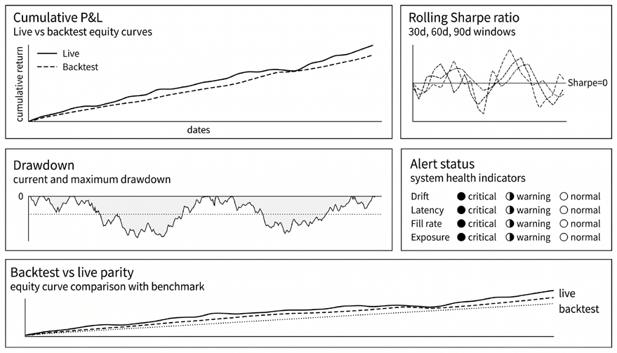
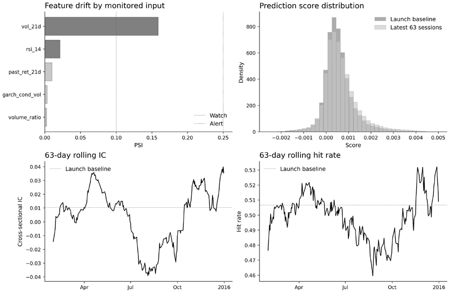
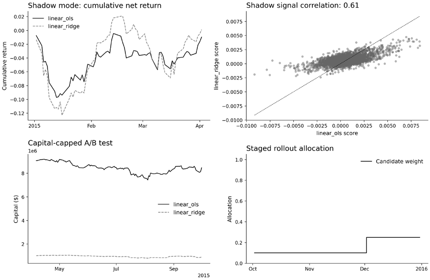
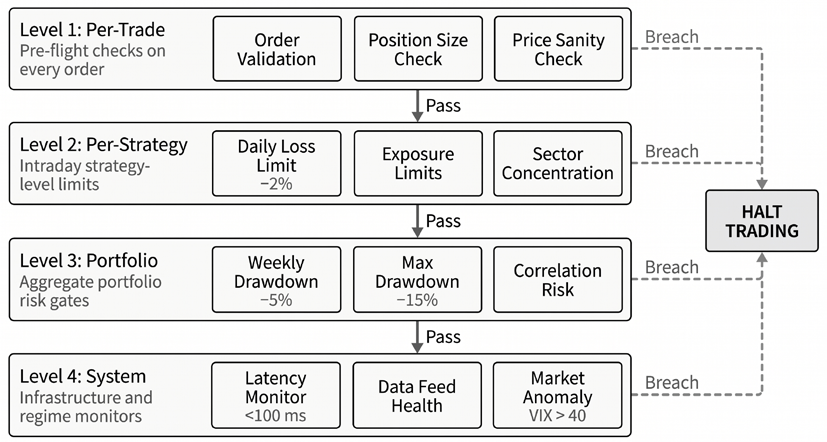

# Chapter 26: MLOps and Governance

A model has cleared every backtest, and the deployment verification covered in *Chapter 25* has taken the system live, executing real trades with real capital. Keeping it working is the next problem.

Every deployed model decays. Market regimes shift, competitors discover similar signals, and the statistical relationships the model learned gradually erode. The difference between a profitable trading operation and a capital-destroying one often comes down to how quickly we detect this decay and how safely we respond.

This chapter builds the post-deployment infrastructure that separates production-grade trading systems from research prototypes. Where *Chapter 25* ensured the system launched correctly, the task now is to keep it correct, or to fail gracefully when it cannot. The governance model has three layers: detection through data validation gates, rolling metrics, and drift analysis; response through shadow evaluation and staged rollouts; and automated safety through circuit breakers that halt trading when losses or conditions breach limits. The supporting MLOps infrastructure, including feature stores, model registries, and CI/CD, should be right-sized to the team’s maturity rather than adopted wholesale.

After completing this chapter, you will be able to:

- Distinguish technical pipeline divergence from statistical performance decay and choose the corresponding diagnostic and response workflow.
- Build a live-monitoring framework that combines data-integrity gates, rolling performance metrics, backtest-to-live comparison, and execution-quality checks.
- Apply drift diagnostics to production artifacts, including PSI, K-S, SHAP-based feature monitoring, and online detectors such as Adaptive Windowing (ADWIN) and the Drift Detection Method (DDM).
- Design a safe model-update workflow using shadow mode, incumbent-versus-candidate evaluation, explicit promotion criteria, staged rollout gates, and tested rollback procedures.
- Implement multi-level circuit breakers across trade, strategy, portfolio, and system layers, with clear recovery and override discipline.
- Evaluate and right-size the supporting MLOps stack, including feature stores, data versioning and lineage, model registries, experiment tracking, and CI/CD controls.

The technical-versus-statistical failure taxonomy in *Section 26.1* organizes what follows: detection (*Sections* *26.2* and *26.3*), response (*Section* *26.4*), automated safety (*Section 26.5*), and the supporting MLOps infrastructure (*Section 26.6*).

The monitoring, drift, and rollout notebooks work from real case-study artifacts: the `us_equities_panel` holdout boundary, stored prediction streams, real feature panels, and the SQLite registry that tracks every training run. The circuit-breaker notebook drives its market-risk rules with the real SPY 2020 H1 path through the COVID crash; only the infrastructure-latency stream remains synthetic, scoped to make the latency breaker’s rolling-average trip inspectable. The remaining infrastructure notebooks operate on the same local Parquet and SQLite stores. Broker connectivity is out of scope; alert logic, data lineage, and promotion gates are grounded in actual workflow outputs.

## 26.1 Two sources of live trading failure

Live trading failures fall into two categories that demand different diagnoses and responses. Confusing them wastes time and capital.

### Technical failure caused by pipeline divergence

A *technical* failure occurs when the live system computes something differently than the backtest. The same inputs should produce the same outputs, but they do not. Common causes include data format mismatches (the backtest used adjusted prices while the live feed provides unadjusted ones), timing errors (features computed at market close in backtesting arrive with slight delays in production, so a “20-day volatility” spans different windows), and implementation bugs (such as a sign error, an off-byone index, or a missing normalization step that runs without errors but produces subtly wrong results).

Technical failures are *verification problems*. *Chapter 25* addressed these: reconciliation between backtest and live systems should catch pipeline divergence. When a live system produces different outputs for identical inputs, the cause is a bug to fix.

### Statistical failure caused by performance decay

*Statistical* failure occurs when the system works exactly as designed (the same inputs produce the same outputs), but the outputs no longer predict returns. The implementation is correct; the model has decayed.

Four mechanisms cause statistical decay:

- *Overfitting*: The model learned patterns from the training data that do not generalize to new data. Backtest performance reflected in-sample noise rather than out-of-sample signal. Every strategy risks this; validation mitigates but does not eliminate it. Harvey, Liu, and Zhu (2016) showed how multiple hypothesis testing inflates backtested performance across finance research, and the same risk applies to individual strategy development.
- *Look-ahead bias*: Subtle information leakage inflated backtest results. Perhaps the features were computed using future data that would not have been available in real time. Perhaps survivorship bias excluded delisted securities from the universe.
- *Regime change*: Market structure shifted. Volatility regimes changed, correlations broke down, or the relationship between features and returns evolved. What worked in the training period does not work in the current market.
- *Alpha decay*: The strategy became crowded. Other participants, human or algorithmic, discovered similar patterns. The captured alpha attracted competition, and returns were arbitraged away. McLean and Pontiff (2016) documented this empirically: once anomalies became public, their profitability fell sharply, consistent with a mix of data-mining bias and post-publication arbitrage.

### Why the distinction matters

Different failures demand different responses:

| Failure type | Diagnosis | Response |
| --- | --- | --- |
| Technical | Same inputs → difefrent outputs | Fix the bug |
| Statistical | Same inputs → same outputs → poor returns | Retrain, redesign, or retire |

*Table 26.1: Responses by failure type*

Treating statistical decay as a bug leads to futile debugging. Treating bugs as statistical decay leads to unnecessary model changes. The first step in any investigation is determining which category applies.

Capponi et al. (2025) formalize how nonstationarity erodes model reliability: the question is not whether performance will degrade, but when, and whether detection arrives in time to respond. The monitoring framework in the following sections assumes decay will happen and builds systematic detection accordingly.

**Implementation**: `01_drift_monitoring` (statistical drift detection), `06_mlflow_experiments` (experiment tracking and model registry workflows).

## 26.2 Performance monitoring

A systematic monitoring framework tracks multiple performance dimensions, compares live results to backtest expectations, and triggers alerts when metrics breach meaningful thresholds. The goal is to detect decay early enough to respond before losses accumulate.

### Data integrity gates

Before monitoring model performance, validate the data feeding it. A large fraction of apparent drift incidents in live trading are silent data defects: stale prices, corporate action mishandling, broken joins, timezone misalignment, missing bars, or duplicated rows. These are technical failures in the taxonomy of *Section 26.1*, but they surface first as statistical anomalies in downstream metrics. A lightweight data contract layer catches these defects at ingest, before they propagate to feature computation, inference, or execution. Schema validation libraries such as Pandera enforce type constraints, null bounds, monotonic timestamp ordering, and uniqueness keys on each incoming DataFrame. Great Expectations offers a similar approach, with human-readable validation artifacts that are useful for team collaboration.

The key design choice is a *fail-closed* policy for execution-critical feeds: if market data fails validation, do not trade on it. Non-critical analytics pipelines can fail open with warnings. Integrate validation outcomes into the same tiered alert system described below: a schema violation on a primary data feed should trigger a critical alert, while a minor anomaly on a secondary feed warrants a watch-level notification.

### The rolling metrics framework

Point-in-time metrics hide trends. A strategy with an acceptable overall Sharpe ratio may show alarm-For a trailing window of 𝑤 trading days ending at time 𝑡, the basic monitoring formulas are: ing decay in recent windows. Rolling calculations can reveal nuances that aggregate statistics obscure.

𝑆̂௧ǡ௪= √252Ԝݎ᪄௧ି௪ାଵǣ௧ ܪ𝑆௧ǡ௪= 1 ௧ ǡ᩷᩷ ܦܦ௧= 1 − ǡ᩷᩷ ෍ ૚ (ݎ௜> 0) ݏ௧ି௪ାଵǣ௧ max ௧ ݓ ௨ ௨ஸ௧ ௜ୀ௧ି௪ାଵ where 𝑟 is mean daily strategy return net of costs, 𝑠 is its sample standard deviation, 𝑉௧ is portfolio value, and 𝐻 is hit rate. These are simple diagnostics, not sufficient statistics; the point is to com-

pute them consistently on live, net-of-cost returns and compare them with the same quantities from validation. The following key metrics were introduced in earlier chapters.

#### Rolling Sharpe ratio

Compute Sharpe over trailing windows (for example, 30-, 60-, and 90-day) and plot them alongside backtest expectations. The gap between backtested and realized Sharpe ratios is often a critical monitoring metric.

A well-calibrated strategy should show live Sharpe within a reasonable range of backtested Sharpe, accounting for estimation uncertainty. Persistent underperformance (live Sharpe consistently 0.5 or more below expectation) signals either overfitting in the backtest or a regime change in the market.

#### Information coefficient

The correlation between your predictions and subsequent returns. While Sharpe measures aggregate performance, IC measures predictive accuracy at the signal level.

Monitor rolling IC to catch prediction decay before it fully manifests in returns. A strategy might temporarily maintain acceptable returns due to favorable market conditions, even as IC declines. When conditions normalize, the degraded predictions will produce losses.

#### Hit rate and win/loss ratio

The hit rate and win/loss ratios answer: What fraction of trades are profitable? When trades win, how much? When they lose, how much? These metrics decompose Sharpe into interpretable components.

A declining hit rate with a stable win/loss ratio suggests the model’s directional predictions are weakening. Stable hit rate with a deteriorating win/loss ratio suggests correct direction but poor magnitude estimation or worsening execution.

#### Drawdown depth and duration

Maximum drawdown measures the largest peak-to-trough decline. Drawdown duration measures how long recovery takes.

Extended drawdowns beyond historical norms (both deeper and longer than those observed in backtesting) suggest the strategy has entered unfamiliar territory. The model may be operating in a regime it wasn’t trained for.

### Alert thresholds

Monitoring generates continuous data; alerts require thresholds. Thresholds too tight generate noise and alert fatigue. Thresholds too loose allow damage before detection.

Design tiered thresholds:

- **Watch** (yellow): Metrics outside normal range but not alarming. Log for review; no action required. Example: Rolling 30-day Sharpe ratio drops below 1.0 when the expected value is 1.5.
- **Warning** (orange): Metrics deteriorated significantly. Investigate promptly; consider reducing exposure. Example: Rolling Sharpe drops below 0.5 for two consecutive weeks.
- **Critical** (red): Metrics breach hard limits. Take protective action; may trigger automated response. Example: Rolling Sharpe negative for 30+ days, or drawdown exceeds historical maximum.

Calibrate thresholds empirically from your backtest: what metric levels preceded historical degradation episodes? What values would have given you sufficient warning to act?

Threshold design must also prevent alert fatigue. A monitoring system that pings the team every day trains them to ignore it. Stick to alerts with a defined action, measure false-positive rates from historical data, and review alert thresholds whenever you add a new metric. If a threshold fires often but never changes exposure, retraining cadence, or diagnostic priority, it is noise masquerading as rigor.

### Visual dashboards

A production monitoring dashboard should display five panels, whether built in Grafana with a Prometheus backend or in a simpler stack like Streamlit against flat files:

- **Real-time PnL**: Cumulative and daily returns versus benchmark, with a backtest overlay showing expected versus realized equity.
- **Rolling metrics**: Sharpe, IC, and hit rate across 30-, 60-, and 90-day windows. Multiple windows distinguish temporary noise (short window drops, long window stable) from persistent decay (all windows declining).
- **Drawdown tracker**: Current depth and duration as time series, with horizontal lines marking historical maximum and circuit-breaker threshold.
- **Alert status**: Color-coded indicators (green/yellow/orange/red) with timestamps of the last state change. A single glance should convey system health.
- **Backtest comparison**: Live equity overlaid on backtested equity curve: the gap between these lines is a central visual diagnostic.

*Figure 26.1* shows a representative monitoring dashboard layout with these five panels.

*Figure 26.1: Trading system monitoring dashboard. Live-versus-backtest equity, rolling diagnostics, drawdown, alerts, and benchmark comparison support daily operational review*

### Comparison to backtesting expectations

The backtest provides your performance hypothesis; live trading tests that hypothesis. Systematic comparison reveals whether reality matches expectations. For each metric, track:

- **Backtested value**: What did validation predict?
- **Live value**: What are you actually observing?
- **Deviation**: How far apart are they?
- **Significance**: Is the deviation larger than expected from estimation noise?

Some deviation is inevitable because backtest estimates carry confidence intervals. Persistent, large deviations in one direction indicate that something systematic has changed.

Compute the backtest-to-live ratio for key metrics. A strategy backtested at Sharpe 2.0 running live at Sharpe 1.5 has a 0.75 realization ratio. Track this ratio over time. Declining realization ratio (even if absolute performance remains acceptable) suggests ongoing degradation.

### Execution quality monitoring

Model performance metrics capture signal quality, but *execution quality* often dominates short-horizon PnL variability and can masquerade as model decay. Widening spreads, declining fill rates, increasing slippage, or broker throttling all reduce realized returns without changing the model’s predictions.

Monitor execution alongside model metrics: slippage relative to backtest assumptions, spread paid versus quoted, fill ratio and partial-fill behavior, and latency distributions from signal generation to order fill. Compute a realized-versus-simulated transaction cost ratio analogous to the backtest realization ratio described above. If execution costs consistently exceed backtest assumptions, the problem is market microstructure or infrastructure, not the model, and retraining would be the wrong response.

### Example monitoring workflow

The notebook material uses the real `us_equities_panel` holdout stream rather than a simulated monitoring record. The reference slice comes from the last pre-holdout year; the current slice comes from the most recent holdout window. Beyond that boundary, the notebook computes PSI and K-S checks for the monitored features, tracks the distribution of stored model scores, and rolls IC, hit rate, and error metrics across the live-style window. The operating logic is the same as that used by a production desk: start with baseline expectations, compare current behavior to those baselines, and escalate only when deterioration is persistent enough to warrant a change in decision.

*Figure 26.2* renders the operational view produced by this workflow. The dashboard combines a PSI bar chart over the monitored features, a prediction-score histogram comparing reference and current windows, a rolling IC panel, and a rolling hit-rate panel. Read together, the four panels separate input-side shifts (PSI bars, score histogram) from output-side performance (rolling IC, rolling hit rate), so an operator can tell whether a metric move reflects changing inputs, changing relationships, or both. *Section 26.3* covers the drift-detection algorithms behind the PSI and histogram panels in detail.

*Figure 26.2: Drift-monitoring dashboard on the us_equities_panel holdout stream. PSI bars, prediction-score histogram, rolling IC, and rolling hit-rate panels combine input-side and output-side diagnostics in a single operational view*

The practical sequence is simple: monitor the metric gap, determine whether the issue is technical or statistical, diagnose the likely mechanism, and only then adjust exposure or initiate a model-update workflow. A mild drop in rolling Sharpe may justify observation. A sustained drop paired with worse IC, deeper drawdowns, or execution-cost inflation justifies intervention. What matters is that monitoring links each metric breach to an explicit response.

Monitoring tells you *that* performance changed; the next section adds drift detection to diagnose *what* changed: whether the shift lies in input distributions, feature importance, or the feature-target relationship itself.

**Implementation**: `01_drift_monitoring` illustrates rolling metrics, thresholding, and a compact dashboard on the real `us_equities_panel` holdout artifacts. `06_mlflow_experiments` shows how the same review workflow can be tied to the local experiment registry and its stored artifacts.

## 26.3 Drift detection

Performance monitoring tells you *that* something changed. Drift detection tells you *what* changed. By tracking shifts in input distributions, feature importance, and feature-target relationships, you can diagnose decay before it fully manifests in returns.

### Data drift caused by input distribution changes

**Data drift** occurs when the statistical properties of your input features shift from their training distribution. The model receives data that it was not trained on.

**The Population Stability Index** (**PSI**) quantifies the distribution shift: ⋅ln ܣ௜ 𝑃(ܣ௜െܧ௜) ܧ௜ ௜  where 𝐴௜ is the actual proportion in bin 𝑖 and 𝐸௜ is the expected proportion from training. A common

heuristic interpretation is: **PSI** < 0.1: No significant shift. Model inputs remain stable

• **PSI** > 0.25: Significant shift. Model predictions likely unreliable

- **PSI 0.1–0.25**: Moderate shift. Investigate, but the model is not yet failing •

Compute PSI for each key feature by comparing recent production data with the training reference set. Spikes in PSI often precede performance degradation, so they provide a warning before returns deteriorate. The chapter notebook does this directly on the `us_equities_panel` feature artifacts, comparing the last available year of holdout predictions against the prior reference window.

The **Kolmogorov-Smirnov test** (**K-S test**) complements PSI for continuous features by measuring the maximum distance between cumulative distribution functions. Unlike PSI, K-S makes no binning assumptions and directly tests whether two samples came from the same distribution, making it the preferred choice for continuous features where binning would discard information.

### Feature drift caused by importance shift

Even when input distributions remain stable, the *importance* of features can change. A feature that historically drove predictions may become less influential while other features gain prominence. SHAP value monitoring (Lundberg and Lee, 2017) tracks each feature’s contribution over time by decomposing predictions into additive attributions and aggregating across the live window. Three summaries matter: mean absolute SHAP (average magnitude), SHAP variance (stability of the contribution), and relative ranking (whether the importance hierarchy has shifted). Persistent rank changes and a collapsing contribution from a core feature are early warnings that the model is leaning on a relationship the market no longer rewards. *Section 26.2* covers how these summaries surface in the operational drift dashboard alongside performance metrics.

### Concept drift caused by relationship changes

The most insidious form of drift arises from changes in the relationship between features and the target. Inputs look similar, but they no longer predict outcomes the same way. This is **concept drift**: the underlying data-generating process has changed. Lu et al. (2018) provide a taxonomy of concept drift types (sudden, gradual, incremental, and recurring), each requiring different detection and adaptation strategies. Hinder, Vaquet, and Hammer (2023) survey the state of the art in drift detection, situating ADWIN and DDM within a broader taxonomy of methods and their operational trade-offs. Regime shifts are a leading instance of concept drift. When markets transition from trending to mean-reverting, the same momentum signal that previously predicted positive returns now predicts negative returns. The feature distribution may be unchanged; the feature-target relationship has inverted.

Production teams often rely on online drift libraries such as `river` to monitor concept drift in real time. The notebook uses lightweight detector logic on the stored validation error stream to keep the alert behavior transparent.

**Adaptive Windowing** (**ADWIN**) (Bifet and Gavaldà, 2007) maintains a variable-length window of observations. It continuously tests whether recent observations differ statistically from older observations. When drift is detected, the window shrinks to include only post-drift data.

Apply ADWIN to your strategy’s prediction errors, the difference between predicted and realized returns. If the error distribution changes significantly, something about the prediction problem has changed.

**Drift Detection Method** (**DDM**) (Gama et al., 2004) monitors the error rate over time. It maintains running statistics for error rate and standard deviation, signaling a warning when the error rate increases moderately and a drift warning when it increases substantially.

DDM is simpler than ADWIN but less adaptive, offering a lightweight alternative when computational overhead is the binding constraint. The online-drift notebook compares ADWIN-style and DDM behavior on the final real validation year before the sealed holdout, relating alert clusters to a market-stress proxy rather than to synthetic change points.

### Practical workflow

Not everything needs monitoring. Focus on:

- **High-importance features**: Features with historically large SHAP contributions. If these drift, model performance will likely follow.
- **Volatile features**: Features with historically variable distributions. These are more likely to drift.
- **Domain-sensitive features**: Features known to change with market regimes: volatility measures, correlation metrics, liquidity indicators.
- **Monitoring frequency**: Balance responsiveness against noise. *Table 26.2* summarizes a practical cadence that separates daily checks from slower, more computationally expensive diagnostics.

| Method | Frequency | Typical Trigger |
| --- | --- | --- |
| PSI on key production features | Daily | PSI > 0.25 on high-importance inputs |
| K-S test on continuous features | Daily or weekly | p-value < 0.05 on recent versus reference sample |
| SHAP importance monitoring | Weekly | Rank reordering or large drop in a core feature’s mean absolute SHAP |
| ADWIN/DDM on prediction errors | Continuous | Warning or drift state on the live error stream |

*Table 26.2: Key monitoring methods*

Alert integration: Connect drift detection to your alerting system. PSI greater than 0.25 on a key feature should trigger an investigation. An ADWIN drift signal should escalate to warning status.

The detector itself also needs monitoring. The online-drift notebook tracks alert frequency, warning streaks, and related health signals, enabling recalibration of ADWIN or DDM sensitivity before they overwhelm operators with false positives. Treat detector health like any other production metric: if it pages constantly without changing decisions, it has stopped being useful.

### From detection to diagnosis

Drift detection tells you something changed; diagnosis tells you whether it matters:

| Drift detected? | Performance decay? | Interpretation | Response |
| --- | --- | --- | --- |
| Yes | No | Robust model; distribution shifted, but the relationship holds | Monitor; no action required |
| No | Yes | Incomplete drift coverage or gradual concept drift | Expand monitoring; check for untracked features |
| Yes | Yes | Feature drift explains decay | Retrain on recent data or switch to a regime-specific model |
| No | No | Healthy operation | Continue normal monitoring |

*Table 26.3: Drift detection responses*

The diagnostic workflow: detect drift, correlate with performance, hypothesize a mechanism, and validate with targeted analysis. This systematic approach prevents both under-reaction (ignoring real problems) and over-reaction (changing models based on noise).

Detection and diagnosis identify when and why a model is decaying; the next section addresses *what to do about it*: safe model updates that protect capital while allowing model evolution.

**Implementation**: `01_drift_monitoring` illustrates PSI, K-S, prediction-distribution drift, and alert-state summaries on the real holdout monitoring artifacts.

`02_online_drift_detection` compares ADWIN-style and DDM alerts on real chronological error streams from the final validation year before promotion.

## 26.4 Safe model updates

Monitoring detected decay. Diagnosis identified the cause. Now the model has to be updated without replacing one failure with another. The replacement may perform worse than the decayed original. Safe update workflows protect capital while still allowing model evolution.

### When to retrain

There are two basic approaches:

- **Scheduled retraining** updates models at fixed intervals: weekly, monthly, quarterly. The schedule should reflect your strategy’s expected decay rate. High-frequency strategies operating in fast-changing markets may need weekly updates; long-term strategies may retrain quarterly.
- **Triggered retraining** updates models when monitoring signals warrant. When rolling Sharpe drops below the threshold, or PSI exceeds the limits, or ADWIN signals drift, trigger the retraining pipeline.

Scheduled retraining provides predictability but may update unnecessarily (if nothing has changed) or too late (if decay has accelerated). Triggered retraining responds to actual conditions but requires robust monitoring to avoid false triggers. You can combine both approaches: scheduled as baseline, triggered for exceptional conditions.

### Shadow mode evaluation

Before any new model touches capital, run it in **shadow mode**: process live data, generate predictions, but do not trade. Shadow mode provides validation under realistic conditions. We implement this directly in `ml4t-live`, where the strategy runs against live feeds while a virtual portfolio records hypothetical positions and PnL. The chapter notebook reconstructs this logic from the real `us_equities_panel` artifacts: it selects an incumbent from the historical validation record, replays a shadow window on the next release year, and records the candidate’s hypothetical outcomes before any allocation increases.

Deploy the new model (the **candidate**) alongside the production model (the **incumbent**). Both receive identical live data feeds and generate predictions in real time. Only the incumbent executes trades. Three comparison metrics anchor the decision:

- **Prediction agreement**: how often the incumbent and candidate agree on direction. Disagreement is not necessarily bad, but its source should be understood before promotion.
- **Hypothetical returns**: the returns the candidate would have generated if it had traded, computed under realistic execution assumptions.
- **Risk characteristics**: whether the candidate takes similar or different risks. Unexpected risk-profile changes warrant investigation.

*Figure 26.3* presents the full rollout protocol. The top row reports shadow-mode diagnostics: the cumulative net return of the candidate relative to the incumbent over the shadow window, and the realized correlation of 0.61 between their per-name signal scores. The bottom row shows the staged transition: a capital-capped A/B test in which the candidate trades a small fraction of total capital, and the allocation path stepping the candidate share from 10% to 25%. The candidate need not dominate every day; what matters is that disagreement becomes observable, attributable, and reviewable at each stage before its capital share grows.

*Figure 26.3: Staged rollout dashboard*

*Figure 26.3* shows the staged rollout dashboard for the incumbent and candidate models across the three stages - shadow mode (top row), capital-capped A/B test (bottom left), and staged allocation increase (bottom right).

#### Deciding duration

Shadow periods should span a sufficient range of market conditions to validate robustness. A candidate that looks better during trending markets may fail in choppy conditions. A common default is a 60-day shadow period (long enough to capture multiple market regimes and short enough to maintain deployment velocity), though the appropriate window depends on strategy **rebalance frequency**: a monthly strategy needs at least two rebalance cycles in shadow.

#### Statistical testing

Visual inspection of performance is not sufficient. Statistical tests assess whether the candidate genuinely outperforms or whether the observed difference is attributable to noise. A paired test on daily return differences can establish whether the candidate has a higher mean return over the same dates, while Sharpe-ratio comparisons require methods that account for both mean and volatility, as well as the correlation between the two return series. The classic test compares the difference in Sharpe ratios. If 𝑆̂஼−𝑆̂௉ is the observed difference, its

standard error determines whether the gap is statistically meaningful. The original **Jobson-Korkie test** provides an early framework for this comparison, but it relies on restrictive assumptions about identically, independently, and normally distributed returns; later corrections and robust alternatives relax some of these assumptions. Bailey and López de Prado (2014) propose a **deflated Sharpe ratio** that is especially useful when the candidate was selected after many experiments because it adjusts for estimation error, multiple testing, and non-normal returns.

**Bootstrap methods** provide a practical alternative. Resample paired return observations, or use a block bootstrap when returns are serially dependent, then compute the Sharpe-ratio difference for each sample. The resulting distribution provides confidence intervals and an empirical estimate of how often the candidate’s apparent advantage could arise by chance.

#### Effect size matters

A statistically significant 0.05 Sharpe improvement may not justify deployment risk. Define a minimum effect size for promotion (for example, a Sharpe improvement of 0.2-0.3) below which you do not promote regardless of statistical significance.

**Statistical power matters as much as the test itself**. Short shadow windows can neither confirm nor reject modest improvements with much confidence, especially when returns are noisy, autocorrelated, or fat-tailed. López de Prado, Lipton, and Zoonekynd (2025) show why naive Sharpe comparisons over short samples are unstable and quantify the observation counts required for reliable inference at a given effect size. If the effect size of interest is small, extend the shadow period or use bootstrap power analysis before declaring the candidate better.

### Phased rollouts

If shadow mode validates the candidate, do not immediately replace the incumbent. Phase the transition:

- **Capital-capped A/B testing**: allocate a small fraction of capital (for example, 5% to 10%) to the candidate. The system now measures real performance, including execution costs, slippage, and market impact. The incumbent continues trading the remainder. A/B testing with real capital reveals issues that shadow mode misses: the candidate’s signals may cluster in illiquid names, or its sizing may create market impact. These effects only appear when capital is actually deployed.
- **Gradual increase**: if A/B results validate, increase the candidate’s allocation progressively through gates such as 10% to 25%, 25% to 50%, and 50% to 100%, each requiring a minimum observation period and continued outperformance before the next promotion. A complete transition typically spans 60 to 90 days, depending on rebalancing frequency and market conditions.
- **Promotion criteria**: define explicit thresholds rather than relying on discretionary judgment. An illustrative set requires the candidate’s Sharpe ratio to exceed the incumbent’s by at least 0.2, with statistical significance at the 10% level, and no drawdown exceeding the strategy’s historical maximum during any stage. These values are rule-of-thumb starting points; calibrate them to the strategy’s turnover and signal noise.

### Rollback procedures

Every deployment should be reversible. Before promoting a new model:

- **Archive the incumbent**: store the current production model with full versioning, so that it can be restored instantly.
- **Define rollback triggers**: specify the conditions that trigger automatic rollback: drawdown exceeding a threshold, consecutive losing days, or system errors, for example.
- **Test rollback mechanism**: before deploying the candidate, verify that rollback actually works. A theoretical rollback procedure that fails under pressure is useless.
- **Decide between automatic or manual rollback**: Lower-level triggers (system errors, data feed failures) should roll back automatically: speed matters more than nuance. Higher-level triggers (performance degradation) may warrant manual confirmation to avoid over-reaction to noise.

**Implementation**: `03_safe_model_rollout` demonstrates shadow mode, A/B testing, and staged promotion on real incumbent-candidate prediction artifacts from `us_equities_panel`.

`06_mlflow_experiments` adds the experiment-ranking, artifact-logging, and registry workflows needed to manage these promotion decisions systematically.

Safe updates handle gradual decay; the next section addresses sudden failure: circuit breakers that halt trading automatically when losses or infrastructure conditions breach hard limits, before human review can intervene.

## 26.5 Circuit breakers and safety

Monitoring and safe updates address gradual decay. Circuit breakers address sudden failure: when something goes catastrophically wrong, and speed matters more than nuance. These are your automated safety nets: simple, hard-coded rules that protect capital when sophisticated systems fail.

### Multi-level protection

Defense in depth: multiple independent safety layers, each catching different failure modes. The circuit breaker architecture implements four hierarchical levels:

- *Per-trade* (individual order validation)
- *Per-strategy* (exposure limits for a single strategy)
- *Portfolio* (aggregate risk across all strategies)
- *System* (infrastructure health and latency monitoring)

Each level operates independently: a breach at any level halts the relevant scope without requiring higher-level intervention. *Figure 26.4* illustrates this layered defense architecture.

*Figure 26.4: Circuit breaker architecture. Per-trade, strategy, portfolio, and system layers provide independent failure containment*

Three breaker types matter most.

#### Loss-based breakers

The most important category: Halt trading when losses exceed thresholds:

- Daily drawdown limit (for example, -2%): Protects against single-day disasters
- Weekly drawdown limit (for example, -5%): Catches sustained bleeding
- Maximum drawdown from peak (for example, -10% to -15%): Ultimate circuit breaker

Drawdown-based rules have a long history in portfolio management (Korn, Möller, and Schwehm, 2022), but they need careful calibration. Varma (2025) argues that fixed drawdown cutoffs are blunt instruments, so drawdown breakers work best when combined with other signals such as exposure, liquidity, and market stress. When losses breach genuinely hard limits, halt trading immediately. Don’t wait for human review. Don’t try to “trade out” of the hole. Stop the bleeding first.

#### Position-based breakers

This mechanism prevents dangerous concentrations:

- Maximum position size per asset (for example, 5% of portfolio)
- Maximum sector exposure (for example, 20% in any sector)
- Maximum correlation (avoid multiple positions moving together)

Position limits catch situations where the model becomes overconfident in specific bets. Even if each trade looks reasonable individually, aggregate exposure may be dangerous.

#### Anomaly-based breakers

This breaker responds to unusual market conditions:

- Extreme volatility (for example, VIX > 40)
- Liquidity collapse (for example, bid-ask spreads 3× normal)
- Price dislocations (for example, any asset moves 10%+ intraday)

During market stress, normal relationships break down. Models trained on normal conditions may produce nonsense in extreme conditions. Stepping aside during anomalies is often the prudent response.

Notebook `04_circuit_breakers` implements drawdown, daily-loss, consecutive-loss, and latency breakers; the position-based and anomaly-based categories above extend the same state machine with different trip conditions.

**The trading circuit breakers above are risk controls**: rules about when to stop trading based on PnL, positions, or market conditions. The software circuit breaker pattern described below serves a different purpose: **infrastructure resilience**. It prevents cascading failures when system dependencies (data feeds, execution APIs) become unreliable. Both are necessary; they protect against different failure modes.

### Implementation patterns and libraries

The notebook implements a custom circuit-breaker state machine to make the control logic explicit. In production, a library such as `pybreaker` can provide the same CLOSED/OPEN/HALF_OPEN lifecycle for infrastructure dependencies without changing the underlying policy design.

The breaker operates in three states:

- **Closed** (normal): Calls pass through to the underlying function. The breaker counts failures.
- **Open** (tripped): After exceeding the failure threshold (for example, 5 consecutive failures), all calls fail immediately without executing. This prevents wasted resources on a known-broken dependency.
- **Half-open** (probing): After a timeout period (for example, 30 seconds), the breaker allows a single call through. If it succeeds, the breaker returns to the Closed position. If it fails, the breaker reopens.

This three-state model prevents cascading failures. If your data feed is down, you don’t want every prediction request to time out while waiting for data. The circuit breaker fails fast, preserving system resources and preventing zombie processes.

Whether you use a custom implementation or `pybreaker`, every CLOSED→OPEN transition should trigger an alert, and every OPEN→HALF_OPEN→CLOSED recovery should be logged for post-incident review. These events form the basis of your circuit breaker monitoring dashboard.

System-level monitors halt trading when infrastructure degrades. A typical threshold of 100ms endto-end latency catches data feed delays, execution system slowdowns, or network issues before they cause stale-data trading. When latency exceeds the threshold, the breaker opens and trading halts until the system recovers.

### Recovery procedures

Tripping a circuit breaker is the beginning, not the end. You need clear recovery protocols, grouped as the immediate response, investigating the problem, and resuming trade.

**Immediate actions**:

1. **Acknowledge the alert**, using PagerDuty, Slack, or whichever platform you use.
2. **Assess the situation**: What triggered the breaker? What’s the current exposure?
3. **Secure the position**: If you are partially exposed, decide whether to close or hedge.

**Diagnostic questions**:

- Was this a technical failure (data feed, execution system) or model failure (wrong predictions)?
- Is the market experiencing unusual conditions that triggered anomaly breakers?
- What was the sequence of events leading to the trigger?

**Resume criteria**:

Define what must be true before trading resumes:

- All system components are healthy
- Data feeds validated
- Market conditions normalized (if anomaly-triggered)
- Root cause identified and either fixed or determined nonthreatening

**Gradual restart**:

Don’t resume at full capacity immediately. Start with reduced position sizes or paper trading. Verify systems behave correctly before scaling back up.

### Manual override considerations

Circuit breakers should be automatic: speed matters during failure. But they should also be overridable by authorized personnel, for cases where the breaker triggers incorrectly.

Override discipline requires logging every override (who, when, why), requiring explicit risk acknowledgment, time-limiting the override (for example, one hour unless renewed), and reviewing all overrides after the fact. Making overrides too easy defeats the purpose; making them impossible prevents response to genuine false positives. The balance depends on your risk tolerance and operational maturity.

With monitoring, drift detection, safe updates, and automated safety in place, the next section surveys the supporting MLOps infrastructure (feature stores, model registries, and CI/CD) that these governance layers depend on in a production deployment.

**Implementation**: `04_circuit_breakers` demonstrates a custom circuit-breaker state machine, layered safety rules, and recovery procedures.

## 26.6 MLOps infrastructure overview

The preceding sections focused on monitoring and safety, the most critical aspects of production governance. The supporting infrastructure tools are useful but not central; small teams can start with minimal infrastructure and add complexity as needs grow.

### Preventing training-serving skew with feature stores

**Feature stores** ensure that features computed during training exactly match those computed during inference. Without this consistency, your live system receives different inputs than your backtest, a technical failure waiting to happen.

The core problem is that, in research, you compute features from historical data with complete freedom. In production, you must compute the same features in real-time, from streaming data, with strict latency constraints. Subtle differences (date handling, normalization windows, default values for missing data) create training-serving skew that silently degrades performance. Sculley et al. (2015) documented how such “hidden technical debt” compounds across ML systems, making feature consistency a first-order concern. Paleyes, Urma, and Lawrence (2023) survey deployment challenges across industries and highlight data quality, monitoring, and system integration as recurring operational bottlenecks, reinforcing the need for early investment in feature stores and drift detection.

**Feast** (`feast.dev`) provides a unified feature registry. Define features once; Feast handles both historical retrieval (for training) and online serving (for inference). Key benefits:

- **Consistency**: The same feature definition serves both training and production
- **Point-in-time correctness**: Feast manages temporal joins to prevent look-ahead bias
- **Versioning**: Feature definitions are versioned alongside models

Feast separates **offline** and **online** stores. The offline store (typically Parquet, BigQuery, or Redshift) holds historical feature values for training, potentially years of data across thousands of entities. The online store (Redis, DynamoDB) holds only the most recent feature values for low-latency inference. Feast automatically materializes features from offline to online, ensuring consistency between training and serving.

For trading systems, this architecture solves a common problem: you compute rolling features (20day volatility, 60-day momentum) during backtesting using pandas with full hindsight. In production, you must compute the same features incrementally as new data arrives. Feast’s feature definitions ensure the computation is identical; the online store ensures serving latency stays under milliseconds.

Feature stores scale from small experiments, such as a handful of tickers and features, to production deployments with thousands of features across large universes. Our notebook shows the control logic directly on the real `us_equities_panel` feature tables: it defines feature views against the stored Parquet sources, performs a point-in-time offline join for training, reconstructs an online-style as-of snapshot for inference, and measures the skew created by an incorrect timestamp rule. The key concept is still training-serving consistency rather than a specific vendor setup.

### Data versioning and lineage

Feature stores ensure consistency between training and serving, but they do not answer the question: *which exact dataset produced this model?* When a model fails in production and you need to distinguish data corruption from genuine regime shift, you must be able to reproduce the exact training data. Without data versioning, diagnosis is guesswork and rollback is risky.

At minimum, every training run should record a *run manifest*: a JSON artifact logging the git commit hash, dataset snapshot identifier (a content hash or partition version), feature set version, model registry version, and configuration hash. DVC (`dvc.org`) provides a Git-like interface for versioning large data and model files alongside code, enabling small teams to achieve reproducibility and rollbacks without a dedicated metadata platform. Attach the manifest to each MLflow run as a tagged artifact so that any deployed model can be traced back to its exact inputs.

### Experiment tracking with model registries

**Model registries** provides version control for models: tracking which model version is deployed, what training data was used, and how it performed in testing.

**MLflow** (`mlflow.org`) offers a lightweight solution combining:

- **Experiment tracking**: Log hyperparameters, metrics, and artifacts for every training run
- **Model versioning**: Store trained models with full lineage (including training data, code version, dependencies)
- **Deployment staging**: Manage transitions from “Staging” to “Production” status

For the safe update workflow described in *Section 26.4*, MLflow tracks which model is the current incumbent, which is the candidate in shadow mode, and the performance comparison between them. During training, MLflow automatically logs metrics such as IC and Sharpe. These logged metrics become the basis for ranking candidates during promotion.

Model registries also support auditability. When regulators or risk officers ask, “Why did the model make this decision?” you need to know exactly which model version was deployed, when, trained on what data, and with what hyperparameters. The CRISP-ML(Q) framework (Studer et al., 2021) and the Federal Reserve’s SR 11-7 guidance (Board of Governors, 2011) on model risk management both emphasize model lineage and reproducibility as regulatory necessities.

The registry entry is only part of the governance record. Production teams also need durable review artifacts: a model card summarizing intended use and known limitations, an independent validation memo, and a current monitoring report showing live performance, drift status, and open incidents. The notebook shows the adjacent MLflow pieces, namely artifact logging, experiment summaries, and registry stages, but those records do not replace the governance artifacts themselves. SR 11-7’s core requirements (effective challenge, ongoing monitoring, and documented governance) are hard to satisfy if these materials live only in chat threads or ad hoc dashboards.

### CI/CD for trading models

**Continuous Integration/Continuous Deployment** adapts to ML with specific considerations. Standard CI/CD includes unit tests for feature computation and signal generation, integration tests for pipeline components, validation tests to confirm model performance exceeds minimum thresholds, and smoke tests after deployment. The ML-specific addition is automated deployment gates: no model reaches production unless validation metrics pass, shadow-mode comparison shows no regression, and rollback has been verified. GitHub Actions, GitLab CI, or similar tools orchestrate these checks so that no human needs to remember to run validations.

### Right-sizing your stack

Not every team needs enterprise-grade infrastructure. A sensible progression:

**Minimal (solo or small team):**

- Feature computation in pandas/numpy with careful documentation
- Models saved to versioned directories (Git LFS for large files)
- Cron or systemd timers for scheduled pipelines
- Manual deployment with a checklist
- Monitoring via simple dashboards (Streamlit, basic Grafana)

**Intermediate (growing team):**

- Feast for feature consistency
- MLflow for experiment tracking and DVC for data versioning
- Prefect (`prefect.io`) or Dagster (`dagster.io`) for workflow orchestration with retries and observability
- GitHub Actions for automated testing
- Prometheus and Grafana for monitoring
- Structured logs with consistent correlation IDs (run, strategy, order) for incident diagnosis

The Prometheus-Grafana stack is the standard observability pairing: Prometheus scrapes custom trading metrics (`strategy_sharpe_30d`, `signal_ic_rolling`) at 15–30-second intervals, while Alertmanager routes threshold breaches to Slack or PagerDuty with configurable escalation policies.

**Mature (production at scale):**

- Full-featured store with real-time serving
- Model registry with approval workflows
- Kubernetes for deployment orchestration
- OpenTelemetry (`opentelemetry.io`) for correlated logs, metrics, and traces across the full signal-to-execution pipeline

Start simpler than you think you need. Infrastructure serves the trading system, not the reverse. The sections on monitoring (*26.2–26.3*) and safety (*26.5*) matter more than tooling choices. Get those right first; optimize infrastructure as constraints demand. **Implementation**:

- `05_feast_feature_store` demonstrates feature-store concepts, point-in-time joins, and feature lineage through the real case-study feature tables.
- `05b_feast_live` extends the same workflow to use a live Feast integration with the same artifacts.
- `06_mlflow_experiments` demonstrates experiment tracking, artifact logging, and registry-style promotion workflows through the local SQLite registry and content-addressed run bundles.

The following summary draws together the detection, response, and safety layers into the three-layer governance model that keeps a deployed trading system operating correctly or failing gracefully when it cannot.

## 26.7 Summary

We built the post-deployment infrastructure that separates production-grade trading systems from research prototypes. The central insight is diagnostic: technical failures (pipeline bugs that produce incorrect outputs) and statistical failures (correct outputs that no longer predict returns) demand different responses. Conflating them wastes time and capital.

The three-layer governance model runs from detection to response to automated safety. Detection begins with data quality gates and continues through rolling performance metrics, execution-quality monitoring, and drift diagnostics that separate input shifts (PSI, K-S), feature-importance changes (SHAP), and concept drift (ADWIN, DDM). Response uses shadow mode, capital-capped A/B testing, and staged rollouts to replace decayed models without swapping one failure for another. Automated safety provides the last line of defense through multi-level circuit breakers that halt trading when losses, exposures, or infrastructure conditions breach hard limits. The supporting MLOps infrastructure (*Section 26.6*), spanning feature stores, data versioning, model registries, and workflow orchestration, should be right-sized to operational maturity rather than adopted wholesale.

*Chapter 27* steps back from implementation to reflect on the systematic edge that arises when the entire pipeline (from data through modeling, deployment, and governance) operates as a coherent, continuously validated system.
