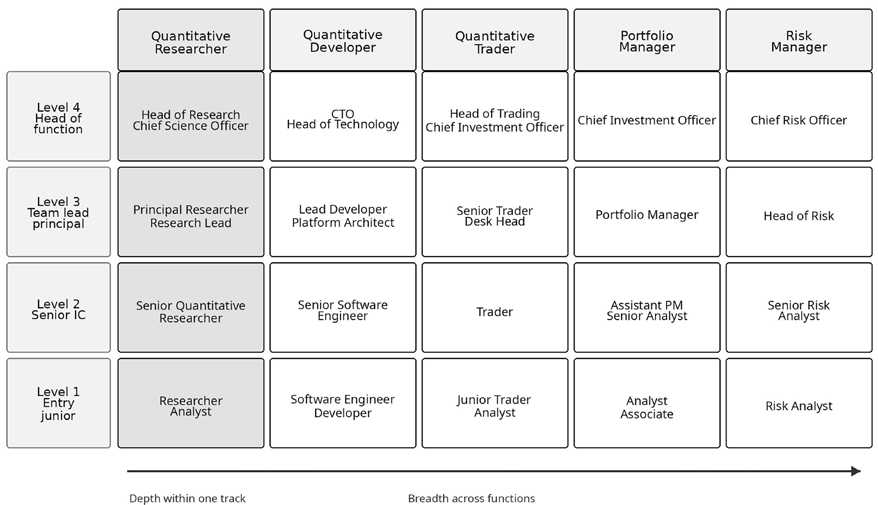

# Chapter 27: The Systematic Edge

Throughout this book, you have worked the five stages of the ML4T workflow, from strategy hypothesis through data engineering, signal research, portfolio construction, and deployment. You now have the techniques. The most important lesson is not any one of them: *your process is your edge*.

This closing chapter turns from method to direction. It maps the career paths open to a systematic practitioner, the resources worth your continued study, the emerging technologies that warrant attention, and a practical plan for the years ahead. The end of the book is the start of that work.

## 27.1 The systematic edge – From techniques to philosophy

The workflow is more than a development method; it is a blueprint for an alpha factory - a repeatable way to generate, test, and deploy strategies across a career. Models decay, alpha erodes, and markets keep changing. A single successful strategy is a temporary advantage. A process that produces a diversified portfolio of strategies over time is durable value (Harvey, 2021).

That process is also your main defense against the cognitive biases that pervade financial markets. Confirmation bias leads researchers to find the patterns they expect; overfitting produces strategies that fail in production; data mining turns spurious correlations into apparent alpha (Lopez de Prado, 2018). A systematic workflow imposes discipline through falsifiable hypotheses, out-of-sample testing, and corrections for multiple testing.

The shift now is from **learning the steps** to **embodying the systematic mindset**. Technical skills set your entry point; systematic thinking sets your trajectory. As machine learning spreads through quantitative finance, practitioners who pair that skill with disciplined process compound their advantage over the course of their careers.

## 27.2 The modern quant career

The quantitative finance industry has changed over the past decade. Boundaries between roles are blurring as machine learning becomes standard, and hybrid positions are emerging between systematic and fundamental approaches. Knowing the landscape helps you make deliberate career decisions.

### Five core roles

Five roles define most of the modern quant landscape, each with distinct skills and compensation:

- **Quantitative researchers** formulate and validate trading hypotheses, combining statistics, ML, and market intuition to find predictive signals. Senior researchers at top-tier firms command $200K to $1M+ annually.
- **Quantitative traders** manage live strategies, optimize execution, and react to real-time dynamics. Strong programming skills are now essential. Compensation: $250K to $2M+ at leading firms.
- **Quantitative developers** (“strats”) build and maintain the technology stack, from data pipelines to execution gateways. Compensation: $180K to $800K.
- **Portfolio managers** carry PnL responsibility, deciding which strategies to deploy and at what size. Compensation: $300K to $10M+ at top funds.
- **Risk managers** model and monitor portfolio risk within defined limits, which calls for statistical expertise and regulatory knowledge. Compensation: $150K to $600K.

A notable trend is the rise of “quantamental” approaches, hybrid strategies that blend systematic techniques with fundamental analysis (Chin, 2025). Quantamental analysts use NLP to parse earnings calls while building traditional financial models, and practitioners who bridge both worlds command premium compensation. AI foundation models are accelerating this convergence, letting systematic strategies absorb unstructured data that was once the preserve of discretionary managers (Fabozzi and Prado, 2025).

### Institutional ecosystems

The type of firm shapes the work as much as the role itself:

| Firm Type | Characteristics | Example Firms |
| --- | --- | --- |
| Hedge funds | External capital, focus on scalability, rigorous risk reporting | Millennium, Citadel, Two Sigma |
| Proprietary trading | Own capital, higher risk tolerance, capacity- constrained strategies | Jane Street, Optiver, Jump Trading |
| Investment banks | Client-facing roles, structured environment, heavy regulation | Goldman Sachs, JPMorgan, Morgan Stanley |
| Asset managers | Long-term focus, large-scale factor investing | BlackRock, Vanguard, AQR |

*Table 27.1: A table comparing the characteristics of different types of trading firms*

This choice often matters more than the initial choice of role. A researcher at a high-frequency prop shop develops entirely different skills than one at a multi-billion-dollar asset manager.

### Geographic dynamics

New York remains the dominant hub, but Miami has become a significant center. London keeps its importance despite Brexit uncertainty, with Amsterdam and Dublin gaining ground. Singapore and Hong Kong anchor the Asia-Pacific markets.

*Figure 27.1* shows typical career progressions across these environments, from entry-level roles to senior positions.

*Figure 27.1: Typical career progressions across trading environments, from entry-level roles to senior positions*

The strongest practitioners develop “T-shaped” expertise: deep knowledge in their primary function alongside a broad understanding of the whole trading lifecycle (Cerniglia and Fabozzi, 2022). A developer who grasps alpha decay, or a researcher who appreciates system latency, is far more valuable than a narrow specialist. That cross-functional fluency matters more as the line between alpha research and execution continues to blur.

## 27.3 Building a learning practice

Information overload is a real career risk. The body of quantitative-finance material is vast and of variable quality. Continuous learning works best when it is curated: a balance of foundational knowledge, current developments, and active participation in a community.

### The foundational library

Begin with the texts that provide both theory and practitioner experience. Ernest Chan’s *Quantitative Trading* offers practical guidance on building trading systems. Marcos Lopez de Prado’s *Advances in Financial Machine Learning* (2018) addresses implementation challenges that academic treatments often overlook. Andrew Ang’s *Asset Management: A Systematic Approach to Factor Investing* (2014) provides the framework for systematic strategies across asset classes. Larry Harris’s *Trading and Exchanges* (2003) remains essential for market microstructure. For derivatives, John Hull’s *Options, Futures, and Other Derivatives* remains the standard.

Return to these texts as your experience deepens; they reveal more with each reading.

### Staying current online

Much of the field’s current thinking lives online. Blogs from practitioners like Chan and QuantStart offer technical tutorials grounded in real trading experience. For new research, preprint servers like arXiv (especially the q-fin section) and SSRN offer early access to important papers. Aggregators like Quantocracy curate the quant web, which helps you filter signal from noise.

Set up alerts for key authors and topics. Follow a small, high-signal set of researchers rather than attempting comprehensive coverage; deep reading of a few papers beats skimming dozens.

### Mastering the toolchain

Rather than chasing every new library, understand the *role* of each category of tool in the modern quant stack:

| Workflow Stage | Core Capability |
| --- | --- |
| Data ingestion and storage | Handling diverse sources, ensuring data quality |
| High-performance analysis | Processing large datasets efficiently |
| Statistical and ML modeling | Building and validating predictive models |
| Portfolio and risk analysis | Optimizing allocations, managing exposures |
| Backtesting | Realistic simulation with proper methods |
| Production MLOps | Deployment, monitoring, model lifecycle |

*Table 27.2: A table comparing the capabilities required from tools at each stage in the workflow*

Fluency across these categories enables effective collaboration; it is as much a communication skill as a technical one.

### Structured learning pathways

Use free resources for exploration; invest in formal learning for career pivots. Online platforms from Stanford, MIT, and Columbia offer rigorous foundations. The **Certificate in Quantitative Finance** (**CQF**) provides practitioner-focused training that employers value, often more than a second academic degree for those already in the workforce. Pursue an advanced degree (MFE, PhD) only if you are targeting top-tier research roles where deep theoretical expertise matters.

The book’s companion repository and website host the full codebase, data and library updates, and additional guided material for readers who want structured practice beyond the text.

### Community and brand building

Treat community participation as a career activity, not only a learning one. Contributing to opensource projects builds visible proof of expertise. Publishing through personal blogs, guest posts, or arXiv preprints establishes a professional profile and sharpens your own understanding.

Engage on QuantNet forums and specialized communities. Attend conferences like QuantMinds International, not just for the content but for the relationships that accelerate a career. Teaching others, whether through meetup presentations or written tutorials, compounds your own learning while expanding your network.

Crowdsourced prediction platforms offer a low-barrier way to apply these skills against live capital and build a public track record. Numerai, the best-funded modern descendant of the Quantopian crowdsourcing model, pays data scientists for return forecasts on an obfuscated feature set and lets them stake a cryptocurrency on their out-of-sample performance; CrunchDAO runs a comparable tournament and other research competitions tied to the ADIA Lab research community. Neither replaces a research role, but both let you test models against real money and accumulate evidence of skill that employers can see.

## 27.4 Navigating the frontiers – Quantum, DeFi, and ethical AI

The quantitative finance landscape keeps changing. Three frontiers warrant attention: quantum computing (long-term potential), decentralized finance (immediate opportunity), and AI ethics (a required competency). The task is to separate hype from reality and allocate attention accordingly.

### Quantum computing – Promise versus reality

Quantum computing draws intense interest from the financial sector. Nearly 80% of major banks are exploring its potential, and JPMorgan Chase has invested $100 million in Quantinuum. The potential applications are significant: quantum algorithms could solve optimization problems intractable for classical computers and break modern cryptographic systems.

#### The reality check

The field remains in the Noisy Intermediate-Scale Quantum (NISQ) era. Industry analyses suggest that meaningful quantum advantage in derivatives pricing requires thousands of logical qubits and tens of millions of operations, far beyond current capabilities. Major quantum hardware vendors and financial institutions project commercial viability in the 2030-2040 timeframe, with most experts targeting the mid-2030s as the earliest realistic milestone.

#### Practical implications

For working quants, quantum computing is a frontier to monitor, not to prepare for. The immediate concern is *defensive*: institutions should plan transitions to quantum-resistant cryptographic standards. Develop skills elsewhere.

### DeFi – A live market

Where quantum is a long-term prospect, decentralized finance is a live, multi-billion-dollar market generating new data and alpha *today*. Unlike traditional finance’s opaque, siloed data, public blockchains provide transparent, real-time, granular ledgers of every transaction.

This on-chain data is a new source of alternative data. Transaction flows, wallet concentrations, protocol lending rates, and liquidity-pool dynamics offer signals unavailable through conventional channels.

Quants are already developing strategies native to this market:

- Automated market making (AMM) optimization
- Yield farming across protocols
- Cross-exchange arbitrage
- MEV (maximal extractable value) capture

These strategies carry novel risk factors. Smart-contract vulnerabilities can drain capital in an instant. Impermanent loss affects the economics of liquidity provision. Regulatory uncertainty adds jurisdictional risk.

The skills required - blockchain data engineering, smart-contract interaction, modeling new market mechanics - are natural extensions of the ML4T toolkit. DeFi is perhaps the most accessible of these frontiers for practitioners seeking new alpha.

### AI ethics – From philosophy to compliance

AI ethics has moved from philosophy to a quantitative discipline. The EU AI Act mandates explainability for high-risk financial AI, with compliance costs averaging €29,277 per system annually. Regulators worldwide are intensifying their focus on algorithmic governance.

Practitioners must now show proficiency in:

| Area | Key Techniques |
| --- | --- |
| Interpretability | SHAP, LIME, attention visualization |
| Bias detection | Fairness metrics, disparate impact analysis |
| Robustness | Adversarial testing, distribution shift detection |
| Auditability | Model documentation, decision logging |

*Table 27.3: A table showing areas of proficiency required from modern practitioners*

These capabilities build on *Chapter 14*’s treatment of model explainability but extend into governance frameworks. The ability to articulate *why* a model makes specific predictions - and to show that those predictions do not systematically disadvantage protected groups - becomes a professional requirement. As AI agents take on more autonomous roles in research and trading (Korinek, 2025), the governance requirements will only intensify.

Framing ethics through a quantitative lens provides a practical method. Just as we measure and manage financial risk, we can measure and manage model risk across fairness, robustness, and transparency.

### Strategic prioritization

Allocate attention accordingly: DeFi and AI governance offer immediate opportunities and requirements; quantum computing warrants monitoring but not immediate skill investment. The systematic mindset applies to career strategy too: put resources where they generate near-term returns while keeping an eye on long-term disruptions.

## 27.5 Building your path forward

Long-term success means moving from passive learning to active career design: deliberate practice, accountability, and personal sustainability.

### Conduct a skills assessment

Begin with a candid self-evaluation. Map your current capabilities against the quant roles from *Section 27.2*. Identify gaps that limit progression, but prioritize the weaknesses that *complement* existing strengths over starting entirely new skill tracks.

Ask yourself: which role fits my interests and aptitudes? Where does my skill profile fall short? What single improvement would most accelerate my trajectory?

### Design a learning system

Knowledge without application has limited value. For every new technique you learn, find a use for it in your current role or a personal project. Build a portfolio that shows not just understanding but results. The following key elements are vital:

- **Daily habits**: Even 30 minutes a day spent on research papers, new approaches, or market analysis compounds over time. Microlearning works well: focus on specific skills relevant to current projects rather than attempting comprehensive courses.
- **Personal knowledge management**: Use tools like Obsidian or Notion to externalize your learning. Document not just what works but what does not; failed experiments often provide the most valuable lessons. Keep a searchable repository of code snippets, research notes, and lessons learned.
- **Accountability**: External accountability improves follow-through. Whether through mentorship, study groups, or public commitments to learning goals, build structures that encourage consistency.

### Avoid common pitfalls

Four failure modes recur across quant careers. Over-specialization creates vulnerability to shifts in approach. Underestimating soft skills limits advancement despite technical strength. Ignoring regulatory change leaves you unprepared. Perpetual learning without application generates knowledge that never compounds into expertise.

Ground your learning in practical applications and measurable results. The most sophisticated model provides no value unless it translates to better investment outcomes.

## 27.6 Summary

This closing chapter turns the ML4T workflow into a broader career philosophy. The central lesson is that your process is your edge: individual models decay, signals weaken, and markets change, but a disciplined approach to generating, testing, combining, and deploying strategies can keep producing value over time. The chapter connects that mindset to the modern quant career landscape, where researchers, traders, developers, portfolio managers, and risk professionals increasingly need both deep technical skill and broad fluency across the full trading lifecycle.

The chapter also lays out how to keep building after the book ends. A strong learning practice combines foundational texts, current research, practical projects, community participation, and a visible record of work. Emerging areas such as DeFi and AI governance already matter, while quantum computing is worth monitoring as a longer-term frontier. The practical message is to keep learning deliberately, apply new ideas to real problems, and build a sustainable career around systematic thinking rather than any single technique or strategy. `packtpub.com`

Subscribe to our online digital library for full access to over 7,000 books and videos, as well as industry leading tools to help you plan your personal development and advance your career. For more information, please visit our website.

## Why subscribe?

- Spend less time learning and more time coding with practical eBooks and Videos from over 4,000 industry professionals
- Improve your learning with Skill Plans built especially for you
- Get a free eBook or video every month
- Fully searchable for easy access to vital information
- Copy and paste, print, and bookmark content

At `www.packtpub.com`, you can also read a collection of free technical articles, sign up for a range of free newsletters, and receive exclusive discounts and offers on Packt books and eBooks.
